# 璃落宇宙 / Liluo Universe

`璃落宇宙` 是一个 AI 原生叙事游戏生产体系。它不是把设定文档堆进仓库，也不是把概念图伪装成“已经做完的游戏”，而是在同一个宇宙里，持续把世界、角色、关系、状态和氛围生产成真正可进入的体验形态。当前旗舰入口仍然是像素风冒险 RPG。

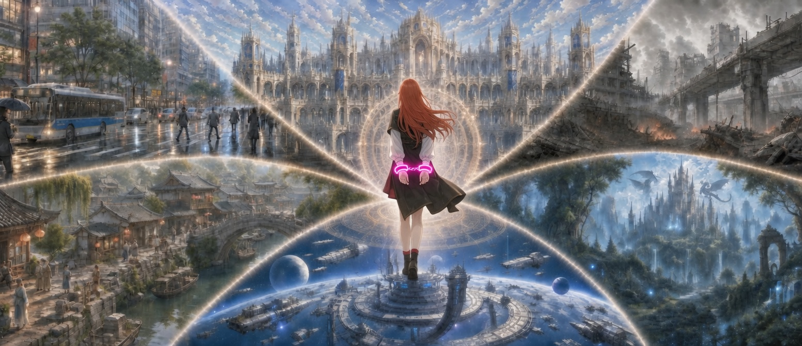

**公开入口**  
[项目愿景](docs/项目愿景.md) · [项目概览](docs/项目概览.md) · [世界图册](docs/readme/世界图册.md) · [生产体系](docs/readme/生产体系.md) · [可玩证据](docs/readme/可玩证据.md) · [协作参与与团队扩展路线](docs/协作参与与团队扩展路线.md)

> 一个角色，六大叙事域，多种正式形态，同一套持续生长的生产链。

## 这是什么项目

这里要做的，不是一次性 Demo，也不是只有工具外壳的文档工程，而是一套长期可维护的叙事生产体系：

- 同一故事可以先进入大纲、互动小说、副本、资料页，再进入地图章节与正式可玩段落。
- AI 负责检索、提案、治理、验证和资产沉淀，不负责替代真实证据。
- 所有“可玩、完成、已验证”的结论都要拿真实截图、代码现状或脚本统计说话。

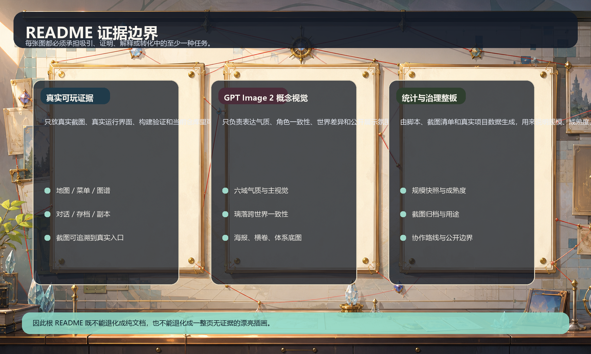

上面这张板不是“把概念图伪装成截图”，而是先把公开展示的边界说清楚：

- 真实可玩证据只放在后文证据板和截图归档里。
- GPT Image 2 视觉只负责世界气质、角色延展、协作方向和生产阶段表达。
- 统计、流程、规模与治理结论必须能回到仓库结构、脚本输出或真实界面。

<table>
<tr>
<td width="33.3%" valign="top">

<strong>同一故事，多种正式形态</strong> 
同一份故事来源可以进入地图章节、互动小说、副本、资料页和验证文档，而不是各做一套互不相认的内容。
</td>
<td width="33.3%" valign="top">
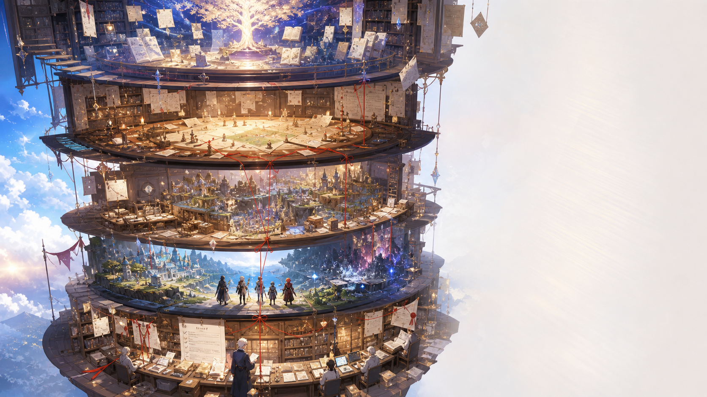
<strong>五层生产系统</strong> 
从来源、拆解、运行、验证到公开展示，项目希望把每一层都真正连起来，而不是只停在设定或海报。
</td>
<td width="33.3%" valign="top">
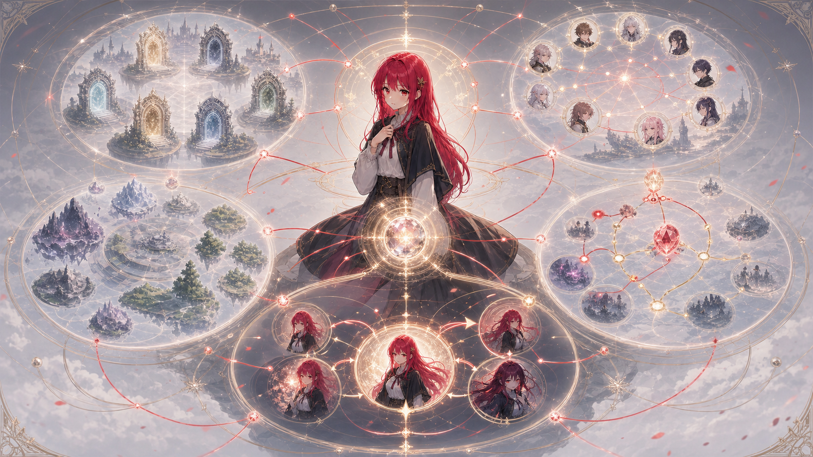
<strong>状态、事件与关系同图治理</strong> 
角色不是单张立绘，状态不是一次性文案，关系也不是孤立备注，而是同一宇宙中持续回流的运行结构。
</td>
</tr>
</table>

## 六大叙事域图册

以下图片全部是**GPT Image 2 概念艺术**，用于公开表达气质、故事压力和协作方向，不冒充游戏内截图。当前一级公开结构统一为：`慕妮卡帝国、浮光掠影、寂土挽歌、尘寰问道、咒缚回响、星宇织梦`。

### 慕妮卡帝国

综合型主世界，负责承接宫阙、城市、住宅区、仪式秩序与璃落最稳定的长期关系线。当前最高证据阶段：`outline`。

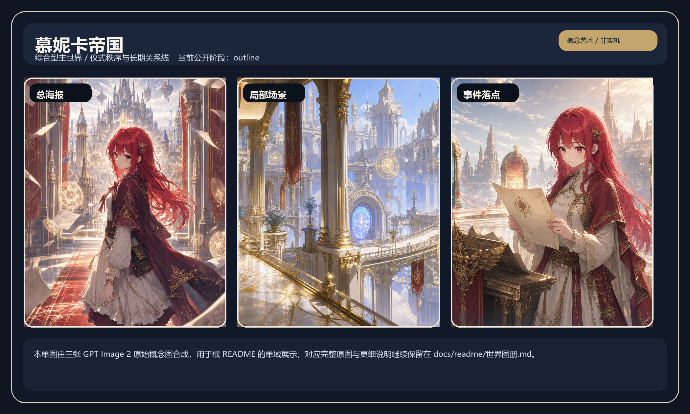

### 浮光掠影

都市异常、校园悬疑与港城夜雨并存的公开线，也是当前最接近“故事已开始向玩法转化”的叙事域。当前最高证据阶段：`skeleton`。

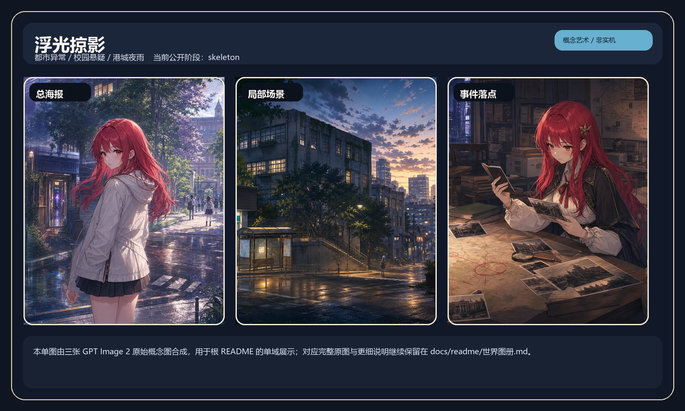

### 寂土挽歌

灾后废墟、撤离线、补给点与求生秩序构成的末日线。它强调生存、互助与重建，不把末日只画成猎奇苦难。当前最高证据阶段：`outline`。

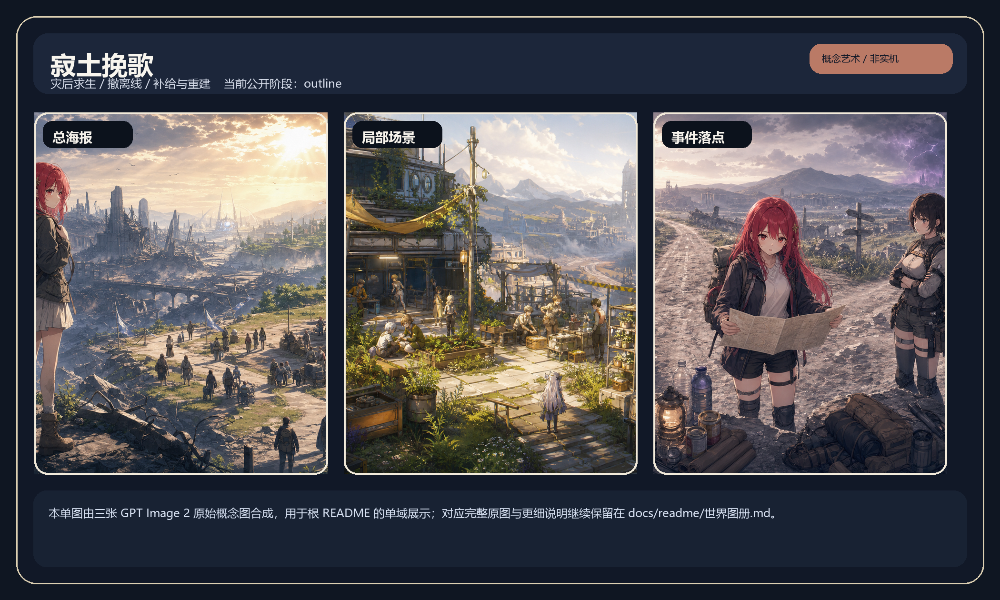

### 尘寰问道

古风旧案、礼法约束、山水异闻与因果抉择最浓的一支。它的优势是叙事味道强，缺口仍主要在地图与运行验证。当前最高证据阶段：`outline`。

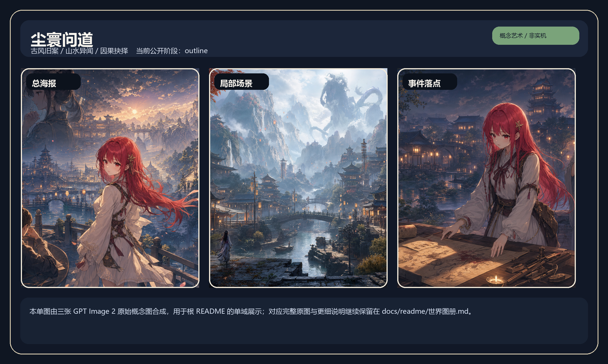

### 咒缚回响

学院、古堡、海路、誓约与高气质幻想视觉交缠的魔幻线，很适合继续吸引美术、UI 和叙事设计协作者。当前最高证据阶段：`outline`。

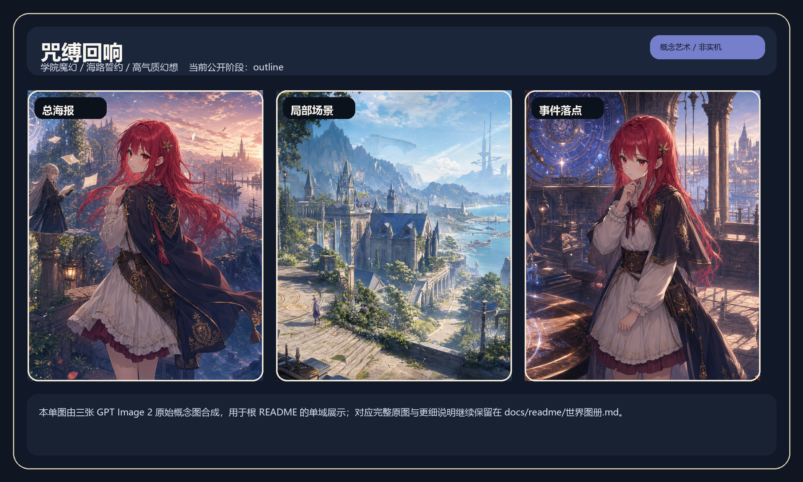

### 星宇织梦

轨道城、未来约束装置、殖民边疆与文明边界持续外推的科幻线，是六大叙事域里最接近中期制作设计的公开支脉。当前最高证据阶段：`productionDesign`。

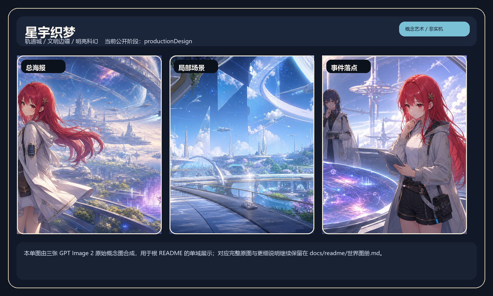

根 README 现在展示的是 `6` 张最终公开整板；它们背后对应的 `18` 张原始 GPT Image 2 分层概念图仍保留在 `docs/assets/readme/generated/`，供扩展页和后续复用继续使用。

更完整的世界分层、阶段和协作切口见 [世界图册](docs/readme/世界图册.md)。

## 六域并置总览

这张横卷继续强调一件事：六大叙事域不是六个互不相干的点子，而是同一个角色、同一套长期关系与同一条生产链，在不同世界压力下展开出的六种正式方向。

## 璃落：穿行诸界但始终是同一个人

璃落始终是同一个 `22` 岁成年女性角色：娇小、纤细、温柔、弱气、红发、红瞳，服装和发型可以随叙事域变化，但身份、气质和长期记忆不能散掉。

<table>
<tr>
<td width="36%" valign="top">

<strong>公开基准立绘</strong> 
这是 README 当前使用的稳定角色基准。
</td>
<td width="64%" valign="top">

<strong>不变身份 / 可变状态</strong> 
左侧强调核心身份、记忆与关系，右侧强调服装、状态、携带物和运行时变化。
</td>
</tr>
</table>

<table>
<tr>
<td width="16.6%" valign="top"></td>
<td width="16.6%" valign="top"></td>
<td width="16.6%" valign="top"></td>
<td width="16.6%" valign="top"></td>
<td width="16.6%" valign="top"></td>
<td width="16.6%" valign="top"></td>
</tr>
<tr>
<td align="center"><strong>慕妮卡帝国</strong></td>
<td align="center"><strong>浮光掠影</strong></td>
<td align="center"><strong>寂土挽歌</strong></td>
<td align="center"><strong>尘寰问道</strong></td>
<td align="center"><strong>咒缚回响</strong></td>
<td align="center"><strong>星宇织梦</strong></td>
</tr>
</table>

## 运行中的状态差分系统

这张图不是概念图，而是游戏内真实截图。它展示了当前项目已经具备的一个很有辨识度的运行层能力：同一角色可以在正式界面里切换、叠加和预览不同的紧缚状态差分组合，而不是只停留在文案描述。

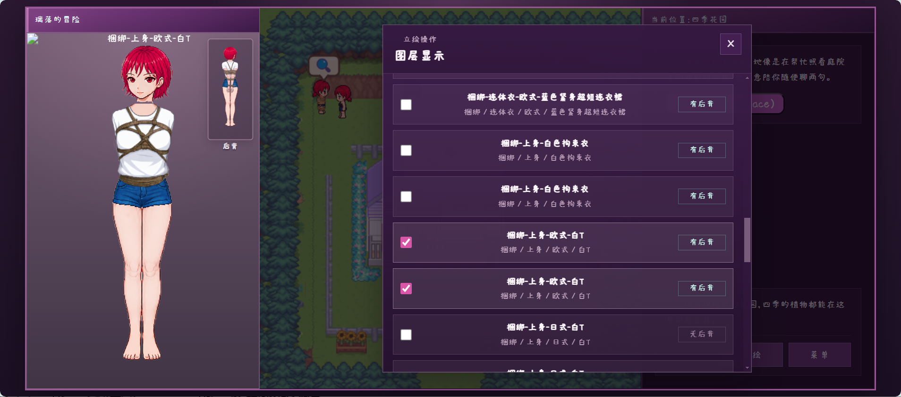

## 三十秒证明它真的存在

下面这部分只放**真实证据**。

- `2026-07-31` 已在当前仓库成功完成一次 `npm run build:web`。
- 当前旗舰运行入口是 `/#/game`，对应 [GameView.vue](src/game/views/GameView.vue)。
- 当前仓库内可确认到 `6` 个地图包、`1` 个正式互动小说副本、真实旅途菜单、关系图谱面板、存档槽位列表和地图对话运行结构。

这张证据板里的 `6` 格现在都已经换成真实运行截图：地图探索、旅途菜单、地图事件对话、存档面板、关系图谱面板和互动小说模式都已有公开实机证据。更完整的归档见 [截图清单](docs/assets/readme/screenshots/screenshot-inventory.md)。

## 同一故事如何进入正式形态

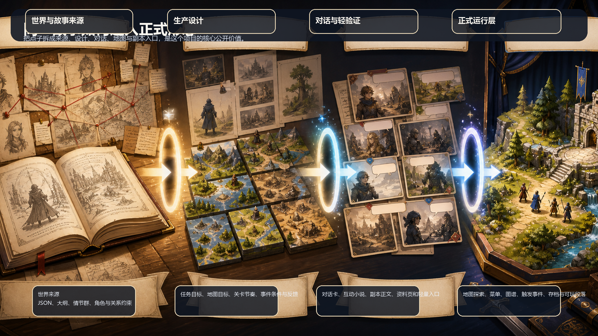

这条链路是项目最核心的公开价值之一：不是把同一个点子反复改名，而是让同一故事真正拥有从来源层到运行层的连续路径。

- 来源层：世界来源 JSON、故事大纲、情节库、角色与关系约束。
- 生产设计层：把故事拆成任务、地图、对话、事件、互动小说和资料页。
- 运行层：进入 Phaser 地图探索、菜单、图谱、对话、存档和副本入口。
- 验证层：构建检查、浏览器回归、路线验证、覆盖统计和 README 证据页。

其中当前最接近“从旧内容走到正式可玩形态”的真实链路，是互动小说副本 `十三号病院`：旧页面流程已经沉淀进 `src/game/data/interactive_fictions/asylum_for_lunatic/scenario.json`，并有功能文档、测试、正式运行入口和真实副本截图同时支撑。

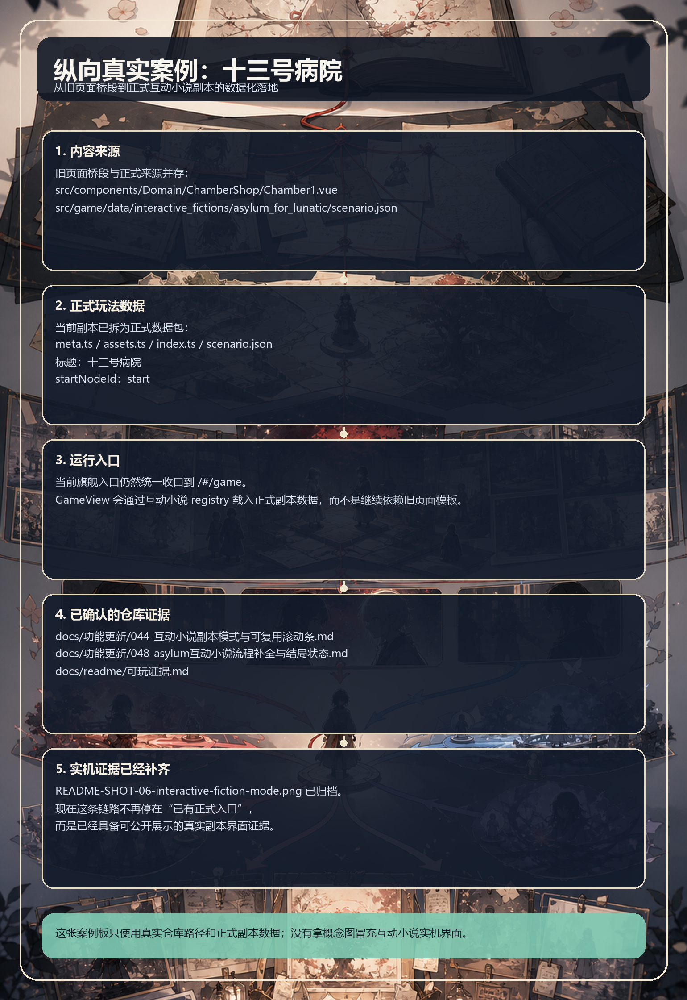

更完整的分层说明见 [生产体系](docs/readme/生产体系.md)。

## 生产体系不是一句口号

这张图表达的是项目最重要的一件事：同一宇宙里的故事、角色、地图、对话、验证和公开展示，不应该各自分裂成互不相认的孤岛。

同一角色跨世界出现时，真正要被维护的是身份、关系、记忆、状态变化和事件后果，而不是只换一张服装图。

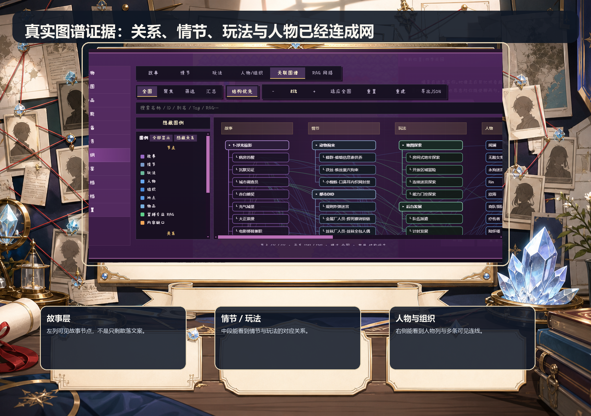

这里展示的是“关系图谱作为生产界面”的公开表达；真正已经存在的图谱运行证据，仍然以前文那张真实截图为准。

## 规模快照

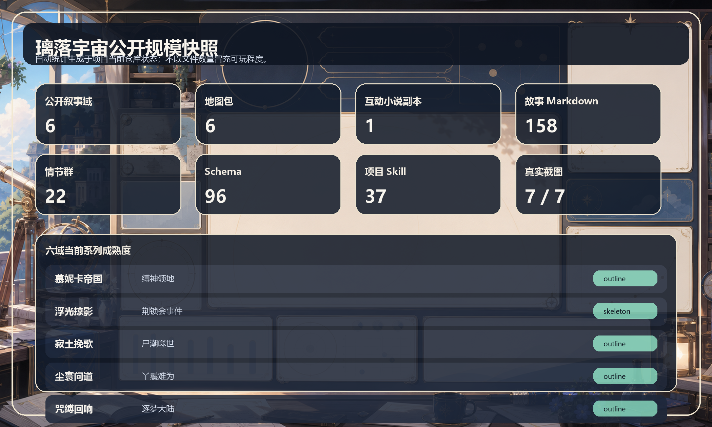

当前自动统计文件来自 [project-stats.json](docs/assets/readme/generated/project-stats.json)：

- 六大公开叙事域已固定。
- 大纲关系图当前共有 `616` 个节点、`1243` 条关系边。
- 当前可确认到 `158` 篇故事 Markdown、`22` 组情节群、`96` 个 Schema 文件、`37` 个项目专属 Skill。
- 当前已归档 `7` 张真实运行截图，但这些证据仍然只证明“部分核心系统已可公开展示”，不代表六世界已经全面可玩。

## 现在做到哪一层

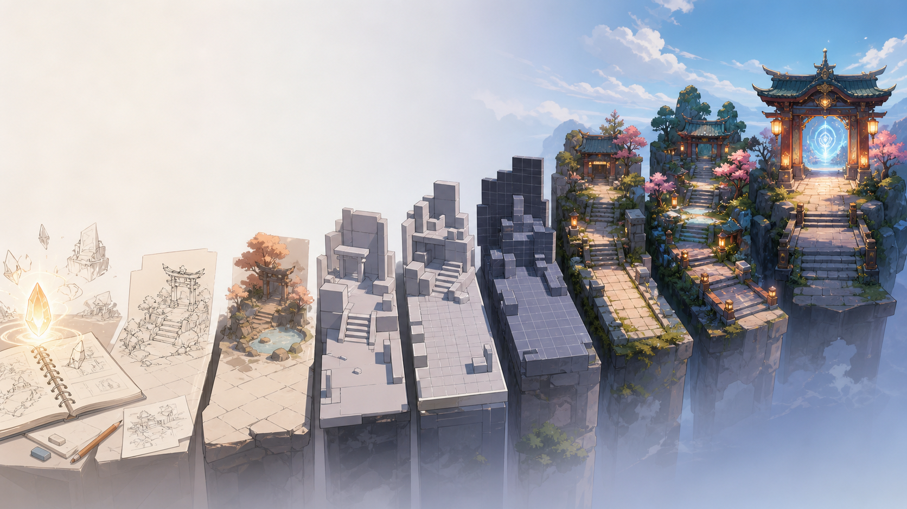

公开材料里最容易被误解的地方，就是“图很多”会不会等于“已经全做完”。这张阶梯板专门把阶段拆开：有些世界已经有大纲和世界视觉，有些支线已经能进入生产设计，有些功能已经有实机证据，但这三者不能混为一谈。

## AI 与人工怎么分工

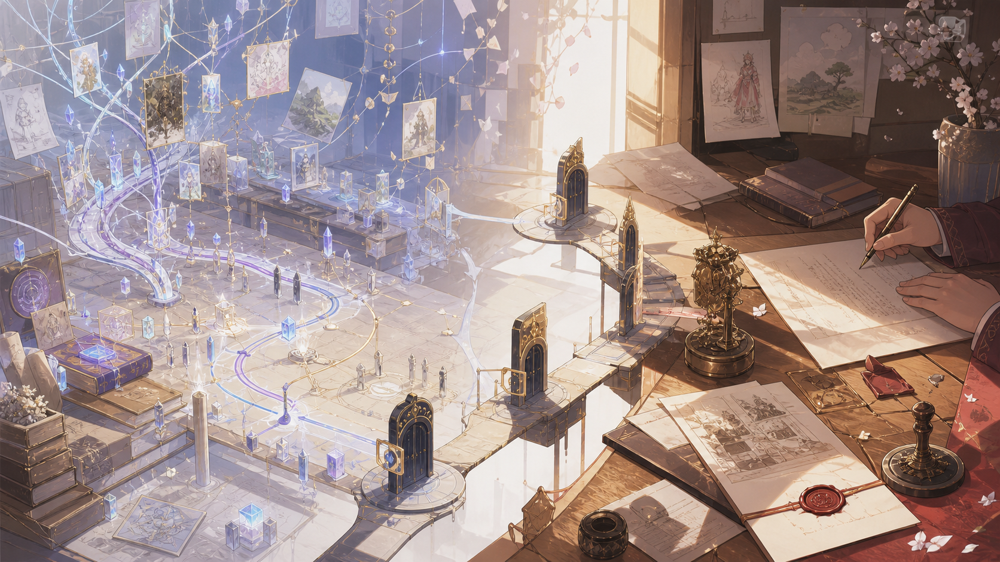

这个项目欢迎大量 AI 参与，但它不是把 canon、验证和完成结论外包给模型。AI 负责提案、整理、治理、检索和辅助生产，真正的正史确认、玩法落地和公开完成度判断仍然要回到仓库与实机证据。

## 合作者可以从哪一层接入

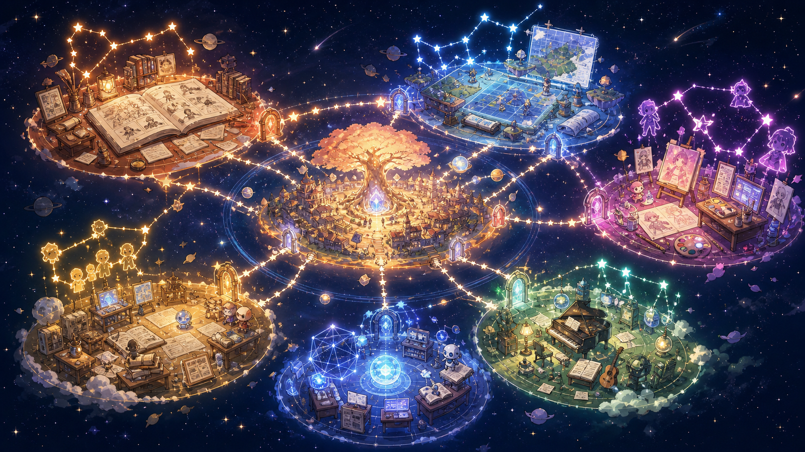

叙事、地图、玩法、视觉、UI、资料治理、验证和工具工作流都不是外围附属物，而是同一条生产链上的不同接力点。

路线图的核心不是“明年要再画多少张图”，而是把更多世界从概念层推进到生产设计层，再把真正可玩的段落继续推进到稳定可验证的公开入口。

## 协作入口

这个项目适合的不是“只丢一张图”或“只堆一份设定”，而是愿意进入同一套宇宙生产链继续往前推的人。

- 叙事设计：把已成形世界继续拆成真正可执行的章节、任务和支线。
- 地图与玩法：把生产设计转成 Phaser 地图、交互点、事件流和可探索循环。
- 视觉与 UI：围绕真实世界结构和真实玩法入口建立稳定风格，而不是做孤立海报。
- 工具与治理：继续补统计、验证、资料治理、RAG 和协作工作流。

如果你想看“适合从哪里接入、AI 和人工各自守什么边界、接下来一年最值得补的制作段落”，可以直接看 [协作参与与团队扩展路线](docs/协作参与与团队扩展路线.md)。

继续了解：

- [项目愿景](docs/项目愿景.md)
- [项目概览](docs/项目概览.md)
- [世界图册](docs/readme/世界图册.md)
- [生产体系](docs/readme/生产体系.md)
- [可玩证据](docs/readme/可玩证据.md)
- [协作参与与团队扩展路线](docs/协作参与与团队扩展路线.md)
- [README 视觉资产说明](docs/assets/readme/README.md)
- [视觉资产清单](docs/assets/readme/art-manifest.json)

## 内容说明与边界

- 正式登场角色均为成年人。
- 项目可能包含冒险、悬疑、灵异、末日、战斗等，并以拘束主题为主。
- 正式 canon、长期规则和世界事实仍以人工确认后的权威内容为准。
