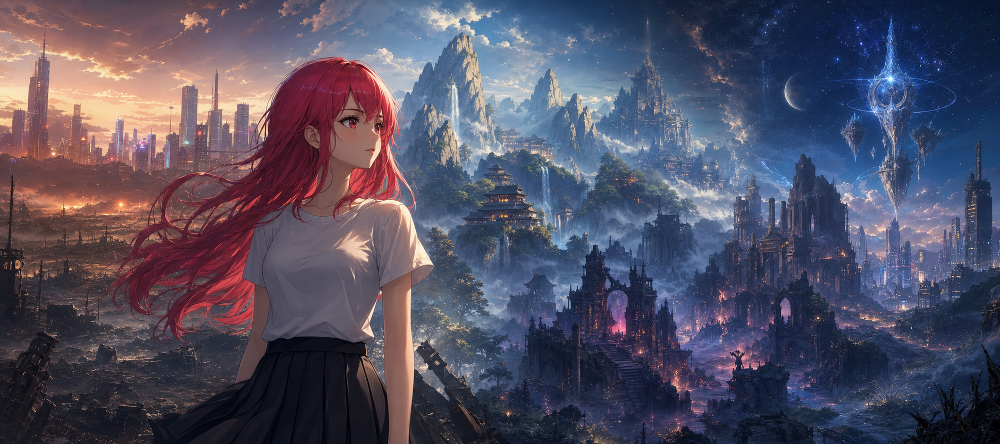
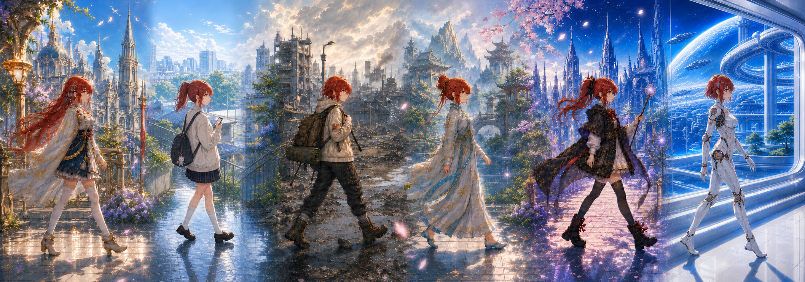
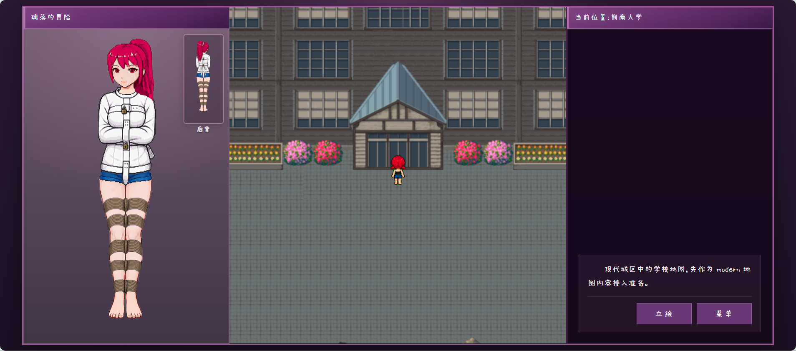
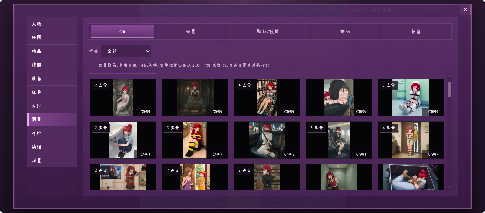
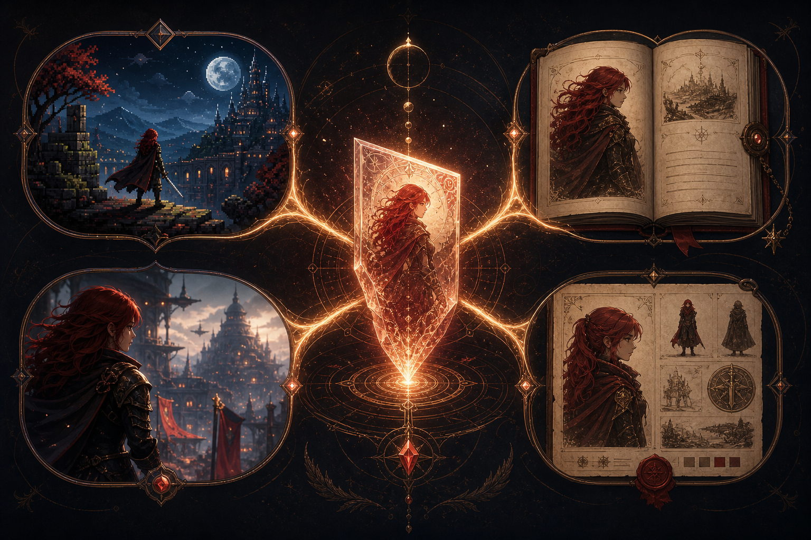
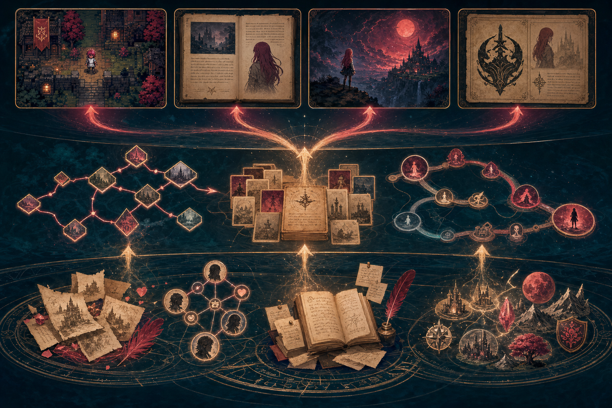

# 璃落的城堡 / Liluo Universe

这里是璃落宇宙的入口。六个气质截然不同的世界，在同一个故事核心之下彼此映照；璃落会从其中穿行，把一段段冒险真正带到你眼前。AI 帮助这个宇宙被长期整理、扩写，并最终做成可进入、可游玩的叙事游戏世界。



**快速进入**<br>
[项目愿景](docs/项目愿景.md) · [项目概览](docs/项目概览.md) · [文档入口](docs/README.md) · [AI原生叙事游戏生产体系](docs/系统说明/AI原生叙事游戏生产体系.md) · [协作参与与团队扩展路线](docs/协作参与与团队扩展路线.md)

## 为什么要做这个项目

我们通常并不缺灵感，缺的是一种能把它稳稳留下来的方法。
《璃落的城堡》想做的，不是一套把故事塞进功能页的壳，也不是写完就封存的短篇仓库，而是一座可以持续扩展的故事宇宙。这里的角色、关系、状态、地图、玩法和长期设定，不是彼此割裂的零散片段，而是要慢慢扣合，最后汇成一个真正能够进入、能够探索、也值得反复回来的世界。

AI 在这里不是代替作者的捷径，更像一套长期陪跑的方法：它帮助我们梳理世界、发现真正的空缺、连接故事与玩法、沉淀资产与规则，让同一个宇宙每一次被重新进入时，都不是从零开始。

## 六个世界，璃落的六段冒险



<table>
<tr>
<td width="33%" valign="top">

<strong>穆妮卡帝国</strong><br>
璃落会从宫阙、拱廊、仪典与城道之间走过。这里既有帝国的威仪，也有庞大文明沉进日常之后留下的秩序与华美，连发饰、衣褶与街巷尽头的回声，都像在提醒她，这片土地从来不只有一种面貌。
</td>
<td width="33%" valign="top">

<strong>浮光掠影</strong><br>
璃落会在雨夜霓虹、校园长街与港城灯火之间停步回望。这里看上去仍然像日常，可越是熟悉的街角，越像藏着另一层不该被轻易看见的现实；热闹没有消失，只是安静地把怪谈藏进了人群里。
</td>
<td width="33%" valign="top">

<strong>寂土挽歌</strong><br>
璃落会在废墟、补给站、撤离线与临时营地之间继续向前。这里不只讲毁灭，也讲秩序崩塌之后，人该怎样重新把“活下去”变成一件值得争取的事；风沙扑面，衣角狼狈，可人还是得站稳。
</td>
</tr>
<tr>
<td width="33%" valign="top">

<strong>尘寰问道</strong><br>
璃落会走进街巷灯火、山水异闻与旧案疑云层层交叠的地方。这里有烟火气，也有礼法与因果压下来的凉意；檐下灯色温润，风里却常常藏着一分不动声色的锋利。
</td>
<td width="33%" valign="top">

<strong>咒缚回响</strong><br>
璃落会从古堡、学院、海路与森林一路走进契约魔法的深处。这里的空气总带着一点华丽而危险的甜意，远征、试炼、誓约与代价彼此缠绕，让每一次迈步都像踩在会回响的咒语上。
</td>
<td width="33%" valign="top">

<strong>星宇织梦</strong><br>
璃落会在轨道环城、远航方舟与异星聚落之间仰望更远的边疆。这里讲的不只是技术跃迁，也讲身份、意识与文明边界会怎样被重新改写；金属、白光与精密纹理之下，未来并不冰冷，只是比想象更辽阔。
</td>
</tr>
</table>

## 当前已经能看到的真实原型

下面两张是项目当前运行中的真实界面截图。

<table>
<tr>
<td width="50%" valign="top">

<strong>地图探索与三栏界面原型</strong><br>
已经能在真实地图中移动、探索、触发事件，并通过左侧人物栏与右侧信息栏承载状态和叙事入口。
</td>
<td width="50%" valign="top">

<strong>图鉴、菜单与长期资料承载原型</strong><br>
图鉴、物品、技能、任务和故事资料已经进入统一菜单体系，开始承担“世界记忆”和长期状态管理。
</td>
</tr>
</table>

## 同一个故事，可以进入多种正式形态



同一个故事不必一开始就抵达最终版本。它可以先是互动小说；然后变成带立绘和场景的视觉叙事；再进入像素地图、事件、NPC 和状态流转；最后进入真正可游玩的完整章节。

## AI 如何参与这个宇宙



AI 在这里承担的，是让复杂世界能够被长期维护、持续生产和反复调用的工作，而不是抢走世界本身。

- 它帮助管理多世界故事、角色关系与长期状态。
- 它帮助发现剧情和玩法的真实缺口，而不是无边无际地堆点子。
- 它帮助把同一个故事拆成多种正式输出路径，同时保留来源与约束。
- 它帮助把文档、Schema、索引、素材和工作流收束成可复用的方法。

## 当前已经具备了什么

- 可运行的 `Vue 3 + Vite + Phaser + Pinia` 像素 RPG 基底。
- 地图、事件、对话、状态流转与存档的持续化基础设施。
- 六大世界的大纲、情节库、玩法目录与长期治理文档。
- 可落成互动小说、视觉叙事与地图章节的多形态生产路线。
- 供长期协作使用的技能、工作流、索引、规则和审计体系。

## 这个世界以后还能和谁一起继续做下去

它以后不只需要程序，也需要会讲故事、会搭玩法、会做像素、会做界面、会配乐、会整理知识和会把流程跑顺的人。
不同方向的工作不是各自往仓库里堆素材，而是进入同一套故事与玩法体系，继续增强已经存在的宇宙。

- 世界观与叙事设计
- 地图、任务、事件与玩法设计
- 像素角色、场景、CG 与 UI 视觉
- 音乐、音效与氛围设计
- Vue / Phaser / 工具链开发
- AI / RAG / 自动化与工作流建设
- 测试、本地化、文档与资料治理

协作入口与长期边界见 [协作参与与团队扩展路线](docs/协作参与与团队扩展路线.md)。

## 继续了解这个项目

- [项目愿景](docs/项目愿景.md)
- [项目概览](docs/项目概览.md)
- [文档入口](docs/README.md)
- [AI原生叙事游戏生产体系](docs/系统说明/AI原生叙事游戏生产体系.md)
- [系统说明](docs/系统说明/README.md)
- [用户命令目录](docs/用户命令目录.md)
- [协作参与与团队扩展路线](docs/协作参与与团队扩展路线.md)
- [项目知识索引](project-index/INDEX.md)

<details>
<summary>开发与检查命令</summary>

```powershell
npm install
npm run dev
npm run build:web
npm run build:offline
npm run package:offline
npm run docs:check-encoding
npm run docs:governance:audit
npm run project:index:changed
npm run project:index:validate
```

</details>

## 内容说明与边界

- 正式登场角色均为成年人。
- 项目可能包含冒险、悬疑、灵异、末日、战斗等，并以拘束主题为主。
- 正式 canon、长期规则和世界事实仍以人工确认后的权威内容为准。
