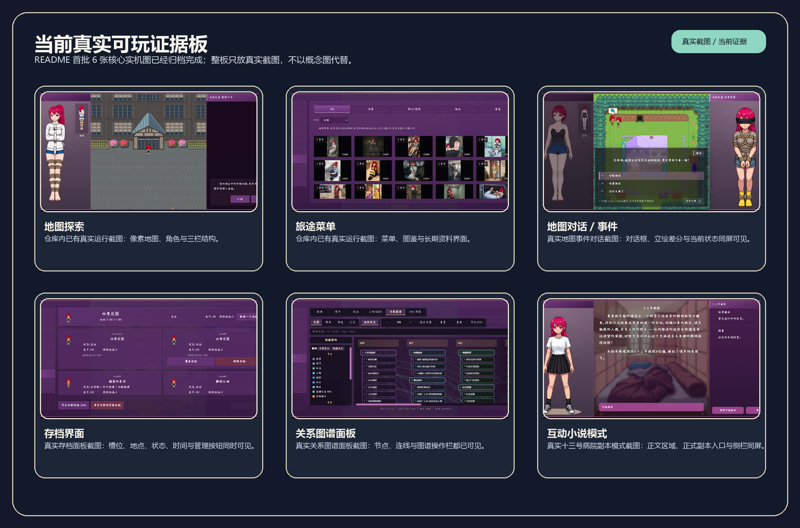

# 璃落宇宙可玩证据

这份页面专门用来把“已经能玩到什么”和“还不能宣称什么”分开说清楚。

## 已确认的真实证据

### 1. Web 构建已通过

- 验证日期：`2026-07-31`
- 验证命令：`npm run build:web`
- 结果：成功产出当前 Web 构建。

这说明至少当前仓库能完成一次正式前端构建，不是停留在不可运行的纯文档状态。

### 2. 当前旗舰入口存在

- 路由入口：`/#/game`
- Vue 页面：`src/game/views/GameView.vue`
- 路由定义：`src/router/index.js`

这不是旧页面遗留的静态说明，而是当前 Phaser 游戏运行入口。

### 3. 真实运行截图已在仓库中存在

- `docs/assets/readme/prototype-campus-map.png`
  - 展示地图探索、像素场景和三栏结构。
- `docs/assets/readme/prototype-gallery-ui.png`
  - 展示旅途菜单、图鉴与长期资料承载界面。

这两张图都被当作真实截图使用，不被混写成概念海报。现在又补回了 `4` 张原本缺失的核心截图，以及 `1` 张额外的状态差分特色实机图。

证据板现在已经被 `6` 张真实运行截图填满，覆盖地图探索、旅途菜单、地图事件对话、存档界面、关系图谱面板与互动小说模式。

### 4. 当前代码可确认的运行能力

- 地图探索模式：`src/game/views/modes/map/MapMode.vue`
- 旅途菜单：`src/game/views/components/base/GameMenuOverlay.vue`
- 关系图谱面板：`src/game/views/components/base/RelationGraphPanel.vue`
- 存档槽位列表：`src/game/views/components/base/SaveSlotList.vue`
- 互动小说数据：`src/game/data/interactive_fictions/asylum_for_lunatic/scenario.json`

这些文件不能单独证明“整个项目已完成”，但足以证明当前不是只有世界观介绍。

## 仍然不能拔高的地方

- 六大世界不是都已经做成可玩章节。
- 现有概念图不能代表六大世界都已有游戏内画面。
- 生产设计、骨架化和真实可玩之间仍然存在很长的实现距离。
- 现阶段最强的真实可玩证据，仍然集中在已接入地图、旅途菜单和互动小说入口附近。

## 已归档的补回截图

本轮已经补回并归档到 [截图清单](../assets/readme/screenshots/screenshot-inventory.md) 的截图有：

- `README-SHOT-03-dialogue-and-map-event.png`
- `README-SHOT-04-save-load-panel.png`
- `README-SHOT-05-relation-graph-panel.png`
- `README-SHOT-06-interactive-fiction-mode.png`
- `README-SHOT-07-restraint-state-combinations.png`

其中 `README-SHOT-06-interactive-fiction-mode.png` 已经补上当前“十三号病院”互动小说副本链路板的真实运行证据，`README-SHOT-07-restraint-state-combinations.png` 则额外展示了可切换的紧缚状态差分组合面板。
