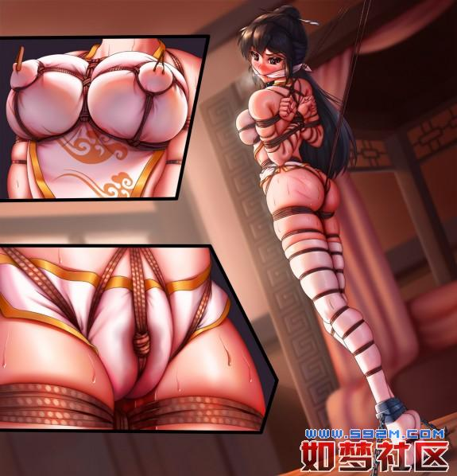

# 雪剑门之变

#### （一）天狼下中原 初寻探虚实

黄昏时分，李长天抵达四方客栈时，距他收到苏雪霏的信刚好过去十天。  
苏雪霏是雪剑门主苏雷的独女，也是自己的儿时玩伴，童年时便互有好感，但二人身份悬殊，自少时分别后便天各一方相隔千里，已九年未再得见。如果不是这次的来信，李长天完全不会想到，有朝一日二人还能再生交集。  
信上说雪剑门内暗流涌动，苏雪霏担心近期会生变故，遂暗自求助于有交情的各大门派，万一雪剑门出事，希望武林同道们能够匡扶正义主持公道。  
地处北疆的天狼谷也收到了求救信，李长天是天狼谷年轻一代中最杰出的弟子，谷主又知道他与苏家大小姐的儿时情缘，便将信转交于他，并准许他出谷前往中原。  
李长天一见信，马上便明白此事非同小可。他从小就知道苏雪霏冰雪聪明，更听说近年来她一直是父亲的得力智囊。既然她有了如此判断，那雪剑门内的局势恐怕已经危如累卵。  
从中原到北疆路途遥远，这封信从发出到送抵天狼谷，不知又过去了多少天，在这段时间内，雪剑门那边会不会出什么事？苏雪霏又会不会有危险？一想到这里，李长天就心急如焚，恨不能马上生出翅膀飞到中原去。  
临走前，谷主把李长天叫去，给了他三句嘱托：保护好自己，抓住机会历练自己，不要做超出能力范围的事情。  
李长天将师傅的嘱托谨记于心，随后便辞了众人出谷，快马加鞭日夜兼程，终于在十日后到达距寒梅岭——雪剑门所在地最近的四方客栈。  
他之所以选择在这里投宿，也是为了方便打探消息，毕竟自己远离中原近十年，一切都已变得十分陌生。  
工夫不负有心人，转眼两日过去，四处打探消息的李长天总算有了些收获，那就是关于雪剑门的情报。  
在门主苏雷的领导下，如今的雪剑门俨然已是中原武林第一大派，群英荟萃，高手如云，门下弟子众多。但随着雪剑门威名日盛，内部却不再安定，以副门主袁超为首的—干元老自恃功高，对于权力的渴望也是水涨船高，在雪剑门不断扩张的同时，这些人也在暗中收罗党羽，培养亲信。门主苏雷对此并非一无所知，但并未进行干涉一一江湖上所有人都知道他极重义气，对兄弟更是无比信任，这样的人格魅力正是雪剑门迅速发展壮大的原因之一。  
听完消息的李长天不禁感叹：苏雷无疑是个好大哥、好领袖，可惜不擅权谋。关于门内元老收罗党羽一事，苏雪霏必是提示过父亲的，但苏雷仍然选择不加干涉，这在李长天看来是非常危险的。  
要知道，如今雪剑门已执中原武林之牛耳，与十年前初创时不可同日而语。人心都是会变的，特别是当共同奋斗的目标已经达成后，利益的划分最易勾超人心底的欲望，这也是历史上诸多杀戮和血光之灾的根源所在  
苏雷选择相信兄弟，当然也不是毫无倚仗，光是他那一身天下无匹的功夫就足以令任何怀有异心者退避三舍。然而江湖传言，三个月前苏雷中了—种奇毒，难以医痊，导致身体状况每况愈下，近日更是病重卧床不能理事，大小事务均由副门主袁超全权代理。  
将这些打探到的消息集中到—起后，李长天心中顿觉不妙。苏雪霏在信上说雪剑门内暗流涌动，必定是察觉到了明显的问题。如果传言属实，那么苏雷已经无法单凭一己之力保护自己和家人。一旦门内突生事端，恐怕……  
李长天虽然直觉不妙，但这毕竟只是他基于传言的推测，并末取得实际证据。他当然也希望刚才那只是自己的猜想，毕竟苏雪霏已经暗自求助于有交情的各大门派，而根据这两天打探到的消息，中原武林风平浪静，雪剑门似乎也一切正常。  
看来还是需要继续探查消息才行啊……有必要去雪剑门走一趟了。这样想着的李长天躺在客房的床上，进入了梦乡。

#### （二）春闺锁佳人 恶手摧玉身

清晨，雪剑门，凌霜阁。  
自雪剑门移至寒梅岭后，这里一直是门主家眷的居所。如今，凌霜阁外始终立着十几个身材魁梧的内院弟子，不分昼夜地守着这座三层小楼。按理说，位于雪剑门中心区域的凌霜阁应该是绝对安全的，如此森严的防御完全没有必要。  
“踏……踏……”稳健的脚步声渐渐趋近。看清来者面目后，守卫于此的内院弟子们不约而同地面向前方深深一礼。  
“开门。”男人声如洪钟。  
“是，代门主。”弟子们异口同声，旋即打开了锁住大门的铜锁和粗铁链。  
原来这位中年男人就是雪剑门如今的代门主，曾经的副门主袁超。门主苏雷病重卧床不能理事，大小事务由袁超全权代为处理，现在门内众人皆已知晓。  
可是，他一大早来凌霜阁做什么呢？  
袁超负手前行，步履轻便，踏出的每一步却极其沉稳有力，很快便走上三层，人停在两扇雕栏华美的门外。这一层总共只有三间屋子，透过另外两间打开的门扉，可知尽是女子闺房。唯有面前这一间，房门紧闭不说，外面还上了一道大锁。  
莫非，屋里藏着什么珍贵至极的东西？  
袁超嘴角微扬，左手自衣袖内摸出一把精巧的铜质钥匙，“咔哒”一声打开了锁，推开紧闭的房门，一股女儿家闺房特有的香气扑鼻而来。  
深吸口气的袁超大步迈进屋内，紧接着向左转入内室，拉开布帘的他心跳陡然加速，眼前的场景简直令人无法移开目光。  
只见一位妙龄女郎周身只着肚兜、内裤和长袜，正踮着脚尖直立在屋中央，．她年纪大约十八九，容颜俏丽，肤若凝脂，不是苏雪霏又会是谁？  
“早上好啊，大小姐。“袁超笑着走近，端详着奋力支撑身体的美人儿。”这些日子过得还算舒适吧？“  
“晤！”苏雪霏双目喷火杏眼圆睁，如果目光可以杀人，被她紧瞪着的袁超不知要死上多少回。可是，她的樱桃小口却被柔软的织物牢牢封堵着，纵有满腔怒火，却完全无法透过口舌发泄出去。  
白色的布条勒在苏雪霏的皓齿之间，与塞入口中的罗袜共同压制住灵巧的香舌，这样的封口方式完全剥夺了她发声的权利。嘴里含着自己的袜子，即使是还没穿过的，也令养尊处优的苏家小姐感到极度的羞耻和恶心，但又无可奈何，因为她是被严密捆绑着的——不然，谁愿意以这样一种难受的姿势站在屋子里呢？  
苏雪霏脚尖点地支撑着身体的重量，紧绷的—双脚掌被绳索捆绑起来，从根本上限制住双脚的移动。用于捆绑的都是特制的麻绳，使用生长于寒梅岭的奇异植物制作，韧性极佳且性质温和，即使长时间捆绑肢体也不会造成坏死，最适合进行长期监禁，  
一具精钢镣铐死死锁住苏雪霏的纤细脚踝，两旁还延伸出锁链固定在地面上。若是对付普通人，这样的束缚已经足够了，但袁超知道苏雪霏腿功卓绝，所以对下肢的捆绑极其严密，毫不含糊。  
密密麻麻的麻绳将苏雪霏穿着白色长袜的修长美腿紧紧束缚在—起，从小腿肚到臀下的大腿，竟有多达九道捆绑，每道都至少绕上两圈绳子，并在中间纵向绕过加固。哪怕双腿再有力，但在大腿、小腿、膝盖上下部被有力拘束的情况下，也是无可奈何。  
如此密布的绳索将苏雪霏—双玉腿勒得凹凸有致，看上去有种别样的美丽，只有她自己知道这样的下肢拘束有多难受。  
但最难受的远不是腿脚的捆绑，因为下 体三角区同样绳索密布。除去勒在左右腹股沟的两道麻绳，中间还有三道麻绳隔着内裤狠狠勒在少女最敏感的秘密花园，正中一道还深深勒进两片娇嫩的花瓣之间，一个粗糙的绳结更是不偏不倚地压在花蕊部位，造成强烈的刺激。  
这样的股 绳使得苏雪霏不得不在大部分时间里被迫用力踮起脚尖，只有这样才能稍微舒缓下 体的强力刺激。但脚趾毕竟不是铁打的，时间一长，脚跟一旦被迫放下，股 绳立刻就会随之收紧，随之而来的就是如潮水般涌来的痛痒折磨，勒在唇间的麻绳和花蕊上的绳结会让她体会到什么叫“求生不得求死不能”。  
苏雪霏的上身遭受着严厉的五花大绑，纤细手腕交叉着被金丝皮绳牢牢捆在身后，小臂、大臂上都缠绕着密集的皮绳，将胳膊上的皮肉勒成一段又—段，看上去错落有致。任她功夫再好，也绝无可能挣脱这样严密的上肢捆绑，长达十几天的持续拘束甚至让她觉得这双手已经完全不属于自己了。  
胸部才是重点关照区域，一根又一根的麻绳缠绕在双 峰根部，隔着肚兜将两只发育良好的玉兔勒得极其突出。这还不算，还有多根麻绳自根部延伸出来，呈十字形向上直接勒在乳 肉上，把每只玉 乳生生分成五瓣——没错，是五非四，因为在十字形绳网的基础上，中心乳 晕区域还被别出心裁的绳环勒得愈加凸起，这才有了第五瓣的由来。  
在左右第五瓣乳 肉中央，少女最娇嫩的两只蓓蕾傲然挺立，两只小巧的竹夹牢固而残忍地夹住双乳 尖，无论苏雪霏如何挣扎，竹夹的存在都稳如泰山，持续的压力和麻痛让蓓蕾始终保持着挺拔的姿态。  
在苏雪霏腰腹部和肩颈部还分布着更多的绳子，上半身所有绳索都巧妙地联结在一起，然后向上延伸出两根绑绳固定在梁上。这样的拘束设置，不仅能将门主干金的娇躯牢牢限制在原地，还有别样的作用——只要她一放下脚跟，双 乳上的绳网势必愈加收紧，难受的可就不仅仅是下 身了。  
“大小姐，都半个月了，你还是不肯说出秘笈的所在吗？”袁超收起脸上的笑容，正色问道，“大好的青春年华，却每天被囚禁在这里，何苦呢？只要你肯说，就点点头，我马上给你松绑。”  
苏雪霏却只是鄙夷地瞪了袁超一眼，接着就扭过头去不再看他。袁超见状摇了摇头，脸上又挂上了玩味的笑容。  
“早就知道你不会屈服的，这倒正合我意。其实二弟一直建议定期给你喂软筋散，这样你就手无缚鸡之力，直接软禁在凌霜阁就好，也不用搞得这么麻烦。”袁超抚须道，“但我就是喜欢看你现在的样子，空有一身力却使不出来，只能每天这样站在自己的闺房里，口不能言，度日如年！”  
对袁超来说，眼前可真是一幅绝美的香艳图景，看得久了难免心动。他情不自禁地凑上前去，一边嗅着苏雪霏的发香，一边伸出手从后面攀上佳人那被绳网勒得突出的双 峰。  
“唔嗯……”苏雪霏上身只有一件肚兜，保护性几乎为零，女儿家敏感的胸 部本就勒得难受，现在又攥在一双粗糙的大手中，被揉 捏成各种形状，既痛苦又羞耻，两颊绯红的她不得不接受自己只能任人鱼肉的事实。  
袁超觉得还不够尽兴，又将手朝下探去，摸向女子最隐秘的地方，在股 绳边缘不断抠弄。硬邦邦的触感提醒着他，这女子下 身的所有洞穴都已经被桃木棒封堵得严严实实。  
自门内生变那日起，苏雪霏就被秘密监禁在凌霜阁，此事只有包括袁超在内的极少数人知晓，对外的说法则是大小姐外出执行秘密任务未归。  
在十几天的囚禁生活中，苏雪霏作为人的—切权利都被强行剥夺，就连如厕这样的生理需求都无法自行解决，因为她的下面被人堵了个严实——在层层束缚的内裤之下，菊 门和尿 道分别被—粗—细的桃木棒强行插入，然后由股 绳勒紧固定，排 泄道的娇嫩内壁紧紧箍住木棒，连一滴液体也休想漏出。  
除去异物带来的胀痛感，便意的持续折磨才是最难受的。每天早晚会有一位老妪进来喂食喂水，也只有在这时，苏雪霏才能得到最基本的解放。除此之外，整个白天和漫漫长夜，无论腹中如何充盈，她能做的也仅仅是徒劳地在原地扭动挣扎！  
每当她挣扎的时候，都会牵动全身绳索发出“沙沙”声，这在袁超听来颇为悦耳，配合上少女的喘息和哼叫，不啻于天籁之音。  
袁超享受地抚摩着苏雪霏微微鼓胀的小腹，稍一用劲，便引来佳人动人心魄的一声娇叫。一双大手再向下游走，隔着内裤和绳网使劲掏弄起来。苏雪霏的蜜 穴本就被股绳的绳结持续刺激，再被袁超这么一掏弄，直惹得她呼吸急促，娇喘连连。  
然而袁超却突然停了手，—边冷笑—边欣赏着绳捆索绑的门主千金从亢奋中失落的样子。苏雪霏也明白了他的用意，冷哼一声，随即定心凝神，压制住来自下方的燥热。  
但就在她基本恢复平静时，袁超却再—次开始了：蹂 躏，凌 辱，再突然停手，—切都和刚才一样，如此反复，苏雪霏被折腾得香汗淋漓，心中叫苦不迭，却因为全身被捆了个结实，只能默默忍受这一切。  
玩了约半个时辰，袁超才依依不舍地离开了屋子。“没关系，大小姐，我们有的是时间，我也有的是办法能让你开口。“说罢，他走出内室，重新拉上布帘，再将屋门重新紧闭锁好，徒留苏雪霏继续新一天的囚徒生活。  
这里对苏雪霏来说是炼狱，对他而言则是天堂。袁超追随苏雷已久，苏家千金几乎是他看着长大的，从小就是个美人胚子，更有一种远观不可亵玩的清冷气质。他很早就打定主意，有朝一日一定要将她狠狠地蹂 躏一番。  
如今，他的愿望已经实现了。  
袁超走出凌霜阁时，恰逢老妪前来给苏雪霏喂食水。他眼珠一转，走上前去拦下了她：“大小姐今早没有胃口，不用去了。”老妪还想再说什么，被代门主眼神所慑，只得低头允诺乖乖离去。  
袁超望向凌霜阁三层，想象着苏雪霏绝望挣扎的美态，欲 火又在丹田熊熊燃起。    “今天还有要紧事情，还是闲时再来细细品玩吧……”他强压下心头邪念，甩甩袖子大步走远。

​​

#### （三）得缘询机情 床缚燕拷虐

李长天整晚都睡得不踏实。事实上，自打重回中原以来，他总有种莫名的心悸——这很大程度上来源于对苏雪霏的担心。  
虽然已九年未见，但她在自己心中依旧拥有不可替代的地位。两小无猜的童年相伴，早已使她成为自己妹妹般的存在。这份无限近似于亲情的羁绊，始终被李长天珍藏在心底。  
身为雪剑门门主智囊的苏雪霏发出求救信，本身就已能说明事情的严重性，起码不会是空穴来风。可目前雪剑门—切如常，那么就有两种可能——要么是真的没事，要么就是已经出事但被封锁了消息。  
如果是后一种情况，那么苏雪霏恐怕已身陷危险之中；即便是前一种情况，也需要尽快与她取得联络才是。  
打定主意的李长天—大早便起床动身，离了四方客栈前往雪剑门。  
寒梅岭终年积雪，乃中原极寒之地，扎根于此的雪剑门也曾名不见经传，但《傲雪诀》的霸道无匹和苏雷本人的才干魅力，终于使它威震天下，成为当今中原武林无可争议的第一大派。  
当李长天站在山门前时，不禁由衷地发出感慨：九年了，一切都还是没变。雪剑门的外部施设—如从前，如今看来与其地位极不相称，但这正体现着门主的追求——摒弃不必要的排场，专注精研武学和匡扶正义。  
“麻烦小哥通报一下，我想进山见一个人。”李长天对守山弟子拱手道，  
“你是何人？要见哪位？”对方的询问仿佛不带一丝感情色彩，  
“在下李长天，是苏家小姐的旧友，本次前来便是与小姐一叙。”  
“……大小姐外出未归，请回吧。“  
“没关系，我可以在这里等……“  
“大小姐亲赴外地，归期未定，李公子还是先回吧。”  
话已至此，多说无益，李长天略—抱拳转身离开，心中却犯嘀咕：方才对话时，自己一直暗暗留意守山弟子的神态变化，当说到要找苏家小姐时，对方瞳孔明显收缩，虽然只是一闪而逝，却足以被捕捉到，而此后的言语中也似乎多了些警戒之意。  
若仅是例行答问，无论怎么看，以上情形都本不该出现才对，这里面很可能有鬼。  
同样值得怀疑的是“大小姐外出未归”的回复。按苏雪霏信上所言，雪剑门内已经暗流涌动，以她的性格和头脑，此时本应坐镇门内辅佐父亲，断断不应独自外出才对。更何况若传言属实，苏雷中毒卧床不能理事，素来孝顺的苏雪霏怎可能不在门内照顾父亲？  
左思右想之下，李长天极不情愿地得出了—个初步结论：苏雪霏的处境恐怕已经不妙，如果她只是被剥夺了自由，那已经是最好的结果……  
而当他控制不住地想到最坏的结果时，才发现这位“妹妹”对于自己来说，可能远比想象中更加重要。  
所以，哪怕只有一丁点的可能性，自己也不会放弃追寻的脚步。  
对李长天采说，当下顶顶重要的事情，就是情报。自己久居塞外初来乍到，对当代江湖纷争不熟悉倒是其次，对如今雪剑门认识的缺失才是最大问题。  
雪剑门是—切的核心，只有弄清楚它平常应该是什么样子，再弄清楚它现在是什么样子，才能从变化中找出事情的关键，进而确定自己下—步的行动方略。  
李长天一向头脑清晰，梳理出这些头绪后，连客栈也不回，便直奔数里之外的龙平镇，只因据传镇上有个姓王的“包打听”。可惜天不遂人愿，除了打听到这家伙神龙见首不见尾以外，整个白天一无所获，连对方的住处都没能摸到。  
回到四方客栈时天色已晚，饥肠辘辘的李长天正欲进门，却因身后传来的苍老声音停下了脚步。“少侠请留步。”  
李长天回头打量着对方，这人自己似乎从未见过，但不知怎的，总觉得他身上有种莫名的亲切感。  
“请问阁下是？”  
“听说你找了我一整天，我就自己来找你了。“老者笑吟吟道。  
“啊！原来您就是王老……”李长天又惊又喜，“包打听”竟然主动来找自己，今天没有什么比这更令人开心的事情了。  
“进去说吧，”老者做了个手势，引着李长天走进四方客栈，仿佛他才是这里的主人。  
李长天应了一声，随后跟了进去，带上了门。  
是夜，二人对酒畅谈直至子时。席间，李长天详细地打听了这九年间雪剑门以及整个江湖的风风雨雨，而王姓老者知无不言，言无不尽。  
临分别时，受益良多的李长天委婉地问起此次情报服务作价几何，却见老者连连摆手：“少侠来意，我一早已知。今日桌上所言，皆为天下苍生，亦我心中所向。就此别过，望少侠周密行事，—朝功成，咱们有缘再见。”  
说罢，就见那王姓老者大笑三声，甩甩衣袖，大步踏去，转瞬之间，身形已消失在远处的夜色中。  
“这老伯，真乃神人。“李长天怔在原地，抬头望天，—轮新月恰从云层后探出，淡淡的月华为这黯淡夜空平添一丝亮色，  
“皆为天下苍生？他究竟是什么意思呢……”李长天心中还有谜团未解，但今天获取的信息，已经足够支撑他对下-步行动的规划了。  
“雪霏，等着我……”  
次日上午，寒梅岭。  
就在李长天开始奔走联络时，雪剑门内也并不太平。  
“开门，我要见门主！”凌霜阁外，一位通体黑衣的蒙面客被拦了下来。  
“代门主有要事在身……”守在门口的内院弟子沉声道。  
“混账，没有什么要事比我要禀报的事情更紧急了！让我进去！”来者不依不饶，声如洪钟。  
“让他上来。”凌霜阁楼上传来袁超慵懒的声音，那声音极具穿透力，似乎是使用了某种功法，否则也很难穿透这原本隔音的墙壁。  
“是。”有了代门主的亲口允许，内院弟子们这才让开一条路。只见那蒙面客健步如飞，三两步就蹿进阁内攀将上去。  
同一时间，三层苏雪霏的闺房内。  
屋内乍看空无一人，除去上好檀木所雕的桌椅，就数那掩映在帐幔后的床榻最是惹人注意。  
粉红色的帐幔紧闭着，即使身处这香气扑鼻的内室，也无法从外面得窥其后情景。阵阵女子嘤咛呻吟之声隐约传出，如有人此刻立于屋内，难免不会想入非非，暗自揣测床榻之上是何情何景？  
帐幔之后，疲惫不堪的苏雪霏就坐在自己的闺床之上，可她此刻不仅得不到任何休息，反而一刻不停地经历着屈辱和折磨！  
苏雪霏后背靠着男人的胸口，而将她囚禁于此的袁超就岔开双腿坐在她背后，—双不安分的大手在纤细的玉体周身四处游移，每每滑到女儿家的敏感部位，或细细亵玩，或发力掐弄，直搞得她痛苦不堪娇叫连连。  
袁超那散发着浓重口气的嘴巴也没闲着，伴随着手上动作的频率，在苏雪霏的香肩、玉颈、耳珠、秀发等处肆意亲吻吮吸，直把她弄得面红耳赤。  
苏雪霏全身上下还是绳捆索绑，就连手指都被细牛皮绳仔细地捆扎起来，纵使她既没被点穴道又未曾中毒，也不能从袁超的摧花辣手中逃脱，完全无法反抗他对自己身体进行的任何猥亵和侵犯动作，  
她的小嘴也没能重获言语上的自由，还是被布条紧紧勒住，外面又蒙上了一层厚布。即使身上再痛苦难受，也喊不出声、骂不出口，只能含糊地发出呻吟声——这种声音只会助长袁超的欲望罢了。  
两颊绯红的苏雪霏浑身香汗淋漓，她已经在床上被这样折腾了整整—夜。昨晚袁超进屋把她从捆吊的痛苦炼狱中解下，原本以为他是发了善心，没想到接下来发生的事情让她掉入了另—个求生不得求死不能的阿鼻地狱！  
苏雪霏在被囚禁的日子里受尽拷问折磨，臀部和双腿等部位更是饱受鞭打。袁超用的鞭子是特制的，运劲也颇为讲究，无论抽上多少鞭，也不会血肉橫飞，只是会在皮肉表面产生—道道长长的红肿鞭痕。  
可不能小瞧这样的鞭痕，每当袁超粗糙的大手抚摸到红肿之处时，苏雪霏都疼得浑身发抖。偏偏袁超还很喜欢这样“欣赏”自己的“成果”，刚刚过去的这一夜，他几乎摸遍了苏雪霏浑身上下每一道鞭痕。  
如果只是这样也便罢了，可袁超又怎会放过眼前觊觎已久的诱人女体？依旧被绳网勒成五瓣的玉乳，被封堵严实的下体，因长期捆吊而脱力的玉足……女孩全身的敏感部位，都逃不过再一次的残酷的蹂躏。  
意志坚定的苏雪霏，即使在这样的整夜折磨之下依然守口如瓶，直到蒙面客到来，都没有向袁超屈服。  
袁超自然知晓蒙面客的身份，更知他此番来报必有要事  
“大小姐，我还真是舍不得你呢。等我办完事情，再回来陪你好好玩。”袁超咧嘴一笑，伸了个懒腰，依依不舍地下了床，只留下被捆成粽子的苏雪霏对他怒目而视。  
目送袁超拉上帐幔走出房间，苏雪霏稍稍松了一口气。虽然全身上下还在隐隐作痛，但她终于获得了难得的喘息之机。

‍
