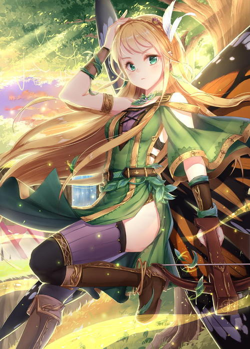
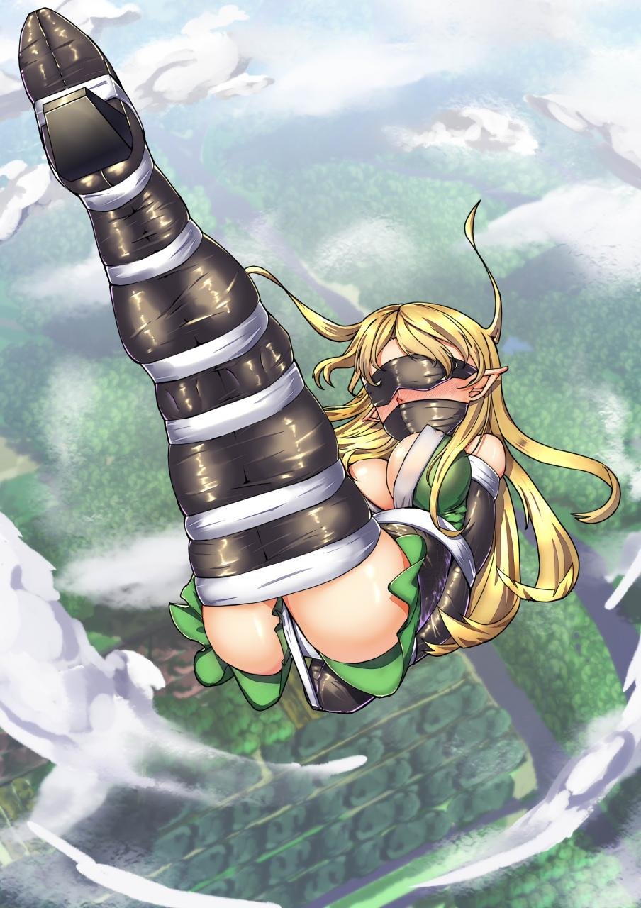
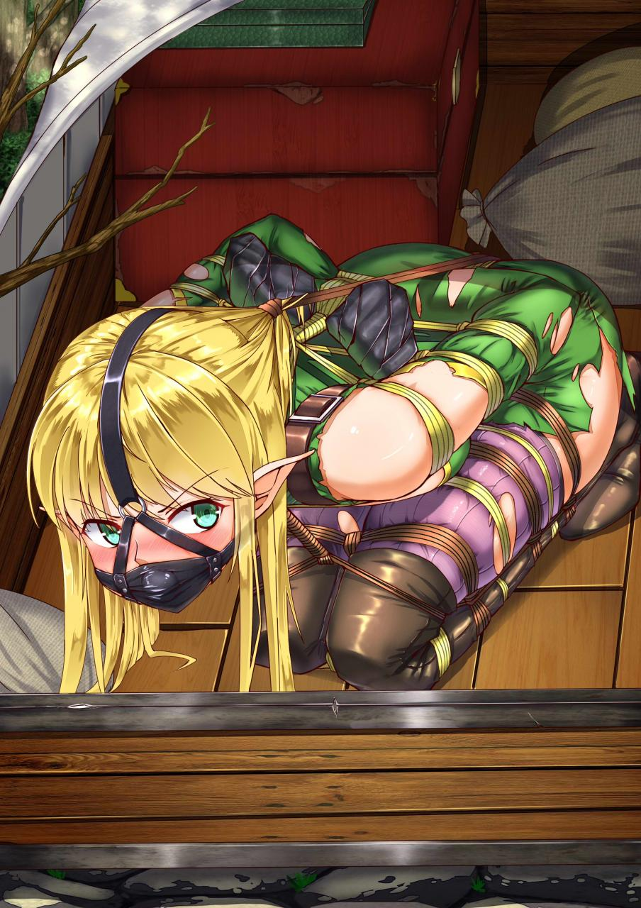
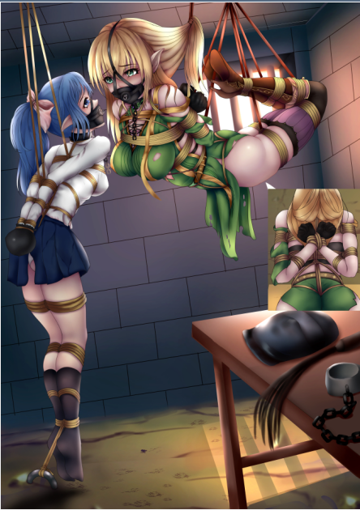
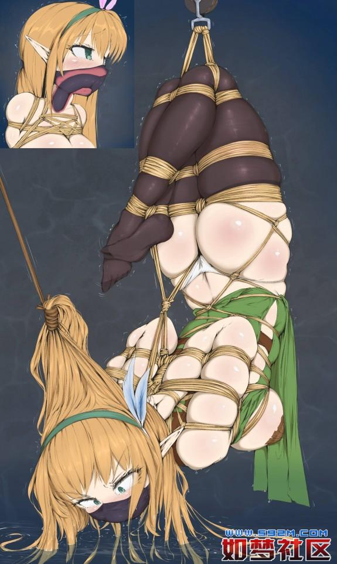
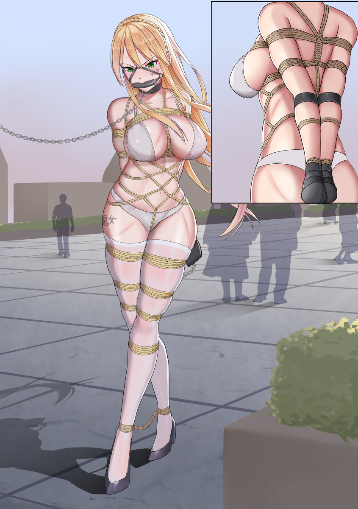
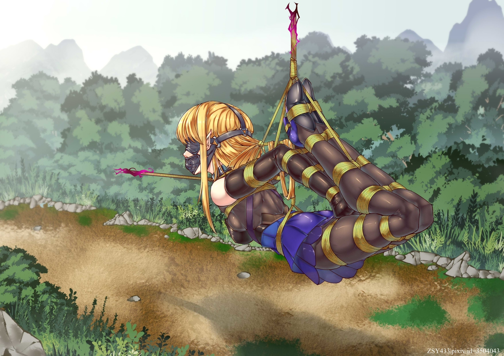

# 坠落女王

### 第一卷：奥斯的公主篇

#### 楔子

​​

天穹大陆，北部奥斯国，精灵世界树。  
上一任精灵女王在一周之前驾崩，她死前育有两女，大公主阿塔莉亚-羽风，从小作为接班人培养，对于精灵魔法有着天才般的学习能力，只不过似乎性子比较直，而且喜欢战斗技巧，对于政治上的手段并没有学到多少，但还是在母亲的强迫下，进行接班人学习。二公主奥菲兰忒-羽风，因为有姐姐在前面，所以从小就衣食无忧，也没有压力，全靠她自己的性子学习。外界传言，大公主为人正直，而二公主有些乖张任性，不过在女王的压力下，并没有表现的太过明显。  
此时已经入夜，在金碧辉煌的城堡中，阿塔莉亚放下了手中的书本，揉了揉额头。这些天母亲的后事与国家上下的事情全部落到了她的身上，让她头痛不已，已经好几天都没有睡好觉了，还好有一些大臣或者勋爵能帮她分担一些。  
不过，让阿塔莉亚头疼的不止这件事，她觉得母亲的死有蹊跷。  
在这古老的精灵世界树上，没有什么人能够对精灵女王造成威胁，除非对方能够先后突破世界树的自动防御，然后再潜入结尾森严的城堡，最后与最强的精灵女王战斗并获胜，这一切几乎只有通过战争才能办到，要通过一个人或者团体就想完成，实在是痴心妄想。而精灵女王的身上并没有明显的外伤，最终鉴定后，确认女王是寿命原因，并无其他可能。  
但是，阿塔莉亚并不这么觉得，母亲在一个月前状态都好好地，只是最近似乎有些心事，阿塔莉亚见到她时总是眉头紧锁，这在以往并不常见，但是问母亲的话，她又微笑着说没事，阿塔莉亚也就没再担心。这样的母亲一周前却突然驾崩，外人或许不清楚，但阿塔莉亚清楚的很，母亲的寿命还远没有走到尽头，作为大陆上独霸一方的精灵一族，身为纯血精灵的她们寿命是普通人类的两倍，活到二百来岁才有可能因为寿命死去，母亲应该还有几 年啊。  
只不过阿塔莉亚暂时没什么头绪，或者说她不敢有什么头绪，如果没有外敌入侵的痕迹，那就只能从内部......  
想到这里，阿塔莉亚摇了摇头，在她观察下来，精灵贵族们对女王都是忠心耿耿，怎么会有人暗藏异心？  
阿塔莉亚坐到床头，她身为纯血精灵，容貌可以说是倾国倾城。一头金色的长发如瀑布一样耀眼，一直倾撒到她的腰间，脑后精心编制了公主辫，一颗碧绿的如同树叶一样的头饰别在她的脑后，有些可爱。精致的小脸上，齐刘海遮住了她光洁的额头，其下秀眉纤细，眉宇间透露出一股英气。睫毛之下，一双杏眼中碧绿色的瞳孔如绿宝石一样，只是此时却有一股迷茫。粉唇水润，微微抿起，它的主人似乎在思考着什么。  
她修长的身段包裹在一件碧绿的罩衫中，肩膀上用一条短皮带将罩衫挂在她的身上，圆润的香肩露在外面。而在她的腰间有一根皮带环绕住她的柳腰，将罩衫拢住，凸显出了她凹凸有致的身材。丰满的胸部将布料撑起，胸口是一道深深的V字开口，两条系带在胸前交叉，将这个V字微微收拢，系带在她丰满胸部的支撑下仿佛快要崩开一样，颇具视觉冲击。而在V字之下，则是她雪白的北半球，和藏在罩衫下的紫色文胸。罩衫是无袖的，只在  
再往下，经过纤细的腰肢，罩衫的两侧在她的胯部开衩，下摆一前一后垂落下去，直到膝盖。从开衩处可以看到她圆润紧致的翘臀，那雪白的臀肉暴露在外面，随着她双腿的活动若隐若现， 分诱人。而一双修长美腿更是划着圆滑的弧线，从大腿一直落到脚尖。雪白晶莹的双腿此时正包裹在一双咖啡色的长筒袜中，长筒丝袜勒住了她的大腿中段，正面有罩衫的下摆挡住，而侧边则可以一窥那被勒的微微下陷的腿肉。  
修长而有致的身材，英姿飒爽的气质，大公主阿塔莉亚的美貌映刻在每一个见过她的人的心里。因为她酷爱箭术与精灵魔法，所以她非常喜欢这件罩衫， 分适合她奔跑战斗，她也经常穿着适合战斗的皮靴，只不过此时将要睡眠，她也就不再穿着鞋子了。  
阿塔莉亚坐到床边，拿起刚刚女仆送来的茶饮，刚要喝下去，却突然感到有些不对劲。这种不对劲来的莫名其妙，但就是深深地印在她的脑海里，一定有什么地方不对。她本能的看向手中的茶水，碧绿色的瞳孔中浮现一道魔法符文，这是精灵魔法中的“鹰眼”。那茶水在她的眼中慢慢变得透明，其中浮现着一颗颗白色小颗粒，不用鹰眼根本看不出来。  
阿塔莉亚倒吸一口冷气，这精灵王城，果然有内鬼！  
然而，还不待她有进一步行动，她就听到门外传来脚步声。接着她的门被一脚踢开，一名女精灵腰间佩剑，带领着一群士兵冲了进来。  
“你们干什么？！”阿塔莉亚喝道。  
女精灵面容肃穆，拿出一份文书一样的东西，大声念到：“奥斯国精灵大公主——阿塔莉亚，[手动滑稽]母后，通敌叛国，证据确凿，今暂时剥夺其公主身份，带回审查！”  
一股寒气从阿塔莉亚的脚底直冲脑门，这种时候，阿塔莉亚就是再傻，也知道发生了什么。[手动滑稽]母后之后，这群人开始针对自己了！  
“证据呢？”哪怕内心再怎么风浪滔天，阿塔莉亚表面也强装镇定，身为精灵大公主，这点心性还是有的。  
“跟我们回去，我们自然展现给你，到时候你会有争辩的机会。”女精灵拿出了一捆碧绿的绳索，说道。  
阿塔莉亚皱了皱眉，现在她不能反抗，一旦反抗，且不说她能不能打得过，起码袭击警卫队的罪名是有了，只能先讲讲道理，于是她说道：“我记得还没有审判罪名的精灵，不用用这种绳子吧。”  
“抱歉，您实力强悍，我们不得不保证安全。”女精灵面无表情道。  
阿塔莉亚犹豫了一下，只要被这绳子绑住，自己的魔法就完全失效，体术也大打折扣，到时候就是任人鱼肉。而且那文书......自己这段时间一直忙着处理骑士团那边的事，这文书是什么时候签的，谁签的？想到这里，她再次问道：“这文书，我要查看其合法性，谁签的？”  
女精灵嘴角一扬，似乎是在嘲讽，她将文书翻过来，展现在阿塔莉亚面前，只见在最下面一栏，赫然盖着即将属于自己的印章，而那名字，却是二公主——奥菲兰忒，她的妹妹！  
“这？！”阿塔莉亚如遭雷击，自己的亲妹妹，为什么要？！  
“跟我们走吧。”女精灵一挥手，两名士兵拿着碧绿的绳索，靠近阿塔莉亚，把还在发愣的她的双臂扭到背后，就要绑住她的手腕。  
就在这时，阿塔莉亚瞥到了女精灵腰间的一样东西，那是一个小药瓶，里面装着白色颗粒，此时她正好还在用鹰眼法术，否则还真看不到。  
“等等！”阿塔莉亚立刻喝道，然而士兵却不停手，反而用更快的速度绑住了她的手腕。阿塔莉亚知道，此时再不做决断，就没机会了！她银牙一咬，一股强悍的能量从她体内奔涌而出，震断绳索的同时，直接将两名士兵逼退！  
“你抗拒执法？！拿下！”女精灵看到失手，果断让后面的士兵冲上去。阿塔莉亚已经完全明白了，这群人想置她于死地，只要用那颗粒将自己毒死，自己和母后的死就可以完全推到一个莫须有的刺客身上，而到时候妹妹上台，随便找一个替罪羊就行。甚至......让自己背上杀母叛国后畏罪自杀的罪名也有可能！  
阿塔莉亚不再说话，深吸一口气，双手一握，一柄魔法长弓出现在了她的手中。一般的魔法弓比实体弓威力要弱一些，但是因为她魔法等级高，所以威力也还可以。只见她右手拉弓，三发魔法箭矢凭空浮现。面前的士兵立刻举起盾牌准备防御，但阿塔莉亚却一转身，魔法箭矢先后轰到了房间的墙上，将墙壁轰开了一个大洞。  
“别让她跑了！！”  
警报被触发，一时间城堡里乱做一团，阿塔莉亚趁乱逃出了房间。  
......  
与此同时，精灵王城城堡西边，奥斯国战团大本营。  
奥斯国第一战团团长艾尔菲-侍风从睡梦中被惊醒，她听到了城堡那边的骚动。她立刻翻身下床，打开房门走了出去。  
侍风家族是世代侍奉羽风家族的，一般都会担任奥斯国高层重要职位，而艾尔菲正是帝国七大战团之一的第一战团团长，麾下统领着全国近七分之一的武装力量。并且她从小就和阿塔莉亚私交甚好，阿塔莉亚的一些技巧都是从她那里学去的，二人一直是很好的朋友，将来也会成为很好的君臣。  
此时，艾尔菲来到了战团大本营的议事厅，却发现这里只有两个守卫，她奇怪的问道：“喂，发生什么了，巡逻队呢？”  
守卫打了个哈欠，一看是艾尔菲，立刻立正报告道：“报告艾尔菲团长！听说阿塔莉亚长公主，叛，叛国了。”  
“哈？！你，你再说一遍？！”艾尔菲愣在当场，她以为她幻听听错了，或者梦还没有醒。什么？！阿塔莉亚叛国？！这是什么新的笑话吗？  
“是，是真的！不过他们没让我们通知你，说只去了两队士兵就够了。”  
艾尔菲一看不是笑话，脸色立刻阴沉下来，这些日子阿塔莉亚很忙，所以跟她没怎么见面，但是上次见面时，阿塔莉亚就表现过对女王之死的怀疑，现在看来，当初被她们当做错觉的怀疑，真的不是空穴来风啊。  
说话间，只听外面噼啪一声，艾尔菲望向天空，一道倩影打碎了城堡的一道防护禁制，直接从里面冲了出来！  
“拦住她！该死！怎么这么强！”  
“她有纯血精灵血统，大部分禁制都不起效果！放箭！”  
漫天的箭雨朝着空中的阿塔莉亚涌去，阿塔莉亚背后闪烁着淡绿色的能量翅膀，在空中灵活的左闪右躲，时不时射出几发箭矢开路，一时间竟然没人拦得住她。  
“我的作战装甲呢？快拿过来！”艾尔菲对着两名士兵吼道。两名士兵面面相觑，说道：“报告！刚才上级说，战团团长的作战装甲需要维护，拿去维护了！”  
艾尔菲气的浑身发抖，同时她也感到一丝恐惧。对方做了如此完全地准备，甚至限制了与阿塔莉亚关系极好的她，看来对方恐怕是一个庞大的组织。这世界树之上，这王城之中，到底有多少人是他们的同谋？  
艾尔菲知道，奥斯国一直有一个传统，那就是王族还在公主阶段时，是不会经常暴露在公众面前的。能住在这世界树上的，都是血统纯正的贵族，或者纯血的王室精灵，他们中很多都没有见过阿塔莉亚和奥菲兰忒，更别说这世界树之下还有那么辽阔的土地，那么多平民了。只有在当上女王时，她才会在血统激活作用下，被告知每一位有精灵血统的人，不论那人离得多么远。所以，如果对方勾结了很多人来诬陷阿塔莉亚的话，她根本没有什么人可以求助，她哪里知道谁是敌谁是友？再加上阿塔莉亚在为人处世上一直比较直，跟她私交甚好的，就只有她艾尔菲少数几个精灵而已，贵族之中更是没多少人。艾尔菲曾经劝过阿塔莉亚改一改自己的性子，与那些贵族打好关系，但是阿塔莉亚笑着拒绝了，现在这一点，反而成了阿塔莉亚的致命弱点。  
艾尔菲紧握双拳双拳，没有作战装甲的话，除非是纯血精灵，否则其他精灵都没办法直接召唤出翅膀进行飞行，她艾尔菲并不在其列。此时她就算内心再怎么焦急，也来不及去帮助阿塔莉亚了。  
“小心啊，阿塔莉亚殿下！”艾尔菲在心中暗暗发誓，如果阿塔莉亚出事了，拼上这条名，她也要除掉陷害阿塔莉亚的人！  
......  
空中，阿塔莉亚朝着南边急速飞行。  
她也是有自己的专属作战装甲的，那是整个奥斯国最好的装甲之一，同时也只有身为王室才能激活武装，只不过此时情况紧急，她根本没有时间去拿自己的装甲。她的目的很简单，尽量逃掉追杀，如果需要，她不惜......  
嗖——  
一发箭矢激射而来，阿塔莉亚轻松闪身便躲了过去，身后的天空上开始有着城防军的身影出现，他们的脚上、腿部、上身、手腕、头顶都有着统一制式的结晶状碎片出现，这些结晶状碎片装点在他们身上，之间构成了一件绿色半透明战甲一样的东西，那正是奥斯国最为普遍的制式作战装甲，为士兵们所打造的。有了它们，城防军一样可以飞上天空进行作战，这是奥斯国的最大特点之一，他们的飞行小队让敌人防不胜防。  
“啧......”阿塔莉亚深吸一口气，她望向远方王城的边界，那边也是世界树的边界。  
看来只有最后一条路可走了，不过她有飞行能力，倒不至于死掉，留得青山在，她会在回来的。  
阿塔莉亚朝着王城南边城墙疾驰而去，就在这时，南边的城墙上，几座防御性炮塔被激活了。虽说是炮塔，但是实际上也只是大一点的弓弩，因为奥斯以魔法为主，这种实体防御工事并没有很先进，但是此时足以对阿塔莉亚造成足够大的威胁。  
城防军也参与了么......阿塔莉亚心中的不安越来越浓，对方到底勾结了多少人？从什么时候开始计划的？  
砰！三座炮塔射出了三发巨型弩箭，拖着尾迹朝阿塔莉亚射来。阿塔莉亚并不慌乱，她先是侧身一躲，躲过第一根。随后嘴里念念有词，身前浮现出一面碧绿色的光盾，第二根弩箭击碎了光盾，但同时也没击中阿塔莉亚。只见阿塔莉亚将手中的弓弦拉至最满，嘴里轻声道：“穿刺。”  
“啪！”的一声，这只箭矢与第三根弩箭撞在一起，箭矢前段如螺旋一样，直接剖开了弩箭，将弩箭一分为二！  
这一系列动作阿塔莉亚完成的行云流水，只在最后拉弓时停顿了一瞬，箭矢剖开弩箭的瞬间，她就再次掠了出去。金色长发在空中飞舞，要是在以往，这样的表现会让观众们齐声喝彩，但此时，她却有一种英雄末路悲哀感。  
面前就是城墙，阿塔莉亚内心闪过一丝纠结。一旦离开这里，她就真的变成了谋反的罪人，在她回来澄清一切之前，她将面临无穷的追捕，很可能要离开奥斯。  
堂堂奥斯国大公主，准女王，竟然被人逼到这种地步！  
阿塔莉亚不甘心，但她还是向着城墙外飞去，虽说世界树外围也有禁制，但对于她这种纯血精灵是不起作用的。  
“不要让她飞出去！”  
“射击！射网兜！”  
“不行！速度太快了！”  
下方一阵骚乱，没人拦得住阿塔莉亚，阿塔莉亚把她的潜能发挥到了极致。  
世界树边缘就在眼前，阿塔莉亚不再犹豫，朝着下方飞去。  
就在这时，阿塔莉亚本能的感知到了危险，那是足以威胁到她的能量波动，她朝右方看去，只见在她右侧城墙的一座塔楼里，一道银色倩影静静地矗立在那里。  
这人影有着一头靓丽的银色短发，身形比阿塔莉亚稍矮小一些，但是却不乏曼妙。她的身上穿着一身发着银光的战甲，小腿穿着一双银色的皮靴，右侧大腿别着一条皮圈，上面固定着几根短箭和一柄断刺。女子的上身穿着一身银色的裙甲，腰间拖着两道能量尾翼；腰腹虽然露在外面，但是一旦受到攻击，就会被胸下的一块宝石放出的能量盾挡住。微微隆起的胸部被银色的皮甲包裹在内，其上点缀着玄妙的符文。她的脖子处有一颗菱形宝石，这是装甲的核心，一旦收回，装甲就会缩回这宝石之中，便于携带。女子的双肩露在外面，小臂覆盖着皮质手套，在右边手腕处还有一架微型弩。装甲整体造型轻灵而不失绚丽，可谓实用性与观赏性并存。  
但这都不是让阿塔莉亚震惊的原因，阿塔莉亚震惊的，是女子的脸庞，那是一张与阿塔莉雅长得很像的脸，只不过瞳孔和头发都是银色的，眼神里比阿塔莉亚多了一份阴沉，少了一份正直。  
那是阿塔莉亚的妹妹，奥斯国二公主——奥菲兰忒-羽风。  
“为什么......”即便之前早有猜测，但是此时见到妹妹真的穿着专属装甲、拿着长弓对准自己时，阿塔莉亚还是无法释怀。  
就这一愣神的功夫，阿塔莉亚被银色的箭矢击中，朝下方坠落而去。阿塔莉亚能看到，奥菲兰忒脸上得意的微笑。  
不，不能在这里倒下！  
就在阿塔莉亚要摔到地上时，她借着银色箭矢的惯性，用尽最后一份力气，将自己朝世界树下推去。  
“想跑？！”奥菲兰忒再次举弓，但是阿塔莉亚已经落下了世界树。  
“我会再回来的！”阿塔莉亚的声音传来，随后逐渐消失......  
奥菲兰忒皱了皱眉，这时，一名长相俊美的男性精灵从她背后走了出来，问道：“怎么回事？没有拦下她？”  
“无妨，我在那一箭上附加了S级的自动拘束器，她在空中就会被完全拘束并封锁魔力，这么高的高度，就算她没有摔死，被拘束成人棍的她也没有丝毫活动的可能，派人去搜查吧。”奥菲兰忒有些烦躁的摆摆手，即便如此，她的心中还是有隐隐的不安。  
姐姐，这样的你还能对我造成威胁吗？你还想让我活在你的阴影里吗？  
做梦。  
奥菲兰忒收回长弓，朝城墙下跳去，这一幕只有她和男性精灵知道，其余人都没有看到。  
三天后，大公主阿塔莉亚被宣布刺杀女王、谋逆叛国，已经被处死。二公主奥菲兰忒-羽风，登基为新一任奥斯国精灵女王。  
其时为天穹新历686年2月。

#### 第一章：坠落的精灵公主

辽阔的天穹大陆，孕育了无数的生机，无数物种在这里繁衍生息。大陆整体成一个不规则的三角形，而在其上，最强盛的便是人族与精灵族。而这两大族，建立了三个国度，分别是北边的奥斯国，西南边的利维坦，和东南边的蓝鸢国。  
大陆北边的奥斯国，是精灵一族的地盘。精灵一族最讲究血统，血统越纯正，对精灵魔法的适应性便越强，相应的能力也越强。相传第一代纯血精灵们诞生于世界树，无父无母，并且只有女性。纯血精灵们在成年后，可以选择合适的契机，将自己融入世界树之中，如果合适，世界树便会在其体内种下新的种子，一年后，便可诞生出新的纯血精灵，并且同样也只有女性。但也因为这一点，纯血精灵繁衍极其缓慢，虽然她们寿命比人类更长，但是她们一生只能繁衍一到两次，所以纯血精灵的数量一直比较少。但她们各个拥有着惊人的容貌，每一个纯血精灵都可以说是倾城之颜，令人垂涎。  
不过，纯血精灵依然拥有人类女性的身体特征，所以她们也可以与雄性相结合。若是如此，那么生产之后，诞下的便是非纯血的精灵。这样的后代有男有女，并且不能再进入世界树接受世界树的种子。随着一代代传下去，血统会越来越稀释，最终与人类无异。当然，不纯正的血统也有等级之分，血统越纯，那么精灵体征就越明显。只有在三代以内的混血精灵，才被允许登上世界树上的王城，成为贵族。除此之外，就只有被特例选拔的混血精灵了。  
精灵一族在世界树上建立了王城，而围绕着世界树的数根，生成了一片辽阔的黄金森林，并在中心建立了亚王城，想要前往王城，除非突破禁制飞上去，否则就只有通过亚王城传送。除了这片黄金之森，奥斯国还有四大森林，分别为幽谷之森、银月之森、静谧之森、黑暗之森，它们的地形、生态各有不同，其中的城镇居民也有所区别，其中以黑暗之森和银月之森最为特殊。  
越过西南边的幽谷之森，再往西南方行进，便是高耸入云的雪山山脉，这座山脉也是奥斯国西边的国界，从西南角一直蜿蜒之东北角，勾勒出了奥斯国一半的国土。雪山常年积雪，气温极低，除了少数凶兽外，再无人迹，所以这也可以说是奥斯国的一道天堑。在西南边，有一处山坳，这是唯一可以从这边出入的隘口，精灵一族在这边建立了一座极其高大厚重的城墙，称其为“精灵之墙”，并在附近建立了对应的城市。  
越过精灵之墙，地形再度变缓，而这边，则是人类的国度——利维坦。与精通精灵魔法的精灵不同，利维坦科技极其发达，这里的人善与利用科技产品改善自己的生活，并且造出了形形色色的重型装甲与火力武器。与奥斯国的作战装甲不同，利维坦的装甲可以量产，并且擅长远程火力打击与防御，他们的钢铁洪流也是闻名于大陆的最强作战集团之一。同时，利维坦还有着大陆上最大的宗教——普奥教，利维坦对普奥教的信奉已经到了狂热的地步，可以说人人皆信徒。所以，利维坦的统治者由执政官与教皇组成，二人虽说分管不同的领域，但实际上教皇拥有更大的话语权。  
利维坦的东边、奥斯的东南边，越过那可怕的黑暗森林，便是这大陆上最后一个国家——蓝鸢。蓝鸢也是以人类为主的国度，但是他们与奥斯和利维坦都不同，他们主张“内修”。他们可以将能量纳入自己的体内，增强自己的体质，并且在放出时能够发出威力强大的攻击，甚至是不同属性的攻击。  
蓝鸢也有自己的装甲，但他们的装甲一般只是简单地覆盖四肢，增强自己招式的威力，他们更多的还是靠着自己本身的实力，装甲只是外物。而招式的不同，也就造就了蓝鸢四大势力：西北剑阁、东北金刚宗、西南龙枪府、东南雪刀门。这四大势力招式流派各有千秋，谁都无法服众。于是他们在四大势力的中间点，建立了蓝鸢的国度——四圣都，并且每个势力派出一名代表，共同治理蓝鸢。  
三足鼎立的状况已经持续了六百余年，可以说从天穹新历开始，就一直是三足鼎立的局面。但奇怪的是，天穹新历之前的历史，却严重缺失，没有什么人记得之前发生了什么，也不知道为什么，在三国之间，会有那么大一个大漩涡。  
是的，奥斯的南边、利维坦的东边、蓝鸢的西边，也就是三个国家三角形的中央，有一个巨大的大漩涡，这里是大陆上排名第一的禁地，没有人知道旋涡成型的原因，更没人知道里面是什么，这一切，或许只能从旧历历史中寻找答案了。当然，大漩涡并没有将三个国家完全分割开，绕过大漩涡，他们还是有路能够自由通行的。  
三个国家就这样并立在大陆之上，在这大陆之外，是一望无尽的海洋。各国派出去的舰队都无功而返，没人知道海洋的尽头有什么。但这片海洋也让三个国家发展出了海上贸易，同时衍生的，也就是盘踞在周边小岛的海盗了。  
虽说如此，但这些先略过不表，我们的故事，还是要从奥斯开始。  
黄金之森位于奥斯北部，在它的西南面，是以山谷地形为主的幽谷之森。因为地形复杂，这里大多都是小型的城镇，大型的城市少之又少，只在靠近黄金之森的地方有着一座幽谷城。同时，这里有着奥斯国特有的金属：秘银。秘银对于利用魔法的奥斯国来说 分重要，同时也只有奥斯国才有，是与其他国家贸易的筹码。而有秘银，同时也有在洞穴中穿梭，喜好袭击其他物种的生物：地精。它们成群结队，它们在地下穿梭，来去无踪。于是幽谷之森就成了著名的探险者和猎人们最喜欢去的地方，这里有宝藏，也有危险，机遇与风险并存，对有探险精神的人们具有极强的吸引力。  
斯考特-晓风是一名混血男性精灵，他一个人居住在幽谷之森之中，有着属于自己的猎人小屋。他平时以打猎为生，很少与人交流，因为血统在五代开外，所以他不是很会魔法，但是他自己琢磨出来了犀利的射术与剑术，别看他脸上胡子拉碴，一头灰色短发看上去有些苍老，黑色的瞳孔更是让人无法看透，但他实际上还是精灵的青年期，如果收拾一下，精灵血统对容貌的“加成”很快就能体现出来。  
在猎人的这个表面身份的掩盖下，他还是一名人贩子。  
众所周知，精灵的女性容貌大都 分秀丽，血统越纯越美丽，不论是身段还是姿色都有着天然的优势。所以，她们也成了大陆上一些见不得光的组织的目标。不论是男性还是女性精灵，市场都好的出奇，当然，女性精灵更加抢手。斯考特就是某个人贩组织其中的一员，他专门在幽谷之森，寻找那些前来冒险的精灵，然后挑选其中好下手的进行绑架，之后这个人贩组织就会通过各种渠道把这名精灵卖出去，卖到利维坦或者蓝鸢都可以，甚至是海盗。  
这样的人贩组织虽然见不得光，但也不是什么秘密，这种有大量油水可捞的“职业”，根本无法禁绝，再加上奥斯国政体的原因，更加难以打击，只能靠自我防范了。这个世界，终究还是实力为尊的。  
此时已经是深夜了，斯考特躺在自己的小屋里，这几天都没有什么冒险者来，他也乐得清闲，时不时到镇子上喝杯小酒，快活一下，生活还是 分滋润的。他不奢求赚什么大钱，因为他知道那理他太远了，他更喜欢能看到的，所以他将野心埋在心底，过着自己的小日子。  
斯考特合上被子，准备关灯，就在这时，他听到了一声铃铛声。  
叮铃  
斯考特立刻翻身坐起，直接抽出枕头下的短刀，然后轻巧的落地，几乎没有发出声音。他警惕的看向窗外，那铃铛声是他在周围布置的警戒系统，被触发，说明有人靠近了。  
斯考特掀开窗帘的一脚，向外看去，外面的天色很黑，月亮被乌云遮住，时不时还有闪电和雷声，看来要下雨了。小屋面前没有任何东西，斯考特眼里浮现符文，这是比较低级的鹰眼术，但对他来说足够了。  
鹰眼术没有看到什么，斯考特皱了皱眉，是错觉吗？  
这时，天空中划过一道闪电，闪电照亮了夜空，这一下，让斯考特汗毛乍竖。  
他看到自己面前的窗户上，有一个不属于自己的影子。  
那一刻斯考特热血上涌，飞快的回头，只见他小屋的房梁上，吊挂着一只丑陋的绿皮脸！紫色的瞳孔，雪白的獠牙，尖锐的指甲，斯考特认识那东西，那是地精！  
“我X！”斯考特根本不知道这地精什么时候进来的，一般的地精根本没有这种能力！他暗骂一声，举剑朝着地精砍了过去。  
“虾！！！！”这地精发出一声奇怪的吼声，落在了地板上，然后一爪子挡住了斯考特这一击，另一只爪子直朝斯考特脖子抓去，快若闪电！  
斯考特急忙偏头，爪子在他脸上留下了一道浅浅的血痕。他趁势一脚，将地精踢飞出去，再怎么厉害，这地精体型与普通地精一样，斯考特一脚足以踢飞很远。然而这地精虽是飞出去，但它竟在空中转了一圈，稳稳地蹬在了身后的墙上，然后双腿一屈，如炮弹一样飞出的同时，还在墙上留下了两个清晰地凹陷。  
斯考特趁刚才那一脚时机，抓过旁边桌上的护臂套在手上，然后双臂交叉。护臂浮现出了一道魔法符文，在斯考特身前生成了一面蓝色的光盾。飞扑而来的地精直接一爪抓在光盾上，巨大的力量直接将斯考特打飞出去，撞碎玻璃，落在了屋前空地上。  
“咕噜......咕噜噜......”那地精慢慢从窗户里走出，嘴里咕噜着什么，站在了斯考特不远处。倒在地上的斯考特感到手臂一阵酸麻，内心惊骇不已，这力量，已经比一般的大地精还强了，这起码是首领级别的！  
这时，一旁的树林传来响动，一只又一只地精跳了出来，将斯考特围在中间。斯考特终于明白了，面前这只紫色眼睛的地精恐怕是地精首领，它最开始那一声尖啸，就是招来同伴的声音。  
这下完了......斯考特绝望的闭上眼睛，他想不明白，地精首领为何要来他的地盘，他这里没有任何能吸引地精首领的东西啊。  
地精首领的眼睛眯了眯，似乎在打量斯考特，它的眼里浮现了一丝迷惑，面前这个精灵似乎没有能吸引它的东西，但它确实是感知到了一股能量，才来到这里的。  
算了，没有用的杀了就好，也是肉。这样想着，地精首领慢慢靠近了斯考特。  
斯考特咬着牙，准备拔出剑做最后一搏。然而就在这一刹那，只听轰隆一声，地精首领突然消失了。  
什么东西从天而降，准确命中了地精首领，将它直接砸进了地里。  
......  
从世界树上划着弧线坠落的阿塔莉亚，正面临着巨大的危机。  
奥菲兰忒那一箭并没有对她造成多大的伤害，但是却将一块圆形宝石一样的东西，射在了她的胸口。阿塔莉亚认得那个东西，那是用她曾经无意间发现的符文阵式研究出来的，专门用来拘束高等级精灵的自动拘束具。  
只见那宝石固定在了阿塔莉亚的胸口，向四周伸出了无数的皮带。阿塔莉亚的双臂被强制反扭到了身后，数根皮带将她的手臂并拢固定在一起。阿塔莉亚想要反抗，但是那圆石固定在她胸口激活时，她的魔法就受到了压制。她的手肘上方、下方、小臂中段、手腕都被白色的皮带捆绑住。皮带先是绕着她的手臂缠绕一圈，然后再绕到她的身前，两头在她的身前融合收紧。阿塔莉亚觉得自己的手臂被一股大力强制并拢到一起，与身体紧贴，只剩下手指还能动弹。但紧接着，手臂上的皮带与皮带之间开始延伸出黑色的薄膜。这薄膜 分坚韧，最终覆盖了阿塔莉雅大臂以下的所有部位，连同她的手指也包裹了进去，只能紧紧握着拳头，不能伸展。  
如此一来，阿塔莉雅纤细的双臂就只能紧紧地并拢，被包裹在黑色的坚韧单手套一样的东西中，外面还用白色的皮带紧紧捆勒，两条手臂之间可以说是一丝缝隙都没有了，只有大臂上端才微微分开。这种极强的压迫力让阿塔莉亚不得不抬头挺胸，胸部也被上下的皮带在根部勒紧，如气球一样挺立在空中。原本她的胸口就是深V字加系带相连的，此时系带更是被撑到了极限，仿佛随时可能绷开，让那两团浑圆跳脱到空气中。  
接着，胸口的宝石又伸出一段，缠绕在了阿塔莉亚纤细的脖颈上，化作一圈黑色的项圈。项圈中央，也就是阿塔莉亚脖子的正中央，化为一个小圆环，延伸出了一条长长的皮带，似乎是为了牵着她用的，让阿塔莉亚有些羞耻。项圈的背面也有变化，向下延伸出了两条黑色的皮带，接在了阿塔莉亚背后单手套上端的白色皮带上，如此一来，阿塔莉亚的脖子就和单手套相连，如果她剧烈挣扎的话，项圈就会收紧，让她[手动滑稽]。  
阿塔莉亚上半身被皮带拘束成了一个整体，她的腰间自然也没有被放过，从背后伸过来的两条白色皮带之间同样有着黑色的皮革浮现，最终将她的纤腰包裹进去。这皮革看上去比单手套的要厚实很多，在包裹完毕之后还不断收紧，直到将阿塔莉亚的腰部收拢到比原来细了一整圈才罢休。可怜的阿塔莉亚胸部被皮带紧紧压迫，腰部又被束腰收紧，这下她的呼吸一下就变浅了，只能急促的小口小口呼吸，深呼吸却是几乎不可能了。  
紧接着，束腰下端的白色皮带向下延伸出了一段，在阿塔莉亚绯红的脸色中，绕过了她的胯下，之后分成两段，一段接在束腰背后的皮带上，一段接在了单手套末端。这段皮带可不简单，它可以通过控制实现各种模式，比如震动、摩擦等等功能，如果超出了控制范围的话，那就会自动变成自动模式，不定时的启动一项功能，来保证被拘束者无法聚集起力量。  
这皮带可害苦了阿塔莉亚，她的双腿因此夹紧，俏脸也逐渐变红，因为那皮带已经开始轻轻地震动了。阿塔莉亚这才发现这套拘束具被人改造过，加了一些情趣功能，可能就是为自己准备的。自己那妹妹或许没想杀了自己，但她恐怕会把自己永远囚禁在某个地方，让自己成为她的玩物。  
念头闪转间，阿塔莉亚的双腿也已经被缠绕而上的皮带紧紧地绑住。从她丰腴的大腿根开始、大腿中部、膝盖上方、膝盖下方、小腿中段、脚腕、脚掌，整整齐齐的七道白色皮带将她穿着咖啡色长筒袜的修长美腿绑了个严丝合缝，不论阿塔莉亚如何用力，都无法搓动或者分开一点。皮带肉眼可见的勒入了阿塔莉亚柔软的肌肉里，将她腿上的美肉勒成一块一块的凸起。  
“可恶，那些家伙......呃 ”阿塔莉亚只是尝试搓动了几下双腿，下体就感觉到一阵震动，她不由得娇呼出声，内心诅咒着改造这身拘束器的人。这时，她双腿上的皮带之间也开始延伸出黑色的薄膜，最终将她的大腿根以下的部分全部包裹了进去，成为一片黑色。她之前还能活动几下的脚趾此时也死死的被固定住，脚背被迫绷直，她就像穿了一双超高的高跟鞋一样，不得不绷紧脚尖。在她的脚掌后端也延伸出了两根细长的鞋跟，足足有20cm，而且还是连在一起的，阿塔莉亚即便落地后能站起来，也很难移动了。  
至此，阿塔莉亚脖子以下的拘束就全部完成了，此时的她已经完全没有了之前闪转腾挪的灵巧模样，浑身上下被皮带和薄膜固定的严严实实，手臂、手指、身子、双腿甚至是双脚都连一丝自由都没有。她之前身上穿着的绿色罩衫此时已经紧贴她的身上，下摆因为股间的皮带而早就被折起来固定在腰间，然后被束腰遮在下面。也就是说，此时的阿塔莉雅白嫩的翘臀是完全裸露在外面的，外人可以很清晰的看到她股间勒过的皮带，和她那颇具弹性的臀瓣。  
因为冲出世界树时，阿塔莉亚一次性消耗了所剩的魔力，再加上奥菲兰忒那一箭的惯性，她那一下飞的很远，此时都还在空中滑行。背后的翅膀因为魔力被压制所以已经消失，她感觉自己正在往下坠，但是身上这身拘束具似乎吸取她的魔力提供了一些动力，不至于让她摔死。这是因为设计这拘束具时，不希望囚犯被拘束起来后轻易自尽或者意外死亡，所以给拘束具加了自我保护系统吧，这倒是救了她一命。  
但是阿塔莉亚记得，这身拘束系统上的符文分三部分，一部分是腿部，一部分是上身，还有一部分是头部。果不其然，在全身的拘束最后一次收紧后，项圈再度发生了变化。  
身前项圈的上端延伸出了黑色的薄膜，一直到了她的嘴部，而后她的粉唇被强行撑开，当薄膜完全封住她的鼻子下端时，她的感觉嘴里被注入了软软的橡胶体，塞满了她的口腔，堵到了她的嗓子眼，将她的舌头死死的压在下面不得动弹。之后她的粉唇又被强行合上，外面的黑色薄膜把她的上下唇固定在了一起，甚至牙齿都被粘住。最后，薄膜逐渐变得坚硬，变成了黑色的皮革口罩，封死了她的嘴巴。阿塔莉亚尝试着发出声音，但是却只发出了微弱的“呜呜”声，外人已经很难听到了。  
接着，皮革口罩上端伸出两条皮带，一左一右绕过她娇嫩的小鼻子，汇合在她的眉宇间，之后向两边扩散处薄膜，遮住她的眼睛。在左右太阳穴附近固定好，延伸出两根皮带绕到她的脑后融合固定。这样一来，阿塔莉亚的眼睛和嘴巴都被牢牢封死，她看不到任何东西，也说不出一句话，之前倾国倾城的精灵公主，此时已经成了手无缚鸡之力的人棍了。  
“呜......呜呜呜......”阿塔莉亚发出娇呼，因为下巴到脖子也有薄膜固定，所以她点头和摇头都只能在很小的范围内，无法大幅度活动，这让她 分不爽。全身的紧缚把她柔软的身子固定成硬邦邦的样子。还好皮革暂时具有一定韧性，她还能弯腰屈腿，但是一旦这系统检测到了她企图大范围活动时，恐怕会立刻变硬，甚至把她拘束成极限驷马也说不定。此时她浑身上下，就只有那一头绝美的金色秀发还能随风飘动，其他部位都或多或少被限制了自由。  
耳边呼呼的风声刮过，阿塔莉亚已经在空中滑行了 多分钟了，她不知道自己会坠落在哪里，也不知道坠落后自己会怎么样。她此刻心乱如麻，一方面是自己妹妹背叛对她的冲击，另一方面是陷入无助之后对未来的恐惧。这幅样子的她，就算落地不死，那又能做什么呢？  
“呜呜......呜呜呜......”  
约莫过了几分钟后，阿塔莉亚听到了下方有些许响动，似乎快落地了。  
突然，身上拘束系统的滑行装置突然全部关闭，阿塔莉亚惊呼一声，朝下方直落而去。她感觉自己重重的砸在了什么东西上面，然后就晕了过去。  
......  
斯考特完全是懵逼的，他不知道今天是什么日子。  
就在前一秒，他还即将被一只地精首领[手动滑稽]，现在，这地精首领就被天上下来的什么东西砸死了。  
周围的地精们愣了几秒，然后各自尖叫着四散而去，似乎首领的死对他们造成了极大地冲击。 秒后，原本还热闹的空地转眼就只剩下了斯考特一人......还有一个坑。  
斯考特捡起短剑，小心靠近了那个坑洞，他朝里面望去，只见在碎石之间，躺着一个人，准确的说，是......人棍？  
斯考特虽然没见过自动拘束系统，但是见过单手套一类的拘束具，现在坑里面，压在头被砸烂的地精首领身上的那人，似乎被这些拘束具绑了个严严实实。  
怎么回事，天上掉馅饼了？  
斯考特用短剑戳了戳那个人影，人影没有任何动静，晕过去了。  
这人影自然就是阿塔莉亚，被压制了魔力的她抵抗不住高空坠落的冲击，陷入了昏迷。  
斯考特拖着下巴思考着。首先，地精首领肯定是死了，危机解除。其次，这个砸死地精首领的“人”一定是女性，从她的胸腰腿和那铺散开来的金色长发就能知道，还是精灵。即便阿塔莉亚的脸上被眼罩和口罩包裹的严严实实，斯考特依然能从她那曼妙的身材和脸型判断出她的容貌一定不差。最后，就是这个精灵已经晕过去了，就算没晕，她恐怕也什么都做不了。  
想到这些，斯考特胆子也大，直接抓住阿塔莉亚的双腿，把她从坑里拖了出来。这放在地上才发现，阿塔莉亚身上的拘束是多么的完整，并且还有黑白相间的美感，称得上是艺术品。斯考特从来没见过被这么严密拘束的女性，他以前绑肉货都是用绳子，而且以实用性为主，此时的阿塔莉亚给了他很大的冲击，他不禁开始想象阿塔莉亚醒来后的感受。看不到，说不出话，动不了，那该是多么绝望啊。  
“啧啧啧。”斯考特咂咂嘴，他扛起阿塔莉亚朝屋子里走去，就在经过大坑时，他又一愣，里面似乎有什么东西在发光？他朝坑里看去，只见在地精首领的尸体附近，散落着一颗紫色光芒的圆形珠子。  
“这，这不是？！”斯考特愣住了，他在书上见过那玩意，那是只有S级魔物才会具有的，魔珠！  
这东西价值极高，里面蕴含着极其庞大的能量，如果用去做魔法装备或者供应魔力的能源，那产出的无一不是价值连城的高级装备。斯考特把阿塔莉亚放到地上，小心的进坑里把珠子捡起来。虽然他以前只在书上见过，但是感受到巴掌大小的珠子里蕴含的能量波动，他能确定，这就是魔珠。  
双喜临门啊，双喜临门啊！斯考特看了看魔珠，又看了看阿塔莉亚，这莫非就叫，那什么，对了，大难不死，必有后福！  
不过，斯考特也有些后怕，没想到这只地精竟然是S级的魔物，怪不得他打不过，他的实力只有A级，还没有作战装甲提升实力，自然只能被压制。  
现在看来，这地精首领恐怕是感知到了阿塔莉亚的魔力，然后才一路追到了这里，只不过阿塔莉亚当时在天上，地精首领错把斯考特当成了魔力源，于是袭击了斯考特。结果在关键时刻，阿塔莉亚从天而降，砸死了地精首领，阴差阳错救了斯考特。  
真是无巧不成书，虽然斯考特有些关节没想通，比如这女人是谁，为啥从天上下来，为啥被拘束这么严密，但是不妨碍他猜个大概，反正阿塔莉亚没有反抗能力，他先扛进屋子里，看能不能卖个好价钱。  
进屋，开灯，斯考特把阿塔莉亚放在床上，抚摸着她曼妙的身子，嘴里不停发出赞叹。阿塔莉亚的身材实在太棒了，每一处都 分突出，但是又不夸张，是那种恰到好处的浑然天成。尤其是那一对酥胸，斯考特轻轻捏了捏，手感真是一级棒，要不是有顾忌，斯考特真想把衣服撕掉仔细感受一下。  
“呜 ”随着斯考特的抚摸，昏迷的阿塔莉亚也有了不适的感觉，她迷迷糊糊的发出一声呻吟，但是没有醒来。听着那软糯的呻吟声，斯考特当场有了反应，这女人真是极品尤物，卖掉还真是有点可惜啊！  
不知道如果斯考特知道他轻薄的是精灵大公主，他会怎么想。  
手里先爽了一番后，斯考特开始研究如何解开这些拘束具。但是越研究他脸色越黑，到最后已经面色铁青，再无之前的喜悦与得意了。  
原因很简单，这玩意他解不开。  
所有的皮带都没有开口，还坚韧无比，他可以勉强撑开一个小缝，那还是因为阿塔莉亚身子柔软的原因，其他任何开口都没有。研究到最后他发现，一切都源于阿塔莉亚双峰上方的那颗圆形宝石。在仔细研究了一下宝石后，他放弃了。  
这宝石里有 分复杂的符文锁，必须用相应的符文石才能控制和打开，如果没有的话，就必须要实力极强的精灵才能强行破开，面前这个锁的复杂程度，斯考特推断至少也要S级甚至S+级别，他是肯定没戏了。  
打不开锁是其一，其二是阿塔莉亚的来历。这种一体式拘束具斯考特没见过，但是听过。他听其他人贩子吹牛时提起过，说是只有对付那些血统三代以内的精灵贵族，或者实力极强的人，才会使用这种拘束具，普通人根本搞不到。所以，斯考特推断阿塔莉亚至少也是从世界树上下来的，这也解释了她为什么从天上掉下来。  
贩卖精灵贵族是 分危险的，因为精灵中血统阶级 分森严，如果被发现他这种低等精灵卖了一个精灵贵族，处死他都算轻的，少不了一顿用刑，斯考特压根不敢冒这个险。而且，就算他胆子贼大，卖了，但是也没人会买。这符文锁打开麻烦的要死，谁也不想高价买回去一个精灵结果只能摸几下或者放在那看着，所以这价格绝对不会高，而且比他平常卖过的那些冒险家可能还要低很多。  
斯考特颓然的坐到地上，烦躁的抓着头发。这么一块香饽饽放在面前，自己居然束手无策？他皱着眉头想了想，突然眼睛一亮。对啊，被这么严密对待的可能是贵族犯人，犯人丢了，那肯定有悬赏，自己要是把她交回去，那肯定能赚一大笔赏金啊！  
斯考特赶忙爬起来，小心撩开阿塔莉亚的秀发，去检查项圈上的文字。一般犯人都会被戴上项圈，上面刻着他是什么等级的犯人。斯考特找来找去，终于在项圈中央发现了两个字，上面写着：囚奴。  
“......”斯考特气的不知道说什么了，囚奴代表面前这个女人是某位权贵的私有物，压根不是犯人，怪不得这拘束具复杂但却不失情趣。斯考特能隐隐感觉到这拘束具还有很多隐藏功能用来折磨被拘束的阿塔莉亚，这恐怕都是那位权贵的癖好。  
“不管了，先放在这，我就不信没人找她！”  
不是罪犯，斯考特就只能等着有人发布消息来找了，毕竟这么极品一个囚奴丢了，是谁都不舍得，不管公开还是私下，总会有消息寻找的。  
想到这里，斯考特把阿塔莉亚抱着放在墙边，拿了一圈绳子绑在她的腰上，另一端挂在墙上的顶子上，就像挂一件衣服一样。阿塔莉亚只能堪堪用她那绷紧的脚尖着地，被迫站在那里。斯考特躺到床上，愤愤的嘟囔一句：“不给我好处，也不能让你好过。”然后便翻身睡觉去了。  
不知过了多久，阿塔莉亚从昏迷中醒来，浑身还被紧绷绷的拘束着，而且她感觉自己只能站着？  
“呜？”阿塔莉亚 分疑惑，她尝试着扭动身子，却只是微微晃动，有什么东西把自己挂在了墙边，让自己只能脚尖点地站在地上。  
阿塔莉亚内心一沉，这明显不是拘束具的功能，自己恐怕被人捡到了。  
“呜呜！呜呜呜！！”阿塔莉亚发出声音，试图呼唤旁边的人，但是她的娇呼声经过橡胶和口罩的封堵，已经 分微弱了，就跟蚊子声差不多，叫了半天，也没有任何动静，四周静悄悄的。  
从空气的流动来看，阿塔莉亚判断自己应该在屋内，她尝试着往左倾倒，可是胸部随即一勒，将自己拉了回去。这下阿塔莉亚无计可施了，因为她所有能做的动作就是这些。双臂紧紧地在身后并拢，双腿就像一条腿一样，手指脚趾甚至连头部转动都 分困难，这样的阿塔莉亚只能任人宰割。不过还好有这身拘束具，阿塔莉亚不担心自己会被人凌辱，这拘束具为了保护被拘束者，如果不是符文石持有者对她施暴的话，会遭到反击的。只是......一些抚摸和触碰却是免不了了，这阿塔莉亚也只能承受。  
挂在这里无事可做，阿塔莉亚想到了之前发生的事。想到被自己的亲妹妹背叛，她首先感觉的却并不是愤怒，而是一种不解与悲伤。在她的印象里，自己和母亲一直替妹妹扛着那些繁杂的事务。母亲将继承者的期望给了自己，那自己就要努力配上母亲的期望，除此之外，她不希望妹妹也卷入进来，所以她强迫自己学着那些学不懂的权谋手段，希望将来能一直保护着妹妹。但是现在看来她太天真了，或许妹妹从来都不希望被自己保护，自己的保护，在她看来是一种枷锁吗？  
阿塔莉亚迷茫了，她不知道具体人数，但是连城防军的一部分都参与了这次阴谋，恐怕自己平常看到的那些和和睦睦的气氛只是表面，自己终究没有学到母亲教的那些权谋手段。  
或许我不适合当女王，妹妹才适合？  
阿塔莉亚想到了以往的那些回忆，自己被母亲当做下一任女王培养时，妹妹的眼神；自己天赋异禀被认为是天才时，妹妹的眼神；自己跟着蓝鸢雪刀门年青一代的天才学习多国文化和格斗技巧时，妹妹的眼神......这一切的一切，以往自己都疏忽掉了，现在看来，妹妹脸上的表情是喜悦，但是眼里却不是。  
“呜......”阿塔莉亚不知道该如何表达自己现在的心情，她想要放弃，或许让妹妹去当女王，比自己更适合。她突然感觉好累，什么都不想做，就这样......  
“为什么是我啊妈妈？”  
“阿塔莉亚，记住，你会成为真正的女王。”  
“妈妈你不就是真正的女王吗？”  
一段对话突然在脑海中响起，那是她很小的时候，她母亲跟她的一次私下谈话。她还记得，当她问出那句话时，母亲意味深长的微笑，以及那期许的眼神。  
母亲选择了我，她的眼光怎么会错？  
不行，我一定要回去，最起码要找到妹妹问个清楚！  
“呜！”就在这时，阿塔莉亚突然娇呼一声，她下面的皮带浮现出了很多颗粒小点，然后开始摩擦自己的私处！虽然外面看不到，但是她确实感觉到了那种摩擦刺激。这样的刺激让未经人事的她立刻招架不住，面红耳赤的用力夹紧双腿。她不停的想要抽出自己的双臂，去将那根带子挪开，但是这样换来的，却是项圈皮带的收紧。  
“咕呜！咕呜呜！！”阿塔莉亚这次挣扎，让全身的皮带都动了起来，束腰收紧，项圈收紧，下体摩擦，阿塔莉亚还被紧紧地固定在原地，她只能不停地抽搐身子，发出那没人听到的微弱娇呼。  
不，停下，呃啊 好痒  
“呜 ”  
不能呼吸......了......  
阿塔莉亚眼罩下的眼睛开始翻白，束腰和胸部皮带的收紧让她的呼吸越发艰难，再加上项圈，她的鼻子一抽一抽，胸部急速起伏，吸入的氧气却越来越少。  
救......咕......  
“呜呜！呜 ”  
一阵抽搐之后，阿塔莉亚身子一软，再次被绳子吊挂着，晕了过去。  
......  
与此同时，黄金之森世界树，精灵王城。  
艾尔菲在大厅里来回踱步，直到门外进来了两个人，一男一女，他们是第三战团和第七战团的团长。  
“怎么回事，巴勒斯，发生什么事了，为什么没有通知我？”艾尔菲厉声问道，虽然说七大战团并列，但第一战团的地位总归是有些不同。  
“我们接到通知，说有人谋反，让我们带一只小队过去。”名叫巴勒斯的男精灵说道。  
“谋反？谁？”  
“别急啊艾尔菲团长，你也不问问这能不能说？”一旁的精灵女子娇声笑道。艾尔菲皱了皱眉，那女子是第七战团团长，米丽达，她们负责的是情报工作。  
“那么请问能说吗？米丽达团长。”艾尔菲走过去，与米丽达针锋相对。  
“你这是在逼问我吗？”米丽达丝毫不怕，言语带刺。  
“好了好了你们两个，总是见面就不对付，这又不是什么秘密。”巴勒斯无奈的摇摇头，分开了两人，对艾尔菲说道：“长公主谋反了。”  
“......你信吗？”艾尔菲冷冷的问道。  
巴勒斯与米丽达对视一眼，米丽达一脸“我就知道如此”的表情，还翻了个白眼。巴勒斯也略带严肃的说道：“听着，艾尔菲，我知道你和长公主关系很好，但是这次......有证据。”  
“证据呢？我要看！”  
“别闹了艾尔菲，证据到时候自会公布出来的。”  
“......那，你们去了......抓住长公主了吗？”艾尔菲的声音有些颤抖了。  
巴勒斯啧了一声，似乎在考虑怎么措辞，这时，一旁的米丽达说道：“她死了。”  
“什，什么？”  
“她试图逃跑，被当场击杀。”  
“不可能！米丽达你知道你在说什么吗？！长公主怎么会——呜呜！！呜呜呜！！！”艾尔菲激动地朝米丽达冲过去，但是却被巴勒斯从后包住。巴勒斯体型壮硕，他有力的手臂将艾尔菲牢牢箍在怀里，右手捂住了她的嘴巴。米丽达来到艾尔菲面前，缓缓道：“别喊了，你想害死我们吗？！你自己要去陪葬那你就去闹！别在我们面前耍威风！”  
“呼......放开她吧，巴勒斯，让这个傻妞自己选择，她想死就去吧。”米丽达对巴勒斯摆摆手，巴勒斯犹豫了一下，放开了艾尔菲。  
“噗哈！你们！你——”  
“我们肯告诉你都是看在同为战友的情面上，别让我们难做。”米丽达冷冷的道。  
艾尔菲一呆，瘫坐在地上，眼泪断了线一样的流了下来。她知道米丽达说得对，在这里闹没有任何好处，甚至还会被当做同党，巴勒斯和米丽达是在救她。  
“顺便告诉你，听说长公主被禁制魔法打成了‘灰’，所以没有‘尸体’。”米丽达抛下一句话，跟巴勒斯朝他们的房间走去。  
艾尔菲愣了一下，没有尸体？  
她回头望向米丽达的背影，米丽达只是挥了挥手，没有回头。  
“谢谢......”艾尔菲对着米丽达的背影，小声道。  
五分钟后，艾尔菲回到了自己房间，她坐到桌前，在抽屉里翻找着什么。  
悄无声息的，她背后阴影中出现了一个人影，来到了艾尔菲背后。  
“你来了？”艾尔菲似乎丝毫不吃惊。  
“来了喵。”背后的人影道，她走出阴影，是一名身材娇小的精灵，头上长着一对可爱的毛绒绒的猫耳。  
“柯特喵......我相信殿下没死。”  
“当然的喵，不信的喵。”被称作柯特喵的精灵话尾似乎习惯带一个可爱的“喵”，但是此时她的面色却一片冷峻。她一头齐肩黑发，娇小的身子穿着一身夜行衣，她的身高恐怕只有一米四左右，还有一张可爱的娃娃脸，可谓小巧玲珑。  
艾尔菲从抽屉里拿出了一根绿色的小圆筒，大概只有食指大小，而柯特喵也从夜行衣的口袋里掏出一根同样的。  
“殿下给我们的东西该用上了，保持联系。”艾尔菲转过身，对柯特喵说道。  
“我会找到她的喵，你一定要小心喵。”柯特喵点头，身形一闪，消失了。  
房间里又只剩下艾尔菲一人，她走到阳台，望着远处灯火通明的城中，喃喃道：“殿下，不论是谁陷害的你，我都会将他揪出来！”  
“你也千万不能出事啊......”  
To be continued......

​​

#### 第二章：踏上旅途

能量，是天穹大陆上最基本的一种能源，它无处不在，存在于万物之中，也游离于万物之外。而对能量的利用方式，也成了奥斯、利维坦、蓝鸢三个国家最大的不同之处。  
精灵因为世界树的存在，对能量有着先天的适应性，她们依靠着这种适应性，创造出了自然魔法与符文魔法。其中自然魔法是大自然对她们的馈赠，她们可以很轻松的操控能量，形成风、土、木、水四种元素的魔法，称之为自然魔法，而能量也有了另一个名字：魔力。在不断地研究下，精灵们对这种自然魔法有了更深的了解，她们开始学会用特定材料画出不同的图形排列，将能量注入其中，产生更加繁复与多样的效果，这种图形排列，就是符文。得益于奥斯境内的特产秘银，精灵对于符文的利用 分方便。自然魔法与符文，就成了奥斯国精灵们最主要的对能量利用的手段。当然，世界这么大，总有些小众精灵与大众精灵不同，但是大体上，还是归于这一体系之内。  
与精灵得天独厚的体质不同，人类没有那么强的能量适应性，也没有秘银这种矿石，但是他们依然依靠他们的智慧，对能量进行了最大限度的开发与利用。  
利维坦的人类放弃了对能量操控从而形成魔法，因为这条路走不通。他们利用他们境内形形色色的矿石等材料，造出了各种复杂的机械，而这些机械，都用能源核心驱动。这能源核心，便是利维坦人对能量的研究成果。他们用特殊的金属造出来了一种形状规则的石头，比如三角形、四边形、六边形、八边形等形形色色的巴掌大小的石头。这种金属虽然不能像奥斯那样激发出特定的符文效果，但是却可以将能量储存在其中，这便是能源核心。对一个机械安装一个到数个能源核心后，再通过复杂的金属电路，将能量输送到机械各个关节点处，这样便能驱动起整个机械，利维坦人称之为科技，或者“神迹”。到后来，他们甚至可以压缩能量，射出威力强大的能量炮，或者是能量激光等等作战武器，因为矿石产量大，种类多，利维坦的军队成为了三个国家中数量最多的“钢铁洪流”，而利维坦人的日常生活，也因为机械而变得 分便利起来，但是其背后的故事，似乎并不是这么简单......  
当然，并不是每个利维坦人都可以轻松掌握每个机械，他们的实力是根据他们能够操控的机械复杂程度来评判的。他们的顶尖战力，都有着自身的专属机甲，这机甲与奥斯和蓝鸢不同，能覆盖全身，启动时从能源石快速覆盖全身，一身金属装甲武装到牙齿，不仅行动迅捷，造型也 分拉风，相对的，要求也极高，不是什么人都能控制的。  
矿产丰富的利维坦有着机械，蓝鸢却并没有那么多矿物，他们并不能制造那么多机械。但是他们有着一套“修行的功法”，这些功法可以让他们将天地之间的力量引入体内，储存在体内，提高他们自身的体质，并且在必要的时候，可以如臂指使，将能量释放出来，达到各种效果。诸如剑阁的御剑术、金刚宗的不破金身、龙枪府的霸道枪法，还有雪刀门的凌冽快刀，都是利用功法与招式相互配合而达成的。有了这种基础，再加上蓝鸢人的传承秘法，他们甚至可以在攻击时附加特殊效果。比如雪刀门可以在挥刀时放出寒气，不但可以让对方减速甚至冰冻，还可以凝成冰棱提高杀伤力。所以，蓝鸢也有着他们对于能量的独特利用手段，并不能小觑。  
三个国家对于能量的利用不同，也让他们擅长的各不相同。利维坦的钢铁洪流适合中远距离火力压制和集团行进，单体一般却是比不上奥斯与蓝鸢；奥斯精灵可以飞行，擅长弓术与剑术，他们适合奇袭与远距离作战，当她们分成小队时，相互之间的配合骚扰，再加上正面战场上可怕的万箭齐发，是一种 分令人头疼的作战方式；而蓝鸢人的单体能力 分强悍，但因为功法与招式的稀有性，他们的顶尖战力或许很强，数量却并不多，所以他们的作战力量强悍，但稀有。三个国家截然不同的体系，并不能分出谁强谁弱，但是他们之间，也有一套大陆通用的评级体系。  
评级体系从C级到SS级，划定了所有生物，包括人和魔物的实力分级，这套似乎是从天穹旧历时就传下来了，并未做很大改动，深入所有人的内心。唯一的改动，就是取消了SSS级，这个等级在为数不多的记载中是存在的，但是奇怪的是，现在大陆上没有一个人能够达到，至少表面上是没有的。每个国家都有专门的评级机构，这也是为了有一套统一的评定系统，三国之间达成的协定。  
在这套评级体系的划分下，阿塔莉亚这个魔法天才，如今已经是奥斯为数不多的S级战力，当她穿上她的专属作战装甲时，实力可以达到S+甚至是SS级别，堪称奥斯顶尖战斗力。只可惜她这一身魔力，如今却只能屈辱的站在墙根，当一个衣服挂件。  
今天已经是她从世界树上跃下的第三天了，她身上的拘束一点都没有松脱的样子。她已经搞清楚自己落在了幽谷之森的某一个猎人的小屋里，而这个猎人，似乎不怀好意的样子。她这两天除了在墙角挂着，就是被那人摸来摸去，一边摸还一边感叹为什么自己被绑的这么严密。即便她再怎么抗议，发出的也只有若不可闻的“呜呜”声，不但没有起到任何效果，反而让她更加的诱人。  
“呜！呜呜！”站在墙角的阿塔莉亚再次愤愤的挣扎一通，然后无奈的瘫软下去。她身为纯血精灵，身上铭刻着世界树的祝福，只要天地间还有能量，她就不需要特意进食来维持生命，只是在需要快速恢复或者参加宴会时吃一些食物，也算是一种享受。不需要进食，她更不需要排泄什么的，事实上，这套全自动拘束系统为了回避这些麻烦事，也附带着将魔力转化为能量让被囚禁者维持生命的符文，只不过阿塔莉亚完全用不上而已。  
吱嘎一声，门被打开，斯考特走了进来。他面色有些阴沉。今天他去了一趟最近的镇子，找他那些人贩朋友一顿打听，却依然没有得到有人在寻找失踪的囚奴的消息。虽然阿塔莉亚不需要吃喝拉撒，但是老站在自己这，自己只能看着啥都做不了，时间长了也是会憋疯的啊。  
斯考特瞪了一眼墙角的阿塔莉亚，嘴里嘟囔着什么“花瓶”、“魔鬼”之类的词句，被阿塔莉亚听到，又是一阵气闷。自己堂堂大公主，S级别的纯血精灵，到这里成了花瓶？！  
报怨归报怨，但是斯考特回来也没什么事可做，墙角那诱人的身姿他是无法忽视的。于是在床上躺了 秒后，斯考特就骂骂咧咧的站起来，解开了阿塔莉亚的固定绳，把她抱到了床上。  
“呜！呜呜呜！！”阿塔莉亚不停地扭动纤细的腰肢抗议着，但是被绑的一根手指都动不了的她根本没有反抗的资本，反而让自己更加贴合斯考特那双大手。斯考特将阿塔莉亚放在自己膝盖上，双手从阿塔莉亚的鹅颈一直往下摸。那光滑的皮肤，即便大部分都被皮革笼罩，也依然能感受到那份柔软。尤其是胸部两团高高隆起的软肉，斯考特捏上去手感好的出奇，柔软的胸部随着他的揉捏变化成各种形状，让斯考特啧啧称奇。  
斯考特手上是爽了，阿塔莉亚气的是浑身发抖。双乳被人不停揉捏，一阵阵的鼓胀感冲击着她的大脑，阿塔莉亚时不时发出一声声娇呼，身子也因为刺激而软成一片，根本聚不起力气，虽然心里快气炸了，表面也如尤物一样在斯考特的怀里娇嗔扭动，任人把玩。  
“唉......”斯考特摸着摸着，反倒叹了一口气，怀里这么一团美肉，却只能摸一摸捏一捏，这简直就是酷刑！此时他摸到了阿塔莉亚的翘臀，因为翘臀没有任何遮挡，那白花花的臀肉轻轻用力就能轻松陷进去，放手后又会很快恢复，弹性和柔软兼备，斯考特也最为喜欢。毕竟阿塔莉亚的胸部也是有衣服包着的，只有这白花花的臀部因为阿塔莉亚服装的原因，完全暴露在外，给斯考特最极致的享受。  
“呜！！”随着斯考特用力揉捏，阿塔莉亚娇呼一声，柳眉早就蹙成一团，眼罩下的瞳孔瞪得浑圆，恨不得突破眼罩把面前这家伙瞪死。她用力绷了绷手臂的单手套，但是单手套纹丝不动，甚至还紧了紧，似乎在嘲笑她的无力。  
气死我了，在这么下去可怎么办？！  
阿塔莉亚这几天一直在思考这个问题，可惜她用尽了任何方法都无法撼动这身束缚。单手套和腿部拘束套完美的将她的四肢包裹在内，手肘一下和大腿一下都并的死死的，阿塔莉亚毫不怀疑这样被绑上一年，自己就会忘记四肢是如何运用的了。除此之外，束腰和胸部的皮带以及嘴巴的封堵给她的呼吸也造成了极大困难。别说嘴唇蠕动，她连牙齿都被粘住了，更不可能从嘴里吸入哪怕一丝空气。而眼罩也没有一点光透进来，她试过在床上蹭一蹭，可惜这眼罩就跟长在她头上一样，纹丝不动。  
失去了魔力的阿塔莉亚就像一个普通的精灵女孩，没有任何防备能力，她的心里也会恐惧。在她第一次被斯考特当抱枕抱在怀里睡觉时，屈辱感和恐惧感折磨了她一个晚上，那晚她用尽全身力气去挣扎，却只是换来了斯考特一句“别在那抖抖抖，抖的我心烦”，她明白她的所有挣扎在外人看来都只是在那里微微颤抖。于是她加大了力气，但是这时她牵动了项圈和股间的联动，项圈勒紧，股间的皮带也开始了震动，这次的频率甚至比上次还快，她好不容易聚起的一口气瞬间散去，在床上扭动挣扎，“呜嗯 ”的呻吟声让她看起来更像一个欲求不满的女子，而不是高高在上的精灵公主。在感受到下体湿润时，耻辱感让阿塔莉亚差点哭出来，还好一向坚强的她忍了回去，只是这种巨大落差依然让她内心充满了绝望。  
是不是当时留在世界树上还好一些？  
这个念头一出现，阿塔莉亚立刻就摇头否定了，如果被妹妹带回去，自己可能真的就没有一丝可能逃脱了，妹妹不会给自己机会的。而现在虽然面临着诸多危险，但是有这身衣服保护，起码暂时不会被玷污......  
“呜！”  
这时，斯考特用力拍了一下阿塔莉亚的臀部，打断了她的胡思乱想，阿塔莉亚愤怒的扬起小脸，似乎是在瞪斯考特。斯考特哈哈一笑，拍了拍阿塔莉亚的脸蛋说道：“还挺倔，难道你不是主动成为囚奴的？”  
“呜？！呜哼！”阿塔莉亚一愣，然后摇头，她摇头的范围都被皮革限制，不仔细看都不知道她在摇头。斯考特咂咂嘴，看来还是个被强迫的。他的左手抚摸着阿塔莉亚背后柔顺的发丝，右手享受着阿塔莉亚露出来的一部分大腿根，耳边听着阿塔莉亚不时发出的“呜呜”娇吟，他的欲火慢慢压制不住了。阿塔莉亚此时坐在斯考特的大腿上，臀部感受到什么东西硬了起来，在愣了一下后，那小脸唰的一下满脸通红，呜呜叫着要扭腰离开斯考特的怀抱。  
“妈的，真是个妖精。”斯考特一拍阿塔莉亚的臀部，他现在真想立刻发泄一下，但想到那令他绝望的符文锁，他就 分郁闷。这种被挑起欲火但又发泄不了的憋闷心情让他烦躁无比，他冷哼一声，将阿塔莉亚扔到一边，深吸一口气，随后走出小屋，他要去冷静一下。  
“呜呜......”被扔在地上的阿塔莉亚微微吃痛，皱着眉头在地上蠕动着。这时，她的小腿提到了床头柜，床头柜咣当一声，上层的抽屉被震得往外拉开了一点。  
“呜？”阿塔莉亚愣住了，她感觉到附近出现了一股极其庞大的能量，这股能量就在她的附近！  
阿塔莉亚即便被绑成这样，对魔力的感知也还是存在的，只不过也弱了很多，以往只是感觉房间里有股不一样的能量源，但此时，她才真正发现，那股能量源比她想象的大了太多！  
“呜......呜嗯！”阿塔莉亚腰部用力，猛吸一口气，成功坐了起来。她扭着腰臀，往那边挪了挪，只挪了一点，她的脚就碰到了坚硬的床头柜。“呜呜......”阿塔莉亚被绑成一条的双腿艰难的移动着，试图搞清楚这是个什么玩意，当她的头碰到旁边柔软的床时，她明白了，这是个床头柜。  
此时，在床头柜上层抽屉里的，正是斯考特之前获得的S级地精首领的魔珠。这几天他试图出手这颗魔珠，但是一直找不到满意的价位，他干脆放出消息，价高者得，反正黑市肯定比卖给官方赚的多得多。只是斯考特却不可能知道，这颗珠子对于阿塔莉亚的意义。  
被拘束起来后，阿塔莉亚的魔力感知被大幅削弱，就连床头柜的抽屉都能隔绝她对魔珠的感知，只能判断是个稍强的东西。但现在，抽屉被打开，她瞬间就发觉，那是个蕴含着大量魔力的东西。她在心里微微估算，把拘束衣的屏蔽也考虑进去的话，那应该是个拥有S级魔力量的东西。  
之前斯考特也知道，想要强行解开这身拘束衣，必须要S+级别以上的人出手，耗费大量魔力才行，所以斯考特并不认为阿塔莉亚能够自己挣脱。但他没想到的是，阿塔莉亚就是发明这身拘束衣上符文锁的人，虽然现在她自己无法动用魔力，但是只要能接触到大量外部魔力，她就可以慢慢的引流，控制符文锁！这就像一个没有钥匙要强行破开锁的人，和一个没有钥匙但是知道锁的构造的人做对比。前者给他材料他也没办法配出钥匙，只能花力气强行破坏，而后者只要给他材料，他就能配出钥匙，打开锁。  
阿塔莉亚正是后者，现在，魔珠静静地躺在抽屉里，阿塔莉亚只要能接触到魔珠，她就能利用魔珠的魔力，配出那“钥匙”！  
“咕呜......呜嗯！”心里惊喜万分，但是她还是得面对事实，她这样子想要够到那魔珠 分困难，假如再一个不小心，把抽屉怼回去了，那就完蛋了。这机会千载难逢，阿塔莉亚不想错过，于是她开始小心的蹭着旁边的床，一方面是不让身上项圈的联动触发，另一方面是防止动作太大把抽屉顶回去。她努力直起身子，先是用下巴抵住床边，然后双腿蜷起，努力的往上顶，尝试了几次后，她肩膀一蹭，上半身慢慢的蹭上了床铺。  
“呼......呼呜......”这毕竟是个力气活，阿塔莉亚只能靠鼻子呼吸，这一下耗费了她不少氧气，她的小脸憋得通红，只能停下来喘气。此时她的上半身勉强搭在床边，胸前的那两团浑圆被压在身下，压成了两张大饼一样的形状，让阿塔莉亚感到 分羞耻，再加上她此时双腿是跪在地上的，翘臀也不得不撅起，配合全身的紧缚，这场景真有些淫靡。  
阿塔莉亚休息了一下，稍微缓了缓，然后开始不停地往床上蹭。她的双腿发力，身子如虫子一样往床上扭去，那白花花的臀肉在空中随着她的动作一颤一颤，加入斯考特在这里，恐怕瞬间就得缴枪投降，再出去冷静冷静。阿塔莉亚也知道自己的姿势有多么难堪，她被口罩包裹的脸蛋早已经通红一片，但她还是咬牙坚持着，毕竟这是她唯一的机会了。  
然而，就在她腰部也终于爬上床面时，她被紧紧并拢绑在背后的双臂习惯性的抬了一下，这一抬不要紧，她下体的那根皮带瞬间开始变化。只见上面浮现出了一组神秘的符文，然后阿塔莉亚觉得皮带内部鼓起了两根很短的棒子，直接深入了自己的私处！  
“呜？！呜呜呜！！”阿塔莉亚双眸一瞪，难以抑制的娇呼起来，她翘臀在空中不停扭动，试图将那根皮带甩开，下体的充盈感让没有什么经验的她 分难受。还好那棒子很短，只是堪堪塞入一点，但随即棒子就开始震动。  
震动是一方面，另一方面是阿塔莉亚的口罩，那口罩检测到了阿塔莉亚试图大范围活动的动向，立刻往上蔓延了一些，直接覆盖了她的鼻子，至此，阿塔莉亚整张小脸都被黑色的皮革遮住，不留一丝缝隙，甚至连耳朵都被封死。阿塔莉亚难受的摇着头，一方面抵抗着下体的刺激，另一方面努力的呼吸着，但这些都是徒劳！  
忍住，忍住啊！不要，停，停下！不要动了！！  
“呜嗯.......呜呜嗯嗯......”阿塔莉亚的鼻子被封住后，鼻音也几乎被消除，她能发出的声音一下降到了最低，外人几乎听不见。她还在床边负隅顽抗，整个人疯狂的在那挣扎蠕动，柳腰夸张的扭动着，想要缓解下体带来的一波又一波刺激。但是她呼吸不到氧气了，她的双手拼命地想要打开，双臂将皮革绷的嘎嘎响，但愣是一点缝隙都没有出现，甚至没有移动位置。阿塔莉亚渐渐感觉大脑开始缺氧，她的双眼逐渐翻白，不管她胸部再怎么急速起伏，她都呼吸不到一丝氧气。她的动作开始变得迟缓，平衡开始丧失。  
听不到、看不见、说不出，浑身被紧紧捆绑着不能动，甚至连呼吸都做不到的情况下，阿塔莉亚下体的刺激被无限放大，她翘臀一扭，一丝丝液体开始从她下体渗出。意识到这一点的阿塔莉亚发出了绝望的悲鸣，但是不会有人听得到。  
不要......放开......不......  
“呜......呜嗯......”阿塔莉亚终于支撑不住，向一旁倒去，她的意识已经一片混沌，缺氧让她甚至看到了幻觉。  
完了。阿塔莉亚绝望的想到，如果被那个男人看到自己这幅样子，一定会猜到自己对魔珠的渴求，他不会再给自己机会触碰到魔珠了。  
或许是命运之神还没有抛弃她，在这极限的时刻，阿塔莉亚身子一歪，倒在了床头柜上。她的脑袋正好搭在了拉开的抽屉。那床头柜不怎么结实的样子，上抽屉直接被阿塔莉亚下巴勾住，然后一点点拽了出来。只听咣一声，上抽屉被整个抽了出来，掉在了地上，而阿塔莉亚胸口正好压在了里面。  
“呜？”阿塔莉亚丰满的双峰填满了抽屉大部分空间，将魔珠挤到了一个角落，而她胸口，那颗符文锁，正好触碰到了魔珠。  
虽然感观都被封锁，还处于[手动滑稽]状态，但是强烈的求生欲，让阿塔莉亚抓住了这次机会，她不愿意放弃。她拼气最后一丝力气，强迫自己意识短暂清醒，然后开始引导那股魔力，注入胸口的符文锁。  
就在这时，房子的门打开，斯考特哼着小曲走了进来，他一进来就看到了这一幕。  
“我X？！”斯考特愣了一下，他不知道阿塔莉亚想干什么，但他看到魔珠的能量正在被阿塔莉亚吸收！  
这样下去，莫非阿塔莉亚就会挣脱？！  
斯考特念头闪转，让阿塔莉亚挣脱，自己绝对不好过，说不得被当场杀了！不行，要阻止她！他大步向前，双手抓向阿塔莉亚的双脚，就要把她往后拖去。  
“呜！！！”这时，阿塔莉亚一声大叫，一阵强烈的波动从她胸口迸发而出，斯考特直接被这股波动推了出去，撞在了墙上。斯考特又惊又怒的看向阿塔莉亚，怎么就这么巧，她怎么可能用魔珠就解开符文锁？不是说必须要S级以上的精灵吗？难道只要S级的能量也可以？！  
不论如何，斯考特此刻都没办法过去了，他只能眼睁睁的看着一股能量洪流从魔珠注入阿塔莉亚胸口的宝石里，他甚至开始想着跑路了。当魔力洪流达到顶点时，强烈的光芒迸发而出，刺的斯考特睁不开眼，房间里发生了什么他都不知道。  
“呼......呼......终于......”  
光芒逐渐暗淡，斯考特听到一声清脆的女声，那声音 分悦耳，娇柔中透露出一股坚韧的感觉，只是听这声音，就自然会想对方应该是一个 分漂亮的精灵。  
然而，斯考特没时间品味这声音如何好听，他心里一沉，看来对方是成功了，他即便再不甘心，也还是向着屋外跑去，再不跑可能就要被杀了。就在斯考特要夺门而出时，他的视力恢复了，他下意识的看向那边，这一看，他握住门把的手，就僵住了。  
阿塔莉亚绝美的容颜让斯考特几乎[手动滑稽]，如一汪清泉一样的双眸撩拨着斯考特的心弦，精致的俏脸因为之前的[手动滑稽]依旧覆盖着红霞，粉嫩的嘴唇微微张开，似乎因为之前的堵嘴，一缕晶莹的口水挂在嘴角。额前的刘海有些散乱，此时的阿塔莉亚略显狼狈，但也多了一丝落难美人的味道。  
当然，让斯考特停下来的不是阿塔莉亚的美貌，而是那美貌下，依旧被绑的结结实实的娇躯。  
是的，阿塔莉亚只是头部的拘束消失了，但她的双臂、双腿依旧紧紧地并拢在一起，而那束腰也还是没有一点松动，就连勒过她下体的皮带，此时也只是没了动静，但是依旧紧紧勒着。  
阿塔莉亚眉头蹙起，略微挣扎了一下后，就无奈的叹了口气。因为她是被紧紧束缚的，魔力受到了压制，再加上之前几乎[手动滑稽]，意识不太清醒，所以对能量的利用效率大大降低，以至于当魔珠的魔力用完时，她只解开了头部的封堵，不，应该不是解开，而是控制。  
不仅如此，阿塔莉亚在解符文锁的过程中，她发现这符文锁的基础没有多大变化，但是多了很多其他的小型联动锁，这恐怕就是自己那个妹妹给自己专门设置的，比如下体皮带的那种变化，或者是之前口罩封堵自己的五官，这些在原版都是没有的，都是自己的好妹妹给自己专门加的。这些锁虽然解开不难，但对于现在的她来说，需要浪费很多能量去处理，这也是她只解开了头部封锁的另一个原因。整个拘束具分三部分，头、上身、下身，其中头需要的魔力量最少，所以阿塔莉亚 分头疼，接下来应该怎么办。  
“这，啧......该死的。”阿塔莉亚暗骂一句，身子扭了扭，现在她虽然可以看见，也可以说话了，但是实际上只是个会说话的人棍而已。  
另一边，斯考特看到这一幕，一开始不敢过去，但是在看到阿塔莉亚的挣扎时，他就猜测莫非阿塔莉亚没有完全解开？他小心的向阿塔莉亚走去，说道：“那个，这是......？”  
“嗯？！”阿塔莉亚看向斯考特，面前这个胡子拉碴，一头灰发的青年，就是这几天把自己当抱枕的人吗？阿塔莉亚能看到斯考特眼中的精光，这人恐怕不简单。阿塔莉亚想了想，自己现在还是不能动，依旧处于劣势，还是小心点为好。于是她清了清嗓子，说道：“这是你的房子？”  
斯考特站定，在未确认之前，他不敢向前一步，他回答道：“是啊，怎么了？”  
“没什么，你救了我，我会给你报酬的。”阿塔莉亚淡然道。  
斯考特一听乐呵了，就你现在这样，还能给我报酬？他已经笃定，阿塔莉亚现在绝对挣脱不开！  
“其实，我也不要什么太多报酬。”斯考特向前走去，靠近阿塔莉亚，阿塔莉亚内心一颤，还是被看出来了。不过她也没办法，实在是太明显了，她想要向后退，但是背后就是床头柜，她退无可退。  
“你应该知道我的身份，你想要什么我都可以给你。”  
“哦？是吗？”斯考特走到阿塔莉亚身前站定，在现在的阿塔莉亚看来，斯考特就像一座大山一样，不过阿塔莉亚毕竟实力强悍，还是公主身份，不会被他简单的威慑吓到，依旧保持镇定。  
斯考特看到阿塔莉亚淡然的小脸，冷哼一声，他弯下腰，一把抓住阿塔莉亚项圈上的皮带，把她上半身拉向了自己。  
“你干什么！”阿塔莉亚怒视斯考特，还没人这么对待过她！  
“嘿，你一介囚奴，能给我什么？我没办你送回去，已经对你够好的了吧？！”  
“囚，囚奴？”阿塔莉亚一惊，她低头，虽然看不到项圈，但是她已经意识到，自己的项圈上刻着什么了。  
阿塔莉亚刚想说什么，但随即她被斯考特一下捏住了脸蛋，被迫看向斯考特。斯考特凑近阿塔莉亚，说道：“我要的报酬不多，我要你。”  
“嗯？！哼嗯！”阿塔莉亚气的眼睛冒火，她使劲摇头，想摆脱斯考特的手。斯考特冷笑一声放开了她，他直起身子，居高临下的说：“你用了我的魔珠，你说怎么办？”  
“咳咳，我说过，我可以给你报酬。”  
“嗤 你们这些上层人，总是自以为是，报酬？你现在这样，能给我什么？再说了，你不过是那些权贵的私有物，你连你自己都没有，你还能给我什么？空头支票？！”  
“你！咳咳......我是——”阿塔莉亚刚想说出自己的身份，但话到嘴边却咽了下去，她虽然因为喜欢冒险，经常会下来看看，但是依旧没有多少人认识她，她也是用假身份下来历练的，现在就算她说她是公主，也没有用，反而会招来麻烦，要知道自己的妹妹现在可能正在满世界找自己，万一被面前这个家伙出卖了就完了。  
“你是？你是什么？你想说......你是女王？哈哈哈！”斯考特嗤笑一声，调笑着阿塔莉亚。阿塔莉亚低下头，虽然 分气闷，但她还是要考虑怎么保全自己。这时，斯考特又说道：“我也不是什么魔鬼，只是我这几天因为你而憋屈不已，你要让我释放一下。”  
“嗯？”阿塔莉亚抬起头，眼里满是茫然，她没听懂斯考特在说啥。但是当她看到斯考特坏笑着把手伸向腰带时，她瞬间明白了。阿塔莉亚的俏脸唰的一下一片通红，胸脯大起大落，她咬牙切齿，恨不得用眼神杀了面前这个家伙！斯考特看到阿塔莉亚羞怒的表情，嘿嘿一笑道：“别慌，你下面我还是弄不开，但是你的嘴......”  
“你敢！”  
“我为什么不敢？”斯考特一把拎起阿塔莉亚，把她扔到了床上，然后从柜子里拿出一副口环，朝阿塔莉亚扑了过去。  
“你！你别动我！我杀了你！”阿塔莉亚在床上疯狂扭动，但是被斯考特死死压住，她的嘴巴被捏开，口环卡在了她的嘴巴里。那口环撑开了她的小嘴，让她的牙齿不能闭合，只能张开嘴。阿塔莉亚浑身都被紧紧束缚，此时已经是到了绝境，她真正的恐惧起来，她一个纯血精灵血统的公主，居然要被这家伙玷污？！  
“呜啊！呜呜啊！”阿塔莉亚摇着头，一头金发扑在床上，相当华丽。斯考特骑在阿塔莉亚身上，手已经解开了皮带，就要脱下裤子。  
“呜啊！”阿塔莉亚眼见情势不妙，暗叹一声。就在斯考特要脱下裤子时，他看到阿塔莉亚的项圈又延伸出一片黑色的薄膜，覆盖住了阿塔莉亚的小嘴，只不过并没有遮住她的眼睛。  
“这？！”斯考特愣住了，这算怎么回事？  
“呜......呜嗯！”阿塔莉亚冷冷的盯着斯考特，她现在是可以控制自己头部的拘束，但是谁没事会把自己的嘴牢牢堵起来，而且那种封堵连牙齿都不能动，让她 分难受，她本来是不想用的。但谁知道这难受的束缚，现在反而成了她的救命稻草。  
斯考特挠了挠头，用力扯了扯阿塔莉亚脸上的皮带，然后发出一声悲鸣：“不！！！”  
看着斯考特生无可恋的跪在地板上，阿塔莉亚扭了扭身子，坐了起来，呜呜了几声。斯考特抬起头，他不明白为什么他这么倒霉，好不容易有机会享受一下，却又被无情打断，苍天啊！  
阿塔莉亚摇摇头，解开了嘴巴的封堵，她说道：“冷静了吗？”  
“嗯......”斯考特有气无力的点点头。  
“真是，我说过，我可以给你报酬，只要你帮助我。”  
斯考特抬起头，阿塔莉亚看到他眼神灰败，于是没理他，接着说道：“我需要你带我去以下两个地方。一个是——”  
阿塔莉亚话还没说完。斯考特霍的站了起来，他盯着阿塔莉亚，咬牙切齿的道：“别说了，留你在这就是个错误，我不要钱了。”说着，斯考特就抱起阿塔莉亚，阿塔莉亚急忙道：“等等！你这个混蛋！你给我放手！”斯考特完全不理会阿塔莉亚，他正在气头上，非要把这个妖精扔到森林里不可！眼不见心不烦，谁爱要谁要！  
就在斯考特刚出门时，只见外面的天空突然荡漾过一道绿波，随即斯考特和阿塔莉亚脑海里都出现了一段话：  
“阿塔莉亚-羽风因叛国罪被处死，奥菲兰忒-羽风，即日起为奥斯新任女王，万灵祝贺！”  
阿塔莉亚眯了眯眼睛，现在离她掉下来只有三天，看来自己这个妹妹果然是早有谋划了。斯考特则摇摇头，谁当女王对他来说实际上没什么区别，他抱着阿塔莉亚向外走去。这时，阿塔莉亚似乎做出了什么决定，她说道：“等等。”  
斯考特看向怀里的阿塔莉亚，只见阿塔莉亚闭上眼睛，而后她的刘海轻轻浮动，其下光洁的额头上，出现了一个玄奥的绿色印记。斯考特看到这个印记，立刻惊讶的张大嘴巴，立在原地。  
那是纯血精灵的天生印记。  
面前这个漂亮的不像话的精灵，竟然是纯血精灵？！  
斯考特愣住了，他本以为只是个高层混血精灵，但纯血精灵，那就完全不一样了，因为纯血精灵，是不可能自愿成为囚奴的。强迫纯血精灵成为囚奴，那就是万劫不复的下场，不论你多大的权势，都不行！  
“你，你，你是？！”斯考特结结巴巴，话都说不利索了。  
阿塔莉亚点点头，眯着眼睛看向森林深处，她刚才激活天生印记，会有波动散出，自己的妹妹更是会感应到，她必须马上转移，而斯考特成了她唯一可以依靠的人。  
斯考特一时间不知道该怎么办了，如果阿塔莉亚真的是纯血精灵，那么她之前说给他报酬是绝对没问题的，自己只要帮助她，那么日后一飞冲天绝对是轻而易举，甚至可以直接获准进入世界树上层，成为贵族！  
但另一方面，面前这家伙被绑的如此严实，明显自身难保，自己留她在身边，岂不是个祸患？  
一时间斯考特陷入了纠结，扔还是不扔？他当然已经不敢卖了，阿塔莉亚能说话，还能激活印记，自己卖了她等于找死。  
就在这时，斯考特的身后的阴影突然一阵蠕动，一道身影从里面飞出，带着一抹凌厉的寒光，刺向斯考特的后颈！  
斯考特感受到寒意时已经晚了，死亡的气息笼罩了他，让他不能动弹。这时，阿塔莉亚轻喝一声：“住手，柯特喵！”那阴冷的死亡气息瞬间消散，那人影一闪，出现在了斯考特侧面，一把匕首架在了斯考特的脖子上。  
来人不是别人，正是前来寻找阿塔莉亚的柯特喵-流风。她身上携带有阿塔莉亚给她的感应器，就是那根绿色的小圆筒，与阿塔莉亚关系好的几个人都有一个。这个东西只要阿塔莉亚激活印记，就能立刻感应到位置。也正因为如此，柯特喵率先找到了阿塔莉亚。  
“殿下，这是谁喵？”柯特喵话尾依旧俏皮，但是面色却 分冷冽。  
斯考特根本不敢动，他知道他动一下就死。而且怀里这人被称为殿下，那岂不是......？  
阿塔莉亚摇了摇头，对斯考特说道：“我们长话短说，好吗？”  
斯考特哪里敢拒绝，连忙把阿塔莉亚放到地上，柯特喵瞪了斯考特一眼，收回匕首，扶着阿塔莉亚站好。  
阿塔莉亚因为鞋跟非常高，所以站的很不习惯，还好有柯特喵扶着。她扭了扭身子，适应了一下，然后道：“我的身份想必你也有猜测，但我希望你知道，这能说不能说。”  
“是，我什么都不知道，我没听见。”斯考特赶忙举手以示清白，虽然他脑海里有诸多疑问，但也不敢问出来。  
“呼......我现在需要你的帮忙。”阿塔莉亚道。  
“殿下？！我可以帮你喵！”柯特喵诧异的看向阿塔莉亚。阿塔莉亚摇头，对柯特喵说道：“你虽然暗地里是我的直属，但你明面上还是属于第七战团管辖，我们不知道第七战团是否参与了这次阴谋，所以你跟在我身边不但可能会让你自己陷入同党的境地，还可能引来其他的追踪者。”  
柯特喵想说什么，但最终还是没反驳，阿塔莉亚说得对，自己要是在召集令时没回去，那么根据自己和阿塔莉亚的关系，很可能就会被判定为同党，更可能会引来其他的追杀者，给阿塔莉亚造成麻烦。而斯考特是一介普通精灵，阿塔莉亚跟他在一起，反而不容易找到了。  
“要，要我帮什么？”  
“我要你带我去静谧之森和银月之森。”  
“......我可以拒——”斯考特话还没说完，柯特喵就亮出了匕首，他赶忙闭嘴。  
阿塔莉亚轻轻摇头：“柯特喵，不必如此。这位先生，只要你带我去这两处，我就可以解开身上的束缚，到时候我可以给你......本源之血。”  
“殿下！”柯特喵一听本源之血，面色一变。那是纯血精灵才有的血液，是她们最精华的东西，如果给混血精灵，不仅会提高他们的实力，更会增强他们的血统，是斯考特这种人八辈子都拿不到的东西。但是给出本源之血，阿塔莉亚本人的实力也会受到损伤，需要起码大半年才能够恢复过来，并且虽然概率极低，但还是有可能留下永久后遗症。  
斯考特也倒抽一口冷气，有了这本源之血，他即便没有阿塔莉亚，也足以进入亚王城生活了......他没想到阿塔莉亚这么下本，这下他确实心动了。  
“而且，我可以让人给你证明，让你进入王城生活。”阿塔莉亚再次抛出猛料。这又是一记重锤锤在斯考特的心脏上面，这诱惑太大了。如果阿塔莉亚此时说会给他多少多少财富，他可能并不心动，因为隐约猜到阿塔莉亚身份的他知道阿塔莉亚自身难保，这财富跟空头支票差不多。但是现在这两样，本源之血和贵族证明，这都是阿塔莉亚脱缚后绝对能办到的事！  
“咕......那我......”斯考特还想说什么，但是柯特喵亮了一下匕首，他赶忙闭嘴，这是软硬兼施，硬逼着他啊。  
“如何？这条件先生还在犹豫吗？”  
“我......我答应。”斯考特明白这是软硬兼施，如果他拒绝，恐怕直接会被杀掉，而且这条件......他没理由拒绝。  
“柯特喵。”阿塔莉亚扬了扬下巴，柯特喵会意，掏出一个盒子，里面装有一个符文卷轴。柯特喵拿着符文卷轴，对着斯考特一笑，以迅雷不及掩耳之势，将卷轴贴在了斯考特后背。  
“啊！！”卷轴上的符文印在了斯考特的后背皮肤上，一阵阵的刺痛让斯考特痛呼出声，豆大的汗水从他脸上流下，他喘着粗气跪在地上：“这，这是什么？！”  
“一道保险而已喵，万一中途你想背叛，这东西会让你生不如死喵。”柯特喵把空卷轴收好，站回了阿塔莉亚身边。  
“......”斯考特皱了皱眉，最终还是认了，对方不会一点保险都不加。  
“好了喵。殿下，接下来怎么办喵，我还有一点时间喵。”  
阿塔莉亚凑到柯特喵耳边，轻声道：“你回去告诉艾尔菲，让她小心——”  
“等等！”柯特喵突然打断了阿塔莉亚，她可爱的猫耳微微颤抖，然后急忙道：“有追兵来了，殿下你们先走，我去引开他们。”  
阿塔莉亚皱了皱眉，但还是点头。一旁的斯考特也赶忙走过来，抱起了阿塔莉亚，而柯特喵确定没有问题后，丢给斯考特一个钱袋，然后几个闪身消失在树林间。  
空地上就只剩下了斯考特和阿塔莉亚，阿塔莉亚说道：“快走，附近城镇你熟吧？弄辆马车，给我准备个斗篷。”  
“是是是。”斯考特装好钱袋，抱着被紧紧拘束的阿塔莉亚，感受着她娇躯的柔软，深吸一口气，朝着城镇飞奔而去。  
就这样，依旧被束缚的阿塔莉亚，和心怀鬼胎的人贩斯考特，踏上了前往静谧之森的旅途。  
与此同时，蓝鸢，雪刀门。  
“小姐，奥斯那边传来消息，奥菲兰忒二公主是新任女王。”一名侍女跪在地上，对着面前的一名黑发女子说道。黑发女子盘坐在床前，一头漆黑的长发倾泻而下，遮住了她的背影，一直铺到地上。  
“呼......大公主呢？”  
“据说，是因为叛国罪......被处死了。”  
“......知道了，你下去吧。”  
“是。”  
这名女子望向窗外银装素裹的院子，慢慢起身，抬手摘下了一旁墙上的一柄白色长刀。她黑色的眸子凝视片刻。唰的一声，她抽出长刀，又飞快的收回刀鞘。  
“果然有阴谋，阿塔......看来你需要帮助了。”黑发女子左手张开，那是一颗食指长的绿色小圆筒，正发着淡淡的绿光。  
院子里，一颗银色的大树轰然倒塌，断面光滑如镜。  
女子手中雪白的长刀上，铭刻着两个字：雪心。  
在蓝鸢的没有人不知道这两个名字代表的含义，那是高居在蓝鸢榜第 名的名字——陆家，陆雪心。  
To be continued......第3章

#### 第三章：王城阴谋

就在阿塔莉亚与斯考特前往镇子上的当天晚上，在精灵王城举行了一场盛大的宴会。  
为了庆贺奥菲兰忒成为新的女王，这一晚王城内灯火通明，所有贵族与大臣全部到场，地位高一些的聚集于内厅，而地位低一些的就在外厅聚会，一时间城堡的宴会厅人声鼎沸，热闹至极。各位贵族满脸堆笑说着对新女王庆贺的话语，也趁机打点打点人际关系，看能不能攀上更高的地位。  
只是，整个宴会的气氛还是有些奇怪，有个名字在众人的心里讳莫如深，大家谈到她的时候都会下意识岔开话题。  
内厅一角，几名看上去就有一股肃杀气氛的人围坐一桌，他们是七大战团的站团长。  
艾尔菲今天为了宴会，也专门穿了一套深蓝的抹胸晚礼服，手上还戴着长手套，她身上的那股英气被妆容与服装所冲淡，多了一股女性的柔美，只是脸上的表情依旧有些冰冷，周围的其他战团长们都没有刻意找她搭话，或闷头吃自己的东西，或与旁边的开几句玩笑缓解尴尬。  
艾尔菲随手拿起一颗水果，小咬了一口，她的眼神在内厅里其他贵族身上来回游移，观察着谁有可能是幕后黑手。作为阿塔莉亚的好友，她也有着那根短棍，短棍在中午的时候发了一次光，所以艾尔菲确认阿塔莉亚还活着。虽然下去寻找的柯特喵还没有任何消息传回来，但她心中的大石已经放下，她现在要做的就是找出那个幕后黑手，或者那些。  
伯爵？公爵？大臣？亦或者是......  
艾尔菲的眸子在每个人身上扫过，但是每个人表现的都太正常了，她看不出破绽。  
不过这三天她也不是白过的，她一直在等一个机会......艾尔菲放下水果，喝了一口饮料，然后将杯子放在了盘子上。  
“你在看什么呢？”这时，同一桌的米丽达问道，这一桌的气氛瞬间尴尬下来。  
“我看什么你也要管吗？”艾尔菲瞪了米丽达一样，米丽达属于 分会打扮的那种，此时她打扮的花枝招展，或许这是情报部门必须的技能？  
米丽达冷哼一声，她的右肘支在桌子上，右手拖着她光洁的下巴，略带讽刺的回道：“还在想那位殿下呢？”  
“米丽达，少说点！”坐在米丽达身边的巴勒斯低声喝道，周围已经有精灵的耳朵竖起来了，显然是注意到了这边。  
“哼，我真不知道你们在害怕什么？一个死人需要害怕吗？女王陛下都没有计较，你们却如此讳莫如深？”米丽达反而提高了音量，周围几桌的精灵讨论声全都低了下来。  
砰！  
艾尔菲拍桌而起，指着米丽达怒道：“你再说一遍？”  
这边的骚乱让周围的精灵们都看了过来，巴勒斯站起来摆了摆手示意没什么好看的，其余几名战团长表情阴晴不定。  
“那边发生了什么？”在主桌上谈笑的奥菲兰忒注意到了大厅角落的骚动，皱了皱眉，问一旁的侍从。  
“女王陛下，似乎是艾尔菲团长和米丽达团长起了矛盾。”侍从恭敬的道。  
“又是那个艾尔菲，这段时间她来过多少次了。”奥菲兰忒烦躁的嘟囔，这个艾尔菲自从那晚之后，先后请求见过她好多次了，搞得她不厌其烦。她知道艾尔菲和阿塔莉亚关系很好，也怀疑她是不是知道什么，可是让人暗地监视两天后，她的行为却没有什么可疑的，除了老是打听那晚的细节外，似乎并不知道阿塔莉亚下落的样子。  
“陛下，我觉得可以派人去制止一下了。”坐在奥菲兰忒左手边的一位精灵大臣道。  
奥菲兰忒皱了皱眉，就在她犹豫时，那边发生了更剧烈的骚动。  
“动手了，动手了！”有人喊道。  
“动手了？”奥菲兰忒眯了眯眼睛，她对旁边的侍从道：“派卫兵去制止一下吧。”  
“是，陛下。”  
“米丽达你不要欺人太甚！”这边，艾尔菲怒气冲冲的走到米丽达身边，一把抓住了她的衣领，怒吼着。巴勒斯急忙站起，想要将两人分开，但是却不知道如何下手。  
“好了好了，卫兵来了，消停会儿吧。”其余几名战团长也赶忙劝架，打起来就不好了。  
“我警告你，放手。”米丽达的眼神瞬间阴冷下来，她的右手握住了艾尔菲的手腕，但是没有使劲，只是气息已经变得危险起来。  
“......哼。”艾尔菲冷哼一声，放开了米丽达的衣领，握紧拳头怒气冲冲的向外场走去。  
“诶！你去哪？”巴勒斯叫道。  
“出去透气！”艾尔菲扔下一句话，从内厅走了出去。  
“这......”巴勒斯和其余团长大眼瞪小眼，而卫兵也不知所措的看向奥菲兰忒。  
“搞什么，故意坏我性子？”奥菲兰忒一股无名火起，自己这姐姐还真是有一些很好的朋友啊。  
“陛下，要不要把她追回来。”侍卫长问道。  
“不用了，派人盯着她就行了。”  
“是。”  
......  
艾尔菲走出宴会厅，来到了城堡的走廊上，她捂着嘴，走到了一处阳台上，独自一人望着远处发呆。  
身后两名跟来的卫兵见她如此，也站在阳台门口，装作聊天的样子，实则在盯着她。  
“你说她这是怎么了？”  
“还能咋，不信大公主叛国被处死了呗。”  
“啧啧，过两天就要公布证据了吧？到时候也由不得她不信咯。”  
“小声点，她来了。”  
艾尔菲来到阳台门口，瞥了两名卫兵一眼，往城堡外走去。两名卫兵耸耸肩，跟了上去。  
艾尔菲没有再回会场，她板着一张脸，直接回到了家里。而两名卫兵到城堡门口就没有再跟了，因为他们的职责还是保护城堡，外面还有其他的人去处理。  
两道影子一样的身影一直挂在艾尔菲不远处，他们自从艾尔菲出了城堡后就一直跟着了，这两天一直是他们负责监视艾尔菲，他们属于奥斯国一个特殊组织——影风部队。这个部队极其神秘，只有很少的人知道他们存在，他们精通土系和风系魔法，善于隐藏自己。这些人直属于女王，只有女王的特有令牌才能号令他们。  
两人跟着艾尔菲，一直看她回到了家里，二人对视一眼，悄无声息的爬上了艾尔菲家的屋顶，这里有他们准备好的暗孔，可以看到艾尔菲的家里。  
虽说艾尔菲知道奥菲兰忒一定怀疑她了，但是双方明面上还是君臣，奥菲兰忒也不好派人大喇喇的监视，所以才派影风部队去，影风部队这种秘密部队，一直是藏于暗处，他们不会，也不想被艾尔菲发现，不然到时候艾尔菲就可以以此为由闹事了。哪有刚上任的女王派人监视自己的臣子的？而这件事和影风部队一旦暴露，整座王城都会人人自危，很不好处理。  
两名影风部队从暗孔看下去，只看到艾尔菲脱衣上了床，然后闷头大睡了。两人眼神交流了一番，决定轮流守着，一个人看着，另一个百无聊赖的放风。  
两位影风部队的成员在楼顶监视，房子的另一边，艾尔菲穿着夜行衣，悄无声息的溜出了自己家。  
敏锐的艾尔菲早就怀疑有人在监视她，虽然她不知道是谁，但是她根据这几天的蛛丝马迹，确认了确实有这样的人存在。于是她这几天装出了一副痛失挚友和殿下的形象，一直去城堡求见奥菲兰忒，表现的什么内情都不知道的样子，甚至会喝闷酒。但实际上私底下，她已经有了自己的计划。  
她先是在事情发生的那天晚上，找到米丽达，并与米丽达达成了某种协议。这是 分危险的一招，她不知道米丽达是敌是友，但是根据柯特喵的推荐和那晚上米丽达特意给的提示，让她铤而走险了一次。事实证明，她赌对了，米丽达并不是幕后黑手那一边的。但米丽达并没有直接答应帮助她，而只是提供一些力所能及的情报，并且还索要了一些报酬。  
因为当天晚上奥菲兰忒还没有拿到女王令牌，所以没有影风部队来监视艾尔菲，艾尔菲仔细观察下也没有发现监视人员，所以她和米丽达的交流没有任何第三者知道。米丽达要求她事后将几名第一战团的好手让给她第七战团，艾尔菲眼皮都没眨一下就答应了。这也着实让米丽达惊讶了一番，要知道艾尔菲平时对自己手下很好，谁想去她那挖人难如登天，更何况是几名实力强悍的好手，但是现在艾尔菲瞬间答应，这让米丽达重新审视了一遍艾尔菲和阿塔莉亚之间的关系，看来并不是她以往以为的简单的朋友与君臣关系，有某种感情在里面。  
艾尔菲要求米丽达帮她调查一件事，那就是找到阿塔莉亚女仆长。艾尔菲觉得，如果要把阿塔莉亚逼到没时间穿战甲的地步，那一定要神不知鬼不觉从她身边下手，那女仆长就 分值得怀疑了。  
之后，艾尔菲发现了有人在监视自己，她就没有再与米丽达来往，她在默默等待着米丽达给她线索，这段时间，她只需要装作什么都不知道的样子就可以了。她这番演技骗过了监视她的人，奥菲兰忒得到消息后，对她的怀疑逐渐淡化，但还是派几个人监视以防万一。  
艾尔菲知道，米丽达不会蠢到大喇喇的把情报给自己，但是在宴会前一天，她在日常巡逻时，发现了端倪。  
那是她在她巡逻辖区的一根柱子附近发现的，看来是米丽达知道她每天巡逻会经过这里，才留下的讯息。讯息不是纸条，甚至不是文字，只是经过的两名士兵闲聊的话语。  
“明天就要宴会了，这几天忙啊。”  
“是啊，不过应该没有人在宴会上闹事吧？这可是国宴。”  
“拿不准哦，前天我就听说当天有人在宴会上吵架甚至差点动手。”  
“真的假的？那可太刺激了。”  
“就是因为那人把杯子放到盘子上，你说这可笑不。”  
起初，艾尔菲也没留意这段谈话，但是当她习惯性的看向那两名士兵时，她发现了问题。其中一个人是第七战团的，她见过。  
第七战团的士兵出现在了她的巡逻辖区，还穿着第一战团的盔甲，这一下就让艾尔菲警惕起来。她回去后仔细思考，提取出了关键信息：宴会、闹事、杯子、盘子。  
好戏开场。  
于是，艾尔菲在宴会上将自己的杯子放到了盘子上，果不其然，米丽达开始挑事。艾尔菲和米丽达在众目睽睽之下演了一出闹事的戏码，在艾尔菲抓住米丽达领子时，米丽达握住艾尔菲的手腕，将一小张纸条神不知鬼不觉的放到了艾尔菲手心。  
接着，艾尔菲愤怒离场，她捂着嘴假装愤怒又难过的样子，实际上是把纸条塞进了嘴里。  
宴会厅里不可能有影风部队，因为奥菲兰忒不能冒险让影风部队进入宴会厅监视，被不知情的人发现就糟了。所以宴会厅里只有侍卫，艾尔菲也推断出了这一点，她来到阳台上，假装看风景，从嘴里吐出纸条，飞快的看完，吃了下去。  
纸条上面简单的写着四个字：地牢西1。  
就这样，艾尔菲回到了家里，而她的家里，早已被米丽达准备好了一个假人偶。米丽达是搞情报的，这种伪装人偶手到擒来，于是没人监视的她，将人偶放在了艾尔菲的床上，还附带了一身夜行衣。  
所以，当两位影风部队的人看到躺在床上的艾尔菲时，那就已经不是艾尔菲了，真正的艾尔菲已经通过自己家里的暗道，偷偷溜了出去。  
这可能是唯一一次机会了，在天亮之前，一定要回到家里！  
艾尔菲飞奔向地牢。  
......  
马车摇晃，马车里的阿塔莉亚也跟着摇晃。  
她的双臂依旧牢牢的并拢在身后，被单手套和皮带紧紧包裹着，双腿也是紧紧地并拢，不留一丝空隙。她已经这样三天了，甚至都有些习惯了。幸运的是，她的嘴巴和眼睛被解放，她起码能够看到，能够说话了。  
为了防止阿塔莉亚被颠簸到地上，斯考特贴心的用两根皮带将阿塔莉亚固定在座位上，如果阿塔莉亚想要躺下，只需要说一声就好了。  
夜深了，除了斯考特驾驶马车的声音，周围再没有其他声响，阿塔莉亚看向窗外晃过的景色，幽幽叹了口气。  
自己的妹妹在今天成为女王，她的胜算越来越小了，现在她不能立刻冲回去找自己妹妹质问，那是痴心妄想，她需要属于她自己的力量。但这些前提，都是解开她身上这身束缚。  
越想越郁闷，阿塔莉亚决定找人聊天，于是她对外面驾车的斯考特道：“停下来休息会儿吧。”  
“......吁”斯考特勒停了马车，将马车停下，钻进了车厢，坐在了阿塔莉亚对面，一言不发。  
“......你不好奇我的身份么？”阿塔莉亚打破沉默，她其实不习惯这种事，但是她更不想一个人再思考了，这些天的事已经让她够疲惫了。  
斯考特双手抱胸盯着阿塔莉亚看了一会儿，把头扭向一边，说道：“不好奇，知道的越多，死的越快。”  
“呼......我想你已经有猜测了吧？”  
“......”  
“但是我没死，我就在你面前。”  
“唉......我老实跟你说吧。”斯考特转过头，认真的道，“你们，就是树上的那些人，你们怎么样我其实都不感兴趣。谁是女王对我来说，可能还比不上谁是附近镇子的镇长来的重要。”  
“怎么会这样？”阿塔莉亚愣了。  
“呵，你们树上的人一年能下来几次？让我能吃饱饭的是镇长的政策，不是你们的。”  
“可是镇长是从——”  
“是啊，是从亚王城选拔的，然后呢？除了是你们的下属指定的，跟你们又有什么关系？”  
“......”阿塔莉亚皱了皱眉，她突然发现了一个问题，不论是她还是妹妹，亦或者女王，甚至是那些贵族，对于世界树下的生活了解的太少了。  
他们只是每年听取大臣们的报告，然后拿一些大方向上的政策，具体实施成什么样，他们没有见过，反正奥斯国没发生什么内乱，没什么大事。  
这是基于精灵血统阶级所产生的一种体制，只要有世界树的存在，她们精灵就能安稳的活下去，再加上没什么大的战事，她们只需要保证战团还在自己手里，能守得住疆土就够了，至于世界树下精灵的生活？他们没关心过，或者说，没想起来关心过。  
“东边的村子一个月前村长被杀了，没人知道是谁干的，后来上任了一个新的，那个村子就越来越不行了。”斯考特缓缓说道，“西边的镇上有个七代精灵仗着血统横行跋扈，还好那里的镇长有些背景，给压下去了，不然我也得离开这了。”  
“地精数量最近又多了，但是不知为何没有人来处理，据说是士兵的军饷没到位，谁知道呢？反正我差点死了，哼。”  
“......”阿塔莉亚越听越是心惊，她想起了母亲说过的那句话。  
“你一定会成为真正的精灵女王。”  
“妈妈，你不是真正的女王吗？”  
母亲意味深长的眼神一直刻在她的心里，现在她突然有些明白了。精灵女王不是一个身份，一个象征那么简单，在血统之外，还必须要别的什么东西。  
“就像这次去静谧之森，那里的镇——你怎么了？”斯考特说着说着，突然发现阿塔莉亚的表情有些不对，她的表情有些扭曲。  
“呼......腰，腰......”  
“腰？腰什么？”斯考特看向阿塔莉亚的腰，她的腰还是被黑色的束腰紧紧勒着，跟以前没什么不同，但是阿塔莉亚的身子开始抖动了。  
就在刚刚，阿塔莉亚突然感觉腰间的束腰产生了变化，不仅仅是更紧了，而且内部还浮现出了很多细小的尖刺，刺激着她腰间的软肉。  
无数小刺如针扎一样刺激着她，让她几乎是瞬间就无法思考了，她低着头，手臂使劲想要挣脱，但是却无法活动。这种憋闷感让她简直要发疯，腰间如无数蚂蚁乱爬，时不时还腰上几口，而她所有挣扎，却只是在原地微微颤抖而已。  
“呃，呃啊 ”刺激越来越强烈，阿塔莉亚忍不住一声呻吟，这可让斯考特吓了一跳，这突然是怎么了？这可跟他没关系啊，背后的符文不会触发吧？  
“放，放开我，额嗯！”因为两根皮带的固定，阿塔莉亚活动范围有限，只能坐在长椅上轻轻扭动，好不容易才从嘴里挤出了一句话。斯考特一听便明白了，这是要把皮带解开。他立刻走过去，身后将固定阿塔莉亚的皮带松开。  
阿塔莉亚立刻咚的一声侧倒在长椅上，她诱人的娇躯止不住的蜷缩起来，双腿不停地蹬踹，柳腰也在长椅上一下下地蹭着，似乎这样能让她好受一点异样。她的脸色已经变得酡红，眼神迷离，媚眼如丝，嘴巴微张，从里面发出一声声软糯的轻声娇吟。  
“嗯 停，停下 呃啊 ”  
腰间的刺激已经有节奏起来，不是一味地一直在刺激，而是如海浪一样，从上到下，从左到右有节奏的伸出小刺，阿塔莉亚痛苦的用头咚咚的撞着长椅，但是却根本无法抵消那麻痒感，只能像虫子一样扭动着娇躯。  
“这......”斯考特挠了挠头，这要咋办啊。他想去帮忙，但是又不敢碰阿塔莉亚的身子，而且阿塔莉亚这副模样， 分诱惑，他的眼睛都不知道往哪放，只觉得血气往上涌。  
“呵......呼呵.....啊！”阿塔莉亚的小腿再一次折起时，这身拘束又发生了变化。只见她绷直的脚尖延伸出了一条皮带，勾住了她手臂的单手套，阿塔莉亚的身子不由自主的弓起。那根皮带不断缩短，阿塔莉亚从趴着变成了侧倒，然后“咕咚”一下摔下了作为，侧躺在了地板上。  
皮带最终缩到了一个很短的长度，阿塔莉亚的脚尖高高的折在她的身后，正对着她的后脑。阿塔莉亚不得不挺胸抬头，身子弯成了月牙状，看上去 分难受。  
“该，该死的，啊 糟糕，不，不能控制了......呜嗯！！”腰间又是一阵刺激，阿塔莉亚突然感觉她失去了对拘束的控制，在一阵阵的快感中，她的嘴巴又被皮革裹住，小嘴再次被封堵，而眼睛也被眼罩罩住，失去了视力。  
“呜呜！呜嗯 呜嗯嗯！！”阿塔莉亚弯曲的身子在地上微微蠕动，嘴里发出绝望的娇吟，下体此时也掺和了进来，双重刺激最终让她眼睛一翻，伴随着一声长长的呻吟，她晕了过去。  
“这？！”斯考特目瞪口呆，阿塔莉亚在机械性抽搐了几下之后，就没了动静。他小心走过去，尝试拽了拽那根连接脚尖和手臂的皮带，但是皮带纹丝不动。  
斯考特挠挠头，咂了咂嘴，背后的符文似乎没什么反应，看来这是阿塔莉亚这身拘束搞得鬼。事实上也确实如此，这身拘束在奥菲兰忒的添改下，多了一个功能，那就是不定期的刺激一次阿塔莉亚，在这个时间，阿塔莉亚会被随机几种刺激带来的快感折磨，甚至会被换一种姿势放置。而她也会因为这种快感暂时失去对符文锁的控制，解开的部位会被重新拘束完毕，直到她再次醒来，重新控制为止。  
斯考特可不知道这么多头头道道，他只能先抱起阿塔莉亚，然后感受了一下那柔软反折着的娇躯，将她面朝下趴放在长椅上。为了防止她醒来挣扎又甩下去，还用皮带固定住。这样一来，阿塔莉亚就只能保持着这驷马的姿势趴在长椅上，带着满身的束缚，沉沉睡去了。斯考特也不敢多留恋，他离开车厢关好门，继续驾驶马车，朝着静谧之森驶去。  
......  
于此同时，艾尔菲到达了地牢的西面。  
这地牢位于城堡的地下，只有一点会露出到地面上。今天是国宴，对地牢外侧的看守会比较薄弱，熟悉巡逻的艾尔菲悄悄地摸到了地牢西侧。  
这里有一扇侧门，是可以直通地牢的，艾尔菲记得今天巡逻这里的似乎是第七战团，她心下有数。摸到了门前后，周围站岗的人恰好不在，艾尔菲拔下头上的发簪，一头金色长发瞬间披散下来，在月光下反射着微光。她拿着发簪捅了几下，门就应声而开。艾尔菲闪身进入，关好了门，朝着地牢深处走去。  
这侧门直通的是地牢的最下层，因为那里关押的往往是比较重要的囚犯，为了能够快速支援而设计的这条通道。艾尔菲一路小心的摸下去，避开了几名打瞌睡的守卫后，她来到了最下层的几个牢房门前。  
几个牢房之间的距离很远，这里的牢房都 分坚固，里面虽然空间大，但实际上重犯都会被拘束的完全动不了。艾尔菲找到了一号牢房，她打开上面的观察窗，往里面望去。这不看不知道，一看吓一跳，艾尔菲愣了几秒后，就认出了里面的人。  
一名女性精灵穿着一身女仆装，被无数绳索捆绑着，骑坐在一架木马上。  
她的双臂被残酷的扭在身后，灰色的绳索隔着衣服将她的手臂牢牢地并拢捆住，从手肘到手指严丝合缝。手肘上端的绳子还吊在她脖子的绳圈上，除了让她手臂的绳索不容易下垂外，还让她一旦挣扎就会勒住脖子导致[手动滑稽]。女孩的手臂被向后拉扯，手腕和指尖眼神处绳索固定在木马的尾端，让女孩上半身被迫高高挺起，女孩胸前的两团浑圆巨乳几乎要撑破女仆装胸部的镂空，暴露在空气中，此时已经有一大片雪白露在外面了。胸部上下的绳索紧紧勒着女孩的娇躯，将她的双峰勒的胀大，8字形绳圈如同捆绑住了两个水气球，看上去相当有弹性。女孩的腰部也是没有逃过绳子的拘束，甚至还有股绳勒过女孩的胯下。  
女孩被迫骑坐在木马的尖端，尖锐的缝隙深入进了她真空的下体，艾尔菲可以看到女孩的下体已经一片狼藉，木马都湿了大半，还有两颗粉色的东西正一左一右的贴在女孩的[手动滑稽]，不知疲倦的震动着。女孩的脖子上有一副皮革项圈，链子拉着她的脖子，与胸部伸出的绳子一起，固定在木马前段。一前一后的拉扯让女孩的上半身直直的挺立，动弹不得，就连她绑成单马尾的头发也被细绳拽着，固定在了木马上，让女孩不得不高高扬起头。  
“呜呜......呜呜呜......”女孩的身子也不知道是有意识还是无意识，就是机械性的抽搐颤抖着，看起来已经被折磨有段时间了。她女仆裙摆下的黑丝双腿也没有逃过拘束。大小腿被强制折起，四道绳索将她的大小腿牢牢绑住，又用皮带固定在木马两边，膝盖下还坠着两块重物，让女孩不但无法活动双腿，更因为重力使得木马尖锐的上沿深入女孩娇嫩的[手动滑稽]，带来无尽的痛苦与快感。女孩的腿被勒成一道一道的，双脚脚掌也被绳子拉着紧贴翘臀，脚趾都动弹不得。  
除了身上近乎极限的束缚外，女孩的嘴巴被一副马具型口塞堵得牢牢地，而且口塞下似乎还塞着不少东西，女孩的脸蛋肉眼可见的往外微微凸起，显然是塞得东西太多了，以至于女孩被这样对待，发出的都只有细小的闷哼。她的眼睛被眼罩罩住，下面还有凝胶的痕迹，看来是一丝光都透不进去，但是可以在女孩的脸上看到清晰地泪痕。泪痕从眼罩下流出，与嘴角的口水一起，沾满了她的下巴，屈辱的滴到身上或者地上。艾尔菲仔细看去，还能发现女孩的耳朵里也塞着一团凝胶，也就是说女孩现在对外界的任何活动都没有反应，她只能被迫做在木马上，在无尽的黑暗中，忍受着下体带来的一阵阵刺激。她的身体已经变得 分敏感，只是轻轻的抚摸就可以让她产生反应，她也不知道自己在这绝望的黑暗中已经度过了多少时日了。  
艾尔菲看到周围的地上散落着鞭子、某种能震动的棒子、开口器等等用具，这女孩被囚禁在这里，绝不是因为犯了重罪来拷问，而是单纯被关押在此，作为某些人的玩物的。  
艾尔菲认出了这是谁，女孩下巴上的一颗黑痣表明了她的身份，她是阿塔莉亚的女仆长，一直负责阿塔莉亚的贴身照料。如果她在这里被囚禁了有段时间了，那也就是说，对方早都开始从阿塔莉亚身边下手了。  
看来那晚的情形更加危机，阿塔莉亚可能是识破了什么，才逼对方动用武力，否则可能直接会被抓住，落得比这女仆长还绝望的下场。  
艾尔菲看了看牢门锁，那锁很牢固，不是她用发簪就可以捅开的，看来这就是全部的信息了，对方就在城堡内部。而且，艾尔菲记得一星期前阿塔莉亚提起女仆长要回去看看父母，可能是那时，被人绑架了。  
对方知道阿塔莉亚身边人的行踪，艾尔菲将某些住的远一些的贵族和大臣暂时排除，聚焦于城堡中的权贵们。  
“我会救你出去的。”艾尔菲轻声道，虽然她知道可怜的女仆长听不到，她可能已经陷入了无尽的快感中了。艾尔菲最后看了一眼，关上了监视窗，离开了这里。  
城堡某密室中。  
“陛下，我觉得应该派更多的人去调查那艾尔菲，甚至趁早解决她。”一名精灵大臣说道。  
“不用急，在没有好人选之前，先将第一战团的人慢慢调走比较稳妥，她还有用。”奥菲兰忒摇头拒绝。  
那位大臣面色有些阴沉，又说道：“我已经有好的人选了，只要陛下同意，可以立刻动手！”  
奥菲兰忒轻轻一笑：“不必了，你那人选我看过，不足以胜任第一战团团长的职位，你们还是多关注一下其他未表态的人，我那姐姐虽然不怎么交际，但是总有些死忠的家伙。”  
“......是。”大臣行礼，退出了密室。奥菲兰忒一个人坐在桌边，她手里把玩着一张令牌，对空无一人的桌子前说道：“听说派出去的没得手。”  
“是的。”一道身影从地下慢慢钻了出来，穿着斗篷，看不清脸色。  
奥菲兰忒举起令牌说：“派出影风部队吧，必须找到她，要活的！”  
“......是。”人影微微点头，再次融入地面。  
奥菲兰忒长叹一口气，伸了个懒腰：“呼......姐姐，我会用行动证明我比你强！我就不信，影风部队都抓不住你！”  
......  
那位大臣出了城堡，一路来到了王城居住区，左右看了看，进了一处宅邸。  
“怎么样？”宅邸的一间房里，已经聚集了五六个精灵，他们有的是贵族，有的是高官，这位大臣一进来，所有人都看向他。  
“不行。”大臣黑着脸摇头。  
“我就说嘛。”一位贵族精灵笑着摇了摇头。  
“妈的，这小丫头警戒心还挺高。要不是我们，她真以为她能成事？！”这位大臣怒道。  
“诶，算了算了，我们支持她，不就是因为她好摆布嘛。要真让她那姐姐上台，我们更没机会插手这些政务，不要急，慢慢来，凭她那两下子，很快就会沦为我们的傀儡的。”一名高管靠在沙发上，漫不经心的摆摆手。  
“呼......要不是需要她当个女王给下面人交代，我真想把她一起......”  
“行了，这种话以后别说了。”  
“对了，利维坦那边来信了。”这时，一名高官清了清嗓子，正色道，“他们要先期的五 份秘银。”  
“五 份？不是说半年后给吗？”  
“他们等不及了。”  
“这群家伙，唉......”  
“我就说当初就不应该求他们合作，现在这怎么办？”  
“不跟他们合作，凭我们几个那些人怎么能成事？要我说那些秘银给就给了吧。”  
“不行，那位大人说，只能给一半。”  
一听到那位大人，几人立刻变了脸色，房间里陷入了诡异的宁静。  
“那位大人真的这么说？”有人小声问。  
“是的，利维坦是一头猛虎，借他牙齿用一下，给他一块肉可以，但绝对不能让他们得寸进尺。”  
“......行吧，我再跟那边交涉一下。”  
“先散了吧，别急，我们有的是时间。”  
“行。”  
房间里几人道别，各自从密道散去了。  
伴随着天边第一抹阳光，斯考特的马车距离静谧之森，也越来越近了。  
To be continued......

第4章

#### 第四章：“公主与骑士”

奥菲兰忒成为新任精灵女王的第二天正午，静谧之森外围的道路上，斯考特驾驶着马车停了下来。  
“呜......”马车里的阿塔莉亚秀眉微蹙，从昏睡中醒了过来。眼前一片漆黑，嘴里还被凝胶堵死，而且自己的身子还是趴在座位上的，她感觉到有皮带紧紧固定着自己。  
“呜？”阿塔莉亚感受到了下身的湿润，她被皮革紧紧包覆的俏脸微红，想到昨晚的经历，她心里就涌起一阵阵的羞耻。自己那妹妹竟然给自己身上这套拘束衣加了这么多功能，实在是......  
“呼呜......呜呃......咳咳......”  
阿塔莉亚烦躁的摇了摇头，她现在已经恢复清醒，她感觉到自己对头部拘束的控制又回来了，于是她解开了眼罩和封嘴，咳嗽了几声。但让她无奈的是，自己这驷马的姿势她无计可施，因为那不属于头部的拘束。  
“该死，这可怎么办......”阿塔莉亚用力挣扎了几下，但是就连斯考特后面固定她的皮带她都无法撼动，她就像一个没有手脚的虫子一样在座椅上微微抖动着，那胸口的浑圆更是被压得扁圆，晃了几晃。  
这时，斯考特走了进来，看到阿塔莉亚这副样子，尴尬的咳嗽了一声，然后过去解开了固定阿塔莉亚的皮带，一边解一边说道：“那个，你昨晚晕倒后，我为了放止你被晃到地上，所以才加了这么一道......”  
“知道了，我们现在到哪了？”阿塔莉亚侧躺下来，胸口深深地起伏，好不容易摆脱了压迫，当然要释放一下。看到这一幕的斯考特暗骂一声妖精，然后翘着二郎腿坐到了阿塔莉亚对面，说道：“我们现在刚到静谧之森的外围，前面有一个小镇子。对了，你打算去静谧之森哪个镇子？”  
“我不打算去哪个镇子，我要去静谧森林。”  
“啊？！”斯考特面色一变，他虽然早有猜测，但当阿塔莉亚真的确认的时候，他还是止不住的恐惧。  
静谧之森整个位于幽谷之森的北部，它之所以叫静谧之森，不是因为它里面的精灵少，相反，在静谧之森东边，与黄金之森接壤的地方，有一大片平原，并且还有奥斯国最大河流——奥拉河的支流流过这里，可以说是 分适合居住。所以沿着这条支流，诞生了不少城市与城镇村落，相比幽谷之森的山岭沟壑，这里的精灵反而更多一些。  
但是，平原向西蔓延时，却诞生出了一片 分古老的森林，传说森林中央有一颗神树，它控制了范围内所有的植物。根据为数不多的古籍记载，这片森林在旧历时是生机勃勃的，里面的动物与植物和谐相处，就算有精灵在此迷路，也会被植物指引着顺利走出。但是新历中的森林，却是完全不同。这里听不到任何动物的动静，甚至连一声虫鸣的没有。前来探索的冒险家们在其中死伤无数，不少人化为了植物们的养料。久而久之，这片森林被列为了禁地，因为其中安静到可怕的氛围，人们称之为“静谧森林”，而静谧之森因此得名。  
为何静谧森林会与旧历中的描述完全不同，这没有人知道，但是高层推断应该是里面的神树出了问题，或许是因为旧历中纯血精灵相对较多，所以静谧森林才会对她们友好。于是有些纯血精灵尝试进入静谧森林，找到神树并尝试解决问题。但她们发现，这森林不但没有欢迎她们，反而发出了更为猛烈的攻击，甚至有纯血精灵被拖入森林深处，再也没有出来过。从此，这里不仅是民间的禁地，就连奥斯官方都将之列为禁地之一，奉劝人们不要进入探索。  
不过虽说如此，静谧森林的中央可怕，但外围还是可以一探，这里随之成为了富有好奇心与探险精神的冒险者们的圣地。其中有不少神奇的植物，它们可以成为珍稀的材料；更有前人留下的种种宝藏传说，让冒险者们趋之若鹜。  
静谧森林是冒险者的天堂，但对于斯考特这种人就不一定了，他虽然绑架过一些冒险者，但都是在幽谷之森，让他专门去静谧森林绑架冒险者，他怕把自己也搭进去。但现在他似乎不得不去了......  
斯考特咽了口唾沫，问道：“去那做什么？那里什么样你又不是不知道！”  
阿塔莉亚对斯考特的反应毫不意外，她叹了口气。如果不是为了解开身上的束缚，她又何必冒这个险？只是阿塔莉亚发现要解开她身上这身拘束衣，需要极其庞大的魔力，一颗S级魔珠仅仅只是解开了头部，更别说还有整个身体。而斯考特区区A级实力，让他去打败S级的魔物简直是痴心妄想，所以她将目标选在了静谧森林。其中有不少植物，它们的攻击力不一定强，但是汁液却有不菲的魔力蕴含，那么只要多收集一些，阿塔莉亚觉得可以一试。  
“你别担心，只是在外围转转，不会让你进去的。”阿塔莉亚道。  
“那，那也不行啊，你现在这样，我还要保护你啊？！”  
“......这么说你不愿意咯？”  
“我——”斯考特刚想说那当然，但是话到嘴边又给咽了下去，背上的符文无时无刻不在威胁着他，他只能打碎牙往肚子里咽。  
早知道那晚就不救她了啊！  
斯考特现在 分后悔，他烦躁的摆了摆手道：“那行，先去镇子上一趟。”  
“去镇子上做什么？直接进森林啊？”  
“......你以为谁都跟你一样不用吃东西的吗？况且，你就这样子进去？‘殿下’？”斯考特摊手。阿塔莉亚一愣，是啊，她都忘了斯考特是需要吃东西的，而且她这样子......确实不方便行动。  
“那你有什么好办法？”阿塔莉亚问斯考特。  
斯考特的眼珠子转了转，嘿嘿一笑：“我是有办法，就看殿下你，同不同意了？”  
看着斯考特的笑容，阿塔莉亚总有种不好的预感。  
一小时后，斯考特从镇子上回来了，还好这期间没有遇到什么人，马车也比较安全。斯考特嘴里咬着一块面包，将一个很大的背包放在了阿塔莉亚面前。  
“这是？”阿塔莉亚奇怪道，此时她已经不再是驷马的姿势了，那皮带似乎是时间到了，自己缩回去了，所以她现在总算又能伸直身体了。  
斯考特用手比划了一下阿塔莉亚的身子，又比划了一下背包，满意的点头道：“因为去森林我需要方便活动，所以能不能请殿下你，在这里面呆一段时间？”  
“啊？”阿塔莉亚看了看自己，又看了看背包，急忙道：“这怎么可能？我怎么可能能装到背包里？！”  
“放心，可以的，只要你身子蜷缩起来。”  
“这......不行不行，这也太......”阿塔莉亚脸色涨红，她不是因为背包里不舒服，而是因为她堂堂大公主，被紧紧捆绑起来不说，还要被装进这个背包里？那也太羞耻了吧？  
“这也不行那也不行，那你说怎么办？”斯考特也烦了，要不是被人威胁，他早把阿塔莉亚扔了！  
“呃......”阿塔莉亚看了看自己的双腿，仿佛只有一条腿似的，而且那鞋跟还老高，阿塔莉亚即便能站起来也跳不了几下，确实很耽误事......  
“那，那好吧，不过你要过一段时间把我放出来透个气。”阿塔莉亚咬了咬下唇，无奈道。为了自由，她忍了。  
“行吧，那等我下我到旅馆休息一下，我一晚上没睡。”斯考特心道这殿下真的是舒服日子过惯了，装个包都唧唧歪歪，真看不出来她是想挣脱束缚的人。  
对于斯考特这种人那当然是无所谓，但对于阿塔莉亚就不一样了，她可是站在奥斯最顶端的纯血精灵，当然没有经历过甚至见过这些事情。她此次虽然下定决心要回去平反，但是这一路上的艰辛，还是超出了她的想象。  
罢了，就当是历练吧。  
阿塔莉亚深吸一口气，而斯考特已经将背包打开，伸出了双手。阿塔莉亚踌躇片刻，扭动娇躯，让斯考特把她抱了起来。  
“诶，腿再收一些，对对。”  
“还能再挤挤吗？腰再弯一些，对 ”  
“大腿贴住胸口，使劲啊！”  
阿塔莉亚在斯考特的摆弄下，胸部已经被大腿和身子挤得扁圆。她羞恼的瞪了斯考特一眼，她怀疑这家伙是不是故意的。斯考特被阿塔莉亚一瞪，尴尬的咳了一声，他确实盯着阿塔莉亚的胸和臀看了好半天，此时他不敢再看，使劲把阿塔莉亚塞进背包，不管阿塔莉亚头磕没磕到，就将背包的拉链拉上，皮扣扣好了。  
阿塔莉亚身子蜷缩成了一个球状，坐进了背包里，她那娇躯此时恰好填满了背包，只是这狭小的空间让她 分不适。背包为了不显出她的人形，外面特意用了比较坚固的材料，从外部看上去四四方方，更像一个箱子，而内部自然也就更加结实。阿塔莉亚此时双腿折叠，大腿死死顶着胸口，她的头也被迫微微低下，下巴碰着自己的膝盖，整个人团成了团，而且不论她怎么挣扎都无法挪动一点。这样紧实的感觉让她 分不爽，但是又不得不强行忍受。她试着抬了抬头，却感受到了拉链的坚固，起码现在的她是不可能从内部打开的。  
这时，斯考特抬起背包，阿塔莉亚还是比较轻的，斯考特背在身上完全没有问题。背包里的阿塔莉亚感觉自己被人背在背上，晃动感说明她正在被运输，这让她着实有些羞耻与无奈。她听别人讲过人贩子怎么运输精灵们，就是把她们捆好然后塞进箱子里，这不就跟自己现在的状况一样吗？而且她现在最大复读的挣扎也只是让背包微微晃动，还好嘴没被堵着，不然真就跟那些被贩卖的精灵一个样了。  
手臂并拢在背后无法活动，双腿更是紧绷无比，阿塔莉亚无奈的低下头，闭上眼睛休息去了。  
过了一会儿，阿塔莉亚感觉到背包被放下，拉链拉开，她抬起漂亮的小脑袋，发现自己身处一个旅店房间里。斯考特用力把她抱了出来，放到了一张床上，给她盖上了被子，说道：“我要休息一阵，等我起来就出发，行吗？”  
阿塔莉亚看了看斯考特的黑眼圈，点头答应了。阿塔莉亚和斯考特都需要休息，但是阿塔莉亚的休息是为了恢复魔力，实际上她几天不休息也不打紧。斯考特就不一样了，他要恢复魔力和体力，不然迟早猝死。  
听到旁边另一张床上斯考特传来的鼾声，阿塔莉亚猛然意识到，自己是和一个男性共处一室！而且还是以这种紧缚的姿势！虽然之前她就和斯考特在一间屋子里呆过，而且还被当抱枕摸了好久，但那时她心乱如麻，而且看不见说不出，更多的是一种屈辱和无助感。此时此刻则不同，她真有种说不清道不明的羞耻感，这是少女和其他男性第一次共处一室时自然会产生的害羞感，此前从未有过这种经历和情感的阿塔莉亚自然更加不知道这是什么情绪，她感觉自己的脸蛋在微微发烫，急忙甩头将这种新奇的情绪甩掉，干脆也闭上眼睛，睡觉去了。  
......  
就在斯考特和阿塔莉亚在旅店休息时，这个小镇南边的市场中。  
“ 瓶魔法恢复药剂， 瓶疗伤药水，欢迎来看看哦！”  
“诶，这位小哥，前面就是通往静谧森林的路了，确定不买一把剑防身吗？”  
“这位小姐，我看您这么漂亮，我这里有些首饰跟您很配，要不要.....”  
小镇的市场 分热闹，这里是通往静谧森林路上的其中一个必经的镇子，所以有不少卖武器和药剂的，甚至还有卖符文卷轴的。有些冒险者也会把自己带回来的东西在这里出手，赚一些金币，也当这趟没白跑。  
而这些客人中，有两人 分显眼，也是这些商人主要招呼的对象。这两人一男一女，都是精灵。男精灵属于精灵中的青年时期一头金发，脑后扎了个短辫，眉毛如剑，蓝色的眸子总是闪烁着认真犀利的光芒。他外面穿着一件朴素的蓝色短袖T裇衫，T裇的两侧在腰间开叉，前后下摆较长，一直垂到大腿处，而腰间则用皮带系紧，不但便于活动，而且更加有英武之气。他的手上戴着皮革护具，将裸露出来的手臂部分全部包覆进去，手上带着无指手套，而下身的棕色短裤也扎进了腿上的绑带里，脚上蹬着便于活动的靴子。这一身装束配合他英俊的面庞，看上去英姿勃发， 分帅气，只是那不苟言笑的表情，让他不够洒脱自然。他的背上背着一把长剑，剑鞘上铭刻着玄奥的符文，似乎不是凡品。  
男精灵板着脸，一旁的女精灵可就不一样了，她比男伴更加的活泼。她也穿着一件与男精灵相似的蓝色的上装，只不过是加了一些护具的长袖，并且更加厚重一些，似乎是为了保护她而设计的。即便如此，也压制不住她胸前的双峰。她修长的双腿包裹在一件棕色的长裤中，裤腿扎进脚上的靴子里，既让她的纤细长腿曲线展现出来，也便于她的跑动。虽然衣着普通，但是女精灵明显比男精灵更加吸引眼球，毕竟她的容貌比男精灵更加惹人喜爱，棕色的瞳孔如同宝石，永远笑意盈盈，闲不住的身形四下跑动，金色的长发扎成的单马尾随风飘舞，如同一只可爱的小鹿，吸引了不少人的回头。  
“喂！罗克！这边！这个好像很好看啊！”  
“罗克，快点，这边，这个很好吃！”  
“罗克你快点啊，不要慢吞吞的啊。”  
女精灵在各个摊位间乱窜，拉着那位被叫做罗克的男精灵。罗克似乎有些无奈的样子，只能被女精灵拉着跑，但他看向女精灵的眼神，明显充满了柔和的爱意，只是当女精灵看向他时，这种柔和又消失不见，取而代之的是青涩的腼腆。  
“那，那个，塞莉塔，慢一点，我们是出来冒险的，不是来......”眼见女伴跑的欢，罗克不得已出言提醒。  
“哦？怎么？你嫌弃我了吗？”塞莉塔转过头，嘟起小嘴问。  
“没，没有！绝对没有！只是，冒险是要小心一点的......”罗克不敢看向塞莉塔灼灼的金色眸子，低着头道。  
“噗嗤 好了好了，罗克大冒险家，我听你的就是了 谁让我是偷跑出来的，万一你把我抓回去呢 ”塞莉塔看到罗克尴尬的脸色，噗嗤一笑，乖乖的站到了罗克身侧，塞莉塔身上的香味让罗克一瞬间有些恍惚。  
“对了，塞莉塔，静谧森林真的非常危险，要不你在这里等我吧？”恍惚只是片刻的，下一秒罗克就正色道。  
“你真的嫌弃我了？我可会自然治愈魔法，我不会拖你后腿的！”塞莉塔又鼓起了脸颊。  
“呃，可是，你要是出事了，我怎么跟村长爷爷交代啊？”  
“没事没事，这不是有你在吗？我们只在外围转一转，不会有事的啦，我保证都听你的！”  
“......好吧，一定要都听我的哦，记得，站在我身后。”  
“是！罗克大人！”塞莉塔有模有样的敬了个礼。  
“那我们准备一下，今天就出发吧，晚上正好能到外围，扎营第二天就能进去了。”塞莉塔的可爱模样让罗克无计可施，只能答应了她的请求，谁让他.....对塞莉塔有着不一样的感情呢？  
只是塞莉塔似乎不知道的样子，她就像小公主一样围在罗克这个“骑士”身边，罗克一直以为塞莉塔把他当哥哥看待。  
“好嘞！出发！”眼看罗克答应了，塞莉塔欢快地向着镇子门口跑去，罗克看着她活泼的背影，无奈的叹了口气。  
下午，斯考特终于从睡眠中醒来，他伸了个懒腰，看向一旁还在睡觉的阿塔莉亚。阿塔莉亚的俏脸此时 分恬静，白皙的肌肤上有着淡淡的红晕，金色的头发划过脸侧，勾勒出一道美丽的弧度。斯考特从来没见过这么美丽的精灵，这也是他当初决定把阿塔莉亚带回家的原因之一，这张脸真的是百看不厌。  
“嗯......”似乎是感觉到有人在看自己，阿塔莉亚秀眉微蹙，睁开了她的美眸，她望向斯考特，斯考特急忙别过头去，尴尬道：“咳咳，那个，殿下，该出发了。”  
不知不觉，斯考特对阿塔莉亚的称呼变成了殿下，或许其中有嘲讽的意味在，但是阿塔莉亚已经不在意了。  
“好吧，那把我.....呃，我们出发吧。”阿塔莉亚看了看地上的背包，无奈叹气。又要进这个狭小的背包里了。  
斯考特又包住阿塔莉亚那柔软的娇躯，然后将她的身体蜷起来，放进了背包里。  
“记得每段时间让我出来透个气。”在斯考特拉上拉链前，阿塔莉亚嘱咐道，斯考特当然答应了。  
拉链被拉上，阿塔莉亚又只能被迫待在这个狭小的背包里，她被斯考特背在身上，走出了房门。  
......  
越靠近静谧森林，周围的环境就越发安静。  
夜晚，斯考特驾着马车来到了静谧森林外围，再往前走就不能再驾马车了。斯考特把马车拴在了附近的驿站，然后背着阿塔莉亚，徒步来到了森林边缘。在这里扎营一晚，第二天清晨，斯考特与阿塔莉亚二人进入了森林。  
哪怕是清晨，这里都没有一声虫鸣鸟叫，周围安静的让人害怕，只有斯考特划过树叶，踩在草地上的声音。  
“这鬼地方，太TND恐怖了。”斯考特这一路都绷紧了神经，右手拿着匕首，左手小臂上装着一架轻弩，这是他在镇子上买的。  
他这次的目的是寻找一种叫“坨坨花”的植物，这种植物攻击性极弱，但是果实外壳非常坚硬。只要打破它的外壳，就能获得里面蕴含魔力的汁液，只是这并不容易，那外壳不是什么人都能打开的，甚至斯考特都要费一番力气，他甚至想着到时候要不要直接拿阿塔莉亚砸开算了。斯考特寻找了一上午，就发现了两颗坨坨花，这花的果实只有拳头大，斯考特专门拿了个袋子系在腰上，用来装这种花。  
眼见着日上三竿，斯考特来到了一片空地，他擦了擦汗水，把背包放在地上，拉开了拉链。背包里的阿塔莉亚已经憋得小脸通红，额头上密布着汗水，斯考特把她抱出来时，发现她身上也有些汗湿了。  
“呼......呼啊......都到森林了，你把拉链拉开一些，实在是太闷了......”阿塔莉亚靠在树上说道。她伸展着自己蜷缩了好久的身躯，舒服的闭上了眼睛。  
“对了，发现了几颗了？”阿塔莉亚享受了一阵后，问道。  
“呃，两颗。”斯考特把两颗棕色的果实放在地上，阿塔莉亚看到后皱了皱眉：“就两颗吗？”  
“对啊。”  
“呼......我看一路很平静，似乎没有碰到麻烦？”  
“呃，是的，怎么了？”  
“没什么，只是有些奇怪。”阿塔莉亚看了看周围的树林，树林依旧寂静，只有风吹树叶的沙沙声，她总觉得有些不对劲，但就是说不上来。  
“呼，真是的。”阿塔莉亚扭了扭腰，再次为自己身上的束缚发愁，要不是这身束缚，她现在已经有不少行动了。  
就在这时，一旁的树林里传来了沙沙声。  
“嗯？！”二人立刻警觉，阿塔莉亚对斯考特使了个眼色，斯考特硬着头皮站起来，拔出了匕首。  
沙沙声越来越近，还伴随着人的聊天声，居然是有人来了？！  
“喂，罗克啊，前面有个空地，我们去休息一下吧。”  
“好的，走吧。”  
树丛被掀开，罗克和塞莉塔走了出来，他们看到斯考特，又看到地上的阿塔莉亚，愣住了。  
斯考特不说话，多年的习惯让他对陌生人保持着警惕，尤其是这种冒险家，他盯着二人，试图判断这二人的来历。  
“那是？！”塞莉塔没有注意斯考特，她的目光被地上的阿塔莉亚吸引了过去。阿塔莉亚此时被绑的跟个人棍一样，从正面甚至看不到她的双臂，除了没有堵嘴外，明显已经失去了自由了！  
罗克也看到了，他眼神一凝，伸出手臂，将塞莉塔挡在身后。  
“二位这是什么意思？”斯考特一愣，独来独往的他这一刻忘了他旁边还有个被紧紧捆绑的阿塔莉亚。  
“你，你就是爷爷说的那种.....专门绑架冒险者的人渣！”塞莉塔指着斯考特大喊一声，同时罗克冲了出去。  
“喂，你们听——啧！”斯考特这才意识到发生了什么，他刚想解释，但是罗克已经拔出了背上的长剑。  
当！  
匕首与长剑撞在一起，斯考特没想到这个青年竟然有这么大力气，一下子被打得连连后退，他发现那把长剑是银白色的，挥舞间闪烁着淡淡白光。罗克没有给斯考特喘息的机会，直接抢攻上去，打的斯考特手忙脚乱，节节败退。  
“妈的，欺负老子？”斯考特几次解释被打断，他的火也上来了，本来这段时间憋屈的日子就让他 分不爽，此时更是气不打一出来。只见他从身后拔出了另一把匕首，主动迎上了罗克的长剑。  
叮叮当当！匕首与长剑的金属碰撞声响彻这片空地，两把匕首被斯考特刷的如风一般，之前的颓势一扫而空！匕首从数个角度同时发起攻击，罗克刚挡完这边，那边的攻击就到了，这风一样的攻势也逼得罗克不得不收缩回防，一时间攻守互换，二人在空地上打的有来有回。  
“别怕，我来救你。”趁着这个机会，塞莉塔溜到了阿塔莉亚身边，伸手去拽她身上的拘束，阿塔莉亚赶忙道：“等一下，其实不——”  
“别碰她！”斯考特眼看着塞莉塔去抓阿塔莉亚，大吼一声，左手一甩就是一发弩箭。弩箭朝着塞莉塔破空而去，塞莉塔惊叫一声“啊！”，却来不及施法了！  
说时迟那时快，蓝色的身影带着白色的剑光一个闪身就到了塞莉塔身前，只听“叮”的一声，弩箭被罗克一剑砍飞，然后他另一只手搂着塞莉塔的纤腰，抱着她跳到了空地另一头，远离阿塔莉亚和斯考特。  
“你干什么？！”罗克怒吼一声，慌忙查看塞莉塔有没有受伤，塞莉塔只是被吓到小脸苍白，似乎并没有受伤的样子。  
“都告诉你听我解释！你们在干什么？！”斯考特冷哼一声，耍着匕首走向二人，罗克提起长剑，摆出防御姿势，他的表情冰冷，眼神死死盯着斯考特。  
“现在我不管你干了什么，你想伤她，就是不行！”罗克冷冷的道，他身后的塞莉塔望着他的背影，突然有种莫名的情绪在心底产生。  
一时间，场上僵持住了，斯考特权衡了一下双方的实力，那个男精灵的实力与他不相上下，但是经验没他老道，最终肯定是他赢，但问题是，那边还有个女精灵，虽然没什么经验，但是肯定会一些东西，是个麻烦。  
一打二，斯考特叹了口气：“妈的，晦气。”他也确实没有继续打下去的理由，解释一下就当过去了吧。他放下匕首，朝罗克摆摆手，示意自己不打了。而罗克一愣，也稍稍放下了长剑，既然塞莉塔没有受伤，他也不希望继续战斗，起码不是在这里，这里除了斯考特，还有一些奇怪的植物，下次他不一定能再赶回来救塞莉塔了。  
看到罗克也不打算打了，斯考特把匕首了收回去，扭头看向一旁的阿塔莉亚，这一看，他却愣住了。  
阿塔莉亚原本就在那颗树下，此时却没了身影。  
“人呢？！”斯考特冷汗瞬间就下来了，他拔出匕首，大喝一声，吓得罗克也急忙再次抬起长剑，紧张地盯着他。  
斯考特跑到那颗树旁，围着那颗树转了一圈，但是就是没有阿塔莉亚的身影了！  
“人呢？！！”  
......  
就在斯考特与罗克二人对峙时，谁也没发现阿塔莉亚这边的变故。  
“这人，啧。”阿塔莉亚无奈摇头，她开口道：“都停——呜？！”  
阿塔莉亚感觉到树后有什么东西爬到了自己身上，然后趁自己张嘴，一把塞入了自己的嘴里？！  
“呜呜！！”阿塔莉亚急忙试着挣扎，但是她发现毫无作用，因为不知何时，地上出现了很多细小的藤蔓，这些藤蔓此时爬上了她的娇躯，将她已经被紧紧捆绑的娇躯再做固定，然后拖着她向树后滑去！  
“呜！！！”阿塔莉亚冲着斯考特大声叫喊，然而嘴里的东西塞得很实，似乎是一种凝胶。那凝胶塞满阿塔莉亚的嘴巴后，一片树叶缠住了阿塔莉亚的鼻子和嘴巴，这下阿塔莉亚能发出的声音又被消除了。  
阿塔莉亚绝望的看着自己距离斯考特越来越远，而斯考特正在与那边对峙，是背对自己的，而他的身子也挡住了那边的罗克和塞莉塔，在双方都没有注意的情况下，竟然没有人发现她被拖走了。  
这，这是怎么回事？！这些藤蔓是什么？！  
阿塔莉亚奋力的扭动身子，但是藤蔓越缠越多，就像绿色的绳子一样，密密麻麻的缠在了她的娇躯之上，放眼望去，几 圈绿色的藤蔓把阿塔莉亚缠了个结结实实，仿佛一颗绿色的茧。  
“呜！！呜呜呜！！咕呜！！！”阿塔莉亚被拖着趴在地上，往森林深处滑去，她的头发拖在地上，宛如绸缎一样，但是再漂亮也没有用了，此时她根本没有任何办法逃脱，更因为树叶把她的鼻子和嘴巴同时封住，她连鼻音都发不出，还好还能呼吸。  
该死，这些东西要把我拖到哪去？！  
阿塔莉亚慌了，因为她知道静谧森林的植物似乎最排斥纯血精灵，它们很可能就是因为感应到了阿塔莉亚，所以才来的。一路上没有见到其他植物，是因为它们一直再找机会绑走阿塔莉亚！  
阿塔莉亚脑内想起了从仆人们那里听来的传说，什么这些植物拖走精灵后会把她们种在地里，作为它们生长的养分。阿塔莉亚不想成为那个样子，但她无计可施。  
可恶，我的魔法，这该死的拘束具！  
难道就到此为止了？！  
拖行了不知多久，阿塔莉亚眼前一亮，她发现自己来到了一片极为开阔的空地，而植物们似乎也停了下来。  
这是，哪？  
“咕呜，呜嗯......”阿塔莉亚奋力翻了个身，身上的藤蔓和堵嘴的叶子一一退去，而展现在阿塔莉亚面前的，是一颗粗壮高大的参天大树。  
“我，我的天......神树？！”阿塔莉亚惊呆了，她居然被拖到了静谧森林中心地带！  
神树的高度可能还不及世界树五分之一，但是它已经是这周围最高最大的树了。它的树干 分粗壮，几 个人都不一定能抱的住，而茂密的树冠更是如帷幕一样遮蔽了这方天空，阿塔莉亚看到神树密密麻麻的枝叶间垂下了无数藤蔓，其中好像还有几颗椭圆形像果实一样的东西。  
“为什么要带我来这里？是出了什么问题吗？”阿塔莉亚喃喃自语，敏锐的她注意到，面前这颗神树给她的感觉不太舒服，就好像某种纯洁的物质被玷污了一样。而阿塔莉亚很快就得到了答案，她双脚一紧，整个人就被吊向了高空。  
“怎——咕呜！？！”阿塔莉亚头下脚上被神树的藤蔓吊在了半空，她还没来得及惊叫，一根藤蔓就顶进了她的小嘴中，然后疯狂的往她口腔里分泌着一种甜丝丝的凝胶。  
“咕呜？！咕呜呜！！”那凝胶才刚刚分泌，阿塔莉亚就感觉到一阵头晕脑胀，并且她发现，她身体的魔力正在被抽走，就是从她嘴里的藤蔓里！  
这神树，在吸取她的魔力，用她作为养分！  
倒吊的阿塔莉亚拼着最后一丝力气，发动了拘束衣的功能，黑色的皮革再次将她的嘴巴包覆起来，切断了那根藤蔓，但是嘴里的凝胶却没有退去。在昏迷之前，阿塔莉亚看到无数的藤蔓向自己涌来，缠绕在了她的身上，她突然明白那些“果实”是什么了。  
糟糕......救......  
阿塔莉亚眼睛被藤蔓遮住，浑身上下都被藤蔓死死的勒紧包裹，她晕了过去。  
神树之下，多了一颗椭圆形的“果实”，只有一丛金色的长发从果实下端垂了下来，在斑驳的阳光照耀下静静地闪烁着光辉。  
这片中心地带再次恢复了宁静。  
To be continued......第5章

#### 第五章：黑暗精灵

静谧森林外围。  
“......”  
“......”  
罗克与塞莉塔警惕的看着抓狂的斯考特，一时间不知道该怎么办。斯考特更是快要疯了一样，浑身被冷汗打湿，手脚颤栗。要知道阿塔莉亚丢了事小，他背后的符文触发才是要命的啊！  
“呼......冷静，冷静，现在符文还没动静，或许还有救，呼......”斯考特几个深呼吸才勉强冷静下来，他绕着树转了几圈，终于在地上发现了一道浅浅的拖拽痕迹。  
“那个，你真的不是......？”塞莉塔这时小心问道，却被斯考特回头凶狠的眼神吓得缩到了罗克身后，罗克立刻把手按在了剑柄上。  
斯考特望着眼前二人，表情阴晴不定，虽说阿塔莉亚失踪有这二人的原因在里头，但是此时靠他一个人追回阿塔莉亚实在是太过危险，或许可以借助这两人......想到这里，斯考特晃了晃脑袋，换了一副和善的表情，对罗克二人说道：“你们听我说，之前确实是误会了，事情是这样的......”  
斯考特自然没有实话实说，他也不敢，他编了一个英雄救美的故事，大概就是自己在这里冒险，救下了被抓住的阿塔莉亚，逃到这里时想要给阿塔莉亚解开束缚，这时候碰到了罗克和塞莉塔。罗克不由分说跟他打了起来，而他也以为罗克跟那群人贩子一伙的，于是就这样产生了误会，之前攻击塞莉塔也是因为这个误会。  
斯考特说的声情并茂天花乱坠，罗克信不信他不知道，但看那塞莉塔的表情，多半是已经信了。  
“罗克，要不我们帮帮他吧？”塞莉塔拽了拽罗克的衣角，小声道。罗克看到塞莉塔同情的眼神，叹了口气，他知道心地善良纯洁的塞莉塔很容易就会相信这种故事，不过实际上他也不知道斯考特说的是真是假，但是起码没有看到敌意。  
“那好吧，我们可以帮你救人，不过我需要报酬，并且如果太过危险，我们会立刻放弃。”罗克不忍心拒绝塞莉塔，便答应了下来，但是为了不让斯考特认为他们二人就是不懂世事的冤大头，他加了个报酬。虽然塞莉塔又拽了拽他的衣角，但他这次没有让步。  
“可以，你们要什么都行，请一定帮我追回她。”斯考特伸出手，罗克也伸手握住，二人暂时达成了合作。斯考特指了指地上的痕迹道：“我在这里发现了拖拽痕迹，我们跟着痕迹，肯定能找到的。”  
“不用了。”罗克摇摇头。  
“怎么？”斯考特奇怪道，莫非这二人有其他方法？他看到罗克回头对塞莉塔说了什么，塞莉塔点点头，然后闭上了眼睛，嘴里念念有词。  
“草木有灵，请帮我指引路径......显现！”塞莉塔右手猛地一挥，一道魔法波动从她身边扩散出去，笼罩了周围的花草树木，紧接着，斯考特就看到拖拽痕迹的地方出现了很多颗粒状的绿色光点，这些光点沿着拖拽痕迹，一直通向了树林伸出。  
自然魔法！斯考特深深看了塞莉塔一眼，看来之前没有继续冲突是对的，否则一个实力与自己不相上下的剑士精灵，再加上一个会自然系魔法的精灵，自己绝对讨不到好处。看来这个精灵少女只是不谙世事，但是实力是有的。  
“走吧，我们追上去。”罗克握紧塞莉塔的手，跟着斯考特钻进了树林深处。  
......  
我这是在哪......  
“醒醒......”  
谁在叫我？  
“快醒醒......”  
等等，我记得我不是......  
“快醒醒！”  
“嗯？！”  
阿塔莉亚猛地睁开眼睛，坐了起来。她望着周围一片漆黑的空间，用手撩开眼前的刘海。  
嗯？手可以动了？阿塔莉亚惊讶的发现，自己全身的拘束居然都已经解开了？但是这里又是哪？  
阿塔莉亚从地上站了起来，四周是一片漆黑，只有一个地方散发着微弱的光亮，而且还传来一声声的呼唤：“快过来，快过来......”她看了看周围，没有其他地方可去，便小心翼翼的来到了光亮处，伸出玉指轻轻一碰。  
哗啦  
随着她这一触碰，周围的景色开始迅速变换，原本漆黑的空间逐渐被绿色所替代，大概 秒后，阿塔莉亚就惊奇的发现，她此时身处一个很大圆筒状空间内部，四周被棕色的树木内壁所包围，抬头看去，看不到顶端到底有什么。而自己脚下是坚实的土地，周围还有不少绿色的观点在环绕，泛着光芒的藤蔓盘绕在树木的内壁上，叶子有韵律的舞动着，充满了生机。  
而在阿塔莉亚不远处的这片空间的中心，坐着一个人影。这个人影满脸周围，看上去 分苍老，表情有些痛苦。他的头发虽然是绿色，但已经不是健康的碧绿，掺杂着不详的黑色斑块。他双腿盘坐，身体竟是由树木的根所组成的，只是上面的叶子都已经无精打采，有的甚至被侵染成了黑色的。这种黑色从老人身下的土壤蔓延开来，已经污染了一小片土地，不知道什么时候就会扩散到四周，最终侵染整棵树木。  
“救我......”就在阿塔莉亚打量老人时，老人睁开了他的眼睛，他的眼睛还有些许神采，但是瞳孔已经污浊，他的嘴巴缓慢张合，发出苍老虚弱的声音。  
“你是？”阿塔莉亚没有动作，她大概可以判断出这里应该是神树内部，但是她从未听说过神树内部还有这样一个空间，而且老人身上的黑色给她一种 分不好的感觉。  
“我是......神树之灵......”老人缓缓道。  
“神树之灵？”阿塔莉亚瞪大了眼睛，面前这个老人，竟然就是静谧森林中心神树的灵魂？神树已经能孕育出灵魂了吗？那以后岂不是能变成第二颗世界树？！  
对于树木灵魂这种东西，阿塔莉亚乃至整个王城的人都知之甚少，她只知道在旧历的记载中提到过“万物有灵”，但是她只见过世界树的灵，还没见过其他植物能孕育出这种灵体，当下也不敢轻举妄动。  
“你是......纯血精灵？救救我......”老人看到阿塔莉亚没有反应，再次求救，他说话时身子似乎在忍受着，或者说压抑着什么东西。  
“救你？你身上这些是？”阿塔莉亚观察那些黑色物质，她发现那些黑色物质竟然不是死物，而是有生命力的，而老人坐在这里，其实是在抑制那些黑色物质的扩散！  
“你，没见过？咳咳......”老人咳嗽了一声。  
阿塔莉亚略微靠近了一些，仔细感受这黑色物质给她的感觉，突然她面色一变，惊道：“这些......黑暗物质？！你被黑暗物质污染了？！”  
“咳咳......”老人缓缓点头，再度咳嗽几声，又缓缓摇头。  
“这......黑暗物质怎么会出现在这里？！”阿塔莉亚震惊了。所谓黑暗物质，是天穹大路上繁杂的物质能量之一，这种物质 分霸道，一旦碰到其他物质，就会将其侵染，被侵染的生物会变成黑暗生物，土壤也会变成适合黑暗生物生存的黑暗土壤。因为这种物质霸道的特性，奥斯将这种物质称为“黑暗物质”，并且将被它侵染的精灵称作“黑暗精灵”。在奥斯的东南边，就有一片被黑暗物质侵蚀的森林，那里已经被列为绝对的禁地，奥斯高层派了很多精通符文阵列和自然魔法的精灵建立了一道隔离带才阻止了黑暗森林继续蔓延。这片黑暗森林里常年是黑夜，并且生活着许多黑暗生物，并不仅仅有黑暗精灵。这片黑暗森林也成了奥斯和蓝鸢之间的一道天堑，只有几条绕过黑暗森林的道路才能到达另一侧的蓝鸢剑阁，要么就只能走南边大漩涡附近的平原和水路过了。  
原本这些黑暗精灵是没有意识的，他们会遵循自己的本能，狂暴化之后甚至会无差别攻击。但是从几 年前开始，他们的行动突然有规律起来，他们不再随意出现在黑暗森林边缘，而是诡异的缩回黑暗深林深处。虽然边线的防守压力变小，但是奥斯的高层总有一种山雨欲来风满楼的感觉，但也没有太好的办法，毕竟进入黑暗森林 分危险，一不小心就会被通化，或者被黑暗生物撕碎，损失太大。既然黑暗森林安静下去，奥斯高层只是暗地里准备着，却没有进一步的趁机进攻。  
所以，当阿塔莉亚在神树内部看到黑暗物质时，才会如此震惊。如果神树最后被黑暗物质侵染，那么静谧之森都有可能沦陷，甚至波及到黄金之森！  
“小姑娘，你......应该不知道一些远古密辛吧......你知道，为什么会有神树在这里吗？”老人看到阿塔莉亚震惊的样子，叹了口气，缓缓说道。他看到阿塔莉亚点点头，继续说：“这颗神树，实际上就是为了镇压一位黑暗精灵存在的......”  
“镇压......黑暗精灵？！”  
“咳咳......是的，具体的我没多少时间说了，我只告诉你......这是很久以前那场大灾祸的最后，为了防止这名黑暗精灵作怪，所以精灵王才在此种下神树，试图用神树的净化能力，将其净化......”  
“但是谁知道，精灵王消失后，这黑暗精灵不但没被净化，反而反过来影响了神树本身，你也看到了，咳咳......要是再不阻止，最终神树都会......”  
阿塔莉亚深吸一口气，先别说大灾祸什么的她压根没听过，能在这里种下神树的精灵？那得是什么实力？阿塔莉亚可以确定自己的母亲绝对没有这个本事！看来静谧森林变成禁地，这黑暗精灵的影响脱不开干系。  
“那我要，怎么救你？你都压制不住，何况.....我？”  
“咳......那家伙一直在试图操控森林里的植物，捕食活物来为他提供能量，但实际上，这也为我提供了能量。我看你血统纯正，只要靠你的鲜血为引，加上你的能量，我就有把握将他彻底压下去了。”老人说到这，又剧烈的咳嗽了几声。  
“这......那我把手搭你肩上？”  
“不，我只是将你的精神意识引到此处，你的本体依旧被藤蔓缠绕着吊在空中......你身上有什么东西，让我无法借用你的能量，所以才......”  
阿塔莉亚恍然大悟，原来她并没有获得自由，她依旧被拘束衣紧紧拘束着，而且这身拘束衣阻止了神树吸取她的能量，倒算是保护了她。  
“那就麻烦了，我自己也脱不掉那身衣服......”阿塔莉亚蹙起眉头，不知为何，她总觉得哪里不对劲。  
“没关系，等下我会将能量提供给你，你可以借助这股能量，突破那衣服的禁制，能办到吧？”  
“嗯......”阿塔莉亚点头，确实，只要给她足够的能量，她就可以解开胸口的锁了，这倒是一举两得啊。  
“那......咳咳......我会将你送回去，准备好了吗？”老人道。  
阿塔莉亚又仔细想了想，缓缓点头，解开身上的拘束衣总是好的。老人看到阿塔莉亚点头，眼里掠过一丝欣喜，正要将阿塔莉亚送回去，但就在这时，阿塔莉亚突然顿住了。  
“怎么了？”老人奇怪道。  
“......你刚才说，你要将能量给我？”  
“是啊......咳咳......”  
“可是明明整片森林都被他控制了，为什么你还能自由灌注能量呢？有这种能力，你还压制不住他？”阿塔莉亚向后退了一步，她终于明白是哪里不对了，面前这个老人说的看似没什么问题，但是假如他真的被压制的交出了整片森林的控制权，又怎能随意给自己灌注能量？要知道神树是整片森林的中心，要控制森林，神树就必须先被控制！  
“......咳咳，你这家伙，留你一命，你却偏要寻死......”听到阿塔莉亚的质问，老人先是沉默，然后似是长叹一声。他缓缓从地上站起，身上的树木逐渐脱落，而周围的场景也慢慢变换，变回了那一片漆黑，只有阿塔莉亚这片区域还有光亮。  
“你是谁？！”阿塔莉亚内心一紧，这果然是个陷阱。  
老人的面容也发生了变化，满脸的皱纹脱落，身体也壮硕起来，最终站在阿塔莉亚面前的，是一个皮肤漆黑，瞳孔猩红的中年男精灵。  
“我是谁，刚才不是告诉你了吗？”男精灵嘴角带着一丝戏谑道。阿塔莉亚略微一想，失声叫道：“你是黑暗精灵？！”  
“语言放尊敬点，我是黑暗......之主！”随着男精灵话音落下，一阵强大的波动扩散开来，阿塔莉亚被吹飞出去，狼狈的跌落在地上，她想用能力，却发现根本用不出来！  
“黑暗之主？！呜呃！”阿塔莉亚艰难的从地上想要爬起，但是面前一花，男子就闪到了她面前，一只手掐住她纤细的脖颈，就这么把她提了起来。  
“呜咳咳！放，放开！”阿塔莉亚奋力的挣扎，但失去了力量后，她就是一个普通的女精灵，面前这个黑暗之主的力量她根本无法撼动。  
“长得还挺水灵，我现在给你两个选择，一，利用我的能量打开那个乱七八糟的锁，然后乖乖成为我的仆从；二，我强行用能量冲破那道锁。不过这样的话，嘿嘿，你的意识会被抹除，你的魔力会被封印，你从此就是我的一只玩物 ”黑暗之主左手捏了捏阿塔莉亚的脸蛋，表情嘲弄带着一丝阴笑。  
“你，你做梦......呜啊！”阿塔莉亚话还没说完，脖子就猛的一紧，不能呼吸的她脸色涨红，眼睛上翻，嘴角流下一丝香津， 分狼狈。  
“我给你 秒钟， 秒后你不选，我就帮你选了...... ，九，八......”  
“咳咳，呜呃......”阿塔莉亚的意识逐渐模糊，她还有很多不明白的，比如为什么自己的精神会被引出来，这里到底是哪里，但是她没时间思索了，她不可能答应这个人，一旦答应，她就很可能会被变成黑暗精灵！但是不答应的话......  
“四，三，二......看来你很坚强啊？”男子看到阿塔莉亚痛苦扭曲的俏脸，表情竟然掠过一丝爽快。  
糟糕，竟然，要到此为止了么......  
阿塔莉亚的挣扎弱了下去，她的手无力的垂下。  
“一，零。唉，浪费一个好胚子。”男子一松手，阿塔莉亚摔倒在地，她蜷缩在地上，大口的呼吸着，男子张开手掌，一发光球在他的掌心凝聚。  
“再见。”男子的眼神中没有任何感情，光球对着阿塔莉亚射去，而阿塔莉亚根本没有力气去闪躲。  
就在这要命的一刻，阿塔莉亚的身前突然出现了一层薄膜，这层淡绿色的薄膜看起来 分脆弱，光球撞在上面发出“噗嗤”一声。但是看似脆弱的薄膜却挡住了那光球的冲击。当光球消散后，薄膜竟然完好无损！  
唰！唰！  
两根藤蔓射向黑暗之主，黑暗之主“啧”了一声，身子向后跳去，对着阿塔莉亚身后的虚空道：“你居然醒了？！”  
嗡  
阿塔莉亚身后的虚空发出一阵光芒，一个碧绿色的人影出现在阿塔莉亚身后。阿塔莉亚回过头，当她看到那个人影时，她愣住了。  
那是一名身材 分苗条的女子，与阿塔莉亚一般的白色肌肤大片裸露在外，只在两团丰满诱人的双峰和双腿之间有着绿色的树叶作为遮掩。她的身材凹凸有致，双峰、纤腰、翘臀形成了一道惊心动魄的S形曲线，其下则是紧致修长的双腿。在她的脖子、肩膀、手腕、手肘、膝盖和脚腕等处，都有着泛着光芒的绿色树木点缀，宛如护甲一样保护着她的关节处。她的脸型虽然与常人无异，但她却有着一头亮眼的碧绿长发，额角还有两根虽然短但坚硬的Y形犄角，除此之外，她的眸子也是碧绿色的，让她与平常的精灵截然不同。皮肤虽然嫩滑，但是泛着碧绿的荧光，几根藤蔓如有生命一样盘旋在她的周围，整个人散发着一股盎然的生机。  
虽然身材性感惊艳，但是让阿塔莉亚更为惊讶的，是女子身上缠绕着密密麻麻的黑色藤蔓。这些藤蔓就像绳子一样将她的双臂捆绑在身后，手肘并拢，大臂与紧密并在一起的小臂形成了标准的Y字形，被密密麻麻的藤蔓捆绑着，中间甚至还有绳索收紧加固，虽然她的手臂肌肉紧绷，但明显是丝毫不能活动。她的胸口、腰腹也有绳子缠绕而过，将她的双峰勒的更加突出，那几片叶子几乎遮不住春光；腰部则更加纤细，仿佛风一吹就会折断。绳子不禁勒住了她的胸与腰，还将她的手臂与身子紧紧地固定在一起，手臂和身子间的绳圈也被横向加固，阿塔莉亚能看到女子的上半身只剩下手指和脖子还能转动，其他部位都已经被黑色的藤蔓捆绑完毕，并且阿塔莉亚没有看到一个绳结，而黑色的藤蔓油光发亮，显然也 分坚韧。  
女子此时是悬浮在空中的，她的双腿也被黑色的藤蔓紧紧束缚，从丰腴的大腿根开始， 道藤蔓将她的双腿勒的凹凸不平，吹弹可破的晶莹肌肤从绳子缝隙中挤出来，再加上她皮肤原本的特效，显得格外晶莹饱满。双腿紧密的并在一起，这次连脚掌和大脚趾都没有放过，女子只能微微弯曲双腿，脚尖对地，漂浮在空中。  
虽然藤蔓紧紧地勒进了女子的肌肤里，但是她脸上并没有多少痛苦，只是有着冷冽的寒意，她瞪着不远处的黑暗之主，冷冷道：“我还说你怎么突然不惜耗费能量也要暂时困住我，原来是因为她。”  
“切，这次你封印倒是破开的挺快的。”黑暗之主摇摇头，倒也没有因为刚才的计划被破坏而生气，他双手抱胸，脸上带着一丝微笑说道：“你来想干什么？你忘了上次那名纯血精灵了吗？没有用的，你护不住她。”  
“......”女子显然咬了咬牙，却没有反驳，反而是看了一眼阿塔莉亚，阿塔莉亚从她的眼神中看出了同情与无奈。  
“你顶多再与我拼一个鱼死网破，然后让她魔力耗尽成为废人，但你敢吗？你怎么知道这么些年我就没有再进步？”黑暗之主往前踏了一步，女子身边的藤蔓激射而出，但被黑暗之主轻松挡开。  
“呼......小姑娘，等下我会全力拖住他，你.....尽量逃走吧，你应该能去世界树吧？告诉他们派出所有精英战力，务必将神树毁灭！”女子闭上眼睛，似乎是做了什么决定，对阿塔莉亚说道。  
“你是......你才是神树之灵？”阿塔莉亚瞪大了眼睛。  
“是的......但是很快就不是了。”神树之灵面色多少有些悲壮，她知道，如果要让阿塔莉亚逃出去，那就必须耗尽她所有能量，或许阿塔莉亚能逃走，但是她也会完全被黑暗之主压制，这片森林将会彻底落入黑暗之主的手中。  
“放弃吧，没准我得到她的能量，还能放你一马，我看你身材不错，做我的女仆如何？”黑暗之主听到二人的对话，哈哈大笑。神树之灵冷哼一声，碧绿色的能量从她的胸前涌出，形成一道光柱激射向黑暗之主，而黑暗之主浑不在意，面前出现一面漆黑的盾牌，硬顶着光柱，一步步接近二人。  
“小姑娘准备一下吧，没多少时间了。”神树之灵对阿塔莉亚说道，但是阿塔莉亚摇头：“不行，做不到的。”  
“别傻了，你应该听到他那套说辞了吧？虽然他才是黑暗之主，但他说的大部分其实都是事实，我被他压制成这样，自己都解不开，帮不了你的！”神树之灵有些急躁，这孩子怎么就不听话呢？  
“我的意思是......我在被他抓住前也是被拘束着的，我没办法自己逃走。”阿塔莉亚无奈的摊了摊手，她倒没有太过于慌乱，再坏也就是被黑暗之主侵染，既然现在有一线可能，那她就不想放弃了，只是她还在思考有什么好的办法。  
“你这......”神树之灵愣住了，从阿塔莉亚的神色看来她没在说谎，难道真的要任由黑暗之主吸取能量？  
“对了，神树之灵，这里是什么空间？”阿塔莉亚问道，此时神树之灵还能暂时抵挡黑暗之主，阿塔莉亚强迫自己冷静下来，寻找突破口。  
“呼......这里是神树空间，原本的静谧之森有一颗比这个大很多的神树，它能控制这片森林的一草一木，就是因为这神树空间的存在，能够直接控制它们的‘灵’。并且如果精灵的精神出了创伤，也能来神树这里治疗。但是大灾祸之后，原本的神树被毁掉，我是精灵王种下的新神树，目的也变成了封印这黑暗之主。但是黑暗生物都有特性，那就是绝对遵从于他们的王，这个原理，也是因为黑暗之主能够从精神层面上控制那些黑暗生物，一旦失去了王，黑暗生物就会逐渐便回原始模样，有时甚至会狂暴。”  
“所以，黑暗之主也拥有着与我相同的能力，精灵王没有想到，她想要封印的黑暗之主，却随着时间流逝，逐渐侵染了我的神树空间......这也是我的疏忽，他一直在蛰伏，吸收我的能量，并在一次偷袭中将我搞成了这副模样......”说到这里，神树之灵面色微红，显然这幅样子让她有些难堪。她深吸一口气，接着说道：“自那以后，他就开始与我争夺神树空间的控制权，而我成了这幅样子，经常会落在下风，只能堪堪自保，而他更是变本加厉，控制森林的植物来捕获精灵，吸取他们的能量补给自己。就这样，他越来越强大，对我的束缚也越来越严密，我自己......无法脱身了。”  
听到这里，阿塔莉亚缓缓点头，没想到这黑暗之主与神树之灵的能力居然相同，这或许是一种新的魔法体系？不，现在不是想这个的时候，自己现在被拘束衣压制着浑身的魔力，是不可能用魔力来帮助的，那么她就只有......  
“那我的血脉，是否可以帮上忙？”阿塔莉亚问道。  
神树之灵顿了顿，还是摇头：“曾经也有一位你们所说的纯血精灵被抓过来，但是她的血脉......少了什么东西，并不完整，与其他的精灵并没有太大区别，无法帮忙的......”  
“什么？纯血精灵的血脉还不完整？”阿塔莉亚愣住了，这是为何？  
“是的，这或许与大灾祸有关，但我知道的不多，所以也不清楚原因。”  
阿塔莉亚又想起了她母亲的那句话：“你一定会成为真正的精灵女王。”  
真正的精灵女王......  
阿塔莉亚低头，伸出手指点在自己的眉心，随后她的本命印记出现，散发着淡淡的微光。  
神树之灵愣住了，黑暗之主也愣住了。  
“这，这这这？！”  
“纯血精灵！这是真正的纯血精灵血脉！”神树之灵失声叫道。  
“把它给我！！”黑暗之主大吼一声，朝这边冲了过来，神树之灵急忙调动魔力，阻挡住了黑暗之主的脚步。但是黑暗之主明显已经动真格的了，黑气四溢，侵染了半边空间，而神树之灵的能量柱正在节节败退！  
“小姑娘，你怎么？！”  
“呼......”阿塔莉亚的内心也是翻江倒海，但是现在，都不是说这些的时候，她抬起头看向神树之灵，眼神坚毅：“这能帮忙吗？”  
神树之灵的眼前有些恍惚，阿塔莉亚坚毅的样子，就好像曾经那个王......但这种感觉只是一闪而逝，神树之灵能感觉到阿塔莉亚还太稚嫩了，她比那位王差远了。不过这不重要，至少阿塔莉亚的血脉，是真的。  
“小姑娘，麻烦你了，接下来我会尽全力调动魔力，在这神树空间，你的印记能够离体，你只需要将它印在我的背后，然后全力激发就可以了！”  
阿塔莉亚手指轻点，那枚玄奥的印记从她光洁的额头脱离，在空中缓缓飞舞。在阿塔莉亚的控制下，缓缓飞向了神树之灵的背后。  
“给我滚开！把它给我！我放你走！！”黑暗之主看到这一情景，大声吼叫，黑气从他的身体各个部位涌出，在他身上形成了一副铠甲。这铠甲抵挡住了神树之灵的冲击，黑暗之主脚下一踏，向这边飞扑而来！  
“你没机会了！消失吧！”神树之灵虽然被绑的如同肉虫一样，四肢都不能动，但她的发丝飞舞间，庞大的绿色能量汇聚在她的胸口，将一半空间映的绚丽多彩。随后一道粗壮的碧绿色能量柱从她的胸口喷涌而出，轰在了黑暗之主的身上。  
哗啦啦 轰隆！！  
一半炫彩，一半黑暗，两股能量在空中相撞，整个空间都被分成了两半， 分绚丽！  
“就是现在！”神树之灵一声大吼，阿塔莉亚将印记印在了神树之灵的背后！  
嗡——————  
印记光芒大放，阿塔莉亚能感觉到这印记在消耗着自己的精神，但她咬牙坚持着。而随着印记绽放光芒，那能量柱中多了一丝金色的光辉。就是这一丝丝金色光辉，让能量柱瞬间暴涨，黑暗之主惨叫一声，他的防御被击碎，整个人被能量柱包裹进去！  
黑气在被不断净化，阿塔莉亚和神树之灵的额头上都出现了细密的汗珠，尤其是阿塔莉亚，她感觉整个人的气力都在飞速消耗，这不是魔力，而是她精神的力量。她现在是在咬牙保持清醒，否则早就两眼一黑，昏过去了。  
“就差一点了！”  
“啊啊啊！！这不公平！！为什么我的族人——”  
黑暗之主的身影在光柱中逐渐消融，他的嘶吼逐渐减弱，神树之灵几乎催动了所有的力量，也已经是强弩之末。  
就在这时，阿塔莉亚的身子突然颤抖了一下。  
“呃啊 ”  
就是这一下，那印记开始变得虚幻，而能量柱也随之减弱下去。  
“怎么了？坚持住啊！”神树之灵一惊，对阿塔莉亚急道。但是阿塔莉亚滚倒在地，双手自动背后，双腿也并拢，小脸涨的通红，不断发出诱人的呻吟声。  
“呃啊 嗯 ”  
“怎么回事？！”神树之灵焦急万分，眼睁睁的看着能量柱弱了下去，她却做不到任何事，虽然她想扶起来阿塔莉亚，但是她自己也被紧紧捆绑着啊！  
“哈！哈哈哈！！天不亡我！”  
轰！  
一股黑气爆发出来，神树之灵惊恐的看到，黑暗之主重新站了起来，身上有穿上了铠甲。  
“我要把你们变成我的私人奴隶！”黑暗之主眼神冰冷。嘴角一勾，一股黑气从他嘴中喷出。  
此时，在外部看来，那绿色的茧中，阿塔莉亚正闭着眼睛，发出阵阵娇喘。  
那拘束衣的功能，又一次被触发了。  
“呜 呜呜呜 ”  
......  
与此同时，深入树林的三人，追着踪迹，来到了中心点的外围。  
唰！  
罗克一剑斩断了一根席卷而来的藤蔓，将塞莉塔护在身后，而一旁的斯考特也清理完了一株喇叭花，走了过来。  
“奇怪，这已经很深入了，为什么还是没什么植物攻击？”斯考特拖着下巴问道。  
“不知道，我来的不多。”罗克摇头，他一般不会到这边来，他家在幽谷之森的最东部，几乎是与黑暗森林接壤的地方。  
“不过这也好，走吧，应该快到了。”斯考特拿起匕首，擦了擦汗水，追着光点跑去。罗克拉着塞莉塔，也要追上去。  
“呀！”  
然而，随着塞莉塔一声尖叫，罗克拽脱了手。只见刚刚还 分安静的植物们，突然发疯一样的活了过来，而塞莉塔的四肢，瞬间就被细细的藤蔓缠住了！  
“塞莉塔！”罗克拔剑就要砍，但是右手一顿，竟然没有砍下，他扭头一看，只见他的手臂也被植物缠上了。  
“救——呜呜！！”塞莉塔的呼救声都没有叫出来，就被一朵喇叭花一样的东西罩住了口鼻，那喇叭花的花蕊似乎 分有力，撬开了塞莉塔的嘴巴，伸进了她的嘴里，定住了她的香舌，让她想喊也喊不出了！  
“不！！塞莉塔！！给我放开！！”罗克红了眼睛，爆发出一股强大的力量，瞬间扯断了藤蔓，然后伸手向塞莉塔抓去。然而就在塞莉塔的左手指尖要碰到罗克的手掌时，缠住塞莉塔的植物发力，将她拖倒在地，滑向深处。  
“妈的，这植物突然疯了？！”斯考特的叫骂声也传来，他那边也被无数植物围拢，他只能一边打一边退到罗克这边。  
“喂！你小子动起来啊！不然被吃了！”斯考特本来想跟罗克二人一起杀出去，结果发现罗克愣在原地不动，他抽空拍了一下罗克肩膀。罗克转过头来，吓了斯考特一跳，那双血红的眼睛，以及狰狞的面孔，让斯考特以为见了鬼。  
“你——”  
斯考特话还没说完，就见罗克举起了长剑，他的右臂衣服破碎，青筋暴起，而长剑在这一刻白光大炽——  
“你这剑好漂亮，叫什么啊？”  
“我也不知道。”  
“你怎么什么都不知道？你知道我叫啥吗？！”  
“......塞莉塔。”  
“切，你要忘了我跟你没完！嗯......那我就帮你起个名吧，就叫——”  
唰——轰轰轰——  
罗克一举起长剑，在那剑柄上，绣着四个隽秀的字体：勇者之剑。  
“好听吗？”  
“好听。”  
“切，看你表情就觉得一般。等你以后厉害了，能带我出去了，再改个名字，嗯......叫‘大师之剑’吧 ”  
发疯的罗克砍出了发疯般的一剑，剑光所到之处，植物化为飞灰，地上留下了一道 米长的裂痕，场面为之一清。  
不等斯考特发问，罗克提剑追了出去。  
“等等我啊喂！草！”斯考特暗骂一声，那一剑将他吓得不轻，愣了一秒后，急忙跟了上去。  
......  
罗克，救我，罗克......  
塞莉塔此时已经没有了力气，她的视线被泪水模糊掉了。  
她的双臂被无数细小的藤蔓紧紧地绑在身体两侧，紧贴身体，就连手指都没放过。那藤蔓 分纤细，狠狠地将塞莉塔的娇躯勒紧，痛的塞莉塔额头青筋直跳，但是她连喊都喊不出来。  
细细的藤蔓从脖子到脚腕，完全把塞莉塔绑成了一根人棍，嘴里的喇叭花又让她什么都说不出， 分难受。藤蔓的密度很大，几乎一两厘米就一根藤蔓，这一下塞莉塔连关节都变得僵硬起来，难以动弹。  
“呜！！呜呜呜！咕？！”无法挣扎的塞莉塔只能祈求罗克的救援，然而植物们没有给她这个机会，塞莉塔感觉嘴上的喇叭花开始喷出一种粘液，直接灌进了自己的嘴里。这种粘液虽然有些甜，但塞莉塔不能吞咽，只能强行咽下去，她的喉咙肉眼可见的滚动着，表情也相当痛苦。而且这种粘液吞进她的肚子后，几乎是瞬间，她的身体就燥热起来，意识也有些模糊。  
“咕呜？！咕嘟！！咕呜呜！！！”塞莉塔想要摇头，接着她就看到一株巨大的猪笼草伸了过来，把她从脚到脖子又包了个严严实实。这猪笼草的肉壁是透明的，从外面依旧可以看到塞莉塔的玲珑娇躯，只可惜却是真正的动弹不得了。塞莉塔感觉猪笼草包住她后，慢慢缩进了地里，而塞莉塔，就只有个小脑袋露在外面了。  
塞莉塔浑身上下只有眼睛能转动了，她的脖子被卡住，也动弹不得。绝望的塞莉塔发出了最后的求救，却被一声呻吟打断。  
“呜——嗯 ”  
塞莉塔只觉得自己的下身一阵酥麻，浑身刚积蓄起的力量立刻卸去，一波波的快感冲击着她的大脑，让她的闷叫到嘴边变成了呻吟声。接着，就是她的[手动滑稽]，然后是脚心......  
只见那猪笼草的内部有很多触须，这些触须律动着，伸向了塞莉塔身上各个敏感部位。塞莉塔本来就不是经常冒险的人，细皮嫩肉的，这样一下，她立刻就面红耳赤，娇喘连连。更为可怕的是，之前吞进肚子里的粘液让塞莉塔浑身燥热，而只有被挑逗的地方才能得到一丢丢的释放，这让塞莉塔更加抓狂。一方面她不希望再被挑逗，另一方面身体又想加大力度，身体与精神的矛盾让塞莉塔 分痛苦，当下眼神迷离，只能微微蠕动。  
“呜 呜嗯 呼呜嗯 ”  
不要，好痒......停下......停下啊！  
“嗯啊 ”  
当塞莉塔的[手动滑稽]渗出汩汩液体时，她的精神已经到达了顶峰，只露个脑袋在外面的她看不到这些触须伸进了她的[手动滑稽]，然后将她的魔力一点点的导引出来。  
不要，怎么会......好舒服......  
“呜，呼呜恩......”  
塞莉塔的眼神逐渐迷离，被埋在地下，还能微微蠕动的娇躯此时也不再抗拒，而是迎合着触手的挑逗，不停地抽搐颤抖着。  
而这些魔力，顺着土地下复杂的根茎，汇聚向了中央的神树。  
“哈哈哈！天不亡我！老妖婆，你们输了！”黑暗之主感受着一波波涌过来的魔力，畅快的仰天大笑。原本他不会让植物用这么过激的方法去吸取女性精灵的魔力，会浪费很多，逐渐让她们堕落在快乐中才是最好的。但是此时他管不着了，他现在急需能量。  
神树之灵的能量柱已经对他造不成威胁，他就像看老鼠一样看着不远处的神树之灵与阿塔莉亚。  
“小姑娘，你怎么了？”神树之灵眼看着黑暗之主逐渐恢复，当下手指乱扭，但是也不可能解开身上的绳子，她都这样被绑了不知道久了，现在自然不可能解缚。而地上的阿塔莉亚更是身上没有束缚，却摆出了一副被束缚的样子，在地上扭动打颤，嘴里还发出一声声娇呼。  
“嗯！！嗯呼......我，我的身......啊！”  
阿塔莉亚身上的拘束具被激活后，她的[手动滑稽]就被细密的绒毛所覆盖，这些绒毛搞得她麻痒无比，甚至感觉有人在舔那里一样， 分的难堪加羞耻。脚心更是被无数的小刺在刺激着，让她绷直的双脚拼命蠕动，却怎么也摆脱不掉。而更让她觉得害怕的是，经过这些天几波刺激，现在她对这种刺激的抗性越来越低了，这次她几乎是瞬间湿了[手动滑稽]。  
“不，太......太过了......该死......嗯啊 ”阿塔莉亚的面色潮红，还能说出几句话，但是已经是神志不清了，这波快感来的太突然太猛烈，让她一下没有把持住，就这样了。  
这还是在神树空间能够说话的情况下，在外侧只能听到阿塔莉亚被封死的嘴巴里传出一声声软腻的呻吟，更加无助与诱惑。  
“该死，你干了什么！”神树之灵怒道。  
“我？我可什么都没做，或许她本来就是骚货？我喜欢 ”黑暗之主得意的说道。  
“我，我不是......呃啊 ”听到黑暗之主话语的阿塔莉亚想要辩解，但是快感让她说不出话，她现在感觉腰间也开始了，之前让她抓狂的小刺又一一浮现了。  
这拘束衣到底还有多少功能？！  
“呼，呼呜呜.....呜嗯 ”  
一方是力量不断流逝，一方却在补充着能量。  
焦急的神树之灵看到黑暗之主一步步靠近，眼神逐渐绝望。  
而在远方，斯考特与罗克，却还在拯救塞莉塔的路上。  
静谧之森的中心区域，即将发生巨变。  
To Be Continued......

第6章

#### 第六章：陆家有女

这是一个很平常的故事，平常到任何一个城镇里的精灵都不会把它当做谈资。但是对于这座小村庄的两人来说，这就是他们的故事。  
“呜”  
“老实点！再吵把你送到黑暗森林去！”  
“呜呜！”  
“诶呀，几位高抬贵手，放了我的孙女吧，我，我下次一定把这个月的补上。”  
“滚蛋老头，你上个月就是这么说的！我告诉你，三天之内你不把钱拿来，我们就把这个美人卖了抵债！”  
“呜！！！！”  
坐在马车里的塞莉塔吓得花容失色，她看着跪在车外年老的老人，泪水沾满了俏脸。她生长在这座名叫河源的小村子里，与身为村长的爷爷相依为命。她天生水灵，哪怕在容貌大都秀丽的精灵中都算出众，只是她没想到有一天这会成为她的祸患。  
一座小村庄，不过 户人家，却要被旁边山上的盗匪欺压，他们每月都会来这里，逼着村长缴纳一定金额的“保护费”，如果没有钱，那就拿走他们值钱的东西。小村庄依靠着一条小溪，所以叫“河源”，村里人以养牛羊为生，虽不富有但是安逸。只可惜这样的这样的小村庄，如何能经得住盗匪的巧取豪夺，几个月下来，村里就已经入不敷出，眼看就要过不下去了。  
村长没有办法，如果放在以前，这个可爱水灵的塞莉塔的父母还在时，他们大可不必害怕这些盗匪，但是与村里很多年轻人一样，他们留下了塞莉塔，出去探险去了。  
终于，盗匪耐心被磨光，当他们再来村里生事时，村长拿不出任何的东西，这时，他们看到了塞莉塔。那时的塞莉塔虽然只穿着一身粗布连身裙，但是却遮掩不住她那曼妙的身姿和清纯的气质。  
没有之前的东西，这个小妞看上去挺值钱。  
于是可怜的塞莉塔还没反抗几下，就被盗匪按在地上，她那纤细的胳膊被强制反扭到身后，盗匪丝毫没有怜香惜玉的打算，麻绳那是毫不留情的往塞莉塔身上捆。塞莉塔的胳膊没几下就被绑成了标准的Y字形，小臂手肘无情的靠拢在一起，胸部被勒的鼓鼓囊囊，还被盗匪们“无意的”揉捏了几下。  
脸蛋被捏住，疼痛让塞莉塔不得不张开樱桃小嘴，粗糙的麻布塞入，填满了塞莉塔不大的口腔，将她的舌头压在下面，只能发出“呜呜”之声。外面又用一条绳子勒住，最后用一块布蒙住塞莉塔的口鼻，在她漂亮的金色长发中系死，如此一来，塞莉塔就只能发出微弱的“呜呜”声了。  
“让你吵，嘿。”一名盗匪一边按住塞莉塔的娇躯，一边到处揩油，抚摸着塞莉塔柔软的腰肢和圆润的大腿，而另一名盗匪拿着绳子，也是捆绑着塞莉塔的双腿，同时口中赞叹不已。  
“呜”塞莉塔屈辱的闭上双眼，霞飞双面，她何曾收到过如此对待？没有这些经历的她身体异常敏感，只是几下抚摸就已经感到酥麻不已，反抗也一点点的弱了下去，只是发出无助的呜呜声。  
“你们放开她！”村长看到孙女被如此欺辱，气的用手对着一名盗匪脸上打去，但是毕竟年老力衰，很快就被推倒在地。身后的村民赶快把他扶起，他们的脸上也尽是愤懑，眼里却有一丝无奈，如果他们有实力反抗的话，哪里轮得到这些实力不过B级的盗匪在这里猖狂呢？  
“呜嗯！！！呜呜嗯嗯！！！”塞莉塔看到爷爷被推倒，焦急的大喊大叫，可惜她现在双腿被数道绳子并拢捆绑，分不开丝毫，这平常几步路就到的距离，此时对于变成肉虫的她来说，却是天方夜谭。  
盗匪们又欺侮了几下塞莉塔，其中一名就说道：“好了，回去了，回去给大哥看看，没准能当个压寨夫人，哈哈哈！”  
“嘿，这个‘压寨夫人’是哪里话，我怎么从没听过？”  
“咱们这里靠近蓝鸢，虽然有黑暗森林阻挡，但是还是有蓝鸢人肯绕路过来，你有所不知，这‘压寨夫人’就是蓝鸢那边的话，意思是大哥的老婆，你说是不是？”  
“对对对！哈哈！压寨夫人！压寨夫人！”盗匪们哄堂大笑，纷纷上了马车，马车里的塞莉塔眼见马车开动，自己却被几名盗匪按住，而爷爷衰老的身影更是离自己越来越远。  
“呜！！！”  
若是事情继续这样发展下去，恐怕就没有今天的塞莉塔了，她可能就在一处山头，被人当做“压寨夫人”，一直生活下去，而她的家乡河源村，因为她的关系可能不会再被侵扰，但是她的爷爷如何，就不好说了。  
“嗯？小子！你站路中央干啥？！给爷让开！”  
泪眼朦胧中，塞莉塔听到了驾驶马车的盗匪的和喝骂声。  
“嘿？你聋了是不是？”那骑马的盗匪挥舞着鞭子，语气中尽是轻蔑。  
“怎么回事？”马车里的一名盗匪掀开帘子朝外看去，其余人也顾不上塞莉塔，争相查看怎么回事。  
“嗯？吃的？你吃你个腿！你还拔剑？靠！靠靠！啊！！”  
那是塞莉塔第一次见到罗克，他浑身污渍的打开马车的门，对着被捆绑的塞莉塔伸出手，说了一句：“有吃的吗？”  
“呜？”  
紧接着，他就扑到在马车边缘，晕了过去。  
......  
罗克这个人很奇怪，他似乎没有家族姓氏，性格也像个木头一样，话少的很。  
因为河源村靠近蓝鸢，这边或多或少都会一些蓝鸢那边的方言。塞莉塔的全名是塞莉塔-溯风，按蓝鸢那边的意思就是溯源。现在多了个罗克，村长见罗克是孙女的救命恩人，就给他留了下来，而罗克似乎没有离开的意思，暂时住了下来，塞莉塔就给他也起了个姓氏：洄风，不得不说塞莉塔是有私心在里面的，或许情窦初开的少女第一眼见到拯救他的少年时，心里就已经种下了什么东西，不然她也不会见罗克没拒绝后，开心成那样子了。  
“喂，罗克，今天去对面的树林采果子，你去吗？”  
“......”  
“你是木头吗？去不去啊？”  
“嗯。”  
少年见少女纠缠不休，面无表情的脸上挤出一丝微笑，跟着塞莉塔去了河对岸的森林。村长笑吟吟的看着两人出发，转身回到了房间。  
罗克来这里已经半个月了，除了饭量奇大，话语奇少外，没有什么其他不对劲，问他从哪来，他只说从河下游来，是名冒险家，其余什么都不知道了。  
这是个奇怪的人，但是他的到来让塞莉塔像正常少女一样开心，有人能陪伴她，这就够了，塞莉塔天天粘着罗克，而罗克宛如一块木头，刚开始没怎么理会，但是后来拗不过，也陪着塞莉塔做各种事情。但是村长知道，罗克迟早要走的，冒险家都这样，就像塞莉塔的父母一样，一想到塞莉塔的父母，村长就无奈的摇头。  
村长看着罗克房间里那柄长剑，长剑似乎很普通，也不引人注意，村长看着它的原因只是因为想起了他年轻时，也曾经拿着剑想要去冒险的时光。  
那是多久以前的事了？快一百年前了吧。村长摇摇头，做饭去了。  
下午，罗克回来了，却抱着塞莉塔。  
“塞莉塔？！这是怎么回事！？”村长差点吓出了心脏病，塞莉塔依偎在罗克的怀里，小脸苍白，光洁的背部有一道狰狞的伤口，简单的被布条包扎着，而罗克身上的衣服也是破破烂烂。  
罗克把塞莉塔交给了村长，一言不发，回到房间拿了剑，向外走去。  
“你小子给我回来！这是怎么回事？！”村长气的头发都快立起来了，他刚对这个闷葫芦有所好感，现在就给我来这出？！  
不愿承担责任？又想跑了？  
就像塞莉塔的混账父母？！  
这次就算拼了老命，也要让这家伙脱层皮！  
“杀人。”  
出乎村长意料的，罗克淡淡的说了一句，他抽出长剑，村长看到那剑刃散发着淡淡的白光。他朝着远处的山头走去。  
一小时后，在村里医生的治疗下，塞莉塔幽幽醒转，她四下看了看，问道：“罗，罗克呢？”  
“你这傻丫头，还惦记那小子？到底怎么回事？！”村长严厉道。  
“不，不怪罗克，是，是那些盗匪......”  
“盗匪？”  
“他，他们人多，要杀罗克，快，快让他走......”塞莉塔眼角流下一滴泪水，看到孙女这幅样子还惦记着那小子，真是女大不中留啊。  
“他啊，他去——”  
砰！  
村长话还没说完，满身血污的罗克踢开了房门，将一个布袋丢在地上，布袋滚了几圈，从里面滚出了一颗人头，村长认得，那是那边山头盗匪头目的狰狞面孔。  
“啊！！！”  
塞莉塔的尖叫回荡在房间里。  
“给我滚出去！”这是村长的怒吼。  
或许当森林中的少女给少年挡下偷袭的一刀时，少年冰冷的内心就悄然融化了。  
......  
罗克是个正直的人，这一点村长内心已有了判断。  
他虽话少，但是有自己的主见想法，遇到不平事，就会出手相助，当时救下塞莉塔有一部分原因就是如此，另一部分是饿了。  
既然是个正直的人，就随他去吧。  
不过罗克终究是冒险家，这样一个小山村是留不住他的。  
“你这剑好漂亮，叫什么啊？”  
“我也不知道。”  
“你怎么什么都不知道？你知道我叫啥吗？！”  
“......塞莉塔。”  
“切，你要忘了我跟你没完！嗯......那我就帮你起个名吧，就叫......”  
罗克没有等到塞莉塔的回答，偏过头来看她，却看到少女仰望星空，明眸中弥漫着水汽。  
“等，等你回来你就知道了！”塞莉塔撅起嘴，赌气般的说道。  
少年看着少女可爱的表情，微不可察的勾起嘴角。  
“你，你会回来的吧？爷爷不让我跟你去，你要小心啊。”塞莉塔低下头，向罗克这边靠了靠，小声问道。  
“......嗯。”罗克简单的嗯了一声。  
“外面的世界我也没见过，不过听说很热闹，你回来要跟我讲一讲这些事，别总是整天不说话。还有啊，你不是路痴吧？别忘了回来的路，要不要我给你画一份地图？还有啊，这个香囊你拿着，这种花只有这里有，你闻一闻就能记起来，你，你千万别忘了啊......”少女越说，声音越小，少年看着她的脸，漂亮的脸蛋上已经泪流满面。  
罗克举起右手，放在了塞莉塔的头上，哭泣的塞莉塔愣住了。  
“好了，回去了。”似乎是觉得这样就够了，罗克站了起来，向村里走去。塞莉塔怔怔出神，她摸了摸自己的头顶，似乎不敢相信。  
第二天，罗克背负长剑，离开了村子。自那天起，塞莉塔每天都在记着日子，一天，两天，一周，半月，一个月，三个月......  
村长看着站在村口的倩影，幽幽叹气，罢了，冒险家都这样，希望自己这个宝贝孙女能忘了吧，或许以后应该把她送到临镇的学校去学一学魔法，让她也见见世面。  
“罗克！”  
村长听到少女的娇呼，摇摇头，这丫头，都出现幻觉了。  
然而，村长真的看到了那个身影，比之前更加挺拔，但那张面无表情的脸，进了这个村子，变得有生气了。  
“好，好小子。”村长老泪纵横。  
那晚塞莉塔摸着自己的头顶时，罗克又何尝没有嗅了嗅手心？  
......  
“罗克，我要去学校学习了，你下次回来，我就会魔法了！”  
“罗克罗克，你看着......‘草木有灵，治愈伤痛吧！’你看你看，你的伤口愈合了！”  
“老师们都说我对自然魔法天赋异禀，我也能帮上你的忙了，你带我一起去嘛 ”  
“罗克，这把剑的名字已经取好了，你看。”  
唰——  
罗克横剑挡开袭来的藤蔓，面前是一望无尽的绿色，他看不到塞莉塔的身影。  
伤口不痛，心痛，这种感觉只在他刚到村子里，被偷袭的那天下午感受过。  
明明受伤的是塞莉塔，为什么他会觉得痛？  
铮——  
罗克眼睛血红，这个问题的答案他早就知晓了，他要保护那个少女，哪怕她将自己视作兄长。  
不得不说，能这样认为塞莉塔对他的感情，罗克还是一根木头，只不过这根木头在塞莉塔的影响下，逐渐长出了绿芽。  
“小子！你疯了！那边过不去！”  
斯考特的大喊传来，但是罗克听不进去，他只有向前，一直向前，知道将那个少女从藤蔓中拽出来，抱在怀里。  
植物源源不断，罗克的动作开始慢了下来，剑上的白光逐渐变弱，而原本退却的植物们，越发疯狂的涌了上来。  
“妈的，要被你害死在这！”斯考特暗骂一声，双匕一碰，他的身子周围出现了缕缕气流，这些气流环绕他的身子，最终覆盖了他的全身。  
这是一种风系魔法，使用过后，斯考特的动作会更快，只见他双手狂舞，只剩下了道道残影，而周围的植物被砍得寸寸断裂，露出了一处空缺。  
“傻小子！走啊！”斯考特对着背后的罗克怒吼，要再不出去，就出不去了！  
“啊！！！”罗克发出不甘的嘶吼，打不破，他打不破面前这绿色的障壁，他看不到那个少女的身影。  
“呜......”塞莉塔迷离的眼睛望着面前的植物组成的墙，她看不到那个身影，她的意识在液体的作用下逐渐模糊，浑身上下植物的抚摸，植物的挑逗，以及重重的紧缚，让她恍惚间回到了第一次相遇的时候。  
如果那时罗克没有救下自己......  
“咕呜呜......”塞莉塔流下了一滴泪水，或许，到此为止了？  
“妈的，我先走了！”斯考特说着向外冲去，然而已经迟了，就在他呼喊罗克时，他已经错过了机会，泥土翻涌，一朵食人花张开了大口，朝着斯考特咬了下来。  
呼......  
就在这时，不论是脑门冒汗的斯考特，还是陷入疯狂的罗克，他们都没有注意到，周围的植物渐渐蒙上了一层白色的霜。  
那食人花诡异的停在了斯考特的身前，保持着张开的姿势，它原本紫色的表皮逐渐变白，到最后冻成了一坨冰疙瘩。  
“好，好冷？！”斯考特冻的直哆嗦，这时他才发现，周围的植物不知何时已经被白色覆盖，停止了活动。  
砰！砰！砰！  
紧接着，周围的植物一株株爆开，碎成了粉末洒在地上，周围瞬间为之一清，宛如下了一场大雪，地面银装素裹。  
雾气缭绕，一道倩影从雾气中走出，出现在了斯考特面前。  
那是一名女子，她穿着一身素白长裙，盈盈一握的纤腰被冰蓝色的腰带束起，其上双峰饱满，形成一道优美的弧度。裙摆在中央分叉，精致的布料摆荡在她的周围，随着寒气轻轻飘动，给她增添了一抹仙气。一双修长玉腿露在外面，白皙如玉的肌肤在周围冰片映衬下反射着晶莹的光泽，柔和的曲线更是让人爱不释手。一双玉足裹在一双精致的布鞋内，踩踏在地上，发出嘎吱嘎吱的响声。  
视线上移，女子的酥胸包裹在白色的布料里，而领口露出了她雪白的鹅颈。她的样貌看上去不像是奥斯人，因为她没有精灵长耳朵的特征。她黑发如墨如瀑，一直垂落到臀部下方，灵动的黑眸盯着斯考特，深邃的眼神似乎在思考着什么，又似乎是在回想着什么。  
斯考特看到女子的右手握着一柄长刀，刀锋锋利，刀尖向下，正滴落下一片片雪花。斯考特眼神一凝，这一切都是面前这个美丽的女子搞出来的？  
“你就是......斯考特？”女子的声音悦耳，富有磁性，再加上她这一身打扮，让她整个人散发出一种英姿飒爽的气质。  
“你，你认识我？”斯考特瞪大了眼睛，自己什么时候认识这位大仙？  
“塞莉塔！塞莉塔！”一旁的罗克早已没了力气，长剑落在地上，双手无力的捶打着面前的植物障壁。女子右手一挥，一道冰蓝色的弧形气刃飞出，斩在了那早已被冻住的植物上，植物组成的墙壁轰然倒塌。  
“呜！呜呜呜！！”塞莉塔的声音传来，罗克几乎是连滚带爬的跑过去，他看到了被埋在地里的塞莉塔，立刻开始挖土，哪怕双手已经血肉模糊也不停下。  
“阿塔莉亚在哪？”女子没有再去理会罗克那边，那边已经成了冰雕世界，暂时没有植物能造成威胁，于是她转而问斯考特。  
“咕，这，这个......”斯考特支支吾吾，这个他也不知道啊。  
铮——  
女子的刀架在了斯考特的脖子上，寒气顺着刀刃侵入了斯考特全身，他瞬间一动不敢动，生怕下一秒就像那些植物一样，碎成渣渣。  
“我从柯特喵那里打听过了，阿塔莉亚在哪？！”女子柳眉微蹙，明眸中生出一丝不耐。  
“在，在中央区域！她，她被拖到中央区域去了！”斯考特急忙道。  
“......跟我来。”女子丢下一句话，向着中央区域的方向跑去，经过罗克时，他看到罗克已经把塞莉塔挖了出来。  
......  
此时，神树内部。  
阿塔莉亚已经稳住了心神，那些刺激也弱了下去，但是此时黑暗之主已经到了不远处，神树之灵已然支撑不住了。  
“神，神树前辈，我还能再激发一次印记，你，你还可以吗？”阿塔莉亚面红耳赤，刚才发生的事让她羞耻无比，尤其是黑暗之主嘲弄她叫她骚货。  
“......试试吧，不过......唉，不管了，再试一次！”神树之灵轻咬下唇，随后聚集力量。而阿塔莉亚也集中精神，再次激发了自己的印记。  
“嗯？垂死挣扎？”黑暗之主眯了眯眼睛，而后轻蔑一笑。错过了刚才的时机，神树之灵的能量已经消耗的差不多了，现在已是强弩之末，掀不起浪花了。  
果然，虽然能量柱再次恢复了粗壮，但是黑暗之主只是凝聚出一面盾牌就挡住了，再不复之前将他打的丢盔弃甲的威力了。  
“怎，怎么会这样......”阿塔莉亚看到这一幕，有些颓败，原本她已经要解开这个危局了，谁知道那该死的拘束衣......  
说到底，还是那拘束衣该死啊！！  
但阿塔莉亚毕竟是大公主，怨天尤人然后放弃这种事她做不出来，她将心中的懊悔抛诸脑后，绞尽脑汁思考着破局的方法。  
“哈哈哈！你们别坚持了，没用的！”黑暗之主的大笑传来，他现在虽然也前进不了一步，但是也没有后退，只要等到神树能量耗尽，胜利就是他的了！  
“小姑娘......”神树眼神闪烁，最终叹了口气，幽幽道：“你等下把印记拿回去吧，我来跟她同归于尽。”  
“什么？！不，你现在去不是同归于尽，你会消散的！”  
神树苦笑着摇摇头，望着前方，她的眼神深邃，想到了过去的事：“放心吧，就算我消散，他也会短时间失去力量，你趁此机会逃走吧，只要快点带人过来，他就能被消灭。”  
“可是我——”  
“我知道你身上束缚的事情，我会尽力拖得久一点，这是我们唯一的生机了。”  
“难，难道就没有其他办法了？”阿塔莉亚眼中满是不甘，难道好不容易走到这一步，又要回到起点？  
“除非还有能量给我供给，但是我储存的已经不多了，只有外部的能量才行，但是哪里有呢......”神树之灵幽幽叹气，她已经无计可施了。  
“哈哈哈，我说二位，当我的玩物起码能保持神志，难道你们真的要让我把你们炮制成没有意识的玩具？我也是不想——嗯？”  
“嗯？！”  
黑暗之主话没说完，他和神树之灵同时一惊，阿塔莉亚能看到神树之灵眼中的诧异。  
“怎么了？”  
“有，有一股极其庞大的能量！”神树之灵简直难以置信，这简直是瞌睡了就给送枕头啊。  
黑暗之主面色阴晴不定，这股能量出现后他也感觉到了，同时他还能感觉到他操控的植物瞬间消失了一片，这绝对是S级以上的实力才能做到的！  
“该死，怎么在这个时候？！”黑暗之主眼睛一眯，左手猛地一握，只见黑气翻涌，他的盾牌又凝实了一分，原本前进不了的他，此时已经能够一步步向前，顶着能量柱前进了。  
“这......”阿塔莉亚没有感知，但是神树之灵对她急道：“快，你也使劲激发你的能量，只有这样我们才有胜算！”  
“啊，好，好的。”阿塔莉亚闭上眼睛，凝神静气，在她身体体内，原本寂静的能量开始颤抖，然后逐渐爆发。只不过这能量异动惊动了外面的拘束衣，拘束衣开始了异变。  
首先是阿塔莉亚的头部，原本只是眼罩和口塞，现在则直接变成了一整块头套，覆盖住了她的整个头部，鼻子和耳朵都被凝胶堵住，从外面能看到阿塔莉亚的唇形、鼻形还有耳朵，宛如一尊雕刻一样，只是失去了生气，而阿塔莉亚更是难受，被如此紧紧地包覆住，她瞬间就陷入了[手动滑稽]的状态！  
其次是胸前，原本拘束衣对她的胸部是没有包裹的，但是此时黑色蔓延，直接包住了她胸前两坨宏伟的馒头，紧接着阿塔莉亚就感到自己的胸仿佛被两只大手在蹂躏一样，那两只手在她的[手动滑稽]上摸了摸去，这里捏一捏，那里握一握，就连她隐藏在胸衣下的小樱桃都传来了一阵阵的刺激，微弱的电击在此时足以让阿塔莉亚抓狂，她疯狂的想要去撕开那层黑色的薄膜，但是她的双臂被勒的更加紧致，仿佛一根木头一样，更加不能动弹了。  
接着是她的小腹处，原本这里就是束腰之外再无其他，但是现在她平坦的小腹处出现了一个小光点，这个光点在束腰上游走，所过之处留下了一道浅浅的痕迹，而这些痕迹正勾勒出一副图案，此时虽然还没完成，但是如果阿塔莉亚再不停下，这图案完成是迟早的。阿塔莉亚自然不知道，但是假如图案完成，她自然会领教到这图案的厉害，这也是她那妹妹对她的第二层保险，只不过此时才触发而已。  
再次就是她胯下的敏感部位了，这次与第一次不同，不再是微微的[手动滑稽]她的敏感部位，而是直接开始生长，直接捅了进去。从没体验过这些的阿塔莉亚当场就弓起了柳腰，在神树空间发出大声“嗯嗯啊啊”的呻吟，状态相当糟糕。而且她能感觉到她一直不停，这两根棒子就会一直深入，后果是什么她根本不敢想象！  
最后是她的腿脚，腿部的束带进一步收紧，这一次收紧让阿塔莉亚整条腿坚硬如铁，膝盖等关节处再也无法活动一下，她原本颇有弹性的双腿此时彻底直挺挺的被固定住，而脚背更是被拉伸到了极限，几乎与腿部曲线平行，脚趾也无法活动。与此同时，她的脚底仿佛被无数细细的针刺一般，这种又麻又痒的感觉一波一波的冲击着阿塔莉亚的意识，让她难以自持，偏偏她连紧绷脚掌舒缓一下都做不到，只能硬撑。  
“呜！呜啊啊！！”神树空间的阿塔莉亚滚倒在地，以拘束的姿势在地上来回打滚，[手动滑稽]、袭胸、[手动滑稽]、针刺，四种刺激从四种部位向她袭来，她只是发动了一次能量，就直接失去了把控，滚倒在地满地打滚，脸更是红的能滴出血一样，嘴巴大张着，眼睛也逐渐翻白。  
太，太紧了，不，呃啊！！  
阿塔莉亚的意识已经被四种快感冲的七零八碎，因为鼻子都被堵住，所以从外部根本听不到她的呻吟，更看不到她挣扎的动静。如果说阿塔莉亚以前是肉虫，那现在就是真正意义上的人棍，任何关节都不能弯曲的那种。  
“！！！！”阿塔莉亚无声的挣扎没有被人听到和看到，但是她之前的行为却不是没有效果的。  
“抱歉了孩子，委屈你了......”神树之灵看着在地上痛苦打滚的阿塔莉亚，绿色的瞳孔中写满歉意，但此时她还有更重要的事情去做。  
“嘿，你这有什么效果？难道你打算将她献给我？”黑暗之主距离神树之灵只有不到 米了。  
“等着吧！”神树之灵面色一凛，她聚集起了全部的能量！  
嗡  
就在此时，斯考特和那名女子来到了中央区域，女子看着神树上垂落下来的无数绿色的茧，皱起眉头，这哪能知道哪个是阿塔莉亚？  
“那，那个！”斯考特眼尖，立刻指向其中一颗绿茧。只见那颗绿茧正散发出明亮的绿光，这正是神树之灵要的效果！  
她本身是不知道阿塔莉亚在哪个茧里的，但是如果有了阿塔莉亚的能量，那就好办多了，她之前让阿塔莉亚全力发动能量，就是为了这个！  
女子没有犹豫，她双腿微屈，紧接着右脚一点，她的倩影就跳上了数米高的半空，看的斯考特目瞪口呆。  
“喝啊！”女子在半空双手举刀，对准那颗发光绿茧，一刀斩下。白色的气流在她身边盘旋，她丹田中的气正在飞速奔涌，而她周围的树杈、枝叶更是纷纷冻成了雪白的冰雕，染白了这神树的一角。  
“嗯？！”然而，女子预想中的砍断藤蔓的情景并没有出现，反而是她刀上覆盖的气正在涌向那颗茧。女子皱了皱眉，没有放弃，反而是散发出更多的气，霎时间那一小块空间雪花飘飘，雾气缭绕。  
神树空间内，感受到这股力量的入侵，神树之灵微微一笑，而黑暗之主大惊失色：“这，这是？！”  
“哼，你给我消失吧！！！”  
嗡——————  
轰！！！！  
神树之灵所有的能量喷涌而出，黑暗之主刚想抵挡，却被旁边一股侵入的雪白能量击中。两股能量形成掎角之势，将黑暗之主轰的节节败退！  
“阿啊啊啊阿！！！！”  
啪，砰，哗啦——  
盾牌碎裂，铠甲破碎，黑暗之主被来那个股能量裹挟着，惨叫不已。  
“你，都是你！我，我死了，你也别想好过！！！”黑暗之主发出最后的哀嚎，一股黑色能量分离出来，射入了躺在地上昏死过去的阿塔莉亚的体内。  
“你！你干了什么？！”神树之灵猝不及防，再加上她功率全开，实在是照顾不到，她没想到这黑暗之主竟然还有余力分出能量。  
“哈哈哈哈哈！！等着吧，等她醒来就会知道了！反正她身上那么多束缚，不在乎再多一点吧！哈哈哈哈！！”  
“给我死！！！！”神树之灵怒不可遏，虽然白色的能量已经消失，但是她已占据绝对上风，碧绿的光柱轰击下，黑暗之主的身形慢慢消失。  
“不劳费心！！”黑暗之主一咬牙，他的身躯竟然膨胀起来，然后轰然炸开！  
轰——————  
爆炸席卷了整个空间，神树之灵张开绿色屏障，将自己和阿塔莉亚护在里面。  
爆炸平息，黑暗之主的身影已然不见，而在外面的斯考特和女子看来，一股黑气哀嚎着从神树上蒸发出来，彻底消散在空气中。  
......  
嗡  
神树发出光华，随后那颗绿色的茧打开，阿塔莉亚的身躯掉了出来，女子赶忙上前接住。  
此时的阿塔莉亚的头套已经褪去，留下的只有眼罩和口塞，而腹部的束腰上，留下了画了一半的图案，只不过此时已经隐去，肉眼是看不到的。  
身上的道具都已经停止，而阿塔莉亚通红的俏脸和软成一片的娇躯躺在女子怀里，让女子一阵心疼。女子用手拽了拽阿塔莉亚身上的束缚，束缚纹丝不动，她也不敢妄动，万一强行破坏让阿塔莉亚也受到牵连，那就麻烦了。  
斯考特也跑了过来，看到阿塔莉亚没事，他松了口气，差点小命不保。  
“阿塔......没想到你竟然被搞成了这个样子......”女子的语气温柔，她抚摸着阿塔莉亚柔顺的金色长发，跪坐下来，让阿塔莉亚的头枕到她的腿上，细心地帮阿塔莉亚按摩身体各处。阳光透过枝叶照射在她的脸上，一切是那么的静谧美好，与之前掀起冰霜的冰冷女子完全不是一个人。  
“那个，你，你是？”斯考特结结巴巴问道。  
“......听柯特喵说，你负责保护她？”女子没有抬头，她的目光始终在阿塔莉亚的脸上。  
“呃，是......”  
“怎么搞成这个样子？”  
“......那个，是——”  
嗖！  
斯考特刚想解释，女子的左手一捏，一枚雪花在她的指尖成形，贴着斯考特的头皮飞了过去。  
“咕......”这下斯考特大气也不敢出，心里痛骂自己，怎么就摊上这么个祸患，随便来一个朋友都能像蚂蚁一样捏死自己！  
气氛陷入了僵持，不过僵持没多久，就被另一个声音打断了。  
“这位小姑娘，多谢你的帮助了。”神树之灵凭空出现在了草地上，她看上去有些疲惫，没办法，刚才的战斗几乎耗尽了她的力量，还好黑暗之主被消灭了。  
“你是？”女子微微抬头。  
神树之灵将发生的事大致讲了一遍，听完之后女子微微点头，对着神树之灵抱拳：“多谢你帮助她。”  
“算不上帮助，各取所需罢了。对了，这片树叶还请一定让她收下。”神树之灵右手光芒一闪，掌心出现了一片翠绿的树叶。这树叶与普通的树叶完全不同，不仅晶莹剔透，还散发着微光，斯考特能感觉到里面蕴含的能量。  
“这是？”女子接过飘来的树叶，打量着。  
“这是神树本源的叶子，蕴含着庞大的能量，我想应该能够帮到这位小姑娘。”神树之灵温婉一笑，解释道。  
“哦.....那我代她谢过了。”女子这次将阿塔莉亚轻轻放在地上，站起来认真行了一礼。  
“消灭黑暗之主她功不可没，这也是应该的......好了，我消耗太大，需要休养，等她醒来请转告她，一年后，静谧森林就会变成以前的那个静谧森林了。”  
“好的。”  
神树之灵微微点头，消散在空中。  
“师妹！”  
这时，一声清雅的男声从空中传来，斯考特抬起头来，看到一名男子从天而降。这名男子穿着一身淡蓝色长袍，剑眉星目，披肩长发在空中飘荡。他身材挺拔，自有一股阳光的气质，再加上他坚毅又不失帅气的面庞，想必很受女性欢迎。  
只见他脚踩长剑，看到女子后，手里捏了个诀，就这么从天上飞了下来。他从长剑上跳下，对女子道：“雪心师妹，奥斯的人要来了，我们快走吧。”  
这名女子正是蓝鸢雪刀门陆家的二女儿——陆雪心。陆雪心幽幽叹了口气，她抚摸着阿塔莉亚的长发，不舍的抱起她，将阿塔莉亚交给了斯考特。斯考特手指想不老实，但看到陆雪心冰冷的眼神后，只能唯唯诺诺的老实抱住阿塔莉亚。  
“这枚树叶你拿着，等她醒了给她，你要敢自己私自用了......”陆雪心把玩着树叶，警告道。  
“不，不敢，我一定给她！”斯考特赶紧承诺，陆雪心这才将树叶交给他。斯考特小心将树叶收到自己的口袋里。  
“等她醒了，帮我转告她，如果有需要，只管来找雪心便是，雪心一定全力助她。”陆雪心走到那名男子身后，回头说道。  
“是是是。”斯考特赶忙答应下来。陆雪心看着阿塔莉亚昏迷的俏脸，最后看了一眼，对男子道：“走吧，这趟多谢你了，竹师兄。”  
“没事，多大点事，走吧。”竹师兄踩上长剑，陆雪心也踩了上去，一柄长剑两个人，刚好站满。接着只见竹师兄手指一扬，长剑漂浮起来，朝着远处飞去。  
诺大的神树下只剩下了斯考特和阿塔莉亚，斯考特抱起阿塔莉亚，急忙向森林外跑去，因为听说奥斯的追兵要到了。  
只是他并没有发现，一股黑色气息从阿塔莉亚身体里浮现出来，然后聚集在她的腿部，似乎形成了什么东西。  
......  
“雪心师妹，你......你真的要帮那个精灵？她可是......”  
“我知道。”  
“我知道你和她关系不一般，但是你们都一年没见了，而且你帮她就等于干涉他国政治，你父亲能同意吗？”  
“......我和她的关系不是时间能干扰的，至于我父亲......就不劳烦竹师兄费心了。”  
竹师兄还想说什么，但是看到陆雪心坚毅的眼神，他只能摇摇头，操控长剑，飞向蓝鸢的方向。  
......  
“塞莉塔，你醒醒塞莉塔......”  
罗克抱着昏迷不醒的塞莉塔，泪如雨下。这时，一丝微不可察的黑气破土而出，那黑气四处看了看，看到罗克后，似是惊疑一声，然后趁罗克未曾察觉，飞入了他的体内。  
“呃......”塞莉塔慢慢睁开双眼，看到罗克后，轻声叫道：“罗克，你来救我了......”  
“啊！是是是，我，我来救你了！”罗克看到塞莉塔醒来，喜极而泣，一把抱了上去。  
“好了罗克，我没事......你怎么突然这么多话......”被罗克抱住，塞莉塔微微一笑，面颊微红，她虚弱的抬起手臂，轻轻环住罗克的脖子。  
二人拥抱良久，罗克将塞莉塔扶起来。塞莉塔恢复了一下，似乎并无大碍，她看了看周围，奇道：“这些植物？”  
“没事了，似乎是有个高人来帮我们，我们快离开这里吧。”  
“那个男的呢？他不是要救？”  
“那个高人和他一起去了，不用担心，而且你现在这样......”  
“好了好了，我知道了，你话都变多了 我们出去吧 ”  
“嗯！”  
看到塞莉塔恢复了往日活泼的笑容，罗克也发自内心一笑，搀扶着塞莉塔往森林外走去。  
“小子，你想要力量吗？”  
一声微弱的声音响起，罗克愣了一下，四下看看，却没有发现任何人。  
“怎么了？”塞莉塔奇怪道。  
“呃，没什么，幻觉吧。”罗克摇摇头，往森林外走去。  
而在罗克的脑海里，那丝黑气凝聚，变成了一个人形，如果阿塔莉亚在这里，一定会惊诧万分，竟然是黑暗之主。  
“呵呵，小子，你会需要力量的......”黑暗之主冷冷一笑，隐去了身形。  
To Be Continued......第7章

#### 第七章：阿塔莉亚的麻烦

阿塔莉亚在神树空间作战时，奥斯王城，议事厅。  
空旷的议事厅只剩下了奥菲兰忒一人，她揉了揉额头，发出一声叹息。  
每天繁杂的事务已经让她有些头疼了，偏偏她又不敢什么都让那些贵族和大臣去处理，她也在防着她们，她清楚地知道，一旦有机会，他们可能会毫不犹豫的架空她。  
“这就是权力么......”奥菲兰忒望着天花板喃喃自语，刚才开会时，所有人对她毕恭毕敬，她说的命令都会引起众人的讨论，这种高高在上的感觉让她陶醉，她费劲心思，不惜与王公贵族甚至利维坦那边达成合作，设计陷害她的亲姐姐，为的就是这种感觉。  
蓦地，地上出现了一圈黑影，一道人影从地面上浮现出来，站在了奥菲兰忒身后。  
“怎么样，找到了吗？”奥菲兰忒没有回头，问道。  
“还没有。”那人影穿着宽大的黑袍，沙哑的声音从兜帽下传来，让人分不清男女老少。  
“啧，你们不是号称奥斯最强的暗杀部队吗？怎么连一个被全身绑住的人都找不到？！”奥菲兰忒有些愠怒，这个姐姐是她的一个心结，不把她抓回到身边，她总觉得有些危险。她潜意识里依然觉得，她姐姐才是正统的女王，这也是她嫉妒的来源。  
“请再给我们一些时间，另外，我们发现了一件事。”影风头领的声音听不出喜怒。  
奥菲兰忒摆了摆手：“什么事？”  
“我们追踪她的本命印记反应来到了静谧森林，当我们赶到时，我们发现了一处战斗过得空地。”  
“这有什么？难道你的意思是我那姐姐自己解开了拘束衣？！不可能！”  
“这片空地的战斗痕迹不像是阿塔莉亚所为，反而是一种利器切割，并且周围还有被冻住的植物。”  
“......这说明什么？”奥菲兰忒转过身，奇怪的皱起眉头。冰系魔法不在奥斯的精灵魔法范畴内，除非用一些符文来达到这种效果。  
“我们发现了......蓝鸢那边人的痕迹。”影风头领加重了蓝鸢两个字。  
“蓝鸢？蓝鸢雪刀门？！”奥菲兰忒瞳孔一缩，瞬间明白了。影风头领也微微点头：“大概是。”  
“啧，我都快忘了，我那姐姐曾经与蓝鸢一位女子有过往来。当时是两国交好，那边派了一位女子过来作为大使，时限是一年。前任女王让我姐姐负责接待，两人关系不知怎么的就变得很好。而后姐姐也去蓝鸢做了一年的大使。那两人的关系似乎不一般，我姐姐甚至会一些蓝鸢那边的刀法，估计也是那人教的......”奥菲兰忒眯起眼睛，喃喃自语，影风头领静静地矗立，没有插一句话。  
“呼......知道了，你先退下吧，抓紧时间，务必要把我那姐姐抓回来！对了，去派人通知一下那几个符文大师，我要问他们一些事。”  
“是。”影风头领应了一声，又融入了地面。  
奥菲兰忒的手指在桌上缓缓敲打，似乎在想什么事情。没一会儿，一位年老的精灵来到了议事厅，恭敬地对奥菲兰忒行礼。  
“比奇大师，我这次叫你来，是想请教一下，我请你们做的那套拘束衣，能不能远程操控？”奥菲兰忒对这位大师没有怠慢，请他入座。  
比奇大师坐了下来，思考了一下，说道：“可以是可以，不过......”  
“嗯？不过什么？”奥菲兰忒眼前一亮。  
“不过需要另一件东西配合。”  
“什么东西？”  
“这个......那个作为钥匙的符文石设计时没有考虑过远程操控的用途，但是可以依靠某种功能，来实现一定程度上的远程操控。”  
“哪种功能？”  
“就是拘束衣的‘封印纹’功能。”  
“封印纹？”奥菲兰忒皱了皱眉，“那是什么？怎么没听你们说起过？”  
比奇大师挠了挠头：“这个是所有拘束衣都附带的，我们只是按陛下的想法加强了一下功能，我以为陛下是知道的，所以就没有特别说明......”  
奥菲兰忒摆了摆手道：“好了好了，直接说怎么用吧。”  
“只要为符文石注入魔力，对准那套拘束衣，按照西南、西北、东南、东北、中央的顺序激活符文石上的五枚符文就可以激活拘束衣上的封印纹了。封印纹激活后，就可以远程操控拘束衣了，只不过距离越远，就需要注入越多的魔力启动，消耗也会变大，超过 千米就不行了。”  
“......激活要对准拘束衣？远距离可以吗？”  
“嗯？”比奇大师愣了愣，继续道：“这个，不可以，超过一百米就难以有效激活了。”  
“那有什么用？！”奥菲兰忒急的霍的站了起来，看到比奇大师诧异的神色后，她意识到失态，干咳两声，缓缓坐了回去。面前这个比奇大师并不知道阿塔莉亚还活着的事，更不知道奥菲兰忒的阴谋，只不过他沉迷于符文研究，与人交往甚少，所以奥菲兰忒一直没怎么管他，但也不想让他知道自己干的那些事，免得有不必要的麻烦。  
比奇大师虽然奇怪，但也识趣的没有发问，明哲保身的他明白能少知道就少知道的道理，免得有不必要的麻烦。  
“那就没有别的办法了吗？”奥菲兰忒还不死心，继续问道。  
比奇大师低头沉思了一会儿，似是想到了什么，抬头说道：“倒是还有一种方法，但是需要被拘束的人配合。”  
“什么？”  
“这套拘束衣为了防止被拘束者在里面强行用魔力冲开，所以设置了很多保险，这些保险能够更严密的拘束被拘束者，限制她的一切行动甚至是五感。而这些保险是根据被拘束者反抗程度逐一启动的，但假如对方一次性激发了大量魔力，那拘束衣就会开始吸收这些魔力，并且达到一定值后，启动封印纹的绘制。”比奇大师说到这个面带得意，这些都是普通拘束衣没有或者不全面的功能，全都是他和几位朋友一起完成的，绝对是当前绝无仅有的一件超级拘束衣，就是不知道谁能穿上。  
“哦？那绘制完成了呢？”奥菲兰忒 分感兴趣。  
“绘制完成就可以远程操控了啊？首先这封印纹会让对方陷入虚弱状态，手无缚鸡之力，其次......”  
“不是不是，我是问最远距离是多远？”奥菲兰忒打断了比奇大师的长篇大论，她更想知道她能不能控制自己那姐姐。  
“呃...... 千米啊？”比奇大师愣了一下，女王陛下为何如此关心这个距离？  
“啊？”奥菲兰忒的表情由期待变成了失望，她烦躁的端起面前的茶水，一饮而进。感情就算姐姐自己激活了封印纹，她还是不能远程操控，那有什么用？  
“那个，恕老臣冒昧，陛下是否一定要突破这个距离？”  
“嗯？啊，只是觉得万一囚犯被人救走了，需要一点措施罢了。”奥菲兰忒道。  
“那......确实可以实现。”比奇大师说道，“当前无法做到的原因是，那符文石能容纳的魔力量有上限，最多只能传到 千米的距离，一旦魔力超过这个界限，符文石就会损坏。如果想要突破这个界限，那只需要把相应的符文换一个能容纳更多魔力的媒介刻画下来，然后注入魔力发射魔力波就可以了。”  
“嗯？”奥菲兰忒挑了挑眉，听着还真是那么回事，于是她问道：“那说吧，需要什么媒介？”  
“这个，需要的材料比较多，尤其是秘银。敢问陛下需要多远距离？”比奇大师搓了搓手。  
“嗯......覆盖全国吧，能办到吗？”  
“覆盖全国？这个......确实可以，但是造出来的体积会非常大，我需要一个私人空间和足够的工匠。而且这个媒介造出来只能发射三道指令，这是最大限度了，再多超出我的能力范围了。”  
“好，这些都没问题，只要能造出来就行，你需要多少时间？”  
“嗯......如果材料和人手都足够的话，半个月能完整复刻原有符文石的功能。”  
“半个月？！”奥菲兰忒摇摇头，这半个月什么都有可能发生，她不想等这么久。看到奥菲兰忒摇头，比奇大师有些为难的道：“如果不行的话，五天时间，我们能复刻原有符文石操控封印纹的功能，到时候发射的指令也只能是操控封印纹的那几条指令。”  
奥菲兰忒叹了口气，操控封印纹就封印纹吧，先让自己姐姐吃点苦头再说，于是她点点头道：“那行吧，就这么办，我会把材料和人手给你，完成后我有奖赏。对了，你说的那个封印纹，假如囚犯脱掉了衣服，那还能生效吗？”  
“放心吧，一旦封印纹完成，就会直接印在囚犯的腹部，一样是能够激活的，但是有次数限制就是了。”  
“嗯？次数限制？几次？”  
比奇大师眼睛转了转，奥菲兰忒一直在说远距离操控，他已经猜到问的是远距离操控的次数了，于是他竖起三根手指：“假如是陛下要求的远距离操控的话，三次，也就是三条指令。”  
“呼......没别的办法了？”  
比奇大师手搓了搓：“这个确实是在为难老臣了，发射魔力波次数可以增加，但是那边的封印纹一旦脱离了服装，就只能承受这么多了。”  
奥菲兰忒无奈的点头，她摆了摆手说道：“那好吧，你先回去吧，今晚我就派人把你接到目标地点，你立刻开始秘密研究，不能让别人发现，知道吗？”  
“是。”比奇大师恭敬行礼，退了出去。  
奥菲兰忒一个人又坐回了椅子上，她扶着额头，盯着不远处的大门，喃喃自语道：“姐姐，你等着吧，你逃不出我的手掌心！”  
......  
入夜，静谧森林外围。  
“呜嗯......”  
阿塔莉亚秀眉微微蹙起，纤长的睫毛动了动，缓缓睁开了眼睛。  
“呜嗯？”她的眼前还是一片漆黑，不仅如此，身上的束缚紧了不止一个档次，她感觉自己的身子就像一根木头一样，直挺挺的躺在地上，腰部和双腿均无法弯曲，就连摇头都是奢望。  
呼，是之前的魔力波动触发了机关么......  
阿塔莉亚想起了之前所发生的事，现在看来，就是最后她激发魔力后，这拘束衣又发生了变化。  
“呜呜？”阿塔莉亚感觉嘴里被什么的东西塞满，估计是拘束衣的凝胶，眼睛被眼罩罩住，再加上浑身上下皮革加皮带的紧缚，阿塔莉亚此时是相当绝望的状态，更让她有些恐惧的是，她现在似乎躺在草地上，而不是木板上。也就是说，斯考特没有将她带出森林？她努力想要发声引来斯考特，但是她的声音被嘴里的凝胶和外面的口罩封了个严严实实，根本叫不出来，只能通过鼻子哼哼几下，这竟然是她此时唯一能做的事情了。  
然而，身边似乎什么都没有，她能听到风刮过树叶发出的沙沙声，周围静的可怕。  
那家伙扔下她逃跑了？阿塔莉亚不禁想到，那个符文的触发机制她不太清楚，毕竟是柯特喵她们第七战团的东西，万一斯考特找到了破绽，就此跑掉，那她岂不是......  
阿塔莉亚又想起了神树空间中的事情，她隐约记得最后黑暗之主的惨叫声，但那时她已经是意识模糊，所以记不清楚。不过现在她躺在草地上，周围是森林，那说明应该是赢了。  
神树之灵怎么样了？她没有管自己吗？  
想到这里，阿塔莉亚不由自主感到惊慌，她现在这幅样子，好不容易找到斯考特这么一个家伙能够帮助她到处走，现在他不在了，随便来一个人都能轻易带走她，之后的事，岂不是又回到了原点？这次可能再没机会挣脱了啊！  
阿塔莉亚用力的想要分开两条腿，但她绝望的发现皮革变得相当之硬，她的脚背绷的笔直不说，膝盖竟然一点都弯曲不了，她腿部的每一寸肌肉都被死死的裹住，她的所有挣扎一点反馈都没有，甚至连微微颤动都无法做到。  
该死，这也太紧了......  
阿塔莉亚浑身上下只剩下鼻子能自由呼吸了，其他部位仿佛不属于她了一般，她刚才的奋力挣扎不但没有取得进展，反而让她陷入了呼吸困难中，她赶忙调整呼吸，这才缓了过来。  
此时她魔力还没有恢复，所以还无法控制眼罩和口塞，她现在只能等。  
沙沙，沙沙......  
就在这时，阿塔莉亚听到旁边传来了树丛响动的声音，她立刻绷紧神经。是有人来了吗？是谁？  
那脚步声从树丛中走了出来，然后阿塔莉亚感到自己的腰被碰了一下。一片黑暗中的她猝不及防，鼻子发出了一声可爱的“呜嗯 ”声，她现在确实有些害怕了，不是怕死，而是怕又被人带回去折磨，甚至被送到自己的妹妹手上，那就真没机会了。  
“别怕，是我，斯考特。”  
“哼嗯？”  
斯考特的声音传来，阿塔莉亚这才松了口气，看来这家伙还算靠谱，没有扔下她就此跑路，只是她不知道斯考特确实很想跑路，只是他不敢而已。  
“得罪了。”斯考特一手拢住她的肩膀，一手勾住她的双腿，就像扛一根木头一样，一下给阿塔莉亚扛到了肩上，接着就向森林外走去。阿塔莉亚直挺挺的被扛在肩上，内心竟然有些羞耻，她何曾经历过这些，这让她想起来曾经和陆雪心出去调查一起事件时的事。那时她的实力不比如今，经验什么的也尚浅，当时她大意中了陷阱，被人绑成了只能用手肘和膝盖着地的样子，还被人到处牵着走，那是她最为羞耻的一次经历，以至于她没有跟任何人提起过。当时她也是被完全拘束，找不到一丝逃脱的可能，还好陆雪心机智，抢先挣脱了束缚，救了她，她们两的关系也是从那之后慢慢变得 分亲密的。  
啧，怎么想到那件事了？可能是现在的情况也很像吧......  
脑海里胡思乱想，没一会儿，阿塔莉亚就感觉被放了下来，这次身下是坚硬的木板，看来是到马车上了吧。  
阿塔莉亚闭上眼睛，感知了一[手动滑稽]内的魔力，发现已经恢复的差不多了，于是她慢慢将魔力灌入胸口的符文锁中，慢慢的，她的眼罩和口罩都逐渐消退，收回了脖子处的项圈里。她漂亮的金色大眼睛缓缓睁开，看到斯考特正蹲在她面前。  
“呜呜呜呜，呜？！呜呜呜？！！”阿塔莉亚刚想开口说话，然而她却发现，她的嘴唇依旧紧紧贴在一起，无论她如何用力，都无法分开！而且嘴里也被一种凝胶堵死，牙齿和舌头都完全无法活动！  
“呜呜呜？！！呜呜呜呜？！！！”这下她慌了神，明明头部拘束应该已经完全解除了，为什么自己的嘴还是被封死的啊？随着口罩的消失，阿塔莉亚的头可以转动了，当下她使劲摇着脑袋，嘴里发出呜呜呜的娇吟，但嘴巴就是一点变化没有。  
怎么回事？！难道是......  
阿塔莉亚怒视斯考特，嘴里“呜嗯！”一声质问他，她当然怀疑是斯考特搞得鬼了。  
“嗯？你，你说不了话吗？”斯考特也懵了，不对啊，这姐姐不是解开嘴就能说话了吗？怎么现在？  
“嗯嗯呜？！（嗯什么？！）呜嗯呜？！（是你吗？！）”阿塔莉亚要不是腿和腰都不能弯曲，否则她早就想给斯考特一脚了。  
“啊？”斯考特看到阿塔莉亚蹙起的秀眉，再加上那金色的瞳孔中包含的愤怒，他一下就明白怎么回事，感情以为是自己干的啊？他急忙摆手：“不不不，不是我，肯定不是我啊，我把你从神树那扛回来时你就是这样，我又弄不开你嘴上的东西。”  
“呼.......呼呜呜......”阿塔莉亚的胸脯一下下的起伏着，她因为挣扎而面色通红，不过她也冷静下来了，是啊，斯考特毕竟搞不开自己外面那层口罩，那应该不是他了。  
“那个，要我帮忙吗？”斯考特小心问道。  
“呜？呜嗯？”阿塔莉亚眨了眨眼，斯考特又能干什么呢？  
“诶呀，反正试试嘛，对吧？公主殿下？”斯考特嘿嘿笑道。  
“......”阿塔莉亚眯起眼睛，她怎么觉得斯考特笑容很猥琐，不过也没有其他办法了，总不能一直这么被堵着，于是她微微点头，算是答应了。  
“好，你忍着点啊，可能有点疼。”斯考特搓了搓手，来到了阿塔莉亚头边，伸手去捏阿塔莉亚的脸蛋。阿塔莉亚见状瞪大了眼睛，“呜呜”的摇着头。不是帮忙吗？这是要干啥啊？！  
斯考特权当没看见，他发现背后的符文没动静后，便直接按住阿塔莉亚的下巴，这下阿塔莉亚的头又动不了了，只能瞪着眼睛，嘴里发出“呜呜”声表示抗议。但是斯考特仿佛没有理解一样，他一只手抓住阿塔莉亚光洁的下巴，另一只手掐住阿塔莉亚上嘴唇两侧的脸颊，然后同时使劲一掰。  
“呜！！！！！”  
“喝！给我开！！！”  
“呜呜呜呜呜！！！！”  
阿塔莉亚的脸被斯考特捏的生疼，柔软的脸蛋都陷下去一块，痛的她呜呜直叫。她不停地发出抗议声，只可惜紧闭的嘴巴让她说不出一个字，传出来的只有意义不明的小声呜嘤声。  
停下啊！这家伙在干什么？！  
要不是知道斯考特弄不开她外面的口罩，阿塔莉亚都要怀疑这是斯考特自导自演的了！但此时她毫无办法，说又说不出，身体又是一动不能动，只能任由斯考特掰着她的嘴唇。  
斯考特其实也有一部分故意成分在里面，他内心很有些不爽。自从摊上了阿塔莉亚后，他就一直在刀尖上走，每天要担心被人追杀不说，这次还差点成了植物养料。他不止一次后悔救阿塔莉亚，可惜世上没有后悔药，他报怨几句也就坦然接受了。但这次阿塔莉亚居然怀疑自己给她的嘴堵上了，且不说这是一件多么不可能的事，就说他斯考特平时一个绝对自我主义的人，现在尽心尽力为了阿塔莉亚，经历了这么大的危险（虽然也是为了保命和报酬），没有功劳也有苦劳，你不让摸就算了，居然还怀疑自己害她？这就让斯考特这个平时自私惯了的人 分不爽，但他也不敢表现出来，于是就趁此机会，来了这么一出，算是小小发泄一下。  
不得不说，阿塔莉亚的脸摸上去 分光滑，脸蛋还很软，虽然嘴里塞着凝胶，但不妨碍那柔软的触感，斯考特捏着阿塔莉亚的脸，欣赏着她无能狂怒的表情，这段时间的憋屈也消了大半。  
“呜！！！！”  
眼看阿塔莉亚就要气的炸毛了，斯考特才赶忙停手，他挠了挠头，装作一副无辜的样子说道：“这，你嘴好像被什么东西粘住了啊，我也掰不开。”  
“呼......呼呜呜......”阿塔莉亚俏脸通红，怒瞪着斯考特，她怀疑这家伙就是故意的，但她也没什么证据，起码斯考特表现出来的是要帮她，她也不好过于刺激斯考特，万一他拼着命不要，把自己给怎么了，那就有苦说不出了。但这种感觉让她很不爽，她堂堂奥斯国大公主，居然被人按住脸掰自己的嘴，偏偏她还不能反抗，这种屈辱感让阿塔莉亚 分憋屈，但也只能往自己的肚子里咽。  
喘息了一会儿，阿塔莉亚渐渐冷静了下来，她尝试着蠕动嘴唇，但是她那粉嘟嘟的双唇紧紧地贴在一起，一点都分不开，从外面看她的嘴巴就是正常闭合，换个人来还以为她没什么事呢，只有她自己知道，嘴巴被粘着说不出话有多么难受。  
这时，阿塔莉亚才想起，她刚刚被拖到神树下面，被吊起来时，她的嘴里被灌入了一种树木的汁液，当时她反应很快，立刻就操控拘束衣把自己嘴包了起来，截断了那根树藤。本以为嘴里的粘液会被拘束衣的凝胶通化替换，这样再解开拘束衣时凝胶也会消失，就像没发生过一样。但现在看来，这拘束衣只能把外来的普通堵嘴物吸收掉，这种特殊的粘液就不行了。  
想到这里，阿塔莉亚只能无奈的放弃了，她的眼睛转了转，思考着这种粘液的解除方法。这种粘液 分麻烦，遇水都不化，但是有一种特殊的水可以，那就要去他们下一个目的地了。  
“对了，在你昏迷后，有一个女的，呃，自称雪心，要我给你带一句话。”斯考特见阿塔莉亚没有继续责备他，心中暗喜，手上柔软的触感还留有余温，当下心情大好，想起了之前陆雪心的嘱托，于是对阿塔莉亚说了出来。  
“呜？”阿塔莉亚愣了愣，雪心？陆雪心？听到这里后，她立刻看向斯考特，急切的“呜呜呜！！呜呜呜呜！！”的叫着，似乎是在催促他赶紧说。  
“呃，你别急。”斯考特也没想到阿塔莉亚反应这么大，看来那两人关系确实不一般，于是不敢怠慢，把陆雪心的话一五一 说了一遍。  
“呜呜......”听了斯考特的转述，阿塔莉亚点点头，眼角竟然有一丝湿润，眸子也变得温柔似水，陆雪心的相助让她欣喜又感动，她被绑成这样的这几天，这是她第一次感觉到不是孤身一人了。  
要知道，陆雪心能找到她，一定是因为自己曾经给她的那根圆柱状物体。当时她出发了本命印记，柱状物有所感应，陆雪心才能顺利找到她，就跟刚开始柯特喵找到她一样。但同时，追踪她的人也能感应到，所以陆雪心有很大可能碰到他们。陆雪心是蓝鸢雪刀门门主的二女儿，一旦她被那些人撞到，且不说能不能救下自己，这件事本身就会演变成一起严重的政治外交事故，所以雪刀门门主是不可能同意这种事的。在这种情况下，陆雪心依然偷偷跑来救她，这份恩情，怎能不让阿塔莉亚感动。而且她还承诺会全力支持阿塔莉亚，阿塔莉亚只是想想，就能猜到她会遇到多么大的阻力。她熟悉陆雪心，陆雪心的承诺绝不是空头支票，她一定会这么做的。  
得友如此，我复何求？  
“哦对了，那个，有个自称神树之灵的，给了你一片叶子。”斯考特又想起了什么，从口袋里掏出了那片树叶。阿塔莉亚看到那片树叶，惊喜的挑了挑眉，显然注意到了其中蕴含的庞大能量，这正是她现在所需要的！  
“她还说，一年后静谧森林就会变成以前那种静谧森林了。”  
“呜，呜嗯。”阿塔莉亚点点头，然后不停的挑着自己的下巴。  
“嗯？怎么了？”斯考特看到阿塔莉亚的样子，愣了。  
“呜，呜呜！”阿塔莉亚眉毛也开始活动，下巴不停一点一点的，看上去就像小鸡啄米一样，甚是滑稽。  
“呃......”斯考特拿着那片树叶，试着问道：“你要这个？”  
“呜呜！”阿塔莉亚点头，然后又开始啄米。  
“......放到这？”斯考特拿着树叶在阿塔莉亚的[手动滑稽]比了比。  
“呜！！”阿塔莉亚急忙摇头，然后继续啄米，她不停的眨眼挑眉，几乎所有能活动的部位都被调动起来了，要不是知道怎么回事，斯考特甚至觉得阿塔莉亚开心的在跳眉毛舞。  
“哦 ”斯考特突然一拍脑袋，他知道阿塔莉亚要干什么了。他拿着树叶，放到阿塔莉亚胸口的那颗宝石上：“是这里？”  
“呼呜恩......”阿塔莉亚终于松了口气，点点头，这几下运动又憋的她气喘吁吁。  
看来又能解开一部分了，这次不会全解开吧？不对，全解开才好，这样我就没事了。  
斯考特一边想，一边把树叶放在了阿塔莉亚胸口，放好后他说了一句：“那个，我出去躲躲。”然后他就钻出马车，躲了出去。  
阿塔莉亚没有管斯考特去干嘛，她慢慢闭上了眼睛，开始调动树叶中蕴藏的魔力，注入胸口的符文锁里。  
斯考特在车外，看着满天繁星，捏过阿塔莉亚脸蛋的右手又搓了搓，那种触感真的让他沉迷。他本来就没什么远大的志向，干人贩子这行，有钱赚是一方面，另一方面就是能接触各种女性精灵，欣赏她们挣扎扭动的样子，还能捏一捏她们柔软的娇躯。这也是他当时把阿塔莉亚带回家的原因之一，那几天他把阿塔莉亚抱在怀里，让她的身子在自己怀中扭动的时日，简直就像在天堂一样。  
“唉......”斯考特叹息一声，可惜这么好的女孩，注定不属于自己，罢了，等这趟完了去王城，什么漂亮妹子没有，也算不错了。  
斯考特在马车外的树旁坐下来打盹，这一坐就是好几个小时，知道天边出现了初升的朝阳，斯考特才被马车一阵震动弄醒了。他打了个哈欠，走到马车旁打开车门，朝里面看去。  
只见阿塔莉亚此时已然躺在地上，原本并拢的双腿终于得以分开，但是上半身却依旧被紧紧拘束着，双臂还是伸直并拢在身后，紧贴着身子，束腰也依旧勒住她的柳腰，胸部也还是被勒的突出。  
阿塔莉亚这次花了这么长时间，就是为了慢慢来，不像上次那样一股脑导进去，带着一部分暴力破拆的思想，最终导致一颗S级魔珠魔力浪费了不少，只是解开了头部。但即便她这次小心的分配魔力，她依然还是只能解开腿部的拘束，因为她发现里面的符文锁简直太多了，上次没注意，这次仔细一看才发现，自己这个好妹妹不知道添加了多少功能在里面，到最后一片蕴含着S级魔力的叶子也只能解开这么多了，上半身的还更加复杂，这让她 分头疼。  
不过还有一个好消息是，她腰间硬硬的束腰终于变软了，她可以一定程度上弯腰，不必像之前那样直挺挺的跟一根人棍一样了。  
“呜......呜嗯......”阿塔莉亚发出几声娇吟，她看到斯考特打开车门，示意他过来把自己扶起来。她感到有些不对，为什么拘束衣消失了，但她的脚背依旧绷直，似乎还穿着很高的高跟鞋一样。  
斯考特爬上车，他把阿塔莉亚扶着坐了起来，阿塔莉亚这才看到，自己的双腿多了一双黑色的长靴。  
这黑色的长靴 分贴合她的腿部曲线，她活动起来没有任何阻碍。长靴的鞋跟起码有 二厘米，这就是阿塔莉亚脚背只能绷直的原因，可想而知阿塔莉亚穿着这双靴子走路也会受到很大的限制。长靴的靴筒一直顺着阿塔莉亚纤细的小腿向上蔓延，最终停在了她大腿中段，被两根皮带紧紧勒住，勒的她嫩滑的大腿都陷下去一些。阿塔莉亚没有看到皮带扣，这意味这也不是轻易能解开的东西。  
长靴把阿塔莉亚顺滑的两腿线条完美的展现出来，并且进行了拉长，让她的腿更加纤长秀眉，其上在阿塔莉亚的脚腕、小腿中段、膝盖上下、大腿靴口处都有一根环形皮带扣在上面，阿塔莉亚并不知道这是干什么用的，莫非只是将长靴更紧的固定在自己的腿上？她活动了一下左右腿，靴子很软，没有对她造成什么麻烦，要不是脚背一直绷着，她甚至感觉不到长靴的存在，只能感觉到那几圈皮带勒紧自己的腿的触感。  
这是什么？阿塔莉亚蹙起秀眉，她之前已经确认了，腿上的拘束衣锁已经全部解开了，没有剩余，那这双靴子又是什么？  
斯考特看到阿塔莉亚皱眉的样子，也有些奇怪，这不是她自己的靴子吗？怎么盯着看这么久？  
“呜呜？呜呜嗯？”阿塔莉亚抬起头，对斯考特发出疑问的闷哼。  
“啊？啥意思？”斯考特当然不明白了，他还觉得阿塔莉亚怎么会穿这么双黑色的靴子呢。  
“呼......”阿塔莉亚嘴说不出话，也只能放弃，现在看来，这靴子对她似乎没有什么危害，那就先放在一边，有机会解开就是了，当务之急是去下一个目的地。好在现在双腿能活动了，于是她右腿鞋跟点了点地板，吸引斯考特注意。接着她的右腿慢慢活动，鞋跟逐渐在车厢地板上写出了一个字。  
“嗯？”斯考特挠挠头，他没有注意，直到最后才意识到阿塔莉亚写了什么，但是已经晚了，鞋跟写过去又不留下痕迹。阿塔莉亚无奈，只能再写了一遍。  
“呃，银月？”斯考特摩挲着下巴，猜测道，阿塔莉亚只能用腿写，比例把握不好，并不好辨认。  
“呜呜。”阿塔莉亚点头。  
“银月......银月......哦 去银月之森？”斯考特一拍脑袋，恍然大悟，他想起当时阿塔莉亚制定目标时，就说了要去静谧之森和银月之森。  
“呜 ”阿塔莉亚赞许的点头。  
“那你现在这样，能走吗？”斯考特问道。阿塔莉亚沉默了片刻，她不知道这靴子到底有什么猫腻，但现在看来走路似乎不成问题，于是她又点点头。  
“那就方便了，我们先去补给一下，我给你买件斗篷和面纱，把你伪装起来，这样遇到马车过不去的地方时，你也能跟我一起走了。”  
“呜嗯。”阿塔莉亚没有拒绝。  
“好，那就先回小镇去吧，我有些累了，休息一下行吗？”  
“......呜嗯！”阿塔莉亚翻了个白眼，这家伙就是趁她不能说话提一些小要求，她也懒得计较，便答应了。  
“好嘞 出发！”斯考特关上车厢门，来到了马车前端，驾驶马车，离开了静谧森林外围。  
......  
与此同时，王城的艾尔菲正在巡逻时，碰到一个急匆匆的士兵。她把士兵拦下，问道：“这么着急干什么去？”  
士兵气喘吁吁，但看到是艾尔菲，也不敢怠慢，他晃了晃手上的一个卷轴，说道：“报告长官，刚才发了通知，要求全国边境戒严封锁，严查出入人等！”  
“什么？全境戒严？这是为何？这已经是战时要求了啊。”艾尔菲一惊，她都没得到消息，看来是那些大臣刚发布的。  
“据说是有叛党还没抓住，为了防止他们逃出去下的命令。”士兵道。  
“......明白了，你去吧。”艾尔菲缓缓点头，放走了小兵。她叹了口气，心道：“殿下，看来他们是不打算放你出去了，你要小心啊。”转头，她向自己的宿舍走去。  
犹记得殿下出事前，给自己提过一位贵族，他们的关系似乎相当好，看来有必要去一趟试探一下了，不能坐以待毙啊。  
艾尔菲打定主意，内心已有计划了。  
To Be Continued...... 第8章

#### 第八章：老贵族

边境戒严令颁布的当天晚上，艾尔菲来到了王城中一处偏僻的宅邸。  
这是王城比较边缘的一条街道，平日里就人烟稀少，晚上更是没什么人，艾尔菲自从发现了被绑架的女仆后，就没什么动作了，所以这些天她也发现跟踪她的人已经不在了，大概都是被派出去了吧。  
这条偏僻街道上，只有一栋宅邸，虽然宅邸也算豪华，但是在这门可罗雀的环境下，总是有几分萧索的。大门口的门牌上写着宅邸主人的名字：沃尔夫·秋风，这个名字在王城内曾经也是红极一时，因为他是前任女王的亲信，并且与当时的继承人阿塔莉亚大公主关系也非常好，这条街道也曾人流如织。但是随着前任女王离奇身亡，大公主又被发现叛乱失败，这栋宅邸便渐渐被冷落了下来，女王和继承人都不在了，那他还有什么用呢？更何况他与那两人的关系无人不知无人不晓，哪怕是为了避嫌，也不应该再来此处。、  
奥菲兰忒曾经派人来试探过沃尔夫的态度，看他是否还忠于前任女王，得到的结果是：沃尔夫已经表示愿意臣服，并且交上了所有曾经与阿塔莉亚有来往的贵族名单。得到名单的奥菲兰忒依靠这一纸名单顺利除掉了一些人，虽然阿塔莉亚可能只是与他们点头之交，但在奥菲兰忒看来，这些都是潜在的隐患，必须除掉，其中也不乏几名与阿塔莉亚来往密切的，奥菲兰忒以往竟然都没发现。因为沃尔夫这样的态度，奥菲兰忒只当他是一个贪生怕死的老不死，于是没有再理会他，任由他一个人在宅邸里安然享乐去了。  
不过这事艾尔菲当然不知道，她只知道沃尔夫曾经与大公主殿下关系甚密，所以来这里，看能不能获得一些情报。获取帮助艾尔菲却也没抱希望，毕竟沃尔夫被冷落是肉眼可见的，指望他能帮大公主平反，那是不太可能的了。  
艾尔菲敲响了门，没一会儿，一位穿着女仆装的精灵打开了门，恭敬问道：“请问阁下是？”  
“我是帝国第一战团团长艾尔菲·侍风，前来拜访你家主人。”艾尔菲掏出了象征她身份的令牌，女仆查看了令牌后，侧身做出了请的手势。女仆带着艾尔菲穿过庭院，来到了三层别墅的门口，她对艾尔菲道：“请稍等，我去通报一声。”说完，她走进了别墅。  
艾尔菲打量着这庭院和别墅，庭院里种着简单的花圃，看样子还经常有修剪，主人的品味应该比较淡雅。而别墅更是 分低调，外表没有任何奢华的装饰，看上去中规中矩，但又不失大气。  
正当艾尔菲观察别墅时，女仆从别墅走了出来，对着艾尔菲鞠了一躬，说道：“抱歉，我家主人说今日太晚了，不方便待客了，请阁下见谅。”  
听到这话，艾尔菲皱了皱眉，今日她来这里的事，可能不久后就会传到奥菲兰忒耳朵里，到时候她又会被监视，麻烦的很，更没机会再来了。于是她坚持道：“麻烦再通报一声，就说艾尔菲有要事商量。”  
女仆想了想，又反身回到了别墅里，没一会儿她变出来，做出了请的手势：“客人请进吧。”  
艾尔菲松了口气，跟着女仆进入别墅。两人来到了二楼，女仆敲了敲一扇门，恭谨道：“主人，艾尔菲小姐到了。”  
“请她进来吧。”里面传出了一把苍老的声音。  
“是。”女仆打开门，让艾尔菲进去，随后便带上了门，离开了。  
艾尔菲进入屋内，发现这是一处书房，房间三面墙上全是书籍卷轴等收藏，数量繁多，而且并非装点之物，明显经常翻阅与保养的，可以看出主人平时 分喜欢看书。正对门的地方摆放着一张长木桌，桌上摞放着一沓卷轴，还有笔墨等书写用品。一名带着眼睛的老精灵正坐在桌后望着艾尔菲，眼睛下有些浑浊的眸子隐含着失意。  
艾尔菲对着老人行了一礼，沉声道：“在下艾尔菲，打扰沃尔夫大人了。”  
“诶，叫什么大人啊，叫我沃尔夫就行了。”沃尔夫摆摆手，指了指桌子前的椅子，示意艾尔菲坐下，他说道：“老头子年老体衰，照顾不周，还望见谅了。不知艾尔菲团长来我这里，是有什么事吗？”  
艾尔菲坐到椅子上，对沃尔夫说道：“我有一事不太明白，想与沃尔夫大......阁下请教一番。”  
“呵，我这老头子有什么能告诉你的？”沃尔夫笑了笑。  
“敢问沃尔夫阁下，对当今女王怎么看？”艾尔菲眼神一凝，直接开门见山，她仔细观察着沃尔夫的反应。沃尔夫依旧是那副呵呵笑的样子，听到艾尔菲的发问后，他右边眉毛挑了挑，抬手倒了一杯茶推到艾尔菲面前，说道：“这算什么问题？精灵女王都是经过世界树承认过的血脉，她不当女王，还有别人能当吗？何况这位女王识破叛乱，以雷霆之势镇压，这才没有造成大的内乱，这种气魄与手腕，难道当不得女王吗？”  
艾尔菲没有喝茶，只是盯着沃尔夫，又问道：“阁下是前女王陛下的亲信，难道阁下也相信，大公主殿下会反叛吗？”  
“诶呀呀！”听到这话，沃尔夫面色一变，他慌乱的四下看了看，然后慌忙摆了摆手道：“你这话什么意思？大公主叛乱证据确凿，更有旁人作证，难道还能有假？而且她已被称作罪人，你竟还称她为殿下，你是想拉着我一起死吗？！”  
艾尔菲看沃尔夫面色慌乱，动作不自然，声音也不由自主压低了，一副怕死的模样，她不由得有些失望，难道大公主真的认错人了？  
见艾尔菲不说话，沃尔夫身子前倾，一只手放在脸侧，压低了声音说道：“看在我与前任女王陛下关系还不错的情况下，我不举报你，你快走吧！”  
“沃尔夫阁下，大公主殿下可不是这么说你的。”艾尔菲说道。  
沃尔夫摇头摆手：“还殿下殿下，我好不容易才通过名单撇清关系，你又要拉我下水。不管她怎么说我的，人都是会变得，我现在活不了多少年了，只想清净度日，这也有错吗？”  
“名单？什么名单？”艾尔菲敏锐的捕捉到了话语中的信息。  
“呃，咳咳，没什么，总之你快走吧，你再不走，我就真的要叫人举报你了。”沃尔夫眼神闪烁，站起来准备逐客。  
“沃尔夫阁下！你说大公主叛乱有人作证，请问这人是谁？”艾尔菲还不想放弃。  
“嘿，你不知道吗？那罪人贴身女仆亲自供述，怎能有假？”  
“那那位女仆身在何处？！”  
“我怎么知道，好了好了，你快点走，走走走。”沃尔夫推搡着艾尔菲，把她向门外推。  
“如果我说，那女仆早已经被囚禁起来，放出来的那位是假的呢？！”艾尔菲抛出重磅消息，这是她孤注一掷了。她这么做，主要是相信前任女王陛下和大公主的眼光，否则她无论如何都不会表现的这么明显的。  
果不其然，听到这话，沃尔夫的动作停住了，他眼中带着惊疑，问道：“被囚禁起来？证据作假？这你又如何能得知？！”  
“这是我亲眼所见，就在王城地牢。”  
“口说无凭，谁知道你是不是在骗老夫？”  
“......沃尔夫大人，难道对于前女王陛下驾崩、大公主叛乱这两件事，真的就没有一点疑惑吗？”  
沃尔夫低下头，沉声不语，艾尔菲知道她说动了，接着道：“以您对她们两人的了解，大公主殿下怎么可能做出谋害自己母亲的事？且不说她不是那种人，就说她大公主的身份，难道这女王最终不还是她来当？她又有什么必要急这么几年？”  
“......咳。”沃尔夫摆了摆手，示意艾尔菲先别说了，然后他走回桌子后，在桌子下面按了一下。  
吱嘎一声，旁边一排书架中有一个突然向后打开，露出了一条密道，有楼梯旋转向下。  
“进来吧。”沃尔夫一扫之前慌张怕死的模样，他沉着脸，走进了密道。艾尔菲握了握拳，内心也松了口气，跟着他走了进去。  
走廊里有自动发光的宝石照明，下了楼梯后，艾尔菲发现他们身处一间不大的密室，这里有很多储物柜，还有一副桌椅，沃尔夫在墙上摸了几下，符文灯便亮了起来，照亮了这个空间。  
沃尔夫一言不发，他打开了最里面一个储物柜，从里面拿出了一枚巴掌大的金色圆形徽章，放在了桌上。艾尔菲走过去，望向那枚徽章。只见徽章上刻着奥斯国的大概轮廓，有两把匕首交叉，上面还写着一个的“七”字，这徽章似乎有些年代了，上面的图画已经有些模糊。但艾尔菲看到那对匕首和七，便立刻瞪圆了双眼，她不可能不认得这个标记，这是第七战团的标记！  
“这？！”艾尔菲惊疑出声，沃尔夫坐到桌后，他靠着椅背， 指在胸前交叉，镜片反射出犀利的光芒，之前颓废的样子完全消失不见，此时的他更像一个运筹帷幄的统兵将领。  
“认得吧？”沃尔夫说道，语气中带着一丝自嘲。  
“这是......第七军团的徽章？但是又不一样......”  
“当然不一样，因为这是两代前的第七军团团长的徽章！”  
“什么？！”艾尔菲大惊，这岂不就是说？  
“呵呵，米丽达那姑娘，还好吧？”沃尔菲笑道。  
“米......她是您安排来跟我接触的？！”  
沃尔夫点点头，右手点了点艾尔菲：“你很不错，大公主没有认错人。”  
艾尔菲这才恍然大悟，怪不得沃尔夫立刻就转变了态度，原来他早就安排米丽达接触自己，试探自己的态度，假如自己表现的犹豫或怯弱，不肯帮大公主平反，那么恐怕他也不会再对自己表现出这副真正的样子。之前在上面书房也是一场试探，试探自己的决心！而她对大公主坚定地支持也通过了考验，沃尔夫才会带着她来这里。  
“那，那您是？”艾尔菲恭敬问道。  
“现在应该不少年轻人都忘了吧，忘了百年前在女王陛下麾下那只无人不识无事不晓的第七战团了吧......”  
“您是......当时的团长‘影牙’？！”  
“正是！”沃尔夫声如洪钟，一点也不似一位在家贪生怕死不问世事的老人，而是穿梭在暗影之中，率领手下暗中扫除一切障碍的第七战团团长——影牙！  
“在下见识短浅，刚才多有冒犯大人，还望见谅！”艾尔菲 分激动，百年前她还没有出生，出生后影牙已经退役，所以她并没有见过那人，但是影牙的事迹她是听说过的。当时利维坦进犯边境，势不可挡，正当正面战团难以取胜时，正是影牙率领 名下属，三天时间刺杀了二 八位利维坦将领，自身折损四人，这才让正面战场取得了胜利，逼退了利维坦大军。当时的利维坦军内可谓人心惶惶，这 一人尤其是影牙一人就刺杀了 三名将官，其中一人甚至是防卫周全的高级指挥。  
艾尔菲听前辈说起过，在那个雨夜，影牙带着剩余六人穿着黑袍从夜幕中踏雨归来，女王亲自率领其余六大战团的团长前来迎接，当时所有在场士兵与将领全部单膝跪地，恭迎影牙部队，场面蔚为壮观。现在很少有人知道的影风部队，就是从那之后受启发才设立的。艾尔菲也是因为崇拜那种场景，才努力成为了第一战团团长。  
沃尔夫不在意的摆摆手，他从桌子抽屉里拿出一份卷轴放在桌上，对艾尔菲道：“你是否真的决定要为大公主平反？这是很艰难与危险的一件事。”  
艾尔菲单膝跪地，沉声道：“是！”  
“好，你起来吧，我现在只是一位老人，不必如此对我。我们的关系就像之前一样吧。”  
“是。”艾尔菲起身，沃尔夫将卷轴递给她，艾尔菲接过卷轴展开，只见里面写着大概 数个名字，每个名字下面都有更详细的介绍。  
“这是？！”艾尔菲一惊，她在上面看到了如今的军机大臣的名字。  
“这是我已经查明的，参与陷害大公主的人。另外一说，我之前给女王陛下送去一份名单，说是大公主同党，其实上面都是一些准备倒向女王的人，那些人你不用再担心了，专心这份名单就好。”沃尔夫嘴角勾起，就像一头狡猾的老狼。  
“呼......”艾尔菲缓缓点头，没想到沃尔夫早就有所行动了，自己还是太嫩了，查了半天，还是沃尔夫帮忙，她才有所收获的。  
“接下来，我要交给你一个任务。”沃尔夫又道。  
“什么任务？”艾尔菲抬起头，沃尔夫指了指卷轴：“上面的第 个名字，子爵菲力，你先从他下手吧。”  
“菲力子爵？”艾尔菲看到了那个名字，名字下面还有着注释：菲力子爵，行动中负责提供一部分资金和人手，本是商人世家，因为有财富所以才能入住王城，行动后被封为子爵。为人好色贪婪，经营着一只灰色人贩产业。之后便是一些其它证据什么的。  
“这个人也参与了行动么......要我怎么做？”  
“你现在不受待见对吧？你的战团有什么大事需要你拿主意吗？”沃尔夫问道。  
“暂时没有，我可以委托给我的亲信。”  
“好，你请几天假期，我会让米丽达给你一副易容面具。”  
“易容面具？”艾尔菲愣了愣，而后明白了过来：“你要我潜入到他的身边，然后抓住他？不，威胁他说出其他人更多信息？”  
沃尔夫点点头补充道：“还有幕后主使。这人贪婪好色，但是又 分怕死，你只要戳破他人贩产业，他自然会乖乖听你的。”  
“那我要如何进去呢？潜入本就不是我擅长的，更何况在王城潜入一位子爵的家。”艾尔菲有些为难。  
“这就看你有没有决心冒险了。”沃尔夫指了指艾尔菲的娇躯，艾尔菲经此指点，恍然大悟：“要，要我装作肉货进去？”  
“嗯。”  
“这......为何不直接揭穿他的人贩产业，然后让我上门抓他？”  
“第一，直接揭穿他会搬出一个替罪羊，自己撇得干干净净；第二，我是个边缘人，没办法安排谁去上门抓捕，你觉得能轮得到你吗？第三，大张旗鼓，就算成功也会打草惊蛇，上面的人为了自保，就会切断联系，再无机会。”沃尔夫的声音不大，但是带着一种令人信服的气度，不容拒绝。  
“嗯......好吧，我答应了。”艾尔菲想了想，确实没有好办法，为了阿塔莉亚，她答应了下来。  
“好，明天你就请假，然后下午拿着道具去亚王城的西北市场，那边有人会接应你。你会被以他们肉货的标准绑起来送进去，至于到里面如何脱缚，要看你自己的本事了，接应的人会告诉你拘束的方法，你再决定脱缚方法，知道了吗？”  
“嗯，知道了。”  
“好了，时间不早了，你从密道出去，不要让人看见，这件事完了后我会让米丽达给你下次见我的时间和地点，到时在商量下一步。”沃尔夫站了起来说道。  
“好的。”艾尔菲点点头，沃尔夫在旁边的墙上按了几下，一扇暗门打开，艾尔菲与沃尔夫道别，从密道出去了。  
......  
在艾尔菲在沃尔夫的宅邸时，另一边的阿塔莉亚与斯考特趁着夜色，踏上了前往银月之森的路途。  
银月之森位于奥斯西北部，南临静谧之森，东接黄金之森，奥拉河一条重要支流发源于此处，称作银月河。银月之森最西北极为连绵的雪山——幽谷山脉一直蔓延至此，包围住银月之森，一直在黄金之森背部才逐渐平缓，露出海平面。所以，银月之森只能通向奥斯内地，想要从这里越过山脉来到无尽之海，是极难办到的，几乎不可能。  
而银月之森之所以叫银月之森，是因为它的地貌。就像黄金之森的树木皆为金色，银月之森的树木均为白银之色，一眼望去银装素裹，倒也 分壮观。而在里面土生土长的奥斯人均是银发银瞳，被称作银月一族。银月一族都不是纯血精灵，但是也不知他们是和哪一种族结合的混血，血统虽然不纯，但是他们有一种得天独厚的优势，那就是月之能量。  
月之能量是独立于精灵魔法体系之外的能力，因为这种能力只有银月一族会，银月一族比较排外，世代生活在自己的村子里，只有少数人出去后和其他精灵结合，生下了不纯种的银月族后代，这样的人虽然也是银发银瞳，但是因为血统已然不纯，所以不被银月一族承认。生活在银月之森的大部分都是这些后代，而纯正的银月一族则在银月之森深处，靠近银月河发源地的地方，那里有一口神奇的泉水，被称作“银月泉”。银月一族世世代代守护着这口圣泉，因为他们的月之能量均来源于此，银月泉被他们视作月之女神的馈赠，不容外人玷污。  
不过随着时间发展，银月一族也不像曾经那样排外，外人依旧难以进入他们的村子，但是他们会将一些银月泉水拿出去贩卖。这种泉水每一滴都有客观的魔力，可以补充精灵的魔力，更可以提升他们的精神状态，经常喝的话 分有好处，这是最广为人知的两种作用。但是阿塔莉亚知道它的第三种作用：净化。  
没错，阿塔莉亚原本去银月之森，就是要用银月泉水来当魔力储备，解开身上的拘束衣，只要将她泡在银月泉里，那她就有把握解开这拘束。但现在又多了一个目的，用银月泉水化解自己嘴里的黏胶，这变成了第一目标。至于银月泉的问题，她是纯血精灵，银月一族是让纯血精灵进的，所以只要交涉一下就好。  
入夜，阿塔莉亚坐在马车里休息，从静谧之森到银月之森南边的银风镇，马车至少也要一天半的路程，所以百无聊赖的她在研究自己腿上的靴子。  
这双靴子她没有感应到任何的不对，这也可能是她魔力被压制的缘故，但她总觉得有些不对劲。不过她也不敢随便乱试，只要它不捣乱，那等自己解开了身上的拘束衣，再对付它也来得及。唯一让她难受的是，这靴子根太高了，而且还细，她并不太习惯，走路只能一小步一小步慢慢的走，时间长了就很难受。  
“呜......”看了半天也没发现个所以然，阿塔莉亚只能发出一声娇吟，靠在长椅上闭目养神，这些天动都不能动，可是把她憋得不行，好不容易腿能动了，又来了双靴子，真是太郁闷了。  
沙沙......  
“呜？”闭目养神的阿塔莉亚敏锐的听到了一些异样的声音，这声音与马车的车轮声不同，也不是风声，而是有什么东西在旁边树林中穿梭的声音。  
她转过身，用肩膀将车窗顶开一道缝隙，往外面看去。  
外面是黑夜，但是月光很亮，阿塔莉亚还是能看清外面的景色。树木在不断倒退，一切似乎都很安宁。  
是错觉？  
阿塔莉亚收回了目光，正当她觉得听错了时，只听斯考特一声大叫：“我X！！”  
“呜？！”  
马车一个急停，阿塔莉亚在座位上没有防护，手臂又并在背后动不了，一声娇呼后就因惯性甩倒在长椅上。  
“呼，呼呜？！”阿塔莉亚狼狈的慢慢坐了起来，这时她听到外面传来了打斗声。  
“呜呜？！”阿塔莉亚一边发出询问，一边凑到车厢前部的小窗前，这是斯考特驾车时和她交流的窗口，她透过窗口，看到斯考特在不远处与一团黑影搏斗。那团黑影体型很小，有着尾巴，四肢上张着锋利的尖爪，身形敏捷，不时在两侧的树干上飞来飞去。斯考特两把匕首在黑夜中反射着寒光，与那黑影斗在一处。  
是野狼。阿塔莉亚心里一沉，静谧之森中也是有各种野生动物生存的，狼就是其中一种，它们虽然没有地精那种天赋，但是一旦成为魔狼，也有 分可怕的实力，还好面前这头看上去只是普通的野狼，只是借着地形和夜色袭击而已，一旦被斯考特稳住，这野狼坚持不了多久。但让阿塔莉亚担心的是，野狼行动通常不止一只。  
似乎是为了印证阿塔莉亚的不安，只听“咣当”一声，又一头野狼直接冲破了车门，钻进了马车！  
“呜！”阿塔莉亚吓了一跳，回头盯着面前这头野狼，她这才知道，这两头野狼知道打不过斯考特，所以他们的目标是她！  
“靠！阿塔莉亚！”斯考特也听到了动静，他想去支援，但是面前这头野狼突然加快了速度，成功拖住了他。  
“吼......”阿塔莉亚面前的野狼发出一声低吼，锋利的獠牙裸露在外，灰色的皮毛是它在夜色中最好的掩护，它的尾巴拍打着地面，似乎在提前庆祝，因为面前这个人类没有什么魔力反应，而且双臂还背在身后，一看就不能反抗。  
“呜......”阿塔莉亚眯了眯眼睛，她缓缓站了起来，左腿前踏一步，微微屈起，瞳孔因为没有用魔力，所以从金色变回了绿色，死死盯着野狼。  
“吼嗷！！”  
“呜！”  
在车外的斯考特听到车厢一阵响动，他不顾手臂被野狼爪子抓到一下，往车门处冲去。阿塔莉亚可不能有事啊，不然自己也是要陪葬的啊！  
砰！  
斯考特刚冲到车门口，却听一声闷响，只见一道黑影从车厢里倒飞了出来，冲出了三四米远，噗一声撞在了路边的树上，接着顺着树滑了下来。  
“呜 ”斯考特定睛一看，竟是钻进车里的野狼，那野狼显然被重击了一下，在地上扑腾了半天才起来，惊惧的看了一眼车厢，钻进了树林消失不见。而追来的另一头野狼看到这一幕，一声低吼，也翻身钻进树林里溜走了。  
“这？！”斯考特吓了的呆住了，他记得阿塔莉亚不能用魔力，只有两条腿能活动，这中情况下还能一脚就给野狼踢飞这么远？！  
他来到车门旁，车门大开，他朝里面看去。只见阿塔莉亚保持着右腿前踏的姿势，缓缓呼出一口气。刚刚她瞅准野狼扑上来的瞬间，飞起右腿精准命中了野狼的腹部，一脚就把它踢飞出去。要知道阿塔莉亚也是S级的实力，哪怕没有魔力不能用双臂，靠着双腿的力量和战斗经验，踢飞一只B级的野狼也是很容易的事。  
“呃，你没事吧？”斯考特看到阿塔莉亚威武的POSE，咽了咽口水问道，他心里给阿塔莉亚的危险等级又提高了不少。  
“呜。”阿塔莉亚点点头，不屑的看着野狼消失的树林，以为她被限制就觉得她好欺负？天真。  
阿塔莉亚收回右腿，想坐到旁边的长椅上，然而就在这时，她突然感觉双腿不由自主的弯曲起来。  
“呜呜？！”阿塔莉亚一惊，使劲想要抬起腿，但已经不行了。一股大力扯着她的大腿和小腿间，渐渐地，她的小腿紧贴大腿，两条腿彻底被翻折起来，一动不能动了！  
“嗯？！”斯考特看到这一幕，急忙冲上来，此时阿塔莉亚已经因为失去平衡趴倒在地。只见她小腿贴着大腿，而那双靴子上的皮带犹如活过来一样，紧紧地缠绕在阿塔莉亚的腿上，将她的大小腿死死的固定住。三四道皮带连接在一起，阿塔莉亚一双长腿被勒的毫无挣扎的余地，只能堪堪扭动着膝盖。  
“呜！！呜呜呜！！”阿塔莉亚疯狂的挣扎着，可惜不能用魔力的她实力大降，只靠力量显然完全挣脱不开，很快，她就只能活动着短了一截的双腿，趴在地上像虫子一样蠕动了。  
斯考特跑过来，用手用力扳着阿塔莉亚的腿，但是那靴子 分结实，斯考特的动作也毫无作用，他拿匕首割上去，竟然一点痕迹都没有留下。  
“这，这是什么？！”斯考特急的满头大汗，只见靴子上升起一缕黑气，消散在空气中。这股黑气被阿塔莉亚感知到，她瞳孔一缩，那竟然是黑暗生物的气息。  
是黑暗之主？！  
阿塔莉亚心里一沉，自己这双靴子竟然是黑暗之主搞出来的，那家伙哪怕消散了，也要给自己添这么大的麻烦吗？！  
“呜————！！”阿塔莉亚上半身仰起，用力想要分开大小腿，然而不但没有任何效果不说，又触发了新一轮的变化。  
只见一缕黑气接触到了阿塔莉亚上半身的拘束衣，拘束衣似乎以为有外来能量要侵袭，自己启动了！阿塔莉亚背后的单手套渐渐消除，只剩下了一根根皮带，然而这不是解开，因为被绑的太久，阿塔莉亚的手臂还僵在背后动弹不得，只能被拘束衣带着做出动作。她的小臂被反折起来，手肘靠在一起，一路向上推，直到她的手掌都能碰到她的后颈才停止。接着，她的手掌合 ，先是分别被黏胶固定，然后外面又被一整个皮革手套套住，这下阿塔莉亚的手指又一次动弹不能，只能保持着背后双手合适的姿势，相当难受。  
皮带一路向下，在阿塔莉亚的手腕和小臂上固定三圈，中央又延伸出黑色的薄膜，最终演化成黑色的皮革，把阿塔莉亚的小臂并拢固定死，阿塔莉亚这下手肘被迫又靠在了一起，这次比上次还要难受，手臂被生生折成了W形，手肘还硬靠在一起，还好阿塔莉亚体质够好，不然的话怕是难以招架。  
手肘并拢后，三圈皮带绕着她的大臂，把她的手臂整个固定住，阿塔莉亚的手臂被极限内收，小臂紧贴脊柱，背后的肌肉都被挤压到了极限，一点都动不了了，从正面看的话，还是看不到阿塔莉亚的手臂，只能看到她被迫挺起的双峰！紧接着，皮带之间蔓延出黑色的皮革，把呈现出倒三角的阿塔莉亚的手臂整个包了进去，只能看到上端伸出来的手掌的一部分。  
“呜姆！”阿塔莉亚痛的眉头紧皱，拼命地想要活动手臂，然而这次比上次还要紧密，手臂就像陷入水泥一样难以动作，手指想动更是痴心妄想。而其他地方的拘束依然没变，她的手臂与身体紧贴一起，又被皮带绕过胸部上下，紧紧地固定住。阿塔莉亚的上身就这样从极限的并肘束缚，变成了极限的反拜观音式。  
这一切都被斯考特看在眼里，他是毫无办法，更目瞪口呆，想不到这拘束衣还有这么多花样，这可是他拘束肉货时采用的很严厉的绑法，被这么一绑，阿塔莉亚只怕更挣脱不能了（虽然以前就不能）。  
“呼，呼姆嗯......”阿塔莉亚被折腾的气喘吁吁，脸蛋通红，眼里浮现出难受与痛苦。然而这还没完，似乎是感受到了阿塔莉亚翘起双腿、仰起上半身的动作，脚上的靴子黑气弥漫，渐渐地，她原本还能分开的双腿被拉着并在了一起，原本分别捆绑大小腿的皮带这下从中间融合，就像一个个8字形铐环，固定住了她的双腿。阿塔莉亚的双腿就这样被反折着，整个人成了一个没有手脚的肉段子在地上蠕动。  
“呜！！呜呜！！！呜姆？！”阿塔莉亚的娇躯如同跷跷板一样，在地上前后晃动想要挣脱，紧接着她的小嘴突然被黑色覆盖，那黑气形成口罩，笼罩住了她的鼻子以下的部分，一直蔓延到项圈上方，似乎与拘束衣井水不犯河水，黑气并没有侵犯拘束衣固定的上半身，反而是从脑后伸出了两条黑色的带子，就这么拉扯着阿塔莉亚的小脑袋，强迫她头越抬越高，最终另一端接在了绷直的脚尖和鞋跟上。  
黑气凝实，化为了两根皮带，阿塔莉亚疯狂用眼神示意斯考特，但是斯考特的刀割不开那两条看起来并不粗的皮带，只能干瞪眼。  
做完这一切，黑气也消停了，收回了靴子里。但阿塔莉亚可是惨了，不但因为这黑气触发了拘束衣，把自己手臂绑成了更难受的样子，而且整个人被绑成了一个圆形，她的脚尖都快碰到后脑了。小脑袋被迫高高抬起，鼓胀的胸部随着她的活动一点点压在地板上又弹回去，整个人只能在地上前后晃动，只有腹部能着地，连稍微挪动一下位置都做不到了。  
虽然为了将阿塔莉亚的脚尖贴近她的脑后，固定小腿和大腿的皮带稍微松了松，让大小腿能够分开一些，但这并不能让阿塔莉亚处境变得好一些，因为反正她的腿依然动不了，因为在连接头部和脚掌的皮带和勒住大小腿的皮带双重作用下，她的小腿既不能向下也不能向上，就这样直直的停在了半空。  
“呜姆呜！！！呜呜呜呜！！！呜姆呜呜呜！！！”阿塔莉亚被加了一层封堵的嘴里发出一阵阵的娇呼，身体弯的实在是太厉害了，她感觉腰都要断了，她那绿色的眸子已经被痛苦所充斥，斯考特站在她面前，看着她不停地打眼色，但是就是什么都做不了，这让阿塔莉亚更加绝望了。  
这该死的黑暗之主，等本公主夺回王位，就把你黑暗生物灭族！啊！好痛！太，太紧了！  
阿塔莉亚实在是气急了，连本公主这种自称都冒了出来，然而这并没有什么作用，因为她此时圆形的身体没有任何威慑力，随便来个小孩都能把她像皮球一样踢走。  
渐渐地，阿塔莉亚实在是没力气折腾了，虽然她最大的挣扎就是像跷跷板一样晃一晃，让自己的胸部看起来更有弹性，但这对她来说是用尽全力的，她金色的刘海被汗水贴在额头上，眼神失去了高光，嘴里的嘤咛也小了下去。她无神的望着前方，内心 分绝望与屈辱。  
不行了，好累，呼吸......这下要怎么......  
“那个，这个要怎么办？！”斯考特的声音把阿塔莉亚唤了回来，她抬了抬眼皮，什么都做不到，甚至连摇头都是奢望的她只能眨眨眼睛哼唧几下。斯考特挠了挠头，这种情况下也不可能交流，他只能说道：“那个，我先把你换个舒服的姿势？”  
“呜姆嗯......”阿塔莉亚想点头，但最终只是哼唧了两声。让她绝望的主要有两点，其一是这是黑暗之主的东西，不是会放松一点的有“人性”的拘束衣，谁知道是不是会被一直这么固定着；其二就是她不能和斯考特交流，阿塔莉亚知道，银月泉水大概率可以净化这黑暗的玩意，但是她要怎么跟斯考特说呢？一想到这里，她就一阵郁闷。  
斯考特也没好办法，他啥都不懂，只能先把阿塔莉亚整个人侧倒，然后用自己的皮带把她固定在长椅上，躺在长椅上的阿塔莉亚就像一条弯曲的肉轮胎，鼓胀的胸部都快被勒出衣服了，看的斯考特直咽口水。  
“那继续去银月之森了？”  
“呜姆嗯。”阿塔莉亚眨了眨眼，算是肯定了。斯考特点点头，确认阿塔莉亚不会因为晃动而掉下长椅后，关上车门出去了，他驾驶着马车，继续向银风镇驶去。  
车里被绑成圆圈的阿塔莉亚鼻子里发出微弱无力的呻吟，慢慢闭上了眼睛，她实在是太累了。  
To Be Continued......

第9章

#### 第九章：艾尔菲潜入作战

阿塔莉亚在为解缚努力时，却不慎触发了黑暗之主留下的东西，反而被绑的更加严密。没有任何办法的斯考特只能先让阿塔莉亚忍受着难受的姿势，而他快马加鞭前往银风镇。  
此时已经是早上了，斯考特的马车还在路上飞奔，而王城的艾尔菲今天告假四天，一个人悄悄地出了王城。  
再三确认无人跟踪后，艾尔菲来到了亚王城。说起来，亚王城的规模实际上比王城要大很多，亚王城以世界树树干为中心，向四周扩散而去。黄金之森的不少高大的树木被精灵们用来制作坚固的建材，这才有了宏伟的亚王城，所以亚王城中的建筑大都以金色和白色为主。亚王城整体呈现不规则的八边形，围住了世界树的树干，里面生活着形形色色的精灵。在这里生活不需要血统验证，只要你有钱或者有势力，就能在这搏得一处安身之所，这里也是整个奥斯除去王城外最为繁华的城市。  
艾尔菲出了前往王城的入口，她看到面前有不少人在排队，王城每天也有不少人要下来，都是一些低位相对比较低的，来采购一些东西。艾尔菲将斗篷的帽檐压低，前往西北城区。因为亚王城整体呈现八边形的形状，所以按方向分为了八个城区，其中西北和北这两个相邻的城区相对比较平民化一点，也更加混乱一些。  
西北城区有一著名的市场，名为万民市场，听这个名字就知道相当亲民，而其中的风格，也是 分的“亲民”。  
艾尔菲花了半天的时间，才从南城区赶到了西北城区的市场，不得不说亚王城的范围实在是大了一些，艾尔菲还是特意加快了脚程，即便如此，也从清早跑到了中午。一进入这个市场，她就感觉有很多或明显或隐秘的视线聚集在了她的身上，她深吸一口气，右脚轻轻一跺。  
“砰”的一声，不远处的一辆二轮拖车突然冲天而起，周围的人吓了一跳，骂骂咧咧的闪开了，而同时，那些目光都相继收敛而去，艾尔菲露的这一手证明她不好惹，没有必要的话，没人会触这个霉头。  
艾尔菲这才放心的在市场中穿梭，最终来到了一栋相对有些破旧的五层住楼下面。这栋楼用的是石材建起来的，此时看上去外表灰败，不少地方还有裂缝。艾尔菲拿出纸条，再三确认后，走了进去。  
楼梯倒是坚固的很，就是有些脏乱，艾尔菲表面没表现出来，但心里还是略微有些抵触的，再怎么样她也是个生活在王城的人。一路来到了三楼最里面的一间，艾尔菲在门口站定，在门上敲了五下。  
“躬于黑暗。”里面传出一把男声。  
“侍于光明。”艾尔菲答道。  
“进。”咔哒一声，门锁开了，艾尔菲左右看了看，闪身进入屋内。  
房间不大，就是一间简单的单人居室，只不过没什么家具，只有一张床和一张桌子，窗户也被木板封着。在房间的中央站着一名穿着斗篷的男子，他的腿边放着一只箱子。  
“艾尔菲小姐？”男子摘掉斗篷的兜帽，露出了一张有狰狞伤疤的面庞。那伤疤从他的左脸颊向右下方蔓延，如裂谷一样蔓延到他的右侧下巴， 分可怖。男子的身材也很壮硕高大，起码比艾尔菲高了一个半头，艾尔菲看他都要抬起头。  
“是我。”艾尔菲也摘掉兜帽，露出她扎着马尾的金色秀发。  
“长话短说，我已经接到了安排，两小时后将会有人来这里提货。”男子打开了他旁边的箱子，里面装着满满当当的绳索等拘束具。接着男子说道：“对了，叫我提姆就好，我会负责将你送到他们手中，让你顺利潜入。”  
“我的身份是？”艾尔菲蹲下来，检查着箱子里的一堆拘束具，数量实在是有些多，她微微皱了皱秀眉。  
“原本今天要送进去的应该是另一位女子，我们将她偷偷替换出来，安排成了您，等下您将带上一副面具，没人会认出你的。”提姆递过来几张纸，继续道：“这是他们一贯的拘束方式。”  
艾尔菲接过那几张纸，只见上面用图画和文字展示了等下她会被捆绑的样子。画上是一名装在箱子里的女子，女子弯着腰，双腿并拢，小腿紧紧贴在大腿上，用密密麻麻的绳子捆住，而她的大腿也压在了上半身上，有皮带和绳子一起捆绑，最终女子会被绑成一个团缚的样子，还会被戴上一副头套。  
艾尔菲大概估算了一下，箱子里那么多拘束具倒还真不是多余，等下就会全部用在她身上。她问道：“这副项圈是什么？”  
“这个是封魔项圈，不过不用担心，因为送上去的一般都是实力不怎么强的精灵，所以封魔项圈的功能并不强，您可以先试试。”提姆把项圈递给艾尔菲，艾尔菲看了提姆一眼，他不像是在说谎。艾尔菲接过项圈，摘掉斗篷，露出了自己的玲珑身段。她将项圈围住自己白皙的脖颈，然后咔哒一声在脖子后方扣上。  
嗡 项圈前方的蓝色宝石亮了起来，艾尔菲右手一握，一丝绿色的光芒闪现，随后消散而去，她微微点头：“嗯，虽然压制了一些，但是不妨事。我这身衣服行吗？”  
提姆打量了一下艾尔菲，此时艾尔菲上身穿着蓝色的小衬衣，勾勒出她饱满的胸脯与纤细的腰肢，而下身则是一件白色的百褶短裙，露出了她光滑圆润的大腿，双腿则什么都没穿，脚上蹬着一双短靴。  
“这个......虽然很日常，但是你应该是一名女仆。”提姆在箱子里翻了翻，拿出了一身黑白相间的女仆装，继续道：“那个菲力就喜欢这一口，所以......”  
“呼......”艾尔菲接过女仆装，抖落开来，这确实是一件传统的黑白女仆裙装，附带着一些情趣的东西，比如腰间的黑色束腰，和胸口处的镂空设计，除此之外到没有什么别的特殊的地方了。与之配套的还有一双白色的吊带丝袜，并没有鞋子。  
“那好吧，我去换上。”艾尔菲仔细检查后，确认女仆装没有问题，四下看了看，她走向一旁的卫生间，关上了门。等她再出来时，已经是身着女仆装的可爱少女了。  
“呜......”艾尔菲很不习惯穿这样的衣服，虽然还算舒适，但是这衣服代表的意味让她总有那么一丝羞耻。而且她腰间的束腰勒的很紧，强迫她挺直胸脯，而胸部黑色的布料上方则是恶趣味的镂空，露出了她白花花的北半球，还有那深深地沟壑。在艾尔菲已经套上的项圈下方，锁骨中央的部位，点缀着一个领结，上面有一颗菱形的灰色装饰，上面刻着一个大大的数字1。艾尔菲奇怪的问道：“这是什么啊？”  
“嗯？那个是他们每次运送肉货的号牌，一号说明你是要被送到菲力府邸的，一种装饰。”提姆刚刚都看愣了，被这么一问才反应过来。这确实不怪他，因为艾尔菲原本就容貌身段俱佳，虽然比不过倾国倾城的大公主，但也是 分出名的军旅之花。只不过之前一直是习惯战斗之人，身上带着无法忽视的英武之气，哪怕她穿着那身她自以为足够日常的装扮，也依旧难掩她的锋芒。此时穿着这身女仆装，她带着可爱的发箍，脸上浮现淡淡的粉红，就连双手都不由自主的收拢往胸前遮挡，这副少女姿态，抵消了那股挥之不去的英武之气，让艾尔菲更加有柔弱的韵味，也更加吸引人了。再加上她被束的纤细的腰肢，还有那浑圆的酥胸，是个人都难免多看几眼。  
再往下看，黑色的点缀着蕾丝边的裙摆只能遮住她的大腿中部，她那穿着白丝吊带袜的双腿在丝袜映衬下，不但没有被拉宽或者累赘，反而是恰到好处的展现出她修长圆润的腿部曲线。白皙的肌肤包裹在朦胧的丝袜下，散发出晶莹的光芒，显尽纯洁之色。可以说穿上了这身女仆装，她就像换了个人一样，成为了令人垂涎的尤物。如果说那晚穿礼服的艾尔菲因为阿塔莉亚的事而变成了清冷的高原之花，只可远观而不可亵玩的话，那么现在的她就卸去了那拒人于千里之外的英武与高冷之气，成为了惹人怜爱的娇嫩花朵。  
当然这并不是说艾尔菲原本就是高冷之人，她只是面对陌生人时会不自觉的表现出防备，保持一定距离，让人觉得难以接近罢了，这种距离一般是因为她一丝不苟的严肃态度造成的，而非她天然的气质。  
“这样啊......”艾尔菲在原地打量着自己，这身衣物确实有些羞耻了，但为了殿下，她还是忍了下来。  
“对了，接下来要......”提姆挠了挠头，指了指艾尔菲之前放在一旁的纸张，艾尔菲明白，要开始拘束了。  
“嗯，好吧，拜托提姆大哥了。”艾尔菲清丽的面庞恢复如初，瓜子脸上的娇羞已经消失不见，绿色的瞳孔恢复了从容，让提姆暗道可惜，但是也佩服艾尔菲这种气度。  
“得罪了。”提姆拿出棕色的绳索，抖落开。艾尔菲配合的转过身去，手腕在身后并拢。提姆拿着绳子搭在艾尔菲肩上，娴熟的在她肩膀也腋下穿梭，并且一点点的将艾尔菲的手肘并拢，捆绑在一处。  
艾尔菲的体质非常好，因为她原本就是战士，所以即便提姆一丝不苟的将绳子紧紧勒进她的肌肉里，她的面色也没有丝毫变化。她的肌肉富有弹性，蕴藏着力量，只要那封魔项圈压制不住她，她就能瞬间爆开这绳索，毫无难度。  
提姆的手法相当娴熟，只见绳子在艾尔菲上半身上下翻飞，没一会儿，她的手肘一下就被捆了个结结实实，小臂仅仅靠拢，只有上臂还能分开，但也是向后扭到了极限。艾尔菲轻轻地挣扎了一番，发现如果不用魔力爆开，仅靠肌肉力量的话，已经是非常难以挣脱的了。  
“你一直在这条线上工作吗？”艾尔菲被绑的不由自主的挺胸，问道。  
“不是，我以前是亚王城的一位冒险者，最近才混进来的。”提姆一边抽出第二股绳子，一边说道。  
“那怎么会......”  
“因为我妹妹。”提姆似乎知道艾尔菲想问什么，直接说道，艾尔菲听出他声音中带着一股恨意。  
“我的妹妹被这群混蛋看上了，他们趁我出门冒险，把她......”  
艾尔菲轻轻点头，叹了口气，平民的生活就是这样，因为高层长期的不作为，下面人的生活其实是有些混乱的，即便是最靠近王城的亚王城都能有如此混乱之地，可见其他地方。加上精灵容貌的原因，所以人贩行业极为发达，根本无法禁止，艾尔菲知道，很多贵族都有这方面的黑色产业，但是她没有办法，她只能祈祷着，殿下上台后会慢慢整治，但是谁知道殿下......  
或许殿下那种性格，正是那些人对她动手的主要原因吧。  
“啊 ”艾尔菲正在出神时，突然发出一声娇呼，原来是提姆在她的腰上捆了几圈绳子，然后顺着她的小腹一直伸到她的胯下勒了一下。[手动滑稽]突然的刺激让艾尔菲没想到，当即娇呼出声。提姆问道：“没事吧？”  
艾尔菲面色微红，咬了咬下唇，这根股绳虽然没有绳结，但依旧对她这种没怎么经历过的人产生了刺激，不过她看过那张图，图上之前就画了这一道股绳，明白这都是没办法的，于是点头道：“没事，继续吧。”  
提姆没再说话，默默捆绑着艾尔菲，两人陷入了沉默。  
没过一会而，两道绳索勒过艾尔菲鼓胀的胸部上下，将她的胸勒的更加滚圆突出，几乎要破衣而出，艾尔菲低头只能看到自己白花花的乳肉，都看不见双脚，当下脸更红了。她轻声道：“提姆先生，你的手法很娴熟啊？”  
“不娴熟，根本揽不到这次的活儿，这是沃尔夫大人蓄谋已久的暗线，只等一个合适的时机，而我就是暗子。”提姆将绳子从艾尔菲胸部上下的绳圈中央勾过，使劲一抽，艾尔菲的胸肉眼可见的晃了晃，就像两个气球一样，她不禁娇呼出声。  
“呜嗯 ”  
“艾尔菲大人......”  
“我没事，继续吧。”  
“不是，我是想拜托您，如果计划顺利，请帮我废了那个混蛋，可以吗？”提姆沉声道。  
“......嗯。”艾尔菲本来想说用私刑不太好，但想到那些人做的事，她一反常态，答应了下来。  
“好了，上半身绑好了，您试着挣扎一下。”提姆蹲下来，拿出了几条皮带和一对手套。艾尔菲趁此机会，尝试活动了双臂，她想要搓动，但是最终的结果却是带动全身无用的扭了扭，甚至又让胸前的[手动滑稽]晃了几下，她只能无奈的放弃了。  
看到艾尔菲的挣扎毫无作用，提姆也放心了，万一出现破绽就不好了，必须用上最严密得方式。于是他先是将一对刀片塞进了艾尔菲的手心中。艾尔菲明了，把刀片夹在手指之间，然后握起双拳，提姆把那对皮革手套套上了艾尔菲的双手，在手腕处抽紧皮带，用锁锁上。这样一来，艾尔菲的手指就只能保持握拳状态被皮套包裹，无法使用了。假如出了变故，那么手心里的刀片就是第二保险。  
接着，提姆把那几根拘束带套在了艾尔菲的身上，胸部上下一根，腰腹两根。艾尔菲的双臂本来就被紧贴着身子捆绑住了，腰间也是有绳子的，此时加上皮带，更加难以靠力量或者技巧挣脱了，这几根拘束带上都是有小锁的。  
“要绑下半身了。”提姆扶着艾尔菲，扶着她坐在床上，然后撩起艾尔菲的裙摆。艾尔菲“啊”了一声，提姆抬头，看到艾尔菲蹙眉的样子，解释道：“他们一定要在大腿捆绑的，不然的话他们会自己加上。”  
“哦，好，好吧。”艾尔菲无奈的答应了，为了这次行动，她得被占多少便宜啊。放平常她是不太会想这些的，但在这种情况下，是个女子都会开始计较的。一种无力感涌上她的心头，很奇怪，明明她轻易就能挣脱这身绳索，但是她偏偏要忍受着绳索的禁锢，一直到合适的时候。这种情感让她升起一种别样的无助感，还好她还能感受到魔力，这让她安心下来。  
念头闪转间，提姆已经把艾尔菲的双腿从上到下捆了个结结实实，她的腿被一圈圈绳索勒的凹凸不平，被丝袜包裹的美肉挤出来，颜色洁白如牛奶，形成一个个小“丘陵”，颇具诱惑。提姆又用一根绳子将绳圈从中间一个个加固，最后绳结打在艾尔菲的脚心，这个地方艾尔菲没有手指的情况下，是不可能碰到并解开的。  
从大腿到脚掌都被绑住了，艾尔菲尝试搓动几下腿脚，发现完全动不了，最终也只能扭扭晶莹可爱的脚趾，接受了这一切。  
箱子里的绳子已经快用完了，提姆拿出拘束带，一根根扣在了艾尔菲的脚上，在绳圈之间又勒上拘束带然后上锁。这拘束带与上半身的不同，是有一根纵向的皮带串联起来的，解开时只要打开一个个横向的拘束圈，然后一拽就能全拽下来， 分紧密。每一根横向的拘束带都被上锁，从大腿一直到脚掌，艾尔菲就像套了一副单腿拘束套，只不过没有皮革只有皮带的那种。  
“接下来要......”提姆拿出剩下的绳索，艾尔菲看向一旁的纸上，上面的步骤是让她双腿折叠起来。她自觉的折叠起小腿，但提姆却摇摇头：“这样不够紧，是不行的。”  
“那要如何？”  
“得罪了。”提姆扶着艾尔菲，将她从床上慢慢放到地上，艾尔菲在坐下时，明显感觉到股间的绳索狠狠地摩擦了一下，当下呻吟一声：“呃啊 ”  
“请忍耐一下。”提姆没有在意艾尔菲的反应，自顾自的让她趴在地上，然后把艾尔菲的小腿向身后扳。随着小腿逐渐贴合大腿，艾尔菲腿上的绳索和皮带勒的更紧了，强悍如艾尔菲都感觉到了一丝疼痛，拿绳子几乎是隔着她的肌肉勒到了她的骨头，她被勒出来的美肉更加夸张，一整块肉勒出来，然后拘束带在中间再勒一次，直接把“丘陵”分成了两半，视觉效果更加吸人眼球。  
提姆拿绳子，将艾尔菲的大小腿紧贴一起，然后紧紧捆绑起来，从膝盖到脚腕一直绑了三四圈绳子，直到艾尔菲的大小腿只能在地上无助的扭动，而分开不了一点为止。  
“是有点紧啊......”艾尔菲额头浮现出细密的汗珠，她把耷拉在眼前的刘海甩开，努力的呼吸了几下。身上的绳子已经有些限制她的呼吸了，她只能慢慢调节呼吸，尽量不做大范围的挣扎。  
“请坐起来。”提姆又扶着艾尔菲，让她从趴着改为跪坐，艾尔菲的两只脚掌被迫绷直，然后被提姆用胶布勒着贴在了翘臀上。至此，艾尔菲的下半身彻底成了一个整体，她浑身上下能动的就只有腰和脖子了。  
“接下来可能会有些痛。”提姆按压艾尔菲的上身，艾尔菲逐渐伏下身子，趴在了自己的大腿上，浑圆的[手动滑稽]被挤压成了两张大饼，弹性 足的乳肉挤出来，让人忍不住想要捏上两下，手感一定相当之好。当然，提姆是没有那种想法的，她拿出绳子，将艾尔菲的上身和双腿捆在一起。原本欧式直臂缚就是要求挺胸，现在她又被迫趴下，这两种相反的力让她的上半身也移动不能，整个人就像被子一样，被人叠了两叠。  
把绳子收紧打结，提姆站起来擦了擦汗水，艾尔菲在地上微微蠕动着，这是她能做到的最大限度的挣扎，身上的拘束密度太大了，就算是绳子的重量都有些让她不适，更别说这些绳子和皮带还勒入她的肉里了。她现在只想快点道菲力面前，不然还得忍受这严密的拘束到何时？  
提姆撕开一张薄膜，拿出了一副人皮面具，艾尔菲的头还能抬起，提姆蹲下来，掀起艾尔菲的刘海，将面具仔细的贴在了艾尔菲的脸上，抚平边缘后，艾尔菲就换了一张脸，除了眼睛和头发外，其他都与之前大不一样了，但是依然很好看，而且没有那种英武之气，反而更惹人怜爱。  
“要处理您的脸了，您还有什么要说的吗？”提姆拿出一块海绵，问道。  
“呃，请尽快把我送过去吧。”艾尔菲想了半天，憋出这么一句话，看得出来她很难受了。  
“我尽量，请张嘴吧。”提姆把海绵伸到了艾尔菲面前，艾尔菲配合的张开小嘴，让提姆把海绵塞了进去。  
“呜，呜姆嗯......”海绵入嘴，填满了艾尔菲的口腔，禁锢了她的舌头，而且这海绵还有消音作用，艾尔菲嘴里发出的声音立刻就变得很小了。接着提姆给艾尔菲塞上了一颗口球，口球把海绵又往里顶了顶，让艾尔菲 分难受。皮带在她的脑后系紧，另外两组皮带，一组扣在她的下巴，另一组绕过她的鼻子，越过她的额头，穿过她的马尾，最终与从脸颊两侧绕过去的皮带回合，扣在一起，用锁锁上了。  
“咕呜......呜呜嗯......”艾尔菲发出细微的抗议声，但是已经没人能听懂她说什么了。接着提姆拿来一副黑色的皮革头套，套在了艾尔菲的头上，艾尔菲长长的马尾辫从头套上的小孔穿出去，其他部位紧贴艾尔菲的脑袋，头套在艾尔菲的项圈上扣好。艾尔菲的视线立刻暗了下来，只有鼻子还有微小的呼吸孔供她呼吸，此举也是为了再次限制她的挣扎。艾尔菲感觉耳朵被塞入了什么，她就什么也听不到了。  
无尽的黑暗中，艾尔菲突然感觉头在被向后拉，原来提姆将头套上方的圆环扣上了皮带，然后向后拉扯一直连到手腕处。可怜的艾尔菲什么也不知道，就这么抬起头平视前方，她已经失去了所有的自由。她现在还能保持镇定，主要是因为她的魔力并没有被压制，这是她的底牌。  
什么也不知道的艾尔菲被提姆抬起来，放入了那个装拘束具的箱子里，箱子周围是软的，让艾尔菲不那么难受。但是艾尔菲恰好填满了箱子，提姆将箱子里的皮带在艾尔菲身上固定好后，艾尔菲就这么蜷缩着跪在了箱子里，连脑袋都不得动一下。  
“呼，呼呜......”  
真是......严密的束缚......  
艾尔菲的声音小到连提姆都没听清，提姆知道艾尔菲听不见，但还是说了句：“祝艾尔菲大人一切顺利！”然后他盖上了箱子盖，上了锁，离开了这个房间。  
房间里只剩下了箱子里的艾尔菲，她听不到，看不到，说不出话，甚至连一根手指都动不了，身上的绳子和皮带的紧勒感此时被无限放大，没一会儿就让艾尔菲难受不已。黑暗中的艾尔菲没有空间和时间观念，她感觉自己被遗弃在了一个无人的空间里，就这么一动不能动，慢慢被人遗忘。  
“呼......呼......”  
头套 分闷热，再加上外面是箱子，虽然箱子有呼吸孔，但是很小。艾尔菲保持着这副姿势不知道呆了多久，没一会儿她就感觉呼吸困难，腰腹无法舒张，胸部也被压制，就连呼吸孔都很小，艾尔菲很快就面红耳赤满头大汗，她难受的想要动一动，但是箱子皮带加上身上的束缚让她动无可动，她突然有些后悔了。  
好，好难受，呼吸不了了......好紧......太紧了......  
这就是这个箱子设计的目的，让里面的货物不至于憋死，但是也不能顺畅呼吸，处于一种半[手动滑稽]的状态下。艾尔菲的意识很快就有些模糊了，她很想立刻爆开束缚，但是阿塔莉亚的身影刻在她的脑海里，让她坚持了下来。  
“呼呜......呜呜嗯......呼......”  
好热，好热，快来人啊......  
艾尔菲觉得已经过了很久很久，甚至可能一天都过去了。缺氧让她无法集中精力思考，只是毫无逻辑的胡思乱想着。这种无助感让她有了一丝恐惧，她每隔一会儿就运转一下魔力，确认能用后，才安心的继续等待，这也是她在漫长的等待中唯一能做的事了。  
就在艾尔菲逐渐无法忍受严密的拘束时，箱子终于动了，艾尔菲感觉自己被人抬了起来，向外运去。  
终于，呃......  
这时，艾尔菲再也无法坚持，昏了过去。  
......  
过了不知多久，艾尔菲缓缓醒了过来。她的眼前还是一片黑暗，身体已经被严密的拘束捆的有些发麻了。  
到哪了？几点了？  
这些艾尔菲都不知道她还是听不到，唯一让她安心的就是她还在被运输。  
箱子盖被打开，但是艾尔菲并不知道，她依然没有感官自由。一位管家查看了艾尔菲胸口的标牌，检查了一下束缚，把她抬了进去。  
又不知过了多久，艾尔菲终于感觉到有人在鼓捣她身上的束缚，把她从箱子里弄了出来。  
“呜 ”艾尔菲发出一声呻吟，接着她的头套绳被解开，她终于能低头了。她的头套锁被打开，头套从她头上被扯了下来。  
“呼 呼呜呜 ”艾尔菲深深的呼吸了一口，她眼睛没有被蒙着，眯了一下适应了强光后，她看到这是一间卧室，一位穿着睡衣的小青年正邪笑着坐在她身前，正是菲力。菲力其实并不年长，大概处于精灵的青年期，这就是精灵寿命的好处，他们往往比人类更加年少有为。  
“呜？！”艾尔菲刚想活动一下脖子，她的下巴就被菲力捏住，菲力捏着她的小脸打量着她，嘴里赞不绝口：“不错，真不错，这等货色确实是极品，不亏，哈哈！”  
“呜呜嗯！！”艾尔菲甩开了菲力的手，菲力挑了挑眉：“哟呵，还是只小野猫？我更喜欢了哈哈！好了，你们都下去吧，没我的允许，谁都不准进来！”  
“是。”管家和女仆被遣散了，走时候还锁上了门。菲力抚摸着艾尔菲的娇躯，此时艾尔菲还是被团缚着，菲力的咸猪手抚摸过她的腰间，掐着她大腿的软肉，挑逗着她的下巴。  
差不多了吧，人都走了......  
艾尔菲本来想再忍耐几下，但她发现她实在忍不了了。  
“哟？生气了？哈哈，你能怎么样——哇啊？！”  
砰的一声，菲力被一股波动冲飞了出去，直接装在了床头，痛的他直吸冷气。只见艾尔菲眸子冷冽，绿色的光芒从她身上散发出来，身上的皮带逐渐被撑断。  
“你？！你？！”菲力大惊，吓得魂不附体。而艾尔菲撑破了皮带，撑破了团缚她的绳索，身上的绳索也逐渐寸寸断裂。  
“呸！菲力子爵，你摸得还爽吗？”艾尔菲生生的绷断了马具口塞的皮带，伸手掏出了嘴里的海绵球，擦了擦口水，冷冷的说道。  
“你，你是什么人？！”菲力吓破了胆，缩在床头不敢动弹。  
“哼，我是谁你先不用管，不过你们的人捆的还真紧啊？加入我把这些捅出去，后果怎么样，你知道吗？”  
“你，你要干什么？！”菲力眼珠转了转，紧张的问道。  
“我要问你一些——嗯！？”  
艾尔菲话还没说完，她突然发现胸口的那块标牌动了一下。  
“这是什——啊！”只见那金属标牌突然开始分解，原本菱形的标牌变成了一颗小圆珠，里面有绿色的液体，而分解下来的那些细小的金属碎屑，在空中重组成了一根蝎子尾巴一样的针刺，被金属细丝拽着，扎进了艾尔菲的脖子！  
这一切发生的相当之快，而且更让艾尔菲费解的是，她没有感知到魔力波动，否则她一定会有防备的！  
“这，这是什么？！”艾尔菲随手一挥打飞了针筒，但是那颗圆珠里的液体已经全部被注射进了艾尔菲的身体，只是片刻时间，艾尔菲就跪倒在床上，她感觉四肢发软，甚至连魔力都失去了感应！  
“哈哈哈！还好还好，利维坦的东西就是管用啊哈哈哈！不亏不亏！”菲力见状，大笑三声鼓掌叫好。趴在床上动弹不得的艾尔菲瞳孔一缩，难以置信的道：“什，什么？！利维坦？！”  
“想不到还真有人能瞒天过海，得让下面的人查一查了，还好我每次都装着这个保险。想不到吧？这可是利维坦的东西，你能享受一下，也算开开眼界了，哈哈！”菲力大笑着下床，打开抽屉，拿出了一副项圈。  
“别，别过来！”艾尔菲焦急万分，她没想到那普通的标牌竟然是来自利维坦的科技产物！怪不得她没感知到魔力波动，利维坦的东西，尤其是这么小的东西，本就没有多少能量驱动！  
然而她的呵斥毫无威慑力，菲力轻易地摘下了她脖子上的封魔项圈，换上了一副新的，他得意的说道：“别动啊小宝贝，这可是能限制S级实力的封魔项圈！呵呵，没想到你竟然是混进来的，今天我就好好的拷问一下！”  
“你！呜呜！！呜呜呜呜！！”艾尔菲刚想说话，那海绵又被塞进了她的嘴里，然后菲力拿来一颗圆形宝石，艾尔菲美眸一瞪，焦急的呜呜叫起来，那东西她见过，是专门拘束贵族的拘束装置！加入被那东西拘束起来，她就彻底没机会了！  
艾尔菲的力气恢复了一些，看来那液体量不多，但是她此时没了魔力，还很虚弱，她的拍打被菲力轻松地挡开，菲力抓住她的手，把她压在了身下。  
“嘿嘿，在这之前，我先让你体会一下什么叫绝望！”菲力露出贪婪地淫笑，不顾艾尔菲无力的挣扎，把宝石按在了艾尔菲的胸口。  
“呜——！！！！”  
刷拉拉，黑色的皮带和液体蔓延出来，没一会儿就将艾尔菲双臂反扭到身后，紧紧地绑成了直臂缚的姿势，这次外面的是坚固的皮革和皮带，任由艾尔菲如何使劲，都无法撼动分毫了。  
糟糕，怎么会？！情报有误？！怎么办？！艾尔菲，快想想，怎么办！！  
然而，艾尔菲强行冷静下来也没个破解方法，用不了魔力的她，此时彻底成了任人鱼肉的肉货。  
她眼睁睁的看着自己的嘴巴被包住，自己的上半身彻底沦陷，只留下了胸口两颗气球。而她的下半身则没有并拢双腿被捆，只见菲力拿出符文石，在上面按了几下，黑色的液体将艾尔菲的大小腿分别折叠包裹，外面缠上了皮带。  
“呜！！呜呜呜！！！”艾尔菲无助的在床上扭动挣扎着，这个姿势让她不得不打开双腿，她毫无防备的[手动滑稽]暴露在了菲力眼前！  
不要，这个混蛋要干什么？！  
艾尔菲慌了，难道今天她就要被......？！  
快想想啊艾尔菲，快想想，不要，不要......  
“呜！！！”艾尔菲瞪着大眼睛，惊恐的看着菲力扑了上来，菲力直接把她鼓鼓囊囊的胸口拉开，然后肆意揉捏着她的[手动滑稽]。  
“呜哦哦哦！！呜呃哦哦哦！！”艾尔菲感觉[手动滑稽]要被捏爆了，剧痛让她高高的扬起了头，更让她恐惧的是，她感觉身体在不自觉的发热，她竟然感觉被人抚摸有点舒服？  
那液体，有问题！！  
“呜哦 ”艾尔菲发出一声娇吟，面色变得绯红，双眼都有些迷离。菲力邪笑着，趴在艾尔菲身上，一边抚摸着她身上各处，一边在她耳边说道：“没想到吧小淫货？我给你的春药感觉如何？我的抚摸很舒服吧？承认吧！哈哈！”说着，菲力使劲在她胯下一摸。  
“呜！！！”艾尔菲身子剧烈一颤，眼中满是难以置信，她竟然湿了。  
不，不要，不要啊！！！  
艾尔菲奋力挥舞膝盖，菲力猝不及防，被顶飞出去。但是没有双臂和小腿的艾尔菲，还是只能在床上蠕动，她感觉身体越来越热，仿佛要烧起来了。  
“妈的，还挺野？！”菲力怒骂一声，从墙上拿下一根鞭子，冲着艾尔菲的大腿根抽了过去。  
啪！  
“呜哦哦！！”艾尔菲痛的一抽，但痛不可怕，让她害怕的，是痛苦过后，随之而来的酥麻快感！  
怎么会？！我的身体？！  
“放心吧，你不会变成只知道肉欲的淫货，那没意思，我就喜欢你想反抗又感觉舒服的样子，哈哈哈！”菲力猖狂大笑着，鞭子如雨一样落在艾尔菲身上。身为第一战团的团长，艾尔菲何曾被人绑成这样，在床上肆意抽打？她就像没有手脚的肉段，在床上绝望的四处翻滚，但是无论如何都无法躲避那挥舞下来的鞭雨。  
啪啪啪啪......  
“呜呜哦哦哦！！”  
“呜呜嗯嗯！！！”  
渐渐地，艾尔菲感觉意识都变得模糊了，她开始有意无意的迎合着鞭子，她居然渴望着被抽打。  
“哈哈，舒服吧？我让你更舒服一点！”菲力扔掉鞭子，艾尔菲这副淫靡的样子激起了他的性欲，尤其是艾尔菲的呻吟，让他把持不住了。他喘着粗气脱掉裤子，扑向艾尔菲。  
“呜嗯————！！！”泪眼朦胧中，艾尔菲绝望的看着菲力扑过来，拉下了她的内裤，而她连一根手指都无法反抗。  
完了，不要，殿下，我————  
就在这要命的一刻，菲力卧室的窗户突然被冲破！  
咔擦——哗啦——  
“住手！”  
迷迷糊糊的，艾尔菲看到一道人影将菲力踢飞出去，贴在墙上半天下不来，那人影来到她面前，擦掉了她眼前的泪水。  
是谁？  
艾尔菲心跳的 分快，浑身上下燥热难耐，她眯起眼睛，看到面前的人，竟然是米丽达！  
“没事了，都没事了，辛苦你了，艾尔菲团长。”米丽达穿着夜行衣，抚摸着艾尔菲的脸颊。  
“呜，呜呜......”  
忍不住了......好热，这是......  
艾尔菲头脑一热，扭动身子，抬起头，就这么对着米丽达的红唇吻了下去。  
虽然隔着一层皮口罩，但米丽达还是如遭雷劈，身子一僵，眼睛逐渐瞪大。  
“呜 呜嗯 ”艾尔菲扭动着诱人的娇躯，似乎得到发泄一样，身子慢慢软了下去。  
而此时，阿塔莉亚还在保持着甜甜圈的姿势，不过银风镇，越来越近了......  
To Be Continued......

第10章

#### 第十章：银风镇

阿塔莉亚最近很郁闷。  
从她从世界树上跳下来开始，她似乎就一直在被拘束着，不论是刚开始也好，还是后来的静谧森林也好，她从来没有活动过自己的手臂，只是能说说话而已。  
这确实是 分难受的体验，距离她落下世界树已经过了八九天的时间了，这期间她一直是这幅样子。在这些天的夜晚，她曾许多次尝试努力挣脱束缚，每次都是无功而返。身上的束缚简直像是长在她身体上一样，不论她怎么扭动身子，都没有一丝松动的迹象，甚至有时还会因为她动作过大而给她一些小小的惩罚，每次都弄得她娇喘连连身体发软，最后只能无奈的躺倒下去，放弃了。  
而现在，她比之前还要难受许多，现在她正如一个甜甜圈一样趴在马车的长椅上，她身上的束缚不仅没少，反而更多了一点。  
“呼......呋......呼 呜......”  
她的呼吸虽然均匀，但是看她的脸颊就知道，她并不好受，她的脸蛋长期处于微红的状态，眼神也带着一丝痛苦与迷离，那是轻微缺氧的表现。阿塔莉亚维持这个姿势已经一天了，她真的快崩溃了。这个姿势不比之前，她现在是完全只有腰腹能够着地，就连头部都因为嘴巴上的封堵与脚掌相连而不得不后仰。她被后手观音合 的双手更是紧紧地抵着她的后脑，坚硬的手掌直直的杵在那，让她 分难受。双腿并的紧紧地，虽然大小腿没有紧密的并在一起，但是上面的皮带和这样的姿势也让她无法放松丝毫，只要她想动一动小腿，就必定会牵扯到她的脑袋，让她的脑袋更加后仰。这一天的时间，她的脖子已经感觉到酸痛，不对，不止脖子，浑身上下都是快要散架了一样的疼痛，饶是她体质超越常人，也受不了一直保持着一个姿势啊。这个姿势让她的颈、腰、腿还有脊柱等，都是处于极限拉伸或者弯曲的状态，她毫不怀疑，再保持这个姿势一段时间，即便放开她了，她一时半会儿也是动不了的。  
好难受......这该死的黑暗之主，等我，等我......  
阿塔莉亚本来想说等我解开了，就要这双靴子好看，但是她想起了最近发生的种种事情，真的是树欲静而风不止，被妹妹夺权，黑暗之主牵扯出来的旧事，还有未知的未来，这些都等着阿塔莉亚去处理，她当公主一来，处理的都是一些母亲给她的事情，从未面对过如此多的重大事件，每一件似乎都牵扯神光，一时阿塔莉亚颇有些迷茫。  
就在这时，马车停了下来，斯考特从小窗探头说道：“前面发生了些事情，我去看看。”  
“呜呜......”阿塔莉亚有气无力的哼唧了一声，斯考特确认四下无人，把马车隐藏好后，离开了。  
又剩自己一个了，身体好酸......呜......  
内心对于未来的迷茫逐渐演化为了不安，焦虑就从中诞生，周围没有丝毫声音。渐渐地，阿塔莉亚开始担心斯考特是不是跑掉了，或者出什么事了。在这样极端的状态下，阿塔莉亚的呼吸越来越急促，马车里回荡着她呼哧呼哧的喘息声，她开始尝试挣扎，希望能够挣脱束缚。这当然是不可能的，皮革和靴子忠实的旅行着它们的职责。但是越挣扎不开，阿塔莉亚就越发焦虑，她开始不自觉的发出“呜呜”的叫喊声，娇躯也开始前后晃动起来，她那一对被勒出来的双峰不时压在长椅上，被压得扁圆，之后又弹开；她的纤腰成了支点，支撑着她，却也让她感到 分痛苦。因为束腰的存在，她的呼吸本就不畅，此时焦虑的心情与剧烈的挣扎汇集到一起，阿塔莉亚的呼吸瞬间就不够用了。  
好难受......我，我要挣脱这身束缚，受不了了，我要——呜嗯！  
在这种重压下，阿塔莉亚刚有一丝发力的迹象，她迷离的双眼突然一瞪，只见裹住她胸部的皮革在樱桃的点位延伸出两根细线，另一头“啵”的一声粘在了胸下的长椅上。阿塔莉亚此时刚好是向后晃动的姿势，这一拽之下，她感觉她的两颗樱桃仿佛被很紧的夹子夹住，然后疯狂的拉扯着，痛的阿塔莉亚立刻青筋直跳，直吸冷气。  
“呜！呜哦哦哦！！！”  
疼疼疼！停下！停不下来？！噢噢噢噢好痛！！！  
更恐怖的是，阿塔莉亚一时间竟然止不住这种惯性，因为之前动作幅度过大，导致她又来回晃动了两三次，这下那夹子更是使劲扯了两三次，阿塔莉亚眉毛几乎扭成了一团，眼中再也没有了焦虑与不安，有的只是无助与痛苦。嘴巴被封死，只靠鼻子已经无法满足呼吸，意识见阿塔莉亚只有进的气没有出的气，眼看就要白眼一翻，疼的晕过去了。  
就在这时，只见胸前的宝石亮了一下，似乎是感觉到了阿塔莉亚即将陷入[手动滑稽]。这身拘束衣虽然会折磨阿塔莉亚，但也是要负责维持她的生命的，当下想要解除堵嘴物帮助阿塔莉亚呼吸。然而此时堵嘴的东西已经不是拘束衣了，宝石亮了几下后，延伸出一股黑色的薄膜，触及到了黑气形成的蒙嘴口罩。  
“嘶 ”  
恍惚中，阿塔莉亚似乎听到了一声痛呼，而后堵嘴的黑气就慢慢消散了。“砰！”的一声，阿塔莉亚的身体终于得以伸展，双脚放下来后，撞在了长椅上，发出一声巨响。而宝石延伸出的薄膜一直蒙住了阿塔莉亚的鼻子，这股薄膜不再是限制阿塔莉亚呼吸，而是辅助她呼吸，给她提供了不少氧气，才将阿塔莉亚从[手动滑稽]的边缘拉了回来。  
“呼......呼呜呜......呜呜呜......”阿塔莉亚娇躯终于伸展，随之而来的是无与伦比的麻痒与剧痛，仿佛全身肌肉都在发烧一样，无数蚂蚁爬过身上，让阿塔莉亚不住地发出呻吟声。只可惜此时她的肌肉都不听她使唤，此时她想动弹一下都是不行，只能趴在那里忍受着这种感觉。  
这时，斯考特回来了，他打开了马车车厢的门，看到阿塔莉亚换了姿势，愣了一下，这是咋回事？  
“呜呜......”阿塔莉亚感知到斯考特回来，她的头是朝向门那边的，当即对斯考特呻吟了几句。斯考特挠挠头，四周也没人啊，这又出事了？他手里拿着一个瓶子，钻进了车里。  
“那个，这是咋回事啊？”斯考特坐到阿塔莉亚身边，问道。  
“呜，呜呜呜。”阿塔莉亚努力的活动着脖子，从侧头变成了下巴点地，然后使劲想要后仰。看着动作滑稽如同在做活动脖子运动的阿塔莉亚，斯考特可谓丈二和尚摸不着头脑，只能靠猜。  
莫非她很喜欢刚才那姿势，想让我给她弄回去？斯考特冒出这么个念头，但很快就给否决了，这太荒唐了，哪有人会喜欢那种动作嘛。  
“呜 ”阿塔莉亚看到斯考特没有反应，内心焦急万分，她其实是想翻个身，趴在这很难受。但是她浑身上下又动弹不得，能动的只有脑袋，所以就只能做出那样滑稽的动作。  
“呃，你想翻身？”斯考特灵光一闪，她该不会是趴着不舒服吧？  
“呜？呜呜嗯！”阿塔莉亚赶忙如小鸡啄米一样的点头，斯考特扶住她的身子，把她翻了过来，此时那乳夹一样的东西已经消失了，她的胸部又恢复如初。  
“呼......”阿塔莉亚被扶着坐了起来，舒服的长出一口气。虽然她现在依旧是嘴巴被堵，手脚都被捆绑的状态，但是起码身体能伸展了，啊，真是好舒服啊......  
看到阿塔莉亚舒服的都眯起眼睛了，斯考特耸了耸肩，刚才扶阿塔莉亚他没少偷偷占便宜，此时还在回味那种感觉。他拿起那个瓶子，瓶子里装满了透明的液体，他拧开瓶盖，就要往嘴里灌。  
“呜——！！！”  
“噗！”  
阿塔莉亚突然惊叫一声，吓得斯考特差点把瓶子都扔了，他惊怒的瞪着阿塔莉亚，惊道：“怎么了？？”  
“呜！呜呜呜！！”阿塔莉亚的粉唇闭合着，发出一阵阵不知所谓的呜呜声，她的眼睛死死的盯着斯考特手里的瓶子，不断对斯考特打着眼色。  
“呃......你想喝水？”斯考特猜测道，想想也不对啊，她不是不用吃喝吗？  
“呜呜！”阿塔莉亚使劲点头。  
“......不是我说，你这样你怎么喝啊？我这可是银月之森的特产银月泉水，不便宜的。”斯考特试图劝说阿塔莉亚放弃这种想法，但是阿塔莉亚柳眉一竖，对着斯考特就是一顿“呜呜呜呜呜”，那副不满和焦急的神色简直都要写在她那张精致的小脸上了，斯考特看了看瓶子，又看了看阿塔莉亚，只好说道：“那......试试吧，反正也是你的钱。”  
“呜！”阿塔莉亚扬起俏脸，闭上眼睛等着斯考特喂她。虽然她这是无心之举，但是在斯考特看来，她就像一个正在撒娇等别人喂她美食的少女，再加上她那粉嘟嘟的丰唇，实在是相当可爱，斯考特都老脸一僵，干咳一声掩饰尴尬。  
“呜？”阿塔莉亚没有等到斯考特，疑惑地睁开眼睛，斯考特急忙拿起瓶盖，在瓶盖里倒了一小点，凑到了阿塔莉亚的嘴边。  
泉水慢慢对准阿塔莉亚的小嘴倒了下去，不出意外的，泉水触及到阿塔莉亚的嘴唇后，就顺势滴落下去，大部分都滴到了地上，看的斯考特一阵心疼。  
“呜......”阿塔莉亚晃了晃脑袋，然后又扬起小脑袋。  
“还要？”  
“呜呜！”阿塔莉亚点头。  
“......行，反正是你的钱......”斯考特又倒了一点，又对准阿塔莉亚的嘴巴倒了下去。  
慢慢的，阿塔莉亚的下巴已经完全被泉水沾湿了，而她的嘴巴依旧是闭合的，来回几次后，已经用去了一半的泉水。  
“呜......”阿塔莉亚再次把水珠甩掉后，又一次抬头，但是斯考特却是把瓶子举到了自己的嘴边。阿塔莉亚立刻大叫起来：“呜呜！呜呜呜呜！！！”  
“......虽然说也是不是买不起这玩意吧，但是这样没有意义啊殿下，都滴到地上去了，你到底要怎么样嘛。”斯考特指了指地上，那里已经湿了一大片了。  
“呜！！”阿塔莉亚却不管他，反倒是有些生气了一样，这次她甚至把嘴巴撅起来，一副不打算让步的样子。  
“那，最后一次啊，银风镇出了点事，买这么一瓶都不太容易了。”斯考特摇摇头，不知道这位殿下耍什么小脾气，该不会这一路被绑的太紧了，憋傻了？  
不过心里吐槽，身体还是诚实的，他又倒了一瓶盖，对准阿塔莉亚的嘴巴倒了下去。  
“呜嗯 ”  
清冽的泉水接触到阿塔莉亚的嘴唇，阿塔莉亚享受的一声娇吟，随后她低下了头。看着阿塔莉亚没什么反应，斯考特又把瓶子举到了自己嘴边，他可不想浪费了，居住在幽谷之森的他，这么多年就喝过一两次这泉水，而且因为是倒卖的，还很贵。  
“先别喝。”低下头的阿塔莉亚突然说话了，这一下吓得斯考特又是“噗”的一声，把刚倒进嘴里的泉水全部喷了出去。  
“咳咳，咳咳咳咳！你，你怎么？！”斯考特惊讶的无以复加，这怎么突然就能说话了？  
“别激动，那泉水能够溶解我嘴里的东西罢了，但是因为嘴闭的比较紧，所以浪费了不少。”阿塔莉亚抬起头，她的粉唇已经能够正常分开了。  
斯考特恍然大悟，果然不是憋傻了啊......  
“剩下那点，你全部倒到我的腿上。”阿塔莉亚伸了伸腿。  
“啊？这又是为什么？”  
“你先倒再说。”阿塔莉亚盯着靴子，眼里浮现出一丝冷冽，语气也变得不容置疑。  
“......行，反正是你的钱。”斯考特摇了摇头，面前这位就是大爷，他只能蹲下来，拿着瓶子就要把泉水倒在那漆黑的靴子上。  
“等等等，等一下！！！”  
就在这时，一声中年男人的声音突然响起，吓得斯考特又是手一抖，右手那瓶子，左手已经抽出了匕首，低声喝道：“是谁！？”  
阿塔莉亚却并不慌乱，她眼皮微垂，嘴角微微一勾：“出来吧，黑暗之主。”  
呼啦啦 阿塔莉亚话音刚落，就见靴子上黑气升腾，在空中凝聚成了一个小人。这小人正是那黑暗之主的模样，只不过此时只有 厘米那么高， 分迷你袖珍。  
“嗯？！”斯考特警惕的看着黑暗之主，要不是阿塔莉亚还算镇定，他已经试探性的攻击上去了。  
“这位小姐，有话好说，不用如此赶尽杀绝吧？”黑暗之主没有理会斯考特，而是转向了阿塔莉亚。  
阿塔莉亚挑了挑眉，冷笑道：“你当时对我可没有留手啊？现在知道害怕了？斯考特，动手！”  
“停！！”黑暗之主立马张开双臂大喝一声，然后嘿嘿笑道：“我们之间可能有点误会。”  
“有什么误会？还想狡辩？斯考特，你再不动手就晚了！”  
“等等等等，你说的那个黑暗之主不是我，我只是分身，我只有本体的记忆，本体做过的事可跟我没关系啊！”黑暗之主眼看着斯考特就要冲上来，立刻连珠炮一样的说了一堆话，斯考特的动作停了下来，看向阿塔莉亚。  
“那又如何？你依旧是黑暗生物，你觉得我能饶过你？”阿塔莉亚眯了眯眼睛。  
“我说小姑娘，黑暗生物怎么了？你知不知道在以前，黑暗生物也是一大族，曾经雄霸一方的！”  
“放屁，我可没听说过这些。”  
“你这人......啧，这些先不说，你留着我，我给你好处。”黑暗之主看这条路行不通，转而变成了金钱攻势。  
“别废话了，斯考特，用泉水浇他！”阿塔莉亚不吃这套，她只知道留着黑暗之主就是祸患，当下就要除之而后快。  
“别——等——啊啊啊！！！我给你说！我的本体还活——”  
呲呲呲——  
泉水浇下，黑暗之主发出凄厉的惨叫声，黑气不断被泉水侵蚀着，消散在空气中。慢慢的，阿塔莉亚的双腿得以分开，但是这时，泉水用完了。  
“啧。”阿塔莉亚叹了口气，果然，这么点泉水根本不足以消灭这玩意，不过她不着急，银月之森有的是泉水，让阿塔莉亚在意的，是这个黑暗之主消散前大喊的“我的本体还活——”这句话。  
生命危险下，阿塔莉亚不觉得黑暗之主说的是假话，难道黑暗之主的真身真的还活着？  
不对，黑暗之主狡猾无比，没准面前这个就是本体，先消灭了再说。  
“呃，没了。”斯考特倒了倒瓶子，里面一滴都没有了。  
“呼......先这样吧，银风镇就在前面吧？我们先去那里。”阿塔莉亚先把猜测压下去，她尝试晃了晃腿部，发现那双靴子似乎已经变成了普通的靴子，只是脱不下来而已，之前那种自主拘束她的功能似乎因为泉水的净化而消失了。但是这可能只是暂时的，等黑暗之主恢复过来，估计又会变成原样的，要趁现在把它搞没再说。  
“呃，银风镇出了点事。”斯考特想起了什么，说道。  
“出了什么事？”阿塔莉亚现在听到出事就心头一紧，别又是什么麻烦事吧。  
“现在镇子口在严查来往人员，我进去后找卖泉水的打听了一下，似乎是死了好几个精灵了。”  
“......镇子口在严查？那我怎么办？”阿塔莉亚扭了扭身子，她身上还被拘束着，被发现了可就不好了。  
“这个，我先拿斗篷给你围上吧，到镇子口看情况。”斯考特想了想道。  
“嗯，也行。”阿塔莉亚也只能答应了这一要求，上半身的拘束显然不是一时半会儿能解开的。  
斯考特给阿塔莉亚披上了一件黑色的斗篷，遮住了她的上半身。接着斯考特驾驶着马车，朝着银风镇的镇口驶去。  
当斯考特来到镇子口时，阿塔莉亚透过窗户能看到，镇子的出入口设了个关卡，此时正排队进行检查。  
轮到斯考特了，斯考特停车，而检查的人问道：“车里面是什么？”  
“哦，是我朋友。”  
“打开看看？”  
“行。”  
斯考特下马，打开了车厢的门，警卫往里看了一眼，只看到阿塔莉亚披着斗篷坐在里面，阿塔莉亚冲警卫微微一笑，警卫瞬间有些呆滞，显然阿塔莉亚的倾城之貌让他有些失神。  
“警官，还有什么事吗？”  
“哦，没事了，你们进去吧，最近镇子上不安全，你们都小心点。”警卫拍了拍斯考特的肩膀，有些羡慕的说道。任谁有阿塔莉亚这么个好朋友，那都 分令人艳羡啊。  
斯考特正准备上马离开，却听一旁的警卫亭传来一声娇喝：“等等。”  
“嗯？”  
只见一名身材娇小的女精灵从警卫亭走了出来，她一头银色披肩长发，齐刘海瓜子脸，眸子却是黑色的，看来并不是纯种的银月一族。她的身高不高，大概只有一米五多一点，身上穿着一件白色的制服衬衫，袖子是深棕色的，领口打着领结。她的肩膀披着一件棕色的披肩，下半身则是棕色长裤和皮鞋。她推了推头上的贝雷帽，向斯考特走了过来。  
“这位警官，有什么事吗？”斯考特表面依旧在维持职业微笑，但是内心却咯噔一下。  
“你刚才是不是来过？”女精灵走到斯考特身前，仰起头打量着他。  
“呃......”斯考特一时语塞，他没想到他这么不起眼一个人，这么多人排队，而面前这个女子偏偏认出了刚刚来过的他，他想了一下，说道：“来过又怎么样呢？难道我不能来两次吗？”  
女子上下打量了一番斯考特，双手抱胸，围着斯考特转了一圈，说道：“你的脚上有一种泥土，裤子上还有一些水渍。最近附近的树林刚下过雨，道路泥泞可以理解。但是你脚上的泥土却夹杂着一种植物，那是只有在树林丛中才存在的一种植物——银月花的花瓣。你第一次来时并没有驾驶马车，这次却有了马车，而且马车明显是停在隐蔽的树林中，否则马车轮子和你的脚上都不可能沾染上这种花瓣。综上所述，你先是将马车停在隐蔽的位置，然后一个人进镇子买了瓶泉水又出去，再驾驶马车过来。那么......”女子一口气说完了这些话，绕到了斯考特正面，直视着他的眼睛，问道：“马车里有什么东西让你担心会被查出来，所以你先来踩了一下点，对吗？”  
“......”  
麻烦啊，这怎么有个这么能缠的精灵。斯考特惊叹于她的观察和推理能力，但更多是头疼，这种人一般难以对付。  
“打开车门，我再检查一下。”女精灵不等斯考特回答，对一旁的警卫吩咐道。  
“这......是，尤丽斯警官！”警卫立马跑到车厢后，打开了车厢门，尤丽斯慢慢来到了车厢旁，朝里张望。  
阿塔莉亚听到了尤丽斯的那番推论，此时她也有些好奇的打量着这个做出如上推理和观察的人，只是尤丽斯的身高实在不太高，她身上那件坎肩显得有些大了。  
“你是他朋友。”尤丽斯看着阿塔莉亚，问道。  
“是的。”阿塔莉亚点点头，还好解开了嘴巴的封堵，不然可就麻烦了。  
“......能把斗篷摘下来看看吗？”尤丽斯又问道。  
“......这个属于个人隐私吧？警官有证件吗？”  
尤丽斯从兜里掏出了一张证件，展示了一下：“这是我的证件，我是银月镇的治安官，被调派到这里调查最近发生的案件，请配合我们搜查。”  
阿塔莉亚眼睛微眯，身子微不可察的扭了扭，她现在想摘掉斗篷也做不到。  
“呃，这位警官，我朋友最近身体不适，所以穿的厚了点，这就不用摘下来了吧？”  
“不行，这是搜查必须的。”  
“你......”斯考特扶额，他以前也遇到过这种人，软硬不吃，是他最头疼的类型。他看向阿塔莉亚，阿塔莉亚也没有好办法。  
眼看着尤丽斯就要怀疑上了，斯考特心一横，闪过一个念头，他上车，说道：“那行吧，既然警官怀疑，我也没办法，只能证明清白了。”  
“嗯？”阿塔莉亚看到斯考特抓住她的斗篷就要扯下来，急忙小声道：“你要做什么？！”  
“委屈一下。”斯考特小声说了句，然后扯掉了斗篷，阿塔莉亚身上的拘束一下暴露出来。  
“嗯？这是......”尤丽斯和她手下的警员都吃了一惊，想不到阿塔莉亚斗篷下竟是这幅样子？  
“两位，我和我朋友玩自己的游戏，不想让人看到，还望二位不要说出去。”斯考特表情淡然的道。  
这家伙！阿塔莉亚显然没想到斯考特会这么说，被如此紧缚暴露在别人面前，一时间她也羞得脸颊发红，低下了头藏在斯考特身后，倒也是一副娇羞少女模样。尤丽斯眯了眯眼睛，问阿塔莉亚：“小姐，是这样吗？”  
“嗯？啊，是的。”阿塔莉亚回答道，她心里简直要羞耻爆炸，她不但不能躲避，甚至要自己承认这个事实，别人会用什么眼光看她啊。  
果然，旁边那个警卫眼中已经有些玩味了，看到他的眼神，阿塔莉亚更是恨不得找个地缝钻进去。还好这些人不认识自己，不然第二天就是报纸头条：尊贵的阿塔莉亚大公主竟然私下里与人玩紧缚伪装出行？  
“二位还真是好兴致......”尤丽斯却没有那种玩味的神情，她似乎专注于自己的思考和逻辑，斯考特此时摊了摊手道：“没什么问题的话，能让我们进去了吗？”  
“嗯......可以，进去吧。”尤丽斯小手拖着下巴思考了一番，摆摆手。斯考特松了口气，刚才他装作淡定，但实际上心跳的很快，假如尤丽斯要求他解开束缚证明不是绑架，那他就哭了。  
斯考特给阿塔莉亚重新披上斗篷，看到阿塔莉亚红彤彤的小脸，斯考特小声道：“抱歉了殿下。”随后他走出车厢，关上了门。  
“呼......真是。”阿塔莉亚长出一口气，让自己心情平复下来，不管怎么说，斯考特确实是解除了这次危机。  
马车驶入了银风镇，他们并不知道，尤丽斯正在警卫亭中，望着斯考特的马车，眯起了眼睛。  
银风镇的街道上没什么人，似乎是因为最近那杀人事件的影响，大家都在自己家里，倒是能看到不少巡逻的警卫。斯考特把马车寄存在了驿站，扶着阿塔莉亚来到了旅馆。  
“什么？没房间了？”  
“是啊，最近查的严，外来的人能走的都走了，剩下的都在房间里不出门，现在也没空房间了。”旅馆前台无奈的说道。  
“这......”斯考特看了看阿塔莉亚，距离银月一族的村子还有一些路程，他们打算在这里修整一下再出发，而且现在也需要买泉水来解除阿塔莉亚靴子的问题，更需要一个隐秘的地方，不然会被人发现当做可疑人等抓起来的。  
“有没有正在出租的空房屋，我们可以租下来。”阿塔莉亚想了想，问道。  
“这个，我看看......哦，有的，在镇子西北角有一栋空二层别墅，在出租中，不过价格可不低，只支持按月租。”前台，也是房产中介，如此答道。  
“多少钱一个月？”  
“一百金币。”前台打量着面前的二人，观察他们的反应。那个漂亮的不像话的女子倒是面色如常，但是那个男的就明显有些心痛了，这二位对于一百金币的看法完全不同，是怎么凑到一起的？  
“好的，我们租了。”阿塔莉亚看向斯考特，斯考特有些不舍得问道：“啊？真的要租吗？”  
“......不然呢？”阿塔莉亚一阵无语，不过她却是不知道，当初柯特喵只给了斯考特五百金币，这已经算一笔巨款了，但是这一路上花销也不小，像这种旅馆一晚上顶天也就五个金币左右，这住一晚的价格突然从五个金币暴涨到一百金币，他斯考特实在是受不了啊，对于他这个爱财的人来说，可是能省则省，不像阿塔莉亚，贵为公主，可能从不把一百金币放在眼里吧。  
不过这钱毕竟是阿塔莉亚给的，他也就只能掏出来，只不过掏完这一百金币，之前的五百金币就只剩下二百不到了，这一路的花销还是大啊。  
房产中介收了钱，让签了合同，然后给出了钥匙，他说：“这房东出门去了，委托我租出去就行，这是钥匙，门牌号是128，有问题可以随时找我。”  
“好的，多谢了。”阿塔莉亚说完，催促着斯考特走出了旅店。  
二人一路找到了那栋别墅，这别墅的位置确实偏僻，在镇子的西北角落，但是是带院子的，环境也僻静，完全符合阿塔莉亚的需求。二人拿钥匙打开了大门，走进别墅。中介每隔一段时间就找人来打扫屋子，所以屋子里还算干净，家具齐全，尤其是进门的客厅 分宽敞，看来房东的品味不错。  
“呼......那就这里吧，等下你去买泉水，尽可能多的买，别心疼钱，之后我会额外给你报酬的。”阿塔莉亚坐到沙发上，活动了一下双腿，这靴子的鞋跟也不低，虽然因为黑暗之主的消失，脚底不再被刺激了，但是走起路来还是难受的紧，此时她也在放松双脚。  
“好好好，听你的。”斯考特也只能接受了，反正阿塔莉亚说给报酬，他也就不担心了。  
就在这时，二人突然听到了一声细微的响动。  
吱呀。  
“嗯？”二人表情一变，同时噤声，刚才那声响动很轻微，但是逃不过他们的耳朵，他们清楚地听到，动静是楼上传来的。  
这房子里有人？  
斯考特对阿塔莉亚比了个噤声的手势，慢慢摸出了匕首，阿塔莉亚因为高跟鞋声音太响，就没站起来。  
联想到最近银风镇发生的事，斯考特心里一阵嘀咕，该不会撞上那个杀人犯了吧？那也太倒霉了......  
就在斯考特和阿塔莉亚进入这栋别墅时，他们并不知道，在二楼的卧室里，已经有一双眼睛在注视着他们了，或者说，两双。  
此时，在卧室的中央，一名精灵正被绳子紧紧捆绑着，吊在半空中。  
这名精灵的身材与尤丽斯相仿，身高都是一米五，细胳膊细腿，像一个可爱的洋娃娃。她有着一头水蓝色的长发，此时扎成了高高的马尾，发根扎着一个大大的蝴蝶结，发尾垂落在腰间。她的身上穿着一件黑色的紧身衣，而一旁的床上则放着一套日常裙装与丝袜。紧身衣虽说紧身，但是她也没什么身材可以显露，只有胸部那被8字形绳圈勒出来的酥胸微微鼓起，也算有所起色，比尤丽斯一马平川要好不少。  
她的双臂被拉过头顶，双手高高举起，手腕并拢用棕色的绳子捆绑住，接着手腕被拉到脑后，小臂和手肘都被绑了起来，大臂紧紧夹着小脑袋，也被绳子连额头一起捆了个结结实实。她小小的身子也被绳子密密麻麻的绑住，绳子先是绑了一件绳衣，之后又在她的胸部上下和蛮腰之间来回缠绕，直到缠上四五圈才罢休，让她的上半身被绳子几乎缠满，看上去 分严密。一根绳子绕过胯下后，她的腿上也是密密麻麻的绳圈。显然捆绑她的人对她 分不放心，绳子跟不要钱一样往她身上绑，她的大腿到脚掌都没有被放过，每隔几厘米就有一道绳子绑过，最终所有的绳子在中间被串联加固，这道绳子连在了她的股绳之上，虽然她穿着裤子，但是有一根细线明显从她的腰部伸出，一个长方形的盒子别在她的腰间，此时上面四盏灯亮了两盏，仔细听去，她的胯下正传来嗡嗡嗡的声音。  
绳子从天花板落下，她的小腿被翻折过来，天花板上的绳子都带着锁铐，分别铐在了她的手腕、脖子、胸部上下、腰间、大腿根部、膝盖上下和脚腕，因为她的小腿是反折的，而手腕又拉出一道绳子与她的脚掌和脚趾绑在一起，所以她整个人就被悬空吊了起来，身体与地面平行，一滴滴液体正从她的嘴巴滴落。她的眼睛被眼罩蒙住，嘴巴被一颗巨大的红色口球撑开。那口球很大，将她的粉唇撑的发白，无法再合拢或者张开一点，继续了不知道多少的口水正从她的嘴角缝隙溢出，滴落在地，仔细看去，地上已经积了一小滩水渍了，不知道她在这里吊了多久。  
“呜呜 呜呜呜 ”女孩的嘴里不停地发出呜呜的呻吟，她的小屁股也在有节奏的一抖一抖的，纤腰不时难受的扭动几下，这一切都是因为她[手动滑稽]的那颗会震动的玩意搞得鬼。那东西让她身子燥热，力气尽失，脸颊发烫，原本这样的束缚她集中注意就有可能解开，但是因为那玩具的存在，让她根本没办法积蓄力量或者集中注意，一波波的快感弄得她娇喘不已，却又发不出多大的声音。  
当然，她的手指也是被细绳和胶布缠裹着的，这也是让她绝望的另一个点，用不了手指，她的解缚难度就提升了一大截，再加上锁铐和绳子极其严密的束缚，她就像又穿了一件绳子做的衣服一样，没有接触过这个的人第一眼看到，都会极其震惊，这是没有任何可能自己逃掉的束缚。  
最后，她脖子上的项圈是有着禁魔作用的，所以现在的女孩耷拉着脑袋，任由绳子吊着自己在空中轻轻晃动，口水不断地滴落，她嘴里咬着那颗巨大的口球，下巴都有些酸痛了。  
“呜......呜呜呃......”  
这时，女孩听到了楼下传来的声音，她微微一惊，有人来了吗？她屏息去听对话，但是这房子隔音不错，她听不清。她用力想要发出呼救声，然而嘴里的口球让她的娇呼小了很多，再加上隔音，根本传不出去。  
怎么办？怎么办？难道要错失机会？不对，那人还没走！要小心啊！  
女孩无助的在空中扭动着娇躯，她心里除了想如何脱缚，竟然也想到了下面人的安危，看上去她似乎对自己的现状不是很担心？但是眼罩下她眼里的绝望，却又是实实在在的。  
突然，门外，传来了一声轻微的吱呀声，也是同一时间，下面的对话声消失了。  
女孩知道，抓她的那个人忍耐不住了；而下面的人，也注意到了。  
To Be Continued......第11章

#### 第十一章：盗贼与绑架犯与杀人魔

盗贼公会是奥斯的一个地下组织，能加入他们的，都是一些身法敏捷，且偷窃术一流的盗贼。因为是盗贼，所以难免被人追捕，而盗贼公会，就给这些盗贼中的佼佼者提供了一个庇护所，相应的，这些人要给盗贼公会完成一定份额的任务，并且有重大事件时，听从高层的调遣。  
盗贼公会的高层也是实力强劲的神偷，但比起盗窃，他们更精通人脉，盗贼公会能存活到现在，离不开奥斯某些人的默许，否则他们哪来那么大的能量去摆平一件件的麻烦事。所以，盗贼公会中也有派别，也有权力斗争，这就是盗贼公会的现状。  
只不过，有沉迷于权力的，也有对权力不感冒的，艾莉什就是其中一位。  
艾莉什-清风，奥斯盗贼公会的王牌盗贼，她在盗贼界出名，是因为她曾经偷走过一个人的裤子。或许初时听来并不觉得有什么了不起的，但是她是在人声鼎沸的酒吧里，在大庭广众之下偷走了那个倒霉蛋的裤子，那个倒霉蛋甚至一分钟后才发觉他的裤子不见了，而那时，艾莉什早已溜之大吉了。  
这种难度不亚于火中取栗的手法让艾莉什名气迅速增长，之后她又偷走了一些稀奇古怪的东西，比如一个人手中半杯饮料里的最后一颗樱桃，比如被严密看管的一颗宝石，再比如看管宝石的守卫头上的帽子。  
虽然偷的都是些稀奇古怪的东西，但这并不妨碍艾莉什名气的增长，她在盗贼界还有个外号，叫“怪盗”，字面意义上的。  
怪盗艾莉什不出意外的收到了盗贼公会的邀请，而她也确实加入了盗贼公会，只不过很快那些高层就后悔了，因为艾莉什完全对他们的示好不予理睬，她只关心能接到什么有趣的任务！  
罢了罢了，能多一个清委托的工具人也不错，以她的身手搞一些困难的任务应该不是问题。在这种思想的引导下，高层默认了她的存在，并且任由她随意接委托，反正艾莉什不怎么惹事。  
实际上能有这种想法，有一部分原因是因为艾莉什的外貌。很多没见过她的人，听到这个称号，大多想到的都是穿着也行紧身衣，带着性感的面罩，在月光下跳跃的美丽御姐。但是艾莉什却与上述形象相去甚远。她有着一头水蓝色的及腰长发，经常用一个很大的蝴蝶结扎成高马尾的样子，一张可爱的娃娃脸人畜无害，而且经常瞪着她那蓝宝石瞳孔的大眼睛无辜的盯着你，让你根本生不起任何警惕之心。再加上她那不过一米五的身高和贫瘠的身材，任谁都不可能把她与大名鼎鼎的怪盗联系在一起。当然，如果你这样想的话，那你就上当了，实际上艾莉什在某些方面确实有些浑不在意，或者说神经大条，但是在盗贼这一行上，她是真正的点子王，鬼点子多的很。而且真正熟悉她的人都知道，她的性格属于乐天派那种，“既来之，则安之。”这是她的性格体现，对于失败并不在意，得到喜欢的东西却会高兴很久，有时候真的跟一个小孩子一样。  
所以，即便在盗贼公会高层那些人看来，这也是个没什么危害的角色，也就没有过多关注，只要她不捣乱就行。这种情况持续了几年之久，直到最近，三个月前。  
那天，当艾莉什回到盗贼公会时，所有人都看到了，她背后背着一把长剑。那长剑通体呈现黑色，看上去相当的重，而且长度估计有一米六，被艾莉什背着颇有种滑稽的感觉。而且艾莉什身上少见的有灰尘和伤口，显然是去了什么危险的地方。  
“艾莉什大师，这是什么啊？”一名会员好奇的凑上来。  
“嗯？啊，这个啊，我捡的。”艾莉什一边浏览任务，一边浑不在意的回答。  
“啊？捡，捡的？”那人显然不信，这剑一看就不是凡品，上面还有玄奥的红色纹路仿佛活过来一样，你跟我说时捡的？  
“是啊，你不信啊？”艾莉什瞥了那人一眼。  
“呃，信信......”那人挠挠头，走开了。这时，旁白响起一声尖锐的女声：“哟 这不是艾莉什吗？你这又是从哪个垃圾堆捡的稀奇古怪的东西啊？”  
众人看向那人，又同时挪开了眼睛，那是一名身材高挑的红发女子，与艾莉什完全相反，这人身材凹凸有致，一身紫色紧身衣将她的火辣体型展露无遗，比艾莉什那贫瘠的身材不知道多了多少看点，尤其是胸前那挤出来的沟壑，更是看的一些男会员直咋舌，但是他们不敢直视，因为这位性感的女子，也是公会一名王牌盗贼，名叫茉莉-疾风。  
说起这位茉莉，那是一位传统印象中的女飞贼形象，火辣的身材，性感的酒红色瞳孔，微卷的红色长发，烈焰红唇只需要一勾，就能迷倒万千少男。这样一位尤物偏偏精通土系和风系魔法，所以经常来无影去无踪，盗走了不少宝石，因此惹到了不少人，所以才加入盗贼公会，寻求庇护。只不过这位茉莉天生爱慕虚荣，需要被人捧着，所以......她成为了盗贼公会高层手里的枪。  
这样一个胸大无脑又有实力的女人简直太适合当枪了，只要跟她美言几句，放几句彩虹屁，再承诺事成之后分她几块宝石，这位王牌盗贼就会尽心尽力的去帮忙完成所拜托的事，只要这个事不是过于离谱的。但是拉拢到她的那一派甚至怀疑，只要马屁和宝石足够，让这位茉莉主动被绑着潜入人贩窝，她都会答应。  
所有人都看出来了这一点，偏偏茉莉自己不知道，或者说她不想知情，她沉浸在高层们的漂亮话里，帮他们做一件又一件事，另一派恨得牙齿痒痒，但是没有任何办法。  
这种情况一直持续到艾莉什到来，茉莉本来不把艾莉什放在眼里，但是自从艾莉什来了后，高层就想着法子拉拢她，这让茉莉有一种失宠的感觉，于是心高气傲的她就开始了单方面的攀比。艾莉什接S级任务，她也会接一个；艾莉什从哪个富豪那里搞来一块宝石，那茉莉也会再去一次，假如没偷到还会把那个富豪打一顿。这种无声的攀比一直在进行，艾莉什也察觉到了，但是她对此并不在意，她本来就不在乎排名什么的。正是这种无视让茉莉觉得自己被轻视了，当下更加嫉恨艾莉什。不得不说真是一种无妄之灾，对于艾莉什来说。  
不过很快艾莉什那种对权力没兴趣的性格就体现了出来，高层对她没了兴趣，只是保持关注，茉莉自然也就没再在意她，但是心里还是留着这份无名嫉妒，因为她觉得这还不算赢。心里这么想，表面倒也收敛了一些，只不过见到艾莉什，还会有的没的讽刺几句，艾莉什也不理她就是了。  
然而，好死不死，艾莉什带回来了这么吸引眼球的一把长剑，或者说巨剑，这让茉莉升起了一种危机感，当下就出面针锋相对了起来。  
艾莉什听到茉莉的声音，她已经习惯了，并没有回头，而是看到了她感兴趣的任务，当下接了任务，就要往外走。  
“喂，我跟你说话呢！”茉莉见状这气就不打一出来，当即长腿一迈，当到了艾莉什身前。艾莉什皱了皱眉，说到：“你干嘛？我又没抢你的东西！”  
“你跟姐姐说这是什么，姐姐就不追问了 ”茉莉摆出一副大姐姐的姿态。  
“还不知道谁是姐姐呢。”艾莉什嘟囔了一句，一个闪身就消失了。  
“切 ”茉莉毫不意外，她伸手往身后一抓，准确的抓住了再次出现的艾莉什的手腕，她带着微笑缓缓回头道：“我说，这么着急走吗？难道这是什么见不得人的东西？”  
然而，当茉莉转过头来，却发现她刚才自以为帅气的预判抓住的，却是一具泥土人，而艾莉什的身影早已消失在远方。  
“噗 ”周围有人憋不住，笑出声来，茉莉脸色涨红，狠狠的瞪了那人一眼，哼了一声，朝公会内部走去。  
几天后，公会高层出现了隐藏的任务：抓回艾莉什，并且抢到她的巨剑。接任务的只有一个人，那就是茉莉。  
长达两个月的追猎游戏开始了，刚开始艾莉什只是以为像以前那种报复的人，随便就摆脱了。但是几次之后，艾莉什逐渐感觉到对面也实力强劲，虽然茉莉为了不让艾莉什察觉到有人在针对她，所以故意每次都伪装成不同的势力动手，但还是被艾莉什敏锐的察觉到了。经过几回合的斗法后，艾莉什再次摆脱了茉莉设下的陷阱，并且在茉莉不知情的情况下，发现了她的身影。  
这个女人真麻烦。发现是茉莉后，艾莉什反倒松了口气，因为她以为茉莉就是想用这种方法证明她比自己强，倒不会真的伤害自己，所以艾莉什也就没有过于在意，她有这种自信，也有这个实力。茉莉为了隐瞒身份所以不能发挥百分百的实力，而她却可以，所以艾莉什每次都能成功逃脱。  
只不过艾莉什并不擅长识人，她只专注于她感兴趣的东西，这让她错误的判断了茉莉的动机。最终，当茉莉又一次失败回到公会时，高层“无意”的一句话激怒了茉莉。  
“你要不行的话，就算了吧，那东西也不是很想要就是了。”  
茉莉出离的愤怒了，这句话就是在说她不如艾莉什！怎么能这样？！  
茉莉决定用真格的了，只不过她永远不会知道，高层愿意下这个任务给她的理由，不是因为她的煽动，而是因为高层终于下决心要除掉这个不听指挥的艾莉什了。  
树大招风，在任何地方都是如此。  
最近的权力斗争越发激烈，两个派别的人都焦头烂额，而艾莉什几次三番的拒绝让他们耗尽了耐心。而且最近的高阶任务没有艾莉什感兴趣的，她竟然就不接了，甚至公会每月的配额都是随便糊弄几下，这让高层那些老狐狸看她越来越不顺眼了。更让这些人忌惮的是，艾莉什这种活泼可爱的性格和强悍的实力让公会不少人都跟她关系不错，这可不是个好兆头。恰逢茉莉提出这个建议，高层就顺水推舟，让茉莉再当一次枪。  
至于艾莉什，嘿嘿，她哪怕身材不好，但是容貌 分清纯可爱，有的是人好这口，比如我们盗贼公会高层。  
愤怒的茉莉不再遮遮掩掩，这次如果被艾莉什再逃脱，那么她就会妥妥的暴露，但是如果没逃脱呢？茉莉直接找人发了一个银风镇的假任务，然后自己提前埋伏在了那里。  
这种招数不是没用过，只不过之前艾莉什都逃掉了，但这次茉莉花大价钱买来了一套符文阵法，保证手到擒来。  
于是，在一个夜黑风高的夜晚，艾莉什来到了任务地点，银风镇的128号老宅。  
很顺利地就进入了老宅二楼，但是艾莉什敏锐的察觉到一丝不正常，这一切太顺利了。她小心翼翼地打开窗户，夜风吹的她的蓝色马尾在风中飘动，借着月光，她看到了床上铺着一床被子，似乎有人在睡觉。  
艾莉什右手一抖，钩爪无声的勾住了天花板上，然后她轻巧的一跃，在空中荡过一道弧线，左脚尖轻点在床头柜上，右脚尖缓缓拉开了抽屉。  
抽屉里静静的躺着一颗闪闪发光的宝石，这正是她此行的目标。她脚尖探入，轻巧一勾，那宝石就划过一道抛物线，落入了艾莉什的手中。  
似乎没什么问题？  
艾莉什刚这么想着，却见宝石上光芒一闪，接着宝石就喷出了烟雾。  
果然是陷阱！  
艾莉什反应极快，光芒闪烁的一瞬她就将宝石扔了出去，然后飞快的想要撤退。但是窗户此时自动关上，艾莉什一踹竟然没能踹破。  
第一脚没能踹破，第二脚已经没机会了，只见床上的被子朝着艾莉什罩了过来，显然床上是有人的！  
“哼！”艾莉什冷哼一声，右脚高台，鞋跟“蹭”的弹出一片锋利的刀片，然后右腿猛地下劈，将罩过来的被子一分为二。被子里的棉絮飞舞，一道黑影借着棉絮的遮掩，快速的朝艾莉什急冲而来——  
当！当！  
艾莉什扔出的两发飞镖被寒光挡住，眼看着那黑影就要抓到艾莉什，艾莉什只能无奈地念咒，想要使出土系替身魔法，她前几次都是这么逃脱的。  
然而，只见艾莉什站立的地板周围依次亮起了八枚符文，艾莉什身子突然一顿，她调动的魔力突然消失了。  
怎么？！  
艾莉什大惊，就这一瞬间，她已经被扑到在地，不等她反抗，对方已经一击手刀打在了她的脖子上，力量和准确度都把握的刚刚好，艾莉什没有任何机会，就晕了过去。  
“哼。”茉莉从艾莉什身上站起来，得意的哼了一声，艾莉什的替身术着实难以防备，这次要不是她花钱买了这么一副符文阵法来，恐怕又要给艾莉什逃走了。  
“总算是抓住你个小贱人了。”茉莉把艾莉什从地上拉起来，艾莉什昏迷的俏脸在月光下忽明忽暗，茉莉看着她嫩滑的脸蛋，突然起了玩耍的心思。  
反正回去艾莉什也会被囚禁，那不如自己先玩一玩？  
当艾莉什醒来时，天色已经亮了，她迷迷糊糊的睁开眼睛，却见自己被悬吊在空中。  
“呜呜？！”艾莉什瞪大了眼睛，身子使劲挣扎了一下，换来的却只有绳子勒进肉里的感觉，和自身的几下晃动。  
好紧......  
艾莉什感觉自己的嘴被一张胶布贴着，而双手被拉过头顶，手腕在脑后交叉捆住，手臂和身上密密麻麻全是绳子勒紧的感觉，双腿更是被分别折叠起来，小腿和大腿紧贴一起捆绑着。万幸的是自己身上还穿着来时的紧身衣，看来还没有被那啥。  
“醒了？”  
这时，身后传来了声音，艾莉什一听到就认出了，这是茉莉的声音。  
“呜！”  
艾莉什想要回头，但是大臂夹着她的脑袋，她做不到。茉莉缓缓地走到了艾莉什面前，艾莉什看到自己面前出现了一对宏伟的双峰。  
“呜呜！”艾莉什因为抬不了头，只能摇晃着身子，呜呜的抗议者，她的手想要摸到绳结，但是绳结却都被藏了起来。  
“怎么样，舒服吗？”茉莉弯腰，捏了捏艾莉什的脸蛋，惹得艾莉什一阵娇呼。茉莉享受的搓了搓手指，挑逗道：“脸蛋还挺软啊？”  
“呜！”艾莉什使劲摇晃着脑袋，只不过她的摇晃是带动两条手臂的摇晃，但还是甩开了茉莉的手指。  
茉莉慢慢的抚摸着艾莉什的身体，不得不说，艾莉什的身子很软，抱在怀里小小的，肯定很舒服。茉莉的抚摸让艾莉什却有种心跳加速的感觉，尤其是茉莉拂过她的敏感部位时，故意撩骚了一下，惹得艾莉什一阵娇呼。  
“呜呜！”  
“瞧瞧这腿，虽然不长，但是多么柔软啊。”茉莉从艾莉什的大腿一路摸到了她的小脚，然后捏了捏她可爱的脚趾。艾莉什的鞋子被脱掉，所以白皙的小脚完全暴露在外，此时被茉莉把玩的都有些红润了。茉莉捏了捏艾莉什的小脚，然后挠了挠她的脚心。  
“呜！！！”  
艾莉什眼睛陡然瞪大，身子疯狂的扭动着，想要摆脱那双手，但是却做不到。她就像被掐住弱点的蛇一样在空中无助的挣扎着，嘴里传出不知道是哭还是笑的“呜呜”呻吟声。  
好痒！停下来！！好痒啊啊！！  
眼看艾莉什就要喘不过气了，茉莉才冷笑着松开了她的脚，在她喘息了一阵后，茉莉抓住了她嘴上的胶带，一把撕开。  
“呜啊！”因为撕开的太快，艾莉什痛呼一声，大眼睛里尽是不满。她瞪着面前的茉莉，缓缓说道：“茉莉小姐，你这是什么意思？”  
“没什么意思，完成任务而已。”茉莉从胸部的沟壑里抽出一个卷轴，那一对豪乳还颤抖了一下，仿佛在跟艾莉什示威。  
“原来前几次你针对我，是因为任务吗？”艾莉什皱了皱眉，这个她却是没想到，她又问道：“我怎么不知道这个任务，谁发给你的？”  
“呵呵，艾莉什小姐，有时候我真不知道你是天真还是傻，你真的觉得盗贼公会那些人不在意你的胡来吗？”茉莉把卷轴打开，展现在艾莉什面前，上面写着抓捕艾莉什的任务，落款是盗贼公会高层的专用印章。  
“我又没惹到他们，他们为什么要针对我？！”艾莉什问道。  
茉莉摇了摇头：“啧啧啧，艾莉什啊艾莉什，你还真是对这方面一窍不通，你不如学学姐姐我？”  
“切，还不知道谁是姐姐，而且学你被当枪使吗？傻瓜。”艾莉什嗤之以鼻。  
“你说什么？”茉莉眯了眯眼睛。  
“没什么......”艾莉什别开了视线。  
“哼。”茉莉摇摇头，然后突然从身后抽出了一条鞭子，打在了艾莉什的身上！  
啪！  
“呃啊！！”艾莉什感到被抽打的腰部 分的疼痛，那不是一般鞭子的感觉，那一下仿佛透过了她的皮肉，直接打在了她的精神上！  
“不好受吧？这是用黑暗森林附近的藤曼做成的鞭子，对于肉体没有多大伤害，但是会感到 分疼痛哦 ”茉莉说着，对着艾莉什的大腿又是一鞭——  
啪！  
“啊啊！疼！别打了！”艾莉什感觉大腿内部疼的都失去知觉了，酥麻的感觉冲击着她的大脑，让她一时间无法思考，只能本能的求饶。  
“现在知道求饶了？以前无视我的时候怎么那么嚣张呢？”茉莉仿佛发泄一样，瞄准艾莉什的脚掌，又是“啪”一鞭子。  
“呜啊啊！我，我没有无视你！我都不知道你为什么一直找我麻烦啊！”艾莉什的身子开始抽搐，她使出全力挣扎着，然而绳子捆的实在是太紧了，她越挣扎反而是陷得越深。  
啪！这次是小腿。  
“哦？还敢狡辩？”  
“呜啊啊！不要！”  
啪！这次是背部。  
“咳啊！真，真的，茉莉小姐，我真的不知道！呃啊啊！！”  
艾莉什被几鞭子抽的直翻白眼，口水都飞了出来，俏脸布满霞红，身上各个被抽的部位痛的她一阵阵的痉挛，身子如虫子一样在空中无助的扭动着，就是躲避不了这可怕的鞭打。  
“那你还真是天真呢。”茉莉绕了一圈，回到了艾莉什的面前，她勾住艾莉什的下巴，强迫她抬起头。艾莉什此时没有了刚开始的从容，眼里有了痛苦的神色，她的呼吸 分急促，而且头发也有些散乱了，加上脸颊绯红和嘴角的口水，看上去 分凄惨。  
好痛......不要，放开我......  
艾莉什绝望的耷拉下脑袋，从刚才起她就无法使用魔力来抵抗，看来是因为她脖子上项圈的关系。  
没有魔力，不能动弹，艾莉什从未陷入过如此绝望的境地，她只剩下了求饶和蠕动，无助的她虽然还没有哭，但是声音已经带着哭腔了。  
“呼呜......茉莉小姐，你，你想要什么都可以，但是能不能搞完了放了我，我保证不再回公会了......”艾莉什已经意识到回去就可能逃不掉了，当下只能放低姿态求饶，毕竟她再怎么乐观，也不想被当成囚犯囚禁啊。聪明的她已经从茉莉的话语里分析出了渊源，大概是这个笨蛋的妒忌心被利用了吧。  
唉，就没有没有权力斗争的地方吗？接下来要怎么办？我会被怎么样？想到这里，艾莉什又有些恐惧。  
艾莉什看向了一旁的床上，那边放着她的那柄黑色巨剑，她不禁想着：“剑里那个家伙怎么不出来了，这么关键的时刻......”  
“这样吧，你告诉我这把剑是什么来历，我就让你舒服点。”茉莉注意到了艾莉什的眼神，说道。  
“我，我也不知道，这是我不小心掉下山崖，从一个山洞里找到的......”艾莉什说到。  
“你当我是傻子吗？”茉莉显然不信这种一看就是编的说辞。  
“真，真的......”艾莉什哭笑不得，虽然看上去很扯，但是这就是真的事实。那天她去做一个任务，钩爪出了问题，不小心摔下山崖，结果大难不死还发现了一个洞穴。颇有探险精神的她简单的处理了一下伤口，就走进了洞穴，最终，她在洞穴深处发现了这柄插在石头上的巨剑。  
艾莉什使出了九牛二虎之力都没有拔出这把剑，就在她打算放弃时，她手上的伤口渗出了一滴血，滴在了这柄剑上，而后她就轻易的将其拔了出来。只不过后来她真的不觉得这是什么好事，因为从那时起，那剑里就有个老头，隔段时间就出来跟她说一些什么力量啊什么有的没的，艾莉什对这些不感兴趣，刚开始以为是幻听，后来确定是这柄剑搞得鬼后，就想着扔掉，然而诡异的是，不论她怎么丢掉这把剑，这把剑最终都会回到她的身边。  
眼看着甩也甩不开，扔也扔不掉，艾莉什就只能练就了无视大法，选择性无视了剑里那个苍老的声音。别说，无视了之后，艾莉什发现了这把剑的新用法。她发现这柄剑对她来说很轻，但是对别人来说却 分的重，三个大汉都很难抬起。所以她把这把剑当作回旋镖使用，每次战斗时就扔出去，然后这把剑就会自动飞回来，经常能打的人措手不及，被这把剑一撞就得吐一斤血， 分可怕。  
只是最近这剑里的老头出现的越来越频繁了，无视大法逐渐不好使了，艾莉什也 分烦躁，所以才惹了不少事，高层也因此对她记恨上了，可以说，艾莉什最近的倒霉事都是这把剑搞出来的也不为过。  
眼看着艾莉什似乎确实没有说谎，茉莉也看向了那把长剑。当时她把艾莉什抱到床上时，想要拿起那把剑，但是不论她怎么用力，都挪动不了那把剑分毫，但是剑在艾莉什身上时，她却能抱起艾莉什，这让她越发认为这把剑不是凡品了，只是如何运回去，却是一个难点，她决定问问艾莉什：“那你说吧，为什么只有你能拿起那把剑？”  
“我，这我也不知道啊。”艾莉什一脸无辜。  
“哦？”茉莉眯着眼睛，她看向了艾莉什的胸部，艾莉什愣了愣，看到茉莉举起了鞭子，才面色一变，急忙叫道：“等！等下！我真的不知道！那里不可以——啊啊啊啊啊！！！！”  
啪！！  
茉莉可不管这么多，她一鞭子就抽在了艾莉什平坦的胸部，这一下痛的艾莉什整个人都反弓了起来，嘴里发出凄厉的惨叫，她感觉自己的胸快要爆炸了，身体不受控制的颤抖着，如同摸到了电门。  
“呵呵，不说的话，我可有很多方法让你说。”茉莉挥了挥鞭子。  
“咳咳！咳咳咳！我，我真的，咳咳，真的......”艾莉什眼角都疼出了泪花，加上她可怜巴巴的表情和可爱的娃娃脸，一时间茉莉都有种罪恶感了。  
“那就别——嗯？”茉莉刚想发狠，但是随机面色一边，她走到窗边，只见大宅外面来了两个人，一男一女，正在开院子的铁门。  
“啧。”茉莉啧了一声，她没想到她这么倒霉，这栋无人的宅子，偏偏今天有人来了？  
“茉莉小姐，求你，求你放——呜呜！！”艾莉什还想求饶，但是茉莉从兜里掏出一双丝袜，粗暴的捏开艾莉什的小嘴，然后把丝袜塞满了她的嘴巴，撑的她脸颊都微微鼓起，接着外面堵上了一颗巨大的口球，撑的艾莉什下巴都快脱臼了，只能发出微弱的呜呜痛呼。  
接着，茉莉把艾莉什手腕的绳子连在了她的脚腕上，又把她的双腿并拢，用天花板上垂下来的锁铐铐住，把艾莉什的身子反弓成了弓形，然后扒开她的裤子，往里面塞了一颗[手动滑稽]，随即打开了[手动滑稽]。  
“呜！！”艾莉什感觉到[手动滑稽]传来的震动，立刻开始不适的扭动臀部，大腿想要摩擦但是却做不到，只能在空中晃荡着。刚经历过鞭打的她此时又被这小玩意折磨的浑身发热，一时间根本没有力气再挣扎了。  
茉莉把一套日常的裙装和丝袜放在了床上，遮住了那柄长剑，这套裙装本来是打算给艾莉什运送时换上的，眼下只能先放着了。接着茉莉抽出了匕首，摸出了房间，关上了门。  
......  
斯考特听到了楼上的声音，他慢慢的摸到楼梯旁，但是因为不知道对方位置和实力，他不敢妄动。就在这时，一旁的阿塔莉亚看了看楼梯的扶手，计上心来。  
哒哒哒！  
楼上的茉莉突然听到楼下传来了清晰的高跟鞋声，那脚步声很快，她反应过来时，那声音已经到了一楼和二楼的楼梯间。茉莉飞扑而起，整个人贴在了天花板上，她看到一个披着斗篷的金发女子正来回踩着楼梯扶手和墙壁，飞檐走壁一般向二楼冲来！  
是个高手！这是茉莉第一反应，茉莉这种盗贼并不擅长正面硬碰，于是她一闪身，贴到了一旁走廊的墙壁。此时阿塔莉亚看到一道黑影从一边的走廊飞到天花板上，然后又跳到了另一边的走廊，她在空中改姿势为飞踢，朝着二楼楼梯口就踢了过来。  
这样当然是不可能踢到茉莉的，茉莉心下一喜，对方中计了！她握着匕首，在阿塔莉亚身子冲出来的一瞬间，朝她的上身刺了过去！  
嚓！  
匕首划破斗篷，刺到了阿塔莉亚的身子，但是想像中的匕首入肉的触感并未出现，反而是刺到了什么相当坚韧的东西，被挡了下来。  
就在茉莉愣神的片刻，茉莉脚下的木板轰隆一声破开，斯考特带着一股疾风从一楼直接撞了上来，把茉莉撞飞了出去，直接撞到了天花板！  
“咳啊！”茉莉喉咙一酸，差点一口血就吐了出来，不过她毕竟实力有A级了，应变能力很强，当下借势破开天花板就想跑。然而空中的她还没来得及高兴，眼前就一黑，只见刚才那名女子不知何时来到了她的头顶，右腿高高举起，一记下劈，就将茉莉从那个破洞又踹回了房子里。  
好强的力量！  
魔力没想到对方力量如此之强，一口血没憋住就吐了出来，落回房子后，她的后脖子挨了一击，晕了过去。  
阿塔莉亚轻巧的落回了屋子里，即便上半身被绑着，魔力也被压制，她也不是好打发的，之前对付魔狼时就能看出来。现在那黑暗之主暂时消失，没人能制约她的双腿了，这一下可是把她这些天的憋屈都发泄了出去，踢得酣畅淋漓。  
“呼，这里怎么会有人？”阿塔莉亚问斯考特，斯考特打晕茉莉后，就把她放在了地上。  
“不知道，难道她就是最近的杀人魔？”斯考特猜测到。  
“呃......”  
二人看着魔力，很难想象这样一位性感的女子，会是最近银风镇的杀人魔。  
“呜！！呜呜呜！！”  
“嗯？你有听到什么吗？”阿塔莉亚问道。  
“呃，好像确实有谁的闷哼？”斯考特耳朵一下就竖了起来，这声音他熟啊，这不就是女子被嘟嘴的呻吟吗？  
二人小心翼翼地循着声音打开了卧室门，看到了吊在空中，不时扭动呻吟的艾莉什。  
“原来是同行？”斯考特看着眼前的一幕，嘟囔了一句。  
......  
此时，王城，一间密室中。  
艾尔菲迷迷糊糊的睁开眼睛，她的脑袋还有些痛。  
怎么回事？我记得之前......  
艾尔菲想起了之前发生的一切，猛然惊醒，而她发现，她的手脚居然没被捆绑，一切正常。  
“这？对了，我记得最后......”艾尔菲掀开自己盖的被子，查看了一下自己下身，还好，不痛也没有被脱掉衣服。  
这时，密室的门打开了，米丽达走了进来。  
“醒了？”米丽达端着一盘面包，放在了艾尔菲身边的桌子上，还有一瓶牛奶。  
“你？我之前......”  
“之前是我救了你，不然你就要被那个禽兽玷污了。”米丽达拿起一片面包，自顾自地吃了起来。  
“谢谢，但是你怎么会在那里？不是说不能强攻吗？”艾尔菲问道。  
“我是作为保险去的，就我一个，就是为了防止对方有这种手段。”米丽达摆了摆手。  
艾尔菲点点头，又想起了什么，问道：“对了，那之后有问出什么吗？”  
米丽达摇头，一边吃面包一边说：“没有，因为我看情况紧急，直接撞碎了玻璃，引起了守卫注意，所以只是抢了符文石和你就跑了。”  
“那任务岂不是？”  
“不，也算有收获。”米丽达从兜里掏出了那块标牌，说到：“之前就是这玩意吧？这东西我们检查过了，是利维坦科技没错。”  
虽然早有猜测，但是得到确认时，艾尔菲还是一惊，她难以置信的道：“难道说，这件事还有利维坦参与？！”  
米丽达面色凝重：“恐怕是的，你想，王城发生这事，假如传到利维坦那边，那边怎么会没有动静？现在看来，这些人为了这场政变，准备了很久，甚至和利维坦那边达成了什么合作，以防止政变发生后，利维坦趁政局不稳，趁机发难。  
“这！”艾尔菲一拳锤在床上，“这是叛国啊！”  
“呼......你说可笑吗？他们与利维坦达成交易，但是为的却是奥斯不被利维坦侵犯，你说这算叛国吗？”米丽达笑了笑，笑中透露着无奈。  
“妈的。”艾尔菲爆了粗口。  
“总之，对方已经有所准备，但是我们也并非毫无收获，我们查到了，对方的幕后策划，是被称作‘那位大人’的人”米丽达说道。  
“那位大人？是代号？”  
“是的，我们跟踪菲力，听到了他这样与人称呼另一个人，只是不知道身份。”  
“......那下一步怎么办？我带着面具，没有被揭穿身份，你有暴露吗？”  
米丽达挑了挑眉：“经过这样的事，你毫不在意吗？”  
“当然。”艾尔菲斩钉截铁，眼神带着坚定。  
米丽达缓缓点头：“休息一下跟我来吧，我会告诉你接下来的计划。”  
说完，米丽达拍了拍艾尔菲的肩膀，走出了门外。  
看着米丽达离去的背影，艾尔菲摩梭着那块标牌，喃喃道：“殿下，他们的行为已经不可饶恕了......”  
“但我不会放弃的，你一日没回来，我就一日代你惩罚他们！”  
To Be Continued......  
第12章

#### 第十二章：涌动的黑暗。

“咳咳，谢，谢谢......”  
被救下来的艾莉什不住的咳嗽着，那个口球实在是太大了，弄得她很是难受，还流了不少口水。  
艾莉什抬起头，看着面前救了她的二人，一个看上去虽是青年，但是胡子拉碴，眼神深邃，一看就和她是相似的人；另一个披着斗篷，脸漂亮的不像话，并且散发着一种高贵的气质，这不是做出来的气质，而是整个人由内而外自然散发出来的，并且艾莉什面对她，总有一种淡淡的压迫感。  
看来是个血统高贵的精灵。艾莉什如此判断。  
“那么，可以告诉我们这是怎么一回事吗？”阿塔莉亚坐到了艾莉什的对面，她斗篷下的脚踢了踢一旁被绑成肉团的茉莉。斯考特对于如何捆绑女人实在是太熟练了，就艾莉什休息了这么一阵的功夫，茉莉就已经被双腿盘坐、双手反扭的绑成了团缚的姿势，并且脚腕和脖子的绳子很短，让她不得不俯下身子，那胸前的乳肉从大腿处挤出来，阿塔莉亚看到斯考特忍不住捏了捏。  
艾莉什看着坐在地下，昏迷不醒的茉莉，幽幽的叹了口气，想了想这一个月来发生的种种事件，再到刚才茉莉对她说的事情，她对于盗贼公会，终究是失去了信心。  
一个容不下她的组织，还有什么维护的必要呢？  
所以，艾莉什对着这两位救命恩人，说出了这件事的前因后果，不过隐去了那柄巨剑的事，她怕面前这两个也见财起意，对她出手。茉莉的战斗力比她还要强，连茉莉都被摆平了，她可不知道面前这两人的实力上限。  
“......所以，你是盗贼公会的？”阿塔莉亚听到这个词，若有所思的样子。  
“嗯......”艾莉什点点头，面色警惕的盯着面前的二人，她不知道这二人和盗贼公会有没有什么过节，不过左边那个男的挑了挑眉，有些玩味的看着她，似乎在说她这么娇小可爱的人居然是一名盗贼；右边那个女子也没有明显的敌意，只是在思考什么，看来并没有敌意。  
阿塔莉亚想到了另一件事，那是很久之前的事了，是和陆雪心一起出去历练时，就是被盗贼公会的人暗算了，那些人掌握的符文和魔法有些偏门，经常让人防不胜防，当时年轻的阿塔莉亚就中了招，被当地的贵族抓去关了一段时间，后来逃出来后，那贵族全家都被除以死刑。阿塔莉亚至今还记得贵族听说她是大公主时的表情。  
这个组织的势力看起来还真是大，不过自己现在着实是没精力再去管这些事了，而且自己那妹妹只要不傻，也不会让这些人跳多高吧。  
想到这里，阿塔莉亚再次抬起头，这次她看向了艾莉什的身后，问道：“那么，那柄剑是怎么回事呢？”  
艾莉什心头一紧，果然还是说到这个了吗？  
阿塔莉亚自打进来就注意到了那把剑，虽然那柄剑藏在了衣服下面，但是那种淡淡的气息，只有阿塔莉亚这种实力和血统的人才能感应到。不过阿塔莉亚只是感觉到了一种异样的气息，却是无法判断到底是什么气息，只能问面前这位主人。说起来那柄剑如此巨大，主人却如此娇小，倒是挺奇怪的组合。  
“这把剑......”艾莉什抚摸着黑色的剑身，说来奇怪，她感觉剑身微微颤抖了一下，而且里面那个讨厌的老头的声音也不知道去哪了。她继续说道：“这是我自己寻宝得来的，除了比较重之外，也没有其他特殊之处了。”  
“比较重......是对于你以外的其他人来说吧？我看你拿着挺轻松的。”阿塔莉亚说道，刚才斯考特用了半天力气，愣是没拿起来。  
艾莉什知道这个瞒不住，只能点头。阿塔莉亚看到艾莉什有些戒备，笑了笑说道：“别担心，这柄剑我们没兴趣。”  
这时，地上的艾莉什发出了“唔嗯”一声呻吟，慢慢的醒了过来。她醒后，发现自己的状态后，“呜呜呜”的挣扎了好一阵，但是用尽了力气绳子却纹丝不动后，她只能颓然放弃了。  
艾莉什走到了茉莉面前，向阿塔莉亚递去一个询问的眼神，得到了点头允许后，艾莉什蹲了下来，解开了茉莉嘴上的口球。  
“咳咳......”茉莉咳嗽了两声，瞪了艾莉什一眼，别过头去。  
“呼......二位能不能先回避一下，我有些事需要解决。”艾莉什对斯考特和阿塔莉亚道。阿塔莉亚和斯考特对视一眼，斯考特耸了耸肩，和阿塔莉亚一起出门，把门关上了。  
房间里就剩下了艾莉什和茉莉，艾莉什坐在了茉莉面前，二人久久没有说话。  
“怎么？还不杀我？”茉莉率先打破沉默。  
“杀你？为什么要杀你？”艾莉什眼里有些茫然，她还是第一次遇到这种事，以往那些人对她有敌意都是因为她偷了一些东西，现在面前这个人显然不是，艾莉什虽然明白其中门路，却想不明白为什么要这么做。  
“切，装什么好人。”茉莉冷笑。  
“......茉莉，公会里那些人就那么值得你卖命吗？”艾莉什说道。  
“这跟你有什么关系？我愿意。”  
“......你真不知道那些是什么人？”  
“我......”茉莉刚想反对，但是她看到了艾莉什的眼神，那是一种不解与怜悯的眼神，还夹杂着一些愤怒，但是茉莉能感觉到，这种愤怒不是冲着她的，她把到口的讽刺咽了回去，出奇的沉默了。  
“你知道，对吧？你知道那些人是拿你当枪使，你只是不愿意醒来，对吧？”艾莉什有些激动。  
茉莉奇怪的看向艾莉什，面前这个女孩似乎跟她想象中的有些不一样了，那是一种 分单纯的......喜悦，茉莉并不觉得这有什么好喜悦的，自己以前那么对待她，她难道一点不介意？于是茉莉问道：“你在高兴什么？”  
“呃。”艾莉什愣了一下，说道：“为你高兴啊？你起码自己知道自己是傀儡啊？”  
“......你到底想说什么？你是要羞辱我吗？！”茉莉一阵火大，艾莉什那清澈的眼神让她看了就生气，那种感觉就是你明明在针对面前这个人，但是面前这个人却满不在乎，甚至还在为你着想，这让茉莉觉得自己完全被轻视了。  
“不不不，我没有。”艾莉什急忙摆手，她挠了挠头，说道：“我不会杀你。”  
茉莉哼了一声：“所以呢？要把我卖到哪里？”  
“我会放了你。”  
“切，谁信啊。”茉莉与艾莉什对视，但是渐渐她发现，艾莉什是认真的。  
“你确定？我可还是会找你麻烦的啊。”茉莉眯了眯眼睛，她怀疑这是什么陷阱，但是艾莉什摇摇头，她双腿盘起，双手抱着手腕，微笑着说道：“那也是你自己的选择吧？茉莉小姐，就像我对权力那些完全不感兴趣，只按自己兴趣来一样，你喜欢被人奉承的感觉对吧？我不想强迫你的想法，你如果还想要执行那些人的命令，那你尽管来吧。只是啊，茉莉。”  
艾莉什深吸一口气，接着道：“我只希望你想清楚，你要的到底是那些人的奉承，还是别人打心底的夸赞。”  
艾莉什纯真的微笑仿佛在发光，在茉莉面前闪耀。茉莉想要反驳，但是她说不出口，因为她知道答案，在这种笑容面前，她骗不了自己了。  
啧，世界上怎么会有这种人啊。  
魔力低下头，刘海遮住了她的眼睛，她的身体一抖一抖的，似乎在挣扎。  
“不过，茉莉小姐，我放你回去，你还要帮我做一件事。”艾莉什话锋一转。  
“什，什么事？”魔力没有抬头，她的手指一张一张的，似乎想要擦擦脸，只是因为被绑的太紧了，所以动不了。  
“我需要你告诉那些人，我死了，并且那把剑也丢了。”艾莉什正色道。  
“嗯？”茉莉猛然抬头，她的眼睛红红的，问道：“你要退出公会？”  
艾莉什耸了耸肩：“不然呢？我回去自己找不痛快吗？”  
“也，也是......”茉莉叹了口气，这明明是确定的事，但是不知为何，她心中有种空落落的感觉。这也太离谱了，艾莉什走了自己不是应该高兴吗？为什么.....  
“好了，时间也不早了。”艾莉什站了起来，随手把自己脑后的大蝴蝶结摘了下来，她蓝色的长发倾洒下来，微风从窗外吹拂而过，阳光洒在艾莉什身上，那一瞬茉莉觉得自己面前像站了个天使。  
“这个你带回去吧，就当是证据，不然那些人会为难你的。”艾莉什把蝴蝶结放在茉莉面前，然后解开了她手腕的绳结，接着说道：“剩下的你自己能解开吧？接下来的路就看你自己选了，你要还想再来的话，我艾莉什奉陪到底。”艾莉什鼓起脸颊挥了挥小拳头，准备离开房间，这时她看到了床上的裙装，笑道：“那么这套衣服我就拿走了，看上去也挺好看。”  
说完，艾莉什拿走了衣服和黑色巨剑，离开了房间，关上了门。  
“......”  
“切，输了。”  
茉莉轻声呢喃一声，身上的绳子慢慢脱落，她捡起艾莉什的蝴蝶结，最后看了一眼关上的房门，跳窗离去了。  
......  
一分钟后，换上了茉莉留下的裙装的艾莉什，从另一间房间走出，她背着巨剑，蓝色长发又用另一只蝴蝶结头饰扎了起来。洁白的短袖衬衫和蓝色的百褶裙搭配，加上小皮鞋和黑色的小腿袜，整个人清纯而可爱。  
“事情解决了？”阿塔莉亚看着艾莉什，她在房间外听到了整个对话，面前可爱的小姑娘让人生不起敌意。  
“嗯，我也该走了，抱歉弄烂了你们的房子。”艾莉什鞠了一躬，就要向大门走去。  
“等一下。”阿塔莉亚叫住了艾莉什。  
“怎么了？”艾莉什奇怪的回头。  
阿塔莉亚看着艾莉什背后的巨剑，眼睛眯了眯，说道：“你是不是很想丢掉那把剑？”  
“呃？你怎么......”艾莉什瞪大了眼睛，她确实因为巨剑的体型和里面唠叨的老头而不止一次想要丢掉巨剑，但是因为丢不掉，所以才一直带在身边，慢慢寻找着丢掉巨剑的方法。  
“你别管我怎么知道的，你就说是不是。”  
艾莉什沉默了半晌，点头：“没错。”  
“我有办法让你摆脱它。”阿塔莉亚说。  
艾莉什再次瞪大眼睛，难以置信的道：“啊？真的？”  
阿塔莉亚郑重点头。艾莉什手指抵着下巴想了想，说：“那好吧，你想要什么报酬？”  
“我也不需要什么报酬，只希望你能跟在我身边帮我一些忙，直到摆脱巨剑为止。”  
“也就是说，给你当保镖？不至于吧，你的实力应该比我强多了。”艾莉什摇头，她可不信阿塔莉亚的实力能没有她强。  
阿塔莉亚无奈，她慢慢抖着肩膀，将斗篷抖落下去，露出了她上半身的紧缚。艾莉什的眼睛第三次因为吃惊而瞪大，她指着阿塔莉亚的身子，问道：“这，你这是？”  
“我因为某些原因，解不开身上的束缚，所以才需要你跟着我，帮我一些忙。”阿塔莉亚确认了艾莉什是能够信任的人，她才敢展现这些，当然，这里面还有另一层原因，让她要留下艾莉什。  
就在刚刚，艾莉什和茉莉在屋子里谈心时，屋外的阿塔莉亚打发斯考特买泉水和打听杀人魔的情报去了，她一个人听着里面的对话。  
突然，阿塔莉亚脚上的靴子黑气升腾，黑暗之主又晃晃悠悠的出现在阿塔莉亚面前，只不过他看起来相当的虚弱。  
“你想干什么？”阿塔莉亚立刻警惕的问道，不过她也不怎么怕，只要斯考特拿足够的泉水回来，她就能摆脱这该死的靴子了。  
“停，停一下，我不想干嘛，你看我这样子还能干嘛？我为了出来给你说一件事，可是耗尽了我的能量。”黑暗之主赶忙摆手，不过他的气色看上去确实不怎么好，一脸萎靡。  
阿塔莉亚本不想听他说什么鬼话，但是现在她拿他也没办法，嘴长在人家身上，索性听听吧。黑暗之主便缓缓道：“你应该注意到那柄巨剑了吧？”  
“嗯哼。”阿塔莉亚没好气的点头，“你知道那是什么？”  
“嘿，当，当然，那是我本体曾经的武器。”  
“？！”阿塔莉亚瞳孔一缩，黑暗之主曾经的武器？怎么会在一个小姑娘手里？  
“那可是我本体曾经的御用武器，只要和本体在一起，双方都能受到增幅，而且那可不是死物，里面有一个......”说到这，黑暗之主突然不说了。  
“有什么？”阿塔莉亚追问。  
“我说了，你要发誓不消灭我。”黑暗之主摊手。  
“那我还是先灭了你吧，谁知道你说的真的假的。”阿塔莉亚一副油盐不进的样子。  
“你这个人怎么这么一根筋呢？都这种情况了我有必要说谎吗？”黑暗之主大急，这个漂亮的女人怎么性子就这么直楞呢？其实这倒怪不得阿塔莉亚，毕竟黑暗生物与纯血精灵本就是大敌，何况阿塔莉亚这种本来性子就正直的人。  
“抱歉，我可没办法信任你，毕竟你曾经......”阿塔莉亚丝毫没有退让的意思。  
“行，行吧，我都告诉你，你再决断！”黑暗之主气的发抖，但是人为刀俎我为鱼肉，他只能保命为主：“那里面有一个剑魂！”  
“剑魂？”  
“嗯，剑魂是有独立的思维的，但是总体是臣服于我的本体的。不过我的本体现在无比虚弱，所以那剑魂不再受控制，它很有可能另寻它主也说不定。”  
“哦？你们黑暗一族都是这样吗？王不行了，其他人就开始这么打小九九，想要取而代之？”  
“......黑暗之剑的剑魂虽然有自我意识，但是它自己是不能称王的，它只能自己扶植一个听话的王，我猜现在那家伙已经盯上这个小姑娘了。”黑暗之主没有正面回答阿塔莉亚的问题，他知道阿塔莉亚不会理解的。  
阿塔莉亚略微踌躇，问道：“那你说这些，是想要干什么？”  
“我有办法让那剑魂掀不起风浪。”黑暗之主道。  
“......且不说你说的是真是假，你的方法难道是，让剑魂回到黑暗之主手里？”阿塔莉亚猜到了什么。  
“没错。”  
“哧 你怕不是糊涂了，回到你手里，与兴风作浪有何区别？”连阿塔莉亚都气笑了，这黑暗之主怕不是真的糊涂了，就算他说的是真的，那黑暗之剑回到黑暗之主手里，对她又有什么好处？  
黑暗之主却摇摇头：“我问你，现在的黑暗生物是不是安宁下来了。”  
“是又如何？”  
“你啊，你怎么就不动脑子想想，黑暗之主如此虚弱，理论上黑暗生物应该狂躁起来，但是为何会安宁下来呢？！”黑暗之主几乎要咆哮了。  
阿塔莉亚愣了一愣，黑暗之主说的没错，在几年前，黑暗生物还是狂躁状态，时不时就冲击奥斯国的防线，但近几年却诡异的安宁下去。她问道：“难道你的意思是？”  
黑暗之主点点头：“有一个假的‘黑暗之主’正在诞生。”  
阿塔莉亚一阵头大，这都几个黑暗之主了，黑暗生物都这样吗？随便谁都能称王？  
黑暗之主接着说：“世界上不会允许这么多黑暗之主存在，所以最后势必只有一个王。到时候的那个王，你觉得是听你的话的那个比较好，还是不听你的话的那个比较好？”  
阿塔莉亚瞥了一眼黑暗之主：“你肯听我的话？”  
“......这要看你的表现了。”黑暗之主想说什么，但是最后还是没说出来，他注意到了一些事，但是阿塔莉亚还没有留意到。  
这个点就是阿塔莉亚的血统，在神树空间中，黑暗之主和神树之灵都已经见到过了，阿塔莉亚的血统是完整的，也就是旧历时的精灵血统。若阿塔莉亚只是新历时的纯血精灵，那黑暗之主还真不一定会臣服于她，但是旧历的就不一样了，黑暗之主知道那意味着什么，那是纯粹，血统的压制，所以他们黑暗一族，才会被灭的只剩下黑暗森林那么一点。  
不过黑暗之主还不打算揭穿这一点，如果阿塔莉亚自己意识的晚的话，那么自己还有机会和她搞好关系，到时候没准能是平起平坐的地位，当然，他要先说服阿塔莉亚让他活下来。  
值得一提的是，假如黑暗之主不是精灵，而是其他种族的话，那么血统压制就没那么强了，这一点是黑暗之主的杀手锏，加入阿塔莉亚还听不进去，那他就只能把这一点提出来了。  
“你说的这些，你要如何证明？”阿塔莉亚问道，她有些被说动了，如果黑暗之主说的是真的，那那个本体黑暗之主，还有这个正在崛起的假黑暗之主都在外兴风作浪的话，奥斯就岌岌可危了，她不得不考虑这些，哪怕她现在还在逃亡。  
“你先别消灭我，等到我的本体找到新的宿主爆发时，你就知道我说的是真的还是假的了。”黑暗之主哼了一声。  
“......”阿塔莉亚皱眉思索时，艾莉什和茉莉的谈话已经结束，黑暗之主见状再次强调了一下，就缩了回去。  
这就是阿塔莉亚要留艾莉什在身边的另一个原因，一个是因为艾莉什的性格纯真，另一个就是因为阿塔莉亚不想让剑魂这个不安定因素在外面乱晃了，既然黑暗之主说他有办法，那不妨试一试。  
时间回到现在，艾莉什看到了阿塔莉亚的状态，心里权衡了一下。她现在说实在的也没有具体的打算，接下来无非蛰伏一段时间然后继续偷东西，带着这把巨剑还怪麻烦。跟着面前这个美女的话，可能会有一些刺激的冒险也说不定。  
艾莉什本就是有冒险情节的精灵，否则她也不会选择盗贼这个职业，来挑战自我了。  
“那好吧，就这么约定了。”艾莉什伸出手。  
“你不怕我骗你？”阿塔莉亚愣了愣，这家伙这么容易就相信了？  
“我与你素不相识，你要是与我有仇，用得着救我吗？如果你是想要这把剑的话，那尽管拿去就好了，何必说你有方法帮我摆脱这把剑。”艾莉什瞪着大眼睛，一副理所应当的样子。  
“......好吧，那就这么说定了。”阿塔莉亚放下心来，这位叫艾莉什的少女，在人际关系这方面还真是纯真的一塌糊涂。  
而就在二人约定的这一刻，阿塔莉亚、黑暗之主，还有那柄黑色巨剑，同时感应到了什么东西。  
阿塔莉亚抬头看向一个方向，她腿上的靴子紧了紧，而艾莉什也感觉到背后的巨剑颤了颤。  
有一股很强的力量，爆发了。  
......  
时间回到两小时前，静谧之森的外围，金境城。  
这是静谧之森与黄金之森接壤处的其中一座城市，但是因为位置偏僻，所以人流量并不大，城市规模也不大，像一个边陲小城一样，当然，这里并非奥斯的边境，只是黄金之森的边境罢了，金境之名由此而来。  
只不过，这座城市有一个得天独厚的优势，那就是旁边有奥拉河的一条支流流过，这条支流贯穿了静谧之森，发源于静谧之森西边的雪山上，与银月之森那条河大抵相同。这条河流经静谧森林的地下，在静谧森林边缘转到地上，流经金境城，最终汇入奥拉河。  
罗克与塞莉塔就在此时造访了金境城，他们打算走水路，通过这条支流，途径奥拉河回到位于奥斯国东南的小村子，这趟旅程可以说横跨了半个奥斯了。  
似乎是因为静谧森林内冒险的经历，塞莉塔这一路都安分了好多，不过这几天也从那阴影中走了出来，只是更加的粘罗克了，这也让罗克内心喜欢不已。  
“罗克，我们去看看船票吧。”塞莉塔拉着罗克往港口走。  
“你不再逛逛了？”罗克问道。  
塞莉塔摇头：“给罗克添了那么大麻烦，我不想再......”  
罗克内心叹了口气，这是他唯一担心的，他不希望塞莉塔经过这件事后，原本欢脱的性子就此沉寂下去，他更希望塞莉塔保持以往那种性格，他没有怨塞莉塔在森林里的表现，相反，他更怨恨他自己，如果他够强，塞莉塔何必经历那些？  
说到这个，他就想起了他最近脑海里的一个声音。起初他以为是幻听，但是当那声音多次出现后，罗克就觉得不太对了，似乎真的有人在跟他说话，但是他又不知道这人在哪。这也让他最近焦虑了许多，但是又不好跟塞莉塔说，二人可以说是各怀心事。  
二人一路来到了港口，却没有发现，背后尾随而来的几个黑衣人。  
“狼，他们去港口了。”  
“跟上去，这次一定要抓到他们，我再确认一次，狐，你之前的确听说，是这二人吗？”  
“绝对没错，就是那个女孩说的。”  
“那就当咱们小队好运，走吧，港口那边现在人少，趁机出手，别惊动平民，知道吗？”  
“是。”  
几名黑衣人隐入影子，消失不见。  
“老板，有没有今天下午，去迷蒙城的票？”塞莉塔在买票窗口问道。  
“嗯，还有三张，请问需要几张？”  
“两张，谢谢。”  
“好的，两张是痛一个包间的，请问可以吗？”  
“啊？”塞莉塔愣了愣，她看向一旁的罗克，脸颊上泛起一抹绯红。此时的罗克正在望向面前的河流，怔怔出神。  
“那，那好吧，一间就一间。”塞莉塔点点头，这还是她第一次和罗克睡同一个房间，一时间少女的心中小鹿乱撞，不知是激动还是别的什么。  
“嗯，总共是三 枚金币。”  
“这里。”塞莉塔支付了金币，因为路途遥远，要好几天，所以票价也比较贵，不过好在在静谧森林并非全无所获，后来采摘的一些果实卖了一些钱。  
“请拿好票，按时登船。”售票间沉默了一会儿，递出两张票。  
“谢谢。”塞莉塔伸手拿起票，但就在这时，她愣住了。  
罗克站在河边，看着面前汹涌的河流，回想着这次冒险的旅途。  
终于要结束了，回去还是要好好修炼，下次绝不能出现这种事情了。  
罗克在心里暗暗发誓，同时，塞莉塔那小鸟依人的姿态又让他心绪激荡，嘴角不禁扬起。  
“塞莉塔，好了没有？”罗克转头，却发现已经没有了塞莉塔的身影。  
“塞莉塔？”罗克愣了愣，这又是塞莉塔在跟他开玩笑吗？  
“左前方。”  
就在这时，脑海里的那个声音响起，罗克下意识往左前方看去，就见一个黑袍人一闪而过，而他肩上，扛的正是昏迷过去的塞莉塔！  
“塞莉塔！”罗克大吼一声，此时不知为何，港口静悄悄的，明明是大白天，却一个人都没有？  
“狮，我被发现了。”扛着塞莉塔的那个黑衣人听到了罗克的怒吼，心下惊诧。  
“你先藏起来，我在这里拦住，见机行事。”  
“嗯。”  
“狐，保持幻境。狼，你跟虎走，不要暴露。”  
“是。”  
罗克发足飞奔，“刷”的一声抽出了长剑，风刃朝着那道黑影激射而去。眼见着风刃就要击中那个黑衣人，却突然凭空小三，接着就就见空间扭曲，一名身材高大的黑袍人挡在了罗克面前。  
“你？！”罗克本能的感觉到了危险，他立刻止住了脚步。黑袍人笑了笑：“反应不错。”只见罗克面前的地面诡异的陷了下去，假如罗克没有停下，很可能会被重击。  
“你们是谁？！”罗克狠狠的问道，他感知到面前的人很强，但是他不怕。  
“......你或许也知道？我问你一个问题，假如你答对了，那我们就放了你的小女友。”这个黑衣人声音低沉，带着一股压迫感。  
罗克眯了眯眼睛：“什么问题？”  
“你们有没有见过一个女子，浑身上下都被紧紧捆绑着的？”  
罗克瞳孔微缩，他们怎么会知道？当时明明在静谧森林中，根本无人知晓啊！难道是那个叫斯考特的？不对，斯考特明显是和那个女人一起的，怎么会找上自己？  
“看来还真是知道，请问她去了哪里，又是怎么去的呢？”黑衣人虽然块大，但是心细如发，罗克的微反应没有逃过他的视线。  
“......”罗克沉默了，他突然想到，当他们出了静谧森林，到金境城这段路上，塞莉塔曾经不止一次的问起他斯考特和那个女人的下落。  
是被人听去了？那个女人果然有问题！  
罗克心里后悔啊，不是后悔塞莉塔问了那些问题，而是后悔当时和那两人扯上关系。  
“我不知道。”饶是如此，罗克也只能实话实说，毕竟他真的不知道那两人去哪了。  
“说谎。”代号为狮的男人说道。  
“我说没说谎，你看不出来吗？把塞莉塔还给我！”想通了这一切，罗克逐渐失去了耐心，他每耽搁一秒，塞莉塔就多一分危险！  
狮眯了眯眼睛，他打了个响指，只见旁边的空间扭动，另一名身材娇小，明显是女人的的黑衣人显现出来，只是此时她的手上，提着另一个女子。  
塞莉塔在这段时间已经被那名女子炮制完毕。只见此时她的双手被粗暴的扭到背后，手腕在背后交叉， 字型的绳圈捆了三四圈，直到把塞莉塔的小手都勒的通红为止，还好塞莉塔穿着衣服，否则那娇嫩的皮肤一定会被磨破，但饶是如此，塞莉塔也感觉手腕被勒断一样的疼痛。  
不只是手腕，塞莉塔的一双手臂都被绳子紧紧的捆勒着，她身上穿着的是备用的长袖衫和长裤，此时那衣服仿佛要被融进塞莉塔的肉里一样，绳子深深的陷了进去，在她的双臂上缠绕，直到手臂绑成了一个W形为止。因为手腕是交叉的，大臂尽可能地向内收，所以手腕吊的很上，以至于正面根本看不到塞莉塔的手臂，只能看到她极限后仰的肩膀和脑袋。她的嘴巴里塞着一颗硕大的口球，将她的嘴巴堵死，皮带从脸颊两侧绕过，口水不住的从嘴角流下。她想低头，却已经做不到了，因为她一头长发已经被女子随意用绳子绑了绑，连在了身后的脚掌之上。  
至于脚掌为什么会在她的脑后，自然是因为她的双腿已经被绳子捆了个密不透风，八圈8字形绳索封锁了塞莉塔双腿的每一寸活动空间。除此之外，因为小腿被迫折叠，绳子会更加陷入她的肉中，即便隔着衣服也能看到她那被勒的凹凸不平的双腿，一定 分痛苦。  
小腿没有和大腿绑在一起，而是被脚腕延伸出的绳子牵拉着，固定在了她的手腕下方。除此之外，还有胸部和腰部密密麻麻的绳索。胸部的绳索除了将塞莉塔的胸部勒的鼓鼓囊囊、几乎要爆衣而出之外，还将她的手臂与身体死死的绑在一起。腰间的绳索则是勒过了她的[手动滑稽]，仓促之下没有来得及脱掉裤子，所以只是隔着衣服勒着她的娇嫩部位，但是即便如此，塞莉塔的脸色也已经一片通红，因为那股绳勒的很紧很紧。  
两只小脚上的靴子倒是被脱掉了，露出了她穿着腿袜的双脚。两只脚掌已经被拉到了手腕斜后方，整具娇躯被绑成了半月形，从塞莉塔那不断起伏的胸部和腹部来看，此时她绝对不轻松，甚至有些到了极限的样子，因为本来她的体质就不强，哪里经得住如此高强度的捆绑？  
头发的绳子让塞莉塔无法低头，她只能瞪着一双泪眼，绝望的望着罗克，她很想说罗克先走，但是嘴里的口塞让她只能发出“呜呜”的声音。更让她难受的是，她是被女子提在手里的，她的膝盖、脚腕、腰部、胸部都有绳子接上，然后在女子的手中汇聚成手提带的样子。重力让绳子更加陷入塞莉塔的身子，尤其是股绳，她在空中微微晃动的时候，那股绳就在无情的摩擦着她的[手动滑稽]，她的眼睛不时痛苦的闭上，浑身上下只有那纤细的 根手指可以活动。  
“呜！呜呜呜！”  
塞莉塔绝望的呻吟着，罗克看到这样的塞莉塔，眼珠子都快瞪出来了。  
“放了她。”罗克声音嘶哑，他已经在尽力压制怒火了，他不想和这些人冲突，没有胜算的。  
“说出下落，我就放了她。”狮笑道。  
“我们真的不知道。”罗克实话实说。  
狮眯了眯眼睛，他确实看不出罗克在说谎，但是他不愿意放过这条线索。他们影风部队的小分队好不容易才获得了这条线索，怎么可能轻易放弃？  
似乎是得到了狮的暗示，后面代号为虎的女子小手晃了晃，塞莉塔就像一件物品一样在空中晃动起来。这下塞莉塔实在是忍不住了，绳子的摩擦和捆勒让她觉得身体要裂开一样，当下大声的呻吟出来。  
“呜哦哦哦！！！呜呜呜！！！”  
泪水顺着塞莉塔的脸颊就流了下来，与口水混合，滴落在地。看到塞莉塔如此痛苦的样子，罗克终于忍受不住，随着一声怒吼，罗克朝着狮冲了过去。  
“右边。”  
冲锋的罗克再次听到了脑海里的声音，他此时已经无条件相信那个声音，往右一闪，果然，之前他的路线上的地面裂开坍塌了下去。狮挑了挑眉，说道：“果然有两下子，居然能预判我的魔法？他真的只有A级？”  
“狮，速战速决，别打死了。”代号为狐的声音响起，狮点点头，朝着罗克迎了上去。  
“呜！呜呜呜！！”  
看到狮和罗克缠斗起来，塞莉塔 分焦急，她不知道罗克是不是狮的对手，但是对方还有这个提着自己的女人，可能还有其他人，罗克根本赢不了啊。  
为什么，又是自己拖了罗克的后退呢？  
“怎么，担心自己的小男友了？”虎看到塞莉塔仰着头流泪的样子，伸出手指点了点她的脸颊。  
“呜！！！”塞莉塔怒视着虎，但随即又变成了求饶的样子，她朝虎“呜呜”叫着，虽然头不能活动，但是虎还是看出来她努力想摇头。  
“你如果想帮你男友的话，那就老实交代就好了啊。”虎笑着故意晃了晃手臂。塞莉塔立刻痛的无法呼吸，双眼泛白，连求饶的力量都没有了。  
“有趣 ”虎玩弄着塞莉塔，她故意收紧了股绳，塞莉塔的身子立刻又弓了弓，嘴里发出近乎惨叫的“呜呜”声，那种神态，谁看了都会怜惜几分，但虎却偏偏越发来了兴致，不停的收紧着塞莉塔身上的每一根绳索。  
“呜！！呜呜呜！！！呜呜呜呜呜！！！呜噢噢噢噢！！！”  
塞莉塔的身体弓的越来越极限，眼看着脚后跟就要碰到后脑了，身子都快成了圆形了。塞莉塔的鼻子一颤一颤，呼吸越来越急促，但是也越发的缺氧，[手动滑稽]的酥麻感和绳子的捆勒感，还有身体的反扭感混杂在一起，让塞莉塔的意识逐渐模糊。  
痛，好痛，救命，救命......  
“呜......呜！呜呜！”  
“塞莉塔！”一旁的罗克看到这一幕，睚眦欲裂，但是虎的目的就是这样，分罗克的心神。狮大笑一声：“哈哈！还有空担心你那女友？”他一拳就将罗克打飞出去，罗克在地上滚了几下，要爬起来时，却发现手脚被一种地面伸出来的植物固定在了地面上。  
“狐，不是说不要你出手吗？”狮摇摇头，对着空气说道。  
“别玩了，快点吧，赶时间。”空间扭动，这幻境的始作俑者，代号为狐的女子走了出来，她的手背闪着绿色的光芒，这正是木系魔法与自然魔法还有符文科技三者的结合：大型环境魔法，森罗万象。  
“你！噗！”罗克抬头还想说什么，但是他的后背被人猛地一踏，另一名代号为狼的男子出现了，一脚踩在他的后背，踩的他喉咙一甜。  
“呜！！！”塞莉塔发出了激烈的呜呜声，可怜她的挣扎不过是肉团一样的晃动，虎只是收紧了一下绳索，她就再也动不了了。  
“说吧，说了起码好受一些，又不会死。”  
“妈的，我们真的不知道！”罗克嘶吼，他的手已经在地上抓出了血痕。  
“......”  
“带回去审问？在这里狐的幻境坚持不了多久了。”狼看向狮。  
“行吧。”狮点点头，对虎招了招手。虎走过来，提着塞莉塔在罗克面前晃了晃，塞莉塔被勒的突出的[手动滑稽]都随着晃动了几下，她感觉胸部胀的要爆炸了。  
“呜呜！！”塞莉塔流泪，痛苦的望着罗克，想说话却说不出。看到身体被扭成这副模样的塞莉塔，看到塞莉塔衣服破损处裸露出来的肌肤已经变成了红色，看到塞莉塔眼睛已经红肿，罗克发出了绝望的嘶吼。  
“啊！！！”  
噗！  
罗克的脑袋被按在地上，磕的他满脸是血，意识不轻。狮揪着他的头发，狐解开了罗克的束缚，狮就这么把罗克提到了空中。  
“真可怜。”狮摇摇头，眼里却没有一丝怜悯。从一开始就是这样，哪怕罗克他们真不知道，他们也不打算放人了，反正两个精灵而已，消失了就消失了，这样的冒险家又不是没有。  
“放开......”罗克嘴里喃喃出声，狮却不理会他，虎提着肉团塞莉塔，往幻境边缘走去。  
“唉......”这时，罗克脑海里的那个声音又响了起来。  
“那么，小子，你需要力量吗？”  
如果在以前，罗克不会理会这个声音，但是现在，这是他唯一的救命稻草。  
“给......我......”罗克虚弱的说道。  
“他说啥呢？”狼问道，狮耸了耸肩，继续拖着罗克走。  
“嘿，早这样不就好了。”黑暗之主伸了个懒腰，从罗克的精神空间里站了起来。  
“终于，找到了......”  
轰——————  
那一天，金境城的绝大部分人都不知道发生了什么事，他们只是看到了一道二 多米高的黑气冲天而起，持续了一秒后就消失了；他们只是知道港口那边出现了好几滩血迹，和几个大坑。  
跟随影风小队来到金境城的柯特喵站在塔楼上，望着港口的方向，表情逐渐严肃。  
银风镇的阿塔莉亚望着那遥远的方向，内心震动。  
黑暗之主的分身松了口气，心又骤然紧缩，不知是喜是忧。  
黑暗之剑颤了颤，似乎传出了一声苍老的叹息。  
王城的奥菲兰忒心脏猛然一颤，她看向了远方，眯起了眼睛。  
黑暗森林伸出，一名身穿黑色皮衣的黑发女子突然惊醒，她看着金境城的方向，原本勾起的嘴角逐渐抿起，她的背后，逐渐伸出了八根黑亮的蜘蛛腿。  
而在银风镇的一栋房屋的地下室，一名拿着寒光匕首的白发银月精灵，呆呆的望着远方，他的瞳孔逐渐变黑。  
“出现了？终于，月食要到了？！”  
“嘿嘿，嘻嘻，哈哈哈哈哈！！！”  
在这名癫狂的精灵身旁，躺着另一名银月女精灵，只是她的胸口插着一把匕首，已经失去了生机，身下是诡异而复杂的，用血画出来的阵法。  
To Be Continued......第13章

#### 第十三章：银月村的暗影

阿塔莉亚感知到了那股强大而又熟悉的气息，她的眼神逐渐凝重。  
黑暗之主的分身说的是真的，那就着实有些麻烦了，她现在自身难保，只能希望自己那个妹妹能够应付这一切。  
不过说回来，黑暗之主明显还没有完全恢复，所以应该还有一段时间。阿塔莉亚感觉到时间紧迫，不能再拖了。这时，她们听到了门外传来声音。  
“长官，真的只是年久失修了，没事的。”  
“是吗？这房子这么多年了，正好你们进来就屋顶塌陷？”  
“这，嗨呀，长官，不信你就进来看看好吧。”  
声音越来越近，大门被打开，只见斯考特手里提着一袋子水，后面跟着那个名叫尤丽丝的治安官。  
房间里的两人看向门口，尤丽丝扫视屋内，发现多了个人，遂问道：“她是谁？”  
“她是......”斯考特看向阿塔莉亚，阿塔莉亚轻咳一声，走上前说道：“她是我的一个朋友。”  
“朋友？”尤丽丝打量着艾莉什，皱眉问：“我不记得她有过进村的记录。”  
“她是住在这村子里的，对吧，艾莉什？”阿塔莉亚对艾莉什打了个眼色，艾莉什立刻反应过来：“啊，是的，我住在这里。”  
尤丽丝从口袋里掏出一个小本，翻了翻，问道：“你住在哪家？门牌号多少？”  
“......”三人多少有些尴尬，不过艾莉什反应迅速，急忙道：“我最近一直住在旅店。”  
“哦，外来客啊，可是我查过旅店的记录，似乎并没有你的名字？”尤丽丝的眼睛已经眯了起来。  
“可能是你漏看了吧？”阿塔莉亚平静的说道。  
“或许吧，这个先不说，你们房子这边有巨响，是怎么回事？”尤丽丝合上了本子，换了个话题，阿塔莉亚看向斯考特，斯考特接话道：“就是房顶塌陷，不信你上去看看。”  
尤丽丝看了看周围三人，艾莉什长相可爱，就是背后那把剑有些突兀；阿塔莉亚就不用说了，那绝美的容貌让尤丽丝都有些嫉妒，只不过她的上半身依旧是被拘束的状态；至于斯考特，虽然还算帅气，但与这两位美女在一起，就显得有些普通了。  
“好吧，带我去看看，没事的话我也不会为难你们。”  
“请。”斯考特与阿塔莉亚交换了一下眼神，带着尤丽丝上楼去了。  
不能再耽搁了，今天就要去银月村。  
阿塔莉亚对一旁的艾莉什说道：“等下我们要去一趟银月村，那里有些排斥外来者，不过我会带你进去。你要把你背后的剑拿好，不要随便乱放。”  
“嗯，去那里做什么？”  
“我有些东西需要解决。”阿塔莉亚晃了晃被拘束的上半身，艾莉什恍然大悟。  
不一会儿，尤丽丝和斯考特走了下来，尤丽丝再次看了三人一眼，才说道：“暂时没问题了，打扰几位了。”  
“没关系，慢走啊长官。”斯考特暗暗松了口气，这尤丽丝还真是难缠，估计等下她就要去旅店那里查入住信息了。  
就在这时，只见屋外跑过来了一名士兵，大叫着：“尤丽丝长官！出事了！”  
“出什么事了？慢点说，别这么慌乱。”尤丽丝小小的体型说出这么老气横秋的话，也是有点反差感的。  
士兵看了一眼屋里的三人，凑到尤丽丝耳边，小声说了些什么，尤丽丝面色一变，问道：“在哪？！”  
“就在东北边一栋屋子的地下室！”  
“快带我去。”尤丽丝对着三人微微鞠躬，然后匆忙跟着士兵离开了。  
看着离去的尤丽丝，阿塔莉亚问斯考特：“怎么回事？”  
“这个治安官嗅觉很敏锐，我只是跟居民们打听了一下消息，她就注意到了我，然后以之前那声巨响为由，硬要过来看看，我没办法，只能把她带过来了。”  
阿塔莉亚微微点头，不过尤丽丝只是 分敬业，肯定不是坏人，阿塔莉亚也就没有继续在意。这时斯考特拿出了一瓶水走了过来：“水买来了，我们现在要不要......”  
“......呼”阿塔莉亚犹豫了片刻，还是叹了口气，摇摇头说：“不必了，准备一下，我们立刻前往银月村。”  
“啊？不是，你腿上那个，不管了？”斯考特一脸懵，他就离开了一会儿，这怎么态度就变了？  
“暂时不管，不过你把水留一些，剩下的你喝了或者洗澡都行。”  
“......好吧，反正是你的钱。”斯卡特一拍大腿，得，反正他有的喝，出事别让他负责就行，于是他拧开瓶盖，吨吨吨灌了一大口，爽快的咂咂嘴。  
半小时后，阿塔莉亚、斯考特和艾莉什三人走出了屋子，他们取回了马车，朝银月村的方向驶去，因为尤丽丝不在，所以他们出去也算比较顺利。  
距离银月村还有半天多的路程，估计到了那里就晚上了。在马车上，阿塔莉亚问起斯考特镇子里杀人案的情况，斯考特整理了一下思绪，将他打听到的信息全部说了出来。  
在近一个月前，银风镇发生了一桩杀人案，死者是一名银月族女性，并且死状凄惨，心脏被取走，而且身下还用血画着复杂而诡异的法阵，不知道是什么意思。当地的治安官调查了几天一无所获，那凶手宛如来无影去无踪，没有留下任何痕迹。  
这桩杀人案后五天，第二起杀人案发生，死者依旧是银月精灵，心脏也是不翼而飞，现场也存在那种意义不明的法阵，所以很快就被确认为连环杀人，只不过调查依旧陷入僵局，从那天起银风镇就人心惶惶，治安官为了保住线索，不得已封锁小镇，并且向周围的城市求援，调派人手过来，严防死守。  
但是这样的措施并没有效果，第三期杀人案还是在五天后发生了，治安官面对疯狂的凶手束手无策，这时，周围的银月镇有一名治安官听说了这里的情况，主动请缨先来调查。这个人就是尤丽丝-寻风，她的实力不强，只有B-级别，但是她有一项其他人没有的才能，那就是她对符文有所研究。当她到现场后经过研究确认，这种法阵没有实际作用，但是上面的符文翻译过来就是窃取对方的灵魂，所以尤丽丝将凶手锁定为某种邪教。  
尤丽丝的到来让调查取得了一些进展，但是却没能阻拦住杀人犯的脚步，第四起案件如期发生，一连四起，已经过了二 天，即便是尤丽丝也感到了压力，好在银月精灵的乡土情结比较深，大部分人依旧留在了银风镇，而尤丽丝也封锁了小镇，严查来往的人流，只是依旧没有发现可疑的人员，凶手似乎并不在镇上。  
这个事实就很让尤丽丝头疼了，她包括她的手下都实力不强，如果凶手真的会一些强力的魔法，那他想来就来想走就走，压根拦不住。而死者所有的共同点就是她们都是银月一族的女性，血统不一定纯，但是都是银月族的，尤丽丝只能将剩下的保护起来。就在这时，尤丽丝发现了 分重要的一条线索，这四处杀人案的现场假如连接起来的话，那就构成了一个五芒星的四角，也就是说，下一次杀人案很有可能发生在缺失的一角！  
以上这些就是斯考特多方打听来的结果，通过这些事实阿塔莉亚确定，尤丽丝被匆匆叫走，恐怕是因为第五起杀人案发生了。  
想不到这里还有这种杀人魔，阿塔莉亚也陷入了思考。她与尤丽丝不同，她掌握的知识更多，所以看待这件事也有完全不同的看法，在她看来，对方的目的就是食取银月族女性的心脏，并且借此以“吸取她们的灵魂”，这事看起来 分夸张，但是经历过黑暗之主事件的阿塔莉亚并不这么认为。黑暗之主控制黑暗生物的方法就是控制他们的精神，也可以说是灵魂，那么这个人做这个事， 有八九也跟灵魂有关。  
灵魂是 分虚无缥缈的东西，阿塔莉亚也只是知道了黑暗生物之间的控制方式，但是如何才能控制，灵魂到底是什么，这阿塔莉亚一无所知，或许王城的文献里有，但现在她是无法去查阅的。  
莫非那种法阵并非没有实际效果，而是......  
念及此处，阿塔莉亚心中一凛，不过此时她做不了什么，她现在最想完成的就是解开身上的束缚，其他的一律往后推。但她心中隐隐有不安的感觉，死者都是银月一族的精灵，那么银月村，真的一点事也没有吗？  
......  
银风镇，看着地下室里死状凄惨的尸体，尤丽丝感到了一种无力感，她觉得她掌握的这些线索都毫无作用，根本无法阻止这个凶手犯案。  
五个角都凑齐了，凶手要么就此收手，自己再也找不到，要么就还有最后一步。尤丽丝觉得对方必定还有下一步计划，她将目光放在了五芒星的中央，那里，正是银风镇中央广场。不过中央广场 分开阔，只有最中心有一座喷泉雕像，其他地方也只有长椅什么的，对方真的敢在那里行凶吗？  
无论如何，尤丽丝都要做好准备，她捏了捏额头，神情有些疲惫。  
“尤丽丝长官，有新线索！”这时，一名士兵急匆匆闯进来，尤丽丝眼睛一亮，对那士兵招了招手。士兵跑过来，说道：“长官，获得了一条目击线索。”  
“目击？！”尤丽丝先惊后喜，对方竟然露出了这种马脚？  
“是的，一名叫茉莉的居民提供，说她在不久前看到了一名头发银白的人进入了这栋建筑！”  
“茉莉？镇上有这个人吗？”尤丽丝有些疑惑。  
“她自称是住在旅馆的。”  
“这样，然后呢？”  
“呃，然后就没了。”士兵挠了挠头。  
“就这？”  
“如果硬要说的话，茉莉说那人头发很长，但是只看到了背影，不能确定是男是女。”士兵想起了什么，又说道。  
“嗯......这个茉莉在哪，带我去见她。”尤丽丝道。  
“好的。”士兵带着尤丽丝离开了案发现场，来到了旅店，但是旅店老板却说，茉莉刚刚已经离开了。  
“离开了？她什么时候入住的？”  
“呃，大概两天前吧。”旅店老板翻了翻笔记本。  
“......对了，这里有没有一个叫艾莉什的人入住。”尤丽丝想起了之前就要调查的。  
旅店老板又翻了翻入住记录，摇摇头：“没有。”  
“你确定？”  
“嗯，这里剩下的大都是长租客了，只有茉莉和两名是短租，那两人现在还在，茉莉刚走。”  
“呼......你，跟我来。”尤丽丝深吸一口气，带着士兵就冲到了阿塔莉亚租的别墅，但是现在这里已经人去楼空了。  
尤丽丝又急匆匆来到了镇子口，那些士兵说，斯考特三人已经出了镇子，向银月村的方向去了。  
“出去了？！谁让他们出去的？！”尤丽丝发火。  
“不，不是您说检查了没问题的就可以放行了么，我们已经仔细检查过了，绝对没问题。”  
“你！”尤丽丝气的直跳脚，这些人真是太掉以轻心了，这算什么啊？  
呼，算了，那几个人看上去虽然可疑，但是不太像是凶手，里面也没有白头发的，还是先专注于这里吧。  
尤丽丝晃了晃脑袋，又朝案发现场走去，这一天发生的事情已经够多的了。  
......  
时间飞逝，很快，白天过去，夜晚来临，而斯考特一行人，也来到了银月村外。  
“什么人！？”马车刚刚来到村子外围，就有一群银月精灵拿着弓跳了出来，数量大概有 几名，并且在不远处的木质塔楼上，也有弩枪对准了这边。  
披着斗篷的阿塔莉亚下了车，艾莉什和斯考特跟在她身边，她对面前的领头人说道：“请通知一下你们的长老，就说纯血精灵有事前来拜访。  
听到纯血精灵四个字，领头人皱了皱眉，严厉道：“我们村子最近戒严，严禁闲杂人等入内！”  
“戒严？为什么？”  
“这与你外人何干？”领头人丝毫不客气，她是一名身材丰满的女性，凹凸有致的身形被银白色的皮甲包裹着，银色短发干净利落，整个人凸显出严肃干练的气质。  
“......我记得你们一族与王城有约定，最起码纯血精灵是可以前来拜访的？”阿塔莉亚不想暴露自己公主的身份，她还不确定银月一族的态度。  
“抱歉，最近是特殊时期，不论是什么精灵，都不能进村。”  
“啧。”阿塔莉亚心沉了下来，如果都进不去村那就麻烦了，动手显然不是好主意，那要怎么办呢？  
“诶呀，银叶啊，出什么事了？”  
双方僵持不下之时，一声略显苍老的声音响起，阿塔莉亚三人看到，一名老者正拄着拐杖，向这边走来，身后跟着两名银月士兵。  
“长老？您怎么来了。”名叫银叶的女子看到老者，赶忙行礼。  
“我听到这边有骚动，就来看一看，发生什么事了？这几位是......？”  
在银叶对老者诉说阿塔莉亚三人的来历时，阿塔莉亚也打量这位老者，他明显上了年纪，有些弯腰驼背，不过银月一族的头发本就是银白，所以他那一头银白色长发倒是显得茂密。此时他穿着一件白色长袍，在胸口处绣着纹章。瘦削的脸上，白色胡子也垂到了领口，深陷的眼睛略显浑浊，但也有着年长的智慧在其中。  
按照银叶刚才的称呼，这位应该就是银月一族的最高管理者，银月一族的长老了。  
“哦？纯血精灵？让我来吧。”银月长老来到了阿塔莉亚三人面前，扫了三人一眼，就将目光定在阿塔莉亚身上，问道：“你就是纯血精灵？”  
看到对方一眼看透了自己的血统，阿塔莉亚确信这就是长老，当下微微鞠躬，恭谨的道：“正是，晚辈名叫莉亚，前来拜访长老。”  
“莉亚？我倒是没挺过这个名字，不过上次去王城已经是几年前的事了，你这次来，有什么事吗？”长老声音慈祥，但是也夹带着威严。  
“我想......借贵族银月泉一用。”  
“什么？！银月泉是我族世代守护的至宝，怎么能轻易借给你！？”银叶娇喝一声，四周的士兵立刻剑拔弩张，斯考特和艾莉什都紧张的握住了武器。  
长老却没有任何变化，他呵呵笑道：“你是想借来做什么？”  
“......让晚辈在其中浸泡半个小时即可。”  
“什么？！”周围的人一片哗然，长老却也是不生气，只是悠悠道：“你既然是纯血精灵，那应该知道银月泉对我我们族的重要性，只有王室血统才有资格在每年的固定日期前来沐浴。”  
“......晚辈正是王室血统。”阿塔莉亚咬牙，说道。  
“哦？”长老眯了眯眼睛，“你如何证明？”  
“呼......”阿塔莉亚没有办法，只能再次唤出额头的印记，她这一趟走来，这印记可是帮了她大忙，但是这时候她激活，追踪她的人一定能够感应到，她必须抓紧时间了。  
其余人没什么反应，但是长老的瞳孔一缩，他走上前，仔细地看了看，颤抖着问道：“你，你是阿塔莉亚大公主？”  
“正是。”  
哗——  
周围的士兵们议论纷纷，他们虽然闭塞，但是也知道不久前发生的事，阿塔莉亚大公主明明因为叛国罪，已经死了啊！  
但是眼前这印记做不得假，长老眯了眯眼睛，沉默半晌后，长叹一声，一跺权杖，身后的银叶与士兵们立刻单膝跪地。  
“老夫银月一族长老，银木-银风，率银月一族，恭迎大公主殿下。”  
看来这里并没有勾结王城，那就太好了。阿塔莉亚着实松了口气。接下来的事情就简单多了，在这枚印记的引导下，阿塔莉亚三人被迎进了村子，并且立刻安排了住处。  
本来银木还想要举行欢迎会，但是被阿塔莉亚以太晚了，想休息的理由拒绝了，因为她现在的状态也吃不了饭，干脆就回到了住处。银木说第二天才能前往银月泉，所以阿塔莉亚再心急也只能等着，想来追踪自己的那些人应该没这么快吧。  
夜深了，阿塔莉亚一个人躺在房间的床上，他们三个人一人给了一个房间。  
这些天来，阿塔莉亚甚至已经习惯了被绑着睡觉，她上一次使用她的手臂是什么时候来着？不过手臂硌在身后还是非常难受的，她只能侧躺着睡，还不能整理自己的头发，真是太麻烦了。  
明天就能解脱了。阿塔莉亚想到这，内心就越发焦急，她在床上翻来覆去。以往解缚遥遥无期的时候，她反而没有这么急，果然一件事物近在眼前却还要等一小会儿的时候，这种等待是最煎熬的。  
“喂。”黑暗之主的声音突然出现，吓了阿塔莉亚一个激灵，她看到黑暗之主晃悠悠的浮现出来，飘在了她脸前。  
“你出来干什么？快回去，生怕别人看不见吗？这里可是银月村！”阿塔莉亚急道，被别人发现黑暗之主的存在，她可就百口莫辩了。  
“嘘，不行，我必须跟你说一下，你明天要泡那个该死的泉水，我怎么办？！”黑暗之主也 分焦急的样子。  
“......你自己想办法。”  
“你！行，我现在就飘出去跟人家说，咱们同归于尽！”  
阿塔莉亚翻了个白眼，这黑暗之主是真急眼了啊，这种无赖事都做得出来，想想也是，银月泉最擅长净化，她一泡进去，黑暗之主准玩完。于是阿塔莉亚无奈道：“到时候我的头会露在外面，你能变化形态的话，附在我头上不就行了？”  
“你确定？”  
“嗯。”  
“那就没事了。”黑暗之主说着要往回钻。  
“等等，你真能变形态？”  
“当然啊。”  
阿塔莉亚面色变得有些难看，她咬牙问道：“那你一直在我腿上做什么？给我变成发卡！”  
“呃......这个，呵呵，我跟你的接触面越大，我获得的能量就越多，这不是为了早点脱离你吗？”黑暗之主讪笑。  
阿塔莉亚冷冷的盯着黑暗之主，盯得黑暗之主头皮发麻，他一个大男人总是附在人女孩子腿上，阿塔莉亚当然是要炸毛的。  
“好了，不闹了，我跟你说件正事。”黑暗之主收起了玩闹的姿态，正色道，“说起来你可能不会信，但我在这里感知到了跟我一样的气息。”  
“跟你一样？黑暗气息？怎么可能？！”阿塔莉亚一惊，第一反应就是不可能，这里可是银月村，怎么会被黑暗入侵？  
“我起初也不太信，但是我搜索了一下记忆后，发现......”黑暗之主四下看了看，小声道：“当年我本体的黑暗之剑，貌似就落在了这附近的地下。”  
“嗯！？”阿塔莉亚彻底愣住了，而还不带她反应过来，她突然惊恐的发现，她的手脚动不了了！  
黑暗之主迅速钻回了阿塔莉亚的靴子里，阿塔莉亚使出了九牛二虎之力，但是她自由的双脚就是一动不能动！  
该死，又出什么事了？！  
阿塔莉亚这一路真是一波三折，现在眼看着就要成功解缚了，这个节骨眼又怎么了？！  
一股黑暗的洪流从她的门缝地下钻了出来，朝着阿塔莉亚席卷而去，阿塔莉亚情急之下激活了印记，印记的力量短暂驱散了她的禁锢状态，她双脚一蹬，千钧一发之际冲出了窗外。  
啪嚓一声，窗户被撞破，阿塔莉亚因为仓促，再加上双手被捆绑，落地没能保持平衡，摔倒在地，当她想要爬起来继续逃跑时，却发现面前站满了人。  
“这么晚了，殿下要去哪里？”银叶站在阿塔莉亚的面前，她们的手里拿着武器，对准了阿塔莉亚。  
“你们？这是什么意思？”阿塔莉亚冷冷的道。  
“什么意思？殿下你身上，应该是有一些不该有的东西吧？”银叶眼神冰冷，看向阿塔莉亚的双腿，此时她的斗篷已经掉了，露出了她全身上下的状态。  
被发现了？但是刚才那是？  
“与其追究我，不如去我房间看看，你们村子里，是不是有一些不该有的东西？！”阿塔莉亚言辞激烈，这种时候绝不能示弱。  
银叶眯了眯眼睛，手里拿出一瓶泉水，对阿塔莉亚道：“殿下看来还是不死心啊，居然要诬陷我们村子？那我们就来看一看......”银叶拿着泉水，对着阿塔莉亚的双腿就浇了下去，只听一阵滋滋声，阿塔莉亚的靴子冒出了白烟！  
糟糕！  
“果然是黑暗物质，拿下！”银叶柳眉倒竖，一声娇喝，身后的士兵立刻朝着阿塔莉亚冲去！  
啧，只能动手了么。  
阿塔莉亚刚想起身防御，但是她的身体突然又是一顿。  
“嗯！？”  
这一瞬已经让她没了机会，那些士兵直接将她按趴在地上，一名士兵甚至骑坐在她的身上。  
“你们！你们敢对我出手？！”危机之下，阿塔莉亚只能搬出自己的身份，但是银叶并没有因此放开她，而是蹲下捏住阿塔莉亚的脸蛋，一字一顿的说道：“殿下难道忘了？一切与黑暗生物沾染的精灵，我们银月一族，都有权力将其净化！”  
“我——呜呜！！”阿塔莉亚还想说话，但是银叶已经不再给她机会，直接拿出了一颗银色的小球，捏开她的嘴巴，卡在了她的嘴里。  
“呜呜！！呜呜呜呜！！！”阿塔莉亚剧烈的挣扎起来，她内心也是气的不轻，面前这个银叶真的是一点机会都不给，她已经表明了公主的身份，但是对方依旧不给面子，而且她之前绝对没有看错，那股力量，绝对是黑暗力量！  
银月村到底出了什么事？  
士兵们使劲按住了阿塔莉亚，此时阿塔莉亚不能使用魔法，当然敌不过这么多人，很快她的双脚就被人用绳子绑住，绳子还一路顺着她的腿往上，一圈圈的直接将她的双腿并拢紧紧的捆住了！  
“呜呜呜！！！”阿塔莉亚摇着头，她想要将嘴里的球吐出去，但是舌头无论如何用力，那球始终都卡在她嘴里，并且阿塔莉亚感觉到，那球还在慢慢的变大！  
“别费劲了，公主殿下，你越是挣扎，你嘴里的球就会越大，你想你的下巴脱臼吗？”银叶站起来，冷冷的说道。  
“呜？！”阿塔莉亚听到这话，又是一愣，她试着晃了晃脑袋，果然，那球又变大了一些。本来这颗小球只是将她的牙齿微微撑开，还算能忍受，但此时她的嘴巴已经被撑到了快到极限，腮帮子都咬的有些酸痛了。更让阿塔莉亚难受的是，她的牙齿似乎被卡在了这种球里，拔不出来也咬不下去， 分难受。  
这时，阿塔莉亚的双腿已经被完全捆绑完毕，这种银色的绳子不但能很好的勒入阿塔莉亚的腿肉里，还能压制黑暗能量，此时的黑暗之主已经杳无音信，跟死了一样。另外，阿塔莉亚刚试着晃了晃腿部，就感觉双腿被一股电流击中，痛的她一阵抽搐，这绳子看来也有防挣扎的机制。  
“呼......呼......”很快，精疲力竭的阿塔莉亚挣扎无果，只能瘫软在地，银叶这时又问道：“你身上这是什么？也是黑暗物质吗？”  
“呜！”阿塔莉亚瞪了她一眼，她现在可没法说话。  
“哼，看来还要调教一番。”银叶手里出现了一根银色的树藤，阿塔莉亚看到瞳孔紧缩，对着银叶一阵“呜呜”娇呼，这银叶对公主也是如此吗？！  
啪！  
“呜哦哦！！！”  
银叶一鞭子挥下，抽打在了阿塔莉亚的臀部，阿塔莉亚痛的身体在地上弹了起来。如果只是普通鞭子，阿塔莉亚断然不至于如此，但是那鞭子抽打在她臀部的一刹那，一种剧烈的疼痛传遍了她全身，她那一刻甚至无法思考。  
“很痛吧？这种鞭子对于身上有黑暗物质之人能够造成巨大的精神刺激，放心，你的身体不会有事，我们只惩罚你的精神！”银叶说着，对准阿塔莉亚的大腿又是一鞭。  
“呜啊啊啊噢噢噢噢！！！”这下阿塔莉亚痛的直接绻缩起身子，她感觉这边子就像穿破了她的肉体，直接打在她的脑海中。如果是一般的鞭子是刺痛，那这鞭子此时就是撕裂的剧痛，她根本无法防御，更别说忍受了。  
“而且你居然试图诬陷我们村子有黑暗物质，这已经是对我们先祖精神的亵渎！”银叶越说越激动，这一鞭子抽打在了阿塔莉亚的脖颈处。  
“呜噗！哦哦哦哦哦！！！”  
阿塔莉亚疼的头顶地面，屁股高高撅起，在地上扭动着，一会儿又满地打滚，过了好一会儿她才恢复过来，不住的喘着粗气，连眼泪都被打出来了。  
此时的阿塔莉亚脸上流着泪水，嘴角流出口水，她刚才的挣扎让嘴里的口球已经涨到了最大，阿塔莉亚的下巴酸痛不已，这种情况下她甚至发出的“呜呜”声都很小了。面色涨红、气喘吁吁，她现在的状态着实不太好，随时可能晕过去。  
银叶拉起阿塔莉亚的脑袋，盯着她的眸子，阿塔莉亚的眼睛里有疲惫，有痛苦，但是依旧残留着坚毅，她望着银叶银色的瞳孔，仿佛在诉说着她的无辜。  
“呵，有意思，很少有人能挨三鞭还能如此有鼓起，不愧是公主殿下，这一点上，我敬佩您。”  
“呜呜......”阿塔莉亚虚弱的发出呜呜声，银叶继续道：“不过我才发现你身上这身衣服，你该不会是偷跑出来的吧？”  
“呜？呜呜......”阿塔莉亚摇头，事情已经到了最坏的地步。  
“我觉得我还是通知一下女王陛下，让她来一趟吧。”  
“呜呜......呜呜呜呜......”  
一听到银叶居然要叫女王过来，阿塔莉亚心急如焚，但是她现在身体依旧处于剧痛后的麻痹状态，根本无法活动，她的抗议是那么的无力，就像小猫在祈求主人不要丢弃它一般。  
不，一旦叫她来，那我就......  
一想到自己被妹妹带回去，永久囚禁的日子，阿塔莉亚就感到绝望，那时候才真是一点机会都没了，但是此时她又有什么机会呢？  
“好了，给她带去‘装罐’一晚上，我们有的是时间慢慢聊。”银叶放开了阿塔莉亚的头发，两名士兵拖着阿塔莉亚，将她拖向了一处隧道。  
不，不行，我该怎么办？冷静下来，冷静下来，寻找机会......  
没有任何办法的阿塔莉亚被拖到了一处地牢，很快，她知道了装罐是什么意思。  
士兵们拉来了一个肚大颈小的酒桶，然后将其拆成两半。接着阿塔莉亚的双腿被向后扳，紧贴在了她的屁股上，银色的绳子直接隔着靴子将她的双腿勒的凹凸不平，阿塔莉亚一直在呻吟，但是并没有人理会她。士兵们拿起一种银色的胶带，一圈圈的贴在了阿塔莉亚的腿上，因为阿塔莉亚腿上的靴子是黑的，所以此时银黑交替，倒也有些美观。但很快阿塔莉亚就发现她错了，士兵们并没有停下，而是一圈圈的继续向下，直到将阿塔莉亚被折叠的双腿完全缠满为止。这下阿塔莉亚的腿成了一个银色的茧，大腿贴着小腿，没有一丝缝隙能够[手动滑稽]，她甚至感觉自己的小腿消失了。  
严密的缠完阿塔莉亚的双腿，士兵们去一旁摆弄那个酒桶去了，阿塔莉亚在地上蠕动着身体，可怜的她此时腿已经被裹成了银色的茧，再加上上半身浑然一体的拘束，在地上蠕动的她就是一个没有手脚只有脑袋的肉段。上半身是黑色，下半身是银色，再加上她金色的秀发，阿塔莉亚的身体成了颜色鲜明地三部分，都被严密的拘束住了。  
阿塔莉亚的蠕动没有起到任何效果，很快那两个士兵就回来了，一名将她扶起来，膝盖抵在底座上，启动了底座的机关，随着咔擦一声，底座升起了一副夹子，夹住了阿塔莉亚折叠的腿部。接着士兵们调整了一下阿塔莉亚的上半身，才把她的脚背都用胶带紧贴着绑在臀部。这时士兵们放开阿塔莉亚，阿塔莉亚都不会倒下，只能膝盖点地，直立在这里。  
“呼，呼呜......”阿塔莉亚用力挣扎了一番，但最终只是腰部前后晃了晃，腿已经纹丝不动。两名士兵拿着分成两半的酒桶走了过来，一左一右组合起来，酒桶的颈口正好对准了阿塔莉亚的脖颈，一名士兵把阿塔莉亚的秀发拢在外面，然后合拢酒桶，又是“咔擦”一声，酒桶合二为一，看不出一点能分开的痕迹，而阿塔莉亚的脖子也就被死死的卡住，无法转动了。  
一名士兵在酒桶的一侧拧了拧，内部传来了一连串机关触发的声音，阿塔莉亚觉得自己的身体被四面八方伸出来的夹子锁住了，只能固定在中央，这次是连腰部都无法再做晃动了，甚至胸部都被特别关照，一对圆形的铐锁锁在了她的双峰根部，瞬间让她觉得胸部胀痛不已，皱起了眉头。  
士兵们可不管她如何，他们拿出了眼罩，其中一个在口塞外面又用胶布给阿塔莉亚的嘴贴了一道，然后给她的眼睛也贴了一道，让她不能睁眼，最后才在外面套上了眼罩，彻底封闭了她的视觉。  
“呜，呼呜......”阿塔莉亚此时能做的就只有从鼻子里发出微弱的闷哼声了，她浑身上下所有部位全部都被牢牢地捆绑固定，这种状况比她刚跌落下来还要糟糕，那时候她起码能挣扎跳跃，此时的她连动一下都是奢望了。  
究竟是怎么回事？那股力量......  
此时黑暗之主被压制，阿塔莉亚成了孤身一人，而且她很担心，自始至终没有见到艾莉什与斯考特，他们二人如何了？  
士兵们推着阿塔莉亚，将她摆放在了地牢的中央，接着地牢两侧的墙上伸出铁链，将酒桶固定在了原地。士兵们确认酒桶无法被移动后，才放心的锁上牢门，离开了。  
阿塔莉亚一个人在黑暗的环境中，周围一点声音都听不到，而她更是一根头发都动不了，她只能思考着这一切事件，渐渐她觉得，银风镇的杀人案，恐怕与银月村都有联系。  
这是一个很可怕的猜测，如果银月村都有人被黑暗腐化，那么她现在的情况就 分危险了，简直就是待宰的羔羊！  
想到这里，阿塔莉亚开始尝试用拘束衣来顶掉身上的束缚，之前她就顶掉过斯考特给她上的口塞。但是尝试了一遍后阿塔莉亚放弃了，之前的口塞是普通物品，但现在她身上的银色绳子、银色胶布和银色口球没有一个是普通的，不但能压制黑暗物质，更能禁魔，阿塔莉亚现在能用的魔力微乎其微，更别说调动拘束衣了，就算能调动，阿塔莉亚也不觉的能生效。  
这个方法行不通，阿塔莉亚是真的束手无策了，魔力用不了、拘束衣也帮不到忙、黑暗之主被压制、自己更是被层层束缚，无法活动，无法感知外界信息，她陷入了真正的绝望状态。  
还有什么办法，有什么办法，不，不能被抓回去，绝对不能！但是......  
阿塔莉亚心乱如麻，心中五味杂陈，越想越绝望，她之前显露了印记，别说女王了，影风部队很可能就快来了！  
就在这时，阿塔莉亚听到了面前传来了什么东西蠕动的声音，接着，一只苍老的手抚摸上了她的脸颊。  
“呜呜？！”  
阿塔莉亚一惊，还不待她猜测是谁，面前就传来了她熟悉的声音。  
“呵呵，真是不错，纯血精灵，还是公主的血脉！”  
“你的心脏一定会很好吃吧？”  
阿塔莉亚如坠冰窟，冷汗直冒，这是银木长老的声音！  
To Be Continued......  
第15章

#### 第十四章：祭品：阿塔莉亚

暗无天日的地牢里，阿塔莉亚被严密紧缚着，而她的身边，站着银木长老。  
此时的银木长老没有了刚进村时的慈眉善目，相反，他的表情 分阴翳，双目纯黑，看不到一丝光明。他手里拄着的拐杖也被染成了黑色，还往外冒着黑气。  
“啧啧，多么光滑的脸蛋，多么美妙的气味，嘿嘿，纯血精灵名不虚传啊。”银木长老干枯的手指抚摸着阿塔莉亚的俏脸，阿塔莉亚想要躲避，但是她此时被装在酒桶里，就一个脑袋露在外面，如何能躲避？  
“呜呜！！呜呜呜！！”阿塔莉亚发出呜呜叫声，她虽然眼睛被蒙着，但也从声音判断出了这就是银木长老，她怎么也没想到，银月村的长老居然已经被黑暗腐化了！  
要知道银月村的银月泉是专门能净化黑暗物质的，如果连这里的长老都被腐化了，那么银月泉......  
想到这里，阿塔莉亚的心沉的更深了，要知道周边的村落都有银月泉水贩卖，假如周边村落的人们都喝了那泉水，后果不堪设想！  
银木长老绕到了阿塔莉亚身后，抚摸着她露在外面的秀发，还时不时捧起来嗅一嗅上面的气味，这种行径让阿塔莉亚 分恶心不适。银木长老揪住一根头发，一用力拔了下来，它不顾阿塔莉亚的痛呼，放在嘴里，就那么吃了下去。  
“味道真不错，嘿嘿，你就是我下一个祭品了 ”银木长老露出一副享受的表情。  
祭品？看来银风镇的杀人事件果然与他有关么，甚至可能就是他干的！但是他为什么要吃心脏？一般来说，这种有自我意识的黑暗生物都是为了扩散腐化，比如黑暗之主，而不是遵循自己的意愿去吃什么东西，去搞这些玄乎的仪式，银木长老这种行径不像是黑暗生物，反倒像是......被黑暗生物控制的精灵。  
阿塔莉亚想起来了黑暗之主的分身之前对她说的话，如果是真的的话，那么这里的腐化，就与黑暗之剑脱不了干系。不过她现在首要思考的不是这些，而是......她要如何摆脱这困境。  
这时，阿塔莉亚感觉自己的下巴被人勾起，接着眼罩被摘掉，不过她还是什么都看不到，因为她的眼睛还被胶布贴着。  
“切，还有胶布么。”银木长老似乎是烦恼的嘀咕了一声，随后又把眼罩给戴了回去，他在阿塔莉亚耳边说道：“不要害怕，我不会现在吃了你，嘿嘿，还有一天就是月食了......”  
月食？他为什么要等月食？  
阿塔莉亚对于黑暗生物的魔法体系确实是一窍不同，对于银月精灵的能力也是不甚了解，只知道他们有一部分能力依赖于月亮，那月食又有什么意义吗？  
仔细想想，杀人案都是近一个月内发生的，也就是说，这个银木长老其实是这一个月才被腐化的，而他一直在等这个月食！到时候到底会发生什么？  
“呜呜！呜呜呜！！”  
银木长老没有理会阿塔莉亚无力的娇呼，身子消散在了空气中，留下阿塔莉亚一个人在这地牢内，什么都做不了，只能期待着斯考特和艾莉什能来救她。  
......  
早上，王城，议事厅。  
奥菲兰忒伸了个懒腰，走进了议事厅，下方已经有几名贵族与大臣在等她了。  
“诸卿，最近有什么报告吗？”奥菲兰忒有些疲惫，自从她坐上了这个王位后，她才知道要面临多大的压力，她自以为已经做好了准备，现在看来还差得远，这还是有部分事务交给了这些贵族们去办，要是所有事让她一个人来，她会累死的。  
“女王陛下，前几天菲力子爵被查出来与人犯行业有染，已经被抓住了。”一个贵族说道。  
“嗯，这事我知道了，不是说该怎么处理就怎么处理吗？”奥菲兰忒抬了抬眼皮。  
“......”几位大臣互相对视一眼，其中一个说道：“女王陛下应该知道，菲力子爵是......”  
“不用求情了，我的命令，该如何处理就如何处理。”奥菲兰忒打断了这个大臣的话，她当然知道这些人提起这个是要做什么，她也知道菲力子爵是什么人，但她依旧不打算救他，因为她不能让这些贵族势力做大，趁她还有女王的权力与尊严，她要开始打压他们了。反正这事不是她下令查的，是菲力自己被人举报，贵族不会因为这样一个小子爵就与她闹翻的。  
“是。”几位大臣摇摇头，另一个说道：“还有一件事，今天早上，金境城那边报告了一起异常能量爆发的事件，发生在昨天早上。”  
“嗯？”奥菲兰忒想起了昨天她的那种感应，那时候她隐约感觉到了一股能量爆发，但是并不太真切，于是她问道：“具体有调查吗？”  
“还没，那边说正在调查。”  
“跟进这件事情，时刻向我报告。”奥菲兰忒敏锐的感觉这件事情不简单。  
“是。”  
“对了，既然是金境城，那银月之森和静谧之森那边有什么异动吗？”  
“这个，没有收到大的异动，我们没有收到任何报告。”  
“真的？”奥菲兰忒的眼睛扫视着下方几人。  
“是的。”几位贵族与大臣低头。  
“知道了，没事的话，你们就回去吧。”奥菲兰忒摆了摆手。  
“是，女王陛下。”几位大臣相继退出了议事厅，只留奥菲兰忒一人在那里。  
奥菲兰忒沉默了一会儿，突然说道：“找到了吗？”  
“还没有。”低沉的声音响起，从议事厅的侧门走进来一名穿着黑袍的人，看不清样貌，那人继续道：“但是感应到了她的刻印出现在了银月村。”  
“银月村？哦，是银月泉么......”奥菲兰忒眼睛眯了眯，“人赶过去了吧？”  
“嗯。”  
“好，一定要尽快把她抓回来，我不想再拖了。”说完，奥菲兰忒从腰间摘下一块令牌，那人看到令牌，单膝跪地。只听奥菲兰忒说道：“如果我想陷害一个人，有办法吗？”  
“有。”  
“那布置一下，我需要一个理由，将这个人拉下马。”奥菲兰忒递过去一张纸，那人接过后，上面写着路易伯爵。  
“需要两天时间。”那人没有拒绝，而是说了个时间。  
“好，尽快就好。”奥菲兰忒满意的点头，路易伯爵手里握着一部分人脉资源，如果将他拉下来，她就可以安插自己的人手，这样以后就能慢慢的将自己的势力扩大了。  
“是。”那人说完，从侧门离开了，随之消失的，还有一张无形的隔音结界。  
奥菲兰忒站了起来，影风部队是绝对忠于她的，她要利用这个资源，一点点铲除贵族的势力。菲力子爵的事她虽然惊讶，但对她毕竟是好事，所以她也暂时没有深究，等时机成熟了，她打算跟那股势力联系一下，没准能够联合起来也说不定。  
奥菲兰忒回到了自己的卧室，看了看左右无人后，披上一件黑袍，从密道离开了这里。  
......  
暗无天日的地牢中，阿塔莉亚一个人呆在这里。  
已经过了多久了？阿塔莉亚并不知道，因为自从银木长老离开后，就没人再来找她，周围静的听不到一点声音，再加上看不到东西，阿塔莉亚失去了对时间的感觉，她只觉得过了好久好久。  
“呜......”阿塔莉亚试探着叫了一声，但是依旧没人回答她，她的下巴已经 分酸痛了，嘴里那该死的硕大的口球让她相当的难受，嘴巴酸的不行，即便是咬着它都觉得很累了，偏偏自己的牙齿还要不下去也拔不出来。外面还贴着一张胶布，这胶布的粘性似乎很不错，不但让她脸蛋有种紧致的感觉，还让她的嘴唇无法蠕动。阿塔莉亚觉得，哪怕没有嘴里的口球，她也不可能通过传统的嘟嘴鼓气的方法弄掉这胶布。  
更让她难受的是腿上的束缚，这些人不但将她的双腿用银色的绳索紧紧捆绑，甚至丧心病狂的把腿折叠后缠满了胶布，嘴上的一张她都弄不开，更何况腿上严密的胶布条？她在酒桶里的腿就跟一个团状的茧一样，膝盖顶在地上，如果不熟悉她的人甚至会觉得她小腿被人截掉了。因为大腿和小腿贴的相当紧，所以她腿上靴子的尖细的鞋跟刺入了她的臀部，脚背无法晃动，鞋跟将柔软的臀部刺得陷了下去，形成了两个窝，这也是阿塔莉亚 分难受的一点，屁股总是硌的慌。  
至于上半身的束缚，那她都快习惯了，所以此时反倒成了最轻松的部分，也不知道是好还是坏。因为后手观音过于极限，所以阿塔莉亚的手掌其实是抵在她的脖子后方的，手掌从酒桶盖上探出去，天知道这酒桶为什么也给自己的手掌留了空间，难道是定制的？  
剩下的就是固定她的铁链了，分为酒桶内和酒桶外两部分，内部的铁链从四面八方锁住了她的娇躯，在她已经被重重禁锢的身体外又加了一层枷锁，让她在酒桶内的身子无法晃动；外面的铁链则从三面墙上挂在酒桶上，阿塔莉亚已经试过了，她使出了吃奶的力气都没能撼动这酒桶一下，这酒桶在原地一动不动，连铁链不曾有响动。  
魔力被严重压制的阿塔莉亚探测范围仅在自己周围几米处，长时间的紧缚与感官封闭让她的精神有些疲惫了，膝盖顶的发酸，嘴巴更是难受的几乎脱臼，浑身上下不能摇头不能扭腰，她感觉这么放下去，她的关节要生锈了。这种长时间的放置是 分折磨人的，不但肉体会越来越迟钝，就连内心都会浮躁，最后变得麻木绝望。阿塔莉亚此时就感觉身体在慢慢的变得麻木，她只能通过用力绷紧绳索或者拘束来感受到自己的身体的存在，但渐渐的，这种感觉也逐渐消失，阿塔莉亚快要感觉不到自己身体的存在了。  
不能再等了，一定要逃出去，再等的话，影风部队就......  
随着时间推移，阿塔莉亚内心越是焦急，疲惫不堪的她多次绝望的用尽力气去挣扎，但换来的却是腿上绳子无情的电击，电的她呜呜直叫，最终颓然地放弃。几次下来，她内心的绝望越发浓郁，原本还冷静的内心逐渐躁动起来，因为她意识到自己已经不可能逃脱，一旦影风部队到来，等待自己的可能是永远的囚禁，比这还严密的囚禁。  
阿塔莉亚不敢想象，自己被妹妹抓住后的下场，妹妹当然不会杀掉自己，不然她就不会费尽心思弄这么一套拘束衣，她一定会把自己关在地牢里，甚至以被腐化的名义正大光明的将自己拘束封印在暗无天日的世界树内部，到时候就真的不可能逃脱了。这些天的束缚让阿塔莉亚多了好多“奇怪”的想法，到时候自己会被戴上头套，手脚都被绳索或者皮带或者二者都有死死的拘束这，然后被固定在地上，周围是禁魔锁链，下方是无底深渊，自己就那样被绑在一个小小的圆台之上，看不到光明，听不到声音，张不开嘴巴，一直到生命耗尽。阿塔莉亚突然恨她的寿命了，要被那样捆绑上百年的时光，她会疯掉的！  
越想越绝望，越绝望越难以冷静，阿塔莉亚觉得已经过了有一天了吧，影风部队很可能快来了吧，甚至银月村已经把这里发生的事报告上去了吧！想到这，阿塔莉亚就难以控制的大叫起来：“呜！！呜呜呜！！！呜呜！！！！”  
呜呜声在牢房里回荡，最终消散，回应阿塔莉亚的只有那几声回声，她又开始用力的想要晃动身体，哪怕是扭一扭腰都能让她看到一丝希望。她从未觉得身上的拘束衣是那么的紧，多重束缚吸收了她所有的挣扎，最终让她一点蠕动都没做出来，在外人看来，她就只是用露在外面的脑袋发出几句意义不明的呜呜声，其他什么动作都没有。  
太紧了，不可能逃脱的......  
最终，阿塔莉亚还是放弃了，多次的尝试证明了这身束缚靠她绝不可能挣脱，那么斯考特呢？  
是啊，斯考特应该已经逃走了吧，其实这么久以来，斯考特帮自己都是因为那符文的限制以及自己许下的报酬，此刻看到救自己无望，他要么被那符文折磨死了，要么就已经找到破除的方法，逃跑了吧。  
到头来，竟然还是只有自己一个人了么。  
一股浓浓的绝望感包围了阿塔莉亚，自从她掉下世界树，她就一直处于一种没有安全感的状态，以往都靠着解缚的目标与自己的实力来压制，但此时实力被封印，阿塔莉亚才意识到，她其实一直是一个内心脆弱的普通女子，她也会害怕，也会孤独，也会绝望。  
斯考特也好，黑暗之主也好，艾莉什也好，她们都是因为利益才在自己身边的，其实自己一直是一个人，一旦出了什么变故，就会随时变成孤家寡人，就像现在。  
阿塔莉亚想到了陆雪心，如果是陆雪心的话，一定会救她的，但是陆雪心在哪？她能插手这件事吗？她看到陆雪心的背影渐行渐远，四周一片寂静，留下她一个人站在原地。  
“呜————！！！！！”  
阿塔莉亚发出了歇斯底里的大喊，她再也冷静不下来了，她发疯一样绷着身上的束缚，但随之而来的是腿部强烈的电击。  
“呜呜呜呜！！呜呜呜呜！！！”阿塔莉亚被电的痛呼不止，魔力被压制的她甚至连痛觉都被放大，但讽刺是她此时却连抽搐都做不到，她现在只希望有人能来，哪怕是抚摸她也可以啊。  
终于，呜呜声消散，在黑暗中的，依旧只有阿塔莉亚一人。双手被后手观音拘束，双腿被折叠拘束，整个人被铁链锁在酒桶内，只有头露在外面，嘴里咬着难以忍受的巨大口塞，眼睛和嘴唇都被胶布贴着，就像一个被截掉手脚封存在桶里的肉货。四周没有朋友，却敌人环伺，影风部队，自己的妹妹，银木长老，此时的阿塔莉亚真正感觉到了什么叫绝望，空有一身实力，但什么都做不了，这种只能等待别人决定自己命运的无助感让她几近崩溃，看不到希望的等待过程也是最为折磨人的，这时候她才意识到，她还远没有成熟，远没有成长为一个女王。  
不管是谁也好，求求来救救我，哪怕是敌人也好，我......  
牢房里安静了下来，一滴眼泪出现在了阿塔莉亚的眼角，但是被胶布和眼罩遮挡，最终没能流出来。  
......  
“老头，这到底是怎么回事？”  
“......”  
“你在跟谁说话，你疯了？”  
银月村周围的树林里，艾莉什与斯考特隐藏在树丛中，斯考特看到艾莉什对着空气自言自语，惊异的瞪大了眼睛。  
“嘘。”艾莉什对斯考特竖起一根食指，良久，她的脑海里出现了一声苍老的声音：“这村子已经被腐化了。”  
“什么叫腐化？是你搞得吗？”艾莉什问道。  
“......呵呵，是又如何？是你激活了老夫，可不怪我。”  
“......那有什么办法能救出那个精灵姐姐吗？”  
“救她做什么？”苍老的声音有些不自然。  
“我刚答应要保护她，怎么能就这么放弃？再说你不是想要摆脱我么？她能帮这个忙啊。”  
“......这个，她说的方法我觉得不行。”  
“你怎么知道？”艾莉什察觉到了苍老声音的不自然，他显然在隐瞒什么。  
“这个先别管，我有另一个方法。”苍老的声音岔开话题。  
“你有办法？你不早说？”  
“我早说了让你来这边，你听过吗？”  
“得得得，你快说。”  
“你把剑丢给那个长老，老夫自然会脱离你。”  
“......不行。”  
“为啥？你不想摆脱老夫？”苍老的声音一顿。  
艾莉什深吸一口气，说道：“我又不傻，这村子里的事是你搞出来的，我再把你丢给那个老头，那还能有好？”  
“你！好娃子，老夫本来许你一身实力，你不想要，那现在老夫想摆脱你另寻它主，你也不愿意，你到底想怎样！？”如果有画面的话，那这苍老的声音一定气的胡子都飞起来了。  
“帮我救出那个姐姐，我艾莉什接了委托就不能放弃。”艾莉什握了握小拳头。  
“你真是！行，行吧，那你明晚再来。”苍老的声音长叹一声。  
“明晚？为什么？”  
“别管那么多，你现在去只会被抓走。”苍老的声音说完这个，就消失不见了。  
斯考特见艾莉什不再说话，才小心的问道：“你刚才在说什么？”  
“哦，是这把剑里一个老头，平时可烦人了，最近倒是不出来。”艾莉什无所谓的说道。  
“......”斯考特用一种异样的眼光看着艾莉什，艾莉什只是托着下巴，小脸认真的思索着，说道：“看来我们要明晚再来了。”  
“明晚？为什么？”斯考特把艾莉什的问题重复了一遍。  
“别管那么多，现在去只会被抓走。”艾莉什耸耸肩。  
“......”斯考特无话可说，他现在去救出阿塔莉亚的几率确实很低，但他又不能不去。  
昨晚，或者说今天凌晨，斯考特感受到了不同寻常的响动，那响动发生在隔壁，正当他想去查看时，开门却看到了艾莉什。两人在角落见证了阿塔莉亚被抓走的一幕，正当斯考特急着冲上去时，艾莉什一把拉住了他，二人翻窗逃跑，暂时隐匿在了附近的树林里。  
斯考特当时害怕极了，他就怕背后的符文发作，所以才冲动的要冲上去，没有顾及敌我战力差距。现在看来符文似乎并没有发动，据此他判断自己只要第一时间想着救阿塔莉亚，那么这符文就不会发作，斯考特也着实松了口气。说实话，他何曾不想就此退出？但他不敢啊，或许不到完全绝望地时候，他为了自己的小命，也只能拼上一把了。  
嗨，这一路，真是倒霉啊。  
......  
中午，王城。  
艾尔菲走在王城的大街小巷，她今天接到消息，说查到一处奇怪的地方，那是一处高级铁匠工坊，只不过此时被严密看管了起来，艾尔菲此行就是要进去看看。  
熟练的绕过了看守，艾尔菲进入了工坊内部，她小心的趴在屋檐上，随后双脚勾住栏杆，倒挂下来，朝里面张望。  
出乎她意料的，里面不是在打造什么武器装备，反而是在打造一块巨大的圆形石头，石头大概三米高，整体呈不规则的圆形，就像一颗倒向一边的鸡蛋，此时有工人在上面铭刻符文。  
艾尔菲眯起眼睛，这是个什么东西？她看到里面的房间走出来一个人，那人她眼熟，似乎是叫比奇大师，是专门研究符文的。  
比奇大师？他也参与了政变？艾尔菲想起了之前柯特喵回来跟她报告的，说殿下被一种特殊的拘束衣拘束了，这么看来，比奇大师参与这件事的确很有可能啊。  
想不到连素来不问政事的符文专家都参与了进来，对方到底是谁？  
这时，艾尔菲看到不远处的侧门处来了三名黑袍人，其中一人明显为首，另外两人像是保镖，比奇大师看到后，遣散了工人，自己急忙迎了上去。  
正当艾尔菲想要换个位置听他们说什么时，其中一名保镖突然抬起头，看向了这边，艾尔菲一惊，立刻闪身向外逃去。  
“怎么了？”下方为首的黑袍人问道。  
那名察觉了的黑袍人望着艾尔菲曾经待过的地方，缓缓摇头：“没什么，老鼠而已。”  
为首的黑袍人一凛，她脱下了帽子，赫然是奥菲兰忒，她严肃问道：“有人监视？”  
“是。”旁边的两名黑袍人自然是影风部队的队员。  
“能查出来是谁吗？”奥菲兰忒问道。  
“不能，对方撤的很快，我也只是怀疑。”  
“......”奥菲兰忒转向比奇大师，问道：“大师，还有多久能完工？”  
“快了，快了。”比奇大师搓了搓手，他有些紧张。  
“能加快一些吗？”  
“这......最快也还要两天。”比奇大师为难的道。  
“两天么......”奥菲兰忒思索了一阵，点点头：“行，两天一定要完成，你先说说都有什么功能，我记得只有三条指令吧？”  
“是的，我来说一下，那个......首先是一条能彻底激活封印纹的指令，这个是必须有的，因为之后的都是依托这个进行发动的。”比奇大师拿出一个笔记本，翻了几页继续说道：“还有就要陛下您选择了，两条是束缚类的，两条是限制类的，还有一条特殊类的，到时候陛下可以挑出两条进行发动。”  
“嗯......不错，你介绍一下，具体都有哪些吧。”  
“好，束缚类的有两种，一种是激活绳缚，就是不论对象在哪，只要拘束衣被激活，那么目标就会被绳索自动拘束起来，至于姿势陛下可以选择，当然之后要换姿势就需要再发送一次指令了，这个之后再说。”比奇大师有些得意的说道。  
“第二条则是——”就在比奇大师继续往下说时，一名黑袍人突然上前一步，在奥菲兰忒耳边说了什么。  
“什么？那位大人有事求见？”  
“是的。”  
奥菲兰忒打断了比奇大师，她眉头紧蹙，喃喃自语：“不会吧，难道被发现了？”接着她叹了口气，对比奇大师道：“大师，你继续研究吧，完成的时候我再来。”  
“呃，好的，陛下您随意。”  
奥菲兰忒点点头，戴上斗篷，匆匆离去了。  
......  
“吱嘎”一声响起，暗无天日的牢房内，亮起了点点火光。  
“呜？”  
阿塔莉亚疲惫的微微抬头，她听到了外面传来了脚步声。  
多久了？终于有人来了，是影风部队吗......阿塔莉亚有气无力的想着。  
那些脚步声在阿塔莉亚面前停了下来，接着阿塔莉亚脸上的眼罩被摘掉，胶布也被一把撕掉，阿塔莉亚吃痛，但是已经没有力气发出抗议声了。这一天多的放置耗尽了她的气力，在一个封闭的环境中，身体一丝一毫都动不了，这是非常折磨人的，更何况没有人能来救阿塔莉亚，这更加重了她的绝望感。此时她适应了光亮后睁开眼睛，绿色的眸子都没什么神采，只有疲惫。  
阿塔莉亚看到面前是银叶与一帮士兵，她眼皮又耷拉下去，果然没人来了么......  
“想不到我们的公主殿下，也如此脆弱啊，只是一天多的放置就不行了？”银叶带着讥讽的笑容，毫不留情的嘲讽着阿塔莉亚。  
“呼呜......”阿塔莉亚不想与她争辩，当然也不能，她现在只想活动活动身子，虽然之前也有过被极限驷马了两天的经历，但那时自己起码还能看到东西，还有斯考特，现在呢？  
银叶抓住阿塔莉亚的下巴，撕开了她嘴上的胶带，胶带撕掉后，阿塔莉亚积攒了一天的口水立刻全部流了出来，一时间口水泛滥，打湿了银叶的手。银叶并不在意，她拿出一颗白色的石头，在上面按了一下，阿塔莉亚感觉到嘴里的球一松，接着就被银叶抠了出去，带出了更多的口水。  
“咳咳！咳啊，啊嗯，嗯啊啊......”因为口球戴了太长时间，而且实在是太大了，所以阿塔莉亚的嘴巴一时间合不上，口水肆意的流下而她又阻止不了，只能眼睁睁的看着。  
“有什么想说的吗？”银叶把球擦了擦，收进口袋。  
“咳，呃啊，我......咳咳。”阿塔莉亚努力了半天，竟说不出一句完整的话，后面的士兵们看到她这副样子，都笑了起来。银叶更是哈哈大笑道：“哈哈哈！想不到我们尊贵的公主殿下，被堵了一天嘴后也是这样子啊，跟狗一样，哈哈哈！”  
阿塔莉亚简直羞耻的不行，越急越想争辩，越想争辩就越说不出话，导致口水越来越多，最后只能无奈的低下头。  
“好了，把她处理一下，仪式马上要开始了。”银叶说道。  
仪式？什么仪式？  
阿塔莉亚心中一惊，此时她已经恢复了说话能力，急忙问：“什么仪式？”  
“当然是阿塔莉亚殿下你的......”银叶说到这里，她原本银白的眸子突然变黑，后方的士兵也是如此，此时他们的脸在火光映衬下带着异样的笑容， 分诡异。阿塔莉亚本能的感觉到不对劲，但是此时她还被拘束在酒桶里，哪也去不了。只见银叶凑到她面前，伸出舌头在她的脸蛋上使劲一舔，笑道：“你的祭祀仪式啊 ”  
嗡 阿塔莉亚浑身一震，不是因为银叶的舔舐，而是因为他们的状态，这分明，分明就是被黑暗控制了！  
原来不止银木一个人，整个村子的人都被腐化了！只不过，银木长老在装正常而已！  
换句话说，银木长老是能控制整个村子的人的人，昨天，不，前天晚上自己看到银叶等人很正常，是因为那时候银木并没有开启控制！  
“你们？！呜！！”阿塔莉亚刚想要质问，就被银叶捏住了嘴巴，接着一副口环被戴在了阿塔莉亚的嘴上，阿塔莉亚的牙齿被迫咬着坚固的金属，无法合拢。而口环带着一个小圆环，这个小圆环直接将阿塔莉亚的香舌箍住，拉扯到嘴巴外面，让其收不回去！  
“呜啊？！呜啊啊？！”如此羞耻的拘束具阿塔莉亚当然是 分抗拒，但是她此时还是脑袋都动不了，发出的声音已经变成了不知所谓的呜啊声。那些士兵不再理会她，而是一起上前，打开了禁锢着阿塔莉亚的酒桶。  
阿塔莉亚终于从酒桶中被释放出来，但她一点也不高兴，因为整个村落被腐化，就绝对意味着银月泉出了问题，银月泉出了问题，那么下游的村落......  
“呜啊！”阿塔莉亚没来得及细想，她就被人扔在地上，接着上半身被强行拉起来，外面套上了几圈银色的绳索。阿塔莉亚没有感知到强烈的黑暗气息，这说明长老应该是唯一被堕落的那个，他通过黑暗生物的方式，来控制这些被腐化者的精神，换句话说，长老现在就是一个小型的黑暗之主，只是不知道他听命于谁，还是是完全独立的。  
黑暗生物真的就像瘟疫一样，只要有一个堕落，就会迅速扩散，这是阿塔莉亚此时的想法。  
“绑成一个适合运输的姿势吧。”银叶下令，那些士兵将阿塔莉亚的拘束衣外面又加上了一圈绳索束缚，因为这些绳索对阿塔莉亚本身无害，所以拘束衣也并没有动作，反而是安静的任由他们折腾。这些绳索在阿塔莉亚的胸部上下又勒了几圈，强行将阿塔莉亚的胸部又勒的挺立了一些，接着又是腰腹部。绑完之后，阿塔莉亚的背后有一股汇聚的绳索，这些绳索勾过阿塔莉亚口环的皮带，收紧之后，暂时放到了一边。  
另外一组则是在阿塔莉亚被胶布缠满的双腿外又加了一组绳索。这些绳索围绕着阿塔莉亚折叠的双腿又捆了四五圈，最后打结预留出了一个绳套。士兵们做完这一切就站到一边，银叶走上前，摸了摸阿塔莉亚的脑袋，说道：“阿塔莉亚殿下，忍着点。”  
“呜啊！”阿塔莉亚知道即将发生什么，但她无法做出反抗，即便被从酒桶里放出来，现在的她又能做什么呢？她眼睁睁的看着银叶拉扯着自己背后的绳索，自己的身体也因此一点点的反弓起来。  
“啊啊！呜啊啊！！”阿塔莉亚发出难受的呻吟声，但银叶不为所动，因为阿塔莉亚的脚背是贴在臀部上的，所以她背后的绳索是直接连在膝盖上预留的绳套上的。勾过声讨后，银叶不停的抽紧这股连接绳，每收紧一次，阿塔莉亚就娇呼一声，直到最后阿塔莉亚的膝盖和上半身高高翘起，整个人弯成一道月牙为止。  
这个姿势让阿塔莉亚分外痛苦，上次的极限驷马因为小腿和大腿不是紧贴在一起的，所以看上去是个半圆，但这次的鞋跟都戳进了屁股里，除了背后那连接绳，阿塔莉亚没有一处肢体能够离开身体，手脚都紧紧贴合躯干，不再是半圆或者圆圈，而是一弯月牙。  
好难受，为什么又是这个姿势？！  
阿塔莉亚的脑袋被拽着高高扬起，被后手观音被迫挺直的手掌硌的生疼，偏偏又低不下去，而脚背已经抵到了极限，再弯下去怕不是鞋跟都要戳破自己的翘臀了。这个姿势虽然没有上次那么极限，脚后跟对准后脑，但是痛苦程度有之过而无不及，也就是阿塔莉亚底子好，不然早就受不住，受到实质性的损害了。她感觉关节被牵拉到了极限，筋骨绷得紧紧的，只需要再一点外力，就会嘎嘣一声断掉。  
银叶将绳索再阿塔莉亚身上固定后，来到只有腹部着地的阿塔莉亚面前，微笑道：“如何？殿下，我们的招待还满意吗？”  
阿塔莉亚仰着脑袋，舌头伸在外面，不停的滴下口水，她因为呼吸不畅而满面潮红，汗水让刘海贴在了额头上，胸部剧烈的一起一伏， 分的狼狈，她用力的挣扎了一番，但最后只是在地上像滑板一样晃了晃，再没有其他动作了。  
可恶，好难受，腰要断了，腿要抽筋了啊！  
阿塔莉亚只能做出眨眼的动作，她对着银叶疯狂眨眼，眸子中满是痛苦与绝望，因为她想不出来还有谁能救她，她是被祭祀还是被影风部队带走，这下场有区别吗？  
银叶很满意阿塔莉亚的反应，她使劲拧了一把阿塔莉亚突出的[手动滑稽]，看到阿塔莉亚只能痛呼而无法挣扎时，才满意的站起来，她用手提住串联阿塔莉亚脊柱的绳索以及连接她手脚的绳子，轻松的将绑成一团的阿塔莉亚提在了手里。  
“呜啊啊！！！”阿塔莉亚因为背后的绳子被提起，身体越发的弯曲，她也越发的痛苦，在祭祀之前，一定还要经过如此痛苦的运输过程吗？  
“走了，阿塔莉亚殿下。”银叶提着阿塔莉亚走出了地牢，士兵们跟在后面。阿塔莉亚在银叶的手上就像一个人肉提包，口水不断从她长大的嘴里流出来，她现在真的已经无暇去想其他事了，这个姿势带来的痛苦已经充斥了她被折磨了一天的精神，放置与极限紧缚双管齐下之下，阿塔莉亚已经无力再反抗了。  
穿过了长长的走廊，阿塔莉亚被提到了地上，她看到银月村的广场上聚集了大量的村民，而他们无一例外，全部都是黑色的瞳孔，麻木的看着阿塔莉亚，脸上带着诡异的笑容。而在这些村民的最前方，是一架门字形吊架，吊架上垂下来一根铁钩，阿塔莉亚知道，自己 有八九是要被吊在上面了。  
这个姿势不但让阿塔莉亚的胸部在空中乱晃，还将她的胸口完美的暴露出来，到时候挖心，岂不是很方便？  
银木站在吊架下方，看到了被提过来的阿塔莉亚，露出了满意而贪婪的笑容，他抬头望向天空，阿塔莉亚也看到了，天空中原本圆圆的明月，已经又一角开始变得黑暗。  
“呜啊，呜啊啊啊......”  
与此同时，银月村之外，艾莉什与斯考特再次来到了这里，这次他们的身后，带着银风镇的治安官：尤丽，与 名还算精锐的士兵。  
在三人之后，黑影闪现，一队统一着装的影风部队正在快速接近银月村，他们是追踪印记过来的，希望这次赶得及时。  
黑影飞过后，一道娇小的身影显现出来，她望着银月村的方向，对着身后招招手，看她的容貌，正是回去与艾尔菲报告后，前来寻找阿塔莉亚的柯特喵，她带着她的手下，也追了过来。  
三组人马，他们的目标都只有一个，那就是仪式的主角——阿塔莉亚。而此时这个主角，正被当作人肉提包提上刑架，她的眼里只有痛苦与绝望。  
“啊，呜啊啊......”  
To Be Continued......第16章

#### 第十五章：混战

午后，银风镇。  
尤丽丝现在 分紧张，因为马上就又是一个五天了，但她仍然没有找到凶手，难道真的要看着凶手完成计划？  
“呼......所以，你们说你们知道了凶手？”尤丽丝无奈的抬起头，望向面前的一男一女，正是一天前出镇子的斯考特与艾莉什。  
“是的。”艾莉什点点头。  
尤丽丝不知道该不该相信他们，因为这件事着实有些匪夷所思。这两个人，加上之前那个被绑住上半身的漂亮精 灵，来这个镇子最多也就三天，他们就找到凶手了？这尤丽丝肯定是不信的啊，就算信，那也是 分打击她的自信心的。她花了半个月时间一无所获，这两人几天就找了出来，这是什么名侦探情节吗？  
“那我是不是有理由怀疑，你们就是凶手？或者是帮凶？”尤丽丝眯起眼睛，双手交叉抵住下巴，摆出一副严肃的姿态，周围几名卫兵见状，也顿了顿手上的武器。  
然而这些对艾莉什和斯考特没有什么效果，他们一个是前王牌盗贼，另一个也是干了多年的人贩子，对于尤丽丝这种一看就是虚张声势的压迫早已经无所谓了，艾莉什只是摇头说道：“治安官小姐，我想你也知道这个推论是多么的没有依据与证据吧？这连推理都算不上。”  
“......确实，但是我可以以此为依据将你们扣押，然后等待真凶上门就可以了，话说与你们同行的另一位小姐呢？难道她就是凶手？”尤丽丝不知道他们之间的关系，只是步步紧逼。  
艾莉什和斯考特对视一眼，斯考特开口道：“长官，我们如果是凶手，还要特意跑回来与你接洽吗？真凶马上就要进行下一步计划了，而你还要与我们在这里纠缠？”  
“......”尤丽丝不说话，她似乎在判断二人说的真假。现在摆在她面前的有两条路，一条是相信这二人，跟他们去阻止真凶的计划；另一条是不信，直接将二人扣押，逼他们说出真凶的计划。不过尤丽丝觉得面前二人如此气定神闲，不是老油条就是有恃无恐，如果真的要留下他们，恐怕凭借自己和手下这些人很难。  
良久，尤丽丝呼出一口气，她不是婆婆妈妈的人，直接站起来说道：“我可以跟你们去，但是我必须带一些人。”  
“当然，我们正需要这些人的帮助。”斯考特摊手。  
“去哪里？”  
“银月村。”  
“银月村？！”尤丽丝愣了一下，凶手在银月村？  
仔细想想，假如是银月村的人的话，那还真有可能搞这些神神秘秘的仪式，外人对月之能量不熟悉，但是她身为银月一族的后代，还是有些了解的。所谓月之能量，是银月一族的天赋，她们在晚上时，能够通过月亮来强化自己的魔法，可以让自己拥有对黑暗物质进行净化的能力，以及其他一些增幅。所以外界传言的神秘的银月魔法，实际上也就是精 灵魔法的一个变种，并不是多么难以理解的体系，最难理解的，是银月一族如何从月亮获得能量的，这也一直是未解之谜。  
“怎么？你们难道与银月村有什么互不侵犯条约？”斯考特有些不耐烦了，他是最急的一个，因为阿塔莉亚的安危关系到他的生死啊。  
“这倒不是，只是那个村子一只不怎么与外人共通，我们对里面的情况着实不太了解，你们是怎么了解的？”  
“......纯血精 灵，够吗？”斯考特想了想，还是说了出来，尤丽丝是他们现在唯一能拉拢的战斗力，必须要说动她。  
尤丽丝瞪大了眼睛，难以置信：“你是说，那个美丽的精 灵，竟然是，纯血精 灵？！”  
“是的。”  
“......好吧，我跟你们去。”尤丽丝答应了下来，确实，长的那么美丽而有气质的，而且有精 灵特征的，就算不是纯血精 灵，那也是血统相当靠前的；再加上他们说去过银月村，那就是纯血精 灵无疑了。银月村只对纯血精 灵开放，这一点尤丽丝还是知道的。  
于是，尤丽丝挑选了 名实力靠前的卫兵，与斯考特和艾莉什一起，向银月村赶去。  
......  
“信物有在其他地方出现吗？”  
“没有。”  
“行，加快点速度，别又让跑了。”  
“好的。”  
一行六人的影风部队赶在了斯考特等人后方，也朝银月村的方向跑去，而就在他们离开不久，又有一行人来到了这里。  
柯特喵拿出那根绿色的小圆筒，这跟圆筒一天前亮了一次，那次就是在银月村的位置。  
“殿下去银月村了么，那些影风部队看来也有类似的信物，他们为什么会有？这东西殿下不是只给过亲密的人吗？”  
“难道殿下身边的......”  
柯特喵不再多想，尾巴一摇，朝着银月村的方向疾奔而去，她的身后跟着三名她的手下。  
这一晚，银月村必然不会宁静。  
......  
哪怕发生了再多的事，时间也还是会流动，这一点无法改变。  
夜晚悄悄来临，空中一轮圆月高挂，下方的村落灯火通明。  
阿塔莉亚看着下方熙熙攘攘的村民，试图从中找出一个没有被控制的正常人，但是她失望了，所有人的眼睛都是一片漆黑，不带任何感情的望着她。  
“呜，呼啊啊......”  
阿塔莉亚像一块腊肉一样被挂在了祭坛吊架的中央，吊着她的绳子只有一股，所以身体被迫弯曲的她在空中止不住的旋转着。口水止不住的从她的舌尖与嘴角流下，滴落在下方的地板上，她的嘴巴被口环撑开，舌头被强制拉出来，这副样子着实不太美观，看上去相当的淫 靡羞耻。  
银叶将她挂在吊架上后就没有再离她，阿塔莉亚浑身的肌肉都被紧绷着无法放松，她难受的想要扭一扭腰，但是因为重力的原因，她的柳腰被迫弯曲下来，她每一次收腹都体现的清清楚楚，同样的，她也无法随意晃动她的腰部，这些在拘束衣外面的绳子比拘束衣更能给阿塔莉亚痛苦，因为拘束衣起码她已经习惯了，当然，这并不是什么好事。  
下方的村民双目漆黑，脸上带着诡异的狂热看向银木，阿塔莉亚知道银木绝对不会放过她，她被迫抬着的小脑袋望向村子入口的方向，但那边是一片漆黑，没有一丝光线，如同一只巨兽的大口，吞噬了阿塔莉亚所有的希望。  
真的，真的没有办法了么？  
阿塔莉亚还是不想放弃，她的身体在空中打转，双脚稍微动一下就能感受到鞋跟刺入臀部的痛，身上各处关节被反扳，此时的她感觉身体就像是一个利维坦研发的机械，被强行将各处关节齿轮向反方向扭动，最后扭成了一堆动弹不得的铁块。呼吸，她能做的就只有呼吸，而且就连这呼吸都相当的困难，不论她再怎么努力，束腰与胸 部的绳索，还有被迫仰起的头部都阻碍着她的呼吸，本来就获取困难的氧气此时越发的少，不要说她做不出任何挣扎的动作，就算能做，那也是扭几下就陷入[不可描述]，根本不可能有效挣脱。她的身子转了个圈，眼睛看到了挂在天边的圆月，此时那皎洁的月亮已经有一角开始变黑了。  
到底会发生什么？  
就在这时，银木对着下方狂热的民众抬起手压了压，下方的村民们的讨论声立刻小了下去，全部都望向银木这边，而银叶则站在他旁边，像一个护卫。  
“信徒们！”银木苍老的声音却中气 足，传遍了全场，声音不大，但有着一股威严，“我们等待的时刻终于要到了，今晚，就是黑暗月神复苏的时刻！”  
信徒？黑暗月神？这都是什么？  
阿塔莉亚越听越不安，信徒说明他们是一个什么教会一样的模式，但是听黑暗之主所说，他们黑暗生物并没有这样的信仰，所有黑暗生物都应该信仰的是黑暗之主，这个黑暗月神又是什么？难道是银木给自己起的代号？也不像啊......  
只听银木接着说：“等黑暗月神复苏，我们就会获得无与伦比的力量。兴盛银月族，将所有人变成我们的同胞，已经指日可待了！”  
“哦哦！！！”  
“兴盛银月族！”  
“我们一族在这里已经太久了！我们要走出去！”  
“兴盛银月族！兴盛银月族！”  
下方的村民们欢呼阵阵，到最后齐声喊着同一句话。呼声直冲云霄，人们的脸上被火光映的晦暗不明，每个人都瞪着漆黑的瞳孔，带着狂热的笑容，振臂高呼，让大地 震动。  
这样的场景让阿塔莉亚想到了利维坦那边的普奥教，她曾经有幸见过一次普奥教传教现场，当时的民众就是这样的，嘴里喊着他们的教义，望着他们的神明，失去了自己的判断。当时还年幼的阿塔莉亚觉得 分震撼，同时也感觉到了一丝恐惧。这样的民众 分团结，但是隐隐让人感觉有些不安。  
眼下的情形与普奥教又是完全不同，因为普奥教是民众自发信仰的，而此时阿塔莉亚清楚的知道，这都是由银木一个人操控的，看着像是几百人的狂欢，实际上只有银木一个人的孤单。  
不应该是这样的，信仰不应该是这样的。  
阿塔莉亚不知道真正的信仰是什么，因为她是精 灵，一直信奉精 灵女神，她以为每个精 灵都是这样。后来接触到普奥教，她知道人可以有其他信仰，但是起码不应该是眼前这样的。  
但是她又能做什么呢？  
阿塔莉亚腾起一股无力感，她回想起了这一路上的经历。从世界树上掉下来后，她见识到了各种与她认为的相悖的东西，精 灵一族的生活不都是她想的那样子，有人在痛苦中挣扎求存，还有人在享乐中忘了本心，这个国家，都不是她曾经想象的那样子。  
奥斯病了，病了很久了。曾经有女王能压着，但是现在女王死了。  
阿塔莉亚算女王吗？她此时认为她还远远不能算，她连自己都保全不了，如何去纠正这些？  
“呜啊啊......啊啊啊啊！！！”阿塔莉亚内心憋屈，她眼角流下两行清泪，无助的大喊着，肌肉与关节不要命一样的挣扎着，但是最终全部被拘束衣与绳子还有胶带全部吸收，最终她的身子像陀螺一样在空中旋转，随后被银叶粗暴的拽住停了下来，强迫她看向下方的村民。以后的事就不归她管了，今天，她阿塔莉亚就要消失在这个世界上了。  
居然是这样的结局么......  
天上的月亮已经黑了大半，原本明亮的广场此时也逐渐暗了，就剩下火光照亮着微不足道的角落，火光找不到的地方，逐渐陷入沉寂与黑暗。  
“时候到了......”  
突然，所有声音都消失了，村民们整齐划一的望向银木，而银木则缓缓抬头，回首望月。  
空气凝固，只有火把燃烧偶尔发出的噼啪声，场中静的令人害怕，之前那种百人欢呼的场面仿佛是幻觉一样，而且是戛然而止，没有任何预兆的，像是按下了静音键。  
“呜？”阿塔莉亚被这诡异的一幕震住了，她眼角的余光看到了抓住自己的银叶，只见她脸上的笑容消失，变得面无表情，眼睛无神的盯着银木。  
银木缓缓转过身来，阿塔莉亚看到，月亮已经只剩下了三分之一还亮着，而银木从怀里，掏出了一把锋利的匕首。  
就是这把匕首，沾染了四名无辜女子的鲜血，成为一切的开端。  
“黑暗月神，我银月村长老，您最忠实的信徒，今日用第五份处子精 灵的心头血，祈求您的垂怜！”  
银木对着月亮，摆出了一个相当怪异的姿势，非要形容的话，就是一个手脚毫无逻辑的耷拉着的提线木偶。阿塔莉亚瞪大了眼睛，她此时想转动身子也已经做不到了，因为银叶死死的拉着她，她唯一能做的，就是发出绝望的呻吟。  
原来银木杀掉那四名女子，就是为了她们的心头血来召唤这个什么黑暗月神，但那到底是什么？！为什么黑暗之主从来没提起过？？  
阿塔莉亚没时间去思考这些了，因为银木长老恢复了过来，他咧开嘴，牙齿露在外面，惨白如同嗜血的恶魔。他拿着匕首，站在了阿塔莉亚面前，干枯的左手卡住了阿塔莉亚白皙的脖颈。  
“呼，呼呼，呼啊，呼啊啊......”  
阿塔莉亚冷汗直冒，呼吸与心跳急促到了极点，她用尽最后的力气做挣扎，但是依旧没有丝毫作用，双手依旧呈后手观音的姿势扭在身后，小臂与大臂紧紧贴着，双脚与小腿紧紧贴着大腿，臀部被鞋跟刺得生疼。  
匕首缓缓接近阿塔莉亚双峰的上面，阿塔莉亚的胸口起伏剧烈，在这一刻，浑身上下所有的疼痛都被她屏蔽了，她能感觉到的只有那令人[不可描述]的紧张感，如果不是浑身的紧缚，此时就能看到她在不停的颤抖，青筋暴起，但是就是不能动，那命运被别人掌控的绝望感吞噬了阿塔莉亚。  
银木的动作变成了慢动作，自己的心跳与呼吸声清晰可闻，身上的紧缚感是那么的清晰，以至于阿塔莉亚浑身燥热难当，双腿不自觉地加紧，原本就被迫贴在一起的手指贴的更紧了。如果说以往是想要往外绷，此时就是恨不得挤成一团。腹部仿佛在燃烧，[不可描述]的敏感部位逐渐湿润，在这生死存亡的关头，她的身体竟然兴奋了，只是她并没有意识到而已。  
视线逐渐变得血红，那是阿塔莉亚眼睛在充血，她眼睁睁的看着匕首高高扬起，而她只能从喉咙发出了嘶哑的尖叫。  
“呜啊啊啊啊————”  
完蛋了。  
匕首扬起，刺入阿塔莉亚胸口时，她绝望的闭上了眼睛。  
以这样的姿势死去，还真是耻辱啊......  
艾尔菲，柯特喵，艾莉什，斯考特......  
雪心......  
......扑通......  
嗯？  
身体跌落在木板上，被绑的紧绷的娇躯稍微滚了几下，变成了仰面躺着，弓着的腰腹成了一座弯曲的拱桥拱在地上。  
耳边传来当啷一声，阿塔莉亚睁开眼睛，银木的匕首掉落在她的脑袋边上。  
她因为是躺在地上，所以被迫抬起的脑袋就变成了头顶抵着地板，她被迫用反向的视角看着台下，世界颠倒过来，无数村民尖叫着，银木捂着手腕，鲜血从上面滴落下来。  
“有入侵者！！！”  
银叶的大喊传来，这一声仿佛疏通了阿塔莉亚的耳朵，一瞬间所有声音全部涌来，尖叫声，东西打翻声，箭矢的飞舞声，魔法的吟唱声交杂在一起，形成了一曲交响乐。  
怎么回事？  
恍惚间，阿塔莉亚看到了祭坛右边的房屋顶上，露出了斯考特与艾莉什的脑袋，而在旁边的屋顶上，则是飞过来数根箭矢。有的扎在了地上，有的则击中了村民，将其贯在地上。  
“闪开！闪开！防卫队！跟我来！”  
阿塔莉亚用 秒钟理解了发生了什么事，她激动的在地上微微扭了了两下，斯考特和艾莉什居然没有被抓，他们回来救自己了！  
太好了，还有机会！  
阿塔莉亚奋力活动着娇躯，但是很快她就放弃了，虽然吊绳被射断了，但是身上的绳子是一点都没松开，她努力了半天，也只是膝盖和脑袋在地上摩擦了两下，连翻个身都做不到。这个姿势实在是太难受了，紧缚也太紧了，此时的她依旧无法进行有效的自救。  
“呜啊！呜啊啊！！”阿塔莉亚急得直叫，她此时随时有可能被反应过来的银木一刀[不可描述]，在这之前她起码要有保护自己的能力才行。  
“可恶，混蛋，都得死啊！！！”银木愤怒的咆哮着，他的右手血流如注，但是他不在意，他一把捡起旁边的匕首，骑在了阿塔莉亚身上，掐着她的脖子，用左手举起了匕首。  
“再射一箭啊！”不远处的斯考特见状，吓得心都快跳出来了，一旁的艾莉什弯弓搭箭，嗖的射出一箭，朝着银木的左手飞去。但是箭矢飞到一半，却被另一支飞来的箭矢挡住，只见银叶站在祭坛下，手里也拿着一把长弓。  
“糟了！！”斯考特急得腾的一下冲了出去，嘴里念念有词，当他踩到一名护卫队身上时，风魔法已经加持在了他身上。他现在已经顾不上什么魔力消耗了，救下阿塔莉亚才是正道，他已经感觉到背后的印记开始发烫了！  
“去死！去死！！！”银木咆哮着，一刀挥下，身下的阿塔莉亚脸色涨红，瞳孔骤缩。  
“不————！！！”斯考特发出绝望的咆哮，他来不及了啊！  
嗖——————  
轰！！！  
就在要命的时刻，自村子入口处飞来一根不起眼的飞镖，扎在了银木脚边的地板上。只见这支飞镖尾端拖着一副小卷轴，卷轴展开，上面的符文光芒四射，一股剧烈的波动爆发开来，吊架都被生生震倒，而银木与阿塔莉亚也被裹挟了进去。  
“小六，悠着点，别把目标炸死了。”  
“不会的，那只是个能产生冲击的符文，杀伤力不大。”  
“好了，进去把人抢出来，赶快撤离！”  
“那那边那伙人呢？似乎也是冲着目标来的。”  
“不用管，敢拦路的杀了就好。”  
“行。”  
话音刚落，村口飞入六道黑影，正是影风部队的六人，而村民们看到他们，纷纷大喊着冲了过来，手里拿着各式各样的武器。  
“为了黑暗月神！！！”一名村民举着菜刀大叫，但下一秒脑袋就中了一发弩箭，倒飞出去，当场去世。  
这些村民完全不是影风部队这六名精英的对手，而六人也不恋战，只留下两人与村民周旋，另外四人很快就突破了人墙，朝着祭坛冲去。  
房顶上的艾莉什看的清清楚楚，她对后方的尤丽丝喊道：“尤里斯小姐，继续朝祭坛周围放箭，不要停！”说完，她翻身跳下了屋顶。  
尤丽丝完全不知道里面发生了什么，她咬着指甲，无奈的叹了口气，对一旁的 名卫兵下令：“继续放箭！直到箭射完！”  
箭矢如雨一样从村子外射入场中，局势越发混乱，村民们的尖叫，防卫队的怒吼，脚步声，打斗声交杂在一起。艾莉什跳下了屋顶，两名身穿铠甲的防卫队员抄起短刀朝她跑来，而她摘下背后的巨剑，抡圆了胳膊，呼啦一下扔了出去。  
只见那巨剑在空中划了一道圆弧，以一个不可思议的角度转了个弯，又飞了回来，直接将两名防卫队员砸的飞了出去，扑通一声撞进房屋之中，不省人事。  
艾莉什跳起来接住巨剑，四下张望，但是斯考特却不见了人影。  
“不用管那个跑掉的，放箭！朝着那边房子后面，没看到吗？！”银叶大喊着正在指挥，好不容易纠集起来的防卫队慌忙拿起弓箭，几根稀稀拉拉的箭矢朝着尤丽丝所在的地方飞过去。精 灵本就擅长射术，所以弓箭几乎是哪里都有。  
祭坛的废墟中，烟雾逐渐消散而去，只见之前阿塔莉亚所在的地方塌陷下去，而银木和阿塔莉亚则躺在地上。  
“咳啊！咳咳咳......”  
阿塔莉亚晃了晃脑袋，刚才的冲击给她冲的七荤八素，但好在似乎并没有受多大的伤，只不过......  
此时，阿塔莉亚发现原本绑着她膝盖和上半身的连接绳已经断了，但是其他的束缚却还在，尤其是腿上的胶布依旧在。她此时的情况并没有好多少，也就是能够活动腰部和脖子了。她艰难的抬起上半身，发现银木躺在她的不远处，匕首则落在旁边。  
“呼，呼啊......”阿塔莉亚因为嘴巴合不上，被灰尘呛的不行，她四下看了看，似乎没有其他能利用的了，她便朝着匕首挪了过去。  
外面喊声震天，但是阿塔莉亚已经不在意了，不管外面发生什么，只要她脱缚了，就可以......  
带着这样的想法，阿塔莉亚艰难的朝着匕首挪动，她的大小腿依旧紧紧的贴在一起，她花了好大力气才趴了下来，然后像一只肉虫一样，高高的撅起翘臀，扭动着被束腰束缚着的纤腰，朝匕首一下一下的拱了过去。拘束衣勒进她[不可描述]的带子此时给了她莫大的刺激。每一次她臀部撅起又放下，都会牵动那根带子，以至于她嘴里娇呼不断。那种麻痒感让阿塔莉亚难以集中精力发力，好几次都是抬起又放下。  
“呃，嗯啊啊......”  
再一次撅起翘臀后，阿塔莉亚扑倒在地，她剧烈的喘息着，看着自己现在的样子。口水从她的嘴巴里一股一股的滴落下来，汗水混杂在其中，将她的刘海打湿贴在额头上，甚至遮住了一部分视线，但她却无法去拨开。原本金灿灿的秀发此时沾染了灰尘，变得暗淡无光，绝美的俏脸上此时只有绯红与疲惫，透露着一股倔强。被拘束衣衬托出来的双峰挤在地上，随着她的蠕动而弹动，就像一对灌满了水的气球。原本修长的双腿此时生生短了一截，双手更是和身体融在了一起，膝盖无助的在地上摩擦着，大腿夹紧，翘臀几次想抬起，却都因为那根带子的摩擦而泄了力气，软倒在地。  
如果有人看到这样的阿塔莉亚，一定不会认为她是高高在上的精 灵公主，包括阿塔莉亚自己，她难以遏制的想到那些被卖去做奴隶的女子，自己的状态恐怕更接近她们吧？  
不行，不能休息，我要自救，就差一点了......  
阿塔莉亚晃了晃头，把脑海里的杂念与头顶的灰尘一同甩掉，她绿色的眸子依旧明亮，之前是毫无希望，此时哪怕只有千分之一的可能，她也不会放弃，因为她是阿塔莉亚，要成为女王的阿塔莉亚。  
贝齿紧紧咬着坚固的口环，不顾口水横流，也不顾下面被刺激的湿润起来，倔强的朝着那把匕首蠕动过去。  
这不到一米左右的距离，平日里只需一步就能到，此时却让阿塔莉亚努力了五分钟，当她终于到匕首边上时，她已经累得满头大汗了，也不管地上有多少灰尘，直接躺了下来，调整着呼吸。  
上半身的束缚是不可能割开的，但是从刚才吊绳被射断来看，身上的胶布与绳子虽然功能很多，但相应的不是很坚固，所以她只要能把腿解放出来，那就有了自保的能力了。  
再坚持一下，就快了。  
“呜，呜啊 ”  
阿塔莉亚用还能蠕动的膝盖，将那把匕首柄插进了一旁的废墟中，简单的固定住，还好匕首尖是朝外的，不然她还要花大力气。她兴奋的将双腿凑过去，准备开始摩擦。  
“哟，这是目标吗？怎么变成这副样子啊？”  
头顶传来了一声带着讥讽声音，阿塔莉亚一愣，颤抖着回头。  
只见两名穿着黑色夜行衣的人抱胸站在塌陷边缘，他们脸上都带着面具，看不清他们的样貌，只能从身材上辨别出是一男一女。  
阿塔莉亚瞳孔一缩，身子止不住的颤抖起来，她当然认得出，面前这二人就是影风部队的成员！  
还是来了。  
宛如从一盆冷水劈头盖脸浇了下来，阿塔莉亚原本燃气希望之火的心骤然冷了下来，她喘着粗气，急忙将腿凑向那把匕首。  
当。  
匕首被一枚飞镖弹开，落在了更远的地方，对阿塔莉亚来说，就是落到了世界的另一边。  
两名黑衣人跳了下来，其中男子走了上来，居高临下的看着阿塔莉亚，笑道：“大公主殿下，别来无恙？”  
“呼，啊啊，呃啊啊！”阿塔莉亚摇着头，疯狂的蠕动着身体，想要逃离这二人，但是她头皮一痛，那名女子抓住了她的秀发，一把把她拉了起来。男子用手捏着阿塔莉亚的下巴，左右打量着，嗤笑道：“呵呵，没想到竟然折腾成了这样。”  
“啊啊！呜啊啊！！”阿塔莉亚红着脸，发出绝望的叫声，此时她的上半身被强制抬起，在这样的拘束下，她已经是一动不能动了。  
“你想说话？”男子问道。  
“呜啊！！”露在外面的香舌动了动。  
“好了，头狼，快把她拘束好，带回去吧。”抓住阿塔莉亚秀发的那名女子不耐烦的道，这名头狼总是喜欢羞辱目标。  
“唉，还想玩一会儿，算了，路上有的是机会。”头狼摇摇头，从口袋里拿出一枚符文石，阿塔莉亚瞪大了眼睛，那就是控制她身上这件拘束衣的符文石！  
如果再被拘束衣重新包裹，她就真的束手无策了，不会再有那运气逃掉并且解开了！  
“呜啊啊啊啊！！！！”  
阿塔莉亚恨不得用头将面前这家伙顶死，但是头皮的剧痛别说活动脑袋了，就是想要活动一下腰部都没有力气，那女子很好的抓住了阿塔莉亚的弱点。  
“晚安，大公主殿下。”男子笑着，手按向了符文石。  
“给我放开！”  
伴随着一声娇喝，三发弩箭朝着两名影风队员激射而来，二人一惊，急忙后退，但是那符文石已经被打落在地。  
一道倩影刷的一下落在了阿塔莉亚身前，阿塔莉亚眯着眼睛，看到面前的人是一名少女，即便穿着紧身衣，那身材依旧“娇小”的可怜，正是柯特喵。  
真是千钧一发，阿塔莉亚今晚经历了好几次千钧一发，每次都让她紧张的浑身冷汗，神经都快麻木了。  
“你是谁！？”男子怒喝。  
柯特喵此时也带着面具，猫儿也被遮挡在兜帽里，所以面前的二人没有人出来。面对男子的质问，柯特喵并不说话，只是打了个手势。  
“不好！”男子一惊，立刻明白过来，果然，从四面八方射过来了数根箭矢，而且上面附带着绿色光芒，显然是附加了魔法的。  
不过二人也不是什么泛泛之辈，纷纷掏出随身的短剑，女子手臂上还有一把小型弩。伴随着一连串的叮叮声，那些箭矢竟然全部被挡了下来。  
柯特喵想趁机带走阿塔莉亚，但是男子显然有防备，抬脚将一块碎石踢向柯特喵，柯特喵没办法，只能回身挡住，只是这样就已经错失了机会，那名女子脱开身，朝着柯特喵扑了过来。  
“不管你是谁，抢我们的目标，就是找死！”男子阴沉的说道，不过他并没有扑向柯特喵，反而是冲向了阿塔莉亚。  
这一下柯特喵果然乱了，被迫以一敌二，瞬间就落入下风。  
“不会让你们带走她！”  
“呵，原来也是个妞，那正好把你一起带回去！”  
三人扭打在一起，阿塔莉亚看到了符文石正好落在旁边。她的内心是又惊又喜，这简直是天赐良机，只要解开身上的束缚，那就一切都不是问题了！  
阿塔莉亚不要命的朝符文石挪去，她的舌头都激动的颤抖，然而这时，一只苍老的脚踏在了上面，一脚将符文石踩的粉碎。  
“呜啊！？”  
“......”  
坑里的所有人都注意到了，银木又站了起来。  
“妈的，这老骨头居然还没昏死？”男子骂道。  
银木低着头，突然笑了。  
“呵呵，哈哈哈！！哈哈哈哈哈哈！！！”  
“今夜月食已至，你们这些杀我族人的畜生，都，得，死！”  
嗡  
伴随着银木话音落下，他张开双臂面对天空，而那漆黑的月亮此时正对着洞口。  
“信徒们！我们一起，恭迎黑暗月神！！！”  
银木扑通一声跪了下来，而后一缕缕的黑气从四面八方朝银木飞了过来。  
坑洞外面，正在与艾莉什等人搏斗的防卫队队员，正在与影风队员缠斗的村民们，动作突然都停了下来。他们张开嘴，嘴里散发出一股股黑色气流，涌入了坑洞内。  
黑色气流变为黑色洪流，而流完了黑色气流的村民们则纷纷面色苍白，倒在地上不知死活，一时间场中呼啦啦倒下了一片人，刚才还喊声震天的村子里瞬间安静下来，成了一座鬼村。  
“装神弄鬼！”坑里的人都感觉到了不安，但是男子不服，暗骂一声就朝着银木砍去，但是银木并不躲闪，反而是让他将匕首插进了自己的胸膛。  
“哼，也就如此——嗯？！”男子刚轻笑一声，接下来他却察觉到，银木不但没流血，反而是从胸口涌出了一团黑气，包裹了他的手臂！  
“啊啊啊！这是什么？！”  
男子惊异的松开匕首，但是黑气已经附着在了他的手臂上，一旁的女子眼疾手快，一刀将男子的手臂斩掉，这才没让黑气蔓延。  
“哈哈。”银木吸收完了所有黑气，舔了舔嘴唇。  
“都得死。”  
轰————  
粗壮的黑色洪流直冲天际，银木的身体逐渐瓦解，在空中形成了一只高约 米的黑色怪物！  
这怪物有一对镰刀一样的手臂，下半身虚无一片，脸则是银木的样子，此时正狰狞的笑着。  
“嘻嘻嘻，嘿嘿嘿 ”  
怪异的笑声在全场回荡，所有人都看到了那巨大的怪物。  
而坑中的阿塔莉亚却发现，她身上的胶带开始逐渐脱落，然而还不待她高兴，她就意识到，这不是自然脱落，而是因为拘束衣感觉到了黑暗物质，启动了保护机制！  
这也太倒霉了！  
在这关键时刻，居然出现了如此变化，但是阿塔莉亚完全没办法反抗，黑色的薄膜吞噬了她的下半身，重新化为了坚固的皮革拘束套，将她折叠的双腿包裹进去，而嘴巴更是被凝胶塞满，嘴唇也被迫闭上，无法张开了。  
“呜呜呜！！呜呜呜呜呜！！！！”  
不仅如此，阿塔莉亚还感觉到[不可描述]的带子还是疯狂的摩擦，这是对她之前大范围挪动的惩罚吗？  
阿塔莉亚重新变成黑色的娇躯在地上痛苦的蠕动着，柯特喵发现了这一点，急忙朝她跑来，但是一股黑色的洪流喷来，挡在了柯特喵与阿塔莉亚之间。  
“殿下！！”柯特喵急得大叫，阿塔莉亚此时已经没办法回应了，她的腰部弓起又落下，脑袋不停的敲着地板，想要缓解[不可描述]的刺激，但是她的身体还是越来越热，意识也逐渐“升空”  
不，不要，不要在这个时候！  
半空的银木睁着他漆黑的瞳孔，看向了阿塔莉亚这边，抬起了右手：“变为信徒吧。”  
轰！  
一股洪流将阿塔莉亚裹住，然后抬了起来，这股黑暗物质越发激发了阿塔莉亚身上的拘束衣，此时她的眼睛也已经被遮住，全包头套已经正在形成。更让她绝望的是她感觉到身上的拘束衣再变硬，原本还能活动的脖子和腰慢慢的被固定，就连双腿都无法再晃动，那感觉就像是被嵌进了山体里！  
不要，无法呼吸了，不，呼呼......不......  
半空的阿塔莉亚面部完全被包裹，但是秀发依旧露在外面，只是她的脸完全成了黑色的胶状物，那胶状物把她的五官清晰的展现出来，栩栩如生，但是阿塔莉亚却已经陷入了无法呼吸、剥夺五感的境地了。  
该死，不，不能......  
阿塔莉亚不甘心， 分不甘心，明明就差一点了，为什么？她努力的保持清醒，但是下身的刺激消耗着她为数不多的氧气，她痛苦的扭动在一点点变小，直到成为一个蠕动都不能动的雕塑。  
“为什么不能转化？哼！去圣坛里，就不信转化不了！”  
因为拘束衣保护着阿塔莉亚，所以她没有被黑暗物质侵蚀，这算是唯一的好处。银木看到这一幕，冷哼一声，用力一推，阿塔莉亚就朝着村子内部的祠堂后面飞去。  
“殿下！！！！”  
柯特喵绝望的大喊着，想要去追，但是被银木拦住了，不打败他，谁也别想走！  
阿塔莉亚感知不到外界，她的意识已经非常模糊了，而就在这时，她感觉自己冲进了什么液体之中，慢慢的沉了下去。  
祠堂之后，银月泉将阿塔莉亚吞噬，黑色的水面波动了几下，而后归于平静，泉水已经完全被腐化成了黑色。  
只是阿塔莉亚坠入后，有点点银光，逐渐散发出来。  
To Be Continued......  
第17章

#### 第十六章：阿塔莉亚

阿塔莉亚从一片模糊之中醒来，周围的场景似乎全是浓雾。  
这里是哪？我这是在哪？  
阿塔莉亚缓缓站起，用手拨开浓雾，但下一秒她的手却被一个人抓住了。  
“谁？！”阿塔莉亚大惊，想要甩开，却发现她现在浑身乏力不说，连魔力都失去了感应！  
“嘿嘿，阿塔莉亚，好名字。”那只手的主人奋力一扭，将她的手臂扭至背后，然后绳索缠绕而上。  
“呜！你，你是谁？！给我放开！！”阿塔莉亚娇声怒喝，那人似是冷笑一声，紧接着浓雾散去，阿塔莉亚发现周围是一片树林，树林的空地上还有一间小木屋，而且 分眼熟。  
这不是......  
阿塔莉亚愣了愣，她艰难回头，发现按住她正在捆绑她的人，正是斯考特！  
怎么回事！？  
“斯考特？！你疯了？！你——呜啊！”  
啪！  
阿塔莉亚话还没说完，就被斯考特一巴掌打在翘臀之上，直接把她接下来的话全部堵了回去。阿塔莉亚难以置信的瞪大眼睛，她没想到斯考特竟然如此大胆，难道他不怕印记发作吗？！  
“我劝你还是老实点，伟大的女王殿下马上就来了，你不要给我找麻烦。”斯考特冷冷的说道。  
“什，什么？”阿塔莉亚额头抵着地面，眉头蹙成一团，斯考特说的话实在是让她难以理解，伟大的女王殿下？女王不是我吗？不对，女王是，女王是我的妹妹！  
不论阿塔莉亚此时在想什么，斯考特都已经将她的双臂牢牢地捆缚在身后，棕色的麻绳咬着她的小臂，裸露在外的肌肤浮现出一抹抹红润。她的小臂在背后朝上紧贴在一起，双掌合 ，抵在脖颈后方，也被斯考特用绳子紧紧捆住。 根青葱玉指被一对一的捆绑，而后整个手掌与脖子相连，一旦阿塔莉亚用力想要挣扎手腕，就会连同她的脖子一起[不可描述]。  
再往下看，阿塔莉亚的小臂和大臂在身后形成了一个W形，只不过这个W的两道拐点则靠的很近，虽然没有完全贴在一起，但也被一副金色的镯铐在手肘处铐死，只要这副镯铐不打开，阿塔莉亚的两只手肘就只能保持这个距离无法活动，那小臂当然也就无法轻易的放下了。  
大臂被绳子勒成了块状的藕节，阿塔莉亚此时才惊恐的发现，她现在身上的绿色衣衫破烂不堪，只有几块破布堪堪遮住敏感部位，虽然内衣都还在，但是浑身上下大部分肌肤都裸露在外，此时玉体横陈趴在地上，胸前两坨白嫩的娇乳被挤压成了两张大饼，香软的乳肉从内衣四面八方挤了出来，在地上随着阿塔莉亚的挣扎而不断蠕动着。看到这一幕的阿塔莉亚脸瞬间就红了，但此时斯考特骑在她的腰上，她上半身做不出什么动作，最终只是撅起翘臀，双腿摆了摆。  
啪！  
“嗯啊！你！！”阿塔莉亚翘臀扭动时，那斯考特又一巴掌打了上来，打的她臀肉直颤，连声娇呼，斯考特狞笑道：“啧，果然舒服，你这叛逆的罪人却有这么一副顶级的身躯，真是享受啊，我早都想试试手感了，哈哈哈！”  
什么？斯考特早都想......是啊，他毕竟是被半强迫来的，这一路上经历了这么多危险，他都被迫在面对，或许他早都想抛下我，或者说直接将我捆成肉货，卖掉了吧......  
“不对，我，我才是女王！你被骗了，奥菲兰忒她——呜啊！”  
斯考特再一次不等阿塔莉亚说完，这次直接狠狠拉起她的头给了她一巴掌，斯考特感受着手上那一瞬柔软的触感，哼道：“哼，女王陛下的名字是你这个叛徒能直接叫的吗？！你说你是女王，那你倒是说，幽谷之森最近地精泛滥，你们为什么不派人来治理？西边村落贿赂成风，你们又管过什么？我们这些下等精 灵的命，在你们心里，到底值几个金币？嗯？”  
“你——”阿塔莉亚一时语塞，这些都是她一路来的见闻，她也想改变，但是却不知道从何做起，这一路走来，她感觉到身为女王的责任，不只是成为最强战力，统摄群臣，要做的还有很多，很多......  
斯考特不理她，再度绕到阿塔莉亚的身后，开始捆绑阿塔莉亚的双腿。无力反抗的阿塔莉亚只能任其摆弄，最终，斯考特在阿塔莉亚的美腿上绑了 组整整齐齐的丰字形绳圈，绳圈中间的串联加固绳索一直从脚掌中央蔓延到大腿根，最后与勒过阿塔莉亚下身的股绳连接在一起。除此之外，斯考特还给阿塔莉亚的脚腕上铐上一副沉重的金属镣铐，镣铐中间有一根不长不短的铁链，不知道要做什么。  
“你这罪人，拿去做肉货倒是一等一的好。”斯考特咂咂嘴，刚才他可没少揩油，阿塔莉亚丰润的大腿被他捏了个爽，就是那脚掌被绑在一起的白皙小脚，也被他在手里把玩了一阵。他故意用手挠着阿塔莉亚敏感的脚心，没挠一次，阿塔莉亚的身躯就颤抖一下，嘴里发出嗯嗯啊啊的呻吟， 分可爱，又无助。  
斯考特最后使劲捏了一把阿塔莉亚晶莹的大脚趾，那白里透红的颜色真的像香软的糕点一样，让斯考特恨不得一口吃下去，不过最终他还是忍住了，只是用细绳把大脚趾捆扎好，就放了下去。  
此时阿塔莉亚全身上下被绑了个结结实实，不但手肘与腰间的股绳相连，就连腿上的绳子也是，她只要稍微活动大一些，就会让那打了两颗硕大绳结的股绳在她胯下肆意摩擦。虽然有内裤和一块破碎衣衫遮挡，但是完全无法挡住那酥麻刺激的感觉。阿塔莉亚被斯考特翻过身来，只见此时的她拼命想要弯腰绻缩，挡住自己的那乍泄的春光，只可惜双臂的极限后手观音缚让她的胸脯自然的挺起，那一对被绳子勒在根部的娇乳也无奈的高高挺起，令人垂涎。  
胸部毫无防备的暴露，阿塔莉亚本能的想要用手去遮挡，但是手臂被死死的绑在身上，想要挪动一下都是奢望，所以一来二去后，阿塔莉亚的挣扎变成了上半身的扭动，连带着胸脯都晃了几下，越发的令她羞耻，她的耳朵根都已经通红一片了。  
“呼......斯考特，你为什么要这么做？”阿塔莉亚一番挣扎发现没有作用后，咬了咬牙问道。  
“为什么？为奥斯清理叛徒，这不是应该的吗？”斯考特一脸正气。  
阿塔莉亚皱起眉头，她眯起眼睛，总觉得有哪里不对劲，但是她又想不起究竟是哪里不对劲，身上的紧缚感是那么的真实，就连心里那种羞恼与忐忑，都令她 分的难受。  
阿塔莉亚张嘴还想问什么，突然，天空中亮起一道璀璨的光芒，强烈的光芒刺得阿塔莉亚只能将眼睛眯成一条缝，而斯考特则面带狂热的看向半空，单膝跪地，嘴里激动的喊道：“恭迎女王陛下！”  
只见光芒消散后，一名头戴金冠，身披银甲的女子出现了，银色的短发修饰脸型，银色的瞳孔透露着华贵与威严，她的娇躯被一副银色的战甲包覆住，身后有一条长长的披风，飘荡在空中，英姿飒爽。  
阿塔莉亚看到这个人，眯起的眼睛逐渐睁大，这人不是别人，正是她的妹妹：奥菲兰忒-羽风，也正是夺了她的王位，当上女王的人。  
奥菲兰忒冲着斯考特轻轻点头，斯考特激动的无以复加，跪的更加虔诚。奥菲兰忒见状随手一挥，一滴金色的血液从指尖飞出，飞到了斯考特的眉心，随后融入进去，接着奥菲兰忒赐下一张卷轴，斯考特激动的双手接住，而后展开。  
“斯考特卿抓捕叛逆罪人，大功一件，赐予一滴纯血精 灵的精血，封为伯爵。”那卷轴展开之后，就自动读出了话语，斯考特大喜过望，喊道：“谢女王陛下！”  
这，这些为什么听起来这么熟悉？阿塔莉亚愣了愣神，但是她却想不起来在哪里听过。  
奥菲兰忒没有再理会斯考特，而是飘然来到了阿塔莉亚面前。阿塔莉亚躺在地上，浑身被紧缚，身上也沾染着尘土；奥菲兰忒站在她身前，身上的银甲一尘不染，飒爽英姿仿佛散发着光芒，吸引万物的目光。  
不过在阿塔莉亚看来，此时的奥菲兰忒背光，脸颊处在阴影之中，只有一双银瞳亮着，闪烁着意义不明的光芒。  
“姐姐，你还有什么想说的吗？”奥菲兰忒问道，声音温柔。  
“妹妹，你为什么要这么做？”阿塔莉亚反问，她明明记得，是奥菲兰忒夺了本属于她的王位，甚至有可能害死了母亲。  
“居然敢质问女王？大胆！”如骑士一样站立在奥菲兰忒身后的斯考特一声大喝，不知道从哪拿出一条鞭子，就要抽打阿塔莉亚，但是被奥菲兰忒拦了下来，奥菲兰忒微微一笑，再次反问：“我做什么了？”  
“你做了什么，你自己清楚。”阿塔莉亚冷冷的说。  
“看来这位叛徒依旧沉浸在自己的幻想中，无可救药。”奥菲兰忒摇摇头，回身递给斯考特一枚金属项圈，拍拍他的肩膀道：“给她戴上吧，仪式要开始了。”  
“是！”斯考特接过项圈，朝阿塔莉亚走来，阿塔莉亚望着奥菲兰特的背影，急道：“你在说什么？什么仪式？！奥菲！你做了什么你自己清楚，母亲就是你——呜啊！”  
斯考特一把按住阿塔莉亚的双峰，那手指直接陷了进去，另一只手将项圈贴在了阿塔莉亚的脖子上。项圈接着自己环绕上了阿塔莉亚白皙的脖颈，随后在她脑后蔓延出两条带子，一直顺着她的脸颊来到她的嘴边。阿塔莉亚的嘴来不及合上，就被一根坚硬的棍子卡住了，这根棍子横贯在阿塔莉亚上下牙齿之间，令她无法合拢。接着带子继续变化，从阿塔莉亚的下巴和鼻子绕过。下巴的带子直接合拢勒紧，迫使阿塔莉亚只能一直咬着这根棍子，而绕过鼻梁的带子在眉毛中央汇聚，从头顶绕道脑后，又分成两股，与项圈会合，这根带子是保证短棍卡在阿塔莉亚嘴里，不能松脱，不论她如何使劲晃动头部，这装置都没有一丝动摇，晃动的只有阿塔莉亚暗淡下去的金色发丝。  
“呜呜！呜啊啊！！”阿塔莉亚因为嘴巴合不上，所以口水很快就流了出来，斯考特见状冷笑：“呵，果然是罪恶之人，口水倒是流的快。”  
“呜啊！！！”阿塔莉亚摇头想要辩驳，但是说出去的话已经变成了含糊不清的呜呜声。斯考特将一根短链连接在了阿塔莉亚脚上的那根铁链上，随后恭谨的递到了奥菲兰忒手中。  
“返程。”奥菲兰忒轻声道，接着她身形腾空而起，朝着世界树飞去。而那斯考特更是不知道为何有了一套装甲，也跟在奥菲兰忒后面。阿塔莉亚就惨了，因为链子是连在她脚上的，所以这一下她的身体就成了倒吊在空中，被奥菲兰忒拖着走。  
“呜啊啊啊！！！”阿塔莉亚耳边划过嗖嗖风声，她被严密紧缚的娇躯无助的在空中扭动着，金发在空中飘扬，如同一匹金色的丝绸，只是已经没有了光泽。她分离的想要挣脱捆绑，但是她从未体会过这样无助的感觉。魔力无法感应，力气也使不出来，别说解缚了，就是让一根绳子错位都是不可能的事。连手指脚趾都动弹不得的阿塔莉亚在空中就是一个条形肉团，被奥菲兰忒随意的提在手中，牵向世界树之上的王城。  
好熟悉啊......  
阿塔莉亚勉强睁开眼，看着不断远去的地面，她总觉得这一过程相当熟悉，只不过那时她似乎是从上往下的。  
是什么呢？是什么时候呢？真的有过吗？  
阿塔莉亚眼神逐渐迷茫，而后缓缓闭上。  
......  
嘈杂的讨论声让阿塔莉亚再次睁开了眼睛，当她清醒过来时，发现她已经站在王城最宽广的主道上。两侧站满了威严的士兵，而民众们则挤在后面，正对她指指点点。  
“呜呃......”  
阿塔莉亚低头，除了自己垂下来的发丝外，她还看到了她硕大的双峰，和滴落的口水，浑身上下传来严密的紧缚感，阿塔莉亚这才意识到，她依旧被用之前的姿势捆绑着，只是小腿上的束缚被解开，只剩下了那铐在脚踝上的镣铐。  
上半身依旧是那严密的后手观音缚，腰间的股绳也没有松脱，项圈还铐在她的脖子上，直到此时阿塔莉亚才意识到，那项圈是奥斯专门给游街示众的奴隶戴的，因为王城并不经常搞这些，所以用的并不多。  
“呜啊？”阿塔莉亚咬着嘴里的口嚼子，突然她的脖子被人一拉，她踉跄着向前走去。她这才发现她的面前站着斯考特，而他此时骑在一匹白马上，右手朝民众挥手致意，而左手则牵着阿塔莉亚项圈的牵引绳。  
这是？  
阿塔莉亚意识到了什么，嫣红立刻爬上了她的脸颊。但是此时她浑身被绑成这样，也没有任何反抗的权力，斯考特慢慢的向前走，她也必须迈动她那可怜的小腿，往前踉跄地走着。  
“这就是大公主吗？”  
“呸！什么大公主，就是一个下贱的叛徒！害死自己的母亲，她还配当纯血精 灵？我看她的血统应该是最低贱的黑暗血统！”  
“就是，你看她那淫 荡的样子，啧啧，叛徒都这个样子吧？”  
“是啊，我听说了，之前被处决的那个叫艾尔菲和柯特喵的，都这副样子，啧啧啧，真是活该！”  
“这样的人，就该剥夺精 灵血统，永世囚禁！”  
“永世囚禁！贬为罪奴！”  
两边民众的话语传入阿塔莉亚的耳朵里，阿塔莉亚气的浑身颤抖，这些话语深深的刺进了她的内心，她明知道这些都是假的，明知道这是诬陷，但是此时的她又能做什么呢？她还不是像狗一样被人牵着脖子走？  
“呜啊！呜呜啊！”阿塔莉亚冲两边的民众摇着头，示意自己不是那样的人，但是斯考特使劲一拉牵引绳，阿塔莉亚不得不抬起头，朝前走了几步。  
不是，不是你们想的这样，明明不是啊！  
“就这样也配当曾经的大公主？一点骨气都没有，哼。”  
“就是，以前都不见她露多少脸，我记得跟贵族们关系好的都是伟大的女王陛下吧？”  
“是啊，她要真想当女王，怎么如此内秀？明显是有谋划！”  
你们，你们！  
为什么会这样？为什么他们会这样想？  
阿塔莉亚内心既愤怒又惶恐，还带着一丝后悔。是啊，她自己不擅长这个，于是就去逃避，于是就不去做，她以为当上女王一切都会好的，但是......  
女王不应是高高在上的那个，应该是民众心中的那个。  
阿塔莉亚一步一挪，走的 分艰难，本来她的大腿就被绑着走路很不习惯，偏偏那斯考特把步伐稳定在一个不快不慢的频率，这让阿塔莉亚不至于因为太快而摔倒，但也不会因为太慢而舒服。她必须用尽全力才能跟上斯考特，否则就会被脖子上的项圈勒的[不可描述]。  
“呜，呜呜啊......”  
口水从阿塔莉亚的嘴角落下，身上被绳子勒的此起彼伏红白相间，汗水在阳光下反射着刺眼的光泽，金发早已经暗淡无光，散乱的披散下来，如同杂乱的杂草。她身上只有几块破布勉强遮住敏感部位，但随着她的被迫行动，不论是翘臀还是[不可描述]都淫 荡的晃动着，而且[不可描述]的股绳无情的折磨着她的[不可描述]，每走一步都会被刺激一下，让她双腿发软。此时阿塔莉亚的样子着实不太雅观，更像一个被折磨了很久的罪奴，再加上她那因为[不可描述]的瘙痒而夹紧的大腿，内八的走姿更让周围的民众嘘声一片。  
别看了，别说了，不是那样的，不是你们想的那样的......  
阿塔莉亚就这样被斯考特牵着，走过了主道，足足走了 分钟，当阿塔莉亚的小腿都在不断发抖时，斯考特才停了下来。阿塔莉亚低着头，不顾汗水和口水混合流下，她剧烈的喘息着，原本白皙的小脚此时已经被尘土染脏，如同从泥地里走出来的一般。浑身上下淋漓的汗水将她的发丝黏在身上到处都是，大腿夹地紧紧的，隐约可以看到那从[不可描述]渗出来的些许不明液体，眼尖的民众发现这一点，更是大声侮辱着她。  
“呜呜，呜呜呜......”  
阿塔莉亚哪里经历过这些，内心的委屈与不甘喷涌而出，她死死的咬着嘴里的短棍，在背后合拢的双手要不是被绑着，此时早已经紧握成拳了。  
“叛徒！罪奴！”  
“叛徒！罪奴！”  
“叛徒！罪奴！”  
两侧民众的呼喊声出奇的一致，一遍又一遍的冲击着阿塔莉亚的自尊心，她委屈极了，想反驳却发不出声音，想用实际行动却动不了一根手指，她除了被动承受，还能如何？  
这种感觉让阿塔莉亚抓狂，她恨不得一头撞死在地上，此时的她抖得像一个被欺负的柔弱少女，一滴泪水出现在了她的眼角，缓缓地顺着脸颊滑下，落入她张大的嘴里。  
苦的。  
就在这时，民众们的呼喊声突然弱了下来，斯考特下马，单膝跪地，阿塔莉亚刚想抬头，却被身后上来的卫兵一把按跪在地上，额头都被按抵在地上。坚硬的地面折磨着她娇嫩的膝盖，痛楚混杂着无助，填满了她的意识，此时她跪在地上，双手在背后合 ，脖子上还戴着奴隶项圈的模样，真的与一名被处刑的罪奴一模一样了。  
“诸位，时间到了，现在我宣布，对叛逆国家，弑母夺位的罪奴——阿塔莉亚，处以剥夺精 灵血统，并永久囚禁之刑，永世不得放出！”  
“女王陛下威武！”  
“女王陛下！！”  
“女王陛下英明！”  
下方的民众齐声欢呼，包括按着阿塔莉亚的卫兵。阿塔莉亚缓缓地抬头，她看到了沐浴在阳光下，接受万众喝彩的身影，那个位置本应该是她的，她才应该是那个站在阳光下的人。而此时的她只能作为一个罪奴跪在台下，为千夫所指，万人唾弃。  
为什么？到底是怎么回事？究竟是谁害死了我的母亲？  
是我吗？我到底做了什么？  
阿塔莉亚的眼神逐渐迷茫，泪水止不住的流下，她感觉自己被人拖着上台，自己的脚在地上摩擦的感觉让她疼痛不已。  
扑通一声，阿塔莉亚跪在了处刑台上，而在她的右手边有一个拉杆。阿塔莉亚知道，一旦拉下这个拉杆，她就会直接掉下去，下面是深不见底的黑牢，而她将被以最严密的束缚，永远的囚禁在里面。  
这是奥斯最严酷的刑罚之一，阿塔莉亚怎么也没想到，会用在自己身上。  
奥菲兰忒走到了她身旁，她张开右手，对准了阿塔莉亚，接着阿塔莉亚感觉到什么东西从她体内剥离，接着她觉得浑身虚弱无力，甚至连扭动挣扎一下的力气都没有了。  
“现在，罪奴阿塔莉亚已经被剥夺了精 灵血统，她现在是最低贱的黑暗血统！”奥菲兰忒举起右手，高傲的宣布。  
“好！！”  
“女王陛下光耀万世！”  
结束了......  
阿塔莉亚无力的垂下头颅，她眼角的余光看到奥菲兰忒的手放在了拉杆上面，而她最后的希望熄灭了。  
眼泪流到了嘴巴里，没有味道。  
......  
“黑你奶奶个腿！你还好意思说？你自己是什么东西！”  
突然，一声大喝响彻天际，惊醒了阿塔莉亚，她无神的双眼，逐渐恢复了神采。  
什么？怎么回事？  
阿塔莉亚惊愕的抬起头，她看到周围的人全部带着惊恐的表情，然后......  
然后奥菲兰忒的头掉在了地上，斯考特的头掉在了地上，卫兵的头掉在了地上，民众的头掉在了地上。  
但是没有血，一滴血都没有，他们的头颅与身躯一同开始分解，最终化为飞灰，消散在空气中。周围的环境陡然转变，之前热闹的处刑广场此时无影无踪，变成了一片黑暗。  
“呃？”阿塔莉亚一愣，这时，她嘴里的口嚼子突然消失，身上的紧缚猛然断裂，她的金发重新恢复了光彩，仿佛之前的只是一场梦。  
脑海里多了些什么，不对，是之前少掉的回来了。是啊，她没记错，斯考特质问自己的那番话，明明是到了之后冒险的路上，而不是开始的小屋；自己应该是从上往下落到了那片森林，而不是被人带了回去；是妹妹夺了自己的王位，其中还有贵族参与，自己是受害者。  
这些才是对的，之前的那些又是什么？有人刻意抹去了自己的正确记忆，用自己的记忆制造了一座幻境，并且试图将她所有的意识封印！  
阿塔莉亚回过神来，只见黑暗之主站在他身前，他的手里有一团正在不断挣扎的黑色物质。  
“你？”阿塔莉亚试探着问道。  
“我是真实存在的，别担心，你之前差点被抹去意识，被黑暗控制了罢了。”黑暗之主一张嘴，把那团黑色物质吃了下去。  
“呃？怎么回事？”  
黑暗之主解释道：“你被扔到了一团满是黑暗物质的地方，那个长老试图让你在这里被黑暗控制心智，成为他的仆从。”  
阿塔莉亚回想了一下，在她昏过去前，似乎确实是坠落到了什么东西里，她又问道：“那你是怎么回事？你不是被压制了？”  
“嘿，还得多谢来抓你的那些人，他们的混战让那该死的胶布和绳子都断了，我才得以恢复过来。你这是什么眼神？我救了你诶！”黑暗之主看到阿塔莉亚怀疑的眼神，摊手说道。  
“你为什么要救我？我被黑暗控制，不是顺了你的意？”  
黑暗之主挠了挠头，说道：“好吧，那就给你解释一下。那个长老呢，确实是被黑暗控制了，如果我没救你，你最后就会跟他一样，甚至比他还不如，沦为他的仆从。不过因为腐化长老的东西，并不是黑暗之主，所以长老就诞生了自己的‘妄想’。”  
“黑暗生物之所以臣服于黑暗之主，就是因为黑暗之主是他们意识中的神，是无法反抗的，他们虽然有自己的意识，但是一旦黑暗之主想，就能控制他们。但是如果没有黑暗之主，那么黑暗生物就会臣服于自己脑内的妄想，他们会自己的想象出一个‘神’，并且自己成为它的信徒，然后随着自己的意愿行动，这就是你们之前见到过的狂暴化。”  
“那个长老明显就是这种情况，因为黑暗之主式微，所以他没有被黑暗之主操控，反而诞生了自己的妄想，也就是‘黑暗月神’，这个黑暗月神其实是不存在的，全是他自己私心的体现。所以在虚假的黑暗月神的指导下，他开始了自己的野心，那就是扩大族群。所以他慢慢的腐化了村落里的所有人，并且污染了银月泉。一旦他的能力达到了一定限度，那么所有喝过银月泉水的人都会被他所控制。”  
“至于控制他的这股黑暗能量，一定也是 分庞大的，因为这里毕竟是克制黑暗物质的银月村。如果我猜的没错，应该就是黑暗之剑被激活，那里的剑魂做的。他应该已经谋划已久，就是当自己激活后直接污染这银月村，之后自己回归后，就能有一个听他指挥的‘黑暗月神’，还有一批信徒了，也就达到了他的目的。只不过他没想到激活了他的那个小丫头根本不理他，不愿意当他的‘黑暗月神’，甚至没有来银月村的想法。所以这个长老就无限做大，变成了这幅样子了。”  
听完了黑暗之主的解释，阿塔莉亚若有所思，黑暗之主说的挺有道理。这就相当于黑暗之剑原本想控制激活他的那个人，让那个人成为‘黑暗月神’，然后带着他回到被腐化的银月村，控制这里信仰‘黑暗月神’的长老和村民，最终称霸天下。但他没想到艾莉什压根不理他的诱惑，反而是拿他当武器。这就导致银木长老诞生了自己的‘黑暗月神’，并最终做大的现状。这种情况虽然黑暗之剑剑魂是始作俑者，但过程却是超出了他的预计，也不知道是好还是坏了。  
“那现在怎么办？我得身体似乎还......”阿塔莉亚理顺了这一切，接着问道。  
“呼......你应该感到庆幸，你留下了我，不然现在的你已经被黑暗控制了......这拘束衣可保不住你。”  
“嗯，看你的样子，你有办法？”  
黑暗之主挑了挑眉：“有，不过需要你的配合。”  
“你说吧。”  
“很果断啊，你似乎变了。”  
阿塔莉亚笑了笑：“说吧。”  
“我要你将腿部的拘束衣破开一个口子，露出靴子的一部分，哪怕是鞋跟也可以。”  
“就这样？”  
“嗯，不过现在你的拘束衣将你完全包裹，除了维持你的生命，剩下是最严密的包裹。不过好在它忙于应对这周围侵袭的黑暗物质，所以你努力的话，还是可以的。”黑暗之主说道。  
阿塔莉亚闭上眼睛，沉吟了片刻，点点头：“就这么做吧。”  
“你信任我？”  
“不信任你，我也没办法，不是吗？”  
黑暗之主深深的看了阿塔莉亚一眼，身影消散。  
“呼......”  
阿塔莉亚低头看向自己的右手，她的 指白皙，猛然握拳。  
妹妹的背叛，斯考特的帮忙，艾莉什的加入，柯特喵的支援，艾尔菲的努力，还有那远在天边，却也前来相救的陆雪心......  
阿塔莉亚不会再自怨自艾，不会再迷茫，或许她还有很长的路要走，但是相比于之前环境中委屈无助，乖乖的被处刑的自己，她更期待尽最大的努力去改变这一切。  
事情还没有到最坏的地步，她明明还有这么多机会，为什么偏偏要想那些悲观的事？  
她不是谁的奴隶，谁的肉货，谁的叛徒。  
她是女王的正统继承人，是母亲的希望，是奥斯的最强者，是大公主。  
她是阿塔莉亚。  
......  
“快！快拦住他！“  
“不可能，他体型太大了！小心！”  
轰隆隆——  
一道黑色的激光扫过，在地上留下了漆黑的沟壑。银月村广场上，艾莉什、尤丽丝的队伍，柯特喵的队伍还有影风部队，共同面对着场中巨大的银木长老。  
银木长老太强了，他举手投足间就能摧毁一片地域，场中皲裂的地面散发着黑色的气息，根本不能站人，眼看着落脚点越来越少，影风部队想要撤退了。  
“真的要撤吗？目标还没抓到啊！”女子对男子说道。  
此时头狼男已经只剩下了左臂，他捂着伤口，眼神阴翳的看向银木，往地上啐了一口：“你觉得你能打败它？别管目标了，她可能已经死了！”  
“......”女子看向头狼的眼神出现了些许轻蔑，她有些不明白，为什么这个头脑简单又高傲的笨蛋实力偏偏那么强，之前要不是他在那羞辱目标，他们早就得手走了！  
“呼，走吧，撤退。”头狼何尝不知道女子在想什么，他狠狠的瞪了一眼银木，下了命令。  
然而，银木看出了他们的意图，只是伸手一点，整个银月村的周围突然升起了黑色的光幕，光幕最终在天空合拢，笼罩了整个银月村。  
“嘿嘿，今天谁都别想走！”银木大笑着，一道激光朝着影风部队射来。  
“不行，它虽然大，但是行动也太快了，必须要限制它一下！”柯特喵已经和艾莉什等人会合，他们望着银木，有些绝望。  
只要攻击它胸口那个银木的脸应该就可以，那应该是银木本体所在，但是银木看似体型大，活动却是迅速，再加上攻击威胁大，实在是不可能的事情。  
“机会只有一次，你们谁有能力禁锢她一瞬？”柯特喵看向艾莉什和尤丽丝。  
艾莉什摇摇头，她都不敢把巨剑扔向那个银木，怕巨剑和银木合体出现更麻烦的东西。柯特喵啧了一声，正要换思路时，却看到尤丽丝点点头：“那个，如果是一瞬的话，我想我可以......”  
“你？！”柯特喵惊异的看着这个战斗力只有B的治安官，尤丽丝看上去太像一个小女孩了。  
“嗯，我......我对符文有所研究，正好懂一个小型的束缚法阵。”尤丽丝感受到了柯特喵的目光，小脸一扬，骄傲道。  
“呼......需要多少准备时间？”柯特喵不是那种婆婆妈妈的人，当下信任了尤丽丝，直接问道。  
“我随身带着自己刻的符文石，需要五分钟吧。”  
“五分钟么......”  
柯特喵眼睛垂了垂，对着影风部队喊道：“喂！暂时合作一下，如何？”  
影风部队六名成员一愣，全部看向头狼，头狼轻蔑一笑：“别理她，她能有什么办法。”  
那名女子深深的看了头狼一眼，在头狼诧异的眼神中回道：“你们有办法？”  
“只要拖住它五分钟！”柯特喵看了一眼正在追逐 名士兵的银木，对那边比了个手语，做情报方面的，多少都会一些。  
“你什么意思？！我警告你黑猫，你这是抗命！”头狼怒气冲冲地对着黑猫吼道。  
黑猫撇了他一眼：“莫非英明的头狼有办法可以逃出去？”  
“你！”头狼脸红脖子粗，他不是不明白这个道理，只是看不起柯特喵等人，这是一种高傲。  
“老大，试试吧。”  
“是啊，头狼。”  
这时，其他几名成员也开口说道。头狼脸涨的通红，最终还是压了下去，阴沉着点头。  
见到对方答应，柯特喵让艾莉什缠住银木，自己对尤丽丝说：“你要在哪里布置？”  
“就在这里吧，到时候把他引到这里来就可以。”  
“嗯，那你快点吧，我们帮你拖。”柯特喵拍了拍她的肩膀，两个看起来很小的少女，此时却成了翻盘的关键。  
“哈！蝼蚁！”银木注意到了冲上来的众人，轻蔑一笑，众人的攻击对它几乎造不成伤害，仅仅只是留下一道浅浅的痕迹。  
“妈的，装甲启动！给我狠狠的揍他！”头狼被打出了火气，他还没有这样窝囊过，于是一声令下，所有影风部队的成员立刻启动了装甲宝石，转眼间，六人体表覆盖了一层黑色的金属装甲，流线型的装甲并不阻拦他们的行动，反而是辅助。  
“迷彩模式！”  
只见六人的身影瞬间消失，这是装甲附带的功能，可以在任何场合模拟色彩，达到隐形的效果。银木一愣，紧接着四面八方都有附魔的箭矢，甚至是飞镖朝它飞来。  
轰轰轰轰——  
场中火光大炽，六人覆盖了装甲后火力全开，各种魔法与箭矢不要钱一样的轰向银木，而且因为是迷彩模式，银木根本看不到他们在哪，只能无能狂怒，一时间竟然落入下风。  
银木的实力，大概应该在S+到SS的程度，而这些穿了装甲的影风部队战斗力也只有A+，头狼如果没受伤，那应该能到S，毕竟只是一只小队。但是他们擅长的不是正面，而是偷袭暗杀以及配合，在配合之下，猝不及防的银木也只能被压制。  
柯特喵见状，也启动了自己的装甲，只见她的双手被一对猫爪所代替，细软的腰肢两侧出现了一对盒装物。那盒装物喷射出气体，柯特喵飞上天空，朝着银木冲去。  
一时间，树藤，飞镖，冰雪，水流，火焰，弩箭，等等攻击三百六 度轰炸着银木，虽然精 灵魔法里没有冰火雷一类的魔法，但是他们则用符文将其组合了出来，此时天空肆虐的雷电和火焰都是刻在箭矢上的符文爆发形成的，堪称恐怖。  
“啊！你们......你们这些蝼蚁！”银木咆哮着，用力一挥双臂，黑色的圆环荡开，逼退了所有人，然后朝着没有装甲的艾莉什扑去。  
“时间到了！”艾莉什看到那边的尤丽丝比了个手势，立刻扭动腰肢，敏捷的穿梭在银木射出的激光中，最终来到了尤丽丝身后。银木愤怒的追了过来，直冲尤丽丝布好的陷阱而去！  
快了，就快了！  
柯特喵眼看距离越来越近，心中暗喜。  
然而，就在银木要进入那符文阵的一瞬，他的身子却诡异的停了下来。  
“怎么？！”柯特喵和艾莉什同时一惊，尤丽丝更是汗如雨下。  
“嘿嘿，呵呵，你们以为我不知道？”银木阴笑两声，张嘴一发嘴炮，轰隆一声，准确的将布好的法阵摧毁了！  
“什么？！”众人大惊，原来这银木，竟然早就注意到了！  
“哈哈哈哈！你们这些蝼蚁试图挣扎的样子真是有趣，你们脸上的绝望才是月神想看到啊！哈哈！来吧！”银木朝着尤丽丝打去，一道比之前都粗壮的激光激射而出，封锁了尤丽丝所有退路！  
“尤丽丝！！！”  
在这千钧一发的时刻，一道黑影从旁边扑了出来，利用自己的惯性一把将尤丽丝扑到一边，二人在地上滚了滚，激光在他们身后爆炸，险些将他们都波及进去。  
柯特喵和艾莉什定睛一看，居然是消失不见的斯考特！  
“你干什么去了刚才？！”  
“别问了！老子被四个人追！要不是老子命大，早死了！”斯考特咳嗽两声，骂道。原来他之前冲向防卫队后，立刻有四个精锐朝他围了过来，他不得不将他们引走，利用丛林地形才一个个的解决掉。不过因为那四人追的比较深，所以没有被银木吸取灵魂。当斯考特回到这里后，就看到了这危机一幕，当下来了个英雄救美。  
“谢，谢谢。”尤丽丝看着压在自己身上的斯考特，红着脸道谢。斯考特抹了抹脸上的灰站了起来，看着银木叹了口气。  
妈的，这都什么事啊？又要死了吗？  
“......呵，多了一个而已。”银木一声冷笑，张开双臂。  
“我不想玩了，结束吧！”一股剧烈的波动从银木周身散发开来，直接逼退了他周围的影风部队，接着众人惊恐的看到，天空中的光幕慢慢缩小，宛如天塌地陷一样，轰隆坠落了下来！  
“都给我死吧！为月神的霸业牺牲，你们应当感到光荣！哈哈哈哈哈！”  
银木癫狂的大笑，他看向月亮的眼神无比的狂热，此时的月食已经快要过去，有一半的月光已经再次倾洒了下来。  
啊，多么美丽啊，月神......  
嗯？月神？  
银木看到了月亮中出现了一个人影，银木眨了眨眼，那不是幻觉，而且那人影还在飞速接近。  
那是什么？  
少女飒爽的身姿背着月光，在银木硕大的瞳孔中飞速放大，所有人都仰天看着那个身影，那映着月光，从天而降的身影。  
“去死！！！”  
少女的娇喝响彻全场，噗嗤一声，她一脚直接从银木的头顶踢穿了下去——  
那是......阿塔莉亚！  
To Be Continued......

#### 第十七章：被贩卖的精灵公主

​​

半小时前。  
“喂，外面都是黑暗物质吗？”  
“是的，所以你身上这衣服才会将你包裹的如此严密。你应该庆幸这衣服还有一道指令是保你不死，否则此时你已经被憋死了。”  
阿塔莉亚叹了口气，这指令显然是自己的妹妹设置的，但她是为了自己好吗？显然不是，她只是想让自己活着承受这一切，求生不得，求死不能。  
罢了，不管她是不是这么想，不管她是不是这么恨自己，等自己出去了，自然会找她问个清楚。  
阿塔莉亚此时什么都看不到，根本感知不到外界，这拘束衣的包裹是如此的坚固严密，以至于她连摇头弯腰都做不到，只能像一尊雕像一样沉在这里。外面全是被黑暗物质侵染的泉水，自己又被如此严密的包裹，一旦拘束衣能量耗尽，那么她即便不死，也会落得个被黑暗侵蚀的下场，如同外面的银木一样。  
这本应是个死局，因为阿塔莉亚没有净化黑暗的能力，但无巧不成书，她之前留下了黑暗之主，这成了她破开死局的唯一希望。假如当时的阿塔莉亚依旧秉持着黑暗精灵为死敌的想法，灭掉了黑暗之主，那么此时的她将毫无希望。  
阿塔莉亚压下心中各种想法，集中精力。因为之前她已经解开过腿部的束缚，此时虽然拘束衣应急方案启动暂时夺回了控制权，但只要阿塔莉亚想，她仍然能够控制腿部的拘束。当然，这需要她精神清醒，类似之前的半昏迷是做不到的，这还要多谢拘束衣维持她呼吸的指令啊。  
阿塔莉亚能感觉到拘束衣在拼命的阻止自己，不让自己获得控制权，但是她压上了所有的精神，突破了那重重阻碍，一点点的，到达了拘束衣的核心处。  
只要一点，只需要一点......  
阿塔莉亚闭上了眼睛，一丝精神渗透进了她胸口的宝石，随后一道指令下达，越过她的双峰与玉腿，最终落在了拘束衣的鞋跟处。  
包裹着鞋跟的拘束衣终究没有违抗命令，它消退了一小段，露出了半截漆黑的鞋跟，紧接着，一股黑气从鞋跟处散发出来，在漆黑的池水中，逐渐形成了一个更加漆黑的身影。  
黑暗之主的分身睁开眼睛，他看着周围的池水，伸出手虚抓了抓，嘴角忍不住泛起笑意。笑意逐渐扩大，到最后黑暗之主抑制不住的大笑起来，他实在是太兴奋了。  
“哈哈哈哈哈！！这么多的能量，抱歉啊我的本体，我可能要先你一步了！”黑暗之主双拳用力一握，张开大嘴，池水中的漆黑物质如潮水一样涌入了他的体内。他逐渐上浮，最终浮在了银月泉的上方，鲸吞着池水中的黑暗。  
呼啦啦——  
强大的吸引力将池水都搅得波动不止，只见池水中的黑色如墨汁一样逐渐小腿，最终变回了清澈得样子，甚至开始散发点点银光。  
那银光很弱，但是黑暗之主仍旧十分忌惮，那就是专门克制黑暗的银月泉真正的模样。只不过整个泉水被污染后，这股力量也被压制，此时才开始恢复而已。  
黑暗之主的吞噬一直持续了五分钟左右，此时银月泉已经恢复了往日清明的样子，但是黑暗之主还没有停下，他眼睛眯了眯，对着银月泉的正中心张开手掌。  
似乎是感知到了，银月泉也出现了异动，无数泉水对着中心涌去，形成了一道巨大的漩涡，其中阿塔莉亚的身体也被搅得螺旋晃动。面对泉水的殊死抵抗，黑暗之主嘿嘿一笑，大手一握，只听池底“啵”的一声，一根树根一样的东西被生生拔了出来，缓缓落在了黑暗之主手中。随着这跟漆黑的“树根”被拔出，那清澈的泉水开始迅速的冒出银光，点点银光在池水中如水泡一样升起，漂浮在水面上，将这黑暗的森林照亮，宛如仙境。  
黑暗之主望着手里的“树根”，他并没有继续吞下，而是将其融入了自己的心脏之中，接着他望向水里的阿塔莉亚，喃喃道：“各取所需吧，我拿到了我想要的，能不能挣脱，还要看你的了。”  
水里的阿塔莉亚此时也发现了外界的变化，原本死水一滩的池水突然活了过来，无数魔力开始涌现，很快形成了一股庞大的魔力流，包围了阿塔莉亚。阿塔莉亚心中无比兴奋，她等这一天，已经等了半个月了。  
这一路上她吃了多少曾经没有吃过的苦，又受了多少屈辱。被绑着无法行动，空有实力却只能任人宰割。希望寄托于一个仅仅A级的斯考特身上，没有朋友，没有援兵，还要面对神出鬼没的影风部队的追杀。阿塔莉亚在这半个月内经历了太多以前没经历过的，也思考了太多曾经没考虑过的，而现在，她终于到达了旅途的终点。  
魔力涌向自己的胸口，那符文锁已经暴露在她面前，这股魔力庞大到让阿塔莉亚都吃惊，她根本不需要省，一路摧枯拉朽都可以解开！  
看来这是池水的魔力在黑暗物质的压制下积淀了太久，此时一股脑爆发出来了，而阿塔莉亚正好处于爆发的时间点，可以说是天时地利人和。  
哗啦 哗啦  
上空的黑暗之主看到泉水在不停的流动，原本流向泉水中央的漩涡此时变成了以阿塔莉亚为中心。黑暗之主面无表情，但内心却五味陈杂。  
阿塔莉亚的血统，她的实力都让黑暗之主有种恍惚感，虽然现在的阿塔莉亚尚且稚嫩，很多地方都还需要成长，但一旦她成长起来，或许那个精灵王的风采，又能重现大陆呢？  
黑暗之主看向不远处村落里正在嚣张的银木，这银木对于阿塔莉亚来说，何尝不是一件让她成长的好事呢？  
或许这一切，都是命运的安排吧......  
碰————  
黑暗之主长叹一声，身后水花四溅。水珠映月，金发耀眼，倩影飞上高空，朝着银木激射而去。  
......  
“去死！！！”  
阿塔莉亚一脚，从银木的头顶直接踢穿了下去！在四周众人的眼里，银木庞大的身躯开始节节败退，最终轰隆一声，倒在地上。  
“啊！啊啊！！你！你怎么会？！”银木巨大的手臂挥舞着，抓向自己的胸，但是阿塔莉亚没有给他喘息的机会，纵身一跃，破开银木的胸膛，冲了出来。  
“你这家伙，我要吞了你！！”银木嘶吼着，当他挣扎着爬起来时，迎接他的却是阿塔莉亚的身影。  
月食已经结束，皎洁的月光倾洒下来，照亮了大地。阿塔莉亚跃在空中，背对着月亮，长发在周身舞动，飒爽的英姿被月光衬托得圣洁而又优雅。此时她左手持弓，右手拉弦，一柄魔力长弓如同今夜的满月，其上白色的箭矢绽放光芒，对准了银木的胸口。  
“不......”  
“贯穿。”阿塔莉亚低声呢喃，松开了右手。  
嗖————  
“不！！！嘎啊啊啊！！！”  
那支光矢准确无误的[不可描述]了银木胸口处，那张真正银木的脸上，正中额头。银木发出了凄惨的嚎叫，身上的黑气止不住的逸散，他的身体开始崩塌，先是手臂，再是腰部，最后连头颅也断裂开来，化作缕缕黑气，飘向了银月泉的方向。  
阿塔莉亚看着黑气飘往银月泉，但是她没有任何的动作，她知道是黑暗之主在引导这股能量，但眼下不是她能够阻止的。  
“殿下！”柯特喵看着空中如女神一样的阿塔莉亚，激动的大叫出声。阿塔莉亚看到柯特喵，微笑着挥了挥手，却没有过来，而是陡然消失。  
碰！  
在众人吃惊的目光中，只见村口传来了一声闷响，一道身影倒飞过来，在地上滑出了一道长长的拖痕，正是影风部队的头狼。  
“咳咳，妈的，感知这么敏锐？！撤！”头狼嘴角流着血，他知道完成任务已经是不可能的了，他现在能做的，就只有逃。  
阿塔莉亚在没有装甲的时候，战斗力也已经有S+级别，或许影风部队六人激活装甲打配合还能勉强一战，但是现在旁边还有柯特喵等人虎视眈眈，再加上头狼自己断了一臂，战力大减，已经没有争斗之心了。  
“沃尔夫前辈调教出来的，就是你这样的废物吗？”阿塔莉亚缓缓走来，她的双眼已经化为金色，其中还有一道玄妙的绿色符文闪烁，那是她的魔法：鹰眼。凭借着这道魔法，她可以看到空气中魔力的流动，看到隐形的影风部队，看到庞大的银木的弱点。  
“啧。”头狼也不是那种自己弱势还要呈口舌之利的人，他立刻一拍地板，朝着不远处狂奔而去。阿塔莉亚刚想去追，却从右后方视线死角射出来一支箭矢，箭头是黑色的，显然诗涂了毒。  
“哼。”阿塔莉亚柳腰一扭，便躲开了这枚箭矢，但是这箭矢并没有停下，反倒是在空中划了个弯，再次朝阿塔莉亚飞来。  
但是阿塔莉亚也浑不意外，她早就料到了。只见她上身后仰，做出了一个平板桥的姿势，但是右腿屈起，膝盖恰到好处的踢在了飞来箭矢的尾部。箭矢在空中失去平衡，转了几个圈。趁此机会，阿塔莉亚直接探出玉手，一把抓住了箭身。  
不远处的黑猫也为阿塔莉亚这一手感到震惊，她清楚她射的角度之刁钻，也清楚这箭矢速度有多么快。不过她并没有气馁，反而是沉着的说道：“得手了！”  
原来，她在箭身之上涂了另一种毒，一般看到箭头有毒，就会下意识忽略箭身，再加上阿塔莉亚实力很强，直接用手抓住了箭，这就落入了黑猫的陷阱。这种毒只要接触到皮肤就会发作，会让中毒者浑身麻痹，动弹不得。  
随着黑猫的汇报，四周响起了四道破风声，影风部队的其他四人从四个方向包围了阿塔莉亚。柯特喵见状想要去帮忙，但是已经来不及了。  
然而，四人到了身前，却发现想象中的阿塔莉亚麻痹的情况并没有出现，反而是对着对着四人，微微一笑。  
糟糕！  
黑猫心跳漏了一拍，她这才看到阿塔莉亚抓住箭矢的那只手，手掌中冒着绿光，直接将毒药化解了！  
噗噗噗噗四声，冲向阿塔莉亚的四个人被同时踢飞出去。阿塔莉亚从未感觉到身体如此的畅快，仿佛每一个细胞都充满了活力，看来之前在银月泉之中，她不但解开了那拘束衣，更是直接将魔力补充完毕，甚至到达了巅峰！  
“撤。”黑猫无奈的说了一句，身形隐没，很显然此时阿塔莉亚状态极好，他们留在这只能当沙包。  
影风部队分头向四面八方逃去，但是阿塔莉亚并没有打算放过他们，柯特喵显然已经暴露，被他们逃回去的话，王城里的艾尔菲将会非常的危险。  
头狼一个人在银月森林之中穿梭，他与黑猫不同，他更加清楚阿塔莉亚的强大，以及自己之前对她做了那样的事，难保自己不会成为首要目标，所以他跑的很果断，很快。  
妈的，赶紧把这里的事情报告回去，不然的话就麻烦了。  
头狼一边跑，用残存的左手拿出了一节短棍，这根短棍是影风小队之间用来传递信息的道具，只需要将声音录进去，接着捏碎就可以了。如果周围有影风部队的据点或者人员的话，就能接收到。当然，这个距离也是有极限的，毕竟信息流传送还是比较难的，像奥菲兰忒想要在全国范围内操控封印纹，都需要造那么大一个装置。  
“呼，第三小队任务失败，阿塔莉亚已经脱缚，重复，阿塔莉亚已经脱缚，另外——”  
头狼的话还没说完，就觉得头顶一凉，他浑身的毛都炸了起来，求生的本能让他往旁边一滚。果然，一枚白色的箭矢从他之前的位置射了过去，沿途带起了一大片植物。  
“就这样打算跑掉吗？”阿塔莉亚的声音出现在了树上，头狼面色苍白，汗如雨下，他颤抖着抬头，果然，阿塔莉亚正在树枝上，戏谑地盯着他。  
“切。”头狼惨笑，左手藏在身后，张开了嘴巴，他的舌头上，有一根银针，闪烁着寒光。  
“你永远别想从我嘴里套出情报。”头狼舌头一动，银针射出，阿塔莉亚随手就挡了下来，却不想这银针炸开，腾起了白色的烟雾。  
“呼......”阿塔莉亚微微摇头，她再次举起了长弓，对着白雾中，嘴里念到：“分裂，追踪。”  
光箭从一支变成了三支，接着同时射了出去，它们划着不同的轨迹，飞向同一个方向。没一会儿，浓雾中传出了肉体被箭射穿的声音。  
阿塔莉亚从树上跳下，慢慢的驱散了白雾，她看到头狼贴在一颗树上，三根光矢分别插在他的左肩和双腿上，将他生生钉在了树上。阿塔莉亚走过去，眉头皱了皱，头狼的脖子诡异的折断，显然是已经死亡，而他的左手有一根断裂的短棍，那根用来传输信息的短棍，已经被捏碎了。  
“便宜你了。”阿塔莉亚挥手，旋风将头狼的尸体从树上拽下，埋进了土里，做完这一切，她离开了这里。  
村子中，柯特喵看到阿塔莉亚回来，急忙迎了上去，脸上带着担心与掩饰不住的喜悦：“殿下！你没事吧？”  
阿塔莉亚温柔的摸了摸柯特喵的小脑袋，笑道：“没事，辛苦你了。”  
“不辛苦不辛苦 你没事就好，这一路你真是受苦了啊。”柯特喵亲昵的蹭着阿塔莉亚的手。  
不远处，斯考特、艾莉什两人站着，而尤丽丝和带来的卫兵正在将地上横七竖八的村民和村卫队摆好。  
“这些怎么办？”柯特喵问道。  
“这些......就要问行家了。喂，你不会打算走了吧？”阿塔莉亚对着空中喊道。  
在柯特喵奇怪的目光中，黑暗之主无奈的从银月泉的方向飞了过来，路过艾莉什的时候，他深深的看了黑暗之剑一眼，黑暗之剑似乎颤抖了一下。  
“当然没，我还没有成为本体，现在走我也不知道去哪。”黑暗之主对着阿塔莉亚摊了摊手。  
“那合约继续？”阿塔莉亚双臂抱胸，接着伸出右手。  
黑暗之主看了看阿塔莉亚，又看了看她洁白的右手手腕，罕见的挠挠头，点头道：“行吧，继续。”只见他化作一道黑光，缠绕在了阿塔莉亚的手腕上。既然阿塔莉亚已经恢复了，他当然不能赖在人腿上不走，阿塔莉亚也不会同意，所以妥协后，黑暗之主干脆变成了一只手环。  
阿塔莉亚看着右手手腕上的黑色手环，又对艾莉什道：“艾莉什小姐，你问问你背后那个，告诉他如果能将地上这些人恢复，并且发誓不再产生自立为王的念头，他干的这些事可以既往不咎。”  
“......”  
“呃......”艾莉什感到黑暗之剑颤抖了好几下，她闭上了眼睛。  
“喂，老头，你听到了？”  
“......听到了。”苍老的声音听上去相当的憋屈。  
“那你要怎么办？”  
“......唉，还能怎么办，人在屋檐下，哪能不低头，咳咳，或许这就是命吧......”那苍老的声音都有些落寞了。  
“那你同意了？对你有什么损伤吗？”  
“损伤？那可大了......算了，这都不是重点，告诉他们，我答应。”  
“......”艾莉什睁开了眼睛，对阿塔莉亚说道：“他说他答应了。”  
阿塔莉亚笑了笑，黑暗之剑当然会答应，这里有黑暗之主的分身在，虽然没办法立刻镇压他，但是也可以压制他，等分身成了本体，那黑暗之剑还是要归附于这个黑暗之主，如果此时不从，日后的日子一定不好过，说不定剑魂都得被磨灭。  
他的如意算盘可谓彻底落空了，先是碰到了艾莉什这么一个油盐不进的契约者，再碰到了阿塔莉亚这么一个精灵王国的怪物，直接将银木打散了，最后还有黑暗之主的分身在这里，他可算是倒霉透顶，现在能保住自己的剑魂，已经算是很好了。  
只是从此后这剑魂依旧可以保持自主性，因为现在在场的人都没办法真正威胁到他的存在，他仍旧可以在艾莉什脑海里逼逼叨叨，当然也有着自己的小算盘。这些阿塔莉亚都知道，不过她现在没有时间去管，能够逼得他老实一点，已经足够了。阿塔莉亚现在需要的是时间，很多的时间。至于黑暗之剑，或许等日后黑暗之主的纠纷结束了，他的问题也就迎刃而解了。  
想到这里，阿塔莉亚走到尤丽丝身边，说道：“尤丽丝小姐，这次多谢你的帮助了。”  
“啊，没，没关系，这没什么，您......”尤丽丝已经知道面前这个漂亮的不像话的精灵不是一般精灵，当下十分紧张，阿塔莉亚拍了拍她的肩膀，说道：“此次事件，还望你不要说出去，包括在这里经历的一切。”  
“是，没问题，我们决不会说！”尤丽丝使劲点头。  
“那多谢了，我会教你一些符文，当作报酬吧。”  
听到阿塔莉亚这么说，尤丽丝的眼睛瞬间放出光芒，她本来就喜欢研究符文，但是这玩意一个人研究实在是困难重重，有阿塔莉亚的帮助，想必会轻松很多吧？  
阿塔莉亚让柯特喵给尤丽丝一些符文的刻画方法，她则来到了最后一人面前。  
“......”  
“......我们的契约达成了。”  
斯考特缓缓点头，他的心里突然有些空落落的，毕竟这半个月他经历了他此前一生都不会触及到的事件，可谓是结结实实冒险了一把。  
“答应你的报酬不会少，我们先离开这里吧。我先把你背后的印记解掉。”阿塔莉亚示意斯考特转过头，拿着柯特喵那里给的卷轴，解除了印记。  
印记解除虽然没有什么感觉，但是斯考特却感到身上少了千斤的重量，要知道他此前被四名护卫追到树林里时，他真的想一走了之，但是那时候印记发作，让他生不如死，他这才逼着自己干掉了四名护卫，硬是回到了这里。  
现在印记解除，他的枷锁也随之消失，从此之后，他又是他斯考特，并且能提升血统，一下去到亚王城甚至王城去生活，可以说是飞黄腾达。  
“那这些事情......”  
“我不会说的。”斯考特认真摇头。  
“嗯，我们走吧。”阿塔莉亚转过身去，斯考特望着阿塔莉亚婀娜背影，想说什么，但还是没有说。  
真是好看的背影啊，以后就看不到了。  
斯考特咂了咂嘴，自己在想什么呢，能够摆脱这种每天都可能死掉的任务，有着光明的未来，自己应该高兴才对。  
是啊，终于不用每天提心吊胆了。  
斯考特搓了搓手，一想到之后丰厚的报酬，他就心情大好，急忙跟上了阿塔莉亚。  
......  
第二天，当太阳照常升起时，银叶从昏睡中醒来，她望着周围躺倒一地的村民，揉了揉脑袋。  
奇怪，昨晚发生了什么？银木长老呢？  
尤丽丝带着护卫们回到了银风镇，并宣布破解了这起连续杀人事件，凶手已经被[不可描述]，无需再担心。  
银月之森度过了混乱的一晚，终究还是迎来了黎明，但对于某些地方来说，混乱才刚刚开始。  
啪！  
酒杯在地上碎成数片，奥菲兰忒满脸阴翳，霍的一下站了起来。  
“你，你再说？”  
“前方传回来消息，影风部队第三小队全灭，只留下了一段信息，内容为‘阿塔莉亚已经脱缚’。”奥菲兰忒身后，一名身穿黑衣的精灵报告道。  
“......”奥菲兰忒几次都想发作，但硬是深呼吸忍了下来，她怎么也没想到，影风部队不但没有抓到阿塔莉亚，反而让她脱缚了？她摆脱了拘束衣？怎么做到的？！  
无论怎么做到的，此时都已经是难以挽回，影风部队的信息不会造假，奥菲兰忒眼神闪烁，立刻走出了房间。  
半天后，在街上巡逻的艾尔菲接到了一条通知：全境高度戒严，以最高等级的戒严令严查进出边境的人群。  
艾尔菲立刻就明白，这绝对是针对阿塔莉亚下的命令，看这条命令急迫的语气，应该是阿塔莉亚那边已经成功脱缚了。  
好消息！  
艾尔菲将巡逻任务拜托给属下，自己回到了宿舍，敲开了米丽达的房门。  
又半小时后，艾尔菲来到了沃尔夫的地下密室。  
“你是说，阿塔莉亚殿下，已经脱险了？”沃尔夫坐在桌子后，手指缓缓敲打着桌面。  
“是的。”艾尔菲有些兴奋的点头，她已经将阿塔莉亚还活着但是身陷拘束的消息告诉了沃尔夫，这段时间内他们又将一位子爵拉下马，她现在已经确认沃尔夫是站在他们这一边的了。  
“呼，这样么......那你觉得我们现在应该做什么？”沃尔夫问道。  
“我觉得应该立刻派人手，找到殿下！”艾尔菲立刻回道。  
沃尔夫则缓缓摇头：“不行。”  
“这是为何？！”  
“你有没有想过，殿下这时候回来，会发生什么？”  
“这......”艾尔菲言语一滞，是啊，此时王城中局势不明，谁知道谁是敌谁是友？阿塔莉亚现在回来，只能是羊入虎口。  
“我想殿下也是这么想的，所以她下一步必然是出国，这也是这道命令的缘由所在——我们现任女王陛下也想到了这一点。”沃尔夫想了想，打了个响指，米丽达拿了什么东西走了进来。  
“所以我们要做的，就是在殿下自己觉得有机会翻盘，并回来时，为她提供在王城的势力支持。”沃尔夫缓缓将那东西放在桌上，那是一个布包，布包打开后，是一件生锈的勋章。  
“可是，殿下她一个人......”艾尔菲还是有些不放心，毕竟阿塔莉亚是一个人在外，很难想象会遭遇什么。  
“放心吧，她可是大公主殿下，如果连这些事情都解决不了，那她怎么会成为女王的继承人呢？”沃尔夫笑眯眯的说道，“何况我听说她在蓝鸢有一位至交好友，我想她应该是想去蓝鸢寻求帮助吧。”  
“嗯......那好吧。那这是什么呢？”艾尔菲在心里为阿塔莉亚祈祷，接着转回这边，指着桌子上的东西问。  
沃尔夫神秘一笑，低声道：“你之前说，有利维坦的人参与进来，对吧？”  
“是的。”艾尔菲之前潜入菲力子爵家里时，意外的发现了利维坦的科技产品，因此察觉到政变的背后，有利维坦势力的存在。  
“其实这也正常，利维坦一直有称霸大陆的野心，只不过在当年战败后元气大伤，再也没有发起战争。但这些年韬光养晦，已经又隐隐透露出威胁。而我们国内发生这么大的事，对利维坦一定是天赐良机，但利维坦却没有因此发作。所以发动政变的那些人一定与利维坦达成了某些协议，以什么东西换取了利维坦那边的和平协议，这才敢大大方方的发动政变。”  
“通过调查，我们已经查明，许给利维坦的有我国特产，也就是秘银矿，而负责交接这批货物的，就是一名参与了事件的核心人物。”沃尔夫把这枚勋章推了推，指着它继续道：“她就是芭乐丝伯爵。”  
“芭乐丝伯爵？！”艾尔菲瞳孔一缩，而后有些激动，伯爵已经是地位非常高的了，这说明他们已经接近了核心。  
“根据我的调查，这批秘银是分批次交货的，而之前已经交货了一部分，还有最后一部分，如果不出意外，将会在这几天送出，并且是由芭乐丝亲自送出，她还要去与那边的使者谈别的事情。”  
艾尔菲此时已经有些明白了，芭乐丝出城就是最好的时机，拿下她，绝对能知道幕后主使的身份！  
沃尔夫的眼里闪烁着狼一样的光芒，他看着艾尔菲与米丽达，沉声道：“这次行动是非常重要的行动，关系到我们接下来的动作，所以我们所有人都要参与进来。我会负责王城这边，而米丽达和艾尔菲，你们两个带两只小队，前往指定地点，伺机而动，务必要拿下！”  
“是！”米丽达和艾尔菲齐声道，不得不说沃尔夫的气场相当足，不愧是当年第七军团的缔造者，虽然之后不知为何没有进入影风部队，但这不影响他的实力。  
“这枚勋章就是他们接头的信物，你们收好，必要时可以用上，两天后就出发。”沃尔夫将那枚生锈的勋章递给了艾尔菲，艾尔菲郑重收好。  
“呼，还有别的......嗯？！”  
就在这时，屋子里的三人同时察觉到了一股强大的魔力流，正跨过王城，朝远处飞去。  
发生了什么？  
......  
半天以前，天还没亮的时候，阿塔莉亚、柯特喵、艾莉什以及斯考特几人来到了银月村周围的树林空地中。  
“就到这里吧，我要说下我的下一步打算。”阿塔莉亚道，“我决定出国。”  
“出国？去哪？”斯考特瞪大了眼睛。  
“蓝鸢。”阿塔莉亚面色平静，继续说，“但是我知道，此时的边境已经相当戒严了，对吧？”说到这里，阿塔莉亚看了看柯特喵，柯特喵无奈点头，她之前回王城，已经接到了第一次戒严令，虽然还不知道第二次的戒严令，但已经算是戒严了。  
“所以就需要大家想一个办法了，如果没办法的话，就只能从黑暗森林过去了......”阿塔莉亚说着，看了看手上的手环。  
“呃......不能飞过去吗？”艾莉什问道。  
阿塔莉亚摇头：“我脱缚的消息多半已经传回去了，戒严令一定会变成最高等级，到时候是不可能飞出去的。”  
“那伪装也不管用了？”  
“是啊，关口会有专门的魔法来检测是否有伪装，除非换一张脸，否则是不可能逃过的。”阿塔莉亚说到这里，也有些头疼。  
“那一些小路呢？很偏僻的那种。”艾莉什鬼点子不少。  
阿塔莉亚看了看众人：“你们谁知道这样的路存在呢？没有吧，否则我们这里就有很多偷渡的人了。”她身为大公主，专门学过这方面的内容，所以比较了解。即便是那种十分偏僻的小路，也是要从附近的镇子出去，而镇子也一定会戒严的。  
众人陷入了沉思，似乎没有什么办法了？  
“那个，我有个办法......”这时，斯考特举手道。  
“什么？”所有人都看向了斯考特。  
“就是不知道你能不能忍......”斯考特有些犹豫，但是看在阿塔莉亚眼神的份上，还是继续说道：“就是，我知道一种方法可以出去，伪装成肉票......”  
“......”  
“......哈？”  
“我不是在开玩笑，你们可能不知道，其实你们常说的边境戒严啊，在人贩子看来都是虚的，以前打仗的时候，边境戒严，那依然是有办法把货物偷渡出去，何况是现在......”  
柯特喵用一种奇怪的眼神打量着斯考特，这居然是个人贩子？阿塔莉亚倒是早就心里有数了，毕竟斯考特那种熟练的捆绑技巧以及那么熟悉一些捆绑道具，她就知道斯考特绝不是普通的猎人。  
“你确定吗？最高戒严令下也会有？”  
“不是吧，殿下，你真的打算？”柯特喵以为阿塔莉亚不会接受，但现在看起来阿塔莉亚很感兴趣的样子？  
阿塔莉亚制止了柯特喵的提问，直勾勾地盯着斯考特。斯考特被盯得头皮发麻，认真的点了点头，随后又说道：“但是会有些危险......因为是走水路，先以最快速度出境，然后从大漩涡的侧边擦过去。”  
“呼......”阿塔莉亚拍了拍额头，“想不到你们这些人为了生意竟然敢从大漩涡那边走，你们还真是不怕死啊。”  
斯考特听出来阿塔莉亚的话中蕴含的嘲讽之意，心下有些愤怒，但是也不好表现出来，毕竟人贩子本就是奥斯最被人排斥的职业，尤其是阿塔莉亚这种纯血精灵，还是公主。他尽量心平气和的说道：“那还要去吗？”  
“去，为什么不去？”阿塔莉亚斩钉截铁。柯特喵立刻上前拽住阿塔莉亚的衣袖，小声道：“喂，不好吧殿下，伪装成肉货什么的，这简直太疯狂了，万一......”  
“放心吧。”阿塔莉亚拍拍柯特喵的肩膀，“你回去跟艾尔菲汇报，去帮她的忙吧。”  
“不！我要跟着殿下！这太危险了！”柯特喵急忙摇头，那一对猫耳都急得竖了起来。  
“我这边有艾莉什小姐，放心。”阿塔莉亚劝说道。  
柯特喵咬了咬嘴唇，对斯考特说道：“喂，为什么一定要伪装成肉货？不能正常的从你们的路线走吗？你们走得我们走不得？”  
“呃，这个。”斯考特挠了挠头，“这属于商业机密，其实我从来不负责运送，所以我也不知道啥情况，我必须得找人。好在这附近就有我认识的人，但是他们不认识你们，知道了你们的身份，会不会......”  
“多给点钱不行吗？”  
斯考特以一副看傻子一样的目光看着柯特喵：“摆脱，正常人哪里需要偷渡，你们的身份在他们看来一定是很重要，他们怎么敢随便就把路线透露出去？谁知道你们是不是钓鱼执法？而且你能出多少钱，才能抵得上卖掉她的钱？那可是天价！”  
柯特喵还想说什么，但被阿塔莉亚拦住了，她接着道：“也就是说，你最多能让我们以肉货的身份被运送到蓝鸢，或者最起码让我们看不到路线，对吧？”  
“是的，以肉货是麻烦最少的，毕竟你们这么漂亮的，我随便嘱咐一下，再塞点钱这事就能成。”斯考特回答，这方面他还是门清的。  
“那好吧，你立刻去接头，就说要卖掉我们。”  
“殿下！”柯特喵想说话，不过阿塔莉亚还是拦下了她。柯特喵看着阿塔莉亚坚定的眼神，她不理解为什么以往绝不可能受这种委屈的殿下，突然变得如此坚定了。  
柯特喵不知道阿塔莉亚在银月泉里的遭遇，也就不知道她的转变。阿塔莉亚要这么做，一是因为她明白戒严令，通常方法她是绝对出不去的；二是因为她有着自信，只要斯考特做一些手脚，出了事她立刻就能脱缚，这是对于自己实力绝对的自信。  
“那个，报酬......”斯考特没有立刻离开，而是搓着手，期待的看向阿塔莉亚。  
“哦，差点忘了。”阿塔莉亚右手食指抵着自己的额头，忽地光芒一闪，就见她的额头皮肤陷了下去。随着光芒闪烁，阿塔莉亚收回了手指，在指尖有一滴金色的，闪闪发光的血珠。这滴血珠被抽出后，阿塔莉亚的气势立刻萎靡了一些，这是她的精血，哪怕是取出这么一滴，那也会让她的实力暂时下降到S-的级别。  
斯考特立刻拿出一个随身携带的玉瓶，小心的将精血放了进去，他带着个个瓶子好久了，就为了这一天。精血进入玉瓶，斯考特贪婪的看了几眼，才盖上了盖子，拧了好几圈，生怕精血跑了。  
接着，在阿塔莉亚的授意下，柯特喵不情愿的拿出一份卷轴，扔给了斯考特。斯考特展开，正是封他为男爵的文书。男爵因为是低等贵族，所以很多人都有权力分封，只要有伯爵以上的印记就行，而柯特喵恰好是可以搞到的。当初许下这个报酬的时候，柯特喵就回去搞了一份文书，现在终于派上了用场。  
“好嘞，多谢多谢，那我现在就去联络。”斯考特嘿嘿笑着，收好文书，离开了空地。  
“殿下，你真打算这么干？这太有风险了！”柯特喵还是不放心。阿塔莉亚叹了口气，她看了一眼在旁白你休息的艾莉什，对柯特喵说道：“我没办法了，我不能就这么回王城去，我必须有我自己的势力才行。而现阶段对我来说最好的打算，就是去蓝鸢找雪心，请求她的帮助。”  
“那万一，万一她不帮你呢？”  
阿塔莉亚摇头：“不会的，雪心她一定会帮我。甚至我希望，她不要硬着头皮帮我，如果真到那时候，我会自己离开，去寻找下一条路。”  
柯特喵看到，阿塔莉亚在说道陆雪心时有一种淡然的自信，那种自信平时感觉不到，但是是无比的毋庸置疑，不，或者说本就该如此，没有什么相信不相信的。假如陆雪心遭遇了这种事情来找阿塔莉亚，那么她也会尽自己的全力去帮助她。  
柯特喵不再说什么，低下头静静的等待，大约一个小时后，斯考特拖着几个箱子回来了。  
“好了？这么快？”  
“嗯，有个相识的恰好在附近，我一说他就说来看看，我许了五百金币，不过分吧？”斯考特说道。  
斯考特看阿塔莉亚，阿塔莉亚看柯特喵，柯特喵撅嘴扔出了一袋金币：“我就带了四百，剩下的你补上。”  
“行嘞。”斯考特收好金币，接着打开了箱子，之间里面装着不少拘束具，艾莉什也凑了过来。  
“艾莉什，如果你不想去，我不会强求你，等我回来，我依旧会完成我们的约定。”阿塔莉亚对艾莉什说道。  
艾莉什扬起小脸，认真的想了想，还是摇摇头：“我还是跟着你吧，既然答应保护你了，就得完成，虽然你现在似乎不需要我的保护。”  
阿塔莉亚会心一笑，说道：“那么开始吧，这些都要用来绑我们吗？”  
“嗯，是的，只不过这禁魔项圈是A级的，压制不住你，算是给你的空门。如果用假的话，我怕他们看出来。”斯考特拿起两枚项圈。  
“我的呢？！”柯特喵双手叉腰，不满道。  
阿塔莉亚摸了摸柯特喵的脑袋，低下头温婉的道：“柯特喵，艾尔菲一个人在王城很辛苦，你就去那边帮她吧，我去蓝鸢能有什么事？”  
“可，可是殿下你......”  
“这是命令，等我回来，你们一定要在王城有势力来辅助我，明白吗？”  
柯特喵瘪了瘪嘴，但是知道阿塔莉亚的命令已经不容置疑，只能噙着泪花，点头称是。  
“那好，我现在告诉你一个人，这个人很可能是政变的幕后主使，但绝对不止她一个，你要挺好，回去给艾尔菲说。”阿塔莉亚用只有两人能听到的声音，在柯特喵耳边轻声道：“奥菲兰忒。”  
“什么？！”即便早就有心里准备，但柯特喵怎么也没想到，幕后主使的身份竟然能大到这种地步，居然是阿塔莉亚的亲妹妹！  
阿塔莉亚对柯特喵眨了眨眼，柯特喵赶忙恢复正常，但内心还是惊涛骇浪。虽然冷静下来后，也能大概猜到这一点，但就是这一点，阿塔莉亚不亲口说，谁敢相信？  
“那你回去吧。”阿塔莉亚轻轻的抱了抱柯特喵。  
“不行，我要在这看到你们安全运走！”柯特喵摇头，阿塔莉亚拗不过她，只能同意她藏在树林中。  
“好了，开始吧，不耽误时间了。”阿塔莉亚整理了一下身上的衣装，经过了这么多事，她身上的绿色的裙子已经有些破损，裙摆已经无法遮挡住春光，有一些细碎的臀肉从缝隙之间露了出来，更别说那若隐若现的白花花的大腿，还有那胸脯白皙的乳肉了。此时的阿塔莉亚对于男人来说，杀伤力是一等一的，不，对于所有人来说。  
斯考特捡起箱子里的棕色绳子，折叠好之后，阿塔莉亚配合的转过身去，任由绳子缠绕在她的身上。  
斯考特的技术果然没得说，阿塔莉亚很快就被捆绑成了标准的后高手缚，绳子从她的手腕出发，一路绕过肩膀，抹过酥胸，勾过脖颈，穿过腋下，最终在她的身上编织出一套整齐的绳网。在这套绳网的捆勒下，阿塔莉亚的胸部被挤压得更加挺拔，原本只是露出一些的乳肉此时简直要胀出来一样，这让阿塔莉亚有些羞耻，但为了自己的目标，她忍了下来。  
这一路都是被捆着过来的，到最后解开了，却还是要被捆上，阿塔莉亚有些自嘲的摇摇头。她试着动了动被交叉捆绑的手腕，发现确实是动不了了，上下左右都无法挪动，只能无助的伸缩手指。但很快，随着斯考特将皮革拳[不可描述]在她得手上，她连手指都动不了了。  
“嗯，你果然很专业。”阿塔莉亚忍不住说了一句。  
“......多谢夸奖。”斯考特不咸不淡的回了一句，他心里还是有几分不爽的。  
斯考特将阿塔莉亚上半身的绳子捆绑完毕，拉了拉，确认绳子不会松脱后，才拿起另一根。此时阿塔莉亚连纤腰都已经被捆绑住，绳子甚至还拉过了她得裙下，形成了一道股绳，虽然阿塔莉亚很不舒服，但是为了逼真，她还是忍了。  
在捆绑腿部之前，斯考特先将那禁魔项圈扣在了阿塔莉亚的脖子上，金色的项圈扣上之后，阿塔莉亚尝试使用魔力，发现虽然受到了一定压制，但是依旧是可以调动魔力的，到时候破坏身上的束缚不成问题，于是她也就放心了。  
绳子在她的双腿上缠绕，一圈圈的最终将她的双腿也完全禁锢。斯考特用了最常见的并腿缚，从大腿根捆住裙摆，到脚踝上方一直捆了八圈绳索，并且中间还有将绳圈加固成8字形的串联绳连接回腰间的股绳，如此一来，如果阿塔莉亚想要活动双腿，那么就势必会不同程度上牵扯到股绳。  
当斯考特把绳子打结后，阿塔莉亚又被捆成了一个只能弯腰屈腿站着的人棍，她现在的挣扎只能是扭一扭纤腰，在地上蹦跶几下。因为拘束衣和黑暗之主都不见了，现在她的腿上穿着的是最开始那双棕色靴子。  
说起黑暗之主，那家伙之前说了句他要消化一下能量，便没了动静，天知道他在银月泉那里获得了多少好处。  
“好了，接下来要跪进这个箱子里。”斯考特扶着阿塔莉亚，让她跪在了打开的箱子里，松开阿塔莉亚后，斯考特不禁感叹，摸上去手感如此之好的美人，以后可就再也见不到了。  
罢了，回去当自己的小贵族也挺好，知足了。  
斯考特一边想，一边给阿塔莉亚塞上了消音棉，这是一种海绵，塞到嘴里后不仅可以消除声音，还能吸水膨胀，直到涨满整个口腔空间，会让肉货十分难受又发不出声音。接着斯考特在外面扣上口球，又贴上胶带，这才算完。  
“呜！呜嗯......”阿塔莉亚尝试着大叫，发现发出来的只有微弱的呜呜声，只得作罢，她意外的没有多少不适感，难道是之前被捆了半个月，已经习惯了吗？这都不知道是好事还是坏事了。  
不提阿塔莉亚内心的自嘲，斯考特已经将她的上半身压了下去，然后拿着箱子边缘的皮带扣紧。这样一来，因为坚固的皮带，阿塔莉亚就已经不能再直起身子，只能像一张折叠好的被子一样，跪在箱子里，低着头，脑袋还顶着箱子壁。  
这箱子装一个阿塔莉亚已经装满了，阿塔莉亚感觉箱子内壁很软，想必也是有消音的效果，并且四面八方的压力让她连蠕动一下都难以做到，如果不是还能用魔力，此时她已经几乎失去反抗的资本了。  
呼，是不是太莽撞了？  
感觉到浑身上下严密的束缚，阿塔莉亚突然有种不安的感觉，但是在发现魔力还能动用后，她就放心了，这就是她的安全感来源，只要还能用魔力，她就没什么好怕的。  
“戴眼罩和耳塞了。”斯考特在阿塔莉亚耳边轻声道。  
“呜嗯。”阿塔莉亚艰难的点头，箱子内壁蹭着她的头顶，让她脑袋都很难活动。斯考特给阿塔莉亚戴上眼罩，在她金色的秀发下系紧带子，随后给她尖尖的耳朵里塞上耳塞，阿塔莉亚失去了听觉和视觉，一下就感觉陷入了无尽的黑暗中。  
“呜呜嗯嗯......”  
箱子的盖子盖上，扣上了搭扣，只留下了几个出气孔，阿塔莉亚的娇呼被锁在了箱子里，一丝都没有透露出来。  
眼看着阿塔莉亚被捆绑完毕，一旁的艾莉什知道轮到她了，她将背后的巨剑拿下来，问道：“这个怎么办？”  
“这个......放箱子边上吧。”斯考特思索了一下，说道。艾莉什体型娇小，捆进去不会像阿塔莉亚那样占满，剩余空间恰好可以摆下这柄巨剑。  
穿着衬衫与裙子的艾莉什也被斯考特紧紧的捆绑起来，只不过捆绑她用的是直臂缚，这似乎也是某种要求，捆一起的肉货要用不同的捆绑方式。艾莉什白皙的手臂被并拢捆绑在身后，同样也被绳索固定在上半身之上，她说起来比阿塔莉亚还要紧一些，因为直臂缚本就能给人强烈的紧缚感。  
“呜，咕呜呜......”艾莉什也被斯考特扶着跪进了箱子，如果说阿塔莉亚是通杀的话，那么艾莉什此时就是娇小可爱的类型，尤其是身上的衬衫加百褶裙与小腿袜的搭配，更让她看起来无比稚嫩，或许对于某些人群有莫大的吸引力。只是斯考特在捆她的时候，总有种莫名的罪恶感。  
艾莉什弯腰低头后，箱子果然还有不少空间，除开放进去的巨剑外，斯考特又添上了不少柔软的棉花，直到让艾莉什也无法动弹位置。当箱子盖好之后，艾莉什的呜呜声也完全传不出来了。  
斯考特看了一眼树林，他知道柯特喵正在暗处观察，不过他身正不怕影子斜，倒也没什么。只是要说真的一点想法都没有，那是假的。如果此时阿塔莉亚真的失去了所有的反抗能力，那么他还真不介意给阿塔莉亚就此卖了。但是这样对他也是一种艰难的决定，毕竟阿塔莉亚给了他这么丰厚的报酬，二人又相处了这么长时间，经历了这么多冒险，要说没有一点感情，那是假的，斯考特还没有爱上阿塔莉亚的原因只有两点，一是因为阿塔莉亚身份过于高高在上，二是因为斯考特怕死，所以冒险的过程对他来说也是很煎熬的。  
过了大概半个小时，一队人马来到了这里，为首的是一名光头壮汉，他只穿着一件背心和短裤，手上还有一道刀疤，身后跟着七八名小弟。  
实力居然还不错。  
暗处的柯特喵发现这一伙人看上去流里流气，但那壮汉也有A级的实力，小弟也都是B+级别，这对一支人贩子团队来说，已经相当高级了，怪不得敢接这一单。  
“斯考特兄，哈哈，好久不见，这一见你就给我带这么一单生意，实在是感激不尽啊，哈哈！”光头热情的与斯考特拥抱，看上去熟的不得了。斯考特笑了笑，与光头分开后，二人说了几句，然后斯考特打开了箱子。  
“嗯，果然不错.....嘿。”光头捏着阿塔莉亚的脑袋，让她抬头，左右打量了几下，又用力捏了捏阿塔莉亚的脸蛋，确认阿塔莉亚只能呜呜叫后，将她的脑袋按了回去，盖上了盖子。  
“哟，这个还挺可爱，呵呵，我都想留下来了。”光头看到艾莉什后，如此说道。  
“别闹了马布里，你知道这是谁的货。”  
光头眼睛闪了闪，露出了意味深长的笑容：“这真的是布洛克大爷的货物吗？”  
“那还能有假，五百金币谁出的起？”  
“点名蓝鸢？”  
“嗯。”  
“呼......”光头抚摸着艾莉什滑嫩的脸蛋，良久才放开，盖上盖子，大手一挥：“行，伙计们，出发！”  
斯考特暗自松了口气，他借布洛克大爷的名号，就是为了让这个叫马布里的光头放心，不然多疑的马布里难保会产生什么别的心思。  
“那我跟你们一起吧，我到幽谷城那边就下了。”  
“行，你也知道，最近戒严，你这货实在是不好接啊。”  
“所以才显得马布里兄你实力强啊，布洛克大爷都放心的把货给你了。”  
“哈哈！那是，我那条线还在，放心吧，一定送到。”  
几人在树林里越走越远，柯特喵一路跟了几个小时，直到出了这片森林，她才停了下来。  
“殿下，保重！”柯特喵最后看了一眼马车离去的方向，向另一个方向，离开了。  
......  
马车缓缓行驶，不知不觉，就来到了一条无人的乡间小路。  
马布里和斯考特还有几名小弟坐在车厢里，几人无言，只有马布里和斯考特有一搭没一搭的聊着。  
“斯考特老弟，布洛克大爷最近怎么样啊？”马布里问道。  
“呃，还行吧，老样子，干一些大胆的活计。”  
“哦......”  
马布里看了看窗外，突然一把搂住了斯考特的肩膀，笑道：“那斯考特老弟，你能老实告诉我，这到底是不是布洛克大爷的货吗？”  
“啊？”斯考特一惊，暴露了？  
“嘿，老弟，别骗我了，布洛克大爷几天前就去亚王城了，他怎么会在银月之森有这样一批货？”马布里脸上依旧带着笑容，但那笑容让斯考特汗如雨下。  
“去亚王城了？不会吧，你见过他？我都好久没见了。”斯考特挤出一丝笑容。  
马布里用力拍了拍斯考特的肩膀，突然一把抱着他冲出马车，接着大喊道：“注迷药！”  
“你！？”斯考特大惊，他没想到马布里这家伙真的敢半路截货！  
“斯考特老弟，你放心，你的钱该是你的还是你的，但是这两个人，我要卖到别的地方。”马布里从屁股后面抽出一把小型弩和一柄匕首，狞笑道。  
“你敢？！布洛克大爷的货你也敢截！？”  
“哈哈！别骗我了，那老不死的前几天就死了，我杀的！”马布里哈哈大笑。  
“什，什么？”斯考特万万没想到，在他冒险的这半个月里，人贩界出了这档子事，他还傻傻的借布洛克大爷的名号呢！  
“怎么样？你就此离开，你的钱一分不少，我也不想杀人，不是吗？”马布里威胁道。  
斯考特看向马车里，此时几个小弟已经开始往马车里灌迷药了！  
该死，怎么办？  
斯考特心乱如麻，他十分害怕，倒不是害怕阿塔莉亚被卖到别的地方，或许也有一点这样的情绪吧。他更害怕的，是阿塔莉亚挣脱绳索后的报复，或者柯特喵的报复，这两方任意一方，他都吃不消。  
啧，麻烦啊......  
斯考特长叹一声，他纵身跃向旁边的树林，马布里微微一愣，对小弟打了个手势，然后追了上去。  
几个小弟好整以暇地拿着烟雾迷药，通过呼吸口往箱子里灌，这种迷药只需要片刻，就能将人迷倒，是人贩必备利器。  
然而，就在这时，其中一个箱子突然开始剧烈抖动，接着箱子盖猛地被冲开，几名小弟直接被阵的飞了出去！  
“怎，怎么？！”其中一名小弟摔得满脸土，挣扎着爬起来看向马车。只见烟尘散尽后，一名金发女子随手摘掉了脖子上的禁魔项圈，正冷冷的盯着他们！  
“果然出岔子了么，只是不知道......”阿塔莉亚眯起眼睛，她现在不知道斯考特的立场，这是他设计的，还是他也是受害者？  
“别，别动！”几名小弟拿出武器，颤颤巍巍的对准了阿塔莉亚，阿塔莉亚轻蔑一笑，随手一挥，就将其中一人打飞出去。  
“看来只能逼问出来，我自己去走了。”阿塔莉亚低声道，她抬起手臂，准备打向面前的人贩子们。  
呼啦————  
阿塔莉亚的起手式刚刚摆好，却听到空中一声尖啸，她发现一股庞大的魔力流呼啸而来，以极快的速度，在她反应过来前，就命中了她的腹部。  
什么？！  
阿塔莉亚大惊，这是什么？  
射入她体内的魔力流，一共有三道，但是阿塔莉亚并没有被打飞出去，那魔力流击中她腹部后，就自行散去，但是似乎激活了什么东西。  
只见阿塔莉亚的腹部突然浮现出来一道玄妙的符文，这符文是左右对称，像一对翅膀一样向两侧伸展，其中还有无数细节勾勒。这符文一经击中，就散发出了银色的光，当光芒熄灭后，这符文就很明显的印在了阿塔莉亚的小腹处，同时阿塔莉亚惊恐的发现，她的魔力消失了！  
不，不是消失了，是她无法控制了！魔力就在那里，却仿佛被这符文锁住了一样！  
“该死，这到底是！？”  
还不等阿塔莉亚反应过来，那符文又发出了金色的光，接着就见符文处冒出了无数金色的绳索，照着阿塔莉亚身体就缠了上去！  
“放开！放开啊！”阿塔莉亚用力的挣扎着，但她感觉到，不仅是魔力消失了，现在的她连力气都很弱小，如同一名普通的精灵弱女子！  
阿塔莉亚虚弱的挥舞手脚造不成任何的阻碍，很快，她的手就被金色的绳子带到背后，刚刚挣脱的手腕交叉在了一起，被金色的绳索紧紧的捆绑起来，那绳索深深的咬入了阿塔莉亚的皮肤，没有一丝留情，而没有了气力的阿塔莉亚痛的不由得呻吟出声，她感觉身体空虚的厉害，几乎都要站不稳了。  
那绳子在阿塔莉亚的身上上下翻飞，并且没有一个绳结显现，浑然一体。没一会儿，阿塔莉亚的双手就被后高手缚捆绑在了身后，而且比斯考特捆绑的还要严密，光是手臂上的绳圈就多了一倍，直接把阿塔莉亚的肌肉勒的凹凸不平，看起来就很紧。阿塔莉亚的手肘最大限度地弯曲到一起，虽然没有靠拢，但是弯成两个V字的手肘依然被绳子捆绑着连在一起，无法再靠近或者分开。而大臂也是紧紧的贴着身体和背后，被密密麻麻的绳子捆绑缠绕，最终紧贴着身子，一动不能动。  
阿塔莉亚无力的活动手指，想要将绳子拉开，但很快她的手指就被迫握拳，绳索捆绑去，将她的两只手都捆绑成了握紧拳头的样子，任凭阿塔莉亚用尽力气，都无法撼动一点。极限的后手缚让阿塔莉亚的胸不由得挺起，接着金色的绳索毫不留情的捆了上去，甚至恶趣味一样在她的[不可描述]根部勒了几圈，简直要把她的[不可描述]勒的突破文胸一般。随着阿塔莉亚的挣扎，那胸部也在上下晃动，另阿塔莉亚分外的羞耻，却又无可奈何。  
胸部捆好了8字形绳圈，接着绳子又往下，捆绑住了本来就有束腰的纤腰，阿塔莉亚一副原本就在腰部收拢，有一个简单的皮革束腰固定，让阿塔莉亚的身体曲线展现出来，同时也让她的腰部看上去更加纤细。此时绳子捆勒上去，那腰部被勒的更细了，与被勒的鼓胀的胸部比起来，真的就像随时会这段一样细长脆弱，阿塔莉亚的呼吸也一下被限制到只能小口小口地呼吸，稍微用力挣扎一下，就感到浑身无力，呼吸也变得困难了。  
“不！这到底是什么？！”阿塔莉亚急得满头大汗，她的娇躯在原地如蛇一样扭动，但她连步子也迈不开了。金色的绳索代替了之前棕色的绳索，重新将她的双腿捆绑起来，这次她的脚掌和鞋跟也被无情的捆紧，而且这绳子不像之前斯考特捆的，稍微用力磨擦几下还是能稍微活动，此时她身上的金色绳子深深的陷入了她的肉里，别说活动了，就连稍微放松一下都不可能。  
是，是奥菲兰忒搞得吗？！  
阿塔莉亚瞪大了眼睛，她实在想不到还有别人会针对她。  
而此时的王城，奥菲兰忒站在一颗巨大的蛋状石头前，正满意的听比起大师的汇报。  
“反馈回来了，封印纹正常运作了。”比奇大师手里拿着一颗巴掌大的方形石板，擦了擦汗水，这要是失败了，怕不是他人就没了。  
“很好，我的指令都执行了？”奥菲兰忒抑制不住的嘴角上扬。  
“是的，一条彻底激活封印纹的指令，目标的魔力应该已经被压制，力量也被大幅削弱了；一条束缚类指令：严密后高手缚，目标应该已经被捆绑完毕；还有一条特殊类指令：低级自主升级指令，这条也发动正常......”  
“嗯，很不错。”奥菲兰忒满意的点头。  
所谓的低级自主升级指令，当比奇大师告诉她时，她都不敢相信自己的耳朵，她没想到这人居然能鼓捣出这样的符文来。这条指令主要是赋予封印纹低级的自主性，这种自主性可以让它能自动升级，并最终在没有指令的情况下，自己做出一些变化来。这就好像之前的拘束衣，可以自行根据环境变化。但这个因为没有拘束衣宝石那么复杂的符文，所以只能赋予低级的自主升级指令。但好处在于，只要这封印纹没有被破解，那么就会一直印在目标身上，不像那宝石被拿掉就没有效果了，这封印纹可是拿不掉的。  
更绝妙的一点在于，自主升级，也就包括了自我修复。封印纹散发的封印绳本就十分坚固，而假如还是被破坏了，但封印纹没被破坏，那么一段时间后就会重新激活，而这次会将所有升级后的效果释放出来，比上一次更紧更严密，也会附带更多的功能，比如震动，眼罩等等可以学习的功能。这简直就是低级的利维坦那边的智能机器人，想不到他们奥斯也有了这样的技术。  
当然，这样的学习因为封印纹本身构成符文较少而有局限性，但是升级上三四次那是不成问题，到最后给目标禁锢的动无可动也是有可能的。还有一点缺陷在于，封印纹本身不如拘束衣坚固，哪怕有升级系统，但是也是有间隔的，也就是说，目标可以破开绳索，活动那么一段时间，然后又被捆起来。这个自由活动时间会随着升级的进行而缩短，但不会消失，如果对方够强，是可以每天活动那么一小会儿的。  
这也足够了，奥菲兰忒一想到阿塔莉亚每天大部分时间都要被捆着，不对，在她找到外力突破前，一直要被捆着，她就十分兴奋，她就不信，在边境戒严的情况下，自己这个姐姐还能拖着这样的身体，逃出自己的手掌心？  
一旁的比奇大师看到女王如此高兴，也暗暗放心，这封印纹可是集合了所有王城顶尖符文专家研究出来的，还参考了一些利维坦那边机器人的原理才设计出来。但因为造价高昂，不仅需要大量精力与时间，更需要高超的技术与大量的秘银等材料，所以目前仅此一枚，自然被女王拿去用了。这次试验成功，他就可以着手研究简化版的了，没准也能造出类似智能机器人的东西来呢？  
王城的奥菲兰忒喜不自胜，乡间的阿塔莉亚就不是如此了，此时的她又被绑成了标准的人棍，而且比之前的还要紧密很多很多，她的身体除了脖子、腰、膝盖这些关节外，其他的地方已经全部被限制住，她的双腿和手臂就像长在一起一样，不分彼此，哪怕是之前拘束衣束缚，都没有给她这么强烈的拘束感和无助感！  
她现在根本不知道发生了什么，她不知道在她从银月泉吸取能量的时候，拘束衣顺便将封印纹也弯成了，她也不知道有什么办法能够解开这束缚和那未知的图案，她不可能再有三次机会了，她要如何去脱缚？！  
更要命的是，因为之前拿出精血的缘故，她现在连额头上的本名印记都凝聚不出来，一定要等虚弱期过去，但那时候，自己已经被带到哪里了？  
“这，这是？”旁边几名人贩你看我我看你，压根不知道发生了什么。其中一名胆大的慢慢靠近阿塔莉亚，阿塔莉亚瞪着他，嘴里大喊：“别过来！不然杀了你！”但是她那副只能在原地扭动，连手指都动不了的虚弱娇躯实在是没有说服力。到最后阿塔莉亚都只能甩着长发，嘴里发出毫无杀伤力的威胁，眼睁睁的看着人贩们来到她面前。  
“你，你们！”阿塔莉亚因为被捆绑的姿势的原因，不得不微微屈腿，这让她比人贩们低了一头，几名人贩围着阿塔莉亚，就像在观赏一只笼子里的兔子。阳光被人贩们遮挡住，阿塔莉亚能看到，只有几名人贩讥讽的表情。  
怎，怎么会这样......  
阿塔莉亚此时确实是束手无策了，事情发生得太突然，前一秒她还威风凛凛，后一秒就成了手无缚鸡之力的弱女子，再加上她如此傲人的身材与倾城的面貌，天知道面前这些人会对自己做什么？  
“诶？这是咋回事？”  
“不知道啊，你碰碰？”  
“别碰我！”阿塔莉亚大喝，但她的大喝在几人看来宛如撒娇，其中一名山贼伸出手，戳了戳她鼓胀的胸部。  
“啊啊啊啊！我杀了你！”阿塔莉亚感觉到胸部被人戳了一下，还晃了晃，气的浑身颤抖，眼睛喷火，她的身体一阵乱扭，却不但没有杀人，反倒是让自己扑通一下摔倒在地，吃痛的扭动着，像一只肉虫。  
“哈哈哈！还杀我？你杀啊！”那名山贼大笑着用脚踩了踩阿塔莉亚的翘臀，把那娇臀踩的陷下去一块。  
“呃啊啊！你们这些家伙！斯考特！斯考特呢？！你给我出来！！！”阿塔莉亚气急败坏，突遭变故的她从天堂一下到了地狱，原本的计划全部被打乱，未来再次变得危险而未知，种种坏消息让阿塔莉亚无法冷静下来，她奋力的挣扎着手臂，踢蹬着并在一起的双腿，在地上一上一下的蠕动着。但这样没有让绳子松脱一丁点，反馈给她的，只有那浑身上下难受无比的紧缚感，以及身体在地上摩擦的痛苦。  
“别喊了，斯考特不会来了。”  
一旁的树林传出了声音，马布里走了回来，手上把玩着一把匕首，阿塔莉亚一下就认出来，那是斯考特的匕首。  
“你？！他人呢？！”阿塔莉亚的头被人按在地上，只能侧脸着地，她的瞳孔颤抖着，死死的盯着马布里。  
马布里不慌不忙的走到了阿塔莉亚身边，居高临下的打量着她，然后狞笑道：“他死了。”  
“什，什么？”听到这句话，阿塔莉亚的挣扎停止了，她的浑身上下都在颤抖，眼中充斥着难以置信，马布里蹲了下来，抚摸着阿塔莉亚的脸颊，轻笑道：“他死前可关心你了，你应该感到高兴。”  
“不，不可能，他怎么会，他还有精血......”  
巨大的落差给了阿塔莉亚沉重的打击，一瞬间所有事情都变了，她沦为了肉货，而斯考特甚至生死未卜，只有一点可以确定，那就是没人能救她了。  
本以为自己已经成长了，但现在......还是这样无助，这样什么都做不了......  
阿塔莉亚安静了下去，陷入了茫然之中，人贩们嬉笑着将她抬了起来，放在马车上，然后重新让她跪了下来。  
大腿和臀部在被肆意揉捏，胸部更是被几只手同时把玩，阿塔莉亚呻吟着，却无法躲避，她的上半身被强行压在了大腿上，接着棕色的绳子先是将大小腿折叠捆绑，再将她的上半身紧紧的绑在了大腿上。  
“嘎啊！呜呜啊！！！”阿塔莉亚的下巴被捏住，嘴巴被掰开，一大团消音棉塞了进来，一旦吸水膨胀，就会撑满整个口腔，甚至将脸颊撑的鼓鼓的。接着外面塞上了口罩式口球，口球的皮带勒过了她的脸颊和额头，在她的脑后上了一把小锁，牢固的固定在了她的头上，阿塔莉亚的娇呼变成了微弱的呜呜声，从外面看去，阿塔莉亚的鼻子下方成了一片黑色，只能看到一点球形的凸起。  
“呜呜！！呜呜呜！！”阿塔莉亚痛苦的挣扎着，她的胸部因为与大腿的挤压，乳肉已经肆意的向两边凸去，从身体和大腿的缝中挤了出来。不得不说阿塔莉亚身上衣服的质量还是可以的，即便这样也能将胸部的一小部分包住，但这反而看上去更加的色情，毕竟有遮挡效果才更好。  
绳子勒入肉体的痛，心中什么都做不到的无助的痛，身体被人把玩的痛，这些都折磨着阿塔莉亚，让她无法冷静，无法思考，原本在银月泉中获得的成长，此时似乎都消失不见了。  
黑暗之主陷入沉睡；艾莉什无法突破禁魔项圈，此时应该已经被迷晕；柯特喵被自己打法回了王城，不知道发生的事情；斯考特更是生死未卜，但他回来，应该也无济于事。  
没有人了，没人再来救自己了，只能靠自己了么。  
恍惚间，阿塔莉亚头皮一痛，她那一头漂亮的金色秀发被人抓在手里，原本的公主辫被人拿来绑了根绳子，紧紧的连在了自己的股绳上。阿塔莉亚被迫抬起头，她怒视着周围的人，脸因为羞愤而变得绯红，这让她愤怒的眼神变得毫无说服力，反而增加了她的魅力。  
“唉，可惜了啊，斯考特老兄享受不到了，嘿嘿。”马布里揉捏着阿塔莉亚的滑嫩的脸蛋，不得不说，阿塔莉亚全身上下都是宝，不论哪里，对于男性来说，都是绝对的杀伤。柔顺的金发，精致的五官，滑嫩的肌肤，高耸的双峰，柔软的腰肢，挺翘的翘臀，修长的玉腿，这些不论怎么摸都摸不够。  
“老大，要不咱们先爽爽？”一名人贩兴奋的说道。  
“呜？！呜呜呜！！”阿塔莉亚听到这话，越发的激动了，她瞪着大眼睛，从嘴里发出微不足道的呻吟声，此时她恨不得有一种魔法叫眼棱，一激光将周围这些人全部瞪死。只可惜别说没有这个魔法，就是有，她也没有魔力用出来。  
其他人贩一边抚摸阿塔莉亚，一边兴奋的看着马布里，马布里眼睛眯了眯，在阿塔莉亚惊怒的目光中，缓缓摇头。  
“不行，把她装好，卖出去吧。”  
“啊？为啥？”人贩们有些失望，阿塔莉亚松了口气。  
“因为她是纯血精灵。”马布里道。  
“啊，这......”一听到纯血精灵四个字，所有人都放弃了，毕竟贩卖纯血精灵已经是铤而走险，再强上了，那下场可以说是死都是轻的了。  
马布里也有更深一层考虑，斯考特当然没死，而是被他劝退了。只不过退走前，斯考特坚持要马布里说他死了，这让马布里觉得斯考特和面前这个精灵有不小的关系。或许斯考特可以容忍自己卖了她，但是摧残她则不一定，还是不要去触犯比较好。  
斯考特走之前那眼神一直印在马布里的脑海里，他还是第一次见斯考特露出那种纠结的眼神。或许他和面前的女子一起经历过什么，但是在自己的性命和女人之间，那个惜命的家伙还是选择了性命。  
算了，至少在阿塔莉亚心中，斯考特没有落得一个抛弃她的印象，够给那家伙面子了。  
阿塔莉亚被重新戴上了眼罩，这次的眼罩是皮带式的，脑后上了锁，并且面积很大，覆盖了额头和鼻子上方的所有部分，阿塔莉亚整张脸除了金色的齐刘海，就只剩下鼻子露在外面，可怜巴巴的呼吸着。  
似乎是觉得不保险，阿塔莉亚的双手也被重新拿黑色的胶带缠了一变，直到两个小拳头全部变成了黑色才罢休。金色的禁魔项圈聊胜于无，还是扣在了阿塔莉亚洁白的脖子上，这几声咔哒声将阿塔莉亚的头部完美的锁住，眼罩和口球都完全无法靠她自己弄掉了。这或许是封印纹的另一个“好处”，那就是在封印纹没有照顾到的地方，外人可以随意处置，这也能让封印纹进行学习，或许下次再升级，就会自带口球和眼罩了。当然，这对奥菲兰忒是好处，对阿塔莉亚就不一定了。  
耳朵被塞入了耳塞，堵死了阿塔莉亚最后与外界交流的渠道，当耳塞塞好后，阿塔莉亚剧烈的挣扎起来，但也只是身体一通摇晃，最后似乎是因为扯到头发了，发出了“呜呜嗯嗯”的呻吟，随机喘着粗气老实下去。  
阿塔莉亚很轻松的就被人抱了起来，扔进了箱子了，她再次占满了整个箱子，这一次，即便没有箱子内壁的挤压，她也是一动都不能动了。  
脚掌被人掰平，绳子将手腕与脚掌连接起来，如此，阿塔莉亚的双脚也无法随意晃动，她身上还能动的，只有一动就被勒痛的手腕了。  
“等下，把这个塞上，让她路上有点乐子。”  
就在箱子要关上时，马布里抛过来一个椭圆球状的东西，人贩拿到后嘿嘿一笑，接着扒开阿塔莉亚的内裤，就把这颗小球塞入了她的敏感部位，外侧金色的股绳很好的充当了固定绳。  
“呜呜？！呜呜呜呜！！呜呜呜呜！！！”阿塔莉亚难受的开始扭动，只不过空间太过狭小，她的扭动看上去像是因为恐惧而颤抖。紧接着她就感觉到[不可描述]有什么东西开始震动，酥麻的震动感瞬间冲进了她的大脑。  
糟糕！这是？！  
“呜呜！！呜呜呜呜呜！！！”  
这感觉阿塔莉亚在这半个月里体验过很多次，她本以为不用再体验了，哪知道现在还是被迫回味着，她那少女未经人事的娇躯不住的颤抖着，鼻子和嘴巴里发出“嗯嗯啊啊”的呻吟声，俏脸难以遏制的由白皙转为酡红，浑身上下用力紧绷，却最终屈服于绳索，阿塔莉亚被迫接受着这一切，在这看不到、听不到、摸不到、说不出、动不了的地狱里，逐渐被刺激的兴奋起来。  
“走，继续吧，去利维坦。”  
“好嘞！”  
丝毫不顾箱子里阿塔莉亚内心的痛苦与绝望，还有那身心的刺激，人贩们回到了之前的座位，马车再次开拔，只不过这次的目标不再是计划好的蓝鸢，而是完全相反的方向——利维坦。  
......  
幽谷之森的山岳间，百花齐放，青草芬芳，一片祥和。  
一名少女从树丛中钻了出来，她四下看了看，看到了坐在空地上的少年，于是急急的跑了过去。  
“罗克！你怎么在这？我们回去吧？”塞莉塔挽住罗克的臂膀。  
罗克似乎在沉思中被惊醒，他偏头看着塞莉塔可爱的小脸，面色有些茫然。  
“罗克，你，你怎么了？你最近很不对劲，自从上次在港口......”  
塞莉塔还没说完，便被站起来的罗克打断了，因为罗克的突然起身，塞莉塔猝不及防，被惯倒在地，她委屈的抬头看向罗克。  
“没什么，我没事，我们回去吧。”罗克似乎意识到了什么，他转过头，弯下腰，伸出手，对塞莉塔露出灿烂的笑容。  
塞莉塔愣了一下，慢慢将小手放到罗克的手心，一如她曾经那样。  
罗克将塞莉塔拉起来，走在前面，不知为何，塞莉塔觉得面前这个人，有些陌生了。她没有看到，罗克眼中闪过的那一抹黑芒。  
就是这样，继续变强，强到能去森林里把那个该死的女人夺走的东西抢回来为止！  
罗克的心中，一直萦绕着这样一个声音。  
......  
王城，沃尔夫家的密室中，艾尔菲正在焦急的踱步。  
门被打开，米丽达走了进来，对着桌子后的沃尔夫鞠了一躬，说道：“查到了，有三股魔力流在之前被发射出来，地点......就在艾尔菲上次看到神秘仪器那里。”  
“什么？那到底是做什么的？”  
“不知道，那里戒备森严，而且都是奥斯顶尖的符文研究者，很难套出什么话来，只能慢慢调查。”  
艾尔菲虽然不放心，但也只能作罢，只不过她的心中总有一种不祥的预感，仿佛这股魔力流就是针对殿下而去的。  
“好了，你们不用管这个，这个我来负责，你们准备一下，两天后前往幽谷城吧。”沃尔夫摆了摆手。  
“是。”  
艾尔菲和米丽达应了一声，从密道离开了。  
......  
“大人，您找我有事？”  
“嗯，最近，就是最后一批秘银交货的时候了吧？”  
“是，是的。”  
“嗯......这次交货不同以往，你要加倍注意，小心内鬼。”  
“内鬼？”  
“是的。”  
“大人您说笑了，怎么会有内鬼？”  
“这可不一定，路易那家伙，最近是不是惹了麻烦。”  
“啊，是的。他被查出来与黑色产业有染。”  
“哼，这还不算有内鬼？要加倍注意啊，尤其是‘负责接头’的人，知道了吗？”  
“是，是，知道了。”  
“好了，你下去吧。”  
一名女性从密室中走了出去，而在密室之中，还有一名看不清面孔的男人，他目光深邃，不知道在想什么。  
......  
王城王宫的地下，有一道常年被锁着的大门。  
这道大门轻易不会开启，如果开启，那一定是发生了巨变。这大门的钥匙由历代女王保管，一直如此。  
奥菲兰忒来到了大门前，她拿出钥匙，这不是通常意义上的钥匙，而是一道复杂的符文锁，符文石对上之后，伴随着光路蔓延，咔擦一声，大门应声而开，奥菲兰忒走了进去。  
她一路向下，沿着蜿蜒的阶梯一直走，走了不知道多久，面前突然开阔，在一片巨大的空地中，悬浮着一颗碧绿的光球，在那光球中，有一颗形状奇怪的宝石。  
四周的环境都是绿色的，相当奇幻，似乎是液体，又似乎是气体，又似乎什么都没有，奥菲兰忒深吸一口气，她知道，这里是世界树的内部。  
“这就是自然之石么......”奥菲兰忒凝望空中的石头，喃喃自语。  
“你到底有什么秘密......”  
......  
“喝！”  
刀芒闪过，一颗大树应声而断，陆雪心擦了擦汗水，回到屋内。  
阿塔，你是否摆脱了困境，快要来到这里了呢？  
陆雪心从抽屉里拿出那枚绿色的短棍，凝望向遥远的天边。  
还是说，你又遇到什么麻烦了呢？  
我会一直等你的......  
......  
外面的世界每时每刻都在变化，但是箱子里的阿塔莉亚与艾莉什，却完全无法感知到。  
不用吃喝成了她们此时的弱点，通往利维坦的路途遥远，在这半个多月中，阿塔莉亚与艾莉什，都只能保持这副样子，一动不能动了。  
嗡嗡嗡，圆球折磨着阿塔莉亚，她的呻吟声逐渐软腻，她的[不可描述]逐渐敏感，她的浑身逐渐燥热。在这不见天日的黑暗中，哪怕她不想，她也会逐渐变得敏感。  
“呼，呼呜呜 呜呜呜 ”  
要，要忍不住了，怎么办？我该怎么办？  
无法冷静，最后一次也好，有没有人来，救救我......  
【坠落女王】第一卷：《奥斯的公主》篇，Fin.  
......  
......  
在山海的那边，有一座由钢铁构筑的国度。  
繁华的都市，尖端的科技，团结的民众，发达的经济，这里是一座乌托邦。  
但是，繁荣往往伴随着堕落，又有多少人，看清了这个国家的真实面貌？  
无知的愚民，狂热的教徒，跋扈的黑帮，扭曲的信仰，这里是利维坦。  
“嘿！帕克！接好了！”  
“呜呼 好嘞！啊 金钱的芳香，这次抢了多少？”  
“不多，两百金币，哈哈哈！诶！小心前面！”  
轰！  
巨大的钢铁巨兽碾碎了飞驰的摩托党，金属零件四散间，一根机械臂从巨兽中探出，将粘满血的钱袋捡起。  
“呵呵，两百金币，多谢了，小虾米们。”  
巨兽里的赤膊壮汉发出了满意的笑声，然而下一秒，他就被剧烈的爆炸淹没。  
当啷当啷——  
手臂粗的金属壳掉落在地，一名穿着暴露的红发女子将肩上的夸张炮筒扔在了地上，她嘴里嚼着什么东西，敲了敲旁边一个瑟瑟发抖的男子的头：“喂，干活了。”  
“呃，啊？”男子缓缓抬头，眼里是恐惧。  
“啊什么啊？干活了！”女子跨上了摩托，指了指后座。  
男子弱弱的上前，还不等他坐稳，摩托轰鸣着冲了出去。  
“啊啊啊啊啊啊！！！”  
“哈哈哈哈！呜呼 小子！欢迎来到利维坦！”  
“欢迎来到——无法地带！！”  
大漠，黄沙，烈阳。  
金钱，女人，黑帮。  
敬请期待——  
【坠落女王】第二卷：《利维坦的魔女》篇

### 第二卷

#### 第一章：西部地带

​​

利维坦，大 陆三个国 家中 国土面积最大的那一个。  
它坐落于大 陆的西南部，如果将大 陆比作一个不规则的三角形的话，那么它就是一直向西延伸出的不规则的那一部分。  
利维坦大致被分为了四个区域，分别是西部荒野，中部平原，北部山区，以及东部草原。其中中部平原地势平坦，是利维坦的核心，他们的中 央城就坐落在此，不论是科技，还是宗 教，还是政 治，还是文化，这里都是利维坦的中心区域，也是人口最为密集的区域。  
北部山区的地势崎岖，但是这里也是利维坦相当重要的一个区域，因为这里盛产利维坦最重要的金属——格利多金属，不同于奥斯的特产秘银，这种金属产量大，并且十分坚韧，及其适合加工，所以它就成为了利维坦机械帝 国的主要支柱。格利多金属加上其他量产的金银铜铁等普通金属，利维坦造出了数量众多、功能各异的机械，因为产量大，所以利维坦的机甲十分普及。并且不像奥斯的机甲，必须有匹配的实力才能驾驭的特性，利维坦的机甲十分大众化，S级的作战机甲，一个B级的人只要学习过操作方法就仍然可以驾驶，只不过因为驾驶起来操作繁杂且需要耗费大量精神来驾驶，所以B级的人驾驶起来就肯定没有S级的人驾驶起来得心应手，威力也会大打折扣。  
也正因为如此，利维坦划分实力的方式与奥斯不同，他们更看重身 体素质以及精神素质，以便于能够学习研究那些复杂的操作技巧，并且有足够的体力支撑着发挥那些机甲的全部威力。  
北部山区除了生产金属，还与奥斯的“精灵之墙”接壤，也是利维坦与奥斯的边界之一。而东部草原，则与大漩涡接壤，这里是利维坦主要的粮食和水源的来源，这里有着机械化的养殖、种植、畜牧等产业，主要为利维坦供给食物。同时，一条大河贯穿了整个东部草原，并且在中部平原形成了多个湖泊，它就是普奥河。  
普奥河是利维坦境内唯一一条大河，它有许多的支流，足以让东部草原和中部平原变得肥沃，它被用利维坦唯一的宗 教来命名，可见其地位之重要。它在贯穿了东部草原后，在中部平原形成大大小小多个湖泊，最后转入地 下，形成了复杂的地 下河网络，北部山区的天湖与西部荒野的绿洲，都是地 下河所行程的。  
当然，国土面积大，不代 表它每一寸土地都是可利 用的，在利维坦的西部，有一大片荒漠组成的地带，这片荒漠十分广阔，几乎相当于其他三个部分的面积加起来。而就在这片荒漠之上，点缀着无数绿洲与小镇，生活在这里的人，除了自愿来这里的淘金者，就只有被发配或者被贩卖过来的人。  
这里没有法 律，因为面积太大了，法 律无法将手覆盖到每一个角落，所以这里也被利维坦人称作无法地带，以及，“被神抛弃的土地”，他们坚信，一定是因为神抛弃了这里，才让这里变成了寸草不生的荒漠。  
不过，虽然说是荒漠，但是人还是不少的，他们有的是装备精良的淘金者，有的是自力更生的流浪者，有的是专门猎杀目标的赏金猎人，他们在这无法的广阔沙漠中纵横驰骋，前一秒拿到的沉甸甸的钱袋，下一秒可能就被人轰成粉末。所以，独狼在这里也不是没有，但是很少，大部分人选择抱团在一起，形成帮 派。  
这就是西部无法地带的主要生存模式，每一个小镇都由一个或几个帮 派坐镇，他们将那里视为基 地，并且有些帮 派基 地十分隐秘，他们通常神出鬼没，大闹一通后，又神秘消失，没有人知道他们在哪，这片沙漠太大了。  
不过，虽然法 律管不到，但是有人的地方，就会有秩序存在。在西部荒野上，除了那如繁星一样的小镇外，还有三座大城市，这三座大城市由西部势力最大的三个黑 帮分别占据，他们已经不是那些小黑 帮可以比拟的了，他们能生存到现在，不仅仅是因为他们实力强，还因为他们和中 央城有联 系。  
是的，西部荒野太难管理，所以中 央城干脆靠培植三个黑 帮，让他们代为管理。这三个黑 帮虽然明面上没有表现出来，但明眼人都知道他们背后的关系，所以很少有人会触他们霉头。当然，三个帮 派之间也并非那么和谐，中 央跟他们合作，是看中了他们的影响力和势力，但如果他们突然被打击，突然衰落下去，那么中 央也不介意再换一个人合作。毕竟中 央只有一个，但是想发财的西部人，可就太多了。  
西部荒野就是这样，混乱且无法，虽然有秩序，但是大部分时间，他们仍旧遵循的是弱肉强食的法则，只要不触及三大黑 帮的利益，或者闹得太大被中 央城下令进行管理，那三大黑 帮也懒得去一个个的纠察那些小帮 派之间的火并与恩怨，他们甚至为了让下面的人陷入互相斗 争的境地，在西部推行了一个叫做“悬赏令”的机制，在三大城市和一些中型小镇，到处都能见到一个叫赏金大厅的建筑，那是直属于三大势力的建筑，没有人敢闹 事。所有人都可以进到里面，只要你有钱，就可以在那里悬赏任何你想杀的人，或者你想要的东西；而只要你有能力，你也可以接取任何等级的任务，并且根据任务的等级获得报酬，当然，你死了是没有人负责给你收 尸的。  
这样的机制激化了西部的矛盾，同时也让三大帮 派赚的盆满钵满，西部的局势就这样保持了一个诡异的平衡，每天都有人死，每天都有帮 派消失，但是在这里，这些都是正常的。  
不过，虽然西部是荒漠，但是，它还是濒临无尽之海的。  
西部荒野，鲨海城。  
鲨海城是西部三大都市之一，它位于西部荒野的西南部，濒临无尽之海。也正是因为濒临无尽之海，让这里发展成为利维坦第二大港口城市。一个位于无法地带的都市能够发展成为利维坦第二大港口都市，可见其建立者的能力。管理这里的，便是西部三大帮 派之一的鲨海帮，这座都市或许没有高楼大厦，但是其中的门道也是不少的。  
鲨海帮的人跟其他帮 派有些不一样，他们还会去无尽之海中进行活动，所以他们的一些装甲偏向于在水中进行活动，而来这里的人也多多少少会一些。要知道无尽之海并不全是海，在其中还分布着一些岛屿，上面或许散落着遗迹，也或许会有原住民的存在，这些岛屿如群星一样环绕大 陆，三个国 家的商船也有时会被这些“海盗”打劫。  
在鲨海城的南部，就是一片由低矮的棚屋组成的区域，这里生活着鲨海帮和其他一些帮 派的底层成员，主要负责港口的货物交接等工作。  
中午的鲨海城，太阳高挂，海风吹拂，不少人都穿着凉爽，随便找个角落躺下，享受着无所事事的生活，这些人本就是没有什么目标，他们唯一的目标就是赚 钱和活下去，这样的生活也是他们喜爱的。  
“诶，你看，那是谁？”  
“嗯？”  
两个躺在棚屋底下的女子抬起头，她们身上只穿着内 衣 裤，胳膊上纹着花纹，原本是在无聊的打发时间，而此时她们将目光投向了道路的尽头。  
只见一名皮肤黝 黑的壮硕男子缓缓走来，男子是光头，戴着墨镜，上半身赤 裸，露 出他壮硕的肌肉，他的右臂戴着一副金色的大拳套，金属做的拳头比正常人要大两三倍之多，他的整个小臂都被包覆在金属装甲中，看上去十分有威慑力。  
“那，那不是，铁拳？！”其中一名女子惊叫一声，然后她们二人立刻做起，摆出一副妩媚的样子，等铁拳走过来后，向他抛媚眼。  
铁拳看到两名女子，嘴角一勾，左手示意了一下，然后径直走过，让两名女子颇有些失望，而铁拳身后还跟着五六个小喽啰，都一副吊儿郎当的样子，只不过女子并没有对他们表示兴趣。  
铁拳带着手下，一路来到了港口区，这里停靠着很多种船只，机械打造的是利维坦的，而有些木制的则是蓝鸢和奥斯来的。铁拳站在高处向下张望，目光逐渐锁定了一艘棕色的木制船只，那是奥斯来的一艘船，体积实在不算大，在周围一些货船对比下，甚至像小鸡仔一样，很不显眼。  
铁拳一路走了过去，来到了那艘船停靠的码头，只见码头前站着一名正在吃面包的男性精灵。  
“是你们通知的我？”铁拳问道，他身材高大，比那个精灵大了一圈都不止。  
那精灵瞥了一眼铁拳，将嘴里的面包咽下，对船内大喊一声：“马布里老大！人来了！”  
船舱里面一阵响动，马布里从船舱里钻了出来，看到铁拳后嘿嘿一笑，伸出右手：“哈哈，铁拳大哥，好久不见啊！”  
铁拳也笑着跟马布里握了握手，只不过他的右手太大了，握着马布里的手的样子滑稽。马布里并不在意，反倒是看着铁拳的右臂，啧啧赞叹：“不错啊大哥，升级了一下？”  
“啊，是啊。你们说的好货，是什么？还要我亲自来？”铁拳客套了几句，就切到正题。  
“哦，保证你满意。”马布里四下看了看，带着铁拳走进船舱。  
狭窄的船舱突然钻进了铁拳这么一个庞然大物，立刻显得有些拥挤，马布里从船舱最底部拖出了两个木箱，拖到了铁拳面前：“就这个了。”  
铁拳伸手就要去打开，但是被马布里制止了：“诶，别急啊铁拳老哥，我之前说的......”  
铁拳对身后打了个手势，跟进来的一个手下拿出了一袋金币，抛给了马布里，马布里颠了颠，喜笑颜开，也不再阻止铁拳。铁拳打开了右边的箱子盖，只见里面蜷缩着一名浑身被捆绑的蓝发精灵，此时似乎睡着了，没有任何动静。  
铁拳面无表情，他用左手捏住精灵的下巴，让她抬起头，蓝发精灵吃痛，“呜嗯\~”的叫了一声，但是那叫 声十分虚弱。铁拳左右打量了一番，随后摘掉了那精灵的眼罩，一双水润的蓝色大眼睛出现在了铁拳面前。  
强光让蓝发精灵十分不适应，她不知道多久没有看到光了，立刻闭上了眼睛，等适应了一会儿后，才缓缓睁开，怯生生地盯着面前的铁拳，眼里充满了疲惫与不适。  
看到精灵没什么神采的眼睛，铁拳就知道她一定被绑了有段时间了，这段时间恐怕除了日常的喂饭之外，她就一直这么呆在箱子里。铁拳捏着她的下巴看了看，回头道：“还算可以，但是不值你说的价。”  
马布里正在数钱，听到这话立马张 开手说道：“老哥别急嘛，看看另一个。”  
看到马布里很有信心的样子，铁拳带着怀疑的心情将目光投向了第二个箱子，这个箱子和蓝发精灵这个不同，那个箱子盖子上已经积了一层灰尘，这说明什么？这说明箱子已经在船舱底部呆了很长一段时间了，这段时间甚至连被打开都没有过，而这箱子明显没有喂饭的管子什么的伸出来，也就是说，里面的人恐怕很长时间没吃饭了。  
这么长时间没吃饭，利维坦人是肯定不行，但是铁拳知道，奥斯的实力高强的精灵是可以的，所以通 过箱子积灰就可以判断出，里面的精灵实力一定不弱，而实力不弱的精灵，血统 一定比较纯正，血统比较纯正的精灵，那长相就差不到哪去。  
真的捡到宝了？铁拳心脏一跳，回头看了看数钱的马布里，这家伙不会硬逞强，把人关死在里面吧？  
压下心中的怀疑，铁拳缓缓用钥匙打开了第二个箱子，盖子打开后，上面的灰尘立刻腾起，在空气中弥漫，而箱子里则传出了一股淡淡的清香。  
清香？被 关了这么久不臭都不错了，怎么还会有香味？这......  
铁拳不顾飞扬的灰尘，慢慢打开了盖子，首先映入他眼帘的，就是一头如绸缎一样的金色秀发，只不过那头秀发已经失去了光泽，变得暗淡了许多。秀发似乎之前是公主辫，此时在辫子的位置被一根细绳系住，牵拉着绑在了这名精灵的股绳上。铁拳看到这名精灵不得不抬起头颅平视前方，只不过她的眼睛也被眼罩罩住，嘴巴被黑色的皮革口罩堵住，整张脸被黑色皮革覆盖了大半，唯一能看到的就只有她露在外面的小巧的鼻子。  
“呼......”铁拳长出一口气，金色头发，看脸型和鼻子，长相一定不差，不管怎么说，这大概率是高等精灵。  
接着，铁拳看到了这名精灵身上有些破烂的衣物，绿色的外衣已经遮挡不住精灵玲珑的身段，她身上密密麻麻捆绑着金色和棕色两种绳子，细看之下，金色的绳索是直接捆在她的身 体上的，从脖子一只绑到折叠起来的双 腿上，而棕色的绳索则更像辅助，只是帮忙将精灵的大小 腿折叠捆绑起来，然后是她的脖子和膝盖，叠了三叠后，精灵就变成了这样被捆成一团跪在箱子里的姿 势，十分难受。  
不过，即便被如此紧密的捆绑着，这名精灵罗露在外面的肌肤依旧雪白，只是被绳子勒紧的位置微微发红，但整体依旧是健康的，这再次让铁拳觉得这一定是一名血统靠前的高等精灵，但即便是这样，之前马布里说的那个价 格，铁拳依旧觉得有些高了。  
从盖子打开到现在已经过了一分钟，但是巷子里的精灵没有任何反应，她甚至连一声呻 吟都没有发出，一头金色的秀发或许曾经很漂亮，但现在在灰尘的遮掩下是那么的暗淡，让铁拳一度以为它的主人已经死了。  
铁拳缓缓伸出左手，轻轻的戳了一下女子的脸蛋，女子立刻发出了一声微弱的呻 吟：“呜嗯？”  
还好，还没死。  
“呜嗯！呜呜呜！呜嗯......呜.......”  
女子似乎是感觉到了有人在碰她，她从之前的毫无动静，逐渐复苏过来，她的身 体肉 眼可见的颤 抖了一下，将身上覆盖着的灰尘都抖了下去，只不过轻微扭了几下之后，女子就又放弃了，她的嘴里不住的呻 吟着，身上的绳子久违的发出了嘎吱声，就是它们让女子的挣扎变作徒劳，过了一会儿，女子又陷入了安静，只是这次能听到她急促的呼吸声了。  
“钥匙呢？”铁拳看了一下，女子的眼罩和口罩都有锁，他转身问马布里。  
“铁拳大哥，你知道规矩的。”马布里笑道。  
铁拳皱了皱眉，又看了一眼金发精灵，说道：“她凭什么值那个价？”  
“她不好看吗？”  
“我承认，她是好货，但是配不上那个价 格，你要给我一个理由。”  
马布里沉吟片刻，低声在铁拳耳边说道：“她是纯血的。”  
铁拳瞳孔一缩，眼里浮现出一丝震 惊，转而是狂喜，接着他恢复了正常，干咳一声问道：“怎么能确认？”  
马布里摊了摊手：“铁拳大哥，是不是你心里已经有答 案了吧？”说着，马布里将钥匙抛了过去。铁拳接住钥匙，先打开了女子的眼罩锁，缓缓摘下了她的眼罩。  
女子也是适应不了强光，先是闭上眼睛，但是当她睁开眼时，铁拳倒吸了一口冷气。  
绿色的瞳孔虽然充斥着疲惫，但是遮掩不住那其中的灵气，都说眼睛是对整个人气质的升华，放到这位女子身上是一点也不假，如果先前只看脸型和大致身材的话，她顶多是一个很漂亮的精灵美 女，但是当看到这双明眸后，铁拳已经在心里将她和其他普通精灵区分开来。一旁的蓝发精灵眼睛好看吗？好看，但是没有这位金发精灵眼睛的那种灵气，这不是长时间的放置折磨可以消磨掉的，是天生的，是浑然天成的，就是这双眼睛，让这位金发精灵整个人都活了过来，也让铁拳对她的评价激增。  
女子看到了铁拳，她的眼睛先亮了一下，而后又暗淡下去，因为她看出了面前的铁拳也是人贩子，她仍旧没有得 救。  
箱子里的二人，自然就是从奥斯千里迢迢被运送到利维坦的阿塔莉亚和艾莉什。  
阿塔莉亚在一片黑 暗中，先度过了最让她崩溃的前三天，在这三天里，她的内心充斥着绝望与无助，她无法使用魔力，无法看到，无法听到，无法动弹，可以说所有求生的手段全部都被 封死，她只能像一个死物一样，被紧紧捆绑在这箱子里。  
她歇斯底里过，她开始的时候曾用尽全身力气挣扎，但换来的却只是金色绳子无情的紧勒，一直将她勒的呜呜直叫，浑身的肌肉连紧绷的力气都没有了，金色的绳子才缩回去，自那之后阿塔莉亚再也没有尝试过挣扎，因为着实太难受了。  
更让她难受的，还有她下 体不停的震动感，马布里给她下面塞得椭圆形道具，在她挣扎后，被绳子直接压 进了她的缝里，她十分不适应这种下面被微插 入什么东西的感觉，何况那东西还在不停的震动着，刺 激着她最敏 感的地带。她时常被刺 激的娇 喘连连，再加上五感都被剥夺，周围感知不到任何变化，那下 身的震动就被无限的放大，她感觉她整个人像坐在一个什么机器上面，下面被勒过一道皮 带，然后疯狂震动着。刚开始阿塔莉亚尝试过用自 制力去忍受，但是时间长了，她的身 体却是成熟的，没多久，她就在连连娇 呼中，迎来了被运输过程中的第一次高 潮。  
在高 潮的颤 抖中，阿塔莉亚想到了很多，最让她难过的，莫过于费尽千辛万苦，好不容易挣脱开的捆绑拘束，结果过了一天就又重新被绑了起来，而且这次是为什么被绑她都不知道。她冷静的思考了一下后，推测这还是那套拘束衣的功能，联想到之前感知到的那股巨大魔力流，阿塔莉亚猜测，是她那个在王城的妹妹干的好事。  
就是这身上该死的绳子，让阿塔莉亚再度陷入了困境之中，而且这次她直接被装箱运走，斯考特死亡，柯特喵被她派遣回了王城，艾莉什和她一起被抓了，没有人再能救她了，她真正成了一个没有反 抗能力的肉货。  
一想到这里，阿塔莉亚就十分后悔，她后悔当时为了出国而选择的这么一个馊主意，她后悔让柯特喵那么早回去，如果她没有做这个决定，或许她仍然会被绑起来，但身边起码是自己信任的人，是有安全感的。  
在度过了最开始最绝望的三天后，她下面的会震动的玩意似乎是没能量了，逐渐停了下来，阿塔莉亚终于得以喘息，她三天内至少高 潮了三次，她感觉下 体湿湿黏黏的，让她十分难受，而且空气中充斥着一股谜之液 体的味道，在密闭的箱子里经久不散，她奋力的娇 呼，奋力的晃动想要制 造动静，但是外面那些人没有一点打开箱子的一丝，她仍旧是听不到看不到，甚至连头也转动不了一下，她的脖子也很累啊。  
不过此时的阿塔莉亚起码稍微冷静了一些，她也不再是那个一被 拘束就晃得不行的阿塔莉亚了，她有些崩溃的心态被她逐渐抚平下来，她开始冷静的寻找脱缚方法。  
首先，自己现在自救是完全不现实的，因为她不能用魔力，身上的绳子甚至连她的力量都给压 制了，她现在的力量或许跟一个弱小女孩差不多。再加上浑身紧密的捆绑以及被剥夺的五感，阿塔莉亚知道如果那些人不来解 开自己，靠她自己怕是要永远被捆绑在箱子里，而且她还不用吃喝，这也是那些人一直放着她的原因，一想到这点阿塔莉亚就十分郁闷。隔壁艾莉什起码还会时不时被拉出去吃饭，自己则要被一直放置。  
其次，有人来救她可能吗？有那么一丁点可能，但是是谁来救呢？艾莉什挣脱束缚打败了那些人？但是艾莉什被禁魔项圈限 制住了，虽然她的巨剑就在她身边，但是她被绑的也和粽子一样，手指头都无法活动，要怎么才能用那把剑啊。那么柯特喵呢？斯考特呢？阿塔莉亚越想越觉得无望，别说这些人，自己现在在哪自己都不知道，她敏锐的觉得这些人不会送她去蓝鸢，反而有可能去利维坦，那边她可是一个熟人都没有啊。  
最后，这些人被打劫的可能呢？黑吃黑也是一个选项，但这对阿塔莉亚来说又有什么不同？她依旧是作为一个动弹不得的肉货被人买走，最终成为别人的玩物。  
那么，真的就没希望了吗？  
阿塔莉亚不愿意承认这一点，她绞尽脑汁，努力压 制着内心那种绝望的悲哀情感，但是她想不到任何一种她得 救的可能，一种悲观的氛围弥漫开来。  
在暗无天日的箱子里，阿塔莉亚感知不到时间的流逝，她耗尽了所有的体力，她已经没有挣扎的力气了，她的金发变得暗淡，她开始被疲惫占领，不论是肉 体还是精神，虽然她的外表不会被捆坏，但是她的精神已经有些摇摇欲坠了，她推演的每一种可能最后都被堵死，最后的结果都是她作为一个肉货，流落在黑市上，最后要么被人一辈子藏着，要么被送回奥斯，被自己的妹妹永远囚 禁。  
箱子里的阿塔莉亚逐渐沉寂下去，就这样度过了不知道多少天，在她要完全绝望之前，她突然想到了一个人，而这个人，是最有可能救她的。  
那就是黑 暗之主。  
是啊，黑 暗之主！阿塔莉亚动了动手腕，感觉到了一股钻心的疼痛，绳子几乎已经是镶嵌在她的肉里了，但是她即便是疼的呲牙咧嘴，她也依旧有些兴 奋，因为她感觉到了，那手环还在。  
黑 暗之主还在，虽然他陷入了沉睡，但他总有一天会醒来，到那时，他动用 力量，不就能破开束缚了？  
想到这里，阿塔莉亚死寂的心灵重新活跃起来，虽然这一天不知道什么时候到来，但起码有个盼头，这一丝希望，让阿塔莉亚坚持了下来。  
只是，一直到现在，黑 暗之主都没有醒来，阿塔莉亚等到的，是她的买主。  
看着眼前黝 黑的大汉，阿塔莉亚内心十分焦急，要知道这些买她的人才不管她是不是纯血 精灵，要怎么折磨她都是有可能的！但是她的肉 体已经十分疲劳了，长时间的捆绑放置几乎让她关节生锈，现在即便解 开她的捆绑，她也要花一些时间恢复适应才行。  
“呜呜！”阿塔莉亚想着想着，脸颊一痛，铁拳捏住了她的脸蛋，柔 软的触感在铁拳的指间扩散，令铁拳心旷神怡。  
“嗯，不错不错。”铁拳由衷的点头，喜上眉梢。  
“怎么样？小弟没骗你吧？”马布里凑过来，说道，他看着阿塔莉亚的眼神还有些不舍。这么漂亮的极品自己还没享受就要给别人了，他心里还是有点落差的。  
“嗯，这是说好的报酬。”铁拳打了个响指，身后的手下给了马布里一个箱子，马布里接过箱子，居然要两只手才能提动，里面则是哗啦哗啦的金币声。  
“那合作愉快？”  
“下次有好货记得通知我，我都收。”铁拳再次和马布里握手，笑着出了船舱，而阿塔莉亚眼睁睁的看着眼罩再次被戴上，她又陷入了一片黑 暗。  
“呜呜，呜呜呜嗯......”  
......  
啪！  
杯子在地上被摔得粉碎，一些碎片飞 溅到了阿塔莉亚身上，阿塔莉亚不得不缩了缩身 子。  
此时，阿塔莉亚已经可以重新伸展身 体了，她刚被解 开棕色的绳子的时候，她的关节都发出了一阵响声，那些人还费了一些劲才让阿塔莉亚的身 体重新挺 直，可见阿塔莉亚已经蜷缩了多长时间。  
而此时，阿塔莉亚被放到一边，身上的衣服越发的破烂，甚至有的地方被蛮横的撕掉，她面带红晕，眼罩已经被去掉，眼里带着些羞愤，刚刚在解 开她的时候，这些人可不是老老实实的解 开，少不了在她身上揩油，而她这种身上每一个部位都极具吸引力的，自然引得更多的人来，要不是铁拳在场看着，这些人怕不是要当场给阿塔莉亚办了。  
但问题也就出在这里，这些人很快就发现，他们想办阿塔莉亚也很难，因为她身上的金色绳子解不开。  
这些人试过了各种方法，什么刀切，什么火燎，什么激光切割，各种能用的工具全部用了，但是金色的绳子依旧纹丝不动。最后他们得出结论，如果不砍掉阿塔莉亚的四肢的话，这些绳子怕是解不开了。  
砍四肢那是不可能的，起码现阶段不可能，砍了的话要转手卖掉就会大打折扣，那太亏了，铁拳买下阿塔莉亚可不是为了自己享受，他是为了讨好鲨海帮，好让自己的帮 派更进一步的，这一点他在看到阿塔莉亚时就想好了。  
至于艾莉什？那个倒是可以自己留着，嘿嘿，娇 小可爱的也不是不行。  
但现在这些小九九都被金色的绳子打破了，铁拳面色铁青的看着躺在脚下的阿塔莉亚，右拳缓缓握起。  
“真的，解不开？”铁拳的声音压抑着愤怒。  
“是，是的，没有绳结，而且割，割不断......”一个白衣男子颤 抖的答道。  
“......”  
碰！  
铁拳一拳把那白衣男子打飞出去，咆哮道：“马布里！你 妈 的找死！！！”  
“给我把她们吊到地牢，其他人跟我走！”  
铁拳一挥手，下面十几个人轰然应诺，跟着铁拳浩浩荡荡走出了房间。  
“呜？！呜呜！！”而阿塔莉亚被人拉着，拖向了地牢。黑 暗之主还是没有动静，她依旧只能任人摆 布。她心里突然有种不好的预感，要知道假如自己转手卖不到价 格，这些人绝对会自己内部消化，虽然自己下面有股绳，但自己的嘴......  
不，不行，黑 暗之主，你给我醒醒啊！！  
阿塔莉亚一路被拖到了一条阴暗的走廊里，她看到这里有很多牢 房一样的房间，里面大部分都只有一张床，并且阴暗潮 湿，只有高处一扇小的栅栏窗透出光亮，环境很差。  
阿塔莉亚在地上被倒拖着，她的长发扑散在地上，脑袋时不时就会磕到地上凸起的石块，她内心十分憋屈，堂堂公主居然要被 关到这么简陋的地牢中，还被这么拖着，这些人不知道怜香惜玉吗？  
终于，拖着她的两个人停了下来，阿塔莉亚看向右边的牢 房，只见艾莉什已经在里面了。  
此时艾莉什依旧穿着她的白色衬衫和浅蓝色的裙子，只是那衬衫已经被染上了不少污渍，有些脏乱，艾莉什本人的状态也十分不好，她没有阿塔莉亚那么强的实力，这段时间的放置和运输已经让她苦 不 堪 言，只是因为她乐天的性格才让她一直挺了过来。但是再乐天也有个限度，艾莉什也已经察觉到了当下的绝境，她看向阿塔莉亚的眼神已经不复之前的光亮。  
艾莉什的双臂依旧被直臂捆绑在身后，捆绑她的绳子虽然是普通的绳索，但是也非常的坚韧，不是普通就能弄开的，她的身上已经被换过了一次捆绑，在她那没什么规模的胸 部也印着一张黑 手印，可见换捆绑的时候那些人没少对她出手。她的双手被 迫握成小拳头，先是被胶布缠成两个胶布球，然后再合并到一起，外面套 上了黑色的皮口袋，皮口袋在手腕处扎紧，艾莉什的两只小手就只能被禁 锢在一个很小的空间里，拳心相对贴在一起，无法活动。  
她的手臂也是如此，虽然是长袖，但绳子依旧紧紧的吃入她的肌肤之中，她的双臂被勒的凹凸不平，并且小臂间没有一丝缝隙，别说插 入刀片，就是上下搓动都很难做到。而手肘也是被 迫并拢，大臂最大限度地收紧，被几圈绳子紧紧的捆着。艾莉什感觉自己的肩膀已经没有知觉了，这近半个月她都是这个姿 势，之前那些人给她换捆绑时，她的胳膊都依旧保持者背在身后并拢的状态，让那些人轻而易举地就给再次捆住，实在是苦 不 堪 言。  
她的身上也是如此，原本没什么起伏的胸 部在这段时间绳子的捆勒下，竟然隐隐突出了一些，连艾莉什自己都不可思议，此时这些人捆的更加紧密，在她双 峰的根 部用 力的捆了数圈，将她的胸勒成了两个小馒头，给衣服微微撑起，倒是有些可爱，难怪有人会去捏。而在捆绑住胸 部后，绳子又从外面绕过，将她的胸和大臂捆绑住，然后是她的小蛮腰和小臂。在捆绑她的时候，她那娇 小的身 子可是没少被抚 摸，而她有气无力的软腻叫 声更是让那些人兴致大发，一边调 戏她一边捆绑，就这些捆绑足足绑了半小时，艾莉什被揉 捏的面红耳赤，她一直在蹬双 腿反 抗，可惜不能用魔法的她就是一个可怜的少 女，被无情的压 制。  
一根绳子勒过她的胯 下，然后绕到背后和手腕连接在一起，那些人还恶趣味的来回拉扯股绳，让股绳在艾莉什下面肆意摩擦，艾莉什被刺 激的娇 喘连连，都有些湿 了，她那一双大眼出现了些许迷离的眼神，呼吸湿腻，娇 躯颤 抖，艾莉什当时差点就被调 戏的当场高 潮，那种少 女的媚 态看的人眼睛喷火，要不是铁拳命令，恐怕艾莉什就惨了。  
上半身捆绑完毕后，腿部的绳索也被换了一下，她那被黑色的小 腿袜包裹的玲珑小脚自然也是被一顿蹂 躏，甚至有人猥琐的捏着艾莉什小脚去蹭自己的那里，气的艾莉什差点晕过去。  
艾莉什的腿有些短，腿上被捆绑了四圈绳索就已经足够了，接着艾莉什的背部和手肘部位被捆上了新的绳子，这些绳子勾过天花板上的吊钩，最终将艾莉什整个人吊了起来，脚尖都点不着地板。背上的绳子因为是连接着胸 部的，所以胸 部的绳索在重力作用下被二次收紧，艾莉什的双 乳又胀 大了一圈，那种发胀的感觉也让艾莉什十分难受。  
艾莉什被如人棍一样吊在空中后，那些人为了不然艾莉什晃动，在她的脚腕又捆上一根短绳，这根短绳和地上的铁环相连，艾莉什现在是上不着天下不着地，想要晃动但是又被上下的吊绳限 制的死死的，最后只能无奈的垂下脑袋，被孤独的吊 绑在了地牢之中。她的蓝色长发被粉色的大蝴蝶结束成单马尾，原本是展现元气与活泼的，现在发尾却十分散乱，令她颇有些狼狈。  
艾莉什被吊在这里不久，阿塔莉亚就被拖了过来，二人对视一眼，都看到了对方眼里的无奈和疲劳，阿塔莉亚对艾莉什是有些歉意的，从某种意义上说，也是阿塔莉亚害艾莉什变成了如此境地，不过艾莉什不这么想，她自己答应了阿塔莉亚就要坚持到底，变成这样也是被 迫的，怪不得谁。  
阿塔莉亚被拖进了地牢，随后她看到这件地牢并没有床铺，反倒是有一张桌子，桌子上放着鞭 子、镣 铐等等道具，甚至还有一副黑色的全包 皮革头套，阿塔莉亚不禁咽了口口水，这个不会被戴到她身上吧，那种五感被隔绝的感觉实在是太难受了，她不想感受第二次。  
好在这些人并没有把头套给阿塔莉亚戴上，反倒是拿起新的绳子，继续在阿塔莉亚身上装点起来。阿塔莉亚被按趴在地上，两人在她脚腕、膝盖下方分别连上了绳子，然后又在她交叉的手腕、背上和纤腰之上分别连上了另外三根绳索，阿塔莉亚知道，自己也要被吊起来了。  
果然，那些人将天花板上一个大铁钩子降了下来，将这几根后加的绳索全部系在了铁钩之上，做完这些，他们把阿塔莉亚的小 腿向身后扳，却没有完全压到大 腿上，他们在大 腿 根 部的绳圈加上了最后一根绳子，这根绳子硬是穿过了紧闭的小 腿之间微小的缝隙，抽拉时摩擦着阿塔莉亚的小 腿，还好阿塔莉亚穿着靴子，不然皮都得被磨破。  
在将六股绳子牢牢系在铁钩上后，二人一个人扶着阿塔莉亚，另一个使劲搅动铁钩链子的轮 盘，铁钩逐渐上升，六根绳索逐渐从松垮变为紧绷，阿塔莉亚被那人扶着，身 体逐渐离地。虽然腰间有一股吊绳，但是阿塔莉亚的腰却仍旧沉了下去，小 腿在身后翻折着，柔 软的娇 躯最终弯成了一道圆弧形。  
阿塔莉亚没想到自己还是会被吊成这难受又羞耻的驷马姿 势，她的小 腿虽然可以活动，但是范围及其有限，而且当小 腿活动时，就会牵动其他的吊绳，让她全身都在空中上下左右摇晃，还会转圈。这个姿 势会将大部分的压力都压在腰上，如果柔韧性不够的话，很可能会造成腰部损伤，阿塔莉亚柔韧性是够，但仍旧会感觉很难受，尤其是呼吸难受。她艰难的低下头，看到自己被金色绳索捆勒出来的双 峰在她的摇摆下而肆意摇晃，就像两个注满水的气球，很是羞耻。  
“呵呵，舒服吧？”其中一人看到了阿塔莉亚晃动的双 乳，嘻笑一声，伸手就握了上去。  
“呜哦！！”阿塔莉亚瞪着眼睛仰起头，那人用的力气非常大，大到她差点以为胸要被捏爆了！而那人的手指也确实深深陷入了阿塔莉亚柔 软的乳 肉之中，她原本浑 圆的右 乳此时陷下去了五道。那人一边揉 捏，一边欣赏着阿塔莉亚脸上羞愤难当的表情，内心甚是舒畅，手里柔 软的触感更是让他起了反应。  
“看什么看？你再瞪？”  
“呜！”阿塔莉亚狠狠的瞪着那人，不甘示弱。  
“嘿，你真是，妈 的。”  
此时阿塔莉亚刚吊到那人的头顶，那人示意同伴又给放了下来，放到了自己腰部的高度，然后一把扯过阿塔莉亚一头金色的秀发，开始给秀发上系上绳子。  
“呜！呜呜！！！”阿塔莉亚痛的咬紧了嘴里的口球，在箱子里度过的近半个月她就一直是这个姿 势，导致后来头皮都麻木了，脖子酸痛不止，现在居然还要被这么对待，这是要把她弄成秃子嘛？还好精灵没有脱发的烦恼。  
这跟束发的绳子专门抛过了天花板上一个固定的铁环上，那人踩在椅子上，同伴收拢转盘，阿塔莉亚被吊的越来越高，到最后她的头发几乎就要碰到天花板了才停下。  
“呜！呜呜呜呜！！呜呜！！”  
被吊的这么高，阿塔莉亚自然是难受不已，嘴里一直呜呜叫着，但她又不敢大幅度挣扎，那人给她吊头发的绳子和吊身 子的没有系在同一处，如果阿塔莉亚挣扎导致转动的话，那么不说她下 身股绳无情的摩擦，就是两股绳子搅在一起，都会让她十分难受，那时候她的头只能越抬越高，随便动一下都能被扯到头发，疼的还是她自己。  
“呼，呼呜，呜呜呜。”  
“呜嗯\~呜呜\~\~”  
阿塔莉亚和艾莉什面对面相互对视，因为阿塔莉亚抬头的高度刚好和艾莉什脑袋的高度差不多，艾莉什只要抬头，二人的脸就会面对面贴的非常近。艾莉什的身高虽然不高，大概一米五左右，但是因为是被吊在空中的，所以此时她头顶应该是一米六左右，由此可见，阿塔莉亚此时已经离地一米五以上了。  
“呜呜！呜呜呜！！”  
好 痛！这两个家伙！  
阿塔莉亚用眼角的余光看着那二人在自己的身下转了转，时不时伸手挠一挠自己的软腰，阿塔莉亚被刺 激得浑身抽 搐，眼睛一会儿瞪大一会儿又闭上，嘴里不停的呜呜大叫，垂下来的双 乳更是左摇右晃，阿塔莉亚能看到二人的目光一直集中在自己的胸 部，那贪婪的眼神已经不言而喻了。  
艾莉什抬起头，她和阿塔莉亚能清晰的感受到对方急促的呼吸，阿塔莉亚不禁有些脸红，她想到了陆雪心，内心越发惆怅。她本来就是要去找陆雪心的，现在被卖到这异国他乡，浑身被紧缚无法解 开，陆雪心又是否知道呢？她恐怕，也无法来救自己吧......  
“呜哦\~\~\~\~”  
“你们就在这好好呆着，等老大回来再收拾你们。”那两人最后捏了一把阿塔莉亚鼓 胀的双 乳，听着阿塔莉亚长长的呻 吟，丢下一句话，走出牢 房，锁上了门。  
“呜咕呜......”  
“呜嗯嗯，呜......”  
昏暗的牢 房里只剩下了艾莉什和阿塔莉亚二人，她们被紧缚的手指都不能动弹，被高高的吊起，随便一挣扎，就会牵动她们最敏 感 部 位的绳子，二人的娇 呼此起彼伏，给这潮 湿阴暗的牢 房添加了一抹“生机”......  
还要被倒卖多少次......黑 暗之主，你倒是醒醒啊......  
阿塔莉亚绿色的眸子逐渐闭上，她此时除了祈祷黑 暗之主赶快醒来，其他的什么都做不到了。  
......  
“马布里呢？！”  
铁拳带人来到了港口，他大吼一声，所有人的目光都看向了他。  
正在买补给品的马布里看到铁拳，吓得嘴里的水都喷了出来，他急忙跑向自己的船。而这一幕也被铁拳发现，他大喝一声，右手的拳套喷 出蓝色的火焰，带着整个人都一跃而起，然后朝马布里砸了下去。  
“裂地重拳！”  
轰！铁拳如炮弹一样砸在了马布里身前，马布里被震飞出去，跌倒在地，好不容易才爬起来。铁拳给地上直接砸出了一个大坑，地面出现了寸寸皲裂，可见那一拳的威力。  
“铁，铁拳大哥？怎么了？”马布里挤出一丝笑容，而他的双手摸 向了自己背后。  
“怎么了？你说怎么了？你自己很清楚吧。”铁拳一脸阴沉，缓缓走到了马布里面前，铁拳比马布里高出了两个头，就像一个大人在看一个小孩子。  
“有，有话好商量嘛。”马布里汗如雨下，他不是打不过铁拳，只是这里是人铁拳的地盘，他怎么敢随便动手？  
铁拳伸出左手，说道：“要么给我解法，要么......”说着，他又挥了挥右手巨大的拳头。  
“咕......那个，解法是有的，你带我去，我这就给你解 开。”  
“不用了，你告诉我怎么做就行了，现在。”铁拳并没有被说动。  
“......呃，这个，必须要精灵的魔力才行啊。”马布里大脑飞速运转。  
“......”铁拳没有说话，他盯着马布里的眼睛，似乎在判断他有没有在说 谎，良久，他冷哼一声，举起了右拳：“既然你不愿意，那你就去死吧。”  
“啊？等，等等！”马布里急忙举起双臂，但铁拳已经完全听不进去了，周围铁拳带来的十几号人全部围了过来，给马布里围在了中 央。  
“老大！”  
就在这时，一个人踉跄着从远处跑来，他拨 开了人群，来到了铁拳面前：“老大！紧急情况！”  
铁拳有些不满的皱了下眉头，他眼睛依旧盯着马布里，冷声道：“说。”  
那人看了看周围的围观群众，咽了口唾沫，凑到了铁拳耳边，用只有铁拳能听到的声音道：“玫瑰帮来了！”  
“嗯？！她们还敢来！？”铁拳大眼圆瞪，爆喝出声，吓的马布里一屁 股坐在了地上。  
“是，是啊，已经到了！快回去吧！”  
“......”  
“你们四个给他带上！别放跑了！剩下的赶紧跟我走！”铁拳点了四个手下，又指了指马布里，随后大手一挥，带着剩下的人朝据点赶去。  
而此时，在昏暗的地牢中，阿塔莉亚和艾莉什正在空中微微晃动，心情复杂。  
阿塔莉亚回想着自己这一路的遭遇，从掉下世界树开始，她就一直处于被捆绑的状态，一直持续了半个月，这期间她被斯考特调 戏，陷入静谧之森的危 机，又被银月长老当作祭品，还要时不时被身上的拘束衣绑成各种姿 势然后折磨，可以说是吃尽了苦头。好不容易她挣脱了捆绑，结果就自 由了一天，她就又被这来历不明的绳子捆住了。  
仔细想来，这快一个月的时间，她大半都是在捆绑中度过的，她甚至觉得有些适应这样的状态了。她明明是高尚纯洁的精灵公主，但却被 迫压 制着自己的实力，被形形色 色的人绑来玩 弄，这段时间她已经数不清自己高 潮过多少次，这在以前绝对是让她羞耻无比的事啊！现在怎么就有些习惯了呢？  
就像现在，被吊在这里，手脚不能动，头不能动，手指不能动，只能在这里轻微摇晃，其他什么都做不了，周围的都是一些不讲规矩的人，要不是有这身捆绑，她现在恐怕已经被当作了泄 欲工具，那种下场阿塔莉亚想都不敢想。  
一定要想出一个对策才行，现在身上的捆绑解不开，能解 开的只有堵嘴，那等他们解 开了自己的嘴巴，自己去和他们谈判？他们会听吗？  
不，等等，假如他们实在解不开自己身上的绳子，他们会不会气急败坏，直接砍了自己的手脚，将自己变成......不，不会的，事情不会到那种地步，要想个办法，想个办法......  
阿塔莉亚越想越绝望，她能想到的每一条路都是死路，最终都只能回归于那最后的希望——黑 暗之主醒来。  
拜托了，黑 暗之主，给我醒来啊！  
可惜，黑 暗之主没醒，一个守卫倒是醒了。他正好转到了这里，看到了被吊在空中的阿塔莉亚和艾莉什，猥琐一笑。  
看到那笑容，阿塔莉亚蹙起秀眉，随即无奈的伸展开，她知道守卫要对她做什么了，但她怎么反 抗呢？  
守卫打开了牢门，走了进来，顺手拿起了桌上放着的鞭 子，抬头打量着阿塔莉亚。  
“呜\~\~”阿塔莉亚向他投去一个委屈的眼神，辅以一声软 软的呻 吟，守卫一个激灵，一鞭 子抽在了阿塔莉亚的屁 股上。  
“呜！！！呜！？！”阿塔莉亚猝不及防，一声尖 叫被口塞堵了回去，她惊怒的看着守卫，这家伙，怎么自己向他示弱，他反倒是二话不说一鞭 子？！  
守卫啧啧道：“再来啊？那种眼神，我就喜欢啊！再来啊！”  
卧 槽，是个变 态！一旁的艾莉什立马装成一副恶狠狠的样子，绝不让自己看上去好欺负。  
“呜！呜呜！！”阿塔莉亚一股气憋在了胸口发 泄不出去，还能比这更倒霉的吗？  
“不来了？不行，你要来！”守卫举起鞭 子，这次对准了阿塔莉亚的胸 部，又是狠狠一鞭。  
啪！  
“呜——咕呜......噗呜，噗呜呜呜，呜哦哦哦！！！”  
清脆的鞭挞声回荡在牢 房里，阿塔莉亚痛的简直要窒 息了，她的胸 部跟不倒翁一样，被狠狠抽 打后，来回晃动，阿塔莉亚暂时没有时间去理会身 体的变化，她的大脑被那一鞭 子抽得直接宕机，那可是双 乳啊，那守卫还真下得去手啊！阿塔莉亚简直觉得自己的胸要被打爆了！剧痛甚至让她第一时间没能痛呼出声，直到几秒后才能够发声，发出一连串的尖 叫。  
“怎么不求饶了？求饶啊？我要看你求饶！”守卫似乎陷入了一种狂 热状态，他拿着鞭 子，接连抽 打在阿塔莉亚各个部位，腿上，腰上，胸上，叫上，甚至是脖子上，阿塔莉亚被他抽的惨呼不已，以前那些人玩 弄她的目的是让她起反应到高 潮，怎么这家伙的目的，是要让她痛苦，是要抽死她？！  
求饶？怎么求饶？阿塔莉亚此时已经被打的呼吸不畅，开始翻白眼了，别说求饶了，能做出表情已经很不容易了！  
“呜呜！呜呜呜！！”一旁的艾莉什看不下去了，开始扭 动身 体，出声制止，但是她那被吊在空中的娇 躯着实没有什么说服力，反倒像个被 关在笼子里的小母猫。  
“怎么？你也不求饶？”守卫注意到了艾莉什，转向了她。  
“呜？”艾莉什愣了一下，现在该做什么表情？  
不对啊？求饶也被打，不求饶也被打？这怎么办？  
“呜呜，呜呜呜......呼呜呜呜......”阿塔莉亚趁着艾莉什和守卫对峙，总算是缓过来一些，可怜的她低不下头，只能抬着头喘息着，脖子都一抽一抽的，经过刚才暴雨一样的鞭打，她的身上裸 露的地方出现了红色的鞭痕，与白 皙的肌肤形成了强烈的对比，甚至在脖子上也有短短一道。  
该死，该死，自己惹他做什么？  
阿塔莉亚从小到大就没被人这么抽过，但是此时的她却只能将屈辱吞进肚子里，好在经过之前的“磨练”，忍耐屈辱已经成了她所习惯的事了。  
守卫看到阿塔莉亚缓了过来，挑了挑眉，他又拿起鞭 子，将鞭 子抵在阿塔莉亚的脸上，说道：“快求饶！快求饶！”  
阿塔莉亚的脸蛋被他戳下去了一部分，她厌恶的看着这名守卫，眉毛都拧成一团，原来这人精神不太正常啊？自己怎么偏偏碰到这种人？还偏偏要被他无情抽 打？还偏偏不能反 抗？  
那守卫可不管阿塔莉亚想什么，他看到阿塔莉亚瞪他，立刻举起了鞭 子，嘴里喊着：“还敢瞪我？！”而这次，他瞄准的是阿塔莉亚的脸！  
“呜！？”阿塔莉亚吓了一跳，她奋力的挣扎起来，双手在背后努力转动，柳腰弯曲成夸张的弧度，小 腿更是不顾吊绳收紧的使劲上下摇晃，想要将自己转个身，但是她被守卫掐住了脖子，头发又被扯着，已经无法躲避了！  
这一鞭 子下去，阿塔莉亚感觉自己的脸要被打烂了！  
“呜！！！！！”  
在阿塔莉亚惊恐的娇 呼中，只听轰隆一声，那守卫直接被墙砸飞了出去！  
是的，是被墙砸飞了，因为地牢的墙直接被什么东西轰开了一整块。  
还好阿塔莉亚吊的高，不然先被砸到的一定是阿塔莉亚。  
烟尘散尽，阿塔莉亚和艾莉什都剧烈的咳嗽着，她们逐渐转向了被轰开的墙面，只见那边站着一位扛着炮筒，身材及其性 感火 辣的红发女子。  
“玫瑰帮，救人！”  
当啷一声，红发女子将炮筒扔在地上，从背后摘下了一把银色的步 枪，在她身后，四名女子端着各式各样的武 器，冲了进来。  
To Be Continued......

#### 第二章：旱海狂花

“玫瑰帮，救人！”  
伴随着红发女子一声令下，四名穿着紧身衣的女子从墙后冲出来，她们端着样式各异的武 器，掠过了阿塔莉亚和艾莉什，打开牢门冲进了通道。  
“呜呜？！”阿塔莉亚和艾莉什愣住了，这些人不是来救她们的？  
虽然但是，她们来这里才一天，没什么人认识她们，也不可能有人特意救她们，不过都看到了，就不能顺手......  
“呜！呜呜呜！”阿塔莉亚的胸 部突然一痛，她急忙想低头，却扯到了头发，这下更是痛的连连娇 呼。她看到那红发女子缓缓走了进来，女子一头酒红色大 波浪长发，齐至翘 臀上方，身上穿着黑色的紧身皮衣皮裤，将她火 辣的身材毫无保留地展现出来。阿塔莉亚是被绳子绑的胸 部才显得这么大，而这个女子似乎天生如此，她那S形的曲线如果在酒馆，必定是全场的焦点。女子的脸上带着一种玩味的笑容，烈焰红 唇勾起，右手正抓 住阿塔莉亚的胸 部，用 力捏着。  
“怎么看？”红发女子的手攀上了阿塔莉亚的俏 脸，在她顺滑的脸蛋上抚 摸 着，嘴里问道。  
“大姐，你又想？”红发女子身后传来一声有些柔 弱的女声，阿塔莉亚无法回头，艾莉什却看到了，那是一名棕色短发的女性，或者说少 女。少 女穿着宽大的与她发色匹配的宽大外套，肩膀还披着皮质的披肩，下 半 身穿的则比较凉爽，只有一条超短裤，大半的纤细腿部都露在外面，而脚上则蹬着一双棕色的靴子。此时少 女洁白小手从宽大的袖口 中探出，正拿着一个长方形的板子，另一只手在上面按着什么。少 女长相文静而清秀，带着一副大大的圆框眼镜，表情不苟言笑，一副文化人的样子。  
“是的，这两个可是难得一见啊，居然是精灵。”被叫大姐的红发女子放开了面色微红的阿塔莉亚，又去一旁折腾艾莉什，一时间二人都呜呜叫着。  
“我看看......铁拳还有四分二十三秒回来，大姐，要抓紧了。”棕发少 女将板子翻过来，只见上面显示着地图，还有一个红点在移动，有很多的虚线与之相连，最短的那条旁边标着“4：23”。  
“呼，通知外面的小粉，让她准备接人。”红发女子说完，右手探向圆 润的翘 臀，从臀 后拔 出一把尖刀，刷刷两下，割断了吊着阿塔莉亚和艾莉什的绳子。  
“呜！！”正当阿塔莉亚以为要摔到地上时，却落在了一条纤细的手臂中，因为吊绳被割断，她现在也不是驷马的姿 势了，她抬头，发现自己正躺在红发女子的怀里，眼前是红发女子丰 满的胸 部，直接遮挡了她的大部分视线。  
艾莉什也没有摔在地上，身形娇 小的她被什么东西拽住了背后的绳子，她挣扎了半天也没能松脱，只能被那东西拉了起来，她看到从棕发少 女背后伸出了一条机械臂，正勾着她背后的绳子。  
这两人，不打算放开我们？阿塔莉亚看红发女子和棕发少 女一点松开她们绳子的意思都没有，刚放松一些的心立马绷起来。  
“还有多久？”  
“2分45秒。”  
“好了，走吧。”红发女子右臂一甩，阿塔莉亚被帮成粽子的娇 躯就被扛在了肩膀上。  
“呜！！呜呜！！”阿塔莉亚感觉自己的屁 股一直在被人抚 摸，但她被人扛在肩上，左扭右扭，却只是让那只手得寸进尺，她的右 臀 瓣都被那只手抓在了手里。  
“别动，小 姐，还是说你喜欢让我抚 摸？”红发女子一边抚 摸 着阿塔莉亚的娇臀，一边向外走去，而棕发女子也把艾莉什高高的举起，就像提一只小鸡仔一样，提着艾莉什跟在红发女子身后。  
在通道里七拐八拐，四人来到了一处向上的楼梯处，阿塔莉亚看到楼梯口倒着几名守卫，在他们的身上插着几枚飞镖，而飞镖的尾部都是黑色的玫瑰花状的。  
“你们也太慢了，这两个是？”楼梯上端传来了声音，阿塔莉亚抬头，她看到在楼梯上坐着又一名少 女，她的皮肤偏黑，披肩黑发扎成利落的马尾辫，长长的斜刘海遮住了她的左眼，漆黑的右眼中倒映着阿塔莉亚和艾莉什的脸，不带任何感情。  
少 女身上穿着简单的黑色背心，手臂上缠绕着绷带与护具，腿上只穿着一件简单的牛仔超短裤，而裸 露的大 腿上绑着一圈皮 带，上面插着许多飞镖。少 女一身利落的打扮，而她的身材却是比较娇 小的类型，胸 部也平平无奇，手脚纤细，似乎没什么力量，但是这么多守卫却都是她一个人干掉的。  
“黑仔，干得不错，和棕把这两个弄上去吧，我随后就到。”红发女子随手就把肩上的阿塔莉亚扔向了被称作黑仔的少 女，正当阿塔莉亚以为自己要摔在地上时，那黑仔却稳稳的伸出两条纤细的胳膊将她抱在了怀里。阿塔莉亚的体型比黑仔大不少，被黑仔抱在怀里，颇有种违和感。但是阿塔莉亚感到黑仔虽然人看起来小，那肌肉的爆发力却不小，就是不知道持续的力量如何了。  
“红姐，快点，铁拳还有三十秒。”不知道是姓名还是代号叫棕的少 女嘱咐了一句。通道里隐隐响起了杂乱的脚步声，红姐倚在墙上，对棕比了一个OK的手势。棕这才和黑仔走上楼梯，打开了楼梯尽头的铁门。  
刺眼的阳光扑面而来，令阿塔莉亚和艾莉什极为不适应，她们在半个月内都待在箱子里，唯一见到光的时候还是在船里被验货的时候，后来她们就被放在了地牢里。所以这次，是她们半个月以来第一次见到阳光，而且是及其刺眼的阳光，这利维坦的西部，太阳倒是十分毒 辣。  
“你们出来了！红姐和橙子呢？还有这两个是谁？”刚一出来，阿塔莉亚和艾莉什就听到了一声柔柔的声音，她们转头看到一名粉发少 女正向她们跑来，身后还跟着不少穿着相同的女子。  
“她们马上就来，小粉，还能多两个位置吗？肉货位也行。”棕的机械臂甩了甩艾莉什，问道。  
“嗯......”小粉打量了一下黑仔怀里的阿塔莉亚，和棕提着的艾莉什，思索一番，转头向身后的人说了几句，两名女子立刻跑走了。小粉转过来说道：“有的，还有一个空箱子和一个架子。”  
“行，先把她们装好吧。”黑仔和棕把阿塔莉亚二人递过去，但是小粉却没有接过，反倒是她身后的两名女子接了过去，阿塔莉亚判断，小粉应该是力量不行，看她一副柔 弱少 女的样子，就连可爱的波波头都是可爱的粉色，与西部地带这个野蛮之地简直格格不入。  
“那你们......”  
轰！  
小粉话还没问完，通道里就一声巨响，接着剧烈的震动起来，棕拿着面板，在上面点了几下，说道：“铁拳回来了，红姐和橙子预计能拖两分十二秒，趁这个时间，快点把她们处理好。黑仔......”  
黑仔叹了口气：“知道了，我帮忙。”她的手从身上装着的飞镖上收了回来，有些不情愿的跟着小粉和棕，跑进了四周复杂的小巷里。  
这里还属于鲨海城的临海部分，所以建筑大都比较低矮，最高的也只有三层，还有不少简陋的棚屋，所以建筑十分的密集。这就导致附近有着迷宫一样的小巷，虽然可以看到天空，但是在这里面穿行，如果不跳上建筑顶观察四周的话，很容易迷路的。  
黑仔、小粉与棕三人带领着四名女子，在巷子里七绕八绕，最终跑到了一处空地上，阿塔莉亚看到，这空地上停着两辆运输车一样的东西，艾莉什不认得，但是阿塔莉亚是见过的，她以前毕竟是去过利维坦的，所以对于利维坦的一些机械有所了解。面前这两辆车虽然和她以前看到的不一样，但功能是相同的。两辆车都有比较大的货厢，明显是用来运货的，也能载不少人。  
阿塔莉亚还没仔细看，就被人抬上了一辆车的货厢，她和艾莉什都被人扔在了地上。  
“呜！”阿塔莉亚发出一声抗 议的呼喊，虽然她知道没什么用，她看到货厢内部比较宽敞，在两侧的厢壁上挂满了不少形形色 色的武 器，下面则是两排长椅，用来坐人。而在货厢的最里面，放着三个正方形的箱子，除此之外，左右还有两个长条形的箱子，不知道是做什么的。  
“把她放进那个里面。”小粉指挥着，跟上车的女子拉过来一个箱子，打开，里面虽然是空的，但是有一个人形的凹槽，接着艾莉什就被抬了过来。  
“呜呜！呜呜呜呜！！！”艾莉什看到这个箱子，就知道自己即将面 临什么，她已经在箱子里呆了近半个月，现在却又要回到箱子里，她是相当的抵触。但是被绑成粽子的她又有什么权力去反 抗？两名女子一个压着她的腿，一个抱着她的上身，任凭她如何蠕 动，都不可能松脱。两名女子按着她，把她侧放进了箱子里，箱子因为是正方形的，所以艾莉什还是被蜷缩着放进去的，不过她并没有占满整个箱子底部，她的头和腿也没有贴在一起，而是被恰好的卡进了里面的凹槽里。  
“呜！呜呜呜！！！”艾莉什当然不想被装箱，她都快有箱子恐惧症了，但是那些凹槽将她的身 体完美的卡住了，再加上身上的绳索拘束，她现在连蠕 动一下也做不到了。其中一名女子伸手打开了她口塞的锁，接着将她的堵嘴全部去除，当堵嘴物取出来时，艾莉什剧烈的咳嗽着，即便被堵了这么久的嘴，她还是流 出了不少口水，这至少说明她的身 体状况没有问题。  
“咳咳！咳咳咳！咳啊！呼......啊，嗯啊，你啊，嗯......你文？！等！”艾莉什虽然嘴巴自 由了，但是被长期堵嘴的她却连一句完整的话都说不出来，咿咿呀呀的说着意义不明的词语，那些女子也不管她，直接在她的连声娇 呼中盖上了箱子盖。  
不堵嘴的吗？一边的阿塔莉亚也在被处理，只不过她没有被装箱，能看到艾莉什被装箱的全过程。她觉得这个箱子明显是为了转移人货设计的，那怎么会不堵嘴呢？  
果不其然，当箱子盖盖上后，艾莉什呼喊声就已经很小了，然后其中一名女子在箱子侧壁点了一下，箱子侧壁打开了一小块，里面是一块显示屏，女子的玉 指在上面点着什么，而箱子里的艾莉什处境也随之越发艰难。  
首先是她的脚，她本来是没有穿靴子的，所以穿着白袜的双脚一直是可以自 由蠕 动的，这点她比阿塔莉亚要好一些。但是现在她感到脚部的凹槽逐渐变化，前后挤住了她的脚背和脚面，然后凹槽开始变得细长，艾莉什的双脚也被 迫一点点的弓起，脚背绷直，就像穿了一双高跟鞋一样，而且这鞋子还没有鞋跟，到最后艾莉什的脚背和小 腿直接形成了一条直线，哪怕是高跟鞋也很少有这么过分的。身为一名盗贼，艾莉什实在是很少穿高跟，她很不喜欢那种绷着脚背不利于行动的感觉，但现在她可是体验了个爽，随着脚背一点点的绷直，她的呼喊也变成了夹杂着娇 喘和痛呼的声音。  
“啊！疼！你们这些家伙！别啊！啊！！”  
其次，在艾莉什双脚变化的时候，她身上的其他地方的凹槽也随之变化。她的臀 部因为绻缩的姿 势，所以划出了一道圆 润的曲线，那里的凹槽也是如此圆 滑的，而现在那凹槽对准她臀 瓣的地方伸出了两个圆形的贴片，贴在了她的翘 臀上。艾莉什的屁 股可是直接暴 露在外面的，既没有裤 袜，也没有安全裤，所以那两个贴片直接贴在了艾莉什柔 软的臀 肉之上。  
“这，这是什么？啊！！痛！”艾莉什不知道那是啥，她下意识的扭 动了一下臀 部，这一扭不要紧，那两个电极片突然闪过一道光，发出了“啪啪！”两声，艾莉什立刻感觉她的臀 部仿佛挨了两下重重的鞭打！突如其来的击 打令艾莉什娇 小的身躯猛地一颤，瞪大的眼睛里有难以置信，但更多的还是羞耻。明明箱子里只有她，但是却体验到了鞭打屁 股的刺 激，这箱子还有什么功能？  
接着是艾莉什的上半身，她的胸 部只是被绳子勒着，才比外面的黑仔稍微好一些，此时在她腰胸的地方，凹槽也发生了变化。腰间的凹槽开始进行调整，到最后紧 贴着她的小蛮腰，然后一圈黑色的皮革围绕着她的腰绕了一圈，将她的腰部紧紧的箍 住。这“束腰”箍 住艾莉什的腰部后，就开始逐渐收缩，艾莉什的五 脏 六 腑都在被一点点的挤 压，直到艾莉什忍受不住，“啊啊”的大喊出来才停下。此时如果再让阿塔莉亚看艾莉什，就会发现她的腰瘦了整整两圈，原本曲线并不突出的艾莉什，此时居然开始有了曲线！但这当然不是艾莉什想要的，她拼命的呼吸，想要撑开束腰，只是这并不可能，反倒是腰间的束腰一闪，内部出现了无数的细小的金属小刺，360度环绕着轻轻的刺在了艾莉什的软腰上。  
“呃啊！这，这又是什么？！好 痒！哈哈，呜啊！！！”艾莉什发现那些刺并不痛，但是却带给她令她几乎崩溃的痒感，本来女孩的腰就是敏 感 部 位，此时被无数的小刺三百六十度的刺 激，艾莉什本来紧绷的腰部立刻就松了气，她浑身都被冷汗浸 湿，嘴里更是发出不知道是在哭还是在笑的声音。  
“呼哧，呼哧......停，停下，噗哈哈！停下哈哈！！”艾莉什娇 小的身 子在最后的活动范围里不住的抖动着，几乎成了一种抽 搐痉 挛，因为腰部被压缩，她本来呼吸就受到了压 迫，此时被刺 激得连番大笑下，她已经没有办法管理自己的表情和语言，甚至没有办法思考了。  
就在她的腰被刺 激的时候，她胸 部的凹槽顺势变化，变成了两个圆形凹槽，把她微微 隆 起的双 乳罩了进去。狼狈不堪的艾莉什注意到了这点，只是她已经没有力气再去抵 抗了，伴随着凹槽形成，她的乳 尖传来了电击感。  
“呜哦哦哦！！停——哈哈哈！！呜啊啊啊！！！哈哈咳咳咳！！咳咳啊啊啊！！！”  
不仅仅是腰和胸，此时此刻她臀 部的鞭打感也同时触发，然后是她的双脚，胸腰 臀都被刺 激，脚心又怎能被放过？只见紧 贴她脚心的凹槽开始如波浪状波动，像是要按 摩她的脚底。但是只有艾莉什知道，那不是什么按 摩，而是如同一波一波的软 毛轻轻摩擦着她最娇 嫩的脚心。  
脚心的痒感、屁 股的鞭打、腰间的针 刺、胸 部的电击，四种刺 激同时触发，艾莉什当场沦陷，大脑几乎宕机。  
“哦哦哦哦哦哈哈！咳咳咳！停哈哈哈！噫啊啊啊\~别打，别哈哈哈哈噢噢噢噢！！！”  
此刻的艾莉什全身上下都被刺 激的在剧烈的颤 抖抽 搐，她的嘴巴已经无法合拢，不知道是在哭还是在笑还是在求饶的声音混合着从她嘴里发出，口水一串串的从她嘴角流下，要不是她头动不了，现在早已经甩的到处都是了。  
而就在这时，凹槽最后的变化来了。艾莉什呼吸被压 制，再加上又是密闭的箱子，才笑了十秒钟，她就已经瞳孔上翻，声音也小了下去，脸蛋涨的通红。此时在她嘴巴合不上的时候，嘴巴面前的凹槽直接伸出一根软 软的柱子，捅 进了她的嘴里，但并没有直接捅到嗓子眼，而是在她口腔里撑开，变成了球形，塞满了她的口腔。刚刚还大喊大叫的艾莉什声音立刻小了下去，只有微弱的“呜呜”声传了出来。  
这，这是要憋死我？第五种刺 激吗？！  
就在艾莉什残留的理智以为这是要活活憋死她时，她猛吸一口气，一大股氧气立刻涌 入了她的气管，原来嘴里的塞口球除了让她无法发声外，还有辅助她呼吸的效果。这口氧气算是把艾莉什从昏迷的边缘拉了回来，她剧烈一抽，眼神都重新清 醒过来，只不过，随之而来的又是四种刺 激，混合着如狂风暴雨一样打在她身上。  
“呜呜呜！！！呜呜呜呜呜！！！！呜哦哦哦哦哦哦！！！！”艾莉什漂亮的大眼睛都要瞪出来了，她这才知道能呼吸不是什么好事，她还要重复忍受着这四种刺 激啊！  
快停下，停下，我要受 不 了 了，快停下啊！！！  
然而，艾莉什内心的呐喊并没有换来机器的同情，在所有装置安装完毕后，艾莉什逐渐发现周围的箱壁膨 胀起来，变成了软 绵绵但也颇具弹 性的物质，慢慢的塞满了箱子里其他每一寸空余空间。到最后，艾莉什连身 体的应激颤 抖也无法做出了，她就像一个被挤 压在气囊里的娃娃一样，被 迫忍受着全身上下的刺 激，却一点反应也做不出。  
“呜呜！！呜噢噢噢噢！！！”  
气囊具有隔音效果，现在艾莉什那可怜的微弱娇 呼声只有她自己能听见了，她用尽全力的挣扎与大叫，都无法传播到外界，这样的拘束比之前在船上运输的时候更加过分，起码那时候她是能够微微活动的啊！  
“喂，不用一直开着，间歇性开着就行了。”女子设置完后，一旁的小粉走过来说道，女子点点头，重新设置了一下，四种刺 激被暂时关掉，给了艾莉什一定的喘息时机，只是过一段时间，还是会重新启动，不让艾莉什有喘息之机的。  
“呜呜......”阿塔莉亚此时也已经被处理完毕，她应该庆幸这些人没有第二个箱子了，不然她也会跟艾莉什一样体验“四重奏”。不过她的处境也算不上好。  
此时她整个人被直接固定在了货厢最里面的厢壁上，那里正好有一副金属架子。阿塔莉亚被小粉和黑仔按在上面，不等她做出挣扎，她被捆的笔直的双 腿就被左右金属杆伸出的金属铐铐住。铐环分布在脚背、脚腕、小 腿、膝盖上下、大 腿中部和大 腿 根 部，足足气七副铐环，而且是恰好和腿上原本的绳子间隔开。这样一来，阿塔莉亚的双 腿肌肤被铐环和绳子彻底覆盖，从外面已经很难看到她白 皙的腿肉了，而且她连弯曲一下腿都做不到，铐环两侧都是固定在两侧的金属杆上的，所以阿塔莉亚别说屈腿，就连摇晃腿都不行，她那修 长的双 腿就像是被浇筑在固体里，成了无法活动的“金属棍”。  
“呜呜！”阿塔莉亚不满的晃了晃，但她发现她只能晃动胯部以上的身 体了，下 半 身竟是一点动静没有。接着是她的腰和胸，腰部的铐环比较宽，而胸 部则是侧面看呈B字形的铐子，笔直的一端夹 着她的后背，而弯曲的一端正好箍在了她的胸上。阿塔莉亚的胸比艾莉什就大多了，再加上绳子的捆勒，高高的鼓了出来。阿塔莉亚感觉那黑仔就像跟她有仇一样，狠狠的把胸铐铐住，而且收的很紧，痛的阿塔莉亚呻 吟不止。  
“呜呜！呜呜呜！！！”现在再看阿塔莉亚的胸，鼓 胀的双 乳硬生生是从中间被压了进去，而上下的乳 肉则夸张的鼓了出来，她的胸就像中间被挤 压的馒头一样，下面好歹有衣服兜着，但上面就是雪白诱人的乳 肉，好似牛奶溢了出来。从阿塔莉亚来感觉，就是有钳子钳住了她的双 乳中 央，然后一直往里按一样。本来她的胸就已经发胀的让她难受，现在可以说是雪上加霜，阿塔莉亚连连吸气，如果再用 力一些，她都觉得她的胸要被捏的炸开了。  
阿塔莉亚憋得俏 脸潮 红，她瞪着黑仔，秀眉怒蹙，黑仔注意到，她站到阿塔莉亚身前，抬头看着她，冷冷的道：“怎么？有 意见？”  
“呜呜呜！！！”阿塔莉亚刚要用眼睛瞪死黑仔，下一秒她的头颅又高高的仰起，原来是黑仔直接伸手掐住了阿塔莉亚溢出的下乳 肉，使劲一拧。胸 部已经濒临爆 炸，这下简直是要了阿塔莉亚的命，胀痛和一种莫名的刺 激感让阿塔莉亚倒抽冷气，再低下头时，已经是没有了之前那种愤怒了，但是黑仔看到她并没有妥协，眼里的坚毅还在，只是看清了形势，不乱来了而已。  
“哼。”黑仔搬来一把椅子，因为她的身高和笔直挺 起身 子的阿塔莉亚差的有点多，所以要站在椅子上才能够到阿塔莉亚的脖子，她将金属架自带的金属项圈，或者说围脖给阿塔莉亚锁上，阿塔莉亚的头部被锁好后，她也无法自 由转动了，只能挺 直脖子，平视前方。  
最后，黑仔拿来一副全包头套，在阿塔莉亚抗拒的目光中，戴在了阿塔莉亚头上。厚实的皮革将阿塔莉亚的五官全部包裹，阿塔莉亚再一次失去了对外界的感知。内置的耳塞和辅助呼吸的鼻塞塞上，下端和项圈锁在一起，阿塔莉亚的头部只有那瀑布一样的金色长发从脑后延伸出来披在背后，其他全部被头套封 锁。  
“呜呜，呜呜呜......”  
阿塔莉亚可以说是憋屈极了，刚出虎穴又入狼窝，好在这些都是女的不会玷污了她身 子，但是这拘束却比之前更加严密，这让她郁闷不已。但她现在只能认怂，任由这些人摆 布，反 抗只会让自己难受。  
该死的黑 暗之主，快醒醒啊！再不醒，我就不知道在哪了......  
两边同时进行，小粉和黑仔的手法也比较娴熟，所以在完全安装好阿塔莉亚的拘束后，棕才说道：“时间到，准备出发。”  
急促的脚步传来，红姐和一名橙发女子跑了过来，身后跟着其余三名女性手下，其中橙发女子的怀里抱着一人，这人全身被黑色的皮革拘束套包裹，简直是人形木乃伊，只能从身材判断出是女性。  
“人救出来了！快走！”橙发女子一头长发编织成两股麻花辫，左右一直垂到她的小 腿处，在发尾挂着两片利刃，而发根则是一对菱形的发饰。只见她一甩头，长发飞舞，身后追过来的一名铁拳手下立刻被割开了脖子，倒在地上。  
红姐接过人形木乃伊，冲上了车，另外三名手下则上了另一辆车。这时，空地一端的石墙轰隆一声破碎，铁拳巨大的右拳紧 握，从里面缓缓走了出来。  
“妈 的，玫瑰帮的婊 子，来了还想走？”随着铁拳出现，他的十几名手下相继出现，手里都拿着各式各样的武 器。  
“哼，这次只是救人，你给老 娘记住，下次就是来取你的狗 命了！”红姐森冷一笑，玉手深入双 峰之间，轻轻一拽，拿出了一枚圆 滚滚的东西：“再见！”  
“烟雾弹！？给我狠狠打！”铁拳一声令下，自己也冲了过去，但是红姐将那枚圆球扔在地上，圆球炸开，浓烈的烟雾冲了出来。  
突突突，哒哒哒。四周铁拳的手下们疯狂的向烟雾里倾泻着火力，红姐关上了货厢的们，说道：“起飞！”  
哧——  
只见两辆货车轮胎处喷 出气体，然后全部收了回去，横向插 进了货车底盘，接着每个轮胎中 央的轮圈部分打开，喷 出了剧烈的火焰，两辆货车腾空而起。  
两辆货车呼啦一声冲出烟雾，直接从半空跨过了重重建筑，向远处飞去，铁拳气的脸色发青，大手一挥：“都上车，给我追！”  
两辆货车飞过了低矮的棚屋区，出现在了鲨海城外围，红姐透过窗户观察了一下，说道：“下降吧，别浪费燃料。”  
货车缓缓下降，轮胎又重新变了回来，周围的人对此已经习以为常，只是多看了几眼，就没再注意。两辆货车缓缓驶出了城门，向浩瀚的大漠中飞驰而去。  
货车离开十分中后，天空中又呼啸而过五六辆摩托，朝着货车的方向追去。  
“诶？那是谁的人？”  
“那不是铁拳的吗？”  
“我靠，他们居然舍得开空摩托，最近燃料不是紧张吗？”  
“我哪知道......”  
铁拳的出现让下方的人出现了一些骚 动，但是也只是暂时，随着铁拳离去，这里又恢复如常。  
......  
“红姐，紫妹怎么样？”一辆货车上，众人围拢在一起，看着被放在长椅上的人形木乃伊。  
“呼......希望那些人没对她做什么......”红姐伸出手，颤 抖的拉开了木乃伊的拉链，将拘束套拉开一个口子。但是露 出来的却依然不是人脸，而是被漆黑头套套着的头部。  
随着拉链拉开，里面人的状态也逐渐显现，只见她被带着无光的头套，手臂被单手套束缚在身后，接着是束胸、束腰和腿部拘束套，而在这些东西之下，还有这一副连体的乳胶紧身衣紧 贴着女子，将她每一寸肌肤都包裹在内。  
橙子和棕去拆 除其他地方的拘束具，而红姐则缓缓打开了头套的锁，把头套拽了下来。  
“呜呜，呜呜呜......”头套被卸掉，一张精致的俏 脸浮现，只是其上还有眼罩和口罩，即便卸掉头套，也只有被梳成丸子头的紫色头发露了出来。而从那口罩下，传出了一声声呻 吟。  
“紫妹......”红姐一边怜惜的抚 摸 着被叫做紫妹的少 女的脸颊，一边摘掉了她的眼罩，眼罩下还没有少 女的眼睛，还有一圈绷带，然后是两团棉花，当棉花拿掉后，才出现了少 女的双眼，只是那双带着一丝媚意的眼睛，此时却充斥着茫然与迷离，哪怕棉花被拿掉，她的目光也对面前的人没有任何反应。  
“......”所有人都沉默了，红姐继续取下了口罩，口罩下是胶布和绷带，然后是口球，最后是一团海绵，将海绵取出后，一旁的小粉拿手帕擦掉了紫妹嘴角的口水，但是紫妹的嘴巴依旧微张着，发出“嗯嗯啊啊”的呻 吟声。  
“红姐，这里......”棕的声音传来，所有人看向她那里，只见紫妹的两 腿之间虽然拉链拉着，但是已经一片狼藉。  
碰！  
橙子一拳砸在了货车厢壁上，其他人也都握紧了拳头。  
“棕，紫妹......到底怎么样？”  
棕是唯一还算冷静的人，她推了推眼睛，袖袍一抖，一颗拳头大的圆形金属球飞了出来，悬浮在紫妹上方，球的下端射 出光线，扫描着紫妹的身 体。  
棕看着手里的面板，红姐看到她的手在发 抖，只听棕用颤 抖的声音说道：“还，还能恢复，只是，只是，至少要十天......”  
“......呼......她身上还有伤吗？”  
“......腹部被强行刻上了奴 隶刻印，背部有两道疤痕，应该是鞭打留下的，还有，还有就是......她被那些混 蛋......”  
“别说了！”黑仔打断了棕颤 抖的话语，她看向红姐，一字一顿的道：“我们杀回去。”  
小粉将棕搂在怀里，橙子靠在墙上把 玩着自己的发梢，红姐的手握了又松，松了又握，最后叹了口气：“先回去吧。”  
“红姐！紫妹她——”  
“我知道！但是！我们这次出来带的物资已经消耗殆尽，我们不具备继续作战的条件了。”红姐擦了擦眼角，深吸一口气，说道。  
“......”黑仔沉默了，每个人都沉默了，房间里只剩下紫妹无意识的呻 吟。  
这时，墙上的通话器响起：“大姐，前方有不明车队。”  
“不明车队？”红姐打开窗，只见在她们行驶的方向上，有五辆摩托围着一辆货车，正缓缓向她们驶来。  
“啧。”红姐在口袋里掏了掏，拿出一个小圆桶放在右眼前，原来是一种望远镜。  
“是......鲨海帮的人，最前面骑摩托的那个是鲨海帮二把手猎鲨。”  
“那咱们不要管他们吧？”小粉说。  
“奇怪，他们没有鲨海帮的标志，如果不是我认得他们二把手，谁也不知道这是鲨海帮的车队，他们在运送什么？”红姐喃喃道，不过随即摇了摇头：“算了，不理他们，绕开他们。”  
就在这时，通话器再次响起：“大姐！铁拳追上来了！”  
“什么？！”所有人都跑到窗前，向后张望，只见天空中飞来了五辆摩托，速度极快。  
“这家伙怎么突然舍得燃料了？！”  
“......”红姐看了看前方的车队，又看了看后方的铁拳，短暂的思考 后，她笑道：“看来是跑不了了，那就浑水摸鱼一把吧......”  
“所有人，准备战斗！”  
红姐将一把步 枪扛在肩上，黑仔指间立着一枚飞镖，橙子甩了甩辫子，棕的机械臂变化成了枪口，小粉则从长椅下，拿出了一面巨大的金属盾牌，“咣”一声立在了地上。  
五人相视一笑，都看向了长椅上的紫妹。  
咔擦，红姐子弹上膛。  
......  
而此时，铁拳的基 地里。  
“这啥玩意啊，这么重？”  
“不知道啊，那个蓝头发精灵的箱子里附带的。”  
“这是把剑啊，马布里，你小子来看看？”  
“啊？我？”  
“快点！废话什么呢？别以为老大出去你就没事了。”  
“行，行吧......”  
马布里的手摸 到了那柄黑色的巨剑上，然后面色大变。  
“啊！它它它——”  
“它怎么了！？”  
“它在吸收我的魔——”  
话还没说完，马布里扑通一声倒在地上，面白如纸。  
接着，在周围几人震 惊的眼神中，巨剑缓缓漂浮了起来，对准了一个方向，“碰”一声撞碎天花板，飞了出去。  
To Be Continued......

#### 第三章：惨静！恐暴！艳热！

  
发生了什么？  
一片黑 暗中，阿塔莉亚直觉的天地都在震动，要不是她被固定在架子上，她早就飞出去了。  
虽然耳朵里面塞着耳塞，但是阿塔莉亚还是听到了一些细微的声音，这说明外面的声音已经大到了一定的程度，以至于她都能听到了。  
轰隆......  
“呜！”阿塔莉亚突然向后倒去，猝不及防之下，没办法保持平衡的的她发出了一声惊呼，然后她就整个人仰面躺在了地上。可悲的是即便如此，她依旧像一根木棍一样，身 子直直的不能动。  
外面发生了什么？  
“呜噗！”阿塔莉亚的腹部突然遭受重击，可惜因为铁铐的存在让她没能弓起身 子，她判断应该是有什么东西压在了她身上。  
太被动了，这么下去，我被砸死了是不是都不会有人知道？  
阿塔莉亚意识到了危险，她开始奋力扭 动四肢，不求挣脱束缚，只求让自己能够挪动一小段。但是要挪到哪里，哪里是安全的，她并不知道。只是人在这种情况下，总觉得什么都不做才是最危险的，起码能动起来，就能有种命运掌握在自己手里的“错觉”。  
阿塔莉亚应该庆幸自己没有这种“错觉”，因为如果她刚才动了一下，那么此时砸在她脑袋旁边的铁棍就已经在她脑袋上了。  
“呼呜，呜呜呜......”阿塔莉亚浑身紧绷，现在她什么都做不了，四周全是危 机感。这种无助的感觉和当初在银月村的时候相差无几，可笑的是，居然是自己亲自把自己搞成了这种状态，不过经过了银月村的洗礼，阿塔莉亚已经不像当初那样心境容易动 摇，更何况现在还不到绝境，只是那个希望一直在沉睡而已。  
等他恢复了，我就出去把他们都杀了！阿塔莉亚心里想着。  
噗！阿塔莉亚的大 腿又被人踩了一脚，还好不是很痛，应该是不小心踩到的，接着一个人压在了她身上，之所以知道是人，是因为阿塔莉亚的脸感受到了两颗柔 软的球体，那应该是一个女人的胸。  
女人？那应该是把她带走的那批人，看来她们是被截下了么，这或许是个......不，还没有机会，哪怕外面打的再凶，凭借阿塔莉亚自己也没有可能逃走的。  
啧，还是太被动了，有没有可能......  
正在阿塔莉亚胡思乱想的时候，她脖子的项圈被人一阵鼓捣，然后头套和项圈都被相继取下。  
“呜呜？！”强光令阿塔莉亚皱起了眉，她眯起眼睛，只看到眼前两个人影在晃动，周围传来各种枪声和爆 炸声。  
“你干嘛给她摘了？”  
“怕她被闷死了。”  
眼睛适应了强光后，阿塔莉亚看清面前一个是那个红头发的红姐，另一个则是之前负责固定自己的黑仔。  
“黑仔，你去帮小粉她们，我把她跟紫妹放到一起。”红姐把阿塔莉亚从架子上放了下来，扛在了肩上。  
“呜呜！”阿塔莉亚扭了扭身 子，换来的却是屁 股上的重击，红姐一巴掌排在阿塔莉亚的翘 臀上，阿塔莉亚的脸立刻发红，但是因为之前在头套里已经被闷得通红，所以也没人觉得不对。  
“老实点。”红姐说，阿塔莉亚只能委屈的回头瞪她一眼。  
这时，黑仔从大 腿上摘下了两枚黑玫瑰飞镖，朝着外面跑去，阿塔莉亚这才看到，她们此时身处背坡，飞舞的子弹暂时打不过来，而这片背坡上散落着两辆破损的两个轮 子的机械，似乎是叫摩托，还有四个黑 帮成员趴在地上，不知死活。  
红姐扛着阿塔莉亚，深吸一口气，翻身出了背坡。背坡外简直是另一个世界，各式各样的子弹横飞，还有几处正在燃 烧的物体，不知何时，这里已成了一片小型战场。地上有几个建议的掩体，那名叫棕的少 女正缩在掩体后，操纵着从身后伸出来的几根金属机械臂，向外面倾泻火力。  
“红姐！这边！”  
循着声音看去，那名粉色头发，名叫小粉的少 女正举着一面巨大的盾牌，掩护着身后的几名女子，红姐冒着枪林弹雨，飞快地跑到小粉身后，然后上了一辆货车。  
扑通，“呜！”阿塔莉亚被粗 鲁的扔到地上，她有些不满地蹬了蹬腿，只是没人离她。阿塔莉亚看到之前装艾莉什那个箱子也在这里，在箱子旁昏迷着一名紫色头发的少 女，被简易的皮 带固定在座椅上，防止她被甩下去。  
这是她们的同伴吗？对，她们是来救人的，看来救出的就是她了。  
阿塔莉亚还没有来得及认真看，就被扶起来，然后用同样的皮 带固定在座椅上，皮 带勒过她的胸 部、腰部和大 腿，小 腿则是直接在脚腕处绑上一根细绳，另一端系在座椅下方的圆环上。  
“不想死就老实点。”黑仔揪住阿塔莉亚，强 迫阿塔莉亚与她四目相对，说道。  
“呜！”阿塔莉亚被拽得吃痛，狠狠瞪了一眼黑仔。  
“好了，黑仔，来帮忙，情况不容乐观。”黑仔还想说什么，但是被红姐的声音叫走了，车门被 关上，一时间只剩下了阿塔莉亚、紫发少 女和装着艾莉什的箱子了。  
或许是个机会？阿塔莉亚四下看着，她看到对面的座椅上放着一把尖刀。阿塔莉亚用 力蹬了蹬腿，但是脚腕上的细绳牢牢地牵扯着她的双 腿，大 腿上的皮 带更是让她只能老实坐在座椅上。  
该死，我的力气......阿塔莉亚使尽了全身力气，但是竟然连一根细绳都无法绷断，反倒是累的自己气喘吁吁，她恨恨的扭 动身 体，看着自己身上金色的绳子。这绳子不但让她用不了魔力，甚至连力气都只能相当于一个普通的柔 弱少 女，这种由内而外的空虚无力感一路上都在折磨着阿塔莉亚。对于她这种实力从小就很强的人来说，现在这样简直是一种侮辱与折磨。  
“呜！！！”阿塔莉亚憋着一口气，头高高的仰起，浑身的力量聚 集于脚腕，脚腕用 力想要抬起，那根细绳被拽得绷到了极限，但最终随着阿塔莉亚“咕噗——”一声长叫，她最终还是无力的垂下了双脚，俏 脸酡 红的呼哧呼哧喘粗气。  
“呼，呼呜......”阿塔莉亚看着自己垂下来毫无光泽的长发，眼神复杂，她在背后被层层包裹的双手动了动，只是那手上的黑色手环依旧没有丝毫动静。  
快醒醒啊，你要睡到什么时候！  
阿塔莉亚低着头，终于还是放弃了自己挣脱的想法，继续等待着机会。  
......  
车外，铁拳冒着枪林弹雨，来到了最前方的掩体，他们对面就是玫瑰帮的临时阵地，而在他们不远处，则是一个无名阵地。  
铁拳看着那边，眉毛微皱，之前他向着玫瑰帮的车队发射 了两枚小型飞弹，但是谁知道玫瑰帮早有预见，一个飘逸就躲开，竟然引导着他的飞弹炸在了无名车队前面，铁拳暗骂自己鲁莽，没有提前观察这个车队是谁的，现在只能走一步看一步了。  
那个阵地依然没有动静，只是停在那边，看着玫瑰帮和铁拳帮火并，这让铁拳有种不祥的预感。  
“老大！”一名手下大叫一声，将铁拳吸引回来，他看到对面的玫瑰帮发起了冲击，小粉举着大盾顶在前面，而后面则是两名玫瑰帮的帮众火力压 制。  
“妈 的，真不放老 子在眼内了，听着，一个都不能放走，全给我抓回去当肉奴！”铁拳大喝一声，跃出掩体，只见他右手拳套 紧 握，手腕处的几个喷 射口喷 射 出紫红色的火焰，带着他就飞了过去。  
“给老 子破！”电光火石之间，铁拳已经冲到了小粉面前，小粉咬牙，“碰”的一声将盾砸在地上，自己则重心下沉。随着轰一声巨响，铁拳重重砸在了小粉的盾面上，巨大的波动冲击着小粉，她的短发都被吹得肆意飞舞。  
“喝......啊！”小粉顶着冲击，一声娇喝，右臂向上一抬，盾牌随之仰起，而铁拳已经站在她面前了。  
“哈！受死！”铁拳以为小粉顶不住自己的冲击，左拳伸出，只见他四根指头的指节上套着四枚小型的手炮，黑 洞 洞的炮口对准了小粉身边两个帮众，噗噗两下，就将她们打飞出去。  
但小粉却并不慌乱，她嘴角微微勾起，身 体一跃而起，还不待铁拳反应过来，她身后就冲出一个倩影，两道寒光刺向铁拳的脖子与大 腿！  
“好家伙！”铁拳不退反进，他右手挡在身前，整个人呈鱼跃姿 势向前飞扑，重重的撞在了面前的黑影身上，而跃起的小粉手中的盾牌则向下砸在了铁拳之前的位置。  
“居然没退？！橙子小心！”小粉一击砸空，如果铁拳刚才后退的话，那么小粉是必中的，此时她赶忙回头。只见铁拳撞着那黑影，而那黑影正是发辫上有两根尖刺的橙子。铁拳和橙子双双扑倒在地，橙子在铁拳压住她的前一刻，灵活的后跳出去，在空中后空翻落在地上，但是铁拳没给她喘息的机会，紧跟着就扑了上来！  
“上勾拳！”铁拳一声大喝，右手拳套电光四射，爆发出巨大的动能，自下而上挥出重重一拳，铁拳自己也被这股动能带着高高的跳到半空！橙子猝不及防，只能双手挡在身前，也被击飞到空中，好在手上有护臂，否则这一击就让她双臂具断了。  
砰砰！但是一击不成，铁拳还有后招，空中左手两发手炮打向面前的橙子，橙子情急之下猛一甩头，发辫飞舞，只听“当当”两声，末端的利刃竟将激 射而来的子弹尽数挡开。接着橙子趁机伸出两条修 长美 腿，夹 住了铁拳的腰部，然后柳腰向后弯曲成一个惊心动魄的弧度，接着下坠的力度，生生夹 着铁拳往地上砸去！虽然有借势，但是这腿部力量还是让铁拳都吃了一惊。  
“喝啊！小粉！”橙子在半空大喊，而橙子早已举起了巨盾对准半空，只见盾上蓝光闪烁，刚刚铁拳砸在上面的冲击并没有浪费，而是全被这面盾牌吸收，此时小粉扣动开关，一股庞大的气浪对准空中的二人激 射而去，宛如一股巨大的空气炮！  
轰——空中的橙子和铁拳被吹的更高，橙子借着气浪的势能，在空中接连旋转，带着铁拳落向不远处的一块大石。而就在此时，远处“咻——”的飞来一发炮弹，带着气浪轰向橙子，小粉回头，只见铁拳阵地一名帮众冒着炮火，扛着炮管支援了一发炮弹！  
“糟糕！”小粉一惊，此时橙子是没办法调整自己的身位的，而一旦击中，皮糙肉厚的铁拳和身材娇 小的橙子，谁会受伤就不言而喻了。  
“哈哈！来的好！看我——嗯？！”铁拳话还没说完，就见天色一暗，一道黑影直接越过了他的头顶，迎着那枚飞过来的炮弹，斩下一道寒芒！  
铮——  
寒光一闪，黑影落地，只见黑仔手里握着一把细长的双刃长刀，而那枚炮弹则断成了两半，掉落在她的身边。  
“红姐！”黑仔大喊，接着引擎轰鸣，红姐戴着墨镜，驾驶着一辆造型拉风的摩托，从黑仔头顶越过，黑仔伸出手，车上的红姐一把抓 住她，将她拉到后座，朝着铁拳的阵地冲了过去。  
碰！另一边，橙子夹 着铁拳，旋转着砸在了地面上，在地面上砸出了一个坑，一时间黄沙弥漫，一阵风吹来，笼罩了全场。  
突突突，哒哒哒，场中枪声大作，有人惊呼，有人惨叫，在黄沙的掩盖下乱成一团。而另一边，鲨海帮的人正静静地望着这一切。  
“调 查清楚了么？”鲨海帮的二把手猎鲨，此时坐在车里，面色阴沉的问道。  
“查清楚了，一个是玫瑰帮，另一个是铁拳帮。没有金沙帮的人。”  
“果然，我就说金沙帮的怎么会昏了头到这里来劫车，二帮主，咱们走吧？”一个手下说道。  
猎鲨沉吟了片刻，他虽然是黑 帮，但是身材修 长，浑身都没多少横肉，只是肩膀上那狰狞的猎鲨纹身为他填了一抹凶 残。但是谁要因此轻视他，一定会死的很惨。他为人阴险狡诈，又以凶 残手段出名，落在他手上的都会被各种酷 刑折磨，最后发疯死去。  
“距离城还有十分钟车程......”猎鲨纤细的手指白 皙的如女人一样，摩梭着他的下巴，这时，一名负责观察的手下叫道：“二帮主，铁拳来了！”  
“嗯？”猎鲨向车外看去，只见铁拳左手拽着橙子的辫子，将她拖在地上，朝这边走来。  
“橙子！”黄沙中的玫瑰帮众人看到了这一幕，纷纷惊呼，红姐更是心里一沉，她本想着橙子起码也能拖住铁拳，但没想到......  
果然还是太勉强了么，本以为拉鲨海帮入局，能够找机会跑掉，但没想到不知为何，平时睚眦必报的鲨海帮，这次却毫无动静，是那一颗飞弹威力不够？  
此时，橙子被拖在地上，她的双手已经被铁拳拷上了一种手铐。这种手铐是一种科技产品，与脚铐是一体的，一旦拷上，手握遥控的就可以随意掌控铐环之间的距离。橙子纤细的手腕和脚腕被铐上了四个铐环，并且分别并拢，铐环紧紧的吸在一起，之间没有任何缝隙。这还没完，手脚的铐环之间也有强大的吸力，让橙子的小 腿不得不向后翻折，橙子的柔韧性本就很好，这下脚腕并拢着直接压在了背后的手腕上，整个人被四个铐环禁 锢成了比较极限的驷马姿 势。而橙子长长的两根辫子则被铁拳抓在手里，铁拳就像一头牲 畜一样拉着橙子向前走。  
橙子的嘴巴也已经被金属口罩罩住，口罩内部是有压住舌 头的金属片的，所以橙子说不出话也吐不出来，只能叫出一些模糊的“呜呜”声，她此时已经浑身沾满黄沙，衣服上大片的破损令她肌肤露在外面，脸颊更是红了一片，显然刚才被重重的打了好几下，以至于此时她话都说不出一句，神志不清的样子。  
铁拳拉着橙子来到了鲨海帮阵地前，向里面喊道：“我有一笔交易，叫你们老大出来！”  
车里面，一名帮众说道：“二帮主，他没认出咱们，咱们怎么办？”  
猎鲨眼神波动，一声冷笑：“什么没认出，铁拳倒是个聪明人，这里已经快到城里了，听听他说什么吧。“  
“什么交易，你先说吧。”帮众向外喊道。  
铁拳心下暗喜，他刚刚已经观察出来，这车队是鲨海帮的，但是鲨海帮在这片区域是龙头老大，什么时候车队也不带标志了？所以对方一定是在运送秘密物品，不想让人发现他们是鲨海帮，既然如此，铁拳也不会直接点破，而是装作什么都不知道的样子，直接提出交易来。这里濒临鲨海城，对鲨海帮来说是很安全的，对方大概率会同意。反过来说，就算他们不同意，铁拳也没有损失，只要讲明了不插手就好了。  
铁拳把橙子拽到身前，橙子发出一声痛苦的呻 吟声，铁拳指着她喊道：“这个是玫瑰帮的人，玫瑰帮想必朋友知道吧？她们的人 大都在这里，我们不如合力把她们抓起来，一些自己享用，另一些孝敬给鲨海帮？听说他们和玫瑰帮也有过节啊？”  
铁拳这话相当于挑明了，他知道对方是鲨海帮，也知道鲨海帮和玫瑰帮有过节，只是因为玫瑰帮据点在茫茫大漠里，不好找到，所以才没有剿灭。此时用玫瑰帮为诱饵，鲨海帮即便不参与，也不会反 对，自己还巴结上了鲨海帮，可谓一举两得。  
猎鲨眼睛眯了眯，他在车里看到铁拳身后已经有玫瑰帮的人冲了出来，只不过铁拳的摩托队还在和他们周旋，自己是要快点做决定。但是对猎鲨来说，这不是什么很难得抉择，女 色，同样是他最大的爱好，何况他早就想搞到玫瑰帮这几个了。  
猎鲨打了个手势，帮众们心领神会，一个个拿起了武 器，打开车门下车。  
“不好！”红姐骑着摩托，身后的黑仔已经跳到了铁拳帮一辆摩托上，斩杀了摩托手，此时二人在和铁拳帮的人纠缠时，看到了鲨海帮的人下车，红姐已经知道，鲨海帮，要介入了。  
战场中 央，小粉掩护着剩下的帮众，慢慢退到了玫瑰帮的货车旁，她的内心也心急如焚，但是对方趁橙子被捉，火力大增，而她们这边因为补给不够，活力逐渐不继了。  
情势发生了变化，当铁拳再回头时，他的身后出现了五名端着重型火力的帮众，只听猎鲨一声令下，那五架重型机 枪齐齐喷 射 出火舌，子弹如雨一样打向红姐和黑仔，数名玫瑰帮的帮众来不及躲闪，被当场打 倒在地，生死不知。  
“黑仔，撤！”红姐大喊。  
“什么？橙子她——”  
“我说，撤！”红姐咬了咬下唇，她的摩托前方张 开了一张蓝色的屏障，抵挡着倾泻而来的子弹，但屏障上的能量数值在飞速下降。  
黑仔不甘的看向铁拳的手里，她看到橙子扭曲的身 体，和痛苦的表情。黑仔心如刀割，她的右手握紧又放松，最终尖 叫一声，跟着红姐冲向自己的货车。  
橙子，忍住，我们，马上就来救你！  
摩托在路上疾驰，点点泪水从红姐的眼角飞出，飘散在空气中。她内心极度后悔，如果没有贪心想浑水摸鱼，放过鲨海帮的车队，那么她们还有机会和铁拳帮碰一碰，但现在什么都没了，橙子也被搭进去，落到了那个猎鲨手里，橙子的下场会比紫妹惨的多，而这一切，都因为她指挥失误！  
几年了，红姐以为她早已忘了这种感觉，但现在它又重新出现了。红姐想起了数年 前，她带领的姐妹被埋伏，最终几乎全军覆没，要不是救兵来的及时，连她也逃不掉。那次是因为她指挥错误，自那之后她没有再犯一次这样的错，玫瑰帮也得以重新壮 大起来。但没想到这么多年过去，因为紫妹被囚 禁凌 辱，愤怒令她又犯了一次这样的错，而这次，还有援军吗？  
“以为能跑？”铁拳看着疾驰的摩托，嘴角勾起残 忍的弧度，他随手将橙子丢在地上，单膝跪地。他右手巨大的拳套此时又冒出了蓝色的电光，金属也发出了“咔咔”的声音，一股巨大的能量正在聚 集，此时的他。周围的猎鲨手下看到这一幕，不禁向右挪了挪，他们对铁拳还是有所耳闻的，也能看出这股能量有多么巨大。此时的铁拳，凶暴的像一头猛兽。  
距离车队还有一百米，几乎是眨眼及到的距离，但红姐心中却有一种浓浓的不详感，她看到小粉在拼命向她招手，同时身后传来一声大喝——  
“毁天灭地！！”  
铁拳高高的跳上天空，他的身影遮住了沙漠中的烈阳，转瞬间就来到了玫瑰帮货车的上空。他拳头朝下，拳套闪着电光，喷着火舌，带着他如陨石一样，气势如虹的砸了下来！  
“趴下！”小粉大喊一声，朝天举起了自己的盾牌。  
“不！！！”红姐双眼圆睁，发出凄厉的尖 叫，但是已经来不及了。  
轰隆！！！！  
巨大的冲击以货车为中心扩散开来，红姐和黑仔猝不及防，直接被冲飞出去，而周围的玫瑰帮帮众更是四处乱飞，倒了一地。  
碰！  
货车门被猛地打开，阿塔莉亚看到铁拳站在门口，而他脚下，踩着不知死活的小粉的头。  
“呜？！”阿塔莉亚的心沉了下去，她早听到外面战斗激烈，但没想到，这个叫玫瑰帮的输了，这下她又落到了铁拳手里。而她看旁边紫妹的状态，已经知道落到这些人手里绝对不会好。  
怎么办？怎么办？  
阿塔莉亚大脑飞速运转，身 体不自觉地扭 动起来，那浑身上下那种无力感带给了她强烈的无助感，以至于面对这样一个家伙，自己竟然没有丝毫反 抗能力，只能任人摆 布。  
难道到此为止了吗？黑 暗之主，你再不醒就醒不来了啊！  
阿塔莉亚在内心狂吼，铁拳看着车内的情况，狞笑一声：“嘿，果然还在，美 人，差点让你跑了，我会好好待你的。”  
“呜！！！”眼见着铁拳要走进货车，阿塔莉亚不停的向后缩，但是身上的皮 带太紧了，再加上这么一挣扎，下 身的股绳就又勒了进去，在此危急之下被刺 激，阿塔莉亚竟然有些兴 奋了？她面红耳赤，呼吸逐渐急促，丝发凌 乱，眼里有不甘心与无力感，活脱脱一副落难公主的形象，也很契合她。  
铁拳狞笑着走进货车，但这时他的脚突然被人抓 住，低头一看，小粉伸出右手，抓 住了他的脚腕，喃喃道：“别，别想......”  
“哼！”铁拳对着小粉的脸就是一脚，小粉滚倒在一旁，昏死过去。  
“美 人，走吧。”再没有人能阻止铁拳，他伸出大手抓向阿塔莉亚。  
该死的黑 暗之主，你快给老 娘醒来啊！！！  
“呜！！！！”阿塔莉亚紧紧的闭上眼睛，用尽全身力气发出一声长呼，而就在这时，铁拳的动作陡然停了下来。  
“那是什么？”  
“不知道啊？好快！”  
“朝着货车去的！老大！”  
四周围上来的铁拳帮帮众此起彼伏的惊呼，倒在地上泪流满面的红姐此时也怔怔的望着天边。  
那是什么？  
天空一抹黑点以极快的速度放大着，朝着货车直冲而来，铁拳皱了皱眉，举起了右拳，蓄力。  
“我就不信，你还能——”  
咚，轰！  
铁拳刚刚轰出一拳，话都没说完，那东西直接飞进了敞开的货车车厢，接着货车车厢整个炸开，四周的金属板碎成了数块插在沙地上，整辆车都向前冲刺了百米，才缓缓停下。  
咚！一声，伴随着天女散花一样的碎片，一个人摔在了地上，浑身上下香汗淋漓，还有不少断裂的绳索，正是一头蓝发的艾莉什。  
“咳咳！咳咳咳！”在漫天的黄沙中，艾莉什逐渐趴了起来，但爬到一半她又扑倒在地，右手抓着胯 下，“嗯嗯呜呜”的哼唧着。  
四周寂静无声，没人知道发生了什么，所有人都震 惊了，陷入了懵逼状态。  
“还等什么，快叫人把玫瑰帮的抓起来！”猎鲨阴沉着脸，他经过短暂的震 惊，立刻恢复了理智，虽然不知道那是啥，但是现在最优解是先抓 住玫瑰帮的人再说！  
鲨海帮的人行动了起来，铁拳帮的也反应过来，但是当他们寻找着自己的帮主时，却听一声重重的肉 体落地声，铁拳砸在了地上，而这次他的右手已经不翼而飞，浑身浴血，金属碎片扎得到处都是，不知死活。  
“老大？！”  
噗！一柄漆黑的重剑也从天上落下，扎在了地面上，随之降下来的还有绳子头挂在它剑柄上的阿塔莉亚。此时阿塔莉亚刚刚经历了一次大起大落，正惊疑不定，她只是眼睛一花，背后的绳结就被什么东西挂住，连带着她一起飞上了天空，然后又像蹦极一样疾速下落。在空中的阿塔莉亚被彻彻底底吓到了，尤其是这种手脚都被紧紧绑着，自己还一点力量没有的时候。她一度以为自己要再次被终结了，在空中的那几秒她好像过了半小时，她只记得她发疯一样的扭 动挣扎无果，然后闭上了眼睛。本以为摔不死也得昏迷，却不想接近地面时，那速度突然放缓，给她救了回来。  
惊魂未定的阿塔莉亚睁开眼睛，琼鼻急促的呼吸中，她看清了那飞过来的东西的真面目，原来是黑 暗之剑！  
黑 暗之剑怎么会出现在这里？对了，它和艾莉什绑定了，但为什么现在才来？  
“呜呜......”阿塔莉亚扭了扭肩膀，把绳头从黑 暗之剑的剑柄上勾了下来，然后一个站不稳，扑通一声趴倒在地，这时，她看到了趴在旁边的艾莉什已经缓缓站了起来。  
艾莉什将面前的乱发拢到脑后，此时她的浑身还在机械性的颤 抖，身上香汗淋漓，衣服皱皱巴巴，娃娃脸更是通红无比，脖子都是红色的，只能勉强站稳，仔细看的话还能看到她眼里残留的一丝迷离。艾莉什有些迷茫的看了看四周，又低头看了看自己脚边的阿塔莉亚，抬手挠了挠头。  
她刚刚明明还被箱子里的机 关折磨的“高 潮迭起”，连思考都停滞了，怎么突然就......  
“呜呜！呜呜呜！！！”阿塔莉亚抬头叫了几声，扭 动着自己虫子一样的身 体，还用自己的头蹭了蹭艾莉什的白丝小脚，虽然这个动作不怎么雅观，但现在显然不是顾及那些的时候。  
“阿，阿塔莉亚？现在这是？”艾莉什问道。  
“别动！”远处传来叫喊，只见几名扛着枪 械的鲨海帮帮众包围了过来。艾莉什没见过那些东西，当下更是疑惑，但是她毕竟能看出那些人的敌意，于是问道：“我们先逃走？”  
“呜呜！”阿塔莉亚点头。  
“呼......真是的，刚解 开就要打架，手脚好酸啊，下面还有些......”艾莉什一边嘟囔一边抓 住了黑 暗之剑的剑柄，一把把巨剑扛在肩上，巨大的黑剑和她小小的身 体形成了强烈的反差，看的周围人一阵咋舌。  
“别动！不然打死你！”一名鲨海帮帮众威胁道。  
“这里是利维坦来着？”艾莉什右手扛剑，左手在空中抓了抓，还好，虽然不是奥斯，远离世界树，但是空中的能量还是有的，只不过对她的实力有所压 制。但现在她不止靠魔力，她还有......  
“抱歉了！”艾莉什嘴里轻念，刷的一下融入了土里，不远处的几人吓了一跳，其中一个才反应过来：“是精灵！是魔法！别乱！别——噗啊！！”  
艾莉什灵活的在土里钻出又没入，身为盗贼的她，对于遁地这种土系魔法可谓得心应手，每一次出现她都先将巨剑抛出，然后自己再出现在另一个地方。黑剑会自动回到她的身边，其重量就成了巨大的杀伤性武 器，此时黑剑像回旋镖一样在空中穿梭，每一次回旋都会砸飞一个人，三秒后，包围过来的人就已经全部倒下。  
啪！艾莉什稳稳接住了巨剑，回到了阿塔莉亚身边，她也有些微喘，她还不习惯这里的能量浓度，所以用 力过猛，看来以后魔法也不能经常发动了。  
“靠！都给我上！”猎鲨看的眼睛都直了，这黑剑绝对是宝贝！他也不顾身份暴 露，随便带了个口罩，就领着剩余的人下车，朝艾莉什跑了过来。  
“怎么还有？”跑过来的除了鲨海帮的五人，还有喊着报仇的不少铁拳帮的人，人数加起来快二十了，艾莉什看到这么多人，也有些棘手了。  
“呜......”阿塔莉亚眯了眯眼睛，她看了看自己身上的绳子，又用脑袋蹭了蹭艾莉什的小 腿，然后扭 动自己诱人的娇 躯。  
“怎么了？”艾莉什低下头问道。  
“呜呜！”阿塔莉亚又扭了扭。  
“让我帮你解 开？对啊，你应该也能——呜啊！！”艾莉什刚要动手，脚边却出现了数个弹坑，吓了她一跳，不了解利维坦武 器的她自然不知道那些东西能干啥。只见那些人手里的玩意喷 出火光，就有嗖嗖的东西打在她身边，艾莉什不得不有些狼狈的躲避着，再次陷入了土里。  
“她去哪了？！”  
“别管她！先抓那个！”  
几个人朝阿塔莉亚围了过来，阿塔莉亚简直憋屈至极，她简直受够了这种只能靠人保护的被动境地了！  
“阿塔莉亚！”艾莉什在一个地方出现，刚来得及喊一句，就被枪林弹雨逼了回去，她有些自顾不暇了。  
黑 暗之主！你！！  
阿塔莉亚不停的摩擦着双手，被高吊在身后的双臂蠕 动，发出“嚓嚓”声，但绳子却丝毫没有松动，反倒是她的手臂一阵酸麻。看着那几个跑过来的人，阿塔莉亚心急如焚。  
就在这时，伴随着引擎的轰鸣，几枚飞弹从旁边射过来，炸飞了跑向阿塔莉亚的人，阿塔莉亚定睛一看，原来是玫瑰帮的红姐！  
红姐和黑仔一人一辆摩托，黑仔的摩托上绑着昏迷的小粉和紫妹，而红姐开到阿塔莉亚身边，伸手抓 住她背后的绳子，像提小鸡仔一样把阿塔莉亚提了起来，放在了后座。也不知道她按了什么，后座上弹出了固定皮 带，把阿塔莉亚横趴着固定在了后座上。阿塔莉亚怎么都觉得自己像买回来的牲 畜，她的发尾在地上摩擦，金发飞舞，黄沙在她的面前扬起，十分刺 激。  
“妈 的！玫瑰帮的怎么又起来了？！”猎鲨怒吼道，他看到有的铁拳帮的抬着生死不明的铁拳已经开始跑路了，他简直气到炸肺，回去铁定灭了铁拳帮！  
“小姑娘！那边！”红姐对着艾莉什大喊到，同时指向猎鲨帮的货车。艾莉什心领神会，双臂抡圆，将黑 暗之剑猛地抛出。  
“我靠！！给老 子拦住！！！”猎鲨再也无法冷静了，气急败坏的带着两人往回跑，同时指挥另外两人去抓艾莉什。但是艾莉什灵活抓不住，黑 暗之剑也更快。只听轰隆一声，猎鲨帮货车的一面厢壁被砸开，里面的人更是被砸飞了出去。不过这货车比玫瑰帮的质量好多了，即便如此，也只是厢壁破了个打洞，整体还是完好的。  
“黑仔！”  
“有！”  
黑仔一脚油门，掠过货车货厢，先把小粉和紫妹从那个破洞扔进货厢，接着她一跃而起，抓 住车门借势打开，然后一脚把司机从另一边踹飞出去，自己坐上了驾驶室。  
“我尼玛！！！”猎鲨的脸红得像猪肝，这该死的黑剑破 坏了一切！但是当他回头时，却看到玫瑰帮另一辆完好的货车已经被剩下的玫瑰帮帮众开走，而红姐冷冷的看了他一眼，骑着摩托进入了猎鲨的货车。  
“追！！！！”猎鲨发疯一样的跑起来，那货车里的东西绝不能丢！他就不该贪这一手！！  
但谁又知道会有一柄黑剑从天而降？！  
“黑仔，走！”  
红姐进入车厢，看到了之前被猎鲨帮带上车的橙子，此时橙子还是那副被极限驷马的样子，只是看到红姐来到，眼里既惊又喜，“呜呜呜”的大叫着。  
黑仔一脚油门，货车飞驰而出，以最大功率扬长而去。  
“等等我！”艾莉什大叫一声，货车没有径自离去，而是绕过她身边，黑仔打开车门，艾莉什从土里一跃而起，一个鱼跃钻进车厢，带上了车门。  
“给老 子站住！！！！”猎鲨狂吼，但是那些摩托已经被艾莉什破 坏，没有交通工具的他们，只能干瞪眼。  
“二帮主，怎么办？”一名手下喘着气问道。  
啪！猎鲨一巴掌把手下打飞十米远。  
“还能怎么办？！回去叫人！给老 子找！搜遍所有地带，不惜代价也要把玫瑰帮找出来！！！”猎鲨的怒吼回荡在空旷的沙漠上空。  
而此时，在破损的货车内部，红姐放下了阿塔莉亚解 开了橙子的拘束，同时好奇的看向货车最里面的一个长条箱。  
“红姐，这好像就是他们运送的。”橙子一边揉 着手臂，一边说道。  
红姐缓缓点头，她抚 摸 着这很像棺 材的金属箱，箱子做工十分精细，用料考究，她估计，即便是那把黑剑，都不一定能对这箱子造成很大的破 坏，而且上面不但有锁，还有复杂的密码锁。  
这究竟是什么？  
To Be Continued......

#### 第四章：玫瑰帮

  
不知何时，沙漠里刮起了大风，风吹起了黄沙，将天地间所有事物全部遮掩，染成昏黄。  
“黑仔，注意一下方向，这天气可算帮我们大忙了。”红姐对车内的话筒说道。  
“知道了。”话筒里传来了黑仔的声音，这辆货车前后分割的很彻底，司机和车后的交流只能通 过这个话筒。而经过棕的探查，这辆车的车厢部分相当坚固，至少凭她们目前的火力，很难从外面直接打进去。  
红姐抚 摸 着车内的金色“棺 材”，她已经研究了挺久了，但是就是打不开这个金色箱子，擅长这些的棕也拿它毫无办法，棕的工具只能分析出这玩意的材质，完全扫描不出里面是什么东西。  
“呼，拿这个倒是没什么办法，回去看看能不能强行破开吧，不然趁早扔了好了。”红姐苦恼的揉了揉额头。  
“话说，红姐，有件事很奇怪。”一旁的棕说道。  
“奇怪？什么事？”  
棕点开了悬浮的屏幕，向众人展示了车厢的大致结构，她指着车厢的厢壁说道：“车厢很坚固，这个我们都知道，但我发现在车厢的材料中，有一层是专门屏 蔽探测信号的，也就是说，咱们在这里，他们是无法追踪的。”  
听到这话，红姐立刻明白了，她托着下巴，若有所思：“如果说他们是为了运送这个很贵重的箱子，那么就完全没必要屏 蔽探测信号，不然出了事，鲨海帮的人怎么会知道他们在哪？所以......”  
“所以他们屏 蔽的实际上是这个箱子！他们不想让人追踪到这个箱子的位置！”橙子一拍手，说道。  
“嗯......所以这箱子也大概率是他们偷来或者抢来的，那看来这箱子里的东西非同小可啊，居然让鲨海帮那些人都出手 抢 劫。”红姐抚 摸 着箱子光滑的表面，她的眼里没有多少喜悦，反而有些凝重，因为这就说明这箱子是一个烫手的山芋，她们现在拿着，不知道是福还是祸。  
“你们讨论完了吗？”就在这时，阿塔莉亚的声音幽幽传来，几人望去，只见阿塔莉亚还躺在地上，扭 动着被紧紧捆绑的娇 躯。  
“哦~我们这里还有为精灵小 姐，差点忘记了~”红姐打了个响指，走过去一把将阿塔莉亚公主抱起来，她挑了挑眉：“小 姐身 体很软啊。”  
阿塔莉亚听到那调 情的语调，再加上现在这种姿 势，她不自觉地红了红脸，她盯着红姐说道：“快把我放下。”  
“好的，好的，不过在那之前......”红姐突然从兜里掏出来一圈挂索，然后飞快地将一端勾住阿塔莉亚脚腕上的绳索，另一端则抛过车顶的圆环形把手，右手用 力一拽，阿塔莉亚立刻脱离了红姐的怀抱，转而变成了头下脚上的倒吊姿 势。  
“啊！！喂！你们？！呜呜！！！”阿塔莉亚没想到红姐会这么做，惊吓之下大喊出声，但是红姐很熟练的趁她张嘴的时候将一团布头塞 进她的嘴里，外面再卡上一颗不知道从哪拿出来的口球。  
“呜呜！呜呜呜？！！”阿塔莉亚不知道是因为倒吊的姿 势还是因为生气，总之她的脸蛋已经完全红了，她怒视着红姐，在空中奋力摇摆，挂索被她晃得嘎吱作响，掩盖了她的长发在地上左右拖动的沙沙声。  
“别激动，精灵小 姐。”红姐打了个响指，只见身后的棕会意，站到了阿塔莉亚身前，然后调出机械手，阿塔莉亚眼睁睁的看着机械手黑 洞 洞的炮口对准了她自己，而她却只能无助的像即将被宰杀的猪羊一样摆 动着身 子。  
正当阿塔莉亚以为棕要开炮、准备闭上眼睛时，却发现棕机械手的前端只是照射 出了一道光线，光线形成了一张网，在阿塔莉亚浑身上下扫描了一番，接着棕盯着身前的显示屏说道：“没扫描出来。”  
“OK，那么......”红姐伸出手，在阿塔莉亚颤 抖的瞳孔中，抓 住了阿塔莉亚的纤腰，然后她不顾阿塔莉亚抽 搐的身 体和“呜呜”直叫的嘴巴，不停的在阿塔莉亚身上摸索着，从阿塔莉亚的腰一直摸 到她的胸 部，接着向下摸 到鞋跟。  
阿塔莉亚被吊在空中，只能被动承受着红姐的“爱 抚”。红姐仿佛很熟练一样，用 力气不大不小，刚好适中，不但没让阿塔莉亚感到不适，反倒是触 碰到敏 感 部 位时，让她感觉到一阵一阵的舒适感。但是毕竟自己没有主动选择的权力，所以阿塔莉亚一直对红姐下一步动作处于防备状态，所以身上的肌肉都绷得很紧。饶是如此，她也被红姐几下抚 摸就弄得面红耳赤，嘴里的呜呜声也不知不觉变了声调，呼吸越发急促起来。  
不，我的身 体怎么变得敏 感了？！  
阿塔莉亚的心里却在想着另一件事，那就是她发觉她的身 体在一点点变得敏 感。如果在以前，有人这么抚 摸她的话，她是不会有这么大的反应的，顶多就是微微娇 喘几声。但现在，她不但感觉到了很强的舒适感，而且自己的脑海里都不自觉地产生了一些奇怪的粉色画面，仿佛围绕她周围的气氛都变得粉 嫩起来。更让她觉得羞耻但又不得不承认的是，她的身 体在红姐几下抚 摸之后，就产生了难以遏制的生理反应。  
怎么回事？难道是身上的绳子？！不，不对，似乎最近都......  
阿塔莉亚不自觉地咬住了自己的嘴唇，虽然她不愿意承认，但是经过了这些时间的捆绑和危 机之后，她的身 体确实发生了某种变化，而这种变化不但让她倍感羞耻，想要抗拒，却又对其有某种潜藏在深处的、本能的渴求。换句话说，虽然阿塔莉亚现在表面是在拼尽全力躲闪红姐的抚 摸，但是如果红姐真的停下的话，她的心中反而会产生一种莫名的失落感，这是最让阿塔莉亚震 惊的。  
“哦？这么敏 感吗精灵小 姐？经常被这样？”红姐摸 着摸 着，发现阿塔莉亚已经软成一片，通红的鼻翼里喷着湿腻的气体，她蹲下来，捏了捏阿塔莉亚的脸蛋。  
“呜呜！”阿塔莉亚瞪着她，用 力摇晃了一下。  
“看来还很有精神嘛。”红姐说着，把手伸进阿塔莉亚倒披下来的长发里，指尖在她的发丛中摸索了一阵，红姐的手指顺着阿塔莉亚丝滑的长发滑 下，接着把手放在鼻子前，用 力的吸了一口。  
“嗯~真好闻，被绑了这么久都没有异味，该说不愧是......纯血 精灵吗？”红姐露 出享受的表情，妩媚的笑道。“呜？！”阿塔莉亚心里暗暗叫苦，怎么谁都能认出她是纯血 精灵啊？！而且这个红姐，该不会是个变 态吧......看到阿塔莉亚的眼神，红姐毫不在意地站起来，拍了拍手说道：“好了，把她放下来吧，没有追踪器。”“好的。”棕和橙子上前，七手八脚的把阿塔莉亚解了下来，扶着她坐在椅子上。阿塔莉亚满脑袋问号，这些人是在搞哪一出？“抱歉，为了防止你不配合，我只能这样来，毕竟如果有追踪器会很麻烦，而且你的身 体我也很喜欢。”红姐说着对阿塔莉亚一个飞吻。理论上来说红姐这种火 辣身材的女子一个飞吻绝对能迷倒一大片人，但阿塔莉亚内心只有一股恶寒，她起了一身鸡皮疙瘩，不知为何，脑海里却浮现出了陆雪心的影子。“呜呜！”阿塔莉亚用头蹭着肩膀，示意这些人弄完了赶紧给自己嘴巴解 开。红姐上前，解 开了阿塔莉亚的口球，然后慢慢抽 出了阿塔莉亚嘴里的布头，一边抽还要一边欣赏阿塔莉亚的表情，这更让阿塔莉亚觉得她是个变 态。“呜——咳咳咳，咳咳咳......你们这是干什么？我们可是救了你们。”阿塔莉亚终于能说话了，她冷冷的问道。“哦，你们救了我们，我们很感谢，但是做我们这行的，总是要留一个心眼。虽然你们帮了大忙，但是我们依然不能判定你们的立场，所以有必要做一些措施，尤其在......”红姐指了指阿塔莉亚身上的绳索，继续说道：“你身上的绳子我们不论怎么都解不开，显然是奥斯国那边的东西。能被这样对待的纯血 精灵，一定不是什么普通精灵。你的身份很有可能成为一个祸患，所以我们必须搞清楚。”阿塔莉亚环顾四周，棕坐在一边的箱子上，橙子则在一旁摆 弄着发尾，阿塔莉亚叹了口气：“看来你们还不打算放开我是么？”红姐耸了耸肩：“不是我不放，而是放不了，你那个绳子我们毫无办法。”阿塔莉亚陷入思考，直接告诉她们自己的身份是肯定不行的，这些人看起来都是一些见钱眼开的家伙，万一得知自己身份，反手把自己卖了，那自己可是有苦说不出。不过现在看来，一是红姐比较精明，比自己更了解这里的情况；二是自己和艾莉什对这里一无所知，如果赌气摆脱这些人，也没有地方可去，艾莉什带着自己又能去哪？很可能再次被抓；三来虽然红姐之前对自己那样，不过她也是为了安全（和馋身 子），如果真的想害自己，那么此时应该也对艾莉什出手才对。综上，或许跟红姐合作是个不错的选择，跟着一群女人总比落在铁拳那样的男人手里强，哪怕红姐可能是......想到这里，阿塔莉亚下了决定，她说道：“我可以告诉你们，但是我也有条件。”“哦？你现在这样有资格跟我们谈条件么？”红姐挑了挑眉。阿塔莉亚微微一笑：“没有么？你们觉得要是动手的话，你们有多少把握打败我的同伴？”“呜，我觉得我们不需要打败，只要要挟你，你的同伴也不敢动手吧？”红姐毫无动 摇。“真的么？她手上那把剑你也看到了，伤不到我，却可以神不知鬼不觉打击你们。还是说，你们想要试一试精灵魔法的威力？”阿塔莉亚也不示弱。“嗯，这倒算个麻烦，不过还不够，然后呢？”红姐的食指缠绕着自己的卷发，似乎很轻 松的样子。“然后就是，你们真的以为我没办法挣脱吗？”阿塔莉亚神秘一笑。“噗嗤~”红姐笑出了声，她直接走上来，伸手戳了戳阿塔莉亚的脸蛋，说道：“你要是真能挣脱，能变成现在这样？”  
“我现在确实不行，但是不代 表我以后不行。”阿塔莉亚扭了扭身 子，“但是我们可以逃走，等我挣脱了，你们觉得你们会怎么样？”  
“诶呀，我被人威胁了。”红姐夸张的拍了拍手，望向棕和橙子，棕翻了个白眼，并不理会她。红姐自讨没趣，接着说道：“不过我竟然有点心动，大概是你太可爱了吧？”红姐揉了揉阿塔莉亚的脑袋，被阿塔莉亚摇头躲开。  
我比你大多了。阿塔莉亚腹诽。  
“那么，我们现在能谈谈了么？”阿塔莉亚问道。  
“那当然，你的条件是？”  
“我告诉你们我的身份，但前提是你们要给我们提出容身之处，不伤害我们。我们不会一直赖在这里，等解决了我的麻烦，我们自然会离开。”  
“嗯......有点不合理啊，你的身份我们也不是很关心，这样吧，你同伴的实力不错，想必你也不会差，所以你们暂时加入我们。我们帮你们解决麻烦，同样你们也要提 供你们的战力，服 从我们的行动，如何？”  
“呃？”阿塔莉亚愣了一下，实际上她也是这么想的，对方肯定不会白白给自己提 供庇护，自己肯定要付出一些战斗力，她本以为红姐也知道这点，所以会提更过分的要求，但没想到红姐只是把这一部分拿到台面上，其他条件不变，这对她来说可以说是很有利了。  
一旁的棕实在看不下去了，说道：“好了，红姐，你不就是想让她们加入吗？一定要搞得这么麻烦？”  
“喂！”红姐不满的侧头看着棕，“棕你别拆穿啊，我这样很丢面子的！”  
棕无奈的摊了摊手，她身后的机械臂也跟着摊手。她很了解红姐，其实当艾莉什救了她们的时候，红姐就不可能对阿塔莉亚二人继续下手了，之前的一切，只是红姐自己想要调 戏阿塔莉亚而已，她是看到符合自己审美的人就会这样，无论男女，尤其是阿塔莉亚这种男女通杀的。  
阿塔莉亚也明白过来，心里瞬间轻 松了不少，老实说她手上的筹码真不多，有的只有艾莉什的战斗力，和对方不了解精灵作战方式的短板，如果红姐坚持要动手，那么胜负还是个未知数，能这样处理，已经是最好的了。  
“好了，精灵小 姐，你同意吗？”红姐被 拆穿后兴致大减，无趣的坐到了阿塔莉亚对面，翘 起二郎腿。  
“嗯。”阿塔莉亚点头。  
“好。”红姐随意的鼓了几下掌，“欢迎加入玫瑰帮。”  
“......就这？”阿塔莉亚望着这简单至极的欢迎仪式，满腹的吐槽还是被她压了下去。  
“你还想要什么？授勋仪式吗？好了好了，快说吧，你们的身份呢？”红姐挥挥手。  
阿塔莉亚清了清嗓子，缓缓将她一路上的经历全部说了出来。但是她的身份变成了一个家道中落的贵 族精灵少 女，而艾莉什是她的贴身护卫。家道中落后，她和艾莉什不慎被仇家抓 住，被一同卖到了利维坦，让她们永世不得翻身。  
至于身上的绳子，阿塔莉亚说就是一种普通的魔法绳，用来抓 捕实力强劲的精灵的，用特殊的方法还是能破开，但是自己暂时不能。虽然阿塔莉亚猜测用强大的外力也能破开，不过那样不知道会不会对她造成伤害，所以就模糊的说了一下。  
说完后，玫瑰三人交换了一下视线，棕看到红姐向她投来了询问的眼神，无奈道：“红姐，我也不了解奥斯那边的魔法和文化，所以没办法分析是不是谎 言，但从逻辑上没有漏洞。”  
“嗯......”红姐缓缓点头，要说破绽的话，那就是阿塔莉亚长得实在太漂亮了，即便现在身上的衣衫破损，头发凌 乱，面容憔悴，但也掩不住她那倾国倾城的外貌和优雅高贵的气质。这样的人在奥斯只是一个贵 族吗？红姐也拿不准，因为纯血 精灵实在太少见了，红姐敢猜阿塔莉亚是纯血 精灵，是因为阿塔莉亚比她见过的那些精灵亮眼太多了，所以她大胆判断这一定是纯血 精灵，果然被她猜中了。  
不过不管这个故事是真是假，红姐也没打算全信，每个人都有秘密，何况是这么神秘的纯血 精灵，红姐更多的是不在意，只要能让这二人加入玫瑰帮，她的目的实际上就已经达成了。  
“好，阿塔莉亚小 姐，算你过关。”红姐拍了拍阿塔莉亚的肩膀。  
阿塔莉亚无语的瞪了红姐一眼，红姐毫不在意回到座位上，这次她正色道：“那么，我们也自我介绍一下吧。”  
“我叫萝丝-荆棘，你可以叫我红姐。”  
“我是达娜安-械手，直接叫我棕就可以了。”  
“我叫橙子，名字......不重要。”橙子说道。红姐摸了摸橙子的头，解释道：“她是个孤儿，失去一部分记忆了。”  
阿塔莉亚表示理解，同时她也猜测，这些人都是因为这个才给自己起了个带有颜色的代号，就是为了不让橙子难过，看来这个玫瑰帮里面还是很有爱的。  
利维坦和奥斯差不多，每个人的名字都由姓氏和名组成。不过奥斯的姓氏都是代 表一整个家族的，利维坦则不同，他们的姓氏是可以自己取的，又因为利维坦文化的关系，所以他们的姓氏大都与机械和宗 教相关，像之前的铁拳，铁拳应该是他的姓氏，只是因为这和他身 体特点一模一样，所以为了简便，直接称呼他为铁拳了。  
“开车的那个叫索菲娅-黑瞳，当然这是她自己起的，叫她黑仔就可以了。”红姐继续介绍着，“这位粉 头发的叫芭拉拉-白蝶，我们都叫她小粉。”  
阿塔莉亚隐隐记得，在普奥教中，白蝶被誉为圣洁的象征，信普奥教的有不少家族都取了这个姓氏。这本来没什么，但是阿塔莉亚总觉得哪里有些违和感，却又说不上来。  
“至于这位......”红姐抚 摸 着昏迷的紫妹的头发，眼里有心疼，也有怜惜，她叹了口气，介绍道：“她叫菲奥娜-暗枝......”  
“暗枝？”阿塔莉亚一愣，她对这个姓氏有那么一丁点印象，但是却不能完全记起。  
“是的，你是奥斯人，这个可能不太了解。白蝶是普奥教代 表圣洁的象征，而暗枝则是亵 渎的象征。”  
“这是为何？”  
“在利维坦的北部山区，原本是有一片森林的，这片森林以黑色的树木为主，常年阴森，并且扩散到了附近的山洞，引得其中的生物变异，成为了现在令利维坦人都头疼的山区魔物。后来教 皇认为这片森林与普奥教背道而驰，是不洁之物，于是下令全部烧毁，那之后暗枝就成了普奥教里亵 渎的象征。这是其中一个原因，另一个原因则从教 义上讲，普奥教的教 义是‘同一’，而暗枝这种树枝则以分叉出名，一根枝桠的分叉特别多，因此被视为异类，这就是另一个原因。”  
“当白蝶停于暗枝，就是天灾降临之兆。”这时，棕插嘴说了一句。  
红姐点点头，但是阿塔莉亚没有看到她们有什么紧张的样子，有的只是无所谓，以及不屑。  
阿塔莉亚终于明白了，在普奥教中，暗枝和白蝶明显是相悖的，但是在这里，却可以共存，这就是她之前感觉到的违和感。她终于想起来之前学习大 陆地理时曾经听说过，利维坦的西部荒漠不仅是一片无法之地，同时也是没有信 仰的“被神遗弃之地”，在这里的人都是不信普奥教，或者被普奥教视作异教 徒流放的，所以在这里没有信 仰，有的只有原始的欲 望。  
“看来你似乎明白了？”红姐盯着阿塔莉亚，问道。  
阿塔莉亚缓缓点头：“以前有听说，所以你们都是......？”  
“是的。”红姐大方的承认了，“这没什么不好说的，信 仰那个只会让脑袋被束缚，不信你看我们的棕，那些在中 央平原生活的人们，有哪个有她身后这对机械手臂？”  
“这是你自己做的？”阿塔莉亚有些惊讶，因为那对机械手臂功能颇多。  
棕摇了摇头：“只是我捡材料组装的，我还达不到自己制 作的水平。”  
“但即使是这样，她依旧被驱逐到了这里。”红姐冷笑一声，“那些家伙正在被人当牲 畜同化却不自知，可悲。”  
三人陷入了沉默，阿塔莉亚也不好说什么，在这样的沉默之中，通信器里传来声音：“红姐，我们到了。”  
“呼，好了，准备一下吧。”红姐站起身，伸了个懒腰。  
“对了，你们不是还有其他帮众么？她们没回来？”阿塔莉亚问道。  
“不，她们那辆车没有坏掉，所以她们直接开那辆走了，只不过可能会比我们这辆慢一些，毕竟这辆车性能太好了。”红姐有些羡慕的敲了敲车厢壁。  
货车缓缓停下，透过窗户开外面，这里处在一片峡谷之中，外面的风暴都吹不进来。  
车厢门打开，只见外面正焦急的站着一些人，从装束来看，是一个人带领着五六名普通帮众，但无一例外都是女性。  
橙子和棕先抬着紫妹与小粉下了车，红姐走到阿塔莉亚身前，对她笑道：“阿塔莉亚小 姐，欢迎来到玫瑰帮。”  
阿塔莉亚看到外面那些人围了上来，接过了小粉和紫妹，而那名装束不一样的成员正在担心的查看棕和橙子的身 体。  
“玫瑰帮，只收女子？”  
“是啊。”红姐点头，“我知道这是什么地方，也知道女子在这个地方有多艰难。”  
“她们有的曾是富家女，有的是勤恳的农 民后代，但却因为种种原因被 迫来到了这个吃 人不吐骨头的地狱，我只能收留她们，尽我所能的做一些事。”  
阿塔莉亚抬头，她看到红姐的眼里只有欣慰，仿佛在诉说一件很平常的事，但阿塔莉亚知道这其中的难度有多大，玫瑰帮能发展到今天这个地步，一定经历了很多很多。  
“好了，我们下去吧，介意吗？”红姐打断了阿塔莉亚的发呆，阿塔莉亚回头，看到红姐正伸出双臂。  
“呃，不，不介意。”阿塔莉亚想到了之前的事，俏 脸微红。  
“噗哧~精灵都像你这么可爱吗？”红姐一把将阿塔莉亚公主抱起，调笑着走下了车，“你的身 体真的很软，要不要考虑当我的抱枕？”“你敢！”阿塔莉亚听到这话，立刻狠狠的瞪了红姐一眼，娇 躯也在红姐的怀里一顿乱扭。“哈哈哈！开个玩笑，别扭了，我告诉你，当男人这么抱你的时候，你越扭，他们越兴 奋哦~”  
“你！”  
“哈哈哈！不说了，介绍一下，这位是绿萝。”红姐抱着阿塔莉亚来到了那名成员面前，阿塔莉亚看清那位成员的样貌后一愣。  
名叫绿萝的少 女有着一头亮绿色的长发，俏皮的扎成了双马尾，她的身材比较普通，胸前更是平平无奇，虽然不像艾莉什那样娇 小，但是也大不了多少。让阿塔莉亚感到震 惊的是，绿萝的耳朵稍长且尖，那是精灵的耳朵。  
“她，她也是？！”  
“是的。”红姐点头，“她跟你一样，是被卖到这边来的。”  
绿萝看到红姐，眼里流露 出喜色，赶忙跑了过来，当她看到红姐怀里的阿塔莉亚时，却缓缓地停了下来。  
“红姐，她......？”绿萝指着阿塔莉亚，有些小心的问道。  
“别担心，她也是我们的成员了，跟你一样。”红姐温柔的说道。  
“哦哦，你，你好，我叫罗琳-暮风，你可以叫我绿萝！”绿萝赶忙自我介绍。  
“啊，哦，你好，我叫......”阿塔莉亚顿了一下，主要是在判断绿萝到底听没听过自己的名字，不过思考再三，她还是说道：“我叫阿塔莉亚。”  
“阿塔莉亚？”绿萝呆了呆，阿塔莉亚内心一沉，这家伙该不会恰好听过自己？  
“怎么了？”红姐眼睛眯了眯，敏锐的察觉到了。  
“呃，没什么，只是觉得这名字很好听。”绿萝摇摇头，双马尾俏皮的晃动。  
“噗，你还是这样。好了，你去治疗一下小粉和紫妹吧。”  
“是！”  
红姐抱着阿塔莉亚继续向前走，阿塔莉亚看到黑仔和艾莉什也已经下来，艾莉什来到了自己身边，看着红姐。  
“艾莉什小 姐在看什么？要我把她还给你？”红姐颠了颠怀里的阿塔莉亚，真要说的话，阿塔莉亚的体型和艾莉什相差不少，很难想象艾莉什公主抱阿塔莉亚会是什么样。  
“不是，你们的协议我听说了，阿塔莉亚的决策就是我的决策，但是我负责保护她。”艾莉什这么说着。  
“哦~还真是认真的护卫。”红姐笑了笑，向远处喊了句：“橙子！”“诶！怎么了？”橙子远远的回应。“给这位艾莉什小 姐安排一间房间！双人的！”“哦！好的！”阿塔莉亚顶了顶红姐：“干嘛要双人的？”“你的护卫这么尽职尽责，当然要你和她住一起了？或者，你跟我住一起也行哦~”红姐低下头，在阿塔莉亚耳边调笑道。  
“你！休想！”阿塔莉亚知道红姐在调 戏自己，但是不知道为什么，在红姐的调 戏之下，自己竟然毫无招架之力，以往那种高冷的公主姿态在这里简直荡然无存，几次被弄得面红耳赤，这到底是为什么？  
阿塔莉亚并不知道，在长期的禁 锢与拘束下，发生变化的不仅仅有她的体质，还有她的精神，她开始有 意无意的期望被人照顾，起码能让她自己有些安全感，不至于太累。而红姐正是这样一个角色，红姐在阿塔莉亚看来，是一个雷厉风行，洒脱大方的御姐，但同时又有柔情的一面，很会照顾人，这正好符合阿塔莉亚的需求。而红姐的那一些调 戏的话语，虽然让阿塔莉亚有些羞愤，但也带着淡淡的温馨，就好像很好的朋友之间的嬉闹之言。这种氛围阿塔莉亚可是很久都没感受到了，此时红姐无异于直接击中了阿塔莉亚内心最柔 软的部位，令她暴 露 出了那副傲娇少 女的姿态。  
当然，虽说如此，阿塔莉亚也是带着防备之心的，她并没有因此丢掉了思考，一旦察觉到不对，她依然能够分辨出来，并且思考应对之策。  
不理会红姐的调 戏，阿塔莉亚开始环顾四周，她发现这处山谷呈一个葫芦形，只有刚才进来的那里能出入，而里面分为两片区域，都是不规则的圆形。外面的小圆是一些用金属与石头混合搭建的小房子，有的是护卫岗哨，有的则是存放武 器的地方，还有一个高高的木制塔楼，架在葫芦口处的隐蔽部位，用来观察外面。  
而里面的大圆，随着红姐走进，阿塔莉亚不禁感叹真是别有洞天。大圆四周的山壁上都镶嵌着照明装置，到晚上就能提 供照明，同时左侧是住宅区，给帮 派核心成员和帮众住宿的地方，右侧则是一些吃饭娱乐与训练的功能性，还有名叫研发室的建筑，估计是给棕用的。而在最里面，则是一栋很大的建筑，虽然是用金属东拼西凑而成的，看起来不太美观，但是十分坚固。那里是核心建筑，兼顾了会 议室、储藏室、赏金接取室等等功能房间，当然，表面上叫的好听，实际上也就是圆桌房间、仓库和一个汇集成员搜集而来的信息的小房间等。  
在核心建筑的左侧，靠近住宿区的地方，是几栋在山壁上开凿的山洞，用于存放物资；右侧则是用来关 押肉货和俘虏的地牢 房间，假如阿塔莉亚没有达成合作的话，恐怕会被直接塞到里面的地牢里吧。  
“好了，艾莉什小 姐，你们的房间到了。”红姐抱着阿塔莉亚走了一圈，来到了住宅区一栋二层小楼前，因为所有成员加起来也就二十六个人，所以这片住宅区的空房间很多，阿塔莉亚猜测恐怕这里曾经有很多人，但后来出去探险都没有回来吧。  
这空荡荡的住宅区，昭示了西部那冰冷的法则，但同时也在冰冷的法则之下，圈出了一块温馨之地。  
这时，一名帮众来到了红姐身边，对红姐打了个手势，红姐对她点点头，将阿塔莉亚交给了艾莉什，自己回身走到那名帮众身边。阿塔莉亚看到那名帮众在红姐耳边小声说了什么，红姐的秀眉微微蹙起，说了一句：“我马上去。”  
帮众转身离开了，阿塔莉亚在被艾莉什抱进门前问道：“出 事 了？”  
“啊？没有，不是什么大事。”红姐摆了摆手。  
“哦，有事的话，也可以来跟我说，毕竟我们也达成了协议。”阿塔莉亚说完，让艾莉什抱着自己走进房间，随后关上了门。  
红姐看着关上的房门，没有立刻离开，却在怔怔出神，她的脑海里一直回荡着阿塔莉亚之前那句话。  
“呼......”良久，红姐回过神，抬头看了一眼这栋二层小楼，笑道：“凯瑟琳，来了个跟你很像的家伙啊。”  
“这是你在指引我吗？”  
一滴泪水从红姐的眼角流下，很快便消散在风中，她头也不回的走向了核心建筑。  
......  
就在阿塔莉亚加入玫瑰帮、进驻玫瑰帮基 地的时候，远在天边的奥斯，幽谷城。  
“你就是那个米丽达？”  
“正是。”米丽达单膝跪地，而她的面前站着一名风姿绰约的精灵女子，女子体态妖 娆，手里拿着一根长烟斗，头发盘成高高的发髻，右眼戴着一片单片眼镜，一副阔气贵 族的样子。  
“你来见我，是为了什么？我记得你也是来追查我的吧？”女子吐出一口烟雾，旁边六名护卫紧张的拿弓对准了米丽达。  
“我来就是为了澄清这件事，给芭乐丝伯爵您一件礼物。”米丽达拍了拍旁边的箱子。  
“哦？什么礼物？”芭乐丝伯爵露 出了一丝好奇心。  
“请看。”米丽达在护卫紧张的注视下，打开了箱子的盖，而在盖子被打开后，箱子的四壁也随之倒下，露 出了里面装着的“东西”。  
“呜呜！呜呜呜！！”  
只见艾尔菲此时嘴里被堵着巨大的塞口球，将她的下巴撑开到了极限。那口球之中还有一根短棒，直接卡在了艾尔菲的喉 咙口，让她难受的不停干呕，却一声闷 哼都发不出。她那漂亮的大眼睛此时被一张眼罩完全遮挡，看不到她的眼神，但想必一定十分难受。而艾尔菲的娇 躯也被弯曲成了一张弓的样子，她的双臂在背后被反捆着，手肘紧紧的并拢在一起，被上下共十道绳索捆了个结结实实，其上的大臂也是最大限度地靠拢在一起，被繁复的绳锁禁 锢，甚至在不得不分开的地方，还用绳子绕着绳圈中间缠绕了数圈，让其形成一副臂铐的样子，十分严密。艾尔菲的小臂则并没有并拢，而是分别延伸向腰部的两侧，她的手肘处弯成一个钝角，这就导致她的手肘翘在空中，而双手手掌朝下，紧紧的贴在自己软腰的左右侧后方，就像她自己在摸自己的腰一样。紧接着绳子将手腕紧紧的捆绑在腰间，就连手指都用粘胶粘在腰后，可以说虽然小臂是分开的，但是并没有让艾尔菲好受半点，这个姿 势反而能让艾尔菲的大臂靠的更紧，手臂被绑的更加紧密，艾尔菲手臂上的肉都被勒的突出，那绳子如同钢铁一样捆勒着她的手臂，别说晃动了，就连颤 抖一下都很难做到。  
艾尔菲的手更接近她的胯骨，而她的美 腿也没有逃过拘束，她全身上下就穿了文胸和内 裤，其他全都裸 露在外，绳子毫不留情的捆勒在她的美 腿之上，将她的双 腿绑成了一节一节的藕节，被挤出来的嫩 肉都已经肉 眼可见的开始发红。从脚腕到大 腿 根，八组三十二道绳索忠实的执行着自己的使命，它们将艾尔菲的美 腿捆的没有一丝缝隙，让她觉得自己的腿长在一起一样，无法挪动分毫。而这也不仅仅因为绳索，还因为她的小 腿被极限向后翻折。一般欧式直臂的话，驷马缚就会受到一定限 制，因为伸直的手臂会抵住臀 部和大 腿，没办法扳的很上，而这种捆绑手臂的方法则规避了这种弊端，因为双手被 迫按着腰的缘故，双 腿可以尽情的向后翻折，艾尔菲的膝盖已经被高高的抬起，根本无法触及到地面，而她的脚腕更是直接抵在了她那弯曲的手肘上端。脚腕和脚掌上的绳子与肘部和大臂的绳圈用短绳捆在一处，让艾尔菲不得不保持这个姿 势，上半身都被 迫抬起，肩膀也离开地面，整个人如同跷跷板一样，随着箱子的打开而不停的前后摇晃着。  
这还没完，艾尔菲的胸 部也被绳子进行了上下捆勒的处理，所以她的双 乳几乎都要撑开文胸的束缚，自 由的弹出来了。而即便没有弹出来，也能看到她压在地上的两个球颇具弹 性的陷下去一块，大片雪白的乳 肉在地上随着她的晃动而弹起蠕 动着，从前面伸直看不到她的文胸，只能看到她胀 大的乳 房，和那不时出现的深深沟壑。除此之外，艾尔菲的头也被 迫高高仰起，马尾辫被绳子牵拉着系在了脚掌与大脚趾之上，艾尔菲的双脚因此不得不绷直脚背，只要放松一点，就会拉扯她的头发，但是那根连接绳实在是太短了，以至于即便不动，只是身 体在那晃，艾尔菲也会觉得头皮一阵一阵的痛楚，她的柳眉已经促成一团了。  
最后，艾尔菲的下 体也被四根绳索一起勒过，在绳索之下，似乎是有一颗小玩意在不停的震动，以至于艾尔菲一直在发出急促的喘气声和微弱的鼻音，这也不怪她，只因为处在这种极限驷马的紧缚之下，连一根手指脚趾都动不了的她，唯一能够缓解下面震动的方法就是不停的摇晃身 体，当然这也只是杯水车薪，根本无法缓解就是了。  
几乎是被反捆成一个球的艾尔菲在箱子打开时，已经满面通红，浑身香汗淋漓了，她就像在水池里泡过一次一样，浑身上下都反射着光。她的鼻子一直在抽 搐，努力的呼吸空气，这样的姿 势、胸 部的捆勒以及嘴里的短棍都限 制了她的呼吸，如果她能发出声音的话，所有人都能听到她粗重的呼吸声，以及此起彼伏的“呜呜”闷 哼吧。  
“嗯！呼哧，呼哧......嗯嗯！！”艾尔菲在地上摇晃着，她根本看不到东西，之前在箱子里因为箱子太狭窄的缘故，她甚至不能摇晃，只能无助的，努力的维持呼吸，但久而久之，她的全身上下都已经失去了知觉，唯一有知觉的，就是已经被震动的发 麻的下 体，而这距离她被捆绑也只不过过了两个小时而已。以她的体质，两个小时就已经被刺 激成了这样，可见捆绑之严密，现在就是立马把她解 开，恐怕她短时间内也根本无力活动四肢，只能任人鱼肉。  
“哦？呵呵，我记得，她不是和你一起来的吗？”芭乐丝看到被捆成一团的艾尔菲，露 出了得意的笑容。  
“伯爵大人真是万事通，没错，只不过那都是骗她的，我真正的目的，就是将她带过来，献给您。”米丽达瞥了一眼艾尔菲，笑道。  
“呼嗯！！嗯嗯！！嗯！！呼哧......呼哧......”听到这话，艾尔菲更加激烈的挣扎起来，可惜只是让她看起来更像不倒翁罢了。  
芭乐丝抽 了一口烟斗，思考了片刻，问道：“献给我，我要她做什么？”  
“我想加入您，和您背后的势力。”米丽达恭敬地说道。  
芭乐丝笑了，起先是微微笑，然后是大笑，笑到烟斗颤 抖。  
米丽达也笑了，得意的笑了。  
“呼嗯，呼嗯嗯......”  
唯一没笑的，只有趴在地上备受紧缚折磨的艾尔菲，她的思绪回到了一周之前......  
To Be Continued.....

#### 第五章：艾尔菲的计策

  
所谓计策，最基本的就只有一种。  
幽谷城，奥斯南部幽谷之森最大的城市之一。在这个以丘陵与森林为主的地带，有一片十分难得的平原地区，而幽谷城正是以这片平原为基础而建立的。它北面是山峦，南面则是奥拉河，地理位置可以说是得天独厚。  
同时，这里除了是幽谷之森的中枢城市外，还是奥斯与大漩涡联通的城市，因为奥拉河流经此处，最终汇入大漩涡，而其很多支流，则绕过大漩涡，流向了蓝鸢与利维坦。这些支流虽然都不大，但是足以行船，这里也就成了奥斯与其他两个国 家贸易与交流的重要途径，幽谷城的地位也因此水涨船高。  
“米丽达，芭乐丝选择这里进行交易，莫非......”  
“是的，恐怕他们和利维坦那边有联 系很久了，这座城的城主恐怕也脱不了干系，这趟真是钓到大鱼了。”  
一辆马车缓缓驶入城内，米丽达和艾尔菲两人都装扮成了来做贸易的商人，而她们带来的两队共八人小队，则是打扮成了随队的随从。  
“停车，检 查。”到了城门口，艾尔菲发现这里正在进行严格的出入检 查，艾尔菲知道，这是因为那戒 严令的关系，她不禁更加担心起阿塔莉亚来，也不知道阿塔莉亚现在身在何方。  
“长官，我们就是来做生意的，车上是我们带来的静谧森林的材料与特产。”一名名叫托米的男精灵担任着小队副队长，同时他打扮成了这支“商队”的队长。  
马车门被打开，两名士兵朝里面看来，米丽达和艾尔菲装作有些害羞的低下头。  
“哦？这两位小 姐是什么人？”一名士兵挑了挑眉，显然被艾尔菲二人惊艳到了，二人虽然都不是纯血 精灵，但是血统毕竟较纯，相貌更是不俗，即便是幽谷城这样大城市，也不多见。  
“她们是我们老板的两位夫人。”托米陪笑道。  
“哦，这样啊，你们老板倒是有福气。行，打开箱子看看吧。”  
艾尔菲能清楚的看到士兵眼里流露 出的艳羡，不过士兵显然也没有多事，只是让打开了几箱货物，就放行了。  
顺利进入城内，马车来到了一处城西的宅邸处。这所住宅看上去近期有人打理过，但是并不频繁，杂草不甚茂 盛，也还是有一些的。这里是艾尔菲与米丽达的落脚点，米丽达通 过动用第七军团的关系网，找到了这样一处宅邸，宅邸的主人就是第七军团的暗哨，买下这座宅邸已经有些时间了，并且会定期打理。而米丽达和艾尔菲对此加以利 用，假扮成商人 妻子来到此处。一般商人都是长时间不在，只是定期过来贩卖货物，这些都与宅邸的情况一模一样，不至于被怀疑，即便被查，也查不出什么。  
小队队员们去整理房间和货物，米丽达和艾尔菲则来到了宅邸的内院，进了一间卧室，关上了门。  
“呼......”艾尔菲长出一口气，说道：“这一路上可真是熬人。”  
“谁说不是呢？那家伙倒好，找借口自己去黄金之森，让咱们两来这地方，回去一定好好收拾他。”米丽达捏了捏拳头，二人对视一眼，虽然嘴上扯着一些有的没的牢骚，仿佛姐妹之间的八卦，但实际上她们在有 意无意的观察四周。  
最终，确认没有暗哨和探测道具后，米丽达才打了个手势，艾尔菲也点点头，从口袋里摸出一张羊皮卷，上面画着幽谷城的地图。  
“好了，再来梳理一下情报。”  
“幽谷城方位很正，分东南西北四个方向，同时每个方向都有三扇门，只不过最近戒 严令，面对北方山地的门全部关闭，同时东、西、南三个方向的六扇侧门也全部封闭，只留下三扇主门开启，并且每天都有士兵进行货物与人员的严密检 查。”  
“刚才已经验证过了，我们两个并没有人认识，这说明他们对我们的到来并不知情。根据情报，芭乐丝现在应该在城东的这栋别墅。”艾尔菲指了指地图东边的建筑群。  
米丽达点点头：“确实，这边是富人区，平时安保严密，但同时隐私性也很强，一般人要潜入不是容易的事。芭乐丝选择这里进行交易，也是确保没有人会干扰。  
“那根据情报，距离利维坦那边的人过来还有大概七天的时间，这三天我们就要想办法混进去，否则到时候再想潜入，恐怕有些困难了吧。”艾尔菲说道。  
“是的，不过，芭乐丝也不是头脑简单的人，这种时候她用的一定都是心腹，不会用临时雇 佣来的人，我们要如何让混进去呢？”米丽达陷入了思考。  
“呜......”  
“要我说，不然先去侦察一下，看看有没有探测魔法一类的东西，然后看看他们那里的人员配置，再做决定吧。”米丽达手指点了点地图。  
“嗯......”  
“或者也可以在城里头打听一下，我听说这边有冒险者协会的人，或许可以找他们帮忙一下，那些人有钱就能得到信息的。”  
“冒险者么......”  
“喂，你在想什么？”米丽达这才注意到，艾尔菲一直盯着地图怔怔出神，对她刚才说的话好像都没有很大的反应，她用手在艾尔菲眼前晃了晃，艾尔菲才反应过来。  
“啊，我是在想......”艾尔菲笑了笑，她拉了张椅子坐下，缓缓说道：“我在想，如果我们很难混进去，或许可以将她引出来？”  
“引出来？怎么做？”米丽达眨了眨眼睛。  
“呼......”艾尔菲的食指在那栋别墅画着圈，说了一句让米丽达难以捉摸的话。  
“所谓计谋，最基础的就只有一种......”  
“首先，要让对手知道你的下一步。”  
......  
芭乐丝坐在别墅的客厅里，享受着刚送来的茶点。  
她决定参与那些人的阴 谋的理由很简单，她曾经是一个不受待见的小贵 族，但是她也为贸易方面做出了不少贡献，不知为何前任女王对她一直不冷不热，虽然看在她的功绩上提拔了她的爵位，但并没有给她更多的权力。权力和地位，这都是她想要的，缺一不可。  
久而久之，芭乐丝对女王已经心灰意冷，她开始私底下搞一些小动作，比如和利维坦那边搭上线，最开始只是跟其他一些黑贵 族一样经营人口贩卖，毕竟奥斯精灵在人类那边可太有市场了。过了一段时间，芭乐丝就不再满足于人口贩卖这点，一是因为奥斯对这方面的严打，导致生意越来越难做；二是因为这条路赚的也不是很多了，她芭乐丝想要更多。于是她把目光放在了秘银上。  
秘银是奥斯的特产，一直是王城亲自掌控的，对外贸易也都是有严格的监 管措施，私底下买卖秘银是绝对的重罪，很少有人敢涉及此道。但这也导致了私下贩卖秘银的暴利。芭乐丝刚开始也在犹豫，但是在那个人的带领下赚到的第一笔钱，足以顶上她贩卖半年人口赚到的钱，这让她一下就沦陷了。她开始利 用她曾经在利维坦的人脉铤而走险，从一克秘银，到十克，再到直接出 售加工完成的纯秘银。芭乐丝用她近乎天才的社交和商业头脑赚的盆满钵满，同时在利维坦那边的人脉也越来越广阔。  
政 变发生后，芭乐丝终于得到了她梦寐以求的权力和地位，她成为了伯爵，那可是仅次于公爵的爵位。整个奥斯现在才多少公爵？她芭乐丝已经很满足了。更让她乐不可支的是，她被那位大人推荐为与利维坦外交的“大使”，并且新女王奥菲兰忒也答应了。芭乐丝简直是看到了一条金光大道摆在她的面前，她有信心过不了多久，她的财富将不下公爵，甚至犹有过之！  
就在这时，她身为“外交大使”，自然要去交接第三批秘银，她也很乐意，毕竟这趟她完全可以利 用自己的能量去赚一笔。不过她接收到了另一道命令，那就是从利维坦那边拿到最新的三样“道具”。  
是什么道具？那位大人没说，芭乐丝只能自己猜测。猜来猜去也没个准信，她也不再纠结，反正自己有的赚，东西顺便拿到手就行。  
那位大人在出发前特意嘱咐她要小心内鬼，所以芭乐丝精挑细选了自己绝对的心腹，幽谷城她也经常去，那边有她早已准备好的别墅，就连佣人都是跟自己很久的，亲自带过去的，除非内鬼在利维坦交接人那边，不然是不可能有内鬼的。  
距离利维坦人来到还有几天时间，芭乐丝乐得清闲，她已经在盘算这趟的额外收入了。而就在这时，一位管家打扮的人走了进来，恭敬地说道：“夫人，莱斯先生说让您去一趟市场。”  
“市场？现在吗？”芭乐丝有些奇怪。这个叫莱斯的男人是唯一不属于她的人，他是那位大人亲自指定的，说是要鉴定三样道具的鉴定师。虽然芭乐丝有些怀疑，但是既然是那位大人指定的，那就应该没问题，只是身边有个外人，总让她不太自在。  
“是的，说是需要买一样东西。”  
“买东西？他自己不就行了么？算了，我亲自去一趟吧。”芭乐丝本想拒绝，但是考虑到这是那位大人的人，芭乐丝不好怠慢，即便她心里觉得自己的财富已经足以匹敌那位大人了。  
芭乐丝换了一套艳红的裙装，带着两位护卫出了别墅，她虽然已经算中年了，不过精灵的天生优势加上保养的很好，她丝毫看不出岁月的痕迹，就是一名成熟的少 妇。  
出了别墅区，她上了马车，朝城北驶去。幽谷城只有一处大市场，就是城北交易市场，芭乐丝很清楚。  
从别墅区到城北大概要半个小时，但马车走了二十分钟就停了下来，芭乐丝皱了皱眉，问道：“发生了什么？”  
一名护卫探头进来，说道：“抱歉夫人，前面有乞丐挡路了。”  
“啧，米特尔城主干什么吃的，乞丐都不处理一下。”芭乐丝一边发牢骚，一边打开窗户朝外张往，只见这条路稀稀拉拉围着一些围观的人，而马车前有两个衣衫破损的精灵正可怜巴巴的跪在地上，向护卫说着什么。  
“大人，行行好，给几枚金币吧，我家孩子已经两天没吃饱饭了。”男精灵乞丐说道，他身边依偎着一名女精灵乞丐，虽然衣衫破损，但是掩不住她那清秀的容貌。即便是芭乐丝这种做过人贩生意，见惯了漂亮精灵的人，都忍不住挑了挑眉。  
“夫人，要不要我们赶走？”护卫恭敬地问道。  
“......给他们十枚金币打发走，然后你......”芭乐丝在护卫耳边说了些什么，护卫点点头，走上前。  
一袋金币被丢在了精灵夫妇面前，男精灵连连道谢，让开了道路，芭乐丝关上窗户，马车继续向前。  
那两位精灵乞丐互相搀扶着朝小巷走去，而在他们身后，之前那名护卫，悄悄地跟在了他们身后。  
芭乐丝来到了市场，这里人就比较多了，她戴了一顶帽子遮挡容貌，在一名护卫的跟随下，来到了指定地点。芭乐丝看到那是一家花店。  
“哦，莱斯先生。”芭乐丝一进门，就看到莱斯正在不远处的柜台前站着。莱斯虽然身为贵 族，但总是穿着一身朴素的花匠衣服，口袋里甚至还塞着剪子，所以芭乐丝一眼就看了出来。  
莱斯回头，看到芭乐丝，微笑着朝她招了招手，然后走了过来，说道：“中午好，芭乐丝夫人。”  
“您叫我来这里，是要买什么呢？”芭乐丝四下看了看，这似乎就是一间普通的花店，虽然没什么客人。  
“哦，是这样的。”莱斯说着将芭乐丝引到了专门摆放玫瑰花的柜台前，接着说道：“我想要买几束美丽的玫瑰花。”  
玫瑰花？就这？芭乐丝内心有些不悦，就因为这个就把她叫来这里？他莱斯是没钱还是没手脚？不过虽然内心不悦，表面却没有表现出来，芭乐丝依旧保持着微笑，有些好奇的问道：“玫瑰花？莱斯先生还有这样的爱好吗？”  
“是啊，美丽的花朵，谁不喜欢呢？”莱斯这句话颇有些深意，芭乐丝一愣，她看到莱斯的目光越过她，注视着她身后橱窗外，来来往往的精灵女性。芭乐丝恍然大悟，原来是为了这个！  
“啊，是的，我也十分喜欢。不知道莱斯先生要多少呢？我可以帮忙选择，我对花朵还是有所了解的。”  
“嗯，那就三束好了，挑选方面，就麻烦芭乐丝夫人了，记得要小心保存。”  
“是，那是当然，莱斯先生放心，今 晚三束花就会送到您的房间里。”芭乐丝拍了拍手。  
“不必那么快，四天后就行。”  
芭乐丝眼神波动，五天后，就是利维坦人来这里的时间，她有些明白了。  
“没问题的。”芭乐丝说道。  
“那就多谢芭乐丝夫人了，那位大人会感谢您的。我还有事，失陪了。”莱斯鞠了一躬，走出了花店。店里的芭乐丝轻轻摆 弄着鲜艳的玫瑰，对身边的护卫耳语了几句。  
这趟果然没白来。芭乐丝心想，她也没有留在这里的理由，走出了花店。  
“老板，来半个多 汁果。”  
“半个不卖。”  
“那三个吧。”  
“三个我现在没有，运过来得加钱。”  
“行，多会儿给我？要新鲜的。”  
“三天后吧，不过多 汁果腌制一天吃，效果更好。”  
“好嘞，多谢老板了，给你钱。”  
不远处一处水果摊前，一名农 民打扮的精灵将几枚银币递给了水果摊老板，二人的目光都不着痕迹的瞟向了芭乐丝。  
“走，干活。”  
......  
一直算，直到机 关算尽。  
三天之后，在艾尔菲等人落脚的别墅里。  
“最近附近多了些眼线。”米丽达走了进来，对桌前的艾尔菲说道。  
“嗯，你没有被发现吧？”艾尔菲盯着桌上的文件，一边看一边问。  
“嗯，目前似乎没有怀疑，话说你准备的怎么样？明晚可就是时候了。”米丽达直接坐在了桌子上。  
“呼......”艾尔菲有些郁闷的抬起头，“一定要我去吗？”  
“当然，你有‘经验’嘛~”米丽达调笑道。艾尔菲翻了个白眼，撇撇嘴，继续翻阅桌上的文件。米丽达见状，正色问道：“对了，你算的到底靠不靠谱？”“在结果出来之前，没有什么是靠谱的。”艾尔菲头都没抬。“那你告诉我，算到哪一步了？”“......第九步。”“第九步？”米丽达惊讶的咂了咂嘴，“不愧是第一战团团长啊，这是战场上的伎俩吧？这我确实不了解呢。”艾尔菲放下了手中的文件，她表情严肃，托着香 腮，道：“呼......算是吧，如果对方没有防备，那么第九步就是结局。”“那你为什么这么严肃？”“我总觉得哪里不太对，是不是太顺利了？”艾尔菲伸手捏了捏额头。这时，房间的门响起，敲门声显然有某种节奏，米丽达说了声：“进来吧。”门打开，托米带着两个人走了进来，而他那身打扮，赫然是之前拦路的乞丐装！“队长，打听到了，这三天芭乐丝没有什么奇怪的举动，大部分时间都呆在别墅里，那边我们已经收 买了别墅区治安人员，混进去了一位兄弟，不过进不去芭乐丝的别墅，只能保证后天在别墅外巡逻。“嗯，其他人呢？”米丽达点点头，托米让开身 子，身后两个人走上前，他们的装束正是在市场上卖水果的小贩，以及一名酒吧的酒保。“我们得知消息，后天确实有一队利维坦人要来，这是喝酒的城门守卫说漏嘴的，看来他们提前被打过招呼了。”“嗯......”米丽达满意的点头。“对了，还有，黑市那边弟兄们也追踪到了，那个跟随芭乐丝的护卫买了两个。”酒保又说道。啪的一声，艾尔菲将文件放在桌上，长出一口气：“呼......第八步完成了。”米丽达微微点头：“接着就是第九步了吧？”“是的。”艾尔菲站起来，看向托米：“那就拜托了，道具呢？”“在这里。”托米在怀里掏了掏，掏出一副薄薄的面具，递给艾尔菲。艾尔菲接过面具，盯着面具看了一会儿，说道：“那么准备吧，今 晚应该就是时候了。”米丽达拍了拍艾尔菲的肩膀，沉声道：“保重。”“嗯。”艾尔菲点头，跟着托米走出了房间。此时已经接近傍晚，艾尔菲戴上了那副面具后，她的容貌就完全改变，跟之前那个精灵妻子一模一样，她和托米都往脸上抹了一些污渍，然后换上了破烂衣服，来到了一处破败的小屋。这里就是那天托米假扮的精灵乞丐的家，他很清楚那天有人跟了上来，因为这正是艾尔菲想要的。通 过这三天的情报搜索，艾尔菲当初计划的一切都在得到证实。做人贩生意出身的芭乐丝果然没有放过样貌姣好的女乞丐，派人跟了上去；之后水果摊老板又打听到莱斯需要三名肉货，而酒保则发现护卫只在黑市买了两名，这说明最后一名即是芭乐丝盯上的女乞丐。这时候只要艾尔菲假扮成女乞丐，就能很轻易混进别墅内部。在艾尔菲的计算中，这只是其中一条路线，她已经安排好了假如芭乐丝没有理会女乞丐的情况，也算好了莱斯没有需求肉货的情况。每一条分支节点她都考虑到了种种可能性，如果乞丐这条路行不通，那么他们还有很多安排去接近芭乐丝，直到成功吸引到他们。艾尔菲深知芭乐丝身边的都是心腹，就连佣人也是不缺，想要成功混入，那作为一个“货物”是最简单的，这招他们当初在菲力身上就用过，只不过菲力当时直接启动了特殊的拘束具打了艾尔菲一个措手不及。这次不一样了，首先芭乐丝是临时决定绑 架的，那就说明准备不会很充分，对肉货的限 制也不会太多；其次虽然不知道进别墅做什么，但这是那个莱斯指定的，据情报了解，莱斯可对人贩生意没有兴趣，那说明是做别的，这添加了一些不确定因素，但落到不怎么了解肉货的莱斯手上，总比知道如何限 制肉货的芭乐丝手上轻 松一些；最后，莱斯在这个时间节点点名要肉货，那跟利维坦人来的时间不谋而合，是要把肉货卖给利维坦人？概率不大，因为这是双方高层的会面，这种人贩生意不至于拿到这种场合来。虽然精灵贩卖被严打，但是毕竟还是有的，利维坦那边不至于饥 渴到需要在这种场合下交易随便买来的精灵 肉货，要交易，也应该更多才是。如此一来，艾尔菲决定自己再次假扮肉货潜入别墅，希望能找到什么。二人来到了破烂的住处，托米嘱咐了几句，随后便外出了，这样更方便那些人动手。艾尔菲一个人坐在床 上，回想着这一系列计划，自己作为肉货便是第八步，而第九步就是成功潜入获取情报，运气好的话更能将其一网打尽，以艾尔菲的实力，对付芭乐丝手下那些人还是比较轻 松的，至于那个莱斯，魔力也不是很强的样子。但是不知为何，艾尔菲总有一种莫名的违和感，因为她设计了很多路线，但最开始这条却顺利成功了。诚然她是综合了芭乐丝等人的性格才如此设计，但是不是有点太顺利了？就在这时，门外传来一声响动，打断了艾尔菲的沉思，她按捺下心绪，装作一副害怕的样子，打开了门。“谁，谁啊？”艾尔菲向外探头，但是门外并没有人。是错觉么？艾尔菲关上 门，回头的一刹那，她看到床 上多了一个人！“啊——呜！！！”艾尔菲尖 叫出声，却被那人一把捂住了嘴巴，当她看清那人的样貌时，她的瞳孔猛地一缩！是莱斯？他亲自来了？为什么？调 查里对人贩生意不感兴趣的莱斯，怎么会亲自前来绑 架一个不起眼的乞丐？！那一刹那，艾尔菲的脑海嗡的一声。......第二天夜晚，芭乐丝的别墅灯火通明。“今 晚那些人就来了，赶快把这里收拾好。”芭乐丝穿着一身礼服长裙，从楼梯上走了下来，手里拿着烟斗。“芭乐丝夫人，晚上好。”莱斯从走廊走了出来，看到芭乐丝，行了一礼。“莱斯先生，晚上好。”芭乐丝回礼。“我要的人......？”莱斯笑问道。“放心吧，已经办妥了，我的人马上把她们送过来。”“那就好。”“敢问要这三个女子，是要做什么？”芭乐丝问道。莱斯露 出了为难的表情，似乎思考了几秒，最后说道：“那我就说了吧，临走之前，那位大人让我从利维坦那些人手里接收三样道具。而这三个人，就是验收那些道具的实验品。”“道具？什么样的道具？”芭乐丝来了兴趣。“这个，都是一些......”莱斯话还没说完，管家就走了进来：“二位大人，客人到了。”“这么快？”芭乐丝和莱斯对视一眼，赶忙迎到门口，只见门外的马车上下来了六个人，为首一人身材修 长，是一名长相颇为清秀的青年男子，应当是利维坦那边的代 表了。双方寒暄了几句，各报姓名，那名男子名叫杰夫-灰鸟，灰鸟也是普奥教的一种象征。进了客厅，双方围坐在沙发前，侍从端上了茶点酒水，开场随便聊了几句之后，杰夫便进入了正题：“芭乐丝伯爵大人，您是与我们交接的负责人对吗？之前我们应该已经商量好了交易的内容，我希望能够验收一下。”“呵呵，这是当然。”芭乐丝拍了拍手，两名护卫抬着一口箱子走进来，放到众人中间打开，只见里面装着整整齐齐的银色方块，正是提纯之后的秘银金属。杰夫从袖子里拿出一副奇特的目镜戴上，又戴好手套，拿着一柄小锤轻轻的在金属方块上左敲右蹭，最后抬起头，看向旁边站着的一名老者。老者也戴上目镜，凝视着金属方块。二人小声交流了一阵后，老者点点头。杰夫摘掉目镜，将小锤交给老者，笑眯眯的站起来伸出手：“贵国果真信守承诺，合作愉快。”芭乐丝和莱斯也站起来，芭乐丝轻轻 握了握杰夫的手，双方气氛一片融洽。这时，莱斯看时机差不多，说道：“哦对了，杰夫先生，您似乎有什么东西是要交付于我们的？”杰夫一拍脑袋：“是的，差点给忘了，请稍等。”他转身，身后一名五大三粗的保 镖递过来一个黑色的手提箱，杰夫将手提箱放在桌上，众人围坐，杰夫打开了那箱子。只见里面放着三样物品，从左到右分别是一颗银色的药丸大小的小圆球、一根十厘米左右长短的金属短棒，还有一副环形的项圈一样的东西。芭乐丝饶有兴趣地看着那三样物品，她心里已经有所猜测，但是并不知道是什么。“请问有没有现场可以演示的东西？这样可以直观的展现这三样东西的功能。”杰夫问道。“有的，请稍等。”莱斯看向芭乐丝，芭乐丝又拍拍手，这次从后厅走进来六名侍从，抬着三口箱子，放在了客厅的空地上。随着箱子打开，三位被紧紧捆绑的女精灵出现在众人眼前。艾尔菲只觉得眼前一亮，刺眼的光茫让她不得不暂时闭上眼睛。此时她的双手被坚固的绳索反绑在身后，手腕十字型交叉吊在脑后，纤细的手臂更是直接被绳子紧紧勒着。她因为假扮乞丐，所以身上的衣衫不仅单薄，而且有不少破损，这就让她的肌肤直接接 触到了绳索。她能感觉到粗糙的绳索摩擦着自己的肉 体，每当她挣扎时，就会发出嘎吱嘎吱的声音。绳子将艾尔菲的手臂勒的凹凸不平，手肘弯曲成了锐角，然后整个手臂都和身 体紧紧的压在一处，被绳子牵连着一同捆绑，那绳子捆绑的十分专 业，艾尔菲觉得自己的手臂就像是粘在背上一样，想要摩擦一下都不行。腰间同样是有绳索缠绕数圈，然后两股打着绳结的绳子探 入她那只穿着薄薄内 裤的下 身，那层内 裤完全不能阻挡绳子的压 迫和摩擦，更何况从背后延伸出来的绳索又系在了手腕上。艾尔菲根本不敢随意的活动上半身，因为每当她耐不住性子挣扎几下时，都能感觉到下 体的股绳在她敏 感 部 位来回的摩擦，绳结似乎都要隔着内 裤，陷进缝里了。上半身被彻底捆绑成了一个整体，她那诱人的双 腿也同样如此。艾尔菲着实不像一个乞丐应该有的身段，如果不是身上那些污渍，她就是活脱脱一个大美 女，任谁看了都会十分喜爱，身材更是一级棒。她那修 长的美 腿粗细匀称，并且弹 性十足，这都得益于她习武之人的肌肉。当然，此时她是放松状态，让那绳子轻易的勒进她的肉里，已表现出弱不禁风的样子。她的双 腿被牢牢地并拢捆绑，接着小 腿弯折，紧紧的贴在大 腿上。她整个人保持跪 姿跪在箱子里，绳子将她的大小 腿折叠牢牢捆住，与手臂一样，完全无法进行活动。似乎是为了能让她直起身 子，她的脖子并没有和腿部连接，只是在箱子里时因为盖子的压 迫，她也不得不缩成一团，十分难受。此时箱子被打开，她闭上眼睛还没来得及看清周围的人，就被人强行抓着秀发，抬起了身 子。“呜！”艾尔菲发出一声痛呼，但奈何此时她的嘴巴里被塞 入了一种吸水又消音的软胶物质，不仅舌 头被胶状物裹在中 央动弹不得，就连牙齿都陷进胶状物，无法分开。从外面看来，她的嘴唇正常的闭合，但只有她自己知道，她想要张嘴都是做不到的。她所发出的“呜呜”呻 吟也都只有蚊子那么小，听不太真切。当她被拉起来时，她习惯性的挣扎扭 动了两下，却牵扯到了股绳，下 体瞬间起了一些反应，虽然不大，但那酥 麻的感觉还是让她的小 脸上浮现一抹嫣红。此时她脸上的污渍已经被清洗干净，还好人皮面具的长相只是清秀，没有她本来面目那么惊艳，没有引起周围人的注意。艾尔菲逐渐适应了光亮，她睁开眼睛，看到面前站着两拨人。一拨是莱斯和芭乐丝为首，另一波自己没见过，但不是精灵，想必就是利维坦人了。这些人，果然有一腿！艾尔菲还用眼角的余光瞥到了一边桌子上放的秘银，她已经猜到了交易物品就是秘银，看来这就是付给利维坦那边的报酬。这是叛 国！艾尔菲内心暗自下定决心，一定要把这些人全都一网打尽！只是她的表面还装出一副害怕的样子，嘴里呜呜叫着，十分可怜。“哦~没想到二位早就准备好了？”杰夫依次打量着三人，目光在艾尔菲身上多停留了一下。虽然艾尔菲面容变得普通了些，但是那身材是藏不住的，尤其是在破损衣物下遮遮掩掩的乳 肉，在绳子的挤 压和捆勒下呼之欲出，这样反而比暴 露在外更让人想入非非，更有兴致，杰夫忍不住吹了一声口哨。  
“那么，要做什么实验呢？”芭乐丝看时机差不多，问道。  
“是，那么，正好一人一样吧。首先是这位。”杰夫拿起了箱子里那枚药丸大小的小球，来到了最左边那名女孩面前。那名女孩显然吓得不轻，不停的想要摇头避开，但是她被捆绑的和艾尔菲一样紧，就连艾尔菲用蛮力都很难挣脱，更何况瘦弱的她了。  
她被杰夫掐住下巴，一旁芭乐丝的人上来，用一种药水抹在女孩的嘴唇上，女孩嘴巴不由自主地张 开，那人不顾女孩干呕，直接强行把胶状物抠了出来。不等女孩合上嘴巴，杰夫直接将小球塞 进了女孩嘴里，手掌一推，合上了女孩的嘴。  
“呜！”女孩眼睛一瞪，她感觉塞 进她嘴里的小球在发生变化。杰夫松开了手掌，女孩开始慌乱的摇头，凌 乱的秀发被她甩得四下飞舞。但是诡异的是，明明没有了胶状物，女孩的嘴却还是无法张 开，并且刚开始她还发出了一声“呜”的惊呼，但是几秒过后，她竟然只能在那里徒劳的摇头扭 动，竟然连一点呻 吟都发不出了！  
“哦？这是？”芭乐丝惊讶的挑了挑眉，她显然没见过这样的道具，这效果简直比她用的胶状物还要好啊。  
“呵呵，请容我介绍，这是我们研发的一种专门用来噤声的道具，起名‘沉默珠’。”杰夫笑呵呵的介绍道，“这种球只要进入人的嘴里，就会自动启动，从里面膨 胀出一种柔 软的物质，一瞬间填满目标的口腔，注意，是完全填满，包括牙齿都完全固定。紧接着，从珠子的内部会延伸出一道柔 软的柱状物，直接塞到目标的喉 咙内部，压 制其呼吸，并且消除目标所能发出的一切声音。效果想必二位都看到了，绝对可靠。”  
杰夫一边说，一边捏了捏女孩的脸颊，女孩痛苦的眯起眼睛，泪水如断了线一样流下，艾尔菲能看到女孩的喉 咙在蠕 动，她的鼻翼在飞快地扇动，那是呼吸急促的表现，饶是如此，女孩的俏 脸依旧逐渐变得通红起来，可见呼吸已经十分困难了。但即便如此，女孩却依旧发不出一丝声音，没有人知道她想要什么，如果把头固定住，别人只会以为她很正常呢。  
“不错，不错。”芭乐丝发出赞叹声，这样的效果虽然她也能办到，但是那沉默珠体积小巧，很适合携带，更适合......她已经想到，如果将这颗珠子混入食物中，被目标自己吃下去，就能让目标在猝不及防之下，封 锁头部能发出的一切声音，还能压 制呼吸，一举多得。  
杰夫笑了笑，反身拿来了第二件道具，那是一根十厘米长的短棍。只见他走到了第二名女孩面前。这名女孩看到了前面那位女孩的痛苦模样，早已经吓得哭了出来，但面前这些人都不可能心软，他们早已经视她为一种物品而不是精灵了。杰夫拿着短棍，将短棍竖 直矗立在女孩交叉的手腕下方。紧接着众人看到，那短棍横着伸出了两根很细的机械爪，一下箍 住了女孩的身 体，紧接着短棍开始向下延伸，上端抵在了脖子下方，下端则延伸到了女孩的臀 部。延伸出来的部分很快也有横着的机械爪出现这些机械爪一对一对的自动箍 住了女孩的身 体，将她的手臂和躯干、柳腰又重新禁 锢了一遍，最后短棍下方伸出一根短短的钩子，在女孩痛苦的哀嚎中，勾住了她的下 体！  
“呜！！！呜呜呜！！！！”女孩眼睛因为痛苦瞪得浑 圆，身 体止不住的颤 抖，那钩子毫不留情的陷入了缝里，并且因为根上半身拘束链接，她下意识的挣扎反而会牵动钩子在她下 体肆意的搅动。女孩凄惨的闷 哼回荡在房间里，芭乐丝和杰夫都露 出了笑容，而其他人也没有丝毫的怜悯，反倒是看的津津有味。  
“这是一种限 制躯干的道具，我们叫它‘蜘蛛爪’。体积小巧，便于携带，并且可以事先藏在目标要穿的衣服上，只要目标穿上衣服，爪子就会被激活，瞬间勒住目标躯干。如果目标反 抗，那机械爪就会无限 制收紧，钩子也会随机搅动或震动，直到目标失去行动能力为止。”杰夫介绍道。  
“啧啧啧，真厉害。”芭乐丝由衷地拍拍手，不过她还是问道：“这机械爪看上去很细？”  
“放心，这是用我们利维坦的合金制 作的，不论是坚 硬度还是延展性都相当好，并且这副里面还加入了秘银，可以在一定程度上刻画符文，一定程度上封 锁魔力的符文也是可以的哦~”杰夫的表情有些得意。芭乐丝可以说是开了眼界，这些道具的效果她不是没见过，但是如此小巧，又能如此迅速隐蔽的启动的道具，她还真是第一次见，不亚于她们专门用来拘束犯人的拘束衣了。“呜噢噢噢噢！！呜呜呜呜！！！！”说话间，就见那名女孩的挣扎逐渐弱了下去，最后保持着之前昂首挺胸的样子不动了，仔细看的话就会发现，机械爪已经深深的陷入了她的肌肤之中，甚至都要直接勒住骨头了，这种状态下，女孩就像一座人性雕塑一样，上半身一动不能动了。“那最后一样呢？”前两样效果这么好，芭乐丝也开始期待最后一样，不过她却看了艾尔菲一眼，眼神有些波动。艾尔菲看到杰夫拿起了那枚项圈，她开始盘算着要不要现在挣脱了。毕竟拿东西的效果不明，如果被限 制住就完蛋了。但现在挣脱，很大的可能是只能自己逃走，好一些的话，外面的伙伴能冲进来抓 住一些人，但是想要问出更多的消息，就比较麻烦了。难道要放弃么？杰夫越走越近，艾尔菲大脑飞速运转，而就在这时，一旁的芭乐丝拦住了杰夫：“稍等一下，杰夫先生。”“怎么了？”“呜？”不仅是杰夫，艾尔菲都不明所以，她抬头看着芭乐丝，内心突然一颤。芭乐丝盯着艾尔菲，嘴角勾起，她走到艾尔菲面前，手指挑 起她的下巴，缓缓说道：“这位小妹妹似乎想要挣脱呢。”“呜？！”艾尔菲瞳孔一缩，竟然被看穿了？！她立刻深吸一口气，魔力运转，但是正当她要突破时，后脖子却传来一阵强烈的电击！滋拉拉——“呜噢噢噢噢！！！”艾尔菲被点的浑身痉 挛，双眼泛白，电击持续了三秒才消失，而艾尔菲无力的垂下头，剧烈的喘息着。怎，怎么......艾尔菲看到莱斯拿着一副卷轴，正微笑的俯视她。这，这个人，不是，刚刚......艾尔菲想起了不久前发生的事，她正假扮乞丐时，却被莱斯袭 击。虽然她很诧异莱斯居然亲自来，但她还是选择配合。只是更出乎她预料的，莱斯并没有迷晕捆绑她，反而是说了一句话。“放心，我是你们的人，到时候情况不对，我会放了你。”艾尔菲正在震 惊身份被戳 穿，刚要反击，莱斯此时却一击 打晕了她。她这才知道莱斯的身手不弱于她，只是那番话......如果只是为了让自己放松警惕捆绑自己，那完全没必要，因为自己已经打算配合了，让自己毫无准备落入陷阱不是更好？莱斯那番话的意义到底是......难道他真的是内鬼？艾尔菲突然想到了什么。是啊，是莱斯将芭乐丝叫到市场的，也是莱斯丝毫不掩人耳目的讨论“三朵花”的事的，仔细想来，自己的计划能够顺利实施而不启用备用方案，不都是莱斯在引导吗？如果没有莱斯，芭乐丝不会出门去市场，也不会买肉货，潜入会变得更加麻烦......不过，如果莱斯是内鬼，为何不直接里应外合拿下这些人？现在，艾尔菲更加搞不清了，引导芭乐丝的是莱斯，提醒自己的是莱斯，现在阻止自己逃走的又是莱斯，他到底......“呵呵，小妹妹，你是哪个组 织的人？”芭乐丝捏起艾尔菲的下巴，强 迫她抬头，然后接过液 体，涂抹在艾尔菲的嘴唇上。艾尔菲的嘴被强 制掰 开，她感到芭乐丝的手指粗 暴的在自己口腔里搅动，弄得她连连干呕，咳却咳不出，十分难受。胶状物被拿出，还不待艾尔菲说话，杰夫拿着那项圈，直接扣在了艾尔菲脖子上，一边扣一边说：“这个就跟你们的禁魔项圈很接近了，只不过附带了其他功能，可以和之前两件一起使用，我们叫它‘禁能环’。”项圈扣好之后，只见四周伸出了几根机械爪，一下箍 住了艾尔菲的头部，在她的下巴、额头和脑后勒过，形成了一副金属马具的样子。接着勒过脸蛋的机械爪之间延展出了一层银色的薄膜，很快就覆盖了艾尔菲的鼻子和嘴巴，像一副口罩一样将艾尔菲包括鼻子在内的半张脸都包裹进去。艾尔菲反应过来想要说话时，却发现自己的下巴已经被紧紧的限 制，她没有办法活动下巴，发出的声音也成了模糊不清的呻 吟。而与此同时，她的鼻子里被 插 入了鼻塞，鼻塞壁很厚，艾尔菲的呼吸一下被压 制到了最低，并且鼻音全部消失，她立刻明白过来，这东西跟那个沉默珠配合，可以让目标陷入一直缺氧的状态，同时嘴巴和鼻子能发出的声音同时消失，彻底噤声。不过艾尔菲发现，这东西并没有完全封禁她的魔力，看来是利维坦那边没有掌握封禁魔力的技巧，所以这个其实是不完全的状态！机会！艾尔菲身 体还有些麻痹，不过已经恢复了大半，只要趁现在......“别挣扎了，小 姐，这东西叫禁能环而不是禁魔环，是有原因的。”杰夫却拿出了一枚小圆片，轻轻一按，艾尔菲瞳孔一缩，她感觉脖子上的项圈部分内部有一根小针，扎入了自己的肌肤，然后注射 了什么药物！不出两秒，她立刻感觉到浑身无力，甚至连魔力都无法调动了！“哦？这居然还有这样的功能？那岂不是任何人都能限 制？”芭乐丝问道。“理论上是的，前提是对方没有强的过分，以至于无视药物。不过里面的药物是可以替换的，比如换成更强力的药物，或者直接换春 药都是可以的哦~”杰夫说到最后，盯着艾尔菲，露 出了一丝淫 笑。  
“呜呜......呜呼......”艾尔菲的嘴巴没有被严厉封堵，还能发出一些有气无力的呻 吟。但这只是让她看起来更加的无助可怜。她此时已经无计可施，她曾经想到过芭乐丝如果注意到了自己的计策该怎么办，她也有应对之策，但现在完全被这该死的道具和莱斯的行为所打乱 了。  
“小妹妹，说吧，你是谁派来的？”芭乐丝得意的抚 摸 着艾尔菲的脸颊。艾尔菲脸颊因为金属膜的包裹而光滑无比，她瞪着芭乐丝，但是眼神毫无杀伤力；她想要绷紧肌肉，调动魔力，但是身 体似乎不是她的了一样，她从未有过这样无力的感觉，即便上次被菲力反杀，她也没有这样无力过。  
怎么办？其他人能注意到这里的不对劲么？  
艾尔菲被芭乐丝勾起下巴，紧接着她的胸 部一痛，芭乐丝竟然捏住她的乳 尖，然后用 力一拽！  
“呜哦哦！！！”艾尔菲发出长长的娇 呼，这一下又用掉了她不少氧气，她的意识都开始有些混沌，每一次呼吸的氧气已经不足以支撑她理智思考了。  
糟糕，这样下去，要完蛋......  
芭乐丝显然很清楚怎么折磨人，她只需要刺 激艾尔菲，艾尔菲就会自己把自己折腾的失去理智，再加上芭乐丝刺 激得都是敏 感 部 位，艾尔菲很可能直接失智高 潮！她现在就能感觉到，她下 身已经有些湿 润了！  
“呼呜，呼呼......”艾尔菲用 力打起精神，芭乐丝眉毛扬了扬，说道：“还真是顽强，那这样吧，把那两样也用在她身上！  
“呜？！”艾尔菲心头一紧，她看到侍从正在拆卸那两个女孩身上的道具，一旦那两个道具也被按在她身上，她就真的完了！  
怎么办？快想啊艾尔菲，快想，这时候殿下会怎么办......殿下......呼吸，不够了......好 痒，好热，浑身都......  
看着越来越近的沉默珠和蜘蛛爪，艾尔菲脑海里涌 出了很多奇奇怪怪的思绪，她已经无法保持理智，开始陷入一种半梦半醒的混沌状态了。  
糟糕，要完了......  
艾尔菲最后张了张手掌，但她绝望的发现，因为药物作用，她的手指虽然没有被禁 锢，但只是无力的颤 抖了两下，她竟然连活动手指的力气都没有了。  
身上的绳子此时宛如烧红的皮鞭勒在她身上，她的肌肉在颤 抖，心脏在跳动，她眼睁睁的看着芭乐丝拿着道具朝她逼近，而她却毫无办法。心脏的声音从未如此清晰，浑身上下都在发 热，发 痒，那种感觉就像无数虫子在自己身上乱爬，尤其是下面，甚至有些虫子都钻了进去。她现在恨不得滚倒在地，用 力的在地上摩擦，至少能让自己舒服一些。可惜她现在浑身无力，还被绳子和道具紧紧捆绑，不要说打滚，就连轻微的摩擦都是奢望，陷入了无比绝望地状态。  
脸上的面具被暂时收回了项圈里，但药物效果还在，艾尔菲还是动不了，她只是能够大口呼吸而已。这时，芭乐丝咦了一声，手指在艾尔菲脖子处一顿乱 摸，接着用 力一撕，将艾尔菲的面具撕了下来！  
完了......  
“喔！”  
“哇！这——”  
“这，这么漂亮？！”  
众人看到艾尔菲的真 实面容后，发出一声声惊呼，就连杰夫都忍不住吹了一声口哨。芭乐丝经过最开始的震 惊后，露 出了玩味的笑容，她笑道：“没想到啊，居然是我们的战团团长，艾尔菲团长？”  
“啊！她就是！？”  
“天哪，怎么会是她？！”  
“呵呵，想不到这次钓 鱼钓到大的了。”芭乐丝拍拍艾尔菲的脸蛋，接着说道：“你是不是以为你们的计划很顺利？以为我什么都不知道？呵呵，你怎么不想想，我为什么会在这么重要的时刻到来前还关注一个乞丐？就因为她长的好看？我为什么就那么站在柜台前和莱斯先生交流？因为我想看看你们到底要干什么，到底想要什么！”  
“艾尔菲团长，计谋之始，就是要让对方知道你的下一步，现在，你知道了吗？”  
“呼，呼啊，你，你......”艾尔菲想明白了一切，原来不只是莱斯，就连芭乐丝也有着自己的计划，装作什么都不知道，守株待兔，引自己上钩！  
没有办法了么？但是如果这样的话，有些事情......  
艾尔菲突然想到了什么，在这一刻，她的大脑再次运转，一个计划，再次浮现。  
现在，如果真的是那样的话，那么接下来......  
碰！  
就在艾尔菲要被强行塞 入沉默珠时，别墅里突然响起了一声巨响，所有人都吓了一跳，只见客厅一个角落，开始喷 出滚滚浓烟，只是短短一瞬，就淹没了整个客厅！  
“这？！”  
慌乱中，芭乐丝的惊呼，杰夫的怒吼，以及保 镖们的呼喊混杂在一起，而当烟雾散尽，众人再看，艾尔菲已然消失不见。  
“怎么回事？！”芭乐丝面色阴沉，莱斯挠着头，杰夫更是一脸懵逼。  
“给我找，联 系城主，封城，我不信她们能逃得掉！”芭乐丝的尖声回荡在客厅中。  
......  
“咳咳！咳咳咳！”艾尔菲被米丽达搀扶着，跌跌撞撞走进了卧室。  
“小心点。”米丽达扶着艾尔菲坐在床 上，“你是说，那个莱斯救了你？”  
“咳咳，是的，如果我猜得没错。”  
“但是他为什么要阻止你自己挣脱？他真的是内鬼吗？”米丽达皱眉，问道。  
“呼......我猜，他是想让芭乐丝知道我是艾尔菲。”  
“啊？这是为什么？”  
“为了接下来的路。”艾尔菲手掌一握，缓缓说道。  
“接下来？”  
“莱斯的身份我也不好说，但是客厅爆 炸一定是他搞得鬼，他昨晚提醒我，现在又放了我，都是为了他自己的目的。”  
“我想，他不想暴 露自己的身份，他可能知道我在那种情况下已经无计可施，他要的就是那种效果，他要芭乐丝发现我的身份，进而要求封城。如果我还带着面具，那么我只要脱掉面具，就不可能被搜出来。”  
“这，你把我听糊涂了，他到底要你跑还是不跑啊？”米丽达十分困惑。  
“米丽达，你还没明白么。莱斯在策划一场大局，第一，他不想暴 露自己内鬼的身份；第二，他想让我们抓 住芭乐丝；第三他知道我们之前的计划行不通，但是他没有打断，反而配合下去，因为他有自己的计划；第四，他将我们逼到这种地步，就是为了让我们走出下一步。”  
“下一步？”  
“米丽达，还记得我说的吗？计策的基础，就是让对方知道你的下一步。”  
“之前我们以为敌明我暗，所以掉入陷阱，虽然我们有后招，但是后招用了的话，芭乐丝就会陷入警戒中，并且因为我身份无法被查出的原因，她也抓不到我们。她一直警戒的话，我们想要再渗入就很困难，很可能失败，并且对莱斯他的计划也会造成阻挠。所以莱斯阻止了我逃脱，让芭乐丝知道我就是艾尔菲。这样一来，芭乐丝绝对不会怀疑莱斯，而会将所有精力放在我们这边，因为莱斯是那位大人指派的，而那位大人和我是绝对对立的！”  
“按照他的计划走的话，芭乐丝会全力在城里搜索我们，这时候，虽然乍看我们落入了劣势，但实际上我们已经前进了一大步。人在巨大优势下，很容易陷入轻敌的境地，而那时，就是我们翻盘的时候！”  
艾尔菲一拳砸在墙上，眼里重新焕发光彩。  
“米丽达，第十步来了！”  
三天后，米丽达带着被捆绑妥当的艾尔菲，出现在了芭乐丝面前。当米丽达和芭乐丝都笑了的时候，艾尔菲没笑。  
因为，她正在计算，计算下一步。  
To Be Continued......

#### 第六章：麻烦上门

  
“你说你要加入我们，但是总得表现一些诚意，对吧？”  
别墅内，芭乐丝叼着烟斗，笑望着下方被捆成一团的艾尔菲，和她旁边的米丽达。  
“她还不够吗？”米丽达用脚尖踢了踢艾尔菲，艾尔菲的鼻子里喷 出裹挟怒意的喘息，但是绳子绑的太紧了，哪怕是她也无法撼动，最终什么动作也没做出来。  
“她？当然是够了，只不过......”芭乐丝扭 动腰 肢，来到了米丽达身前。芭乐丝虽然年纪大一些，身高却比米丽达高一点，她打量着米丽达的眼神，微微一笑。芭乐丝挥挥手，旁边一名守卫走过来，递给她一根鞭 子。  
“给。”芭乐丝把鞭 子递到米丽达面前，米丽达看着那根鞭 子。鞭 子是纯黑色，并且掺杂着一些银丝。而且米丽达一眼就能看出来，在鞭 子的握柄上铭刻着一些符文，只是不知道有什么作用。  
米丽达抬眼看了看芭乐丝，她知道她没有选择，于是伸手接过鞭 子，在手里把 玩了几下，问道：“伯爵大人，这是做什么？”  
芭乐丝回到了她的躺椅上，舒服的躺了上去，她的烟斗点了点地上的艾尔菲，说道：“抽她十下。”  
“啊？”米丽达有些不明所以。  
“用这根鞭 子抽她十下，我就相信你。”芭乐丝吸了一口烟斗，吐出烟圈。  
“......”米丽达低头，她看到地上的艾尔菲眼睛也瞪大了，正“呜呜”的发出抗 议声。  
米丽达当然不是主动来投诚，只是艾尔菲的计划如此。米丽达相信艾尔菲，但是她也知道 人的计算是有上限的，不可能所有事情全部算计在内，因为情报不足。所以当进入这栋别墅的时候，一切就已经进入了走一步看一步的阶段。艾尔菲和米丽达都知道，芭乐丝不可能蠢到米丽达来投诚就欣然接受的，一定有什么考验或者限 制，只是没想到这个考验是米丽达鞭打艾尔菲。  
只是鞭打的话，艾尔菲是受得住的，但是真的会这么简单吗？米丽达抚 摸 着鞭 子的握柄，上面若隐若现的符文，或许暗藏玄机。  
箭在弦上，不 得 不 发，只要艾尔菲不被打死打残，那么计划就必须进行下去，否则就只有功亏一篑。米丽达不着痕迹的瞟了一眼艾尔菲的眼睛，艾尔菲也不着痕迹的回应了一下。  
“呼......”米丽达长出一口气，芭乐丝问道：“怎么？不愿意吗？”  
“不是不愿意，只是，这样的考验会否太过简单？”米丽达反问。  
“哦？”芭乐丝似乎来了兴致，她稍微坐直身 子，说道：“我不这么觉得，你一定是在想，只是抽十下鞭 子，并无法证明什么，所以对我的态度也有些疑惑吧？”  
“嗯哼。”米丽达不知可否。如果她真的来投诚，碰到芭乐丝提出这样一个古怪要求，她也会觉得有些诡异，没准芭乐丝只是想耍她一番。  
“你大可放心，我芭乐丝从来以诚待人，你只管照做便是，而且，你也没有选择的余地吧，还是说，你的态度有问题？”芭乐丝眯起眼睛，米丽达看到四周的十几名卫兵整齐的向前一步，缩小了包围圈。  
“那好吧，那我就证明我的的诚意，只希望大人不要辜负我才是。”米丽达眼皮垂下，瞥了一眼艾尔菲，她扬起右手，对准艾尔菲的身 子，一鞭挥下——  
啪！  
“呜！！”  
那一鞭 子落在艾尔菲的身上时，发出了十分响亮的声音，同时艾尔菲没有手脚的身 子剧烈一颤，她之前还充满愤怒的眸子陡然瞪大，愤怒已经转化为了难以置信和痛楚，只因那一鞭 子虽然看似很不起眼，但打在艾尔菲的身上却让她感觉有如被雷电魔法直接轰击在身上一样，电流贯穿了她全身，让她止不住的颤 抖与娇 呼。  
米丽达则有完全不一样的发现，她当鞭 子挥落时，留心观察的她一下就发现了从握柄到鞭 子尖都瞬间亮起了一串符文，并且在半秒钟就隐没下去，以至于她没能看出那是什么符文，但是从艾尔菲的反应来看，恐怕不是什么好受的符文。  
“呜呜！呜呜呜！！！”艾尔菲被绑在身后的手臂疯狂的扭 动着，想要挣脱绳子的束缚，去抓挠自己的身上。但是当时艾尔菲让米丽达捆绑时，说的是：“你尽管捆，捆的越近越好，这样对方才越能相信。”米丽达可是下了狠手，绳子勒的艾尔菲当时就倒吸冷气，只是为了逼真才没有让放松，此时可以说是自食苦果。即便身 体被如此强烈的魔法攻击，她都做不出什么有效挣扎，在众人看来她无非是在地上抖动了十秒钟而已，身 体甚至连一厘米都没有挪动过。  
绑的好 紧！！  
艾尔菲此时在心中无奈的大喊着，嘴里的短棍让她是苦上加苦，而且有苦说不出，可以说是难过到了极致。她预想过鞭 子会不简单，所以不论是身 体还是心理都做好了应对的准备，但她还是低估了那种效果。那种瞬时间的冲击让她几乎无法思考，只能下意识做出最原始的反应。  
可能唯一值得庆幸的，就是这足够逼真，因为本来就是真的。  
才第一鞭 子就如此，艾尔菲不禁暗暗叫苦，心中甚至有一丝后悔制定了这个计划。但是现在后悔早已经来不及，并且一想到生死未卜的殿下，她的内心就涌上一股力良，她紧 咬着嘴里的巨大口球，强忍着紧缚感与不适感，强撑了下来。  
忍住啊，艾尔菲。  
米丽达虽然担心艾尔菲，不过戏已经开始，就不能停下，她再次举起鞭 子，这次她特意瞄准了肉稍微厚一点的臀 部，甩下一鞭。  
啪！  
“呜咕噢噢噢噢！！！！”  
米丽达确实是好心办坏事，她以为鞭 子只是带给艾尔菲疼痛，却不知道这鞭 子还有魔法效果，不论打艾尔菲哪里都差不多；而臀 部虽然肉厚，但根本顶不住雷电符文的效果，反倒是直接作用在了艾尔菲的敏 感 部 位。这一下打的艾尔菲双眼上翻，口水直流，她几乎不顾头皮被扯得发紧的疼痛，不停的前后摇晃身 子。周围士兵看到她那白花花的乳 肉在地上挤 压又弹起，一个个都不禁咽了咽口水。面前的场景甚是香 艳，他们要忍住，也是一种折磨啊。  
米丽达看到这样的艾尔菲，眼皮都吓得一抖，还好强行忍住了，她笑了一声：“看来大人这鞭 子别有玄机啊？”  
“那是当然，等你打完，就知道了。”芭乐丝看到艾尔菲失态的样子，也十分愉快。她自然知道艾尔菲，大名鼎鼎的第一战团团长，如果由阿塔莉亚当女王，那艾尔菲妥妥的第一红人。可惜不论是阿塔莉亚还是艾尔菲都是性子正直之人，换句话说就是挡了贵 族赚 钱的路子，现在可好，奥菲兰忒当了女王，她芭乐丝还捞了个伯爵，可谓飞黄腾达。只是艾尔菲一直没有被除去，现在她芭乐丝直接帮助那位大人和奥菲兰忒擒住了艾尔菲，第一战团就已经握在手中了，那头功肯定是她的啊。  
这趟不仅赚了钱，还抓 住了艾尔菲，回去没准能得公爵？芭乐丝心里乐开了花，她挥挥手，示意米丽达继续。  
米丽达没办法，她看了一眼艾尔菲，只见艾尔菲满脸通红，身上的肌肉还在时不时颤 抖着，口水因为剧烈的刺 激而加速分 泌，现在已经沾得整个下巴都是，甚至能看到她眼角得一丝泪花。  
不过当米丽达看到艾尔菲低垂的眼睛时，她微微一愣。艾尔菲的眼皮虽然耷 拉下去，很虚弱的样子，但是她得眼睛里依旧闪烁着精光，她并没有放弃，她还在坚持。  
是大公主殿下么......米丽达稍微一想，就知道是什么在支撑艾尔菲，她不禁有些羡慕阿塔莉亚了，有这样的挚友和臣子，她即便身陷险境，又能如何？而且，艾尔菲这样的人如此相信并且忠于阿塔莉亚，阿塔莉亚又怎会是个弑母叛 变的人呢？  
对不住了艾尔菲，撑住啊！  
米丽达压下心中感慨，再次挥落鞭 子。  
啪！  
“呜噢噢噢噢！！！”  
噼啪！  
“噗呜！！！！”  
啪！  
“呜————！！！”  
清脆的鞭打声和艾尔菲的痛呼此起彼伏，有节奏地交织在一起，只是打到后来，鞭打声依旧清脆，但是艾尔菲的呻 吟却已经一点点弱了下去。鞭 子没有留下鞭痕，但是打过的地方都会发红，第九鞭落下后，艾尔菲身上已经没有一块白色的皮肤了，全都布满酡 红，她任由头发牵拉着，脖子无力的放松 下来，眼睛更是没有了什么神采，满面艳红与香汗让她看起来颇像被侵犯到失神的少 女。唯一还算完好的是她的酥 胸，因为是趴着的姿 势，所以米丽达是打不到她的胸 部的，所以她的双 峰只是因为刺 激而充 血胀 大了一些，并没有被直接伤害到。但是那白 里 透 红的乳 肉却鼓 胀了不少，满溢在外面，在汗水的衬托下晶莹反光，十分诱人。  
“好了。”正当米丽达要打最后一鞭 子时，芭乐丝却制止了她，并从长椅上站了起来。  
终于完了么。米丽达松了口气，她感觉艾尔菲真的要撑不住了，但是事情没有那么简单。芭乐丝走到艾尔菲面前，抬脚轻轻踢了踢艾尔菲脸，艾尔菲眼神毫无波动，嘴里发出条件反射般的虚弱呻 吟，看上去已经没有一点反 抗的意识了。  
“嗯......给我。”芭乐丝对米丽达伸出手。  
“啊？”  
“鞭 子，给我。”芭乐丝指了指米丽达右手。  
“啊，好的。”米丽达敏锐的察觉到一丝不对，但她没有理由拒绝，只能把鞭 子还给芭乐丝。芭乐丝接过鞭 子，又抬手指了指不远处的两名士兵，叫道：“你们两个，把她翻过来。”  
“是！”两名士兵明显有些激动，迫不及待地跑过来，扶着艾尔菲的肉 团身 子把她从趴着的状态翻成了仰面朝天的状态。但是因为驷马实在太极限，所以艾尔菲着地的地方只有翘 起的膝盖、背后的手肘和头顶，整个人似乎弯曲的更加厉害了，从上面都看不到她的表情。  
那两名士兵可是没少揩油，艾尔菲香汗淋漓的娇 躯异常的柔 软嫩滑，米丽达看到他们面露猥琐的笑容，在心里啐了一口，记住了他们的长相。  
“嗯......果然必须要十下么。”芭乐丝盯着艾尔菲红白相间的娇 躯看了看，喃喃道。  
“什么意思，大人？”米丽达不解的问道。  
“等下你就知道了。”芭乐丝微微一笑，她在米丽达逐渐瞪大的眼睛里，扬起了握着鞭 子的右手——  
“大人！”米丽达情急之下急忙出声，芭乐丝眉头微皱：“怎么了？”  
“这个，她看上去已经不行了，这么打，打死了就不好了吧？我觉得她已经会听话了。”米丽达急忙找了个借口。她在鞭打的时候还是留了力的，芭乐丝可不会，她真怕芭乐丝一鞭 子把艾尔菲抽死了。  
“你放心吧，这鞭 子不会对肉 体造成很大创伤，不然她现在能一点伤痕没有？还是说，你在担心她？”芭乐丝语气危险。  
“是的。”出乎意料的，米丽达直接承认。  
“哦？”  
米丽达看着芭乐丝的眼睛，缓缓道：“这人是给那位大人的，如果出了问题，想必那位大人也不会答应吧？”  
芭乐丝眯了眯眼睛，米丽达的眼神很纯粹，并没有什么隐藏得同情。  
“放心吧，我自有分寸。”良久，芭乐丝移开视线，丢下这么一句话，再次举起鞭 子。  
米丽达的手不自觉得握紧了一些，她能做的都已经做了。  
艾尔菲，挺住啊！  
啪！  
随着鞭 子落下，米丽达大呼不妙，因为那瞄准的位置，竟然正是艾尔菲没有被打过的双 峰！  
“呜！咕呜！咕呜呜呜！！！！咕呜呜呜噢噢噢噢！！！”  
这一下，艾尔菲觉得自己的胸 部都要被直接打爆开，原本已经没有力气再挣扎得身 体立刻剧烈抽 搐起来，要不是身 体反弓得太极限无法活动，她现在已经侧翻在地打滚了！所有人都看到艾尔菲在地上抽 搐颤栗着，她的眼睛因为电流的麻痒和鞭打得疼痛而眯起，娇 嫩的鼻翼疯狂的煽 动着，两团肉 团因为她的挣扎而在空中肆意乱晃，文胸已然只能堪堪遮住硬 起来得樱桃，其他得乳 肉都露在外面，肉 眼可见的颤 抖着。而且即便有文胸，大家也能清晰的看到文胸下凸起得两点，显然艾尔菲现在身 体已经因为电流而亢 奋了起来。  
要，要控 制不住了！！  
艾尔菲的牙齿如果够好的话，嘴里的口球现在已经被她咬烂了。她没有任何方法来缓解身 体里乱窜的刺 激，之前的九次鞭打已经让她精疲力竭，而这最后一次抽在了她最要命的地方，一下就让她失控了。  
“哇！”有一名士兵惊呼，众人循声望去，只见艾尔菲的内 裤下 流 出一股液 体，艾尔菲竟然被打的几乎高 潮了！  
“呵，果然是个贱 货！”芭乐丝看到这一幕，相当满意，她骂了一句，用鞭 子一指。米丽达看到，鞭 子的符文纷纷亮起，而那符文，她竟然有些熟悉。  
那是奴 隶符文！  
果然，下一秒，在艾尔菲起伏的腹部，一枚粉色的符文渐渐成型，那是从艾尔菲身 体各处涌过来的电流所形成的。  
米丽达这才明白，为什么非要打十下。这鞭 子应该是人贩子那边流行的奴 隶鞭，只要抽 打肉货到一定次数，肉货身上就会出现奴 隶符文。这符文的出现意味着鞭 子所有者可以通 过鞭 子对肉货施加惩罚！人贩们用这一点来保证肉货不会反 抗，而有些贵 族也好这一口，他们虽然有更方便的奴 隶契约，但是也有喜欢这种看肉货被打的高 潮迭起，最后不甘的被印上奴 隶纹的过程的人！  
糟了，这下......  
米丽达感觉事情有些超出预计，但是她还算镇定。因为这东西说到底也就是个情 趣用 品，人贩子和特殊癖好的人用用就行了，这奴 隶纹并不能压 制魔力，也不能封印体力，想要让奴 隶更听话，还需要其他道具的辅助。并且在出发前，米丽达和艾尔菲已经合计了接下来的情况，艾尔菲的那句话米丽达记得很清楚。  
“记住，不论发生何事，你只要说我是被送给那位大人的就行，剩下的我都会承受。”  
米丽达当时问道：“这太危险了，万一芭乐丝对你做什么不可逆的封印怎么办？”  
“放心吧，不会的。”艾尔菲笑了笑，“因为不论如何，她都始终在算计之内。”  
在谁的算计之内？艾尔菲没说，米丽达心里已经有了答 案。  
回到现在，米丽达望着在地上已经瘫 软 下去的艾尔菲，哪怕她知道计划，但依旧是有些心疼，她真是重新认识了艾尔菲这个精灵，或许也只有她，才能执掌第一战团，成为阿塔莉亚的绝对心腹与挚友吧。  
“不错。”芭乐丝看到奴 隶纹成型，满意的点点头，她将鞭 子收起来，转头对米丽达说道：“你做的不错，看来你是真心的。”  
“那是当然，大人。”米丽达鞠躬行礼。  
芭乐丝微微颔首，接着道：“我们还要在这里停三天时间，三天后交易处理完后，你就跟我一起回去吧。”  
“是。”米丽达点头，她还想再说什么，但是芭乐丝先说道：“我知道你想什么，那位大人不是随便就能见的。我会将艾尔菲那个贱 货交给那位大人，并诉说事情经过，如果他同意，我就带你去见他。”  
“不，您误会了。”  
“嗯？”  
米丽达笑道：“我并不是急于见那位大人，我只是想问，我能得到什么奖赏。”  
“哦~~”芭乐丝露 出一副明了的表情，心中对米丽达的评价也有了大概。  
看来也是个追名逐利的人，第七战团不过如此，怪不得会被那位大人排到后面。芭乐丝想着，她说道：“放心吧，这次你大功一件，奖赏少不了的，具体的，回去再说。”  
“是。”米丽达恭敬地行礼。  
“好了，明天我还要再见一次利维坦那边的人，你就跟着我吧。”芭乐丝摆摆手，示意守卫将高 潮过后的艾尔菲抬走，自己也走向了内室。  
米丽达站在原地，看着芭乐丝消失，她的微笑逐渐消失，转头，看向了不远处的墙角。  
莱斯站在那里，向她点头示意。  
“现在我们只有三 条路可以选，一条是立刻撤退，放弃任务；第二条是与芭乐丝死磕，鱼死网破，但任务也大概率会失败；第三 条，则是主动投诚。”  
“投诚？这太危险了吧？”  
“本来是的，但是如果莱斯真的是内应的话，那这反而是我们的机会。”  
“你是说，莱斯故意让情势到这一步，就是让我们无路可选？顺着他的想法来？”  
“是的，如果他真的要对我们不利，他完全没必要如此大费周章，随便一个局就能算计到我们，有心算无心，成功率很高。”  
“那他的计划是什么？”  
“.......我猜不到，但我知道，他和芭乐丝不是一伙的。顺着这条线向下想，他偷偷帮助我们，一定是知道我们的目的，说明他在某种程度上和我们保持目标一致，这个目的是什么？”  
“阻止交易？不像是......那是，搞掉芭乐丝？”  
“很有可能。”  
“但他为什么不自己动手？”  
“之前我们也分析过了，他能做出这样一个局的原因，是因为芭乐丝绝对信任他，是因为他是那位大人的人，而我们是与那位大人绝对敌对的。这种情况下，莱斯还要搞小动作，说明什么？”  
“说明他不想被人知道是他搞 垮的芭乐丝！”  
“是的，他想借我们的手搞掉芭乐丝，所以在暗中帮我逃脱，也将我们逼到了这一步。”  
“原来如此，下一步按照他的设想，我们去投诚，然后找机会，掀翻芭乐丝！”  
“是的，而且，我们也不能忘记我们的任务，我们要在这里就掀翻芭乐丝，同时也要查到他们和利维坦人的联 系！”  
“那莱斯呢？他的不确定性还是太大了，我们只知道他的大致目的。”  
“没时间考虑了，你也不想放弃任务吧？”  
“可......”  
“我去做诱饵。”  
“你？”  
“我有经验，呵呵。”  
“呼......想不到你脑子这么灵光，那好吧，我们再商量一下细节。”  
“嗯，到时候使劲捆吧，捆的越紧他们越容易信服。而且到时候我肯定会被限 制能力，一切都靠你了。”  
“放心吧，不能光让你第一战团出风头，我第七战团可是专 家。”  
“那么，从头再算一次，第十步是......”  
对话在脑中回想，计划还在进行，米丽达瞪了莱斯一眼，走进了内室。  
希望你没信错人，艾尔菲。  
......  
沙漠的晚上是寒冷的，即便是精灵也会这么觉得。  
“阿塔莉亚，你冷吗？”艾莉什怀里抱着阿塔莉亚，问道。  
“呃，还还还好吧......”一阵风吹来，阿塔莉亚说着就打了个哆嗦。  
“坚持一下，马上就到了。”艾莉什抱着阿塔莉亚来到了主屋前，因为她们接到通知，说有事情要宣布。  
走进主屋，艾莉什和阿塔莉亚看到玫瑰帮几位首 脑都在，除此之外还有两名普通帮众的队长。  
“你们来了，坐吧。”红姐指了指空着的两把椅子。艾莉什先把阿塔莉亚放在一把上，自己坐在旁边的另一把上。  
“我们的新朋友过的还习惯吗？”红姐清了清嗓子，先寒暄道。  
“嗯，不错的，就是会有些冷。”艾莉什说道。  
“那个......”绿萝怯生生地举起手，得到允许后她说道：“其实你们可以调动魔力，不放出魔法，只是调动就可以了，这样可以抵御寒冷。”  
“哦~~~”艾莉什试了一下，果然，那种寒冷的感觉一下就消失了。这样虽然会让一些魔力平白无故被消耗，但是对于艾莉什这种等级来说，基本可以忽略不计。  
但是阿塔莉亚就尴尬了，她的魔力被 封印了，别说魔力，她现在的力气恐怕都不如绿萝，所以肯定是没办法御寒，她最后只是扭了扭坐在椅子上的人棍娇 躯，无奈的叹了口气。  
“咳，我让人给你送一条毯子吧，我们都习惯了，所以没准备，见谅。”红姐咳嗽一声。  
“没关系，先说正事吧。”阿塔莉亚无所谓的摇摇头，她身为纯血 精灵，哪怕被 封印了魔力和体力，也不是那么容易就生病的，应该说，精灵的体质本就不太容易得人类的病症，血统越纯越是如此。  
红姐点头，拍手吸引众人的注意力后，说道：“接下来我要宣布两件事。”  
“第一，这个箱子我们有办法解 开了。”红姐指了指众人围坐在中 央得那个金色长条箱，“多亏棕，她花了一下午时间，找出了解锁之法，不过据她所说，这把锁本来就被打开了一部分，否则她也是束手无策。”  
“本来就被打开过？”小粉奇怪道。  
“是的，这个也正常，因为我们之前不是分析过了吗？鲨海帮他们也是抢来的，所以他们应该试着打开过，但是解到一半就必须上路了。”红姐解释道。  
“哦哦，这倒有可能。”众人纷纷点头同意。  
“那我们要打开吗？”橙子问道。  
“嗯，等下就打开，我先说第二件事。”说到这，红姐的表情严肃起来，“第二件事就是，我们发现了荆棘帮的踪迹，准确的说，是她们在寻找我们的踪迹，并且很可能已经找到了！”  
“啊？她们又来了？！”  
艾莉什和阿塔莉亚并不知道发生了什么，但阿塔莉亚能从大家的语气和话语中推测出来，这个荆棘帮和玫瑰帮是有矛盾的，并且荆棘帮一直在找玫瑰帮。但是众人对于被她们找上并没有很恐惧，反而有些嫌弃和无奈。  
荆棘帮，玫瑰帮，莫非......  
阿塔莉亚心中有某种猜测，但现在不好发问，只听红姐继续说道：“这次恐怕有些不一样，虽然没有证据，但我觉得她们会和鲨海帮联合。”  
“什么？！”众人脸色变了。  
“因为前几次她们虽然找到我们，但是拿我们没办法。这次她们如果不想让我们跑掉，又恰巧知道了我们和鲨海帮有过节的话......”红姐指尖敲打着扶手，神色肃穆。  
“呼......”众人都沉默了，显然都意识到了事情严重性。一个荆棘帮或许不足为惧，但是再加上鲨海帮就不一定了。她们之所以敢挑战鲨海帮，是因为她们基 地隐秘，鲨海帮不会因为小帮 派就消耗大量人力物力去寻找。但这次不一样，她们抢了一个很重要的东西，而且恰好还有荆棘帮在附近，这就有些不一样了。  
“那，那怎么办？红姐，我们还要走么......”绿萝问道。  
红姐叹了口气：“我要征求大家的意见，敌人很强大，我们要放弃这据点，转移到下一处吗？”  
“......”  
“我们还有地方去吗？”把 玩发梢的橙子突然问道。  
红姐笑了笑：“西部这么大，总会有地方的。”  
“也就是说，现在还没有。”黑仔接过话头，“你们出去找，我留下来拖住。”  
“黑仔，现在不是赌气地时候。”红姐严肃道。  
“紫妹的仇，就这么算了吗？”黑仔问道，红姐被问的一愣。  
“铁拳已经死了，帮 派都没了，紫妹的仇......”小粉想说什么，但是被黑仔打断了。  
“不！不能这么算了！你们忘了吗？紫妹被抓，说到底鲨海帮也有份！”黑仔小小的身躯，因为愤怒而不停的颤 抖着。  
“可是我们现在的实力......”  
“你们可以走，我要留下来，能杀几个是几个。”黑仔说完，低头不再说话。  
气氛陷入了尴尬，红姐揉了揉额头，她环视一圈，看到众人脸上的神情时，她已经有了答 案。  
“橙子，小粉，你们也不想走是吗？”  
橙子和小粉点点头。  
“呼，就知道会这样......”红姐似乎下了决定，“绿萝，这次还要麻烦你了。”  
“啊？啊，好，好的，但是你们......”绿萝似乎习惯了一样。  
“放心吧，我们会坚持到你找到下一个据点的。”红姐摸了摸坐她旁边的绿萝的头。  
“呜......那好吧，让四个姐妹跟我一起就可以。”绿萝答应了，她显然是要作为出去寻找据点的人，毕竟总要留后路的，看样子，她以前经常干。  
在阿塔莉亚看来，绿萝的实力确实不强，恐怕只有C级水平，但是她应该会一点其他的魔法，才能一直担任寻找据点的重任。从她没有推辞来看，她也是有大局观的，她不是不想为紫妹报仇，而是她知道她必须要为姐妹们负责。  
“只要四名？以往不都是八名吗？你可不要逞强。”红姐诧异道。  
绿萝摇摇头，娃娃脸上写着坚毅和倔强：“你们这边压力也会很大，四个足够了。”  
红姐深深的看了绿萝一眼，最后点头同意了，她说道：“那就这么决定了，从今天起，所有岗哨必须全天轮班，不能有空缺。并且所有人进入战备状态，在绿萝找到据点发信息之前，我们一定要坚守住。”  
“一个都不能少！”红姐举起右拳，众人纷纷举起右拳，神情激动，齐声喊道：“一个都不能少！”  
一旁的阿塔莉亚看到这一幕，她有些恍惚，她的思绪回到了从前。从前她还是个公主的时候，她和艾尔菲，柯特喵她们，也曾做过这样的事。  
外出历练，正是靠着她们的毅力与协作最终才坚持了下来，那个遗迹很不简单，超出了她们实力范围，但是她们成功了。  
这些人，像极了......  
不知不觉，阿塔莉亚的眼角微微湿 润，自从掉下世界树后，她第一次，也是再一次，找到了团队的温暖感。  
异国他乡，她阿塔莉亚碰到这些人，已经是幸 运至极，恍惚间，她也不知道自己是不幸，还是幸 运了。  
或许就像陆雪心曾经教给她的那个蓝鸢词语——否极泰来所说的那样，一切都会有转机吧！  
这时，红姐看向了阿塔莉亚这边，问道：“那阿塔莉亚小 姐......”  
“我留下来吧，带着我是累赘。”阿塔莉亚说道，一旁的艾莉什看到阿塔莉亚的态度，也点点头表示：“我也留下来，我也能作战，但是我需要保护阿塔莉亚的安全。”  
“嗯。”红姐点头，微微颔首：“多谢了。”她何尝不知道，阿塔莉亚这样的表态也是支持，她完全可以跟着绿萝出走的。  
“呼，那么这件事就这么定了。接下来，我们来看看这箱子里是什么，没准能给我们大杀器呢~”红姐按捺下沉重的心情，换了一副轻快的语调，将众人从刚才略显悲壮的气氛里引导出来，气氛再次活跃起来。  
“希望是一副S机甲，这样我要打爆那帮人！”黑仔暴 力的捏了捏拳头。  
“好了，棕，打开吧。”  
一旁一直沉默的棕终于走上前，身后四只机械臂伸出，开始在箱子上操作着。众人都紧张得注视着棕的动作，生怕出现什么意外。  
大约过了五分钟，棕的额头都被汗水浸 湿时，随着一声“咔哒”声，众人的心跳都跟着漏了一拍。只见机械臂缓缓抬起，而那箱子的盖子，自动的打开了。  
“是什么？！”  
众人一时间站在原地不敢上前，即便她们都很好奇，就连阿塔莉亚都伸长脖子向里面看，不过她是真的无法上前罢了。  
盖子完全打开，箱子里冒出一股冷气，众人等了十秒，发现没有异常时，才慢慢围上前去，阿塔莉亚也在艾莉什的搀扶下，一步一步跳到了箱子前。  
出乎众人意料，箱子里没有机甲，也没有财宝，反而是装着一个“人”，一个浑身都被金属禁 锢拘束的少 女。  
To Be Continued......

#### 第七章：夜袭

  
“这......”  
玫瑰帮一群人围在箱子旁，对着里面躺着的“人”大眼瞪小眼。  
“这是个人吗？”不知道谁问了一句。  
“......”  
一时间没有人说话，也没有人动一下，只因为箱子里那个人被“照顾”的有些太完美了。  
从表面上看过去，可以看到那个人面部裸 露 出来的一部分肌肤和头发，看样子应该是个女孩子。但是这个女孩子没有双臂，起码从表面看不到双臂，众人猜测应该是手臂被 拘束在背后了，这一点从她身上那纵横交错的金属拘束带可以看出来。  
女孩的身上虽然布满了拘束带，但是布局并不凌 乱，可以很清楚的分清楚各个部分所拘束的部位，比如她的胸被两个半圆形金属罩罩着，而腰则是被丰字形拘束带禁 锢着。这种拘束带和皮 带不一样，它们是十分坚 硬的，一旦被禁 锢，那就是完全固定，没有一丝移动的机会。同时，它没有皮 带那种弹 性，所以被 拘束的人会觉得像陷在土地里一样，稍微想要挣扎，都能感受道强大的挤 压力，所以被禁 锢的人除非有相当强大的力量，否则是毫无机会的。  
“唔......”红姐伸出右手，轻轻戳了戳箱子里的女孩，女孩裸 露的肌肤已然保持者柔 软水嫩，看来箱子里还有配套的维生措施。  
“这应该是个专 业的移动监狱。“一旁的棕敲打着屏幕说道，她将屏幕转过来，指着上面的一些数据继续道：“这个女孩的身 体状况依旧健康，甚至精神也一切正常。但根据箱子里记录的数据显示，她恐怕已经在里面呆了十四天了。”  
“十四天？！”绿萝惊呼一声，其余人也有些惊异。这个女孩全身都被禁 锢着，就连腿上都套着严密的金属腿套，脚背还绷得很直；而且她的头部虽没有被严密包裹，但该被禁 锢的地方都少不了，眼罩、耳塞、鼻塞、口塞都塞得严丝合缝，恐怕她接收不到外面的任何信息，只能一个人呆在暗无边际的黑 暗中，没有时间观念，没有空间观念，那种比死更痛苦更折磨的孤独感不是常人能够承受的，而这个女孩居然呆了十四天？对她来说恐怕已经过了十四年了吧？  
棕点点头：“不过应该不是她自己的毅力很强，我检测到了一些药物，可以保持人的意识清 醒稳定，不至于发疯。”  
“呼，那也太残酷了。”红暗自叹气，这并不是好事。如果她们没有救下这个女孩，天知道她还要被禁 锢多久？这种毫无希望的囚 禁对女孩来说，或许沉沦才是最好的解脱。但禁 锢她的人甚至连沉沦的权力都不给她，强 迫她保持清 醒承受这种孤独，那可比杀了她更加残 忍，时间长了，即便有药物，女孩也很难不发疯。  
阿塔莉亚很理解那种感觉，之前她在被运输的时候，情况和女孩一模一样，她硬是靠着精灵血统和内心的执念才坚持下来，她很清楚那种煎熬与折磨，简直是一种另类的酷 刑。  
“棕，把她解 放了，会出现什么问题吗？”红问道。  
棕略微思考了片刻，微微摇头：“应该没有，虽然无法控 制全部系统，但是按程序解 放也是没关系的。”  
“那么......”红姐环视一圈，问道：“把她放出来，大家觉得如何？”  
众人面面相觑。仔细想来，箱子里的人虽然身份不明，但毕竟是对方严密运送的囚犯，敌人的敌人就是朋友，而且这女孩说实在的也挺凄惨的，所以大家也没什么意见。退一万步讲，就算她是鲨海帮的卧底，局面还能比现在更坏吗？  
“那就开吧。”红姐挥了挥手，棕操纵机械臂，继续摆 弄起箱子来。  
趁着棕操作的时间，红姐将阿塔莉亚扶到了一边坐下，对她说道：“阿塔莉亚小 姐，你接下来打算怎么办？”  
“我？我留下吧，我现在也去不了哪，不是吗？”阿塔莉亚耸了耸肩，无奈的展示着她那被紧紧捆绑的身 子。  
“我的意思是......”红姐看了一眼远处的绿萝，道：“你可以跟绿萝走，然后......”  
“然后跟她不再回来，对吧？”阿塔莉亚看穿了红姐的心思，别看她之前还在鼓舞士气，实际上大家都知道，尤其是红姐心里清楚，这一仗凶多吉少。  
“呼......绿萝她一定会回来的，那没有什么意义，你和艾莉什帮我——”  
“红姐，这和刚才的你可不太一样？”阿塔莉亚笑着摇摇头。  
“......”红姐抿了抿下唇，不置可否。此时其他人都聚在一起，没人看这边，红姐才敢这么说，否则是很影响士气的。有些东西即便大家心里都有所猜测，但只要不说出来，就不会造成很大的影响，而一旦戳破，士气就会垮掉了。  
“放心吧红姐，留我下来还多一个战斗力，这一次不会有事的。”阿塔莉亚冲红姐眨了眨眼。  
“你......”红姐愣了一下，她忍不住上下打量了阿塔莉亚一番，她实在不知道，一个被捆成这样的漂亮精灵，是怎么有底气说出这样的话的。哪怕是在人前坚毅如她的人，也不得不承认现实，眼前这个精灵是不知道双方的实力差距吧？  
红姐还想说什么，但是被阿塔莉亚打断了，她说道：“红姐，你该怎么做就怎么做吧，那边似乎已经好了。”  
红姐和阿塔莉亚转头看去，人堆那边起了一些骚 动，似乎是棕取得了进展。  
“......好吧，既然你执意这样，那就......多谢了。”红姐意味深长一笑，拍了拍阿塔莉亚的肩膀，然后扶着她跳回了人群之中。  
红姐不知道的是，阿塔莉亚并非不清楚双方的实力差距，她只是在刚刚感应到了一些东西，一些来自于她手腕的动静......  
那个家伙，终于有动静了啊。阿塔莉亚忍不住来回扭 动了几下十字交叉的手腕，恨不得把手腕上那黑色的手环磨断。  
棕扶着箱中女孩坐了起来，但她身上的拘束都还没有摘掉，只见她的双臂反并于身后，金属拘束套让她连手肘都紧紧并拢在一处无法分开，自大臂中段往下就看不到她的肌肤，从正面更是只能看到向后扳去的肩膀，这样的拘束不可谓不紧密，阿塔莉亚不禁想起了自己刚掉下世界树的那段时间，当时的她也是被皮革紧紧拘束的无助状态，就如面前这个女孩，她突然有些同情这个女孩了。  
棕在屏幕上点了一下，随着一声声“卡擦”声响起，女孩身上的金属拘束带开始纷纷脱落，这中间粗略估计，从上到下女孩全身至少打开了二十道锁，这样的密度让红姐都咋舌。据她了解，这种移动监狱都是用来流放犯了罪的囚犯的，她曾经接 触过几种类型的，但确实没见过像如今这种拘束的如此严密、锁的数量如此之多的类型。红姐开始猜测这个女孩的身份，从她的身材和皮肤来看，女孩的年纪绝对不大，这样年轻的她，到底犯了什么大罪，以至于会被这样对待？  
女孩身上没有多余的衣物，只有金属文胸以及下面的金属“内 裤”，出于某种原因，棕并没有将这两处也去除，而是先让人去拿内 衣和毛毯来。在这段时间里，在所有人的期待中，棕去除了女孩头部拘束具的锁，伴随着清脆的开 锁声，女孩头部的一体式口塞、眼罩、耳塞瞬间脱落，挂在了女孩白 皙的脖颈之上，而她那一头厚厚的棕色长发也慢慢蓬起，稍显凌 乱的披散下来。  
“嗯？”女孩鼻子里发出一声轻哼，缓缓睁开了眼睛，她茫然地看了看四周，然后轻轻摆 动了几下手臂，似乎还没反应过来发生了什么，又或许手臂能动对她来说已经是一件不可理解的事了。  
众人都紧张起来，黑仔和橙子更是身 体紧绷，以防女孩有什么过激举动。但是女孩只是愣愣的坐在箱子里，一会儿摇头，一会摸脸，她的眼神虽然不空洞，但是布满了麻木与茫然，显然她还没有理解这一切。  
“......”场面陷入僵持，红姐率先打破，她伸出右手，在女孩眼前晃了晃，女孩眼睛不自觉眨了眨，看向红姐。她指了指自己，又指了指红姐，张嘴道：“啊，里来罗？”  
“呼......”红姐无奈的扶额，看来女孩的嘴巴因为长时间佩戴口塞而无法说出清晰的话语，她对绿萝打了个响指，绿萝会意伸出手，缓缓靠近女孩的肩膀，但是并没有贴上去，而是在掌心发出了绿色的光茫。  
自然系的治愈魔法？阿塔莉亚挑了挑眉，身为精灵她自然认出了这种魔法，看来绿萝不但负责后勤，还是个医生。  
“嗯？”女孩面对绿萝的举动，身 子微微颤 抖了一下，她转过头看了看绿萝的手，又盯着绿萝的小 脸看了半天，看的绿萝浑身不自在，只能挤出一个温柔的微笑。  
“你在治疗我？”女孩张嘴说道，绿萝的治疗效果已经很明显了。  
“啊，是的。”绿萝点头。  
“这是我的手？”女孩又晃了晃自己的手臂，自言自语道。  
“......”周围人无语，说实话她们也不知道这算不算正常反应，毕竟她们也没被禁 锢在这样的箱子里长达半个月，而且还是意识不被允许沉沦的那种，她们之中只有阿塔莉亚体验过，但阿塔莉亚跟她们毕竟不一样，是有着特殊执念的。  
“看来是我的......居然又能动了，啊，是了，我被放出来了......”女孩继续在自言自语，她仿佛发现了什么宝贝一样盯着自己的手臂和手掌看了半天，然后又抚 摸 着自己的身 体，好像在摸一件陌生的物品。  
“你，没事吧？”小粉尝试问道。  
“嗯？”女孩愣了一下，“我？我没事啊？我有什么事？”  
众人 大眼瞪小眼，这是真没事还是傻了？她刚被从严密的拘束中释放出来欸！按照大家的设想，女孩不是应该大哭一场，或者又哭又闹又疯癫吗？这也太平淡了吧？！  
“哦对，你们放我出来的？”女孩想起了什么，又问道。  
“是的，我们，把你从里面放出来的，你叫什么，你还记得吗？”红姐答道。  
“我？我叫露易丝·巧手，中 央城人，这是哪？你们是谁？现在是什么时候了？能不能给我穿个衣服？我的工具——啊，工具包应该是没了，大宝贝也没了，呜......”女孩一股脑问了一大堆问题，说着说着，她似乎想起了什么，又用手臂抱住脑袋，低声啜泣起来，让周围的人束手无策。  
红姐对棕打了个眼色，棕摇摇头，她用唇语说道：“她精神状态很正常。”言外之意就是没有疯也没有傻。  
“嗯......露易丝小 姐，这里是利维坦西部，现在是新历686年3月3日......你在听吗？”  
“啊？啊，我在听，已经3月3日了啊，我记得我被那个混 蛋抓 住的时候是2月，已经半个月了么......”露易丝掰着手指，很认真的在计算日子，然后她突然抬头，警觉的问道：“你们是人贩子？”  
“......”红姐眉毛抖了抖，深吸一口气，说道：“如果你希望我们是的话，我们可以是。”  
“你们把我放出来，那应该不是......嗯？你为什么被绑着？你是被她们抓 住的？”露易丝环顾四周，突然看到了阿塔莉亚，她指着阿塔莉亚惊讶的问。  
阿塔莉亚摇头：“并不是你想的那样，我们是合作关系。倒是你小 姐，我们对你还一无所知，如果你说不出让我们放心的话，那我们不介意将你再装回去。”  
“啊！别别别，这箱子我可不想再回去了，太折磨人了，你们是不是以为我很冷静？错了！我现在快疯了你们知道吗？但是，就，很奇怪，我没疯，天知道那混 蛋给我注射 了多少镇定剂，他还真是下血本！妈 的妈 的，想起来就好气啊，如果早十天把我放出来我一定会大闹一场，但现在我反而没什么闹得欲 望了，习惯了？不，这是——”  
露易丝一下说了一大堆话，语气抑扬顿挫，表情时喜时怒，看起来真的有些疯癫，但棕看着屏幕，皱起了眉头，数据显示露易丝的精神状态仍然很正常，顶多是有些亢 奋。  
“哦，抱歉，我又自言自语了，那个，你们想知道什么？只要别把我再扔回去就好。”露易丝注意到了周围人怪异的眼神，赶忙乖 巧的坐好。  
“呼......露易丝小 姐，抓你 的 人是谁？”红姐问道。  
“嗯......我也不知道他是谁叫什么，只知道他调动了中 央城的防卫队来抓我，他本来答应放了我的，结果出尔反尔......不对，是他老奸巨猾耍了个心眼，我还是太年轻了啊可恶。嗯，我就记得他身材很结实，头发是红色短发，看上去很有威严和压 迫感。”露易丝又絮絮叨叨说了一堆，好在也说了实用的信息。  
红姐托着下巴，喃喃道：“中 央城，男性，有权调动防卫队，红色短发......不会吧？”  
与此同时，棕也查到了什么，她和红姐对视，彼此都看到了对方眼神中的震 惊，红姐此刻真有些后悔把这个箱子带回来了。  
那些特点基本只有一个人符合条件，那就是利维坦的现任执 政官——漠红·铁臂。  
现任执 政官啊！那可是掌控了整个利维坦的男人！眼前这个年轻女孩竟然被他亲自派人抓 捕，还用最高规格的监狱流放到西部来，她到底什么来头？！  
“咕......”红姐强 压下自己把露易丝重新装回去的冲动，她接着问道：“他为什么抓你啊？”  
“呵。”露易丝嘲讽的冷笑一声，说道：“抱歉，不是针对你们，只是在自嘲......那家伙要我的双核机甲制 造原理。”  
“......”  
无人应答，气氛仿佛凝固了一样，就连阿塔莉亚都表情怪异，只有艾莉什一脸茫然。  
“噗\~”有人没憋住笑，打破了沉默，然后四周响起阵阵哄笑，红姐也紧 咬着下唇，发出吃吃的笑声，显然，没人把露易丝的话当真。  
制 造机甲，这在利维坦民间简直是万里挑一的存在，而双核机甲，那是什么？红姐她们压根没听说过这个名词，怕不是露易丝编的吧？  
“喂，你们不信？”露易丝不满的鼓 起脸颊。  
“呃，露易丝小 姐，咳咳，这个，双核机甲是什么暂且不说，你，能造机甲？”红姐好不容易忍住笑，她拍着露易丝的肩膀问道。  
“......”露易丝环顾周围，她从周围人的眼神中看到了不信任和嘲弄，其实也不怪她，造机甲这种事对于玫瑰帮这群偏远地区的小黑 帮来说，实在是天方夜谭。哪怕是她们中的棕，也只是掌握了一些使用机械手臂破 解其他机械装置使用方法的知识而已，至于机甲，别说造机甲，她们都没见过多少机甲，在西部生存的，有多少有那种高端货？  
    当然，这里的机甲指的是利维坦真正的全身机械战甲，跟铁拳那种一个部位的机械武 器是不一样的，后者红姐她们还是比较了解的。  
“露易丝小 姐，不是我们不相信你，只是大伙想开开眼界。”一名玫瑰帮队长带着笑意说道。  
“......”露易丝也明白这点，别说西部了，她就算去中 央城说一句她能造机甲，相信她的也没多少，而信她的那部分还得把她抓了，装进箱子里，送到了这边来。不过她并不在意，说让她造机甲也是玩笑话，就算她真答应造，这些人能这么快凑到材料吗？  
“咳咳。”红姐咳嗽两声，将众人带了回来，她摆正脸色，对露易丝说：“露易丝小 姐，你的这个理由......暂且不谈，我们要如何相信你不是鲨海帮的内鬼？”  
“鲨海帮？那是什么？”露易丝眨了眨眼睛，一脸茫然。  
红姐看向棕，棕对她比了个OK的手势，示意露易丝不是装的。  
就在这时，之前去拿衣服和毛毯的帮众也回来了，红姐接过衣服，递给露易丝，说：“我们暂且相信你，但是需要说明的是，那些本应该接收你 的 人，现在要把你抢回去了。”  
红姐大致给披上毛毯的露易丝说明了现在的情况，当然省略了不少玫瑰帮的信息，并且在说明的过程中试探了几次露易丝。在确认露易丝确实对现在的情况一无所知后，红姐的心初步放了下来，但她也只有苦笑，因为她们自身都难保，又能给露易丝什么帮助呢？  
“所以说，你们不是本来要接手我的人，只是无意间将我救走了？”露易丝一边喝水一边问。  
“嗯，是这样，救这个字用的不错。”红姐打趣道。  
“然后现在那些人要把我抢回去，顺便把你们也绑回去，你们也打不过，对不对？”  
红姐多少有些尴尬，但她不得不承认，双方实力有差距。不过当着帮众的面，她依然说道：“也不会一边倒，他们也会付出代价，结果还不好说的。”  
“他们还有多久会来？”  
“预计四到五天。”  
“嗯......”露易丝放下水杯，思考了片刻，说道：“那好吧，我帮你们一起对付他们好了。”  
“好的，你就跟......嗯？你要留下来？”不光红姐，其他人也吃了一惊。  
露易丝一脸理所应当的点点头：“不然呢？我也不熟悉这里，出去大概率是死在沙漠里或者被其他人绑 架，既然你们暂时不会对我不利，还救了我，那我自然要留下来了。就算最后失败了，也就是再回到原来的结局，还能更坏吗？”  
红姐一时间都不知道说什么好了，这个叫露易丝的少 女，还真是能想的开啊？  
“呃，那，那好吧，你能战斗吗？习惯什么武 器？”红姐当然也答应了，多一个打 手没坏处。  
露易丝托腮想了想道：“让我看看你们有什么材料吧，我可以帮你们做一些小东西，时间比较紧，机甲是没有咯\~”说着，露易丝还一脸无奈的摊手，引得众人纷纷笑起来，气氛一下松快了不少。  
“嗯，好的。”红姐郑重点头，她开始有点喜欢这个叫露易丝的少 女了。  
会 议最后以露易丝的暂时加入作为结尾，在红姐的安排下，露易丝有了自己的房间，摘掉了那金属文胸和内 裤，换上了一身衬衫加长裤的装扮。而这个小插曲之后，众人也投入了紧锣密鼓的防备阶段，每天都派人在谷口周围巡逻探查，而绿萝带领的几名成员也在第二天从密道出发了。  
这个葫芦一样的山谷虽然看上去只有一条出路，但红姐怎么会把基 地放在这样一个死地？在主建筑的周围有着三 条通往外面的密径，平时很难发现，如果到时候打不过，她们还可以从这里撤离。  
当然，这一切都和阿塔莉亚没什么关系，现在的她既不能出去探查，也不能作为战斗力，无奈的她空有一身实力却无法施展，只能当个人棍整天躺在房间里，红姐她们在鼓捣什么她也不知道，可以说是相当憋屈。艾莉什倒是加入了出去探查的队伍中，她的能力不论是侦察还是作战都相当不错，成为了玫瑰帮的主要战斗力之一。  
时间流逝，就在这种紧张的氛围中，四天悄然过去，按照红姐的预计，绿萝可能再过两三天就要回来了，因为她们走的时候只带了一周的食物和水。  
沙漠中的夜晚还是有些寒冷的，再加上谷口容易有风，所以玫瑰帮的成员大都锁在防御建筑里，不时向外看几眼，确认没有人趁夜色靠近。  
阿塔莉亚如往常一样躺在床 上，她并没有睡着，只是在闭目养神，身为纯血 精灵的她可以长时间不休息，在这样紧张的氛围下，她自然也要随时保持清 醒。  
“黑 暗之主？”阿塔莉亚试着呼叫了几声，但是依旧毫无反应，那天的动静仿佛错觉一样，这让阿塔莉亚越发的焦急。黑 暗之主已经沉睡了快一个月了，该不会是能量太多，直接承受不住，消散了吧？那她可就完了，没有黑 暗之主，她想要脱缚就只能靠玫瑰帮这些人，但是她们的火力明显不太够......  
仔细想想，她现在已经习惯了这种双手 交叉高吊在背后的感觉了，双 腿更不用说，近一个月来总共自 由了五天左右的时间，其他时间她要么被人运输，要么蹦着走，她都快觉得自己的腿要退化了。  
从最开始的抗拒与不适，到现在的习惯，阿塔莉亚偶尔会莫名的想到，如果不是为了夺回王 位，她真的要这么努力的脱缚吗？最开始有这样的想法时，阿塔莉亚内心就会立刻否决这样的想法，她觉得她不论什么情况都一定会去努力脱缚，一个大公主天天被绑着算怎么回事？但随着被绑着的日子逐渐增多，她内心也产生了一些奇怪的想法。虽然只有一次，但那一次阿塔莉亚是确确实实产生了“或许这样也不错”的想法，当时清 醒过来的她吓了一跳，她以为是她疯了，但自那之后，这种想法就在她内心种下了种子。夜深人静的时候，最容易胡思乱想，而阿塔莉亚也不止一次想起那种想法，虽然她依旧会因为羞耻心而抗拒和否定，但到现在，她也有些动 摇，这种抗拒究竟是一种出于表面羞耻心的抗拒，还是她内心真正的想法呢？  
身 体和想法都在逐渐变得奇怪！阿塔莉亚匆匆下了这样一个结论，然后就急忙回避这种念头。只是越回避，就越像逃避，越逃避，就越像欲 盖 弥 彰，那种念头在不知不觉间占据了阿塔莉亚大部分发呆的时间，而她自己还没有很好的意识到。甚至到现在，她这几天躺在床 上就会在想，或许让妹妹当女王，自己被她囚 禁在私人卧室，未尝不是一种好结局？  
躺在床 上的阿塔莉亚赶忙摇了摇头，将这种念头甩开。且不说是不是真的好结局，她妹妹抓 住她怎么可能只是囚 禁在私人卧室，她是会被永远禁 锢在牢 狱之中，一生在暗无天日的紧缚中度过的，她不想过那样的生活。  
真是的，一到晚上就会胡思乱想，一定是被绑的太久了。  
轱辘轱辘......  
就在这时，睁开眼睛的阿塔莉亚听到了一些细微的响动，她警觉的抬起头，却发现不知何时，房间里布满了一种灰蒙蒙的烟雾，她甚至只能看到不远处桌子的轮廓，而看不清上面的东西。  
“谁？！”阿塔莉亚立刻大叫一声，紧接着，她看到有什么东西飞速的滚过地面，然后爬上了床，一下滚到了她身边，她还来不及看清那是什么，那东西就“嗖”的一下飞到了她的嘴上，然后强行撑开她的嘴巴，钻了进去！  
“呜呕！！！！”阿塔莉亚开始剧烈的挣扎，她疯狂的摇着头，喉 咙发出干呕声，不因为别的，就因为那东西钻进她嘴里后，立刻有一根长长的细细的东西直接插到了她的喉 咙里，刺 激得她连连作呕，口水一下就从嘴角溢出来一大片，甚至眼泪都呛了出来。也正因为如此，她被捆绑的娇 躯在床 上四下打滚，剧烈的挣扎将床震得嘎吱作响，但是身上的绳子如果如此简单就被解 开，那她也不会这么多天都被捆绑着了。她的挣扎依旧毫无用处，不论她如何使出全身力气想要绷开被交叉捆绑的手腕，那绳子都忠实的执行着职责，让她的手腕丝毫未动。  
发出了一声干呕声后，阿塔莉亚难受之余，更是惊惧的发现，她的嘴里发不出声音了！伸进她喉 咙的管状物让她连一声“呜”的音节都难以发出，房间里回荡的只有她鼻子里喷 出的沉重喘息声，和人在床 上滚动挣扎的声音。阿塔莉亚的眼睛瞪的浑 圆，就这么十秒时间，她的眼泪、口水全都被挤了出来，冷汗更是将她的秀发粘在了她的脸颊和额头上，看上去十分狼狈。  
好，好难受，这究竟是什么？！  
嘴里的东西没有停下动作，反倒是撑开了一个球状，填满了阿塔莉亚的口腔，更将她的舌 头紧紧的压在下面不得动弹，阿塔莉亚想要张大嘴把那东西吐出去，但她觉得她的嘴唇传来巨大的粘合力，一下就将她的上下唇 瓣紧紧的粘在一起。从外面看的话，阿塔莉亚的嘴巴紧紧的闭着，粉唇分不开一丝缝隙，而她的脸颊微微鼓 起，显然里面塞着一个圆 鼓 鼓的东西。  
“咕呜！呼呜呜！！呼呜呜呜——！！！”阿塔莉亚的呼救声宛若蚊吟，她已经被喉 咙里的管子弄得直翻白眼了，但还好，那管子只是停留了十五秒左右，便收了回去，嘴里只剩下了那团巨大的塞口物，以及外面的粘合剂。阿塔莉亚终于能发出一丝娇 吟和闷 哼，但是声音依旧很小，嘴里的堵嘴物恐怕还有消音的功能。  
不过好在终于能够喘息，阿塔莉亚胸口剧烈的起伏着，没有经历过这样堵嘴的她被弄得猝不及防，十分狼狈，她的下巴已经被口水沾满了，枕头更是湿 了大半边。稍微缓过来的她不再挣扎打滚，她开始环顾四周。房间里的浓雾仍旧没有散掉，恐怕是有人故意为之，但是怎么会有人进到这里，难道敌人已经打进来了？！  
阿塔莉亚使劲的抬起上半身，顺着窗户看出去，外面一片寂静，没有火光也没有敌人，似乎一切正常，但嘴里的堵嘴物告诉阿塔莉亚，这明显不正常。  
不行，必须要通知其他人，可能有人闯进来了！  
阿塔莉亚想到这里，立刻用 力扭 动娇 躯，像一条肉虫一样在床 上滚了两圈，结果她没控 制好力度，扑通一声摔到了床下。  
“呜！！！！”这一摔没有手能够做保护，胸 部直接砸在地上，痛的阿塔莉亚是青筋直跳，她的双 峰本来就被绳子勒的过于凸起，现在又砸在地上，那一瞬间她简直感觉她的胸要爆 炸了，那种痛苦中还带着刺 激得感觉让阿塔莉亚又在地上扭 动呻 吟了半天才缓过来。她喘着粗气，用 力甩了甩头，把粘在眼睛上的发 丝甩开，然后扭 动虫子一样的娇 躯，朝着门的方向一扭一扭的爬过去。  
但是爬了几下，阿塔莉亚就觉得有些不舒服，因为她是趴在地上的，所以她每次爬行，都必须先撅起翘 臀，然后大 腿在地上摩擦产生力，紧接着肩膀摆 动向前蠕 动，说是蠕 动，其实不如说是蹭动，她几乎是让她的双 峰在地上摩擦着前进。虽然她很想利 用身 体左右摇摆，大不了以胸 部做支点左一下右一下的蠕 动爬行前进，但刚才那一摔让她没有缓过来，导致她的动作变形，也就导致了她的整个人在地上摩擦前进的窘状。  
更要命的是，嘴巴被 封死后，阿塔莉亚就只能靠鼻子呼吸，而这种趴着蠕 动的方式也是直接将胸挤 压在地上，阻碍呼吸，再加上她身上密布的绳网，刚爬了没几下，阿塔莉亚就觉得呼吸跟不上了，而且这样剧烈的挣扎蠕 动牵动了她下面的股绳，好久没有动静的股绳现在已经深深的勒进了她的下 身，她甚至不知道让下面湿 润的到底是汗水还是某些不明液 体了。  
“咕，咕呼呜......”阿塔莉亚侧过身 子，无奈的倒在地上调整呼吸，但是事态紧急，她没休息几下，就又这样侧着身，用腿和一边肩膀一蹭一蹭的向前挪去。这样的姿 势倒还不错，虽然慢了些，但是好在不会对阿塔莉亚的身 体造成额外刺 激，所以一时间她进展顺利，很快就到了门边。  
这时阿塔莉亚发现了一个尴尬之处，就是她现在想要站起来够到门把手也十分不容易，那门把手还是圆形的，她不能用脸去蹭，所以她要么靠坐起来用手去抓，要么......阿塔莉亚看了看自己晃动的高 耸胸 部，脸颊微红，立刻将用胸夹 住把手转动的想法抛开，并且奇怪自己为什么会有这样奇怪的想法。  
“呼，呼呜呜，呼呜呜呜......”阿塔莉亚靠着门先坐了起来，喘息一下，被 封印了魔力和体力的她从未如此累过，从床到门这几步路已经让她气喘吁吁疲惫不堪，她甚至感觉身 体在发软，这可能是因为呼吸不畅的缘故。  
该死的黑 暗之主，再不醒，就别醒了！！阿塔莉亚又在心中无 能狂怒。  
而似乎是她的愤怒被黑 暗之主感应到了，阿塔莉亚竟然觉得手腕上的手环颤 抖了一下，这一下着实让阿塔莉亚颇为惊喜，但还不待她有更进一步的举动，她的脚腕却被什么东西缠上了。  
“呜姆？！！”阿塔莉亚感觉到脚腕突然被一股多余的绳索缠绕，她定睛一看，只见在她的脚腕处多了一股黑色的绳子，而这绳子竟然自动的缠绕在她的脚腕上。阿塔莉亚刚要蹬腿甩掉，绳子的另一头陡然一紧，在阿塔莉亚的娇 呼中，她被瞬间拖到了房间中 央，然后头下脚上的倒掉在了房间里！  
“呜呜！呜呜呜呜！！！！”空中的阿塔莉亚奋力挣扎着，倒挂下来的娇 躯仿佛待宰的动物一样四下乱晃，却毫无办法。她失去了金色光泽的头发在地上随着她的挣扎而拖动，就像在拖地板。  
“呵呵，想不到，这里竟然有一个绑好的？”轻浮的笑声从阿塔莉亚头顶传来，阿塔莉亚用 力抬起头，看到房间的横梁上不知何时多了一个人影，因为房间里满是迷雾，再加上刚才阿塔莉亚沉浸于挣扎蠕 动中，她竟没有发现从窗户进来的不速之客！  
人影一下跳到了地上，随着他手腕抽 动，阿塔莉亚被越吊越高，直到她倒过来的俏 脸正对着那人的头为止。阿塔莉亚看到那人穿的一身黑，身上的衣服比较厚实，显然是一种制式的战术服装，而他的脸上则戴着一件鲨鱼头形状的面具，让阿塔莉亚看不到他的长相，但是阿塔莉亚已经猜到了，这是鲨海帮的人！  
“呜呜！呜呜呜！！！呜\~\~\~\~”阿塔莉亚愤怒的大叫两声，因为那个鲨海帮的成员竟然身后拉扯了几下她的股绳，股绳越拉越紧，阿塔莉亚的怒斥也渐渐变成了娇 吟，她的脸蛋不知道是因为羞耻还是因为刺 激还是因为倒吊的缘故，越来越红，而她紧紧并拢的双 腿也不自觉地夹 紧，凹凸有致的娇 躯再次诱人的蠕 动起来。  
“哈哈，这应该不是玫瑰帮那些人的货物吧？哪有让货物住这么好的地方的？让我猜猜......哦\~你是那个二头领提到的，被捆绑的精灵，对吧？”鲨海帮成员用言语刺 激着阿塔莉亚，一边用手轻拍她的脸颊，动作十分轻侮。不过阿塔莉亚这一路走来，这么对她的人也不少了，以至于她竟然有些无所谓了。她只是用含水的双眸冷冷的盯着面前的人，并没有做额外的羞愤挣扎。  
“哟？看来有些经验啊。”鲨海帮成员见状吹了声口哨，从兜里掏出了一颗小圆球，说道：“虽然现在还不是时候，但反正头领吩咐在最后都要装一个，那就先让你享受一下吧，嘿嘿。”  
“呜？！”阿塔莉亚瞳孔一缩，在她颤 抖的眼神中，那个成员将小黑球在她的脸蛋上摩擦了几下，阿塔莉亚发现，那个黑球是可以震动的，而它即将要被放到的地方，已经不言而喻了......  
“呜呜！！！”随着阿塔莉亚一声惊呼，她的股绳被粗 暴的勾起，然后那小圆球被完美的放到了阿塔莉亚已经湿 润的内 裤下方，紧 贴着她的私 处，那成员甚至还舔 着舌 头用戴着手套的手指轻轻擦蹭了一下阿塔莉亚的私 处，一下就让阿塔莉亚连声娇 吟，身 子更是止不住的颤 抖起来。  
股绳将小黑球固定，不过暂时还没有开始震动，阿塔莉亚红着脸喘息着，秀眉拧成疙瘩，紧盯着那个成员。那鲨海帮成员不紧不慢的抓起阿塔莉亚的头发，脸几乎贴到了阿塔莉亚的脸上，阿塔莉亚能感受道那令她作呕的呼吸，只听那成员缓缓说道：“怎么样？你求我，我就把它打开，给你个痛快\~”  
“呜！！！！”阿塔莉亚气的浑身颤 抖，奈何被倒吊还被人揪着头发，浑身上下动弹不得，只能看着那让她恶心的面具在她眼前贴着。要是能看到脸还好，被人欺负了还不知道对方是谁长什么样，这算什么事啊？这后面怎么报仇啊？！  
“怎么？不愿意？”  
“呜！！！！！”阿塔莉亚腰部剧烈的晃动一番，带动吊着她的绳子也嘎吱作响，那成员嘿嘿一笑：“装什么呢，骚 货？我听说你们精灵来这边的都是做奴 隶的，你这么漂亮的，想必将来也会在我们老大床 上呻 吟吧？”  
我靠！\*精灵粗口\*！这人有毛病吧？！找死！！  
阿塔莉亚气的心里都爆粗口了，以往哪怕是银木长老，也没在她面前这样侮辱她啊，利维坦人都这样吗？！  
“看来是比较刚烈啊，呵呵，那老大估计更喜欢了，我先替老大验个货！”成员说完，打开了黑球的震动 功能。  
“呜哦哦哦！！！！”下 体突然被袭 击，阿塔莉亚忍不住发出了一连串娇 吟，身 体更是在空中四下乱抖，就像被挂在鱼钩上的鱼一样可怜。她的眼睛忍不住眯起，刚刚经历过蠕 动挣扎，又经历了这个成员的言语侮辱，现在再来下 体刺 激，阿塔莉亚简直应接不暇，被 封印纹拘束的她也失去了抵 抗刺 激的大部分方法，只剩下了肉 身硬抗。但那黑球直接贴在她这个纯洁精灵公主的私 处，她又如何抵挡得住？以往被 拘束衣刺 激折磨的身 体记忆一下全回来了，阿塔莉亚没有什么抵 抗，就变成了只能嘤嘤呻 吟的状态，她的双眼半眯，脸颊通红，口水从她没有贴紧的嘴角流下，倒流 到她的脸上。而她的胸 部剧烈起伏，腰部更是一抽一抽的，身 体在空中的抖动已经到了剧烈的程度。而这时，鲨海帮成员放开了阿塔莉亚的秀发，转而对准阿塔莉亚白花花的翘 臀，狠狠的甩了一巴掌。  
啪！  
“呜！！！！”清脆的把掌声搭配的是阿塔莉亚的惊呼，她的身 体也因此开始在空中打转。一边抖动挣扎，一边自 由转动，阿塔莉亚感觉自己简直要疯了，一方面是被刺 激得，一方面是被气的。  
“哈，果然不错，老大一定喜欢，这次钓到大鱼了！”那成员狠狠的捏了一把阿塔莉亚鼓 胀的双 乳，即便戴着手套他都能感受到那种柔 软。还有那盈盈一握的纤细柳腰，看着就让人垂涎无比，而那隐藏在靴子下方的白 嫩小脚，又会是怎一对绝品？  
“呜呜呜！！呜呜哦哦哦\~\~呜嗯嗯嗯\~\~\~\~”  
“不行了，老 子得先来一下，这手套太碍事了。”成员实在是忍不住了，当然也不怪他，阿塔莉亚绝美的长相和身材，加上此时被捆绑倒吊的无助，再添上那婉转呻 吟的娇 媚姿态，是个男人在这里都很难忍住。他立马脱掉手套，准备直接上手去抓阿塔莉亚的酥 胸，但就在这时——  
轰！！  
门外突然亮起一道白光，然后是剧烈的爆 炸声响起，响彻整个山谷。  
“呜姆？！呜呜嗯嗯嗯\~\~\~”阿塔莉亚不知道发生了什么，但那成员骂了一声晦气，然后又把手套穿好，关掉了小球的震动。  
“到时候再收拾你。”成员骂了一声，在手腕上按了几下，阿塔莉亚脚腕一松，扑通一声直接摔在地上，摔得她七荤八素。  
这家伙不懂怜香惜玉的吗？刚才差点脸着地！  
如果阿塔莉亚有怒气值，此时已经满了。  
鲨海帮成员把阿塔莉亚抱了起来，阿塔莉亚发出了声声娇 呼，抗 议那成员不老实的双手，但现在她就是美味的鱼肉，只能任人宰割，她的挣扎反而会越发激起对方的兴致。  
“呜呜，呜呜嗯嗯......”  
成员抱着呻 吟不断地阿塔莉亚走向房间的门，随后一把拉开，而外面的场景，震 惊了阿塔莉亚。  
只见一名穿着银白色机甲的人站在空地上，周围则是严阵以待的玫瑰帮众人。  
然而，在这样的大场面中，就连阿塔莉亚都没有注意到，她背后手腕的手环，散发出了一股黑色的气息。  
To Be Continued......

#### 第八章：以力破巧

时间回到夜晚刚降临的时候。  
谷口外，两名玫瑰帮的队员身上披着黄 色的迷彩布，趴在黄沙之上。  
这是玫瑰帮惯用的侦察手段，这种迷彩布有隔绝扫描的效果，可以规避敌人的扫描器 具，十分实用，只是在侦 查的人需要受点苦。  
“哈欠~~~外面好冷啊，裹紧一点。”一名成员打了个哈欠，另一人点点头，虽然迷彩布也有保温效果，但是毕竟会有漏风的地方，还是会感到寒冷。  
“已经三天了，不知道绿萝她们找到地方了没有。”  
“不知道啊，鲨海帮可不是好惹的，你觉得咱们能顶得住吗？”  
“顶不住也得顶啊，你忘了是谁把咱们从那些狗人贩的手中救出来的吗？”  
“我当然没忘啊，红姐在哪我在哪。我只是担心，担心咱们玫瑰帮从此.......”  
“呸呸呸，别说了，好好看吧。”  
两个人有一句没一句的聊着天，打发着枯燥的侦察时间，又过了不知道多久，其中一个问道：“你说，鲨海帮比咱们厉害，那应该有不少很强的设备吧？他们会怎么进攻呢？”  
“这个我不清楚，咱们以前也没惹过这么厉害的帮 派，实在无法想象。但是这里毕竟是咱们的主场，光是防御措施都已经演练了不下十次了，鲨海帮就算是实力再强，不掉几块肉也别想打进去吧？”  
“嗯，我觉得也是......嗯？等等，那是什么？”  
“嗯？”  
两人似乎注意到了什么，一个拿起了长长的探测仪器，另一个捧起了手里的接收仪器。探测仪探出沙堆，在外面扫视一圈，外面的图像转换成了像素信号，出现在了接收仪器上，只见在黄沙之间，有几个小点慢慢浮现，朝这边移动着。  
“来了？！”两人紧张起来，棕修好的这台从其他帮 派手里弄来的便携式探测仪虽然探测范围很广，但是接收的信号却只能转换到这种程度，再高级的被拿去做更大的侦察设备去了。所以二人只能一个盯着屏幕，另一个尽量隐秘的缓缓蠕 动，蠕 动到了沙丘上方，悄悄朝外看去。  
她们的沙丘地势较高，在谷口的西边，可以将谷口这片区域一览无余，是小队侦察最好的位置，而此时，在距离谷口不远处，出现了好几队穿着黑色衣服的人，粗略估计，恐怕足有五六队，四十人左右。除此之外，在他们后面还跟着几辆车，车的外壳十分厚实，防护力很强，专门用来运输人或者物资的。  
“这么多人？！”玫瑰帮的侦察兵呆了呆，不仅仅是因为对方人多，还因为对方就这么明目张胆的开过来，真不把她们玫瑰帮放在眼内吗？  
“快通知队长她们！”侦察兵朝另一个侦察兵喊道，而就在这时，谷口发出了一声相当尖锐的啸声，只见一团火光从山谷右侧的崖壁上发出，对准了车队直直砸了过去。  
轰隆！  
火光落地，向四周炸开，但是当烟雾散尽后，鲨海帮那边只有几个人受了轻伤，车队更是丝毫未损。  
怪不得敢这么明目张胆的来，这就是差距么？两名侦察兵不禁想到。  
“棕队长，没有效果。”在谷口西侧的岩壁上，有一处建立在岩壁上的小屋，小屋外面不远处架设着一门黑漆漆的桶装大炮，刚才的火光就是从里面射 出去的炮弹。  
棕在小屋里，从屏幕上看到了外面的情形，鲨海帮的毫发无损她并未吃惊，因为刚才的炮弹是普通炮弹，本来就是试探用的，如果这都能对地方造成打击，那鲨海帮还是哪来的回哪去吧。  
“装螺旋碎片弹。”棕冷静的道，几名玫瑰帮的队员紧锣密鼓的行动起来，很快，一枚黑漆漆的铁蛋发射 出去，砸在了鲨海帮车队行进了路线上。  
碰！铁蛋落地，滚了几圈就停了下来，一个人都没砸到，仿佛一发哑弹。几名鲨海帮成员好奇上前查看，却不想铁蛋突然炸开，里面包裹 着的金属片四下飞舞，宛如一场金属风暴一样，笼罩了一小片区域！  
“啊！！嗷！！！”人群 发出了惨叫，风暴只持续了几秒便停下，再看去，只见几名鲨海帮的成员倒在地上发出凄厉的哀嚎，他们身 体全都残缺不全，有的甚至整个下 半 身都被搅碎，十分可怖。  
“安静！安静！谁让你们上前查看的？！不是说了保持距离吗？！”队长模样的人 大吼着，“别管他们！其他人继续前进！医生，救一下还有救的！”  
“报告！都没救了！”  
“那就别管！”  
骚 乱很快便平息了，而鲨海帮的部 队距离谷口也越发接近了。  
“呼，对人有效，但是效果并不理想，范围还是不够大......通知黑仔，试探攻击最右侧的那辆装甲车，同时继续发射碎片弹作为支援。”棕继续下达指令。  
“队长！她们又发射 了那种炮弹！”  
“怕什么！避开就行，继续前进！”  
一队鲨海帮成员预计了碎片弹的落点，向右侧避开，而就在这时，他们脚下的沙丘突然炸开，五道黑影从中冲了出来，五道寒光闪过，刹那间五名鲨海帮成员应声倒地。  
“敌袭！”  
鲨海帮毕竟不是吃素的，他们迅速反应了过来，两队人马包抄过来，而其他人则继续向谷口进发，井然有序。  
“我们拖不住太久。”黑仔手中的匕 首扎在了一名鲨海帮成员的脖子上，她抹去脸上的血液，冷冷的报告道。  
枪声大作，火光在黑夜的沙漠中闪烁，仿佛繁星一般。黑仔带领四个人依托地形闪转腾挪，很快就摸 到了最右侧的装甲车边。  
“希望这玩意有用。”黑仔嘟囔着，将圆盘状的东西贴在了装甲车的轮胎上，然后带着人消失在了沙丘后方。  
“别追了！”追来的队长制止了想要追过去的手下，他们似乎浑不在意黑仔的偷袭，只是带着人继续跟上了大部 队。  
棕在屏幕上看到了这一切，她的眉头已经紧紧皱起，这些人似乎全然不顾中途的骚扰，只为进攻谷口。看来对方也明白，双方的实力差距已经不需要在意这些小损失，只要一波冲上去，玫瑰帮即便能让鲨海帮死伤一部分，但最终也必然覆 灭。  
这是一场必输的战斗，鲨海帮明白，玫瑰帮更明白。  
“呼......”棕思考了几秒钟，长出一口气，若是放在之前，她们可能真的要准备壮烈了，但是现在......  
“露易丝，在吗？”  
露易丝呆在漆黑的仓库中，抛了抛手中的扳手：“在。”  
“准备出动。”  
“OK~”  
......  
车队距离谷口越来越近，很快距离谷口不过百余米的距离，这期间黑仔带人又袭 击了两次，但是收效甚微，甚至还损失了两名手下。不过以两个成员为代价，黑仔干掉了鲨海帮六名成员，同时神不知鬼不觉地给两辆装甲车贴上了圆盘。  
“队长，二帮主下令了，在这里停下。”鲨海帮还剩下了五支队伍，五名队长同时收到了这样的命令，车队在距离谷口百余米的地方停了下来。  
“他们停了，棕队长。”与此同时，岩壁上的棕也看到了这一幕，她支着下巴，眼睛紧盯着鲨海帮的车队。  
“六辆装甲车，这个距离，他们有什么武 器么......”  
“嗯？”  
突然，棕的眼神一凝，她赶忙将屏幕放大，只见鲨海帮的车队发生了一些变化，其中一辆车被开到了前线，然后车顶打开，一个长长的，前端呈U形的装置缓缓升起，然后泛起了蓝光。  
“这是......快走！离开这里！通知其他在崖壁上待命的人，全部撤退！”棕的心中升起了强烈的不详感，那东西应该是属于利维坦顶尖科技产物中的一种，名叫集束炮的东西！  
为了一个露易丝，好家伙居然将集束炮都搬了过来！  
“红姐！不等了，现在就启动——”  
轰！  
一束白色的光束从鲨海帮那辆装甲车顶激 射而出，直接命中了棕所在的崖壁，那里的大炮，以及准备好的、等鲨海帮接近再用的各种武 器全部化为灰烬，甚至连那半边崖壁都像被削掉了一部分一样，轰然倒塌。  
“棕！”外围的黑仔看到这一幕，发出尖 叫，而与此同时，鲨海帮三辆装甲车上的圆盘同时冒起了蓝光，只听几声“轰隆！滋拉——滋拉——”的巨响，以那三辆车为圆心，直径一米的范围内，肆虐起了数颗电浆球！这些电浆球分布为一个半球体，围绕着那圆盘疯狂旋转，被卷入里面的人连惨叫都没发出，就消失不见，而那三辆装甲车只剩下了一小部分，还熔化成了一滩液 体，其中装载的人和物毁于一旦。  
“妈 的！她们怎么会有电浆武 器？！”距离比较远的队长气的跳脚，这种电浆武 器需要储存巨量的能量才能发挥效果，还需要一定的技术，他们这边一般都是买成品，根据情报，玫瑰帮应该没有这类武 器才对！  
“队长！小型集束炮被波及了，暂时无法使用！”  
“妈 的，本来想直接轰掉算了......罢了，二帮主下令了，直接冲！”  
“冲！”  
“杀！！”  
电浆球只持续了一秒多的时间便消散了，而其余人没有理会那里的一片狼藉，纷纷抄起武 器，向山谷发起了冲锋。  
谷口的红姐深吸一口气，将嘴里的木棒吐掉，她的玉手轻挥，身边等候多时的十名玫瑰帮成员便从房子里冲了出去，到达了谷口布好的掩体前。  
“姐妹们，现在从密道走还来得及哦。”红姐笑道。  
“红姐，现在还说这种话，有点看不起我们哦~”一名成员将手里的枪上膛。  
“嗯哼。”红姐洒然一笑，右手一抖，手里的步 枪咔擦咔擦的变形，延展成了一把造型拉风的狙 击 枪。  
红姐架好狙 击 枪，瞄准了冲在最前面的鲨海帮帮众，扣动扳机。  
砰——  
随着这声枪响，前方的帮众应声倒地，随之而来的，是鞭炮声一样的开火声，正面的战斗终于爆发。  
......  
正面战场枪林弹雨，而在远离谷口的一处高地上，一辆鲨海帮的装甲车静静的停在这里。  
“德爱勒小 姐，感谢你的情报，只是似乎出了点差错啊。”之前负责运输的鲨海帮二帮主猎鲨双臂抱胸远眺战场，对身后说道。  
“抱歉，猎鲨二帮主，玫瑰帮她们通 过某种渠道获取了电浆武 器，但是我保证，量一定不大。”  
在猎杀身后，一名身材窈窕的女子坐在一块石头上，脸上挂着妩媚的笑容。她的身材比红姐略逊一筹，但那精致的五官十分立体。一顶棕色的牛仔帽戴在头上，栗色的头发搭在肩上，发尾俏皮的卷起，黑色的眼眸与白 皙的皮肤形成了反差，互相衬托，而最抓人眼球的，则是她那十分火 辣的烈焰红 唇，嘴型较小，但让唇 瓣更加丰润立体，让人忍不住想要含在嘴里好好品尝一番其滋味。  
女子身上穿着白色的衬衫，外面则是棕色的马甲。衬衫将女子胸前的峰峦勾勒，而马甲给予线条上的衬托，下端随着腰部的曲线内收，腰间缠着黑色的皮 带，上面插着两只通体银白的手 枪。女子的下 身穿着一条与马甲搭配的棕色牛仔长裤，裤腿扎进长及小 腿中段的黑色长筒皮靴中，皮靴还带着一小节矮根。  
除此之外，女子的肩上披着一条棕色的纱巾，纱巾围绕着女子的脖子松松的缠绕一圈，领子拉起来便可以遮挡住她的口鼻，方便在黄沙中行动；纱巾的下端则覆盖到女子的大臂下方，尾端搭在女子背后，随着她的行动而飘逸的轻舞，让女子显得更加飒爽。最后，女子的两只玉手穿戴着一双深棕色的皮手套，手套是露指设计，女子的十根白 皙玉 指露在外面，手套则保护着女子的手臂一直到小臂上端。  
“量不大？但是刚才那三个炸 弹已经废了我三辆装甲车，不过看起来威力并不是最强，似乎不像是市面上卖的正统货。你觉得玫瑰帮中有人能组装这种东西吗？”猎鲨回过头，他脸上的伤疤狰狞的蠕 动。  
名叫德爱勒的女子无奈的摊开手：“这个我确实没料到，在一周之前，玫瑰帮的人员都维持不变，那个叫棕的应该也没有实力做到这种事情才对。”  
猎鲨没有说话，他转身来到德爱勒面前，刚想说话，突然听到背后传来的巨响，二人拿起望远镜朝那边看去。只见在玫瑰帮的阵中，突然冲出一个“铁皮人”，没错，就是铁皮人。铁皮人的样子极其笨重，从头到脚都由厚重的金属组成，只能勉强从手脚特征分辨出那是个“人”。但这个铁皮人虽然笨重，防御力却是很强，鲨海帮的子弹打上去，都造不成有效伤害，只能留下一个浅浅的印子。  
“哈哈哈哈！！大宝贝0.5型号！出击！！”  
坐在铁皮人中的露易丝开心的像个孩子，原来，在这三天内，玫瑰帮 派出了最容易逃过侦 查的艾莉什，用土系魔法前往了一座小镇上，并在那里采购了一些资源。这是红姐最后能想到的增援了，而艾莉什也不负众望，躲过了荆棘帮的探查，将资源带了回来。  
荆棘帮的帮主，即是和猎鲨在一起的德爱勒。她和红姐不同，她是一名雇 佣性质的佣兵，只是因为和红姐有些“交际”，所以对玫瑰帮格外的上心和了解。此次行动，猎鲨特意雇 佣了她们来获取玫瑰帮的情报，德爱勒买通了周围的资源供应商，并且早一步探查到了玫瑰帮的据点所在，这也是为什么鲨海帮能这么快找到玫瑰帮的原因。  
然而即便是德爱勒，她也没能察觉到艾莉什的行动，当她发现时，艾莉什已经带着资源回去了，她只能从供应商那里了解到艾莉什大致买了什么。在得知艾莉什并没有买什么杀伤性武 器的成品后，她也就没有过于在意。没想到这些看似没有杀伤力的资源，竟然真的被玫瑰帮组装成了电浆武 器，这完全出乎了德爱勒的预料，她猜想，玫瑰帮应该是最近多了一个能人。  
而现在，那个玫瑰帮多出来的能人，正坐着用买回来的材料仓促制 造出来的“大宝贝0.5”号，向鲨海帮众人发起冲击。  
突突突突突突——  
铁皮人的十根手指分别是十根指枪，它们向鲨海帮的阵地肆意的倾泻着火力，只是一瞬间，战场的局势就发生了逆转，鲨海帮那边苦 不 堪 言，被打的抬不起头，攻势瞬间被阻止。  
“妈 的，别吝啬了！都给我把护甲包装上！往前冲！没护甲包的炸他！”便携式掩体后面的一名队长几乎是嘶吼着喊道。  
七名鲨海帮帮众将两个巴掌大的长方形包裹背在身上，然后端着枪就翻出了掩体。露易丝见状，毫不留情的对他们开 枪，但是子弹并没有击 打在他们身上，在接 触到他们的身 体时，背后的包裹散发出一股股蓝光，在他们体表形成了一层薄薄的防护罩。  
“哈哈！看着猛，但这是最差的子弹！兄弟们上啊！”当先一人振臂一挥，七个人从其个方向瞬间包围了铁皮人。笨重的铁皮人连转身都很缓慢，根本无法应对从四面八方射过来的子弹，一时间被七个人围在中间打。  
“啧，这种子弹威力还是太小了，但是性能所限，装载不了更高级的了，不过......”露易丝面对这样的情况，丝毫不慌，她在操作面板上操作起来。  
咔擦咔擦——  
铁皮人的十指停止开火，转而发生了变化，金属刺耳的摩擦声此起彼伏，与枪声交织在一起。十秒后，铁皮人的十指已经消失不见，取而代之的是两个炮筒状的圆筒，看上去就像手被砍掉，只剩下了手腕一样。  
“这是要干嘛？”  
“谁知道！继续！上榴弹！”  
七个人和后面的鲨海帮成员变本加厉，打出去的不仅有子弹，还有小型榴弹，枪声和爆 炸声淹没了铁皮人，红姐她们几乎看不到露易丝的身影了。  
“红姐，怎么办？！”玫瑰帮成员焦急的问道。  
“别急，我们牵制住后面那些人就好。”红姐并没有失去冷静，反倒是沉着地抬手击杀一名掩体后的鲨海帮帮众。  
“这铁皮人，看着吓人，其实啥都不能干啊。”鲨海帮帮众大笑。  
在持续的火力轰炸下，铁皮人的外壳也开始出现了裂痕，显然是即将抵挡不住了。然而就在这时，铁皮人的双臂突然向两侧平举了起来，黑 洞 洞的炮口对准了左右两侧。  
“它要干嘛？”一个人问。  
“不晓得，继续打！它装的这么低级的子弹，能有多少能源？打就完 事了！”一个人浑不在意。只是他们都没有注意到，他们背后护甲包地能量条已经下到一半了。  
“呵呵，继续打......你们，继续打啊？！”露易丝狠狠地按下一个按钮，只见铁皮人黑 洞 洞的炮口猛然喷 出了两道激光束，然后它的下 半 身不动，上半身直接360度原地旋转了起来！  
嗡——擦——  
只是一圈，周围七个人的动作就僵在了那里，他们难以置信的看着前方，手指却没能再按下武 器的扳机。  
背后的护甲包砰的一声破碎，七个人的身 体齐齐地分成两段，倒在血泊之中。  
“......”  
“......”  
场上陷入了宁静，但宁静没有持续很久，因为铁皮人手里喷着激光，对着鲨海帮的阵地喷 射而去。  
“快躲开！”  
队长只来得及大喊一声，他的身 体就直接被激光穿了个洞，前方的掩体宛如纸做的一样，毫无抵 抗力。  
远方的猎鲨霍的站了起来，眉头紧皱，要知道他们的掩体虽然是便携式的，但是强度也不是普通武 器能轻易穿透的，而成员身上即便没有护甲包，也有很专 业的防弹服装。然而即便如此，他们的防护也被轻易突破，可见那激光束的威力更加离谱。  
此时，剩下的两辆运输车内的鲨海帮帮众已经全部参与了战斗，鲨海帮短时间似乎也没有更多的增援，有了铁皮的玫瑰帮，似乎有了一些胜利的希望。  
“好家伙......”后方的红姐也是看的眼皮直跳，露易丝在三天内造出一具能动的机甲她已经很震 惊了，没想到还能搭载这种威力的激光武 器，果然露易丝说的双核技术不是空谈，如果没有两个能量核心，铁皮人连走都走不出来！  
“黑仔！橙子！小粉！别蹲了！全部压上去！”震 惊归震 惊，红姐还是发现了机会。此时鲨海帮的人被铁皮人震慑，军心大乱，正是一波压上，击溃他们的好机会！  
“收到！”

鲨海帮的人就可怜了，他们还没从铁皮人猛烈的攻势中缓过来，就听四面杀声四起，小粉、黑仔和橙子带着三队士兵从沙丘后面冲了出来。仓皇中鲨海帮的人甚至没看到对方有多少人，就陷入了慌乱。  
实际上，三个人每个人也就带了两名成员，这已经是玫瑰帮所有的人了，她们为了震慑敌人，甚至携带着小型音响，营造出有很多人的假象。  
“别乱！别乱！她们人——噗啊！”一个队长想要维持秩序，但下一秒就有一根很细的“丝线”插 入了他的脑袋。橙子的双马尾已经全部散开，之前绑在发根的两个菱形发饰此时散发着紫色的纹路，而她的头发每一股都成为了一根尖刺，随着她的控 制向四周的鲨海帮成员狠狠的刺下。  
而黑仔的鞋子也发生了变化，她在跑动的过程中，鞋底散发出一阵阵的波动，只需要她狠狠一踏，震荡波就能将她弹射 到空中，还能把人震开，甚至是震到眩晕吐血。有了这双鞋子，她的机动性得到了极大的增强，鲨海帮的人根本抓不住她，她就像一个幽 灵一样，从各种角度对敌人发动致命的攻击。  
下方乱成一团，鲨海帮节节败退，玫瑰帮似乎手握胜局，远方的猎鲨终于坐不住了。  
“德爱勒小 姐，这种情况，你也有办法应对吗？”  
德爱勒笑了笑：“自然是有的。”  
“哦？”猎鲨并没有回头看德爱勒，反倒是上了装甲车，从上面提了一个箱子下来，他一边打开，一边问道：“什么办法？”  
“放心吧，猎鲨二帮主，我们的人已经进去了。”  
“你们能进去？”  
“玫瑰帮我熟悉的很，她们会在哪里设置密道，我也一清二楚，您只需要稍坐一会儿，她们就会自己投降了。”德爱勒嘴上说话，眼睛瞟向那个箱子，她颇有些好奇。猎鲨也完全没有遮掩的意思，一下打开了箱子，之间箱子里装着一副银白色机甲的各个部件。  
“嗯，但是，我这人比较喜欢稳一些。”  
德爱勒翻了个白眼，下面情况已经大大出乎意料了，还说喜欢稳一些，喜欢稳就应该第一时间拿出这玩意好吗？  
“我知道你在想什么。”猎鲨在箱子里按了几下，拿出了一个长方形的遥控器一样的东西，他继续道：“玫瑰帮的实力确实出乎我的意料，本来我不想拿出这玩意，毕竟还有那些人在虎视眈眈，原以为能够损失一些帮众就拿下，看来现在必须要闹出点动静了。”  
猎鲨按了一下手上的按钮，箱子里的部件闪烁出电弧，一个接一个飞了出来，准确的组装在猎鲨身上。  
机甲通体银白，并且是贴身设计，比下面的铁皮人不知道高到哪里去。它的头盔呈现一种鲨鱼头的形状，在尾椎骨的地方延伸出一段布满锯齿的鲨鱼尾，全部组装完成后，就好像一个人形狂鲨，替代了原本的猎鲨。  
德爱勒看到这一幕，露 出羡慕的眼神。这机甲已经是一流的那种型号了，贴身流线型的设计，定制的功能和外观，强大的作战能力，在西部这个穷地方，也只有三大帮 派的头头脑脑能够享受得到了。  
德爱勒做情报工作，也听说过鲨海帮二帮主猎鲨的专属机甲，性能堪比军 队上的副官机甲，至于鲨海帮的大帮主，他的机甲据说是用将军机甲改造而来，性能更上一层楼。这种东西是她这样的佣兵可望而不可及的，只能是想想而已。  
好在我还也有自己的......德爱勒下意识摸了摸腰间的双枪，算是自我安慰。  
“德爱勒小 姐，你开车过去吧，答应你的我会给你的。”猎鲨说完，机甲腾空而起，如一道流星一样，向谷口冲去。  
“都给本小 姐去死————！！”露易丝操控着铁皮人如入无人之境，没有人敢面对她，即便她的能量已经所剩无几，外壳也濒临破损。而就在这时，露易丝的视野敏锐的捕捉到了天空中的一个亮点。  
那是什么？  
不止露易丝，黑仔、橙子、小粉、红姐，以及从废墟里爬起来的棕，她们都看到了夜空中那一颗最闪亮的“星”。  
“不是吧？”露易丝喃喃自语，她看着那颗“星”越来越大，越来越近，她意识到了什么。  
“快走！”露易丝想这么喊，但已经来不及了，而且她心里知道，也没有用。  
一股巨力撞在铁皮人身上，铁皮人顷刻间四分五裂，其中的露易丝一声闷 哼，飞了出去。  
“露易丝！呜啊！”黑仔离得比较远，没有被波及到，但是她还没有来得及反 抗，就见烟雾之中飞出一个菱形的小物件，贴在了她的右手手掌中 央。  
“这是？！呜啊！！”那东西贴好之后，立刻放出一股电流，黑仔惨叫着跌倒在地，电流没有强到让她晕过去，只是让她暂时陷入麻痹。紧接着又是几个菱形块飞出来，一片片贴在了黑仔的左手、左脚、右脚和胸上。当都贴好后，黑仔惊恐的发现她的手脚不听使唤了，那些菱形片之间射 出了数根细密而坚固的丝线，一下将黑仔的双脚拉到一起缠绕起来。黑仔想用手去抓开，但她的双手紧接着被拉到背后，小臂强 制向上弯折，手腕紧紧的靠在一起，丝线将黑仔的手臂从手腕到手肘全部缠绕起来，黑仔的手臂就这样被完全固定成了后手观音的模样，矗立在背后。  
这还没完，胸 部的菱形片射 出丝线，与手腕和脚腕的丝线产生联动。先是绕着黑仔瘦小的娇 躯缠了一圈又一圈，像裹胸一样把本来就没有起伏的胸 部勒的更加平坦，而且让黑仔的手臂彻底贴在身上，无法分开一点。黑仔的手指刚开始还能用 力挣扎几下，很快也被丝线缠绕，固定成了手掌相对、手指向上的姿 势。最后，黑仔身 体失去平衡，扑通一声倒在地上，脚上和手腕上的装置之间也射 出了链接丝线，丝线越来越短，黑仔的双脚也离手腕越来越近。她的双 腿没有被固定，脚腕则是变成了交叉的样子，所以能拉的比较极限，一直到脚掌都快贴住了黑仔的后脑，丝线才终于到尽头。  
此时黑仔已经被固定成了一个圆形，脚掌随便动一动都能蹭到后脑，而当黑仔想要艰难的低下头时，手腕和脚腕的装置同时射 出丝线，绕着黑仔的嘴巴缠绕了数圈，黑仔的舌 头被两股丝线夹在中间动弹不得，嘴巴更是无法合拢，而且她的脑袋也被 迫高高仰起。当这一切都完成后，刚刚还闪转腾挪的黑仔转眼成了一个只能在地上微微颤 动的圆圈，动不了也说不出话。  
“呜啊！啊啊啊！！！”黑仔无法接受这一切，她没想到只是五秒她就被 拘束成了动弹不得的模样。但是身上的丝线不仅很紧密，而且拉的她的身 体反扭的很难受，仿佛每个关节都在跟她作对一样，让她动弹不得，挣扎不能。  
“黑仔！”橙子想要冲过去，然而她也没有被放过。招待她的是比黑仔更多的菱形装置，足有十片之多，顺着橙子的脖子，一路贴到了她的左右脚腕，紧接着密密麻麻的丝线喷 出，像蜘蛛网一样笼罩住了橙子。橙子作为武 器的秀发没来的及施展，就被丝线包裹 着紧 贴到身上无法活动。  
不像捆绑黑仔那样，橙子是直接被丝线缠成了一个人茧。丝线将她的双臂紧压在身 体两侧，双 腿更是没有一丝缝隙的并拢在一起。从脖子开始，下面的娇 躯没有一点露在外面，橙子变成了一个银白色的茧，只能在地上左右晃动蠕 动了。  
“呜呜！呜呜呜！！！”橙子的嘴巴也没逃过丝线的缠绕，脖子上的菱形装置射 出的丝线很快将她的鼻子和嘴巴也包裹进去，她发现身上的丝线有十分强大的粘性，不仅仅是缠在她身上，还是粘在她身上，真的与蜘蛛丝很像。而她的嘴唇也因此被上下粘在一起无法分开，只能瞪着大眼睛发出愤怒的闷 哼。至于鼻子，只留了一些缝隙让她能呼吸外，也被包覆住，远远看去，橙子变成了一个没有手脚，只能蠕 动的亮银色的人形茧。  
这一切都发生在十秒钟内，只是短短十秒钟，刚刚还占据上风的玫瑰帮立马损失了三个主要战斗力。黑仔和橙子被不明装置拘束，露易丝倒地昏迷不醒，场上只剩下了惊疑不定的玫瑰帮帮众以及最后的队长小粉。  
“这是？！”小粉因为有盾牌，所以抵挡住了第一波冲击，当她反应过来时，那光电又腾空而起，这次它拽着被 拘束的黑仔和橙子一起飞上天空，朝着玫瑰帮的据点冲去。  
“......红姐！红姐！敌袭！小心啊！敌袭！”小粉几乎是对着联络器嘶吼，又对其他帮众喊道：“快撤！回去支援！”接着她把盾牌放到地上，踩在上面，盾牌立刻下方立刻喷 出一股气流，带着小粉飞速向前冲去。路过露易丝时，小粉顺手把露易丝拽上来扛在肩上，急速回援。  
等小粉到达时，看到的却是破烂不堪的防线，在据点的广 场空地上，银白色的机甲矗立着，橙子和黑仔在他脚下呜呜蠕 动，红姐捂着胳膊，棕跪倒在地，艾莉什严阵以待，周围只剩下了寥寥几个还能站起来的帮众。  
“投降吧。”银白色的机甲传出猎鲨的声音。  
“......”红姐咬着牙关，将手臂上的伤口简单包扎，惨笑道：“呵呵，早就听闻鲨海帮二帮主有一台机甲，没想到今天能亲眼见到。”  
猎鲨头稍微偏向她，用不耐烦的声音说道：“恭维我没有 意义，现在投降，我不杀你们。”  
“不杀我们？”红姐看向地上的黑仔和橙子，冷笑一声：“呵，你一开始就没想杀我们吧？这台机甲搭载了多少捕获装置？被你抓去，还不如当场自尽呢。”  
猎鲨摇了摇头，机甲没有表情，但是他的声音狰狞起来：“看来是个硬茬子，正好我也喜欢，等我把你手脚砍掉挂在墙上，希望你还能有心情想着自尽。”  
刷！  
就在这时，破空之声响起，一柄黑色大剑说话间就到了猎鲨面门，猎鲨冷哼一声，右手一扬，一面能量盾凭空浮现。“铛”的一声巨响，黑色大剑被弹飞出去，而猎鲨只是向后退了三步。  
“威力不小，一下打掉我百分之十的能量，看来要先解决你了！”猎鲨身形骤然消失，艾莉什眼神猛地一凝，瞬间缩到地面下，而猎鲨出现在了她之前的位置，左手闪烁着蓝色的电弧。看来刚才如果艾莉什反应慢零点一秒，就会直接被猎鲨电的失去战斗力。  
“砸烂你的龟壳！”不过更让人想不到的是，艾莉什紧接着也出现在猎鲨的背后，她一声娇喝，从地面下一跃而起，手臂抡圆，黑色大剑划出一轮满月，重重的砸在了猎杀身上。  
铛！！！  
巨响震得周围人耳朵嗡嗡直响，但是艾莉什的重重一击只是让猎鲨的腰弯了一些，机甲并未破损。艾莉什立刻跳开，躲开了猎鲨下一刻从身 体散发出来的电弧。  
“妈 的，敢让老 子下跪！？”承受了这一击，猎鲨的语气却越发愤怒，他带着无匹的压 迫力转向跳开的艾莉什，恶狠狠的说道：“小丫头，你的身 子老 子很喜欢，把你做成花瓶摆在老 子的床头，叫 声一定好听的狠吧！”  
就在这时，旁边住宅区的一扇房门突然被打开，一名戴着鲨鱼头的人手里拎着被捆绑堵嘴的阿塔莉亚走了出来。  
“呜呜？！”阿塔莉亚看到这一幕，心里一沉。她自然能看的出在场的所有人都被那银白色的机甲打的毫无还手之力，今天没有奇迹，多半是要全军覆没了。  
“诶呀，打的这么激烈啊？”阿塔莉亚听到拎着她的那个人嘟囔了一句，然后拖着她朝广 场走去。  
“呜呜！呜呜呜！！”阿塔莉亚十分不爽，那人的身高也不高，还是提着她的后脖子的，所以阿塔莉亚的腿都是被拖在地上走的，这是她这么多天来最屈辱的被运输的姿 势了，之前起码都是装在箱子里或者是抱在怀里好吗？  
猎鲨和艾莉什也注意到了这边情况，艾莉什明显愣了一下。那鲨鱼头仿佛没有看到周围的红姐等人，走到差不多的位置，把阿塔莉亚往地上一扔，恭敬地道：“是猎鲨二帮主吧？”  
“你是谁的人？”猎鲨问道，他手下可没有戴这么蠢的鲨鱼头面具。  
鲨鱼头挠了挠头，把面具摘掉，笑道：“我是荆棘帮德爱勒帮主手下的副帮主。”  
“哦。”猎鲨不咸不淡的回了一句，德爱勒的人，那就说的通了，她之前就说过她的人已经进去了。至于为啥戴个鲨鱼头，估计是怕事情败露了，好把锅甩给鲨海帮吧，真是个小心思挺多的女人。  
“看到了吗？你们三个人在我手里，还不罢休吗？”猎鲨走过来，弯腰掐住阿塔莉亚的脖子，一只手就把她拎了起来，仔细地打量着。阿塔莉亚被掐住脖子，全身的重量都集中在脖子上，很快就呼吸不畅。她的下 半 身悬浮在空中，疯狂的左右扭 动着，像一条上钩的美 人鱼。但是猎鲨穿着机甲，力量很强，阿塔莉亚的挣扎甚至没能让他的手颤 抖一下。他仔细打量着阿塔莉亚那俏 丽的脸颊，吹了声口哨：“好家伙，这么漂亮的精灵。”  
“放开她！”艾莉什大声喝道，她没有冲上去的唯一原因就是投鼠忌器。  
猎鲨回头瞥了一眼她，又看了看阿塔莉亚，似乎明白了什么：“原来是这样，你们两个一起的是吧？怪不得你那天那么护着这个小妞。”  
糟了！阿塔莉亚和艾莉什的心同时沉了下去，被猎鲨看穿这点，意味着艾莉什将失去主动权。  
“呜呜！呜呜呜！呜呼呼！！”阿塔莉亚的脸已经因为缺氧而憋得通红了，她痛苦的发出闷 哼，身 体晃动的幅度也越来越大。她已经顾不得身上绳子的捆绑，身 体的求生本能爆发出来，但也仅仅是让她能够在空中晃动而已，想要挣脱依旧是不可能的。  
猎鲨看到阿塔莉亚难受的表情，他却没有任何怜香惜玉的意思，反倒是十分喜欢阿塔莉亚的反应一样，他伸出右手在阿塔莉亚的脸上轻轻一刮，然后捏住了阿塔莉亚还在喘气的鼻子。  
“呜？！！W！！！！”阿塔莉亚的娇 呼声瞬间就被压了下去，嘴巴本来就被 封的很死，此时鼻子被捏住，她连声音都几乎发不出来，只能发出支离破碎的断音，她的眼睛瞪的浑 圆，愤怒的盯着近在咫尺的猎鲨，但是她越瞪，猎鲨兴致越高，他慢悠悠的说道：“这反应才对，哈哈，这才配得上你这张脸。决定了，人 彘和花瓶都配不上你，我要把你炮制成我的私人人偶！”  
“？！！”阿塔莉亚简直要气死了，但更多的是要急死了，因为缺氧，她身 体的动作已经逐渐不受她的控 制，她可怜的想要呼吸一丝空气，但是猎鲨封死了她呼吸的每一条路，她现在进的气和出的气都没有了。她的意识逐渐混沌，视线逐渐模糊，身 体的抽 搐也渐渐弱了下去。  
眼看着阿塔莉亚眼睛失去高光，猎鲨还没有放手的意思，他很想看看阿塔莉亚在窒 息的最后绝望时刻的眼神和反应，那是他最喜欢干的事。  
“放开她！”  
艾莉什终于忍不住了，眼看着阿塔莉亚动静越来越小，被绳子捆绑的娇 躯连扭 动的力气都没了，她大喝一声，用 力将黑色大剑朝猎鲨掷来，猎鲨皱了皱眉，很不愿意的松开右手，然后挡住了黑色大剑的一击。  
“呼~~~~~呜呜.......”阿塔莉亚脖子一松，扑通一声摔在地上，鼻子猛吸一大口空气，剧烈的喘息起来，在猎鲨的脚边无力的颤 抖抽 搐着。猎鲨挡住了黑色大剑，对艾莉什道：“怎么样？你投降，我不杀她。”  
“呸！”艾莉什没说话，红姐先啐了一口，猎鲨那变 态的嗜好展示的淋漓尽致，他不杀阿塔莉亚，才是对阿塔莉亚最大的折磨！  
“好了，玩够了，时间也给足了。”猎鲨一脚把阿塔莉亚提回鲨鱼头身边，走到愤怒挣扎着的黑仔和橙子身边，摊开双手道：“给个答复吧。”  
红姐环顾四周，棕在连续的打击下已经失去了作战能力，小粉还有，但是她的能力偏向于防御，露易丝昏迷，黑仔、橙子、阿塔莉亚均被束缚，紫妹还在房间里昏迷着，场中还能战斗的，真就只剩下她、艾莉什还有其他几个帮众了。  
此时，仿佛压倒骆驼的最后一根稻草，谷口传来动静，鲨海帮的大部 队开到，堵住了山谷的入口。德爱勒从一辆装甲车上下来，看到红姐狼狈的样子，得意的笑道：“哟，这不是红姐吗？怎么成这样了？”  
“德爱勒！”红姐看到德爱勒，气的牙齿痒痒，同时她也明白为什么有人能偷偷潜入了，这个女人对她简直太熟悉了，她来了，说明那些秘密通道也不能走了。  
“眼神很不错，不过你放心，我和猎鲨二帮主约好了，你不会去他那，你是我的~”德爱勒对红姐抛了个媚眼。  
“呸！”红姐恶心的啐了一口。  
“看来都到了，你们没胜算了，给你们三秒，不投降，我就强行来了。”听猎鲨的语气，他反倒期待着红姐反 抗，这样他就能先折磨玩 弄一轮了。  
红姐陷入了两难，她实在无法坐视自己的伙伴姐妹落入变 态猎鲨的手里，如果有机会，她甚至想直接杀了黑仔橙子她们，然后再自 杀，这样对她们来说，可能反倒是最好的结局了。  
怎么办？是自己自私的自尽，还是......  
“呜呜！呜呜呜！”红姐看到了黑仔和橙子的眼神，她们眼含悲戚，橙子冲红姐摇摇头，示意红姐自己了结，别管她们了。  
“老实说，你们能做到这种程度已经出乎我的意料了，只可惜你们这些小把戏，在我这里没有任何作用，至于你，也别想着自我了结，相信我，你没机会的。”猎鲨说完，伸出三根指头。  
“呜！！”阿塔莉亚还想抬头给艾莉什打信号，但背后的鲨鱼头立刻狠狠把她的脑袋按到地上，让她保持着撅起屁 股的跪 姿。  
好 痛！  
脸被挤 压在地上，阿塔莉亚气呼呼的哼了几声，她扭 动着手腕，突然感受到了什么。  
嗯？  
“跪好，好好看着！”鲨鱼头感受着阿塔莉亚秀发的柔顺，笑嘻嘻的喝道，还顺便用腿顶了顶阿塔莉亚柔 软的翘 臀。  
“......”阿塔莉亚没有理他，她的眼神冷了下去。  
“二。”猎鲨的倒计时还在继续，仿佛死亡的丧钟，砸在在场的每个玫瑰帮成员的心上。  
红姐贝齿紧 咬红 唇，手掌握紧又松开。  
“老头，怎么办？”艾莉什在心中问道，她不得不向黑 暗之剑的剑魂求助。  
“......不用跑。”苍老的声音说道。  
“嗯？能打过那个白乌龟吗？”  
“我们打不过。”  
“那怎么办？！”艾莉什无语，但是黑 暗之剑的声音并没有响起。  
“一。”  
轰！  
随着猎鲨倒计时结束，一声巨响在场中爆发。但不是来自于猎鲨，而是来自于鲨鱼头。  
“以力破巧？”  
“正巧，我也会。”  
噗嗤一声，鲨鱼头的脑袋像西瓜一样爆开，鲜血随着气旋在空中飞散，而他的身 体已经嵌在了远处的山壁上。  
哒。  
阿塔莉亚玉 腿迈动，从血色的气旋中缓缓走出，她揉 捏着手腕，脸上还带着之前被捆绑时留下的绯红。  
“你？”猎鲨愣了愣，他没想到，这个被捆绑的精灵突然挣脱了束缚，别说他了，在场没有一个人能够预料到这种情况。  
但是只是一个精灵而已，又能改变什么局面，反倒是我更有兴趣了。  
猎鲨愣了几秒后，不惊反喜，艾莉什的实力都对他造不成威胁，这个被捆了这么久的精灵，又能强到哪去？  
“你刚才说什么？以力破——”  
啪！砰！  
猎鲨得意的话甚至没有说完，整个人就飞了出去，砰的一声撞进了远处的建筑中，撞塌了两栋小楼。  
阿塔莉亚没有停下，一脚踢飞了猎杀后，她手臂一张，一张金绿色的长弓出现在她的手中，她弯弓搭箭，嘴里轻念：“分 裂，爆 破。”  
唰的一声，阿塔莉亚手中 出现了十支魔法箭矢，一齐朝着猎鲨的方向激 射而去。  
轰隆的爆 炸声接连响起，那废墟被爆 炸的火光完全笼罩，而这还没完，阿塔莉亚十指连动，一根根箭矢连续不断的射 出，全部轰在了那片废墟。  
“穿透！”  
“雷电！”  
“爆裂！”  
“束缚！”  
所有人都呆在了原地，不论是鲨海帮还是玫瑰帮的人，阿塔莉亚将这段时间所有积攒的屈辱转化为怒气，一股脑地发 泄 出来。周围的人哪里见到过这种场面？一个精灵少 女手里的弓就像连珠炮一样，射速惊人的同时威力也不容小觑，而且刚刚被打飞的是谁？那可是穿着副官机甲的猎鲨啊！他此刻竟然被完全压 制了？！  
咕噜......  
红姐咽了口唾沫，她有些庆幸，之前没有对这个漂亮的不像话的精灵做什么坏事了。  
轰轰轰——  
那片废墟已经没有完整的石头了，坍塌的石头都已经被各种效果的魔法箭矢打成了飞灰，烟尘弥漫，里面的猎鲨已经不知死活。  
“螺旋！”  
最后一发箭矢射 出，带着螺旋的气流钻进了烟尘之中，将那里的烟雾一扫而今。众人急忙看去，却发现其中已经没有了猎鲨的身影。  
——嗡——  
天空传来引擎的声音，阿塔莉亚毫不意外的抬头看去，只见银白色的机甲脚下喷火，悬浮在半空，猎鲨暴跳如雷的声音炸响：“你 妈 的！想死是吧？！我要狠狠的折磨你！！！”  
咔擦咔擦！猎鲨的机甲迅速变化，双手组合在一起，身后张 开两对白色的鞘翅，喷 出了白色的火焰。双手组合而成的黑 洞 洞的炮口对准了阿塔莉亚，猎鲨用沙哑的声音吼道：“你可别给我死了！！！”  
轰————  
一束白炽的光茫从猎鲨手中射 出，以至于他必须用背后的白色火焰才能抵挡后坐力。白色光束速度极快，以肉 眼难以分辨的速度，准确的击中了地上的阿塔莉亚！  
“哈哈哈哈！！还有，还有！！！”  
手臂上的盖子崩开，猎鲨的双肩处飞出了十二颗小型飞弹，从光束两侧轰进阿塔莉亚的位置；他的头盔也开始变化，鲨鱼鳍一样的条状物升起，接着射 出一道激光，与光束和榴弹一起轰击着。  
轰轰轰——砰砰砰——  
猎鲨的狂轰滥炸持续了整整十秒，他的机甲终于变回了之前的形态。而阿塔莉亚的位置，已经变成了一个大坑。  
“糟了，用 力过猛了，不会死了吧？”猎鲨喃喃自语，紧接着癫狂大笑道：“哈哈哈！没事，死了我也会把她变成 人偶，忍受永远的凌 辱！！”  
“凌 辱？你也配？！”  
少 女清冷的声音响起，猎鲨的笑声戛然而止。  
猎鲨，包括其他人，全部都眼睛颤 抖着，死死的盯着地上的大坑。  
阿塔莉亚站在里面，身前一层绿色的魔法盾悄然隐没，没人注意到还有一丝黑色的气息同时消散。  
望着天空中僵住的猎鲨，阿塔莉亚嘴角一扬，那一笑明艳众生。  
“我说过，以力破巧！”  
娇喝的同时，阿塔莉亚已经消失在原地，出现在了猎鲨面前！  
To Be Continued......

#### 第九章：一波未平，一波又起

  
半空中，阿塔莉亚与猎鲨的激斗仍在继续。  
在场的除了艾莉什，谁都没有想到阿塔莉亚的战斗力竟然这么强。虽然红姐曾经了解过关于纯血 精灵的事情，但那毕竟离她太过遥远，仅凭一些只言片语，又能了解多少？最终只能得出“纯血 精灵都很漂亮，能卖个好价钱”的结论。  
关于阿塔莉亚为什么会突然解 开束缚，这一点红姐她们已经无暇关心了，她们只是庆幸今 晚的绝境出现了新的希望，而且从先前的表现来看，这希望还不小。  
“你这怪物！”猎鲨嘶吼着，他出的每一拳都会被阿塔莉亚接下，而阿塔莉亚出的每一拳却都让他的护盾值下降几个百分点，这意味着阿塔莉亚再给他几十拳，他的机甲就要毫无防护的暴 露在阿塔莉亚面前了！  
怎么会？纯血 精灵怎么会有这么强的力量？！难道她是——  
身为西部三大帮 派的鲨海帮的二把手，猎鲨所知晓的情报自然比红姐更加详细具体。他知道每个纯血 精灵都很漂亮之外，她们还有过人的天赋，战斗力都不俗。他有幸接 触过一次纯血 精灵，但那时那个纯血 精灵已经被捆的跟粽子一样，根本动不了，更别说使用魔法了，所以猎鲨对于纯血 精灵战斗力的了解也仅仅是理论了解，从未亲眼见过。但即便如此，眼前这个漂亮的不像话的纯血 精灵的战斗力也已经远超猎杀的了解和想象，如果每个纯血 精灵战力都如她一样的话，那奥斯早就应该在和利维坦的战斗中占据绝对上风了啊！  
所以，面前这个绝不是一般的纯血 精灵，而是猎鲨所了解中的“精灵王族”！  
精灵王族？精灵王族怎么会出现在这里？！谁有能耐绑一只精灵王族？！  
“战斗的时候还在想其他的事么？”阿塔莉亚清丽的声音将猎鲨从震 惊中拉了回来，但迎接他的，是阿塔莉亚一记鞭腿。  
砰的一声，猎鲨银白色的身躯倒飞出去，砸在了岩壁上，整个人都嵌了进去。阿塔莉亚没有停手，她手中光点凝聚，魔法长弓再度浮现，带有穿透属性的箭矢瞄准了岩壁上的人形凹陷。  
万箭齐发，密密麻麻的光箭别说鲨海帮的帮众，就是红姐她们都看得头皮发 麻，如果换做她们，恐怕活不过下一轮攻击了。  
“呼......”阿塔莉亚吐出一口气，她有些喘，但是对面凹陷的岩壁已经被射的不成样子，想必猎鲨就算不死，也没有战斗力了。  
就在阿塔莉亚准备收手时，她眼神突然一凝，只见从黝 黑的裂缝中突然发出了一束光，在场的每个人的目光都被那束光吸引了过去，只见碎石剥落，银白色的机甲重新露了出来。而那具机甲除了表面有些刮蹭之外，竟然没有很大的损伤！  
红姐眼瞳一缩，这么恐怖的攻势都没能击破猎鲨？！那具机甲这么强？！  
阿塔莉亚却没有 意外，而是暗暗叹了口气，柳眉微蹙，玉手也不由自主地握紧。  
“哈哈！精灵婊 子，想打败老 子，你还太嫩了！”猎鲨的声音从机甲里面传出，猖狂依旧。  
阿塔莉亚眼眸眯了眯，轻笑一声道：“猎鲨，别逞强了，你无非是尽全力防御了而已，你现在应该已经动不了了吧？”  
动不了？  
下方的人又将头转向猎鲨那边，猎鲨似乎被说中了，只能恶狠狠的啐了一口，转而说道：“那又如何？你迟早会成我们的肉货，到时候老 子要让你求生不得，求死不能！”  
“就凭你？”阿塔莉亚再次聚起长弓，而此时，下方的红姐对阿塔莉亚大喊道：“阿塔莉亚小 姐！快阻止他！他在拖时间，发送求援信号！！”  
“嗯？！”阿塔莉亚一愣，定睛仔细看，果然，猎鲨机甲表面已经暗淡无光，只在他周围一圈有一层肉 眼可见的半透 明防护罩，而此时在他的上方有一束拇指粗的光线正在凝聚，似乎要发射 出去的样子。  
“哼！”被戳 穿了目的，猎鲨却没有丝毫惊怒，反倒是大笑道：“哈哈哈！来不及了！凭这个精灵婊 子根本不可能在三秒内打穿我的全力防护，你们等着，等我大哥来，你们全都得变成母——”  
唰——  
不等猎鲨狠话放完，阿塔莉亚已经瞬间来到了猎鲨面前，随后一拳砸在了猎鲨的防护罩上。  
嗡——防护罩一阵剧烈波动，猎鲨的声音都定住了。但看到防护罩没有破碎的迹象后，他又哈哈大笑起来。从他的视角可以看到，将所有能源用作防护后，防护罩还剩下百分之五十三的强度，刚刚阿塔莉亚那一拳只让防护罩掉了百分之五的强度，无论如何，阿塔莉亚都不可能在三秒内打碎防护罩，阻止他了！  
等大哥来了，面前这个精灵婊 子自己一定要将之手脚砍了，变成专用泻火玩具！听说精灵寿命比人类长二倍有余，那还能传给自己的儿子，自己的孙 子，哈哈哈哈！！  
三秒时间，说长不长，说短也不短，阿塔莉亚只是又出了一拳，时间便到了。  
“等死吧！！”猎鲨表情极度扭曲，他已经恨阿塔莉亚入骨，脑海里模拟了几十种折磨阿塔莉亚的方式。怀着这种愤怒的情绪，他右手一握，就要发射那道光束。  
然而，他的右手并没有握下去。  
这身机甲是贴合猎鲨身材而专门定制的，所以他就好像穿了一身衣服一样，比那种巨大的、人类在里面用控 制台控 制的机甲要更加灵活方便，强度也并不低。然而刚刚，猎鲨却发现自己连右手握拳都难以做到，因为他似乎已经和机甲断开了连接，原本如臂使指的机甲此时却坚 硬无比，像一具金属棺 材，将他封在了里面。  
“怎，怎么？！”猎鲨的声音还是能传出来，所有人都听到了猎鲨因为惊慌失措而变得尖锐的声音。但他们离岩壁太远，看不清具体发生了什么。  
明明猎鲨的防护罩还在，他头顶的光束也已经聚 集完毕，但是为什么没有发射 出去？  
这一切，只有阿塔莉亚知道，不，准确的说，只有阿塔莉亚和黑 暗之主知道。  
猎鲨已经看不到外面的景象，他看不到他机甲上已经爬上了数道漆黑的蠕 动的丝线，这些丝线轻 松的侵入了猎鲨机甲的内部，然后将内部的能量循环彻底打散，并在一秒内，包裹了猎鲨机甲的核心装置。  
核心装置无法将能量运输出去，反倒是被这些黑色的丝线全部吸收。很快人们便看到，猎鲨机甲的防护罩变得透 明，然后彻底消失。  
而那些黑色细线的源头，便是阿塔莉亚挥出去的第二拳，那些丝线顺着她的指缝，像一个个钻头，突破了原本十分坚 硬的防护罩。坚固的防护罩在黑 线面前如同一张脆弱的纸片，一捅就穿。  
因为，那是黑 暗之主的力量，他最擅长吸收能量了。如果这是金属做的防护罩，那黑 暗之主可能也不能如此轻易迅速的突破，但这是“高科技”的能量防护罩。  
“这不可能！这不可能！！你这个魔女！！魔女！！！！”猎鲨的声音已经沙哑了。  
“魔女？”阿塔莉亚嘴角扬起，在普奥教的教 义中，有一种邪 恶的生物，就被称作魔女，那是被认为离经叛教的存在，被抓 住了是要处刑的。但西部明明是不信普奥教的，此时猎鲨在极度恐惧之下，竟然叫出了魔女这个词，可见他已经失去理智了。  
实际上阿塔莉亚的实力根本就没有完全恢复。当她突破拘束后，她很快就感觉到腹部有什么东西阻塞着她使用魔力和魔法。精灵有一个限 制，那就是距离世界树越远，对魔力的掌控就越差。虽然世界中都是能量，魔力的本质也就是能量，但精灵确实出现了这种情况，这一定和世界树有关，阿塔莉亚猜测可能是和世界树中那颗“自然之石”有关，有什么关系还不清楚。也正因为如此，精灵很少出国去生存，类似绿萝这种情况是比较少的，所以蓝鸢和利维坦很少见到精灵。而阿塔莉亚此时除了这个缘故，她还被腹部的某种东西压 制了魔力，所以她此时的实力最多只有A 级，甚至A+都有些勉强。  
阿塔莉亚之前之所以能够压 制同为A 级的猎鲨，其实是因为黑 暗之主。突破拘束后，阿塔莉亚迅速和黑 暗之主达成了共识，那就是黑 暗之主要用他的实力在利维坦协助阿塔莉亚，二者加起来，实力自然比猎鲨要强过不少，再加上黑 暗之主能力的独特之处，依赖能量作战的猎鲨毫无悬念的败下阵来，而且是惨败，惨到猎鲨自己都难以置信。  
“好了，再见吧。”阿塔莉亚不愿再和猎鲨纠缠，黑 暗之主的黑 线侵入机甲内部，猎鲨眼前一黑，晕了过去。  
扑通一声，猎鲨的机甲砸在地上，扬起一片黄沙，众人看着躺在沙坑里生死不知的猎鲨，再看看如女神/魔女般从空中落下的阿塔莉亚，同时咽了咽口水。  
“魔，魔女！！！”不知是哪个帮众先叫了一声，随后其鲨海帮和荆棘帮的人一起叫了起来，魔女之名响彻这道峡谷。  
“好吵。”阿塔莉亚皱了皱眉，她环顾四周，看到了一个熟悉的身影。阿塔莉亚小手一挥，之前那个欺负阿塔莉亚最狠的那个鲨鱼头被绿色的丝线拉到她身前。  
“全部放下武 器，否则，死。”阿塔莉亚右手掐着鲨鱼头的脖子，左脚踏着猎鲨的身躯，清丽的嗓音不大，但是响彻全场，场中立刻鸦雀无声。  
阿塔莉亚对红姐和艾莉什打了个眼色，二人会意，立刻开始一个个打晕鲨海帮和荆棘帮的帮众，期间没有一个人敢反 抗。  
“至于你......”阿塔莉亚把鲨鱼头举到面前，鲨鱼头两手抓着阿塔莉亚纤细的手臂，颤 抖着求饶道：“魔，不是，女神大人，我，我狗眼不认识大人，还，还请大人——呜哇！！”  
阿塔莉亚已经厌烦了这些求饶话语，随手一甩，鲨鱼头的头直接嵌进了地里，生死不知。  
......  
大约一个多小时候，所有的鲨海帮帮众和荆棘帮帮众都被 关进了临时开辟出来的地牢里，因为原本的地牢已经不够用了。至于猎鲨，他被脱掉了机甲，用八根锁链锁在最坚固的笼子中。  
“还有一个？”  
“嗯，应该还有一个叫德爱勒的女子，她是荆棘帮的头领。”红姐说话的时候，眼里有些无奈。  
阿塔莉亚也意识到了，红姐和荆棘帮一定有什么故事，但是她无暇去关注这些，现在她好不容易突破了束缚，应该先想着怎么离开这里，去到蓝鸢去。  
“大概是发现不妙，跑路了吧。”阿塔莉亚摊了摊手。  
红姐微微点头，将这件事先放到脑后，问道：“你接下来打算怎么办？”  
“我？我想去蓝鸢。”经过一段时间相处，阿塔莉亚已经可以信任玫瑰帮众人，于是直接将自己的目的托出。  
“蓝鸢么，那你要回到鲨海城？那太危险了吧？”红姐托着下巴道。  
“从这里出海只能到鲨海城？”阿塔莉亚奇怪道，明明西部地带也不小。  
“如果只是出海，那么有几个小城镇也可以，但是如果是远航蓝鸢那种地方，就只能在鲨海城坐大船才行。因为海上并非什么都没有，一些海兽暂且不说，海上的一些小岛上有不少海盗，他们长期在岛上生存，和这边的黑 帮也有见不得光的交易，一般的小船很难在海上对付他们。”红姐说。  
海盗么......阿塔莉亚还是第一次听说，因为奥斯精灵很少有出海的，没想到无尽之海里并非什么都没有啊。  
“那我也得去，我必须到蓝鸢去......对了，如果不在西部地带呢？”  
“不在西部啊，那中部平原就可以的，中部平原的南边也有几座大城可以到蓝鸢去，而且那边有利维坦官方的运输船，可以最大限度规避海盗的风险。”红姐对阿塔莉亚这个提议比较赞同。  
“嗯，那我就去平原那边吧，你们呢？这些人你打算怎么处理？”  
“我有办法。”红姐眨了眨右眼，说道：“其实露易丝最开始不是鲨海帮接手的，而是西部中部的‘巨蝎帮’接手的，他们是西部最大的帮 派，和官方那边的联 系也比鲨海帮更多。我研究过那口箱子，那应该是给巨蝎帮的。”  
阿塔莉亚有些明白了：“也就是说，这其实是鲨海帮接到了消息，于是暗地里派出猎鲨带人把箱子抢了过来？”  
“对，所以我们看到他们时他们只是小车队，而且没有任何鲨海帮的标志，如果不是当时猎鲨放松警惕摘掉了头套或者面罩，我也认不出他们是鲨海帮的人。”红姐回想着当时在鲨海城外被铁拳追逐时碰到鲨海帮车队的场景，当时阿塔莉亚正被绑着固定在车厢里，所以自然什么都不知道。  
“这样啊......”阿塔莉亚若有所思。  
“明天一早我就带着黑仔跟我去一趟附近的一个小城，在那边我会散出消息，就说鲨海帮劫了巨蝎帮的祸。这个消息一定会传到巨蝎帮那里，到时候只要巨蝎帮发难，鲨海帮也会面 临巨大的压力，我们也就能获得喘息时间，从这边转移走了。”红姐将自己的计划和盘托出。  
阿塔莉亚之前有了解，西部这边是有赏金令的，所以散布消息会非常的快，如果计划成功，鲨海帮确实会陷入麻烦。但这肯定只是暂时的，后面一旦挑明货在玫瑰帮这里，玫瑰帮将面 临两个超级帮 派的压力，很难过啊。  
“这一点你就不用担心了。”红姐看穿了阿塔莉亚的担心，对她神秘一笑，“巨蝎帮那边我自有办法。”  
自有办法？阿塔莉亚有些错愕，红姐难道和巨蝎帮那边有什么联 系吗？  
“好了，你好好休息一下吧，这次多亏你了。”红姐站了起来，拍了拍阿塔莉亚的肩膀，离开了房间。  
长夜过去，第二天一早，红姐就带着黑仔与小粉出发了，基 地里暂时以阿塔莉亚为首，橙子、棕、艾莉什和露易丝进行辅助。不得不说，有阿塔莉亚和艾莉什在的话，玫瑰帮虽然人不多，但实力已经足以令人吃惊了。  
猎鲨醒来后并没有多说什么，只是放了狠话后便知趣的陷入寂静，他肯定玫瑰帮不敢将他怎么样，等日后再回到帮 派重整旗鼓......  
至于其他的那些普通帮众，阿塔莉亚也没有放他们走，虽然这里的消息迟早会传回去，但是能晚一点就晚一点吧，理论上来说，能传回消息的就只有不知所踪的德爱勒，如果她不说的话，鲨海帮那边至少要过半天才能发现人没回来，进而感知到不对劲。  
此时已经是第二天的下午，阿塔莉亚坐在床边，享受着久违的自 由，这一路走来不可谓不艰辛，大半时间她都是被不同程度的拘束着，甚至有几次被绑的丝毫不得动弹。这些天的拘束生活也让她心里有种奇怪的感觉，这种感觉被绑着的时候倒没什么，但此时解 开了，她竟然有些回味被捆绑时的滋味，她不知道自己怎么了，竟然会有这种荒唐的想法。  
她之前的袜子早已经破烂不堪，所以红姐给了阿塔莉亚一双新的黑色长筒丝 袜，穿上之后自然也是将阿塔莉亚的双 腿修饰的相当完美，而且黑色也有一种天然神秘的气质，令人不禁想要对这一双匀称而又修 长的玉 腿一探究竟，来试试抚 摸上去究竟是什么感觉。  
阿塔莉亚侧坐床边，双 腿斜着并排放下，脚背微微绷直，她的手抚 摸过自己的黑丝玉 腿，发出沙沙的响声，丝 袜丝滑的触感让她很是享受，穿着舒服又魅力无穷，难怪丝 袜让那么多女精灵为止着迷。  
这时，房门被敲响，露易丝的声音响起：“莉亚姐，你找我？”  
虽然阿塔莉亚的外表看上去不比露易丝她们年长，但因为是精灵的缘故，实际年龄肯定大不少，所以玫瑰帮剩下的人都称她为姐，露易丝也不例外。  
“来了。”阿塔莉亚起身打开房门，引露易丝进来，二人坐在桌边。  
“有什么事吗？”露易丝眨巴着大眼睛，她醒来后就抱着猎鲨那身坏掉的机甲研究去了，仿佛发现了宝贝一样，要不是阿塔莉亚找她，她能钻在她那房间里几天不出来。  
阿塔莉亚咬了咬下唇，脸颊微红，一副含羞少 女的模样。露易丝见状不禁更加迷糊了，这位精灵大小 姐是要干什么？诱 惑自己吗？虽然同为女性，露易丝也确实为阿塔莉亚的美貌所着迷就是了，但对她来说，机甲比美貌的肉 体吸引力大几百倍。  
阿塔莉亚自然是不知道此时她的姿态有多么美丽，她缓缓说道：“我想让你看看我腹部的一个印记。”  
“印记？”  
阿塔莉亚将她被绑来这里的经过简单给露易丝说了一遍，省去了自己的身份和前因后果。她掀起自己绿色的裙摆，将平 滑洁白的小腹露 出来，只见上面清晰的印着一个形状复杂的印记。印记左右对称，宛如盛开的藤曼一样，又组成了花朵的外形。  
“这是......”露易丝眯起眼睛，将自己头上的大大的护目镜拉下来，然后凑到阿塔莉亚肚子前仔细观看。阿塔莉亚着实有点不好意思，身为公主的她本来就比较矜持，此时这样露 出腹部，还感受着露易丝的呼吸轻轻在自己小腹吹拂，都让她有些羞耻。  
“这似乎是你们奥斯的符文？不对，加了别的什么，这是......自动学习的纹路？”露易丝自言自语着，甚至伸手直接抚 摸了上去。阿塔莉亚娇 躯一颤，露易丝冰凉的手指触及到她小腹的刹那，她整个人都抖了一下，小腹更是猛地收缩。不过露易丝完全不在意，她的指尖肆无忌惮的在阿塔莉亚腹部游走，弄得阿塔莉亚很是瘙 痒不说，还脸颊发烫。  
露易丝看的极其认真，不停的调整护目镜的放大倍数。她似乎发现了什么一样，从她衣服上的口袋里掏出一把软刷，就要朝着阿塔莉亚腹部刷去。阿塔莉亚见状吓了一跳，刚想出言制止，但是露易丝动作在这时奇快无比，没等阿塔莉亚开口，那一根根软 毛已经接 触到了阿塔莉亚的肌肤。  
“诶啊\~”阿塔莉亚实在是忍不住了，制止的话刚到嘴边，就立刻变成了一声可爱的呻 吟，这一声呻 吟无比软糯，仿佛怀春少 女最为诱 惑的娇 吟一般，听的阿塔莉亚自己的骨头都一阵酥 麻。同时，腹部传来的刺 激是无数根软 毛同时发出的，比之前一根指头强了不知道多少，阿塔莉亚的娇 躯一阵颤 抖，差点就软倒在床 上，好在她的左手早有准备，关键时刻支撑住了身 体，没有行成尴尬的一幕。  
阿塔莉亚已经表现出这般神态，发出了那种声音，露易丝居然还是浑不在意，聚精会神的对着阿塔莉亚腹部的印记进行研究。也多亏她这种痴迷的性格，多多少少化解了阿塔莉亚的尴尬，让她可以重新深吸一口气，集中注意力抵 抗刷子的刺 激。  
“呜，果然......”不多时，露易丝点着头，终于是收起了那让阿塔莉亚吃苦头的刷子。她将目镜重新掀上额头，继续说道：“跟我推测的一样，这是......呃，你怎么了？”  
露易丝注意到，此时阿塔莉亚面露绯红，坐在床 上的大 腿夹得紧紧的，眼神飘忽，一副羞涩的模样，她不知道发生了什么，更不知道让阿塔莉亚露 出这幅神态的正是她自己。  
“咳咳。”阿塔莉亚急忙把衣服下摆放下，拍了拍脸蛋，挤出一丝笑容道：“没什么没什么，妮说这是什么？”  
“哦，这是你们奥斯的符文加上利维坦的自动学习的科技融合而成的印记。我观察到那些藤蔓状的线条有的深有的浅就是证据。深色的应该是原本自带的，浅色的则是后天‘蔓延’出来的，也就是说这个印记还在不停的变化。”露易丝没有在意阿塔莉亚的窘迫。  
阿塔莉亚毕竟也是公主出身，虽然之前身 体是诚实的，但此时还是知道什么是最重要的，她立刻将之前发生的抛到脑后，追问道：“后天学习的？那，有什么办法能去除吗？我可以提 供符文方面的知识。”  
露易丝皱起眉，思考了足足两分钟，才叹了口气：“我做不到。”  
“这样......”阿塔莉亚有些失望。  
露易丝无奈的把刷子放回兜里，继续解释道：“这种能让材料进行自动学习的电路是利维坦相当尖端的科技了，我只对机甲方面有所了解，这方面不是我能接 触到的。”  
“那也就是说，只要你学会了，就能解除？”  
“理论上来说，确实是这样。但这类知识是中 央城那些塔里人专属的，不是普通人能接 触到——呃，等等......”露易丝突然想到了什么，眼神一亮：“有个人或许可以！”  
“有个人？”阿塔莉亚也仿佛看到了希望，这个符文只要还在她身上，她即便去到蓝鸢也会困难重重。  
“中 央城下城区有不少身怀绝技的人，我就听说有那么一个疯 子，他会这方面的知识和技术。”露易丝说道。  
“呃，那也就是说，必须去中 央城？”  
“是的。”露易丝点头。  
阿塔莉亚抓了抓后脑，中 央城那可是利维坦的国都，她一个奥斯公主深入到别国的国都，而且利维坦还和政 变有联 系，这简直是深入虎穴......  
现在情况只能是走一步看一步了，如果真到迫不得已的时候，她也必须去一次了，毕竟这东西不除掉，她的实力就会一直被压 制。到时候夺回皇位她必定要和自己的妹妹打一场，现在这样是肯定打不过穿了装甲的奥菲兰忒的。  
送别了露易丝，阿塔莉亚又一个人坐在房间里烦恼起来。时间到了晚上，正当阿塔莉亚要出门看看地牢的情况时，黑 暗之主的声音突然浮现在她脑海：“小心！那印记又激活了！”  
“啊？”  
阿塔莉亚一愣，只见她小腹处突然绽放出绿色的光茫，然后她浑身的魔力和气力开始逐渐消失。阿塔莉亚面色大变，她没想到这个东西竟然会再次发作，她以为突破一次后就只用找方法解除它对魔力的压 制就可以了啊！  
呼啦一声，密密麻麻的金色绳索再次凭空出现，一瞬间就充满了阿塔莉亚身边的空间，仿佛一张网一般逼近了阿塔莉亚。几根绳子已经缠上了阿塔莉亚的腿脚，开始强行捆绑她了！  
“这？！黑 暗之主，快想想办法！！”阿塔莉亚奋力地挣扎。绳子缠住了她的手腕，将她的手腕向身后扳。此时阿塔莉亚还剩余一些力气，她拼了命的用 力，想要将手臂拉回胸前，但是绳子地力气着实不小，一时间她的大臂被扭到背后，但是小臂还在拼命的往身前使劲。腿脚上也是如此，绳子已经从脚腕缠绕到大 腿 根了，并且左右腿地绳子已经开始结合，阿塔莉亚使出了全身的力气，才保持了跨步的姿 势。  
此时，阿塔莉亚觉得自己就像蜘蛛网中的猎物一样，虽然暂时她还不会被彻底捆绑，但是她的力气在逐渐流失，到最后输的一定是她！  
“该死，给我送开！！”阿塔莉亚咬紧牙关，右手全力向身前伸去，修 长的五指在空中乱抓，她想要抓 住捆绑左臂地绳子，企图将左手也解 放出来。同时，她的右脚不敢离地，因为离开地面就失去了支点，失去平衡，她会被很快拽翻在地，她只能拼命的向外侧扩张右腿，腿上的绳子已经以三圈为一组形成了绳圈，就好像给黑色丝 袜上分成了一个个黑色的格子，绳子深深的陷入了她的腿肉里，让她原本圆 润地双 腿变成了两个凹凸不平的肉 棍。  
“啧，黑 暗之主，你快——呃啊！！”  
似乎是感觉到了阿塔莉亚的反 抗，一股金色的绳子缠绕上了阿塔莉亚的脖子，缠绕了四五圈，紧接着狠狠一勒。这一下简直勒掉了阿塔莉亚半条命，几乎让她舌 头都吐了出来。浓烈的窒 息感和不适感包围了阿塔莉亚，她手上地劲一松，右手立刻被反扭到背后，小臂和大臂构成了标准的V字形，指尖朝上，触及到了自己白 皙的脖颈。  
“咳咳，啊，黑，黑 暗......”阿塔莉亚忍受着脖子被勒紧地感觉，右手已经被控 制，她只能将剩下的力气转移给左手，但左手的大臂实际上已经被固定完毕了，只有小臂还能小范围活动。她左手地五指绝望的在空中乱抓，企图抓到自己脖子上的绳索。然而，就在这时，阿塔莉亚的纤腰被五六圈绳索捆了个结结实实，绳子不出所料地深入了她地股间，然后狠狠的勒过她的私 处。  
敏 感 部 位突然被袭 击，名为刺 激的电流穿过阿塔莉亚娇 躯的每个部位，让她刚刚聚 集起来的力量再次散去。阿塔莉亚右腿一松，绳子瞬间将她的左右腿拉到一处并拢起来，接着早已捆绑好的左右绳圈相互连接，还不忘在中 央留下纵向的收紧绳，阿塔莉亚的双 腿彻底并拢成了一根棍 子，还是凹凸不平的棍 子，上面镶嵌着七圈金环。同时，因为双 腿并拢，剧烈的动作让此时的阿塔莉亚难以维持平衡，金色的秀发划过半空，阿塔莉亚扑通一声摔倒在地。  
只有左手能堪堪垫一下 身 体，又是面朝下，阿塔莉亚的胸 部平平的砸在地板上，痛的她倒吸一口冷气。她的左手还想 做最后的努力，但是金色的绳子趁机勾住了她乱抓的五指，强 迫她的五指并拢，手掌直直地伸直，然后不顾阿塔莉亚的想法，直接扭到背后，和右手合 十，组成了后手观音的姿 势。  
“咳咳，不行了，难道又要被捆绑么......”随着脖子处的绳圈变成了项圈，脖子处的压力也随之少了一些，阿塔莉亚又能重新说话了，但是此时她已经被绑的像一根人棍了，能说话又有什么用呢？  
“不行了，放弃吧姑娘。”黑 暗之主的声音在此时传来，却给了阿塔莉亚最后的噩耗。  
“什么意思？！”  
“这次的压 制力比上一次更强，那个小女孩说的没错，这个东西进化了。刚才你还能用 力气挣扎一阵，就是因为我使用能量抵 抗了，但是我也是刚刚苏醒，之前突破封印已经耗费了不少能量，这次，暂时是没办法了......”  
“你的意思是，让我——呜呜呜？！！”阿塔莉亚焦急的张大嘴巴，而绳子十分狡猾的趁机突入了阿塔莉亚温 软的口腔。阿塔莉亚的舌 头没有丝毫抵 抗能力，就被绳子组成的球团直接压的死死的，而外面的金色的绳索则一圈圈缠绕上来，直到将阿塔莉亚包括鼻子在内的下半脸全部包裹在内，然后才化作黑色的皮革，封死了阿塔莉亚的发声渠道。  
“呜呜！！呜呜呜呜！！！”阿塔莉亚在地上使劲扑腾着，此时周 身的金色绳索已经不剩多少了，因为全部都捆在她身上了。之前捆在她腰、腿、手臂上的绳圈比较仓促，所以有些凌 乱，此时也都在一一修复变得整齐，也变得更加紧密。前一秒阿塔莉亚还能够稍微扭 动自己的胳膊，后一秒胳膊就跟被胶水粘死一样，彻底被固定在了背部，动弹不得。而腰间的绳索虽然没有化作束腰，但确实是限 制了阿塔莉亚的活动。  
此时的阿塔莉亚已经失去了所有挣扎的手段，绳子开始好整以暇地做最后的捆绑。她的胸 部被不出所料地缠绕上绳子，绳子在将她的手臂和身 体固定在一起的同时，也在她双 乳根 部来回缠绕了三四圈，乳根几乎被勒的陷了进去，而双 乳更是胀 大了不止一圈。阿塔莉亚很是奇怪，为什么每一次捆绑都要特殊照顾她的胸 部，让她的胸 部胀 大的几乎只比她的头小一点了。那种发胀的快要炸裂的感觉真的相当不好受。  
“咕呜，呜呜呜咕咕......”阿塔莉亚的扭 动挣扎也弱了下去，身上的绳子被规整的变作了绳网，从项圈开始，在胸 部捆成了一副倒五角星的样子，不停的在她的乳根和乳 尖勾勒，然后又交叉向下勒过阿塔莉亚的软腰。最后身前的绳子勒过阿塔莉亚的股间，而身后的绳子则化作菱形捆上了阿塔莉亚的娇臀。  
因为腰部和腿部的捆绑，阿塔莉亚的臀 肉此时自然凸了出来。金色的绳索不知道是秉持着艺术性还是什么东西，总之是直接勒了上去，将虽然突出但是依然柔 软的臀 肉划分成了几块区域，每一块区域都是一块泛着红晕的嫩 肉，好似能掐出 水来。  
翘 臀捆绑完毕，绳子又继续向下挂住了阿塔莉亚大 腿上的绳子，就好像吊带袜的吊带，虽然绳子是金色的就是了。阿塔莉亚的双 腿自不必说，已经被七组绳圈捆了个密密麻麻，穿着黑丝的腿部肌肉被绳子勒的鼓 起，从朦胧的黑丝中微微泛出白 里 透 红的光亮，几种颜色混杂在一起，不但不复杂，反而美艳无比。  
不得不说，虽然被捆绑的阿塔莉亚很难受，但看上去还是比她平常少了一些威严严肃，多了不少无助娇羞，身材也更加凸显出来，变得更有魅力了。  
“呼呜，呜呜呜......”捆绑到最后，阿塔莉亚只能有气无力的哼唧几声，她最后能活动的黑丝小脚也被绳子缠绕而上，脚掌和脚趾都被捆了起来，至此，阿塔莉亚脖子以下的部分完全被绳子所限 制，又变成了一个只会扭 动的人棍。  
上次就是这样，这次也要......阿塔莉亚绝望的想着，然而她还是错了，因为捆绑还没有彻底完成。  
趴在地上的阿塔莉亚突然感觉到自己的脚腕和膝盖同时被拽动，同时她的上半身也被拉的后仰起来。她立刻就意识到即将发生的事，悲哀的是她根本无力阻止。  
果然，小 腿被拽的反扭过来，脚掌朝下来到了腰部的上空，因为腿捆的实在是太紧了，所以阿塔莉亚的大小 腿 根本就不能合拢，只能如此。与此同时，并拢紧 贴的手腕和手肘处也延伸出两股绳子，一股和脚腕的绳子融合，另一股则是和膝盖窝伸出的绳子融合，并且两股绳子在空中交叉，形成了一个X形，交叉处还有一个简易的可滑 动的绳结，如果一根绳子因为阿塔莉亚的挣扎而延长，另一根就会缩短，如此一来，阿塔莉亚可以说是毫无挣扎的空间，双 腿只能朝自己后脑更近，想要放下一些已经是天方夜谭。  
好，好难受，又是这样，咕呃......  
阿塔莉亚说实话已经不是第一次被驷马了，好在这一次比起前面几次还算是“仁慈”，因为前几次她都变成了甜甜圈，这次“起码”只是一张弓的形状。但阿塔莉亚笑不出来，自己竟然已经沦落到要因为这种区别而庆幸了吗？  
“黑 暗之主，要，要等多久......”阿塔莉亚用意识对话都已经有气无力了，可见她被绑的多么紧致，身上每一根绳子都在限 制着她，而口鼻处遮挡的皮革让她呼吸不畅，每次吸一大口，进来的却只有一小口氧气，再加上胸 部被那么过分的捆勒，阿塔莉亚连用 力挣扎——其实就是使劲颤 抖——一下，都会感觉到胸闷。  
“......一个月......吧。”  
“一个月？！！”  
“呜呜呜？！！”  
阿塔莉亚眼睛骤然瞪大，她要这样被绑着一个月？！到时候黄花菜都凉了，自己挣脱开又有什么用？！  
似乎是感觉到阿塔莉亚激动了，脚腕和上半身的连接绳又收紧了一丝，阿塔莉亚娇 喘着停下了挣扎，看来这次还附带着额外的限 制机制。并且阿塔莉亚猜测这并不是所有，她感觉勒过自己的私 处的绳子很不老实，她之前挣扎时都能感觉到那里在蠢 蠢 欲 动。除此之外，还有自己嘴巴里的球，似乎会变大，或者变长......  
这该死的印记，到底是哪里学到的啊？！  
阿塔莉亚绝对不能被捆绑一个月，她必须尽快的找到解决方法，否则奥斯那边情况只会越来越差。但是别说她不敢挣扎，就是奋力挣扎也只是以腹部为支点在地上做看起来很无助很色 情的摇晃罢了。而且外力不够强的话，估计也只会触发各种惩罚机制，最后没解 开不说，阿塔莉亚还要被折腾的够呛。  
这才一天，自己就又被绑上了，还是更紧的捆绑和更难受的姿 势，现在她连之前在地上跳跃或者趴在地上蠕 动前行都做不到了！  
现在该怎么办？总之现在这里等人来发现自己吧，自己现在这样子不可能能打开门的。  
或许，唯一幸 运的，就是自己还有黑 暗之主这个解闷的吧，比上次被 封在箱子里好多了......  
时间流逝，阿塔莉亚就这样一直呆在房间里，窗户透进来的光逐渐暗淡，又逐渐亮起，又暗淡下去，但还是没有人来。  
怎么回事？这已经过了一天一夜了吧？怎么会没人来找自己？艾莉什呢？棕呢？按照之前约定的，每一天都要聚在一起开 会确认情况，自己没去开 会，也没人来找？  
出 事 了。  
这个结论出现时，细密的汗珠浮现在阿塔莉亚的额头上，她现在这副样子，出 事 了她一点忙也帮不上。  
鲨海帮找来了？糟糕，不能再......  
就在这时，安静的只有阿塔莉亚浅浅的呼吸声的房间，出现了另一个声音。  
那是一种什么东西爬在地板上的声音，并且有很多，从四面八方。  
“呼呜，呼呜呜？！”阿塔莉亚瞪大了眼睛，但她现在是面对着房门的，并且就在房门前，不能转身，连转头都被项圈限 制的她，根本不知道发生了什么。  
未知的才是最恐惧的，阿塔莉亚能感受道自己心脏狂跳，并且能清楚的听见声音。  
哒哒哒......  
那种声音逐渐来到了阿塔莉亚周围，但是它们没有接近阿塔莉亚，就是在她不远处响起。阿塔莉亚的神 经一直紧绷着，她总觉得有什么变化，但是......  
等等？  
“呜呜？！”阿塔莉亚尝试着摇晃身 子，但她惊恐的发现，她连这个都做不到了。绳子没有收紧，她也没有挣扎引起惩罚机制，那为什么她一动不能动了？  
黑 暗之主沉默下去没了声音，阿塔莉亚只能自己判断。  
刘海被汗水粘在脸上，遮住了一部分视线，阿塔莉亚的呼吸声已经很大了。  
就在这时，一团黑色的物体缓缓从阿塔莉亚头部右侧出现，然后爬到了左侧，紧接着，阿塔莉亚的视线变得模糊了一些。  
阿塔莉亚用 力眨了眨眼睛，但那种模糊依然在，就好像在薄雾之中一样。  
“咕呜.......”  
那团黑色的物体又从左侧爬到右侧，阿塔莉亚的视线越发模糊了，但她发誓自己没有眯眼，她的眼睛比任何时候瞪的都大。  
突然，阿塔莉亚意识到那是什么了。  
密集的哒哒声，黑色的物体，无法移动的身 体，蒙上白雾的视线......  
那不是什么白雾，那是白色的丝线，那是蜘蛛！  
得到答 案的瞬间，那团黑色的物体逐渐靠近阿塔莉亚，阿塔莉亚用最后还能勉强视物的左眼看到，一只巴掌大的黑色蜘蛛正爬到她面前，然后给她左眼粘上了一片蛛丝，阿塔莉亚失去了所有的视觉。  
To Be Continued......

#### 第十章：蜘蛛夫人与钢胡子博士

​​

  
“呼......呼......”  
粗重的呼吸声在耳边回响，睁开眼，却仍是一片黑 暗。  
“呜，呜嗯......呼......呼......”  
全身上下都被紧紧的包裹 着不能动弹，仿佛要被压碎一般。除了包裹感外，还有绳子紧紧勒入肉 体的感觉，只不过那种感觉已经十分熟悉了。  
“呜？呜呜呜嗯？”  
嘴巴里被什么东西塞满了，舌 头动弹不得，而牙齿和下颚也感觉到了疲惫，那是因为长时间被 迫张 开咬住球状物。  
我这是，在哪？  
阿塔莉亚听不到声音，看不到光线，甚至无法活动一丝一毫身 体，她就好像被埋在地里面一样，陪伴她的只有无穷无尽的黑 暗。  
黑 暗之主依然没有什么反应，但是阿塔莉亚能感觉到他的存在，这让阿塔莉亚稍微安心了一些，至少这不是什么噩梦。  
阿塔莉亚很想制 造出一些声音来试图让外人注意到自己，但是她做不到。她能感觉到自己的小 腿压在自己的大 腿之上，上面勒着的绳子简直要把自己的腿勒断一样。她想起来自己之前又被 封印纹变化出的绳子捆住了，但是应该没有现在这么紧才对。  
对了，在失去视觉之前，阿塔莉亚记得自己看到了一只蜘蛛。  
嚓嚓嚓......  
想到蜘蛛的同时，阿塔莉亚听到了除了自己的嘤咛和喘息声之外的声音，并且感觉有什么东西在自己身上爬。  
又是蜘蛛吗？而且不止一只，起码有三只。  
不一会儿，阿塔莉亚感觉到包裹 住自己的东西开始逐渐减少，因为她的小 腿能够稍微向外挣扎开一些了。原本她的腿就被金色绳索捆的很紧了，即便是驷马姿 势也没让她小 腿紧 贴大 腿，但那层物质硬生生把她的小 腿压在大 腿之上，这除了带来无与伦比的紧缚感之外，还带来了强烈的痛苦。好在阿塔莉亚的身 体素质和强度都比一般精灵强很多，否则此时她的腿恐怕已经半废了。  
嚓嚓嚓......  
声音越来越大，小 腿能活动的空间也越来越大，最终，阿塔莉亚看到了刺眼的光线照射 进来，她不得不眯起眼睛。  
眼前是一盏很亮很亮的灯，阿塔莉亚无法用手去遮挡，只能下意识的偏过头，然后她就看到了一个女人，一个让她倒吸一口冷气的成熟 女人。  
这个女人一头大 波浪暗紫色的长发从脑后垂下，如同披风一样吹落到腰部以下。脸上画着浓妆，紫色的眼线和口红都让她看起来充斥着成熟和妖异的风采，又带有一丝诡异。她那漆黑的瞳孔望着阿塔莉亚，其中的贪婪毫不掩饰，就好像看到了一顿大餐，或者说一样十分想要据为己有的宝物。  
女人的身材相当丰 满，与阿塔莉亚这种还未长开的少 女不同，女人毫不掩饰自己的身 体曲线，丰 满的乳 房和柔 软的腰 肢勾勒出令一般人艳羡的弧线。她上身穿着一件暗紫色的深V连身裙，胸前深深的沟壑仿佛能吸走所有的光线，以及视线。而贴身的裙子在她的腰部开衩，露 出她平 滑的小腹。裙摆从胯部散落于四周，分成八束向八个方向垂下，末端几乎要贴在地上。  
上半身看起来似乎很正常，就是一个成熟丰 满的女人，但真正让阿塔莉亚瞪大眼睛的，是女人的下 半 身。  
阿塔莉亚看不到女人的臀 部，她只能看到八条细长的蜘蛛腿，以及正对自己、冷冷盯着自己的蜘蛛头部！是的，女人的下 半 身完全是蜘蛛的样子！  
这怎么可能？这是什么怪物？！  
不过，经过刚开始的震 惊之后，阿塔莉亚也发现了一些端倪。那八根暗紫色的蜘蛛腿质感并非一般蜘蛛腿那种毛 茸 茸而又粗糙的质感，而是坚 硬并且光滑的，阿塔莉亚甚至能看到它们反射着金属光泽，而正对阿塔莉亚露 出来的蜘蛛头部，也不是真正的蜘蛛头，那只是用金属做出来的，机械蜘蛛头而已！  
所以，女人并非是上人下蛛的怪物模样，她只是坐在一具机械蜘蛛机甲中，虽然阿塔莉亚从来没有听说过有这样的机甲。  
那些爬在阿塔莉亚身上的小蜘蛛吸收完了阿塔莉亚身上的丝线，纷纷回到了蜘蛛女的身下，阿塔莉亚看到，那些小蜘蛛也都是紫色的金属蜘蛛，换句话说，也是机械造物。  
“你醒了？”女人伸出舌 头舔 了舔嘴唇，声音富有磁性。  
“呜呜？”阿塔莉亚好半天才把目光从女人身上移开，她此时俯身趴在一个金属台上，因为脖子上项圈的缘故，她也不太好扭头，只能看到面前的一些东西。这个房间的墙面也是银白色的，在阿塔莉亚面前不远处，有一辆手推车靠墙放着，上面摆放着一些拘束用道具。  
尖足点在地面上的声音响起，女人来到了阿塔莉亚面前，她挑 逗般的用右手食指勾起阿塔莉亚的下巴，阿塔莉亚看到她手指的指甲特别长。  
“真不错，居然能遇到纯血 精灵。”女人捏着阿塔莉亚的脸蛋左右打量，果然不论是谁，都要承认阿塔莉亚的魅力。  
“呜！”阿塔莉亚被捏的有些疼，摇头甩开了女人的手指。女人惊讶的挑了挑眉，妩媚 笑道：“还是只挺凶的小猫咪呢。自我介绍一下吧，你可以叫我：蜘蛛夫人。”  
面前的女子确实配得上蜘蛛夫人这个称呼。蜘蛛阿塔莉亚见过，人阿塔莉亚也见过，但蜘蛛夫人恐怕只面前一个吧。  
蜘蛛夫人那八根机械蛛腿迈动，从阿塔莉亚身前绕到阿塔莉亚的侧面。阿塔莉亚有种很不好的预感，她下意识想要远离蜘蛛夫人，但是身上的绳子并不允许她这么做。似乎是感觉到阿塔莉亚在挣扎，蜘蛛夫人伸手掐住了阿塔莉亚腰间的绳索，然后轻轻拽动两下。  
“嗯，你身上的绳子也不是普通绳子呢，我的宝贝们都割不断。”蜘蛛夫人松开手指，被她勾起的那根绳索弹了回去，打在阿塔莉亚身上，发出“啪”一声轻响。  
“呋......”  
“抱歉了小可爱，我暂时没办法解 开你的拘束，你可能要继续保持这个姿 势一会儿了\~”蜘蛛夫人一边说，一边走到阿塔莉亚身后，然后伸出长长的指甲，在阿塔莉亚脚心轻轻一划。  
“呋呜呜呜呜！！”阿塔莉亚身 体猛地一颤，呼吸也随之急促了不少，她的脚掌尽力的想要绻缩起来，但是蜘蛛夫人左手两根手指夹 住阿塔莉亚右脚的大脚趾，然后右手捏住阿塔莉亚的脚跟，硬是将阿塔莉亚的小脚重新展开。她抬眼看到阿塔莉亚此时正拼命的想要回头，身 体也在不停扭 动，这正是她想要的。蜘蛛夫人在阿塔莉亚瞪大的眼睛里，右手对着阿塔莉亚可爱柔 软的脚心，开始轻轻的揉 搓滑 动。  
“呼呜呜呜！！呜呜呜嗯嗯嗯！！！！”阿塔莉亚立刻就不扭头了，因为剧烈的刺 激让她直接仰起了脑袋，原本就被绑成弓形的身 体因为无法舒展，所以只能弯折的更加厉害，只是因为脚被捏住，所以阿塔莉亚徒劳的扬起上半身，如同在海岸上搁浅、被人抓 住了尾鳍的鱼一样在原地上下摇动。  
桌子被阿塔莉亚的剧烈挣扎晃的嘎吱作响，虽然外面看不太明显，但阿塔莉亚确实已经绷紧了胳膊上所有的肌肉，然后使劲向外用 力，可惜那绳子看上去普通粗细，此时却如同钢铁一样，连嘎吱声都没有发出一点。  
“嗯？”就在蜘蛛夫人打算放开阿塔莉亚的脚时，她突然发现了一些变化。阿塔莉亚小 腿处的绳子突然开始蠕 动了。  
怎，怎么回事？小，小 腿好 痛！  
原本并排捆绑的小 腿上绳子就已经很紧了，此时阿塔莉亚感觉绳子又紧勒了不少，这次是真的要把她的腿勒废了！与此同时，小 腿上绳圈中间的纵向加固绳索也纷纷松开，在蜘蛛夫人惊讶又热切的眼神中于空中乱舞！  
“呜呜呜！呜呜呜呜呃呃呃呃！！！”这一下，虽然脚心的瘙 痒刺 激结束了，但随之而来的小 腿的疼痛又令阿塔莉亚娇 呼连连，声音透过被 封堵的鼻子和嘴巴已经开始在这个房间里产生回音，可见她叫的有多么大声。  
再这样下去，阿塔莉亚的小 腿迟早会被勒废，此时她小 腿上的肌肉已经一块一块被绳子勒的高高涨起，甚至外面包裹的黑丝都被撑到了极限，随时可能会破开！  
不，不行了，必须！  
阿塔莉亚别无选择，原本并排的小 腿终于错开，变成了一上一下的折叠姿 势，而绳子似乎就打算让她这样，当阿塔莉亚的小 腿叠放后，绳子就停止了紧勒，转而变成了之前的样子。而空中的那些绳子也继续履行它们的职责，从阿塔莉亚小 腿之间穿过，纵向加固了绳圈。最后除了阿塔莉亚小 腿姿 势改变外，其余的并没有什么变化，仿佛什么都没发生过。  
“呼，呼呜呜......呼呼呼呼......”  
变化终于停了下来，阿塔莉亚的头重重地垂下，额头“咚”地一声磕在了桌子上，她现在什么都不想 做，之前的挣扎耗尽了她所有的力气和氧气，她现在只能剧烈喘着粗气，缓解那种缺氧感。  
蜘蛛夫人看到这一系列变化，惊讶的捂住红 唇，她又伸手戳了戳阿塔莉亚的翘 臀，但是阿塔莉亚已经没有力气了，她对蜘蛛夫人的动作没有任何反应。  
“这绳子......真是，太有 意思了！”蜘蛛夫人突然大叫一声，差点唱出女高音。  
蜘蛛夫人对于拘束十分了解，甚至可以说沉迷。现在阿塔莉亚双 腿虽然看上去只是换了个姿 势，但其实拘束的紧度则增加了不少。小 腿从并排换成交错容易，但是从交错换回并排是很难的，会突然感觉绳子变得非常紧。而如果捆的过紧，甚至无法做到这个平时十分容易的动作。这是因为小 腿在交错的情况下，肌肤之间贴的更加紧密，没有了膝盖的限 制，更容易贴在一起，所以绳圈能收的更紧更小；而在这种情况下回到并排的姿 势时，因为膝盖和脚踝的存在，小 腿之间无法向之前贴的那么紧，所以就会产生绳子突然变紧的感觉。  
蜘蛛夫人并不是觉得绳子会动有趣，虽然这也确实很有趣，但她更感兴趣的是这绳子居然会在意这些细节，这让她越发觉得阿塔莉亚和这身拘束都不是一般货色了，她应该是捡到宝了。  
“呼呜呜......”阿塔莉亚此时是恢复了一些，封印纹这段时间真是没有少学，变得越来越花哨，阿塔莉亚都不敢有大动作，生怕之后又出现什么奇奇怪怪的变化。  
但是她不想挣扎，并不是由她自己决定，而是由蜘蛛夫人决定的。  
“小可爱，让我们看看，你身上宝贝绳子还能做到什么程度吧！”蜘蛛夫人小手一挥，只见那些原本在地上待命的小蜘蛛纷纷活动起来。不过它们并没有再次将阿塔莉亚包裹，而是聚 集在一起，阿塔莉亚看到它们在不停的变形，最终如同一个个零件一样，组成了一只大号一些的蜘蛛。这只蜘蛛依然没有蜘蛛夫人坐着的那台蜘蛛机甲大，但是腿特别长。  
“呜？呜呜！呜呜呜嗯嗯！！”阿塔莉亚现在就是砧板上的鱼肉，任由蜘蛛夫人摆 弄，她心里是无比的郁闷，原本以为解 开了封印纹会成为反击的开始，结果反而成了下一个噩梦的开始。难道自己的运气已经在坠落下世界树的时候消耗殆尽？不然为什么那之后自己都一直被不同程度的拘束着啊！  
阿塔莉亚想起陆雪心曾经给她讲过的“气运”，说是成为领 导者的人一定都有大气运，不是凡人能做到的。当时陆雪心说阿塔莉亚就有很罕见的大气运，只是那时阿塔莉亚不怎么信，只当陆雪心在讨她开心。  
如果真有气运的话，就让我从这个噩梦里醒来吧......  
大蜘蛛可不管什么气运不气运，它八只尖足高高立起，身 体将阿塔莉亚罩在下面。接着它腹部射 出了白色的细丝，将阿塔莉亚就这样提了起来，从桌子上提到地上。  
“好了，走吧，巴顿。”蜘蛛夫人操纵着机甲走出房间，被称作巴顿的大蜘蛛跟在后面，而阿塔莉亚娇 躯弯成长弓，像货物一样被大蜘蛛挂在身下，摇晃着走出房间。  
“呜呜呜......”  
出了房间，是一条很长的通道，并且是银白色的，全部由金属构成。但是这条通道虽然大体上笔直，但是有很多奇怪的小拐弯，仿佛造这条通道的工匠并没有用心，随意发挥的。而在通道两侧也分布着一些零散的房间门，只是没有窗户，看不到里面是什么。  
蜘蛛夫人拐了个弯，终于是到了一条很工整漂亮的通道，并且这条通道两侧开始有窗户出现。在经过那些窗户时，阿塔莉亚扭头看去，里面的东西让她不由得瞳孔紧缩。  
只见在那个房间的天花板垂下来很多白色的蛛丝，那些蛛丝吊着一个个纯白的茧，那些茧无一例外，全是人形。  
这是哪里？蜘蛛巢穴吗？但是蜘蛛巢穴为何如此的工业化？  
那些白色的人形茧附近还有一些小蜘蛛在活动，只是似乎没什么目的，只是在看 守。但这也说明这个蜘蛛夫人拥有的机械蜘蛛并不只有挂着自己的这只巴顿。  
阿塔莉亚已经了解，在利维坦想要有机甲不是容易的事，更别说有这种能操控能组装变形的小机甲的机甲，面前这个蜘蛛夫人的身份更加扑朔迷离了。  
等等，那个被倒吊着的人形茧下端垂下了一束蓝色的秀发，那种颜色和那个人形茧的体型，很像艾莉什啊......  
“呜呜？！呜呜呜！！”  
“哦？”蜘蛛夫人听到阿塔莉亚的挣扎声突然大了起来，扭头一瞥，笑道：“哦\~你是说那些小可爱吗？没错，其中有你的同伴哦\~”  
“呜！！”阿塔莉亚怒视着蜘蛛夫人，可惜她的视线也被头顶上方的蜘蛛身 体挡住了。  
蜘蛛夫人来到玻璃前，望着里面一个个白色的人形茧，细长的指甲轻轻划过玻璃，她缓缓说道：“我喜欢花季的少 女，以及，白色的茧\~”  
这话不知道是说给阿塔莉亚听的还是说给自己听的，阿塔莉亚并没有看到，说这话时，蜘蛛夫人那妩媚的眼神波动了一瞬，露 出了浓浓的悲伤。  
只是这波动只是转瞬即逝，蜘蛛夫人很快就恢复了以往的神色，继续向前走去。  
向前走了一段路，阿塔莉亚发现自己来到了一座半球形的大厅中，道路在这里分为四条，一条就是阿塔莉亚来的路，另外三 条分别通往左、右、前三个方向。而这座大厅仍然是银白色的构造，只是墙壁上多了一些用途不明的拉杆和按钮，地上还放着一些紫色的植物作为装饰。  
“巴顿，停一下。”蜘蛛夫人让巴顿停在原地，她走到一面墙壁前，点了点上面的按钮，只见旁边露 出了一块长方形的屏幕，屏幕里出现了一个人的画面，但是阿塔莉亚很难说那是“人”。  
就如同阿塔莉亚第一次看到蜘蛛夫人，这个人给了她同样的感觉。那是一个男人，这很容易就能看出来，但是他脸上的皮肤却全部都是银灰色的金属色，不对，那就是金属，他的整个头都是由金属组成的！  
男人的头顶有几根作为头发的电线，嘴巴上面还有两撇金属材质的八字胡，而他的眼睛也明显不是人的眼睛，而是由电子元件构成的，左眼甚至还发着绿光。屏幕里只能看到男人的头部，很难想象他的身 子是什么样的。  
“干什么干什么？我不是说了我等会儿就过去吗？！”男人的语气很浮夸，声音有些尖细，而且带着机械音。  
“哦，我是通知你一下，你暂时可以不用过来了，我要把小可爱带到我的刑房去一趟。”蜘蛛夫人说道。  
“什么？！你的刑房？！不不不，我们说好了的，要让我先挑！让我先挑！你这个家伙！”  
“我改主意了，其他的你可以全部拿走，但是这个小可爱必须归我。”蜘蛛夫人食指摇了摇。  
“小可爱？你这个老变 态又看中了什么？我来看看......哦？是一个精灵......哇哦！还是纯血 精灵！不行！必须让我看到她！让我看一眼！就一眼你听到了没有！就——”  
男人话还没说完，蜘蛛夫人直接挂断了联络，回头对阿塔莉亚笑道：“抱歉可能吓到你了，那个变 态，你可以叫他钢胡子博士。不过你放心，我不会把你交给他的，但是......”蜘蛛夫人想了想，喃喃道：“他没准能解 开你的绳子......嗯......”  
“呜？”阿塔莉亚此刻可不关心什么钢胡子博士，她只关心她接下来会遭遇什么，不论是蜘蛛夫人还是钢胡子博士，对阿塔莉亚来说只有男变 态和女变 态的区别而已。  
蜘蛛夫人带着阿塔莉亚朝左边的走廊走去，又经过了几个拐弯后，二人二蛛来到了一个新房间里。  
“噗呜！”阿塔莉亚被巴顿直接扔在了地上，她终于可以让几乎弯到极限的腰休息一下了。但四下看一看，这个房间确实无愧刑房的称呼，墙上挂着各种各样的镣 铐、鞭 子等用 具，还有一些固定架，就在阿塔莉亚头顶，就有一道很粗的横梁，上面还垂下了铁钩。  
“呼，好了，小可爱，你喜欢什么？”蜘蛛夫人关上 门，语气温柔的问阿塔莉亚。  
“呜呜呜！”  
“嗯，那就这样吧，你自己来挑咯？”蜘蛛夫人拍了拍手，只见巴顿再次分解成小蜘蛛，这次足足分解了八只，然后围成一个圆形，把阿塔莉亚围在中间。  
阿塔莉亚不知道蜘蛛夫人要做什么，她现在这样子，肯定是不可能自己挑选的。这时，蜘蛛夫人从墙上拿下一块长方形的遥控器，在上面按了几下，阿塔莉亚趴着的那块地板突然一阵晃动。阿塔莉亚发现自己身下的那块地板原来是一个圆形的台子，此时台子离开了嵌入的地板，稍微升起了一些。同时有两根皮 带弹射 出来，一前一后铐在阿塔莉亚的膝盖和脖子上，将她固定在台子中 央。  
“来吧，让我看看你的选择吧\~”蜘蛛夫人按了一下遥控器，那块圆形台子便开始旋转起来，与此同时，阿塔莉亚突然感觉到了细微的电击，那是从两根皮 带上传过来的！  
“呜呜！！”阿塔莉亚不安的挣扎起来，在台子中 央随着台子的旋转而扭 动，但是两根皮 带里明显混杂了金属，坚固无比，再加上阿塔莉亚的驷马姿 势，她根本无法让台子转动停止。  
“呜呃呃呃呃！！！嗯嗯嗯嗯嗯嗯！！！”  
随着台子越转越快，电击的强度也越来越大，阿塔莉亚被电的连连大叫，连挣扎都已经忘记！她此时唯一能做的就是拼命的摇头，告诉蜘蛛夫人快停下这该死的装置！但是蜘蛛夫人不为所动，她看着阿塔莉亚浑身抖 颤，看着阿塔莉亚高昂起脑袋，双眼逐渐翻白，但她还是没有停下的意思。  
“噗呜呜呜呜呜！！！呃呃呃呃呃嗯嗯！”  
不，不行了，要，要晕......  
就在阿塔莉亚终于要坚持不住，晕过去的前一刻，连着她的皮 带突然停止了电击，并且啪的一声断开，而台子的转动也缓缓减速，最终完全停止。  
“呜呜呜呜，呜呜呜呜呜......”  
阿塔莉亚无力的垂下脑袋，身 体因为喘息剧烈而不停的弓起又落下，金发散乱的铺在台子上，汗水和泪水一起滴落在阿塔莉亚头部下方。当然，那泪水是阿塔莉亚被电出来的，她还没有脆弱到被电几下就委屈哭了。  
台子的转动完全停止，而阿塔莉亚的身 体因为只有腰 腹着地，相当于一个弓形陀螺，所以又在台子上转了几圈才完全停下，最终，她的脑袋朝向了八只蜘蛛中的一只，而那只蜘蛛身上写着两个字：水刑。  
“哦？是水刑吗？呵呵，太好了，很久没有玩过了。”蜘蛛夫人非常高兴，她一挥手，让其余七只蜘蛛回到自己的机甲里，而她捡起剩下那只蜘蛛，贴在阿塔莉亚眼前，让阿塔莉亚看清楚上面的字，以证明不是自己瞎说的。  
阿塔莉亚现在哪里还管得着这些，蜘蛛夫人当然也不是真心证明自己，她就是沉浸于自己的游戏中，阿塔莉亚只是她的玩具。她特意搞这些看上去随机的“选择游戏”，只是为了加强阿塔莉亚的屈辱感，让她有一种浓浓的被人掌控的无力感。看上去是随机的，实际上阿塔莉亚完全没办法自己选择，只能任由她蜘蛛夫人玩 弄。如果是心智不坚定的人的话，此时已经因为屈辱和委屈而哭出来了，下一步就是被玩 弄的丧失自我，成为蜘蛛夫人的奴 隶。  
只是阿塔莉亚不是一般人，蜘蛛夫人看到她只是眼神稍微有些迷离，但显然没有破防。蜘蛛夫人抿了抿嘴唇，看来这只猎物果然不一样。  
这样也好，能玩的更久了。蜘蛛夫人香舌舔shì嘴唇，笑了。  
在蜘蛛夫人的操作下，不一会儿，阿塔莉亚就被吊在了空中。但实际上吊住她身 体的只有一股绳子而已，蜘蛛夫人只是在她膝盖处又捆了两三圈绳索，然后将这股绳索另一端绑在横梁上垂下来的钩子上。阿塔莉亚头下脚上，或者说头下膝盖上，整个身 体的重量都由这一股绳索承担，十分难受。  
“呜嗯嗯！！”阿塔莉亚彻底成了一条上钩的鱼，挂在空中无助的摇晃着，膝盖处传来强烈的紧缚感和痛苦。不知道是不是因为被吊起来了，她感觉自己身上的绳子更紧了，尤其是跨下的绳索，那两个绳结已经有隐隐陷进去的趋势了。而且因为是倒吊的姿 势，阿塔莉亚原本的裙摆都倒垂下来，导致丰润的翘 臀全部露在外面，臀 肉被金色绳索切割成一块一块的，白里透着嫣红，十分淫 靡。  
好难受，呜......  
“诶呀？很难受吗？”‘知心姐姐’蜘蛛夫人看出了阿塔莉亚痛苦的表情，那眉头都快拧成一团了，眼神更是恨不得把蜘蛛夫人吃了。  
“呜！！”阿塔莉亚被勾起下巴，愤怒的瞪着蜘蛛夫人。  
“呜，一捆绳索可能确实有点少了。”蜘蛛夫人只当是阿塔莉亚这只奶凶的小猫在撒娇，反而是津津有的抚 摸 着阿塔莉亚的俏 脸，她的目光在阿塔莉亚身上游 移着，最终定格在了阿塔莉亚垂落在地上的金色秀发上。  
“好！”蜘蛛夫人拍了拍手，“那就再加一股吧\~”  
“呜？！呜呜呜！！呜嗯嗯嗯嗯嗯！！！！”阿塔莉亚就知道蜘蛛夫人不会这么好心，她那一头秀发被蜘蛛夫人随意的拢起，然后用一根新的绳子束在一起，另一端直接系在高高的另一个铁钩上。这一下阿塔莉亚就连头部都难以活动。蜘蛛夫人确实加了一股绳索来吊阿塔莉亚，但是这股绳索不但没有减轻膝盖的压力，反倒让阿塔莉亚更加难受，她不得不扬起脑袋，侨联被 迫正对地面，稍微动一下都会扯到头皮，让她连刚开始的乱晃都不敢了。  
混 蛋！竟然这样.......黑 暗之主那家伙，关键时刻真的指望不上啊！  
阿塔莉亚都被折腾成这副样子了，黑 暗之主还是一点动静都没有，再想起艾莉什她们也已经被抓，这次又又没有援兵了吗？！  
想到这里，阿塔莉亚竟然有些许无语，这一路走来，没有援兵的绝境也遇到几次了，但最后倒是都安全化解了。  
但是这次也能吗？阿塔莉亚没有底。靠别人不如靠自己这个道理阿塔莉亚也懂，可惜她自己实在是没有办法了。  
轰隆.......  
就在这时，阿塔莉亚身下的地板缓缓地打开，阿塔莉亚这才发现，她身下的地板下面，竟然是一片水池！  
水池中倒映出阿塔莉亚紧缩的瞳孔，也倒映出她被紧缚倒吊的娇 躯，几缕秀发垂落下来，在水里飘荡，宛如水草一般。  
“呜呜！呜呜呜！！”  
原来这就是水刑吗？！阿塔莉亚之前还在想水刑如何实现，现在她全明白了，自己现在被倒吊着，头都不能动一下，而且脸还是正对着水面的，只要铁钩向下降一些，自己不就......  
“怎么样，喜欢吗？”蜘蛛夫人细长的指甲划过阿塔莉亚的柳腰，阿塔莉亚的肚子猛地一吸，浑身都颤 抖了一下。她的嘴里不停发出娇 呼和娇 喘，她现在这个样子，呼吸本来就被口鼻的皮革限 制了，再进入水里，根本坚持不了多久！  
可惜她的呻 吟和挣扎在蜘蛛夫人看来根本算不得什么，反而是助长了蜘蛛夫人的兴趣，她“啪”的一下拍了一把阿塔莉亚的娇臀，笑道：“玩的开心\~”  
“呜嗯嗯嗯！！！呜呜呜呜呜！！！”  
随着铁钩下降，阿塔莉亚的脸距离水面越来越近，她已经能感受到水面那种潮 湿的感觉，水里的发 丝搅动出波纹，让水里的她的表情倒影变得扭曲，实际上，她的表情也好不到哪里去。瞪到最大的眼睛，缩到最小的瞳孔，散乱的刘海遮不住她变成八字的秀眉。她用尽力气去挣扎，换来的却是头皮的剧痛。说来有些讽刺，此时阿塔莉亚拼尽全力能活动的地方，反而是她最不想展示出来的娇臀。被绳网笼罩的臀 部在空中轻轻扭 动，柳腰最大限度地轻轻摆 动，平日里并不爱展示自己的阿塔莉亚，在此刻却将她身 体的诱人曲线展 露无遗。  
被绳索勒紧的胸 部在空中上下乱晃，如果不是绳索禁 锢，此时恐怕已经爆衣而出。但阿塔莉亚现在已经顾不得这些了，她的鼻尖已经触及到了水面。  
“呼呜，呼呜呜？！”就在她即将浸入水里时，铁钩却突然停了下来。  
“呼，呼哧，呼呜呜......”阿塔莉亚发出巨大的喘息声，胸 部更是剧烈起伏，她无法扭头，也不知道蜘蛛夫人在干什么。她以为蜘蛛夫人停下了计划，又或者出了变故？  
变故确实出现了，但是对阿塔莉亚来说不是什么好事。  
呲啦一声，阿塔莉亚胸 部的衣物被蜘蛛夫人粗 鲁的撕 开，雪白的乳 肉就这样露在了外面，还有勒在上面的十字型金色绳索，那两点樱桃因为恐惧和挣扎已经硬了起来，被绳子摩擦着，将一阵阵酥 麻感送入阿塔莉亚的脑海。  
“真美啊。”蜘蛛夫人说着，细长的指甲刺了刺阿塔莉亚红 润的双 乳，指甲轻易的陷了进去，引得阿塔莉亚阵阵娇 呼。  
“呜呜！呜呜呜呜嗯嗯！！”  
阿塔莉亚简直要疯了，这个老妖婆到底想 做什么？要知道虽然她之前也被抓 住过，但是那些人都没有如此侮辱过她啊！  
而就在此时，十字型勒住阿塔莉亚双 峰的绳索仿佛感应到了什么，竟然自行解 开，让那两坨肉 团彻底获得了自 由。根 部被紧紧勒着，胀 大的双 峰此时晃得更加厉害。这还没完，之前绳结汇聚的部分化作了黑色的胶带，依然是呈十字型贴在了阿塔莉亚两个乳 尖上，恰好遮住了她的樱桃。  
蜘蛛夫人不知道这有什么用，但是阿塔莉亚却感受到了，那黑色的胶带看似平常，但是里面却有着绒毛一样的东西，此时正时时刻刻刺 激着她的敏 感 部 位！  
“呼呜呜呜呜嗯嗯！！！”阿塔莉亚瞬间就叫了出来，并且身 体一阵一阵的颤 抖。她实在是忍不住了，全身上下开始剧烈的挣扎，绳子深深陷入肌肤也无所谓。而那金色的绳索似乎就在等待这一刻，阿塔莉亚嘴里的小球突然变化，从小球变成了棍状，在保持阿塔莉亚舌 头依然被压 制的同时，捅 进了阿塔莉亚的喉 咙。  
“噗！噗咕！呜呜呜呃呃呃呃！！！嗯嗯嗯噗咕！！”阿塔莉亚哪里经历过这个，当下被捅的浑身痉 挛，她叫的也比之前更用 力了，但是因为喉 咙被捅 入的原因，她发出的声音反倒是比之前更小了，而且是断断续续的呻 吟。  
好，好难受，这到底是......  
阿塔莉亚的视野逐渐模糊，蜘蛛夫人似乎在她耳边说了什么，但是她无暇去顾及了。而下一秒，她的头没入了水中。  
咕噜咕噜咕噜——  
阿塔莉亚的娇 躯不再克制，她似乎感觉不到疼痛一般，开始全身性的扭 动，但悲哀的是，金色的绳索让这些挣扎都毫无效果，只是在徒劳的乱扭而已。  
水面冒出气泡，可以看到阿塔莉亚疯狂的想要把头抬出 水面，这种姿 势下，她想要离开水面就只能拼命的反弓身 体，但是即便是驷马，也是有极限的，阿塔莉亚再怎么努力都不可能将头探出 水面，只能让自己的身 体反弓的越来越厉害，而她反弓一点，金色的绳索就顺势收紧一点，没一会儿，阿塔莉亚就没有空间再反弓了，同时她也没办法恢复了。  
阿塔莉亚的黑丝小脚挣扎的更加厉害，一会儿绷直一会儿又缩紧，所有的脚趾都在用 力，都在努力，她的小 腿也在一抽一抽的，这一下牵动了她胯 下的股绳，那股绳直接开始在阿塔莉亚的下 身抽 动，绳结更是肆无忌惮的在阿塔莉亚的私 处来回摩擦，虽然有隔着内 裤，但薄薄的内 裤根本挡不住这种刺 激。  
吱嘎吱嘎——  
咕噜咕噜咕噜——  
绳子的绷紧声、收紧声、摩擦声和水面的咕噜声混杂在一起，交织成阿塔莉亚痛苦的交响乐。水下的阿塔莉亚更加难受，被皮革包裹的口鼻本就难以呼吸，此时更是陷入了绝对窒 息状态，水通 过皮革的缝隙进入了阿塔莉亚的鼻腔，刺 激的她由主动挣扎变成了被动抽 搐，意识也在渐渐模糊。  
要，要死了，不行了，真的，真......  
救命，救救......陆......死......不.......  
喉 咙被棍状物占据，鼻腔被池水充满，下 体被摩擦着，胸 部被刺 激着，肌肉被紧勒着，柳腰被反弓着，娇 躯被紧缚着，阿塔莉亚的意识被无数种各种各样的快 感和刺 激淹没，名为窒 息和快 感和痛苦的洪水冲垮了防护堤，将阿塔莉亚瞬间送上高 潮。  
下 体喷 出了液 体，打湿 了内 裤和绳索，顺着身 体一路流 到了阿塔莉亚的脖子上，阿塔莉亚挣扎着、抽 搐着、痉 挛着，动作逐渐小了下去。  
啊......呃......  
唰拉——  
终于，就在阿塔莉亚即将昏死过去的时候，蜘蛛夫人将阿塔莉亚拉出 水面，阿塔莉亚剧烈的咳嗽着，但是喉 咙里的软棍让她连咳嗽都难受无比。池水、汗水、爱 液、泪水混在一起沾的阿塔莉亚的俏 脸到处都是，如果不是皮革口罩，可能还有口水等等。  
蜘蛛夫人扯住吊着阿塔莉亚头发的绳子，让她的头抬得更高，她看到阿塔莉亚双眼无神，鼻子一抽一抽的，显然还处在窒 息状态。  
“啧啧，多美啊。”蜘蛛夫人笑着拍了拍阿塔莉亚的脸蛋，随手指挥一只小蜘蛛爬了过来。那只蜘蛛八只脚抱住阿塔莉亚的头，身 体则贴在阿塔莉亚的脸上。没一会儿，随着阿塔莉亚娇 躯一阵剧烈的颤 抖，她从窒 息昏死的边缘恢复了过来。  
但这也只是解除了她的窒 息状态，让她不至于死掉罢了，种种感官的折磨依旧没有消退。阿塔莉亚毫无力气，任由绳子吊住自己在半空轻轻晃动。她的双眼无神地看着身下的水面，意识还处在混沌状态。  
“小可爱，怎么样？”蜘蛛夫人在阿塔莉亚耳边问道。  
“呃......咕......”阿塔莉亚也不知道是在回应蜘蛛夫人还是在自言自语，总之是轻声的呻 吟着，没有其他反应。  
“好了，休息一下，等下再来一轮\~”  
“噗咕......”阿塔莉亚轻轻抽 动，她似乎听到了蜘蛛夫人的话，但没有力气去反 抗，甚至是反驳。  
碰的一声，房间的门在此时被猛地推开，一个穿着白大褂的男人走了进来，正是钢胡子博士。  
“老妖婆！”  
蜘蛛夫人皱了皱眉，回头问道：“什么事？”  
“你还敢问什么事？！你——嗯？那个是那个纯血 精灵吗？！我去！你竟然将她折腾成这样？！死了吗？！”钢胡子看到阿塔莉亚的样子，戴着手套的双手捂着脸，发出夸张的叫 声。  
“你鬼叫什么，没死啊。我不是说了吗？我不可能将我的小可爱们杀掉的，我跟你可不一样。”蜘蛛夫人鄙夷的瞪了钢胡子一眼。  
“你这是什么态度？！你的机甲可是我给你改良的！”钢胡子的金属眉毛皱起，狠狠的叫道。  
“你也别忘了，你的实验品都是我给你抓的。”蜘蛛夫人对于钢胡子恶狠狠的样子似乎已经习惯了，她双手抱胸，淡淡的回道。  
“你！哼！罢了，让我先来看看......”钢胡子说着就要朝阿塔莉亚走去。蜘蛛夫人打了个响指，八只小蜘蛛跳了出来，围住了钢胡子博士。  
“你！你别以为我怕你啊！”钢胡子怪叫一声，右手手套砰的爆开，露 出了同样是金属做的右手！随后他五指指尖脱落，五个泛着红光的枪口对准了蜘蛛夫人，一时间气氛似乎剑拔弩张了起来。  
“我说了，这个小可爱归我，其他的都归你！”蜘蛛夫人冷冷的道。  
“我也说了，让我看一眼！”钢胡子毫不退让。  
就在情势僵持住时，钢胡子突然看到了阿塔莉亚的腹部，他面色一变，怪叫道：“蝶式纹路？！”  
To Be Continued......

#### 第十一章：蜘蛛与天才

  
中 央城，中 央塔。  
“今天有进展吗？”  
“呼，没有，最近都没有‘神谕’了，研究进展......”  
“我不是说了吗？让你们自己研究，不要总是想着依靠神谕，靠不住的！”  
“对不起，执 政官大人，但是——”  
“行了，我知道了，你再催催吧，我们没有多少时间了。”  
“......是。”  
一名身穿白大褂的科学家退了出去，留下男人一个人在房间里。  
男人名叫漠红-铁臂，是利维坦的执 政官，可以说是万 人之上。但是他并不觉得安逸，因为他同时还是一人之下。  
虽然明面上，教 皇和他平起平坐，二人一同治理着利维坦，但是只有少数人知道，教 皇的地位其实是在漠红之上的。  
这也怪不得谁，毕竟利维坦只有一个宗 教——普奥教，而利维坦百分之九十九的人都信 仰着这个宗 教，剩下百分之一几乎都在蛮荒的西部。这就导致平日里看起来风光的漠红，一旦出碰到教 会的底线，那么他将会失去所有的支持。  
当然，漠红并非没有自己的势力，只是那太少了，在利维坦，有什么势力能比百分之九十九的民众更大呢？漠红明面上掌握了军事，掌握了机甲部 队，但到了紧要关头，这些人又有多少会听他的指挥？  
漠红不甘于此，他不甘心就这样屈居于教 皇之下，那个老头 子宣称是神的代言人，在他看来就是狗屁，因为他明白，根本没有所谓的神，他们利维坦现在拥有的一切，都是源起于一颗“石头”。  
漠红望向房间外，那边有一根巨大的圆形玻璃柱子，旁边围绕着无数仪器和几名科学家正在研究。而在那柱子中，悬浮着一颗绽放着蓝色光芒的“石头”。  
利维坦的绝大部分人都不知道这颗石头的存在，只有最高层以及在这座中 央塔中的高级科学家才有资格知道，他们称其为“知识之石”。  
最开始，利维坦人就是普通人一般，他们不像精灵那样能操控魔力，也不像蓝鸢人那样有练气的方法。按理来说，利维坦应该是三国之中最弱小的一个国 家，但是正因为有知识之石的存在，一切发生了改变。  
当有一些人接近那颗知识之石是，那颗石头就会突然绽放出光茫，将那些人包裹进去，经过几个小时或者几天后，那些人就会从失神状态醒来，而他们的脑海里，会多出许多的“知识”。  
凭借着这些知识，利维坦发展起了繁盛的科技。机甲、重武 器、机械臂、核心系统......这些东西如雨后春笋般冒了出来，构建出了一个强大的科技帝 国，因为能量产的关系，利维坦的军事也飞速发展，一跃与其余两国不相上下，甚至犹有过之。  
而也就在此期间，利维坦高层到了什么，他们意识到，只有相当少数人能够被知识之石赐予知识，大部分人接 触是没有什么效果的，这让他们产生了一个及其大胆的想法。他们构建出了戒备森严的中 央塔，并将知识之石存放于其中；然后再选另一批人成 立普奥教，并且由此宣称，这些“知识”全部都是“神谕”，只有被神选中的人才有资格进入中 央塔，并且一辈子都不允许走出中 央塔。  
一方面用教 会控 制普通民众的信 仰，另一方面把知识把控在自己的手里。就这样，利维坦人只知道机器如何操控如何使用和简单的组装，却不知道该如何制 造。他们信 仰着普奥教，却不知道普奥教本身就是一个巨大的谎 言。  
不过这对于漠红这种领 导层反而是方便的，因为这样的民众更容易统 治，更容易管理，也正因为普奥教的存在，利维坦人反而空前团结。  
想要进入利维坦的上层社 会吗？想要拥有其他人难以企及的地位与财富吗？信 仰普奥教吧，努力吧，进入中 央塔吧，只要被神选中，成为神选者，这些都唾手可得！  
哪怕这代价，是后半生的自 由，也有无数人趋之若鹜。  
漠红凝视着知识之石，即便是他，也不知道这颗石头的来历，这让他觉得很不安。那个教 皇他根本看不透，他总觉得教 皇会知道，但他无从得知。  
再这样下去，自己迟早会成为那个老头的傀儡，必须做点什么。  
可能是真正的神的安排吧，漠红还真找到了一线希望，那就是一些普通人。  
因为知识是赐予的，普通人更不知道知识为何物，所以利维坦科技虽然发展很快，但却是“被动的”，如果神谕突然断掉，那么利维坦科技将陷入泥淖，所以科学家们也在自己进行研究。然而这些科学家太少了，他们研究的速度完全比不上神谕。于是漠红将目光投向了普通人。普通人虽然没有对应的知识，但也并非什么都不知道的傻 瓜，对于机器操纵还是略知一二的。而这就让普通人中有机会诞生出凭借自己的努力，发掘出神谕都没有过的知识的可能性！  
神谕给了科学家们知识，但同时也束缚了他们的想象力；而一片白纸的普通人，反而有可能异想天开，染上五彩斑斓的色彩。  
露易丝就是这样的人，她凭借天赋和努力发现的双核理论开辟了一个全新的领域，利维坦之前也在研究双核心的可能性，但凭借那些思想僵化的科学家，进展缓慢。露易丝的理论出现后，这项研究也飞速展开，已经有了很大的进展。而这些都是漠红瞒着教 皇做的，他需要自己的底牌。  
有一个露易丝，那就有可能有第二个！中 央塔里的科学家已经习惯于神谕，而真正的天才一定会从多数人中诞生！漠红就不信，这么多的利维坦人，跑不出几个天才？  
漠红想起了一个人，那个人也同样是平民中的天才，只是他和露易丝不一样，他是获得神谕的人。他在中 央塔呆过一段时间，刚开始和普通科学家无异，遵照神谕进行研究，但不久之后，他就表现出了和其他人不一样的地方，他跳跃性的思维和对知识的狂 热渴望，让他阴差阳错之下，发现了被称作“蝶式纹路”的东西。  
这是一种会自我进化的纹路，它会自我学习，自我生长，最终变成什么样完全没有人会知道。漠红立刻就意识到，这个发现绝对会颠 覆利维坦的方方面面！之所以叫它蝶式纹路，就是因为它会像蝴蝶一样，从蛹中慢慢破出，慢慢成长。  
就在他打算将那人招揽到自己的麾下时，却被那个教 皇捷足先登。一旦被教 皇发现，就没有什么机会了。但漠红觉得这项科技实在是太重要了，他有预感，只要自己拿到它，哪怕其他的都放手，都没有关系！  
然而，教 皇的染指让漠红没有办法，他只能眼睁睁的看着那人的研究被在中 央塔共享。漠红觉得教 皇一定也拿走了不少私下研究，越是这样，他越心急。  
不行了，既然得不到，那就毁了吧。  
在一个夜晚，那位科学家走投无路，主动跳进了用于制 作蝶式纹路的溶液池中，在坠落前，他发出的癫狂笑声响彻整个中 央塔。  
“哈哈哈哈哈哈哈！没用的！你们这些凡人！我诅咒你们！咦嘻嘻嘻嘻嘻！！！！”  
笑声让人不寒而栗，更让人不寒而栗的，是没有人见过他的尸体。  
这件事成为了中 央塔中的禁忌，没有人敢随意谈论。自那以后，漠红就转入了暗中活动，并且将每一个“天才”的发现获知后，再将他们随意处理，一方面防止教 皇一方获得，另一方面也可以牵制教 皇一方的经历，就比如露易丝。  
只是蝶式纹路的研究进展自那以后也变得缓慢，几年过去了，依然无法实际运用于军事之中。  
漠红叹了口气，端起桌上凉掉的咖啡一饮而尽，走出了房间，他还有很多会 议。  
与此同时，某神秘的基 地中，一位癫狂的科学家，对着一位精灵腹部的纹路，发出了难以置信的惊呼。

......  
“蝶式纹路？！”  
钢胡子博士的眼睛瞪的浑 圆，直勾勾地盯着阿塔莉亚腹部。  
蜘蛛夫人愣了一愣，她没想到钢胡子博士竟然知道这个纹路的名字，那岂不是说......  
“你知道那是什么？”蜘蛛夫人问道。  
钢胡子博士不理她，直接一个箭步来到阿塔莉亚身前，弯下腰打量着阿塔莉亚的小腹，只是他那张脸几乎都要贴上去一样，恨不得钻进阿塔莉亚身 体里。  
阿塔莉亚早已经意识模糊了，即便是她，在这样强度的捆绑和水刑双重打击下，也不可能保持清 醒。说起来她还应该感谢钢胡子博士，如果不是他突然闯进来，蜘蛛夫人再来一轮，阿塔莉亚将彻底昏迷过去。  
“还真是，只不过和某些精灵的魔法进行了结合。该死，我还真不懂，不过看样子那些人已经小有成果了......”钢胡子博士自言自语着，“哼，有点东西，不过东西不多，那些思想僵化的家伙能有什么成果，还不都是我的......”  
“喂，你到底知不知道？”蜘蛛夫人不耐烦了，蜘蛛机甲喷 出蛛丝，将钢胡子博士从阿塔莉亚身边强行拽开。  
“你干什么？！”钢胡子的胡子都立了起来。  
“我说了，她是我的。”蜘蛛夫人冷冷的说。  
“哼，你知道她身上那图案是什么吗？！”  
“你知道？”  
“当然！那可是我当年研究出来的成果。哼......”钢胡子提起这事，似乎有些自豪，但更多的是不忿。  
蜘蛛夫人眼睛眯了眯，她虽然很不想把阿塔莉亚交给钢胡子，她实在是太“喜欢”阿塔莉亚了。但是如果阿塔莉亚一直被那金色的绳索捆绑的话，她就没办法享受到亲手玩 弄阿塔莉亚的乐趣了，只是那一个姿 势有什么意思？看钢胡子博士那个意思，他对这东西应该是有所了解的，那么就有可能解 开......  
“怎么样？把她给我吧？反正你也解不开~”钢胡子期待的搓 着手。  
“......可以是可以，但是我有条件。”犹豫再三，蜘蛛夫人还是同意了，但她还有自己的想法。  
“什么条件？”钢胡子也不愿意和蜘蛛夫人闹僵。  
“我可以让你去研究她腹部那个纹路，但是你不能拿她当你的实验品，过后要还给我。”  
“哈？”钢胡子的胡子又立起来了，“那我不是免 费给你打工？！你别忘了你这身机甲是谁给你的！”  
“你也别忘了，是谁救了你，没让你直接被人追杀至死的！”  
一时间，气氛重新变得剑拔弩张，二人都不约而同地想到，那个瓢泼大雨的夜晚。  
......  
七年 前，在利维坦中部平原的一个小镇上，一位名叫希尔的少 女嫁给了当地一位富商。  
按照普奥教“同一”的核心教 义，一旦结为夫 妻，那么就要二人同心。产生异心的那一方将会受到教 会的审判，承受严厉的惩罚。  
希尔有着一头漂亮的金色长卷发，容貌清纯，身材也是苗条纤细，是镇子上出了名的美 人。而那位富商则是在一年 前来到这个镇子的，他一来镇子就展现了雄厚的财力，并且人也生的仪表堂堂，充满了成年男子的魅力，对于希尔这种怀春少 女来说属于致命杀伤力。  
希尔的家庭虽然不算太窘迫，但是相比那位富商还是差了很多，所以不论是希尔还是她的父母都很满意这门亲事。  
那位富商在小镇附近的森林中有一栋十分豪华的别墅，年纪轻轻的少 女希尔成为少 妇之后，就搬进了那栋别墅之中。那富商对她非常好，几乎满足了希尔所有的愿望，这让希尔更加觉得自己没有嫁错人。  
只是有一点让希尔有些在意。富商因为工作原因，所以一年里有几个月都在外跑商，留希尔一个人在别墅里。虽然别墅里有女仆、厨师、管家等工作人员，但希尔有时仍会觉得这别墅大的过头，有一种阴森的氛围。尤其是在暴雨的夜晚，希尔偶尔甚至能听到女子的惨叫 声，将她从梦中惊醒。  
婚后两年，希尔的心态发生了一些变化，虽然富商对她仍然有求必应，但一个经常奔波在外的丈夫，总会让妻子有些孤独感。再加上别墅那种阴森的气氛，希尔越来越不安起来。而且她发现了一个很小的细节，那就是女子的惨叫 声，总会在富商归来后的一段时间里响起。希尔确信那不是她的幻听，因为她听到了不止一次。  
到底是怎么回事？希尔越想越觉得胆颤心惊，她也问过那位富商，但富商只是觉得她太寂寞产生了臆想，甚至叫心理医生来进行辅导。  
希尔也曾认为那是她的幻听，但是时间久了，那女子的惨叫 声就深深的印在了她的脑海里，让她备受折磨。终于，希尔无法再忍耐，她决定一探究竟。  
别墅很大，但毕竟两年时间，希尔也已经熟门熟路了，她仔细地探查了所有的房间，却没有发现蛛丝马迹。就在她打算放弃时，一扇铁门吸引了她的注意力。  
那扇铁门是通往地窖的，她也进去过一次，那里是存放别墅日常物资的地方，环境很阴暗，导致希尔去过一次后就不再想去了。那也是两年来，希尔唯一只去过一次的区域。  
平时看起来不起眼的地窖，此时却成了希尔眼中最可疑的地点，她突然想起来，这两年她只去过那里一次的原因，不仅仅是因为那里面阴森可怖，还因为那扇铁门总是上着锁。  
锁是什么时候上的？希尔忘了，但她知道钥匙在自己的丈夫手里，而不是在管家手里。而且当她提出要进去看看时，富商总是笑着说那里面很脏很黑，然后用其他东西转移了希尔德注意力。  
有问题。  
这个念头一旦产生，就无法从希尔的脑海里散去。越想越可疑，越想越好奇，到最后，那地方几乎和女子的惨叫 声联 系在一起，希尔认定，惨叫 声一定是从里面传出来的！  
富商过几天又有出差了，所以希尔决定这几天就行动，即便那里面什么都没有，她也要进去一探究竟，来满足她的好奇心。  
一个雨夜，希尔假装入睡后，在半夜悄然爬了起来。她提前在富商的晚间饮品中放了安眠药，此时富商正在她身边熟睡，时不时响起鼾声。  
希尔轻手轻脚的下床，她记得富商的钥匙放在哪，她悄悄地摸 到了卧室里一个柜子旁，从最上层抽屉的暗格里找到了钥匙。这个暗格还是在她曾经无聊的时候发现的，如果她不知道的话，那么这钥匙她倒是绝对找不到的。  
沉甸甸的铁钥匙冰冷无比，外面暴雨入注，希尔握着钥匙感受到了刺骨的寒意。她的双 腿在打颤，几乎就要放弃，但是一想到折磨她的好奇心和惨叫 声，她咬牙忍住了。  
怕被女仆或者管家发现，希尔没有带照明用 具，只是在手里拿着一个散发着微微光亮的荧光棒来做基础照明。凭借着对别墅的熟悉，希尔打开房门，朝着地窖的方向摸去。  
哗啦啦——  
整个别墅安静的只有希尔的呼吸声和雨声，黑 暗包裹了希尔，几乎要吞噬她，只有她手中一小点光亮保护着她。希尔不止一次觉得黑 暗中有东西在盯着她，但是当她回头时，却一切正常。  
突然，一道闪电划破夜空，带来的一瞬间惨白的光亮。希尔吓得低下了头，伴随着随之而来的炸雷声，她看到地上有一个畸形的影子，就在她的身后！  
“！”希尔几乎要尖 叫出声，她捂住自己的嘴，猛地回头！却发现背后只有一个装饰花瓶而已。  
差点吓死了。希尔拍着剧烈起伏的胸口，她的双 腿发软，好半天才爬了起来。希尔加快了脚步，走了几分钟后，终于来到了那扇铁门前。  
气氛变得更加阴冷，有明显的寒气从那扇门后透露 出来，希尔强忍着战栗，拿出了那把冰冷的钥匙，尝试了三次，才终于准确的将钥匙插 进钥匙孔中。  
轻轻一转，门锁发出了刺耳地响声，希尔赶忙停下动作，四下张望。四周没有一点声音，仍是一片黑 暗，但希尔越发觉得，黑 暗中有东西在盯着她了。  
都是错觉，都是心里作用。希尔安慰着自己，她手上用 力，伴随着厚重的开 锁声，铁门被打开，露 出了一道缝隙。  
呼————  
冷风从门后吹了出来，希尔汗毛都竖了起来，手一抖，钥匙叮当一声，掉在了地上。  
希尔弯下腰去捡，却无论如何都找不到，手里荧光棒地光似乎更加微弱了，她能看到的东西越来越少。  
不管了，进去看看！  
都到了这一步，希尔心一横，她握住门把，轻轻推开了厚实地铁门——  
“呜呜呜......”  
门里传来了一种奇怪的声音，仿佛风吹过洞窟发出的呼啸，希尔能感觉到自己的鸡皮疙瘩起了一身，她硬是凭借着执念，将门推开了一道缝隙，钻了进去。  
荧光棒举起，希尔小心的观察四周，这地窖和她曾经看到过的一模一样。  
不对，有一个地方不一样。希尔敏锐的察觉到了区别，借着荧光棒微弱的光茫，她看到在地窖最里面，有一扇十分隐蔽的门。  
希尔仔细地回忆，她想起来上一次来时，这里堆放着物资，所以她并没有看到这扇门，怎么这次......  
希尔感觉到，她在接近一个可怕的真 相，或许就此罢休，会比较好。  
但是折磨她的惨叫 声又出现在了脑海里，希尔下决心，要给自己一个交代。  
门后面会是什么？是小偷挖的地道？是另一个仓库？还是......  
怀揣着诸多猜测，希尔握住那扇门的门把，轻轻一推。这门没有锁，希尔缓缓将其推开。  
门里传来了一股难闻的气味，同时也有风雨声。那是一个阴冷如牢 房一样的房间，在墙地上方接近天花板的地方，有一扇小小的栅栏窗，此时外面正下着雨。  
这是哪里？自己似乎从来没有见到过别墅周围有那扇栅栏窗？希尔愣了一下，紧接着就想到，这应该是别墅后面，那里有一个花园，这扇窗户应该是隐藏在花草丛之中。  
什么房间要这么隐蔽？希尔咽了口口水，她能听到自己的心跳。她紧紧的握住手中最后的光亮，走进房间。  
“呜呜呜......”  
那声音又响起了，虽然很小，但希尔确定，就在这房间里。  
荧光棒的光缓缓移动，终于，希尔的视线里出现了不一样的东西，那是什么？  
希尔握着荧光棒的手慢慢上移，借着那微弱的光茫，希尔看到了一张扭曲的人脸。  
“什？！”希尔吓得手一抖，荧光棒跌落在地。与此同时，身后传来一声巨响，希尔急忙回头——  
闪电划过，惨白的电光里，希尔看到了，富商那张阴森森的面孔，和那漠然地眼神，正紧紧的盯着希尔。他就站在她身后。  
“啊！！！！！”  
一声惨叫后，希尔便晕了过去。  
不知道过了，多久，希尔被冰冷的水珠打醒了。  
意识还有些模糊，眼皮很沉重，希尔强撑着睁开眼。脸上沾着很多水，希尔想要抬手抹掉，却发现自己的手不听使唤，并且手腕、手肘都很痛。  
“呜？”随着希尔意识缓缓清 醒，身 体各处同时感觉到了疼痛，那是一种被勒紧的疼痛，以及长时间保持一个动作的僵硬感。  
嘴巴大张着，牙齿咬着一颗坚 硬的球状物，口水难以遏制的从嘴角流下，此时已经流干了，嗓子仿佛冒火一般，干渴无比。  
“呜......呜嗯？！”希尔意识到自己不仅手腕不能动，可以说是四肢都不能动，自己的双 腿双脚紧紧的并拢在一起，被绳子一样的东西捆绑着。双臂的手肘更是靠在一起，手腕、小臂、手肘都被捆的死死的无法动弹，肩膀因为手臂并拢的比较极限，传来了撕 裂一样的痛感。  
怎么回事？我怎么......  
希尔想起了自己晕过去之前发生的事，她艰难的转头，发现自己所处的地方，就是当时那个隐秘的地牢。  
自己家别墅下面怎么会有这样的地方？！  
希尔低下头，看到自己浑身上下都捆绑着绳索。绳索将她的手臂并拢捆绑了数道后，又绕着她的身 子，将她的手臂和胸腰紧 贴着捆在一处，并且在这之外，还有坚 硬的细铁链把她的娇 躯捆在一根柱子上，让她只能保持站着的姿 势。脖子上更是箍着一个冰冷的金属项圈，项圈上的铁链连接在脑后的柱子上，让她头都无法低下，扭头也受到了限 制。  
“咕呜？！呜呜呜！”希尔呻 吟着，想要活动一下双 腿，却发现先被并拢捆绑的双 腿，也再次被细铁链紧 贴着柱子固定。并且细铁链勒的很紧，她的身 体甚至无法上下在柱子上搓动，也正因为如此，她被固定在了一个特定的高度之上。希尔意识到她的脚掌是无法踩在地上的，只有脚尖能点在地面，十分难受。  
一阵冷风从小窗吹了进来，带来了雨后泥土的清香，希尔发现此时她只穿着内 衣，绳子和铁链都是直接贴在她的肌肤上的，随便一看，就能看到她被勒的陷入的娇 嫩的软 肉，以及因为充 血而变得潮 红的皮肤。  
好，好 痛苦，怎么会......  
“你醒了？”随着希尔的庆幸，她听到旁边传来了一声冷漠的男音，并且她很熟悉，那是富商的声音。  
“呜？！”希尔难以置信的瞪大眼睛，她本打算向走到自己面前的富商求救，却看到了对方眼里的冷漠。  
自己这样，是他搞得？！  
这里是自己家的别墅下面的隐秘的地牢，除了富商，还有谁能知道这里？  
为什么？为什么会......  
“本来想再过几年，等你再成熟一点再把你收藏，没想到你居然如此有‘好奇心’。没办法，既然你发现了这里，就把这里当作你今后的房间吧。”富商的声音同往日一样，却没有了往日的温柔与关心。  
“呜呜？！呜呜呜！？！”希尔发出激动的叫喊，身 体也激烈的挣扎起来。但是绳子和铁链都不是闹着玩的，它们死死的咬着希尔娇 弱的身 体，让她动无可动。希尔用尽全力的挣扎，却只有轻微的晃动而已。  
“你是不是很惊讶？”富商露 出了一丝微笑，在希尔看来，如同魔鬼的冷笑。  
“不用惊讶，只是这才是我而已。”富商来到了希尔面前，用手摩梭着希尔的身 体，抚 摸 着她的脸蛋。  
“呼呜......呼呜呜呜呜！”恐惧、不解、愤怒、讶异等等情感杂糅在一起，她对于富商的爱 抚毫无反 抗之力，只能发出急促的喘息声，用自己瞪圆的眼睛抒发着自己的情感。  
曾经，他们二人也曾在爱河中激烈的相互爱 抚，此时富商的手法与昔日无异，但对希尔来说却完全不同。此时的富商对希尔的感觉，让希尔觉得他不是在爱 抚自己的妻子，而是在把 玩自己的收藏品。  
自己对他来说，到底是什么？  
“我最喜欢你们这样的女孩了。”富商说着，捏了一把希尔软 软的酥 胸，引得希尔一阵娇 呼，面色霞红。  
“我想要将你们收藏，成为我的私有物，这样你也不用担心你的后半生，安逸的生活，不好吗？”  
“呼呜？！呜呜呜嗯嗯！？！”希尔瞪着眼睛，她不明白富商在说什么。  
收藏？物品？自己的后半生就像现在这样，动也动不了的度过？！  
怎么可能会同意！  
“我知道你不会同意，其他的那些女孩都这样。”富商仿佛知道希尔很愤怒一样，他一只手探 入希尔的下 身，然后轻轻摩擦。  
“呜嗯~~嗯嗯嗯啊啊~~~”敏 感 处受袭，女性的身 体起了反应，希尔难以遏制的陷入了快 感的漩涡。她睁着迷离的眼神，望着自己眼前的昔日爱人，他难道一直是这样的吗？  
自己从一开始，就不是他的妻子，而是什么收藏品吗？  
而且还有其他女孩......  
在快 感之中，希尔颤 抖着娇 躯，突然想通了。  
原来，富商在外奔波的日子，不是在工作，而是在其他别墅，收藏其他的“妻子”。  
原来，自己听到的惨叫 声，就是被囚 禁在这里的上一个女孩发出的。  
原来，自己从一开始就不是富商的爱人，只是物品而已。  
原来，坠入爱河的，只有自己而已。  
“你的身 体，果然如此淫 荡。”  
富商的声音回荡在耳边，悔恨、愤怒、恐惧、失落，这些杂糅的情绪与富商娴熟手法下催生的性快 感一起，冲入了希尔的意识。希尔剧烈的颤 抖起来，她的手指、脚趾变得僵硬，呻 吟声越来越大，越来越软，她的肌肤变得潮 红，眼神陷入淫 靡，伴随着一阵温热液 体的涌 出，希尔高 潮了。  
“呜呜呜呜哦哦哦哦哦哦！！！！”  
在希尔发出一长串娇 呼后，富商收回了自己的手指，上面还沾着晶莹的液 体。他一边用这只手抚 摸 着希尔的俏 脸，一边说道：“怎么样？答应的话，可以少受一些苦，不用像你昨晚看到的那个......”  
“呜呜......”希尔双眼没有身彩，这件事对她的打击太大了，不管是身 体还是精神，都几乎是毁灭性的，她已经停止了思考。  
富商见希尔没有反应，也不意外，他缓缓解 开了希尔戴着的口球，然后拿出一瓶液 体，捏着希尔的嘴巴，将液 体倒入希尔的嘴巴。  
“咕嘟！咕嘟！咕噗！”液 体涌 入希尔的喉 咙，咽入体 内，干渴的口腔和喉 咙终于得以缓解，希尔的意识也缓缓恢复。  
不行，怎么可以......  
对了，我还有父母，他们会定期来看我，如果他们看不到我，一定会报告给教 会！  
“咕噗噗噗噗！！！咳咳咳！！咳啊啊啊！！！”希尔突然开始剧烈的摇头，富商猝不及防，被希尔挣脱了手掌。水洒在了希尔和富商的身上，富商连忙退开。  
“咳咳咳！咳咳咳！你，你休想！”这是希尔恢复后，说的第一句话。  
富商愣了一下，眼神阴冷下来。  
“你这是背叛！教 会会审判你的！！”希尔狠狠的威胁。  
“......呵。”富商突然笑了。  
“你，你——呜呜呜！？！！”希尔还想说什么，但没想到富商立刻冲上来，把之前的口球又塞回了希尔嘴里，皮 带狠狠的勒在希尔的脑后，还被锁上了一把小锁。  
“果然啊，你也是如此。”富商拍着手，整理着被打湿的衣装。  
“呜呜！！呜呜呜呜！！！！”希尔愤怒的大叫，之前种种情绪，在此时都转化为了被背叛的愤怒！  
自己再怎么样，也不要被眼前这个禽 兽“收藏”！  
富商看到此时如同愤怒的小母猫一样的希尔，发出冷笑，他狠狠的捏住希尔的脸蛋，捏的希尔的脸都要变形了。富商面目狰狞，对着希尔说：“你等着吧，看看你的希望到底存不存在！”  
说完这一切，富商不再理会希尔，他将一个不透光的皮革头套戴在了希尔的头上，希尔一头金发被富商剪成了短发，一同笼罩在了头套之中。  
头套封堵了希尔一切感官，她陷入了听不到、看不到、说不出的黑 暗之中，只有鼻子还能呼吸到外面带着一些霉味得空气。  
随着铁门关上锁好，地牢里只剩下了希尔一个人。她身上的绳子绳结都是死结，并且藏在她摸不到的地方；铁链更是有锁锁上，仅靠希尔自己，是不可能挣脱的。  
“呜呜呜？呜呜呜？！”陷入黑 暗的希尔有些惊恐，她不知道会被捆在这里多久，还是会被带到哪里去。她唯一的希望，就是父母察觉到不对，与教 会一同来救她......  
然而，希尔还是绝望了。  
无边的黑 暗中不知道过了多少天，希尔自从喝下那个液 体，她的身 体就发生了变化，她发现即便是捆绑了这么久，她的身 体也依然没有损坏。而且她不用吃不用喝，更不用排 泄，希尔猜测，那应该是某种营养液。  
这段时间，不时有人来，用鞭 子或者震动棒等器 具刺 激着希尔的身 体，每次都让希尔高 潮好几次才罢休。希尔绝望的发现，自己的身 体变得敏 感起来，只是轻轻的刺 激，都容易让她产生反应，而这，应该也是那液 体的作用。  
终于，在被捆在柱子上几个月后，希尔重新被摘掉了头套，而她看到的，不是希望，而是她父母的死讯。  
她的父母死在了一次火灾中，被 判定为意外，从此，希尔在世上再无亲人。  
不，不会的，自己的父母怎么会死在火灾中？！这一定是！！！  
然而，即便是知道其中有鬼，希尔也再也没办法说出去了，富商从那以后加固了希尔的捆绑。除了定期的营养液输送外，希尔的嘴巴一直被堵着，手脚更是无时无刻不被捆绑。并且希尔的双手被强 制握拳塞 入了皮质拳套中，自戴上后，就再没有被拿下来过。  
无法使用钥匙、剪刀，手脚永远被捆绑，没有人再会知道她被囚 禁在这里。随着时间推移，希尔终于意识到了这一点，她慢慢陷入了绝望。  
富商暴 露了他的本性，用各种绑法把希尔的身 体捆绑成各种姿 势。有时驷马吊在天花板上一星期，有时候团缚埋在地 下半个月，有时候还把她塞 入人偶里，把她随意放置在家门口，承受日晒雨淋。  
希尔不是没有出去过，她甚至参加了她父母的葬礼。只是那时候她穿着的裙装是一种拘束衣。从外面来看没有任何破绽，但只有希尔知道，她的双臂被并拢紧 贴身 体捆绑在衣服内部，那是一种坚固的单手套，连手指都被禁 锢包裹，从外面根本看不出来。裙摆遮住了她的双 腿，没人能看到她膝盖以上都被皮 带紧紧的拘束，只能用小 腿走路。而就算是双脚，也穿着很高的高跟鞋，鞋底还被富商加上了细细的尖刺，如按 摩一样，刺 激着希尔本就变得敏 感的脚底，让她没办法逃跑的同时，也让她浑身发软。  
与此同时，衣服内衬的束腰压 迫着希尔的呼吸，脖子上装饰的颈环更是让希尔一声呻 吟都难以发出。耳朵被蜡封住，听不到声音，黑色的面纱下是被塞 入海绵后，粘上嘴唇的小 嘴，即便外人能看到希尔的红 唇，也不可能发觉，那红 唇再也张不开了。  
希尔就这样被富商扶着参加了自己父母的葬礼，她唯一能用的就是眼神，然而富商连这点也没有遗漏，他给希尔戴上了视线模糊的瞳片，希尔的世界里连人都分不清是谁，更不可能去求救了。而她的哭泣，也只会被当作失去父母的悲伤。  
在众目睽睽之下，希尔就这样被紧紧捆绑拘束着，来参加让自己绝望的葬礼。富商以希尔悲伤过 度身 体不适为由，代替希尔念了悼词。直到富商和希尔离去，其他人都还在羡慕，希尔和富商的恩爱婚姻。  
希尔彻底成了富商的物品，再也没人回来救她，等待她的，只有无尽的黑 暗。  
在两年的时间里，希尔一直被 关在这个地牢里，富商不在时，希尔就只能承受长时间的放置，在无尽的黑 暗中。  
两年里，唯一陪伴希尔的，就只有地牢里的蜘蛛了。那些蜘蛛在地牢里织网，生活，是这么长时间里，唯一陪伴希尔的活物。  
好美啊，那种白色。  
阴暗的地牢里，希尔能看到的白色只有蜘蛛的蛛丝，久而久之，她发现她有些迷恋那种白色了。  
有时候，蜘蛛会抓 住飞进地牢的蝴蝶，把它们做成白色的茧。希尔觉得那好像自己，那花季的少 女，那白色的茧，都好美。  
在希尔被囚 禁的日子里，外面的世界也在变化。或许是神也看不过去，或许是希尔的祈祷起了作用，就在两年后的一天，富商的一切暴 露了。  
富商被别的地方的教 会抓到，判处了死刑，而希尔，也终于被救了出来。  
两年了，第一次看到阳光，闻到花香，听到鸟鸣，希尔却没有什么反应。她木讷的接受了教 会的安排，教 会给予了希尔一大笔富商的财产，足以让希尔余生舒适的度过。  
教 会的人走后，希尔抚 摸 着自己重新长长的长发，如机器人一样又来到了地牢，在看到地牢里那些蜘蛛的刹那，她的眼神突然亮了。  
好美啊。  
自那以后，这个镇子的希尔消失了；而在另外一个镇子外，多了一栋别墅，多了一个被当地小孩称作“蜘蛛夫人”的传说。  
在那个雨夜里，一个疯癫的科学家被人追杀，闯入了那栋闹鬼的别墅，遇到了那个紫色卷发，驾驶着蜘蛛机甲的美 妇。那个美 妇没有名字，她称自己为——  
“蜘蛛夫人”。  
To Be Continued......

#### 第十二章：实验与外援

  
“这是，怎么回事？！”  
红姐站在广 场上，难以置信的看着周围的一切。  
房子塌了一幢，其他建筑也有或多或少的损伤，地上还有些机械残片，上面覆盖着一些黄沙，证明这里曾经发生过一场战斗。  
红姐清晰的记得，她离开前还不是这个样子，为何她回来后就......  
难道是鲨海帮？他们又来了？不可能啊，她离开了不过两三天时间，鲨海帮即便是发现不对要兴师问罪，也不可能这么快，更何况，基 地里不是还有阿塔莉亚吗？  
“红姐，这边！”这时，不远处传来小粉的声音，红姐朝那边望去，只见小粉拖着一个什么东西走了出来。  
“红姐，她还活着，只不过藏在了沙子下面。”等到小粉走进了，红姐才认出那是一个人，正是之前被她们俘虏的荆棘帮帮主德爱勒。  
“呜呜！呜呜呜呜！！！”德爱勒不知为何，此时身上被一层密密麻麻的银色丝线缠了个结结实实，她双手贴在身 体两侧，双 腿并拢，丝线从她的脚尖一直缠绕到了鼻子下方，连同她的小 嘴都缠了个密不透风。她说不出一个完整的词，只能发出无助的呜呜声，眼里也有惊恐残余。  
“德爱勒？！这都是你搞的？！”红姐看到德爱勒，脑袋嗡的一下，当时所有来入侵的人都被抓 住了，唯独跑了一个德爱勒，这一直是红姐所担心的，所以她才尽快前往附近的小城。而现在她这边一切顺利，基 地却又出了问题，德爱勒也出现在这里，红姐很难不将两者联 系到一起。  
“呜呜？！呜呜呜呜，呜呜呜呜呜。”听到这话，德爱勒赶忙摇头，一边摇头还一边发出激烈的呜呜声，似乎在极力争辩。  
红姐来到德爱勒面前，伸手扯了一把德爱勒嘴巴上的丝线，却不想这丝线看起来纤细，却十分结实，红姐扯了好几下丝线都纹丝不动，最后还是黑仔过来拿刀将丝线划开了。  
“呼啊！终于有人来了，我以为我要死了！”丝线刚解 开，德爱勒就迫不及待地大喊道。红姐眉头一皱，喝问：“怎么回事？！你要不给个解释，你就死在这里吧！”  
“别急别急，听我说，这真不是我 干的！你看我这样，我也是受 害 者啊！”德爱勒扭扭几乎被缠成茧的身 体，辩解道。  
红姐刚欲再问，却听旁边传来男人的声音：“不用紧张，我知道是谁干的。”  
众人看向那边，只见一个牛仔打扮的男人刚从废墟中走出来，他戴着一顶棕色的牛仔帽，沧桑而坚毅的面庞上蓄着络腮胡，嘴里还叼着一根烟。他的身材虽然不是很壮，但是却充满了力量感，再加上他那犀利的眼神，任谁都无法将其看作是一个普通的流浪者。  
男人扶了扶腰带，那上面挂着的一串金色子弹发出叮当响声，而他红色披风下露 出的右臂，却是一整条银色的机械臂。红姐看到他，赶忙问道：“麦克，你知道是谁？！”  
麦克点点头，他伸出那条机械臂，将一样东西递到众人面前，众人定睛一看，那是一条金属物件，看形状像是一柄镰刀。  
“这是什么？”  
“这是一条蜘蛛腿。”麦克的声音低沉而富有磁性。  
“蜘蛛腿？”小粉和黑仔四目相对，看到了对方眼中的迷茫，而红姐则宛如想起了什么一样，脱口而出：“蛛腿？！是那个传说？！”  
麦克点点头，他蹲下来拿着蜘蛛腿尖锐的那头在德爱勒面前晃来晃去，晃的德爱勒心慌意乱，只听麦克发问：“你老实说，是不是蜘蛛袭 击了你？”  
“是，是蜘蛛！”德爱勒在反射着寒光的锐器压 迫下，说出了实情。  
昨晚，德爱勒带着自己帮会里为数不多的人再次返回了玫瑰帮的基 地，她是来尝试救下猎鲨的。因为她带着猎鲨来到这里，结果把鲨海帮整个小队都坑在了里面，按照鲨海帮的作风，德爱勒之后的日子怕是不太好过。所以她想趁着玫瑰帮放松警惕，来一次潜入营救。  
结果没想到了，来到这里后，正好碰到那个蓝色头发的小女孩在和什么人作战。躲在一旁的德爱勒借着月光看到，那是一只蜘蛛形状的人形怪物！之所以说是人形怪物，是因为那“东西”上半身是个女人，下 半 身则是蜘蛛的形状。不仅仅是她，周围还有很多机械小蜘蛛从建筑里爬进爬出，玫瑰帮的基 地仿佛一夜之间成为了蜘蛛的巢穴一样。  
这宛如地狱的景象给德爱勒吓得不轻，即便她在西部摸爬滚打这么多年，也没有见过如此诡异的场景，不过她立刻想到了那个西部传说。  
相传在西部荒野的某个角落，生活着一位蜘蛛女王，她整日与蜘蛛为伴，甚至将自己都变成了蜘蛛。而这位女王会在夜晚悄然出现，将那些流浪在西部的人抓 走，被抓 走的人从此不知所踪，没人再见过他们。  
这个传说一直流传在西部，不过当真的并不多。西部虽然有些魔物，类似于巨大的蝎子，或者沙虫什么的，但是蜘蛛女王却是没人见过。所以这个传说一直是传说，仅当作人们茶余饭后的谈资。德爱勒曾经也是这么认为的，但是现在眼前的场景让她不得不将之与那个传说联 系在一起，难道蜘蛛女王，竟然是真的？  
就在此时，那蓝头发的小女孩一个不慎，黑剑脱手而出，虽然打断了那蜘蛛女王的一只蛛腿，但她自己也被四面八方的蛛丝给缠住。德爱勒听到了她的叫喊，很快，连这叫喊声也随之消失，地上只剩下了一个白色的人形茧，只有蛛丝间透出的蓝色发 丝，才能证明少 女的身份。  
“这黑剑什么东西，竟然拿不起来？”蜘蛛女王奇怪道。德爱勒也看到蜘蛛女王将黑剑贴在少 女身上，然后将人与剑一同缠绕，这样反倒能一起抬起。  
周围的建筑里，越来越多的白色人茧被小蜘蛛拖了出来，其中就有一头金发的精灵少 女，德爱勒一眼就认了出来。没想到连那个轻 松打败猎鲨的少 女都被抓 住，那自己岂不是更没机会？想到这里，德爱勒就想溜之大吉。  
然而她刚一转头，却见后路已经被机械蜘蛛群堵死，自己的手下甚至都被不知不觉间缠成了白色的茧，德爱勒大惊，立刻翻下高台，凭借自己敏捷的身手落到地面。但是她身手再快，也快不过成群的蜘蛛，德爱勒很快就被缠住。正当她要绝望的时候，这些蜘蛛却突然停下了动作，把她丢在原地，纷纷撤退了。  
虽然不知道发生了什么，但是德爱勒连大气都不敢出，她努力把自己浅浅埋入沙子，就怕蜘蛛们卷土重来。  
一直到天亮，蜘蛛终于没有再回来，但是德爱勒却也无法挣脱这身蛛丝，无法说话，无法动弹的德爱勒以为玫瑰帮都被抓了，这个基 地已经被废弃，而她也即将在这里直到饿死也没人知晓。好在当晚红姐、小粉与黑仔并不在，她们第二天回来后，德爱勒不顾红姐是自己的对家，努力呼救，才终于被小粉发现。  
听完了德爱勒的叙述，红姐是越发焦急了。如果她说的是真的，那么这个蜘蛛女王要去哪里找？本来就是传说中的人物，一点线索都没有。那岂不是说，玫瑰帮的人救不回来了？！  
“该死！这个怪物怎么偏偏这个节骨眼上出现了呢？！”红姐一拳砸在德爱勒头边上，给德爱勒吓得一动不敢动。  
“因为你们和鲨海帮的战斗吧。”麦克说道。  
“嗯？什么意思？”红姐一愣，听麦克这话，他似乎很了解？  
“你们小帮 派可能不了解，这个蜘蛛女王并不是传说，而是真 实存在的，这一点我们三大帮得到了确切的消息。”麦克吐了一口烟圈站起来，缓缓道来。  
“这个蜘蛛女王不是一个人单独行动，她还有一个同 伙，长什么样目前不太清楚，但是确有其人。他们两个一直隐藏在西部荒野的深处，那里环境恶劣，很少有人前往。而且他们每次出手，必定不留下活口，所以这么长时间一直很少人知道他们的存在。”  
“据我们巨蝎帮的一些情报来看，这个蜘蛛女王每次出手都会带领一大批机械蜘蛛，然后尽可能抓 捕猎物，猎物反 抗激烈的话则会杀死。不过有一个很有 意思的点，那就是现场的尸体往往没有女性，也就是说，女性不论如何反 抗，最后基本都是被带走了。”  
“我们三大帮之间勾 心 斗 角，你也是知道的，所以我们没有人费力气去深处剿灭他们，只要他们不惹到我们就行。而他们似乎也很了解这一点，选择的目标都是小帮小派，一直和我们三大帮处于微妙的平衡状态，井水不犯河水。”  
“他们在哪？！”红姐打断了麦克的话，有些激动地站起来。  
麦克挥挥手：“你先别急，你真的要去吗？他们的实力也一定很强。”  
红姐想都没想，坚定的点头。  
麦克没说话，他狠狠的吸了一口香烟，然后把烟头扔在地上，又踩了踩，这才缓缓吐出烟圈，说道：“行吧，谁让你和大姐关系那么好。”  
“不过你要记住，来帮你的只是我麦克，不是什么巨蝎帮二把手，我这次帮忙也不希望你们告诉别人，懂了吗？”说到后面，麦克的眼神瞟向了地上的德爱勒。德爱勒见状，立马说道：“放心！我绝对不会说出去的！”  
“呵。”麦克嗤笑一声，红姐扶了扶额头，对小粉说道：“先把她就这么绑着带上吧。”  
“真的要带他吗红姐？我们人手并不多......”小粉有些为难，他们去救人，说到底也就红姐、黑仔、小粉再加一个麦克，如果还要分心带着一个德爱勒，那就更麻烦了。  
“别急，我再叫几个人，带上吧，放心点。”麦克说完，走到一边鼓捣什么去了。红姐看了看地上的德爱勒，又看了看小粉和黑仔，长叹一口气，她来到麦克身边，轻声说道：“这次多谢了，不论成功与否，我都会答应你们大姐的。”  
麦克笑道：“别说这话，你我都知道，失败的话，你也不会回来了，对吧？”  
红姐咬了咬嘴唇，又说道：“如果敌人太强......麻烦你带着小粉和黑仔走吧，说到底，你是局外人。”  
“别傻了。”麦克拍拍红姐的肩膀，“我们大姐我可不想惹，你只要记得你的承诺就行。”说完，麦克和红姐擦肩而过，一个人走向谷口。  
红姐回头，怔怔地看着麦克的背影，眼里流露 出了一丝柔 软，那是她建立玫瑰帮后，就再也没有显露过的情绪。  
“红姐？”小粉的声音打断了红姐的思绪。红姐回头，看到小粉把德爱勒背在背后，和黑仔站在她身后，有些担心的望着她。小粉问道：“红姐，你......哭了？”  
“嗯？”红姐一怔，伸手擦了擦眼睛，果然擦到了一抹泪花。  
“没有，太累了吧。”红姐笑道，“好了，我们准备一下，赶快出发吧。”  
“哦，好的。”  
......  
地 下基 地中，阿塔莉亚缓缓醒了过来。  
眼前是刺眼的白光，阿塔莉亚不得不眯起自己的眼睛。这时，她的眼前出现了一团黑影，那黑影叫道：“诶！醒了醒了！”  
我这是在哪？  
阿塔莉亚迷茫的想要转头看看周围的环境，却被脖子上紧紧箍着的金属环所阻止，金属环下端覆盖到锁骨上沿，上端则抵着她的下巴，让她根本无法转动头部。  
身 体的感官逐渐恢复，阿塔莉亚身 体各处都传来了绳子严密的捆勒感，她想起了之前发生的事，她被那蜘蛛夫人倒吊着进行了水刑，自己最后没能坚持住，直接昏了过去。  
那现在自己得 救了吗？显然是没有的，因为随着视野逐渐清晰，钢胡子的脸出现在她眼前，让她的心也沉到了谷底。  
此时阿塔莉亚才看清楚自己的状态，她现在是躺在一张台子上，头顶是明晃晃的吊灯，散发着刺眼的白光。更让阿塔莉亚吃惊的是，她的手脚竟然不再连在一起，换句话说，她不再是驷马状态，那根连接手脚的绳子消失了！  
这怎么可能？之前绑住她头发的绳子是蜘蛛夫人自己系上的，但手脚的连接绳可是那封印纹自己搞出来的，再没有破 解封印纹的情况下，怎么可能改变自己的身上的拘束？还是说，封印纹已经解 开了？  
阿塔莉亚心中一惊，想要动用魔力，却被腹部的封印所阻止，这说明封印纹并没有消失，它依然在。  
“呜呜......”阿塔莉亚十分失望，她发现自己的嘴里还咬着一颗塞口球，塞口球的皮 带绕过她的两腮与眉间，在她的脑后扣紧，让她无法吐出嘴巴里的球。下巴上湿湿黏黏的，看来已经戴口球有段时间了，口水都快流干了。  
再往下，阿塔莉亚身上金色的绳子依然缠绕严密，保持着之前后手观音的拘束样式，双 腿也同样被并拢捆绑着，绳子没有丝毫松动，还是卡在她的美 肉之中。发生变化的则是她身上多出了许多金属铐。这些金属铐从上到下分别禁 锢在她的额头、脖子、胸 部上下、腰间、大 腿 根、大 腿中部、膝盖上下、小 腿中段以及脚踝上，正是这些金属铐让她只能平躺在这个台子上，身上的绝大部分部位想要活动都成了奢望，她唯一能稍微扭 动的就是她被捆绑在一起的脚掌，此时脚掌上面的黑丝已经有所破损，露 出了她雪白的嫩 肉。  
这是怎么回事？！阿塔莉亚惊诧、疑惑，她不知道接下来她会被怎么样，更好奇究竟是什么人改变了她的拘束姿 势。即便心中对将要到来的事有些许恐 慌，但身上拘束发生改变这件事还是让她更加在意，因为这就代 表着，这里有能破 解封印纹的人存在！  
“你醒了小可爱？”蜘蛛夫人的声音响起，阿塔莉亚看到蜘蛛夫人俯视着自己，还伸出手指勾了勾自己的下巴。  
“呜呜呜！！”  
“别急，你应该已经注意到，你的姿 势发生变化了吧？”  
“呜？呜呜！”阿塔莉亚想点头，但她做不到，只能呜呜闷 哼。  
“呵呵，那可是那位钢胡子叔叔的功劳。”  
“什么叔叔！叫我博士！博士！”钢胡子的叫 声传来。  
那位钢胡子博士？阿塔莉亚想起她之前在过道里的屏幕中看见过他，那已经不能称之为人了吧？虽然还是人形。  
没想到他竟然有这种能力，还是个疯 子，他不会就是露易丝所说的那个......不对，那个疯 子应该在中 央城，这里应该不会是中 央城。  
正当阿塔莉亚思考时，蜘蛛夫人继续问道：“呐，小可爱，你是精灵对吧？”  
“呜？”  
“不用担心，我和那位怪叔叔达成了协议，你不会成为他的实验品，而是会成为我的收藏品，但是在此之前，他需要研究清楚你腹部的那个奇怪纹路才行，你也不想总是被这么捆着吧？”蜘蛛夫人温柔的抚 摸 着阿塔莉亚的脸颊，说道。  
不管是实验品还是收藏品我都不想当啊！阿塔莉亚虽然很想这么说，但眼下她只是别人砧板上的鱼肉罢了。  
“呜呜呜！！！”阿塔莉亚用自己的方式发出抗 议。  
“你不同意也没关系，你会同意的。那个，钢胡子？”  
“干嘛？！”  
“可以开始实验了。”  
“OK！！哈哈！我等好久了！！！”  
“呜呜呜？！”  
实验？什么实验？！  
阿塔莉亚本能的紧张起来，随着嗡嗡声响起，她发觉她在慢慢“站”起来，说站也不对，那只是禁 锢着她的台子缓缓竖 起来了罢了。  
当台子缓缓竖成一道斜坡之后，阿塔莉亚才终于能看清这个房间的布局。她面前是一面透 明玻璃构成的墙面，玻璃这一面摆放着很多奇怪的设施，而另一面则是一条过道。过道上摆放着一条传 送带，上方还有一些夹子和管子，给人一种很不详的感觉。  
“OK，那么我先说一下，第一项由你来。”钢胡子手里拿着一本笔记本，边翻边说，他似乎很激动，纸张被他翻得哗哗响。  
蜘蛛夫人点头，右手在自己的机甲里一抽，便抽 出了一根银白色蛛丝拧成的绳子。钢胡子接着说道：“首先呢，我们得让这东西再激活，我才能更好的研究，因为里面有魔法元素，这东西我可不懂。让我看看，来，你先开始吧。”  
“好的，小可爱，忍一忍~”蜘蛛夫人冲一脸茫然的阿塔莉亚眨眨右眼，然后右手一挥，手上的蛛丝绳啪的一声，抽 打在阿塔莉亚的胸上！  
“呜！！！！”阿塔莉亚双眼猛地瞪圆，她没想到看起来那么细的一根绳子，打在身上竟然这么疼！而且打的还是她柔 软的胸 部！这一下让阿塔莉亚体 内爆发出了一阵又一阵的刺 激与疼痛，痛的阿塔莉亚不停的想要扭 动打滚，但是身上的绳子和外面的金属铐完美阻止了她，最终她只是发出了一连串的痛哼，却连一根手指都没动一下。  
“没反应。”蜘蛛夫人耸耸肩。  
钢胡子又说道：“谁让你打那了，对她下面来一下啊！”  
“呜呜？！”阿塔莉亚眼睛的余光瞟向自己身下，却因为胸 部被勒的鼓 胀而什么都看不见。她眼睁睁的看着蜘蛛夫人又抬起右手，微笑着瞄准自己的下 体，然后挥下绳鞭。  
啪！  
“呜呼呼呼呼！！！！呜嗯嗯嗯嗯嗯嗯嗯！！！！”  
这一下下去，阿塔莉亚感觉自己意识简直要爆 炸了，刚才还清晰的思绪在此时都被疼痛的洪水所冲刷，冲的七零 八落。她虽然眼睛瞪得浑 圆，但实际上什么都没看到，她只觉得自己差点又昏过去。被 封印了魔法的阿塔莉亚身 体素质也会削弱不少。  
“呼呜！呼呜呜......呼呜呜呜呜......”阿塔莉亚花了好一会儿才缓过来，她的胸 部和下 体由之前的疼痛感变成了一种电击的麻痒感，混杂着一种酸痛还在不停的冲击着自己的意识。冷汗早已从阿塔莉亚身 体各处浮现出来，而她只能通 过深呼吸来硬扛这种感觉。  
“还是没反应。”蜘蛛夫人摊手。  
“奇怪，之前的水刑怎么就可以呢？”钢胡子翻翻笔记，又说道：“那试试这个，性刺 激。”  
“呵呵，好的。”蜘蛛夫人似乎来了兴致，她从旁边拿了一根震动棒过来，上半身趴在了阿塔莉亚身上。  
“呜呜？”阿塔莉亚的呜呜声有些颤 抖，蜘蛛夫人散发着一股奇异的香气，而她成熟的柔 软娇 躯刺 激着阿塔莉亚的感官，撩 拨着她的心神。  
“小可爱，你会喜欢这个的。”蜘蛛夫人嫣然一笑，拿着震动棒贴在了阿塔莉亚下 身，然后直接打开。  
嗡嗡嗡——  
“呜呜呜~~~”阿塔莉亚身 子一僵，眼睛都不禁眯起，那种刺 激她这一路已经感受过不少次了，但是还是无法习惯，而且习惯了总归不是什么好事。  
“然后是......”蜘蛛夫人拿着一对带铃铛的乳夹，在阿塔莉亚眼前晃了两下。她轻轻捏住阿塔莉亚的右 乳，手掌环绕着乳 房的形状，缓缓揉 搓，然后又整个捏住右胸，开始用 力揉 捏。  
“呜~~呜嗯嗯~~~呼呜呜~~~”阿塔莉亚被蜘蛛夫人娴熟的手法搞得娇 喘连连，下 体的震动棒还在持续刺 激，上身的胸 部又被或急或缓的拿捏，阿塔莉亚立刻就霞飞双面，发出的娇 呼也和刚才的痛呼完全不同，充斥着柔 弱与娇 媚。  
“小可爱身 体很敏 感啊，都硬了~”蜘蛛夫人的声音富有挑 逗性，阿塔莉亚的乳 尖被她捏住，然后用 力拽了几下。阿塔莉亚虽然感觉到了一丝疼痛，但在蜘蛛夫人力度适中的手法下，那痛感很快就变成了快 感，刺 激着她的意识。  
好热，我的身 体怎么会......啊，是这香气，糟糕，好热......  
蜘蛛夫人不知道阿塔莉亚在想什么，她拿起乳夹，一左一右直接夹 住了阿塔莉亚已经挺 立的樱桃，然后拨动了几下，让铃铛发出清脆的响声。  
“呜嗯~~~~~”阿塔莉亚重重的发出一声呻 吟，身 子如果不是金属铐阻止，此时已经倒弓而起，而她的双脚早已经在空中不停的弓起又绷直，反映着她不平静的内心。  
“还不够吗？那这样呢？”蜘蛛夫人脸贴到了阿塔莉亚的肩膀上，她的胸 部和阿塔莉亚的胸 部挤 压在一起，给予阿塔莉亚一阵阵的刺 激。  
阿塔莉亚此时已经有些上头，乳夹带给她的疼痛都已经被快 感屏 蔽，下 体更是濡 湿 了一片，她那身上破损的衣衫露 出的雪白美 肉，此时都已经变得粉红。  
“呜嗯嗯~~呜呜呜嗯~~~”  
“真恶心。”钢胡子在一旁看着两个女子缠 绵在一起，啐了一口。  
蜘蛛夫人不理会钢胡子博士，她伸出右手食指，在阿塔莉亚嘴巴上沾满口水的口球上轻轻一点，阿塔莉亚立刻发觉口球内部延伸出了一根软 软的但充满弹 性的短棍，开始在自己口腔里收缩抽 插。  
“噗咕！噗呜呜~~呜呜呜嗯嗯~~~~”  
阿塔莉亚当然知道这意味着什么，只是她的脸蛋此时已经不能再红了。她的眼里的屈辱逐渐被迷离所遮蔽，在蜘蛛夫人 体 香的刺 激下，阿塔莉亚变得格外敏 感。  
“怎么样，舒服吗？想动吗？”蜘蛛夫人的声音在阿塔莉亚听来已经有些厚重，她的眼里满是水汽，呆呆地望着天花板，几乎看不清东西。  
“呜呜~~呜嗯嗯嗯~~~”  
蜘蛛夫人看了一眼阿塔莉亚的小腹，那里还没有反应。蜘蛛夫人眉头一皱，抬起身 子，转而将手移到了阿塔莉亚的腰间，然后用指甲轻轻划着。  
“呜！呜！呜嗯嗯~~~”蜘蛛夫人的指甲很长，平常这样划如同拿针扎。但此时在阿塔莉亚感觉来，蜘蛛夫人每划一下，她的腹部就会有一丝清凉，在浑身的燥热中，那是难得的凉意。  
好热，再来点，再来点......阿塔莉亚不禁想着，她此时已经无法控 制她的想法，只想赶快拜托。  
“快吧，快来吧~~”  
“呜~~呜嗯嗯~~~”  
下 体的震动、胸 部的夹子、嘴里的抽 插，再加上此时蜘蛛夫人在她腰间的轻挠，阿塔莉亚浑身冒汗，口水如注流下，滴在她的胸上。她的头发凌 乱的粘在身上，衣服更是濡 湿不堪，裸 露 出来的美 肉被绳子挤得白 里 透 红，在汗水的覆盖下晶莹饱满。穿着黑丝的双脚是她唯一能活动的部位，此时就像她得替身一样，脚趾一会儿撑开丝 袜，撑成一个扇形，一会儿又夹得紧紧的，唯一不变的就是她那黑丝之下被绳子捆勒的嫩滑的肌肤。  
“呜呜呜呜！！！”  
阿塔莉亚的欲 望无处发 泄，全身都动弹不得，她想要把下 身的东西拿开，或者开的更大，她想要把胸上的夹子去除，她想要把口球摘掉，但是现实里她的手指根本就无法动弹。在蜘蛛夫人看来，她除了腹部的剧烈起伏和双脚的扭 动之外，其他动作几乎没有。在这种处境下，阿塔莉亚终于难以忍受，双脚一僵，高 潮了。  
“呜呜呜呜~呜嗯嗯嗯~~~咕噗呜呜呜呜~~~”  
一连串的呻 吟后，阿塔莉亚无力的合上双眼，脚掌也耷 拉下去。蜘蛛夫人满意的看着震动棒上的一片水渍，她将乳夹和震动棒都拿掉，停下了阿塔莉亚嘴巴里的短棍抽 插，但是并没有让短棍缩回去，而是就那么压着阿塔莉亚的舌 头，让她继续品尝。  
但是，阿塔莉亚腹部的封印纹依然没有动静，这让蜘蛛夫人有些恼怒。  
“这到底怎么回事？”蜘蛛夫人无语。  
钢胡子也很费解，之前水刑和现在差不多，阿塔莉亚也高 潮了，为什么这次封印纹没了动静？”  
“行了，你来吧。”蜘蛛夫人把震动棒扔到一边，没好气的说道。  
“好嘞。”钢胡子博士搓搓手，拿出一本笔记本，说道：“我看看，接下来是精神刺 激，嗯，这个我来吧。”  
“你悠着点。”蜘蛛夫人不放心的嘱咐一句。她给阿塔莉亚注射 了一管药剂，阿塔莉亚立刻清 醒过来，只是高 潮过后的余韵还在，另她十分羞耻。  
“呜呜呜！！”  
“放心，我不会伤害她。”钢胡子说着按动按钮，扳动开关，阿塔莉亚看到玻璃对面的传 送带开始运作，没一会儿，一个双手被夹子吊着，双脚被锁扣固定在传 送带上的人被运了出来，阿塔莉亚认出了那正是之前的鲨海帮二帮主，猎鲨。  
“卧 槽！！你们放开老 子！不然老 子杀光你们！你们这些畜 生！牲口！”猎鲨即便被这么禁 锢着，依然大叫不止。钢胡子摇头，按下了一个按钮，只见电弧缭绕，猎鲨被电的嗷嗷直叫，最后垂下了头。  
这是要干什么？阿塔莉亚眯了眯眼睛，她还不知道钢胡子他们的计划。  
“对了，别让她闭眼。”钢胡子说道。  
“知道。”蜘蛛夫人左手甩了甩，阿塔莉亚发现自己的眼皮被强行拉开，她现在竟然无法闭上眼睛了。  
“呜呜？！”阿塔莉亚心中有种不祥的预感，果然，猎鲨被运到了玻璃墙中心的为止，然后钢胡子按下了手里的按钮。  
砰！  
“啊！！！！”  
只见过道的另一面墙突然伸出一个金属拳头，狠狠打在了猎鲨的背上，猎鲨惨叫一声，嘴里吐出一口鲜血。  
砰！  
又是一拳，猎鲨又是一声惨叫。阿塔莉亚的呼吸逐渐急促起来，她知道再这么下去，猎鲨会被从腰部生生打断！  
砰！砰！  
两拳下去，猎鲨的身 子肉 眼可见的向前弯曲，他已经只能发出惨叫 声，其他的声音已经无暇吐出。这时，钢胡子终于停下了手里的活。  
“怎么样？”钢胡子问。  
蜘蛛夫人看了看阿塔莉亚起伏的腹部，摇头：“还是没有。”  
“妈 的，看来也是个狠人？那我来这个！”钢胡子狞笑一声，在猎鲨和阿塔莉亚惊恐的眼神中，拉下了一个拉杆。  
阿塔莉亚见到，猎鲨的四肢竟然被生生扯断！  
“呜？！！！！！！”阿塔莉亚愣住了，那一瞬间她脑海里嗡嗡作响。身为奥斯的公主，她虽然也看过精灵处刑，也亲自 杀过人，但她从没见过这种场景，一时间，她的大脑一片空白。  
不过，这次猎鲨反而没发出惨叫，只是低垂着头，而他四肢的切口也十分整齐，没有血流 出来。  
怎么回事？  
阿塔莉亚反应过来，她仔细一看才发现，原来猎鲨的四肢是机械假肢，并不是真的！  
不对啊？阿塔莉亚明明记得，之前猎鲨应该是人类的躯体才对？  
“妈 的，这个改造了，不够震撼啊。”钢胡子暗骂。  
改造？阿塔莉亚突然倒抽一口冷气，原来在她被蜘蛛夫人玩 弄的时候，猎鲨这个可怜人，四肢已经被钢胡子改造成了机械的！  
“妈 的，老 子，老 子要杀了，你们......”猎鲨眼睛血红，狠狠的骂道。  
“你不满个屁！机械的才是最高存在！不会疼痛，坚 硬无比，功能齐全，老 子免 费给你改造，你还有什么不满意的？！”钢胡子边说边按下按钮，猎鲨又被电的嗷嗷直叫，最后直接昏了过去。  
“呜！！！！”虽然是机械假肢，但是那种视觉冲击还是有的，阿塔莉亚感觉自己的身 体都开始发 热，如果她能动，她此时应该在止不住的颤 抖，倒不是因为恐惧，而是因为画面的冲击。  
钢胡子重新给猎鲨组装好了四肢，把昏迷的猎鲨如同运垃 圾一样运走，然后又运过来一个人，这人一头蓝色秀发披散着，身上只穿着内 衣和内 裤，以和猎鲨同样的姿 势吊了过来。阿塔莉亚一看，再也无法淡定，那正是艾莉什！  
艾莉什也被改造了？！  
阿塔莉亚怒了，这是她这么落下世界树以来，第一次如此生气。妹妹夺 权，她忍了；银月长老羞辱她，她忍了；斯考特背叛她，她忍了。但现在，她再也忍不下去了。  
阿塔莉亚的表面反而平静下来，但她已经发誓，如果艾莉什也被改造，那么她拼死，也要将这二人碎尸万段，挫骨扬灰！  
“这个没改造，到时候血喷 出来，应该够冲击了吧？”钢胡子念叨着，然后把艾莉什运到了中间。  
蜘蛛夫人眉头皱了皱，但没有说什么。  
“好了，看好了小姑娘，想生气就对了，只要能激活你的封印纹，我就停手，咦嘻嘻嘻嘻嘻！开始！”  
艾莉什和阿塔莉亚四目相对，阿塔莉亚清楚的看到了艾莉什眼里的恐惧，她的蓝色秀发此时随着她的摇头而在空中飞舞，她小小的身 体因为慌乱而颤 抖着，她在向阿塔莉亚求救。  
怎么办？怎么办？！阿塔莉亚大脑飞速运转，但是什么办法也没想出来。  
“开始！”  
“呃啊！！！”艾莉什突然发出痛呼，明显，夹子开始用 力了！  
停下啊！混 蛋！停下啊！！！  
阿塔莉亚在心中怒吼，她死死的盯着艾莉什，愤怒与仇 恨占据了她的瞳孔。她的俏 脸通红，眼神更是杀气四溢，但她越是这样，钢胡子反而越开心。  
“好疼！！救命！！救救我！！！呃啊啊！！”艾莉什绝望的叫喊着，这叫喊声传入阿塔莉亚耳里，宛如一根根针一样刺进她的脑海。艾莉什是因为她的请求才一起跟来的，现在竟然也要因为自己，而被......  
更让阿塔莉亚绝望的是，她甚至没办法闭上眼睛，不去看这一切，艾莉什那扭曲的表情仿佛对阿塔莉亚无 能的控 诉。阿塔莉亚从未如此清晰的体会“无助”这一感觉。  
“呜！！！！”阿塔莉亚发出痛苦的呼喊，这远比刚才的鞭打要痛的多的多。  
黑 暗之主！黑 暗之主！！你他 妈给老 娘出来！不然老 娘灭了你！！！  
阿塔莉亚在内心怒骂叫喊，甚至不顾自己的身份。黑 暗之主，那是此刻她唯一的办法了。  
“静，来了。”就在这时，仿佛天神下凡，黑 暗之主的声音响起。  
“呜？！”  
紧接着，只挺玻璃对面传来嗖的一声，一柄黑剑从左至右刷的飞过，直接斩断了艾莉什手脚的夹子，然后托起她，飞速消失在过道中！  
“什么？！”钢胡子和蜘蛛夫人全都跑到玻璃前，钢胡子质问：“你怎么回事？！不是让你把那黑剑封好吗？！  
“我有什么办法？！那黑剑离开那女孩十米就会变得沉重无比，然后自己飞到女孩身边，我只能把它放在十米以内的地方！我已经用蛛丝把它缠在墙上了！”蜘蛛夫人没好气的回道。  
“妈 的，别管那些了，赶紧追！”钢胡子拉了一下拉杆，玻璃墙缓缓落下。蜘蛛夫人走回来，把一对圆片放在了阿塔莉亚眼睛里，然后撤掉了她眼皮上的蜘蛛丝。阿塔莉亚终于可以眨眼了，但是那圆片并不透光，阿塔莉亚反而什么都看不到了。随后蜘蛛夫人又将一对耳塞塞 入阿塔莉亚的耳朵中，确认阿塔莉亚听不到声音后，便钢胡子博士急忙追了出去，而房间里只剩下了阿塔莉亚一人。  
“呜呜！呜呜呜！！！”阿塔莉亚开始奋力挣扎，但是身上的拘束是那么的坚固，足足两层拘束让阿塔莉亚动弹不得，再加上不透 明的原片和耳塞夺取了她的视觉与听觉，让她陷入黑 暗，阿塔莉亚只能再求助于黑 暗之主，但黑 暗之主无奈的说道：“别费力气了，封印纹变得更强了，我现在还没办法破开，再等等吧。”  
“那艾莉什？！”  
“放心，那剑魂也不是吃素的，而且，我感觉到，有人正在接近了。”  
“有人？谁？”  
阿塔莉亚脑海里话音刚落，整个基 地都颤 抖起来，天花板上不停的落下灰尘，仿佛地 震了一样。  
在基 地之外，红姐等人站在一片荒野上，看着麦克抬起右臂，又是一拳砸在地上。  
轰！  
地面轰然破碎，一条地底隧道露了出来。  
“呼......”麦克长出一口气，回头笑道：“好了，开战吧。”  
“嗯！”红姐重重点头，带着小粉与黑仔跳入地道。  
To Be Continued......

#### 第十三章：最后的突破

  
或许从来到这个地方开始，蜘蛛夫人就已经预想到了今天；  
又或许她从来没有想过，也从来没有在乎过。  
但是，钢胡子博士是疯 子，她也是吗？  
蜘蛛夫人在想什么，从那一天开始，就没有人知道了。  
震动不断传来，刺耳的警报声响彻通道。随着轰隆一声巨响，一条通道的上方被打开了一个大洞，随即几个人影跳了下来。  
“真没想到这鬼地方竟然还藏着这种地 下设施。”看到蜿蜒的金属通道，连红姐也不禁感叹一声。  
“往哪边走，我预感这地方不会让我们很简单的找到路的。”麦克看了看左右两头，都只能看到尽头的拐角，没有任何线索。  
小粉和黑仔也是一筹莫展，如果是棕在场的话，或许会分析出什么，那是她的专长，但现在棕恐怕也在这通道的某一处了。  
正当焦急的红姐打算随便选一边突入的时候，麦克却突然说道：“这就让专 业人 士来吧。”  
专 业人 士？红姐三人抬头，只见一道倩影轻灵的落入地道里。来人又是一名女性，只是身高看上去和艾莉什差不多，似乎年龄不大的样子。一头白色短发垂至脖颈上方，上身着一件黑色短袖T恤，外面则套着一件宽大的蓝色外套。下 身一条牛仔短裤紧 贴她白 嫩的大 腿，纤细的膝盖与小 腿则露在外面。脚上穿一双蓝色的短袜，袜角露在外面，其余则被一双黑色的运 动鞋所包裹。似乎是因为外套大了一号的原因，她的半只手掌都所在袖筒之中，只伸出几根白 皙的手指，此时正抓着一个平板一样的设备。  
“她是？”红姐疑惑道，虽然麦克确实说他要叫一些人帮忙，但红姐没想到叫来的是这样一个小姑娘。  
“先说好，这次不论委托是否达成，你必须给我布朗芯片，如果成功则要外加一台最新的利维坦处理器，这是你之前说好的？”女孩并没有看红姐她们一眼，而是面对墙壁自顾自地说着。  
麦克无奈一笑道：“好好好。”随即转头对红姐说：“别介意，她叫克洛伊，是一名‘黑 客’，别看她人不大，能力是不小的，我请她来帮我们指路。”  
红姐这才好奇的看向这个名叫克洛伊的女孩，略显稚 嫩的侧脸有些可爱，但那黑色的眼眸里则带着生人勿近的冷漠，或者说漠不关心。她盯着手中的平板，左手贴在墙壁上，随后红姐惊讶的发现，一根白色的电线从她手腕中噗的探出，然后接在了金属墙壁上。  
“她被钢胡子改造过。”麦克的声音传来，“她的左手，所以她一直在追查钢胡子，就是为了复仇，所以这个任务她才会过来。”  
“你的话太多了。”克洛伊冷冷的说道，她的声音与她可爱纤细的体型不太匹配，十分清冷。  
麦克耸耸肩，这时，克洛伊手腕的电线缩了回去，那里也没有任何痕迹，与正常人的手腕一模一样。克洛伊在平板上点了几下，右手指向一边的通道：“那边有生物反应，不过状态有些奇怪，应该是你们要找的人。”  
“多谢了。”麦克想要摸一摸克洛伊的头，但是被克洛伊用手拍开了手掌，她说道：“不用保护我。”  
“呃......”麦克的手尴尬的顿在空气中，旁边的红姐和小粉看他的眼神都有些奇怪。麦克咳嗽一声：“她成年了......”  
红姐翻了个白眼，她深吸一口气，对小粉和黑仔打了个手势，三人冲入那边的通道。  
等到红姐三人过了拐角，麦克叹了口气，对克洛伊说：“你跟我走吧，你一个人不可能对付那家伙的。”  
克洛伊说：“我会跟你走，但那是因为还有另一个要营救的目标，等救出她，接下来就是我自己的事。”说着，克洛伊双手一拍，两把蓝色的手 枪落入她的手中。  
“......那先走吧。”麦克也是无奈，他了解克洛伊的性格，倔强的很，只能走一步看一步了，他也不希望这个天才黑 客因为一时莽撞而死在这里。  
克洛伊的身世麦克知道一些，她原本住在利维坦的西北边，与奥斯相邻，但是因为边境摩擦，克罗伊的家被战争毁掉，她不得不流落到中部平原。之后她虽然被教 会所接纳，但却在那里被其他孤儿们欺辱排挤。几年后又因为钢胡子对教 会的报复，她被钢胡子所抓 走进行改造。好在教 会反应及时，捣毁了那处钢胡子的窝 点，救出了克洛伊，但克洛伊的左小臂已经被植入了一种信息装置。她的五根手指可以感应所触 摸 到的电子设备的内部电路以及信号流动，而小臂的装置则可以辅助她对设备进行破译与信息提取，必要时还可以从内部进行破 坏......  
克洛伊没有再回到教 会，而是一个人去到了中 央城，在那里一个人靠着这黑 客能力摸爬滚打，经历无数危险与风雨。最终，她成为了一个小有名气的黑 客，她开始对当年欺辱她的人进行报复，其中最大的目标就是改造她的钢胡子博士。  
“你愣着干什么，她们就快到了。”克罗伊的声音打破了麦克的回忆，麦克笑了笑，带着克洛伊朝通道内跑去。麦克对这个经历坎坷的少 女颇有些怜惜，所以在西部经常对其进行一些帮助，这次委托对克洛伊也是优惠极大，只是麦克一直害怕克洛伊会被复仇的怒火蒙蔽双眼，别看克洛伊似乎总是云淡风轻的冷漠，实际上她已经想杀钢胡子想的不得了了。  
且不说克洛伊和麦克两人心里所想，此时红姐三人已经一路狂奔到了目的地。这是一间金属牢 房。小粉撞开了房门，而三人也看到了里面的情形。  
相比于门外科技感十足的通道，门内的房间却是完全变了一个风格。这里简直如同一只蜘蛛的巢穴一样，墙壁、地面、天花板全部被厚厚的蜘蛛丝所覆盖，构成了阴森而压抑的氛围。而在房间中 央，几个白色的茧吊在那里，其中一个还在轻轻的晃动挣扎着。这些茧无一例外，全部是人的轮廓！  
“这？！”红姐眼珠子几乎要瞪出来了，她看到其中几个茧露 出了一些头发 丝，有橙色的双马尾，有紫色的卷发，还有一束绿色的头发，这明显是玫瑰帮的几人！  
“呜呜！！呜呜呜呜！！”  
橙子自从醒来后，就一直陷入在黑 暗中，四面八方的压力包裹 着她的娇 躯，身上的每一寸皮肤都被压 迫着，双臂更是紧 贴在身后，小臂手肘靠拢，动弹不得。手指则是被粘 稠的物质包裹成球，无法使用。浑身上下只有鼻子的包裹比较薄，她还能进行微弱的呼吸，但是一旦剧烈运 动便会感到呼吸困难。  
嘴巴被粘住，眼皮也被黏住，耳朵更是被堵塞，橙子不知道保持这种状态多久了。从最开始的冷静，到后来的有些急躁，再到后来因为挣扎而呼吸困难昏迷过去，橙子经历了不知道多少次这样的轮回。期间有几次她不是主动挣扎晕过去的，而是有人恶意的在刺 激她浑身的敏 感 部 位！她本来如同棍 子一样被吊在空中，有时会突然被取下，然后平放在一个台子上。她感觉有人在刺挠她的脚心，有东西趴在她的身上爬来爬去，甚至最过分的一次几乎把她没什么起伏的胸 部强行拽出来一阵揉 搓牵拉，疼的橙子是闷叫连连。痛苦混杂着酥 酥 麻麻的痒感与刺 激，橙子在难以自拔的高 潮中昏迷过去。  
这样的经历橙子经历了两三次，每次都花样不同，但结果相同——都是高 潮后因为呼吸困难而昏迷过去，醒来依然是一片黑 暗。没有时间与空间概念，除了不定期的“折磨”外，没有任何外部刺 激，这种情况下，即便是橙子都几乎崩溃。  
这次她再度醒来后，发现还是这样的状态，她绝望的发出闷 哼，拼命的想要逃出这个黑 暗地狱，但她所做的只是让她在空中稍微颤 抖而已，除了憋得面红耳赤之外没有其他任何效果。很快副作用就来了，氧气不足以支撑她的任性，喉 咙与肺部如同火烧一样的难受，橙子的身 体在空中因为痛苦而颤 抖着。  
“呜呜呜呜！！呜呜呜呜呜！！！”  
就在她以为自己就要这样昏迷过去，然后重复绝望的生活时，突然她感觉自己被抓 住了，然后身上的压力似乎少了一些。大脑稍微清 醒，橙子用了几秒才终于想到，她的束缚在被解 开！  
“呜呜！呼呜呜嗯嗯！！”橙子激动的难以自拔，挣扎的越发激烈，终于，她头上的束缚被解 开，刺眼的光茫刺 激得她不得不闭上眼睛，再睁开时，看到的却是红姐关心的眼眸。  
“橙子？你没事吧？橙子！说句话！”红姐在解 开橙子脸上的蛛丝后，看到的是一片潮 红的俏 脸以及微翻的白眼，红姐吓得以为橙子已经没有了自我意识，赶忙死命摇晃她。  
“呃......红，红姐？”橙子从嘴里挤出来几个字，随后便昏了过去。  
“......”红姐探了探鼻息，确定橙子没事后，算是松了口气。不过此时橙子实在是衣冠不整，身上全是香汗，下 身更是狼藉一片。看到这一切，红姐面色铁青，玉手不禁紧 握起来。  
“红姐！棕、紫妹、绿萝和露易丝小 姐都在这里！”旁边传来黑仔和小粉的声音，红姐赶忙过去查看了一下情况，还好，她们也只是昏迷了，并没有生命危险。但显然在这两天里，她们也遭受了一些特殊“对待”。  
小粉和黑仔面色也不好看，任谁看到自己的同伴被囚 禁时身 体还一片狼藉，脸色恐怕都不会好看。红姐的嘴唇颤 抖着，她的手握了一次又一次，仿佛在进行一个艰难的决定。确实，自己的姐妹被如此对待，红姐肯定是想手刃仇人，但此时她们昏迷着，敌人也很强大，红姐作为一个帮 派的帮主，她又应该理智下令撤退......  
“没找到阿塔莉亚和艾莉什。”黑仔说道，此时她已经将房间里所有的人茧解 开，里面都是一些不认识的女孩，阿塔莉亚和艾莉什显然不在其列。  
“红姐？”小粉看到红姐在纠结，小心握住她的手。红姐愣了一下，对着小粉微微一笑道：“你们觉得呢？”  
不用说，三人看着对方的眼神，就已经明白了。红姐深深吸了一口气，将自己背上的枪 械拿下，冷冷一笑：“那就把这里砸个稀巴烂吧！”  
“在这之前，我想你们应该去一个地方。”麦克的声音从门外传来，他和克洛伊也来到这里，除此之外还有一些麦克叫来的手下。麦克拜托手下们将昏迷的女孩们带离这个地 下基 地，同时对红姐说道：“克洛伊又发现了一个地方有生命信号，但那里......是核心区域，恐怕很危险......”  
“麦克。”  
“嗯？”  
红姐侧过头，反问麦克：“你第一天认识我？”  
麦克一愣，自嘲地笑了，他将嘴里的烟头往地上一扔，掏出手 枪。红姐笑了笑，走出房门，向着更深的地方跑去。  
......  
阿塔莉亚现在很愤怒，非常的愤怒。  
这种愤怒其一是源自于钢胡子博士在她面前折磨她的同伴，而且是用一种非 人类的方式折磨；其二则源自于长时间的束缚。  
阿塔莉亚已经被连续捆绑了近一个月时间，这一个月时间里，她经历了诸多冒险，有过希望，也有过绝望，但更多的，是一种憋屈。  
要知道阿塔莉亚的实力哪怕是在整个大 陆上也是顶尖地，能威胁到她的人没有多少。但是在自己妹妹的算计下，这一路走来她阿塔莉亚大部分时间只能看着伙伴出力，而她则像一个累赘，或者说货物一样任人摆 布，甚至现在只能等待援 救。这对于一个强者，而且是精灵贵 族的阿塔莉亚来说是十分屈辱的。这份屈辱以往一直被她压在心里，直到现在，因为艾莉什被折磨而自己只能看着，这种屈辱终于达到了临界点，转为了愤怒。  
“冷静一下，冷静一下，刚才那震动感觉到没有？有援兵来了，你要冷静啊！”  
“现在突破对你来说绝对太强行了，而且下一次绝对没有可能短时间内挣脱了，我也会元气大伤，不值得啊不值得。”  
黑 暗之主在钢胡子博士和蜘蛛夫人离开后就又出现了，并且他察觉到了阿塔莉亚的愤怒，所以一直在劝她冷静。  
阿塔莉亚只是默默不说话，当然她也没办法说话，她一直被固定在这个试验台上，虽然眼睛一直睁着，却看不到东西，嘴巴紧闭着说不出话，耳朵也被堵死。看上去她头部露在外面没什么限 制，但实际上阿塔莉亚是五感被 封。再加上浑身的拘束，说阿塔莉亚是个花瓶倒也没错。  
手臂还是用不上力，腿连弯曲一下都不行，该死，该死！  
黑 暗之主说的阿塔莉亚都明白，她之所以这么着急，也正是因为黑 暗之主所说的。之前鲨海帮入侵，她有能力突破拘束，所以她没有现在这样憋屈和急躁。但现在她没有能力突破拘束了，她是真的只能看着自己的同伴身陷险地。在这样的心境下，阿塔莉亚根本冷静不下来，她只想痛痛快快的大战一场。而且她也看出那蜘蛛夫人和钢胡子博士都不是好对付的人，她有一种直觉，那个钢胡子博士恐怕比之前的猎鲨还要强。  
阿塔莉亚着急却也没用，她现在都不是有力使不出了，在封印纹的压 制下，她现在已经是浑身无力，如果不压 制封印纹，哪怕是解 开束缚，她也不过是个柔 弱女子。更何况在这长达一个月的拘束旅途里，她的身 体和心理都发生了一些变化，即便她再不想承认，她也只能面对身 体对拘束越来越“适应”这一事实。说适应还是好听的，甚至可以说她对拘束产生了“兴趣”或者“依赖”。  
或许我应该研究一下被绑着如何作战？倒是可以用屈膝、或者头槌来制 造一些物理伤害，但是威力......呸呸！我在想什么！  
阿塔莉亚猛然回神，她竟然真的考虑起了如何 在被 拘束状态下战斗，难道她真的打算被 拘束一辈子？那怎么可能！  
就在阿塔莉亚试图用胡思乱想来让自己冷静下来时，她突然感觉到了一阵劲风。  
虽然阿塔莉亚全身都被死死的捆绑拘束着，但她起码还有皮肤露在外面，还是能感觉到空气流动的。此时突然一阵劲风刮来，绕着阿塔莉亚飞了一圈，随后有什么东西停在了阿塔莉亚旁边。  
阿塔莉亚看不到听不到，她自然也不知道发生了什么。此时艾莉什去而复返，手里倒提着那柄黑色巨剑，正冷冷的盯着不远处破碎的玻璃。  
“小可爱，别再逃跑了，乖乖的回来吧。我保证不让那个变 态碰你了！”  
蜘蛛夫人出现在了那里，此时她虽然用温柔地语气说着温柔的话语，但是那表情却是十分狰狞。在她的胸口处有一道长长的破损，从左胸一直到腹部，腹部甚至被利刃破开了一道口子一样，流 出了鲜红的血液。  
不用说，那伤痕正是艾莉什干的。在她被黑剑救走唤 醒后，她打了蜘蛛夫人一个措手不及，直接实打实的一剑斩在蜘蛛夫人身上。但那蜘蛛夫人显然也已经不是普通人，竟然只是腹部破了一道小口子。要是换普通利维坦人的话，那一剑足够将她砍成两段了！  
“这个变 态居然也改造了，啧啧啧。”黑剑里那苍老的声音在艾莉什意识里响起，“我说小丫头，现在跑还来得及，之前那个铁疙瘩疯了，等他达成目标，你死定了。”  
“他去做什么了？”艾莉什皱眉，在意识里问道。  
“我不知道，但肯定不是好事，这地方有古怪。”  
“......我不会走的，必须要把阿塔也带走。”  
剑魂叹了口气，似乎早就知道会如此，他也是无奈。面前这个蜘蛛夫人凭艾莉什和黑剑，或许可以打成平手甚至战胜她，但那要花很多时间，这段时间里，恐怕那钢胡子博士就会......  
“小可爱，来吧，乖乖让我将你保护起来！”蜘蛛夫人一边说，一边向艾莉什射 出两股蛛丝，艾莉什高高跳起躲开，顺带将黑剑向蜘蛛夫人狠狠扔去。  
“当”的一声巨响，蜘蛛夫人下 身的机甲的两根蜘蛛腿交叉抬起，硬是挡住了这一击，但她本体也明显承受不住向后连连退去。而那黑剑仿佛回旋镖一样飞回了艾莉什手里。艾莉什落地，举起黑剑朝旁边固定阿塔莉亚的台子狠狠的砍下。  
“真是不乖啊，不乖的小可爱就只能杀掉了，不，还是调 教一下比较好，决定了，我要将你洗 脑，洗 脑成听话的小可爱！”蜘蛛夫人嘴里呢喃着，就在实验台破碎的瞬间，她长发扬起，宛如厉鬼一样发出一声尖啸。紧接着令人头皮发 麻的爬行声响起，艾莉什发现从这实验室的四面八方爬出了无数的机械蜘蛛，粗略看去已经有二十多只！  
这些小蜘蛛不管是在地上还是墙上还是天花板上，它们同时向艾莉什喷 出了白色的蛛丝。如果被射中，艾莉什绝对会被瞬间缠成白色的人茧！艾莉什来不及将阿塔莉亚提起，她只能抡圆了黑色巨剑，在原地开始转圈。射 向她的蛛丝纷纷被她斩落在地，但还不等她高兴，只见阿塔莉亚已经被蜘蛛丝缠了个结结实实，整个人被拉向了蜘蛛夫人！  
“该死！”艾莉什骂了一句，但她没有鲁莽的冲向蜘蛛夫人，而是嘴里默念，瞬间遁入地面，同时黑色巨剑被她扔向了蜘蛛夫人。蜘蛛夫人一愣，显然没有见过这种土系魔法，她习惯性的抬起蜘蛛腿来抵挡金属巨剑，却不想艾莉什突然从她身前的地面冲出，一把抓 住还在空中的巨剑，从蜘蛛夫人抬起的蛛腿下方直直刺向蜘蛛夫人的上半身。  
“什么？！”蜘蛛夫人 大惊之下，被刺了个正着，但是艾莉什却并没有任何放松的神情，她反而跳开，斩断了拉着阿塔莉亚的蛛丝，带着阿塔莉亚向后退去。原来刚才那一下，艾莉什并没有刺入肉 体的感觉，反而像是刺到了什么坚 硬的东西上一样。果然，当蜘蛛夫人放下蛛腿后，她胸口已经破了一大块，但那一大块，却闪烁着金属的光泽。  
为了保证自己近战不死，她竟然要求钢胡子博士将她胸腔改造成金属的，来保护她的心脏！  
“死吧！”蜘蛛夫人显然已经恼 羞 成 怒了，以往那种优雅荡然无存。在她的指挥下，所有蜘蛛同时开始进攻，有的吐丝，有的直接扑上去。一时间艾莉什陷入绝境，她根本不可能兼顾远程和近战，只是两秒，她的双 腿就已经被蛛丝包裹，固定在了原地。而她挥舞黑剑的动作也越来越迟滞，一些看不见的蛛丝不知何时已经粘在了她身上，她甚至已经无法抬起左臂，左臂被硬扳着固定在了身后。  
“啧，这样下——呜呜呜！！”不等艾莉什想对策，她的小 嘴被一束蛛丝粘住，再也无法张 开。而她身旁的阿塔莉亚也早已经被缠成了一个白花花的人形茧。如果说阿塔莉亚之前还能靠触觉感受空气流动的话，那她此时是什么都感知不到了。  
碰！  
就在艾莉什陷入绝境的时候，突然身后传来一声巨响，墙壁破开了一个大洞，而同时，蜘蛛夫人双眼圆睁，难以置信的看着自己胸前，那里的金属居然也破开了一个洞，鲜血如同泉水一样往外 流 出！  
“还好，赶上了。”麦克的声音传来，他手里拿着那把左轮手 枪，此时枪口正冒着青烟，枪管也通红一片，显然刚才那一发并不是普通的子弹。  
红姐与黑仔此时匆匆赶来，小粉则回去照顾昏迷的伙伴了。她们看到艾莉什没事，都松了一口气，至于阿塔莉亚......应该就是地上那个白色人形吧。  
“你从来没说过，你们要救的人里有精灵。”克洛伊的声音传来，她死死的盯着艾莉什，眉头紧皱。那目光让艾莉什直起鸡皮疙瘩。  
红姐一愣，也明白了什么，她看向麦克。麦克吸了一口烟，缓缓道：“有什么关系，已经过去这么久了。”  
“有关系！”克洛伊突然大喊，“与精灵有关的委托我不接，这单我退出。”说完，她扭头就要走。  
“克洛伊！”麦克面色有些不好看，他叫住了克洛伊，“钢胡子博士呢？”  
克洛伊脚下一顿，神色矛盾。在她小的时候，就是奥斯和利维坦的战争让她失去亲人，失去家园流离失所。所以她内心一直十分痛恨奥斯的精灵，这一点即便是过去了这么多年，也没有改变。  
后来麦克知道后，他不愿意这个女孩一直活在对世界的仇视中，于是旁敲侧击向她解释了，那次战争是利维坦发动的，她的目标应该是钢胡子博士与中 央城的混 蛋们，而不是战场上的士兵。  
但无论如何，对克洛伊来说，造成这一切的凶手就是当时的精灵与利维坦士兵，所以即便麦克有过开导，她也没能放下心中的偏见。所谓“劝人 大度，天打雷劈。”，麦克见到这种情况也不好再说什么，克洛伊对精灵的仇视就一直保持到现在。  
麦克继续对克洛伊说道：“这委托是你自己要来得，现在你要撂挑子不干？”  
“来之前你可没跟我说要救精灵。”克洛伊道。  
“那是，一听到钢胡子博士的名字你其他什么都听不进去，我就不该叫你来。”麦克呵 呵一笑。  
克洛伊脸色红一阵白一阵，当时她听说有关于钢胡子博士的委托，立马要求加入，当时麦克以安全为由劝阻她，但她还是执意来了。现在想来，倒是她没有仔细打听任务细节......不对！一定是麦克那家伙看自己这样，故意省略了去！  
“......好，我继续完成这次委托，不过，得加点报酬。”克洛伊冷着一张小 脸走回来。  
“行行行。”麦克扶额，总算是把这姑娘劝回来了，接下来对付钢胡子博士还要她帮忙分析基 地里的布局和情报，不然他们几个在这个迷宫一样的通道里可以说是抓瞎了。  
“你们，怎么敢，怎么敢！！！”就在这时，一旁重伤的蜘蛛夫人突然尖 叫起来，众人转头看去，竟然看到她胸口爬着两只小蜘蛛，那两只小蜘蛛喷 出白色的蛛丝，慢慢将她胸口的伤口缝合起来！  
“都要死，都要死！！”蜘蛛夫人简直是发狂了，她面对众人举起的武 器，竟然丝毫不退避，只见一圈圈蛛丝浮现在空气中，仿佛雾气一样，不知道什么时候已经充满了整个房间！  
“什么时候？！”红姐一惊，就连麦克都面色铁青，显然是刚才和克罗伊的争论让他没有集中注意，而且，又有谁能想到蜘蛛夫人胸口开了个洞都能活下来呢？  
“死吧！！！”随着蜘蛛夫人一声厉鬼般的尖啸，房间里纵横交错的蛛丝突然一根根紧绷起来，原本看上去软 绵无力的蛛丝此时竟然变得坚 硬 起来，仿佛刀片一样，离蜘蛛夫人最近的艾莉什手臂上立刻出现了数道细细的伤痕，只是还没有鲜血渗出！  
“快离开这里！”黑仔立刻说道，她一个人操 起匕 首疯狂挥舞。但那蛛丝不但坚 硬，而且竟然还具有韧性，黑仔一刀只能砍断两三根，根本跟不上蛛丝增多的速度！  
没有近战能力的红姐急忙回头，却发现她们进来的门和墙上的洞，不知道什么时候已经被厚厚的蛛丝糊上了，换句话说，他们所有人都被困在了这个布满利刃的房间里！  
“杀了她！不然都要死！”麦克最先反应过来，此时逃跑必须要费一番力气，而这个过程中就可能有人被杀掉。所以不如所有人集火蜘蛛夫人，拼一条生路出来！而且别看蜘蛛夫人这一波攻势凶猛，她本人状态却不太好。面色苍白，呼吸急促，就连手指都在颤 抖，刚才的伤势她绝对不可能无视的。  
在杰克的号召下，一时间房间里枪声大作，麦克的左轮、红姐的步 枪、克洛伊的双枪都毫无保留的向蜘蛛夫人倾泻火力，而黑仔则和艾莉什用近战武 器延缓一下蜘蛛丝的迫近，给众人争取时间。  
然而，众人的子弹，不论是什么子弹，在射 到蜘蛛夫人面前时，却都被一层近乎透 明的蜘蛛网给挡掉，显然在她周 身环绕着一层坚固的蜘蛛网。  
“不好！”红姐等人内心越发焦急，黑仔和艾莉什身上已经伤痕累累，就连红姐自己的右臂也被切割了好几下，这样下去只需要几秒钟，他们所有人都会死在这里！  
就在这生死攸关的时刻，就在蜘蛛夫人狂 热的要绞杀众人的时候，她的动作却突然停下了，她眼睛圆睁，身 体突然诡异的向上一顿，竟然离开了她的蜘蛛机甲。  
“不，该死的！停下！疯 子！快停下！！啊！！！”蜘蛛夫人捂着胸口，双 腿在空中乱 蹬，但这无法阻止她的浮空。仔细看的话，就能看到蜘蛛夫人的胸口有什么东西正在突起，仿佛要突破她的胸腔一样，十分恐怖。  
不管是什么，这都是众人的机会，一时间子弹如不要钱一样射 向蜘蛛夫人，瞬间将她的身 体打出无数个窟窿，蜘蛛夫人吐出一口鲜血，便没了声音。  
死了？  
众人不敢相信，前一秒还无敌的蜘蛛夫人，就这么死了？她为什么会浮空？  
就在这时，蜘蛛夫人的身 体跌落下去，落入了蜘蛛机甲内，而蜘蛛机甲和周边的那些小蜘蛛也诡异的浮空起来。它们贴在了天花板上，随后，整个房间，不，整个地 下都猛地一震，金属墙壁和天花板发出刺耳地扭曲声，一块块的断裂开来，阳光从头顶射 入，伴随着沙子倾斜而下，众人被掩埋之前，看到空中有什么巨大的物体，正在缓缓成形......  
轰隆！轰隆！  
在外侧待命的麦克的手下目瞪口呆的望着前方。只见原本还风平浪静的沙丘突然如海浪般起伏，一块块金属板从地 下飞出，在空中又拼接起来。而那逐渐拼接成型的金属怪物，竟然呈现一个人型！  
“呜呜呜呜！！！”德爱勒惊惧的盯着那怪物的胸口处，其他人可能没看到，但她清楚的看到，那怪物的胸口处，是一个金属人，那正是钢胡子博士！  
“妈 的，竟然被发现了，老 子就说不要去扩大范围，那老 娘们非要去，这下好了，妈 的，都得死，死了我才能换个地方！”钢胡子博士说着癫狂的话语，此时他也看不出人形了，只能看到他的胸口，一块烧的通红的光球正向四周发散电弧，而被这些电弧碰到的金属，全部都仿佛受到控 制一样，在空中拼接。  
德爱勒瞬间明白了，她毕竟也是一帮之主，也精通情报收集。原来这庞大的地 下设施的金属，都不是普通金属，而是一种钢胡子博士鼓捣出来的特殊金属。而一旦遇到危险，他钢胡子博士就可以凭借他研究的能量炉来控 制这些金属！  
蜘蛛夫人的机甲是钢胡子博士改造的，蜘蛛夫人的体 内也有钢胡子博士制 作的金属护具，所以刚才蜘蛛夫人才会莫名其妙的飞起，就是因为她的金属胸腔收到牵引，几乎要破体而出！  
哗啦啦——  
慢慢的，一个高达十余米的金属巨人缓缓成型，在这无人的沙漠深处仿佛神明一样俯视大地！那巨人头部是钢胡子博士的光头形象，右手是一柄金属巨锤，而左手则是直径五米的枪炮，胸口闪烁着骇人的电弧，两 腿更是有排气口喷 出蓝色的火焰。在巨人面前，被捆绑的德爱勒和几名麦克手下仿佛蝼蚁一样渺小！  
地 下设施已经完全垮塌，形成了一个不规则的大坑，在里面的人都已经不见了踪影。  
“红姐！！”小粉跪倒在地上，冲大坑内哭喊着，一旁的几名手下拼命的想把她拽走，但是她却不愿离去。  
“快走！不然我们都会死在这里！！”一个人对小粉大喊。  
嗡————不等地面上的人撤离，空中的巨人发出一声嗡鸣，紧接着他竟然直勾勾看向地面上的众人，然后举起了左手的炮口，炮口处空气逐渐扭曲，有一股能量正在缓缓聚 集，这一炮如果打出来，那后果不堪设想。  
嗖——当！  
突然，从坍塌的大坑里，突然飞出一柄黑色巨剑。这柄巨剑准确的几种了巨人的左手手腕，看上去不大的巨剑力量却不小，直接将巨人的手腕撞的向上一抬，而这一炮也打偏，一束蓝色的能量波消失在了天边。  
“WTF？！这是什么怪物！！”麦克挣扎着从沙堆里钻出来，忍不住口吐芬芳，其他人也纷纷钻了出来，但看到巨大的巨人后，全都感到一种无力感。  
“先撤吧，这大家伙我们解决不了，干脆交给中 央城那帮人算了，我想他们一定也对失踪的钢胡子博士有兴趣吧。”麦克说道，他四下看了一眼，突然发现不对，急忙问道：“克洛伊呢？！”  
“嗯？！”红姐和黑仔也看了一圈，除了刚刚接住黑剑的艾莉什，还真没有了克洛伊的身影。  
“卧 槽！该不会？！”麦克突然想到了什么，他一跃而起，挣扎着爬上一块岩石。果然，他看到一个小小的倩影正从大坑里跑向钢胡子博士，那倩影手里的蓝色双枪正在熠熠发光！  
“克洛伊！你给我回来！！”麦克急得嘶吼道。而克洛伊似乎听见了她的嘶吼，她只是回头看了麦克一眼，然后义无反顾地向钢胡子博士冲去。  
没有问题的，为这一天我准备了很多，用左臂提取参与能量，再消耗所有的能量块，这一枪足够轰开那家伙的胸口！虽然左臂会直接碎掉，但是，值得！  
克洛伊心里冷静的分析着，但是她急促的呼吸，以及不停颤 抖地握枪的小手都暴 露了她内心的紧张，或者激动。那段在实验室的时光可以说是她人生中最黑 暗的时刻之一，自己的身 体被生生改造，如果不是军 队来的快，自己会变成什么样都无法想象......  
这也是克洛伊十分记恨钢胡子博士的原因，再加上她倔强的性格，她今天已经是不死不休！  
小小的身影冲向巨人，她甚至都够不到巨人的脚踝。  
然而，即便是这么小的人，钢胡子博士依然看到了，巨大的金属头颅稍微低下，紧接着右臂抬起，那柄镶嵌着无数钉子钢筋的巨锤呼呼落下，笼罩了克洛伊周 身五米的范围！  
轰！！！  
一声巨响，沙海腾起一抹浪花，麦克绝望的看向那边，所有人都瞪大了眼睛看着那边，时间仿佛静止了一般。  
“啊——！！！”一声少 女的尖 叫响起，克洛伊躺在地上，她的双 腿颤 抖不已，已经是无法再站起。她死死盯着钢胡子博士，举起那两把蓝色手 枪，而在她左手手腕，数根电线伸出，接在金属巨锤上，蓝色的电光从金属巨锤上传导到她的身上，她那小小的身躯在能量的冲击下不住的颤 抖，仿佛一个松气就要爆开一样！  
“去死！！！”克洛伊用尽全身力气发出灵魂的呐喊，从家园被毁，到孤儿院的欺辱，再到暗无天日的改造，再到贫民区的摸爬滚打，这十几年的时光却经历了普通人一生都难以想象的艰险，而这一切，此时都灌注在了枪口，瞄准了钢胡子博士的胸口。  
钢胡子博士没有移动，那枪口绽放的光茫并不足以对他造成多大伤害。他只是抬起巨锤，对准无法行动的克洛伊，再次砸下！  
“冷静，冷静啊！卧 槽！你要，我他 妈跟你没完！”  
“百年 前是这样！现在又这样！你他 妈，阿塔莉————”  
克洛伊手中，双枪再也没有发出这一击，反而直接炸成碎片。愤怒之下的克洛伊失去了她应有的冷静，能量远远超过了她的计算，这一击本就是不可能发出的一击。  
巨锤落下，被劲风压在地上的克洛伊无法呼吸，她只能看着那锤子砸下，而自己即将成为肉饼。  
是幻觉么？  
一束金色的长发划过，一道倩影立在了自己面前，然后巨大的碰撞声震得克洛伊几乎昏了过去。  
“黑 暗之主，如果还有下一次突破拘束的机会的话，我再跟你道歉吧。”  
阿塔莉亚立在巨锤之下，双手举起，金色光芒绽放，那庞大的巨锤便无法再向下挪动分毫！  
To Be Continued......

#### 第十四章：目标——中 央城

  
阿塔莉亚做了一个鲁莽的决定。  
这个决定的后果她很清楚，她完全可以不做，或者等万不得已的时候再做，但她无法控 制自己。  
虽然她听不到看不到，但她还是通 过剧烈的震动，判断出外界正在发生剧变，而这剧变当然和那两个怪人有关。  
也就是说，有人在和他们对战，而她的同伴生死未卜。阿塔莉亚能大概判断出那两个怪人的实力，起码能制 造出这样一座地 下基 地，那个钢胡子就不简单。而如果剧变已经到了地 震的程度，那么很可能就会逼出他们的真 实实力，到时候艾莉什她们能活下来多少，就不一定了。  
而且就算来的人是三大帮 派，阿塔莉亚也不愿意把自己的自 由交到他们身上，那太危险了，更何况如果来的援兵是利维坦军方，那她一个奥斯的精灵公主，下场自然不必多说。  
不过这一切毕竟是阿塔莉亚的推断，也可能来的人是红姐找来的援军呢？也可能是和红姐交好的那个帮 派呢？如果是那样，那她得 救的概率就很高。所以她大可以静静等待，等到她能明显感觉到危险迫近为止，再行下策。  
下策很简单，虽然黑 暗之主一直在强调他们没有那么多能量再突破一次了，必须要恢复一段时间。但阿塔莉亚知道，黑 暗之主没有，但黑 暗之主还在。如果阿塔莉亚强行引动黑 暗之主本源的力量，那么瞬间产生的能量大概是可以突破一次封印纹的。但那样的后果就是，黑 暗之主这个分 身很可能会直接湮灭，而当这段时间过了后，她阿塔莉亚会被吸足了能量、进化为完全体的封印纹再次拘束，到时候可没人能救她了，她可能再也无法挣脱了。  
理智来说，现在完全可以再等等；但感性来说，阿塔莉亚已经无法再等了。再等下去，可能每过一秒，她就有一个同伴死掉。  
以往在奥斯的时候，她是高高在上的公主，能算上是好朋友的，也就艾尔菲和柯特喵等少数几个人，还有那远在天边的陆雪心。大部分人都尊敬她，或者觊觎她。而当自己落魄来到利维坦后，玫瑰帮接纳了她，也让她第一次感觉到被朋友关心的感觉。虽然时间不长，但对阿塔莉亚的影响很大。所以她之前在看到艾莉什被那样对待时，她的反应比她自己被折磨还要激烈，她无法抑制那种心情，那种恨不得将那个钢胡子撕碎的焦急心情。  
“等等，你不会真的想？！不！我不同意！你个王 八蛋！你忘了之前怎么跟老 子约定的吗？！你等，你停下！”  
“黑 暗之主，抱歉了，或许我从来不适合当什么精灵女王，我只想要她们活着！”  
纯血 精灵的印记被激活，黑 暗之主的行动突然不受他的控 制了，那是一种血脉压 制，一如百年 前旧历时，那位精灵王最后对他的压 制一般。  
“啊！！！老 子不甘心！老 子不甘心啊！！！”  
“黑 暗之主，如果还有下一次突破拘束的机会的话，我再跟你道歉吧。”  
磅礴的能量奔涌而出，引动了阿塔莉亚的魔力，即便阿塔莉亚腹部的封印纹光芒大作，也最终被压 制。阿塔莉亚身上的拘束被那能量撕碎，她本人如同金色流星一样，瞬间来到了钢胡子挥舞的巨锤下方。  
所有人都没有反应过来，但当他们看到那巨锤下面的身影时，脸上的表情都精彩起来。  
“小妹妹，你叫什么？”阿塔莉亚问身后的克洛伊，她想要记住这最后的场景。  
“克，克洛伊......”克洛伊人都傻了，她瘫坐在地上，万没有想到，救她的人，会是之前她看到的那个被 拘束的金发精灵。  
“知道了......你之后记得和那个蓝发精灵说，让她不要勉强。”  
“勉强什么？”  
阿塔莉亚一笑，她的眼神瞬间变得犀利，手里金光闪烁，只见那金色光芒慢慢凝成了一柄长剑。阿塔莉亚握着剑柄，轻轻一挥，那金属巨锤瞬间被切成两段。  
精灵不太擅长近战，这是大 陆上人们的公认，但那也要分情况。对阿塔莉亚这种站在精灵顶点的战士来说，近战也是她们必须学习的科目。更何况她还有陆雪心对她的教 导，所以她在近战武 器的使用上，比一般精灵更加得心应手。当然，即便是普通精灵战士，也不见得不会近战，只是她们的弓术比她们的近战技巧更出彩罢了。  
此时阿塔莉亚感觉自己仿佛神明一样，浑身上下充斥着魔力，那黑 暗之主的分 身所蕴含的能量远超她的想象，看来他的成长也已经到了一定阶段，可惜现在全被阿塔莉亚一股脑拿来用了。  
“时间不多，就拆了你吧！”阿塔莉亚喃喃自语，她稍稍躬身，两对金色的羽翅化出，四翅一震，阿塔莉亚冲天而起。  
“这是什么？！”钢胡子眼前一花，还没有反应过来，他的眼前就出现了一个长着翅膀、提着金剑的精灵，只见那精灵右手一挥，钢铁巨人的右腿便从胯部齐齐断开！  
这才是阿塔莉亚真正的战斗形态，她是为数不多的，可以用自身魔力进行飞行的精灵，同时她也是为数不多，不依靠机甲进行作战的精灵。之前打猎鲨时她没有激活这个形态，就是因为能量不足，而现在黑 暗之主这个分 身贮存的能量在她的全身上下涌动，足以让她挥霍。  
实际上，阿塔莉亚的战斗力应当比现在更强，她最强时能展现出三对翅膀，并且对魔法的运用得心应手。之所以她没有展现出那样的姿态，也是因为能量太强的缘故。一股脑涌 出来的能量，一部分被 封印纹吸收，一部分被阿塔莉亚拿去使用，而剩下的很大一部分都四散在空气中。阿塔莉亚一时间无法掌握这么庞大的能量，这毕竟不是她的魔力，没办法如臂使指，所以只能像现在这样，纯粹最粗浅的劈砍，不带任何技巧。但即便如此，那强大的能量已经足以让钢胡子做不出任何反应就被击败。  
之前风光无限的钢铁巨人，转眼间便少了一条腿，轰然倒向一边，远处的众人 大张着嘴，一时间甚至连欢呼都来不及发出。  
倒下的钢胡子博士当然没有放弃，只是钢铁巨人少了腿，又不是他少了腿。只见那钢铁巨人在倒下的同时举起了左臂的炮筒，随着炮筒转动，无数蓝色的能量弹打了出来，宛如虫群一样飞向阿塔莉亚。而且因为钢铁巨人在倒下的缘故，那些飞弹阴差阳错的覆盖了阿塔莉亚周 身的所有部位。  
不过阿塔莉亚显然没有想躲开，她根本不用躲，只需要左手虚握，一面金色的盾牌便出现在手中。此时的阿塔莉亚宛如女神一样，一手执剑，一手持盾，背生四翼，金发飘扬。飞弹打在她的盾上，泛起层层涟漪，而她举着盾牌，划着金光，冲入了密集的飞弹群中！  
“蝶，蝶式纹路？！那是蝶式纹路的效果？！”钢胡子震 惊的看着阿塔莉亚冲来的身影，他所有的目光都聚 集在了阿塔莉亚的腹部，在那里，一副繁复的图形正发着白光，同样生长出了一对翅膀，就像刚破茧的蝴蝶，美丽而夺目。  
“不，不可能，蝶式纹路不可能有这种效果，那不仅仅是蝶式纹路，还有魔力！是了，那个女人是精灵......精灵！魔力！蝶式纹路！难道——”  
轰！  
阿塔莉亚轰开了钢铁巨人的胸口，钢胡子博士瘫坐在废墟里，他的一只胳膊不翼而飞，但他的脑袋依然还在转动，说着一些疯癫的话。  
“该死，我的研究笔记，我的研究笔记不在这里，不然的话，我一定能算出那真 相！”  
“什么研究笔记？”阿塔莉亚落在钢胡子博士面前，举起了手里的金色长剑。  
“别杀我！别杀我！我好不容易才发现了这一点！如果魔力和能量是一体的，那么为什么利维坦人不能吸收魔力？不，为什么精灵只能用魔力？不，不是这样的，魔力就是能量，能量就是魔力，所以那些人才在隐藏！”  
“造成这一切的元凶是谁？是知识之石？不，知识之石到底是什么？我需要我的笔记，我需要我的笔记！帮我拿回我的笔记，我就帮你解除这蝶式纹路！如何？”钢胡子博士一把扑过来想要抱住阿塔莉亚的腿，但被阿塔莉亚轻 松躲开。  
阿塔莉亚本想一剑杀了这个疯 子，但钢胡子博士的话却引起了她的注意。对于阿塔莉亚来说，她是知道这大 陆上只有一种基础能量，也就是能量的。精灵可以吸收能量化为魔力释放魔法，而利维坦人则不能，他们将能量作为能源，驱动机械运作。但眼前这个疯 子却提到了知识之石，这让阿塔莉亚想到了自然之石。  
以往，阿塔莉亚认为自然之石孕育了精灵，而其他人类则不需要。但现在，钢胡子口 中 出现了知识之石，那是什么？又在哪里？难道 人类也需要依托知识之石来存在？  
“你的笔记在哪？”阿塔莉亚问道。  
钢胡子博士却又不说话了，他呆呆地望着天空，突然说了一句：“原来如此。”  
然后，他的胸口放出了红色的光茫，阿塔莉亚瞳孔一缩，急忙举起盾牌——  
轰隆——  
小型蘑菇云在沙漠上升腾，刮起一阵炽 热的风。所有人看到，一束金光从那蘑菇云中倒飞而出，落向了不远处的沙漠。  
“咳咳，咳咳咳......”阿塔莉亚摇了摇头，她不明白钢胡子博士最后到底在干什么，只是为了拖延时间？又或者，他看到了什么东西？  
嗡~~~  
不过，不论钢胡子博士看到了什么，阿塔莉亚也无法得知了，她只知道，封印纹发光了。  
“呼......”  
阿塔莉亚躺在地上，看着蓝天白云，又看着一望无际的黄沙，喃喃道：“真美啊。”  
下一秒，她的眼睛被一副眼罩遮住，她什么都看不见了。  
......  
阿塔莉亚本以为，即便是再来一次，也不过是绳子什么的，但是她万万没想到，她一直收在储物器里的一个东西被 封印纹翻了出来。  
那东西不是别的，正是之前在奥斯，害的她苦 不 堪 言的S级自动拘束器！  
当时，在她彻底冲破了拘束之后，那颗宝石就一直被她藏在了她的储物器里面。那拘束器在被她突破后，她就完全掌握了这拘束器，为了不让别人捡到去迫 害其他人，所以她就一直自己带着。后来她被 封印纹重新捆绑，又经历了这一路的冒险，她本来都快忘了那东西的存在了，但没想到此时被 封印纹翻了出来。  
不好，如果是那个东西的话！  
阿塔莉亚突然有种不祥的预感，果不其然，那拘束器重新贴在了她的胸口，从里面冒出来了一些拘束具，而这些拘束具不受她控 制，反而被 封印纹所控 制！  
封印纹果然是有自动成长性的，只是那成长性有上限，比如它不可能随意变化形态，把绳子什么的全部变成皮革拘束具，所以在前两次拘束，一直是绳子为主体拘束阿塔莉亚，最多是模仿其他拘束具——比如口球——塞住阿塔莉亚的嘴巴而已。  
但现在不一样了，封印纹已经进化到了最终阶段，它那可怜的一丝智力也毕竟是智力，足够控 制毫无智力的拘束具，而且是以完全拘束阿塔莉亚为目标的。阿塔莉亚怎么也没想到，在一切的最后，又是这个拘束器来拘束她。  
阿塔莉亚的眼睛被一副眼罩覆盖，又是熟悉的皮革眼罩，但这次在眼罩内部有两个凸起，压住了阿塔莉亚的眼睛，让她完全无法睁开眼睛。接着一副皮革口罩飘了过来。这口罩是黑色的，下方能覆盖到阿塔莉亚的下巴处，上端是抵住阿塔莉亚的鼻子下方，并且还附带了不少皮 带。  
口罩内部还有一根红色的橡胶棒，阿塔莉亚紧闭的嘴巴被强行拉开，她被 迫吞 入了那根橡胶棒。  
“咕！咕呜呜呜！！”阿塔莉亚难受的在地上弹动，那橡胶棒有十厘米长，直接抵到了阿塔莉亚的嗓子眼，瞬间反胃的口水便涌了出来。而口罩则完全贴合她的脸型，罩住了她鼻子以下的俏 脸，下端还兜住了阿塔莉亚的下巴。那些口水溢出了阿塔莉亚的嘴巴，又从阿塔莉亚下巴处的皮革处渗出，看上去倒是有些淫 靡。  
而剩下的皮 带则如阿塔莉亚想象的那样开始缠绕锁死。绕过鼻翼的皮 带在阿塔莉亚额头上方汇合，勾过阿塔莉亚的头顶到脑后，又扣死在脑后横着的皮 带上，这根皮 带当然是绕过脸蛋两侧的皮 带。这些皮 带完全融合在一起，没有扣锁，也意味着无法可解。  
“咕呜呜，呜咕呜！”阿塔莉亚喉 咙滚动，双手想要把口罩摘下，但她的手指抓上去没有任何痕迹留下。金色的绳索从两侧绑住了她的手腕，这次是封印纹自己化出的绳子了。  
在头部的口罩戴上之前，阿塔莉亚的金色秀发就被 封印纹“贴心”的扎了一个马尾辫，所以口罩并没有让阿塔莉亚发 丝凌 乱，但显然这一步也是有目的的。不过阿塔莉亚并没有心思去想这目的是什么了，她的双手被并拢到背后，熟悉的绳子捆勒感传来。  
此时，阿塔莉亚身上的衣服已经完全消失，她本人是完全 裸 体在被捆绑。封印纹和拘束器就仿佛在给她穿衣服一样，进行“精心打扮”。  
绳子勒过阿塔莉亚的小臂与大臂，重新将她的手臂紧紧并拢捆住，依然是密密麻麻的绳圈，依然是勒入肉里的紧度，阿塔莉亚竟然有点熟悉这种感觉，但她还是抗拒的，想要挣扎，那是一种本能。  
“呜呕！呜哦哦！！”阿塔莉亚身 体弓起，她本想用手臂压在身 体下的方法来阻止绳子捆绑，但很快，她反而被绳子牵拉着翻过来，胸 部直接接 触在沙地上，有种奇怪地感觉刺 激着阿塔莉亚的樱桃。  
阿塔莉亚不停的摇晃身 体，但已经来不及了，她的手臂在背后已经被彻底捆成了Y字形，手肘以下全部并拢，整齐的绳索排布在她的手臂上，凹凸起伏，整齐的竟然有种异样的美 感，但阿塔莉亚是不可能看到的。  
绳子勒过阿塔莉亚的脖颈、肩膀，绕过她的胸前，在她胸前恶趣味的绑了一个倒五角星的形状，每一股绳索都由两根绳索并排构成，确保这五角星的坚固程度。阿塔莉亚的双 乳从网眼中突出，这次再没有遮挡，她白花花的乳 肉沾着一些沙粒，在阳光下透出红色的反光，还在随着她身 体颤 抖而不停抖动着。  
胸上胸下的绳子压 迫了阿塔莉亚的呼吸，再加上嘴巴里的橡胶棒，阿塔莉亚一时间只能机械性的抖动，那是她渴望自 由的本能，但这种本能在被绳子一点点的扼 杀。  
拘束器放出的拘束具派上了用场，阿塔莉亚被 迫趴在地上，她被绳子捆绑的手臂原本还在左右摇晃，小臂也能稍微折叠。但很快，两副黑色的皮革手套套在了她的手上，将她上一秒还四下乱抓的手指囚 禁成绻缩的模样，她白 嫩的玉手被两团漆黑所取代，也意味着她无法在抓握任何东西。随后一副黑色的单手拘束套套到了她本就被紧紧捆绑的手臂上，遮盖住了绳索。  
好 紧，居然有两层？！  
阿塔莉亚也没想到，封印纹和拘束器竟然产生了这样的联动，本就传来绳子紧勒感的手臂又传来了皮革厚重的包裹感。随着拘束套的收紧，阿塔莉亚手臂的每一寸皮肤都被包裹 住，都感受到了强烈的拘束感。拘束套已经紧致到凸显出了下面绳子的凸起，远看过去，还以为阿塔莉亚的手臂是黑色的一般。随后在那些没有绳子凸起的地方，也就是阿塔莉亚被勒的突出的肌肉的地方，皮 带无情的勒上，补上了绳子照顾不到的部位。  
皮 带向上延伸，阿塔莉亚还有一点大臂没有被包裹，只是因为不能。阿塔莉亚脖子一缩，一副项圈扣在了她脖子上，上面虽然流动着禁魔符文，不过这对阿塔莉亚来说只是多此一举，因为她已经被 封印纹压 制的使不出任何魔力了。  
单手套的皮 带和项圈融合，胸前也有两道皮 带交叉勒过，似乎是为了美观。随后阿塔莉亚感觉腰间又一紧，皮革束腰毫不留情的固定在她的腰部，将她的腰勒小了两圈。突出的胸 部，勒细的柳腰，一时间阿塔莉亚原本和谐的身材开始变得有些火 辣，即便这种火 辣给她带来了许多不适。  
“呼呜呜~~咕呜呜呜~~~”  
阿塔莉亚本能的踢动她修 长的美 腿，在沙地上绝望的滚动。但拘束器的捆绑还在继续，束腰之下，一条黑色的“内 裤”被穿到了阿塔莉亚暴 露 出来的胯 下。随着内 裤在胯间锁死，阿塔莉亚突然一阵剧烈的颤 抖。  
“呜呜哦哦哦！！”  
一声呻 吟从阿塔莉亚被 封死的小 嘴里发出，原来她的下 身的内 裤内里还附带了两根橡胶棒。这两根橡胶棒毫不留情的插 入到阿塔莉亚的私 处与后 庭。在以往阿塔莉亚虽然总是被 拘束，但这样的对待还是很少的，此时下 体两个洞被同时堵死，阿塔莉亚被 插地一阵痉 挛，嘴里也发出悲鸣。  
索性橡胶棒也不算长，精灵的处子之身还依然保留，但随着那橡胶棒震动起来，阿塔莉亚再也没办法保持镇定，她在沙地上左踢右滚，恨不得把那内 裤蹭掉，但内 裤坚固的连一粒沙子都漏不进去，阿塔莉亚所有的挣扎只是让她看上去更狼狈而已。  
好 紧，要呼吸不了了，好难受，可恶.......  
拘束强度超出了阿塔莉亚的预料，当她想到她可能要保持这个状态很长甚至是一辈子时，她就有些绝望，之前她本以为对这事看淡了，以为自己做好了承担强行突破的后果的准备，但真到这一刻，她发现她还是无法冷静。  
但即便她后悔了，封印纹可不会后悔。金色的绳索终于对她一直在挣扎的双 腿出手，先是紧致地大 腿被绳子勒成了葫芦状，三圈绳索让大 腿完全贴在一起，柔 软地腿肉都胀了出来。接着是小 腿，然后是脚腕，最后是脚掌......最终，八圈绳索紧紧的捆住了阿塔莉亚的双 腿，每一圈绳索都紧紧的咬住阿塔莉亚的美 肉。当脚掌也被捆绑后，阿塔莉亚就只能像一条在沙漠里搁浅的鱼一样，在原地绝望的弹动。  
“呜呜呜！！呜呜呜呜嗯嗯！！”  
阿塔莉亚的腿一会儿抬起，一会儿又放下，上半身拼命的想要坐起，但腰间坚 硬的束腰告诉她她已经失去了弯腰的权力，没有别人帮忙她不可能再坐起。  
腿部的捆绑还没有结束，小 腿被拉着和大 腿完全紧 贴，又是三圈绳索绕着大 腿和小 腿捆了个结结实实，并且从已经贴严实的大小 腿之间横向加固。原本大 腿肉和小 腿肉都被勒的突出，这样一来，两侧的腿肉挤在一次，被绳子勒的胀出，白 里 透 红仿佛一道佳肴，等人享用。  
不过这佳肴很快就被遮掩住，漆黑的皮革拘束套从膝盖处开始套 上，一直覆盖到阿塔莉亚的臀 部，遮住了阿塔莉亚的半个翘 臀。这样一来，阿塔莉亚就连脚掌都被 迫贴在腿上，脚趾都被紧紧禁 锢。那拘束套比较薄，而且富有弹 性，从外面可以清晰看到阿塔莉亚被固定死的十根可爱脚趾，还有那被勒的凹凸不平还被折叠紧缚的双 腿。  
双 腿被彻底捆绑，阿塔莉亚的挣扎幅度立马小了下去，她趴在沙地上，像个跷跷板一样晃动。她的臀 部因为被 拘束套覆盖了一半，所以另一半便高高的胀起，勒如臀 肉的拘束套边缘也彰显着阿塔莉亚翘 臀的柔 软，那也是阿塔莉亚为数不多还能露在外面的肌肤了。  
“阿塔莉亚！阿塔莉亚！阿塔——”  
这时，旁边终于传来了呼喊声，红姐带着艾莉什等人找了过来。阿塔莉亚听到她们的叫喊，不顾自己这副屈辱的样子，拼命的弓腰抬腿，嘴里呜呜叫着吸引她们的注意。  
“呜呜！！呜呜呜呜！！！”  
其实不用阿塔莉亚呼喊，红姐已经看到了阿塔莉亚的样子，她捂住嘴，震 惊的看着这一切。她本以为阿塔莉亚找到了突破拘束的方法，却不想结果还是这样，好像还更严重了。  
就在此时，阿塔莉亚还能左右摆 动的小臂也最终被皮 带固定死在身 体上，阿塔莉亚此时被 拘束成了三个整体，一个头部，一个上半身和一个下 半 身。这三个部分可以独 立活动，但里面包含的其他部位，却完全无法再获得自 由了。  
“阿塔！！”艾莉什惊叫一声跑了过来，其他人也急忙赶到，她们将阿塔莉亚翻过身，艾莉什她们看着阿塔莉亚被 拘束的样子，看着她被勒的凸起的双 峰，一时无言。  
“呜呜呜！！！”阿塔莉亚突然呻 吟起来，吓了艾莉什等人一跳。只见封印纹突然涌 出了一大团绳索，瞬间逼退了艾莉什等人，随后在阿塔莉亚的呻 吟中，她被 迫跪在地上，上半身整个俯下，胸 部被挤 压在了大 腿上。  
“呜呜呜嗯嗯嗯？！”阿塔莉亚绝望的呼喊着，她完全无法做出任何动作了，因为腰 腹有皮 带和大 腿上的拘束套连接起来，让她无法直起身 子。这正是阿塔莉亚之前被运到利维坦时的团缚姿 势！  
“不！该死的，放开她！”艾莉什想要冲过去，却被金色绳索逼退。红姐搂着她，无奈的说：“别过去，你不能也被变成那样。”  
“可是，她——”  
“我知道......”  
艾莉什抬头，却见红姐眼眶都红了，眼里含 着泪水，但并不是软弱，而是愤怒。  
阿塔莉亚的头一直在摇，突然她的马尾被一股大力拉住。一根绳子拉着她长长的马尾，而一副头套套在了她的头上，头套 上只有一个孔，那便是阿塔莉亚头发透出来了孔。  
全包头套贴合在阿塔莉亚的头上，她的耳朵、眼眶、鼻梁甚至是长大的嘴巴都被凸显出来，可见头套贴的多么紧实。而且头套并没有鼻孔，反而是两个短管，直接插 入到阿塔莉亚的鼻孔里，阿塔莉亚发现自己原本因为胸 部和腰部的拘束而产生的呼吸不畅缓解了一些，但她能发出的最后鼻音也消失了。  
“......！！！......！！！”  
众人无言，她们看着阿塔莉亚在原地微微颤 抖，似乎想说什么，但一丝声音也没有发出，只有被她压着的沙子发出的一丝沙沙声，这拘束是多么绝望......  
头套下方一直和项圈连接，而后项圈又向下蔓延出黑色的薄膜，一直覆盖到阿塔莉亚的胸 部上方。到此为止，阿塔莉亚全身上下就只有一半臀 部和整个胸 部还露在外面，哦，或许马尾辫也算。  
头套内部的耳塞塞住了阿塔莉亚的耳道，她也无法听到众人的声音了，外界的一切都消失了，她只能茫然地摇晃着脑袋，试图接 触到什么信息，但她完全不能，她只有黑 暗。  
正当众人以为拘束终于结束时，却又有金色的绳索探出。这次是在阿塔莉亚的下巴和头上。头套在下巴的部位有一颗金属环，而随着金色的绳索勾住那颗金属环，阿塔莉亚的膝盖上的拘束套也出现了一个金属环，绳子勾过膝盖的金属环，向上固定在了脖子上的项圈上。阿塔莉亚不论怎么努力，她都无法再左右摇头，只能上下晃头了。  
不过拘束器和封印纹显然是不想让她动弹分毫，头套头顶的金属环被金色绳索勾住，向后拉扯，又绑住阿塔莉亚的头发后，和项圈后面延伸出来的绳子汇聚在一起，绕着阿塔莉亚长长的马尾一圈又一圈，向后继续勾过单手套末端的金属环，最后固定在了覆盖她臀 部那截拘束套的边缘。  
如此一来，一边向前拉扯，一边又向后拉扯，阿塔莉亚最后能活动的脑袋也被固定死，即便没有箱子装着她，她也无法做出任何动作了。她就宛如雕塑一样，跪在那里团成一团，而她的胸 部被挤 压得仿佛两个大饼一样，乳 肉从身 体两侧稍稍溢出，这反而是她为二能接 触到空气流动的补位了。  
“......”  
艾莉什跪倒在阿塔莉亚身边，她拿出黑色大剑，静静问道：“怎么办？”  
剑魂苍老的声音在她意识里响起：“没办法，我甚至感应不到那个黑 暗之主分 身的存在，恐怕那最后的手段也......”  
“......”艾莉什说不出话，她呆呆地看着眼前的阿塔莉亚。她本来是以保护阿塔莉亚的名义跟她一起出来冒险的，现在阿塔莉亚反倒因为保护自己而变成了这副模样。艾莉什心中有股深深的怨气，但这怨气不知道对谁发，只能憋在心里，憋得她难受。  
“不过万事皆有解法，我想，眼下这情况一定不是绝境，这丫头可是完整血脉，这绝不会是她的结局！”剑魂又说。  
艾莉什只当他在安慰自己，其他醒来的玫瑰帮成员也走了过来，默默的安慰着艾莉什。  
“你们在这里啊！啊！那是什么？”这时，克洛伊从沙丘那边翻了过来，当她看到名为阿塔莉亚的物件时，发出了惊呼。  
麦克和她一起来的，当他看到红姐的眼神时，就知道发生了什么，一时间也是无言。  
利维坦人本就和精灵不和，不然也不会有那么多战争和精灵买卖产业链。但眼下他们这些生活在精灵买卖产业最发达地区的人，却被一个精灵所救，这或许是一种讽刺。  
克洛伊跑到阿塔莉亚身边，她轻轻戳了戳阿塔莉亚的肩膀，回馈她的只有一丝轻微的颤 抖，这位原本倾国倾城、光芒万丈的精灵少 女此时就这么跪在这里，头只能看向前方，就连那绝美的容颜，也被无情的皮革夺去，连一丝声音都发不出。  
“嗯？”就在这时，克洛伊突然注意到了什么，她不顾其他人反应，直接把阿塔莉亚侧倒过来。  
“你干什么！”艾莉什差点一巴掌打在克洛伊脸上，但被红姐制止。只见克洛伊盯着阿塔莉亚的腹部边缘，那里，一副图案正在微微发光。  
“蝶式纹路？”克洛伊惊道。  
人群里的露易丝也反应过来，叫道：“对啊！蝶式纹路啊！”  
其他人一脸迷惑，红姐问道：“你们在说什么，不要打哑谜。”  
露易丝和克洛伊对视一眼，克洛伊解释道：“她腹部这个是蝶式纹路！如果她这样是这个纹路造成的话，只要把这个纹路破 解了就行！”  
露易丝接话道：“我之前研究过，但是这东西是目前利维坦的机 密，似乎钢胡子博士对此有所了解，但他已经没了。但......”  
“但是他有研究笔记！”克洛伊拍了拍手，“你们可能没听说过，但钢胡子博士在去西部之前，一直在中 央城附近活动，他在那边有一处秘密研究所，直到后来他逃到西部，这个研究所也没有被利维坦军方发现！”  
“研究所在平民区！他就是那个传说中的疯 子？！”露易丝也想起了什么，惊喜地大叫道。  
“是的，就是这样，所以，如果能找到钢胡子博士的研究笔记，那就还有转机！”克洛伊打了个响指。  
“呼......所以就是去中 央城找那个什么笔记对吧？现在就走！”艾莉什有些激动，这对她来说很少见。  
红姐赶忙说道：“等，等一下，那可是中 央城，是在利维坦军方的眼皮子底下，即便是平民区，也不是完全安全的吧？我们需要一个计划！起码是一个熟悉中 央城的人！”  
克洛伊看了看一旁的麦克，麦克冲她眨眨眼，克洛伊说道：“我来吧，我熟悉那里，我也大概知道那个研究所的位置，不过具体 位置还要找。”  
“我也去，我的技术应该可以帮上忙。”露易丝道。  
红姐有些讶异克罗伊的转变，她之前还特别讨厌精灵来着，此时却抢着去救阿塔莉亚，看来阿塔莉亚救了她对她也有很大影响。  
麦克来到红姐身边，他看红姐有些纠结，于是笑道：“不用担心，大姐也会同意你的决定，不过......”  
“你们这些人太多了，会被注意到，所以我有个建议......”  
......  
什么时候了？啊，还是看不到啊......  
阿塔莉亚感受着全身上下的拉扯、紧勒与拘束，她从来没有被绑的这么紧过，而且还是知道很可能无法解脱的前提下。  
就这么结束了么？让自己的妹妹登上王 位，而自己以这副样子一直活下去，不知道落到哪里，不知道沦为谁的装饰品......  
绝望感在蔓延，阿塔莉亚不愿接受这样的结局，可她没有办法，她用尽全身力气，连头都无法晃动一下，要如何脱缚呢？  
艾莉什她们，有没有想着救我？  
艾尔菲她们，是否沦陷在妹妹的阴 谋里？  
还有陆雪心，她还在等我吗？  
我还有好多事，还有好多事要做，怎么就能，怎么能！  
呜啊！好 痛！  
挣扎让阿塔莉亚感觉到痛感，换来的仅仅是轻微的颤 抖，内心的渴望和身上的紧缚冲击着她，让她切实体会到了绝望的滋味。  
完全没有欲 望不叫绝望，有欲 望而永远不可能达成，那才叫绝望。  
呜嗯？！  
就在这时，阿塔莉亚突然感觉到下 身一震，塞 入自己私 处的震动棒突然工作起来，瞬间就惊醒了她。  
怎么，怎么会？！这时候？！  
“......！！..........？！！”  
阿塔莉亚想要大叫，却发不出一丝声音，她只能听到自己急促的呼吸声和心跳声，感觉到下 身穿来的一阵阵快 感刺 激。每一波刺 激到来时，她的大脑都会短暂的空白。  
不，不要继续，好难受，不要继续了！  
要持续多久？这也是封印纹的惩罚吗！？！  
阿塔莉亚这才知道，她并不是成了物品，她是沦为了封印纹的奴 隶，封印纹想怎么整她，就怎么整她，她永远不可能反 抗。  
讽刺的是，她是纯血 精灵，而封印纹不过是有一丝智力的科技和魔法的产物而已。  
呃啊~~不，不行了，再这样下去真的要......谁来帮帮我，让它停下！  
“......！！！！..........~~？！”  
喉 咙里的橡胶棒让阿塔莉亚不停的涌 出口水，但口水只是积攒在嘴里，溢出去的也会被吸收，完全到不了外界。  
不行，再这样下去，我的身 体真的要......  
完全绝望的黑 暗中，阿塔莉亚身 体变得百倍敏 感，平常可能不是多么大的刺 激，此时都被放大，就像下 身的震动，此时也成了洪水，就要冲垮她的意识。  
呃啊啊！！停下！停下！！  
就在此时，阿塔莉亚突然感觉眼前流过了什么，那似乎是一束光。她难以置信，因为她根本睁不开眼睛。  
一股温暖的感觉包裹了她，仿佛全身上下都在给她按 摩，而下 身的刺 激在这种温暖缓冲下，也变得不是很难受，反而很......欢 愉。  
好舒服，怎么回事？是在，治愈我？  
但是，真的有些舒服，啊~溢出来也没关系？  
在舒适感包围下，阿塔莉亚身 体一阵颤 抖，一股爱 液从她下 身流 出，被身上的拘束默默吸收。  
呼~呼~~呼呼~~~  
阿塔莉亚呼吸急促起来，被头套包裹的俏 脸也一片霞红，她并不知道，她眼罩的外侧流动着诡异的符文。  
嗡！！！  
突然，阿塔莉亚猛地惊醒，身上所有的舒适感全都消失不见，只留下下 身的震动还在持续，但不知是因为高 潮过还是什么原因，此时她没有太大的感觉。  
刚才是？！  
阿塔莉亚突然意识到一个恐怖的事情，刚才那是在给她催眠！  
她脸上的眼罩不是封印纹产生的，而是拘束器带的。那拘束器本来就是奥菲兰忒给她准备的，附带催眠的功能，只是之前奥菲兰忒无法操纵，而且眼罩很快就被阿塔莉亚控 制，所以催眠功能一直没有触发，阿塔莉亚也一直不知道。但现在，封印纹忠实的执行着指令，要永远拘束阿塔莉亚，所以它开启了催眠功能......  
只要阿塔莉亚被催眠洗 脑成只知道欲 望的玩物，那永久拘束就成了！她再也不会反 抗了！  
冷汗冒出来，被头套吸收，阿塔莉亚不敢想象，那样的下场比现在更残酷，她无法想象被催眠成性玩物，没有自我意识的自己！  
救救我！谁来帮帮我！该死！必须要从这里出去！！不能再等了！！  
阿塔莉亚疯了一样的想要挣扎，但全身的紧缚无情的让她一个动作都做不出来。  
下 身的震动陡然增加，甚至嘴里的橡胶棒也开始伸缩，一时间阿塔莉亚的力气全部被卸掉，只剩下跟随刺 激而产生的抽 搐。  
“........！！！！...........！！！！！”  
阿塔莉亚流不出眼泪，她难受的想吐。她感觉浑身好像有蚂蚁在爬一样，恨不得在地上抓挠打滚，但她都做不到。那股舒适感又慢慢产生，但是却被一股力量挡了下去。阿塔莉亚注意到，那是自己纯血 印记的力量，它还在让自己保持清 醒。  
但是那印记能坚持多久？自己还要保持这个姿 势多久？或许到最后，印记都被消灭，阿塔莉亚彻底成了普通的精灵RBQ罢了。  
不要，不要，帮帮我，谁来帮帮我！！  
放开我！放开我————  
随着腰间一震猛烈的电 击，阿塔莉亚身躯一震，晕了过去。  
......  
四天后，两辆货车驶出了西部地带，向着中 央城的方向而去。  
前面那辆比较小，坐着克洛伊、露易丝和艾莉什，在她们后面的货箱里放着一些用来交易的零件，还有一个角落的箱子，里面装着被绝望包裹的阿塔莉亚。  
后面那辆则是玫瑰帮的所有人，除了紫妹和绿萝被要求在西部和巨蝎帮接洽外，红姐、橙子、棕、黑仔、小粉决定全部参与到解脱阿塔莉亚的行动中。不过她们不会跟随进城，而是在城外待命，一旦城内发信号，她们才会进城作战。  
“............”  
箱子里，阿塔莉亚满面通红，正沉溺在快 感中无法自拔，如果不是被 封堵太严实，她一定会发出呻 吟浪 叫。她额头上的精灵印记明显有些萎靡，而封印纹则光彩大放，控 制着流动在阿塔莉亚眼罩上的诡异符文。  
而在那遥远的中 央平原，中 央城矗立在大地上，宛如一座钢铁之城。  
“叮咚~我有一个秘密~悄悄告诉你~欢迎你来到天堂入口~”  
小巷里，女孩子的歌声飘荡。  
鲜血中，一位漆黑长发的少 女矗立在满地尸体中，吟唱着清澈童谣。  
“魔女！魔女出现了！”  
远处，有人尖 叫着，随后被一束黑色头发贯穿了胸膛。  
To Be Continued......

#### 第十五章：新来的奴 隶

  
利维坦北部山区，矿山镇。  
这座坐落于山区的小镇，实际上已经不能称为严格意义上的小镇了，因为这里实际上是中 央城政 府直接管理的前线哨所。对于以科技为基础的利维坦来说，各种各样的金属都是消耗巨大的，所以中 央城对金属的产量是严格把控的。虽然其他区域也有矿区，但北部山区仍然是利维坦最大的矿石来源。然而因为地理位置偏僻，地势险要的原因，这里也没有多少平民聚 集，因此，这个最大的矿石来源地区，反而比较原始和落后。这里相比于西部地带，唯一的优势就是有中 央城直接管理，并不像西部那样混乱无序。  
北部山区只有一座大城市，名为矿山城，那里有中 央城专门设立的矿物管理机 构。在这座大城市的周围分布着无数小镇，临近各大矿点，矿山镇就是其中之一。这里住的绝大部分都是矿 工和矿头，以及一些......提 供劳动力的人。  
“快点！走快点！”  
此时，正午刚过，天气比较阴沉，随时会下雨，很多矿 工都还在休息。而镇子口传来的马蹄声和呜呜声却打破了这样的寂静。  
道路旁房屋的门和窗纷纷打开，粗犷的男人们探出好奇的脑袋，看向镇子的入口。只见三个穿着皮衣皮裤、一股流氓气息的男人骑着马，大摇大摆地进了镇子，而在三匹马后面，则挂着几根绳索，绳索的另一头拴在了几名女精灵的脖子和股绳上。  
“呜呜唔\~呜呜呜！”  
男人们的眼睛立刻全都亮了起来，要知道在这里只有一所粉红场所供他们消遣，里面的女人的长相以及花式甚至哪里有几根 毛他们都一清二楚，说不好听的就是玩腻了，整天都憋火的不行。此时几个漂亮精灵的到来，一下子吸引了全镇人的目光。精灵们那悦耳的呻 吟一下让不少人都管不住自己的下 身，眼睛都开始冒火。  
这里和奥斯边境离得比较近，但那边可是精灵之墙，平日里的交易也轮不到他们这些人去，所以精灵的样子他们听说过，但绝大部分都没有见过。他们只听过这里的矿 工头 子吹嘘精灵有多么美丽，然后在睡梦中想象着那些金发苗条的精灵被压在自己身下的场景。现在那几个精灵甚至比他们梦中的还要漂亮，他们如何能忍耐？当即就有人吹口哨，叫道：“马洛斯长官！这几个从哪弄来的啊？妈 的你们不会又和奥斯开 战了吧？”  
起码走在中 央的男人笑了一声：“开 战你个头，这几个是咱们的老狐狸弄来的！可是我说了好久才答应分配给我们镇上的，哈哈！”  
“马洛斯长官牛逼！哈哈！这下可有得玩了！”  
“妈 的，不愧是老狐狸，这次居然搞到精灵了，老 子今 晚不睡了！”  
“去你 妈 的，你那两下子，我看得被精灵榨干吧，哈哈哈！”  
“滚！要不要来比划比划？”  
两边的男人们说着粗话，眼睛却从来没离开过那几个精灵身上，这让艾尔菲相当难受。  
此刻，艾尔菲的身上只剩下了几篇粗布的衣服勉强遮挡着肉 体，但远遮不住她那白花花的大 腿和丰润的臀 部，还有那随着踉跄的脚步而不停晃动的两团白兔。她的脖子上锁着屈辱的项圈，上面还刻着她的奴 隶编号，而且这项圈，正是当时在幽谷城，芭乐丝伯爵拿到的那三款拘束具之一的禁能环。  
项圈紧紧锁着艾尔菲的脖颈，让她吞咽都有些受阻，但其实她也不好吞咽，因为项圈前后贴合艾尔菲的下巴和后颈曲线，分别延伸出了两根金属条。在艾尔菲口 中正咬着一根横向的金属棍，金树棍上有专门设计的牙槽，将她的贝齿牢牢卡住，而她就只能蠕 动着粉唇，看着自己的口水不停的流下，一路就这么滴滴答答地流了过来。  
金属棍下端和项圈相连，而左右两边也有坚固的金属条勒过艾尔菲的脸蛋，在艾尔菲那一丛金色长发下相接，同时和后颈延伸上来的金属条相连。不仅如此，在金属棍左右两端还有向上，贴着艾尔菲鼻翼两侧的金属条，它们呈人字形汇合于艾尔菲的额头，压住了艾尔菲凌 乱的被汗水黏在额头上的刘海。接着金属条滑 向脑后，穿过艾尔菲的金色马尾，最后由上而下连接在横向的金属条上。  
这样的设计，让艾尔菲就像戴了个头笼一样，整个头部都被项圈附带的笼子禁 锢着，嘴巴被 迫咬着屈辱的口衔，屈辱的说不出一句话，同时还要一只流着口水。而且这项圈不停对艾尔菲注射一定剂量的药剂，让她的体能维持在弱女子的状态，虽然能走路，但是已经没有了以往那种战团团长的过人力量。这也让艾尔菲根本没办法进行挣脱。  
至于魔力，这禁能环上也是有临时刻画的禁魔符文的，效果说不上好，但和药剂的配合之下，艾尔菲也不可能发挥实力了。  
头部这样的拘束，艾尔菲的身上自然也不轻 松。她的身上先是被纵横交错的绳网绑出一个龟甲缚，从她的脖子一直到胯 下都被绳网紧紧的勒着，她那一身肌肉被绳子勒出一块一块的样子，看得男人们直吞口水。而胸前的双 峰则被8字形绳圈上下挤 压，沉甸甸的垂在外面，麻布衣物只是遮挡了下半，上半那沾染着口水与汗水的乳 肉白花花的，晃的众人眼神都直了。  
艾尔菲拥有肌肉线条的手臂，此时却完全使不出力气，掺着金属丝的绳索把她的手臂硬生生捆成了后手观音缚的样子，两只小臂紧 贴在一起，从手腕到手肘一直捆了十几圈绳子，分为四组8字排列的整整齐齐，而艾尔菲的手指也是手掌对手掌合 十，在指节和指根一对一对的用小铐锁铐住，让她修 长的手指毫无用武之地。  
小臂连着大臂一起被反绑成了W形，并且又连着在胸上胸下捆了一边，最让艾尔菲无法忍受的是，绳子特意在她双 乳的根 部绕了好几圈，最后又用绳索牵连着连在了她项圈前端的牵引绳上，同样勒过她胯 下的股绳也有这样的牵连绳，导致牵引绳每被拉扯一次，艾尔菲的脖子、胸 部和下 身都会受到拉扯。这一路走来，胸 部的胀痛，下 身的摩擦和脖子的紧勒一直陪伴着艾尔菲，地上滴落的水渍艾尔菲已经说不清到底是口水还是什么奇怪地液 体了。  
上半身的捆绑堪称严密，而下 半 身就稍微好一点，只是将她的膝盖上方到大 腿 根都用绳子紧紧捆住，短短的大 腿部分也被绑了十几圈绳索，直把艾尔菲大 腿勒成了葫芦一般。艾尔菲感觉自己的大 腿像是被粘在一起一样，一点摩擦都做不出，只能用小 腿摆出内八的姿 势，勉强向前小步行走。  
“呜啊\~\~呜呜呜嗯\~\~\~”  
前面那骑马的马洛斯故意走的很快，所以牵引绳时不时就会绷直，勒住艾尔菲的脖子，摩擦她的下 体。艾尔菲只能皱着眉头，忍受着全身上下的紧缚感与刺 激感，跌跌撞撞的勉强跟上，代价就是她现在已经气喘吁吁，面红耳赤的了。  
在其他两匹马身后，也跟着几名被这样捆绑的精灵，只不过她们比艾尔菲稍微轻 松一些，绳子没有那么严密，大 腿上也只有几圈绳索，所以她们看上去比艾尔菲好一些。  
艾尔菲几人的娇 哼伴随着马蹄声渐渐走入镇子中 央，男人们已经不满足于在房间里看，而是纷纷开门来到街上。艾尔菲看到周围散发着酒气的男人，下意识皱起了眉头，但下 体又一阵拉扯让她再次娇 哼一声，双眼迷离的跟上马的步伐。  
“你们都先不准碰！妈 的老 子都还没碰过！”马洛斯看到有人朝艾尔菲走去，立马一挥鞭 子。但这鞭 子末端却恰好打在了艾尔菲的胸上，痛的她惨呼一声。  
“呜啊啊！！”  
艾尔菲的双 峰本来就胀的不行，这一下让她感觉胸都要被打爆了一样，痛的她身 子都触电一样的抽 搐了一下，脚下一个不稳，差点就摔倒在地。  
可恶，好 痛啊，这些家伙......  
“呼呜呜，呜呜呜嗯嗯......”艾尔菲被打的直吸冷气，却又不得不娇 喘着迈动小 腿向前走去，这副模样几乎把周围男人的魂都勾了去。那悦耳的呻 吟娇 喘，那被绑的前 凸 后 翘的身姿，那嫣红如血的俏 脸，那凌 乱的金色发 丝，这些男人哪里见过这样的美 人，一个个虽然不敢碰，但还是跟在了后面，很快马队后面就跟了一大群人。  
艾尔菲感觉自己像是羊入虎口一样，如果不是马洛斯刚才的命令，她觉得自己下一秒就会被这些恶狼撕碎。其他的精灵也是吓得不行，一个个颤 抖着身 子，眼神带着惊恐四下瞟着。  
啪！  
就在这时，一颗西红柿不知道从哪飞了过来，准确的命中了艾尔菲胸前高 耸的双 峰，鲜红的汁 液溅射开来，溅了艾尔菲一脸。  
“呜哦哦？！！”艾尔菲吓了一跳，她立刻扭头怒视那边，但马洛斯仿佛故意的一样，手里一拉牵引绳，艾尔菲又被拉的呜呜呜直叫，头也转不过去了。  
该死！这，这是在游 街吗？！呜......  
艾尔菲简直要气炸了，而且马洛斯竟然装作没看见，很快，一个鸡蛋飞了过来，打在了旁边一个精灵的屁 股上，蛋液和蛋黄瞬间就流了下来，看上去无比下 流。  
“呜！！啊啊啊！！”旁边的精灵也气的不行，但是没有办法，她们保持不摔倒已经用尽全力，她们只能忍受旁边人对她们的羞辱。  
“哈哈！兄弟们！有没有牛奶！泼牛奶啊！”不知道谁提了一嘴，很快一瓶牛奶泼了过来，泼了艾尔菲一身，那乳 白 色的液 体不停的从艾尔菲身上流下，在她身上留下白色的痕迹，有些还滴在地上。艾尔菲的头发上、胸上、腹部、下 身、屁 股上全都沾上了牛奶，现在她看上去就像被凌 辱过无数次一样淫 靡狼狈。  
“呼呜呜呜！！呜啊啊啊！！”艾尔菲是真的气到不行，她的娇 躯不停的摇晃，想要挣开绳子的拘束，但是那绳子是如此的坚固，她在被削弱成弱女子后，别说挣开捆绑，就是拿剪刀去剪这绳子她也剪不开了。  
旁边的男人们仿佛收到了启发，一时间各种乱七八糟的带液 体的东西都朝精灵们招呼过去，虽然大部分都没能命中，但命中的足以让这些精灵们狼狈不已。精灵本就是爱美的生物，被这样对待无论是谁都无法忍受的。  
“好了好了，到时候你们还得清洗，差不多得了。”看到艾尔菲身上各种颜色的液 体，马洛斯微微一笑，终于制止了男人们的行为。  
“哈哈！说得对！那长官，老地方？”  
“嗯，老地方，今天工作量最大的优先来！”  
“好嘞！老 子去登记！”  
“你 妈 的，你慢点！滚！！”  
马洛斯一句话，男人们轰轰烈烈的朝一个方向跑去，艾尔菲甚至觉得有人在跑过去的时候捏了自己的屁 股一把，气的她又是一阵乱扭。  
“呜呜呜，呼呜呜呜呜......”  
刚才还热闹的街道立马被清空，只剩下了马洛斯和他的两个手下，以及后面狼狈的精灵们。走了没一会儿，当艾尔菲都要坚持不住的时候，马洛斯终于停在了一个大房子前。艾尔菲娇 喘着扭头看去，只见这房子上画着各种鲜艳的图案，尤其是那个粉红色的爱心，这地方绝不是什么正经的场所。  
“碧蕾丝！出来接货了！”马洛斯下马，对着房门喊了一句。不一会儿房门便被打开，一名穿着暴 露，丰 乳肥 臀的中年妇女走了出来。  
“马洛斯队长，有新货了？”中年妇女的声音有种让人骨头酥 麻的魔性，她满脸堆笑，看了一眼艾尔菲等人，脸上的笑容更浓了，“是她们？”  
“对，给她们洗个澡，放到VΙP房间去，等下老 子就来了，这个给我留着。”马洛斯提了提裤子，马鞭指向了艾尔菲。  
“是是是\~没问题马洛斯队长\~您先去吧。”碧蕾丝送走了马洛斯，回头再看向艾尔菲时，脸上已经带着莫名的笑容。  
“不错，真不错。”碧蕾丝绕着几名精灵转了几圈，不时捏 捏这个的胸，戳戳那个的屁 股，她的手法十分娴熟，捏的那几个精灵不停发出娇 喘，而不是刚才被粗 暴对待的痛呼。  
碧蕾丝走到艾尔菲面前时，捏着艾尔菲的下巴看了看，笑道：“哟，这位还挺有脾气？”  
“呜呜呜！！”艾尔菲怒视着碧蕾丝，摇头甩开了她的手，还甩掉了好几滴牛奶。碧蕾丝冷哼一声，说道：“现在嚣张，放心吧，明天就让你只会浪 叫！”  
“呜噢噢噢噢——！！！”艾尔菲的乳 尖被碧蕾丝掐住，碧蕾丝狠狠的抓着艾尔菲樱桃拧了几圈，痛的艾尔菲在原地闭眼仰头大声叫喊，身 子剧烈的颤 抖起来。  
碧蕾丝捏了足有十秒，直到艾尔菲开始翻白眼，直吸冷气的时候，她才放开了手。艾尔菲坚持不住，胸 部的胀痛让她无法思考，踉跄了几步扑通一声摔倒在地，随后被碧蕾丝派人拽着牵引绳就这么拖进了屋子。  
所谓的清洗，实际上就是把精灵们腿也绑死，直直的吊在空中，然后用水枪绕着她们喷，洗澡间里不停的传出精灵们高昂的娇 呼，等到被抬出来时，她们每个人都瘫 软着身 子，没有一丝力气去反 抗了。  
艾尔菲被抬进了一个房间里，房间里只有一张床，墙上挂着许多鞭 子、震动棒等等调 教用 具。艾尔菲看了几眼，就被戴上了一副眼罩。她腿部的绳子虽然被解 开，但是她现在被折腾的浑身瘫 软，还没来得及防抗就被穿上了一双白丝，随后被分别大小 腿折叠捆绑在一起。  
“呜呜呜......”  
艾尔菲发出无力的呻 吟，她感觉她被放在床 上，背靠着床头，身 子被更多的绳子捆绑在了栏杆上，而后膝盖传来拉扯感，她的双 腿被强 迫打开，露 出没有任何遮挡的下 体。几颗跳 蛋贴在了艾尔菲的私 处和乳 尖上，而遥控则直接插在了她大 腿内 侧，被白丝勒的微微陷入的地方。她现在被绑成M字开腿的样子，无力的靠在床头上。  
“呜呜嗯嗯嗯\~\~\~”  
跳 蛋被打开，私 处和乳 尖同时受到震动的刺 激，艾尔菲高 挺着脖子，开始不受控 制的颤 抖起来，嘴里更是发出一阵阵酥 软的呻 吟声。  
“你就在这里等队长吧，呵 呵呵，看明天你还怎么横。”碧蕾丝说完，转身离开并锁上了房门，留下艾尔菲一个人在房间里忍受跳 蛋和捆绑的刺 激。  
“呜呼呼\~\~呋嗯嗯哦哦哦\~\~”  
好 痒，胸好胀，可恶，这些该死的家伙，我一定要......  
在艾尔菲的呻 吟声中，时间很快过去。不知道过了多久，房门被打开，马洛斯走了进来。  
“嘿嘿，美 人，老 子来了！”  
“呜呜呜......”  
眼罩被摘下，艾尔菲满面赤红，双目含水，不停的娇 喘着，她看到马洛斯淫 笑着脱 下了上衣，随后开始解 开皮 带，脱掉裤子，望着那即将脱掉的内 裤，艾尔菲的思绪回到了数天之前。  
......  
“莱斯先生，之前让你办的事办的怎么样了？”宅邸中，芭乐丝享受着糕点，问一旁正在看书的莱斯。  
“嗯，已经差不多了，和利维坦那边定了五十件，前天拿到的样品也已经送去铭刻符文了。”莱斯抬头，露 出了标准的绅士微笑。  
芭乐丝点点头：“那位大人交代的办好就行了，你的能力很强啊，不愧是那位大人亲自指派的人。”  
莱斯笑道：“伯爵大人过奖了，我只是做了我应该做的罢了。容我冒昧的问一句，交易用的秘银，都准备好了吗？明天就要交货了。”  
芭乐丝脸上的笑容僵了一下，随后恢复了自然：“当然，已经准备好了，莱斯先生要看看吗？”  
莱斯眼角微眯，片刻之后摇头道：“不必了，我还有其他事要办，这边的城主还需要一些打点。”  
芭乐丝微微颔首，她似乎想到了什么，又笑道：“对了，我们这次还有个大收获呢？这要带回去的话，那位大人一定很感兴趣吧？”  
莱斯看向门外：“一定的，这不是，就来了？”  
门外，米丽达飘然走了进来，行了一礼，微笑道：“伯爵大人，您交代我的事已经办完了。”  
芭乐丝盯着米丽达的眼睛，问道：“两天就办完了吗？那可是第一站团团长？”  
米丽达自信一笑：“可我，不也是第七战团的团长吗？”  
芭乐丝愣了一下，呵 呵笑道：“那我们去看看吧，莱斯先生，你要来吗？”  
莱斯起身整理了一下衣服，做出了一个请的手势：“当然，我也很好奇成果。”  
三人穿过走廊，通 过一处隐秘的楼梯来到了地 下，这里阴暗潮 湿，有几间比较简陋的牢 房，前面几间已经没有人了。米丽达领着二人来到了最里面的一间牢 房，打开门后，一股混杂着各种味道的气息飘了出来，芭乐丝皱眉掩住了鼻子，向里面看去。  
只见艾尔菲全身赤 裸的被吊 绑在这暗无天日的牢 房内，她的手臂被直臂缚在身后，十几圈绳索让她从手肘开始就无法分开。身上横七竖八的绳子更是将她连胳膊带躯干给捆成了没有手的人棍。两股绳索勒过她的下 体，后端则连在她的手腕之上。  
艾尔菲无力的垂着头，她的长发凌 乱的披散着，看不到她的表情。从天花板上垂下来的一股绳索绑在艾尔菲手臂上的绳结上，将她吊在空中，而她的双 腿也被许许多多的8字形绳圈捆绑的密不透风，脚腕有绳索牵拉固定在地上，她只有脚尖艰难的点着地板。  
在艾尔菲的胯 下，一根震动棒无情的顶着她的下 体，此时已经停止了震动，从地上的水渍来看，艾尔菲没少吃它的苦头。  
房间稍微亮起后，莱斯和芭乐丝都看到艾尔菲身上那浅红色的鞭痕，明显已经快消下去了，但也说明艾尔菲被鞭打过，她双 乳有些通红且胀 大，一对乳夹夹在她的樱桃上，末端则坠着一颗金属球，正是这小球拉长了艾尔菲的双 乳，不停的折磨着她的胸 部。  
“醒醒，该醒了。”莱斯和芭乐丝都没进门，只有米丽达走出房间内，她拍了拍艾尔菲的肩膀，艾尔菲却只是晃了晃，没有任何动静。  
“啧。”米丽达啧了一声，从身上摸出了一个开关一样的按钮按了下去，只听嗡嗡声响起，艾尔菲立刻就有了动静。  
“呜呜？！”艾尔菲头颅微微抬起，发出有气无力的呻 吟，她动了动自己的身 子，发现还是被捆绑后，便放弃了挣扎。米丽达抓 住艾尔菲的长发，强 迫她抬起头，芭乐丝看到了艾尔菲脸。  
那是一张十分憔悴的脸，远没有往日第一站团团长的威严。她双眼无神，面颊酡 红，嘴巴里咬着一颗口球，脖子上的项圈牢牢地禁 锢着她的脖颈，也封印着她的魔力。此时她看上去就像几天没休息一样，无比的疲惫。  
看到这样的艾尔菲，芭乐丝很有些得意的点点头，她说道：“给她解 开，我要问问她问题，确认一下。”  
米丽达应了一声，拿出一把钥匙打开了艾尔菲口球皮 带的锁，口球摘掉后，不少口水随之被带出，艾尔菲剧烈的咳嗽了几声，呜啊呻 吟着，好半天才能合拢嘴巴。  
“谁派你来的？”芭乐丝问道。  
“呜啊......沃，沃尔夫先生......”艾尔菲的眼神仿佛死了一样，芭乐丝都不确定她有没有认出自己是谁，可想而知这两天内她遭受了多少调 教。  
“沃尔夫？哦，是那个被冷落的家伙，那家伙居然也有这心思？”芭乐丝自言自语了一阵，又问道：“她派你来做什么？”  
“抓，抓到你和利维坦人的交易，然，然后以叛 国罪，除掉你......”艾尔菲说道。  
“哼，想得到美，我看他是老糊涂了......那，米丽达呢？她又是做什么的？”芭乐丝瞥了一眼旁边的米丽达，问道。  
艾尔菲咳嗽了两声，继续说道：“她，她是沃尔夫先生拍来和我一起执行任务的......”  
“哦？但她背叛了你？”芭乐丝拿出一根手杖，抵住了艾尔菲的下巴。  
“是，她，她该死......”艾尔菲似乎连恨的力气都没了，软 绵绵说出了毫无威胁的话语。  
“呵，你们不会是在，给我演戏吧，嗯？！”芭乐丝眼神一凝，突然出手，手杖啪的一下打在了艾尔菲的身上，但艾尔菲只是被打的摇晃了几下，甚至没有叫出一声。  
“嗯？”芭乐丝挑了挑眉，米丽达笑道：“伯爵大人，我哪敢糊弄您，她已经被调 教成了只对敏 感刺 激有反应，痛感几乎都被屏 蔽了。”  
芭乐丝惊讶道：“啊？什么原理？”  
米丽达说道：“是我们第七军团的特殊手法配合某种药物。”  
芭乐丝眯了眯眼，第七军团负责情报，确实有很多稀奇古怪的药物，要验证真假，只需要......  
“张嘴。”芭乐丝说道，米丽达一捏艾尔菲的下巴，艾尔菲就不得不张 开了嘴，然后芭乐丝直接将手杖圆头的一端插 入到了艾尔菲的嘴巴里，不停抽 插起来。  
“呜\~\~呜噗\~\~呜噗噗呜\~\~吸溜\~\~\~噗吸\~\~”艾尔菲舔shì着那根手杖，不停的发出享受的声音，甚至毫不掩饰的喷着口水，她的眼神都开始焕发光彩，甚至是出现享受的笑意。  
“噗\~\~呜噗\~\~还，还要\~\~噗咕\~\~咕呜呜\~\~\~”  
看到艾尔菲被手杖搞得一副欲求不满的模样，芭乐丝确信艾尔菲确实崩坏了。她刚才打的那一下，和现在充满性暗示的动作都是她认真了的，除非艾尔菲毫无底线，不然这就是她崩坏的最好证明。  
“第七战团真厉害啊，两天就把一位战团团长搞成了这副样子，厉害，你要不在我手下干吧？”芭乐丝收回手杖，擦了擦上面的口水，笑道。  
米丽达微笑道：“虽然我很想，但实际上，我也是那位大人派过来的，就是为了防止这种事情发生，顺便除掉第一战团团长\~”  
芭乐丝恍然大悟：“原来你也是那位大人的保险，怪不得，那位大人还真是重视这次交易啊。”  
米丽达问道：“伯爵大人，还有什么要问的吗？”  
芭乐丝想了想，摇了摇头：“不必了，先把她留在这吧，等回去后再仔细拷 问。”  
米丽达重新给艾尔菲锁上口球，出了牢 房关上 门，艾尔菲又重新回到了一片阴暗之中，只是她的身 体不停跟随着下 身的震动棒而颤 抖。  
“好了，回去准备一下，明天去和利维坦人交易了。”  
第二天下午，芭乐丝带着几名手下来到了宅邸的前厅，莱斯早已等候在这，看到芭乐丝来到，他笑着迎了上来。  
“莱斯先生，米丽达呢？她没有来吗？”芭乐丝四下看了看，问道。  
“米丽达说她去城主那里有事，今天就不来了，等咱们回来了，她会来迎接。”莱斯说着，引着芭乐丝出了门上马车，一路来到了另一处宅邸。  
进了门，芭乐丝看到之前派来交易的杰夫笑盈盈的走了过来，接待众人进了客厅。  
众人入座，侍者端上饮料，杰夫便开门见山的问道：“之前贵国定了五十件新品拘束具，不知道定金可否准备好？”  
芭乐丝笑道：“当然，请过目。”  
一旁的几位侍者抬上了几个皮箱，打开后，里面装的正是秘银。  
这时，芭乐丝注意到，之前跟随杰夫来的那名老者，此时却不在这里，只有杰夫在仔细查看着那些秘银。芭乐丝有些好奇的问道：“杰夫先生，不需要鉴定一下吗？”  
杰夫愣了一下，微笑道：“哦不，我看一下就好。”  
芭乐丝点点头，虽然她保持的很好，但莱斯还是看出，她有一些紧张。  
杰夫看了一会儿，便合上箱子，满意道：“不错，那么这笔交易便是达成了。”  
芭乐丝似是松了口气，她满脸堆笑：“嗯，交货时间定位半个月如何？半个月后我再来这里。”  
杰夫点头：“嗯，没问题。对了，我这里有一件前天刚送来的新品，不知道贵国是否有兴趣？”  
芭乐丝心情正好，她也起了好奇心，自然答应了下来。杰夫从一旁的侍者手里接过一捆绳子，这捆绳子有些许银色掺杂其中，一看就不一般。杰夫将这绳子递给芭乐丝，芭乐丝掂量了几下，问道：“比较重，是有什么特别之处？”  
杰夫答道：“正是，这捆绳子掺杂了一种金属丝在其中，刀剑对其无效，可以完美配合禁魔项圈拘束住实力强大的人，我们测试过，即便是A 级实力的人，被其捆住也是休想逃跑。”  
芭乐丝微微点头，半晌才说道：“不过我们并不缺这种绳子，如果对S级别的人有效，那我可能会要，但是A 级......”  
杰夫诡异一笑：“是的，但是对付夫人，已经够了，不是吗？”  
“什么？”芭乐丝一愣，还未转头，便听到莱斯在她身旁轻轻说了一句：“那位大人让我给您带句话，贪多嚼不烂。”  
“呜呃！”芭乐丝瞳孔一缩，她只感觉脖子被扎了一下，然后便浑身无力地瘫 软在地，只是意识尚且清 醒。  
“为，为什么？你做什么？！莱斯！”芭乐丝手脚都用不上力气，只能惊恐的大声质问莱斯。  
莱斯和杰夫站在一起，杰夫笑着拿出了箱子里的秘银，只见他一只手戴着一副机械手套，狠狠一捏，那秘银块直接被捏成了一团废铁。  
“掺水货，我估计只有表层百分之十是秘银，你在糊弄鬼吗？”  
“百分之十？！不！不可能！怎么可能只有百分之十？！”芭乐丝难以置信的尖 叫，莱斯站在她面前，缓缓道：“你以为你背着那位大人干的事，他会不知道？每一次与你有关的交易，你都以次充好，买通对方的鉴定师，将多余的油 水收到自己的囊中。你是不是很奇怪今天那位戴眼镜的鉴定人没来？因为他已经把你供出来了。”  
芭乐丝宛如被掐住脖子的鸭子，大声辩驳道：“不！不是的！不是百分之十！不可能是百分之十，我最多——”  
“最多什么？百分之十五？百分之二十？”  
“不！你血口喷人！我要叫我的人来！那位大人会还我清 白！放开我！！城主呢？！他一定也——”  
“城主不会来了。”莱斯打断了芭乐丝的尖 叫，他一边把项圈扣在芭乐丝的脖子上，一边说道：“你以为米丽达做什么去了？你以为米丽达为什么要来？我的身份或许不足以搞掉与你串通的城主，但是她第七战团团长的身份，却是够了。”  
“你，你们！”芭乐丝这才明白过来，那位大人派莱斯来，是为了监 视她，以及收集证据；而米丽达来，则是配合莱斯将她和城主全部拿下！不，不对，她在来之前，那位大人提醒过要注意接头的人，她正是因此识破了艾尔菲的计策。那，那也就是说，艾尔菲也在那位大人的算计之中？这怎么可能？！  
这一次交易，自己，城主和艾尔菲全部会被拿下，一石三鸟，怎么会有这么恐怖的人？！  
“有什么话，去牢里面再说吧。”莱斯最后冷冷的说了一句，然后扣上了项圈，芭乐丝的尖 叫越来越弱，很快便被这禁能环注 入的迷 药迷昏了过去。  
杰夫看到芭乐丝昏了过去，这才说道：“还好你提前和我提醒了，不然我可能真的被骗了。”  
莱斯道：“我们国 家出了这样的人，也是让你们看了笑话，实在对不住。”  
杰夫说道：“不打紧，那我们的交易？”  
莱斯说：“这些里面虽然比较少，但也还有秘银，就是我说的配合我的报酬。”  
杰夫点头道：“嗯，这娘们拿百分之十的秘银来糊弄我，也实在是太蠢了。”他伸出手对莱斯道：“合作愉快。”  
莱斯笑着握了上去：“合作愉快。”  
当大厅里的人都走完后，莱斯用普通的绳索将芭乐丝捆了个结实，让手下带回去关在地牢里，而他则拍拍手，一个人上了街。  
走着走着，莱斯发现自己周围变得僻静起来，他无奈一笑，对着身后说道：“有什么就问吧。”  
米丽达的身影出现在他身后，问道：“你到底是什么人？”  
莱斯转身摊了摊手：“我早就说了，是你们那一边的。”  
“我们？我们可不是‘那位大人’派来的，你最清楚。”  
“巧了，我也不是。”莱斯嘿嘿一笑。  
“以我为诱饵，让芭乐丝放松警惕，依靠米丽达用百分之十的秘银偷换了芭乐丝准备用来交易的百分之七十的秘银，随后再顺势用米丽达第七战团团长的身份除掉与芭乐丝勾结的城主。这样的心思实在可怕，你的背后是谁？”  
莱斯面对着米丽达，而他身后又传出一个熟悉的声音，只见穿着整齐，英姿飒爽的艾尔菲出现在了他的身后，正严肃的质问他。  
莱斯摊了摊手，说道：“你不也不遑多让？察觉到我的安排，大胆的以自身为饵配合我进行计划，最后达成双赢局面，你这个第一站团团长，也是名副其实啊。话说我很好奇，之前在地牢里的是真的还是演戏？”  
艾尔菲哼了一声，之前在地牢里时，米丽达确实对她用了药物，但那药物只是暂时麻痹痛觉的。所以当时不论芭乐丝怎么打她，她都不会有反应。至于手杖插嘴巴那段，艾尔菲想起来也有些脸红，那自然是她在演戏。而她那副憔悴的模样，也是通 过米丽达的变妆技巧来达成的，实际上她确实被绑的有些难受，但不至于那么凄惨。  
在两天里，米丽达看上去是在调 教艾尔菲，实际上很多时候都是迷惑芭乐丝手下的演戏，当然，米丽达多多少少来了点真的，艾尔菲也多多少少受了点刺 激，这一点艾尔菲是不可能说的。而也是这两天，米丽达一直借调 教之口，给艾尔菲通风报信，艾尔菲也得以分析出莱斯的真正目的，并设计与他配合。否则要通 过正常手段来的话，芭乐丝和城主相互勾结，她们人又在城里，只靠她们两个和莱斯的实力，想要成功拿下她们颇有些困难了，芭乐丝一定会提防的，直到确认艾尔菲真的被米丽达调 教成功，她才会真的信任米丽达，并且放松警惕。  
当然，这些艾尔菲不可能告诉莱斯，她和米丽达都没有回答与让开的意思，莱斯只能无奈道：“好吧，直说吧，我也是沃尔夫先生的手下。”  
“你是沃尔夫先生的？可是他为什么从来没有......”米丽达追问。  
“第一，我的身份不能暴 露，更不能被更多人知道，最好包括你们；第二，这是沃尔夫先生的一个测试，测试这位第一站团团长是否合格的测试。本来我是想弄完直接走的，但你们实在是很烦人啊。”莱斯耸肩答道。  
米丽达不说话，似乎是在判断莱斯说的是真是假，艾尔菲也思考了片刻，说道：“那你之后打算怎么办？”  
“之后？我留在这里还有一个理由。”  
“理由？”  
莱斯转头，面对艾尔菲，表情变得严肃了一些：“艾尔菲团长，我这里有关于大公主的情报。”  
话音刚落，艾尔菲瞳孔猛缩，她一个箭步冲上前，揪住莱斯的衣领，激动地问道：“她在哪？！”  
“利维坦，西部。”莱斯的回答，让艾尔菲如遭雷击，愣在原地。  
To Be Continued......

#### 第十六章：再见斯考特

  
奥斯，精灵亚王城。  
柯特喵走在亚王城的街道上，耳边喧闹的市场丝毫没有影响她，她的目光在人群中游弋着，似乎是在寻找什么。  
“一条蓝鸢产的丝绸，请拿好别弄脏了，欢迎下次再来啊。”  
“老公，我想要那对耳环，给我买嘛\~”  
“好好，买买买......”  
“今日特 价上等魔力花酿酒，欢迎来品尝一下\~”  
这里是亚王城的一处杂货市场，平日里人流量极大。不过因为是亚王城，就在世界树下方，所以治安十分到位，虽然四周看上去很是喧嚣，但并没有闹 事者和小偷出现。在每个路口都能看到两到三个卫兵笔直的站着，一旦有情况，他们就会立刻出动。  
柯特喵今天穿着一身浅蓝色洋裙，搭配白色的丝 袜与棕色短靴，黑色的头发束成一道短马尾，而一对可爱的猫耳则像装饰一样竖 立在头顶，乍看上去还以为是发箍一类的装饰。  
柯特喵是比较特殊的混血 精灵，她不是人类与精灵的混血，而是一种名为狐猫的魔物与精灵的混血。自打柯特喵记事起，她就没有见过父母，在奥斯边境的孤儿院长大。因为有狐猫的血统，她身轻如燕，身手矫捷，潜行匿踪对她来说不过是基本操作，于是她顺理成章被第七战团相中，加入了第七战团。后来更是与艾尔菲和阿塔莉亚搭上了关系。按照原本的计划，阿塔莉亚登上王 位后将逐渐把影风部 队边缘化，自己再成 立一个第七特别行动组，而柯特喵就是组长。谁能想中间出了这样的事，柯特喵也就继续留在了第七战团。  
在送走阿塔莉亚后，柯特喵想要回王城告诉艾尔菲政 变的幕后主 使有二公主奥菲兰忒，但是当她回来后，却发现艾尔菲已经离开了。而有陌生的人找上了她，将她引荐到了沃尔夫那里。在得知艾尔菲和沃尔夫达成协议，要为阿塔莉亚平 反后，柯特喵也加入了进来。  
在这半个月里，王城的政局可以说是腥风血雨。以奥菲兰忒为首的新王派和贵 族派互相掣肘，表面上风平浪静，暗地里勾 心 斗 角。就这短短半个月，已经有二十三位精灵贵 族被 判处各种罪名，其中更是不乏侯爵伯爵这种地位崇高之人。王城里人心惶惶，每个人都在尽力与以往做的那些龌龊事撇清关系，生怕被人抓 住把柄，第二天就锒铛入 狱。  
而作为隐藏在暗处的第三方势力，沃尔夫也在其中搅动了一把，他虽然没什么势力，但是作为曾经让人闻风丧胆的“影牙”团长，沃尔夫对于一些贵 族里的灰色领域也是了如指掌，而且他最会借势而为，只需要小小提 供一些情报，或者不经意放出一些消息，就能让贵 族方和新王方立刻做出反应。在落 马的二十三位贵 族官 员中，起码有六七名都是沃尔夫从中作梗才将其拉下马的。  
柯特喵在见识了沃尔夫的手段后，也信服的加入了他的势力，但她心里也有隐忧，如果再这样下去，恐怕等不到阿塔莉亚回来，奥斯的政坛将会自己崩塌，到时候谁来都没有用了......  
事实上，沃尔夫最让柯特喵感到佩服的，不是他借势而为的手段，而是他的情报来源。在政 变发生前，人们几乎都已经遗忘了这个老贵 族的存在，只有阿塔莉亚还对他有所照顾。这样一个游离于核心政 治之外已久的老贵 族，竟然掌握了那么多贵 族们见不得人的勾当，要说他些年什么也没做，柯特喵是决不相信。就像现在，她接到了沃尔夫的情报，说今日在亚王城，有一位名叫桑德的侯爵会去到一家酒馆里，并在那里进行一些交易。  
一般侯爵这种爵位的贵 族进行交易不会自己出马，自己出马意味着有相当重要的事情，这也是很好的一个机会，所以柯特喵打扮成平民的样子，提前来这里寻找接头的人。  
穿过最热闹的市场，走进一条比较冷清的小巷子里，柯特喵四下看了看，似乎没有什么不对劲的地方。如果不是情报所说，柯特喵也不会想到目标地点在这样一条不起眼的小巷里。巷子左右堆放着一些木箱破桶和垃 圾，甚至连阳光都照不进这里，四周一下变得阴暗起来。  
柯特喵在巷子口站了一会儿，突然，她的耳朵动了动，一股声音传入她的耳内。  
“来了？”  
“有什么赶快说，老 子说了老 子不干了。”  
“呵 呵，不干可由不得你\~”  
“你 妈 的，别把老 子逼急了！”  
“啧啧啧，行行行，这次这个数。”  
“你玩我？”  
“哈哈，要么你送来一个上次那样的，咱们保证不纠缠你了。”  
柯特喵眉头皱了皱，她的耳朵比正常精灵更加灵敏，所以轻 松判断出声音的方位，那是箱子里一个角落，但那里明显不是接头的地点。  
要不要管？  
柯特喵有些犹豫，这地方有一些地 痞流氓起争执是很正常的，她完全可以不管，但是刚才那声音里，有一个声音她有些耳熟......  
没等柯特喵决定，就听箱子里一阵叮咣碰撞声，随后一个人跌跌撞撞从巷子深处跑了出来，往柯特喵这边狂奔。  
柯特喵眉头一皱，正要闪开不管这闲事，但她瞥了一眼和那人四目相对后，下意识便脱口而出：“斯考特？！”  
“你？！”  
斯考特明显是愣了一下，但紧接着就继续往外撒腿狂奔。这时巷子里又跑出三四个大汉，末尾还有个精灵大喊：“把那家伙给我抓回来！”  
那几个大汉完全没有注意一旁的柯特喵，柯特喵在巷口随意一伸腿，正好绊倒了第一个冲出来的大汉，后面刹不住车，叽里咕噜滚成了一团，等他们再站起来时，柯特喵早已经不见了踪影。  
斯考特在这片区域七拐八拐，等到后面完全没有声音后，他才停下来喘气，然而还没等他喘息几秒，他头顶就传来了那个熟悉的声音。  
“你怎么在这？”  
“......”斯考特深吸一口气，他看着柯特喵落在他面前，知道自己大概是跑不掉了。  
本来斯考特不至于如此惧怕和柯特喵见面，但因为阿塔莉亚被卖到蓝鸢这件事，其中也有他见死不救的份。而且看样子柯特喵他们应该不知道这件事，不然掘地三尺也要把斯考特挖出来。斯考特能活到现在，证明柯特喵等人不知道阿塔莉亚此时的处境，斯考特要想怎么把这事瞒过去。  
当日他和马布里等人对峙，他看到阿塔莉亚已经不知道为什么失去了反 抗能力，只靠他一个人的话多半是要交代。虽然和阿塔莉亚的旅途让他对这位落魄公主有了些许感情，但那感情抵不过斯考特想要活命的执念。或许自始至终他依然是一个利己的人贩子罢了，捡到阿塔莉亚，帮助她重回自 由，也只是一场交易。交易已经完成，他斯考特没必要再拼上自己的性命。  
听着那边阿塔莉亚混合着不甘与愤怒的叫喊喝呼，斯考特面色不停变换，最终他紧了紧双拳，将自己的匕 首抛给马布里，头也不回的离开了。  
有了阿塔莉亚给他的精血，和一封男爵文书，斯考特完全可以在亚王城逍遥快活。他在亚王城领了男爵封号，获得了一份正经工作和一处住宅，虽然不大，但胜在清闲，他后半生大可逍遥度过。  
然而，在夜晚做梦时，斯考特仍然会梦到被凌 辱致 死的阿塔莉亚化身亡 魂来找他寻仇，不知为何，这件事一直成为他心里的一个梗。尤其是当他打听到王城每日都在政 治斗 争，这种时候他就会想，如果他没有见死不救，如果他将这事即时告诉柯特喵一伙人，情况会不会好一些？他的良心会不会好受一些？  
说来也是可笑，一个人贩子居然有一天会纠结自己的良心是不是过不去。  
让斯考特烦恼的不止这一件事，还有就是他在亚王城遇到了以前黑 道上打搅的一些人，那些人见他居然有了爵位，小日子过得有声有色，当场起了歹心。他们用斯考特以前的黑料来敲诈斯考特，让他用钱来摆平。但斯考特知道，这种事就没有尽头，敲诈一次就会有第二次，第三次。但是他没有办法，他现在是有正经工作的小贵 族，如果他的黑料被爆出来，那么他不说失去这一切，直接锒铛入 狱，甚至因为贩卖人口而被杀头都是有可能的，那是斯考特不愿意见到的结果。  
一定要想办法解决这些家伙，阿塔莉亚给的精血很好的提升了斯考特的实力，只是他没有学习魔法的途径，所以目前只表现在体力上，但这也够了，斯考特已经在计划除掉这伙人，但就在这个节骨眼上，那个他一直在回避，不愿意见到的女子，出现在他的眼前。  
斯考特看着眼前的柯特喵，内心激荡，虽然看上去是巧合，但柯特喵一定会问那件事......  
“我一直想找你问问，那件事你没给办砸吧？后来怎么样了？”果然，柯特喵直入主题，这也是她前来找斯考特的原因。  
斯考特心脏猛跳，但脸上没表现出来，他淡定的回道：“当然，我看着他们出海，是蓝鸢的方向。”  
柯特喵眯起眼睛打量了斯考特几眼，又问道：“那些人是谁？”  
斯考特突然想到，或许自己可以利 用柯特喵来摆平那些人，于是他回答：“呃，是以前认识的一些人。”  
听到这话，柯特喵也明白过来，多半是敲诈。看在斯考特帮助阿塔莉亚的份上，她也愿意照顾一下斯考特，只是摆平几个在亚王城的混混，她还是能轻易做到的，当然，不是现在。  
“那些人叫什么？”柯特喵问道。  
“呃，不用，我能摆平。”斯考特挠了挠头。  
柯特喵挑眉，这家伙居然还搁这跟自己玩拉扯，她拍了拍斯考特的肩膀，说道：“不用客气，你可能不知道，你送大公主去蓝鸢，就相当于拯救了奥斯，帮这点忙，应该的。”  
斯考特干笑两声，他听出来柯特喵隐藏的意思，那就是，如果大公主没去到蓝鸢，那么摆平他也是小菜一碟。  
“领头的叫提姆，是个城东的混混，你查一下应该就能找到他们那伙人。”斯考特说道。虽然他不想再和柯特喵扯上关系了，但是不知为何，他无法彻底将阿塔莉亚的事放下，他感觉内心深处有一股强烈的执念，让他把上面的话说了出来。  
“行，我还有点事，明天我去找你。”柯特喵说完，扭头就要走，斯考特叫住了她：“呃，那个......”  
“什么？”柯特喵疑惑回头。  
“呃，那个，谢，谢谢......”斯考特摸 摸鼻子，挤出一句谢谢。  
“小事一桩，我还有事，拜拜。”柯特喵身形一闪，跳上屋顶消失了。  
“呼......”斯考特望着柯特喵消失的房檐，有些失神，他刚才差点就把阿塔莉亚的事说出去了。现在他内心就是求生欲和良 知在做斗 争。如果是以往，那多半是求生欲轻 松取胜，但不知为何，这一次他的良 知隐隐占了上风。  
“妈 的，我怎么变成了这样。”斯考特自嘲，他仿佛下定了主意，也跳上屋檐，朝柯特喵消失的方向追去。  
......  
柯特喵很快回到了之前的巷口，那里此时站着一名女仆打扮的少 女。在这样一个偏僻的角落里出现一名女仆多少有些奇怪，柯特喵走过去，交接了暗号后，她确信这就是接头人。  
“你怎么穿成这样？”柯特喵皱眉问道，如果她是沃尔夫的人，那也太不小心了，在这地方应该扮成乞丐才好一些，女仆也太容易被怀疑。  
那女仆摆摆手，她指着不远处一扇不起眼的门说道：“因为这里就是那家酒馆的后门，通向酒馆的地 下，那里才是我们此行的目的。”  
柯特喵恍然，那女仆又说道：“你快换衣服吧，我带你进去。”说着，她从背后拿出了一身黑白相间的传统女仆装，柯特喵接过，立马发现了不对。  
“呃，这是什么？”柯特喵从衣服中间拿出了一双手套，那手套手腕处是固定成了圆形，一对银色的镣 铐固定在上面，两只手间连着银色的锁链，大概只有十厘米长。  
女仆奇怪的看了柯特喵一眼：“你来的时候没有和你说吗？这是酒馆地 下的特色服装，是桑德他们特地定的规矩，不仅仅是这手铐，这身衣服还有很多玄机。”说着，她指了指女仆装的腰部，柯特喵摸了摸，那里比较坚 硬，明显是有束腰在其中。  
“......”柯特喵一阵无语，这群贵 族玩的倒挺花，在这里当服 务员都要穿成这个样子，岂不是任由他们揩油？但是为了情报，柯特喵也顾不得那么多了，反正万一出了岔子，这身衣服应该也困不住她。  
原本柯特喵确实是这么想的，但是当她换上衣服后才发现，这身衣服的秘密有些多过头了。首先就是双手，那双白色的手套看上去没什么问题，但实际上只要对方想，柯特喵就只能保持握拳或者手掌向上托举的姿 势，也就是说柯特喵的手完全在对方的控 制之下。而双手之间的链子也是可以调节长度的，最长是二十厘米，最短就是贴在一起，也由对方决定。  
其次是女仆装的手臂 部分，衣服并没有袖子，只是在靠近肩膀的地方才有黑色的布料遮挡，而在大臂处也有两个圆环，这两个圆环是用来固定柯特喵的手的。当其激活时，柯特喵的小臂和大臂会被 迫着叠在一起，手腕上的圆环和大臂上的固定，形成只能挥舞手肘的姿 势。这样的设计搭配上柯特喵头上的一对猫耳，柯特喵不禁想到自己用被折叠的双臂在地上爬行的屈辱姿 势。  
“真是恶趣味。”柯特喵暗骂一声，将脑海里的念头抛开，继续检 查身上衣服的机 关。  
束腰让柯特喵的身材不由自主挺 起，她原本有些平板的身材在束腰的禁 锢下也展现出了些许曲线，胸 部有一些起伏，而臀 部更是翘 起，这些都让柯特喵有些不适。  
“你的脸好红？”女仆一边帮柯特喵整理衣服一边说。  
“啊？束，束腰太紧了，我不好呼吸了。”柯特喵答道。她说的倒也算实话，束腰直接将她腰围缩减了几圈，勒的她呼吸只能小口呼吸，稍微运 动剧烈点就会有窒 息感，这无疑限 制了柯特喵的实力。  
女仆帮她把腰后的带子系好，又用 力一提，柯特喵“啊”的娇 呼一声。原来这女仆装在裙摆下只有一根带子，这跟带子准确的勒在了柯特喵的隐私 部位，刚才那一下直接让她有阵酥 酥 麻麻的脱力感，差点像个柔 弱少 女一样倒下，好在柯特喵还穿着内 裤，不然那带子怕是要好好刺 激柯特喵一阵了。  
到此女仆装算是基本穿在了柯特喵身上。接着女仆扶柯特喵坐在一边的长椅上，把她的鞋脱了下来。  
“唔，这丝 袜又有什么机 关？”柯特喵强忍着下 体的不适，看着女仆拿出一双白丝往自己纤细的腿上套，忍不住问道，她也不是不想自己穿，但是束腰让她很难弯腰，只能让外人来了。  
丝 袜质地轻薄，透 明度尚可，可以将柯特喵微红的肌肤展现出来，穿上后也给柯特喵增加了不少色气感。而大 腿处的袜圈也是坚 硬的圆环制成，它们陷入了柯特喵柔 软的大 腿肌肉中，与女仆装的短裙一起构成了诱人的领域。同时，这袜圈和手臂上的圆环一样，也是有固定柯特喵双 腿的作用的，期间也有锁链连接。一旦对方操控，柯特喵的大 腿就会死死并到一起，禁 锢住她。  
一双皮鞋穿在了柯特喵的双脚上，遮挡住了那对纯白的可爱小脚，皮鞋也有圆环固定在脚腕上，与手腕上圆环的作用一致。它们可以并在一起，也可以分别和各自大 腿上的圆环合并，那样的话，柯特喵真就成了一只只能用手肘和膝盖在地上爬行的小猫咪了。  
“呼，这样应该完了吧？”柯特喵数了下自己身上的圆环，无语道，这样一件看上去正常的女仆装，却完全限 制住了她，让她成了控 制者的私有女仆。不过柯特喵也不是一般人，她的实力想要摆脱这身衣服虽然要花点力气，但总归是可以的。  
“还没有哦，还有这两个。”女仆说着又拿出一副口罩和一个颈环。颈环是纯白色的，上面有一个小小的环状，柯特喵想了一下，就知道那是用来牵链子用的。  
“这颈环有魔力压 制的效果。”女仆在给柯特喵戴上前，特意说道。  
“没事。”柯特喵摇头道，让女仆把颈环扣在她的脖颈上，说是颈换，实际上是项圈还差不多。柯特喵明显感觉到使用魔力有了阻滞，不过她实际上是以体术为主，所以并不是很害怕，对她来说，这项圈可能还没有束腰威胁大。  
不过那白色口罩柯特喵就有些疑惑了，既然都穿的这么色气的女仆装了，为什么还要戴口罩遮住脸？似乎是知道她的疑惑，女仆向柯特喵展示了口罩的内部。原来这口罩内部有一个向内凸起的部分，这部分明显是要被柯特喵咬在嘴里的。女仆解释道：“他们只想听我们的呻 吟，其他的话他们并不在意，所以特意制 作了这样的口罩来限 制我们的发音，如果想吟唱魔法自然也不能做到。也算是一层保险措施。”  
“......真是太怪了。”柯特喵眼神游弋了几下，有些不情愿地张 开嘴巴。女仆一点点将那凸起塞 入柯特喵的嘴里，柯特喵发出难受的呻 吟。  
“呜嗯\~”  
那凸起说长不长，说短也不短，柯特喵的牙齿咬住前端，剩下的则填满了柯特喵的口腔，死死的压住了她的舌 头，让她无法吞咽，很快口水就聚 集在了嘴里，柯特喵不禁仰头想要阻止口水流 出，女仆却说道：“没用的，这设计就是为了让你流口水。”  
柯特喵这才发现口罩表面有一圈细细的小孔，没一会儿，柯特喵的口水就顺着小孔丝丝流了出来，口罩似乎是防水的，所以那口水顺着光滑的表面一路下滑，最后顺着柯特喵的下巴滴落在地上。  
“呜姆！”柯特喵皱眉表示不爽，好在口罩遮挡住了她满面红霞，但通红的耳根已经暴 露了她羞耻的内心。她不禁动了动身 子，但此时她才意识到，她的手脚已经受到了很大限 制，同时束腰也让她无法做大动作，她已经变成了一个柔 弱女仆了。  
口罩上沿覆盖了柯特喵的鼻子，让柯特喵呼吸更加困难，女仆说道：“尽量不要引起他们怀疑，不然他们可以把你嘴巴和鼻子都封死，让你不能呼吸。”  
“唔......”柯特喵缓缓点头，那些人做的防范措施确实到位，口罩和束腰，她的实力已经被压 制了五六成了。  
看来还是尽量不要暴 露......柯特喵已经没有了刚开始的从容，这一套女仆装下来，她对自己有没有把握强行逃出已经不太自信了，而且她现在似乎也没有表示反 对的权力了。  
“最后是这个。”女仆将口罩的带子挂在柯特喵耳朵上，同时将一对胶囊一样的东西塞到了柯特喵耳朵里，柯特喵立刻就听不到声音了，她只能听到自己如细水一样的呼吸声。  
“呜呜？！”柯特喵立刻摇头想把耳塞甩出来，但很快，柯特喵的耳朵又能重新听到声音，女仆对她解释道：“这耳塞是在他们商谈秘事的时候用的，只要打开，我们就听不到任何声音。”  
“呜？呜姆呜嗯啊嗯？”柯特喵表示不解，既然要商谈秘事，那干嘛还叫女仆在旁边，这些人已经色心入脑了吗？而且，有这东西她要如何打探情报啊？  
“你不用担心，你这对是我做过调整的，他们的控 制不起作用，你只要看到他们打响指后装作什么都听不见就行了。  
“呜......”柯特喵缓缓点头。  
最后，女仆给柯特喵稍有起伏的胸前系上了一朵白色的蝴蝶结装饰，柯特喵的打扮才算是全部完成。女仆一边检 查细节，一边嘱咐道：“今天桑德要在这里见几个客人，而你顶替的是一个叫玛丽亚的女仆，她这几天生病了，所以才会叫你来。虽然是新人，不过以你的特色和我的推荐，他们一定会让你进行服侍，你要记下桑德见了谁，以及谈话内容。”  
特色？我的特色？柯特喵想了一下，恍然大悟，她头上的猫耳确实是得天独厚的特色，一个猫耳女仆对那些人的杀伤力不是一般女仆可以比的，虽然柯特喵身材不突出，但她可以走可爱路线，来吸引那些人的注意。  
检 查完毕后，女仆领柯特喵进了那扇隐秘的后门。进入后是一段狭长的通道，通向了一个储物间。在这里柯特喵透过镜子看到了自己现在的样子。  
可爱娇 小的身躯被黑白相间的女仆装修饰出丝丝曲线，穿着白手套的手不自觉交握在身前，头顶可爱的猫耳因为有些紧张而微微颤 抖，满面的红霞被口罩遮挡了大半，丝丝口水从口罩里不断流 出，那大眼睛里闪烁的尴尬和羞耻却是遮掩不住。  
腰 肢纤细，翘 臀微微翘 起，短短的裙摆只到大 腿 根 部，其下被白丝包裹的纤细双 腿透出红 润的色彩，让柯特喵在可爱上平添了不少色气。因为锁链的原因，柯特喵不自觉保持了内八字站姿，也让她看上去十分柔 弱可怜，或许可以激发人们的保护欲，也或许会激发某些人的兽 欲。  
柯特喵从来没见过这样的自己，以至于她第一时间都没认出来。往日的她飘逸而活泼，现在的她可以说完全换了个人一样，不说别人，柯特喵看到这样的自己，内心都有些悸 动了。  
“怎么？想狠狠RUA自己一下？”女仆打趣的声音传来，将柯特喵惊醒，她尴尬的咳嗽一声。她刚刚确实想伸手在镜子里那个人头顶狠狠的RUA一番，她自己都如此，更别说别人了。  
“把这个拿上，桑德要来了。”女仆将一个托盘递给了柯特喵，柯特喵用手拿着垂落在身前。女仆将柯特喵手腕之间的锁链调到五厘米，让柯特喵几乎无法分开双手，随后又将她脚腕之间的锁链调整到十厘米，这样一来，柯特喵就只能小步小步的“淑女”走路了。  
“呜呜嗯......”柯特喵颇有些不适应，不过她发出的只是意义不明的声音罢了，女仆也不理她，自顾自解释道：“等下我将你带到地方，你等桑德到了就行，他问你是不是我推荐来的——哦对，我叫莉莉——你就说是，然后他就会让你跟着他。记住，只要不是完全无法忍受，就要忍住，否则被识破了，我们都有危险。”  
“呜呜。”柯特喵点点头，莉莉再次确认了一下柯特喵没有问题后，带着柯特喵离开了储藏间，来到了新的走廊。  
这里的走廊比之前狭窄的走廊更加宽阔华丽，地上铺着柔 软的地毯，天花板上还有一个个的吊灯。同时这些走廊两端有很多房间，有些房间里面正传出一些男女欢 愉的声音。  
这简直是是一个地 下会所。柯特喵想着，如果阿塔莉亚上台的话，是决不允许这样的场所存在的！  
没一会儿走廊到了尽头，尽头是从上面下来的楼梯，而这是一个前厅，摆放着一些雕像盆栽之类的装饰品，莉莉把柯特喵拉到一座雕像旁，说道：“就是这里了，接下来靠你了，顺利的话今 晚下班我们汇合！”  
“呜嗯。”柯特喵点头，莉莉左右看了看，拍拍柯特喵肩膀，离开了。  
只剩下柯特喵一个人，她站在原地，颇有些紧张。她以前不是没干过潜入，但是装扮成这样潜入还是头一回，更何况她的自 由已经不在她手上了。  
不过毕竟是老手，很快柯特喵便将思绪调整过来，而此时也不时有女仆和一些衣着不整的客人路过前厅，有的上去有的下来。估计刚才是休息时间，所以才没什么人，莉莉也才敢带着柯特喵来这里。而且从莉莉有控 制柯特喵身上装备的遥控来看，她可能是女仆长一类的人物。  
经过前厅的人都会打量几下柯特喵，有些喝醉的或者胆大的还要过来摸几下，一来二去柯特喵的头发都被弄乱 了，身上也是被捏的好几处都有手印。柯特喵哪里受过这样的委屈，要不是束腰和口罩，她现在一定在大口大口呼吸，来压下自己的怒意。  
“诶呀？新来的小猫咪？”一名醉汉路过，痴笑着来到柯特喵身前，柯特喵露 出一丝厌恶的神情，随即装出害怕的样子，向后缩了一下。  
“哦？还躲？叔叔来了，你往哪躲\~”  
“呜嗯！！”柯特喵没想到这家伙居然直接扑了上来，直接把柯特喵压在了身后的墙壁上。柯特喵感觉自己的大 腿被一双大手抓 住，狠狠的揉 搓 着，同时那人的酒气也直扑柯特喵的脸颊，柯特喵闭眼别过头，不断告诉自己要忍耐要忍耐。  
柯特喵越是这副欲拒还迎的样子，那人越来劲，他伸出舌 头舔舔嘴唇，仿佛要吃一道美味的大餐，柯特喵立刻有种不祥的预感，只见那人竟然直冲柯特喵脸颊扑来，要给她来一顿口水洗礼！  
好 恶心啊！柯特喵虽然有口罩，但还能闻到那刺鼻的酒气，再加上那人猥琐的微笑，她下意识就抬起腿想要来一记“宫爆鸡丁”，不过就在这时，楼梯那边传来了一个男人低沉的声音：“布莱德先生，在大庭广众之下这么做不太好吧？”  
被叫做布莱德的醉汉似乎清 醒了一些，他和柯特喵同时看去，只见在楼梯上站着一名身着西装的精灵男子，他身材挺拔，面容肃穆，浑身上下都收拾的一丝不苟，如果不是出现在这里，柯特喵一定觉得他是个正人君子。  
“桑，桑德？你这家伙也来这地方啊？”布莱德明显有些意犹未尽，但对方的身份让他只能认栽。  
“布莱德先生想必是醉的不轻，我来这里也要经过你的同意吗？”桑德走过来，身高应该有一米八开外，和他相比，被 逼在墙壁上的柯特喵仿佛一只可怜的小猫咪。  
“不，不用，再见，下次聊。”布莱德看了看柯特喵，悻悻离去。  
“呜......”柯特喵扭 动身 子，想从墙上起来。这时桑德走了过来，将柯特喵扶了起来，问道：“你是莉莉推荐来，顶替玛丽亚的？”  
“呜嗯。”柯特喵弱弱的点头，但随即又惊叫一声：“呜嗯？！”  
原来，那桑德把柯特喵扶起来后，竟然堂而皇之地捏了一把柯特喵的胸 部，末了还说一句：“有点平，但手 感还不错。”  
“呜呜嗯？！”柯特喵呆了呆，才意识到自己又被吃了豆腐，面前这个男人刚才那么正派，原来也是个自身老色批啊！她就不该相信这地方有正常人！  
“跟我来吧，声音也挺好听。”桑德手抹过柯特喵的脖子，只听咔哒一声，一根锁链系在了柯特喵的脖子上。桑德随即自顾自向前走去，右手牵着柯特喵。  
“呜呜！呜嗯嗯！！”柯特喵这下可是吃了苦头，桑德那大长 腿一步迈出去，柯特喵的小短腿还被栓了十厘米锁链，要迈好多步才能勉强跟上。柯特喵被拉扯的摇摇晃晃，几次都险些倒下，但被桑德扶助，不过桑德也趁机吃了几回豆腐，弄得柯特喵浑身发软，娇 喘连连。  
走过了好几间房间，桑德才停了下来，身后的柯特喵夹 着大 腿，身 体微微前倾，热气不停从口罩里喷 出，汗水打湿 了她的娇 躯，让她的大 腿变得格外晶莹剔透，这副衣 衫 不 整的样子比之前更加让人浮想联翩了。  
“呼呜，呼呜呜......”柯特喵也顾不得什么形象了，她现在呼吸都要用尽全力，意识都有些浑浑噩噩。更要命的是，在这个过程中下 体的带子不停摩擦着她的娇 嫩部位，时不时还会陷入进去，刺 激的柯特喵一阵酥 麻发软，面红耳赤的仿佛刚被蹂 躏过一样。下 身湿 润的感觉也不知道是汗水，还是别的什么了。  
桑德看了一眼柯特喵耷 拉耳朵的色气模样，微微一笑，他拉开门，当柯特喵看到门内的情形后，不禁瞪大了双眼。  
只见在有些昏暗的房间里坐着一个女人，那女人银色的头发，姣好的面容，身形隐藏在一件长袍内，而她脚下更是踩着一名女仆。女仆抬起头来，泪眼朦胧，嘴巴被口球堵死，口水正不停落下，竟然是莉莉！  
而那女人的脸，柯特喵也认识，不但她认识，恐怕整个亚王城的人都认识，那是当今女王——奥菲兰忒！  
“呵 呵，桑德办的不错，还钓上来一条小鱼，不，或许是大鱼\~”奥菲兰忒玉手掩面，微微笑道，她的眼睛盯着震 惊的柯特喵，闪烁着得意的光芒。  
下一秒，柯特喵突然失去了听觉，紧接着她的大小 腿死死并到一起，大小臂也被拉扯着分别并拢，她成了一个只能用手肘和膝盖走路的猫奴！  
“呜呜呜！！！”柯特喵奋力挣扎，虽然不知道是怎么回事，但这显然是个陷阱。设陷阱的人是谁？奥菲兰忒为何 在这里？她针对的又是谁？还有多少人参与了？这些她来不及想了，她用尽浑身力气，只想逃出这个地方。  
然而，口罩的鼻孔彻底闭合，氧气离柯特喵逐渐远去，她倒在地上，无助的挥舞着短了一截的手臂和双 腿，发出痛苦的呻 吟，眼神逐渐迷离。  
不好，怎么会......要晕了......  
在失去意识前，柯特喵似乎听到奥菲兰忒说了一句：“给她换上拘束装置，等她醒来，我要亲自问她。”  
随后，柯特喵的意识陷入了一片漆黑之中。  
......  
就在柯特喵深陷迷局的时候，奥斯西部，艾尔菲也踏上了她的旅途。  
“张嘴。”莱斯说道。  
艾尔菲浑身被绳索捆成了粽子一样，双手在背后被绑成十分严密的后手观音缚，密密麻麻的绳索将她的大小臂和身 体一同捆死，就连手指都动弹不得。艾尔菲的双 乳被绳索捆勒的高高 挺 起，仿佛要滴水一样。她浑身上下只穿着几片破布和一双白丝，所以这些绳子是直接勒入她的肉 体的，此时已经将她的美 肉勒的凹凸不平，白 里 透 红了。  
“一定要捆的这么紧吗？”艾尔菲皱眉道，她低头看了一眼，竟然都看不见自己的双脚，只能看到被勒大的双 乳和深深的沟壑。  
“你想不想安全一些？张嘴！”莱斯又说道。  
艾尔菲想了想，又问道：“确定没问题吧？药效的时间设定——呜嗯！”不等艾尔菲说完，莱斯直接把金属棍塞到了艾尔菲嘴里，让她咬住，同时激活了艾尔菲脖子上的禁能环。艾尔菲感觉一股液 体注 入了自己的身 体，很快她便浑身无力了。  
“呜嗯嗯啊嗯！”失去力气，还没有了魔力，艾尔菲此时已经是任人摆 布，她不安的扭 动身 子，而此时莱斯却诡异一笑，让艾尔菲心神一颤。  
不会吧？自己又上当了？赌错了？  
“喂，你干嘛呢？”这时，旁边传来米丽达的声音，之间米丽达抱胸站在一旁，直勾勾盯着莱斯。  
莱斯嘿嘿一笑道：“开个玩笑罢了，你们这个团长平日里不苟言笑，看看她害怕的表情也很好玩啊\~”  
“呜嗯！”艾尔菲一阵无语，莱斯刚才演的跟真的一样，要不是米丽达在，她都要绝望了。她抬腿想踢一脚莱斯，但是完全没力气，只能作罢。  
“好了，不闹了。听着，药效已经精确设定了，时间是四天。如果安排没有出错，四天后你刚好会到达利维坦的矿山镇。如果你要挣脱，那时便是你的机会。矿山镇守卫不多，你和你的手下逃出去不是问题，我只能帮你到这了。我再问一次，你确定要去吗？”  
莱斯说这话时十分正经，语气严肃，艾尔菲看着他的眼睛，微微点头，不是她不想用 力，而是禁能环固定了她的下巴，她只能做出细微动作。  
“行，祝你好运。”莱斯说着，用绳子将艾尔菲的双 腿也绑成木棍一样无法分开，随后给她戴上了一副眼罩。  
“要装进去了。”莱斯说完，将艾尔菲抱起。艾尔菲感觉自己被折叠起来，塞 入了一个箱子，她蜷缩着身 子抵着箱壁，已经毫无挣扎空间，成了一个待宰的肉货。  
其他几名精灵也如艾尔菲一样，被捆绑装箱。在箱子要合上时，米丽达走了过来，对艾尔菲说道：“你不用担心，王城那边有我，我刚得到消息，你那个好友柯特喵也加入了我们，我回去会和她合作的，等你凯旋归来\~”  
“呜嗯。”艾尔菲浑身无法动弹，只能用哼哼回应。王城那边局势复杂，不过有米丽达和柯特喵，应该能保持稳定，只要她将阿塔莉亚救回来，那么这边的困局自然迎刃而解，她现在受苦，也就无所谓了。  
“好了，走吧。”莱斯将箱子合上，艾尔菲只能听到朦胧的声音，随后她感觉自己被竖了起来，放上了马车，运走了。  
这个计划是艾尔菲制定的，当她听说阿塔莉亚在利维坦的时候，她当即就知道阿塔莉亚遇到了麻烦，因为阿塔莉亚要去蓝鸢求援，不可能去利维坦。所以艾尔菲决定，她带人去利维坦，把阿塔莉亚找回来。  
问题在于，奥菲兰忒下令封 锁了奥斯边境，进行检 查，她艾尔菲也没有理由离开奥斯，恐怕会被奥菲兰忒的人抓 住。于是她和当初的阿塔莉亚想到了一起，利 用人贩渠道。  
这个渠道是莱斯提的，米丽达也认为可行。莱斯似乎在这方面有些交际，表示可以把艾尔菲送到利维坦的矿山镇，之后到哪找阿塔莉亚，就是艾尔菲自己的事了。不过莱斯也表示，他的人只能给艾尔菲送到矿山镇外，之后她会被利维坦人接手，所以被揩油是肯定的，希望艾尔菲能忍受。  
再三和莱斯确认细节后，艾尔菲想到如今复杂的局势，她心一横，决定去利维坦营救阿塔莉亚，于是她和她召集来的几名手下装成肉货，离开了奥斯，踏上了寻找阿塔莉亚的旅途。  
四天之后，艾尔菲被捆绑在床 上，双 腿岔开，面前一个名叫马洛斯的利维坦人正淫 笑着要将她强 暴。而就在这时，艾尔菲突然感觉浑身充满了力量——药效过了。  
莱斯守信了，艾尔菲心中最后一块石头也放下了，她眼神一凝，在马洛斯震 惊的眼神中，生生将绳索撑开，绳索断成了数节。  
“这，你，怎？！”马洛斯眼珠子都快瞪出来了，他在矿山镇作威作福，还从未见过能将这么严密的紧缚生生扯开的人，即便她是精灵！而且把肉货交给他的人不是说了，这禁能环只要不摘下，就会一直给这精灵注 入药物，让她浑身无力吗？怎么现在？！  
这些答 案马洛斯都没机会知道了，他直接被扭断了脖子。艾尔菲浑身摸 着自己浑身的绳印，擦了擦自己的汗水和口水，将禁能环摘了下来。  
“呼，呼，差点......”  
艾尔菲在房子里搜了搜，从衣柜里找出一套睡衣换上，勉强遮挡一下娇 躯，随后从窗户跃出。  
同时，其他几个房间也有身影跃出，几名精灵聚在一起，听从艾尔菲的命令。  
第二天，几名精灵 肉货失踪的消息传开，但没过多久便被忽视，说到底，也只是逃跑了几个肉货，在抓便是了。  
艾尔菲等人朝着中 央城的方向而去，那里便于收集信息。她们不知道的是，阿塔利亚也即将抵达中 央城，只不过是以极度紧缚的姿态......  
To Be Continued......

#### 第十七章：落入魔爪

  
中 央城，利维坦最大的城市，同时也是利维坦的首都。  
利维坦的母亲河——普奥河在中部平原汇聚为数个湖泊，其中普奥湖为其中最大的湖，而中 央城，就坐落在普奥湖的中 央，以两座桥梁连接外部。而在中 央城的东北面，普奥湖的中 央区域，则是利维坦唯一宗 教——普奥教的总 部所在，金碧辉煌的教 堂塔楼甚至隐隐比中 央城的中 央塔还要高，由此可见普奥教对于利维坦的重要性。  
每一天，都有来来往往的人从两座桥梁进出中 央城，因为人流量有时比较大，卫兵无法面面俱到，所以大部分时间都只是简单查验，除非接到了上级命令。而今天，中 央城的氛围就有些奇怪。  
“停下，检 查。”身穿全身护甲的三名卫兵端着枪 械走过来，拦住了一辆小型货车。露易丝从司机位置探出头，说道：“大哥，有什么事吗？”  
露易丝虽然曾经被利维坦抓 住并流放，但那次行动毕竟是秘密的，执 政官漠红甚至连教 皇都没告诉，这些卫兵当然不可能知道，所以露易丝不用担心自己被通缉，与卫兵周旋的事也交给了她。  
“车上运的什么？”卫兵问道。  
“一些零件，给中城区送的”露易丝露 出和煦的笑容。  
“让我们看看。”卫兵严词道。露易丝察觉到一丝不对劲，根据她以往的经验，卫兵顶多盘 问几句，再给一些钱就能过，但今天他们的态度也太严肃了，看来城里出了什么事。  
坐在副驾驶的克洛伊下了车，她穿着风衣戴着兜帽，领着卫兵来到车后，打开了货车的货箱，里面堆放着不少木箱。  
“打开。”卫兵道。  
“里面就是些零件，封装好的，你看。”克洛伊一边说着一边打开最外面的一个木箱，只见里面堆放着一堆金属齿轮之类的零件，卫兵用手摸了摸，没有什么。  
“里面的呢？”  
“都是这些。”  
“全部打开！”卫兵喝道，克洛伊啧了一声，这时，货箱里坐着的艾莉什探出头，问道：“什么事？”  
“她是谁？！”卫兵吓了一跳，立马三把枪对准了艾莉什。露易丝赶忙下来打圆场：“她也是我们的人，车上没位子了，她只能坐货厢了嘛。”  
艾莉什本为精灵，为了不惹麻烦，红姐等人给她化了妆，将她显眼的精灵耳朵遮住，此时她看上去只是一个利维坦少 女。但是碰上卫兵盘 查，还是怕被看出来的，几人都有些紧张。  
“下来，把里面的箱子拉出来，打开给我看。”卫兵看了艾莉什几眼，没看出什么，只是让她把箱子拉出来。艾莉什没办法，只能将箱子拉到车边，一个一个打开。  
卫兵逐个检 查，都是一些零件或生活用 品，他点点头，正准备走的时候，突然瞥见了在车厢最里面，还有一个箱子。  
“那个，里面是什么？！”卫兵指了指最里面的箱子，那个箱子摆放在角落，上面甚至蒙了一些灰尘。  
“也是这些啊，大哥你看这些零件再不送过去，迟到了要罚钱的，通融一下\~”露易丝凑过来，悄悄递给卫兵一小袋钱，哪想到卫兵根本不收，严词道：“拉出来！”  
三人对视一眼，她们都知道那里面装的是什么，那可是装着被严密紧缚的阿塔莉亚的箱子啊。如果阿塔莉亚被发现，那可就麻烦大了！  
“怎么？！拉出来！快点！”卫兵眉头一皱，左手一挥，其余两个卫兵立马上车，不顾几人阻拦，将那箱子拖了出来，然后直接打开。  
露易丝、艾莉什和克洛伊三人屏住呼吸，之间箱子里装着的......是一些比较稀有的零件，一些细小的管道什么的，显然比外面的齿轮一类更为珍稀。  
“......”卫兵用手抓了一把，一时无语。露易丝此时又靠上来，笑道：“这，这些是我们一些‘私货’，还望大哥通融一下啊......”说着，又把钱袋递了过去。  
卫兵这次没有拒绝，他将钱袋收好，示意将箱子重新盖上，说道：“行了，过去吧。”  
“诶，好嘞，大哥。”露易丝三人赶忙将箱子盖好，重新堆回车里。卫兵也终于放行，一行人进入了中 央城。  
进入中 央城的街道，露易丝长出一口气：“呼，好险好险，还以为要被发现了，还好提前在她上面放了好些稀有材料，不然还真危险。”  
克洛伊点头道：“嗯，不过你似乎很擅长这些？”  
露易丝嘿嘿一笑：“在中 央城混了这么多年，这些东西还是顺手的，那么，地方在哪？”  
克洛伊拿出她的平板，在上面点了几下，一张地图被调了出来，指向一个位置：“下城区的......呃，我不太熟悉，这是哪？”  
露易丝瞟了一眼，立刻就明白过来：“喔，居然是南下水口，那边连下城区的人都不愿意过去，怪不得没什么人发现。”  
这时，两人背后的货厢小窗口被拉开，艾莉什探头道：“诶，我发现一件事。”  
“嗯？”  
“刚才我从那个卫兵手下 身上摸 到了一张通缉令，你俩看一下。”艾莉什说着，递给克洛伊一张 海报一样的纸卷。露易丝诧异道：“诶？那三个人可都是全身护甲，你居然还能摸 到东西？厉害啊！”  
“很难吗？他们压根没注意什么，很简单啊。”艾莉什似乎并不觉得这有什么。露易丝在心里对这个精灵评价又上了一个档次，她以前只知道艾莉什是精灵盗贼，却不想手艺这么好。“等这事结了，你帮我搞几样东西怎么样？”露易丝说道。  
“等这事完了再说吧。”  
克洛伊展开那张通缉令，只见上面抬头四个大字，写着：魔女狩猎。  
“近日在中 央城出现了一名背叛圣教的魔女，已经出现数起杀 人事 件。如有知情者请联 系防卫军或教 会，对此魔女圣教绝不姑息，魔女同 伙与魔女同罪......”克洛伊将通缉令上的文 字念了出来。  
“魔女？什么东西？”露易丝奇怪道，她倒是听过魔女这种说法。魔女是普奥教教 义中的概念，一般来说由教 会亲自认定对教 会或利维坦有害的东西都会被成为魔男或者魔女。魔女会引起极大的恐 慌，所以城门口没有张 贴通缉令，但城内应该是有，可见这名魔女已经对防卫军造成了麻烦，必须依靠群众了。  
“这里有张图画，看上去是名女孩。”通缉令上还有一张图画，上面有一个娇 小的身影，看不清脸，只能看到她穿着黑色的裙子，留着黑色长发，明显是名少 女。  
“魔女啊......我在中 央城这么多年，其实也就闹过一两次魔女事 件，很快就被处刑了，这次似乎闹得挺大，希望不会影响我们的计划。”露易丝说，她在中 央城生活的时间比克洛伊要长，对这里更为了解。  
中 央城分为中 央塔区、上城区、中城区和下城区，中 央塔区是利维坦核心区域，戒备最为森严，也是政 府机 关和中 央塔所在地，不管在中 央城的哪里，都一定能看到那高 耸入云的中 央塔，可以说是利维坦的地标建筑了。  
上城区则是一些军官大臣的住宅区，也就是贵 族区，有爵位和官 职的利维坦高管们居住在这里。这里环境优美，治安良好，与利维坦平民的区域可以说是截然不同。而中城区就是一般平民所在地，与一般城市的生活区一样，这里也是利维坦人口最密集的区域。  
一座城市不可能全是光鲜亮丽，光线背后，必有见不得光的地方，而下城区就是这种地方。这里遍地是工厂，上城区的达官贵人享受着科技带来的好处，而科技发展的副作用则全由下城区承担。制 造机械所产生的废料绝大部分都堆在下城区，通 过建设的管道排 入普奥湖中，再经由一些设备转入地 下水。所以下城区一般人是不愿意来的，这里经常有灰雾笼罩，到处都是黑色的污垢，空气中弥漫着难闻的气味，还有片区域用来堆放金属垃 圾，是中 央城的黑 暗之地。  
不过这里同样也成为了一些类似于露易丝这种人的生存之地，因为官方不想费力气，就委托于这里几个大势力，让他们帮忙管理，同时互相周旋。所以这里可以看作是一个比较小的西部地带，但也给了一些人生存的空间。这里因为有垃 圾堆放区，拾荒者经常可以在垃 圾堆里找到一些还能用的东西，用以度日。而像露易丝这样的人，身怀技艺，却不被政 府承认，她也可以用废弃的零件造出属于自己的产品。但这些毕竟是违法的，一旦被发现，后果严重。  
所以下城区乱中有序，一般人难以在此生存，在这里生存的，多少都有一些自己的生存之道，露易丝也便是其中一种。  
此时已经是傍晚，车子驶入下城区后，外面的光亮仿佛消失了一样，周围弥漫上了灰蒙蒙的雾气，仿佛来到了另一个世界一般。周边是一些建议的金属房，有些房子门口还有一些破烂的灯牌，上面写着商店一类的字。  
“其实下城区也有热闹的地方，在北边有条街，那地方开着几家酒馆和妓院，每到晚上就十分热闹，还有些黑市会开在那里，不过我只去过几次买需要的材料。”露易丝一边开车一边介绍。一旁的克洛伊不置可否，她虽然在中 央城混过一段时间，但总是一个人独来独往，对这些没什么兴趣。  
巷子里的路比较绕，旁边经常能看到几个人三三两两拿着酒瓶，冲着货车大喊大叫，其中一人甚至要当场拦车，但被艾莉什一剑拍飞了，没有造成阻碍。  
“我们要去的地方要路过一个小广 场，希望不会惹到什么麻烦......奇怪？”露易丝突然皱起眉头，艾莉什问道：“怎么了？”  
此时车子行驶到了一个广 场附近，可以看到广 场中 央甚至还有小喷泉，只是里面全是黑色的脏水。露易丝看着空无一人的广 场，疑惑道：“这里平常也会有不少人，怎么今天......”  
“叮咚\~我有一个秘密，悄悄告诉你，欢迎你来到天堂入口\~”  
“你们有听到什么声音吗？”艾莉什将巨剑握在手里，侧耳倾听。  
“叮咚\~有人在按门铃，是谁在外面，把恶作剧当一种游戏\~”  
“谁在唱歌？！”露易丝心跳的很快，这歌声不知从何处传来，但如鬼魂一般，似有似无，令人汗毛倒竖。  
“听啊谁在哭泣\~”  
“快开车。”克洛伊说道，露易丝继续向前行驶。  
“看啊谁在窃窃私 语\~”  
车辆驶过广 场，进入小巷，但那歌声依然没有停下。  
“窗外有双眼睛\~”  
“它在时刻注视着你\~”  
“在那边！”克洛伊突然指向旁边一条岔路，艾莉什朝那边看去，只见在那岔路闪烁的灯光下，似乎站着一个娇 小的身影。  
魔女。三人脑海里同时浮现出这个词。  
“站住！别跑！”那身影突然消失，取而代之的是一声怒喝，随后从那边岔路，突然转出来一堆荷枪实弹的利维坦防卫军！  
“糟了，防卫军！”露易丝心中一紧，原来因为魔女事 件，连下城区都已经戒 严，她们不能再横生枝节了！  
“走！”露易丝一踩油门，向目的地冲去。而在她们身后，一个娇 小身形缓缓从黑影中浮现，她看着露易丝三人离去的方向，舔 了舔嘴唇：“那边似乎有什么......就选她们了\~”  
魔女向露易丝的货车飞去，而她的身后，随即追上了大批防卫军。  
......  
黑 暗，无边的黑 暗。  
这里没有光，没有声音，没有感知，只有无边无际的黑 暗，和自己的心跳声。  
阿塔莉亚从昏迷中醒来，她依然保持着那个绝望的姿 势，浑身上下的肌肉都紧绷着，被绳捆索绑，被皮革包裹，一动不能动。  
过了多久了？阿塔莉亚不知道；现在在哪里？阿塔莉亚也不知道。她知道的，就只有时不时从下 身传来的震动刺 激，以及让她浑身燥热的快 感折磨。  
嗡嗡\~\~  
又来了！阿塔莉亚咬紧嘴里的口塞，牙齿已经深陷其中，但是私 处的震动如洪水般冲破了她的防线，直接让她浑身抖 颤，细密的汗珠浮现在她的皮肤表面，但很快便被包裹的皮革所吸收。她用 力绷紧身 子，想要忍受那快 感，但她的身 子已经在微微颤 抖。  
“......！！！”阿塔莉亚发出闷 哼，却因为鼻塞和口塞，让她一点声音都没有发出去。她嘴里的口水已经积攒了不少，在她用 力呼喝之下，发出“呲呲”的声音。  
好舒服，好 爽，我的身 体......  
如果说在以前，阿塔莉亚还会对下 体的刺 激感到不适和厌恶，此时她已经彻底接受了那种奇特的麻痒与冲击。她被严密紧缚的身 子很快开始发 热颤 抖，被完美包裹的俏 脸也已经一篇酡 红，她的眼睛含 着不甘与屈辱，逐渐被迷离所填满。  
噼啪！  
“？！！”电 击发生在阿塔莉亚的胸 部，她的双 乳被电弧刺 激，瞬间挺 立起来，只是因为她团缚的姿 势，所以没什么明显变化。但就是这一下电 击，让本就进入迷离状态的阿塔莉亚直接攀上高峰，如果不是她的头发被拽着，让她的头部一直抬起，那一下刺 激绝对让她的头极限的后仰。  
呜！不痛？！为什么，不痛？！  
被电 击而不痛，本应该是一项特殊技能，但阿塔莉亚却没有丝毫开心，因为她感受到的，只有无穷无尽的冲击波，冲击着她的意识。她的身 体已经将那痛楚完全屏 蔽，而后敏 感的肌肉将余下的酥 酥 麻麻的快 感无限放大，让她瞬间就达到了高 潮。  
呜呜呜！！呼呜！！  
嘴里发不出声音，阿塔莉亚只能在意识里娇 喘呻 吟。全身上下满布着欲 望，想要得到释放，却连一根手指都动弹不得。她只能保持着这个屈辱的姿 势，从下 身的皮革缝隙里滴答流 出一些液 体，很快也被吸收。  
呼，呼哼！好 爽啊啊啊！好舒服！再多来一点，再多来一点！呜哈！！有没有人，有没有人？好热啊！  
阿塔莉亚的意识里翻江倒海，但箱子里的她只是无声的微微颤 抖，连灰尘都只能轻轻抖落，她依然保持着那严密的直臂紧缚，手臂被金色的绳索与单手套完全捆绑，每一寸肌肤都无法得到自 由。她露在外侧的半边胸 部已经红的发胀，胀痛被大 腿挤 压着，得不到丝毫释放。而她的双 腿也依然被紧紧捆绑住，两条腿几乎被挤 压成了一条，随后大小 腿折叠，如同叠被子一样，和上半身固定在一起。  
呼呜\~\~呼呜呜\~\~\~呼呼\~\~\~  
阿塔莉亚急促的呼吸着，如果说她还有哪里能动的话，那就是鼻孔，头套终究是给她留下了呼吸的地方，让她可以从鼻孔里呼出气流，所以她鼻子处的灰尘是最少的。但那鼻塞将所有的气味都过滤，她依然闻不到丝毫的气味。  
呃啊啊\~\~忍不住了！再多来点，多来点！  
“！！！......！！......！”  
滴答，滴答。越来越多的液 体从阿塔莉亚臀 部的皮革缝隙里流 出，滴落在木板上，汇聚成一小摊。但这些液 体很快渗入了木板，所以始终没有能积攒起来。  
阿塔莉亚面色潮 红，双眼泛白，舌 头舔shì着伸进嘴里的口塞，此时的她不再像优雅的精灵公主，反而是一个在妓院中玩转呻 吟的被玩 弄到高 潮的尤物。  
不要停，继续——  
嗡\~\~\~  
就在阿塔莉亚要再次沦陷于快 感的地狱时，她额头的印记闪烁了几下，一股金绿色的波动扩散到她的全身，她眼神中的淫 荡逐渐褪去，重新变得清明。  
浑身的燥热随着波动慢慢褪去，那波动带着一股清凉，让阿塔莉亚重新冷静下来。但是冷静下来后，全身上下的紧缚感反而越发清晰，越清晰就越绝望。  
这已经不知道是第几次了，每一次当阿塔莉亚快要被快 感和肉 欲填满时，这波动就会将她从深渊里重新拉回来，让她保持自我。前几次阿塔莉亚觉得这印记救了她，但次数多了，阿塔莉亚却觉得，这是一种折磨。  
每一次清 醒，面对的是无穷的黑 暗，和现实中身上绝望的束缚。然后她要再经历一次被快 感玩 弄的过程，再高 潮中释放，再到再一次被 迫清 醒。这个轮回不停的重复，阿塔莉亚也不停的在快 感中沉沦，在清凉中清 醒。她的意识已经饱受折磨，她甚至在想，或许她就此沦陷，反而是一种解脱。  
封印纹已经是最佳形态，能不能解脱是未知数，而且希望渺茫，或许自己就此沦陷，会比较轻 松吧？  
“你会是真正的精灵女王。”  
黑 暗中，母亲的声音传来，阿塔莉亚回头，看到了母亲的身影，但这次，她没有走过去。  
“真的吗母亲？我觉得我要坚持不下去了......”  
“你会是真正的精灵女王。”母亲依然重复着那句话，脸上带着温柔的笑容。  
“为什么？母亲？！为什么你从没告诉我为什么？！我不想去思考那些政 治上的弯弯绕绕，或许，让奥菲她来才更好吧？！”  
“你会是真正的精灵女王。”  
“够了！这不过是，这不过是强加于我的责任罢了！想让奥斯变得更好，我可以为它征战四方！但是为什么，一定要是我，坐在那个不符合我的位置？”阿塔莉亚歇斯底里的吼道。  
“你会是真正的精灵女王。”母亲没有因为阿塔莉亚的失态而变化，或许，它只是一个幻影。  
“我是阿塔莉亚，不是什么精灵女王，如果我想，我希望能选择我自己的命运。”阿塔莉亚似乎意识到了自己的失态，她逐渐冷静下来，但已心灰意冷。  
曾经在银月村的水池中，她认清了自己，肯定了自己。她是阿塔莉亚，不是别人的什么。那或许，也可以不是精灵女王吧？  
一路走来，在静谧森林遇到黑 暗之主，在银月之森铲除银月长老。之后被人背叛，被卖到利维坦，如果不是运气好碰上了玫瑰帮，或许她已没有了翻身之日。  
现在，她更是为了朋友，而身陷绝望的拘束之中，或许再也无法解脱。阿塔莉亚不后悔自己救朋友的举动，只是她在想，如果最开始，与奥菲兰忒挑明这一切，这一切冒险是不是根本不会发生？自己也不用遭受这些？  
阿塔莉亚抬头，她看到母亲依然温柔的看着她，眼里充满信任。那眼神如烈日，刺的阿塔莉亚不敢与之对视，她低下头，摆摆手道：“抱歉，我刚才激动了，但是......”  
再抬头，母亲的身影已然消失，周围只剩下了无边的黑 暗。阿塔莉亚愣了一下，自嘲一笑，是啊，哪里来的母亲，母亲早已去世了，这一切，都只是自己的一厢情愿罢了。  
或许她心里还是没办法放下母亲的寄托，所以她才走到了这一步，那现在，应该结束了吧？  
哗啦——  
耳边突然传来水声，阿塔莉亚抬头一看，只见远处的黑 暗突然开始蠕 动，随后化为滔天巨浪，向她打来。  
阿塔莉亚无处可逃，她身如一叶小舟，缓缓被巨浪吞噬。  
呼呜\~\~呜呜呜\~\~\~  
高 潮再次吞噬了阿塔莉亚，又一股液 体喷 出，她的娇 躯在颤 抖抽 搐，眼睛再次泛白。在高 潮的巅峰，阿塔莉亚直接昏迷了过去。  
随后绿光闪烁，一切又是轮回。  
或许等一觉 醒来，发现这一切不过是噩梦吧？  
不知过了多久，阿塔莉亚突然被一阵摇晃惊醒。  
嗯？  
阿塔莉亚愣了一下，随后她确认，那不是错觉，确实有人在抚 摸她的身 体！  
难道找到办法了？  
“......！！......！！！”阿塔莉亚发疯一样的开始挣扎，不顾绳子深深陷入自己的肌肉之中，也不顾下 身震动棒的摩擦，她此刻只想大声的喊出来，只想看到阳光，看见光 明！  
有人吗？！快解 开这个！艾莉什吗？！露易丝吗？！快帮帮我！快救我！！解 开这个！！  
似乎是听到了阿塔莉亚的叫喊，那手停在了她的脖子处，然后阿塔莉亚的头突然可以低下了，她的脖子终于可以活动了！  
解 开了！解 开了！！太好了，自己终于能摆脱这个绝望地狱！噩梦终于要醒了吗？！  
刷的一下，头套被摘了下来，火光刺得阿塔莉亚不得不闭上眼睛，但是她的耳边，听见了声音。  
“喔，这是？！”  
“咦？”  
声音朦胧，她听不太清，只知道嘴里的口塞终于被拔了出去，她不顾形象的张着嘴，舌 头吐在外面，潮 红的脸颊上满是汗水，口水更是一缕一缕如溪流一样流下，很快便在地上积攒成一滩。  
“呜啊，呜呜啊啊......”阿塔莉亚想说话，但是嘴巴被撑开太久，已经说不出话。她摇头甩开自己眼前凌乱的丝发，激动的抬头，慢慢睁眼，映入她眼帘的，是久违的光 明。  
“呜啊！！啊啊啊！！”阿塔莉亚眼角流 出了泪水，虽然丢人，但她已经顾不得了，反正艾莉什她们也不会怪自己吧？  
这时，一个身影突然遮住了光 明，阿塔莉亚一愣，想要用手将这影子移开，但她发现自己的全身依然被紧缚着，只是头部的封堵被解除了。  
视线逐渐清晰，阿塔莉亚看到的，却是一个穿着斗篷的男人。男人面容肃穆，一头红色短发，脸上棱角分明，带着狠厉，整个人散发出一种威严的气势。他看向阿塔莉亚的眼神，却带着一些玩味。  
这张脸很熟悉，阿塔莉亚在哪里见到过。在回忆里游荡一圈，阿塔莉亚突然想起来了，然后心也跌到了谷底。  
“执 政官大人，是个精灵？”  
“......嗯，还不是一般的精灵。”利维坦的执 政官，除了教 皇外的最高统 治者——漠红-铁臂，盯着阿塔莉亚狼狈的俏 脸，露 出了阴狠的笑容。  
这场噩梦，还没有结束啊！  
下一秒，阿塔莉亚眼前一黑，头套再次套在了她的头上。  
To Be Continued......

#### 第十八章：阿塔莉亚的噩梦

  
啪！  
“呜嗯嗯嗯！！”  
“说不说？！”  
“呜呜呜！！”  
啪！  
“呜啊啊啊！！”  
阴暗的拷 问室中，阿塔莉亚坐在木马上，皮鞭不时的落在她身上，打的她呜呜直叫。  
阿塔莉亚的双臂被金色的绳索死死的绑缚在身后，从手肘到手腕严丝合缝的并拢在一起，插不进一根头发。十几圈密密麻麻的绳子将她的手臂绑成了密不透风的肉 棍，随后手腕被短绳牵拉着，系在了木马的末端。  
阿塔莉亚身上的衣服早已破烂不堪，只剩下几块布料遮挡着她的隐私 部位，但那种半遮不掩的感觉反而更加的色气。阿塔莉亚胸前的双 乳早已经充 血成红色，高高的挺 立着，两块破布很难遮掩其下翘 起的樱桃，随着阿塔莉亚不停的扭 动挣扎，双 峰仿佛水气球一般，左摇右晃，淫 靡无比。  
8字形的绳圈构成绳网，将阿塔莉亚的双 峰挤勒出去，嫣红的乳 肉被几根绳子随意勒过，勒出软 软的沟壑，而鼓 胀而出的乳 肉如同被分割的豆腐，不时晃动几下，上面还能看到几道鞭痕。而在阿塔莉亚胸前的乳 沟中，插着一根燃到一半的蜡烛，她的胸上全都是凝固的蜡油，光滑的反射着火光，与胸 部的红晕交相辉映，构成一副色 情的图画。  
阿塔莉亚平坦的腹部也被绳网箍 住，虽然没有了束腰限 制，但是绳子勒上去，更勒出了一块一块的腰间软 肉，仿佛穿上了一副绳子做的网状束腰，紧接着绳子探 入阿塔莉亚的下 身，勒过她的私 处与后 庭，最后固定在她的腰后。  
“呼呜，呜呜呜......”  
阿塔莉亚的身下是一具三角形木马，上沿直接接 触到阿塔莉亚的下 体，此时她的下 身已经濡 湿一片，连木马的两个斜面都能看到清晰的水迹，地上也有一小片水渍。在一个小时的调 教拷 问中，阿塔莉亚不知道高 潮了几次，胸 部被滴下的辣油刺 激着，下 身又被木马不停折磨，再加上鞭挞与其他手段，阿塔莉亚化做了一团只会呜呜呻 吟的美 肉。她的嘴巴里被塞 入了一团破布，外面粘着银白色的胶布，令她说不出一个完整的词语。  
通红的脸蛋和迷离的眼神表示阿塔莉亚已经有些意识模糊，那个拷 问她的人说是拷 问，其实就是对她进行各种调 教，让她说，却堵着她的嘴。阿塔莉亚心底也明白，那人不过就是想看她娇 喘扭 动再高 潮的样子，自己说什么其实并不重要。但在之前几天的封印纹洗 脑调 教下，阿塔莉亚的身 子已经颇为敏 感，原本鞭打滴蜡在身上应该只有疼痛与衍生的快 感冲动，但现在阿塔莉亚却额外觉得十分“爽 快”，有种“痛并快乐着”的扭曲感，这让阿塔莉亚十分不适，但又不得不接受，一次又一次地高 潮呻 吟着。  
屈辱、羞耻、愤怒，这种情绪早已经充满了阿塔莉亚的脑海，而更深一层的，便是一种深深的无力与绝望。  
阿塔莉亚一头艳 丽的金色长发此时已经濡 湿粘在她的身上，因为之前阿塔莉亚还经历过水刑调 教，水滴顺着她的发 丝滴落在身上，给她火 热的娇 躯带去一丝凉爽，但很快又被淹没。阿塔莉亚的脖颈被一副金属项圈箍着，上面刻着她的名字，后面还带着奴 隶二字，明显也是拷 问他的人故意用来破 坏她的自尊的。项圈被绳子拴着固定在木马前端，与手腕的短绳一起，将阿塔莉亚固定在了这副木马上，无时无刻不承受着下 体摩擦的刺 激。  
至于阿塔莉亚的双 腿，自然也没有被放过，她腿上被换上了一双白丝 袜，丝 袜在调 教中破了好几个洞，阿塔莉亚的腿肉从中挤出来，滑 嫩柔 软。随后外面便是一圈圈的绳捆索绑，她的双 腿被分别折叠，金色的绳索从脚腕一直捆绑到膝盖，小 腿紧紧 贴着大 腿，绳子深深嵌入阿塔莉亚的腿肉之中，将她一双美 腿绑成原来的一半长，并且勒的是凹凸不平，如同两根白萝卜一样。阿塔莉亚腿上的白丝都被撑的透 明起来，能看到下面红 润的美 肉，倒是十分养眼。  
此时阿塔莉亚低着头，双眼半眯着，鼻子不停的喘息，通红的俏 脸上已经满是细密的汗珠，她的视线有些模糊，刚才那两鞭打的她有些意识混乱，现在才稍微缓了过来。  
“抬起头来！”旁边一声厉喝，紧接着又是一鞭落在阿塔莉亚的大 腿上，将白丝打出一道红色的鞭痕。  
“呜哼哦哦哦！！”阿塔莉亚全身一抖，脑袋高高扬起发出惊呼，身 子在木马上奋力一扭，下 身紧接着又挤出了几滴蜜 汁。  
我的身 体，怎么会，变成这样......  
身 体的转变是让阿塔莉亚最难以接受的，明明意识还能坚持下去，身 子却不听话的做出淫 荡的反应，这让阿塔莉亚十分震 惊与屈辱，再这样下去，即便她意识清 醒，但身 体已经任由别人摆 布了，又有什么用呢？  
“还不说是吧？给我换个姿 势，老 子看她能撑多久！”旁边的人一声令下，两个人走了过来，开始将阿塔莉亚从木马上放下来。阿塔莉亚已经全身无力，像个玩偶一样任由他们折腾，她在想另一件事。  
漠红·铁臂，利维坦的最高执 政官，除了教 皇外的最高统 治者。落到他手里，阿塔莉亚也是始料未及，但更让阿塔莉亚吃惊的是，漠红似乎能随意操纵她身上的拘束，也就是说，漠红可以控 制封印纹。  
这是为什么？阿塔莉亚不禁想着，她突然想到了露易丝的话，她称这个为蝶式纹路，说明这东西实际上也利 用了利维坦的科技。阿塔莉亚之前就得知，陷害自己是奥斯和利维坦的势力都有参与，现在基本可以确定了，但真 相更让阿塔莉亚心寒——利维坦的高层竟然都参与其中！  
“呜！”就在阿塔莉亚震 惊时，她突然头皮一痛，原来是她的秀发被旁边的人抓在手里，并用绳索捆住，吊在了天花板上，而她现在整个人也直接被吊在了空中。  
双臂仍然是严密无解的直臂缚，双 腿则是被重新并拢捆绑在了一起。阿塔莉亚身上的金色绳索是封印纹产生的，所以控 制起来也十分方便。阿塔莉亚的双 腿被并拢捆绑后，脚腕被绳子牵扯着向身后反折，随后吊在了天花板下的一个滑轮上，而阿塔莉亚的手腕也被牵扯着固定在了滑轮上。  
此时阿塔莉亚整个人被驷马吊在了半空，腰弯成了月牙一样，全身的重量都集中在了手臂和双 腿上，绳子一下又紧了许多，勒的阿塔莉亚直吸冷气。  
因为头被 迫抬起，阿塔莉亚看到那个拷 问官手里拿着一枚按钮来到了她面前。这拷 问官阿塔莉亚记得叫特里希，是利维坦一名高级军官，同时也是漠红的心腹。  
“给你个机会吧。”特里希说着，刷拉一下撕掉了阿塔莉亚嘴上的胶布，痛的阿塔莉亚又是一声娇 呼。特里希随手将阿塔莉亚嘴里塞着的布头拿了出来，阿塔莉亚这才发现，那是一条蕾丝内 裤。  
“......”好不容易能说话，但阿塔莉亚一言不发，她紧 咬着下唇，狠狠的盯着面前的特里希。特里希挑了挑眉，笑道：“哈哈，不愧是奥斯的大公主，竟如此有毅力有精神，那行，我再陪你玩一玩！”  
说完，特里希狠狠按下手中的按钮，阿塔莉亚突然感觉到手臂和小 腿都受到牵拉，整个人弯曲的更加厉害，手脚之间的距离在飞速缩短！  
“呃啊？！”  
嘎吱嘎吱，滑轮在搅动，绳索在收紧缩短，短短几秒钟，阿塔莉亚的身 子已经几乎弯成了U形，并且还在继续弯折。  
好，好 痛！我的腰？！呃啊啊！！  
“啊啊啊！！”阿塔莉亚的纤腰发出不堪重负的声音，全身上下的骨头仿佛都要拧在一起，绳子勒的越来越紧，如果说之前的捆绑已经让阿塔莉亚习惯甚至觉得舒适，那么现在就让她重新回想起了初次被紧缚的那种痛苦与不适，而且更加严重。  
要，要断了，可恶，到此为止了吗......？  
阿塔莉亚感觉她要被直接反向折叠起来了，她的手臂被反扭向上提，大 腿的肌肉也拉伸到了极限，她的手臂快要和地面形成90度的垂直，如果换做一般人类来，此时早已经脊椎断裂而死，也就是阿塔莉亚体质过人，才堪堪没有受伤，但已经到了临界点了。  
“呃啊啊啊！！啊啊啊！！”阿塔莉亚的表情因为痛苦而扭曲，双眼瞪得浑 圆，大张的嘴巴里发出的只有近乎尖 叫的痛呼，口水从嘴角淌下，逐渐滴落在地上。  
呃，呃啊，不，不能呼吸，呃呃......  
“嘎啊！咕啊啊！！呃呃！！”  
眼看着阿塔莉亚的眼神开始浑浊，尖 叫也变成了断断续续的痛呼，就要失去意识时，一个浑厚的声音制止了这种酷 刑：“停下吧。”  
听到这声音，特里希打了个激灵，赶忙操控绳索放松。阿塔莉亚的身 子又重新舒展开来，变回了不那么极限的驷马吊缚状态。  
“哈啊，嘎呼呼，呼嗯嗯嗯呃......”阿塔莉亚剧烈的喘息着，胸口不停起伏，双 峰也因此晃晃悠悠，吸引了旁边人的目光。刚才那不过十秒的时间，让她感觉度过了十年一样，等回过神来，冷汗已经布满全身，因为头无法低下，她也只能平视前方。从模糊的视线里，她看到漠红走了进来，而特里希和其他两个亲卫都恭敬地站在了一边。  
“叫你提前驯服一下，没让你弄死。”漠红披着一件大衣，身上仍然穿着暗红色的军装，冷峻的脸上只有一双眼睛精明透亮，在军帽的帽檐下闪烁精光。  
“是，属下保证不敢了。”特里希赶忙鞠躬认错，刚才他也是玩上头了，想试试所谓奥斯大公主的极限，看能不能开发一些新的姿 势。  
漠红也没有追究，他来到阿塔莉亚身前，低头盯着狼狈不堪的阿塔莉亚看了一会儿，才缓缓开口道：“你是不是很惊奇，为什么我能操纵你身上的这些东西？”漠红手里把 玩着一个方形的铁盒子，对阿塔莉亚说道。  
“喝，喝......”阿塔莉亚被吊在空中，经过了刚才一番折腾，她现在已经没有了任何力气，只能抬着头，强装镇定，冷冷的瞪着漠红。  
眼见阿塔莉亚没有反应，漠红继续道：“你可能还不知道吧？你腹部那玩意，可是我们和你们奥斯一起研发出来的。”  
“什？！”阿塔莉亚瞳孔一缩，虽然她之前隐隐已经猜到了，但从漠红嘴里说出来，就证实了她的想法：自己那个妹妹，竟然与利维坦执 政官这样的人结盟，就为了陷害自己！这是什么行为？这是卖 国行为啊！  
权力，女王的位置，真的那么重要吗？  
在此之前，女王的位置对于阿塔莉亚来说，不过是一个虚名，她更在意的是奥斯这个国 家，是奥斯的精灵们的生存。她本以为自己的妹妹，亦或者其他人也是这么想的，但现在她发现她错了。  
女王的位置对于阿塔莉亚来说，不过是掌中之物，所以她未曾在意过，但对于奥菲兰忒而言，却是渴望而不可及，一步之遥，却是遥不可及；而对于那些贵 族精灵，更是穷极一生可能都得不到的位置。所以他们对于王座的渴望，反倒比阿塔莉亚要夸张的多，以至于奥菲兰忒不惜与他国结盟，也要将自己这个姐姐置于永不翻身的境地！  
“说来我还要谢谢你们，蝶式纹路的开发原本陷入了瓶颈，反倒是加入了你们精灵的符文魔法后，变得要完整许多，竟然能诞生出简单的自我意识。等我们灭了你们奥斯国，到时候没准蝶式纹路的研究才能更进一步，到时候，呵 呵，谁还能敌过我们？”漠红看着自己手里的铁盒子，自顾自地说着。“不过你也不用担心，我和你们那个新女王，签订了十年的和平条约，在那个东西没有完成之前，你们精灵还能苟活几年。”  
阿塔莉亚刚从震 惊中回过神来，就听到了漠红的话，细细一想，奥菲兰忒也不是全然无脑，这十年的和平条约，便是给她这个新政 权维 稳的时间。十年过去，阿塔莉亚的生死早已经没什么意义，到时候利维坦即便开 战，奥斯也可以全力迎战。  
至于撕毁和平条约，其一这大 陆上还有一个蓝鸢国，如果利维坦撕毁条约开 战，那么和利维坦积怨已久的蓝鸢势必不会袖手旁观，到时候两面夹攻，利维坦只有败退一途；其二那和平条约自然也附带了一些符文魔法，有一方违约的话，也会受到惩罚，甚至可能直接危及漠红的性命；其三便是和平条约已经公告给了全大 陆，利维坦的军民也都知道这一点，冒然撕毁条约，利维坦民心不齐，内乱也会让漠红一个头两个大。所以在这一点上，漠红也只能慎重处理。  
“那么现在，你说我要如何处理你呢？”  
“咿呀！”阿塔莉亚还在思考，突然脸颊一痛，漠红戴着皮手套的大手用 力捏住了阿塔莉亚的脸蛋，阿塔莉亚痛呼一声，皱起眉头，死死盯住凑近自己的漠红。  
漠红弯下腰，与阿塔莉亚四目相对，用冰冷的语气说道：“你如果能说一些我想知道的东西，或许你还能活着看到我灭你奥斯的那天。”  
“shi......shiu......休想......”阿塔莉亚脸蛋被捏的生疼，勉强从嘴里挤出了一个词。听到这个回答，漠红也不意外，他松开捏住阿塔莉亚的手，站起来道：“你来我们大利维坦不多，可能不知道在我们大利维坦，像你这样的精灵，可是最抢手的。”  
阿塔莉亚美眸一瞪，问道：“你说什么？！”  
漠红答道：“把你送到上城区的‘红旅馆’一星期，我就能赚到一个月的研究经费，或者半个月的军费。”  
阿塔莉亚简直难以置信，难道这个国 家对精灵的态度除了奴 隶贸易外就没有别的了吗？  
“你别误会，我们利维坦并不都是精 虫上脑的人，但是你都叉 开腿躺在那里了，你觉得他们忍得住吗？”  
“你！”阿塔莉亚一时气结，现在她被 封印纹封住了全身的魔力，自 由的希望掌握在最大的敌人手中，可以说是陷入了绝境，她毫不怀疑漠红真的会那么做。  
阿塔莉亚现在被奥斯驱逐，如果放她回去，虽然会引发奥斯新一轮的内乱，但阿塔莉亚实力强大，奥斯又以血统为尊，到时候恐怕奥斯内乱会迅速结束；如果私下交易给奥菲兰忒，恐怕也获得不了什么好处，因为奥菲兰忒也不是傻 子，阿塔莉亚在漠红手里，恐怕比在奥菲自己手里更“安全”，她巴不得阿塔莉亚死在利维坦没人知道最好。  
所以，将阿塔莉亚把握在漠红自己手里，用这一点来要挟奥菲兰忒是最好的选择，奥菲兰忒为了不让阿塔莉亚回去，必然会让漠红将阿塔莉亚杀死或者交还给她，而这就可以狠狠的敲奥菲兰忒一大笔。  
漠红是一个十分高傲的人，他没有将阿塔莉亚的事告诉教 皇，因为他还没有想好如何利 用这点来扩大自己的优势。利维坦自新历以来一直是教 皇与执 政官一同统 治的局面，但是漠红当上执 政官的时候，教 皇的势力已经相当之大了，利维坦几乎人人信奉普奥教，别看平日里大家对漠红这个执 政官尊敬有加，实际上一旦出了事，大部分人都会去支持教 皇。  
普奥教的势力太大了，必须要打 压一下，利维坦必须由执 政官说了算！这是漠红自当上执 政官那一天起，就下定了的决心，故此，他要利 用起能利 用的一切，包括阿塔莉亚！如果阿塔莉亚不愿意合作，他不介意将阿塔莉亚送到红旅馆去卖，赚的钱反正是进他的口袋，这些钱他可以将研究推进多少，又能造多少兵器机甲啊！  
“特里希，她先交给你了，记住，绝不能让别人发现她的存在。除此之外，别给我弄坏了就行，刚才那种，我不希望再看到了。我还有事，希望下次来，能看到一个听话点的精灵。”漠红面无表情地说道，他按下了铁盒子上一个按钮，一副口球从阿塔莉亚的项圈里射 了出来，重新堵住了阿塔莉亚的嘴。  
“是！长官！”特里希立正敬礼。  
“呜呜！呜呜呜！！”阿塔莉亚吊在空中的身 体用 力扭 动两下，但这些都是徒劳，她眼睁睁看着漠红离开了这个阴暗的拷 问室，而另一个男人来到了她的面前。  
“嘿嘿。”特里希舔 了舔嘴唇，那笑容让阿塔莉亚很不舒服，有种自己被看光了的感觉。  
“你们两个，把她关到黑 牢里，没有我和漠红长官的命令，谁也不准接近！”  
“是！”  
两个漠红亲卫上前，用一根棍 子横在阿塔莉亚身上，随后将吊住阿塔莉亚的那些绳子全部转移到棍 子上，就这样像抬牲口一样，将动都动不了的阿塔莉亚从一扇侧门运了出去。  
......  
漠红从自己家地牢出来，将暗门关上，他打算去中 央塔那边去看看，计划下一步。  
在自家别墅门前，漠红看到了一个意料之外的人，他的眉头微微一皱，随即换上笑颜，迎了上去：“教 皇陛下，您怎么亲自来了？有事派人来说一声不就好了吗？”  
站在利维坦面前的是一位白发老人，老人须发皆白，老态龙钟，他穿着一身洁白的长袍，袖口边缘有金色的纹路，在阳光下熠熠生辉，给人一种温和而神圣的感觉。他不是别人，正是当今利维坦普奥教现任教 皇——拉斐特·圣目。  
拉斐特的眼睛一直是眯起来的，慈眉善目的模样让人总觉得他是在微笑。看到漠红出来，拉斐特用苍老的声音答道：“呵 呵，我今日出门散步，偶然听闻大人得到了一个宝物，所以前来看看。”  
漠红露 出奇怪的表情：“宝物？我自己都不知道我得到了什么宝物？陛下听闻到了什么？”  
拉斐特似乎是盯着漠红的眼睛看了一秒，随即说道：“听闻是一名绝世美 人，可能只是民众传闻罢了。”  
“嘶......教 皇陛下，我这里确实有不少绝世美 人，但是您......”漠红摆出一副莫名的表情，似笑非笑。  
拉斐特抬手摆了摆，说道：“大人想多了，最近魔女闹 事，一直无法平息，对我圣教一直是心头大患，所以我对此格外在意罢了。”  
“哦\~陛下放心，魔女的事我一直在跟进，闹不大的，一旦抓到，我第一个送到大教 堂去，您看如何？”  
“嗯，那就麻烦大人了，我还有些事情，先行离开了，改日请大人到大教 堂一坐。”  
“好的，那陛下，改日再见。”  
拉斐特说完，在两位侍从的搀扶下缓缓离开，走了几步，他突然又回过头来，说道：“愿圣教真 理照耀大人。”说完，便头也不回的远去。  
望着拉斐特的背影，漠红的脸色渐渐铁青起来。他抓到阿塔莉亚不过才一两天的时间，拉斐特竟然就已经听到了风声，可见教 会的势力已经渗透的多么严重。看来处理阿塔莉亚，必须要尽快了。  
真 理？真 理只在大炮射程之内啊，老头。  
......  
下城区，钢胡子博士的秘密基 地。  
“现在，怎么办？”克洛伊靠在墙上，冷着脸问道。  
基 地里的氛围有些凝固，只有露易丝不时敲打键盘的声音。  
“我去把阿塔夺回来。”艾莉什霍然站起，倒拖黑色大剑，跨步向门外走去。  
“怎么夺，你知道她在哪吗？”克洛伊哼了一声。  
“那也要去！”艾莉什突然大喊，吓了克洛伊一愣。  
“一天了，我等不下去了，万一，万一她......”艾莉什低着头，两鬓的乱发遮住了她的脸，克洛伊看不到她的表情。  
克洛伊看了看埋在堆积如山的材料背后的露易丝，露易丝依然在敲打键盘，她已经一天一夜没合眼了。  
“你去了也没用的，不如我们几个冷静一下，想想办法。”克洛伊表情缓和了一些，劝说克洛伊。  
“为什么，为什么魔女偏偏要......”艾莉什扑通一声，跌坐在地上，她抱着黑色大剑，头埋在膝盖里，瘦弱的肩膀微微耸 动。见到这个女孩如此柔 弱的样子，克洛伊也不忍再像以前那样冷冰冰的，她蹲到艾莉什的旁边，轻轻拍了拍她的肩膀。  
“我不知道你们之间的关系有多么深，但现在我们需要冷静。”这话说完，克洛伊都不敢相信是自己说的，或许跟这些人在一起，自己真的有所改变？  
“女娃啊......”就在这时，突然从艾莉什怀里传出一声苍老的声音，吓得克洛伊立马站起来，掏出了自己的手 枪：“谁？！”  
“别激动，是我。”艾莉什怀里的黑剑动了动，挣脱了艾莉什的怀抱，当啷一声倒在地上。  
“剑，剑会说话？！”哪怕是克洛伊，也是第一次见到这种情况，也就是她平日里冷静的性格才让她没有失态。  
“咳咳，我是这把剑的剑魂。”黑剑自我介绍道。  
“你要还和我有契约，就和我去救人。”艾莉什抬起头，对黑剑说，她的眼睛有些红，但已经没有泪水了。  
“这个叫克什么的女娃说得对，你就该冷静一下，老夫我虽然不知道这个利维坦人有多强，但之前那个铁疙瘩你也看到了，老夫都难以破防，更何况是利维坦的中心城。”黑剑不紧不慢的说着。  
“克洛伊。”克洛伊努了努嘴，插了一句。  
“哦对对，克洛伊，呵 呵。”黑剑似乎对克洛伊笑了笑，只是压根看不出表情。  
艾莉什撅着嘴，虽然她也知道黑剑说的没错，但是这一路走来，阿塔莉亚对于艾莉什来说，已经不是单纯的雇主，而是如同大姐一样。更何况以阿塔莉亚的身份，落到利维坦高层的手里，会被如何对待，艾莉什不敢多想，所以她才有些失态的想单枪匹马去救人。  
“这事必须要从长计议——”  
“找到了！！”黑剑刚要继续说话，一旁一天未说话的露易丝突然大叫一声，两人一剑立刻向那边看去，只见露易丝从材料山里面爬了出来，丝发凌 乱，衣 衫 不 整，但眼里却闪着喜悦的光。  
“找到什么了？！”克洛伊和艾莉什立刻围了过去，黑剑咳嗽两声没人理，也只能自己慢慢挪过去。  
露易丝手里拿着一块平板，上面飞速的掠过一段段画面，最后定格在了一处别墅外。画面中是深夜，几名利维坦士兵抬着一个盖着布的箱子，走进了别墅。  
“这是？”  
“这是一段录像，你们应该也知道，上城区治安好，是因为到处都是监控，这是我刚才找到的！”露易丝兴 奋的指着画面上的一个士兵，继续说道：“你们看他，他肩膀上的破损！”  
“啊！”艾莉什立刻反应过来。在三人开车来到下城区的那个晚上，她们被魔女追击，而魔女引来了一批利维坦士兵。三人不知道为什么魔女要追她们，只能开车快速逃跑，但没想到那魔女不知道用什么方法，竟然打开了货车的货箱门，并且将里面的货物全都洒了出来。  
三人只能飞快地 下车将箱子搬上去，但是追兵来的太快了，艾莉什和克洛伊已经尽力去阻挡，但哪里能敌得过利维坦的士兵？危急时刻，艾莉什甩出一剑，击中了其中一名士兵的肩膀，三人才得以逃脱，但是当她们来到钢胡子博士的基 地休整后才发现，阿塔莉亚不见了。  
不知道魔女为什么对三人发动攻击，不知道为什么魔女要引士兵去袭 击三人，魔女的一切都成了谜，三人一下就成了无头苍蝇，如果不是露易丝说给她一天时间找线索，恐怕艾莉什当即就冲出去救人了。  
而现在这段监控画面上，那肩膀被打碎一块的士兵，应该就是当时被艾莉什击中的那名。利维坦士兵都配备了单兵装甲，所以只是装甲破碎，人没有大事，而这反而成了关键线索。如果他就是那名士兵，那么他们运送的，多半就是装着阿塔莉亚的箱子！  
“你这监控录像哪里找的？你能进入上城区的信息库？！那可是军方直接管理加密的啊！”克洛伊惊道。上城区的监控只有军方和治安处才有权查看，包括克洛伊在内的无数骇客不止一次想要进入，但都失败了，没想到露易丝竟然做到了。  
“不是我，是他。”露易丝指向了一旁材料堆里的电脑，那上面还有钢胡子的头像。“看来钢胡子博士离开这里前，在中 央塔干过，并且因此获得了利维坦信息库的一些密钥。我花了一些时间重新激活这些密钥，才得以进入了信息库。”  
“密钥？！让我看看！”一听说利维坦信息库的密钥，克洛伊立刻扑了过去，一顿操作后，她有些失望的走了回来，无奈道：“这些密钥都是一次性的，看来上面那些人也不是傻 瓜。”  
露易丝耸耸肩道：“钢胡子留下了两枚，还有一枚没有使用，我觉得要用在关键时刻。”  
“那这是哪里？”艾莉什将话题重新扭转了回来，克洛伊过来盯着那画面看了许久，才吸了口冷气，说道：“这是，利维坦执 政官的别墅......”  
“......”  
“......”  
“......”  
......  
利维坦别墅的下方最深处。  
“走啊，快点走！”  
“呜呜！呜呜呜！！”  
特里希走在前面，手里牵着一根链子，链子的另一头，正是阿塔莉亚。  
“呜呜呜嗯！！呜呜！！”阿塔莉亚的双臂仍然被直臂捆绑在身后，并且这次外面还添加了一副黑色的单手套。单手套的外面勒着许多皮 带，都上了锁，可以看出是封印纹的产物。绳子和单手套将阿塔莉亚从手指到大臂完全拘束，并且多余的皮 带绕过她的手臂和身 子收紧，将她的双臂与躯干捆绑在一起，不论她如何挣扎扭 动，活动的也只是整个上半身。  
阿塔莉亚的双 峰没有做任何遮掩，白花花的在空中乱晃，在她翘 起的樱桃上夹 着一对乳夹，而乳夹的链子则连在从她项圈上延伸出去的链子上。只要特里希拉动链子，阿塔莉亚被拉扯的不仅仅是她的脖子，还有她娇 嫩敏 感的樱桃，所以阿塔莉亚才一直呜呜直叫。  
黑色的束腰重新将阿塔莉亚的腰部拘束，整齐的皮 带勒在外面，上至胸下，下至胯部，不但将阿塔莉亚的呼吸限 制住，还让她很难弯腰，如果要弯腰的话，就要整个上半身都往前倾，十分的难受。  
束腰下端有一根皮 带勒过了阿塔莉亚的胯 下，就在这跟粗皮 带上固定着两根乳胶棒，一前一后塞在了阿塔莉亚的私 处与后 庭，并且微微震动着。那震动虽然不是很强烈，但在阿塔莉亚的身 体已经变得敏 感的情况下，她的身 体也被刺 激的颤 抖不已，时不时就要站在那里乱扭几下，引得双 乳摇晃。  
当然，她在原地乱扭的原因也不止是因为这个，还因为此时她的双 腿也被并拢，用绳子和单腿拘束套 紧紧捆绑。绳子还是原本的金色绳子，以四圈为一组，共六组绳索从阿塔莉亚的大 腿 根一直捆绑到她的脚腕。接着单腿拘束套又套在外面，皮质的拘束套将阿塔莉亚的美 腿从脚尖到大 腿中部全部笼罩了进去，紧致的拘束套十分贴合阿塔莉亚的腿型，不仅将她的腿部曲线勾勒出来，同时也让她每一寸肌肤都感受到全面的拘束感。外面的皮 带更进一步收紧了拘束套。  
阿塔莉亚的双 腿在这样的双重捆绑下也只能紧紧的并在一起，被绳子勒的鼓 胀的腿肉又被 拘束套压 制，十分的难受。她感觉她的双 腿要被强行融合成一条腿一样，光站立都有些困难，更别提弯曲膝盖了。但因为特里希的拉扯，阿塔莉亚被 迫以这样的姿 势艰难往前跳跃，如果她要反 抗，就会感觉脖子和双 峰同时受到拉扯，那种刺 激让阿塔莉亚不得不屈服。  
“呜哦哦！呜呜嗯嗯！！”下 体的刺 激和双 峰的拉扯让阿塔莉亚娇 呼连连，每跳一下，都要弯腰，屈膝，然后勉强跳一小步。特里希迈一步，阿塔莉亚必须要跳两三下才能跟上。因为束腰的存在，阿塔莉亚本就已经呼吸困难，在这样高难度的运 动下，阿塔莉亚的俏 脸已经一片潮 红，汗水和口水让她的脸蛋反射着两侧微弱的光线，她的双眼半眯，有些失去焦距。她只是机械性的跟着特里希往前跳跃，脑海里早已经一片混沌。  
这条走廊不长，十米的距离已经留下了一条清晰的水渍，刚开始是水滴，接着便是一串水渍，再接着又是水滴，并且越来越多。跳过这十米的距离已经让阿塔莉亚气喘如牛，下 身的刺 激又时不时让她双 腿发软，只能在原地呻 吟扭 动娇 躯。阿塔莉亚不敢摔倒，因为她知道她一旦倒下特里希不会去扶她，反而会像训狗一样继续拉扯，要么就这样将她在地上拖行。那样太耻辱了，即便是在这种境地 下，阿塔莉亚也不愿意丢弃自己的自尊，哪怕是这样的情况，她也有自己的坚持。  
好 痒，好累，好热......  
“呼呜，呼呜呜呜......”  
下面好 痒啊，好想用手抓一抓，可恶，手动不了，好 紧！  
“呜呜！呜呜呜！！”  
呃啊！胸又被拉了一下！好 痛？！感觉胸要爆 炸了，好胀啊啊！  
“快走，这就不行了吗？大·公·主\~”特里希故意拉长了语调，嘲讽道。  
“呜呜呜！！呜呜！！”听到这话，阿塔莉亚乱发下的眼睛闪过一丝冷冽，但紧接着便是悲哀，虽然她强行保持住了自尊，但是这样下去，她能坚持多久呢？  
不管如何，在能坚持的时候，一定要坚持，哪怕——呃啊啊？！  
“呜呜呜？！”  
阿塔莉亚刚在心里为自己打气，但下一秒她的脚尖却突然绷直，紧接着一副超高跟鞋出现在她的双脚上。这高跟鞋的鞋跟足有二十厘米，阿塔莉亚基本是在用脚尖点地。而且这双鞋将阿塔莉亚的双脚也并拢拘束起来，站立和跳跃的难度一下几何级倍增！  
不仅如此，一副头套从阿塔莉亚脖子上的项圈处延伸出来，包裹 住了阿塔莉亚的头部。阿塔莉亚一下失去了视觉，就连听觉都被压 制，像个无头苍蝇一样在原地慌张的扭 动起来。  
开，开什么玩笑？！这样我要怎么——呜啊！还来？！  
头套封 锁住阿塔莉亚的感官后，下 身的震动陡然剧烈起来，强烈的快 感如潮水般淹没了阿塔莉亚的理智。原本她就在强行抵 抗，此时高跟鞋和头套的出现分散了她的注意力，随后汹涌而来的震动快 感便长 驱 直 入，冲开了阿塔莉亚的脑海。  
啊啊啊啊！不好，要，要去，去......呃啊啊！！  
就在阿塔莉亚要高 潮时，胸 部又受到拉扯，这一切当然是特里希故意的，阿塔莉亚不屈服他反而很享受，可以慢慢玩。但现在阿塔莉亚这个大美 人在原地婉转呻 吟，娇 喘不止的样子，让特里希胯 下大动，他再也不想忍了！  
干精灵大公主，这是多么有征服感的一件事，今天让他特里希来试试！  
恍惚中的阿塔莉亚被推 倒在地，摔倒的疼痛对阿塔莉亚来说已经不算什么，她现在拼命的在地上扭 动，想要搓动大 腿，想要用手抓一抓下面，但被绳子和皮革双重拘束，还被戴了头套的她不过是一个黑色肉 棍，只能在地上打滚，甩动着自己唯一还自 由在外的胸 部。  
“呜呜呜\~呜呜呜呜\~”阿塔莉亚从被 封堵的嘴里发出一声高过一声的浪 叫，她浑身燥热难当，理智已经只剩一根弦还在绷着，高 潮只在一线之间。  
“老 子干过蓝鸢第一，现在再享受一下奥斯第一，这辈子值了！”阿塔莉亚听到了特里希的大喊，她感觉自己被人压在里地上，什么人骑在了自己身上。  
“呜哦哦哦！！”下 身的震动棒被强行拔了出去，带出了一串晶莹的蜜 汁，阿塔莉亚的娇 躯剧烈颤 抖着，怂动着。震动棒被拔 出让阿塔莉亚大脑几乎宕机，但随即也让她清 醒了一些，她意识到了即将发生什么。  
不要，我怎么会被一个人类，不要，不要啊！！  
“呜呜！！！”  
阿塔莉亚发出悲鸣，奥斯的大公主即将被一个利维坦的人类强上，这放在任何时候，都是奇 耻 大 辱。奥斯的精灵有很严格的戒 律，尤其是阿塔莉亚这种纯血 精灵，让人类玷污血统是绝对不被允许的，除非那个人类被世界树承认。  
帮帮我，谁来救救我？！我不要被一个人类强 奸啊！！啊啊啊！！！  
此时此刻，阿塔莉亚不再是一个公主，她的反应不过是一个即将失身的无助而又绝望的精灵而已。她在自己的意识里嘶吼，挣扎，但她的身 体却做出了违背意愿的事情。  
特里希的双手揉 搓 着阿塔莉亚的双 峰，带给阿塔莉亚一波一波的快 感刺 激，明明胸快要被揉爆，但阿塔莉亚却感觉到了爽 快，甚至身 体也开始迎合特里希的猥亵。  
“呜呜呜！呜哦哦\~\~哦哦呜呜呜\~\~\~”  
感受着阿塔莉亚在自己胯 下呻 吟，想象着她精神拼命反 抗，肉 体却迎合顺从的扭曲样子，特里希简直狂喜，尤其阿塔莉亚的身 子也是一等一的柔 软顶级，一手捏上去手 感无比舒 爽爆 炸，特里希已经嗨到不行。  
这婊 子简直是天生的尤物，就应该给人来征服！  
特里希一手揉 搓阿塔莉亚的酥 胸，聆听着阿塔莉亚的娇 喘，一手解 开了自己裤子的皮 带，将裤子脱 下，露 出了男人的象征，对准了阿塔莉亚湿 润的私 处。  
“呜呜呜！！呜呜呜呜！！”阿塔莉亚绝望的呻 吟着，她从未到过如此境地，她在发现自己被漠红抓 住的时候就想过这一幕，但真到了这个时刻，阿塔莉亚才发现自己根本无法淡然。  
对不起母亲，对不起，我，我没有办法，对不起......  
为什么，为什么会这样？！  
阿塔莉亚头套下的双眼已经泪流不止，她狠狠的咬着嘴里的口球，脑海里有悔恨，有愤怒，有屈辱，有扭曲，但更多的，是绝望。  
从小就掌握着自己命运的阿塔莉亚，此时却无法掌控自己的贞洁，精灵王国的血统，要在今天被玷污，这是何等的屈辱？  
“呜呜\~呜呜呜呜！呜嗯嗯......”  
“你在干什么？”  
就在阿塔莉亚血统即将被玷污的那一刻，特里希身后突然传来了声音，吓得特里希一哆嗦，瞬间萎了。  
特里希回头，看到一个老人正站在自己身后，即便是在这昏暗的黑 牢里，他似乎也散发着熠熠光辉。  
“教，教，教，教 皇陛下？！”  
拉斐特看着表情扭曲的特里希，又看了看他胯 下变成皮革人棍的阿塔莉亚，长长的白色眉毛抖了抖。  
To Be Continued......

#### 第十九章：局势突变

  
“长官，这个周的报告到了。”  
“念吧。”  
“本周共处理暴 力事 件139起，其中上城区0起，中城区36起，下城区103起。共造成伤者503人，死者46人，其中......治安队员21人。”  
“噗！！”治安局 长一口水喷了出去，他咳嗽了好几声，瞪着眼睛问道：“多少？！”  
面前的治安队员颇有些无奈的重复道：“治安队员21人，长官。”  
碰！局 长重重的拍在桌子上，嘴里骂骂咧咧：“妈 的，防卫军那些人，说好了借人出去抓什么魔女，怎么都死了？！啊？！”  
“长官，防卫军也牺牲了10人。”治安队员小声补充。  
“靠！”局 长奋力一挥，桌上杂乱的文件全被他扫到了地上，门外听到动静的队员立刻进来帮忙收拾。  
“魔女，魔女......防卫军那些饭桶在做什么？！不让我们插手，他们他 妈 的知不知道游 行抗 议越来越多了？！他 妈 的中城区都开始了！”局 长旁若无人地破口大骂，将防卫军从上到下骂了个遍。不过也不能怪他，治安处是维持利维坦平时秩序的机 构，在权力上其实是和军方直属的防卫军没什么关系，但是自从魔女事 件爆发后，防卫军却带着执 政官的命令表示接手了，并且不允许治安处参与进来，只是借去了一些人手帮忙。治安处可是倒了大霉，魔女事 件不让他们插手，抗 议游 行他们还是得管，面对越来越多的暴 力游 行，治安处是忙的焦头烂额。抓不住魔女的是防卫军，被骂的却是治安处，所以这段时间治安局里的气氛肉 眼可见的压抑。  
气的不行的局 长叉着腰，本以为当 局 长是个美差，摊上这事，估计已经成了个笑话了。想了半天，他丢下一句：“我去一趟防卫军”，便出了治安局。队员们面面相觑，都摇了摇头，继续收拾满地的狼藉。  
刚出治安局，局 长就被几声枪响吓的一个激灵，定睛一看，只见不远处的街道上，一伙游 行示 威的人群和治安队发生了冲 突，治安队不得已鸣枪示 警，场面一片混乱。  
“反了，反了！”局 长暗骂着，随手抓 住了一个前去支援的队员问道：“那边抗 议什么？”  
“回，回长官，他们要求取消封 锁区。”队员说。  
“嗯？下城区的都到这来了？”局 长瞪圆了眼珠子，这里毕竟是中城区中心位置，下城区的贱民能游 行到这，说明事态已经相当严重了。  
“不，不止，中城区也有人在里头。”队员看到局 长正在气头上，紧张的回答。  
“你们去把带头的抓起来，狠狠打一顿再放回去，妈 的。”  
“是，是。”  
局 长阴沉着脸，远处的人群举着花花绿绿的牌子，有什么“改善环境”的，有什么“增加薪酬”的，当然，更多的还是要求取消封 锁区的。但是封 锁区是防卫军设立的，治安局又没权力取消，这也是让局 长特别心烦的一点。  
“大家可以看到，魔女的出现已经激化了矛盾，现在各地都在爆发游 行示 威，我身后就是治安局，但是就在距离治安局大门不到百米的地方，便有一队示 威者和治安队起了冲 突，场面十分混乱......”  
局 长一扭头，便看到一队记者正拿着话筒摄影机，对着那边的混乱场面猛拍，记者还在介绍这里的情况。而这时记者也看到局 长，她立刻带人朝局 长跑来：“是格登局 长！局 长，请问您对这样的局面有什么看法吗？治安局打算采用怎样的措施？”  
“无可奉告！无可奉告！让一下！”  
钢胡子基 地中，艾莉什三人坐在一堆资料里，屏幕里播放着记者转播的混乱画面，克洛伊冷笑一声。  
“最近似乎外面很乱啊，这倒是个好机会。”露易丝一边敲打键盘一边说。  
“是啊，魔女的出现激化了这里的矛盾，下层区、中城区、上城区之间本就隐藏着隐患，只是以往大家都能过得去，但魔女的出现让这些矛盾爆发了，人们抓不到魔女，自然要将气撒在官方身上，哼。”克洛伊说道，她和露易丝都在这里呆过，对于这里的情况再了解不过。  
“那我们有机会吗？”艾莉什问道，她只在乎如何将阿塔莉亚救出来。  
露易丝缓缓摇头：“即便有暴 乱和魔女牵制，执 政官那片区域都是不受影响的，我们的机会真不大......”  
“不如说根本为0。”克洛伊耸肩。  
三人一时沉默，根据露易丝的情报，执 政官别墅有着军用级别的战斗机甲存在，而且不止一台，以她们三人的战斗力，根本不可能与之正面对抗。  
“那加上我们呢？”就在这时，门外突然传来熟悉的声音，三人一同望去，只见红姐带着橙子、棕、黑仔与小粉站在门口。  
“红姐？！你们怎么来了？！”艾莉什吓了一跳，一旁的克洛伊道：“我发的消息，你不会真以为我们三个能做到什么吧？”  
红姐五人走了进来，摸了摸艾莉什的头，问道：“怎么了？只是过了两天，就这个样子了？”  
艾莉什一把将红姐的手拍开，叹了口气，红姐似乎也注意到气氛不对，表情也逐渐收敛。艾莉什将从进城开始的事讲给红姐几人听，红姐越听表情越严肃，到最后几乎是铁青着脸。  
“呼......魔女，为什么要袭 击你们呢？还偏偏将装着阿塔莉亚的箱子弄走，这不合理。”红姐眉头紧锁。  
“嗯，我也这么想，但是找不到魔女的话，不如想怎么把阿塔救出来。”艾莉什道。  
红姐玉手托着下巴，缓缓摇头：“这难度太大了，我虽然不知道那的具体情况，但既然是执 政官的别墅，就知道不是我们能对付的，那可顶的不知道多少个鲨海帮。”  
“可是——”艾莉什激动的刚要站起，又被红姐按了下去，红姐安慰道：“当然，人是肯定要救的，放心吧，我们肯定会帮你的。  
“......多谢。”艾莉什脸红了红，挤出了一句谢谢。她本来只是一个人独来独往，自从跟着阿塔莉亚，她虽然吃了不少苦，但也收获了玫瑰帮和克洛伊、露易丝这些好朋友，她的性格也有了些转变，至少那对于阿塔莉亚的担心，是所有人都能看出来的。  
“棕，你去帮露易丝吧；黑仔和橙子，你们两个去外面探查一下情况，注意安全。”红姐对身后的玫瑰帮几人说道，三人点头，黑仔和橙子二话不说便出了门，而棕则和露易丝凑到了一块。  
“现在，我们来整合一下信息吧。”红姐随手将地上清理出一块地方，小粉将一张中 央城的地图放在里面，旁边摆上了纸笔。  
艾莉什和克洛伊对视了一眼，都看到了对方眼里的信心。红姐的到来让这个团体有了一个主心骨一样，虽然不说可以让情况有多好转，但也给了成员们莫大的信心，这或许就是她身为玫瑰帮帮主的气质吧。  
......  
地牢之中。  
“呜呃！咕嗯嗯！”  
阿塔莉亚的呻 吟声断断续续的，中间夹杂着被勒住脖子的喘息声，听起来异常凄婉。  
只见阿塔莉亚站在牢里，身上的金色绳索依然将她严密捆绑，只不过似乎换了个姿 势。她的双臂不再是被并拢直臂捆绑在身后，但是小臂却仍然贴在一起——她的双臂被反扭成了W形，手掌在脖子后面合 十，细密的金色绳索将她的玉 指一对一对的贴好捆绑，再将她的手掌也捆在一处，形成了一个标准的双掌合 十拜祭的姿 势，但却是在背后反拜的。  
阿塔莉亚的小臂上依然捆绑着整齐的绳圈，而在这种后手观音的姿 势下，她的手肘最大限度地贴合，小臂也顺势被大臂夹在中间。绳索毫不留情的将她小臂与大臂甚至是整个上半身都当成一个整体捆缚，阿塔莉亚的双 峰被来勒过的绳索夹在中间，向外鼓 胀起来，那没有任何遮掩的乳 房就这样暴 露在空气中，此时她粉 嫩的乳 尖已经因为充 血而坚 硬 挺 立着，颜色也在发红，上面还有不少鞭痕。  
如果从后面仔细看的话，能看到阿塔莉亚的手腕连接着她脖子的绳圈，如果她挣扎过 度的话，便会收紧脖子上的绳索与项圈，造成严重的呼吸困难，但她现在不得不挣扎，只因为她此时的姿 势实在是太过于艰难。  
阿塔莉亚胸前的倒五角星绳路完美的给上半身的捆绑画上了句号，再往下看，她腰间的束腰终于是消失了，但取而代之的则是呈丰字形排列的绳索，虽然阿塔莉亚腰 腹没有什么赘肉，但腰毕竟是软的，绳子依然是陷入了她的软 肉之中，勒出了一层层的凹陷。在这样强度的拘束下，阿塔莉亚依然感觉到了浓烈的压 制感，她的肚子不时一抽一抽的，便是她在努力呼吸的证明。  
啪！  
“唔嗯嗯！呜呜！！”一道鞭 子落在阿塔莉亚腰间，阿塔莉亚吃痛，立刻失去了平衡，整个人在空中摇晃起来。而她的脖子上被拴着几圈绳索，系在天花板上，一旦她开始摇晃，绳索就会抽紧，勒住她的脖子，这便是她不停发出的喘息声的来源。她的头套虽然消失不见，但堵住嘴巴的口球依然忠实的履行着职责，阿塔莉亚被勒的直翻白眼，如果不是口球阻挡，恐怕舌 头都会伸出嘴外，可见有多么的痛苦。  
至于阿塔莉亚的双 腿，也自然是被绳子一道道一圈圈的并拢捆绑，当八道绳索捆绑到脚腕时，又继续向下，将阿塔莉亚白 嫩的脚掌也并排一捆，甚至是大脚趾也没有放过。阿塔莉亚那穿着白丝的美 腿被绑成了肉粽，小 腿和脚趾此时正剧烈的颤 抖着，香汗让白丝变得透 明，透出了阿塔莉亚被勒的通红的肌肤，而她的肌肉也不得不绷紧，只因为她此时只有脚尖能够勉强点地。  
原来，阿塔莉亚一直摇晃，不仅仅是因为她被鞭打，而是因为她被吊着，全身上下只有脚尖能勉强触及地板。一旦她被打开始挣扎，就会失去平衡，而失去了平衡，脖子上的绳索就会抽紧，勒的阿塔莉亚娇 喘呻 吟不止，发出痛苦的叫喊。不过旁边的人并不会去帮她，他们只有在阿塔莉亚快要被勒晕的时候去扶她一把，然后开始下一轮的折磨。看到阿塔莉亚拼命想要保持平衡，脚尖却难以触及地板的狼狈模样，周围的人甚至发出了畅快的笑声。  
“唔咳！唔呃呃！！呼呃，呼呜呜......”阿塔莉亚好不容易才终于稳住了身形，终于可以好好的呼吸一下，但还没等她胸 部欺负几下，又是一鞭 子落在了她的右胸之上，直打的她右胸颤巍巍的弹动几下。  
好 痛苦！不能呼吸，要，要被勒死了，呜呃！  
“呜嗯！呜嗯嗯呃！！”阿塔莉亚在空中剧烈的扭 动挣扎，她脖子被拉着，无法低头，只能不停的摇头发出痛苦的叫喊，在几轮折磨下，她的意识都有些模糊了，脑海里充斥着不适与痛苦，甚至连反 抗的念头都被磨灭了。她能做的就只有像马戏团的动物一样，做出那些人喜欢的动作，以求自己的生存。虽然她知道这些人不会杀了她，但窒 息导致的身 体本能却是无法磨灭的，阿塔莉亚无法控 制。  
阿塔莉亚已经颤 抖不已的大脚趾在地上点了又点，上半身左扭右扭，想要调整好姿 势，她几次迫不得已下坠身 体，虽然绳子会勒的更紧，但却能稍微阻止一下晃动的幅度。终于，她被绑在一起的大脚趾找到了地板，她就像抓 住救命稻草一样，用尽最后的力气，只用大脚趾来保持整个身 体的平衡。在她像一个找到支点陀螺转了几下后，她也终于再次稳定下来。脖子上的绳索稍稍放松，阿塔莉亚也大口呼吸着，她被绳子紧紧捆绑的胸 部与腹部都剧烈起伏着，布满汗水的鼻翼更是快速颤 动，将氧气吸 入体 内。  
“呼呃，呼呜呜呃，呼呜呜......”虚弱的阿塔莉亚终于能稍微看清楚面前的事物，她的秀发凌 乱的粘在她身上，眼泪和汗水与口水混杂在一起，让她看上去活像刚从水池里捞出来的人，刘海黏在额头，遮住了她的左眼，她只能用仅剩的右眼观察四周。  
眼前还是那两个人，那两个来代替特里希的人。他们穿着军装，一左一右坐在牢 房里，一个手上拿着皮鞭，另一个则拿着一根震动棒，此时他们正在有说有笑。  
之前阿塔莉亚差点被特里希强 奸，正当她要失身的时候，头套突然被解 开，她便看到了一个老人站在她面前，当看清楚老人的样貌后，阿塔莉亚心更是一沉，因为那个人她认识，分明是利维坦的教 皇——拉斐特。  
在阿塔莉亚还小的时候，女王曾经带着阿塔莉亚去到利维坦一次，也正是那次，阿塔莉亚认识了当时还比较年轻的漠红，当时漠红还不是执 政官，后来才当上的，也是他上 位后，利维坦的野心才展 露 出来，两国的关系也急剧恶化。  
当时，阿塔莉亚见到的另一个人，正是教 皇拉斐特，当时阿塔莉亚觉得拉斐特看她的目光让她很不舒服，但后来也只当是幻觉。现在她又见拉斐特，只觉得十分震 惊，因为拉斐特竟然和当年一模一样！  
要知道精灵的寿命是人类的两倍有余，阿塔莉亚那次见到拉斐特到现在，已经过了二 十 年左右，当时漠红还是精壮青年，现在已经是中年男子，为何拉斐特当时就是白发白须，现在依然不变？  
不过阿塔莉亚的疑问并没有得到解答，因为拉斐特只是看了她几眼，便重新让特里希给她戴上了头套。就是那几眼，阿塔莉亚看到拉斐特的眼里有奇异的纹路闪现，她不知道那是什么，但知道那绝对不凡。  
而后阿塔莉亚便晕了过去，当她再醒来时，便是来接特里希班的这两名军官，据说特里希被教 皇叫去了，临走给了他们二人控 制器，只嘱托不要侵犯阿塔莉亚，便匆匆离去。  
“看什么看？让你休息你还不愿意？！”拿着震动棒的军官察觉到阿塔莉亚的视线，狞笑着将震动棒贴到阿塔莉亚的腰间。  
“呜嗯嗯嗯！！呜呜呜呜哦哦！！”瞬间阿塔莉亚便高声呻 吟起来，她的身 体在两天的调 教折磨下，已经变得异常敏 感，只是蹭到了她腰上的痒痒肉，便让她整个人剧烈颤 抖，瞬间又失去了平衡。  
啊哈哈哈！好 痒？！不要，快停下哈哈哈！！不，不好，脖子——咕呃呃！！快停下呃呃！！  
又是一轮艰难的求生，阿塔莉亚最终还是坚持下来，但她不知道自己还能坚持多久。这两个人手段虽然单一，但却好用，折磨的阿塔莉亚哭笑不得，无比狼狈，偏偏她那拥有完美身材的娇 躯又有着常人难以企及的强度，所以即便是这样的调 教，阿塔莉亚身 体已经可以坚持，只是她的意识快要不行了。  
挺过这一轮又能如何？在这种地方，阿塔莉亚明白外面打进来有多难，她可能真的到了绝境。阿塔莉亚不是没有想过妥协顺从，但她高贵的血统带来的自尊不允许她那么做，哪怕只有千分之一的机会，她也会祈祷那微小的希望，祈祷着艾莉什的到来，亦或者，艾尔菲和柯特喵......  
“喂！你个奴 隶公主，别晕了！”阿塔莉亚右脸一痛，一个激灵又清 醒过来，她刚才被拿着鞭 子的那人打了一巴掌，直接从混沌状态打醒了。他们可不愿意阿塔莉亚这么快晕了，他们还没玩够呢。  
“诶，乔尔，对了，你说，奴 隶公主，我们要不要......”拿着震动棒的军官突然想到了什么，对着叫乔尔的军官使了使眼色，乔尔也明白过来，露 出了猥琐的笑容：“有道理啊金，还是你小子会玩。反正长官也只说不准干 她，其他事只要不过分应该没问题的。”  
    “好嘞，我这正好有。”金从口袋里掏出一支笔一样的东西，将盖子打开，两人一起看向了阿塔莉亚。阿塔莉亚内心感到不妙，但她又能逃到哪里去？  
“呜呜呜？！呜呜嗯嗯？！”乔尔扑了上来，一把将阿塔莉亚抓在怀里，左手还捏了捏她的酥 胸，而右手则抓 住了阿塔莉亚的秀发，让她头部无法乱动。而金也走了过来，拍了拍阿塔莉亚的脸蛋，举起了那支笔。  
这是要干什么？！他们要在我脸上写字？！不呜呜呜！！  
阿塔莉亚的右眼死死的瞪着金，她的头发被抓的死死的，不论她如何努力都无法别过头去。她只能用她那流着口水的小 嘴发出抗拒的呜呜声，反正没人在意。  
笔尖触及到阿塔莉亚的脸蛋，阿塔莉亚身 子一颤，叫的更加大声，但她越是叫，金和乔尔表情就越愉悦，乔尔顺势开始抚 摸阿塔莉亚的翘 臀和大 腿，捏的阿塔莉亚娇 呼不已，十分羞耻。  
“呜呜呜！呜哦哦！！”  
终于，写了两个字后，金收起了那支笔，随后从兜里掏出一面小镜子放到阿塔莉亚脸前，阿塔莉亚看去，只见她的左眼下的脸蛋上赫然写着两个黑色的字：奴 隶！  
“呜嗯？！呜呜呜呜！？！呜呜哦哦呼呜呜呜！！！”看到这两个字，阿塔莉亚瞬间爆发了，她竟然用 力摆脱了乔尔的钳制，在原地疯狂扭 动起来，但这反而又收紧了她脖子上的绳索，一时间她又被勒的呜嗷直叫，好半天才重新平衡下来。  
“哈哈！这很配啊，奴 隶公主，奴 隶公主，哈哈哈！”乔尔和金看着阿塔莉亚羞愤屈辱的模样，畅快大笑。  
阿塔莉亚一边喘息，一边几乎要疯了，之前的调 教她还能咬咬牙忍过去，但在脸上写字已经是将她的尊严肆意践 踏了，因为即便是她也明白，只有低贱的奴 隶才会被在脸上刻字！  
杀了你们！我一定要杀了你们！呜啊啊啊！！  
阿塔莉亚右眼冒火，屈辱和愤怒填满了她的眼神，而乔尔和金还在大笑着：“哈哈，怎么样啊奴 隶公主？我用的可是很金贵的笔，字迹只有用特殊的墨水才能擦掉，你就带着这字过一辈子吧，哈哈哈哈！！”  
轰！  
突然一声巨响，一股波动从阿塔莉亚周 身散发出来，乔尔和金的笑声戛然而止。只见阿塔莉亚竟然瞬间崩碎了身上的拘束，双手抓着乔尔和金的头，然后狠狠一捏——  
噗嗤两声，二人的头如同西瓜一样碎裂开来。阿塔莉亚右眼射 出疯狂的光芒，口球被她直接咬碎。而此时过道里也传来杂乱的脚步声，许多全副武 装的士兵正朝这边赶来。  
杀！  
阿塔莉亚吐出一个字，直接闪了出去，过道里的士兵甚至只看到金光闪过，随后他们的身 子就碎成了数段，当最后一个人的头掉在地上，阿塔莉亚也出现在了地牢的大门口。  
都要死，漠红，教 皇，你们都要死！利维坦所有人都要死！！  
带着滚滚杀气的阿塔莉亚刚踏出地牢门，却突然被一盆冷水从头到脚浇了下来。阿塔莉亚一愣，当她醒过来时，她却发现她依然被捆绑在地牢之中，身上金色的绳索一根不少，脖子上的勒紧感也依然存在，她依然是一根手指都动不了。  
“呜呜？！呜呼呼，呜呜呜......”  
是梦......不，是幻象么......  
眼前依然还是金和乔尔戏谑地眼神，阿塔莉亚绝望的发现，刚才那些不过是她的幻想，她在剧烈挣扎中，被绳子勒的眩晕过去，做了一个极其短暂的梦，当梦醒来，她还是那个被人玩 弄的奴 隶公主，在这地牢里承受着绝望的紧缚。  
“哈哈哈！居然气晕过去了，真是废物啊奴 隶公主。”金拍了拍阿塔莉亚写着字的左脸，阿塔莉亚看了他一眼，绝望的闭上了眼睛，一滴泪水从她眼角缓缓滑落。  
罢了，或许一切都只是我独自幻想的罢了。  
“你们在干什么？”就在这时，门外传来了特里希的声音，金和乔尔立刻立正行军礼，特里希走进来，看了看没了动静的阿塔莉亚，又看了看金和乔尔，严肃的问道：“你们给人弄死了？”  
“没有没有，您看，好好的。”乔尔赶忙打了打阿塔莉亚的脸，阿塔莉亚发出一声闷 哼，证明自己还活着。  
特里希看了一眼阿塔莉亚脸上的字，但没有说什么，反而说道：“把她捆好放置，然后跟我来，执 政官大人和教 皇有事。”  
“呃，您说，执 政官大人和，和教 皇？”乔尔以为自己听错了，他们身为漠红手下的人，自然知道漠红和教 皇关系不怎么样，今天居然在一起说有事，那得是多大的事？  
“是的，快点，给你们五分钟。”特里希板着脸说道。  
“是，是。”乔尔赶紧取出特里希之前给他的控 制器，在他的控 制之下，阿塔莉亚逐渐被放了下来。她的双 腿跪在地上，金色的绳索将她大小 腿也折叠捆绑住，随后她脖子上的绳索没有继续放松，而是从她背后有新的绳索延伸出来挂在了天花板上，让她上半身直 挺 挺的勒直。最后一副头套套在了阿塔莉亚的头上，将她的感官再次封 锁。  
“唔，呜姆唔.....”  
乔尔还想给阿塔莉亚下 身来两根棒 子，但是特里希却催他们赶紧走，只能作罢。牢门锁上后，牢 房陷入了一片黑 暗，阿塔莉亚孤身一人跪缚在地上，上半身不能弯曲，下 半 身无法立起，感官也被头套封 锁，再次陷入了绝望的紧缚放置与黑 暗中。  
......  
阿塔莉亚被折磨了半日，时间很快又到了晚上，此时距离阿塔莉亚被掳走，已经过了三天。  
下城区的夜晚依旧是那么冷清，曾经热闹的区域此时被 封 锁，只剩下一片破败。  
“我还是不能接受。”  
“我说，你够了没有，你都念叨了三天了。”  
“不，我不能接受你那么做，你明知道她是——”  
“是，我知道，所以我才要这么做。”  
“为什么？！”  
“你个傻 瓜，你忘了你这么惨，就是因为你的身份吗？”  
“可是......”  
“可是什么可是，曾经可是你说的，从小河村开始，到孤儿院，再到这里，是你口口声声说，要报复所有给你痛苦的家伙，然后呢？现在你圣母起来了？”  
“但是她......”  
“好了，别说了，有人来了。”  
寂静的小巷中，不时传来少 女的声音，她似乎在和谁争吵，但诡异的是，整个巷子也只有她一个人，所有话都是她一个人说的。  
少 女蹲坐在墙角，身上只穿着一件黑色的连衣裙，她细 嫩的手臂上有着许多细小的伤疤，更诡异的是，那些伤疤也在逐渐消失。  
少 女一头黑发堆在身后，几乎有两个她的身高那么长，但少 女似乎毫不在乎。如果有人看到少 女的瞳孔，一定会惊呼出声，因为那是一红一黑两个不一样的瞳孔。  
脚步声从巷口传来，又逐渐离去，等到脚步声走远，少 女才重新说道：“阿比盖尔，我觉得你该成熟一点了。”  
“不，这和成熟没有关系，正因为我要成熟，才不能允许你那么做！”  
“呵 呵。”少 女冷冷一笑，略带稚 嫩的俏 脸此时却有一股妖 媚的气质。  
“你知道外面的人怎么叫你吗？”少 女的声音磁性而魅惑。  
“知道，叫我魔女。”少 女的声音天真而纯洁。  
“那不就得了？反正他们也不在乎你的感受，那我就用我的方式，让这个城市都记住你！”  
“......这是我的身 体。”  
“......你说什么？”  
“这是我的......身 体。”  
“行，现在跟我来这套是吧？行行行，我不跟你争，下次你可别求我！”  
“......阿比，你还在吗？”  
沉默。  
“阿比，对不起，但是我真觉得她不应该被送到那些人手里，她一定会被折磨死的......”少 女一边轻声细语，一边撩 起耳边秀发，露 出了她的耳朵，只见她的耳朵有些尖锐，那分明是一对精灵耳。  
又是沉默。  
少 女轻叹一口气，突然，一个黑影落在了少 女的身边，少 女吓了一跳，尖 叫出声：“啊！！”也正是在这时，少 女拖在地上的长发诡异的蠕 动了一下，但很快又恢复平静。  
黑仔看着眼前的少 女，秀眉蹙起，这种地方居然还有人在？她看着眼前的少 女，不禁想到了她的过往，鬼使神差的，她朝少 女伸出了手：“需要帮忙吗？”  
少 女的眼睛已经变成了两个黑色的瞳孔，她有些害怕的盯着黑仔，脑海里突然闪过一副画面。  
那是五个女子前往一处下水管道的画面，其中就有眼前这位。而在三天前的夜晚，也有三个少 女，开车前往了那边。  
根据少 女的经验，那边应该什么都没有。  
少 女摇摇头，黑仔挠了挠后脑，又说道：“我叫黑。”  
“......阿比盖尔。”少 女小声说。  
“哦，这里危险，你要没地方去，就找我帮忙吧。”看着眼前的少 女，黑仔的回忆疯狂涌现，她不受控 制的想要帮助眼前的少 女。  
“嗯，谢谢，我还好。”  
“嗯。”  
看到阿比盖尔婉拒，黑仔啧了一声，也不好说什么，身形消失在黑 暗中。  
良久，阿比盖尔轻声道：“你又用能力了，对吧？”  
“......不魅惑她，勾起她的同情，万一她对你出手怎么办？你又不想杀她，对吧？小圣母？”少 女的声音突然变了。  
“......谢谢。”阿比盖尔轻声道谢，然后巷子里陷入寂静。  
......  
不知过了多久，当旭日东升，一条爆 炸性新闻传遍了大街小巷，整个中 央城瞬间沸腾起来。  
两日后，中 央广 场，举行魔女的公开处刑仪式！  
“魔女抓到了？”  
“不知道啊！”  
“还是公开处刑，我记得很久没用过了吧？”  
“是啊，真狠啊，这是要杀鸡儆猴？”  
四处都在议论，半天时间，只要身在中 央城内，就能得知这条消息，哪怕是下城区最偏僻的角落。  
“什么？！魔女处刑？！”艾莉什惊道，她们找了两天没找到魔女，原来已经被抓到了？  
“是啊，官方发的消息，这么大的消息，不可能是假的吧？”红姐一边和买来的咖啡一边说。  
“坏消息。”这时，一旁的露易丝和棕阴沉着脸说道。  
“怎么了？”一群人赶忙围过去，露易丝的电脑屏幕上，正有一条新消息正在播放。  
“据防卫军和治安队一起发布的消息，魔女处刑仪式将在两日后在中 央广 场举行。根据本报拿到的第一手消息，魔女的长相如下图：”  
露易丝将消息往下拉，一张照片出现在众人视线里，照片上的人有着绝美的容颜，金色的秀发有些散乱，碧绿的瞳孔充斥着屈辱与无神，在她的左脸上，还有着极其刺眼的两个字：奴 隶。  
看到那副熟悉的长相，瞬间，房间里所有人异口同声地惊叫：“阿塔莉亚？！”  
......  
中城区，抗 议的民众附近一条无人的巷口，一名身披斗篷的女子从墙上撕下了一张布告，上面写着魔女处刑的消息，还有魔女的照片。  
哗啦——女子将布告揉成一团废纸，颤 抖的声音从斗篷下传出：“殿......下？”  
......  
“真有 意思啊，阿比盖尔。”阿比盖尔看着手里的布告，小 嘴勾起莫名的弧度。  
“不，不应该这样，快帮帮她！”  
“我才不，这是你的身 体，你自己帮。”  
“求求你，求求你！”  
“关我屁事。”  
“......为什么，为什么会这样？难道伤害一个无辜的人对你来说这么无所谓嘛？”  
“那难道你自己去死就无所谓吗？”  
“我——”  
“醒醒吧，你真以为你一个无辜的人没杀？那些死掉的治安队员和防卫军的人，不是你杀的？”  
“我......”  
“因为你引起的骚 乱，那些被踩 踏而死的市民，不是你杀的？”  
“......”  
“幼稚。”  
“......”  
......  
“妈 的，这哪是魔女？分明是不想管了，随便拉出来一个定罪！”  
“草！老大，怎么办？我们的地盘白没了？”  
“妈 的，老 子在这下城区也算一号人物，在那些人眼里居然不过是随意抛弃的人，这次忍不了了，再忍下去，命没了，都没人收 尸！”  
“我支持老大！”  
“走，去找地鼠他们。”  
......  
抗 议，暴 乱，议论，整座城市被这样一条消息点燃了。  
而这一切的源头，执 政官漠红与教 皇拉斐特，他们在一间会 议厅里握了握手，随后转身走向了相反的方向，同时，嘴角微微上扬。  
而在地牢内，阿塔莉亚还不知道她已经引爆了整座城市，她只能跪在监 牢里，默默的将绝望与屈辱吞进肚子里。  
To Be Continued......

#### 第二十章：意识空间的交锋

  
这是一个兵荒马乱的时代。  
利维坦与奥斯的第二次战争已经持续了五年有余，相比于百年 前依靠“影牙”沃尔夫率领的第七战团奇袭赢得的第一次战争，这次的战况异常焦灼，虽然影牙退役，但是奥斯各方面的军事力量都成长了起来，在女王的率领下抵 抗着利维坦机械军团的入侵。  
战争旷日持久，影响的不止有两国的士兵，还有两国的普通平民。利维坦从两个方向发动进攻，一个是奥斯西南的精灵之墙，一个是南边的大漩涡。  
虽然大漩涡很危险，但这也让这里成为了奇袭的绝佳地点，一般人度过可能会比较危险，军 队却不会，只要不过于靠近漩涡中心，被卷进去，从边缘小心的绕过去，对于训练有素的军 队来说不过是小菜一碟。  
泥泞的小路上，一对精灵夫 妻抱着襁褓中的孩子，正跌跌撞撞的奔跑着，他们身后追着几名全副武 装的利维坦士兵。  
“可恶，不行了，前面没有路了！”丈夫眼看着前方就到了湍急的河边，他看了一眼身边的妻子和孩子，露 出了一瞬悲伤的神情，随即他毅然决然的回头。  
“老公？！你去哪？！”妻子大惊，想要去拉住丈夫，但却被丈夫推开了，丈夫背对着她说道：“你继续跑，我去引开他们！”  
“不行！他们知道你是民兵，你会死的！”妻子带着哭腔喊道。  
“死......我这一生能和你在一起，玛丽，就已经知足了，你快带着我们的孩子跑吧，我绝不会让你们死在这里！”  
“不要！”  
“快走！”丈夫吼完，拔 出腰间一把长剑，大步朝着来时的方向冲去。  
“不要，为什么，呜呜呜......”妻子瘫坐在地上，泪如雨下，她怀里的孩子似乎被惊醒了，也哇哇大哭起来。妻子看到孩子哭的凄婉，不忍的闭上眼睛，随后她紧 咬嘴唇，几乎将嘴唇咬出了血，从地上爬起来，向着河边跑去。  
身后传来了几声枪响，妻子的身 子狠狠一震，她来到河边，看到湍急的河流里并没有一艘船，只有岸边有一个不知道谁扔在那里的篮子。  
“孩子，活下去，爸爸妈妈不能再陪你长大了，活下去......”妻子泪流满面，亲 吻着孩子的额头，孩子似乎感觉到了什么，哭声竟然也停了下来，对着妻子露 出天真的笑颜。  
看到这一幕，妻子也面带笑容，她朝着篮子走去，将孩子放到篮子中，篮子的大小刚好。  
“活下去，活下去......”妻子一直重复着这句话，她的视线从没有离开过她的孩子，她颤 抖着将篮子放到水里，听着身后越来越近的脚步声，缓缓松开了手。  
水流冲走了篮子，带着篮子流向未知的方向，这一代靠近大漩涡，水流流向十分诡异，成年人落水是生是死都难预料，何况一个刚长大的婴儿？  
“在那里！抓 住她！”一名利维坦士兵大叫。  
“啊啊啊！我杀了你！你还我老公！还我孩子！”  
“打死她！这娘们疯了！”  
一声枪响，妻子凄厉的声音戛然而止，她倒在河边，直到闭上眼睛，都一直看着篮子离去的方向。  
“好了，这个村清理完了，回去报告吧。”几名士兵踢了一脚妻子的尸体，冷漠的说道。  
“队长，那个小孩？”  
“行了，都被水冲走了，能活？就算活了又能怎么样？收队。”  
“是。”  
......  
“怪胎！”  
“怪胎！怪物！”  
“我，我不是......”  
“耳朵那么长，还说你不是！我爸爸说你是没人要的！跟我们不一样！是怪物！”  
“怪物！打死她！”  
“呜呜，我，我不是......”  
巷子里，几名孩童追打着一名穿着破烂的小女孩，小女孩蓬头垢面，忍受着他们的拳 脚与石子，等到他们打累了，走了，小女孩才慢慢张 开手臂，只见她怀里藏着一块别人咬过的馒头。  
小女孩四下看了看，看到没人后，便躲在墙角吃了起来。馒头已经凉了，很硬，但小女孩依然吃的狼吞虎咽，仿佛那是什么世间美食。  
馒头很快便被小女孩吃完了，她满意的擦了擦嘴，看着自己身上被打出来的淤青，眼神平静，仿佛已经习惯了。  
突然，身边传来了脚步声，小女孩立刻蜷缩成一团，警惕的看着来人。来人是一个来扔垃 圾的中年男子，他穿着一身华丽的衣服，面相和善，他看到墙角的小女孩，愣了一下，问道：“你是谁家的孩子？”  
小女孩不说话，漆黑的大眼睛瞪着男子，仿佛一只狼。  
男子看了看四周，他刚搬来这个镇上，还不太熟悉，自然不了解这里的情况。这时，男子注意到了小女孩身上的伤痕，眼里露 出了悲悯，他蹲下来，小心的伸出手，尽可能温和的说道：“你受了很重的伤，要我看看吗？”  
看着男子伸来手，小女孩又缩了缩，眼里的警惕依然没有消失。  
咕\~\~  
这时，一声怪声从女孩的肚子里发出，打破了僵持。男子愣了一下，露 出了微笑，他在怀里掏了掏，掏出一根巧克力棒，伸手递给女孩，但女孩并没有伸手去接。男子见状，只能放到女孩面前的地上，说道：“我叫威利斯，是刚来的医生，如果你有什么需要，可以去那边的诊所找我。”说完，也不管女孩的反应，威利斯便离开了。  
女孩看着眼前的巧克力棒，又看了看男子离去的背影，等到男子消失不见，街上陷入冷清时，女孩才抓起巧克力棒，蛮横的撕 开包装，大口大口地吃起来，几下便吃完了。  
那之后，威利斯又来过几次。几天后，诊所里多了一位沉默寡言的女孩，如果有人问起，威利斯便会说那是他的女儿。  
“你叫什么？”  
“......”  
“没有名字吗？”  
“......”  
“那就叫你，阿比盖尔吧？”  
......  
阿塔莉亚突然惊醒，眼前仍是一片漆黑，皮革的包裹感依然存在，她依然没有视觉和听觉。  
刚才那是梦？但那梦又十分真 实，梦中小女孩遭遇的一切都仿佛是在她身上发生的一样，甚至醒了依然觉得无比心痛。  
为什么会做这样一个梦？阿比盖尔又是谁？  
“那是我的记忆。”突然，一个声音在阿塔莉亚耳边响起。  
“呜呜？！”阿塔莉亚一惊，忍不住挣扎起来，但因为绳子绑的太紧，脖子上的绳索反而被收紧，又被勒的呜呜叫了一阵，好半天才缓过来。她这么惊讶是因为她明明被戴上了头套，理应听不到声音才对，刚才那是谁在说话？  
“不用努力了，我在你的意识里说话。”女孩的声音再次浮现，这次阿塔莉亚听的清楚，确实是直接从她大脑里出现的。  
“你是谁？”阿塔莉亚试着在意识中说话。  
“我不是告诉你我的名字了吗？”  
阿塔莉亚一怔，脱口而出：“阿比盖尔？”  
“没错。”  
这时，阿塔莉亚突然感觉眼皮在打架，她闭上眼睛，再次睁开时，她发现自己站在之前和母亲对话的那个空间里，只不过这次站在这里的是一个穿着黑裙的女孩。  
阿比盖尔和梦中长相一样，穿着黑色连衣裙，长相十分漂亮，身材略显瘦弱，胳膊腿都十分纤细，仿佛风一吹就能将她吹倒。当然，最引人注目的还是她那一头乌黑浓 密的长发，从头顶直泻而下，一直拖在地上，发 丝柔顺光亮，令人移不开不光。  
不过阿塔莉亚还是发现了和梦中不同的一点，那就是梦中的阿比盖尔瞳孔是黑色的，但现在确实猩红色的，并且声音清冷而富有磁性，浑身散发着妖 艳的气息。  
“你是阿比盖尔？”阿塔莉亚疑惑道，“你为什么能进入我的意识？”  
“为什么？你体 内不是有着相同的东西吗？”阿比盖尔回答道。  
相同的东西？阿塔莉亚内心一颤，立刻想到了黑 暗之主的分 身。虽然黑 暗之主这个分 身已经沉睡了不知道多久了，但他的能力阿塔莉亚还是记得的，黑 暗生物都具有直接从精神意识层面蛊惑目标的能力，这么说来，阿比盖尔难道也是......？  
“你居然不知道？”看到阿塔莉亚疑惑的样子，阿比盖尔有些惊讶，随即她略带嘲讽的说：“也对，你们这些人平日里就在世界树上逍遥快活，哪里管我们这些人的死活。”  
阿塔莉亚想起，梦中的阿比盖尔是在奥斯出生的，按照她的判断，应该是六年 前利维坦与奥斯战争时期，当时利维坦在漠红的领 导下，向蓝鸢发动战争，同时派了一些兵力牵制奥斯。漠红上 位后，大力发展军事，利 用利维坦的特点，短时间内积攒了大量的战争机器，所以才敢这么干，不过那一战后利维坦也没有讨到便宜，国内也因为发展军事而产生了不少矛盾，最后不得不退兵停战，还给蓝鸢和奥斯赔了不少物资。  
不过这是对外说明的，阿塔莉亚和陆雪心关系好，却是知道那一战蓝鸢损失了第一高手龙映雪，这一直是蓝鸢人心中的一根刺，属于不能宣的屈辱，如果不是因为国内可能有内鬼存在，否则蓝鸢第一时间就要去向利维坦宣战了。  
但是这和阿比盖尔的能力有什么关系？按照梦中所述，阿比盖尔应该只是一个普通的混血 精灵，还是血统比较稀薄的那种，和黑 暗生物的能力属于八竿子打不着的那种。  
“在想我的血统？”阿比盖尔微微侧头，玩味的盯着阿塔莉亚，阿塔莉亚脑海里想什么，阿比盖尔都能知道个大概。  
“你就是魔女吧。”阿塔莉亚也知道这一点，她直接问到。  
阿比盖尔大方的点头承认，她已经展现了自己的能力了，基本不难猜到，也没什么不好承认的，反正阿塔莉亚此时被绑的跟粽子一样。  
“是你故意让我被他们抓 住的？为什么？”阿塔莉亚这几天也能猜到个大概，她落到这个地步，估计都是魔女搞的鬼，此时阿比盖尔不请自来，更加坐实了阿塔莉亚的猜想。  
“呵呵，你们永远都是这样，只想着你们自己。”阿比盖尔走上前，突然一伸手，阿塔莉亚直接不受控 制的跪了下来，随后阿比盖尔的长发诡异的蠕 动，攀爬上阿塔莉亚的身 子，直接将她绑成了和现实世界一样的姿 势。  
“呜！”阿塔莉亚被 迫跪在地上，大小 腿被折叠捆绑，手臂更是以后手观音的姿 势被反绑于身后，漆黑的发 丝此时却坚 硬的如同钢丝一样，将阿塔莉亚从指尖到手臂捆的无比紧密，并且密度比现实的绳索更大，勒的也更狠，阿塔莉亚身 体各处都被勒的凹凸不平，肌肤很快就变得发红。  
黑 暗之主在沉睡，阿塔莉亚又被 封印纹封印了实力，她无力反 抗阿比盖尔的入侵，只能被她随意的玩 弄。  
没想到现实被绑的那么惨，意识里也被绑成这样。阿塔莉亚不禁想到，颇有些无奈和悲哀。  
“怎么？很喜欢？看来你被绑的很爽啊？奴·隶·公·主？”阿比盖尔嘲笑道。  
“我——呜啊！”听到这四个字，阿塔莉亚怒视着阿比盖尔，想要开口争辩，嘴巴却被头发直接撑起。阿比盖尔的头发从阿塔莉亚两侧嘴角拉扯着，强 迫她张 开嘴，就像咬着开口器一样，嘴巴直接张到了最大，牙齿和舌 头都看的一清二楚，也因为如此，阿塔莉亚的面部有些扭曲。  
“瞧你这样子，跟母猪一样。”阿比盖尔走到阿塔莉亚面前，她站起来还是比跪着的阿塔莉亚要高的，所以居高临下的对阿塔莉亚说着，“你永远不知道我们生活在什么样的环境里，我们也不过是你能随意抛弃的棋子罢了。”  
“什么精灵族大公主，你们有为我们考虑过吗？如果有的话，为什么不在边境设重兵防守，反而大肆征兵，逼得我，我父亲以民兵身份守卫村庄，最终惨死？！”阿比盖尔越说越激动，头发也越来越用 力勒紧，发出嘎吱嘎吱的响声。  
“呜啊！呜呜啊啊！！”阿塔莉亚被勒的感觉骨头都要断了，全身上下五 脏 六 腑都要挤成一团，她发出痛苦的呼喊，虽然这是意识世界，但那痛感却是真 实的，而且不会在阿塔莉亚现实的身上造成任何伤痕。  
好 痛！要被勒死了么......？  
阿比盖尔看着眼前的阿塔莉亚想要挣扎，却只能让自己更加痛苦的模样，嘴角扬起病态的弧度，不过她也没有真的将阿塔莉亚勒死，当阿塔莉亚开始翻白眼时，她便放松了捆绑。  
“呼啊！咕呼呼......”阿塔莉亚立刻低头喘息起来，口水从她张大的嘴里如小溪一样流下。这种状况她倒不是第一次遇到，之前在静谧森林的黑 暗之主那里，以及后来银月村的时候，她都经历过这种在意识空间被捆绑的情况。  
等等。  
阿塔莉亚突然意识到了什么，黑 暗之主，银月长老，阿比盖尔，黑 暗森林......  
这四个地方都有黑 暗生物的影响，这是她以往并没有注意到的。而如果黑 暗之主对应静谧森林，银月长老对应银月森林，那么阿比盖尔对应的，就是静谧森林南边的幽谷森林的一部分，至于黑 暗森林，那本身就是目前大 陆上唯一公开的黑 暗生物聚 集地。  
除去银月森林和静谧森林，这两个地方都是因为黑 暗生物的存在才出现了异变，分别是因为黑 暗之剑的剑魂与黑 暗之主本体。而黑 暗森林为什么会成为黑 暗森林？明明黑 暗之主本体都在静谧森林，黑 暗森林又是如何诞生的？这一点原本是一个迷团，但现在随着阿比盖尔的出现，阿塔莉亚突然有了一个猜想。  
要说阿比盖尔的村庄和黑 暗森林之间有什么共同点，就是它们都与大漩涡接壤。  
黑 暗森林不必说，它位于奥斯东南，东西接壤奥斯和蓝鸢两个国 家，而南边则就是大漩涡；而阿比盖尔的村庄根据之前的梦，就位于大漩涡边上。  
这一切，难道和神秘的大漩涡有关？  
“呜啊！”不等阿塔莉亚思绪继续发散，阿比盖尔突然发难，阿塔莉亚感觉浑身的发 丝又紧了一些，她的姿 势逐渐从跪在地上，变成悬浮在空中，因为她的大小 腿本就被折叠了，所以此时她呈现一个驷马紧缚的姿 势，面朝下被吊 绑起来。  
“嘎啊啊啊......”阿塔莉亚眼睁睁看着口水一缕一缕从自己嘴里流下，如同小股的瀑布。阿比盖尔的小手捏住阿塔莉亚的下巴，强 迫她抬起头面对自己，说道：“怎么？反驳不了么？”  
“呜啊啊！”阿塔莉亚怒视着她，什么反驳不了，怎么这个小女孩和外面的利维坦军人一样，一个个都喜欢这种恶趣味的羞辱——她明明说不了话。  
“哼。”阿比盖尔自然看到阿塔莉亚恼怒地样子，内心很是舒 爽，她毕竟也是个小女孩心性，这样玩 弄别人就很能让她开心了。  
“看来这位奴 隶公主对自己的处境还不是很清楚啊？”阿比盖尔一边用手指摩梭着阿塔莉亚脸上“奴 隶”字样，一边不紧不慢的说着。  
“哈啊？”阿塔莉亚最近一直被头套封 锁着感官，时不时有一些人来玩 弄她，弄得她有次甚至生不如死，她对于外界发生了什么，倒的确是不太清楚。  
阿比盖尔换成双手捧起阿塔莉亚的脸，艳红的瞳孔盯得阿塔莉亚心里发毛，只听她说道：“你马上就要被处刑了，作为魔女。”  
“呜啊？”  
处刑？什么处刑？  
阿塔莉亚愣住了，她本想着，虽然自己完全找不出 逃脱的可能，但是以她的身份，利维坦这边怎么着都不会将她杀死，哪怕是作为与自己妹妹的谈判资本，她也有着足够的价值。但听魔女一说，怎么自己要被处刑了，还是作为魔女？  
“想不到吧？我也没想到啊\~那些家伙居然恶心到了这种程度，为了平息魔女引起的混乱，不惜将这么一个美丽的精灵诬陷为魔女，然后当众处刑呢？  
阿比盖尔这样一说，阿塔莉亚瞬间明白了，虽然她不知道阿比盖尔作为魔女引起了多大骚 乱，但看阿比盖尔能随意进入自己意识的能力，就知道她一定让利维坦当 局十分头疼。但是，这是让阿塔莉亚作为魔女，替魔女被处刑的理由吗？为什么不随便拉一个人？  
这一点阿塔莉亚想不清，阿比盖尔自然也不知道，她只是欣赏着阿塔莉亚震 惊又迷惑的样子，仿佛那是什么足以逗笑她的东西一样。  
“哎呀呀，没想到美丽的精灵公主，竟然要在这个异国他乡的国度，在人类平民的围观下，被当作魔女屈辱的处刑，然后死去呢？这样的下场谁能料到？”阿比盖尔继续嘲讽着阿塔莉亚。  
不可能，这一定是这个魔女编出来调侃自己的，自己可不能上当。阿塔莉亚摇摇头，摆脱了阿比盖尔的手。阿比盖尔自然知道阿塔莉亚不肯相信，不过她也不急，一边抚 摸 着阿塔莉亚柔顺的发 丝，一边说道：“你不信也没关系，反正我也没打算救你，求我也没用。你替我死了，我还正好继续行动呢\~”  
你就说吧，信了算我输。阿塔莉亚一脸平静。  
“不过你既然都要死了，这身 体让我玩一玩也没事吧？”阿比盖尔突然凑到阿塔莉亚耳边，轻声道。  
“呃？！”阿塔莉亚一惊，下一秒，她本就被分开折叠的双 腿之间突然被一股头发探 入，她本来浑身上下就只有内 衣 裤，在意识世界也是如此，所以那头发轻 松勾开了她的内 裤，探到了她的敏 感 部 位。  
“呜啊嗄！！”阿塔莉亚眼睛一瞪，难以遏制的颤 抖起来，她的双 腿拼命的想要夹 紧，但是阿比盖尔阻止了她的动作，并且对准她张大的红 唇，直接 吻了上去！  
阿塔莉亚大惊失色，大脑瞬间空白，连挣扎都忘了做。她只感觉嘴唇印上了湿 润的东西，然后她的舌 头被另一条温 软的东西缠上，疯狂的吮 吸着。这种感觉是她做梦都没有想过的，她被一个少 女强吻了？  
“呜！呜咕呜呜！！”下 身又是一波刺 激，那头发也不进去，就在她下 身的豆豆周围撩 拨，撩 拨的她遍体发 麻，浑身无力。娇 躯被吊在空中，完全失去了控 制，只会随着刺 激一次又一次地颤 抖，意识也陷入了混沌。  
这本就是她的意识里，此时她陷入了这样的状况，周围的环境也发生了改变，变成了一片混沌。诱 惑的粉色漩涡不断出现又消散，显示她此时的状况并不太好。  
“呜呜，呜咕呜呜！”阿塔莉亚想要挣扎，却已经做不到了，她渐渐感觉身 体不受她的控 制，她很想就在这个温柔乡里沉睡，在阿比盖尔的攻势下逐渐沉沦。  
这当然就是阿比盖尔的能力，身为魔女的她，不止有诡异的控 制头发的能力，还有黑 暗生物与生俱来的，影响他人心智的能力，而且不同于黑 暗之主和银月长老，她擅长的，是“魅惑”。此时阿塔莉亚经历了数天的折磨与调 教，浑身力量被 封印，正是最虚弱的时候，阿比盖尔此时趁虚而入，阿塔莉亚完全没有抵 抗能力。  
“呜咕\~呜呜呜咕\~\~”阿塔莉亚被强吻的晕头转向，因为她身为高贵的公主，根本没人敢对她做这样的事，哪怕是后面落魄了，被 迫被绑着旅行，也没有被人这么对待过。  
这，这算不算初吻被人夺走了？  
阿塔莉亚莫名冒出来这样一个念头，不过转念一想，此时是意识空间，她身 体没被人侵犯，所以不能算，嗯，不能算。  
阿比盖尔的动作除了刚开始大胆的进攻，到后来却是有些生涩了，毕竟她也没亲自干过这个，因为阿塔莉亚实在是太漂亮了，这么强大又漂亮的一个精灵公主，在自己的玩 弄下毫无反 抗之力，阿比盖尔一下就大胆了起来。不过此时她的动作更像是抱着阿塔莉亚的头，一直在啃她的嘴。  
饶是如此，在前后夹击的情况下，阿塔莉亚依然节节败退，而且很诡异的是，虽然这里是意识世界，但她感觉她的身 体真的在发 热，在颤 抖，甚至想要喷 出来。  
“那骚 货干嘛呢？”现实世界，门口两个巡逻的士兵走过，奇怪的看着阿塔莉亚。只见阿塔莉亚被绑在牢 房里，浑身不住的颤 抖，被 封堵的嘴里更是发出一声声呻 吟娇 喘，听的两人裤裆都鼓了起来。这也就是阿塔莉亚头被头套封着，如果没有被 封，二人一定能看到阿塔莉亚那莫名就艳红起来的俏 脸，以及迷离到几乎翻白的媚眼。  
“不会是被绑的太舒服了吧？发 情了？”一个士兵饶有兴趣地说道。  
“卧 槽，被绑着都能发 情，果然是个骚 货，可惜了，居然要被处刑。”另一个啧啧感叹。  
“妈 的，不能再看了，再看我就忍不住了，走走走。”两人听着阿塔莉亚越来越诱 惑的声音，急忙弓着腰离开了。  
意识世界里，此时背景又发生了变化，从之前的混沌，变成了高空之上，周围是软 绵绵的浮云，向下看则根本看不到地面。  
“呜呜\~咕呜呜啊啊\~\~”这背景变化是根据阿塔莉亚本人来的，所以此时她真就感觉飞上云端一样，整个人沉浸在一种亢 奋之中。不过阿比盖尔早就松开了嘴，现在正在调 戏阿塔莉亚的柳腰。  
说到底，阿比盖尔也是一个小女孩心性，不要说男 欢 女 爱，就是女人身上哪里比较敏 感她都是一知半解，自己总不可能玩自己吧？所以她放过了阿塔莉亚被她搞得挺 立的乳 头，转而去欺负阿塔莉亚的腰间软 肉去了。  
如果放平时，阿塔莉亚此时应该是感觉很痒，而后不断挣扎。但现在她已经被撩 拨起来了，所以腰上的刺 激都是她“火箭”的燃料，痒感是有的，但她已经不抗拒了，反而越发的渴求，迎合起来。  
呼呜呜\~不好，再这样下去，我的身 体真的会高 潮的！  
高 潮这个词对阿塔莉亚来说已经不陌生了，反正这一路走来她也没少高 潮，但是这次格外不同。在身陷绝境的这些日子里，阿塔莉亚的尊严一直在被践 踏着，那些往日里她不放在眼里的家伙们，此时也能随意玩 弄着她。到现在，只是在一个意识世界，就被一个少 女外表、小女孩心性的魔女折腾的影响到现实世界。她感觉她似乎越来越“放 荡”了。  
但是，真的好舒服，一直憋着也不太好，或许，释放一下才是对的？  
阿塔莉亚这样想着，一股热流从她体 内喷 涌而出，现实世界的牢 房地面瞬间多了一滩水渍。  
“啊呀？那个叫什么，高 潮了？”魔女看到阿塔莉亚剧烈颤 抖的样子，也能想象出现实世界阿塔莉亚是什么状态，当下开始讥讽。表面是精灵公主，不还是一玩就高 潮的嘛\~  
“呜啊嗄，啊啊......”高 潮过后的阿塔莉亚因为阿比盖尔也停下了行动，获得了一些喘息的机会。她低着头，任由口水继续不堪的流下，感受着股见的濡 湿，有些愣愣的。  
为什么，有些习惯了？  
阿塔莉亚不知道，她也不愿意知道，但是如果一直这样下去，她会怎么样已经一目了然。  
“呵呵，真好玩，继续吧？”阿比盖尔说着，正想要继续，却突然听到意识空间传来一个女声：“你会成为真正的精灵女王。”  
阿比盖尔大惊失色，那声音十分温柔，充满了母性，明显不会是阿塔莉亚的，那是谁的？  
阿塔莉亚也突然清 醒过来，她差点就沉溺在那种可以什么都不思考、只用跟着感觉走的环境里。那声音她怎能不认识？那是她母亲的声音啊。  
“你会成为真正的精灵女王。”那声音又重复了一次，阿比盖尔如临大敌，她操控更多的头发，将阿塔莉亚捆的更加的紧密。  
但此时的阿塔莉亚内心却更多的是无奈与愧疚，因为她想不出破局的办法，母亲对她的期望，在她看来已成了遥不可及的东西。  
为什么，为什么一定要是我？  
为什么我一定要是精灵女王呢？  
阿塔莉亚颇有些恨恨的想着，母亲这句话，在这些年来，也不得不说是她的一份重担，也正因为如此，她才沉迷于让自己变强，而忽视了妹妹的感受，忽视了周围人的感受，忽视了贵 族们的反应。  
而现在，她即将在这个异国他乡的阴暗地牢里，饱受凌 辱，甚至被当作魔女公开处刑，屈辱的死去。她的死会对奥斯造成多少影响，阿塔莉亚心里都有数，所以她更绝望了。  
“你会成为真正的精灵女王。”  
“是谁？！出来！”阿比盖尔大叫着，显然有些慌乱。  
是啊，我会成为真正的——等等。  
阿塔莉亚原本打算自暴自弃，但她突然想到了什么。  
母亲一直以来给她说的，都是“你会成为真正的精灵女王”，而不是“你要成为真正的精灵女王。”前者是对于她的肯定，后者则是给她的要求。  
“你会成为”，意味着母亲认为阿塔莉亚有这种能力和潜力；而“你要成为”，则是一种不论潜力如何，都要努力去达成的成就。  
曾经在银月村，阿塔莉亚明悟了她是奥斯的大公主，是正统继承人，是阿塔莉亚，所以她有底气一直走下去，按照自己的设想的路。  
而现在，正因为她是奥斯的大公主，是正统继承人，是阿塔莉亚，所以，她才不能放弃。  
母亲，即便在这种时候，依然相信着自己，依然让她的声音出现在脑海，她有什么理由放弃？  
母亲的话，是担子吗？是，但绝不是什么负担，是期许，是期盼。阿塔莉亚当然可以无视，但她是阿塔莉亚。  
妄图通 过没日没夜的折磨让我绝望？妄图通 过诬陷我让精灵蒙 羞？妄图趁我虚弱迷茫时对我肆意玩 弄？  
嗡嗡嗡——  
此时地牢内没有看 守，没有人看到阿塔莉亚额头上，一枚印记正散发出灿烂的光芒，那光芒透过了漆黑的头套，在黑 暗的地牢里熠熠生辉。  
阿比盖尔震 惊的发现，意识空间内的环境又发生了变化，重新变回了无边的黑 暗。但这种黑 暗却让阿比盖尔有些恐 慌，因为她感觉这黑 暗是针对她的。  
“回去吧。”阿塔莉亚说道。  
“什么？！”阿比盖尔愣了一下，她发现阿塔莉亚不知何时挣脱了束缚，站在她的面前。  
“这里是我的意识空间，回去吧。”阿塔莉亚说着，抬起了右手。  
“不可能！这不可能？！你怎么可能压 制我？！你不是——”  
“你的把戏没用了，在我盯上你之前，乖乖躲起来吧。”阿塔莉亚语气冰冷。  
“躲？哈哈！笑话！我用躲你？你马上就要死了！放心吧，那天我会去看你的，看你怎么死！”阿比盖尔有些歇斯底里的大喊。  
阿塔莉亚抬了抬头，却并没有如阿比盖尔所想那样害怕和恐惧，更没有动 摇。她的眼神从没有如此坚定，她盯着阿比盖尔，就让阿比盖尔有些窒 息，仿佛她面对的是何等伟岸的巨人。  
“你，你不怕死吗？”阿比盖尔问。  
“怕。”阿塔莉亚回答，“但在那一刻到来之前，我都不会放弃。”  
“他们当然可以让我做出羞耻的反应，当然可以对我百般羞辱，但如果想要因此让我放弃......”  
“绝不可能！”  
那一刻，阿比盖尔感受到了灵魂的震颤，阿塔莉亚在她眼里如同不可战胜的神明一样。她感觉自己在阿塔莉亚张 开的手掌里，如同灰尘一样渺小，而后被轻易的扫了出去。  
“呼......”  
意识空间又剩下了阿塔莉亚一个人，她站在原地，看着无垠的黑 暗，不知道在想什么。  
......  
一处黑 暗的角落，阿比盖尔猛然惊醒。  
“呼哧！呼哧！呼......”阿比盖尔浑身冷汗，她的双手不可遏制的颤 抖着，哪怕她用 力用左手抓着右手，还是止不住。  
“开什么玩笑，开什么玩笑！”阿比盖尔几乎是在尖 叫。  
“怎么了？阿比？”此时，另一个声音出现在她的脑海里，她的瞳孔开始变得一黑一红。  
“没，没什么，只是个骚 货罢了，被我玩 弄得骚 货罢了！对，没什么可怕的，没什么......”  
“......”红眼圆睁，充斥着恐惧，而黑瞳则仿佛知道发生了什么，柔和的声音从阿比盖尔嘴里传了出来：“阿比，我早说了，那个人不是一般人。”  
“你闭嘴！”阿比盖尔突然大吼。  
“......”  
“她自己都挣脱不了！还跟我说什么大话！说什么决不放弃！我呸！”  
“......”  
“她去死吧！那天我要看她怎么死！”  
“......这矛盾吗？”柔和的声音又出现了。  
“什么？”  
“阿比，我们都一样，我们都怕死，对吧？”柔和的声音说。  
“......”暴躁的声音反而没有了反应。  
“没有人不怕死，但是那个人，我能感觉到，即便她怕死，她也会努力到最后。”  
“你怎么还帮她说话？当年你父母的死，后来威利斯医生的死，再后来孤儿院的魔鬼女人，你都——”  
“这和她有什么关系？”柔和的声音第一次有些严肃了。  
“嗯？”  
“你不可能不知道，那年战争是谁发动的；你不可能不知道，那年她只是个历练的公主；你更不可能不知道，威利斯医生的死，是因为这个地方病态的信 仰！”  
“你在说——”  
“这个地方容不下 任何和他们信 仰相悖的东西，威利斯医生多好的人，对镇子上多少人都有恩情？只因为保护我们，只因为他被认为信 仰有‘玷污’，便被全镇子处以死刑......阿比，你也是我，这些你不可能不知道。”黑瞳流下了眼泪，而红瞳也颤 抖着。  
“如果她能改变这一切，你又为何要让她陷入那种境地？”阿比盖尔的声音带着哭腔。  
“你只是不愿意面对，你认为所有人都是要伤害你的，但是，阿比，我说一句过分的话，我们是谁？我们算什么？她为何要伤害我们？”  
“阿比，去救她吧，求求你......”  
“......”  
小小的角落陷入了安静，少 女静静的蜷缩在角落，拥 抱着自己。  
......  
“呜！！呜呜呜呜！！”  
地牢里，阿塔莉亚跪在地上，剧烈的摇晃着身 子。但很快，她的双 腿就被绳子折叠捆绑，跪坐在地，地上的镣 铐随之将她的双 腿牢牢固定，难以放松。  
阿塔莉亚的双臂依然被紧紧的直臂捆绑在身后，没有一点松动，而背上的绳子又被钩子勾着，吊在天花板下，阿塔莉亚因此只能挺 直腰板。脖子上的项圈顺势被拴上了绳子，窒 息感让阿塔莉亚不敢再乱动，只能从头套下被 封死的小 嘴里发出一声声愠怒的抗 议。  
漠红站在阿塔莉亚附近，看着旁边的传教士拿出了一个盒子。盒子打开，里面躺着一根红色树枝一样的东西。不过漠红知道，这确实是一根树枝，因为这树枝没有任何分叉，笔直的一根，所以被教 会珍藏，当作“审判异教 徒所用的圣器”。  
普奥教的教 义是“同一”，所以阿比盖尔那样的分 裂性的人格，是最不为所容的。而相反的，这样一根树枝，哪怕只因为它没有任何分叉，便可以被尊为圣器。  
天下大同，所有人都是普奥教的信 徒，大家都一样，没有杂念，没有异心，享受着痛痒的思想，同样的生活，这是普奥教追求的终极世界。  
当然，漠红本人是不信这套的，这套只拿来忽悠没什么知识的平民有用，他们这些能接 触到知识之石的高层自然知道普奥教的神是怎么一回事，所以也不会信。本来漠红以为教 皇也只是做做样子，但他后来发现教 皇似乎真的有这种想法，并且说是最狂 热的信 徒也不为过。那个老家伙，漠红自认自己看不 穿他的想法，是个可怕的对手。  
念头转回来，传教士已经把那圣器拿了出来，树枝呈暗红色，此时在地牢火光映照下更显得诡异。  
之所以叫传教士来，是因为阿塔莉亚是奥斯精灵，所以教 会专门派了传教士过来，意图将教 义通 过圣器“传”给阿塔莉亚。当然，这其实是教 会一些形式上的东西罢了，而且这次可不是为了传教。  
只见传教士拿起树枝，地上早已有人铺好了毯子，他蹲下，对准阿塔莉亚不停收缩的小腹下端，用树枝开始在上面写着什么。  
这“圣器”，赫然是一支笔。  
“呜？！呜呜呜！呜呜呜呜哦哦！！”那树枝刚触及上去，阿塔莉亚就剧烈的抖动起来，她不停的收腹，拼命的想要躲开，但脖子上的绳索瞬间收紧，勒的阿塔莉亚惨叫连连，终于是没能躲开。  
什么东西？！好，好 痛？！  
没错，那树枝看上去平平无奇，实际上触及到阿塔莉亚肌肤时，却让阿塔莉亚感觉一种刺痛。这种刺痛随着树枝的移动而转移，在阿塔莉亚的腹部不断持续，令她不受控 制的想要避开。阿塔莉亚能感觉到有人在自己的腹部写东西，但她什么都做不了，挣扎反而会让她更加痛苦。  
刺痛持续了一分钟左右便结束了，阿塔莉亚如释重负，胸 部和腹部都起起伏伏，显然是刚才被勒惨了，现在才能大口呼吸。饶是如此，头套的封堵也让她半天缓不过劲来。  
传教士又进行了一些动作，意味着惩戒已完成，而后他便退到了门外。漠红对着旁边的手下抬了抬下巴，手下便拿出封印纹控 制器，打开了阿塔莉亚的头套。  
“呼呜！呼，呼呜呜......”阿塔莉亚的呼吸终于顺畅了不少，她的脸被憋得通红，侧脸上那“奴 隶”二字甚是扎眼。  
漠红走到近前，因为阿塔莉亚是跪着的，所以他可以轻 松的居高临下俯视阿塔莉亚。阿塔莉亚此时也意识到了什么，怒视着他。  
“呜呜！”  
“嗤\~”漠红突然笑了，对旁边的手下说：“这脸上这字谁写的？”  
“大人，是金长官写的”手下显然也对这字很满意，回道。  
“不错，不错。”漠红粗糙的手掌拍打着阿塔莉亚的脸，他回头看了一眼，传教士一行人早已离去，这里只剩他们。  
“呜！！”阿塔莉亚的嘴被口球塞着，里面还堵着海绵，外面更是不知何时被用胶布封了个严严实实，她发出的话语都被翻译成了细微的呜呜声，饶是如此，通 过她竖 起的眉毛，依然能看出她此时很是愤怒。  
“哎，多么好的一个筹码，却要死了。”漠红似乎是在感叹。  
“呜？！呜呜呜！！”阿塔莉亚听到这话更加生气，之前通 过阿比盖尔她已经了解过了，否则此时应该是直接愣在原地了。  
“不过你先别急着恨我，处刑你是教 皇那家伙的目的，不是我的。”漠红突然说道。  
“呜？”阿塔莉亚一愣，这有什么区别吗？  
漠红俯下 身，凑到阿塔莉亚耳边，轻声对她说：“那老头有些难搞，我先顺他的意。但你放心，我不会让你死的，你会成为我的私有物。”  
什么？！什么意思？！  
阿塔莉亚瞪大了眼睛，只听漠红继续道：“对外你是死了，失去了利 用价值，但对内......你这么好的模子，你说我该不该把你手脚都砍了，这样保险一些呢？”  
阿塔莉亚简直不敢相信自己的耳朵，这人还是人吗？他要将自己的手脚砍断？然后呢？漠红没说，阿塔莉亚怎能不明白？  
对外，阿塔莉亚已经被当作魔女处刑，并且在大庭广众之下，那么阿塔莉亚就失去了对奥斯那边谈判筹码的作用。但是阿塔莉亚身材完美，长相完美，觊觎她的人能绕大 陆排队排一圈，就连漠红都不能否认自己没心动。但是漠红这人是实用主 义，他可以用阿塔莉亚交换到非常多的支持，这将是他压 制教 会的绝好机会。  
砍掉手脚，做成随意玩 弄的RBQ，这样的阿塔莉亚虽然没有了大长 腿，但是却永远不可能逃走了，那时候她再怎么坚强，也只能在日复一日的凌 辱中绝望下去，最后沦为无意识的性玩具。  
“呜！呼呜呜呜！！呜呜我哦哦！！”阿塔莉亚浑身颤 抖，那样的下场让她本能的有些恐惧，更多的则是愤怒。她不能容忍自己被那样对待，她怒视着眼前的漠红，眼里几乎瞪出了血丝。  
“呵呵，你看看吧，看看刚才给你写了什么。”漠红放松了吊着阿塔莉亚脖子的绳索，阿塔莉亚头可以低下，然后她看到，在她平坦的小腹下侧，靠近胯的部位，赫然写着两个黑色的字：魔女。  
“呜？！”  
“呵呵，这可是教 会的杰作，用圣器写的，没有教 皇的手段，是去除不掉的。不过也好，好这一口的多的是。”漠红还在言语羞辱阿塔莉亚。  
“......呜，呜呜......”  
“等着吧，后天就是处刑日了，等着我救你吧。”漠红看阿塔莉亚叫 声小了许多，只是在不停的抖动，以为她绝望了，于是拍了拍她的头，给手下打了个招呼。手下再次拿起控 制器，头套出现在了阿塔莉亚的脸上，开始蔓延。  
“呜！”漠红并不知道，在他胜券在握般的转身时，阿塔莉亚猛地抬头，那双眼睛里没有绝望与黑 暗，有的只有无尽的怒火。  
只要有一丝机会，只要有......  
下一秒，阿塔莉亚的眼睛被头套遮挡，她再次被 封 锁了感官。  
......  
与此同时，下城区，钢胡子秘密基 地迎来了一位不速之客。  
“请问，你们是那个精灵姐姐的朋友吗？”  
阿比盖尔怯生生地站在门口，门里，是露易丝、红姐等人诧异的目光。  
To Be Continued......

#### 间章：处刑前日

  
天穹大 陆，天穹新历686年。  
奥菲兰忒·羽风，大 陆北边精灵奥斯国的二公主，自从大公主阿塔莉亚被宣布叛 国死亡后，她便成为了暂时的代 理女皇。  
羽风家族作为精灵血统最纯正的家族，一直是奥斯的统 治者。在血统至上的奥斯，越纯净的血统，便代 表着更高的地位与起点，即便同时出生，血统越纯的精灵实力也要比平民精灵强许多，虽然很残酷，但这就是奥斯的法则。  
不过奥菲兰忒一直有一个苦恼，那便是纯血 精灵基本都是金色头发，但她却有着一头银白色的头发，所以她以前没少被一些精灵里的老顽固质疑。但她毕竟也是前任女王亲生的，所以质疑归质疑，她的地位也是被承认的。不过在她之上还有一个完美符合所有精灵幻想的统 治者的姐姐。  
金色长发，在使用能力时会变为金色的瞳孔，强悍的实力，完美的身材，年纪轻轻便成为奥斯最强者的阿塔莉亚·羽风，更被人认为是奥斯的继承人，所以从小奥菲兰忒似乎一直是被冷落的那一个孩子。  
不过现在这一切在奥菲兰忒自己的设计下已经完全改变了。  
2月份，奥菲兰忒发难，阿塔莉亚被宣布有叛 国嫌疑，被 迫逃出王城，落下世界树，下落不明，不过这是很小一部分人知道的真 相，对外宣称则是阿塔莉亚叛 国，被当场击杀。  
阿塔莉亚当然没有叛 国，这都是奥菲兰忒布局多年的结果。不想参与政 治，这是在奥菲兰忒看来阿塔莉亚唯一的弱点，一个不愿意变得圆 滑，不愿意染指政 治社交的精灵，要如何成为精灵王国的女王？于是奥菲兰忒弥补了这一点，她代阿塔莉亚进行政 治社交，稳固奥斯的政 治体 系，在阿塔莉亚看来奥菲兰忒是个贴心的好妹妹，但殊不知奥菲兰忒早就在私底下拉拢了自己的势力。  
阿塔莉亚落下世界树那天，奥菲兰忒将一个研究多年的封印纹装在了阿塔莉亚身上，阿塔莉亚在空中就被紧缚起来，绳子、单手套、单腿拘束套、眼罩、口球，多种拘束具将阿塔莉亚变成了一个被 封印魔法的人棍，并且这封印纹还会随着阿塔莉亚的行动而变化，总之它的目的就是保证阿塔莉亚活着的同时，让她永远无法挣脱。  
不过奥菲兰忒还是有些失算了，那个封印纹并没有完全完成，因为那是和利维坦一起研发的产物。所以阿塔莉亚不知为何失踪了，奥菲兰忒派出了只有女王才能指使的影风部 队前往搜寻，但却始终未曾寻找到阿塔莉亚的踪迹。  
最终有些等不及的奥菲兰忒让工匠补完了封印纹关于符文的一部分内容，并且将其激活，她还下令全境戒 严，试图将阿塔莉亚困死在奥斯。但让她费解的是，封印纹应该是正常工作的，阿塔莉亚却依然不知去向。  
阿塔莉亚一定有帮手，奥菲兰忒坚信这一点。阿塔莉亚多年来真正谈得上的朋友其实很少，所以奥菲兰忒对她们进行了重点监 视，不过却依然没有获得有效线索。  
另一方面，阿塔莉亚失踪后，并不是所有人都支持奥菲兰忒成为女王。除了她自己率领的新王派，还有一个以“那位大人”为首的贵 族派趁势崛起。羽风家族成为奥斯统 治者已经几百年了，或许是时候让位了。所以奥菲兰忒不得不一面私下寻找阿塔莉亚，另一面对抗这个贵 族派，不过这个贵 族派势力已经根深蒂固，奥菲兰忒也有些头疼。  
好在最近影风部 队给她带来了好消息，说找到了关于那位大人的线索，这让奥菲兰忒心情好了一些，只要知道那位大人的身份，那么她就有机会将他直接用血统压 制，然后慢慢蚕食余众即可。  
不过让奥菲兰忒没想到的是，在她亲自前往一处和贵 族派有关的酒馆里时，意外抓到了一个人。  
“开门吧。”奥菲兰忒跟着卫兵来到了一处隐秘的审讯室，卫兵恭敬地打开铁门，奥菲兰忒走进去，看着眼前被团团拘束的人，露 出了玩味的眼神。  
“柯特喵，还没有什么想说的吗？”  
柯特喵·流风，奥斯第七军团斥候特别行动组组长，是和阿塔莉亚走得很近的人之一，她之前也是奥菲兰忒重点关照的对象，不过一直没有证据去拿下她，而且柯特喵本身也是以隐匿侦察见长，所以神出鬼没，不好捕捉行踪。  
但没想到在那个酒馆里，柯特喵自己穿着被改造过的女仆装，以被 拘束的方式来到了奥菲兰忒面前，奥菲兰忒可以说是捡到了意外之喜，当场将她秘密带了回去，用以审问阿塔莉亚的下落。  
此时柯特喵被禁 锢在一个架子上，她的四肢被向四个方向拉开，分别固定在架子的四角，整个人形成了一个“大”字。同时她身上穿的之前那套情 趣女仆装已经在上一次审讯中被破 坏的破破烂烂，可以看到她身上有不少还没有消退的鞭痕。  
“呜......”柯特喵似乎听到有人进来了，于是她发出了一声虚弱的呻 吟。她的嘴巴咬着一根横向的金属短棍，棍 子撑开了她的小 嘴，让她的口水可以随意流下。这也是为了羞辱她而给她戴上的。  
一旁的守卫走上前，一把抓 住柯特喵凌 乱的黑色秀发，将她的头强 制抬起，随后启动了柯特喵脖子上的项圈，项圈就这样被吸在了后面的架子上，柯特喵这样连头部都没办法活动了。  
“你这样坚持也没有 意义的，你应该知道她现在的处境吧？有那个东西在，她没有机会的。”奥菲兰忒一边说，一边凑近柯特喵。  
“呜呜......”柯特喵眉头皱起，嘴里发出低声的威胁声。不过她的身形比奥菲兰忒还小了一号，所以完全没有威胁力，像一只小奶猫在炸毛。  
柯特喵本身也是有些无奈的，王城的情况她一直没怎么搞清楚，因为她此前一直在追寻阿塔莉亚。  
在阿塔莉亚落下世界树后，柯特喵是第一个找到她的熟人，因为阿塔莉亚给了朋友们一人一根类似于信号棒的东西，在关键时刻可以找到她。柯特喵凭借着信号棒找到了被团团紧缚的阿塔莉亚，她甚至连走路都只能跳着走，看起来十分凄惨狼狈。而且在阿塔莉亚身边还有一个名叫斯考特的男人，根据他说是阿塔莉亚掉到他家院子里的。  
似乎是阿塔莉亚命不该绝，在阿塔莉亚掉下来时，恰好砸死了一只拥有魔珠的S级地精领主，而那颗魔珠被斯考特收在了抽屉里。阿塔莉亚经过一番挣扎吸收了魔珠的能量，成功解 开了头部的拘束封堵，她至少可以看见和说话了。  
不过阿塔莉亚并没有跟柯特喵走，反而决定要让斯考特带她去两个地方，静谧之森和银月之森。奥斯帝 国五大森林，除了世界树所在的北部黄金之森，还有西南边、区域很大的幽谷之森，中南部的静谧之森，东南部的黑 暗之森以及西北部的银月之森。阿塔莉亚此行可以说是要跨越半个奥斯，而她现在这种状态显然是十分危险的。  
阿塔莉亚自然有她自己的考量，她现在这样回去也只是给奥菲兰忒送菜，而她身上的拘束可以凭借她自己的符文知识来破 解，只要有足够的能量，而静谧之森和银月之森恰好有阿塔莉亚需要的东西。在阿塔莉亚的坚持下，柯特喵也只能答应。许给斯考特种种好处，并且威胁他不允许反叛后，柯特喵才放心。  
随后柯特喵引开了追寻而来的影风部 队，当她再次见到阿塔莉亚时，已经是在银月之森的银月村了。  
银月村的长老银木·银风不知何时已经被黑 暗能量腐化，并且通 过银月泉黑化了整个银月村。银月村所居住的精灵全部都不同于一般的精灵，他们都是银发，如果硬要说的话，他们反而和奥菲兰忒比较像。这样一个特殊的村落全部被腐化的银木长老控 制，并且企图将阿塔莉亚献祭，召唤所谓的“黑 暗月神”将黑 暗能量通 过奥拉河扩散到整个奥斯。  
前来抓 捕阿塔莉亚的影风部 队、附近银风镇的镇长尤丽丝与艾莉什，以及柯特喵带领的特别行动组组员在银月村和魔化的银月长老展开激战。关键时刻，阿塔莉亚落入银月圈，她没有死或者被污染，反而成功净化了银月泉，并且破开了全身的拘束，将银木长老就地击杀，并且全灭了这只影风部 队。  
虽然影风部 队最后关头将信息传了回去，但阿塔莉亚已经自 由，柯特喵以为一切都会好转。阿塔莉亚却认为此时王城局势复杂，她以往的疏忽已经酿成苦果，回去后恐怕没有人会支持她，她需要寻找她自己的帮手，于是提出了要去蓝鸢寻找自己的至交好友陆雪心。  
因为信息被传了回去，奥菲兰忒下令全境戒 严，阿塔莉亚想到了一个经过人贩子贩卖出境的方法。因为斯考特有这方面的副业，所以操作起来也比较方便。获得了莫大好处的斯考特思虑再三后也答应帮忙，于是阿塔莉亚和艾莉什两人又被斯考特用绳索捆绑成肉货的样子，准备通 过人贩子的暗路前往蓝鸢。  
此后柯特喵便和阿塔莉亚告别，她要回王城将奥菲兰忒是幕后主 使的信息告诉那边的艾尔菲，却不想回去后发现艾尔菲已经离开了，而有一个名叫沃尔夫的老贵 族接洽了柯特喵。  
沃尔夫是曾经影风部 队的创始人，是立下了赫赫战功的老将，退隐后反而变得无人问津起来，尤其是阿塔莉亚上台后疏远影风部 队，建立了自己的第七特别行动部 队后，这位曾经的老贵 族也更加没人知晓。不过他依然是支持女王，支持阿塔莉亚的，艾尔菲已经暗地里和他合作，成为王城第三方势力，在暗处制衡其他两方，并寻找机会，至少要拖到阿塔莉亚有足够的实力归来。  
柯特喵在沃尔夫的情报系统下成功削弱了贵 族派和新王派的势力，正当她越来越有信心时，却在调 查一名叫桑德的贵 族时意外落入了奥菲兰忒手里，变成了现在的样子。  
“呜哼！”柯特喵怒视着奥菲兰忒，嘴里的哼唧似乎是在鄙视奥菲兰忒，又好像是在怒斥她。奥菲兰忒挑了挑眉毛，摇头道：“真不知道姐姐究竟给了你们什么好处。”  
奥菲兰忒伸出右手，旁边的守卫递过来一根皮鞭，皮鞭上还沾满了盐水。奥菲兰忒用皮鞭柄部抵住柯特喵的下巴，问道：“最后一次机会哦，我可没这么多时间，现在不说，就再没机会咯？”  
“呜，呜嗯！”柯特喵依然是那副怒视的表情。  
“呵，好吧。”  
啪！  
“呜！！”  
皮鞭抽 打在肉 体上的声音混杂着柯特喵凄惨的叫 声，回荡在这间隐秘的审讯室。而在这隐秘的审讯室外，被伪装的别墅附近，斯考特正站在角落，偷偷的看向那边。  
作为曾经和阿塔莉亚同行过一段时间的人，他原本不愿意再掺和这些事了。  
原本斯考特不过只是一个独居的猎人兼人贩子，不过在阿塔莉亚落到他院子里那天，他的人生就被改变了。  
他带着被紧缚的阿塔莉亚，去过静谧之森，在那里他们碰到了来冒险的新人冒险家二人组——罗克和塞莉塔。并且他们无意间了解了他们原本可能一辈子都不可能知道的秘辛。  
静谧之森之所以叫静谧之森，是因为这里不知何时就开始成为生物禁区，除了外围有一些村落外，森林靠近中心的部分几乎没有生物存在，只有一些冒险者有时会来。这次冒险差点让塞莉塔和阿塔莉亚被永久的拘束在这片森林，森林中心的神树不知何时竟然被黑 暗能量侵蚀，开始无差别通 过控 制植物捕获吸取附近生物的能量，所以这片区域才成了禁区。  
阿塔莉亚和塞莉塔都被藤曼抓 走，团团捆绑吊挂在树下，好在关键时刻阿塔莉亚的至交陆雪心不远千里从蓝鸢赶来救场，解决了神树危 机，救下了阿塔莉亚二人。随后了解了情况后，陆雪心留下自己会尽力帮忙的话后，便匆匆离去，她毕竟不宜出现在这里太久。  
经过神树事 件考验的阿塔莉亚不但解 开了下 半 身的拘束，而且意外在体 内多了一个自称为黑 暗之主分 身的灵魂。黑 暗之主的主体控 制了神树，在被陆雪心和阿塔莉亚内外合击后，黑 暗之主遭到重创，而他的一抹分 身悄悄附身于阿塔莉亚。  
所谓黑 暗生物，是目前大 陆上一种比较让人谈之色变的生物，它们狂 暴、邪 恶，遵循本能而行动，并且可以污染所到之处的环境。奥斯和蓝鸢接壤的黑 暗森林原本是一片茂 密的森林，却被黑 暗生物占据后，变成了大 陆禁区。  
在银风镇现身的黑 暗之主分 身给阿塔莉亚讲解了黑 暗生物的一些特点，包括它们实际上全都受黑 暗之主的控 制，平时似乎无意识凭借本能行动，一旦黑 暗之主召唤，便会全部按照黑 暗之主的意愿行动。现在黑 暗之主被重创，他的分 身反而有机会取代主体成为新的黑 暗之主，所以黑 暗之主也和阿塔莉亚进行了谈判，如果阿塔莉亚帮助他，那么他以后会约束黑 暗生物，从此和奥斯精灵和平共处。  
阿塔莉亚自己还要解缚，还要对抗奥菲兰忒，了解了一些关于黑 暗生物的秘辛后，阿塔莉亚答应了黑 暗之主分 身。而在此时，他们碰到了一起连续杀 人案，结识了治安官尤丽丝，并且救下了被盗贼协会的茉 莉抓 住的同为盗贼的蓝发精灵艾莉什·清风。  
茉 莉和艾莉什和解，艾莉什决定和阿塔莉亚同行，因为艾莉什拥有一柄从一处山洞偶然捡来的黑色巨剑。据黑 暗之主说那是他曾经的佩剑，里面寄宿着剑魂，如果黑 暗之主重回巅峰的话，巨剑也会重新效忠。考虑到这点，阿塔莉亚也邀请艾莉什加入自己的队伍，而性格自 由随性，有些天然的艾莉什没怎么考虑也就答应了。  
斯考特和他们一同前往银月村，却发现原本对黑 暗生物有克制效果的银月泉，已经被黑 暗能量污染，面对疯了的银风长老，斯考特为了自己能活命而拼死战斗，最终也获得了阿塔莉亚的信任。  
阿塔莉亚给了她纯血 精灵的本源之血，提高了斯考特的血统和实力，同时让他可以进入王城生活，获得了一个小爵位。面对丰厚的回报，斯考特这原本有些孤僻冷酷的男人也对阿塔莉亚有了好感，所以认真帮她前往蓝鸢。  
却不想在路上，他的合作伙伴马布里突然反水，要留下阿塔莉亚二人进行贩卖。同时原本可以随时突破拘束的阿塔莉亚遭遇了重大意外，她被王城的奥菲兰忒发射的封印纹激活信号再次封 锁了实力，并且再度被金色的绳索拘束成了没有手脚的肉货模样。在生死决定间，斯考特刻在心底的求生欲 望最终还是占据了上风——他抛弃了阿塔莉亚。  
马布里让阿塔莉亚以为斯考特在反 抗中死了，这是斯考特的条件。随后斯考特离开了曾经生活的幽谷之森，前往了亚王城生活。只不过平静的生活再次被柯特喵打乱，当柯特喵追问他有没有让阿塔莉亚去蓝鸢时，他硬着头皮撒了谎。他原本不想再掺进来，但内心的自尊和对阿塔莉亚的好感这次占据了上风，他想要跟着柯特喵，告诉她一些真 相，却不想碰到了柯特喵被绑 架。  
当时没有救下阿塔莉亚，这次起码救下柯特喵吧？斯考特这样想着，于是他跟随那些人来到了亚王城一处别墅，他很确定柯特喵就在里面。  
要进去吗？  
斯考特觉得现在还不是好机会，别墅别看很普通，但暗地里守卫非常多。  
“啧，这些到底是什么人？”  
就在斯考特在考虑时，一只手伸到他的背后，瞬间让他汗毛倒竖。他猛然拔 出匕 首转身，却见身后站着一名女性精灵。  
“停敏锐嘛？”女精灵咯咯笑道。  
“你是什么人？”斯考特已经在考虑撤退路线了，他脑内模拟了十条。  
“别激动，我是里面那个小精灵的朋友。”女精灵说道，同时伸开手表示自己没有恶意。  
“谁？”斯考特装傻。  
“哦？你不是来找那个猫精灵的吗？”  
斯考特皱眉，正要回答，但女精灵先他一步说道：“如果不是的话，那你就死在这里吧！”说完女精灵瞬间变得肃杀起来，让斯考特汗毛倒竖，他咽了口唾沫，说道：“等一下！我是来找柯特喵的！”  
女精灵周 身冷酷的气势瞬间散去，笑容又回到她的脸上，她伸出手笑道：“这就对了嘛，跟了你一路了。我叫米丽达，你呢？”  
米丽达？斯考特回想着这个名字，似乎在哪听过，又好像没有。不过他还是伸手，小心握了握米丽达的手回道：斯考特。米丽达道：“这里不是说话的地方，跟我走，我们好好谈谈吧。”  
米丽达，第七战团团长，理论上是柯特喵的上司，不过柯特喵的特别行动组是阿塔莉亚亲自设立的，所以柯特喵也直属于阿塔莉亚。在政 变发生后，米丽达表面冷眼旁观，但其实是为了考验艾尔菲等人的决心。  
身为第一站团团长，阿塔莉亚的好友，艾尔菲·侍风自然是支持阿塔莉亚的，并且她始终不相信阿塔莉亚死了。于是她一直在私下调 查，在王城宴会后，她意外获得了米丽达的支持，并且跟着米丽达见到了曾经的影风将军——“狼王”沃尔夫。  
艾尔菲的决心通 过了沃尔夫的考验，她开始暗地里和沃尔夫一伙行动，并且搭档米丽达进行了几次行动，都打击到了贵 族派与新王派的势力。  
在一次次行动中，米丽达见识到了艾尔菲的决心，她真的信任阿塔莉亚，并且忠心于她。为了阿塔莉亚，即便是自己被团团紧缚，潜入贵 族府邸，并且差点被贵 族强 奸她也在所不惜。并且在最近一次行动中，艾尔菲、米丽达和一名叫莱斯的男人合作，米丽达假装反水，将艾尔菲捆绑带到一名叫芭乐丝的女伯爵面前，最后里应外合将这名走私秘银、贩卖人口的新王派重要人物拉下马来。而也就在这时，艾尔菲得知了阿塔莉亚被卖往利维坦的消息。  
艾尔菲当即决定要前往利维坦救援阿塔莉亚。但是戒 严令已下，艾尔菲出境会被严查，很可能出不去。于是艾尔菲想到了和当初阿塔莉亚一样的手段——作为奴 隶被卖到利维坦。在莱斯的操作下，艾尔菲被当作奴 隶送往了利维坦，而米丽达则和莱斯回到了王城，执行下一步行动。  
艾尔菲的决心让米丽达都有些动容，她才知道真的有人可以为另一个人甘愿冒天大之险，哪怕她是曾经威风凛凛的第一战团团长，她也可以自愿作为下 贱的奴 隶被卖往异国他乡，只要能救回那个她忠心的人。米丽达因此而下定决心，原本她因为阿塔莉亚疏远影风部 队和第七战团而有些不服，但看到艾尔菲的表现后，她决定帮助阿塔莉亚一派，看看阿塔莉亚到底哪里让艾尔菲这样优秀的精灵都如此付出。  
......  
利维坦，与奥斯完全不同的科技之国。  
这座没有魔法，只有科技，完全靠人类建立起来国度屹立于大 陆西南边，是三国中军事力量最强的一个国 家，因为它拥有可以量产的战争机器——机甲。  
北部山区是一片崇山峻岭地带，这里有许多种类的金属，常见的，珍稀的都可以在这里找到，这里也是利维坦重点区域，因为它不但是利维坦工业材料来源地，还是和奥斯接壤的地区。艾尔菲和她几名得力手下便是被卖到这里的，只不过这时她们已经不在了，留下的只有一个名叫马洛斯的人的尸体。  
她们沿着路一直往南，来到了中部平原。这里是利维坦的中心区域，利维坦的首都中 央城便坐落在这里。  
虽然是科技之国，但利维坦实际上的统 治者，却是教 皇。这里有大 陆上最大的宗 教——普奥教，利维坦大部分人都信奉这个宗 教，少部分不信教的要么被排斥过得很惨，要么已经被驱逐到了西部那片荒漠无法地带。  
普奥教的教 皇厅就在中 央城，教 皇和执 政官一起成为这个国 家的统 治者，但因为人人信教，这让执 政官的地位低了教 皇一头，历代执 政官都想改变这个局面，但是最后都失败了，只能表面上维持着和教 皇的和平关系。  
漠红·铁臂是这一代的执 政官，他也有前任那样的心气，也有足够的魄力，他只差一个契机，而现在那个契机已经到来，只不过还要经过一些波折。  
魔女处刑的消息已经传遍了整个中 央城，有人叫好，有人担心，有人无所谓，有人愤怒，但他们都不知道，被处刑的并非真正的魔女。  
“你是，魔女？！”望着站在门口怯生生地黑发少 女，屋内的人异口同声惊呼。  
露易丝、艾莉什、克罗伊三人立刻就做好了战斗准备，橙子、棕、黑仔与小粉也同时拔 出了各自的武 器，只有红姐神色严肃抬手阻止了众人，问道：“你说你是魔女，如何证明？你又为何找上我们？”  
名叫阿比盖尔的魔女有些害怕的对了对手指，随后指了指自己的头发，众人注意到阿比盖尔的头发很长，她娇 小的身 子大概有一米五那么高，黑色的长发已经垂到了她脚踝，而随着她手指做勾引的动作，头发竟然还在变长，甚至悬浮在空中，如同一束束活物一样在空中舞动。  
“这？！”众人全都吃惊，她们除了艾莉什，全都是利维坦人类，根本不知道有这样的科技，她们以为这是魔法。但艾莉什否认了这点，身为精灵的她也没有听过有关头发的魔法。  
“我，我想救那个姐姐......”阿比盖尔说道。  
“那个姐姐？阿塔莉亚？！”  
“嗯......”阿比盖尔似乎很怕生，一直是一副楚楚可怜的样子，让人很难相信这样一个弱小的少 女会是魔女。  
“......”众人对视一眼，显然不明白发生了什么，但她们原本就在找魔女，现在魔女自己上 门了，还要救阿塔莉亚，这和她们的计划不谋而合，简直是强大的助力。不过魔女为什么要找上 门？她们还要好好问问。  
在众人的追问下，阿比盖尔下定决心，还是将一切说了出来。  
阿比盖尔曾经是一名普通的精灵，但在几年 前利维坦和奥斯的战争中，住在幽谷之森的她的家庭被卷入了战争中，从大漩涡渡海而来的利维坦人 大肆屠 杀。在最后关头，母亲将阿比盖尔放到了篮子里，将还是婴儿的阿比盖尔送入无尽的大海。  
大漩涡是大 陆第一禁区，位于三国正中 央区域，中 央是一个巨大的漩涡，一切被卷进去的船只全部失踪遇 难。没人知道这里是怎么形成的，古籍中不知为何也没有记载。只有大漩涡的边缘还可以勉强行船，但三国官方都不将这里作为联通的道路，只有一些灰色产业的人，比如走私、偷渡或者人贩才会铤而走险。  
被送入大漩涡边缘的阿比盖尔本应九死一生，但或许是命运的眷顾，她真的活了下来，并且飘到了利维坦东部草原，并被一个医生捡到抚养。可随着阿比盖尔长大，她背上出现了神秘的黑色 图案，并且她似乎有第二个人格。  
普奥教的教 义是同一，人格分 裂加上神秘的图案，自然被教众们重点排斥。医生因此被牵连，阿比盖尔再度孤身一人。她风餐露宿，弱小的身 子靠着强大的毅力来到中 央城。本以为一切都会好起来，但是从福利院将她领养出来的人，叫蜘蛛夫人。  
蜘蛛夫人去了西部，阿比盖尔好不容易逃了出来，但她已经不再相信任何人，她决定一定要向这个国 家复仇，向曾经伤害过她的人复仇，为此她不惜化身为魔女，任凭暴 虐的第二人格在中 央城里肆虐，成为令人坦之色变的魔女。  
不过阿比盖尔终究是有善良的一面，在第二人格将被三次进化的封印纹团团紧缚的阿塔莉亚“送”到执 政官手里后，阿比盖尔终于看不下去了。在一次对阿塔莉亚意识入侵后，她和第二人格都见识到了阿塔莉亚强大的意志力，主人格的她为之折服，并且说服了第二人格，要将无辜的阿塔莉亚救出来。  
于是魔女才出现在了这里，下城区平民窟发生的事情都逃不过她的眼睛，她很容易就找到了艾莉什等人。  
“呼......”听完阿比盖尔的叙述，红姐等人对视一眼，她们其实能理解阿比盖尔，在场的人或多或少都被阿塔莉亚救过。艾莉什自不必说，在和阿塔莉亚一起被卖来利维坦后，她就基本上一直和阿塔莉亚在一起。她们先落入铁拳帮手里，随后被玫瑰帮众人救出。  
在玫瑰帮基 地，因为研发了史无前例的多核心机甲而被执 政官漠红用拘束具拘束到铁箱子里发配到西部的露易丝被意外放了出来，并且加入了玫瑰帮。面对来势汹汹的西部三大帮 派之一的鲨海帮，玫瑰帮无力抵挡，阿塔莉亚强行突破封印纹束缚击败了鲨海帮，并将鲨海帮二当家猎鲨当场格杀。不过随后阿塔莉亚被进化过一次的封印纹拘束的更加紧密，并且被突袭的蜘蛛夫人绑 架，一起被绑 架的还有艾莉什和玫瑰帮的几人。  
红姐为了救出众人，邀请了巨蝎帮的麦克与一名黑 客少 女克罗伊来帮助。在对蜘蛛夫人与钢胡子博士基 地突袭战中，蜘蛛夫人被狂化的钢胡子博士误伤杀死，而钢胡子博士本人将整个埋在地 下的基 地作为巨型机甲唤 醒，众人陷入了绝境。  
关键时刻，克罗伊鲁莽出击，就要被杀死时，阿塔莉亚再度突破，带着有可能再也无法获得自 由的决心出手，救下了克罗伊，并且击败了狂化的钢胡子博士。只不过阿塔莉亚因为封印纹的再度进化而被紧缚成极限的姿 势，不但全身连一根头发都动不了，头上还被套 上了头套，封 锁了五感，陷入了绝境。  
为了破 解封印纹，众人决定去找钢胡子博士在中 央城的遗产。  
钢胡子博士本是一名天才科学家，出身平民窟，被选到中 央塔，接受“神”的知识后，他却并不满足，不同于其他只会接收知识，不会自己研究的科学家，钢胡子研究出了许多成果，但也因此遭到嫉妒迫 害，并最后落入纳米金属池。但他奇迹般地活了下来，并且全身金属化，变为钢胡子博士。他掏出中 央城，碰到了已经黑化的蜘蛛夫人，二人一拍即合，前往西部，蜘蛛夫人通 过捕获喜欢的少 女来满足她的爱好，而钢胡子博士则通 过这个获取实验素材。克罗伊就是受 害 者之一，她和露易丝两人的信息结合，便得出了钢胡子遗产所在地——中 央城下城区。  
然而，进入下城区后，阿塔莉亚便被魔女盯上，被送给了执 政官，就此落入绝境。封印纹是利维坦和奥斯共同研发，融合了科技和符文魔法，此时符文魔法那边已经被奥菲兰忒补全，执 政官这边还有控 制封印纹的遥控，阿塔莉亚全无翻身的途径，被执 政官拷 打、被军官羞辱玩 弄，并且还即将要被作为魔女处刑。  
在这样的情况下，红姐等人急需助力，而阿比盖尔主动愿意帮忙，她们自然是愿意的。再三确认阿比盖尔没有问题后，她们便一起商量，留给她们的时间已经不多了。  
而此时，在执 政官的地牢里。  
“咕呜！咕呜呜！”阿塔莉亚躺在一个平台上，她的双手被拉过她的头顶，手臂伸直，手腕被 封印纹幻化出的金色绳索紧紧的拘束。  
金色的绳索从阿塔莉亚的手腕开始，一圈圈的向下缠绕，阿塔莉亚的小臂、手肘都没有逃过严密的捆绑，而她的大臂也被垫在她的头下面，被绳索最大限度地并拢捆绑。这样密度的捆绑可能只有阿塔莉亚才能长时间承受下来。  
阿塔莉亚此时面朝上，手臂一动不能动，大臂上还有绳索延伸出来勒过了她的小 嘴，绳子一上一下夹 住了阿塔莉亚的舌 头，强 迫她的舌 头伸出嘴巴收不回去，同时也将阿塔莉亚的头部和手臂固定在一起。阿塔莉亚十分的难受，但又完全无法反 抗，只能呜呜叫着流着口水，羞耻不已。她侧脸上奴 隶二字也在此时分外扎眼。  
阿塔莉亚的胸 部上下也被绳子简单的做了捆绑，主要是将她的胸 部捆绑的突出，让她显得更加淫 荡罢了。不过漠红还是给了她一些遮 羞 布，他将金色的绳索化为十字形捆勒住阿塔莉亚的双 乳，绳子交汇的地方恰好是阿塔莉亚的樱桃处。这样虽然遮住了阿塔莉亚的敏 感 部 位，但是还不如不遮，胸 部的樱桃无时无刻不被绳子摩擦刺 激着，这让阿塔莉亚本能的有了些反应，樱桃已经挺 立起来，身上的皮肤和脸颊都有些潮 红了。  
可恶，我的身 体，怎么会变得如此敏 感......  
在长期被 封印纹捆绑的过程中，阿塔莉亚已经适应了这样的生活，但封印纹改变的不止是她对捆绑的适应度，还提高了她身 体的敏 感度，这是阿塔莉亚最为恐惧的。她很害怕有一天她会变成离不开绳子就活不下去的绳奴，同时随便一刺 激她就会高 潮，那样的话比杀了她还要难受。而现在，一切都在向那个放下发展了。  
阿塔莉亚胯 下同样被做了一条绳裤，几个大绳结勒入阿塔莉亚潮 湿的私 处，从阿塔莉亚不停起伏收缩的小腹来看，她此时就承受着很大的刺 激，下 体不时就有液 体流 出，那里的绳子已经被浸 湿，颜色都和周围的不一样了。  
“呜啊！咳啊啊！”阿塔莉亚只能发出一声声抗 议，她死死的瞪着旁边的漠红，仿佛要把他生吞了一样。漠红对这样的眼神不过是一笑置之，一旁的特里希笑道：“看起来是很想让人帮她爽一下啊？”  
“呜！！”阿塔莉亚内心很是悲愤，但她修 长白 嫩的双 腿也被强行并在一起捆了起来，绳子的密度比起手臂只大不小，可以说每隔几厘米就有下一组绳圈，粗略看去，从大 腿 根到脚掌，如果将大脚趾的也算上，阿塔莉亚腿上有足足十一组绳圈，每一组都有五六圈绳索那么多，可以说绑的密不透风，想要搓动一下都是奢望。高密度的绳索将阿塔莉亚泛红的腿肉勒的起起伏伏，旁边的每个军官都看的眼睛发火，有些人还故意向前倾身 子，来忍受高 耸的下 身。  
在阿塔莉亚被绑成一条绳棍后，一根绳子从平台一端开始，向下串联起阿塔莉亚身上每个绳圈，先是手臂的，随后是钩住胸 部和腰部，然后是胯 下，最后是腿上的是一组绳索，最后固定在平台另一端，这就让阿塔莉亚只能被死死的固定在平台上，她此时真的很像一条砧板上的美 人鱼，被周围的男人们观赏。  
当然，漠红将她弄到这里也不是为了观赏她，阿塔莉亚一直承受的刺 激来源，便是在她腹部上一直有一双带着手套的手拿着几个精密的像笔一样的器械在四下滑 动。每划一次，阿塔莉亚就娇 叫一声，她的腹部一会儿紧绷，一会儿剧烈收缩，一会儿又拼命扭 动柳腰。但这些都躲不过那双手，而操控那双手的，是一名科学家。  
“呜啊！咕啊啊！”痒，好 痒啊可恶！啊哈哈——  
阿塔莉亚的小腹被弄得奇 痒无比，每隔几秒就有强烈的痒感从腹部传来，传遍她的全身，令她娇 呼不止，下 身渗出了好几次液 体便是因为这个。她现在感觉身 体几乎要烧起来了一样，如果仔细看的话，她的手指紧紧的握拳又松开，脚趾更是扣的紧紧的，仿佛身上每一寸肌肤都在努力抵 抗。但已经被潜移默化提高了敏 感度的她完全抵挡不住潮水一样的痒感以及夹杂的快 感，很快她的呼吸就无比的急促，一些口水甚至被她喷了出来。  
“呼呵 呵，呜呵 呵呵啊啊！”  
此时阿塔莉亚舌 头外伸，眼神有些迷离的样子实在是分外不堪，再加上她脸上奴 隶的字样，旁边的特里希都忍不住说道：“和妓院里那些妓 女没什么两样嘛。”  
可，可恶，哈哈哈哈啊啊！不，不行了，要抵 抗不了哈哈哈！我，我要哈哈哈哈——  
阿塔莉亚艰难的抵挡着，但全身能活动的就那么几个部位，她已经完全调动了起来，但完全无法缓解刺 激。渐渐的她的意识也有些混沌了，她很想将身心交给快 感，但她的自尊心还在支撑着她。  
虽然在这里高 潮并不会影响她想要成为精灵女王的意志，但这毕竟是十分屈辱和羞耻的，直到现在阿塔莉亚依然是有强烈自尊心的，她毕竟是精灵王国大公主，是代 表奥斯脸面的，怎么能在这里随意的被玩 弄高 潮？  
“哼，婊 子母猪还在装。”特里希看到阿塔莉亚眼中的一丝顽强，不屑的说道，用最下 流的词汇侮辱阿塔莉亚，试图让她屈服。  
“呼嗯嗯！哼啊啊呼呼呼呵 呵——”阿塔莉亚回以愤怒，但随即又一波娇 呼和大笑，难以控 制。  
“行了，完成了吗？”漠红似乎并不在意，只是问科学家。  
科学家几乎把脸贴到了阿塔莉亚身上，直到画完最后一笔后，才长舒一口气抬起头来，摘掉高倍眼睛，恭敬地道：“全部完成了，大人。”  
“哦？意思是这封印纹已经全部补全了？没有缺憾了？”  
“是的。”  
啪啪啪。漠红满意的鼓 起掌，一旁的其他人也都一起鼓掌祝贺。  
什，什么？阿塔莉亚才从刺 激中缓过来，就听到了漠红的话，但她的意识还被之前的刺 激搅乱 了，所以一时还没理解。  
“不明白吗？”漠红看到阿塔莉亚带着疑惑的神情，微笑道，他凑到阿塔莉亚耳边，对她缓缓说道：“你身上的封印纹，原本是我们和你们国 家一起研发的。托你们国 家的福，符文那一部分我们不懂得已经补全了，而现在科技这一部分也被我们用纳米金属补全了。也就是说......”漠红掏出控 制器，按了一下，阿塔莉亚突然一阵痉 挛，随后她的挣扎飞速消失，整个人瞪着眼睛，但却做不出任何挣扎了。  
“呜呜呜？！”阿塔莉亚的惊呼都变小了不少，她感觉她全身都失去了力气，如果硬要说的话，她现在全身的力气和一个弱小的萝 莉差不了多少，简直是手无缚鸡之力！  
“呵 呵，现在的封印纹可以给你体 内注 入一种药剂，你的力量会被削弱到普通人之下，而且只要我不解除，期限就是，永远！”漠红一字一顿的说道。  
“呜？！”阿塔莉亚瞪着眼睛，一脸难以置信。  
力量，真的没有了！我的力量！我，我感觉好虚弱？！这，这怎么可能？！  
如果说以前只是封印了她的魔力，她还可以靠力气来进行一些战斗，但现在，随着力量也被削弱，现在只要封印纹还在，她就只能像一个弱女子一样，无任何反 抗的可能了！  
“呵 呵，当然，你的身 体素质和强度还在，也就是说，你依然可以承受高强度的调 教和紧缚，怎么样？很喜欢吧？”特里希淫 笑着补充道。  
“呜呜！”阿塔莉亚还在震 惊中没有回过神来，只是下意识地呜呜叫着。  
“而且现在的封印纹已经是完全体了，可以说它成了你身 体的一部分，没有我们的科学家，光靠你们的符文学家，已经是不可能解除了，你就永远这样，作为我的奴 隶吧！”漠红继续刺 激阿塔莉亚。  
不，不要，我不能......  
“哦对了，之前封印纹的学习已经到了顶峰，而现在它可以变化出更多的拘束具，更多的调 教用 具，甚至可以给你注 入媚药，把你变成只知道高 潮的淫 乱母猪！而且啊，只要有它在，除非SS级以上出手，否则你不会死，有营养剂在，你的寿命会比你们精灵还长几倍！”特里希的话语要比漠红污 秽许多，但能给阿塔莉亚更大的刺 激。  
“呜呜呜哦哦！！”阿塔莉亚惊叫。  
“别担心，到时候我可以将你做成雕像，永远跪在我们的广 场上，任何人都可以随意观赏把 玩，如果我不高兴，他们随意享用也是没问题的。”漠红给阿塔莉亚描绘着绝望的未来。  
阿塔莉亚难以接受，她从漠红和特里希的话里已经看到了她绝望的未来，成为一个被人随意控 制、玩 弄的绳奴，甚至还要被在广 场上公开处刑，被万 人......  
不，不可能！他们一定在骗我！他们想要击垮我！阿塔莉亚赶忙将这些画面甩出脑海，但现在力量消失却真 实发生了，这意味着，他们真的可能那么做......  
“呜呜呜！！呜嗯嗯！！”  
“好了，等过了明天的处刑，你就等着我的安排吧。”漠红说完，他突然想到了什么，将控 制器收了回去，说了声：“五感封 锁。”  
只见阿塔莉亚腹部泛起一副完整的图案，那是一只蝴蝶，彻底张 开了翅膀，粉色的光芒艳 丽而又妖异。紧接着在阿塔莉亚绝望的惊呼中，她头上瞬间被一副黑色的全包头套包裹，耳塞、鼻塞分别塞到了对应位置，她的嘴巴也被强行撬开，阳 具口塞捅 入她张 开的小 嘴，抵到她的喉 咙。  
“咕呜呜！呜呜呜呜呜呜！！”被捆的动弹不得的阿塔莉亚只能疯狂的颤 抖抖动，表达她的抗 议，而她的娇 呼，已经只有她自己能听到了。  
“嗯，挺好用，等以后封印纹自己学习吧，现在的学习能力已经几乎是无限了吧？我很期待盲片、生物胶水之类的出现啊。”特里希满意的道。  
“嗯，以后腻了的话，就用一些永久耳塞、盲片之类的吧，这样这个大公主就永无翻身之日了。”漠红也说到，随即他反应道：“哦对，她听不见了，说这些有啥用。”  
“哈哈，大人，能不能让我试试？”特里希说道。  
“嗯，行，不过明天就要处刑了，你悠着点。”漠红说完便离开了。  
“好嘞！”  
随着漠红离开，地牢门被 关上，只能听到里面传来特里希的声音：“极限驷马！后手观音缚！手指缚！头发也给我绑脚趾上！乳夹！脚心刺 激器！哈哈哈！还有还有......”  
To Be Continued......

#### 第二十一章：魔女处刑

​

​  
阳光 明媚，对于中 央城来说，今天是个好天气，也是个好日子。  
“快点快点，不然要赶不上了。”  
“哎呀，你急什么，说好了中午十二点，还能提前不成？”  
“占个好位置啊！”  
一男一女急急忙忙出了门，门口的街道上也有不少和他们一样的行人，或急或缓的赶向中 央城的广 场。  
中 央城的广 场位于中城区和上城区的交叉点，拥有三十多万平米的面积，是中 央城举办各种室外活动的指定场所，所以常年人流量都很大，并且维护的很好。广 场呈现半圆形，最外围的是市民日常活动放松的区域，有很多娱乐设施。再向内 侧则是一圈观众席区域，有很多石头制 作的简易桌椅。到此为止都是市民可以轻 松进入的区域。  
再向里就是需要特殊条件才能进入的区域了，里面有更加舒适的休息区，拥有更好的视野，可以不近不远的看到最中心高台上的情况，如果有活动的话，这里一般需要买票才能进入。  
广 场中心则是一个半圆形的高台，上面矗立着一尊巨大的雕塑，不过这雕塑并不是一个人或者动物的，而是一颗巨大的圆球，周围悬浮着各种各样的小雕塑，包括食物、工具这类平日里就能看到的物件，也包括机甲、武 器这样平时平民难得一见的东西。而这些雕塑围绕着巨大的圆球，并且呈漩涡状排布朝圆球中心排布。  
这就是利维坦人的信 仰，普奥教所宣扬的“神”。  
此时广 场外围已经聚 集了很大一批人，一些人在外围找着座位，而一些人则掏出票券进入内场，一般如果广 场上有这么多人的话，说明将要进行一场十分重要的活动。  
除此之外，在广 场的高台周围，还有数根高达的石柱，每一个石柱上都有一个小型的房间，那是利维坦高层才能上去的区域，通 过石柱内部的电梯，高层可以前往各自的房间，然后居高临下的欣赏舞台上的场景，视野极佳。当然，为了让外围的人也能看清楚，在舞台周围还有几块大屏幕，会将舞台上的场景进行投影，让外围的人也能看清一些细节，只不过看不到全貌罢了。  
时间来到了十一点，广 场上的人越聚越多，眼看着观众区都要装不下了，更多的人开始在娱乐区找一些简易的娱乐设施坐下，甚至有人掏出了望远镜等等望远设备。而在广 场周围也出现了很多全副武 装的士兵，甚至有机甲出现。  
“哎，人真多啊，我只在这任教 皇大人上 任的时候才见过这么多的人。”两个人坐在一起，看着周围密密麻麻的人群，感叹道。  
“是啊，果然，对那个魔女大家已经恨 之 入 骨了。”  
“那是当然！”  
“诶！你看那边！”  
“来了来了！”  
人群出现搔动，越来越多的人朝着广 场外的大道上望去。这条宽阔的大道今天的封 锁的，可以直通广 场内部，而此时一大批人出现在了大道中 央。  
首先出现的是两台战争机甲，数米高的机甲举着手中的重武 器在前开路，随后是两队身穿先进装甲的士兵，同样全副武 装。  
“啊！看那边！是欧米茄！是欧米茄机甲！”一个人激动的指着队伍中的一台亮眼的白色人形机甲，尖 叫道。  
利维坦的战斗设备分为装甲和机甲，其中装甲指的是一般士兵身上穿的武 装，性能有好有坏，但一般都只有最基本的防护和提 供一些动力的作用。而机甲则不同，机甲是利维坦一种战争机器，可以将驾驶员保护在内部，并且搭载多种多样的功能系统，战斗力极强。当然，机甲也有大有小，场中数米高的机甲是重型机甲，而还有一种是属于私人独有的机甲，比如那台约莫两米高的人形机甲。  
虽然被称作欧米茄的人形机甲没有前面两台那么高大，但其实了解的人都知道，这人形机甲才是最强的，不但灵活，而且有着不输于高大机甲的战斗力，甚至犹有过之。大型机甲只适合执行大范围压 制任务或者一些攻坚任务，而这种人形机甲则更加全面，也是利维坦战争科技的结晶。  
同样的，机甲也有好有坏，最差的大概有A 级水平，而现场这台欧米茄，则达到了S级的水平，可以说是利维坦最强的机甲，而他的主人，是为利维坦立下过赫赫战功的将军——盖乌斯·重炮。  
这名将军在战场上不知道带队歼灭过多少奥斯与蓝鸢的军 队，在两国也算是凶名赫赫，不过他平日里都只在边境，今日却是回到了中 央城，可见这场活动的重要性。  
众人被造型帅气、战功卓越的欧米茄震撼了，现场爆发出山呼海啸办的尖 叫呐喊，这无疑是对盖乌斯将军功绩的肯定。  
不过，在盖乌斯走过去后，后面出现的人，则让人群爆发出更为激烈的大喊，不过和刚才的不同，这次是谩骂之词。  
“该死的魔女！”  
“去死吧！魔女！”  
“杀了她！杀了她！”  
“活该的婊 子！”  
漠红骑在一匹黑色的骏马上，在一群士兵的保护下出现在大道中 央，当然，人们并不是在骂他，而是在骂他身后跟着的那道有些踉跄的倩影。  
阿塔莉亚全身几乎裸 露，只有白色的文胸和内 裤遮挡着她的隐私 部位，她的一双 修 长美 腿被包裹在两条过膝白丝内，脚上则穿着一双黑色的高跟鞋，正艰难的走在街道上。她的俏 脸看上去有些憔悴疲惫，雪白的肌肤上除了潮 红，还有一些淡淡的绳痕与鞭痕，看上去无比狼狈。  
她的身上依然被金色的绳索捆绑的紧紧的，双臂被 迫在背后收拢，金色的绳索从她的手腕开始一直捆绑到她的大臂，每一圈绳索都狠狠的嵌入她的肌肤，并且从中间收紧。阿塔莉亚的手肘紧 贴着，绳子的严密捆绑让她不得不肩膀后扳，挺胸抬头。而为了让她无法解 开绳索，阿塔莉亚的双手先是被胶布缠裹呈球状，接着外面套 上黑色的皮革套，再用皮 带固定在她的手腕上收紧，彻底废掉了阿塔莉亚的手指。而且在阿塔莉亚紧紧并拢的手肘上也有一圈这样的皮 带，这两处关键的部位被皮 带封死后，即便解 开绳索，阿塔莉亚也没可能活动一下手臂。  
绳子接着捆绑住阿塔莉亚的胸 部，在她的胸 部上下反复缠绕，将她的双 乳勒的高高鼓 起，在白色文胸的遮掩下也可见若隐若现的两点凸起。背后的绳子从左肩抹到身前，穿过她深深的沟壑钩住胸下的绳索，又从右肩绕回，这样无疑是给阿塔莉亚穿上了一条绳子做的胸衣，只不过这胸衣只能勒住阿塔莉亚的乳根，让她的双 乳被挤的圆 滚滚的，无比胀痛。  
再往下，阿塔莉亚平坦的小腹也有绳索交织出来的绳网，将她的小腹分割成一块一块的，并且最终还继续往下勒过她的胯 下，因为勒的很紧，仔细看甚至可以看到她私 处的形状。胸 部和腰 腹部的绳索也不仅仅是为了突出阿塔莉亚性 感的身材，也为了和背后手臂的绳子链接固定，让阿塔莉亚的手臂只能直直的垂在身后，无法左右活动。  
阿塔莉亚被胯 下的股绳勒的很是难受，但她又只能夹 紧大 腿，因为她的大 腿也被绳索绑了严严实实，从没有被丝 袜覆盖的大 腿 根开始，一直绑了三组绳圈绑到膝盖上方。阿塔莉亚的小腹因为没有多少肉所以并没有勒的很突出，但大 腿上的肌肉被这样一勒，便直接凸了出来，再加上长时间的捆绑走路，此时她全身的肌肤都泛着红色，被汗水打湿，那几块凸起来的腿肉看上去就像是柔 软诱人的糕点一样，甚至在阳光照射下不时还反射光芒。  
绳子甚至没有放过阿塔莉亚的膝盖下方，只不过绑的没有大 腿那么紧，中间留了几厘米空隙，而小 腿上则完全没有被捆绑，只在脚腕处用绳子绑成了镣 铐的样式，两只脚踝之间只有十几厘米的活动空间，再加上脚上七厘米高的高跟鞋，让阿塔莉亚只能艰难的一小步一小步往前走，可以看到每走一步她的腿都在颤 抖，显然到这里之前已经不知道走了多久了。  
“咕呜，咕呜呜......”阿塔莉亚金色的长发在阳光下依然耀眼，只是有些散乱，她绿色的瞳孔充斥着不适、羞耻与疲惫，但这些她都没办法说出，因为她的嘴里被 迫咬着一根黑色的短棍。短棍上特意有一些牙槽，卡住了她的牙齿，并且还有皮 带将短棍呈马具状固定在阿塔莉亚的头上。阿塔莉亚的口水顺着嘴巴和短棍之间的空隙不停的流下，任凭她如何呜呜叫都无法阻止，只能看着口水慢慢滴落，十分的羞耻。  
阿塔莉亚艰难的喘息着，她腹部的封印纹已经隐去了，但依然发挥着作用，她的魔法被 封 锁，力量被削弱，被紧缚着长时间一小步一小步的走路，已经让她气喘吁吁。无力感充斥着她的身 体，但体质还在的她却依然能继续坚持，只不过会让她十分的难受就是了，这也是漠红的目的之一。  
而阿塔莉亚即便不想走也不行，在她的脖子上套着一副漆黑的项圈，勒着她的鹅颈，项圈前端的牵引绳另一端固定在前方漠红胯 下骏马的屁 股上。所以随着漠红策马前行一步，阿塔莉亚也不得不在后面跟上，但她的大 腿被捆绑，小 腿活动空间也有限，导致她必须用几步来跟上，否则脖子上的项圈会被勒紧，让她无法呼吸。  
此时阿塔莉亚已经走的十分踉跄，每走一步她都会呜呜一声，她的小 腿已经在打颤，却又不得不不停迈动跟上漠红的步伐，她整体的样子看上去就像一个精灵奴 隶，哪里看得出奥斯公主的气质。  
“去死吧！”  
“该死的魔女！居然还是精灵！”  
“精灵果然都不是好东西！”  
“精灵都是下 贱的！”  
周围利维坦的喝骂不绝于耳，其中不乏十分肮 脏污 秽的词汇，不断刺 激着阿塔莉亚的耳朵。阿塔莉亚俏 脸通红，她感觉脸颊烫的不行。她抬头看向周围，那些民众看向她鄙夷的眼神，仿佛在看什么下 贱的妓 女，这些都对阿塔莉亚的自尊造成了极大的冲击。  
“呜呜呜呜！呜嗯嗯？！呜！”阿塔莉亚被骂的不行，皱起眉头冲着周围的民众们试图反驳，但发出的只有呜呜声。她努力让自己的语气听起来愤怒，但脖子上突然又传来拉力，她喊道一半的抗 议被打断，很快变成了惊慌的娇 呼，引得周围民众一顿嘲笑。  
“哈哈！看那魔女还不服气？”  
“妈 的，你看她脸上！”  
阿塔莉亚瞳孔一缩，赶忙想把头别过去，但是项圈的牵扯让她只能保持抬头的姿 势，所以脸上的细节暴 露无遗。  
“奴，奴 隶？哈哈哈！她脸上写着奴 隶！我就说吧！”  
“哈哈哈哈！执 政官大人干得好！要我说，精灵就该是奴 隶！”  
“对！不要把她处刑！把她送到妓院！让她永远被我们利维坦人压在胯 下！”  
“吁\~\~\~\~”  
什，什么？！这些家伙，这些愚蠢的家伙！根本不知道真 相！该死的！  
阿塔莉亚气的浑身颤 抖起来，她没想到漠红对外把精灵宣 传成这样的形象。但这其实也不怪漠红，并非因为她是精灵，而是魔女已经扰乱 了中 央城人们生活的秩序，有段时间除了上城区，中下城区的人们晚上都不敢出门，还因为骚 乱等死了不少人。所以对于魔女，人们从不会吝惜自己最恶 毒的话语，所以看到她是精灵后，直接迁怒到整个精灵族群。  
“咕呜呜呜！”阿塔莉亚趁着移动间隙，冲着周围的人不停摇头，但又有人指着她的腹部右下腹说：“看！还想摇头否认？！她身上都被刻着魔女两个字了！”  
该死的！  
阿塔莉亚眼里有熊熊怒火，她本以为她可以无视这些吵闹，但真到了这样的场景，被数十万 人误解，被随意的谩骂侮辱，这样的情景让她如何去保持淡定？  
“她嘴里咬着棍 子，好像一条 狗啊！”  
“错啦，只有马才会咬棍 子，她是母马！”  
“应该给她插一条尾巴！”  
“咕呜呜......”如果阿塔莉亚牙齿够坚 硬，此时嘴里的棍 子已经被她咬碎了，周围的人甚至已经开始将她当作母 狗母马了，她越发不能忍受。但她又有些悲哀，因为她什么也做不到，她只能顺着那些人说的，像狗一样被人牵着走，实在是屈辱至极。  
令阿塔莉亚稍微有些安慰的就是，这些人起码不知道她的真 实身份。否则堂堂奥斯公主，奥斯的脸面在这里被捆绑游 街，她哪里有脸再活下去？  
这条大道此时是那么的漫长，人群的谩骂无时无刻不在持续，而且越来越难听。阿塔莉亚忍耐着内心的怒火，又想到以后的结局，她真有些一筹莫展，她可以继续坚持反 抗，但到底要坚持到什么时候呢？  
看不到希望的未来便是令人绝望的，阿塔莉亚虽然还没有绝望，但她已经能感觉到那绝望的未来了。  
啪！  
“呜嗯？！”就在这时，阿塔莉亚的翘 臀突然被什么东西砸中了。阿塔莉亚猛然一惊，娇 呼一声想要回头怒视，但被牵着脖子的她连回头都很艰难，很快就被拉着向前踉跄走了几步。  
“哈哈！撅着屁 股，好色哦！”  
“我也来一下！”  
又有什么东西扔了过来，但是没有砸中阿塔莉亚。  
“呜呜呜！呜呜呜！！”阿塔莉亚不断发出抗 议的呼喊，难道没有人管管吗？  
的确没有人管，漠红和周围的士兵甚至似乎都默许了这一点，他们只是看着前方，按着既定的步伐前进。  
四周的民众似乎发现了新大 陆，手中能扔的东西不断往阿塔莉亚身上招呼，一瞬间什么水瓶、小石子、吃到一半的食物四处横飞，没一会儿阿塔莉亚就被击中了好几下。  
“呜哦哦！！”阿塔莉亚的胸被一颗石子精准命中，被勒的浑 圆的巨 乳晃了晃，阿塔莉亚发出痛呼，但还不等她适应，她的大 腿、屁 股接连被命中，甚至一块裹挟着菜叶的馒头从她头顶飞过，里面的菜叶洒落在她头顶，她赶紧甩动长发将菜叶甩掉。  
停下！都给我停下！可恶！啊啊啊！！  
阿塔莉亚几乎要抓狂了，好在广 场周围有过安检，参加活动的人都不允许携带武 器或者危险物品，否则子弹刀子横飞的话，阿塔莉亚真要有生命危险了。  
谩骂声夹杂着噼里啪啦的声音响彻大道，在这些声音中，还有阿塔莉亚那忽大忽小的娇 呼，她感觉全身上下都在被袭 击，甚至有人开始泼水，好在大道够宽，只有几滴水能溅过来，但是即便如此数量多了也够阿塔莉亚难受。她腿上的白丝早已经被汗水或者泼过来的水打湿，变得半透 明起来，被勒的凸起的美 肉也在这样的映衬下也更加的色气。  
“呼哦哦哦！呜呜嗯嗯！！呜呜呜？！呜呜嗯嗯！！”  
阿塔莉亚躲不开，她甚至感觉她身后的士兵也参与了一手，她刚才明显感觉自己的屁 股被人抓了一把！气愤地阿塔莉亚回到一半头就又被拉着向前走，她连表达愤怒的语气都说不到一半就会转变为惊呼或者娇 吟了。  
这场屈辱的游 街牵行持续了整整半小时，在到达大道尽头时，阿塔莉亚已经是气喘吁吁，没什么力气再去叫了，她被 迫抬着头撅起翘 臀，身上裸 露的肌肤出现了许多大大小小的印记，那都是街道旁的民众们砸出来的，虽然此时已经不疼，但淡红色的印记依然昭示着耻辱。  
“咕呜呜......”阿塔莉亚的娇 呼已经软 绵无力，她现在只想快点结束这一切。但漠红之前告诉过她，她不会死，会被漠红囚 禁起来，永远不见天日。  
难道真的没有转机了吗？还有什么办法，什么......  
漠红从马上下来，用手牵住阿塔莉亚的牵引绳，拉着她继续走。阿塔莉亚一边走，一边恍惚着想着，她想到了玫瑰帮，但是此时广 场上有S级机甲，有大量士兵，防守及其严密，阿塔莉亚不认为她们有机会，说实话，她不希望她们来尝试，那只是送死。  
阿塔莉亚想到了艾尔菲，想到了陆雪心，但她们不可能知道她的处境。  
阿塔莉亚想到了黑 暗之主，但黑 暗之主之前已经被她抽取了大半能量，即便恢复过来，还会帮她吗？  
似乎真的要结束了，一旦自己被漠红藏起来，就真的再也难以找到了。  
阿塔莉亚不甘心，但又感到绝望，封印纹此时在她脑海里是那么的强大，即便是她也难以撼动。  
阿塔莉亚被拉拽着上了楼梯，来到了半圆形舞台上。在人们一浪又一浪的谩骂声中，她被牵着来到了舞台中心的边缘。有两个人走过来将她按住跪下来，她的小 腿也被金色的绳索捆绑住，随后地上临时加装的铁铐将阿塔莉亚的小 腿固定在地面上。  
“呜嗯！”阿塔莉亚感觉自己的头被人按住，直接将她的脸按在地上，她不得不保持这个屈辱的姿 势跪在地上，她看到下方不远处的利维坦人，他们的眼里尽是冷漠、嘲讽与幸灾乐祸。  
臀 部高高撅起，阿塔莉亚不适应的扭了几下，但很快“啪”的一声，阿塔莉亚右 臀被人抽 打了一下。  
“呜！”阿塔莉亚娇 呼一声，她身后传来喝斥：“别乱动！”  
可恶......  
阿塔莉亚此时的羞耻心几乎要爆 炸了，被在数十万 人面前当中以如此屈辱的状态处刑，她恨不得咬舌自尽，但嘴里的棍 子阻止了她。而在这样屈辱的情况下，阿塔莉亚却又感觉到了一种奇异的感觉，那是一种让她心跳加速的感觉，让她忍不住想要大喊大叫，让她兴 奋，忍不住想要释放的感觉。  
不，怎么会有这种感觉？！怎么会？！  
阿塔莉亚的瞳孔颤 抖着，她难以置信，但在这样极致的屈辱中，她确实产生了快 感。  
不要，一定不能，不能再这么多人面前！  
阿塔莉亚强忍着快 感，但全身燥热难耐的她已经开始不自觉地颤 抖了。而就在这时，他背后那个人又拍了她屁 股一把，笑道：“我 操，还兴 奋了？”  
阿塔莉亚认出了那个声音，那是特里希！  
“呜嗯嗯！！”阿塔莉亚鼻子里发出怒哼。  
“切，等完了再玩你，有的是时间，放心吧。”特里希笑道，他特意申请了这个角色，此时的阿塔莉亚在他的手下按着，他可以明显感觉到阿塔莉亚在颤 抖，轻微扭 动，他刚开始还以为是难受的，但看到阿塔莉亚皮肤逐渐潮 红后，他就明白了，这是阿塔莉亚兴 奋了。  
去死！去死去死！我不会，我一定不会屈服！我一定要杀了他！  
阿塔莉亚最恨的就是特里希，漠红虽然主导了封印纹的改造，但这么多天来玩 弄阿塔莉亚的基本都是特里希和他的手下，他们用各种手段玩 弄羞辱阿塔莉亚，在她脸上刻字，甚至还差点强 奸了她。此时阿塔莉亚还要被这个仇人压住屈辱的跪在这里嘲讽，她的怒火已经到了极限，她在内心疯狂的呐喊，身 体却做不出一点动作。  
为什么，为什么会这样？！  
阿塔莉亚感到一阵悲哀，这种无助无力感在此时已经到了顶点，和屈辱愤怒汇聚在一起，让泪水从她的眼眶夺眶而出。  
“呜呜呜......”  
这时，场中的谩骂突然转变为海啸一样的齐声呐喊，阿塔莉亚一惊，不知道发生了什么。  
在她看不到的地方，教 皇拉斐特·圣目出现了，他从另一边登上了高台，慈眉善目的冲着众人微笑示意。  
“教 皇冕下！教 皇冕下！”  
“教 皇冕下！教 皇冕下！”  
众人齐声呼喊，那声音几乎令大地 震颤。  
每个人眼中都泛着狂 热，他们不顾一切的挥舞手臂，喊到嘶哑也不停下。  
教 皇轻轻压了压手臂，呼喊声立刻消失，场中立刻安静了下来。  
教 皇笑呵 呵的和漠红握了握手，两人便一人一边，坐在了大雕像下方的两个座位上，在他们周围还有一些利维坦高层依次排开，今天没有人敢去石柱上的房间。  
“各位！”这时，利维坦治安管理局的格登局 长走上台，他的声音通 过扩音器传遍整个广 场。  
“今天对于我们利维坦来说，是个极为重要的日子！相信大家也都了解了，今天，我们要对这名扰乱社 会治安、制 造流 血事 件、引起民众恐 慌、最重要的是亵 渎普奥神无上教 义的魔女进行处刑！”  
“好！”  
“处刑！处刑！”  
“处刑！处刑！”  
众人又是山呼海啸，那狂 热的样子令阿塔莉亚都感到有些恐惧，这真的正常吗？  
“大家一定都知道，在过去几个月里，魔女究竟残 害了多少我们的同 胞，引起了多少恶性 事 件，她让在座的每一个人的安全都受到了威胁！除此之外，她还对我们至高无上的神的教 义进行了最露骨的侮辱！”  
“教 皇冕下与执 政官冕下对这样邪 恶的存在极度重视，终于，在我们治安局与防卫军的通力协作下，我们成功捕获了魔女，揭开了她的真面目！”  
这时，特里希抓 住阿塔莉亚的头发，使劲一拉，在阿塔莉亚的痛呼中，她被 迫抬起头，让台下的人都能看到她的脸。  
此时，大屏幕上放出了阿塔莉亚的特写，她嘴里咬着口衔、口水流下的狼狈模样完全展现，她脸上的奴 隶二字更是十分显眼。  
台下立刻响起了惊呼，格登继续道：“如大家所见，这个邪 恶的魔女，竟然是一名下 贱的精灵！”  
台下也是有很多人刚才没看到大道上的阿塔莉亚的，所以此时才看到塔利亚脸上的字，立刻出现了更多的羞辱和谩骂。  
“呜呜呜！！”阿塔莉亚痛苦的眯起眼睛，这实在是太屈辱了，她很想要闭上眼睛不去看，但她下 体突然传来一阵电 击，让她立刻瞪大眼睛，发出呜呜痛呼，身 子更是剧烈颤 抖了一下。  
电 击当然是特里希干的，此时他手里握着封印纹的操控器。他不会让阿塔莉亚闭上眼睛的，他恨不得让阿塔莉亚当场高 潮，这对阿塔莉亚来说绝对是巨大打击，没准会直接崩溃也说不定。  
阿塔莉亚的娇 呼通 过扩音器也传出去了一部分，刚才她的表情大家也看的清清楚楚，立刻就有人喊道：“她居然还爽的叫出来！好淫 荡啊！”  
“是啊！淫 荡魔女！精灵就是淫 荡的生物！”  
“下 贱！恶心！”  
场下响起了新一轮的叫骂，这次直接攻击阿塔莉亚淫 荡，这是阿塔莉亚不能忍受的，但她知道现在绝不能再发出别的声音了，于是她只能皱眉眯起眼睛，将屈辱吞进肚子里。  
杀了他，一定要杀了他......  
格登接着说道：“相信大家也看到了刚才她的反应，试问，这样的精灵，有必要活着吗？！”  
“公开处刑，是对我们的人 民最好的交代，是她最好的归宿！”  
格登举起一只手臂，下方的民众也齐刷刷举起，齐声呐喊：“处刑！处刑！处刑！”  
“......”这样的场景即便是阿塔莉亚也感到震撼，更何况此时他们呐喊要处刑的对象是她。在震天响的齐声呼喊下，阿塔莉亚对利维坦有了新的认识。  
漠红坐在座位上，他侧头看向一旁的拉斐特，拉斐特似乎感应到了，也侧头看向他，二人相视一笑。  
那天，漠红和拉斐特进行了一场商谈。漠红是不主张杀掉阿塔莉亚的，他本以为拉斐特应该也理解，却不想拉斐特此次却十分强 硬，一定要将阿塔莉亚杀死。  
漠红不理解，但此时他还不能硬怼教 皇。除了教 皇的地位之外，漠红还知道许多拉斐特的诡异之处。  
在以前他就感觉到了，在一些大事上，拉斐特似乎总能洞察先机，先他一步，这导致在几次大事的决断上漠红总是受制于教 皇。一次两次可以是巧合，但几次下来，漠红觉得拉斐特一定有什么秘密，只不过他还不知道。  
拉斐特那几次决断让利维坦赢得了两次战争，虽然没能吞灭其他两国，但都获得了很大利益，漠红甚至也受益了。所以此次漠红也在担心，拉斐特是否又获得了什么信息，知道阿塔莉亚绝对不能留下。  
但这次漠红决定尝试一下，阿塔莉亚是巨大的筹码，他不想再被拉斐特牵着鼻子走了。于是他表面答应要进行公开处刑，暗地里却盘算着要偷偷带走阿塔莉亚。  
一切都安排好了，只等处刑开始了，我就不信这次他还能先我一步！  
漠红收回视线，眯起眼睛。  
思绪闪转间，格登的演讲已经到了最后，民众的情绪已经被挑到了最高点。  
场中升起了一根十字型的杆子，阿塔莉亚在民众狂 热的喊声中，被特里希拉起来，立在了十 字 架前。  
十 字 架上的皮 带一根根扣在了阿塔莉亚的身上。脖子、胸 部上下、腰 腹、胯骨、大 腿、大 腿中、膝盖上下、小 腿中、脚踝，密密麻麻的皮 带将阿塔莉亚彻底固定在了十 字 架上，甚至连头都无法转动，她只能绝望的看着下面黑压压的狂 热民众。  
固定完阿塔莉亚，屏幕从格登转向阿塔莉亚，阿塔莉亚再次成为了万众瞩目的焦点，而就在这时，她突然感觉下 身传来强烈的电 击和摩擦！  
“呜嗯嗯？！”阿塔莉亚立刻瞪圆了眼睛，一瞬间爆发的刺 激让她来不及思考，直接娇 呼出声，身 子也开始颤 抖，那是她想要扭 动却做不到的结果。  
“咕呜呜哦哦！！”  
怎，怎么回事！？好，好刺 激啊啊啊？！  
阿塔莉亚经历了刚刚的游 街羞辱后，内心本就已经屈辱到了极点。而满溢出来的羞耻和屈辱转化为了兴 奋，一直被她压抑着。现在，在物理刺 激下，之前积攒的兴 奋也一并爆发了出来！  
不，不要？！不要看啊啊啊！！  
“她怎么了？”  
“我靠！她好像兴 奋了！”  
“婊 子！碧池！”  
“这都能兴 奋，难道她喜欢处刑？！”  
“精灵都是这样的生物吗？！真恶心啊！亏还长的那么好看！”  
“长得越好看越淫 荡啊！精灵就是这样的！”  
“就该杀死她们！”  
“咕呜呜呜呜！！！”阿塔莉亚的呼喊从扩音器传出，那夹杂着愤怒、惊慌与快 感的娇 吟让场下不少人听的骨头发软，已经有不少人在辱 骂阿塔莉亚淫 荡。  
不，不是的，不是我想要——呜啊啊啊啊！！  
又一波强烈的刺 激，敏 感的阿塔莉亚立刻翻起双眼，她死死的顶着十 字 架，牙齿紧紧 咬着棍 子，被 迫握拳的双手扣的更紧，包裹在高跟鞋里的脚趾更是绷得紧紧的，她全身所有的肌肉都在用 力，但却撼动不了这身拘束，最后就只能不断地发出娇 呼，做出颤 抖。  
不，不要看了，别看了！要，要不行了，好刺 激！？  
“咕呜呜呜呜哇！呜呜呜呜？！”  
不要，不要，不要啊啊啊啊啊——  
万众注视下，阿塔莉亚发出一连串的娇 呼，下 体最终喷 出了一股蜜 汁，这一切被看的清清楚楚。  
完了。  
下方发出阵阵惊呼，而特里希手插在口袋里，得意的笑了。  
“呼呜，呼呜呜！”高 潮中的阿塔莉亚听不到外界的声音，她剧烈抖动着，身 子逐渐随着十 字 架被升起，而下方也出现了一圈圆柱体，对准了阿塔莉亚，那是喷火器。  
“烧死她！烧死她！”  
“烧死她！烧死她！”  
“烧死淫 荡的魔女！烧死她！”  
巨大的呼喊将阿塔莉亚从高 潮的余韵中拉了回来，她眼睛颤 抖着，难以置信自己刚才居然直接高 潮了，看来这一路上来，她的身 体已经被潜移默化的刺 激的敏 感了很多，再加上刚才的刺 激实在是太强烈，配合在大庭广众下被当众处刑所带来的爆棚的屈辱感，阿塔莉亚实在是难以忍受了。  
她朦胧的视线看着下方黑压压的人群，眼神都要灰暗了，她觉得她这一生要结束了。  
一枚按钮被交到了教 皇手里，教 皇起身举起按钮，在下方群众的注视下，缓缓就要按下。  
“虚伪的家伙，纳命来！”  
少 女的娇喝响起，大地突然开始震颤。  
教 皇花白的眉毛皱起，狠狠的按下按钮。一圈火焰喷 出，将阿塔莉亚身形遮掩。  
盖乌斯穿着欧米茄机甲拔 出了背上的巨剑，站在了漠红身前，而场边的士兵，巨型机甲，也纷纷活动起来。  
场面突然一片混乱。  
“那是什么？！”  
“头发？！好多头发？！”  
一缕缕黑色的头发开始出现在广 场外围，不断向内圈蔓延。群众吓得四散奔逃，挤作一团。  
“来人！给我守住这里！把源头给我找出来！”格登疯狂在对讲机里大吼。  
“局，局 长！我们的人来不了了！下城区的家伙突然开始结帮闹 事！现在各处都抽不出来人手！”  
“什么？！”格登嗓子都喊哑了。  
漠红阴着脸，他在混乱中最快做出了反应，他对特里希打了个隐蔽的手势。特里希看到手势，立刻明白过了，他手中按动另一个按钮，火焰遮掩下的阿塔莉亚突然感觉身 体一松，直接坠落下去。  
“呜！”阿塔莉亚发觉自己落在了一张软垫上，应该是高台下方的隐藏空间。她明白了，漠红是打算让火焰把自己遮住时，让自己神不知鬼不觉落下，然后换上另一具烧焦的尸体上去。  
刚才的火焰其实没怎么烧到她，只是燎到了她几根头发，所以此时她也没怎么受伤。  
场上似乎骚 乱 了？发生了什么？是玫瑰帮她们吗？  
她们，还是来了？  
阿塔莉亚心里有些感动，但也十分担心，因为她不觉得只靠玫瑰帮可以突破严密的防守。  
......  
此时的广 场上，爆 炸声，尖 叫 声不绝于耳，场面已经一团乱麻。  
“需要支援！需要支援！”  
“啊！这是什么？！啊！”  
一柄黑色的巨剑横扫而过，一群普通士兵直接被撞飞出去。巨剑在空中划了一个圈，回到了蓝发少 女的手里。  
“艾莉什！这边交给你了！”  
“嗯！”艾莉什朝露易丝点头，继续对抗赶来的士兵。而露易丝和克罗伊正围在一具机甲旁，操作着什么。  
“这里的锁，这里的......搞定！”克罗伊将手指收回，只见机甲后背逐渐打开，里面昏迷的士兵被直接拽了出来。  
“呼，虽然只是A 级的玩意，但应该也够了，谢啦。”露易丝说完直接钻到了机甲里，没一会儿人形机甲就动了起来。  
“这边顺利，那么红姐那边......”  
......  
砰！  
狙 击 枪的声音响起，将最中 央一个小队长击毙，而冲过来的几名士兵也被黑子和橙子轻 松解决。  
此时她们身处广 场的观众区，她们不远处就是高台。小粉正举起一面盾牌护在众人身前，只不过这面盾牌两侧延伸出一圈能量罩，也将周围的角度护住。红姐在中 央架起狙 击 枪，小黑与橙子负责绞杀冲过来的敌人，玫瑰帮勉强建立起一个小型阵地。  
“坚持住！那个孩子估计还要一会儿时间！”红姐严肃的说道。  
周围的士兵已经穿着比较先进的装甲了，但红姐几人的武 器经过用钢胡子博士基 地的材料强化后，也变得强了许多，勉强可以站住脚。  
“红姐！看！机甲瞄准我们了！”小粉突然喊道，众人抬头一看，只见广 场两侧的巨型机甲纷纷瞄准了她们，周围的士兵已经开始撤退了。  
“该死，小粉能撑住吗？”  
“可能只能撑住一波，哦啊啊啊啊！”  
轰轰轰轰轰——  
说话间，这片区域立刻被炮火覆盖，巨型机甲为了不造成大的破 坏，没有用大威力武 器，但即便是这样，依然轰炸的地面都在颤 抖。  
炮轰结束，烟雾散去，淡蓝色的防护罩依然存在，但是颜色已经几乎无色。  
“呼，呼......”  
“小粉，你没事吧？！”红姐赶忙上前查看，小粉剧烈的喘息，双臂颤 抖，显然已经到了极限。  
“撑，撑不过第二波了，对不起......”小粉虚弱的咬牙道。  
还是不行吗？即便被送到这个位置，还是对抗不了吗？  
红姐看着周围无数士兵的包围圈，有种浓浓的无力感。  
......  
“去死吧！渣滓们！”  
黑色的发 丝成为了令人闻风丧胆的武 器，在广 场边缘，所有人都看到了那个空中的身影。  
阿比盖尔的瞳孔已经是血红色，透露着疯狂，她穿着单薄的黑裙，看起来十分娇 小，但她的黑色长发此时已经蔓延出了近百米，在她周 身如同海浪一样涌动着。  
子弹打过去会被挡住，炮弹飞过去会被挡住，激光武 器会被躲开，阿比盖尔不断向前移动，在她身后已经倒下了一片士兵。  
“啊啊啊！怪物，怪物啊！！”平民们尖 叫逃跑，但那黑色的发 丝却没有对他们出手。  
阿比盖尔已经彻底不再掩饰，她背后的纹路散发出黑色的气息，整个人的气势到达了顶峰，仿佛女王一样睥睨着下方包围她的军 队。  
“让开！让开！”  
街道上传来引擎声，数量装甲车和坦 克出现，因为是城内，所以并不敢派出大量装甲部 队，此时只有六七量。但它们搭载的武 器却是威力强悍，足以将广 场都击穿。同时机甲人形机甲也来到了她周围，搭载的武 器瞄准了她。  
阿比盖尔面对这么多的威胁，她却仿佛并不在意，甚至一点动作都没有。  
“开炮！开，呃？！”装甲车内的人刚要开炮，却有几束头发不知何时攀爬了进来，直接将车内的人全部勒晕。而这并非只发生在一辆装甲车内，只是短短两秒，所有的坦 克与装甲车内的人全部晕厥，而失去了操控者，自然也就没有了威力。  
唰拉拉——  
人形机甲挣扎着，但很快也失去了动力，里面的驾驶员已经全部被勒晕，之前露易丝和克罗伊拿到的机甲便是这样得到的。  
阿比盖尔感觉自己现在很强，解 开心结、主人格同意融合后，她从未如此舒畅，可以肆意的动用能力。  
她前进的步伐没有人能阻挡，来一队倒一队，只需要她动动手指，这些平日里全副武 装的士兵就会一个接一个失去意识。  
好强，这股力量，好强！  
当然，阿比盖尔能取得这么大优势，不仅仅因为她的实力，也因为她的能力正好克制利维坦的军 队。  
她的发 丝无孔不入，那些普通的装甲机甲她虽然破 坏需要一些力气，但如果将里面的驾驶员除掉却是轻而易举，所以她那看似柔 软的头发反而成了利维坦军 队的噩梦。  
无数发 丝扑散，黑色的风暴已经席卷了大半个观众区，正在不断推进。  
“冕下，这......？”漠红身旁，一名军官正擦着汗水，试探着漠红的想法。  
漠红的脸阴森无比，他看着那娇 小的身影，拳头逐渐握紧。  
怎么回事？怎么会是今天？为什么？！  
漠红当然知道那就是魔女，但魔女不是已经失踪了吗？为什么会出现，为什么偏偏又是今天？为什么还会这么强？！  
一旁的拉斐特看着阿比盖尔，不知道在想什么，这时漠红走到盖乌斯身旁，说道：“你去吧。”  
盖乌斯没有问别的，欧米茄背后喷 出气流冲天而起，而广 场周围还有两架机甲一同飞起，眨眼间呈三角形包围了阿比盖尔。  
“哦？来了点有趣的。”阿比盖尔感觉到了三人强大的能量，尤其是白色的欧米茄，她感觉她单独对战欧米茄已经很困难了，其他两个虽然没欧米茄强，但也足以威胁她。  
此时在场的三人便是利维坦现在能调度来的最强的一支小队，以欧米茄为首的欧米茄小队。其他两名是盖乌斯的队员，他们的配合无比默契，在战场上左冲右突，立下过赫赫战功。  
虽然其他两人只是A+级别的机甲，但配合起来足以匹敌一般的S级，更别说这里还有利维坦最高战力之一的盖乌斯了。  
“其他人，立刻去镇 压暴 乱，同时封 锁周围街道，不准放走一个人！”盖乌斯的声音传遍全场。本来混乱的部 队立刻开始重整旗鼓，一队一队的离开了。  
“休想走！”阿比盖尔右臂一抬，发 丝四散，朝着三人包裹而去，十分壮丽。但只见三人周围出现了一层白色的能量罩，发 丝在触及后立刻便被消解。随后盖乌斯挥起巨剑，阿比盖尔眼前一闪，她只来得及用发 丝将自己包裹，随后便被一股巨力撞了出去！  
轰隆！  
“呜！”阿比盖尔直接被撞入了广 场边的高楼里，紧接着便是枪林弹雨，一秒时间便将那栋高楼轰成了碎片。  
“还没死，你们继续。”盖乌斯说了一句，他透过探测器探测出阿比盖尔还活着，直接轮着巨剑飞向废墟，而其他两名队员也没有迟疑，朝着那边继续轰炸。  
轰轰轰轰轰——  
两人轰炸了三秒，突然一声尖啸响起，一团黑色的茧冲上天空，随即盖乌斯也追了上去，一剑裹挟着蓝色的能量，轰然斩下！  
铛！  
金铁交加之声响起，阿比盖尔身边已经没有了大量的发 丝，取而代之的是两柄漆黑的镰刀，仔细看去，镰刀的末端连到了阿比盖尔的头上，那也是她的头发凝聚而成！  
而此时正是这两柄镰刀，挡住了盖乌斯的斩击！  
“你很嚣张啊！混 蛋！”黑色的茧逐渐散开，阿比盖尔擦掉嘴角的血迹，恶狠狠的骂道。  
“硬度居然也有么？但是......”盖乌斯并不回答，直接抡圆了胳膊，一剑接着一剑，狂 暴斩下。  
“来啊！来啊来啊！”阿比盖尔操控着镰刀，与盖乌斯拼作一团！  
“援护攻击！”盖乌斯的两名手下看阿比盖尔无暇顾及，立刻举起了武 器，他们肩膀上也有武 器探出，瞄准了不远处的阿比盖尔。  
“看这边！”  
几发炮弹飞来，打断了二人的攻击，二人转头看去，却见一架军用机甲朝他们飞了过来。  
“是被敌人夺取了？立刻击毁！”二人没有犹豫，立刻掉转枪口，但又有一柄巨剑远远飞了过来，直接将其中一人砸落。  
轰！  
露易丝和一人开始炮火对轰，而艾莉什接住黑色巨剑，朝着被砸落的另一人冲去！  
广 场上的大战彻底爆发，与此同时，地底的特里希再次用头套封 锁了阿塔莉亚的面容和五感，将她拘束成极限驷马的姿 势，提着她从密道向外逃去。  
To Be Continued......

#### 第二十二章：中 央城乱战

  
“当明天的处刑进行到高 潮的时候，就是我们动手的时候。”钢胡子的秘密基 地里，众人围在一张桌子旁，红姐指着地图一边画圈一边说着。  
“为什么是高 潮的时候？”露易丝问。  
红姐答道：“因为我们唯一的优势就是出其不意。当氛围彻底被点燃的时候，即便是周围的士兵也会或多或少被牵扯注意力。而且虽然有城防军存在，但在有这么多群众存在的场合下，城防军反而会束手束脚，一旦我们搅乱场面，便可以浑水摸鱼，这是我们唯一可能的机会。”  
说完，红姐看向一旁怯生生的阿比盖尔，柔声问道：“对方明天一定会有很强的人在场，你真的可以吗？不要勉强。”  
阿比盖尔点头道：“没，没问题的，我可以牵制住他们。”  
红姐深深看了阿比盖尔一眼，她的实力是一个谜，但现在她们也只有相信她了。  
S级的高手啊，平日里在西部基本是不可能见到的，但中 央城却一定会有，她们的计划就是搅乱全场，然后以最快速度救下阿塔莉亚后撤退。而这个计划最大的阻碍不是数量众多的城防部 队，反而是地方的精英战力。  
“总之，露易丝、克罗伊你们两个，明天尽可能在艾莉什帮助下抢下对方一台机甲，这样以露易丝的才能便可以驾驶机甲参加战斗。另外，阿比盖尔，我希望在混乱爆发时，你能将我们玫瑰帮的几人送到离中 央高台最近的位置。”红姐指了指地图上的一个圈。  
“啊？那里一定会被包围的，那边可没有多少观众，反而最接近对方核心人员。”克罗伊表示担心。  
红姐看向黑仔、橙子、小粉和棕，她们相视一笑道：“没关系的，我们的武 器经过棕和露易丝的改造，可以承担这个任务。我们的目的是建立起一个阵地，尽可能牵制地方作战人员，然后抢下阿塔莉亚的任务，就交给你了，艾莉什。”  
抱着黑剑的艾莉什点点头，她表情严肃。在场的人说起来实力比一般人要强很多，玫瑰帮几人反倒是比较弱的。艾莉什自己拥有黑剑，配合她神出鬼没的魔法，足以对抗A 级甚至A+的人；露易丝拥有驾驶机甲的才能，如果成功抢下机甲，她的战斗力也可以达到至少A 级水平；阿比盖尔实力是谜，但看她自信的回答，应该不会弱于A 级；而玫瑰帮众人武 器经过强化，配合默契，整体也可以牵制住对方很多人。要知道一般士兵即便装备装甲也不过最多B级水平，还是精英士兵，只有拥有机甲的才会达到A 级，这里这些人的战斗力已经很强了，怕的却是对方的人海战术。  
因为是在中 央城广 场，到时候对方的重火力会因为民众投鼠忌器，她们的精英战斗力才能派上用场。唯一要担心的就是对方的机甲部 队，但还是那句话，机甲的数量并不多，大部分都在边境，中 央城城防军虽然有，但也不会特别多的，只不过质量会高一些。  
“好了，克罗伊，你明天就负责情报收集了，有什么问题第一时间汇报。接下来我们讨论一下具体的战斗计划，首先是......”  
红姐脑海里一遍遍回想昨天 安排的作战计划，阿比盖尔的实力超乎想象，而且克制利维坦的军 队；下城区的暴 乱牵扯了治安局的人手；露易丝按照计划抢到了机甲，艾莉什也发挥出强大的战斗力；但是她们玫瑰帮却遇到了难题。  
巨型机甲，本以为在城内不会有巨型机甲出现，但现在却出现了两台。巨型机甲的炮火可以精准覆盖一片区域，虽然用不了大威力武 器，但是对付玫瑰帮的阵地却是绰绰有余，一轮炮击下来，小粉的盾牌已经撑不住了。  
怎么办？  
红姐看着远处的包围圈，那些士兵大约有几百人，他们并没有向前，只是静静等待第二轮炮击。  
轰！  
远处的广 场边缘，艾莉什与露易丝正在同对方两台高级机甲作战，而阿比盖尔更是正与对方最高战力血拼，显然无暇顾及这边。  
“红姐，怎么办？要突围我可以拼命！”橙子甩了甩自己的辫子，辫子末端已经换成了短刃，此时正散发着蓝色的光焰，显然也经过了强化。黑仔也默默点头。  
棕按了几下面前的屏幕，说道：“我们突围成功率只有百分之十三，但如果......”  
“不要说了，棕，把你的能量给我的枪灌注上，快！”红姐一咬牙，举起狙 击 枪，瞄准了一台巨型机甲。  
“不行，你承受不住那后座力的，而且还有一台——”  
“快点！再说就来不及了！我不可能让你们死在这里！”红姐几乎是嘶吼了。  
其他人默然无语，她们很少见到红姐这副样子，一般她用这种语气说话，就说明她已经下定了决心了。  
棕的机械臂伸出几根红色的缆线连到了红姐的狙 击 枪上，随着蓝色能量的注 入，红姐的狙 击 枪开始散发出一簇簇电光。  
噼啪噼啪——  
不会死的，我们一定不会死的！  
两台巨型机甲的武 器装载完毕，再次瞄准了这边，炮口已经凝聚出了火光。  
不会死的！啊啊啊啊！  
电光将红姐的手臂、肩膀的一部分皮肤都烧焦了，但她依然没有放手，黑仔和橙子站在红姐身后，用手撑住她的身 体。狙 击 枪枪口凝聚出肉 眼可见的能量，但枪身已经有些承受不住，出现了裂痕！  
去死吧！  
嗖——  
一道绿光划过，两台巨型机甲的胸口直接被穿透！  
棕直接切断能量灌输，并且强行吸收了一部分能量，红姐的一枪还是打了出去，但威力并没有达到最大，强大的后坐力将三人都推 翻在地。  
“呼，呼，怎，怎么回事？”红姐双臂剧痛，一时半会儿抬不起来，但她明白，最后关头如果不是棕强行吸取了一部分能量，她的手臂可能会直接断掉。但也正因为如此，她那一枪根本没有达到最大威力，打掉一台都是勉强，别说两台了。  
轰！轰！  
四周陷入了混乱，两台巨型机甲发生了爆 炸，士兵们乱作一团，纷纷跑开不被砸死。  
“红姐，巨型机甲爆 炸了！”橙子激动的说。  
“但是是谁干得？我那一枪不可能......”  
“看那里！”橙子指着广 场雕像的最顶端，众人齐刷刷看向那边。  
在雕像的最顶端，几个身影出现在那里，最前方一人穿着黑袍，手中拿着一把长弓。她的兜帽被风吹开，金色长发正随风飘扬！  
“精灵？！是阿塔莉亚吗？！不，不是她！”  
“那是谁？！”  
金发精灵深吸一口气，她冷漠的低头看向了下方，而在下方的漠红也正抬头张望，两人对视。  
“他们一定会死，玷污公主殿下的，一定会死！我艾尔菲一定做到！”  
......  
呼哧，呼哧，呼哧......  
特里希提着阿塔莉亚，奔跑在秘道里。  
居然真的敢来救，他 妈 的，不过也好，这下教 皇那家伙也说不了什么了。  
“呜呜呜！”他手中的阿塔莉亚因为他的剧烈运 动，不住的被晃动着，阿塔莉亚此时身 子几乎弯成了一个球状，她的双脚都几乎要碰到她的后脑勺了。这个姿 势让阿塔莉亚十分难受，感觉腰几乎要断掉了一样。而且特里希是提着她身上的连接绳的，连接绳特意和阿塔莉亚的股绳勾住，所以随着特里希不断晃动手臂，阿塔莉亚无时无刻都感觉下 身在被不停的刺 激，所以她一路上都娇 呼不已。  
可恶，好难受，这是要带我去哪？！  
阿塔莉亚知道自己被特里希带走了，她亲眼看着特里希跑过来然后控 制封印纹给她戴上头套封 锁了五感。此时她感觉不到任何外界信息，更不知道自己要被带往哪里。  
上面怎么样？玫瑰帮、露易丝、艾莉什、克罗伊，是她们来了吗？但是她们能对付的了那么多人吗？！  
阿塔莉亚内心表示担忧，她虽然被 封 锁了魔力，但依然能看出广 场上有不少高手，尤其是一个身穿白色机甲的人，他的实力即便是阿塔莉亚也感觉到了一些威胁。阿塔莉亚自然不认为艾莉什可以对抗他。  
可恶，如果不是我现在这样，我一定可以随便——呜啊嗄！  
“别乱动！骚 货！”特里希似乎感觉到阿塔莉亚在挣扎，直接启动了股绳刺 激，阿塔莉亚瞬间叫出了声，思维也被打断。  
“咕呜呜！咕呜呜呜呜！！”该死，该死该死！我——啊啊啊啊！  
我的身 体，怎么会变成这样？  
阿塔莉亚感到有些悲哀，她的身 体明显变得敏 感了很多，否则怎么会这么容易就被刺 激的想要高 潮？  
“终于快要到了，我想想，出去后先左转，进楼，去地 下室，嗯......呵 呵，这下我看谁还能找到你！”特里希一边说着，一边看到了密道的出口。他想着以后的生活，占有阿塔莉亚的生活，内心就窃喜不已。  
他和其他利维坦将领不一样，他毫不掩饰他的好色之心。数年 前用计将蓝鸢当时的第一高手龙映雪抓到后，他就没有要任何功劳，只是独占了龙映雪，只不过后面玩腻了将她送到贵 族情 色场所一段时间，直到现在也没有多少人知道龙映雪在哪。  
自从那一战后他就从战场前线退了下来，开始安心跟在执 政官身边，他依然靠自己的脑子获得了执 政官亲信的地位，也因此私下里没少满足自己的嗜好。  
这次漠红有私心其实没少因为他在一旁撺掇，而且他知道漠红对这些没兴趣，所以计划成功后，阿塔莉亚反而会成为他的私有。他甚至希望阿塔利能挺得久一点，太容易堕 落会失去意义，龙映雪当时坚持了好几年才最终绝望堕 落，也让特里希失去了兴趣。现在有了阿塔莉亚，他希望阿塔莉亚能一直坚持，最好反 抗个十年二 十 年，让他玩个够。  
这次搞完，冕下那边安排好后，我就该回东部草原了养老了，到时候一个蓝鸢美 女，一个奥斯公主，哈哈，这辈子值了！  
特里希越想越开心，丝毫没注意脚边的一根绳子。跑的太快的他脚下一绊，直接在地上滚了几圈，手里的阿塔莉亚也直接脱手，像个轮胎一样滚到了墙边。  
“呜呜呜！呜呜呜呜呜！”阿塔莉亚痛的连连大叫，就算是要玩自己也不至于这样扔吧？  
不过很快阿塔莉亚就意识到不对，她此时侧倒在地，明显感觉到身下是冰凉粗糙的地面，说明她还在外面，也就是说，出意外了？  
“别动，不然打死你！”特里希刚要起身，突然感觉后脑被什么东西顶 住，少 女的呵斥声传来，他一下不敢动了，慢慢举起手。  
克罗伊看了看不远处的阿塔莉亚，松了一口气。  
在露易丝和艾莉什离开后，她一直一个人游走在广 场上，因为身形娇 小的缘故，她很轻 松在人群中穿梭，借着人群的掩护不断观察广 场上的情况，直到她发现了一条密道。  
这条密道位置十分偏僻，如果不是她偶然发现草丛中有一条很不明显的小路，她很可能也错过了。当发现这条密道后，她本想沿着密道走看看尽头是哪里，却不想很快听到了脚步声。于是克罗伊躲在出口，在地上设置了金属丝用来绊脚，果然等来了提着阿塔莉亚的特里希。  
克罗伊的手被钢胡子博士改造过，此时一根食指已经变成了指枪，对准了特里希的头，虽然指枪只有一发，但给特里希脑袋打开花还是很容易的。  
“你是什么人？知道老 子是谁吗？”特里希一边举手投降，一边放狠话。  
克罗伊皱了皱眉，她直接一掌打在特里希脖子上，特里希惨叫一声，晕了过去。  
“呼，好险，没想到这密道竟然是用来转移的。”克罗伊赶忙将指枪收回，跑到阿塔莉亚身边，查看她身上的拘束。  
“呜，呜呜呜！”阿塔莉亚并不知道发生了什么，身 体弯折的她轻微颤 抖着，发出艰难的娇 呼。她感觉到有人在摸自己，反应更加激烈了。  
克罗伊看着眼前的阿塔莉亚，很难将她和曾经救过自己的那个阿塔莉亚联 系起来。  
当时的阿塔莉亚仿佛天神下凡一样挡在她面前，将她从钢胡子博士的攻击下救了下来，她强大，美丽，浑身上下散发着强者气息，她飞扬的金色长发深深印在了克罗伊的脑海里。  
而面前这个阿塔莉亚，头上戴着屈辱的全包头套，金色长发光泽黯淡，散乱的扑在地上，双臂被紧紧捆绑无法分开，手指成了一对黑色的圆球。双 腿更是反折到几乎极限，腿肉被勒的此起彼伏。浑身上下的金色绳索将她绑成了一个肉 圈，在那弯折的腰 腹上还十分显眼的写着魔女二字。  
“哎......”看到阿塔莉亚落到这种境地，克罗伊也有些内疚，毕竟当时也算是为了救她，阿塔莉亚才强行冲开的束缚，后来才被绑的更紧。所以她虽然表面没表现出来，其实她救阿塔莉亚的心并不比艾莉什要弱。  
克罗伊折腾了变 态，也没办法解 开阿塔莉亚的束缚，不过她随即想到了什么，跑回到特里希身边，开始在他身上摸索。  
“嗯？”克罗伊突然一喜，因为她摸 到了一颗椭圆形石头一样的东西，她把石头拿出来，仔细端详，上面果然有许多精密的能量电路。  
这个会是控 制器吗？怎么用？克罗伊在上面按了几下，却见旁边的阿塔莉亚剧烈颤 抖起来。  
“呜呜呜呜！！呜呜呜呜呜！！”之间阿塔莉亚胸 部上下的绳索突然延伸出几条，呈十字形将阿塔莉亚的双 乳锁住，然后开始放出肉 眼可见的蓝色电弧。阿塔莉亚只觉得胸 部被电的生疼，痛感和麻痒感令阿塔莉亚瞬间难以把持，直接开始剧烈挣扎，只是她的挣扎就是在原地颤 抖而已。  
呜呜哦哦！好 痛？！太，太刺 激了吧啊啊？！  
克罗伊吓了一条，赶紧又按了几下，结果阿塔莉亚身上的拘束不断变动，一会儿封住她的鼻孔，一会儿绳子绑住她的脚掌开始摩擦挠痒，一会儿她嘴里的口塞直接深入喉 咙，塞的她干呕不止。甚至下面的两个洞也逐渐被堵死。  
“咕呜呜呜嗯嗯嗯！......！！哦......！”阿塔莉亚被搞得都要绝望了，数种刺 激交替出现，每一种都十分强烈，让她难以招架，很快下 身就开始喷 出 水来，浑身皮肤潮 红一片，吓得克罗伊手足无措。  
“我我我，我不是故意的啊！”克罗伊急得满头大汗，但阿塔莉亚此时已经开始翻白眼了，更别说她根本听不到了。  
要，要死了呃呃呃！太刺 激了——要，要去了呜哦哦哦！  
克罗伊又按了一下，这一下似乎按对了，将阿塔莉亚绑成驷马的绳索突然解 开，阿塔莉亚弯曲的身 子立刻恢复正常。但她依然因为强烈的刺 激而像个肉虫子一样在地上扭 动颤 抖，一会儿向后反弓起身 子一会儿又向前屈起，即便隔着高跟鞋也能感觉到她的脚趾紧紧的扣紧了。  
啊啊啊！胸好 痒，好胀！腰也好 痒啊！下面更胀，还，还有脚，呵哈哈哈！要，要不能呼吸了呃呃！快，快停下啊！又要去了——  
“......噗呜！......！！”克罗伊只能看到阿塔莉亚剧烈的挣扎，却听不到什么声音，那是因为在她的误操作下，阿塔莉亚的鼻子也被塞住了，发不出鼻音，嘴里又塞着深 喉口塞的她当然一点声音也发不出。所以场面就是阿塔莉亚诡异的在原地疯狂蠕 动身 子，但一点娇 喘都没有传出去，仿佛在演默剧。  
“这玩意怎么用啊啊？”克罗伊要抓狂了，她很想带阿塔莉亚走，但看阿塔莉亚这刚高 潮完又要高 潮的样子，她那小身板根本按不住，早知道不好奇了。  
“哼，你当然不会用了！”  
突然，身后传来特里希的声音，克罗伊大惊，急忙回头，但一股巨力将她直接踢飞了出去，直接在地上滚了几圈。  
特里希狞笑着站了起来，克罗伊那一下以为将他打晕死过去了，其实他只是晕了片刻就清 醒过来。  
“他 妈 的，给老 子搞死了还怎么玩？”特里希朝克罗伊走过去，克罗伊只觉得身 子都要散架了，痛的意识有些不清楚。特里希轻易将她的手掰 开，但却没有发现控 制器。  
“你 妈 的，控 制器呢？”特里希一把将克罗伊提了起来。  
“呜！你，你休想拿到！啊！”  
啪的一声，特里希毫不留情给了克罗伊一巴掌，打的克罗伊头晕目眩，特里希又问道：“最后一次机会，不然你就等死吧！”  
“咳咳，你，你休——噗呜！”  
特里希一拳打在克罗伊肚子上，松开了手，克罗伊倒在地上，痛苦的呻 吟着，身 子弯成了虾米一样。  
“妈 的，掉哪去了？”特里希找完克罗伊身上，开始在地上寻找，但附近似乎都没有找到，这让他十分恼火，早知道不用 力踢了。  
“啊！在那！”特里希找了半天，终于在通道出口发现了控 制器，他赶紧捡起来，说道：“停下，都给我停下。”  
“呼嗯——呼，呼呜呜，呼呜呜呜呜.......”不远处的阿塔莉亚突然长吸了一口气，剧烈的颤 抖终于弱了下去，取而代之的是不停的喘息，仿佛从来没呼吸过一样。  
特里希走过去，将浑身瘫 软的阿塔莉亚扛到肩上，看了一眼旁边趴在地上的克罗伊，想了想没有杀掉她，虽然娇 小了点，但没准可以换换口味。于是他拿出对讲机，对心腹下属说道：“1号密道外有一个入侵者，给我来两个人把她带走，别让人看到了。”  
“是，长官。”  
“耽误老 子时间。”特里希收好对讲机，扛着阿塔莉亚离开了密道。  
......  
“团长，没有找到人！”  
广 场上，激战已经进入白热化，自艾尔菲加入后，利维坦城防军也有几台机甲赶来，对她进行了围 攻，但这些机甲都没有欧米茄那么强，在艾尔菲和几名精英手下的攻击下只能勉强支撑了。不过艾尔菲也不敢过于深入，毕竟漠红是对方的首 脑，一定有很强的保护措施，现在没出现只是因为不能离开漠红而已，一旦对漠红或者拉斐特攻击，一定会引起强烈反扑。  
艾尔菲看了一眼十 字 架，上面只剩下一团焦黑的尸体，但她知道，那绝对不是阿塔莉亚。  
“继续找，我下去看看！”艾尔菲让手下散开，自己跳下雕像，在利维坦士兵紧张的注视下来到了红姐等人面前。  
“你是谁？”黑仔和橙子握紧了武 器。  
艾尔菲并没有回答，她手中 出现了一颗绿色的光球，五指一握便将其捏碎，一个半圆形的淡绿色防护罩将这片区域笼罩，利维坦士兵的攻击全部被挡在了外面。  
“你们是来做什么的？和殿下什么关系？”艾尔菲问道。  
“殿下？你，你是阿塔莉亚什么人？”此时红姐双臂依然没什么力气，只能躺在棕的怀里，有些虚弱的问。  
艾尔菲看着这个红发女子，之前在周围潜伏的她们目睹了混乱爆发的全过程，自然也知道这只小队是为了救阿塔莉亚而来，所以她才在远处射 出一发极强的穿透箭，一举破灭了两架巨型机甲救了红姐等人，否则等待红姐等人的只有死亡或者被俘。  
想到这里，艾尔菲认为这只小队可信，于是她说道：“我是她的军团长，艾尔菲，你们是？”  
红姐等人对视一眼，黑仔和橙子也慢慢放下武 器，小粉因为有艾尔菲的防护罩，也将盾牌收好，围拢了过来。  
“这里不是说话的地方，对方一定会调来更多的人，我们必须快点找到阿塔莉亚......”红姐说道，她看到外面的包围圈已经出现了动作，恐怕很快就会有更精锐的城防部 队赶来了。  
“呼......我先将你们带出去吧。”艾尔菲说。  
红姐却摇头：“不，快去找阿塔莉亚，他们一定将她转移了，那尸体不是她！”  
艾尔菲眯起眼睛，尸体当然不是阿塔莉亚，所以找到阿塔莉亚也是十分紧急的，否则等对方转移完成，她们就再也没机会了。  
“好吧，我会让我的人来带你们出去，你们立刻撤退吧，剩下的交给我。”艾尔菲起身说道。  
“你，你可以吗？”  
艾尔菲轻轻一笑：“我可是她的军团长。”  
......  
漠红坐在台上，内心却远不像表面这样平静。  
“漠红阁下，你似乎很紧张？”一旁的拉斐特问道。  
漠红摇头：“我怎么会紧张，不过是一帮蝼蚁而已。”  
“呵 呵，但那个精灵，似乎不简单啊。”拉斐特笑道，“派出净化者吧。”  
漠红心里一颤，净化者是教 会直属的一支机甲小队，由五台机甲组成，队长也是一台S级机甲，名为神启者。一旦它们来了，暴 乱会被瞬间镇 压，那么漠红想要趁乱将阿塔莉亚送走的算盘就要落空了。  
“不必，零和式已经在路上了。”漠红说道，零和式是利维坦第三台S级机甲，原本今天是负责城外区域的，漠红将它紧急调了回来。  
“嗯，那就再看看吧，反正魔女已经被处刑，他们闹不了多久。”拉斐特似乎也并不着急，只不过他有 意无意的看了一眼十 字 架，谁也不知道他在想什么。  
利维坦一共六台S级机甲，原本四台都在边境，今日因为这场暴 乱差点同时出现，可见情况其实已经很严重了。不过漠红和拉斐特看起来似乎都并不紧张，所以士兵们也并没有特别紧张。  
只不过，漠红和拉斐特都不知道，实际上对方的心里都已经紧张无比。  
......  
铛！铛！铛！  
刀剑对撞的声音不绝于耳，阿比盖尔与欧米茄刚过去，艾莉什便挥舞黑剑将一台机甲砸飞过来，一连串微型火箭刷刷飞过，那是远处的露易丝与另一台机甲在激战。  
“你很烦人啊！给我让开！”阿比盖尔一边喊着狠话，一边抵挡欧米茄的攻击，其实她心里明白，欧米茄比她要强，但是她此时已经彻底被点燃了怒火，誓要和欧米茄血拼到底。  
“阿比盖尔！”艾莉什横起巨剑，将子弹挡住，她朝阿比盖尔的方向大喊，“别忘了我们的目标！”  
“什么目标不目标，打败他们才能达成目标！”阿比盖尔喊道。  
“啧。”艾莉什皱眉，她看向远处的露易丝，显然露易丝的机甲比欧米茄小队的要弱，此时已经只能堪堪躲避了。  
她们都被拖在了这里，而且红姐那边似乎也没办法突破，阿塔莉亚下落不明，难道要失败了吗？  
“还敢分心！”面前的机甲大喝一声，双臂蹭的伸出两柄能量刃，朝着艾莉什乱斩过来。艾莉什口 中吟唱，身 子突然消失，再出现时已经在机甲背后，她一剑砸下，将机甲砸落下去。  
就在这时，艾莉什和露易丝同时听到耳 机里传来的声音：“十，十二号区域，第二象限，快，快......”  
“克，克罗伊？你怎么了？！”露易丝听出了克罗伊的声音，但那声音虚弱无比。  
“我，我没事，快去......”克罗伊断断续续的声音传来。  
艾莉什四下张望，昨晚她们将整个广 场及周围区域分为了十二个，以编号命名。同时每个区域分为四个象限，方便锁定目标。  
十二号区域，是那边！艾莉什一下就看到了广 场左上角的区域，那边因为靠近上城区，所以此时几乎没人——上城区的达官贵人早已被保护起来，不会乱的到处跑。  
“你在看什么！”那台机甲又冲了上来，艾莉什不得不举剑招架。  
可恶，突破不了！艾莉什急得不行，手下动作越来越激进，但那机甲似乎察觉到了什么，反而开始死守，死死的缠住艾莉什，让她无法脱身。  
克罗伊显然是发现了什么，她一定和对方战斗了，而且没能打过，如果再晚一点，对方进入上城区，就再没机会了！  
“我来！”  
嗖——  
就在这时，露易丝驾驶的机甲射 出一发飞弹，但就这一下让她没时间躲避，被欧米茄小队成员的炮火轰飞了出去。  
“露易丝！！”艾莉什大吼，她看着露易丝的机甲冒着火坠落了下去，她想要去救援，但腾出手来的两名欧米茄队员，此时一前一后，将她夹在了中间。  
轰隆！剧烈的爆 炸将艾莉什包围。  
......  
轰！  
飞弹落地，强烈的爆 炸产生的气流将特里希直接掀飞了起来，和阿塔莉亚一起撞进了一栋高楼的二层。  
“我靠！我靠靠靠！呸呸呸！”特里希狼狈的站起，这里是一间单人公寓，卧室和厨卫一体，此时窗户已经全部破了，室内乱成一团，阿塔莉亚倒在角落，只能看到她被紧紧捆绑的双 腿搭在床 上，正在不断踢蹬。  
“妈 的，控 制器呢？！”特里希一摸口袋，头都大了，今天也太倒霉了吧！下次要把控 制器作成挂坠挂脖子上才行！  
他开始在房间里寻找控 制器，房间乱成一团，他急得满头大汗。  
就在这时，特里希看到远处飞过一名精灵，身后跟着两台机甲，但其中一台机甲很快被那精灵用魔法箭矢贯穿。  
“妈 的，精灵？！精灵怎么会来这里？！”特里希一个激灵，他看到精灵大战中似乎要看向这边，他一把抱住阿塔莉亚，将她紧紧的压在身下，躲在了床下。  
“呜呜呜！呜呜呜呜呜！！”阿塔莉亚奋力挣扎，膝盖不停抬起。她的动作不停的顶到身上的特里希，尤其是大 腿摩擦着她的胯 下，让特里希瞬间起了反应。  
“嗯？”特里希脸涨的通红，他突然看到不远处便是控 制器，心下大喜，正要伸手去够，却不想远处战斗的流弹飞了过来，一阵爆 炸又让特里希不得不暂时收手。  
妈 的，就差一点了！  
爆 炸过后，特里希赶紧抬头看，好在控 制器原地，他立刻伸长手臂，想要将控 制器抓在手里。但阿塔莉亚的挣扎压住了特里希的衣角，让特里希没办法用尽全力。  
“你 妈 的，给老 子松开啊！”特里希一边叫骂一边努力伸直手臂。  
就差一点，再一点！  
“就差一点了！给老 子——”特里希使劲一扭，终于将衣角从阿塔莉亚身下拽了出来，同时他也抓到了控 制器。  
“松开啊！啊太好了，妈 的，差点以为要——卧 槽！”  
又是一阵爆 炸，整张床都被掀飞了出去，特里希紧紧抱着阿塔莉亚，总算是没有一起飞出去。但特里希又发现刚到手的控 制器又飞了。  
“操！”特里希骂道，他起身想要去找控 制器，但突然觉得有些不对。  
“呼，呼喝......”  
特里希感觉到身下阿塔莉亚的动作大了起来，他低头看去，果不其然，阿塔莉亚的头套已经被解除，身上的金色绳索也在逐渐消退。  
阿塔莉亚缓缓睁开眼，她惊讶的发现全身的拘束正在慢慢解除，而后她看到的，是压在她身上的特里希。  
“你？！”阿塔莉亚立刻眉毛倒竖，这张脸她肯定忘不掉，这是折磨了她好几个日夜的混 蛋！  
特里希愣了一下，随即想抽自己一巴掌，他刚才太激动了，抓到控 制器后还喊了一句“松开啊！”，控 制器直接给阿塔莉亚的拘束松开了！  
阿塔莉亚二话不说，一巴掌扇了过来，特里希下意识一接，本以为自己要死了，却发现阿塔莉亚这一巴掌一点力气都没有。  
“嗯？”  
“可，可恶！”阿塔莉亚咬紧牙关，但不论她怎么使劲，她的手腕都被特里希紧紧的抓 住，动弹不得。  
“我，我的力量？！”阿塔莉亚惊呼，特里希狂喜，是啊，封印纹还在，阿塔莉亚的力量依然是被削弱的，魔法也被 封印的！  
“骚 货！给老 子老实点！”  
啪的一声，特里希反手给了阿塔莉亚一巴掌。阿塔莉亚惨叫一声，又不断用膝盖还是顶身上的特里希，但她现在的力量却连特里希都顶不起来。  
“哈哈！骚 货，你他 妈这么急吗？老 子现在就把你办了！”特里希感受阿塔莉亚在身下耸 动，他被撩的欲 火骤起。特里希在阿塔莉亚的惊呼中将她两只手手腕抓在一起，用左手死死按在阿塔莉亚头顶，随后右手开始脱 裤子。  
“你？！你想死？！给我放开！！”阿塔莉亚意识到了什么，她立刻开始尖 叫，拼命的想要摆脱特里希的钳制，但特里希爆发出强大的力量，把阿塔莉亚压得动弹不得。  
“哈哈！骚 货！老 子早就想 操 你了！继续动！继续！”特里希激动的将裤子脱 下，阿塔莉亚已经能感觉到他胯 下的硬 物贴在了自己小腹，当即更加惊怒。  
“给我去死！去死！！”阿塔莉亚哪里能接受被特里希强 奸，她直接一口咬在了特里希的耳朵上，特里希惨叫一声：“啊！！”，随即松开了对阿塔莉亚的钳制，起身捂住自己血 淋 淋的耳朵。  
“呸！”阿塔莉亚将嘴里的碎肉吐掉，不顾嘴角的鲜血，艰难的起身，这时，她看到了不远处的控 制器。  
“啊啊！混账东西，老 子要把你牙都拔了做口穴！！”特里希气的双目赤红，不过他也看到了地上的控 制器。  
阿塔莉亚最先朝着控 制器扑去，但特里希凌空一脚踢中阿塔莉亚的腹部，将她踢飞在地。随后特里希弯腰去捡，但阿塔莉亚抓起地上的地板碎片使劲一扔，击中了特里希的太阳穴，疼的他又惨叫着捂着头。  
阿塔莉亚也顾不得站起来，手脚并用朝控 制器爬取，但她刚伸出右手，特里希直接一脚踩在她手上。  
“啊！”阿塔莉亚痛呼，左手打在特里希的脚踝上，但她的力气着实不大，这一下没能造成很大的伤害，反而特里希飞起一脚，正中阿塔莉亚的腹部，阿塔莉亚立刻痛的弓起身 子，不住的喘息。  
“妈，妈 的，老 子，老 子要砍了你的手脚。”特里希脸上全是血，看起来宛如恶 鬼。  
“呼，呼呃，呼呼呃......”阿塔莉亚捂着肚子，右手却抽不回来，她眼睁睁看着特里希弯下腰，捡起了地上的控 制器。  
不，不要，不要！！  
“喝呃，呼呃呃！”阿塔莉亚绝望的看着特里希站起身，特里希居高临下望着她，露 出了得意的狞笑，他右脚用 力，故意碾了碾阿塔莉亚的右手，阿塔莉亚发出痛苦的尖 叫：“啊啊！你，你——”  
“哈哈哈！你永远逃不过老 子的手心！”特里希一把扑在阿塔莉亚身上，淫 笑着脱掉了内 裤。  
“该死的混 蛋，你，我要杀了你！杀了你！！”阿塔莉亚嘶叫，但她的动作完全被特里希压 制，这种无力感让阿塔莉亚无比的无助。  
“啊啊，啊啊啊！！”  
曾经的她一拳便能将特里希打穿过去，但现在，她居然连强 奸都无法反 抗。几滴眼泪出现在阿塔莉亚眼角，她眼睁睁地看着特里希那张沾满鲜血的脸逐渐靠近，她的嘴巴被特里希捂住，只能发出绝望的闷 哼。  
“呼呜呜！呜呜呜呜！！”  
“哈哈哈！骚 货，这就开始淫 叫了？！我说过，你永远也回不去了！婊 子！即便你回去了，你也是个在几十万 人面前高 潮的骚 货魔女，谁还认你当公主？！”特里希凑到阿塔莉亚耳边，在她耳边慢慢说道，说完，他撕 开了阿塔莉亚左胸的胸 罩，开始揉 搓阿塔莉亚的左 乳。  
永远也回不去了？  
面对特里希大手的侵犯，阿塔莉亚无助的颤 抖着身 子，特里希的话让她愣住了。  
这一路走来，她被绑，被缚，被人当祭品，被人当货物，被人当奴 隶，被人当囚犯。  
她反 抗过，委屈过，愤怒过，绝望过。  
她的身 体已经和曾经不同了，现在的她变得敏 感，变得开始适应捆绑。  
她真的永远也回不去了吗？  
“哈哈哈哈！让老 子享受一下顶级精灵吧！你叫吧！没人会来救你的！”特里希疯狂的大吼突然将阿塔莉亚拉回现实。  
不对。  
阿塔莉亚右手在地上乱抓，抓到了一片玻璃碎片，她紧紧的握住，手心被割伤，流下了鲜血。  
不对。  
阿塔莉亚右手狠狠的将玻璃碎片刺到特里希的脸上，特里希惨叫着起身。  
不对。  
阿塔莉亚抬起脚，狠狠的蹬在特里希的下巴上，特里希惨叫着仰面倒地。  
我，阿塔莉亚——  
阿塔莉亚起身，她在地上捡起一把菜刀，回头看向特里希。  
我一定——  
特里希大叫着别过来，他举起了控 制器。  
我一定——  
菜刀飞了出去，精准的插 进了了特里希的手腕，鲜血喷 涌，控 制器脱手而出。特里希惨嚎。  
“我一定会回去！！”阿塔莉亚一声娇喝，这一瞬间她仿佛浑身充满了力气，整个人压在特里希的身上，照着他的脸，挥拳砸下！  
“不管发生了什么！”一拳，特里希的牙齿飞了出去。  
“不管经历了什么！”两拳，特里希吐出鲜血。  
“不管被如何对待！”三拳，特里希眼眶崩裂。  
“不管被多少人误解！”四拳，特里希鼻子歪斜。  
“我都一定会回去！”五拳，特里希双眼上翻。  
“如果你要阻挡我，那就来试试吧！”阿塔莉亚站起来，一脚踩在特里希胸口，特里希大口吐血。  
“我一定会夺回属于我的东西！”  
房间里，阿塔莉亚的拳 脚不断落在特里希身上，拳 脚打累了，就拿旁边断裂的木棍砸，特里希已经没有了说话的力气，他只能随着阿塔莉亚的攻击而颤 动，到最后，只剩下一丝呼吸。  
“我说过，我要杀了你。”阿塔莉亚站在特里希身前，地上的特里希几乎已经没有了人样，他的手脚骨头都断了，五官更是扭曲无比，根本无法辨认。  
阿塔莉亚丝发凌 乱，衣 衫 不 整，身上沾染着鲜血，气喘吁吁，仿佛随时都会倒下，但她从未有如此狠厉的气势。  
“噗呜！噗呜！”特里希似乎想说什么，但是他的下巴已经脱臼了，只能徒劳的张 开嘴巴，吐出鲜血。  
“我从不食言。”  
阿塔莉亚抡起木棍，最后一击，正中特里希的额头，特里希四肢尽废，额头凹陷下去，再也不动了。  
“......”阿塔莉亚将手里的木棍扔下，她走到破烂的墙边，风吹动她的长发。  
好累啊......  
阿塔莉亚看向窗外，艾尔菲正在赶来，在她身后，是连天的炮火。  
随后阿塔莉亚晕了过去。

To Be Continued......

#### 第二十三章：被封印的精灵公主

  
当阿塔莉亚再次醒来时，她发现自己正躺在一块毯子上，周围有嘈杂的人声。  
我这是，在哪里？  
阿塔莉亚感觉头还有一些晕，她挣扎着想要起身，这时她听到旁边传来一声叫喊：“啊，醒了！”  
瞬间一群人扑到了阿塔莉亚旁边，阿塔莉亚一眼就看到了一个熟悉的面孔，她惊讶的脱口而出：“艾尔菲？！”  
艾尔菲担心的看着阿塔莉亚，她一边点头一边说：“是我，殿下，你感觉怎么样？”  
“你，你怎么会在这里？”阿塔莉亚有些疑惑，为什么艾尔菲会在这里？  
艾尔菲拿出了一根短棍一样的东西，那上面正散发着莹莹光芒，阿塔莉亚想起来了，那是她给和她关系极好的几个人的东西，拿着这东西就可以看到阿塔莉亚的状况，并且大致找到她的位置。  
不过即便如此，艾尔菲想要靠这个找到阿塔莉亚也是十分困难的，且不说这东西只能指向大概方向，就说奥斯王城和利维坦中 央城之间的距离就不是一时半会儿能到得了的，更何况阿塔莉亚记得自己在离开前奥斯全境戒 严，很难想象艾尔菲经历了什么，才能来到她的身边。  
想到这里，阿塔莉亚心中扬起一抹暖意，之前有陆雪心不远万里来给她一个承诺，现在艾尔菲也不惧艰险来寻找流落他国的自己，有这样的挚友在，她还有什么不满足的？  
“殿下，殿下你怎么了？哪里不好受吗？”艾尔菲看到阿塔莉亚的表情有些不对，担心的问道。阿塔莉亚压住鼻子的酸意，大公主怎么能这么容易哭出来？她假装鼻子不舒服吸了吸，笑道：“没事啦，你看，我好得很，唔！”  
阿塔莉亚刚想起身挥舞手臂证明自己没事，却突然感觉浑身无力，艾尔菲一把扶住她。阿塔莉亚皱眉道：“我的，我的力气？！”  
听到这话，众人一时间陷入了沉默，阿塔莉亚看向她们问道：“怎么了？我晕过去之后发生了什么？”  
“......殿下，是这样的。”最后还是艾尔菲开口，开始讲述阿塔莉亚晕过去之后发生的事。  
......  
“殿下！殿下！！”艾尔菲将阿塔莉亚抱起来，不住的呼喊她，但阿塔莉亚显然已经失去了意识。艾尔菲用手探了探阿塔莉亚的脖子，确认她还活着，这才松了口气。  
“入侵者在那里！歼灭她！”远处传来叫喊，数架利维坦机甲朝着艾尔菲冲了过来。不过这些只是量产型的机甲，和欧米茄小队的没法比，一旁前来汇合的艾尔菲的手下就拦住了它们。  
“殿下，我带你离开！”艾尔菲说完就要抱着阿塔莉亚离去，不过她听到了楼下传来叫喊，低头一看，一个满身伤痕的少 女正举着一颗什么东西，朝她大喊：“喂！带上这个！这个是关键！”  
艾尔菲皱眉，现在时间紧迫，敌人增援随时可能到来，这个少 女又是什么人？不过她也不是犹豫的人，迅速做出判断，从楼上一跃而下，朝着少 女跑去。  
远处的高台上，拉斐特和漠红显然都注意到了那边的事，漠红脸色一片铁青。教 皇白胡子抖了抖，问道：“漠红，这是怎么回事？那是魔女吗？”  
漠红一拳打在椅子扶手上，怒道：“特里希！都是特里希那个家伙，居然瞒着我做出私自收藏魔女的打算！回头肯定找他算账！”  
拉斐特对这话不知可否，他摆了摆手，只见旁边的一名教 会成员将一块四个巴掌大的金属贴在了自己的胸口，那金属开始迅速蔓延出金属，很快就覆盖了那人全身。一台白色的人形机甲只用了几秒就出现在原地，并且随着背后张 开四片尾翼，机甲喷 射 出白色的气流，冲天而起。  
漠红自然知道那是什么，利维坦的尖端机甲和普通的机甲不同，是便携式的，平时只要带在身上，有需要时可以迅速的展开，相当方便。毕竟盖乌斯这样的人也不可能到哪都拉着一台金属疙瘩到处跑。  
那是利维坦最尖端技术的体现，所有S级机甲都进行了这样的折叠设计。只不过因为知识之石只给了纳米展开与折叠收纳方面的技术，没有给武 器方面的技术，所以一旦机甲成型，要往上加装更多新型武 器却成了难题，一般都是新造一台机甲，旧的则就分给一些亲信之类的。  
此时这台机甲并不是教 会的净化者，而是教 皇身边一名一直来的助祭，这台机甲也是退役下来的净化者小队中的一台。但毕竟也是S级的，虽然武 器系统有些落后，此时应急却是够了。  
白色的机甲冲天而起，他平伸手臂，手臂上探出数个枪口，只听一连串“突突突突突”的声音，无数弹 药朝着克罗伊那边倾泻而出。  
“小心！”艾尔菲最先注意到了这一点，她一个闪身来到克罗伊身后，绿色的魔法盾张 开，子弹打在上面掀起阵阵涟漪。但这一点时间已经让那台机甲冲到了近前，它背后张 开了黑 洞 洞的炮口，四枚微型炮弹带着尾气朝这边轰炸而来。  
“啧！”艾尔菲不想被拖着，她将阿塔莉亚背在背后，转过身双手一伸，拉出一张绚丽的绿色长弓。嗖嗖嗖三枚箭矢洞射而出，那机甲被 迫狼狈闪避，趁此机会艾尔菲拉着克罗伊就要离开。  
“哎！东西！东西掉了！”克罗伊大叫，原来刚才艾尔菲粗 暴的拉扯让她猝不及防，手中的封印纹控 制器掉了出去。艾尔菲刚要回头，远处突然射来几束激光，她不得不闪身躲避。  
艾尔菲抬头一看，远处的欧米茄不知道何时已经来到了这片区域。欧米茄的武 器系统和那台白色机甲已经不是一个量级的，即便是艾尔菲也必须小心应对，更何况她还背着昏迷的阿塔莉亚。  
盖乌斯毫无感情的透过头盔上的分析仪看到了现场的情况，他下令：“所有人，往Y2区包围！”  
“别跑啊白色傻大个！”这时，盖乌斯身后传来一声尖啸，黑色的寒光同时爆发，全部斩在了欧米茄的护盾上，欧米茄回头，阿比盖尔正举着双镰朝他怒斩而来。  
“敌方体力还剩百分之二十四，一举歼灭，启动欧米茄巨 炮。”盖乌斯说着，朝着阿比盖尔张 开双臂，胸前菱形的能量源骤然光芒大放。  
所有人都注意到了这边的情况，包括还没撤离的民众。同时，他们也都看到了长发化为镰刀，身穿漆黑长裙的阿比盖尔。  
“该死的乌龟壳！真硬啊！”阿比盖尔感觉到了莫大的危险，但那巨 炮已经锁定了她，她疯狂的挥舞双镰，想要在欧米茄攻击前打断它，但是欧米茄的护盾却仿佛无穷无尽，始终无法破 坏。  
“继续攻击！不要停！”关键时刻，艾尔菲一声大吼，手中光芒再次绽放，一根翠绿的树枝出现在她手中。树枝上不停蔓延着绿色的枝桠，到最后变成了一张大弓。艾尔菲右手拉弓，翠绿的弓弦凭空出现，而在弓弦上的，是一支金色的箭矢。  
“黄金树之箭！”艾尔菲怒吼，右手猛地松开，与此同时，她背后也爆发了阵阵爆 炸，将她和克罗伊掀飞了出去。  
“三，二，一，开火。”在艾尔菲射 出这一箭的同时，盖乌斯毫无感情的下达了开火指令，半米粗的能量束轰然而出，直冲面前的阿比盖尔。  
时间在这一刻仿佛停止，普通人甚至不知道发生了什么，只知道光芒一闪，而后大地都在震颤，强烈的爆 炸震荡将一栋楼拦腰震碎，人群 发出阵阵惊叫。  
漠红霍的站了起来，他大喊：“给我找特里希那家伙身上的东西！”  
此时即便是他也没办法再镇定了，对方来的那个精灵实际上他一直没看清，本以为只是一直在利维坦潜伏的精灵，但现在看来，这绝对是奥斯的尖端战力了。  
现在局势已经变成了这样，只有将一切都推到特里希身上，想必教 皇也不会拿他怎么样。不过阿塔莉亚绝不能让人救走，一定要把控 制器找到手里，那时候阿塔莉亚再怎么也跑不出他的手掌心了！  
拉斐特看到站起来的漠红，意外的没有表示什么，只是他的眼里透露着看不懂的深邃。  
轰！  
直到此时，爆 炸声才响起，振聋发聩。当爆 炸声过去后，所有人都看向了那个区域。  
高楼倒塌，一片废墟之上，白色的欧米茄傲然而立，但他面前，发 丝有些凌 乱的阿比盖尔，也依然站在那里。  
欧米茄偏头，看向不远处刚爬起来的艾尔菲，说道：“你很不简单，是艾尔菲战团长吧。”  
“你也不赖。”艾尔菲冷冷的说。这两年奥斯和利维坦处于和平时期，和利维坦有联 系的奥菲兰忒一派与利维坦私下协定了和平协议，所以艾尔菲这个被阿塔莉亚提拔上来的战团团长的信息还并没有被利维坦人熟知，虽然知道姓名长相，但战斗力却一直是个谜，毕竟没有机会展现。  
“不过，你们依然会死，投降吧。”欧米茄抬头，只见所有的机甲都已经开始往这边靠拢，逐渐形成了包围圈。  
艾尔菲几名手下也飞了过来，艾莉什举着巨剑出现在了众人身边，一时间场上剑拔弩张。  
“这几个人交给我们，你们去找大人要的东西。”盖乌斯说。  
“是！”周围的机甲应了一声，纷纷朝废墟飞去。  
“休想！”艾尔菲一方的人也行动起来。  
乱战再起，魔法与子弹激 射，场面乱作一团。阿比盖尔与欧米茄小队的二人开始乱战，艾尔菲对上欧米茄，但因为带着阿塔莉亚，只能以防御为主，其他几名第一战团团员更是使出浑身解数，与周围的机甲部 队展开大战。  
“找控 制器，椭圆形的！”克罗伊一边咬牙用她的手炮攻击，一边说道，有耳 机的几人都听到了，也开始留意。但是地上碎片太多了，找到一颗鹅卵石大小的东西实在是如同大海捞针......吗？  
谁也没有注意到，在乱军之中，一个身影灵活的闪转腾挪，一柄黑色的巨剑让她做出各种不可思议的转向，并且力量大的出奇。  
长时间的冒险已经让大家都忘了，在阿塔莉亚身边，一直有一个盗贼公会的好手。  
“我找到了！”艾莉什从废墟中一跃而起，手中抓着控 制器，她将黑剑掷出，黑剑上连着的丝线带着她一起腾空飞起，朝广 场外飞去。  
“拦住她！”/“拦住他们！”欧米茄和艾尔菲同时大喊，艾尔菲再次拉出一支箭矢，欧米茄立刻开启护盾准备迎接，但没想到艾尔菲只是射 出一箭普通的魔法箭，然后背着阿塔莉亚，搂着克罗伊就往外跑。  
嗖嗖嗖嗖——  
唰唰唰唰——  
轰轰轰轰——  
无数子弹能量束朝着艾莉什激 射，在空中炸出绚丽的烟花。艾莉什在其中闪转腾挪，她的移动魔法此时成了她最大的优势。只见她依靠着黑剑忽左忽右，如同一只鸟一样在空中自 由飞翔。  
快了，就要到了！  
艾莉什距离广 场外的街道已经很接近了，只要进入中城区街道，这些人只有束手束脚，而她想跑也不可能有人能拦住。  
而就在这时，嗖的一声，一束激光射来，射断了艾莉什和黑剑之间的丝线。  
    “什么？！”艾莉什一惊，这一击快到她来不及反应，她拼命调整身形，她看到不远处漂浮着一台深蓝色的机甲，正朝她张 开了手掌，能量正在聚 集。  
“接着！”关键时候，艾莉什将手中的控 制器扔向下方正在撤退的阿比盖尔。她自己只来得及收回黑剑挡在身前，然后激光就击中了黑剑，将她击飞砸进了旁边一栋楼里。  
“我来！”深蓝色的机甲没有管艾莉什，直接背后喷火，朝着空中的控 制器直冲而去。  
艾尔菲咬牙在高速撤退中再次射 出一箭，但背后紧追不舍的欧米茄一根手指射 出能量束，将箭矢打歪。  
眼看着深蓝色机甲就要拿到控 制器，远处突然穿来一道能量束，虽然只有手指粗，但精准的命中了空中的控 制器。  
控 制器碎了。  
“什么？！”  
“什么？！”  
“啊？！”  
所有人震 惊，漠红更是握紧双拳，手里刚拿起的杯子啪的一声爆碎。  
只见在广 场的另一端，一台破损的机甲胸口的白炽逐渐消散，而红姐将自己的狙 击 枪架在机甲前，棕的机械臂不停喷 出冷却喷雾，黑仔、橙子和小粉抵在机甲背后，举着盾牌咬牙抵 抗着后坐力。露易丝喘着粗气从机甲中爬出，她满身灰尘，额头还有几个伤口。  
原来，在露易丝坠落远方后，玫瑰帮几人趁着没人注意，找到了露易丝。她们本想撤走，但却看到了这边的战况。  
关键时刻，露易丝提出用机甲的能量源作为红姐狙 击 枪的能源，在露易丝的帮助下，本已破损的机甲打出了这最为关键的一枪，这一枪已经不是子弹了，而是纯粹的能量束，强大到直接击碎了控 制器。  
“撤，撤退。”露易丝喘着粗气说道。黑仔和橙子互相搀扶着，红姐背起小粉，棕扶着露易丝，一行人迅速沿着设计好的路线撤退。  
这场大战结束了，在控 制器破碎后，艾尔菲和阿比盖尔想走，欧米茄与深蓝色机甲零和式也拦不住，只留下了一地的狼藉。  
这一战成为了中 央城耻辱的一战，事后，官方宣称进入新闻静默，而这一战在中 央城的民间被称作“魔女之乱”。  
几天后，阿塔莉亚等人在阿比盖尔和克罗伊以及下城区人们的帮助下，悄然离开了中 央城。而魔女的真 相逐渐在中 央城中传开，一时间众说纷纭，人心惶惶。人们都感觉到，有什么大事将要发生了。  
......  
“......原来是这样，控 制器碎了么？”阿塔莉亚低头看了看自己的腹部，此时封印纹处于隐藏状态，看不出来。但阿塔莉亚实实在在的感觉到力量与魔力依然被 封印着，换句话说，她现在和一个普通少 女也没有区别。  
“抱歉，殿下，是属下——”  
“不，你没有错，艾尔菲。相反，我要感谢你。”阿塔莉亚看着艾尔菲，然后看向周围的每一个人。  
“我还要感谢你们每一个人，谢谢大家，没有你们，我真的没有办法逃走。”阿塔莉亚郑重地站起来鞠躬，不过很快就被其他人扶住了。  
“说什么呢，你也救了我们，就当扯平了。”露易丝笑道。  
众人回忆，是啊，她们救了阿塔莉亚，阿塔莉亚又何尝没有救过她们？铁拳帮、鲨海帮、钢胡子博士，西部地带发生的事仿佛还在昨天。  
最后，大家都笑了，虽然来到利维坦只有一个月，但她们已经成了生死之交的好姐妹了。  
“对了，那个魔女呢？”阿塔莉亚问到。  
“她说她要去西部，但不想和我们一起去，估计以后还有机会遇到吧。”红姐说。在战斗结束后，她们准备出城的那天晚上，阿比盖尔特意来找过她们，说要去西部，以后再见之类的话，然后就走了。  
对于阿比盖尔众人也挺有好感，虽然自从人格融合后，她似乎变得十分乖戾，但却不像以前那样冷漠无情，对利维坦人无比仇视。可能善良人格依然发挥着自己的作用。现在的阿比盖尔更加强大，也更加完整了。  
“如果你们碰到她，记得帮我道谢。”阿塔莉亚说，“然后帮我告诉她，以后奥斯变得更好的时候，可以回来看看。”  
“呃，好的。”虽然不知道缘由，但红姐还是答应了下来。  
“那我们现在去哪？”阿塔莉亚昏迷了数天，此时不知道要去哪，于是问道。  
艾莉什从口袋里掏出一串钥匙，说道：“东部草原。”  
“嗯？为什么去那？那钥匙是什么？”阿塔莉亚不解的问道。东部草原在中 央城所在的中部平原的右侧，南北宽东西窄，北部是北部山区，南部也和大漩涡相邻，也是去奥斯的一条途径。  
“呃，当时情况紧急，找控 制器的时候，我看到一个男人的尸体倒在废墟里，出于习惯我就摸了一下，然后摸 到了这串钥匙和一张身份卡，好像是叫特里希。”艾莉什说道。  
“......”  
红姐接着说：“克罗伊和我们查到那是利维坦一个高级军官，这钥匙似乎是他在东部草原南方星航城的一个宅邸的钥匙。”  
“......”  
露易丝接着说：“高级军官的家里一般都有一些宝贝，反正你们也要坐船回奥斯，所以就打算顺路去看看。”  
“......”阿塔莉亚扶额，她拍了拍艾莉什的肩膀，笑道：“你真的，很厉害啊。”  
“嘿嘿，哪里哪里。”艾莉什挠头憨笑。  
艾尔菲此时问道：“那殿下，之后回到奥斯你有什么打算？”  
阿塔莉亚看向艾尔菲，摇头道：“我还不打算回去。”  
艾尔菲瞪大眼睛：“什么？为什么？！”  
“因为我还没有实力回去啊，你知道陷害我的人是谁吗？”阿塔莉亚问道。  
艾尔菲没有回答，但她心里有了猜测，阿塔莉亚直接说：“是我的妹妹。”  
“啊？你们姐妹有仇吗？”一旁的露易丝问。  
阿塔莉亚轻轻摇头，她有些迷茫的抬头，看着天花板，缓缓道：“我不知道，我以为没有，看来我并不了解她。我本来想回去，直接质问她。但经历了这么多，我改主意了。”  
“嗯？”  
“现在回去，我没有实力与她对抗，她把持了贵 族，控 制了臣民，欺瞒了舆 论。现在回去，我除了能在战斗力上胜她一筹，还有什么优势？哦不，我现在也没有战斗力了。”  
阿塔莉亚缓缓伸开手掌，又缓缓握住，她说：“我要带着我自己的势力回到那里，回到世界树之巅，在那里，用我自己的方式告诉她，谁才是真正的精灵女王。”  
“所以，艾尔菲，抱歉，我要去蓝鸢。”阿塔莉亚看向艾尔菲，“我要去寻找属于我的势力，如果蓝鸢不行，我就去黑 暗森林，只要有可能，我就不会放弃。”  
艾尔菲深深看了阿塔莉亚一眼，阿塔莉亚此时并不威严，但有一种坚毅，那种不可动 摇的坚毅，最终让她叹服，她愿意追随的，不就是这样的阿塔莉亚吗？  
“那我也跟殿下——”  
“不，艾尔菲，你要回去，没有你，第一战团很快会被他们控 制，我要你辛苦一些，帮我牵制他们，等我回来。”阿塔莉亚道。  
艾尔菲愣了一下，她咬了咬下唇，说道：“好，好吧。你放心，我会努力的。你还记得沃尔夫吗？”  
“沃尔夫？哦，那个狼王对吧？”  
“嗯，他是支持你的，并且......”  
艾尔菲将她加入沃尔夫的事告诉了阿塔莉亚，阿塔莉亚听完后摸 着下巴缓缓点头，说道：“没想到还有这样的人在......我以往可完全没看出来啊。”  
“嗯，他以前也想不到二公主会做出这种事吧？”  
阿塔莉亚突然皱眉道：“如果他没想到的话，他为何要收集贵 族的信息？”  
“嗯？”艾尔菲一愣。  
“可能是出于习惯，也或许，他并非像他说的那样退隐了，他可能和母亲有些关系。不论如何，你回去后要多加小心。”  
“是，殿下。”艾尔菲道。  
阿塔莉亚又看向艾莉什：“你也要跟我去蓝鸢？”  
“当然，我不是说了吗？要你帮我解决这把剑的事。”艾莉什指了指背后的剑。  
阿塔莉亚点头，又看向了其他人。红姐笑道：“我们玫瑰帮就不去了，这里呆习惯了，不过如果你有需要，随时叫人送信来就好，我们一定会帮你的。”  
阿塔莉亚看向玫瑰帮每个人，除了在开车的小粉和绿萝以及养身 体的紫妹，黑仔、橙子、红姐、棕都在周围，她们每个人的脸都印在了阿塔莉亚的脑海里。陆雪心曾告诉她，蓝鸢有一句名言叫“赠人玫瑰，手留余香”，虽然红姐不可能知道这句话，但玫瑰帮，也确实像它的名字一样，成为西部地带一支独特的存在。  
“我也不去了，我跟你们去过那个人的宅邸后，就和她们回西部了。”克罗伊看阿塔莉亚看向了她，说道。  
“是的，她是我们和巨蝎帮的联 系人，我们可不能缺少她\~”红姐笑道，克罗伊脸红着别过头去。  
“我要去哦。”露易丝说。  
“嗯？”阿塔莉亚意外了一下。  
露易丝指了指阿塔莉亚的肚子，说道：“控 制器是我打碎的，我自然要帮你解决。去那个人的宅邸，也是为了看看有没有什么材料或者器械。从钢胡子博士那里弄来的虽然还有，但并不多了。”  
“哦\~”阿塔莉亚会心一笑，伸出手：“我们接下来可不一定一帆风顺哦？”  
“嘿，那样才好。”露易丝嘿嘿一笑伸出手，二人握手。  
就这样，一行人有说有笑，又过了一周多的时间，众人便抵达了星航城。  
星航城和中 央城完全不同，这里看起来并没有那么有科技感，甚至和西部地带的发达城市有些像。只是这里因为靠海，所以更有一股海滨城市的感觉。  
因为被通缉了，众人都稍微改变了一下样貌，弄了带兜帽的斗篷披在身上。值得一提的是，城门口设了关卡来查验过往的人，众人通 过这里还是通 过一个意想不到的人打点了关系，那就是曾经和玫瑰帮不对付的荆棘帮帮主，红姐曾经的好友德爱勒的帮助。德爱勒以前和红姐关系破裂后，就在星航城发展过一段时间，之后才回西部准备对红姐进行报复。后来钢胡子博士事 件后，德爱勒和红姐虽然表面上没说，但关系已经修复好了，这次她们来星航城，德爱勒在这里有关系也是重要的一个原因，不然她们或许会去西部的一个港口城市。  
德爱勒在安排完 事情后就离开了，据她所说她不想和红姐待在一起，面对这个理由，红姐也只能耸肩，表示无语。不过她离开前已经安排好了船，是一艘木船，据说可以去奥斯和蓝鸢。因为众人是偷渡，所以坐这种偷渡船是最好的。船被德爱勒包了下来，只有阿塔莉亚一行人。  
安顿下来后，距离启程还有三天时间，而这三天里，众人便打听好了特里希宅邸的位置，一同来到了宅邸外。  
这是一栋豪华的宅邸，独自坐落在星航城一处偏僻的山坡上。占地面积很大，但似乎因为主人许久未回，里面不像有人的样子。  
安保系统被克罗伊和露易丝轻 松破 解，众人潜入了宅邸。因为宅邸过大，众人决定分为几对，玫瑰帮红姐和棕负责在大门处望风，小粉和绿萝驾车接应众人，黑仔和橙子一组进入搜索。剩下的露易丝和克罗伊一组，阿塔莉亚和艾尔菲一组，众人迅速分开，开始搜寻。  
阿塔莉亚和艾尔菲拿着特里希本人的钥匙，上面有一把特殊的钥匙十分吸引人注意，她们的目的也是找到这扇门所在。  
在宅邸中兜兜转转，阿塔莉亚和艾尔菲也没有看到很特别的东西。她们此时处在一间卧室里，光进卧室就开了两扇门，她们本以为卧室里有什么宝贝，但却什么都没有。  
“奇怪，那家伙把卧室封这么严实做什么。”艾尔菲问。  
阿塔莉亚摇头，这时，她看到卧室一脚挂着一副巨大的画，上面是特里希自己的自画像。  
艾尔菲也注意到了这幅画，她皱眉道：“真恶心，这么自恋。”  
阿塔莉亚摇头，她说：“这幅画会不会太大了？”  
艾尔菲一看，这幅画上面到了天花板，下面距离地板也就不到半米，高度大概有七八米，宽度更是有四五米，确实放在卧室里太大了，更适合挂在大厅一类的地方。  
“难道？”阿塔莉亚和艾尔菲对视一眼，均看到对方眼里的怀疑。艾尔菲一步向前，用剑将画的一角翘 起，然后慢慢将整幅画从墙上卸了下来。果不其然，画后方是一扇金属门，上面是一个特殊的锁孔。  
“居然藏在这里！”阿塔莉亚啧啧称奇，特里希这人真是会藏，于是她拿出钥匙，打开了金属门。金属门后的东西，却出乎了她们意料。  
面前的是一名黑发及腰的女子，肌肤白 皙中透着红 润，光可见人。她身上不着片缕，唯一有的只有一件绳子做的“衣服”，从头到脚，几乎遍布女子全身。  
女子的眼睛被绳子编织的眼罩罩住，封住了女子的视觉；另有绳子先勒过女子的齿间，绕着她的头缠绕了数圈撑开她的小 嘴，紧接着又从鼻子下方开始一圈圈一直缠绕到女子的下巴处，如同黄 色的绷带一样将女子微张的小 嘴封住，从外面只能看到厚实的绳索。这还没有完，绳索继续勒过女子的下巴、脖子和鼻翼头顶，最后编织成一种马具的效果，在女子黑发中汇合勒紧。光是女子的头部看上去就用了不少绳子，女子的脸部几乎只能看到露在外面的琼鼻。  
再往下看，女子的肩膀和锁骨处也被密密麻麻的绳子组成的几组绳圈绑紧，她的胸 部被胸 部上下的横向绳子紧紧绑住根 部，随即肩膀的绳索纵向滑过女子的乳 沟，勾住胸下的绳子后向上提，从另一侧肩膀返回身后。这样的设计让女子的胸从倒五角星的绳网的两个孔洞中弹出，绳子紧紧挤 压着她的乳根，女子的胸看上去夸张的胀在外面，又分别被十字型的绳索箍 住，她雪白的乳 肉如同软糯的棉花糖一样被绳子分为八瓣，四散挤出，娇 艳欲滴，而乳 尖的樱桃则是被十字形绳索的交叉处遮住。如此一来，胸 部的绳子好像一副绳子制 作的情 趣胸 罩一样，勒住了女子的双 峰，不过基本起不到遮挡作用，只是似有似无的遮住了乳 尖，代价则是让乳 肉更加的突出，肉 欲肉 眼可见的翻涌。  
即便是女子的胸下柳腰部分，绳子也没有轻易放过，它们编织出一张错综复杂的网，将女子的腰 腹全部笼罩在内，女子的肚脐部分还专门用圆形的绳孔来特意凸显出来。而更引人注意的是女子白 皙的小腹上有一副用粉色颜料涂抹出来的诡异的图案，远看去似乎是一颗桃心，外面包裹 着一圈扭曲蠕 动的绳子的样子。图案是左右对称的，单论图案的话还是比较好看的，但是此时纹在这名女子的小腹处，尤其是桃心下端的尖端部分指向女子的胯 下私 处，总让人觉得有一种说不出来的诱 惑与性 感。腹部的绳索顺着桃心的指引，继续勒过女子的下 身绕到背后，可以看到几颗绳结卡在女子下 身的私 处和后 庭，那里似乎已经濡 湿一片了。  
至于女子的双臂，从正面是完全看不到的，因为她的双臂被绳索完全捆死在背后。一双小臂朝上并拢着，紧 贴着肩胛骨之间的凹陷部分被固定在背上，绳子几乎是每过三指宽的距离就缠上几圈，导致女子的小臂如同穿上了一件黄白相间的格子袖套，而她的青葱十指也能看到是被 迫合掌一对一对的贴近，而后用绳索从根 部、中部到指尖一一捆紧。这只是小臂，女子和小臂紧 贴着的大臂上更是被绳索以手腕下方为中心朝四面八方散发开去牢牢捆缚，不仅有专门将大小臂紧 贴捆绑的绳索，还有绕过大臂外侧将女子的双臂和身 子紧紧固定的绳索。从背后看去女子身上的绳索好像一只张 开翅膀的蝴蝶，在将女子捆缚成背后祈祷的姿 势之外，也带来了令人震撼的紧密感和美 感。  
相比于上半身的花式与设计，女子修 长的美 腿的绳索就比较“简单”了，只不过这里的简单是设计简单。女子的双 腿只是并拢在一起，然后被绳子每隔三指宽就捆绑五圈，就这样一路绑过女子的大 腿、膝盖、小 腿和脚掌，最后将她的大脚趾也绑在一起。粗略看去，女子的双 腿之上至少有十二组绳索，这些绳圈还被腹部延伸下来的绳子从大 腿 根 部开始就纵向进行加固，一直串联到脚掌的绳圈上，并最终固定在地上的一个铁环上，强 迫女子的双脚绷直，显得双 腿更加修 长。这种严密感让女子的大 腿都只能挤出几块美 肉，剩下部分全都被绳子勒的下陷。这种极限乃至丧 心 病 狂的紧密感也让女子的双 腿死死的并拢，分不开丝毫。而从背后看的话，也能看到绳子还专门勒过女子的臀 部，将她的翘 臀勒成了几块，丰 满的臀 肉在绳子的捆勒下有的下陷，更多的则凸起，显得凹凸不平，上面还写着“肉畜”、“绳奴”等几个侮辱性的词汇。  
女子就这样被吊在半空，头上垂下来的绳索和脚下延伸出去的绳索分别固定在天花板和地上，这也让女子只能赤 裸 着被直 挺 挺吊在半空，不论是屈膝弯腰，甚至低头都不被允许。而在这样严密极限的捆缚下，女子的肌肤却只是有些微红，关节也完全没有发紫坏死的迹象，可以看出她也并非一般人。  
“这，这是谁？”艾尔菲吃惊问道。  
阿塔莉亚也震 惊了，她作为被绑专 业户，自然也知道这种密度的绳子带去的紧缚感有多么浓烈，甚至让人绝望。被如此严密的捆绑还被专门藏在这个密室里，这个女子是特里希什么重要的私藏吗？  
这时，阿塔莉亚注意到了女子的一头及腰的黑发，黑发柔顺洒下，发尾整齐的垂到女子的柳腰，即便在暗无天日的密室中也没有染上一丝灰尘，如同墨水一样漆黑。利维坦虽然也是人族，但发色普遍偏向棕色或银灰色，这名女子显然更像蓝鸢那边的人。  
会是蓝鸢人吗？阿塔莉亚并不确定，因为眼前的女子被遮住了眼睛和嘴，根本看不到长相，只能从身材看出她的胸和臀十分突出，再加上细软的柳腰和丰润的大 腿，女子的身材曲线称不上苗条，但绝对够性 感，一看就是特里希这种老变 态的最爱。  
“怎么办？”艾尔菲看向阿塔莉亚。  
阿塔莉亚思索了一下，她们来这里只是为了看能不能拿到什么特里希收藏的武 器或者材料之类的东西，却没想到找到了这样一个美 人。不过看在她肯能是蓝鸢人的份上，将她带去蓝鸢总是没有坏处。于是她说道：“把她放下来吧，我带她去蓝鸢。”  
艾尔菲轻轻点头，面前这个女子确实惹人同情。于是她拔 出短剑，尝试割开女子身上的绳索，但出人意料的是这绳索十分坚韧，艾尔菲的刀剑割上去一点痕迹都没留下，反而是似乎刺 激到了女子，她开始发出似有似无的呻 吟声。  
“呜嗯\~\~呜嗯嗯嗯\~\~”  
女子的身 子轻轻 颤 动，那种媚叫听的阿塔莉亚都起了一阵鸡皮疙瘩，那绝对不是一般女子能发出的声音，看来特里希已经将她变成了一个色 欲尤物。  
“那个该死的。”阿塔莉亚摇摇头，示意艾尔菲用魔法试试。在艾尔菲给短剑附加上魔法后，绳子便抵挡不住，被磨了几下便纷纷断裂。而此时二人才发现，面这个女子身上的绳子竟然是一根长绳串联而成的，那种复杂的绳路她们确实无法分辨，没想到竟然只用了一根绳子。而随着一处断裂，女子全身的绳索都出现了松动，只不过似乎是被绑的太久了，大部分绳子还卡在女子的美 肉之中，无法松脱。  
艾尔菲不得不画一些力气将绳子从女子身上拽脱，而随着绳子脱落，女子的身上出现了大大小小的绳痕，看上去密密麻麻，令人心惊。阿塔莉亚帮忙托住女子的双 腿，艾尔菲将吊住女子的绳索切断，女子便“呜嗯！”一声惊叫，倒在两人的怀里。  
“真可怜啊。”阿塔莉亚深有体会，叹道。  
“咕呜\~呜嗯嗯\~\~”女子躺在地上，不住的扭 动着，但那种扭 动似乎不是想要挣脱，而是在往抱住她上身的艾尔菲的怀里钻，并且用头不住的蹭着艾尔菲的手。艾尔菲和阿塔莉亚对视一眼，均从对方眼中看出了诧异和不解。艾尔菲迅速将女子头上的绳索解下，女子一双黑色媚眼和娇 嫩的樱桃红 唇便显露 出来。  
真漂亮。阿塔莉亚心想，女子的五官搭配的恰到好处，尤其是那弯弯的柳眉下的一双勾人媚眼，透露着一股我见犹怜的气质，让人忍不住想要将她揽在怀里。而琼鼻之下的小 嘴此时微张着，润泽的粉唇之间可以隐约可见洁白的皓齿。阿塔莉亚可以肯定这就是蓝鸢那边的人的长相，这女子应该确实是蓝鸢人。  
“啊啊，嗯啊啊......”女子看到两人，嘴巴长了长，发出几声轻吟，声音酥 麻入骨。阿塔莉亚心中一紧，她该不会不会说话吧？不过艾尔菲眼尖看到了什么，她轻轻撑开女子的嘴巴，将手指深入女子的嘴里，最后拽出来一个舌 头形状的套子。原来这东西之前一直戴在女子的舌 头上，让她舌 头无法打折，自然说不出清楚的话。  
在艾尔菲将舌套拿出来后，女子这才轻咳几声，大眼睛盯着二人，问道：“你们是谁？主人呢？主人不要我了吗？”  
“主人，你主人叫什么？”阿塔莉亚问。  
“主人就是主人，我只是一个侍奉主人的贱奴，不能直呼主人名讳的。”女子回答。  
阿塔莉亚皱了皱眉，她又问道：“你叫什么？从哪里来？”  
女子又回道：“贱奴没有名字，也，也不记得从哪里来了，生是主人的奴，死是主人的奴呢。”  
“......”阿塔莉亚握紧拳头，特里希估计对这个女子进行了长时间的调 教甚至洗 脑，很难想象女子到底经历了什么。  
这时女子轻轻坐起，她看到地上的断绳，眼里闪过一丝惊慌。她立刻将断绳抓起，开始往自己身上缠。艾尔菲和阿塔莉亚吓了一跳，赶紧 抓 住她，阿塔莉亚问：“你做什么？”  
女子奋力想要挣脱，她一边扭 动着手臂，一边说道：“不被绑起来的话，主人会惩罚贱奴的，一定要被绑起来。啊，主人的宝贝绳子怎么断了？这是贱奴的专属绳子啊，呜呜呜，这下可怎么办？”  
女子越说越急，到最后竟然开始流泪，看上去不是演的。阿塔莉亚赶忙说道：“没关系了，绑 架你的那个人已经死了，你从此自 由了！”  
女子一愣，泪水晶莹的双眸抬起来看着阿塔莉亚，似乎有些迷茫的问道：“什，什么？”  
“你主人已经死了，你自 由了！”阿塔莉亚重复了一遍。  
女子低头看了看自己，又看了看手上的绳子，摇头道：“主人说了，主人不会死的，死了的话还会有下一任主人，还有那些临时主人们。你们，你们是下一任主人吗？主人不要我了吗？”  
阿塔莉亚一时哽住不知道如何作答，但看样子女子被祸 害的不轻，精神已经出了问题，此时不应在这里耽搁更多时间，于是她说道：“呃，没错，我是来接你 的 人。”  
女子的眼神从失落变为惊喜，她一把抓 住阿塔莉亚的手腕，兴 奋道：“真的吗？你是贱奴的新主人吗？居然是女主人，好欸！”  
“呃......”阿塔莉亚很不自在，这莫名其妙多了个奴 隶算怎么回事？  
女子并不在意阿塔莉亚的反应，她将地上的断绳塞到阿塔莉亚手里，说道：“那请主人绑住贱奴吧，贱奴必须时时刻刻要被绑着的。”  
“啊......那个，我们现在要带你去我们家里了，先到了那边再说吧？”阿塔莉亚尴尬道。  
女子蓦然变得失落：“主人，是不喜欢贱奴吗？”  
“不是不是，啧，我是你的新主人，你就听我的好吗？”阿塔莉亚捧住女子的脸，认真盯着她的眼睛说道。  
女子有些愣愣的看着阿塔莉亚，轻轻点头。阿塔莉亚说：“好，那我现在就立下新的规矩，你先跟我走，之后我会好好对你的。”  
“主人，是的，要听主人的，好的，那我跟主人走。”女子纠结了一下，还是答应了。  
阿塔莉亚松了口气，她看向一旁的艾尔菲，艾尔菲将头别了过去，似乎是在憋笑。阿塔莉亚瘪了瘪嘴，叹了口气，将自己身上斗篷解下来想要披到女子身上，但女子摇头道：“贱奴不习惯穿衣服。”  
“......主人要求你穿。”阿塔莉亚硬着头皮说。  
“呜，好吧。”女子似乎受了很大的委屈一样，阿塔莉亚将斗篷披到她身上，勉强遮住她的身形，但依然可以看到胸前凸起了一些。阿塔莉亚低头看了看自己的，女子的胸比自己的还要大一些，不知道是原本就这么大，还是被特里希用什么手段变大了。  
“好了，我们走吧。”阿塔莉亚站起来，女子这时将一根不知道从哪摸出来的皮绳塞到阿塔莉亚手里。阿塔莉亚回头一看，女子已经将一副项圈戴在了自己脖子上，并示意阿塔莉亚将皮绳一头钩在项圈的铁环上。  
阿塔莉亚一阵头大，这要出去被人看到了，岂不以为她是人贩子？她本想继续拒绝，但女子这次郑重说道：“每一任主人都会牵着贱奴，主人真的是新主人吗？”  
眼看没办法糊弄过去了，阿塔莉亚只好硬着头皮给女子带上牵引绳，这时，她看到女子的项圈上刻着一行小字，上面写着：雪奴。  
雪奴？这是这个女子的代号吗？代号雪......陆雪心？！  
阿塔莉亚吓了一跳，猛地盯着女子看了一阵，又缓缓摇头，这女子虽然是蓝鸢人的长相，但明显不是陆雪心，她简直在胡思乱想。  
“主人怎么了？”女子被人牵着，似乎很高兴一样。  
“没什么，走吧。”阿塔莉亚轻轻牵着女子，和艾尔菲一起出了密室。这间密室只有用特里希的专有钥匙才能打开，说明其他人平时根本进不来，这女子一定是特里希十分看重的人，至于她是谁，需要到蓝鸢让陆雪心看看了，没准她会知道。  
三人沿着走廊继续走，这时迎面看到了匆匆跑来的艾莉什、露易丝和克罗伊三人，艾莉什扛着黑色巨剑，巨剑上挂着一个大包裹。三人看到阿塔莉亚，急忙挥手道：“喂！找到了！快走！”  
“嗯？！”阿塔莉亚还想问为什么，就听宅邸里突然响起了警报声。阿塔莉亚和艾尔菲对视一眼，掉头就跑。  
因为牵着神秘女子，为了照顾她的身 体，阿塔莉亚起初跑得不快，但很快她发现女子的身 体素质并不弱于她，甚至力气比现在的她还要强，她跑多快女子都能跟上。仔细想想也是，女子被严密捆绑了那么久，身 体素质肯定是没问题的。这更让阿塔莉亚确信了她是蓝鸢人。  
封印纹的影响让阿塔莉亚有力使不出，所以反而是其他人要照顾她的速度。不过即便如此她们很快也跑到了宅邸门口，在这里她们看到了等待在这里的红姐几人。  
“怎么了？警报怎么响了？”红姐一边开门一边问。  
“呼......那老东西在最后一道 门设置了生物识别，我们没办法只能强行破 解，结果触发了警报，不过里面确实有好东西，回去再说！”露易丝一边喘气一边说。  
红姐打开门，几人鱼贯而出，不远处已经能听到杂乱的脚步声。看来这里的宅邸虽然长久没人住，但一旦有警报，还会引来特里希安排好的安保部 队。现在几人被通缉不好将事情闹大，所以飞速沿着设计好的路线悄然逃到了外面。  
奔跑了一阵，上了小粉的货车，一行人才松了口气。直到这时其他人才看到了神秘女子，齐声问道：“这是谁？！”  
女子一直缩在阿塔莉亚身后，她脖子上明显有根绳在阿塔莉亚手里，其他人看阿塔莉亚的眼神都有些奇怪了。阿塔莉亚尴尬的解释了一番，众人这才恍然大悟。  
“所以，她也要跟我们去蓝鸢咯？”艾莉什打量着这个女子，不得不说女子确实美丽，还充满了一股楚楚可怜的气质，艾莉什也很难对她产生警惕心和厌恶感。  
阿塔莉亚点头，她说道：“那么，去蓝鸢的人就是我，艾莉什，露易丝和这个女子？”  
“不是这个女子，是贱奴，主人可以给贱奴起个名字。”其他人还没搭话，这个女子先说到。  
众人陷入了沉默，阿塔莉亚更是窘迫的满头大汗，她怎能想到堂堂奥斯大公主，竟然也有这么尴尬不知道如何对答的时候。她也只能硬着头皮答道：“呃，这个，会的会的，以后就叫你，雪，雪怎么样？”  
“雪？”女子抬头看着阿塔莉亚，默念了几遍后，笑道：“嗯，主人喜欢就好，以后贱奴就是雪奴。”  
“不是雪奴，是雪。”  
“啊，主人不喜欢贱奴吗？为什么不肯叫奴？”  
“不是，好吧，回去再说！艾尔菲你不许笑！”  
“噗\~不，不好意思殿下，咳咳。”  
......  
“那么，就送到这里了。”  
深夜，港口一处偏僻的码头，红姐、黑仔、橙子、棕、小粉、绿萝、克罗伊站在码头上，对船上的阿塔莉亚几人说。  
阿塔莉亚、艾莉什、露易丝、艾尔菲四人站在甲板上，其他几名艾尔菲的手下在一旁警戒，雪则站在阿塔莉亚的身后。阿塔莉亚对下方的人说：“嗯，你们也尽快回去吧，那边应该还安全一点。”  
红姐笑：“嗯，如果有需要，随时差人来给我送信，你知道要送到哪。”说完，红姐对阿塔莉亚眨眨眼睛。  
“嗯，那么，我们就出发了，以后还会再见的。”阿塔莉亚微笑。  
木船是三桅帆船，但其实内部也有动力，帆是为了节省能源的设计。此时帆被放下，随着船下螺旋桨转动，木船缓缓启动起来。  
“再见。”  
“再见！”  
众人挥手告别，这一瞬间，利维坦的种种闪过了众人的脑海。  
与铁拳帮的追击，与鲨海帮的大战，与钢胡子博士的死斗，在中 央城的决战，只是短短一个月时间，众人却一起经历了无数生死时刻，她们早已成了生死之交的好友，阿塔莉亚是，玫瑰帮也是。  
看着港口越来越远，阿塔莉亚叹了口气，当时从奥斯来到利维坦时，是被装在箱子里紧紧捆绑卖过来的，现在，她终于可以踏上去蓝鸢的旅途，去寻找陆雪心的支持。  
自 由的感觉还不错，虽然被 封 锁了魔力和力量，但迟早可以找到解决办法的，阿塔莉亚相信这一点。  
艾尔菲和几个手下先回船舱休息了，露易丝自己找了个最隐秘的船舱不知道在干什么。阿塔莉亚吹了一会儿海风，也回到了自己的船舱。一进门，她就看到雪跪在床边，看到她进来，雪俯下 身 子，说道：“雪奴欢迎主人回来。”  
阿塔莉亚扶额，雪的身份依然是个谜，到了蓝鸢才能知道，这些天 要如何和雪相处啊，还是个问题呢。  
算了，今天先睡觉吧。阿塔莉亚想着，她对雪说：“先睡觉吧。”  
“是，主人让雪奴睡主人身边，还是哪里？”  
“呃，那边不是有床吗？”阿塔莉亚指了指另一张床。  
“雪奴不敢睡床。”  
“我让你睡，不然我就不高兴了。”阿塔莉亚装作严厉的样子。听到这句话，雪才一脸惊慌地说：“是，雪奴睡，主人不要不高兴。”  
“嗯，去吧。”阿塔莉亚说完，自己脱衣上 床。她脸上的奴 隶二字事后被洗掉了，但腹部的魔女二字却无论如何都洗不掉，只能先用衣服遮一遮。  
雪小心翼翼地睡到另一张床 上，但她似乎很不适应的样子，蜷缩成一团，望向阿塔莉亚这边。阿塔莉亚虽然知道，但也没什么办法，心里对这个叫雪的女子很有些同情，她明白如果她没逃出来的话，最后可能也会落得和雪一样的下场。  
好累，先睡吧。阿塔莉亚想着，陷入了睡眠。  
阿塔莉亚是被身上的摩擦声弄醒的，她最先感觉是不是有危险，猛地睁开眼睛，眼前是一片漆黑，似乎还是晚上。阿塔莉亚想到艾尔菲的手下会轮流守夜，船上的人也都是德爱勒信得过的，应该不会有袭 击，于是她又闭上了眼睛，但这时她突然觉得不对劲。  
房间里即便再黑，她在角落也是点了一盏灯的，她刚才睁眼，为什么看不到灯光？  
阿塔莉亚再次睁开眼睛，眼前确实漆黑一片，并且她没有感觉有眼罩之类的东西。  
谁把灯给关了？是雪吗？阿塔莉亚抬起头，这一下，她终于发现了不对劲之处，她的手臂不听使唤了。  
“嗯？！”阿塔莉亚一个激灵想坐起来，但有什么人压在她身上，不断蹭着她，她张 开嘴想要呵斥，但就在这时什么东西一根橡胶棒一样的东西塞到了她嘴里，一下把她的呼喊声堵了回去，并且变成了细微的“呜呜”声。  
“呜呜？！呜嗯嗯呃？！”阿塔莉亚彻底醒了，嘴里的棒 子在压住她舌 头后还在继续往里伸，一直塞到她的喉 咙口，塞得她痛苦不已，胃里不断翻涌，干呕连连，口水不断往外喷，从嘴角漏出去许多。她难受的想要流泪，但她发现她连眼泪都流不出了。  
怎么？！怎么回事？！阿塔莉亚大惊失色，原来她看不到东西，不是因为有人给灯关了，而是因为她眼睛看不到东西了！  
阿塔莉亚拼命眨着眼睛，眼睛的张合不受影响，外面也没有覆盖东西的感觉，难道她真的瞎了？！  
“咕呜呜！呜呜呜！！”阿塔莉亚从嘴里发出呼喊，但很快她的嘴巴外面也覆盖了一层紧密的皮革一样的东西，将她的嘴巴连同下巴一同包裹进去。并且还有皮 带在她脑后收紧，阿塔莉亚感觉除了嘴巴两侧的皮 带，还有皮 带勒过了她的鼻子，绕过她的头顶，并最后拉到她的脑后。这种感觉她再熟悉不过了，本来过了一个多星期她已经有些忘了，现在又回来了。  
该死，怎么回事？！到底是什么？！  
阿塔莉亚的手臂也一动不能动，不是因为不受她控 制，而是因为被绑了起来。她感觉双臂被 迫穿上了一双丝质手套，手套从她的指尖一直包裹到她的大臂，让她能清楚感觉到那种顺滑的触感。而后她的双手被 迫握成了拳头，手套在外面又包裹了一层，禁 锢了她的手指，让她只能保持双手握拳的姿 势。  
阿塔莉亚感觉自己的手臂直 挺 挺的并在身后，那是她熟悉的极限直臂缚。她的手腕、小臂到手肘都紧 贴在一起，而且并不是被绳子绑起来的，是两只手套贴在一起后中间发生了融合，让她像穿了一副单手套一样从手指到手肘都动弹不得。大臂处倒是分开了一些，但也只有几厘米的距离。丝质长手套融合后，外面还有几圈不知道是皮 带还是丝带的东西在她的手腕、小臂中 央、手肘上下和大臂处进行了加固。这样极限的拘束让她手肘连打弯都做不到，只能直直的并在一起，杵在背后。  
“咕呜嗯？！呜！！”手臂的触感让阿塔莉亚发现，她身上的衣服都发生了改变。原本她身上穿的是临时买的一套不起眼的粗布衣服，现在从脖子到腹部，全部都传来了丝绸包裹的感觉。那丝绸质感极好，穿在身上十分丝滑舒适，倒是没有不适感。但在该坚韧的地方却又异常坚韧，比如她的手臂，虽然都是丝绸，但不论她如何用 力，都撑不开一丝缝隙，虽然她被 封印了力量，但她觉得即便她有力气，不用魔法也不可能绷开。  
除此之外，阿塔莉亚还感觉在她的脖子到胸 部再到腹部都传来了额外的紧绷感，看来是在丝质连体衣之外，外面还覆盖了一层皮革。只不过这皮革先是在她脖子上形成了项圈，然后在身前向两侧延伸出两根带子沿着她的左右锁骨向下，最后在她双 峰处化为一副文胸拖住她的双 峰，但只是拖住了下半边，上半个胸依然大半都露在外面，樱桃更是隔着丝绸若隐若现，仿佛她只要动作大一点就能被看到。  
紧接着腰部是胸 罩继续往下蔓延出来的一圈腰封，也起到了束腰的效果，只不过程度并不大，阿塔莉亚还能接受。并且阿塔莉亚也感觉到束腰往下有裙摆遮住她的小腹和大 腿 根 部，显然她身上应该是穿了一件裙装。  
裙子的裙摆很短，只能堪堪遮住阿塔莉亚的翘 臀，而且阿塔莉亚能感觉到裙子内部丝质连体衣还在继续蔓延，她的胯 下被穿了一条丁 字 裤，丁 字 裤的带子紧紧的勒着她的股间，甚至嵌入了她的私 处，这也让她十分的难受。因为丁 字 裤的作用她的臀 部也被 迫稍微挺翘了一些，丰润的臀 肉在裙摆的遮掩下半 遮 半 露，也随着她的动作而不停暴 露 出来，只不过这些阿塔莉亚都不知道。  
再往下，丝质连体衣像给阿塔莉亚穿上了一条裤 袜一样，彻底将她修 长的双 腿全部包覆，并且和长手套一样，连裤 袜之间也发生了融合，阿塔莉亚的双 腿被 迫并拢在一起。在阿塔莉亚的双脚上蹬着一双高跟鞋，阿塔莉亚感觉自己的脚背都被 迫绷直，并且高跟鞋之间也是融合在一起的，这意味着阿塔莉亚连脚掌都不得分开。  
随着阿塔莉亚脚背紧绷，原本就漂亮的双 腿曲线显得更加笔直修 长，在阿塔莉亚的脚背、脚腕、小 腿、膝盖上下、大 腿上也有横向的带子将她的双 腿加固禁 锢，密密麻麻绑了十二根之多。阿塔莉亚感觉这似乎是多于之举，但其实她能看到的话就能看到她包裹在丝 袜里的腿肉被带子勒的不断起伏的视觉效果有多么诱人，如同柔 软的丘陵一样充满色 欲。  
“呜嗯嗯嗯！！呜呜呜呜！！”阿塔莉亚不断大叫着，她不知道到底发生了什么，为什么她又被绑了起来，更让她欲哭无泪的是，她似乎已经适应了这种感觉了，身 体竟然没有任何不适和抗拒。  
艾尔菲呢？！其他人在哪？！都被袭 击了吗？！  
阿塔莉亚听不到其他人的声音，这时，蒙在她头上的被子被突然掀开，她听到了女人的喘息声，那似乎是之前一直在轻轻蹭她的人。  
“呜呜呜！咕嗯嗯嗯？！”谁？是谁？！谁在我身上？！  
阿塔莉亚想要起身，她不断扭 动着身 子，但却被身上的人压的死死的。身上那人开始抚 摸她的身 子，同时说着：“主人？主人你怎么变成这样了？原来主人也喜欢被绑着吗？”  
是雪？！是她干的吗？！  
阿塔莉亚震 惊，压在她身上、不断抚 摸她的人居然是雪，不过从雪的话语来判断，应该不是她做的。  
此时雪压在阿塔莉亚身上，掀开了阿塔莉亚盖着的被子。她看到阿塔莉亚身上被黑色的丝质连体衣完全包裹，从脚尖到脖子没有一处肌肤露在外面，但又透过黑色的丝绸可以看到阿塔莉亚朦胧白 皙的肌肤，这种半 遮 半 露的感觉最是性 感，也让阿塔莉亚整个人气质都发生了变化。  
雪看到阿塔莉亚双臂被在后面，而且丝质连体衣还在将她的手臂连同躯干进一步包裹。阿塔莉亚觉得自己的双臂被紧紧压在背上贴紧，几乎都要被压扁了一样紧，也让她发出了几声痛苦的悲鸣：“呜！呜嗯嗯呃！！”  
雪的手抚 摸阿塔莉亚的锁骨，顺着她的锁骨滑 到她的胸 部，阿塔莉亚的胸被纯黑的厚一些的布料包裹了半边，另半边则只有丝质连体衣覆盖，这样的设计让阿塔莉亚的胸 型显得更加圆 润完美，摸上去手 感也是丝滑与柔 软并存，雪发出阵阵赞叹，阿塔莉亚则发出阵阵羞耻的叫 声。  
雪，快给我解 开啊！你在做什么？！呜啊嗄！别摸那里！  
“呜！呜嗯嗯嗯呜！咕呜呜呜呜？！呜呜？！呜呜呜！！”  
雪并不知道阿塔莉亚叫 声的意义，在她看来阿塔莉亚的嘴巴被一块黑色的皮革盖住了，只能看到嘴部有一颗半球形凸起，阿塔莉亚的喉 咙无意义的滚动，每一次滚动都会发出一次干呕，只不过口水无法流 出，被皮革口罩完全吸收。而阿塔莉亚漂亮的大眼睛虽然睁着，却格外的无神，似乎瞳孔上戴着什么东西，让光线无法透过。  
“主人这副样子真好看啊，雪可以摸 摸吗？”雪一边抚 摸阿塔莉亚，一边说着。雪看到阿塔莉亚的腰被文胸连在一起的黑色束腰所包裹，再往下则是暗紫色的裙摆，裙摆分为两层，上面颜色稍浅，下面颜色则深一些，都有褶皱设计，并且下面的明显更长，富有层次感。只是即便更长的下摆也只能到达阿塔莉亚的大 腿 根 部，下方被勒的凹凸不平的黑色丝 袜美 腿则完全 露在外面，脚上的高跟鞋更是显眼。那双高跟鞋鞋跟有十厘米高，几乎将阿塔莉亚的脚背绷成一条直线，露 出了她一部分脚背，但脚趾则被黑色的鞋尖完全包裹。而且高跟鞋的鞋跟处还点缀着一些暗紫色的装饰，看上去颇有些神秘优雅。  
“主人的腿真长，真好看，比雪奴的好看多了。”雪抚 摸 着阿塔莉亚的大 腿，轻轻掐了掐，阿塔莉亚凸出来柔 软的腿肉被她轻 松就捏起了一块，松手后就弹了回去，没有变形。  
可恶，你在做什么啊？！为什么会这样？！  
“呜呜呜呜，呜呜呜呜呜！！”阿塔莉亚急得呜呜直叫，但雪的抚 摸又让她觉得很舒服，所以偶尔也会发出娇 喘。但不论她如何用 力，都无法将身上的雪推开，只能任由雪抚 摸。  
“啊啊，主人这副样子太美丽了，没想到主人也喜欢被紧紧绑着，雪也来陪主人\~”雪说着起身，没一会儿就从桌上的包裹里拿出了一些绳子。那是之前特里希用来绑她的，她不愿意扔，所以阿塔莉亚就装到包里了。  
雪开始将绳子捆绑在自己身上。这个过程中阿塔莉亚不断挣扎，但她每次都只能将身 子抬起四十五度，就被 迫躺了回去。身上的捆绑太紧了，她又被 封印了力量，这种情况下根本起不了身。  
没一会儿，雪就在阿塔莉亚呜呜娇 呼中在自己身上绑了个标准的龟甲缚。她一下趴到阿塔莉亚身上，巨 乳贴着阿塔莉亚的双 峰，让四团美 肉都挤 压变形，她的左手勾住自己的股绳，右手则探向阿塔莉亚的股间，阿塔莉亚身 子一震，呜呜声叫的更响了。  
“呜呜呜！呜呜呜呜呜！！”不要！不要碰那里！啊啊啊胸被压着，动不了了！  
雪的体重完全将阿塔莉亚压 制的无法动弹，随着雪开始勾动阿塔莉亚的丁 字 裤，阿塔莉亚娇 躯开始颤 抖起来，叫 声也软 了下去。  
“呜哦？！呜嗯嗯！？呜呜呜\~\~呜呜呜！！”  
别！不要！停下啊！啊啊！好，好刺 激？！还，还有点舒服？！  
在雪熟练的手法和合适的力道下，阿塔莉亚的挣扎很快就变成了配合的扭 动，她感觉下 身一阵阵的刺 激冲击着她的脑海，让她本就无力的娇 躯更加软 绵，只剩下条件反射的弹动与颤 抖扭 动。  
“呼嗯\~呜嗯嗯\~\~”  
“呜呜，好舒服\~主人的身 体好软，好喜欢\~”雪发出娇 喘，声音开始变得粘腻。阿塔莉亚也顾不得这些了，她的意识也逐渐被快 感包裹，双 乳和小腹都涨涨的，想要释放一下。  
不要，到底怎么回事？谁来帮帮我，不好，要，要去了？！  
“呜嗯嗯嗯！”  
“啊啊嗯嗯嗯\~\~\~”  
随着一声闷 哼娇 喘和一声淫 叫，雪和阿塔莉亚下 体同时喷 出了液 体，只不过阿塔莉亚的被连体衣直接吸收，而雪的则喷在了阿塔莉亚身上。阿塔莉亚绝望的发出一声又一声呼喊，意识飞向了云端。  
在阿塔莉亚不知道的时候，诡异的黑气从阿塔莉亚身上腾起，最后凝聚出一个男人的样子，他看着纠缠在一起一黑一白两具胴 体，笑道：“呵 呵，哈哈哈！回来了！老 子黑 暗之主终于回来了！”  
而这一切还没有人注意到，阿塔莉亚已经陷入了高 潮的余韵中，在浑身的紧缚中无法自拔。  
......  
中 央城，议事厅内，漠红与拉斐特不欢而散。  
看着漠红离去的背影，拉斐特眯了眯眼睛，他遣散了周围的人，闭上了双眼。蓦地，他的额头上突然睁开了一只竖瞳，竖瞳散发出神秘的光，数秒后才完全闭合。  
拉斐特睁开双眼，思索着。  
他接收到的信息应该没错，竖瞳中看到的未来也十分清晰。  
阿塔莉亚不能死，让她被永远囚 禁是最好的结局。所以拉斐特默许了漠红的小计划，只可惜这计划也如他看到的画面一样失败了。  
罢了，这也是没办法的事，如此这样下去，对他也是有利的，事情还在掌握之中。  
只是精灵之王啊，你的影响还有多久？  
等你的影响消失，那个精灵被如何对待，你也就管不到了吧？  
我会等着那一天，智人族才会是下界的主 宰。  
......  
漠红一掌拍在桌上，吓得周围的手下一哆嗦。  
“这事不会这样结束，绝对不能！”漠红怒道，他看向一名科学家装扮的人，问道：“控 制器还能不能做？！”  
“抱，抱歉大人，没有封印纹是做不出来了，而且做出来，也控 制不了那么大的范围了。”科学家战战兢兢的说。  
“......那，另一项研究呢？”他看向另一边的军官们。  
“报告大人，最多一个月，就可以完成！”一名军官急忙说。  
漠红微微点头，虽然阿塔莉亚逃走了，但封印纹已经可以独 立工作了，她依然被 封印着实力。漠红可以放弃她，在另一方面下手，比如，战争。  
和平已经持续了太久了，那份协议，也可以找借口撕掉了吧。  
等着吧，世界会是我利维坦的，是我漠红的。  
......  
“确认了吗？计划？”  
“嗯。”  
“我再重复一遍，我和你趁着这次聚会潜入，配合我们的人救出柯特喵，有问题吗？”  
“有问题啊。”斯考特苦着脸说，他指着自己道：“我这样真的不会被认出来吗？”  
米丽达看着西装革履的斯考特，认真思考了一下，得出一个结论：斯考特是斯考特，西装是西装，二者虽然结合在一起，但依然是两个东西。  
“果然不行吧！”斯考特看出了米丽达所想。  
米丽达拍了拍他的肩膀，说：“这次行动可策划了很久了，不仅仅是救出柯特喵的行动，沃尔夫大人在另一边也有安排，我们不过是副线，你不信任我们吗？”  
“呃......”斯考特刚想说不，但看到米丽达笑着摸 向大 腿上的匕 首，他咽了口唾沫，连连点头。  
“好了，再过两个小时就准备行动！”  
“哎，我为什么要加入啊......”  
......  
在阿塔莉亚前往蓝鸢的同时，利维坦与奥斯都发生了一些事，只不过这些，正在高 潮地狱里的阿塔莉亚并不知道。  
“呜呜呜\~\~”  
“嘶哈\~\~雪奴也要绑的更紧一些才行\~嘶哈\~\~”  
距离蓝鸢，还有一个月的路程。  
【坠落女王】第二卷：《利维坦的魔女》篇，Fin.  
......  
......  
在大 陆的东方，是一个神秘的国度。  
这里没有魔法，没有科技，却有着让人孜孜不倦、修 炼自身的气。  
四大门派掌管着一切，成为主流；但他们之外，奇门异法如同繁星般灿烂，熠熠生辉。  
五年一次的大 会即将临近，和平的表面下，又有多少涌动的暗流？  
“喂！砍柴的！今天砍了多少？又来喝酒？”  
“哈哈！他最近每次都空着篓子回来，想必是偷懒了吧？”  
“哎，他过来了，小声点。”  
“怕什么，砍柴的而已。”  
嚓！  
人头飞起，鲜血四溅，樵夫拔 出桌上的斧子，漠然道：“第一，我不是樵夫。”  
“啊啊！杀 人了！”人群四散，也有人抽 出刀剑，朝樵夫刺去。  
“第二，我只砍人。”樵夫挥舞着斧子，片刻后，地上多了十余具尸体。  
“第三，我是刺客。”樵夫收起斧子，将一颗头扔进背后的箩筐，大步而去。  
不砍柴的樵夫，斧子耍的比谁都熟练。  
不卖 身的红倌，绳技舞的比谁都漂亮。  
不眼盲的瞎子，相人看的比谁都清楚。  
不识字的才女，笔下写的比谁都好看。  
“还有第五个，那天下第一......”说书人看着眼前逐渐走来的人影，露 出了微笑，他身旁的四个人影也笑了。  
“大 会之后，迎来一个更大的盛会，成仙！”  
敬请期待——  
【坠落女王】第三卷：《蓝鸢的仙人》篇

### 第三卷：蓝鸢的仙人篇

#### 第一章：故人相见

​​

  
天色阴沉，下着淅淅沥沥的小雨，行人停下赶路，都来到路边的小酒摊中避雨。每到这种时候，往来的行人不管相不相识，都会搭上几句话，聊开了以后便称兄道弟，痛饮一番；聊不开的话也无妨，无非自顾自喝酒，赏雨罢了。  
“大 会又要开了，不知道这一届谁会胜出啊？”  
“还有谁？肯定是龙枪府那年轻人啊，蓝鸢榜第一啊！”  
“难说，蓝鸢榜只是按照气的等级和战绩来排，但谁知道那些人有没有隐藏实力？我看那排在第二的露华姑娘也不差啊。”  
“切，你不就看人长的好看吗？”  
“不说这个，第三名的李随风怎么样？”  
“唔，不清楚，我听说当年李随风还是第二，但这些年一点消息也没有，只是排名却掉了一名？”  
“谁知道呢，据说他隐居去了。”  
“哎。”  
这个时节，最火 热的谈资便是即将到来的比武大 会，这是蓝鸢最重要的盛会，所以每到临近之时，人们都会将目光聚焦在蓝鸢榜前列的人身上，讨论着他们之中谁会脱颖而出，最终摘得桂冠。  
人们讨论的火 热，角落里一名女子只是默默的将茶水一饮而尽，素手提起桌上的长刀，将几枚铜币扔到桌上，洒洒离去。  
行至半路，女子突然停下了脚步，帷帽下传出清冷的声音：“跟了我一路了，出来吧。”  
女子的话音刚落，一棵树后突然嗖的一声飞出一根短箭，女子左手一抖，不见她如何挥刀，就见短箭折成两段掉在地上时，刀已归鞘。  
路上一片寂静，只有雨滴打在树叶上发出的淅淅沥沥的声音，片刻后，从树后和灌木丛中陆续钻出了一些人，他们有的体型壮硕，有的身材矮小，都身穿一身棕色的布衣，手上提着刀剑等武 器，将女子包围在中间。  
女子似乎是叹了口气，有帷帽遮挡，看不清她的表情。  
“把钱都交出来吧，小姑娘，不然少不了你受苦的。”为首的一名裹 着头巾的大汉粗声粗气的说道，他肩扛一柄巨锤，看上去有千斤的力气。其他人一边笑，一边打量着女子。  
女子身穿一身素白的长裙，上面用金线绣着一些云纹。饱满的胸 脯之下，柳腰被腰带简单的束起，婀娜的曲线勾勒出属于少 女的青春靓丽，只是那秀气的脸蛋却隐藏在黑色的轻纱之下，看不清楚，只能看到从她背后如瀑布一般倾洒至大 腿的黑色秀发。  
女子大约一米六几的身高，和身前那几乎两米的壮汉相比，如同小鸡崽一样柔 弱，但女子的气势却丝毫不弱，甚至隐隐压过了壮汉一头，这些劫道的却看不出来，全都带着戏谑地目光打量着女子的胸腰 臀。  
“没想到这里也有你们这些人存在，附近的铁卫都在做什么？”女子说道，却像在自语。  
打劫的面面相觑，然后齐声大小，壮汉更是狞笑着说道：“哈哈哈哈！还铁卫，这地方的铁卫早就不管了，你就别想着求救了，赶紧把钱都交出来！没钱就把你人交出来！”说着，他将手中的巨锤狠狠的顿在地上，发出咚一声巨响，四周的树都被震得晃了晃。  
“......”女子轻纱下的红 唇抿了抿，伸出青葱玉 指，右手握住刀柄，缓缓地将长刀拔 出，锋利的刀刃反射 出寒光，雨滴打在上面，仿佛被切断一样，依稀可以听到清脆的响声。  
劫道众人看到这一幕，面色逐渐凝重，一个人凑到壮汉身边，小声说：“大哥，咱们是不是碰到硬茬子了？要不撤吧？”  
壮汉嘴角抽 了抽，一把将那人推开，吼道：“装什么装？给老 子死来！”他抡起巨锤，狠狠的朝女子头顶砸下。  
铮——  
一道寒光闪过，紧接着碰的一声，巨锤砸落在地上，锤柄却断成了两节。壮汉握着空无一物的断柄，愣愣的站在原地。  
“回去后要好好向爹说一说了。”女子说道。  
“都，都给我一起上！”壮汉浑身颤 抖，大声嘶吼下令。其余小弟被他一吼反应了过来，举着武 器大叫着冲上前来，壮汉却猛一回头向后逃去。  
身后传来小弟的惨叫 声，甚至连兵器碰撞的声音都没有。壮汉不敢回头，只顾逃跑。  
雪花飘落，壮汉瞳孔一缩，嘶哑道：“雪？！”  
眼前一花，一道白色倩影落在壮汉面前，刀刃架在壮汉的肩膀上，壮汉浑身打颤，不是因为害怕，而是因为太冷了。  
是的，太冷了，壮汉很快就再也不动了，扑通一声倒在了地上，浑身覆盖了一层冰霜。  
“对付你们，只需要用气就可以了。”女子收刀入鞘，刀上不见一滴鲜血。空中飘落的雪花逐渐消散，女子抬头掀开轻纱，天空上一束阳光破开云层，洒落下来。  
“啊，天晴了，她也该到了吧？”陆雪心轻语。  
......  
蓝鸢的南部分布着许多大大小小的港口，不过小的港口大都是渔村用来捕鱼用的，很少有船来停靠，不过今天这个渔村的小港口却刚开走了一艘从利维坦来的船。  
阿塔莉亚此时虽然正在路中间前进，但她的状态可算不上好，甚至可以说糟透了。  
阿塔莉亚身上穿着的，正是她在船上被莫名换上的新衣服。黑色的无袖连体丝衣从阿塔莉亚的脖子下方一直向下蔓延，攀上她的峰峦，掠过她的蜂腰，包住她柔 软的翘 臀，抹过她曲线优美的玉 腿，阿塔莉亚苗条的身材被丝衣展现的淋漓尽致的同时，还给她平添了许多成熟与优美。而裸 露在外的修 长鹅颈，性 感的锁骨与纤细的手臂更是被黑色的丝衣衬托得冰肌玉骨，晶莹而白 皙，仿佛世间最上等的白玉一般，令人爱不释手。  
在连体丝衣之外，是用不知道什么材质，但大概应该是最上等的绸缎所编织的衣裙。纯黑的上衣拢住阿塔莉亚的腰部，将她的纤腰收拢，用腰封箍 住，紧接着在上面有两瓣花瓣一样的胸衣托住阿塔莉亚圆 润的双 峰。在黑丝连体衣与胸衣的包裹下，阿塔莉亚的双 峰被修饰的浑 圆饱满，成了一个形状完美的半球形，不论是大小还是曲线都挑不出任何毛病。而两瓣胸衣中间的深V设计则凸显出了阿塔莉亚峰峦之间的沟壑，黑色的丝衣包裹下洁白晶莹的乳 肉若隐若现，让人忍不住想要一探究竟。  
纯黑的绸缎只覆盖住阿塔莉亚的柳腰与双 峰的一部分，她的背部则裸 露在外，只被黑丝所覆盖，可以看到她美妙的背部线条，与腰部的曲线完美汇合，显得优雅而细腻。在腰封之上，还接着一件紫色的短裙，短裙的两根丝带从阿塔莉亚身前向上绕到她的背部，在她的颈后汇聚，将裙子固定在她的身上。紫色的裙摆分为两层，外层比内层长度稍短，颜色也稍浅。两层裙摆如同绽放的花朵一样顺着阿塔莉亚的身 子洒下，颇具立体感，遮住她的胯 下隐私 部位，下摆到达她大 腿 根 部的部位。  
顺着阿塔莉亚的黑丝美 腿一路往下，阿塔莉亚的双脚穿着一双黑紫相间的高跟鞋，鞋跟大概有十厘米高，也正因为如此阿塔莉亚的脚背不得不绷直，她的腿部曲线也被拉长，尤其是小 腿曲线，纤细的小 腿在高跟鞋的作用下显得更加笔直，修 长，还带着一些性 感。  
阿塔莉亚的手臂并非完全 裸 露在外，一双黑色的长手套穿在她的手臂上，末端直达她的手肘上方，微微勒入肉。如果这是在宴会上，这样一身礼服一定会让阿塔莉亚成为整个宴会的焦点，她的优雅与尊贵被展现的淋漓尽致，会有无数人想要亲近她，哪怕只是一睹她绝美的容颜与完美的身材也足够了。只不过此时阿塔莉亚完全没有一丝欣喜，有的只有惊怒，因为她身上除了这身礼服外，还有一些绳子。  
金黄 色的绳索似乎是阿塔莉亚的噩梦，伴随她走过了奥斯和利维坦，到了蓝鸢依然缠绕着她。  
阿塔莉亚的青葱十指先是被长手套强 迫蜷缩起来，两个黑色的小拳头在身后无助的并拢。紧接着金黄 色的绳索将阿塔莉亚的手臂并拢，捆绑。熟悉的极限并肘缚让阿塔莉亚的手臂动弹不得，手腕、小臂、手肘上下的绳索由几十圈绳索分批组成，并且每一圈还要特意从中间收紧串联，像是给她戴上了连成一串的许多手铐一样，不论她如何用 力都无法撼动那严密的拘束。串联绳圈的绳索最后固定在阿塔莉亚的脖子上，这意味着如果她拼命也要挣扎，那么绳子将会无情的收紧，让她感受窒 息的痛苦。  
每一组厚实的绳圈都让阿塔莉亚苦 不 堪 言，绳子还继续绕着她的胸 部缠绕了数圈，她的双 峰下有胸托托住，上有绳索勒住，夹在中间的双 峰也因此挺 立而起，倒是显得更加美型，但胸 部时不时就传来的涨满感会让阿塔莉亚十分不适，这或许是美丽的代价？  
阿塔莉亚感觉自己的小臂到手肘像是被粘在一起一样，甚至觉得那长手套是不是都涂了胶水，每次用 力挣扎，感受到的只有巨大的摩擦力与浓浓的捆勒感，二者一起让她的手臂并成一根Y字形的肉 棍，杵在背后。阿塔莉亚感觉绳子紧的简直要将她的大臂都要绑在一起了，她的双肩向后打开到了极限，从正面甚至都看不到她的手臂，只能看到两个向后打开的光秃秃的肩膀。  
手臂被这样捆绑，阿塔莉亚的双 腿当然也没有被放过，比手臂上更加严密、结实的绳圈从阿塔莉亚裙摆下的大 腿 根 部开始，就一路向下开始捆绑缠绕，大 腿 根 部、大 腿中部、膝盖上部、膝盖下部、小 腿中部、脚腕、脚掌，阿塔莉亚引以为傲的美 腿此时被绳子捆的像起起伏伏的丘陵，每一处部位都有七八圈绳索一圈一圈的捆好勒紧，还要像手臂一样从中间加固串联。这样厚实的绳圈有好处，因为绳子多了，压力就被分摊，勒的不会那么难受；但也有坏处，绳子太多了，阿塔莉亚的腿肉都被勒的向内积压在一起，互相摩擦，一点都搓动不了，更别说分开一点了。更让阿塔莉亚难受的是，她的高跟鞋都被绳子绑在一起，脚掌都无法活动，这让她感觉实在是太紧了。  
阿塔莉亚腿上的丝 袜本应是十分丝滑的，但是被绳子一绑，绳子上似乎有特殊的纹路，不但直接勒入她的肉里，勒出一道又一道肉 丘，还和丝 袜进行了咬合，让绳子在丝滑的丝 袜上如同粘住一般，纹丝不动。在这样的情况下，阿塔莉亚断然不可能凭借自己的力量挣脱，要知道她的双 腿之间连一根发 丝都穿不过去，可见绳子已经收紧到了极致。  
双 腿被并拢严密捆绑后，绳子依然没有放过她。阿塔莉亚的小 腿被向后拉扯，与大 腿折叠成一个锐角，脚腕几乎都要贴在手肘上了。一根绳子绑在了阿塔莉亚金色的秀发上，扯住她秀发的前段向后拉拽，强 迫她抬头向前看。最后这根绳子在来回收紧两次后，固定在她脚腕的绳圈上，而多余的秀发就缠绕着耷 拉在这根连接绳上。阿塔莉亚对于这样的发缚也已经体验过好几次了，但体验过不代 表她能习惯，每一次这样的拉扯都让她十分难受，不但头皮会被扯痛，时间长了脖子也会酸痛，她不禁在内心吐槽，为什么每一次这样驷马捆绑都要绑住她的头发？  
这样严密的捆绑已经不是一般人能承受的程度了，绳子的收紧力度放在一般人身上，过几分钟就会手脚发紫了，但阿塔莉亚不会，即便她此时被 封印了魔力，削弱的力量，但她的体质还是远超常人的程度，甚至绝大部分精灵都比不上她，所以她可以承受这样的捆绑。但能够承受不代 表她能坦然接受，绳子的捆绑，严密的紧缚，头发的拉扯，关节的反扭，每一点都让阿塔莉亚难过，苦 不 堪 言，当然，她现在想言也言不出来。  
一副马具形的口罩覆盖在阿塔莉亚的嘴巴上，黑色的口罩下是一个圆形的凸起，阿塔莉亚的嘴里咬着一根乳胶的深 喉口塞，鼻子以下的部分则完全被黑色的皮革包覆，就像给她戴了一副口罩一样。皮 带绕过她的脸颊、下巴与头顶，在她的金色秀发之间汇合固定，没有任何开口。这马具口罩甚至附带了一副眼罩，遮住了阿塔莉亚的美眸，封 锁了她的视力。在这样的严密的驷马紧缚下，阿塔莉亚眼罩下的眼神已经掺杂了些许痛楚，更多的还有羞愤与无奈。  
“呜呜呕，呜呜呜呜......”嘴里的深 喉口塞让阿塔莉亚时不时就喉 咙滚动，发出反胃的干呕声，可以看到虽然有口罩存在，但还是有一些口水从她下巴口罩边缘的缝隙中渗了出来，化作一缕缕银丝垂下，最后滴落到地面上，这无疑让本就被紧缚的阿塔莉亚显得更加的色气，阿塔莉亚似乎也知道流口水很羞耻，她被口罩遮住的脸颊已经有些绯红，露在外面的耳朵尖也红红的，倒是有些可爱。  
多，多久了，我这是到哪了？可恶，一大早就被捆成这样，该死的黑 暗之主......  
阿塔莉亚显然被绑了有段时间了，她的意识都有些疲惫了，如果不是头低不下来，她现在早就恨不得把额头都抵到地面上。但其实她现在不但碰不到地面，甚至还在不断往前，她感觉她脖子上的项圈上传来了拉拽感，并且还有将她吊在空中、因为重力而产生的绳子收紧的感觉。  
这是怎么回事？仔细看就会发现，即便阿塔莉亚被捆绑成了这副弓形的模样，她身边也没有任何人，但她还是悬浮在空中，并且漂浮着向前移动。  
阿塔莉亚的腰间被一根绳索缠绕了数圈，最后向上提，穿过她手肘上的绳圈后，形成一道竖 直的吊绳将阿塔莉亚吊住，然后她的脖子后、大臂上、小 腿上各有三股绳索延伸出来，向上汇聚在这根竖 直的吊绳上。几股绳索汇聚后甚至缠绕成一根圆柱体绳柱，末端有一股诡异的黑色能量在半空吊住了这几根绳子组成的绳柱，这股黑色能量的力量很大，直接将阿塔莉亚整个人都吊在了空中，因为她手臂上和双 腿上的绳索都是串联的，这样一根收紧，其他所有绳圈都会不同程度的收紧，这让本就被捆的动弹不得的阿塔莉亚体验到了更加紧密的捆绑。  
再看阿塔莉亚的身前，一根绳索拉住她的项圈，一股黑色的力量拽住这跟绳索，正在向前拉扯。阿塔莉亚就这样被两股黑色的能量一上一前的拉扯着，向前漂浮着，那黑色能量就像一个人将这样的阿塔莉亚当作人肉提包提在手中走路，场面十分诡异。

“呜嗯嗯，呜呜呜嗯......”阿塔莉亚有些不适的想要扭扭 腰，动一动关节，但绳子似乎感觉到了，进行了一些收紧。阿塔莉亚连动一下都做不到，只能从被 封堵的小 嘴里不断发出抗 议的娇 哼，只不过那声音细若蚊蝇，因为嘴里的深 喉口塞根本不会让她发出太大的声音。  
这样的情况下，阿塔莉亚全身没有一个绳结，凭借她自己挣脱的概率显然是零，她只能不断在脑海里呼喊着一个人的名字。  
黑 暗之主！黑 暗之主你给我出来！你这是什么意思？你要带我去哪？！黑 暗之主你个该死的混 蛋！快给我放开！！  
“哎呀呀，你又在叫什么？就这样绑一下就受 不 了 了？”似乎是感受到了阿塔莉亚的呼唤，一个人影出现在了阿塔莉亚的意识空间，正是消失了许久的黑 暗之主。  
“你给我放开！”阿塔莉亚在意识空间还是可以说话的。  
“不放。”黑 暗之主简单粗 暴的回答。  
“你！”  
“我什么我？你当初可是差点给我榨干了，我没要你的命都不错了。”黑 暗之主脸上带着戏谑地笑容。  
阿塔莉亚无言，思绪回到了之前......  
当时在利维坦，为了对抗钢胡子博士，阿塔莉亚不顾黑 暗之主反 对，大肆吸收了他的力量，冲破了封印纹的束缚。虽然最后确实将钢胡子博士击杀，但黑 暗之主从那以后杳无音信，似乎真的因为被吸取了过多的力量而消失了。  
但是，当阿塔莉亚坐上前往蓝鸢的船后，那个晚上黑 暗之主却又出现了，阿塔莉亚现在身上的礼服便是拜他所赐。  
刚开始黑 暗之主没有和阿塔莉亚交流，只是变着法的捆绑拘束阿塔莉亚，阿塔莉亚被玩 弄的苦 不 堪 言，自那天以后她每时每刻都在被捆绑，这种极限驷马已是家常便饭，除此之外还有几乎将阿塔莉亚绑成绳棍的超严密柱缚，把阿塔莉亚绑的像肉 团一样的团缚，使阿塔莉亚无比羞耻却又无可奈何的M字开腿缚，强 迫阿塔莉亚只能用手肘和膝盖在地上爬的犬缚，以及让阿塔莉亚化身吊灯的吊缚等等等等，阿塔莉亚从那天起就没出过房门，还是艾尔菲等人发现了不对，强行闯了进来才发现正在被M字开腿缚玩 弄的阿塔莉亚，当时阿塔莉亚被股绳摩擦刺 激的当场高 潮了，震 惊艾尔菲一脸。  
后来艾尔菲等人开始研究阿塔莉亚被 拘束的原因，最后露易丝得出结论，是封印纹又被启动了。但是封印纹的控 制器明明被击碎了，怎么会无缘无故的又启动了呢？  
最后还是艾尔菲发现了不对，她意识到阿塔莉亚身上有一股黑 暗能量，于是她用魔法将黑 暗之主强行逼了出来。  
被 逼现形的黑 暗之主也不掩饰，表示就是他控 制了封印纹，因为控 制器被击碎，封印纹又进入了自行运转的状态，而此时苏醒的黑 暗之主便得了个便宜，控 制住了封印纹。  
“嗨嗨嗨，别这么激动，不然我可要她命了哦？”黑 暗之主化作黑 暗能量出现在半空，他下方的阿塔莉亚被他绑在了椅子上动弹不得，嘴里塞着口塞，眼睛虽然睁着，但双眼无神，在她的视角里是一片黑 暗，只能听着众人对话。  
“给我放开殿下！”艾尔菲一剑刺出，一股金绿色的波动穿过黑 暗之主的身 体，但黑 暗之主的身 子就像烟雾一样，很快就恢复了。他一脸无奈的说：“我说过了，当时是她不对，她差点给我杀了，我现在报复一下，有错吗？”  
艾尔菲牙都快咬碎了，看着最爱的殿下这些天被绑成各种模样玩 弄，她内心最不好受，现在找到了罪魁祸首，但又拿他没办法，气的艾尔菲浑身都在颤 抖。  
“呜呜呜！咕呜呜呜呜！”局面僵持住时，阿塔莉亚突然激动的喊叫起来，艾尔菲神色一凛，以为黑 暗之主又在搞什么小动作了，不过黑 暗之主却手臂一挥，阿塔莉亚嘴里的口塞被去掉。  
“咳咳！咳咳咳咳！呃啊......艾，艾尔菲，不，不用着急，他不能对我怎么样。”阿塔莉亚一阵剧烈咳嗽，活动了一下下巴后，说道。  
黑 暗之主神情古怪，无奈的叹了口气：“这都被你发现了。”  
阿塔莉亚瞪着无神的大眼睛，说道：“如果你能随意控 制我，我早都被你洗 脑了，但是你没有，因为，你根本不能控 制完整的封印纹，你只能控 制一部分功能。”  
“......是的。”黑 暗之主承认了。  
“当初情况紧急，是我不对，我向你道歉。但是如果你还想要让我帮忙除掉你的主体，你最好还是和我合作。”阿塔莉亚说。  
“哟哟，你这是道歉的态度吗？公主‘殿下’？”黑 暗之主阴阳怪气，顺便加大了阿塔莉亚下 身股绳的摩擦速度，阿塔莉亚刚到嘴边的话立刻被替换成了一声娇 吟：“诶啊\~”  
“不是我说，你现在的身 体已经变敏 感了多少你不会不知道吧？”黑 暗之主说道。一旁的艾尔菲听到这话，愣了一下，立刻问道：“殿下，他说的是真的？！”  
阿塔莉亚咬了咬嘴唇，压 制住了下 身的刺 激，缓缓点头，不过她转而说：“艾尔菲，这些都不重要，重要的是我们接下来要做的事，你明白吗？”  
“可恶！”艾尔菲握紧拳头，看着往日崇拜的殿下此时变成了这副样子，她如何能冷静下来，但是阿塔莉亚本人都那么说了，她也只能听从阿塔莉亚的意愿，不过她在心里暗暗发誓，一定要将奥菲兰忒拉下马来，让她付出代价！  
阿塔莉亚安抚完艾尔菲，继续对黑 暗之主说：“我知道你有很多怨气，但是你这么长时间来从我身上也获得了不少好处，比如，你这次‘复活’，应该就是长久抽取我体 内魔力的结果吧？”  
“是的。”黑 暗之主也敞亮，直接承认了，他摊手道：“然后呢？你接着会说，我们扯平了？”  
“不，黑 暗之主，你我都不是小孩子了，在这里做这些无聊的争辩毫无意义，不如想点实际的事情，你要在这里将我抽干，且不说你能不能做到，就算你做到了，对你又有什么好处呢？”  
“你的本体在哪？他的实力增长到什么程度了？他是不是快要达成目的了？黑 暗之主，我们面 临的问题是一样的，你想要夺回你的位置，而我想要夺回我的。”阿塔莉亚这里特意将黑 暗之主的行为说成“夺回”，就是为了戳中黑 暗之主心中的一根刺，因为她身上的黑 暗之主再怎么说都是一个分 身，即便他再强调没有主次之分，但他是从曾经的黑 暗之主身上分出来的，这是不争的事实。所以黑 暗之主的行为其实不能算夺回，更像是争夺。不过阿塔莉亚故意这么说，就是在承认黑 暗之主的地位。  
可能其他人来说这些黑 暗之主还没什么，但是阿塔莉亚就不一样了，从以往的经历来看，黑 暗之主也是特别惧怕纯血 精灵的的，而阿塔莉亚就是当 世唯一的纯血 精灵，所以如果阿塔莉亚真的承认了他的地位，并因此帮助他的话，那他的胜算的确会大很多。  
“......呼，好吧，我可以不继续对你怎么样。不过鉴于你之前对我做的，在大事上我可以不捣乱，但是闲暇时候，就别怪我找点乐子了，沉睡的太久，很无聊啊。”说完，黑 暗之主就消散了。  
“......哎，这家伙。”阿塔莉亚无奈的摇头，周围艾尔菲她们也围了上来，确认阿塔莉亚没时候，也都被阿塔莉亚劝服了。  
自那之后，阿塔莉亚和黑 暗之主也算重归于好，但是黑 暗之主在没事的时候依然会变着花样的捆绑阿塔莉亚，有时候还会故意刺 激她，身 体变敏 感的阿塔莉亚根本难以招架，再加上还有个阿塔莉亚一被绑就扑上来的雪奴，阿塔莉亚在船上这些日子可以说过的十分“丰富”了。  
时间就这样一天天过去，艾尔菲在中途下船后，阿塔莉亚等人也终于来到了蓝鸢，不过一大早，趁艾莉什她们不注意，黑 暗之主就悄咪 咪的将阿塔莉亚拘束成极限驷马的样子，堵嘴蒙眼，将她吊在空中牵着先行下了船，这才有了阿塔莉亚在蓝鸢小路上的窘状。  
阿塔莉亚此时却是十分焦急，因为她从移动的距离就可以判断自己已经被带下船了，她在来之前就先行派人去给陆雪心送了信，约好了在这个港口见面，但现在自己这个样子还不知道要被带往何处，错过了和陆雪心会面就糟了。  
“呜呜呜！呜呜呜呜！”阿塔莉亚嘴里不住的闷叫，但她始终无法突破 身上密密麻麻的绳捆索绑，最后还只能一根头发都动弹不得的在空中向前漂浮，急得阿塔莉亚娇 呼不止。  
“喂！等等！停下！快停下！”这时，后面终于传来了艾莉什等人的声音，只见艾莉什背着黑剑冲在最前面，后面的露易丝拎着大包小包拽住雪，防止雪太激动直接扑过去找阿塔莉亚贴贴。  
黑 暗之主的移动速度并不快，按他所说是“享受这种遛狗的感觉”，毕竟遛纯血 精灵，还是准女王的纯血 精灵的机会可能百年难遇，现在不多遛遛以后说不定就没机会了。阿塔莉亚也知道他什么意思，懒得跟他计较，但也只能被他拽着飘。  
艾莉什很快就追上了，她直接冲到阿塔莉亚前面，拔下黑剑，喝道：“快放开她！”  
“嗨嗨嗨，小孩子别挡路，不然别怪我不客气。”黑 暗之主的身形又浮现出来。  
“你！”艾莉什有些急了，这里是蓝鸢，人生地不熟的，被人看到阿塔莉亚这副样子算什么？她举起剑就要劈那黑 暗之主，但剑却自己颤 抖起来阻止了艾莉什，里面传出只有艾莉什才能听到的苍老声音：“哎哎哎，你干什么？不要命了？你不要命老头我还要呢。”  
艾莉什知道那是黑 暗之主曾经佩剑的剑魂，他肯定不是可能同意对黑 暗之主出手的。不过艾莉什自己也知道这样根本伤不到黑 暗之主，艾尔菲在船上就试过了，黑 暗之主目前根本没有实体，是完全寄宿于阿塔莉亚身 体 内的。但是艾莉什也不能干看着阿塔莉亚被驷马吊着在这里乱晃，所以一时间只能僵持在那里。  
露易丝这时才气喘吁吁的跑过来，雪也跑了过来，她穿着一身很普通的棕色冒险者装束，但却难掩她的玲珑身段与妩媚气质。雪挣脱了露易丝的拉拽，一把扑到阿塔莉亚身上，娇嗔道：“主人，主人怎么不带雪奴？快把雪奴也绑起来吧\~”  
“呜呜呜！”阿塔莉亚心里又好气又好笑，现在反正她也不能解释什么，干脆任由雪在那边对她动手动脚，还挺......舒服的？  
就在众人乱作一团时，艾莉什突然感觉到一股寒气逼来，剑魂苍老的声音喝道：“小心！”艾莉什直接回身横剑挡在身前。铛的一声，一道银白的气刃在艾莉什身前炸开，艾莉什直接蹬蹬蹬倒退了几步才稳下来。  
所有人都看向前方，就连黑 暗之主都面色凝重了起来。  
“放开她。”清冷的声音从轻纱之下传出，一身雪白长裙的陆雪心提着刀缓缓走来，每走一步，地面就结出一片薄冰，仿佛到了冬天。  
艾莉什直接横剑挡在阿塔莉亚身前，警惕的盯着陆雪心，露易丝也从包裹里掏出了一把造型夸张的枪 械，就连雪也感觉到了什么，抱着阿塔莉亚偷瞄向陆雪心。  
“要我再说一遍吗？”陆雪心再踏一步，艾莉什眼前一花，却见陆雪心已经来到了自己身边，一刀朝着黑 暗之主挥下。  
“雪，雪心！”阿塔莉亚的声音骤然响起，陆雪心这一刀顿在了半空，原来是黑 暗之主见势不妙，急忙解 开了阿塔莉亚嘴巴上的口球，让她得以说话。  
从那寒气蔓延开始，阿塔莉亚就认出了陆雪心，她一直在呜呜叫，可惜没人能听懂，此时黑 暗之主一解 开，她不顾下巴酸痛，急忙呼唤陆雪心的名字，她知道陆雪心大概是误会了，再晚点可能就要打起来了。  
“莉亚？”陆雪心黛眉微皱，看向头高高抬起的阿塔莉亚。  
“黑 暗之主，别闹了，你知道她的实力。”阿塔莉亚说道。  
“哼。”黑 暗之主哼了一声，给阿塔莉亚解 开拘束，阿塔莉亚直直的朝着地面落去，艾莉什三人下意识就要去扶，但是一股无形的力量将她们推开，陆雪心伸出玉手，扶住阿塔莉亚的柳腰，将她托住。  
“咳咳，多谢了，雪心，这么多年不见，你又变强了。”阿塔莉亚这才有机会擦了擦嘴角的口水，抬起头对陆雪心明媚一笑。  
陆雪心盯着阿塔莉亚看了一会儿，似乎在确认她有没有受伤，看到阿塔莉亚只是秀发稍微有些散乱，俏 脸染着酡 红，这才松了口气，冷冽的嘴角勾起一抹温柔的弧度，笑道：“没事就好。”  
熟悉的笑容让阿塔莉亚稍微有些失神，她和陆雪心多久没见了？在经历了奥斯的阴 谋，利维坦的漩涡后，她的心已经习惯了时时刻刻紧绷，时时刻刻提防着着敌人的算计、调 教、施压、折磨，但在这个笑容之下，那些磨难似乎已经不算什么了，一切都已经过去了。  
如果是以前的阿塔莉亚，恐怕会当场就哭出来，但是现在的阿塔莉亚回以笑容，轻轻在陆雪心的搀扶下站起来，陆雪心的手顿了一下，从阿塔莉亚的腰间收了回去。  
陆雪心看向四周，她的神情又冷了下来，问道：“莉亚，这是怎么回事？你怎么搞成这样？”  
阿塔莉亚无奈的叹了口气，说：“说来话长，我们先找个落脚的地方？”  
“嗯，早就找好了，她们也要来吗？”陆雪心的目光扫过周围的三人，在雪的身上顿了几秒，秀眉微不可察的蹙了一下，随即恢复了正常。  
阿塔莉亚点头道：“嗯，她们是我这一路上认识的伙伴，可以放心。”  
陆雪心收到入鞘，对艾莉什三人抱拳道：“抱歉，之前不清楚情况，贸然对各位出手。既然各位小 姐是莉亚的好友，那也是我的好友，我叫陆雪心。”  
艾莉什和露易丝四目相对，她们不是蓝鸢人，不知道蓝鸢人的礼节，不过二人还是做了自我介绍，只有雪有些胆怯地缩在阿塔莉亚身后，拽着阿塔莉亚的手臂，一句话也不说。  
“她是谁？”陆雪心问。  
“哦，对，我正想问你这件事，她是我在利维坦一个高 官的宅邸里救出来的女 奴，自称是雪奴，我看是蓝鸢人就给带来了，你认识吗？”阿塔莉亚摸了摸雪的头，问道。  
“......”陆雪心又多看了雪几眼，若有所思，想了一会儿道：“有点眼熟，但想不起来，我们先去落脚点吧？”  
“哦，好的，走吧。”阿塔莉亚招呼众人跟上陆雪心，雪有些胆怯的看了一眼陆雪心，不知道为什么她总觉得陆雪心刚才看她的眼神有些可怕，不过后面就恢复正常了。  
阿塔莉亚和陆雪心并排走在前面，雪很不情愿的和艾莉什二人走在后面，五人就这样走了半个小时，前方出现了一栋木质建筑，陆雪心说道：“那是一间客栈，我们先去那里休息一下，我叫的马车应该快到了，我接你们去我家。”  
阿塔莉亚点点头，问道：“我现在的身份，去你家里没事吧？”  
陆雪心摇摇头，笑道：“没事，我父亲这些日子都会在四圣都，我姐姐也向着我，所以没关系的。”  
“嗯。”阿塔莉亚轻轻点头，陆雪心看着阿塔莉亚又说道：“不过你这样可不能在蓝鸢到处走，到时候我给你便装一下\~”  
“呃......”阿塔莉亚低头看了看，她的及腰金发这些日子里又长了一些，都快到屁 股了，确实太显眼了，蓝鸢人虽然也不都是黑头发，但几乎没有金发的。至于她身上的衣服，她就没办法了，那是黑 暗之主特意给她变得，只能找黑 暗之主了。  
陆雪心先拿出几顶帷帽给阿塔莉亚几人戴上，稍微遮掩一下，然后一行人进入了客栈。陆雪心提前定了比较私 密的包间，带着几人进入包间。  
阿塔莉亚等人入座，陆雪心和伙计说了一下，伙计就上菜去了。知道这些人是阿塔莉亚的伙伴后，陆雪心也不再是那么冷冰冰的，露 出了温婉的一面，和之前那个仿佛下一秒就要一刀斩下的陆雪心判若两人，让艾莉什和露易丝都有些不适应。  
菜肴一道道上来，陆雪心说道：“这里比较偏僻，没有什么名贵的菜，但味道还是可以的，各位可以放心。”  
“嗯嗯嗯！”此时露易丝已经吃起来了，她在船上没日没夜的不知道在自己房间鼓捣什么，吃饭都只是胡乱吃一点。此时看到满桌香气扑鼻的菜肴早就忍不住了，在那边拿着叉子埋头大吃。艾莉什也饿了，听到陆雪心这话，也拿起叉子放开肚子开吃。只有雪愣愣的看着桌上的菜肴，似乎走神了。  
“雪，雪？”阿塔莉亚叫了几声，雪才反应过来，她慌张道：“啊，主人，雪奴走神了，雪奴该罚！”  
“不不不，你快吃吧，凉了就不好吃了。”阿塔莉亚赶紧制止了雪奴跪下来的动作，给她塞了块撒着芝麻的甜点，雪奴这才拿起筷子小口吃了起来。  
陆雪心一直盯着雪在看，直到阿塔莉亚拿筷子给她夹了一条鱼，这才反应过来，呵 呵一笑。阿塔莉亚小声问：“看出来什么没有？”  
陆雪心小口咬着细腻的鱼肉，摇头道：“不行，想不起来，但确实很眼熟啊......她筷子用的很熟，比你还要熟，绝对是蓝鸢人没错。”  
阿塔莉亚也看向吃饭的三人，露易丝和艾莉什用筷子用的很生疏，所以在用叉子和勺子吃，是陆雪心收到阿塔莉亚的信后特意嘱托老板准备的；而雪用筷子用的相当熟练，一看就是蓝鸢人。奥斯和利维坦吃饭很少用筷子这种餐具，阿塔莉亚也是在蓝鸢待着的时候学的。  
“那就先不想了，我给你讲讲这一路上的事吧，我记得你去奥斯找过我？”阿塔莉亚看着陆雪心，问道。  
“嗯。”陆雪心轻轻点头，给阿塔莉亚夹了一块红烧肉，说道：“我知道你不用吃饭，但多少也尝尝吧？”  
“呵 呵，好好好。”阿塔莉亚夹起红烧肉，咬下一块，味道确实很不错，肉质肥而不腻，入口满口生香，让阿塔莉亚一下就想起了曾经在蓝鸢的那些日子。只听陆雪心说道：“当时我听说你出 事 了，就靠着你给我的东西找到了你，只可惜你当时似乎被那个什么树给卷走了，我就把你救了出来。因为我没办法在奥斯待太久，没等到你醒我就离开了。”陆雪心说着素手撩 起如墨的黑发，从光洁的鹅颈上摘下来一根吊坠，只见阿塔莉亚曾经给她的黄 色小棒就在其中。  
“嗯，我也是后来听说的，当时啊......”  
露易丝三人在填饱肚子，而阿塔莉亚则给陆雪心讲述这一路发生的所有的事，艾莉什瞟了一眼，只见二人一口食物没再动过，陆雪心的目光从未离开过阿塔莉亚，阿塔莉亚也笑着看着陆雪心，时不时挥舞着手臂做动作。不知为何，眼前这样的场景让艾莉什内心泛起了一丝酸意，她从未见过这样像个小女孩一样的阿塔莉亚，不过她很快摇摇头不再去想，继续品尝美食。  
这一顿饭吃了两个小时，两小时后艾莉什和露易丝都再也吃不下了，瘫坐在椅子上，雪也吃了不少，不过她克制着自己，三人都不约而同地看向还在低声私 语的二人。  
“那个该死的家伙，已经被我几棍 子打死了！”  
“干的漂亮啊！那种人就该死！”  
“是啊，当时好险——嗯？”阿塔莉亚似乎感觉到了三人的目光，抬起头来，俏 脸一下红了，有些尴尬地笑了笑，咳嗽了一声，恢复了平常的样子，说道：“咳咳，都吃好了吗？”  
“吃好了。”露易丝回答。  
陆雪心也说：“那好，我约的马车应该到了，各位准备去我那里吧？”  
“嗯嗯，走吧，马车上也能继续讲嘛。”露易丝笑眯眯的说道。  
阿塔莉亚和陆雪心对视一眼，阿塔莉亚干咳一声，招呼众人拿好东西离开了客栈。陆雪心定的马车果然已经在门口了，众人上了马车，踏上了前往雪刀门的路途。  
......  
与此同时，一片竹林之中。  
“呼哧，呼哧，呼哧......”一名女子奔跑在竹林中，她手上提着一柄翠绿色的长剑，黑色的秀发用丝带在头上扎了两个团子，身穿一身翠绿的衣 裤。身材有些娇 小的她格外灵活，脚尖点过一根根竹子，在竹林中闪转腾挪。  
唰唰两声，女子的身后飞过来一柄伐木斧，旋转着劈 开了数根竹子，朝着女子的背心砸去。女子娇 哼一声，脚尖点地，身 子在空中一扭，手中的长剑精准的刺出，点中了伐木斧的斧柄处。这一下用的是巧劲，只听“叮”的一声，伐木斧被女子看似轻飘飘的一剑点中后便失去了目标一样，从竖劈变作横转，朝旁边飞了过去。  
“就只有蛮力，还想追本小 姐？”女子吐了吐舌 头，继续朝林子出口奔去。跑了几步，她看到一个熟悉的身影出现在前方，她大大的眼睛里露 出惊喜，挥手娇 声道：“竹师 兄！”  
一名长相秀气的青年对着女子招手，也喊道：“青儿师 妹，这边！”  
青儿几个起落就落在了竹师 兄面前，她指向林子深处说道：“竹师 兄，有个怪人侵入了咱们阁的领地，看到我后还一直追我，力气可大了！”  
“哦？是谁啊？”竹师 兄眯起眼睛，只见竹林中缓缓走出一个壮实的男人，男人一身粗布衣服，背上背着一个竹筐，里面空无一物，他粗糙的手上提着一柄伐木斧，步伐沉重，虽然缓慢，但带着一股势不可挡的气势。  
刚才还在逃跑的青儿立刻双手叉腰，娇 声道：“哼哼，你个怪人还不快报上名来！别让我竹师 兄亲自动手哦！”  
竹师 兄笑眯眯的说道：“青儿师 妹说笑了，你的实力不是已经在我之上了吗？”  
“那又怎么样？竹师 兄永远是师 兄。”青儿回头朝着竹师 兄甜美一笑，但笑容很快凝固在她的脸上，她漆黑的大眼睛逐渐瞪大，低头一看，竹师 兄的手指正点在她的穴 道上。  
“竹，竹师 兄？”青儿眼里满是难以置信，她颤 抖着抬起头，竹师 兄依然眯起眼睛笑眯眯的样子，但是却如此的陌生。  
“青儿，抱歉了。”竹师 兄说道。  
“你，你不是竹师 兄！”青儿尖 叫一声，向后跳开，竹师 兄惊讶了一下，没想到点了好几个穴 道都不管用，看来实力强的人点穴已经很难凑效了。  
青儿提起长剑，准备刺向竹师 兄，但她却惊讶的发现，她的手竟然动不了了。不仅仅是手腕，她的左手，双 腿，腰部，甚至脖子都动弹不得了！  
青儿只能保持着举起剑的姿 势，定在原地，她这才发现，她的周 身不知何时已经出现了一根根细如发 丝的丝线，它们密密麻麻的缠绕在自己的身上，让自己无法活动。  
“蓝鸢榜第三十六位，李青青，果然名不虚传。”竹师 兄说道，只是他的嗓音却逐渐变得尖细，竟然变成了女人的声音。  
青儿瞪大眼睛，她看到眼前的“竹师 兄”身 子逐渐变得扭曲，等竹师 兄再抬起头来，他，或者应该说她的脸已经是一张绝美的面庞，肌肤如雪，黛眉凤目，琼鼻皓齿，俏 脸上略施粉黛，已惊为天人，秀发如云般盘在头上，乌黑浓 密。婀娜多 姿，柔媚无骨的娇 躯穿着一身淡蓝色的齐胸襦裙，手臂间绕着一缕淡粉色的披帛，长长的裙摆虽然拖在地上，但仔细看的话却始终没有沾染上一点尘土。而伴随着女子出现，青儿闻到了一股明显的异香，香气不刺鼻，很好闻，但她却判断不出是什么样的香。  
一顾倾人城，再顾倾人国，青儿心里浮现出了这两句诗，眼前的女子仿佛仙女下凡一样，完美的挑不出任何瑕疵。世上怎会有这样完美的人儿？  
女子玉手一抬，青儿的手腕一痛，剑当啷一声掉落在地，她想要调动体 内的气，但却无论如何都调动不起来，她大眼睛中这才出现了惊慌地神色，怎么会这样？！  
“你也是，如果不是我恰好在附近接到了大人的消息，你很可能就让她跑了。”女子走到近前，抚 摸 着青儿带着些稚气的娃娃脸，说道。  
身后的樵夫也走了过来，粗声道：“大人太过小心了，她不可能逃的。”  
女子摆摆手，十指连动，青儿的手不受控 制的背向身后，她惊恐的想要大叫，但脖子上的丝线一收，她的尖 叫就卡在了喉 咙里，只见小 嘴张 开，却无声音透出。  
我，我的身 体，不受控 制了？！怎么会？！青儿心下大乱，她的双臂已经被扭到了身后，手腕在背后交叉，细密的丝线再细，汇聚在一起时也会变成厚实的一圈银色的丝环。此时青儿的手腕就是被两道这样的丝环紧紧的绑成了十字交叉的姿 势，她用 力想要将手臂放下，但脖子上却传来收紧感，原来是手腕上的丝线已经和脖子上的连在了一起。  
“呃！咳呃呃！！”青儿发出痛苦的声音，樵夫见状说道：“戏 子，你不要将她勒坏了，大人不愿意看到那样的傀。”  
“放心吧，我的丝线虽然细，但却和绳子差不多，不会勒坏她的，你继续去下一个地方吧。”女子摆摆手，一边继续捆绑青儿，一边对樵夫说。  
樵夫看了一眼青儿，没说什么，转身便离去了。  
“嗯，这下就剩我们了呢，青儿。”女子来到青儿面前，捧起她的脸蛋，嫣然笑道。那美妙的笑容却让青儿如坠冰窟，她拼命的想要挣扎，但手脚都被死死的绑住，气还不知道为什么不能用了，让她十分惊慌绝望。  
此时青儿的手臂已经彻底被银丝绑死在了背后，虽然不会勒坏青儿，但银丝组成的一个个银环还是深深的陷入了青儿手臂上的嫩 肉之中，她身上翠绿的衣衫被勒的皱皱巴巴，每隔几厘米就会陷下去一块。青儿只感觉自己的大小臂被弯曲固定成了一个特定的角度，永远保持着W形背在身后。  
“呃呃......你，你是......”青儿死死的盯着女子美丽的脸庞，艰难的挤出了几个字。  
“呵 呵呵，听话，就告诉你。”女子嗤嗤一笑，手指再动，青儿惨叫一声，她腰部的衣服像是被银色的丝线秀出了几道花纹一样，这些花纹环绕着她的柳腰，狠狠收紧，将她的小蛮腰勒的愈发纤细。而她的胸前也被银色的丝线勒过，丝线绑过她的胸 脯上下，她原本胸 部还算正常大小，被这样一勒，便向外突出，撑的衣服鼓鼓囊囊的。  
“咯咯咯\~这样的身材很棒，不是吗？”女子挑 逗着青儿，青儿却完全笑不出来，她全身都在颤 抖着，那是她在用 力挣扎。  
“不过这样的身段，不能便宜了那些臭男人，就让姐姐我独享吧？”女子话锋一转，突然道。  
“什，什么？呜？！”在青儿惊诧的眼神中，女子一口吻上了青儿的粉唇，青儿感觉唇上传来无比柔 软的触感，有什么东西正想撬开她的牙关，深入她的嘴里，她牙关紧闭，不断呜呜叫着。但随着她胯 下传来丝线狠狠勒过的感觉，青儿一声娇 呼，牙齿也忍不住打开：“呜嗯？！”  
不过想象中的香舌并没有进来，女子缓缓放开了青儿的头，摸了摸她的丸子，嫣然道：“味道很好，可惜，不是姐姐的菜。”  
青儿的瞳孔都在颤 抖，似乎还没反应过来刚才发生了什么，整个人愣在了原地。而趁此机会，女子已经将青儿的双 腿也并排绑成了一条，银丝从大 腿 根开始捆绑，细密的银丝可以比绳子绑的更加紧密，所以青儿的双 腿看上去就像套 上了一双银色的格子长袜，从脚掌开始一直包裹到大 腿 根，银色和绿色交错，编织出一道美丽但又让青儿绝望的网，青儿感觉自己的腿像是被很大的力气按在了一起，像是要将她两条腿强行融合成一条腿一样。膝盖和脚踝关节紧紧的挤 压着，硌的她十分难受，其他部位的腿肉则被勒的起起伏伏，凸起的嫩 肉互相挤 压，让青儿的两 腿之间再也插不进任何东西。  
“放，放开我，呜呜呜！”青儿张嘴想要求救，但女子拿出一张柔 软的丝巾，轻轻塞 入青儿的小 嘴，然后用修 长的食指慢慢将丝巾捅 入，直到丝巾填满了青儿口腔的每一处空间。随后女子又拿出一张肉 色的胶布，手指捏住青儿的嘴唇，让她的小 嘴合拢，然后将胶布贴上去，轻轻抹平。  
“呜呜呜！呜呜呜呜！！”青儿连摇头都做不到，只能呜呜叫着，颤 抖着任由女子将自己鼻子以下的部分完全变成了一整块肉 色，她的小 嘴已经消失不见，远看去就好像她的脸上没长嘴一样。不过女子很快又亲 吻了青儿一下，等放开青儿时，那胶布上已经印出了一个明显的红色唇印。  
“咕呜呜！呜呜呜呜呜！！”青儿终于忍不住了，眼泪哗啦啦流了出来，女子看到后连连说道：“哎呀，别哭啊青儿姑娘，这样就不好看了。”说完，女子拿出手帕，将青儿的泪水擦干，然后用一条丝巾蒙在了青儿的眼睛上。紫色的丝巾在青儿脑后拉紧，银丝将其打了个难以解 开的绳结，女子这才满意的点点头。  
啪的一声，女子打了个响指，青儿整个人从紧绷状态下被松开，她脚上穿着的布鞋点在地上，双 腿紧紧并拢的她难以保持平衡，手指在背后不断乱抓着，她惊叫着跳了几步，然后向前倒去。  
“噗呜？！”青儿没有摔倒在地，她感觉自己的头陷入了一片柔 软的区域，一股奶香冲入鼻腔。女子微笑着看着青儿的脸趴在自己傲然的双 峰之间，她伸手摸了摸青儿的头，然后手指再一动，青儿就发现她的手指也不受控 制的伸直，十根手指五五贴紧，绷紧成了掌状，紧 贴在了自己的肩胛骨上，指尖甚至可以够到自己的肩膀了。  
接着女子操控银丝将青儿的双 腿折叠，青儿感觉腿上的银丝勒的更紧了，简直要勒到她的骨头了，她发出痛苦的闷 哼。女子却没有理会，她将青儿的大小 腿折叠捆绑后，又将青儿的上半身压在了大 腿上，青儿的胸 部本就被勒的发胀，此时和自己的大 腿紧紧的压在一起，她感觉胸憋闷无比，奈何银丝勒过自己的手臂和脖子，让她的上半身也只能紧 贴在大 腿上了。而她从头到尾都只能发出无助的呜呜声，眼泪都无法流 出，全被丝巾吸收了。  
女子玉手勾起，被绑成一个团子的青儿就这样被她提在了手上，就像提着一件物品一样。青儿全身上下都紧绷着，但却始终使不出力气，她只能一边绝望的娇 呼着，一边微微晃动，那是她能做出的最大程度的挣扎。  
女子一手提着青儿，一手抖开一张卷轴，目光顺着卷轴上的名字从上到下，在第十名的位置停下。  
“呵 呵，陆雪心么，真想尝尝你是什么味道？”女子嫣然一笑，目光继续向下，定格在了三十名的位置上，喃喃道：“先慢慢来吧\~”说罢，她收起卷轴。  
“呜呜呜！呜呜呜呜呜！！”在青儿惊恐绝望的闷 哼中，女子莲步轻移，提着青儿缓缓离开了这片竹林。竹林恢复了寂静，只有残留在空气中的一股异香，证明了这里曾经有什么人来过。  
未完待续......

#### 第二章：长河四将

咕咕第二章来惹！  
本章主要为剧情过渡章，稍微加了一点福利，以证明你们看的是色文（  
来到陆家的阿塔莉亚等人遇到了陆雪心的姐姐，雪的身份揭露在即。为了得到陆家的助力，也为了雪的身世，阿塔莉亚与陆雪心再次出发......  
照例请大家多多评论支持讨论，有评论也更有动力了！感兴趣的小伙伴也可以加我的QQ：2254301755进行讨论，记得备注；也可以直接站内私信留言，我都会看~  
以下正文：  
  
  
入夜，蓝鸢一处十分偏僻的东南小镇上，一家青楼灯火通明。  
“哎，客官，里面请啊？”浓妆艳抹的女人在门口招揽着客人，今日不知为何，小镇上的人比以往多了许多。  
“龟婆，听说你这来了个稀罕货，真的假的？我可把我们小寨的弟兄都叫来了，不好别怪我翻 脸。”一位五大三粗的汉子领着七八个光着膀子的男人站在门口，吆喝道。  
老鸨挥挥手，笑道：“原来是这位好汉，您看您这话说的，您也没少来，老奴我是什么人您也清楚，没有点真材实料，别说您了，里面那些人都够吃了我了~哎哟~”  
“得得得，行，让开，让哥几个进去见识见识，多好的货能让十里八乡都听到风声了。”汉子拨 开老鸨，领着一群人鱼贯而入。偏僻小镇，青楼妓院能大到哪里去？只见进去后厅堂里站满了人，全都在排队，整个空间都弥漫着海水的咸味以及汗水味，如果不是经常在这种环境里，光是味道都足够把人熏得晕过去。  
里面的形形色 色的男人看到有有人进来了，一个个都有些不忿，要知道 人越多，分给他们的时间就可能越短，再说了，楼上那女子是什么钢筋铁骨，能够这么多人享受吗？  
“让开让开！让老 子先来！”汉子一看前面少说还有十三四个在排队，当即忍不了了，大声呼喝起来。排在前面的男人们回头看了一眼他，有些人露 出了惊恐的眼神，显然是认出了他。  
“吞海鲨？他怎么也来了？”有人小声抱怨。  
“让开！没听见吗？”吞海鲨一巴掌把一个有些瘦弱的男人拍到一边，强 硬的挤到了前面，有的人脾气暴躁当即要动手，但全然不是吞海鲨的对手，一下就被打 倒在地，接着便是吞海鲨手下的拳 打 脚 踢。  
眼看吞海鲨如此霸道，满屋却无一人再敢作对，一个个都默默让到了一边。吞海鲨顺利的来到楼梯旁，传说中的好货就在二楼的那间房间里，此时一个男人正提着裤子走了出来，嘴里砸吧着，显然很爽。  
“喂，你，里面的是谁？”吞海鲨抓 住了想要离开的男人，喝问道。男人吓了一跳，支支吾吾的答道：“呃，我，我不知道。”  
“你他 妈不知道？你操的是谁都不知道？真是废物，滚！”吞海鲨一巴掌把男人拍飞出去，踏步上楼，楼梯都被踩得吱嘎作响，不堪重负的样子。  
吞海鲨来到房门外，搓了搓手，推开了房门，门里的情况让他都不禁愣住了。  
房间不大，只有最基础的床和梳妆台、衣柜等家具，借着有些昏黄的灯光，吞海鲨看见那床 上躺着一个女人。  
女人全身近乎赤 裸，仅有双 腿之上穿着一双残破的的白丝 袜。她身材十分性 感，饱满的双 峰坠在胸前，不住的晃动，将汗水口水甩的滴落下来，乳 肉之上印着不知多少杂乱的手印，乳 尖更是早已红肿，大剌剌的暴 露在空气之中。  
从正面看不到女人的手臂，但能看到她身上缠绕着的严密的棕黄 色绳索。绳子在女人身上上下翻飞，将她的肩膀、胸 脯、软腰绑成了肉粽一般，乳 肉被勒的有些夸张的凸起，像两颗胀满奶 水的气球挂在胸前，她的软腰更是被绳子勒出了许多个菱形区域，可以看出比平时细了不少。巨 乳搭配蜂腰，可谓之细支结硕果，即便是吞海鲨也没见过此等性 感的场景，一时间狂吞口水。  
女人的手臂被绳子绑在了身后，手掌相对提在后脑，绳子将她的手臂连同手指都并拢紧紧的绑住，一圈圈的绳索无情的勒在她小臂和大臂之上，可以看到绳子已经深深的嵌入了她通红的肉里，手臂上鼓 起的肉 丘如同肉浪一样一道又一道，上面也有不少抓痕。女人从手指到手肘，光是小臂就被捆绑了十数圈绳索，小臂之外绳子还绕过大臂和身 体，将她的双臂死死的捆绑成W形贴紧 贴在背后，双臂杵在肩胛骨的中间，直直的动弹不得，如同两根并在一起的肉 棍。因为这极限的后手观音姿 势，女人不得不挺胸抬头，脖子上勒过的绳索让她低头都很困难，挣扎剧烈的话，她的脖子毫无疑问会被勒紧，导致呼吸困难。  
上身的捆绑横七竖八，无比严密，而女人的双 腿也没有被放过，两条修 长的美 腿被分开折叠，小 腿津贴在大 腿上，脚腕同大 腿 根绑在一起，其他部位也一一对应，最后在膝盖处打了个死结夹在两 腿之间。一道道的绳索已经被汗水打湿，陷入了女子凸起的腿肉之间，大 腿 根 部的不仔细看都有些难以看到，可见绳子勒的有多么的紧。女人的腿肉从丝 袜破损处挤了出来，上面布满晶莹的汗水，仿佛刷了一层油一样，光可鉴人，让人呼吸急促。  
上半身后手观音式，下 半 身M字开腿缚，女人全身都被绳索绑了个结结实实，她在床 上不停的蠕 动着娇 躯，但严密的捆绑让她只能像个肉粽一样在原地蠕 动。她的膝盖各被两根绳子拉拽到两侧的床沿上固定，所以她必须时时刻刻都大开着双 腿，已经一片狼藉、红肿不堪、几乎被白色液 体淹没的下 体正对着大门口，不论是谁都能看得一清二楚。而她大张的大 腿上清晰可见用毛笔写着许多侮辱性字体，甚至还有好几个正字。  
“呜！呜呜呜！！”女人时不时发出哭喊声，但这些都被嘴里的塞口物堵得严严实实，只有细微的呜呜声流了出去。吞海鲨想要看看身材堪称性 感尤物的女人到底有着怎样绝美的容颜，但女人的头上却被一副漆黑的头套所遮挡，看不到面容。  
“妈 的，这，这......”吞海鲨是这一带一霸，也见过不少妓 女，但身材性 感成这样的他也没有见过。女人虽然全身都被绳子勒的凹凸不平，但那并不是肥胖，而是一种柔 软，如若将绳子解 开，女人的身材便是标致的凹凸有致，恐怕连赘肉都难以看到。  
这样身材曼妙的女子却看不到脸？吞海鲨自然不愿意，他大步上前，门都不关，直接扑到女人身上。女人似乎感觉到又有人来了，她开始奋力挣扎，然而绳子绑的太紧了，她再怎么挣扎在吞海鲨身下不过是欲拒还迎的扭 动而已，怎么可能能动一根手指头来拒绝呢？  
“让老 子看看！”吞海鲨一手握住女人的右胸，柔 软的乳 肉一下陷了下去，多余的则挤了出来，乳 房一下被捏成了不规则的形状。女人感觉胸几乎要被捏爆了，嘴里不断发出“呜呜呜！”的哭嚎，但吞海鲨全然不顾，他查看了一下女人的脖子，只见女人布满唇印和手印的鹅颈上系着一根项圈，上面还挂着一个牌子，写着“陆”。  
陆？生活在东南地域的吞海鲨第一时间想到的就是雪刀门陆家，他吓了一跳。蓝鸢陆家有两姐妹，蓝鸢人皆知两姐妹都貌美如花，姐姐成熟富有韵味，妹妹青春而有活力，而好巧不巧，吞海鲨这几日曾听说陆家小妹陆雪心出现在了这附近，似乎是去了一座偏僻的码头。至于她来做什么，据说是在找什么人，然后也不知道找没找到就离开了。  
难道说？吞海鲨心脏狂跳，虽然理智告诉他在这种小地方操到陆雪心是不可能的，但身 体本能还是让他激动不已，他迫不及待地解 开项圈，刷的一下摘掉了女人的头套。  
一头如墨的青丝立刻刷的一下倾洒下来，即便在头套里塞了这么久，发 丝也依然柔顺，并未弯曲打结在一起，甚至看不到被汗水打湿。长发如瀑布一样立刻在女人身后散开，长长的铺在了床铺之上，如同打翻的墨水，散发着光泽。而长发的主人却没有长发那般美好了，她张着一张标致的瓜子脸，五官精致而端正，一看就是个美 女。只是那一双黑色的大眼睛此时却饱含泪水，眼神迷离的看着吞海鲨，一道道泪痕刻在她的脸颊之上，酡 红的脸蛋犹如煮过的红枣，满布晶莹的汗珠，仿佛还冒着热气。  
被头套闷堵这么久，女人的头发依然保持光泽，吞海鲨确信这一定是一个习武之人，实力可能还不俗。  
再往下看，一副口环撑开了女人的小 嘴，皮 带勒过她的脸颊在她脑后扣紧固定，这让女人难以吞咽，她的嘴角下巴均已经被口水浸 湿。透过口环圆形的孔洞，可以看到女人温 软的口腔里也有许多口水与白液混杂在一起，她的舌 头一直微微颤 抖着，嘴里不时发出咿呀之声。如果仔细看头套内部的话，就能看到头套内 侧有一根可拆卸的棍状塞口物，那东西上也沾满了口水，如果不是它的话，恐怕女人的口水早已经流 到外面了。  
“咳，咳啊啊......”女人双眼没什么神采，好一会儿才意识到自己可以看到东西了，她眨了眨眼，看到面前是个光着身 子的大汉时，又绝望的开始摇头，发出祈求的呜啊呻 吟。  
看到这张脸，吞海鲨一下愣住了，因为这张脸虽然被口环撑的有些扭曲，还饱含媚意，但他还是认出了这张脸，那是属于陆家两姐妹的脸，如果从身材来判断的话，应该是姐姐陆秋念。  
吞海鲨不敢确信，他又捧着女人的脸确认了好一会儿，然后又仔细回想着自己见到陆秋念的画面。陆秋念曾经也是蓝鸢榜上前五名的高手，因为是陆家门面，所以东南地区的人 大都认识她。只是在六年 前，陆秋念因为某些事而实力大跌，之后就很少公开看到她了。不过实力大跌只是民间传闻，具体情况吞海鲨这样的人是不清楚的。不过他依然十分清楚，眼前这张脸就是陆秋念，他以往见过之后就忘不掉了，那是他第一次看到如此美丽的女人。  
“嘶......”吞海鲨起身，不顾女人在床 上呜呜求饶，他只在房间里来回踱步，思考着这是陆秋念的可能性。  
莫非，莫非实力大跌不是谣言，而是确有其事？如果陆秋念真的被废了功 法，那她被绑 架然后卖到这个偏僻的小地方不是没有可能啊！而且这样陆雪心的行踪也可以解释的清了，她是来找自己姐姐陆秋念的！  
吞海鲨心脏狂跳，他当了半辈子海匪，居然有机会，能享受到陆秋念那样大家闺秀的身 子！这，这简直是他这无趣的人生中的头等幸事！  
吞海鲨面露喜色，看向床 上的女人。女人看到吞海鲨眼里的贪婪和色 欲，她也知道了即将发生什么。女人绝望的扭 动粽子一样的娇 躯，短了一截似的双 腿无助的想要并拢，但却怎么也做不到。并拢在背后的双手拼命的想要打开，但严密的绳缚让她成为了一个连手指都无法动弹的残疾人，她只能流着泪看着吞海鲨越靠越近。  
“呜嘎，呜啊咔......”女人徒劳的摇着头，最终还是被如 狼 似 虎的吞海鲨压在了身下，下 体传来痛楚，吞海鲨肆意的释放着挤 压了多日的精华，女人眼神变得麻木，然后在吞海鲨的冲锋中发出了高 潮的媚叫，两具身 体交织在一起，在床 上剧烈的扭 动。  
“呜呜！呜啊啊啊！呜呜呜呜啊啊！！”  
女人的浪 叫在房间里回荡，持续了足足一个小时。一小时后吞海鲨打开房门，他身后是重新被戴上头套，在床 上颤 抖哀嚎的绝色 女人。  
“要好好问问老鸨，这到底是怎么回事了......”吞海鲨想着，要能将陆秋念带回去，那后半辈子可就有福了啊......  
随着吞海鲨下楼离开，楼下苦等的男人们纷纷急不可耐冲上了楼，争抢着进入屋里，屋里刚弱下去的呻 吟声又尖锐起来，逐渐被男人的吼叫淹没。  
......  
落雪城，蓝鸢五大城市之一，位于蓝鸢东南方。城市占地广阔，人流如织，热闹非凡。传闻每至深冬，大雪纷飞，此城便如雪做一般，银装素裹，美不胜收。  
繁华的城市中有一处僻静之地，那是一座被树林环绕着的庄园，路过庄园的人们在看到庄园的牌匾后，大都会露 出敬畏与仰慕的神色，因为那是这座城市、乃至东南地域的主事者，蓝鸢四大门派之一“雪刀门”陆家的庄园。  
马车驶离热闹的街道，进入庄园，来到了一处安静的别院。别院虽然不大，只有两座厢房与一间杂房，但是胜在安静，四周皆有大树环绕，仅有一条小路通往主院，院中还有一口井，不过此时是封住的状态。院里似乎很久没有人住，没有什么烟火气，但又很是干净，地面上都没有落叶，应该是最近刚打扫过。马车停下后，两名下人想要跟过来服侍，却被车上的陆雪心挥手驱离，她当先下车，招呼车上的几人下来，阿塔莉亚不禁小声说道：“你这大小 姐侍候别人下车，被人看到了多不好？”  
陆雪心浑不在意的说道：“你的到来不必让太多人知道，另外......”陆雪心看向跟在阿塔莉亚身后，正在四处张望的雪，继续说：“她的身份虽然不明，但我总觉得有些熟悉，在搞清楚之前最好也不要让太多人知道为好。”  
就在艾莉什、露易丝好奇的打量着这座异国他乡的别院时，一个清冷的声音从别院门口传来：“是吗？让我看看我的好妹妹带了谁回来？”  
“呃......”陆雪心一下僵住了，无奈的说道：“姐，你不是去城外练兵了吗？怎么？”  
阿塔莉亚望向门口，只见一名与陆雪心长相相似，但成熟许多的端丽女子从院门外迈步而进。女子身材比陆雪心更加丰 腴，漆黑的长发绾成发髻盘在脑后，身上穿着一身淡蓝色的连身罗裙，裙摆看似拖曳在地上，但仔细观察就会发现，有一股无形的力量托住了裙摆，让它们在空中自在的摇荡，没有沾染上一丝灰尘。  
姐？她就是......阿塔莉亚以前在蓝鸢时，只听说陆雪心还有一名长姐名叫陆秋念，但她只见过几面，一方面因为陆秋念是陆家长女，常跟在家主身旁；另一方面当时陆雪心总是带着阿塔莉亚出门游历，陆家家里的人阿塔莉亚只在开始时见过几面认识一番，此后就很少看到了。说到底蓝鸢和奥斯不过是想通 过二人的情谊建立交流，至于二人要做什么，只要不出格，双方都不会去干涉。  
阿塔莉亚心中有了猜测，就见陆雪心应了上去，像个小女孩一样拉住了陆秋念的手摇了摇，嘻嘻笑道：“姐，你之前不是说了吗？我可以带她来咱家的......”  
陆秋念摇摇头说道：“我是答应你了，但父亲的态度可不好说，他虽然没反 对，但也没有同意哦？”  
陆雪心抿了抿嘴唇，显然有些苦恼。陆秋念叹气道：“你也不小了，很多事牵扯甚广，不是你以前凭小孩子气就决定的时候了。这次事 件虽然我不反 对，但她的身份毕竟十分敏 感，处理不好就可能跟奥斯那边交恶，这是父亲和其他三位家主一定不想看到的。”  
“姐你放心吧，父亲那边我会说服他的。”陆雪心郑重道。陆秋念看她这样子，也没有多说什么，她挽着陆雪心的手，一起向众人走来。  
陆秋念温婉道：“各位，在下陆家陆秋念。你们远道而来，又是舍妹雪心的朋友，便是我陆家贵客，我陆家自会招待周全。这间别院暂时无人居住，各位尽可以在此安顿下来。如果有什么问题，可以找雪心，也可以来找我，让下人通报一声就好。”  
阿塔莉亚上前回礼道：“多谢大小 姐，我们就先在这里打扰一段时间——”  
“诶呀，姐，你们别这么正经了，都自己人。”陆雪心无语的扶了扶额头，打断了二人的对话。陆秋念和阿塔莉亚对视一眼，都无奈的笑了笑，气氛也变得随意起来。  
三人攀谈了几句，陆秋念便要离开。这时，雪从马车旁跑了过来，扯了扯阿塔莉亚的衣角，说道：“主人，雪奴有点累了，可以找个地方休息吗？”  
阿塔莉亚表情凝固了一下，她可不想被陆大小 姐认为自己有个养 女 奴的癖好，于是她扭头想和陆秋念解释一下，但她却看到陆秋念眼睛一下瞪大了，之前温和的俏 脸上此时写满了难以置信。  
“嗯？”陆雪心和阿塔莉亚都意识到了不对，她们发现陆秋念的眼睛死死的盯着雪，小 嘴微张，表情都有些失态了。  
“姐？”陆雪心轻轻碰了一下陆秋念，陆秋念失声道：“不，不可能！映雪，你是映雪吗？！”说着，她疾步上前想去拉雪的手，雪立刻害怕的躲到了阿塔莉亚身后。  
“姐！你冷静一下！”陆雪心赶忙挡住了陆秋念，陆秋念这才回过神来，她深呼吸一口，慢慢收敛表情，随后郑重的问道：“她......叫什么？”  
阿塔莉亚眉头微皱，将雪的来历简单告诉了陆秋念。陆秋念听着听着，她的胸 脯开始剧烈起伏，她不断的深呼吸，眼里隐隐有了泪光闪烁，嘴唇颤 抖着，仿佛想到了什么悲伤的过往。陆雪心从未见过自己姐姐这副失态的样子，她扶住陆秋念，手贴住陆秋念的后背，用气安抚着她。陆秋念听完后摆摆手表示自己没事，缓缓说道：“抱歉，刚才有些失态，只是......雪心，你真不认识她吗？”  
陆雪心仔细端详着雪，缓缓摇头道：“唔，只感觉有些熟悉。”  
陆秋念叹道：“也是，当年你还小，之后就出了那件事......”说到这里，陆秋念看了看四周，说道：“这里不是说话的地方，请诸位随我来。”  
阿塔莉亚招呼上艾莉什和露易丝，一行人跟着陆秋念从一条偏僻的小道来到了一座院落里，一路上的下人都被陆秋念提前遣散，包括院落里的侍女。院落相比之前的别院明显大了一些，房屋各处也装饰着一些雕花。陆秋念领着一行人进屋，阿塔莉亚发现屋内布置典雅，桌椅床柜等家具皆由某种奇特的木材所作，虽然看上去朴实，但选料做工无不上乘，摆放位置也有许多考究，彰显着主人的品味。房间内还弥漫着一股淡淡的清香，闻之让人心情都平静了不少，看来这正是陆秋念的闺房。  
陆秋念关上 门，深吸一口气，随后一声叱喝，一股无形的气从她体 内瞬间扩散开来，包裹了整个房间。陆秋念解释道：“接下来要说的事关重大，这是一种隔音的法 门，诸位不必担心。”说着，她便让众人坐到椅子上。  
坐下之后，陆秋念捏着额头，似乎在想要怎么说，其余几人摸不着头脑，也都没有打扰她。过了几分钟，陆秋念抬头说：“虽然有些唐突，不过几位有没有听过‘龙映雪’这个名字？”  
“龙映雪？”露易丝和艾莉什一脸懵，显然没听说过，陆雪心则眼神一亮，阿塔莉亚微微点头，说道：“我听过，是蓝鸢一位非常有名的女将，曾数次击溃利维坦的军 队，立下了赫赫战功。只是......”  
“只是几年 前突然杳无音讯了，对吧？”  
阿塔莉亚微微点头，这件事她其实是知道一些内 幕的，龙映雪并非突然杳无音讯，而是被利维坦俘虏了，不过各种细节蓝鸢方面一直在对外隐瞒，她也知之甚少。而蓝鸢这边，因为高层封 锁了消息，民众只知道达成了某种停战协议，而龙映雪在战争中受了伤无法再继续习武战斗，他们无不惋惜这位耀眼的女将，却鲜少有人知道她的真 实下落。  
陆雪心有些疑惑地问：“所以......这和雪有什么关系吗？”  
陆秋念摇头道：“雪心，当时你小不太知道这些，现在这个结果是父亲他们当时争论了七天才得出来的，具体过程我不得而知。不过现在容我多问一句，在座的各位，我可以相信你们吗？”  
这句话一出，一股强大的气场骤然从陆秋念身上散发出来，不是她的气有多么强，而是一种精神上的压 迫感，仿佛之前还温柔的陆秋念突然变成了一柄锋芒毕露的尖刀，向在场所有人展 露寒光。艾莉什和露易丝无不感觉到了那种压力，她们立刻看向了阿塔莉亚。阿塔莉亚也面色凝重，她意识到这件事可能牵涉到了蓝鸢的秘辛，艾莉什和露易丝可能反而没什么，因为她们算是普通人，即便说什么也很难扩散出去。但阿塔莉亚却是一国的准女王，如果她知道了什么秘辛，后果可就不好说了，所以陆秋念更多的是在等阿塔莉亚的表态。  
那陆秋念为什么会有此一问呢？她大可以不和阿塔莉亚说起这事，只悄悄地和陆雪心说就行了，她会这么问，就说明她给了阿塔莉亚一个机会，一个知晓蓝鸢秘辛的机会。这无疑是一种信任，而这种信任来自哪里，阿塔莉亚觉得可能是陆雪心，也可能是......陆家家主。  
原来如此，是陆家家主在押宝。阿塔莉亚和陆雪心本就关系不错，但那毕竟只是私人关系。如果能借由某些契机，让阿塔莉亚和陆雪心的良好关系变成和陆家的良好关系，那陆家在蓝鸢的分量无疑会更上一层楼。这或许也是陆家会默许在这个时候陆雪心将阿塔莉亚接到家里的原因之一吧。  
再想深一层，或许龙映雪这件事在蓝鸢内部也是有分歧的，即便是陆家家主也并不知晓所有的真 相，这个真 相蓝鸢内部的人不方便调 查，所以情况一直僵持到现在，就这样一直下去或许会被永远的掩盖。而现在，很巧合地，一个契机出现在眼前——阿塔莉亚带来了疑似是龙映雪的雪，陆秋念作为龙映雪曾经的好友，她迫切的想要查清 真 相，于是她决定借由阿塔莉亚这个外人的手来调 查。  
不愧是陆家长女，在看到雪不过过了这点时间，她就已经决定与阿塔莉亚进行一场合作交易。要知道这件往事很可能牵涉到蓝鸢秘闻，甚至是丑 闻，而阿塔莉亚则更是异国的准女王。这种情况下能在短时间内做出这种决定，陆秋念与龙映雪的情谊一定极深，而她的手腕和魄力更是令人佩服。  
“呼......”想到这里，阿塔莉亚轻轻出了一口气，既然陆家有此意思，她也不会推辞，因为她也需要力量，蓝鸢四大门派之一的雪刀门无疑是一个巨大的助力，如果能得到他们，甚至更多门派的支持，那么她回到奥斯夺回王 位的计划无疑会顺利许多。于是阿塔莉亚看着陆秋念的眼睛，郑重颔首。  
陆秋念仿佛如释重负一样，她面色又露 出些许悲戚，说道：“实际上，龙映雪并非是伤重退隐，也非突然失踪，她是被利维坦俘虏了。”  
“什，什么？！”陆雪心惊诧的喊了出来，显然这件事连她也不知道，艾莉什和露易丝也都十分惊讶，不过她们对此了解不多，所以更多的是疑惑。  
相比于陆雪心的惊诧，阿塔莉亚则更加镇静一些，因为从陆秋念之前的一系列反应来看，阿塔莉亚多少猜到了一点。  
“当年，先是我不慎被利维坦军俘虏，后来为了救我，映雪她们制定了计划，只是计划实施却出了纰漏，虽然我被救了回去，但映雪则中了埋伏，被敌人俘虏。事后虽然我们突袭了利维坦的军营，却没能找到映雪，自那以后，她就失踪了......”陆秋念说着，她的声音便有些颤 抖，她用手稍微挡住了自己的眼睛，似是不想让人看到其中闪烁的泪花。  
陆雪心愣愣的看着姐姐，她以往也问过龙映雪的事，得到的答 案只是龙映雪养伤退隐了，她没想到真 相会是这样，她颤 抖着问道：“为，为什么没告诉过我？”  
陆秋念摇头道：“这是父亲他们做的决定，他们的理由是：为了蓝鸢下一代，隐瞒这件耻辱的事，等实力足够了，再找利维坦报仇雪恨。”  
“这，这......”陆雪心手足无措，她又问：“原来‘长河四将’的突然解散，是因为这个原因吗？”  
陆秋念长叹一声，答道：“是啊，那之后李随风挂印封金，金钟随长辈回到金刚宗，而我......我被那些利维坦混 蛋搞的实力大跌，实在是......”说到这里，陆秋念几乎说不下去，她玉手紧 握，青筋凸起，整个人都在发 抖，也没顾得上在场就坐了一个利维坦人。不过露易丝也没有什么表示，毕竟她也是有些恨利维坦政 府的。  
长河四将。阿塔莉亚听过这个名号，那是蓝鸢的四位杰出将领，也是蓝鸢曾经的黄金一代，他们乃是当年蓝鸢榜的前四名，从前到后依次是：‘赤龙将’龙映雪，‘青龙将’李随风，‘金龙将’金钟，‘白龙将’陆秋念。  
他们四人名声盛极一时，在战场上立下了赫赫战功，阿塔莉亚在奥斯都听过他们的名字，后来去蓝鸢时更是听陆雪心提过许多次。之所以叫长河四将，是因为当时和利维坦作战的主战场在蓝鸢以西的长河关一代，他们也因此而得名。  
龙映雪突然隐退后，长河四将就逐渐沉寂了，阿塔莉亚只知道陆秋念被俘虏后，利维坦人用 药让她实力大跌，再不能上战场，这也是阿塔莉亚在蓝鸢那段时间很少见到陆秋念的原因之一。至于李随风和金钟她却是不知道具体的情况，陆雪心也不是很清楚。  
经过这几年的修养，陆秋念又恢复了一些实力，但也不及往昔了，她现在开始专注于管理陆家各项事务，而撑起陆家门面的事就落到了陆雪心肩上，是故陆雪心才被允许到处历练提升实力，而不用操心家中的琐事。  
阿塔莉亚看向一旁怔怔出神的雪，她有点明白发生了什么了。如果龙映雪被俘虏到了利维坦，那么她们在利维坦特里希家里找到这个被称作“雪奴”的女子，怕不是就是龙映雪，据说当年特里希也参加过对蓝鸢的战争，那么他最终拿到龙映雪所有权的可能也更大一些。  
世上居然真有这么巧的事。  
陆雪心似乎也明白过来，她的手绞在一起，内心又是迷惑又是愤怒，迷惑的是为何父亲会做出隐瞒真 相的决定，愤怒的是曾经的一代天骄龙映雪，却变成了如今这副模样。  
陆秋念嘴唇嗡动，整理了一下情绪，继续说道：“现在诸位也知道了一些真 相，没错，你们所说的雪和龙映雪长相十分相似，虽然有些许变化，但我不会认错的。而她的出现，也一定会引起许多的变动。”  
陆秋念忽然站起，郑重道：“既然机会就在眼前，我陆秋念拜托各位，查清当年的真 相！”说罢，她想要弯腰行礼，阿塔莉亚立马上前扶住了她：“陆......大小 姐，不用这样，你们能让我在此安顿我就十分感激了，再加上雪心是我的好友，我一定不会袖手旁观的。只是......你说的查清 真 相，是你怀疑当年的战败另有隐情？”  
陆秋念点头道：“是，不论是伏击我还是映雪，对方都明显提前计划过，并且知道我军动向，虽然很不想相信，但当年的我军之中，必有奸细！”  
“......那你想让我们怎么做呢？”阿塔莉亚问道。  
陆秋念想了一下，说道：“虽然这件事被压下去了，但知晓隐情的除了我，还有长河四将的其他两人，其中李随风当年和龙映雪两 情 相 悦，龙映雪的事对他打击极大，那之后他就隐居了，如果能告诉他映雪的下落，或许他会帮忙的。金钟的话，他一直跟随在他师父金无念身边，也说不定知道什么。”  
“除了这两人，还有一个人。”陆秋念说到这里，却眉头微皱，“只是他可能会做出某些过激举动。”  
“是谁？”阿塔莉亚问。  
“龙映雪的弟 弟，龙北辰。”陆秋念说，“龙北辰当年也跟随我们一起作战，年纪轻轻就有了很强的实力，当时都说他日后一定能超越我们长河四将。只是龙映雪失踪后，他就坐守长河关，这么多年都鲜少回来过，只在上一届大 会上以碾压姿态夺得了榜首，成为新的蓝鸢榜第一名。”  
“映雪毕竟是他姐姐，他们龙枪府这些年受了很大的委屈，听说内部好不容易才将这事压了下去，现在于情于理都应该将映雪的事告诉他们。但倘若......倘若奸细是龙枪府内部人员，那么以龙北辰跟他姐姐亲 密的关系，他知晓映雪下落后可能会做出过激的举动，甚至有可能打草惊蛇，让幕后黑 手有所察觉。”  
“所以我建议，你们先去找李随风，尽可能取得他的帮助。”陆秋念最后说道。  
阿塔莉亚摸了摸下巴，陆秋念看她没有立刻答应，以为她在犹豫，于是又说道：“当然，你帮我们陆家甚至蓝鸢查清这件事，我们也不会知恩不报。李随风目前应当在卧秋山隐居，那里正好可以顺路去到四圣都。你可以去那里找我的父亲，说明来意后，他可能可以给你支持。”  
“呃......”阿塔莉亚虽然不是这个意思，但对方提出来了，她也乐于看到，她的首要目标还是要回国夺回王 位的，能取得陆家支持当然是再好不过，于是她点点头，说道：“我自然是没有问题，不过我对这里情况不太了解，还需要陆大小 姐讲一讲。”  
“具体情况我还要再想想，请诸位先歇息一晚，明天我会给出更为具体的建议，可以吗？”陆秋念问。  
“嗯，当然可以，我也会尽我所能的。”阿塔莉亚点头答应下来。  
阿塔莉亚四人告别了陆秋念，临别时陆秋念还想将雪留下来，不过雪坚持要跟阿塔莉亚走，所以只得作罢。一行人在陆雪心指引下回到了别院，一路上陆雪心也是心绪重重，安顿好阿塔莉亚等人后就离开了。  
“呼......”阿塔莉亚坐到床 上，雪自然而然凑到她身边。不过自从看到陆秋念后，雪就安静了不少，也不像之前缠着阿塔莉亚那样了。阿塔莉亚看着雪俏 丽的容颜，谁能想到这样一个楚楚可怜的柔 弱女子，会是那个曾经叱咤风云的赤龙将龙映雪呢？  
“主，主人......”雪突然说道。  
“嗯？”阿塔莉亚应了一声。  
“刚才那个女人，是主人的朋友吗？”雪问道。  
阿塔莉亚愣了一下，她说道：“呃，算是朋友吧。”  
雪低下头，她用手指玩着自己的秀发，缓缓说道：“雪奴觉得她有点熟悉......”  
“......”阿塔莉亚张了张嘴，看来雪真的就是龙映雪了。  
“好像在梦里梦到过，但是想不起来，唔，雪奴，雪奴的头好 痛，唔！”雪突然抱住了头，娇 躯开始微微颤 抖。阿塔莉亚赶忙抱住了雪，让她靠在自己的怀里，自己则抚 摸 着雪的长发，安抚着她。  
“她，她到底是谁？”雪的声音带上了哭腔，仿佛陷入了痛苦之中，“雪奴什么都，什么都想不起来！雪奴不想再想了，但是头好 痛，好 痛......”  
阿塔莉亚感受着雪在自己怀里颤 抖的样子，她难以想象那个曾经在战场上意气风发的飒爽女将，就是这个如今在她怀里像个小女孩一样哭喊的柔 弱女子。她叹了口气，眼神逐渐凝重，她轻声说道：“会有答 案的，一切都会有答 案的......”  
同一时间，落雪城的后山上。  
幽幽琴声回荡在崖畔的亭中，在寂静的夜空中盘旋婉转，久久不散。  
琴声倏尔急促，又骤然放缓。由平地攀至高峰，行至山尖，高 潮时又突然仿若从崖间跃下，坠入深谷，紧接着便是一段急促的弦音，流畅的音符环绕在亭子周围，如同谷间流水，激流而下，却又在最关键的地方发出了一声尖锐的声响，而后一切琴音消失不见。  
陆秋念看着指尖断裂的琴弦，怔怔出神，  
“姐姐。”陆雪心的声音从身后传来，陆秋念暗叹一声，问道：“你来做什么？”  
陆雪心走到陆秋念身边，倚着陆秋念坐下，她什么都没说，姐妹二人就这样依靠着坐在亭中。山风吹过，长发飘荡，月光洒下，映出了陆秋念脸上的泪痕。  
“秋念，你弹琴真好听啊，能不能教我？”  
“你的性子要能慢下来，我倒是可以考虑教你哦。”  
“能能能，一定能！到时候可要好好教李随风刮目相看，让他天天在我面前吹他那破笛子耍帅。”  
“唉，他吹的那叫箫。”  
“呃......”  
“喂！你们两个快点来，金钟打到野味了！”  
“李随风叫我们了，我们快走吧，说好了你要教我的哦。”  
“好好好，一定。”  
又是一阵风吹过，回忆如烟尘般消散，陆秋念睁开眼，眼前只有断裂的琴弦。  
“有些人，一定会付出代价的。”陆秋念的声音幽幽响起。  
......  
阿塔莉亚一行人在别院住了两日，这两日也没有什么大事发生，阿塔莉亚天天和陆雪心聊一些蓝鸢的事情，露易丝似乎发现了什么一样，窝在房间里捣鼓从特里希家里偷出来的机器，艾莉什则无所事事，天天也乐得清闲。要说奇怪的话，就是这两天封印纹都没有什么动作，也没见黑 暗之主出来过，搞得阿塔莉亚都有些不习惯了。  
这一日一早，阿塔莉亚一行人就接到了陆雪心送来的早餐。这几天为了防止阿塔莉亚和雪被人看到，陆雪心现在负责阿塔莉亚等人的起居，这倒是让艾莉什和露易丝有些尴尬，她们也知道对方是名门的二小 姐，现在却要伺候她们两个人。  
吃过了早餐，阿塔莉亚一行人来到了陆秋念的闺房，陆秋念再次激活了隔音的法 门，这次阿塔莉亚观察到陆秋念将气灌注到了桌上的一个玉做的摆件里。阿塔莉亚想起这两天听陆雪心聊起过，自从龙映雪被俘后，蓝鸢这边着手开始研究一些新的作战器 具，他们通 过研究利维坦的机甲与奥斯的装甲，研发出了一种适配蓝鸢人的装备。一类被称作“护甲”，还有一类则是“器 具”，可以简称为“甲”与“器”。护甲和器 具有各种各样的，虽然大都比较简单，但它们可以提升穿戴者的作战能力，器 具则还有许多其他的功能。护甲和器 具也分品阶，越好的护甲就越珍贵稀有，因为用的材料和做工都比较讲究，蓝鸢也诞生了一批专门制 作护甲和器 具的工匠。此时陆秋念桌上的摆件其实也是一种器 具，注 入气后可以暂时产生由气形成的隔音屏障。至于个中原理，陆雪心也不太懂，阿塔莉亚也不好打听。  
“各位，这几日在庄里住的可还习惯？”陆秋念寒暄。  
“承蒙陆大小 姐照拂，我们皆十分满意，多谢。”这几日阿塔莉亚也是学了一些蓝鸢寒暄的话。  
“叫我秋念就好。”  
“嗯，秋念......”阿塔莉亚应道，她确实有个困扰，虽然她看上去年龄和陆雪心差不多，但实际精灵的寿命比人类要长许多，所以阿塔莉亚实际年龄应该比陆秋念还要大，叫秋念姐有些不妥；但若是叫秋念妹妹，又显得十分奇怪，所以思来想去，她还是直接叫秋念了。  
“咳咳。”陆雪心干咳两声。这里又没外人，搞这些客套话做什么？  
陆秋念无奈的摇摇头，自己这个妹妹平日在外面都还挺周到的，就在家里压不住性子，不过这也是陆雪心可爱的一点吧，只有十分熟悉的人才能看到她的这一面。  
陆秋念说道：“我这两日细细回想了一番，并且派人打探了一下，如果诸位没有别的想法的话，可否按照我的安排来？”  
阿塔莉亚几人交换眼神，都没有什么意见。陆秋念接着说道：“我是这样安排的，阿塔莉亚......小 姐和雪心，你们两人一组，先去卧秋山寻找李随风，将映雪的事告诉他，看看他的反应。”  
“我们两个？不带雪吗？”陆雪心率先发问。  
陆秋念解释到：“我这两天稍微调 查了一下，虽然那件事过去了六年，但映雪依然在蓝鸢有很大影响，虽然大部分人都只是听过她的名号或见过画像，但也不乏认识她的。我担心如果雪贸然出去被人看到，会引起意料之外的麻烦，这是其一。”  
“其二是我想请你们顺路去到途中的一个名为梁家庄的地方，那是一个村子。据我掌握的消息，梁立秋梁将军告老还乡之后应该就在梁家庄。梁将军以往也为蓝鸢立下过赫赫战功，与四大门派都有些关系。过几日就是梁将军的六十大寿，于礼我们陆家也应当派人去祝寿的，这次就拜托雪心去一下吧。”陆秋念说道。  
陆雪心好奇的问：“为什么一定要我去？以往不是派首席弟 子去就可以了吗？我们直接去卧秋山不更好？”  
“因为长河关战役梁将军也有参与，并且我猜测他很可能知道一些我所不知道的事情，如果你们能打探出来的话，对我们的调 查也是有好处的。”陆秋念答道，“因为要去祝寿，雪就不方便露面了。至于阿塔莉亚小 姐，这里认识你的就很少了，你换身蓝鸢的服饰，稍微遮掩一下就没事了。”  
“嗯，我没什么问题，不过雪就呆在这里吗？我们要如何跟李随风证明我们所说的是真的呢？”阿塔莉亚问。  
陆秋念拿出一枚叶子形状的白色玉佩，说道：“这是我的随身玉佩，李随风一定认识，如果你们向他出示此物，他就知道以我的性子，不会跟他乱开玩笑的。况且事关映雪，他即便不信你们，也会想要调 查一番的。”  
陆雪心接过玉佩，玉佩入手微凉，手 感温 软，叶状脉络清晰可见。她缓缓点头，这玉佩确实是她姐姐的，佩戴了许多年，在一些时候可以代 表她的身份。  
陆秋念又看向了阿塔莉亚身旁的雪，她眼神复杂，接着说道：“等你们见完了李随风，尽量说服他来这里见雪；如果他实在不肯来的话，雪心你就立刻传信于我，我会立刻带雪前去与你们会合。”  
“嗯......那露易丝和艾莉什呢？你们有什么想法吗？”阿塔莉亚看向两人。  
艾莉什还没说话，露易丝抢先说道：“我不去也可以，不过我有一些研究上的想法，需要一些你们蓝鸢的器 具作为参考，还可能要一些材料，你看可以吗？”  
陆秋念点头：“没问题，只要我能帮上忙，我自会尽力。”露易丝是阿塔莉亚带来的，陆秋念自然不会怠慢。不过阿塔莉亚估计也仅限一些平常可见的帮助，涉及到蓝鸢秘辛的恐怕就不行了，希望露易丝不要研究上头了提一些过分的要求吧。  
艾莉什则看向阿塔莉亚，她本身跟阿塔莉亚出来就是当保 镖的，为的也是解除和手里魔剑的契约，这一路上还真没怎么和阿塔莉亚分开行动过，除了阿塔莉亚在利维坦被执 政官抓 走那次。  
阿塔莉亚注意到了艾莉什的目光，这个蓝发精灵虽然话不算多，但一路上也跟在她身边帮了不少忙，她们的关系也从一开始的利益关系，逐渐变成了好友，阿塔莉亚自不会忽视了她，她问道：“艾莉什，你先跟在露易丝旁边帮些忙，顺便照顾一下雪，可以吗？”  
“唔，我倒是没什么，只是你一个人可以吗？那个黑家伙不会再找你麻烦吗？”艾莉什想到了黑 暗之主。  
“不会的，再说还有雪心在呢。”阿塔莉亚笑了笑。  
“那我可以在这里停一阵子，正好我也有些想学的战斗技巧......”艾莉什说着看向陆秋念，她的战斗方式一直都是依靠黑剑，随着阿塔莉亚遇到的敌人越来越强，她也感到有些吃力了，所以她希望能提升一下自己，这样也能更好地帮到阿塔莉亚。  
“没问题，如果这位小 姐需要，我可以帮忙。”陆秋念笑盈盈的说，她倒是喜欢艾莉什有些天然的性格。  
这时就只剩下雪了，雪也听明白了众人的讨论，她用手拽了拽阿塔莉亚的衣角，可怜巴巴的看着她，似乎并不想分开。阿塔莉亚想要摸 摸雪的头来安抚，但一想到这是龙映雪，而她的好友陆秋念就在一旁看着，阿塔莉亚就收回了手，对雪说道：“雪，你现在这里住一段时间可以吗？”  
“唔嗯”雪的头摇的像拨浪鼓一样。  
“你放心，我不会走太久的。”  
“不要，主人，不要留下我。”雪祈求道。  
阿塔莉亚感觉到一束目光从背后袭来，她不回头也能猜到那是陆秋念，她叹了口气，硬着头皮道：“这是命令哦。”  
“呜！”雪的小 脸蛋鼓了起来，一副委屈嘟嘟的模样。这时候陆秋念说道：“雪姑娘，你就暂时住在这里吧，你放心，我会保证你的安全的。”  
雪似乎还有些不愿意，但是她看到陆秋念后，头就默默的低了下去，最后轻轻点了点，算是同意了。  
阿塔莉亚松了口气，她还担心雪缠着要在她身边。看来雪虽然认不出陆秋念，但是能隐隐觉得那是个熟悉的人，所以雪才破天荒愿意和阿塔莉亚分开一段时间。  
陆秋念满意的点头，又说道：“好，这段时间我也会继续派人搜集信息。另外祝寿和李随风的事之后我会跟雪心商量一下，将一些信息告知于她，几位请先回去歇息。阿塔莉亚小 姐，你们明日就出发，可以吗？”  
“嗯，可以。”阿塔莉亚这边自然没什么问题，不过她回去要找黑 暗之主换一身蓝鸢服饰了。  
告别了陆秋念，一行人又回到了别院，露易丝继续回屋鼓捣机器，艾莉什则被拉去帮忙了。阿塔莉亚和雪回到房间，雪似乎有些闷闷不乐，阿塔莉亚安抚了一会儿，雪才稍微好了一些。接着阿塔莉亚就开始在内心呼唤黑 暗之主：“黑 暗之主？”  
黑 暗之主依然沉默着，阿塔莉亚总有种不好的预感，但黑 暗之主不出来她也没有办法，只能先找一件黑袍子遮一下自己现在这身短裙黑丝装，等之后看能不能找陆雪心要一件外套穿在外面。  
“呼......希望不会出什么岔子吧。”阿塔莉亚自言自语，她来蓝鸢主要是为了寻得一些助力，如果没有的话，她就只能依靠现在这些人穿过西北方的黑 暗森林回去了，但封印纹问题没解决，阿塔莉亚实在没把握打败奥菲兰忒。只能希望这次能取得陆家的一些帮助，更好一点的话，能帮黑 暗之主解决问题，帮他恢复实力，没准可以完全掌控封印纹也说不定。  
“总之，先准备一下吧。”  
一夜无事，第二天阿塔莉亚和陆雪心便乘坐马车，前往了梁家庄，路途并不算远，大概两天就可到了。  
......  
偏僻小镇的青楼，老鸨关上了大门，重重的出了一口气。  
“真累啊，这地方看着偏，但人也真不少。”老鸨自言自语着走上楼，打开了那房间的门，里面的女人早已经昏了过去，只有身上的脏污诉说着这段时间发生了什么。  
老鸨走过去，摘掉了女人的头套，女人双眼翻白，舌 头都吐了出来，一脸被玩坏的表情。老鸨啧啧两声，伸手从腰间拿下了一个小包，从里面掏出了几支小刷子，还有一些奇怪的液 体。只见老鸨在女人脸上鼓捣了几下，女人的容颜就开始发生剧烈的变化，最后从陆秋念的脸变成了一个普通女人的脸。  
“这几天真是辛苦你了，看来效果还不错，骗过普通人没有问题。”老鸨自顾自说道，她在自己脸上也摆 弄一番，她的脸便从老派变得年轻。她在身上拿出了一些填色物，随着伪装被撤出，之前有些老气的老鸨摇身一变成了一个容貌秀丽的年轻女子。  
女子正要给床 上的女人收拾一下，就听到窗外传来动静，她打开窗，只听窗外传来了幽幽的琴声。琴声极缓，但却悠长。初听有些普通，若细听则感觉到一股奇异的力量，仿佛一条潺 潺小溪，让人不禁想要溯溪而上，寻找源头。  
“弹琴的，别对我搞这些把戏，有话快说。”女子面色一沉，对窗外说道。  
“呵 呵，沐雨，你还是这样急躁。”窗外传来男人的声音，一个青年从楼顶跃下，翻窗进屋，只见他背后背了一把古琴。青年面容清秀，身材修 长，黑发绾在头顶，穿着一身灰色的长衫，浑身上下一丝不苟，举手投足之间颇有一股温和优雅之意。不过值得注意的是，青年的眼睛一直是紧闭的，他似乎看不到东西。  
“师父说过了，不要随便叫我的名字，知道吗？”被称作沐雨的女子没好气的说。  
“唉，好吧，画画的，师父来信了。”青年无奈的说。  
“哦？新任务？”听到消息，女子眼前一亮，态度与之前判若两人。  
青年点点头，从袖子里掏出一封折好的信纸。女子接过打开，看了一眼后，缓缓点头：“原来如此，又要拉新人了吗？”  
“是的，这次指定了你去，可以吗？”  
女子啪的收起信纸，伸手敲了男人额头一下，笑道：“嘻嘻，那当然。”  
“那我就把这里收拾一下了，反正你也不打算收拾吧？”青年指了指床 上的女人。  
“行，她本来就是个妓 女，你随便怎么处理吧。”女子一副无所谓的态度。  
青年扶额叹道：“这话要被唱戏的听到，你又要挨训了。”  
“哼，她反正听不到，走了。”女子简单到别，翻出了窗户，消失在夜色里。  
青年望向女子离去的方向，喃喃道：“梁家庄吗？不知道师父要在那里下怎样的棋呢？”

#### 第三章：梁家疑云

两日的路程很快便过去了，值得一提的是，因为梁家庄处于一片群山之中，所以陆雪心与阿塔莉亚不得不舍弃马车，步行上山。  
“梁立秋老将军曾经也是蓝鸢一名猛将，曾多次成功阻击利维坦军，为蓝鸢立下汗马功劳。不过他实际上不属于四大门派，他的功夫源自他祖上传下来的梁家枪法，并不外传。”临近梁家庄，陆雪心为阿塔莉亚说着梁立秋将军的身份背景。  
“蓝鸢并无门户之见，只要有能力者皆可获取功名。不过还是有一些人对不外传的梁家枪法有所觊觎，暗中打 压梁立秋将军，导致他在相当长一段时间内没能当上将军之职，直到长河关一役他才被任命为大将，统领部 队称为梁家军。长河关一役后，蓝鸢与利维坦虽然签了和平条约，但利维坦贼心不死，仍在边境有所动作，梁立秋将军也没少帮助边疆防守，直到前年才告老还乡，回到他的老家梁家庄。”  
阿塔莉亚问道：“既然他已经是大将军了，为何老家仍处于如此交通不便的地方？”  
阿塔莉亚的疑问也没错，梁家庄的位置简直如同世外桃源一样，交通很不方便，连马车都难以通行，这实在与他大将军的身份不匹配。陆雪心解释道：“这个原因有些复杂，有说梁将军勤俭节约的，也有说他忙于战事，回家比较少的。按我和我姐姐的推测，梁将军实际上是想找一个隐居之所，不愿被外人过多的打扰。而且梁家庄也并非特别闭塞，最近有在修一条通往附近城市的大道，等修好之后想必会好很多。”  
“哦哦......”阿塔莉亚缓缓点头，此时她穿着一身黑色罩袍，长发盘起来用黑纱遮住，这主要是为了遮掩她的身份，她们此行一是为了贺寿，二是为了打探情报，阿塔莉亚不想暴 露自己的精灵身份，那可能会引来一些麻烦。至于身上黑色的罩袍，纯是因为黑 暗之主给她穿的那身黑丝连体衣与短裙的搭配太过于性 感显眼，实在不适合出现在寿宴这样的场合，所以她也一并遮住了。  
之与陆雪心，装扮的颜色与阿塔莉亚正好相反，她长发用丝巾在脑后束成一条高马尾，身上穿了一条雪白的连身长裙，腰间用一条蓝色的绸巾束起，勾勒出她婀娜的身姿。她的双臂纤细但有力，素手秀气，十指修 长，在右手食指上戴着一枚碧绿色的玉戒，与之相对的则是左手手腕上的绿色镯子，两样配饰精致好看，给陆雪心平添一股温雅的气质。  
裙摆轻薄，飘荡间隐约可见陆雪心那修 长美 腿正包裹在一双白色的长袜之中，而她的双脚则蹬着一双有些朴素的白布鞋，据她说这双鞋虽然普通但穿着合脚，也适合运 动。  
这一身打扮下，陆雪心就像一名白衣飘飘的仙子一般，纯洁而美丽，不过若有谁以为她是一名清纯少 女，想要占些便宜，那恐怕就会在她右手握着的长刀下吃尽苦头了。  
二人脚步并不慢，很快翻过一座山头后，阿塔莉亚看到在群山环绕之处，有一座村落静静 坐落于下方，看上去是一处绝好的隐居清修之所。那村子规模也不小，其中南侧是密密麻麻的房屋，应该是普通村 民居住的区域，北侧则是一个大 庄园，那应该就是梁家庄了。  
陆雪心和阿塔莉亚沿路下山，路过一片树林时，她们听到了一声呼救：“救命呀！”  
“嗯？”陆雪心和阿塔莉亚一齐看向声音传来的方向，透过层层树木，她们隐约看到有一些人在林中追逐。阿塔莉亚和陆雪心对视一眼，陆雪心点点头，脚下一点，身形便飞了出去。只见她蹬着树木在林间穿梭，身形如鱼游在水，而阿塔莉亚就没那么好了，被 封印了魔法和大部分体力的她只能在后面跟着跑，没一会儿就不见了陆雪心的身影。  
“啧。”这种无力感让阿塔莉亚十分憋屈，长这么大她还没有过这样的感觉。黑 暗之主那家伙到底在做什么？阿塔莉亚不禁想。  
“喔，这里有个落单的人呢？”突然，树上传来一声轻笑，阿塔莉亚一惊，刚要回头，一把刀却已经架在了她的脖子上。  
另一边，陆雪心很快就赶到了呼救声响起的地方，她看到几个山贼一样的男人正抓着一名女子，用绳子往她身上绑去。  
“你们做什么？！”陆雪心大喝。  
“嗯？！”几个山贼听到声音，扭头看到是一名漂亮的少 女，眼神一个个都亮了起来，为首的大胡子山贼更是舔舔嘴唇，笑道：“呵 呵，我当时谁，原来是一个想管闲事的小妞！我劝你乖乖束手就擒，咱大 爷几个还能让你舒服舒服，哈哈哈！”  
“唉......”陆雪心无奈摇头，这样的场景她不知道见过多少次了，她连刀也懒得拔，飞身过去。几名山贼还没反应过来，就感觉胸口如遭重击，陆雪心那看似细腻娇 嫩的双手爆发出了极强的力道，他们直接倒飞出去，摔在地上。  
“咕！是，是硬茬子！”一名山贼艰难的爬了起来，已经在考虑溜之大吉，不过很快他看到了一双布鞋出现在视野里，他抬头一看，陆雪心正居高临下的望着他。  
“大，大侠，放，放俺一条生，生路吧......”山贼看到陆雪心手里的长刀，急忙求饶。  
陆雪心正在考虑如何处理这些山贼，却听身后传来声音：“我建议你放了他们。”  
“嗯？”陆雪心回头，一下愣住了，她看到一名大胡子山贼押着阿塔莉亚走了过来。  
刚分开了这么一会儿，阿塔莉亚身上就已经被黄 色的绳子绑了个密不透风。她身上的黑袍已经被扯掉，露 出了那性 感的黑丝裙装。阿塔莉亚双臂被反折到身后，手腕交叉，结实的绳索呈十字形在她手腕上绑了六七圈，接着便提到脑后，勾住抹过她脖子的绳索抽紧。这样阿塔莉亚的双手就只能交叉被吊 绑在脖子下方，稍微用 力都会让脖子上的绳子收紧，勒住她的脖颈。  
绳子在阿塔莉亚胸前交叉，横向勒过阿塔莉亚的胸 部上下，她饱满的胸 部也因此被勒的更加高 耸，原本托住她南半球的布料此时也有些托不住的样子，被黑丝包裹的乳 肉颤巍巍的好似要溢出来一样，时不时就晃动两下。而绑完胸 部之后，绳子也不忘将阿塔莉亚的大臂连同身 体绑在一起，并在手臂与身 体间收紧加固，在这样的捆绑下，从正面已经很难看到阿塔莉亚的双臂，倒是她那圆 润的肩膀十分显眼。  
这还没完，绳子接着往下，新的绳索绑住了阿塔莉亚的腰间，因为阿塔莉亚身上的裙装本就带有束腰功能，所以绳子很轻 松就在她盈盈一握的纤腰上绑出了个王字形，最后勒过她胯 下的敏 感 部 位，向上绑在了她交叉的手腕上。如果阿塔莉亚挣扎的话，她无疑会扯到脖子、胸 部和下 体三处绳索，这些都会让她难以集中力气，令她逃脱不能。  
为了防止阿塔莉亚逃脱，绳子还绑住了阿塔莉亚的大 腿 根 部与中部，黄 色的绳子整齐的排列在她的黑丝美 腿上，被勒的凹凸不平的嫩 肉与绳索交相呼应，形成一道惹眼的风景线，阿塔莉亚不得不夹 紧双 腿，呈内八字的姿 势站着，只能靠小 腿来走路，她这一路恐怕是被大胡子一边拖一边走过来的。  
“......”看到陆雪心，阿塔莉亚面红耳赤，十分羞愧，大胡子虽然有些实力，但这种货色以前对她来说算什么？然而在封印纹的作用下，她居然败在了这家伙手里。  
当时大胡子从背后偷袭胁迫她后，她立刻便抬腿后撩踢，然而这一下被大胡子预判了，阿塔莉亚的右脚脚腕被大胡子稳稳抓在了手里。阿塔莉亚感到深深的无力感，但她还是咬牙，拼着自己倒在地上，她的左脚飞起踢向大胡子的头。可惜大胡子立刻爆出一股气，阿塔莉亚一下被压 制在地上，没一会儿就被大胡子绑成了现在这副美 人粽的样子。  
不过大胡子也是占了偷袭胁迫的光，如果正面对上的话，阿塔莉亚还能凭借战斗经验与他周旋，再不济也能逃脱，不会像如今这样狼狈。  
“嘿嘿，怎么？她不是你的朋友吗？”大胡子说着右手卡住阿塔莉亚的脖子，阿塔莉亚被 迫昂首挺胸，她银牙紧 咬着粉唇，硬是不吭一声。  
阿塔，怎么？陆雪心这才反应过来，阿塔莉亚已经不是以前那个强大的公主了，现在她被 封印了实力，在蓝鸢遇到强一些的人的话很可能打不过。陆雪心有些懊恼，她不应该抛下阿塔莉亚的，她是下意识认为阿塔莉亚还是曾经的实力，所以才自顾自追上去了。  
“我建议你放了她，我可以让你活命。”陆雪心小 脸冷了下来，右手也握在了刀鞘上，一股气势从她身上散发出来，压 迫感极强。地上的山贼们不由得打了个寒颤，怎么有些冷？  
“......”大胡子山贼表情变了变，显然没想到陆雪心这么强，不过他还是咬牙说道：“那你试试，看你的刀快，还是我拧断这妞的脖子快！”说着，他也用他左手的大刀抵住了阿塔莉亚的后心，同时右手用 力，阿塔莉亚难受的咳嗽了两声，急促的呼吸着。  
这个距离......陆雪心推断了一下，她有八成把握在大胡子动手前结果了大胡子，但是......但她不敢赌。一般人也便罢了，大胡子胁迫的是阿塔莉亚，陆雪心不敢赌，一旦失手，哪怕阿塔莉亚只是伤了，她陆雪心也无法接受。  
“你要如何？”陆雪心最终问道。  
“不，雪心，不——呜啊~”阿塔莉亚刚要劝陆雪心别被胁迫，但大胡子鸡贼的用刀勾了一下绑在她手腕上的股绳，随着股绳收紧，阿塔莉亚敏 感的身 体立刻感觉到了一股名为快 感的电流从下 体蔓延至大脑，她话还没说完，就猝不及防的娇 呼一声，同时她的翘 臀也不由自主的挺翘了起来，圆 润的曲线一览无余。  
可，可恶......阿塔莉亚无比的羞愤，只是这样的刺 激就让她有了感觉，她的身 体实在是......  
伴随着阿塔莉亚一声娇 哼，陆雪心的气势明显波动了一下，不过她还是忍了下去。大胡子见状嘿嘿一笑，说道：“把你的刀放下。”  
“......”陆雪心想了想，收起了气势，将刀扔在地上。旁边的山贼得到了指令，连滚带爬把刀拿走了。  
“你们，给她绑了。”大胡子对山贼们说。  
“是！三当家！”山贼们一个个十分兴 奋，他们拿出了原本打算绑那名女子的绳索，准备绑陆雪心。  
不，雪心，不要，不要因为我......  
阿塔莉亚艰难摇头，她不想因为自己让陆雪心受苦，那样无疑会让她难过自责。但陆雪心缓缓点头，似乎在对阿塔莉亚说“没事的。”  
“等下！”大胡子突然喊道，“你们这些愣子，给她气穴点了先！”  
“啊！”山贼们反应过来，一个山贼伸出两指，啪啪两下点在陆雪心的丹 田位置，陆雪心一声不吭，只是不屑的哼了一声。  
这是一种简易的限 制蓝鸢习武者的手段，习武者气发于丹 田，由经脉穴位调度至全身，所以如果将习武者气穴点住，那么习武者就无法调度丹 田里的气，自然也发挥不出实力来。不过这种手段有许多弊端，比如随着时间推移，被点住的穴位是会被逐渐冲开的，而且实力越强的人冲的越快，所以如果没有配套的点穴手段，这招对于高手来说并不算什么。如果真要限 制那些高手，还是散气丹这种来的实在，唯一缺点就是贵了些。  
为了防止陆雪心反 抗，山贼们又点了几处比较关键的穴位，陆雪心的双臂一下放松了下来，连抬手都费劲。山贼们这才放心的拿起绳子，他们将陆雪心一双玉手拧到背后，绳子绑上她的手腕。  
可，可恶......眼看陆雪心身上逐渐被绳子绑住，阿塔莉亚干着急却没有任何办法，她不断在心里呼唤黑 暗之主，然而黑 暗之主一直没有动静。  
没一会儿，陆雪心的手腕也和阿塔莉亚一样被交叉吊 绑于背后，山贼们还是谨慎的，他们还特意用绳子绑住了陆雪心的两根大拇指，这样陆雪心只靠其他手指是很难解 开绳索的。陆雪心的手臂已经在背后被绑成了W形，小臂大臂上都缠绕着许多绳索，绳子还绕到她的身前，勒过她的酥 胸上下，将她身姿绑的愈发挺拔。  
看着那将白裙撑的鼓鼓囊囊的胸 脯，几名山贼在捆绑时眼睛都直了，几次想要上手，但都忍住了，毕竟他们三当家还在对面，办事要紧。  
与阿塔莉亚不同，绳索在陆雪心的腹部绑了好几个大绳结，呈多个菱形声望勒住了陆雪心的腰 腹。这些大绳结每一个都压在了陆雪心丹 田附近的穴位上，这样可以更强的压 制陆雪心的气穴，增加她冲开穴位的难度。  
“......”陆雪心一直冷着小 脸，即便被绑成这样，她也始终一声未吭，而是静静的看着阿塔莉亚。大胡子以为陆雪心在看他，笑道：“这妞还挺傲，希望等下到山寨伺候大 爷时别哭啊！”  
“哈哈，三当家的，这可是大功一件，这么漂亮的妞，大当家一定会奖赏咱们的！”山贼咧嘴笑道，露 出满嘴黄牙。  
“那是，少不了你们的。”大胡子也满脸兴 奋。  
这时，一名山贼伸手撩 开陆雪心的裙子，陆雪心眉头皱了一下，想要抬腿踢那人。但大胡子一下看穿了她的意图，喝道：“老实点！”说着手里又用了一些力，掐住阿塔莉亚的脖子。  
“嘁。”陆雪心收回了脚，那山贼看到陆雪心裙摆下穿着一双白色的连裤 袜，眼睛一亮，狂咽口水。他装作镇静将陆雪心裙摆撩到腰间，陆雪心胯 下的小裤和洁白的连裤 袜一下全都暴 露 出来，几名山贼发出了一声声惊叹。  
“真他娘的劲呀！”  
“这妞哪来的？不会是什么大人物吧？”一名山贼有些担心了。  
“管他的，落咱手里谁能找到？”其余山贼精 虫上脑，已经懒得思考了。  
陆雪心脸蛋微红了些，一阵风直接吹过她的胯 下，这种暴 露感让她颇为羞耻，眼眸不自觉地低垂，细长的睫毛如扇子一样垂落，那整齐的贝齿也微微咬住下唇，一副含羞少 女的模样。  
山贼们特意将陆雪心裙摆绑在腰间，而腰上的绳索也勒过她的两 腿之间，随着山贼们使劲一提，陆雪心小 嘴里终于吐出了一声轻吟：“嗯啊~”  
呻 吟之声不大，却被山贼们听的真真切切。这种少 女想要强忍，却又压抑不住的呻 吟，更加激发了山贼们的色 欲。独属于未经人事的少 女的清纯气质，以及那含羞待放的可爱姿态，最容易让这些登徒子们兴 奋，迫不及待地想要品尝那第一口的娇 嫩。  
“哈！”山贼们笑了一下，可惜此时不是时候，估计第一口也轮不到他们，他们只能口干舌燥的将绳子绑上陆雪心的大 腿 根 部。陆雪心柔 软的大 腿很快被绳子绑成了一节一节的山丘，这期间山贼们没少揩油，愣是捏的陆雪心白袜上出现了些许掌印。  
绑完陆雪心的大 腿，山贼们还不死心，继续用绳子做了个绳铐，中间留有十厘米左右的余绳，绑在陆雪心的脚踝上，这样陆雪心小 腿活动范围就进一步被限 制，连走路都十分艰难，更别说踢踹了。  
“好了，三当家。”山贼们恋恋不舍地松开了陆雪心的脚踝，对大胡子说。  
大胡子眯起眼睛，他没有被色心冲昏头脑，他说道：“捏下她的胸。”  
“啊？”山贼们愣了一下，以为自己听错了。  
“你混账！”这下阿塔莉亚可忍不住了，奋力挣扎起来，大胡子左手搂住阿塔莉亚的腰，右手卡住她的脖子，直接将她悬空抱了起来。阿塔莉亚小 腿乱踢，但都没有杀伤力，很快她就被大胡子掐的呼吸不畅，光张嘴出不了声。不过阿塔莉亚没有停止反 抗，反而更加激烈的扭 动，大胡子只能更用 力去禁 锢她。  
山贼们反应过来，一个个都抢着朝陆雪心的胸 部摸去。这时，陆雪心缓缓吐了一口气：“呼......”  
“咦？”  
唰的一下，陆雪心身形突然飞了出去。大胡子还在压 制阿塔莉亚，猛然意识到不对，直接松开阿塔莉亚。但是已经晚了，陆雪心一脚踢在他的胸口，大胡子直接倒飞出去，啪啪啪撞断了几根大树，滚在地上没了动静。  
几名山贼手还顿在半空呢，直到大胡子倒下，他们才反应过来，一个个大张着嘴，脸上兴 奋和恐惧交织在一起，十分扭曲。  
陆雪心身上的绳子不知何时都断了，她抱住阿塔莉亚，关切地问：“阿塔，你没事吧？”  
“咳咳！没，没事，不用担心我。”阿塔莉亚咳嗽了两声，她脖子上能看到明显的手印，即便隔着黑丝都看的一清二楚。陆雪心脸一下冷了下来，她扶着阿塔莉亚让她坐在一旁，然后看向不远处的几名山贼。  
山贼们腾空而起，接着膝盖坠地，几颗头整齐的磕在地上，磕的地都裂了，他们齐声道：“女侠饶命！”  
陆雪心没有理会他们，她走到一旁捡回了自己的刀，然后回去绑阿塔莉亚割断了绳索。阿塔莉亚笑了笑：“是不是就等这一刻呢？”  
陆雪心翻了翻白眼，嗔道：“哪用你这么拼命，再等等他自会漏破绽的。”  
阿塔莉亚摇头：“我可不能看你被这些人欺负。”  
“唉，这事是我的疏忽......”陆雪心有些自责。  
“没事，我已经习惯了，你可别专门照顾我，那我可不接受。”阿塔莉亚笑了笑。  
陆雪心无言，她知道阿塔莉亚的性子，即便在这种情况下她也不希望被别人特别对待，她说已经习惯了，但陆雪心知道，那不可能习惯的，只是被动接受。  
陆雪心拍了拍阿塔莉亚的肩膀，其实即便阿塔莉亚没有突然发难转移大胡子注意，陆雪心也会装作毫无反 抗能力的样子引 诱大胡子过来，然后伺机发难。至于点穴，刚开始确实限 制了她，但很快她就冲破了，光是这三脚猫的点穴功夫她还不放在眼里。  
大胡子让山贼们捏她的胸，无非是想激怒她，如果陆雪心受不了挣脱了，那大胡子就对陆雪心的实力更加了解，阿塔莉亚就危险了。大胡子会更加警惕，继续用阿塔莉亚胁迫陆雪心，到时候陆雪心要么铤而走险拼一把，要不就面 临大胡子更加严厉的拘束与限 制。所以陆雪心并不打算有什么动作，只要任由这些山贼玩 弄几下，换来大胡子轻敌，那就能有很大把握救下阿塔莉亚。跟阿塔莉亚的安全相比，被捏几下胸算什么？  
“这些人怎么办？杀了吗？”阿塔莉亚问，那些山贼还跪在那不敢起来。  
这时，旁边那名之前被吓晕过去的少 女终于醒了，她缓缓撑起身 子，有些迷茫的环顾四周，似乎想起了先前的遭遇，她惊恐的蜷缩起来，望着阿塔莉亚二人。  
阿塔莉亚和陆雪心走过去，见那少 女穿着淡绿色的金线花纹绸布长袖衫，下 身搭配一条淡粉色长裤，双脚蹬着一双白色的布鞋，穿着看上去普通，但她衣服上皆有一些做工细腻的云纹刺绣作为装饰，朴素中又不失典雅。再看少 女的脸蛋细腻，五官标志，一头黑发在头部两侧梳成一对发鬟，额前垂下整齐的刘海，看上去年轻又貌美，活脱脱一个美 人坯子。  
“没事了，姑娘。你叫什么名字，为什么会在这个地方？”陆雪心一边安抚少 女，一边问道。  
少 女比陆雪心还要小一些，她有些惊魂未定，怯生生的说道：“我，我叫木娟，是梁家庄里的一个丫鬟，按照夫人吩咐，来这里寻找一味药材，没想到碰上了山匪......啊！幸得姐姐搭救，不然，不然我就......呜呜呜......”  
陆雪心又拍了拍名叫木娟的少 女，看她的打扮，确实像一个大家族里的丫鬟。木娟又缓了一阵，擦掉眼泪，问道：“感谢恩 人姐姐，敢问姐姐们是要去哪里？”  
陆雪心拿出自己的身份牌，说道：“在下陆家陆雪心，代 表陆家前来为梁老将军祝寿。”  
“啊，原来是贵客！”木娟赶忙站起来行礼，陆雪心则扶住了她，示意不需要这些。木娟说道：“那我带两位贵客前往庄上吧？”  
“且等一等，这些山贼该如何处置？”陆雪心看向一旁在地上哀嚎的几名山贼。大胡子感觉到了陆雪心的目光，赶忙跪地求饶：“小，小的有眼不识泰山！望陆女侠开恩，放，放小的们一条生路！小的们保证就此离去，绝不再犯！”说着还当当磕了两个响头。  
“哼。”陆雪心冷着小 脸，显然对这一套不厌其烦，要是在陆家地界，这些人敢用阿塔莉亚胁迫她，恐怕现在已经人头落地了。不过这里毕竟不是陆家地界，而且看他们上面还有二当家大当家，不如抓到梁家庄，让他们处置。  
因为梁立秋的关系，梁家庄一直是比较独 立的，所以庄里周围皆由他们自己管理，只要不过分，四大门派也给他们这个权力，有事的话周围的城市会第一时间得知，也算在一定范围内给梁立秋的特 权。  
“恩 人姐姐，要不算了吧？他们这些人也不容易。”木娟小声说道。  
看到木娟差点被这些人掳走还给他们说话，陆雪心十分无奈，但她也不好直接杀了这些人，于是冷哼一声：“去把你们三当家给我绑上！”  
“是是是！”几个山贼连滚带爬，给昏死过去的三当家绑了个结结实实。  
“跟我走，路上敢有动作，休怪我不客气。”陆雪心再次命令道。  
几个山贼连连答应，他们将三当家抬起来，跟在陆雪心等人身后，而木娟领着陆雪心和阿塔莉亚前往梁家庄，陆雪心趁机问道：“这些山贼很猖獗吗？”  
木娟摇头说道：“也不算猖獗吧，他们以前还和梁家不对付，不过后来不知为何就安宁了，老 爷回来后他们更不敢进犯梁家庄，只是时不时出现在附近的山上。据说曾经附近的遥城想要清理他们，最后也没能连根拔起，山里环境太复杂了。”说罢，她似乎很在意阿塔莉亚的样子，时不时偷偷看几眼阿塔莉亚。阿塔莉亚此时的样子确实挺可疑，她已经将罩袍捡了回来，所以此时她穿着一身罩袍挡住身 子，头上又戴着头纱，如果不是那张漂亮的小 脸，怕是连男女都分不清。不过因为阿塔莉亚和陆雪心一起的，木娟也没有多问什么。  
“对了，你刚才说，来这里采药，是为什么？”陆雪心又问，一般来说这么大一个庄子，总不至于派个丫鬟进山采药吧？  
“哦，那个是因为最近......呃，夫人临时说需要一味药材，但庄里的药农都去了遥城，恰好我能分辨一些药材，所以就来山上找了。”木娟回答。  
陆雪心察觉到了木娟话中的欲言又止，她没有追问，而是问需要什么药材，是否采到了。木娟从衣服的口袋里拿出一株淡蓝色的花草，那花带有一股奇特的清香，阿塔莉亚闻了感到心静神宁，看来是某种凝神的花。  
“这叫蓝神草，只在附近的山上有，我临时来采了一株。”木娟说着把蓝神草收了回去。  
三人走了一阵，终于进入了梁家村。村里可以看到许多村 民来来往往，都在忙些什么。这些都是梁家家族的人，只是旁支，地位没那么高，都住在村子的南侧，他们也需要为了即将到来的寿宴做些准备。除了村 民外，陆雪心也能看到一些前来贺寿的外地人，不过人数并不多。  
到了村口，陆雪心找到梁家村的护卫，这些护卫多是梁家的亲信，陆雪心将山贼们交给了他们，他们十分感激的样子，立刻押走了。  
三人进了村，木娟似乎跟村里人比较熟络，一路上有许多村 民跟她打招呼，她也热情回应。沿着道路向北走了一阵，阿塔莉亚和陆雪心看到了一个大广 场，广 场上有一棵很粗很大的槐树，树枝层层叠叠，十分繁茂，树干目测需要十个成年人合抱才可抱住。而在大槐树的北面，村 民们正在搭建一座大戏台。  
“据说为了寿宴庄上请了一家很有名的戏班，到时候来这里唱戏哩。”木娟给二人介绍到。  
劈里啪啦！就在这时，戏台一侧突然传来一声巨响，众人循声看去，只见一个男子滚倒在装材料的箱子堆里，不少箱子都被撞倒在地上，里面的杂物散了一地。  
“你他 妈 的，敢诓老 子的货？你知道老 子是谁吗？！”一个跋扈的骂声响起，一名青年走到那个男子跟前，一边骂着一边又踹了几脚，旁边却无人敢上去劝架。  
“不，不敢啊，梁少爷，我，那山洞塌了，不是我 干的啊。”箱子里的男人苦苦求饶。  
青年头戴金冠，穿着一身白色的锦衣华服，一看面料就和木娟身上的大不一样。他的衣服上用丝线绣着大团大团的祥纹，十分惹眼，毫不掩饰那尊贵之气，只是他目前的样子却有些狰狞。  
“是，是少爷。”木娟小 脸立刻苦了下来，看来这位少爷平日里并不好伺候。  
阿塔莉亚皱了皱眉，正要上去劝劝，那青年似乎注意到了陆雪心这边，他哼了一声，袖子一挥，带着两个跟班离开了，周围人这才上前把被打的男人扶起来。  
阿塔莉亚想起了陆雪心之前说的，那青年应该是梁立秋唯一的儿子，名叫梁名华。可惜这位将门之后完全没继承他爹上阵杀敌的本事，却养了一身嚣张跋扈的公子气焰，真教人可惜。  
“二位贵客，我们走吧。”木娟不想多停留，带着二人沿着街道继续向北走，最后来到一座大宅院前。  
大门敞开，也有一些人进进出出，看装束大部分都是下人，也有几名宾客，他们递上贺帖，便由家丁或者丫鬟带进去了。陆雪心看到了几个认识的人，都是其他三大门派和几个小门派派来的人。  
木娟带着陆雪心和阿塔莉亚来到门房，门房里是一位上年纪的老人。  
“赵老，这两位是陆家的贵客。”木娟对门房老人说，顺便递上了陆雪心的身份牌。  
赵老一听是陆家的，接过身份牌一看，立刻恭谨的说：“原来是陆家的贵客，欢迎欢迎。”不过他眯眼瞧了瞧阿塔莉亚，小心问道：“不知这位是？”  
“哦，这位是我的朋友。”陆雪心说。  
阿塔莉亚的打扮十分可疑，但陆雪心身份又做不得假，赵老思虑了一下，看过阿塔莉亚身份文牒后，便也同意让阿塔莉亚进去了。陆雪心递上贺帖和贺礼，让门房与帐房去登记了，她们则和木娟进入宅院。  
进入大门绕过屏风，便能看到一座大庭院，庭院中有假山石雕，也有流水潺 潺，环境十分优美。三人还没走多远，便听到一把苍老却中气十足的声音传来：“哦？这位不是雪心姑娘吗？”  
阿塔莉亚一看，只见一名穿着干练的老者从主厅中走了出来，老者头发花白一片，脸上也有不少皱纹，但那双眼睛却是炯炯有神，精神奕奕。老者步履稳健，一看便是一名习武之人，想必就是这里的主人梁立秋梁将军了。  
“晚辈陆雪心，见过梁伯父。”陆雪心一看梁立秋来了，拉着阿塔莉亚郑重行礼。周围的人一听陆雪心，也都纷纷看过来。  
在蓝鸢，人们可能没见过陆雪心，但多半都听过她，因为她是目前蓝鸢榜的第十名。  
“哈哈哈，贤侄 女不必如此，陆门主还好吧？”梁立秋豪爽的寒暄道。  
“承蒙伯父关心，家父身 体健康。”陆雪心答到。  
“呵 呵，那就好，想当年，你父亲也是一代豪杰啊，再加上你的姐姐和你，都是我蓝鸢年轻英杰，你们陆家真是代有人才出啊......”梁立秋感叹，虽然听着像恭维，但他却是动了真情，似是想起了自己的儿子。  
“不说这些了，你们远道而来......呃，这位是？”梁立秋这才看到阿塔莉亚，好奇的问。  
“这位是我的好友，名叫杨丽雅，她对伯父推崇备至，是以让我带她来给伯父贺寿。”陆雪心说，她也给阿塔莉亚做好了假身份，顺便递上了身份牌。  
“哦，呵 呵，既然是贤侄 女的朋友，那老夫自不会怠慢，木娟，你将二人带往西院安排，记住，不可有丝毫差池。”梁立秋吩咐完木娟，又对陆雪心说道：“老夫还有些事情，之后再与贤侄 女叙叙。”  
“伯父慢走。”陆雪心说道，几人刚要分开，却听东边的院落里传来一声惨叫：“啊！！”  
“嗯？”陆雪心看到梁立秋的脸一下就沉了下来，大踏步朝那边走去，她和阿塔莉亚对视一眼，也跟在了后面。  
来到东边院落门口，只见一处厢房房门打开，之前在街上见到的梁立秋儿子梁名华跌坐在地上，他指着门里喊道：“是她！是那个女鬼！”眼见梁立秋来了，梁名华连滚带爬扑到梁立秋跟前，拉着梁立秋就喊：“爸！又，又是那个家伙！她，她一定回来了！一定回来——”  
啪的一声，梁名华被梁立秋一巴掌打 倒在地，梁立秋厉声喝到：“混账东西！什么神神鬼鬼？老夫不在的时候，梁家的脸面都快给你丢尽了！”  
梁名华捂着脸，难以置信的看着梁立秋，他嘴唇嗡动，霍的一下站了起来，大吼道：“你他 妈打我？你，你一年回来几次？不是我，梁家哪有今天的风光？你还有脸打我骂我？那，那女鬼，不是你——”话还没说完，气的胡子都竖 起来的梁立秋过去一脚将他踹在地上，梁立秋看来是气急了，破口大骂：“不孝的东西！畜 生！老 子怎么就生了你？妈 的，老 子，老 子，呃......”  
眼看梁立秋捂住胸口痛苦不已，旁边的家丁立刻上来搀扶，同时让人去叫大夫。梁立秋气的浑身发 抖，脸色发青。一旁的梁名华被丫鬟扶了起来，他擦掉脸上的鼻血，冷哼了一声，说道：“又想那个杂 种了是吧？当年你是不是宁愿死的是我？嗯？”  
“你，你——”梁立秋气急攻心，指着他儿子半天说不出话。  
“够了。”这时，一名贵妇 人从深院中走出来，制止了父子二人的吵骂，她说道：“今日之事是一场误会，让各位宾客看了笑话，妾身给各位赔不是，还望各位贵客不要放在心上，妾身在此谢过了。”说着，她对着陆雪心二人的方向行了一礼。  
“呃......”阿塔莉亚和陆雪心也没想到竟然看到如此火爆的场面，这父子二人矛盾已经深到如此地步了吗？她们二人此时很是有些尴尬，陆雪心尴尬的说没什么事，然后木娟也适时带着二人离开了。不过离开之前，阿塔莉亚注意到在那房间的门槛上搭着一件红色的裙子。  
木娟带着二人来到西侧院落，这里有许多小院组成，有专门给宾客准备的客房区，也有下人住的下房区。木娟给陆雪心二人安排一间宽敞的上房，房间布置典雅，家具皆用上好的木材制成，被褥则是蚕丝所织，房间里还有不少玉器摆件，可见主人之大气。  
“二位可在此安顿，晚饭奴婢会给二位送来，请二位贵客稍作休息。”说罢，木娟便要离去，不过陆雪心叫住了她：“且慢，木娟姑娘。”  
“叫奴婢木娟就好。”  
陆雪心想了想，问道：“虽然客人不该询问这些，但梁将军毕竟曾为蓝鸢立下赫赫战功，我身为陆家之后，十分敬仰，若是梁家有事我也不会袖手旁观。敢问今日梁少爷说的女鬼是......？”陆雪心不敢插手梁家父子的家事，但对梁名华所说的女鬼倒是有些兴趣，后日便是梁立秋六十大寿，此时却有女鬼传闻，这未免太不吉利。  
木娟欲言又止，似乎不太敢说，陆雪心继续说：“木娟你也不用害怕，此事我们不会说与其他人听。”  
“......”木娟慢慢关上 门，突然便跪下了，她俯身求道：“请二位贵客女侠，救救主人吧！”  
陆雪心和阿塔莉亚吓了一跳，赶忙给木娟扶起，阿塔莉亚问：“你这话是什么意思？”  
木娟眼眶都红了，她说：“其，其实这些日子，梁家发生了许多不好的事......”  
“什么不好的事？”  
“这都要从三年 前说起......三年 前，梁家一位资历很老的管事不知为何死在了院子里，据说他死的时候，尸体身边有一条红色的绸巾盖在他头上。之后便是两年 前，一名帮厨的大 娘在柴房上吊死了，死的时候，她穿了一身的红色衣裙......”  
“一年 前，东院一位丫鬟看到了一名身穿红裙的女子半夜在院落中穿梭，不过当时没有人信她的话，还让她不要再传谣言，结果一周后，那丫鬟便死 于 非 命，尸体被发现在下人区的井里，也穿着一身的红色衣裙......”  
“然后一个月前开始，梁家就陆续有人目击了红衣女子，有时是在房间的窗边，等赶过去时却发现房 中无人；有时是在院门边，等人走过去就不见了。这红衣女的事被老 爷和夫人下了死命令，绝不允许任何人提起，但目击者众，梁家上下已经是风声鹤唳，皆称其为红衣女鬼，前来索命了！”  
陆雪心眉头紧皱，这事当真恐怖，但听来又有些不真 实，这世上哪里有鬼，多半是有人装神弄鬼罢，但又为何要装扮成红衣女鬼呢？  
“然后呢？你想让我们查清这女鬼身份？”陆雪心问。  
木娟摇摇头，接着说：“重点在半月前，门房收到一封信。本以为是封平常的信，没放在心上，结果第二天信便张 贴在了大宅门上，上，上面写着......半月之后，梁家上下，无一可活。”  
“杀 人预告？不，灭门预告？！”阿塔莉亚倒吸一口冷气，这还真是胆大啊。  
“当时许多人都看到了，老 爷知道后也怒不可遏，仔细排查了梁家内外，但没有找到凶手。那信上所写日期就是老 爷的寿宴日期，当时管事和夫人皆劝老 爷不要再办寿宴，安全要紧，但老 爷坚持要办，还要大办，并让我们这些下人一切照旧......”木娟说话时身 子都在颤 抖，她也亲眼见过那红衣女。  
陆雪心叹了口气，梁立秋一生从军，性格刚毅，面对这种威胁他自然不可能妥协，反而可能会看看对方会如何出招，要正面粉碎对方的阴 谋。  
“这半个月来庄里气氛都很紧张，不过为了防止宾客看出来，所以大家都忍着。而在一周前，又一封预告信贴在了宅门上，上面写着......七天之后，如约而至，报仇雪恨。”  
“......”  
“梁将军有怀疑的对象吗？比如对方要灭门的原因？”阿塔莉亚问。  
木娟摇头：“不知道，老 爷可能有猜想，但不会对我们这些下人说，不过......奴婢作为老 爷身边的丫鬟，偶然听到了一些消息。”  
“嗯？什么消息？哦，你放心，我们绝不会对外人提起。”陆雪心拍拍胸 脯。  
木娟挠头说道：“似乎，似乎与一位名叫如月的女子有关。”  
“如月？”阿塔莉亚和陆雪心对视，显然都没听过这个人。  
“奴婢不敢在背后乱说，但那如月似乎是老 爷十多年 前娶过的一房小妾，只不过诞下一名男婴后不久，母 子就都去世了，具体原因奴婢也不知道。”木娟说。  
陆雪心双手抱胸，低声道：“莫非是这位如月女子的家人或至交？但已经这么久了，为何现在才......”  
“总之，奴婢知道的都告诉二位贵客了，请二位帮帮老 爷！”木娟说着又要磕头，陆雪心赶忙阻止。  
阿塔莉亚问：“你似乎很感激你家老 爷？”  
木娟点头：“奴婢是老 爷捡回家的，不是老 爷，奴婢早已饿死在外面了，奴婢不敢忘了老 爷之恩，只求能为老 爷尽一份绵薄之力。”  
“嗯，你放心吧，此事我们既然知道了，自会帮忙。”陆雪心再次保证。  
木娟再三感谢，这才擦了擦眼泪离去了。她离开后，陆雪心对阿塔莉亚说：“阿塔，你怎么看这件事？”  
阿塔莉亚无奈道：“既然都知道了，你也不可能不帮忙吧？”  
“呵 呵，如果能帮上一点忙的话，也就可以找梁将军问问当年的事情了，一举两得。”陆雪心俏皮的吐了吐舌 头。  
“好，不过我们要从何查起？”阿塔莉亚问。  
陆雪心想了想：“这种事情问梁家庄的人估计知道也不会说，不过既然有风声传出，那么村子里一定会有传闻，事不宜迟，我们去村里转转吧？”  
“嗯，好。”阿塔莉亚欣然应允。  
二人没有停留，接着便出了门，穿过院落来到大宅门口，忽然听到了争吵之声。  
又发生什么了？陆雪心二人对视一眼，这一天的事情还真不少啊。  
来到门口，只见门口的护院排成一排，正在跟一批人对峙。陆雪心没有出头，在后面看了一眼，便深吸一口气：“山越老人？！”  
“什么山越老人？”阿塔莉亚好奇。陆雪心指向门外对峙的那批人中站中间的一个人，阿塔莉亚看到那是一名衣衫褴褛的老人，秃顶，几根枯白头发如杂草一样垂在肩上，他面若枯槁，身材消瘦，一副邋遢样子，唯一特别的是他右手拿了一根白色的长棍。  
“别看此人其貌不扬，他却是蓝鸢一个著名大恶，曾经盘踞一座山头称山大王，强抢民女为祸一方，后来梁将军率军将其铲除，自那以后他就和梁家交恶，这些年没少趁梁将军不在找梁家麻烦。”陆雪心小声介绍。  
“那他现在来，是要寻仇？其他人又是谁？”阿塔莉亚问，跟山越老人站一起的还有十多个长相各异的人，一个个看上去显然不是来正经贺寿的。  
“我认不全，但从能认出的人来判断，都是一些有过劣 迹的家伙。不过他们平时没听说有什么联 系，今日为何齐聚在这里？”陆雪心抿了抿嘴，察觉到一些不对。  
这时，山越老人发话了：“哼，梁家庄好大的派头，我们这些英雄豪杰上 门贺寿，不让进不说，竟然还招来家奴意欲加害我这老头，天理何 在啊？”  
门房赵老沉着一张脸，回道：“山越老人，你是为何而来你心里清楚，也不用说这些冠 冕 堂 皇的话，识相的立刻离开，我们梁家不与你们计较。”  
“哈哈哈，你是个什么东西，也敢与我大放厥词？”山越老人用棍 子指着赵老骂到，这时他旁边一名眯眯眼的青年一跃而起，右手成爪抓向赵老。一名护院立刻抽刀挡在赵老身前，却不想这青年左手突然发难，以迅雷不及掩耳之势抓 住了护院的下 身，护院惨叫一声，被一下扔了出去，扑在地上再起不能。  
“不好！”眼看赵老要被青年击中，其余护院纷纷动手，但与此同时对面的恶 人们也都一拥而上，与护院缠斗在一起。混乱中山越老人一棍点出，两名护院接连倒飞而出，而赵老也被青年缠住，无暇分心，只能看着山越老人踏向梁家庄大门的门槛。  
当！  
一声清脆的响声，山越老人倒飞而出，在地上蹬蹬蹬几步才稳住身形，周围的人都眼神一凝，看向大门处，只见陆雪心手持长刀，飒然站在门前。  
“我当时谁，原来是陆家的二小 姐。怎么，现在梁家跟陆家亲成一家了吗？”山越老人自知不敌，冷笑道。  
“不要误会，对付你这种江湖公敌，哪里需要讲门户之见？蓝鸢人人见而诛之罢了。”陆雪心丝毫不留情面。  
“牙尖嘴利，看来梁家没落至此，需要别家小娃娃来撑门面了。”山越老人再次讥讽。  
“我看是你这个老泼皮只敢逞口舌之利！”这时只闻一声大喝，梁立秋从院中走了出来，他径直走到山越老人面前，气势凌人，竟无一人敢阻。  
山越老人却没有丝毫惧色，笑道：“好好好，既然梁家不欢迎我们，那我们且走着瞧吧！”说罢，他一挥手，一行人就要离开。  
“大胆！梁家岂是你们想来就来，想走就走的？！”一名护院看不下去，振臂一呼，一群护院抽刀就要杀上去，不过梁立秋伸手阻止了他们。梁立秋问道：“老泼皮，谁教你们这些人聚在一起来的？”  
“嘿嘿，梁立秋，我只能说那个人你绝想不到，你有种就别停止寿宴，咱们后天见分晓。”山越老人嘿嘿奸笑。  
梁立秋哼了一声，喝道：“藏头露尾的鼠辈罢了，老 子后天等着，希望不是什么只有嘴上功夫的废物。”  
山越老人一行人离开，梁立秋遣散了护院，来到陆雪心身前，拱手道：“贤侄 女，多谢你出手，不然我梁家要丢面子了。”  
陆雪心回礼道：“伯父客气了，晚辈不会看这些恶 名之辈践 踏功名之家的门槛。”  
梁立秋叹了口气，叹道：“想不到我偌大梁家，却没有一名像你一样的年轻英杰......”  
陆雪心没有接话，而是问道：“敢问伯父，这些人为何而来？”  
梁立秋眯了眯眼睛，说道：“此地不是说话的地方，请二位随我来吧。”  
......  
逼仄的空间，昏暗的灯光，令渐渐苏醒的少 女并不知道自己身在何处。  
“......呜？！”少 女动了动身 子，却发现手脚都不听使唤，不仅如此，她的嘴里还被什么东西塞满了，想说话都说不出，只能发出细微的呜呜声。  
“呜呜呜？！”少 女大惊，开始使劲挣扎，然而全身上下立刻传来了绳子严密捆绑的感觉，手臂双 腿，胸 部腰 腹，每一个部位的绳子都紧紧的吃进了肉里，尤其是脖子处的绳索被拉动后，少 女立刻停止了挣扎，脖子被勒住的感觉太难受了。  
“咕呜！”少 女发出痛苦的呻 吟，她不知道这是怎么回事，为何自己醒来就出现在这里？她不是明明在房间里睡觉吗？  
除了身上的捆绑之外，少 女感觉自己的头部也很紧绷，整个头被什么东西包裹 住了，她什么都看不见，听觉也几乎失去。她尝试摇头，却感觉到发根处传来拉扯感，头皮的刺痛让她不得不放弃挣扎。  
到，到底是怎么回事？  
这时，少 女突然感觉到有什么人在触 碰她，她一个激灵，全身都紧绷起来，她开始大喊大叫，想让那人将自己放了：“呜呜呜！呜呜呜呜！”  
然而那人的手指冰凉，贴在她的翘 臀上，接着沿着她的身 体曲线一路向上，滑过她的肉 体。少 女从未有过这样的感觉，被 封闭了感官后她感觉身 体的触觉变得十分敏 感，再加上全身被紧缚的无助更让她陷入了恐惧之中，她意识到此时对方对她做什么她都无法反 抗，她难以遏制的颤 抖起来，呼救声也变成了求饶似的呜咽声。  
对方的手指缓缓停在了少 女的脖子处，接着少 女感觉脖子一松，什么东西被解 开，然后包裹她头部的东西也慢慢被摘下。  
伴随着簌簌声，少 女逐渐看到了亮光，她的头依然无法动弹，只能抬头看着前方。当那东西完全摘掉后，少 女看到那是一副漆黑的头套，刚才就是它封 锁了自己的视觉和听觉。头套是系带式的，可以向两侧打开，所以少 女的长发可以从里面伸出来，此时依然被绑着，不会受到影响。  
“呜呜！”少 女感觉面部闷热无比，刘海都粘在了她的眼睛上，有些遮挡视线，同时她也还是说不出话。  
身前的人缓缓走开，少 女看到面前放着一面落地镜，她透过镜子看到了自己此时的模样，她一下愣住了。  
少 女此时全身赤 裸，身上被红色的绳索绑的密不透风。她的双臂并在身后，绳索从她的手腕开始一圈圈向上捆绑，她的小臂到手肘完全紧 贴，而大臂也紧 靠在一起。绳子在她的手腕、小臂中 央、手肘上下、大臂中 央各绑了数圈，并且还有一根绳索从这些绳圈中穿过收紧。最后绳子绕过她的双肩，在她胸前交叉后开始捆绑她的胸 部上下。  
少 女的胸 部被上下两道厚实的绳索夹在中 央，原本不怎么突出胸 部都被勒成了两个小山包，凸起的乳 尖被一对显眼的夹子夹 住，夹子上挂着铃铛。只要少 女稍微动一下，她的胸 部也会跟着摇晃，而那对铃铛也会发出清脆的响声。  
“咕呜呜！”少 女感觉到胸 部的疼痛，不由得发出痛呼，可惜对方完全不理会她的感受，反而还饶有兴趣地拨 弄了一下铃铛，夹子拽的乳 尖生疼，还有一股难以名状的刺 激感混杂在一起，让少 女娇 喘连连，面色通红。  
绳索在绑完胸 部后，继续沿着腹部向下，绑住柳腰后做了一根股绳，可以看到少 女的阴 部被硕 大的绳结塞住，小豆豆也被绳结压着，此时已经有些湿 了。股绳另一端绑在少 女的手腕上，这更加限 制了少 女的挣扎幅度，让她不敢做大动作，否则下面粗糙的绳结就会刺 激她最娇 嫩的部位，让她身 子软成一片。  
除了这些绳子外，还有多余的绳索绕这少 女的胸 部上下和腰 腹，将少 女的直臂并拢的手臂连同身 体绑在一处，这让少 女的手臂别说搓动，就连左右移动都难以做到，只能直直的伸在背后。她的十指一直在艰难的摸索，然而她只能勾到那些吃进肉里的坚固绳索，一个绳结都摸不到，她内心更加绝望。  
如果说少 女上半身像穿了一件绳子做的衣服，那么下 半 身则像是穿了一条绳子做的袜子。少 女双 腿和手臂一样，直直的并拢在一起，比手臂更加严密的绳索将她的双 腿同样绑了个密不透风，一个个“丰”字形封 锁了少 女双 腿所有的自 由，从大 腿 根到脚踝，少 女的双 腿如同连绵的山脉，凸起的嫩 红腿肉被汗水浸 湿，反射着晶莹的光泽。  
一根根绳索早已如同长在少 女身上一样，就算解 开绳结，要从那凸起的美 肉中将嵌入的绳索拔 出来也不是简单的事。所以少 女所有的挣扎都只有微微的摇晃，她最后自 由的就是她的十指，那是她身上最自 由的部位了。  
除了上下 身的捆绑，绳子还对少 女做了多余的固定。加固的绳索从天花板山垂下，分别绑住了少 女的胸腰 臀，将她上半身吊在了空中，接着脖子上的绳索又向下拉扯，绑在了她的膝盖上，所以少 女只能以上半身前倾的姿 势吊挂在半空。接着，绑住少 女脚踝的绳索继续向下，固定在了地面上一个铁环上，这让少 女的上下 半 身形成了接近九十度的角度，双 腿被 迫伸的笔直，只有脚掌能勉强扭 动两下。  
最后，少 女漆黑的长发绑成马尾，绳子拉着她的秀发向后拉扯，固定在身后的股绳上，这让她若是想要低头，就会扯紧股绳刺 激她的下 体。所以少 女只能保持抬头向前的姿 势，一动不敢动。  
“咕，咕呜呜......”经历了几次挣扎，被刺 激得满面潮 红的少 女终于不敢乱动了，她的嘴里被一颗黑色的口球塞住，皮 带在她脑后扣着，她现在的样子自然是不可能自己解 开。无数银丝从她嘴角垂落，滴在地上，已经积蓄了一小摊。看着镜中自己面色通红，不断流口水的羞耻模样，少 女发出了抗 议的呜呜声，可惜她所有的挣扎除了让她在空中稍微转几下外，丝毫无用。  
“呵 呵，怎么样？舒服吗？”身旁的人终于说话，少 女激动的叫了起来，但那人立刻扯了一下她的股绳，少 女激动的叫 声一下软 了下去，变成了娇羞的呻 吟。  
“哎呀，就这么一会儿就湿 了？”那明显也是个女人，她的手在少 女胯 下抹了一把，指尖立刻沾上了晶莹的液滴。少 女羞耻的闭上眼睛，咬紧了嘴里的口球。那人却不依不饶，将手上的液滴慢慢抹在了少 女的脸上。  
“呜呜呜！呜呜嗯嗯呜呜！！”自己体 液的味道扑鼻而来，少 女绝望的大叫，这简直是对她的羞辱，她的羞耻心已经爆了。奇怪的是，在这种情况下，她的身 体居然更加有感觉了。  
“嗯？屁 股翘的更高了，看来你很享受？”那人说着将手搭上了少 女圆 润的臀 部。因为股绳也和吊绳拉在一起，所以少 女的娇臀是最大限度地翘 起的，两个圆 润的臀 瓣被股绳分的泾渭分明，红 润的臀 肉上有着密密麻麻的汗珠，如同刚从锅里蒸出来的一样。那人五指轻轻用 力，伴随着少 女娇 躯的颤 抖，她的臀 肉立刻陷进去五个窝，被人随意的拿捏。  
“咕呜呜！噗呜呜！”少 女口水喷的到处都是，她只想求那人停下，快放了自己。  
啪的一声，少 女 臀 部被打了一巴掌，一个手印立刻出现在她丰 满的臀 肉上。少 女瞪圆了眼睛，她长这么大可没被打过屁 股，这无疑是十分耻辱和害羞的，但她此时又能怎么样呢？她不但不能反击，她甚至还只能撅着屁 股，像是求人在打一样。  
不要，不要继续了，呜呜呜......  
少 女眼角出现泪花很快就哭了出来。那人啧啧两声，就在这时，房门被打开，另一个人钻了进来，他是个男人，一副山贼打扮，长着一脸大胡子，正是上午被陆雪心打晕过去的三当家，只听他说道：“大姐，得到消息了。”  
“哦？”那人接过三当家递来的纸条，饶有兴趣地舔 了舔嘴唇，喃喃道：“果然是她们吗？呵 呵......”说着，她冲三当家招手，说道：“你仔细看看，是不是她？”  
三当家愣了一下，走上前，对着少 女看了一眼，立刻惊到：“什么？是她？！”  
不怪三当家惊讶，就连少 女自己都十分惊讶，因为那少 女赫然便是陆雪心！  
“呜！”少 女对眼前的三当家十分害怕，想要躲开他的视线但又做不到，只能忍受着三当家侵略般的视线，被看光了身 子。  
“大姐，当时打败我们的正是她，大姐你怎么——”  
“一模一样？”那人没有接话，而是反问。  
“呃......”三当家又仔细看了看，最后小心说：“气质有些不一样，另外身材也稍微有点出入。”  
“......唉。”那人摇摇头，一股气突然从她掌心喷 出，接着许多种材料逐渐被气牵引着，从少 女脸上剥离，最后少 女完全变成了另一个人的长相。  
“呃......”三当家咽了口口水，敬畏的看了那人一眼，眼前这个也十分漂亮的女子，却有着一身十分奇特的功夫。  
“大姐，这是......？”三当家斗胆发问。  
“哦，不过是个戏班的戏 子，她就交给你了，记住，别玩坏了，但也别让跑了。”那人说道。  
“是！”三当家激动无比，少 女发出惊恐的叫 声，然而却避不开三当家魁梧的身 子。  
“对了，明日的计划别忘了，若执行不好，别怪我无情。”那人说道。  
“是，大姐！”三当家赶忙应允，他迟疑了一下，小心的问：“不过，梁家里面的人有消息吗？靠谱吗？”  
“不用你操心，做好自己的就行了，对面的人是梁家重要人物，你要知道了就得掉脑袋了。”那人冷冷地说，不知有 意还是无意透露了一条消息。三当家面色变了变，说：“是是是，我知道了，大姐。”  
“唉，都说了我不是你们大姐......”那人无奈摊了摊手，她不过临时来合作而已，她又嘱咐道：“记住，我从未与你见过面。”  
“当然当然......”三当家迫不及待了，那人也不多留，开门出去。  
那人走出屋子，关上 门的一刻，里面传来少 女凄惨的呻 吟声。她抬头看着晚霞，叹道：“画皮画虎难画骨啊......”  
若是阿塔莉亚在此，一定会认出这名女子。多年 前的新年，这女子与阿塔莉亚在临山城的事，足以让二人都深深印在脑海里。那天，还未拜师的女子将阿塔莉亚好生伪装了一番，绑着阿塔莉亚在临山城转了大半天，最后若不是被人搅局，她就能带着阿塔莉亚远走高飞了。  
而如今，阿塔莉亚又近在咫尺，与她相伴的，还有蓝鸢榜第十名，陆雪心。  
“怪不得师父派我来此，原来这么好玩。”名叫沐雨的女子嫣然笑道，她素手一握，阿塔莉亚漂亮的脸蛋出现在脑海，她喃喃道：“这次你可能逃脱？”  
......  
陆雪心和阿塔莉亚自不会拒绝，她们跟着梁立秋回到院子里。三人去到东院，梁立秋引二人进到一间比较私人的房间，并且吩咐丫鬟端来茶水。待一切作罢后，他才遣退丫鬟，缓缓开口：“既然贤侄 女有 意，老夫就请贤侄 女帮一个忙，可否？”  
陆雪心说道：“伯父言重了，晚辈也是蓝鸢人，不会坐看这些恶 人玷污我蓝鸢将门的。”梁立秋点点头，手捏着茶杯，说道：“此事说来却有些难以启齿......”梁立秋说着便将红衣女鬼的事与灭门预告的事说了出来，这些事陆雪心二人已经从木娟那里听过了，梁立秋所说大差不差，唯一不同的是，梁立秋说存在第三封预告信。  
梁立秋从怀里摸出了那第三封信，放到了桌子上，他说：“这封信是今日刚到的，老夫看到后有些怒意，所以才让二位看了犬子的笑话，还望二位不要放在心上。”  
“伯父不必如此，晚辈们也知家家都有难处，这很正常。”陆雪心说道。  
梁立秋无奈的点头，他示意让二人看看信。既然决定帮忙，陆雪心也不客气了，打开信封拿出信纸，跟阿塔莉亚同看。只见信上写着几个大字：后日赴约，作 恶之人，必遭天谴。  
“唔......”陆雪心和阿塔莉亚陷入沉思，梁立秋又拿来了另外两封信，打开后和木娟说的并无出入。  
“二位看出什么了？”梁立秋问。  
阿塔莉亚踌躇了一下，说道：“信上所指的范围，似乎在缩小？”  
陆雪心也点头认同，第一封信说“梁家上下，无一可活。”，第二封则说要“报仇雪恨”，现在第三封则是强调“作 恶之人”。这三封信的范围从整个梁家，到有仇的人，最后是作 恶的人，范围确实是缩小了。  
“是啊，老夫也不明白何意。梁家上下或许有与他人结仇，譬如老夫从军这些年也有不少仇人。但我梁家绝无作 恶之人！这人已经在玷污我梁家的名声，其心可诛啊！”梁立秋愤然道。  
“那伯父有什么线索吗？”陆雪心问梁立秋。  
梁立秋手指敲着桌子，叹道：“若是仇人，确有不少，比如适才在门外闹 事的山越老人一伙。但若是联 系到红衣女鬼事 件，恐怕......”他为难了几下，还是说道：“这却是老夫的错啊......”  
梁立秋娓娓道来：“十七年 前，那时老夫还不是什么将军，只是一个小队头 目。我在打仗时遇到一名落难女子，家人皆亡，我见其可怜，便带在身边。女子名为如月，之后我与如月日久生情，一时糊涂，就让她怀上了身孕。眼见事已至此，我便纳其为妾，并将她带回家中。”  
“当时战事紧张，我被征调前往前线，过了一些日子便接到家书说如月诞下一子，我还来不及欣喜，紧随而来的却是噩耗，只过了一周时间，母 子皆亡。我不得不告假回乡，安葬了母 子。据大夫说，如月怀 孕期间因为见不到我，整日担忧我的安危，所以郁郁寡欢，她本就体弱，累及婴孩，生产后补不回来，便双双殒命......都怪我啊，若我能察觉到如月的心情，多陪伴她，或许她就不会......唉！”说到最后，梁立秋重重一叹，神色落寞。  
陆雪心也叹了口气，如月母 子确是命苦。她安慰了一下梁立秋，待其恢复过来，才问道：“那伯父怀疑是与如月姑娘有关的人前来寻仇？”  
梁立秋缓缓点头，又缓缓摇头：“老夫也不知啊，当年也查过了，如月确实没有亲人了......难道真是她母 子二人的鬼魂？若是如此，老夫这命便偿还于她，只是梁家其他人都是无辜的啊。”  
陆雪心劝道：“伯父不必如此，世上哪有鬼神？这事多半是有人装神弄鬼。伯父可了解因红衣鬼而殒命的几人？”  
梁立秋皱眉道：“我平日不在家，这些下人我不是特别了解。不过最先被害的那老管事服侍了我家多年，我是了解的，他当初对如月也关怀备至，若真是如月寻仇，为何会找他？另外的厨娘与丫鬟，据我了解也是当了许多年了，起码如月来的时候她们都在，这可能是她们唯一的共同点......”  
“嗯......”陆雪心沉吟，或许这其中就藏着蛛丝马迹，但眼下还需调 查。陆雪心继续说道：“依雪心所见，此人蓄谋已久，不但将山越老人一伙聚在一起，更有挑 动山贼闹 事的嫌疑。”说着，她将今日木娟被山贼袭 击的事说了一下，当然略过了她和阿塔莉亚被山贼绑缚的情节。  
“哼，又是这伙贼寇！老夫见他们不骚扰梁家村，本想睁一只眼闭一只眼，哪知今日居然欺负到我梁家头上？真是岂有此理！等寿宴过后，必将之连根拔起！”梁立秋怒道，还拍了一下桌子。  
“看来对方也拉拢了许多势力，只是单凭这些人，真的足以在后日对抗梁家吗？”陆雪心捏着下巴说。  
“一群蛇鼠之辈，后日不管有什么招，老夫都接下了。”梁立秋说。陆雪心应道：“伯父放心，晚辈绝不会让伯父一人迎敌。”  
梁立秋点头道：“巾帼不让须眉，陆家有女初长成啊。”  
“对了伯父，雪心有一问题，不知可否一问？”陆雪心感觉时机到了，于是发问。  
“但问无妨。”梁立秋挥挥手。  
陆雪心于是问：“伯父可还记得长河关战役？长河关一役前，听闻梁家军与龙映雪姐姐的部 队有过协同作战，伯父还记得当初发生过什么吗？”  
梁立秋正在喝 茶水，他手上一顿，接着将茶杯缓缓放下，问道：“贤侄 女问这些做什么？”  
“马上就是蓝鸢大 会了，我家姐姐想将当年长河四将的事迹总结起来，在大 会上做一宣 传，让蓝鸢人都不要忘记他们的贡献。”陆雪心找了个理由。  
梁立秋叹了口气，说道：“当年的事老夫一时也想不细，临近寿宴，老夫操劳的事比较多，要不等寿宴过去，我在与贤侄 女细说？”  
“嗯，当然可以，伯父若是想起来了，雪心随时恭候。”陆雪心点头答应。  
三人又谈了些细节，陆雪心和阿塔莉亚还被梁立秋安排了一顿晚饭，席上是一些寒暄的话语，不值一提。吃过晚饭后，陆雪心和阿塔莉亚才离去。  
回到房间，关上 门，阿塔莉亚才问陆雪心：“你觉得如何？”  
“虽然老将军掩盖的很好，但我问问题时他手还是顿了一下，看来他确实知道什么。”陆雪心说道。  
阿塔莉亚点头，她也注意到那个细节，她又说道：“老将军似乎想让你陆家入局。”  
“嗯，不过我坚持代 表我个人，不代 表陆家，他应该也放弃了。不过后日我还是得帮他撑场面，这倒是应该的。”陆雪心说，“以往老将军的寿宴，我们四大门派其实都是派一些核心弟 子前来拜贺，就像我们今天见的那几人一样，那些都是金刚宗、剑阁和龙枪府派来的，还有一些其他小门派。这次陆家却是派我来了，老将军恐怕以为这是陆家在示好，所以一方面想亲近，一方面又想借陆家名声来解决这次事 件。”  
“老将军看起来豪爽不羁，私底下考虑的到也不少。他拉我们密谈，其实也有架着你的意思吧？你都不好不同意了。”阿塔莉亚笑道。  
陆雪心说道：“他身为一家之主，不得不为家族考虑，况且我也是自愿出头。你不也一样吗？”  
“唉，以往不喜欢这些，现在却不得不依靠这些了，如果成功拿回王 位，我也得请你教教我这些东西了。”阿塔莉亚伸了个懒腰，问道：“对了，你对如月这事怎么看？”  
“老将军连这事都肯告诉我们，看来他确实想拉我们入局。不过我隐约感觉，这件事才是这次事 件的核心。”陆雪心说。  
“哦？为何？”阿塔莉亚问。  
陆雪心缓缓摇头：“不知道，只是一种感觉......不过如月母 子具亡，也没有亲人，为何此时才有人来替她报仇？况且如月母 子的事也不关其他人的事，但红衣女鬼事 件却已经持续了三年之久，对方的目的又是什么？”  
阿塔莉亚表情严肃，她想了想，突然眼睛一亮，而陆雪心也同时说道：“除非，如月母 子的死，另有隐情！”  
“是了，有人发现了这一点，这才要为如月母 子报仇，但这个人是谁？”陆雪心提出新的疑问。  
“这个人恐怕就在梁家内部，让我们看看红衣女鬼事 件的死者，一名老管事，一名帮厨的厨娘，一名丫鬟......莫非凶手认为，是他们一起害死了如月母 子？”阿塔莉亚推理到。  
陆雪心捂着嘴，细细想了一阵，说：“不，这三个人又有什么理由害如月母 子？况且梁将军也说那老管事对如月关怀备至，又怎会加害？一定有人指使，这个人有可能是......”  
“老将军的夫人，和他们的儿子。”阿塔莉亚缓缓道。  
说完后，二人都静了一阵，这个结论有些草率，但逻辑上意外的合理。今日那梁名华与他爹吵架时多次提到那个“杂 种”，并说老将军希望他替那“杂 种”去死。梁家要说还有哪个人可以被称为杂 种，恐怕就只有如月生下的男婴了，这说明起码梁名华是恨如月母 子的。而作为梁家的女主人，梁夫人面对这个突然来到家里的小妾，她的心里恐怕也并不好受。  
但还是那个问题，如月和男婴来家里的时间都不长，又是谁要为他们报仇？怎么想也想不到答 案，信息不足。  
阿塔莉亚叹了口气：“看来这深宅大院里，还藏着一些不可见人的过去，只是这件事又和此次寿宴事 件有何关系？”  
陆雪心也说道：“是啊，若是针对梁夫人母 子，又何必搞得如此大张旗鼓？这反而会让二人更加好的被保护起来吧？”  
“不知道，这还得查一查吧......”陆雪心说。  
二人又聊了一阵，眼看天色已晚，陆雪心问道：“明天我们怎么安排？”  
阿塔莉亚想了想：“先去村里转转吧，看能不能找到什么线索。”  
“我打算去山里看看，如果山贼在山里的话，可能会发现一些蛛丝马迹。”陆雪心道。  
“好啊，我跟你去。”阿塔莉亚说。  
陆雪心却摇头：“我一个人去就可以了，你在村里搜集线索，这样效率更高一些，只有一天时间了。”  
阿塔莉亚撅了撅嘴：“你是不是嫌我太弱了，还得分心保护我？”  
“你说什么呢？”陆雪心白了她一眼，“我怎么会嫌你弱？以前比试你赢了多少了？”  
“呵 呵，我知道你是为我安全着想，不过我不希望你将我当一个弱女子看待，我还是有些自保能力的。”阿塔莉亚正色道。  
“嗯，不过你也不要逞强哦。对了，这个给你。”陆雪心将手上的戒指摘下来，塞给阿塔莉亚。  
“为什么给我这个？”阿塔莉亚好奇的接过戒指。  
“这里面有我储存的一些气，表面上是戒指，实际上是一样‘气’，你只需要按照我曾经教你的方法引动气，便可以暂时使用它们，也算多一份保 障吧。”陆雪心说道。  
“哦，这倒是不错，如果你出了问题用不了气，还能用这里储存的，那你那镯子也是？”  
“当然。”陆雪心晃了晃小手，玉镯随之摇晃。  
“嗯，那就没问题了。”阿塔莉亚将戒指戴到手指上，不过因为她手上有黑丝，所以戒指有些滑，还好不会轻易掉下。  
“今日那大胡子三当家，你怎么看？”陆雪心话锋一转，问阿塔莉亚。  
阿塔莉亚手臂撑在桌子上，手指敲了敲脸蛋，思考了一下，说道：“他绑缚技术十分娴熟，应该没少做这些事情，我想，山贼恐怕也有买卖人口的生意。”  
“关键就在这里......若是山贼经常绑 架人口来贩卖，为何梁家村没见人提起过？就连被袭 击的木娟也说山贼并不袭扰梁家村。”陆雪心进一步提出了疑问。  
阿塔莉亚秀眉皱了皱，她说道：“梁家村自成一体，除了商人等需要出门采购，一般人应当鲜少出门。而这里也不是交通要道，更没有什么人会来这里......你的意思是？”  
陆雪心点头：“山贼在这种情况下也依然盘踞在梁家村附近，最大的可能，便是有人与他们勾结，他们将这里当成了销 赃窝 点。”  
“呼......看来梁家村并不如表面那样，内里另有乾坤。”阿塔莉亚也赞同这样的观点。  
“他们的幕后主 使还不知道是谁，但在这里想要绕开梁家十分困难，所以我怀疑，梁家内部有鬼。”陆雪心说。  
阿塔莉亚深吸一口气：“确实，但不知道是谁，明日我们可以将这一点作为主要调 查目标，如果梁家村真在进行一些不轨之事，那仔细调 查，应该会发现蛛丝马迹。”  
“嗯，或许这个幕后黑 手，早已看梁家不爽，是故要在此次寿宴找麻烦了。”  
“但是，还是我们之前说的，光靠目前的山贼和山越老人一伙，真的足以对抗梁家吗？梁家虽然看上去势弱，但梁老将军实力不凡，梁家这么多年屹立不倒，也一定不止梁将军一位高手。”阿塔莉亚又有些怀疑了。  
“具体的还不清楚，要明天调 查看看了。明日我们约定一下，晚上吃饭时在这里见面，如何？”  
阿塔莉亚点头：“嗯，没问题。”  
“呼，没想到这一趟倒是卷入到不得了的事情里了......”陆雪心躺到床 上，叹道。  
二人又聊了一些线索和以往的趣事，夜深后，便一起入眠了。  
......  
“小芳，你这丫头，怎么这么晚才回来？”  
“不好意思，老管事，我......”  
“算了，快去休息吧，明天还要排练呢，对了，你个人的那场戏，排好了吗？”  
“回管事，早就排好了。”  
“那就好，快去睡吧。”  
“是。”  
回到房间，沐雨关上 门，她看向镜中，镜中那张脸与被她囚 禁的那位少 女一模一样，她的脸上勾起一丝诡异的微笑。  
未完待续......

#### 第四章：双姝之劫

第二天早上，陆雪心何阿塔莉亚相继起床，木娟给她们送来了早饭，并表示二人可以在村里转一转，有需要可以找她。  
早餐有几个馒头和三道配菜，除此之外还有两碗养生汤，陆雪心和阿塔莉亚一边吃一边商量今天调 查的细节。  
“那就这样决定了，你在村里调 查，我去村外转转，大概区域的话，我就去我们来时翻过的那座山看看。”陆雪心一边喝汤一边说。  
阿塔莉亚缓缓点头，她还是有些不放心地说：“你真的一个人去吗？两个人多少有点照应吧......”陆雪心笑了笑说道：“没事啦，就这些山贼能把我怎么样？倒是你一个人在村里小心点，别被人拐了。”  
阿塔莉亚翻了个白眼，陆雪心想了想，从随身的行李里拿出了一支大约一指粗 长的圆筒，里面似乎有什么东西正在发光，她说道：“这里面装着名叫觅踪虫的虫子，它可以追踪特定的气来找到目标。这只虫子经过培养，只会追踪我的气。而我给你的那枚戒指里存有我的气，所以如果有人回来后没看到另一个人，就可以放出这只虫子来进行追踪了。”陆雪心说着把装有虫的圆筒放到了枕头下面。  
“嗯，这样也算有个保险吧。”阿塔莉亚说，她手上还戴着陆雪心给她的戒指，遇到危险时可以暂时调用里面的气来护身。  
吃完了饭，陆雪心和阿塔莉亚一起出门，来到大院门口，陆雪心又叮嘱了几句，接着便朝南方的村口走去。阿塔莉亚目送陆雪心消失在人群中，她叹了口气，她现在这身打扮也挺显眼的，不过为了遮掩身份，她加了一条面纱，这下她更神秘了。  
要去村里，先要经过那个大槐树广 场，这里今天也十分忙碌，许多人跑来跑去忙着为明天的表演做准备。戏台已经搭好了，几十米长宽，舞台高度也有四五米，同时背后的布景也比较精致，确实很气派。  
阿塔莉亚看了看，正要离开，却听到戏台一侧传来声音：“什么？小芳又不见了？”  
“是啊，老管事，今早她说要出去一趟，我以为她是出去吃个饭，哪知道现在还没回来......”一名很年轻的女子对一个老者说道。  
老者拍拍手，叹道：“这个小芳，今日明明告诉她需要排练，她却......罢了，先排练你们的戏吧，小芳个人的戏等她回来再说。”  
“是。”女子说完低头钻到后 台去了。  
“请问出什么事了？”阿塔莉亚这时靠过来，问道。  
老者吓了一跳，看到是一个穿着黑袍戴着黑纱的女人，他有些惊疑不定，阿塔莉亚递出自己的身份文牒，说道：“不用担心，我是来参加寿宴的宾客，叫杨丽雅，来看看有什么可以帮忙的，希望没有打扰到。”  
老者看了一眼文牒，松了口气，他说：“没事没事，让贵客见笑了，老朽的戏班有一名戏 子不知道去哪了，应该就快回来了，叨扰贵客了。”  
阿塔莉亚微微点头，又问：“敢问你们的戏班是谁请来的？”  
这倒没什么好瞒的，老者说道：“哦，是梁家公子请我们来的，梁将军乃国之栋梁，我等自当尽力。”  
“嗯......”阿塔莉亚还想问什么，老者却说：“抱歉，老朽还有些事情，先告退了。”说完，他脚步匆匆进入了后 台，看来还挺忙。  
阿塔莉亚没问出什么，只得继续向南进入村里。村里不少外来的宾客在村中闲逛，和村里人攀谈交流，好不热闹，估计这个避世小村一年到头难得有这么一天吧。  
阿塔莉亚在村里找那些摆摊小贩或者老人旁敲侧击的打探了一番，但他们说的大都是已知的事。一些年长的人知晓关于如月的事，不过他们显然不知道内 情，只道可惜可惜。而对于 红衣女鬼和杀 人预告村里人也只是听到了一些风声，并不知道详情。不过有 意思的一点是，当阿塔莉亚问道村里有哪里可以玩乐时，其中一些年轻人却都有些遮掩，最后打哈哈就过去了。  
看来村里果有一些隐秘之处，只是不是所有人都知道，但这个地方要去哪里找呢？  
阿塔莉亚在村里转了转，她也渐渐摸清了村里的布局。一般村 民居住区在村子南边，而这部分也分东、中、西三部分，其中中 央的区域范围最大，也最为热闹，类似集市一般。东边大都是村 民的民居，里面没多少外来宾客，阿塔莉亚不好一个人进去乱转。至于西边的小山上据说有一座梁家祖祠，那边也鲜少有人去。  
阿塔莉亚觉得在这里闲逛也找不到什么，她决定去东边的居民区看看，说不得能找到什么，这时一个人撞了她一下，小声说了句对不起，就匆匆离去。  
那是一个穿着黄 色衣裙的女子，打扮和木娟差不多，只是衣服款式用料可以看出来比木娟的差一些，阿塔莉亚对她有印象。昨天她和陆雪心刚进大宅，遇到梁立秋和他儿子发生争吵，最后梁立秋的妻子出来劝住了二人，当时跟随梁立秋妻子一同出来的丫鬟就是不远处那个女子，同时她也是梁立秋与二人私谈前给他们斟茶倒水的丫鬟。因为梁家庄里的丫鬟穿着颜色都不尽相同，只有她一个人是黄 色，所以阿塔莉亚还留有印象。  
这个丫鬟不照顾夫人，一个人跑来这里做什么？难道是买些东西？阿塔莉亚多看了两眼，却见那丫鬟四下看了看，进入了通往西边的巷子。  
有问题。阿塔莉亚反正也没去处，干脆跟了上去。远离主干道后，四周逐渐安静，阿塔莉亚注意到这边也有不少房子，只是不知道都做什么的。丫鬟在前面走，阿塔莉亚小心跟在后面，虽然实力被压 制，但这种论经验的事阿塔莉亚还是在行的，以往修 习战斗技巧时也有如何隐蔽自己身形、收敛自己气息的课程。  
跟着丫鬟在巷道里兜兜转转，阿塔莉亚看到丫鬟最后停在了一处院落前。丫鬟四下看了看，随后轻轻敲门。朴素的木门开了一条缝，只听里面有人问：“落瓜子？”  
“木萝香。”丫鬟低声道，虽然声音很小，但阿塔莉亚还是凭借过人的听力听到了。  
“进。”门的缝隙大了一些，丫鬟闪身进门，接着门便关上了。  
阿塔莉亚看四下无人，她想了想，攀到了临近一座房子的屋檐上，小心看向那院落。院落里摆设简单，就是寻常的院落，但那丫鬟却已不见踪影。阿塔莉亚正欲继续查看，却突然压低了身形，原来她注意到在那院中房子的房檐下也藏着一个人，好在阿塔莉亚足够小心，没有被发现。  
看来这院子很重要。阿塔莉亚思忖着要怎么办，强闯的话肯定不行，打草惊蛇最后什么也得不到；如果回去叫人的话，却又没有理由。而且进去的是梁将军妻子身边的丫鬟，那么这里面很可能牵涉很多，贸然去叫人很可能撞进敌人的怀里。  
这时，又一个人进入了这个巷子，那人同样身披黑袍，遮掩着面容。只见他走到门前敲了几下，房檐上那人跳了下来，对了一番暗号后，他让黑袍人进去了。阿塔莉亚听到了些许对话。  
“生面孔，哪个介绍的？”  
“柳叶门的。”  
“行吧，我带你进去。”  
两人进到了院中的房屋里，关上了门，没一会儿那个暗哨出来了，准备继续在暗处守门。阿塔莉亚眼睛转了转，她打算行一险招。  
阿塔莉亚重新进入巷子，来到院门前敲了敲，门开了一条缝：“落瓜子？”  
“木萝香。”阿塔莉亚回答。  
门打开了，那暗哨打量了一下阿塔莉亚，问道：“生面孔，哪个介绍的？”  
“山越老人的。”阿塔莉亚答道。  
暗哨点点头：“行吧，我带你进去。”  
成了！阿塔莉亚心中暗喜。她猜测这里应该就是一处梁家村的黑产，那么他的幕后主 使大概率跟山贼一伙是同一个，而山越老人也是被请来与山贼一伙一同搅乱寿宴的，所以他们的人对上暗号后应该也可以进入这里。只是没想到这里的人没有进一步确认身份就让她进去了，她本来都做好进不去就打晕眼前这人的打算了。  
这是一个险招，若放在以前，阿塔莉亚大可使用土系魔法或者潜行有关的魔法轻 松潜入，此时她却只能用这种方法了，好在是成了。  
阿塔莉亚跟着暗哨进入屋子，她看到暗哨挪动了几个花瓶，一条暗道出现在眼前。阿塔莉亚进入暗道，沿着暗道走了一阵，她听到一阵嘈杂声传来。  
“大大大！”  
“小！小！哎呀！我靠恁娘！”  
“哈哈哈！”  
阿塔莉亚走到尽头，这里是一扇虚掩的门，她深吸一口气，推开门，只见里面是一个约两三百平米的地 下空间。空间里摆放着几张长桌，几把凳子椅子歪歪扭扭的倒在地上。昏暗的烛 光下，每张桌子旁都围着一圈人，他们面红耳赤，一个个死死盯着桌上的一个骰盅，桌上还对放着许多钱币和筹码。  
这......是个赌场？阿塔莉亚也没想到，她本以为会是山贼藏被绑 架的人的地方，却没想到是个地 下赌场，或者在蓝鸢应该叫赌坊。  
阿塔莉亚的到来让桌旁的人齐齐回头，看到是一个黑袍人后又全都激 情下 注去了。一个留着两撇八字胡 的瘦小男人凑了上来，眯着眼睛问：“哪家的？”  
“山越老人的。”阿塔莉亚回答。  
“换多少？”男人又问。  
阿塔莉亚愣了一下，随即意识到男人是在问她换多少筹码。阿塔莉亚从腰间别着的钱袋里拿出了两枚银币递给男人，男人似乎也愣了一下，随机从一旁桌上抓了两把筹码塞 进阿塔莉亚手里。筹码是一个个小圆木片，做的和钱币差不多大小。  
阿塔莉亚不动声色，她凑到一张赌桌旁，观察了一下，陆雪心没有和她介绍过蓝鸢的赌 博规则，不过阿塔莉亚看了一下大概就懂了。  
每一桌庄家的人负责摇骰盅，骰盅里三枚骰子，这时周围的人可以下 注，赌骰盅里三枚骰子的点数。可以赌大赌小，也可以赌数字组合，还可以赌单个的数字等等，赔率各不相同。经过阿塔莉亚观察，最简单的赌大小大概就是三个数字之和为4-10则为小，11-17则为大，至于3或者18，阿塔莉亚猜测那是庄家必赢的数字组合，似乎叫围骰。  
不过看这些没什么用，阿塔莉亚不是来赌钱的，她想要找到这里的幕后之人，贸然去问不行，太明显了。阿塔莉亚以往在奥斯历练时也接 触过奥斯那边的赌场，似乎赢到一定地步，庄家的人就会注意到你，到时候自然有人会来接 触你。  
要试试吗？阿塔莉亚暗自沉思，她注意到庄家的人桌子下的脚有些小动作，恐怕是在出千，要赢些小钱估计还行，赢多了对方会出千不让你赢的。  
对，就是这个，如果对方出千我也能赢的话，或许就可以......  
阿塔莉亚已经做好了打一架的准备，虽然她现在抽身离开还来得及，最多就是引起怀疑，但是她好不容易进来，可不想错过这个机会。  
即便实力被压 制，但阿塔莉亚觉得依靠经验和招式足以自保，再不济她还有陆雪心的保险，陆雪心见自己没回去，是可以通 过觅踪虫找到自己的。想到这里，阿塔莉亚下定了决心，她右手的食指动了动，一缕气从戒指中被她调动了出来。  
大 陆上不论是气还是魔力，其本质都是同一种能量，而精灵之所以能使用魔法，本质是因为她们从世界树得到了各种复杂的符文，通 过将能量构筑成对应的符文，再辅以咒言，便可释放出魔法。  
以往阿塔莉亚来蓝鸢时，她和陆雪心尝试过她来使用蓝鸢的招式，而陆雪心来学习释放魔法。不过最后她们发现，因为精灵和蓝鸢人身 体构造不同，所以阿塔莉亚没有相应的经脉穴位，她没办法修 习蓝鸢的功 法招式；而陆雪心虽然可以调用丹 田内的气来构筑符文，却因为消耗过大而不得不放弃。之所以精灵可以更好的施放魔法，本质是因为精灵有能量亲和的天赋，她们可以更轻 松的使用这些能量，从而轻 松构筑符文使用魔法。而蓝鸢人是没有这样的天赋的，他们使用的是自己体 内修 炼而来的气，他们很难像精灵一样如臂使指般使用气构筑成符文的样子，强行构筑符文会消耗大量的气。但他们的优势是经过特定的穴位和经脉淬炼，他们的能量利 用效率比精灵高很多，这让他们可以用更少的气达成更好的效果，这一点弥补了他们和精灵的差距。  
言归正传，到了阿塔莉亚这样的层次，一些简单的魔法她默念或者干脆不需要咒言也能释放，譬如她现在正要释放的魔法：鹰眼。虽然因为封印纹的存在让她无法使用体 内的魔力，但体外可以调动的气却不受影响，这股气经过手上戒指这枚“器”的淬炼，已经被去除了杂质，不再是天地间逸散的杂乱能量，而是可以由她被 封印也可以调用的纯粹能量，所以阿塔莉亚是可以使用它来构筑符文，使用魔法的。  
“鹰眼。”符文在阿塔莉亚眼睛上成型，阿塔莉亚默念咒言，她的右眼倏的亮了一下，如果仔细看的话，就可以看到在她碧绿的瞳孔上，悬浮着一枚符文。而在阿塔莉亚视野中，周围的能量流转一下变得清晰起来，而跟随着这些能量流转运 动，阿塔莉亚可以透过骰盅感知到骰子的点数，这便是一种另类的透 视。  
只不过戒指中存有的气有限，阿塔莉亚之后还要依靠它们来自保，所以阿塔莉亚此时仅能维持鹰眼十秒。  
但只需要三秒就够了，因为阿塔莉亚已经注意到庄家的人开始出千，骰盅里的骰子原本是3，5和6，这一次场上绝大部分人都押了大，所以庄家的人触动机 关，骰子变成了1，3，4。阿塔莉亚立刻解除鹰眼，手中握紧了筹码。  
“好了吗？”庄家的人喊道，“买定离手啊！”  
“我押。”阿塔莉亚说着，将所有筹码压在了小上。  
庄家的人愣了一下，周围的人起哄着开盅，庄家没办法揭开骰盅，一时间惊呼声四起，阿塔莉亚在众人惊讶的眼神中大赚一笔。  
“继续！”  
又是一轮开始，骰盅停下后，众人纷纷下 注，阿塔莉亚再次激活鹰眼，这次数字为1，2，3，众人都看着阿塔莉亚，想要看她压什么。阿塔莉亚想了想，把身前一堆筹码推向了小。  
咔哒。阿塔莉亚注意到骰盅里的数字变为了4，5，6，阿塔莉亚轻笑一声，筹码越过了小，押在了数字组合5和6的区域上。数字组合5和6即代 表阿塔莉亚押这次三枚骰子里有任意两枚的数字分别为5和6，这赔率比赌大小高几倍。  
庄家的人面色变了变，还欲再变，但周围的人已经迫不及待，下 注时间不能太久，这是规矩。庄家只能铁青着开了盅，众人倒吸一口冷气。  
望着小山一样的筹码，阿塔莉亚处之泰然，周围的许多人都在窃窃私 语，讨论眼前这个赌怪到底是何方神圣。阿塔莉亚注意到有人进了房间内另一扇门。  
看来要来了。  
果然，又过了一轮，十几个人渐渐围住了这张桌子，周围的赌客意识到不对，纷纷借口离开，很快，这张赌桌只剩阿塔莉亚一人。  
之前那个庄家的人起身，一名女子坐到了阿塔莉亚对面，阿塔莉亚一看，竟然是之前那丫鬟。  
“客官，哪里来的？”丫鬟一边收拾筹码，一边笑着问。  
“......”阿塔莉亚没有回答，她知道对方不会信她是山越老人的人了。  
“呵 呵，本来想引你来看看你想 做什么，看来真是钓到大鱼了。”丫鬟也不恼怒，脸上依然挂着微笑。将桌上收拾完后，丫鬟说道：“来查的？”  
阿塔莉亚缓缓点头，丫鬟抿了抿嘴，周围的十几个壮汉又上前一步，其中一人抓向了阿塔莉亚的肩膀，阿塔莉亚毫不客气，伸出玉手捏住壮汉手腕，只听咔吧一声，壮汉哀嚎着跪倒在地。其他壮汉纷纷围了上来，却被丫鬟喝止：“停下。”  
丫鬟笑了笑，接着说：“忘了介绍了，我叫香兰，客官尊姓大名？”  
阿塔莉亚没有回答，她在测算。刚才那一下看似轻 松，但其实她已经调用了一缕气，封印纹不但封印了她的魔法，还压 制了她的力量，她刚才那一下是用了技巧和气才达成的，在场这么多人，外面不知还有多少，她恐怕要全身而退有些困难。  
“不想回答可以，但是想走却是不能。我可以给你个机会，来跟我赌一把。”香兰啪的一下将骰盅扣在三枚骰子上，挑衅般看向阿塔莉亚。  
如果现在打出去，或许可以逃离，但之后恐怕就再也没机会揪出幕后主 使了。关键在于没有证据，她回去指证香兰，恐怕也比较困难，对方既然敢出现，就说明她背后还有更大的势力，不怕被指证。说到底，她阿塔莉亚是外人，香兰才是亲近的人。  
“怕了？”香兰激到。  
怕吗？正相反，阿塔莉亚此时反而有些兴 奋。自从被 封印纹封印后，她经历了多次憋屈的事 件，这段时间里她依靠红姐，依靠艾莉什，依靠艾尔菲，依靠陆雪心，甚至是黑 暗之主。曾经高傲的她在这段时间反而沦为了被保护的对象。阿塔莉亚不想这样，她不想 做这样被保护的人，她也想发挥她自己的作用，即便是这种情况下。  
平时其他人在，她只能看着。但这一次没有人在了，陆雪心不在身边，黑 暗之主没有回应，这一次全靠她自己。  
理智告诉她她应该尝试打出去，就此离开，回去再议。但还有另一股名为骄傲的情绪告诉她，她要拼一把。  
堂堂精灵公主，未来的女王，何至于怕这些宵小？  
“看来今日是没办法轻易解决了。”阿塔莉亚黑袍下的手缓缓握紧，周围这些打 手撑死了不过C级到B级的程度，放在以往她根本不放他们于眼内，但现在这些人都能给她不小的压 迫感。  
“呵 呵。”阿塔莉亚突然笑了。香兰看了看两侧的人，奇怪道：“你笑什么？”  
虽然实力大不如前，但阿塔莉亚此刻反而充满了自信，她是要成为精灵女王的人，怎能在这里被这些人吓到？既然现在想走比较困难，那她就要通 过另一种方式完成她的目标。  
阿塔莉亚站起身，一手抓 住黑袍，唰的一下将之脱掉，周围的打 手们和赌客们一下齐刷刷瞪圆了眼睛。连体黑丝勾勒出阿塔莉亚绝美的身材，暗紫色的短裙更让阿塔莉亚充满了诱 惑，纤细的柳腰被黑色腰封束紧，其上一对饱满的双 乳被几片黑色的布料托住，耸立于胸前，那道漆黑的沟壑牢牢摄住了在场男人们的目光，他们甚至都忘记了呼吸。  
哒哒哒。阿塔莉亚迈动修 长的黑丝美 腿，高跟鞋踏在地板上发出清亮的响声，她一边走，一边用右手将头上的黑纱扯掉，露 出光彩夺目的金色秀发。随着阿塔莉亚抽掉脑后的簪子，一头柔顺的及臀长发便唰的一下倾洒下来，那一幕仿佛一条金色的瀑布从天而降。阿塔莉亚甩了甩头，长发飘荡，整齐的垂于娇臀之上，她抬起右脚，啪的一下踩在了一把凳子上，微笑着问道：“现在可看够了？”  
桌子对面的香兰这才反应过来，她咂了咂嘴，上下打量着阿塔莉亚性 感的娇 躯，啧啧称奇：“没想到，客官还是一只......骚精灵？”显然，香兰也不客气了。  
此时的阿塔莉亚与之前那个裹在黑袍黑头纱里的神秘女子判若两人，倾城的面容，绝世的身材，尤其是这一身打扮，那连体黑丝真是一样大杀器，充满了诱 惑气息。如果这样的阿塔莉亚都不能让在场的男人们产生欲 望，那恐怕不是她的问题，而是那男人有什么问题了。  
周围的打 手们也纷纷反应了过来，他们一下议论纷纷，对着阿塔莉亚评头论足。又有人忍不住伸手去抓阿塔莉亚的翘 臀，阿塔莉亚毫不客气地抓 住他的手腕，只听咔吧一声，那人惨叫着跪了下去。  
打 手们一下老实了，这个性 感的精灵刚才也是轻 松放倒两个人的，即便大家一起上估计能打过她，但难保有几个倒霉蛋会受伤，在香兰没下令的情况下，没有人愿意做那个倒霉蛋。  
“怎么，知道逃不了了，想色 诱我？”香兰眯起眼睛，“我也是女人，不吃你这一套。  
阿塔莉亚并没有被他激怒，而是平静的说：“如果我想离开，你此刻已经在桌子下面了。我还会在这里与你说话，只是因为你还有点用处。”  
“哈哈！”香兰气笑了，她坐在凳子上 翘 起二郎腿，说道：“行，在我让人给你绑成粽子之前，我再让你说几句话。”其实她也有些拿不准阿塔莉亚是不是在虚张声势，因为眼前这个精灵确实有点实力，但就如阿塔莉亚所说，若是她真的很厉害，她一开始直接走不就行了？  
“既然你这里是赌坊......”阿塔莉亚重新坐到了香兰对面，她指了指香兰手里的骰盅说道：“我与你赌一把，若我赢了，你就要跟我走。”  
“跟你走，去哪？”香兰眼睛眯成一条缝。  
“去见梁将军。”阿塔莉亚没有隐瞒。  
香兰愣了一下，随后嗤笑一声，这次换阿塔莉亚眼睛眯了起来。香兰笑道：“哈哈，行行行，那若是你输了？”  
“你觉得呢？”阿塔莉亚问。  
“那你就乖乖被我绑成粽子，如何？”香兰一招手，旁边一名准备好的打 手端上来一个托盘，里面装着形形色 色的拘束具。  
果然有问题，阿塔莉亚心想。若是一般赌坊，哪里要这些拘束具，顶多一些绳子就够了。这说明这个赌坊也和山贼的人贩生意有联 系，看来他们背后是同一个幕后主 使，至于这个人是谁，阿塔莉亚心里已经有了一些判断，但还需要实证。  
“怎的，害怕了？”香兰见阿塔莉亚不说话，出言激她。  
“没问题。”阿塔莉亚收回目光，淡淡道。  
“好！”香兰一挥手，旁边的打 手们往后撤了一些，那些赌客纷纷围了上来，颇有兴趣的围观这场赌局。  
香兰捋了捋袖子，露 出她纤细的手腕，她的右手握住骰盅，说了句“看好了。”，只见她手腕一抖，骰盅开始飞速晃动起来，三枚骰子在其中发出哗啦啦的响声。  
阿塔莉亚并未有动作，她不想浪费宝贵的气。香兰手法娴熟华丽，骰盅在她手中就像粘住了一样，无论她如何抬手摆 动，骰盅始终没有掉落。只见香兰右手向上一抛，骰盅倏的飞了起来，三枚骰子依次出现在空中。还没等骰子落地，香兰的左手接过骰盅，一记海底捞月，三枚骰子重新回到了骰盅里，重新哗啦哗啦摇晃起来。  
阿塔莉亚皱了皱眉，这是在做什么？这些动作有什么意义吗？为了保险她激活了一秒的鹰眼，骰子依然是三枚，骰盅也没有变过，似乎并没有做过手脚。  
“着！”香兰一声娇喝，骰盅砰的一下拍在赌桌之上，她左手离开骰盅，微笑着做了一个请的手势：“下 注吧，客官。”  
“呼......”阿塔莉亚摸过一枚筹码，鹰眼激活，她看到骰盅里的数字为1，1，1。  
是围骰，这个骰型庄家必胜。阿塔莉亚睫毛抖了抖，她不动声色的把 玩着手里的筹码，眼下要赢，就只有作 弊，也就是出千了。  
啪的一下，阿塔莉亚将筹码拍在桌上，与此同时，一缕气悄然从她指尖窜向骰盅，神不知鬼不觉地潜入内部，一枚骰子被气一顶滚了一下，数字变成了1，2，1。  
阿塔莉亚抬眼看了一眼香兰，香兰似乎没有什么表示，阿塔莉亚正要下小，但她感觉到了什么，赶忙激活鹰眼，果然骰子变成了6，6，1。  
果然出手了。阿塔莉亚右手压着筹码向前滑了一下，一缕气再次将骰子顶成1，6，1。香兰不甘示弱，也不知做了什么，骰子再次改变。  
“哼。”阿塔莉亚冷哼一声，戒指里气的存量不多，她必须速战速决，于是她干脆将筹码移到了小上。香兰说道：“客官，买定离手。”  
阿塔莉亚缓缓移开手指，香兰微微一笑，在阿塔莉亚移开手指之前，骰盅里的数字已经被她改成了6，6，1。刚刚那看似短短几秒时间，她和阿塔莉亚已经在骰盅里好生较量了一番，但最后是她赢了。  
“开吧。”香兰让旁边一名赌客打开骰盅，众人齐齐一看，只见三枚骰子整齐的躺在桌上，数字赫然是1，6，1，小！  
“什么？”香兰惊道，她看向阿塔莉亚，阿塔莉亚嘴角勾起，一手撑着脸颊，微笑着望着她。  
是什么时候？香兰不知道阿塔莉亚是怎么做的，如果是用气之类的操控，那总要接 触桌面啊？  
香兰并不知晓阿塔莉亚的身份，阿塔莉亚是纯血 精灵，是大 陆上对能量最为亲和的精灵，她对能量的操控能力已经炉火纯青，远超香兰所想。阿塔莉亚在手离开筹码前，将气凝成一根透 明的线缠绕在筹码上，另一端则在她的手指上，这样在她手指离开后，她依然可以通 过延长这根线来操控骰盅里的骰子。  
这种程度的能量操控能力在大 陆上属于顶级，若换一般人来此局已输了，庄家想要出千比闲家容易得多，但阿塔莉亚却可以完成翻盘，她在此前一直不让手离开桌面，也是为了给香兰一种她必须要接 触桌面才可以出千的印象。  
“香兰，可算我赢了？”阿塔莉亚笑问。  
香兰表情阴晴不定，周围的赌客窃窃私 语，都想看这局要怎么收场。就在这时，那名打开赌盅的赌客却发出一声“咦？”。  
“怎么了？”有人问道。那赌客指了指其中一枚点数为1的骰子，说道：“这骰子似乎有问题？”  
“嗯？”这下众人都围了过去，阿塔莉亚和香兰也都凑过去。只见那赌客手指在骰子上轻轻一抹，骰子点数变成了6。  
“啊？”众人哗然，阿塔莉亚一下瞪大了眼睛，这怎么回事？  
阿塔莉亚的鹰眼能看透能量的流转，以此来感知骰盅内的点数，即便点数被什么东西贴住，她也能感知到不对劲，而她刚才并没有那种感觉，除非......  
除非对方用一种特殊的能量覆盖了骰子，让阿塔莉亚感知到了假象，这种气的来源......阿塔莉亚看向香兰，香兰正一脸惊讶，随后说道：“啊，不好意思，这是我的一枚装饰，没想到竟然粘在了这上面。”香兰将赌客手里的小红点贴在了自己的袖口，她的袖口果真有一个花朵图案缺了一瓣，这小红点正好补上。  
“这......”赌客们有些不乐意了，这不代 表赌坊出千吗？香兰赶忙说道：“各位客官不要担心，你看这位客官都轻易看出了，我们哪敢如此出千？”  
赌客们想想也确实，如此容易被看出，之前却没听过有类似的事 件，看来是误会。不过眼下这骰子变成了6，也就是说点数成了1，6，6，这无疑便是大了。  
众人一起看向阿塔莉亚，阿塔莉亚已经猜到了原理，这招骗一般赌客确实没用，偏偏可以针对她，怪不得骰盅里总有一个骰子是1，是香兰出千时故意设计的，她要引 诱阿塔莉亚赌小，最后翻盘！至于香兰何时动手，应该就是在耍骰盅的时候，这香兰并不是一个简单的丫鬟，她有一种特殊的气，这种气最适合做假象伪装，不知她练的是什么功 法。  
“那这位客官......”这次轮到香兰笑了。阿塔莉亚咬着嘴唇，一脸不甘，说道：“我要见你们老板。”  
“呵 呵，客官，之前赌约可是各位见证的，难道客官想要反悔？”香兰说着，打 手们便又围了上来。其余赌客们也都有些期待，毕竟阿塔莉亚这样一个大美 女就要被绑起来了。  
阿塔莉亚眼神飘忽，最后似乎任命一般说道：“好吧，愿赌服输。”  
“好！”香兰鼓鼓掌，她又说：“不如就让这里的其他客官也有点参与感，就当我们赌坊发福利，各位来选怎么炮制这只精灵，如何？”  
“你！”阿塔莉亚瞪了香兰一眼，这家伙还要羞辱她。  
不过赌客们却没有附和，而是有些支支吾吾。因为他们都看出来了，阿塔莉亚不是这村里人，在这个时间的外来人，只可能是来搅事的，或者是来贺寿的。而在场赌客不少正是山越老人一伙的，他们可没见过阿塔莉亚，所以阿塔莉亚是梁家的宾客。他们此行是针对梁家，而非其他人，惹到其他势力，他们这些人估计日子就不好过了。所以眼下没有人想出头，当个看戏的就好。  
“没人吗？那我先来打个样。”香兰说着站起来，来到阿塔莉亚身后。阿塔莉亚虽然已经被绑过那么多次了，但她内心依然无法接受在这么多人面前被绑，所以她依然有些紧张和羞耻，一双手绞在一起。  
“等什么呢，客官？”香兰从托盘上拿起一捆绳子，拍了拍阿塔莉亚的翘 臀，阿塔莉亚浑身一颤，说道：“给我一根头绳。”  
“啊？”香兰愣了一下，嗤笑一声：“好，你这长发倒很碍事。”说着她从口袋里掏出一根蓝色的头绳递给阿塔莉亚。阿塔莉亚拢住秀发，熟练的绑了一个马尾辫。赌客们都有些看呆了，阿塔莉亚抬起手臂露 出腋下的光景都十分诱人，绑马尾的样子充满了少 女的清纯与活力，与她一身性 感的黑丝装束形成了强烈的冲击，有种逼良为娼的背德感，十分刺 激。  
绑完头发，阿塔莉亚深吸一口气，红着脸将手在背后交叉。香兰将绳子抖开，她叫人将阿塔莉亚的手肘捏在一起，然后先绑住了阿塔莉亚的肘部。阿塔莉亚被绑多了，手肘轻轻 松松就并拢，香兰在她的手肘上下各绑了十圈绳子，结实的绳子将阿塔莉亚绑的不得不挺胸抬头，胸前两团美 肉愈发凸出，惹人眼球。  
与以往的直臂缚不同的是，香兰没有将阿塔莉亚手臂直直的绑住，而是让她的大臂和小臂弯曲成一定的弧度，这样以来阿塔莉亚的手肘更容易并拢，而她的手掌则只能贴在她的臀 部上方，就像一对翅膀一样矗立在背后。  
“咕......”这样的绑法对手臂的拘束会更加的严苛，阿塔莉亚不由得娇 喘了一声，让她羞耻的是，一般人被绑这么紧只会觉得难受，而她竟然觉得有些......舒适。  
香兰手上动作不停，收紧了肘部上下的绳索后，绳子继续向下绑住了阿塔莉亚的小臂，小臂上的绳索每绑三四圈就从中收紧加固一下，就这样阿塔莉亚的小臂上也被绑上了十多圈绳子，等绳索绑到手腕时，阿塔莉亚那被丝滑的黑丝包裹的手臂已经被绳索绑的密不透风，肌肉不得不从绳子的缝隙之间挤出，形成一条条肉 丘，阿塔莉亚感觉手臂一点都动不了了，她不由得在心里吐槽为什么每一次她的手臂都是被绑的最紧的部位。  
因为手臂的姿 势，阿塔莉亚上身不得不前倾，在着种情况下她还要挺胸，这就在一定程度上限 制了她上身的活动。阿塔莉亚觉得上半身关节一下变得僵硬了不少，只有腰间还能勉强灵活的扭 动几下，腰以上的部分几乎成了一个整体。而为了继续将阿塔莉亚上身绑到不能动弹，香兰继续拿来一捆绳索搭在阿塔莉亚的脖子上，开始给她绑上胸绳。  
胸绳相比手臂的一道道绳圈就复杂了不少，绳索在阿塔莉亚肩膀腋下来回穿梭，又在她的胸 部上下左勾右绕，到最后阿塔莉亚胸前的绳索编制出了一个近似五角星的形状。赌客们看的呼吸加重，因为阿塔莉亚那一对娇乳十分显眼的从绳网之中挤了出来，香兰故意用绳索紧紧的勒住了阿塔莉亚的乳根，这让阿塔莉亚双 乳如同气球一样高高 胀起，原本还能遮住半边的黑色布料此时已经被撑的往下移了不少，大半边浑 圆的乳 肉都露在外面，让阿塔莉亚感觉闷胀不已，好在那两颗不知何时已经硬 起来的樱桃还没有露 出，多少给阿塔莉亚遮了一点羞。  
然而，香兰却有 意无意的在勾声时蹭到了阿塔莉亚的乳 尖处，阿塔莉亚猝不及防，身 子猛地颤了一下，她艰难的低头一看，只见右边的乳 尖已经暴 露 出来，正高高的挺 立着，似乎刚逃出牢 笼一样贪婪的呼吸着空气。细腻的黑丝连同乳 尖都严丝合缝的包裹 着，凸出它的形状，在黑丝掩映下，乳 尖那红 润的颜色若隐若现，这种犹抱琵琶半遮面的朦胧感让在场的赌客们纷纷咳嗽不止，一个个不知为何弯下了腰。  
“你！”阿塔莉亚脸唰的一下红了，她下意识想要动手，但双臂已经被严密的绑在身后，她只是扭 动了一下上身，而这个动作也让胸前的双 乳坠胀的摇晃了几下，旁边的咳嗽声更加激烈了。  
“哎呀，抱歉哦客官。”香兰装模作样的道歉，用手将胸下的布料重新提了回去，阿塔莉亚气的胸 脯剧烈的起伏，哼了一声不与香兰计较了。  
香兰吐了吐舌 头，她继续捆绑阿塔莉亚。阿塔莉亚的胸 部已经被上下横过的绳索捆过，而这绑住躯干的绳索被香兰连在了阿塔莉亚背后的手肘上。因为阿塔莉亚手肘是翘 起来的，躯干和肘窝之间有些许距离，这之间来回勾过的绳子最后被香兰一圈圈绑成了一根绳棍，最大限度地加固了阿塔莉亚上身的捆绑。  
“呼......”香兰喘了一下，又拿起一捆绳子，这次她瞄准的是阿塔莉亚的腰 腹。阿塔莉亚的软腰被腰封勒的很是纤细，与胸前的一对硕果形成比较鲜明的对比。香兰毫不客气用绳子绑住阿塔莉亚的腰间，在她腰 腹上绑出一个标准的王字形。  
阿塔莉亚似乎意识到即将发生什么，她不由得夹 紧了大 腿，但香兰并没有那样做，而是将阿塔莉亚的手腕固定在了她的腰后。绳子捆绑了几圈后，阿塔莉亚的双手就被彻底固定在了臀 部上方的位置，而她手掌也只能紧 贴着自己的腰后，只有手指还能勉强蠕 动几下了。  
“呃呃......”好 紧......连阿塔莉亚也不得不暗叹香兰捆绑的严密，纵横交错但又整齐有致的绳索将她手臂与身 体结实的绑在一处，不论是手肘还是小臂都无法再挪动分毫，手臂这样的姿 势让她连搓动都做不到，只能保持着上身前倾又挺胸抬头的姿 势僵在原地。此时她上身除了脑袋外最自 由的部位反而是胸前时不时就摇晃两下的双 乳了。  
“怎么，受 不 了 了？”香兰问道，她手上却没停下。  
“哼，不过如——呃啊？！”阿塔莉亚刚要习惯性“嘴硬”，她胯 下就被绳子勒过然后猛然一提。阿塔莉亚到嘴边的话立刻变成了一声娇 呼，在她感到羞耻前就叫了出去。与此同时她那短裙都无法完全遮掩的翘 臀也一下翘了起来，短裙下两瓣圆 润的臀 瓣半遮半掩的，那完美的弧线与紧实的臀 肉，让在场的打 手包括赌客都有些忍不住了，一些人忍不住赞了一声：“卧 槽！”  
“呼，呼呜，你——嗯啊~”阿塔莉亚反应过来想要质问，却不想香兰又扯了扯她的股绳。阿塔莉亚身 子本就变得敏 感了不少，这一下简直要了她的命，那种胯 下被摩擦刺 激的快 感让她根本忍耐不住，当即昂着头娇 喘出声，微张的小 嘴搭配红 润的小 脸，模样煞是可爱。  
可，可恶！我的身 体被......阿塔莉亚嘴唇颤 抖着，她明白自己在被玩 弄，但她意识可能能忍住，身 体却太过于诚实，面对香兰的调 戏根本没有反 抗能力，稍强的刺 激就能让阿塔莉亚丢盔弃甲，换句话说，阿塔莉亚在香兰面前已经没有反 抗的资本了。  
“哈，哈啊......”阿塔莉亚撅着屁 股，吐气如兰，因为香兰一直拽着股绳，所以阿塔莉亚不得不弯腰提臀，将自己丰 满的娇臀暴 露在身后人们的视线下，这个动作也是她身 体下意识做出来的。站在后面的赌客差点鼻血都喷了出来，他们全都瞪着阿塔莉亚那标志的大 腿上的两瓣丰润的臀 瓣，白 嫩的臀 肉被细腻黑丝包裹，显得愈发性 感诱 惑，而从臀 瓣之间扯出来的股绳无疑更给阿塔莉亚添了许多色气。短裙下的风光是如此的美好，以至于让人忘了阿塔莉亚的身份，一个个都开始小声议论。  
“精灵身材这么好吗？”  
“真的，看上去没有赘肉，但又感觉很有肉 感，太绝了！”  
“妈 的，早知道老 子就上去绑了。”  
“你冷静点，她不知道是哪一家的......”  
“怕什么？老 子穿着黑袍戴着兜帽，她知道老 子是谁？”  
“哎，这个动作，像是发 情求......求操一样，太劲了。”  
“拈花手，你小子真粗。”  
“你说个文雅的？”  
“呃，草！”  
这些议论声全都进了阿塔莉亚的耳朵里，这种场景是阿塔莉亚最不想看到的，无论经历多少次她都不可能适应，因为她的自尊不允许。然而可悲的是她又一次无法做出自己的选择，身上的绳子像是毒蛇一样咬入她的肉里，没有魔法的情况下她不可能一下挣脱，只能被动的展现自己性 感色 欲的一面。  
“听说一些母精灵在床 上会吸人精气。”  
“真的假的？你别骗老 子。”  
“真的！”  
“切，看你那样，被吸了也愿意吧？”  
什，什么玩意？阿塔莉亚感觉脸颊都在发烫，这群龌龊的家伙脑子里已经不知道在想什么了，已经将自己想象成吸人阳气的女鬼了吗？呸！  
香兰显然很满意这样的效果，她将股绳又紧了紧，最后系在了阿塔莉亚的手腕上，这样阿塔莉亚整个上身就成了一个整体，要动手臂的话会牵扯到乳根和下 体，胸 部的闷胀和下 体的刺 激会让阿塔莉亚乖乖的不敢挣扎。  
“呜......”阿塔莉亚羞耻的感觉下面不断传来一波又一波麻痒的刺 激，明明只是一道股绳，却让她变得敏 感不适，光是被勒着就来了感觉。她不自觉地摩擦了几下大 腿，这个动作微微牵扯到了股绳，股绳的摩擦令她感到仿佛有细小的电流在身 体里乱窜，她内心觉得这十分羞耻，但身 体又不不承认，这让她有些舒服。  
“呼，呼......”阿塔莉亚不知何时呼出的气都变得湿 热起来，她的脸蛋红彤彤的，像是熟透的苹果，倒有些可爱。不过她还是强行忍住了下 体的痒感，不再去夹腿，哪怕再有欲 望她也要克制。  
“把腿也绑上吧！”这时，有个赌客终于忍耐不住，大声说道。  
“嗯？”香兰和阿塔莉亚同时扭头看向那人，香兰右手捏了一把阿塔莉亚腰间的软 肉，阿塔莉亚立刻剧烈抽 搐了一下，头也低了下去。那人继续说：“给大 腿也绑上吧。”  
“好，就按这位客官所说。”香兰拿起一捆绳子。此时阿塔莉亚裙子因为上身捆绑和股绳的原因，已经几乎遮不住下 身风光了，大 腿 根 部都露在外面。香兰轻 松的用绳子绑住了阿塔莉亚的大 腿 根，阿塔莉亚下意识想要反 抗，香兰便勾住她的股绳，只听啪的一声，股绳打在了阿塔莉亚最敏 感的部位。阿塔莉亚立刻发出一声浪 叫，双 腿一软，差点倒在地上。  
可恶啊......阿塔莉亚都无奈了，她的骄傲和自尊让她会不断下意识反 抗，而她的身 体又是如此敏 感，每一次都会很快软 下去，让她的反 抗以羞耻的娇 吟和颤 抖收场。这样的场景重复了不知道多少次，很多时候阿塔莉亚也知道不反 抗就少吃苦头，但她忍不住，也无法去忍。她就是这样一个人，遇到挫折就一定会不断去抗争，不会低头服软，这在以往是好的，放到现在却只会徒增情 趣罢了。  
思绪间，阿塔莉亚的大 腿已经被香兰用整齐的四组二十道绳索绑了个结结实实，每一组绳索都和手臂上的一样从中间收紧加固。阿塔莉亚低头看到自己的大 腿上的腿肉被勒的一节一节的，比手臂夸张许多。紧致充满弹 性的腿肉质感无疑是顶级的，光是看都能感觉的到。光滑的黑丝更让那一节节美 肉更加丝滑晶莹，阿塔莉亚甚至听到有人舔 了舔嘴巴，或许这就叫秀 色可餐吧。  
赌客们看爽了，阿塔莉亚却很不好受，她脚上还踩着高跟鞋呢，大 腿从根 部到膝盖上方都只能紧紧的夹 着，这让她不得不以内八字的羞耻站姿保持平衡。之前还骄傲自信的阿塔莉亚这下变成了一个娇 弱色 情的肉粽子，前后的反差更能让人兴 奋，征服这样桀骜不驯的强者总是会给人以快 感的。  
阿塔莉亚感受到四面八方射来灼 热的目光，那些目光大部分都集中在她的胸、臀和腿上，贪婪的掠过她身 体的每一个部位，这被当作展览品的羞耻感让她恨不得找个地缝钻进去。她低下头让头发尽量遮住自己通红的小 脸，咬牙问道：“完了吗？”  
香兰想了想，说道：“各位客官，你们觉得完了吗？”  
“你！”阿塔莉亚一时气急，看来苦难还远没有结束啊。  
“有塞子吗？塞她下面！”  
“给她小 腿也绑上啊！”  
“继续！绑个驷马放桌上让大伙享受一下！”  
“手指！别让她解绳子！”众人七嘴八舌提出意见，其中有一个人声音很大，香兰也立刻说道：“对呀，精灵狡猾，可不能让她们有机会解 开绳子。”说着她从托盘上拿来一卷胶布撕 开。银色的胶布很快就将阿塔莉亚贴在腰下的两个手掌裹成了两条银色的梭形，她的手指挤在一起，显然已经无法分开，更不要说去解 开绳索了。  
“......”阿塔莉亚动了动一双手掌，想要尝试撑开手指，但她最后只得放弃了，胶布粘性韧性都很强，不是一般的胶布，恐怕很难靠她自己解 开了。  
“把她嘴堵上！”这时，又有一个人叫。  
“咕！”听到要堵嘴，阿塔莉亚一下闭上了嘴巴，被堵嘴是很难受的，她很不想再回到嘴巴被塞满说不出话的憋屈状态。但眼下选择权显然不在她身上了，只听香兰说：“好呀，那各位觉得，用什么呢？”  
众人看向托盘，里面还真有不少堵嘴用 具，布团、丝 袜、口球什么的应有尽有，按照香兰的说法，这里面有不少是他们赌坊特意为精灵准备的，是从利维坦和奥斯搞来的情 趣玩具。  
“先塞住她的嘴！”  
“用丝 袜！”  
香兰拿起托盘上的一双白色丝 袜，看向阿塔莉亚。阿塔莉亚缓缓摇头，不肯张嘴。香兰嘻嘻一笑，玉手扯住阿塔莉亚的辫子一拉，阿塔莉亚惊呼一声，嘴巴也不由得张 开，而香兰则飞快地将丝 袜塞 入了阿塔莉亚的嘴巴里。  
“呜！呜要！”阿塔莉亚不断扭 动的被绑成粽子的娇 躯，舌 头拼命想把丝 袜吐出去。但舌 头又哪里能敌得过手指的力量？随着香兰一点点把丝 袜捅 入阿塔莉亚的口腔，阿塔莉亚的反 抗声逐渐变成了模糊不清的呜呜声，她的舌 头被丝 袜压在了下面，被 迫感受着那丝织品的触感，让她一阵阵的反胃。  
“再来个这个防止她吐出来！”有个人说道，他拿过一样东西扔给香兰，阿塔莉亚瞪大眼睛，她看到出现在香兰手上的，是一个口球，只是那口球的一端是凸起约十厘米的棍 子。  
“呜呜！呜呜呜呜！！”阿塔莉亚很熟悉那东西，她之前没少被这种阳 具口塞堵过嘴，难受程度不说，羞辱感相当的强。不过阿塔莉亚越是摇头呜呜抗 议，在场的人就更加兴 奋，他们全都在起哄。香兰也顺水推舟，拿着阳 具口塞在阿塔莉亚眼前晃了晃。  
“呜！”阿塔莉亚瞪着眼睛，眼里满是抗拒和愤怒，她似乎在威胁香兰。  
香兰又哪里怕这样的她？她笑着捏开阿塔莉亚的嘴巴，将口塞捅 入了阿塔莉亚的小 嘴。  
“咕！咕呜呜！咕呜呕！”阿塔莉亚身 子剧烈颤 抖起来，绑在背后的双臂不停的摇晃，手臂上都能看到凸起的青筋。随着口塞 进入口腔，之前的丝 袜被捅的更加深入，到最后跟阳 具口塞的末端一起塞到了阿塔莉亚的嗓子眼。  
“呕啊啊！咕哦哦哦！”一波波的反胃感冲击着阿塔莉亚，她的喉 咙不断滚动，嘴里发出咕噜咕噜的干呕声。她原本瞪大的眼睛因为喉 咙的刺 激而眯了起来，眼角甚至能看到朵朵泪花。大团口水突破了丝 袜和口球的封 锁，出现在了阿塔莉亚的嘴角，伴随着她一阵阵抽 搐颤 抖，口水被喷了出来，还有不少顺着她的下巴流下，滴落在地上。  
可，可恶呕！又，又是这——呕啊！好，好难受，要，要喘不上气了——  
阿塔莉亚一会儿干呕，一会儿剧烈的咳嗽，在被绑成这样的情况下，她感到呼吸极度不长，没一会儿就噗噗喷着口水翻起了白眼。然而香兰丝毫没有拔 出口塞的意思，反而将口塞的皮 带勒过阿塔莉亚的脸颊，在她脑后扣紧，锁上一把精致的小锁。  
“呜！呜呕呕！”阿塔莉亚痛苦的在原地挣扎抖动，周围的赌客们反而连声叫好，阿塔莉亚的苦难是他们最好的刺 激，满足了他们的征服欲，更让他们性 欲大发，若不是还忌惮香兰和阿塔莉亚的身份，此时阿塔莉亚已经要被人潮淹没了。  
事实上，阿塔莉亚一开始表露自己精灵的身份，就是为了获得这样一张保命符，只要这里的人不傻，就不太敢对她怎么样。只不过她没想到虽然性命无虞，这绳劫还是躲不过，或许这就是她命中注定。  
缓了一会儿，阿塔莉亚终于渐渐安静了，适应了口腔里的刺 激，但那种像是时时刻刻在口 交的耻辱感以及嘴巴被塞满的羞耻感依然挥之不去，这是她永远不可能习惯的。  
“呼呜，呜呜呜......”阿塔莉亚此时显然已经没什么力气了，双 腿都在发软，刘海被汗水黏在脸上，遮住了她的一只眼睛，而另一只眼睛无神的半睁着，眼神里透露着难过、羞耻与疲惫，原本的镇静自信已然消失不见。  
看着耷 拉下来的阿塔莉亚，赌客们纷纷笑了起来，看来精灵也不怎么样，还是会被逐渐驯服的嘛。他们其实很少见到精灵，更没见过阿塔莉亚这样的精灵，在他们印象里精灵都是美丽又高傲的，今日也是让他们大开眼界了。  
“对了，听说精灵会什么魔法，万一她用魔法挣脱了怎么办？”一名赌客突然说道。  
“嗯，是啊，不过精灵用魔法要吟唱什么咒语，她嘴巴被堵住了，不能用了吧？”另一个有些见识的说道。  
阿塔莉亚耳朵动了动，有些无奈，这样的拘束她确实可以用魔法轻 松挣脱，但现在的她不行。说来可笑，以往她们精灵都害怕禁魔的手段，但现在的她却无所谓了，反正本来就被 封印了不能用。  
香兰想了想，从托盘里拿出一副项圈，说道：“这是我们这里收藏的禁魔项圈，据说可以封 锁精灵的魔法，正好派上用场。”  
“哦哦，这个好，哈哈，还是项圈。”有人说道。  
咔哒一声，项圈被锁在了阿塔莉亚白 皙的脖颈上，阿塔莉亚哼了两声，虽然禁魔效果对她来说没什么两样，但项圈带来的羞耻感还是存在的。只听旁边一人说：“真色，跟我家母 狗一样戴着那玩意。”  
“你家还有母 狗？”  
“呃，是真的狗，你想什么呢？”  
母，母 狗？阿塔莉亚瞳孔抖了抖，“呜呜”叫了两声，这却被人听到了，那人接话道：“你看，呼噜声都跟狗一样。”  
混，混账！阿塔莉亚气的头发都要炸起来了，不过一想到那样就如同狗在炸毛，她又不甘的软 了下去。  
罢了，就当这些人在狗叫吧。阿塔莉亚安慰着自己，将屈辱屈辱的吞进肚子里。  
“虽然我们的绳子都是特制的，掺了多种材料，老虎都铮不开。但为了防止精灵力气比老虎还大，我还是再加一个保险吧。”香兰说道，这勾起了众人的兴趣。香兰从托盘里拿起来一副黑色的皮口罩，口罩上附带了好几根皮 带。  
“这是？”众人有些奇怪，这嘴都堵了，再加副口罩还有什么必要？  
“呜？”阿塔莉亚已经回过神了，她眼睁睁看着香兰把口罩罩在了自己口鼻上，口罩将她鼻子连同鼻子以下的部分都变成了一片漆黑，而三对皮 带一对勒过她的下巴，一对绕过她的脸颊，另一根则从她额头竖着勒过她的头顶来到她的脑后。最后这三对皮 带均在她脑后交汇。香兰将皮 带纷纷系紧扣好，拔掉了上面的插销一样的东西，这样这些皮 带就都无法逆向拔 出了，算是一种另类的锁扣。  
“呜......！呜嗯......！？”阿塔莉亚的呻 吟声瞬间被压 制到了很小的程度，她摇了摇头，但除了马尾辫甩了甩外，口罩纹丝不动。同时她闻到了一股异样的清香，她的意识有些混沌了起来。  
“这口罩的鼻子处加了麻 醉片，这样她每次呼吸都会吸 入我们特制的麻 醉药。这药不会让她完全昏迷，但是会让她思维迟钝，手脚无力，相信这样她就不可能再靠蛮力挣脱了。”香兰说道。  
“......咕呜？”阿塔莉亚没想到香兰竟然如此谨慎，她已经被绑住手脚，连手指都不能用了，还封 锁了魔力，就这还要让她陷入半麻痹状态，这已经是令人绝望的拘束了。  
“嘶......呼......”阿塔莉亚每一次呼吸都附带了轻微的声音，而每一次呼吸她确确实实感觉吸 入了有异香的气味，她感觉自己的肌肉逐渐失去控 制，再也无法绷紧，而头脑也有些昏昏沉沉的，闷的难受又提不起劲来反 抗。阿塔莉亚试图通 过憋气来减少吸 入气体的量，但身上被严密捆绑的情况下，为了摄入足够的氧气，她憋气结束后就会不可避免地深吸一大口，让她再度陷入半麻痹状态。  
不，不好，这，这怎么办......阿塔莉亚甩甩头想让自己清 醒，却办不到，别说她已经有些无法思考，就算清 醒着，她也想不出要如何解 开身上的拘束，或许只能期待陆雪心来找到她了。  
恍惚间，阿塔莉亚下 身被突然扯了一下，她轻叫一声。在外人看来，阿塔莉亚半迷离半清 醒的眼神看上去充满了诱 惑，全身被严密的绳子绑的密不透风，胸 脯每一次呼吸都会起伏，附带双 峰自 由的摇晃，她的大 腿夹 紧，翘 臀高高撅起，如同求偶般发 情的姿 势更让人欲罢不能。除此之外，阿塔莉亚口罩的口鼻处时不时会呼出一些白色的雾气，口罩下沿还会出现口水拉成的银丝，这无疑让她愈发的色气。即便此时不在场的人看到这幅口罩和那白色的雾气，也会想那口罩下到底是怎样一副淫 靡的光景。  
“呜嗯~”阿塔莉亚无意识的娇 喘不止，因为香兰用绳子绑住了她的项圈和股绳，就这样扯着她走向了深处的门。阿塔莉亚走的踉踉跄跄，双 峰胀的难受，还在胸前不断左摇右晃，好像熟透的瓜果，令人眼馋又眼晕。手臂死死的并在身后，手肘翘 起，背后被裹成银梭的手掌时不时还想着挣脱，但很快就会软 下去。股绳从圆 润翘 臀之间探了出来，圆 润的臀 肉在走动时都会时有时无的轻 颤，也是一番绝景。夹 紧的大 腿让她不得不走出内八的娇羞步伐，高跟鞋踩在地上发出杂乱又清脆的响声，与刚来时自信整齐的脚步声截然不同。  
“各位客官，这番游戏就当我的赔礼，请各位保守秘密，继续玩的开心。”香兰说完，扯了一下手里的绳子，在阿塔莉亚羞耻绝望的呻 吟中，二人消失在了门后，只余一声声高跟鞋声渐行渐远。房间里的赌客们还意犹未尽，过了半晌才有人反应过来，嘟囔了几句，继续赌了起来。  
......  
阿塔莉亚跟在香兰后面浑浑噩噩的走着，香兰一边走一边说：“客官，你也不要担心，我知道你是梁家的贵客，所以我不会对你怎么样。你不是想见我们老板吗？我这就带你去见他，由他决定如何处置你。”  
“呜......”阿塔莉亚走的小 腿都在打颤，仔细看的话就会看到她下 身的股绳颜色都和其他绳索不一样了，显然是被浸 湿 了。这一路走来阿塔莉亚的身后滴落了许多水渍，有些是口水，有些则是下面忍耐不住流 出的淫 水。香兰当然知道这一点，但她并没有手下留情，反而变本加厉的扯住手里的绳子，让阿塔莉亚时刻保持在高 潮的边缘。  
“呼呜，呼呜呜......”阿塔莉亚娇 喘不已，浑身上下仿佛变 软 了一样，手脚上的绳子吃的更深了，双 峰也晃动的更加淫 靡，像一对充满奶 水的气球。她现在提不起一点力气来挣扎，一张小 脸红 润无比，迷离的眼神无神的看着前方，时不时被口鼻喷 出的雾气遮挡，她毫不怀疑，只要再走一会儿，她一定会忍不住当场泄 身的。  
不过阿塔莉亚此时也并没有陷入绝望，相反，她的目的已经达成了。从进入赌坊开始，她的目的就是要找到赌坊的幕后主 使，她提出的让香兰跟她走的赌注，实际上是在麻痹香兰，隐藏自己的真 实目的。现在自己这副样子去见幕后主 使虽然有些羞耻，但显然目的已经达到了，这一点上她赌赢了。至于之后如何挣脱，一方面她的身份让这些人不敢轻易动她，另一方面陆雪心也很快会找到她。除此之外，阿塔莉亚也做了另外一样准备。当时在场的赌客包括香兰都没有发现，阿塔莉亚手指上的戒指不知何时悄然不见了。  
通道似乎到了尽头，香兰推开一扇门，和里面的人交流了一下。阿塔莉亚被牵着走进了门，这里又是一个地 下空间，摆放着几张桌子和椅子。只听香兰说道：“老板等下就会来了，你先在这里等一等吧。”说完，她就从另一扇门离开了。  
阿塔莉亚再也支撑不住，扑通一下倒在地上，香兰并不怕她逃跑，因为麻 醉剂的存在，阿塔莉亚根本逃无可逃。恍惚间阿塔莉亚看到在自己不远处还有一个人，她摇摇头，稍微清 醒了一点，定睛一看，那竟然也是一名被捆绑的女子。  
女子全身上下只穿着最基础的白色内 衣 裤，跟阿塔莉亚身上一样的红色绳索将她双臂反绑在背后。女子的柔韧性显然很好，她的小臂向上，手掌合拢，被绳索绑成了极限的后手观音式，严密的绳索把她的小臂连同大臂一起绑的密不透风，跟阿塔莉亚的手臂一样被勒成莲藕一样。女子饱满的胸 部被上下的绳索勒的滚 圆，原本合身的内 衣都有被撑的鼓鼓囊囊，似乎随时会断开，雪白的乳 肉从内 衣侧边挤出了许多，香 艳诱人，而她的身上也没少被绳子捆绑，手臂和身 体绑在一起后，她的腰间被绳子绑出了许多菱形的绳网，最后股绳勒过她的下 身，将她肉 缝的形状都勒的若隐若现。  
女子的一双 修 长匀称的美 腿没有逃过绳索的紧缚，似乎很害怕她逃跑，女子的双 腿先是被绳子绑了足足十道绳索，每一道都由四五圈绳索汇聚而成，而且这些绳圈都在中 央串联加固，从她的大 腿 根 部一直蔓延到她的脚掌上，甚至她的两个嫩 白小巧的大脚趾都被绳索紧紧的绑住，这让她原本光滑的美 腿变成了起伏不定的丘陵，充满了肉 感。同时在这些绳子绑完后，还有一些黑色的皮 带依次从上往下勒在她的胸 部上下、腰部、胯部、大 腿 根、大 腿中、膝盖上下、小 腿中部和脚踝上，这些皮 带每一根都是特殊的插销设计，只要拔掉插销便自动上锁，比绳子更加的坚固牢靠。  
“呜！”阿塔莉亚定睛看了看，她的呼吸逐渐粗重，因为女子身上的内 衣 裤她有些眼熟，那身材更是再熟悉不过。她向上看向女子的头部，只见女子的脑袋被一副黑色的皮革头套完全包裹了进去，只有一束浓 密的黑色马尾辫从头套后方延伸出来，铺洒在女子身后。  
不，不可能的，怎么会呢？  
阿塔莉亚瞪大了眼睛，再三观察女子的身材、五官的形状后她基本可以确认，眼前之人，是陆雪心！  
陆雪心，怎么也会被抓到这里来？到底出了什么事？！  
就在这时，房间的门被推开，香兰领着一个男人走了进来，男人说道：“都说了有事别叫我，小爷烦着呢。”  
“抱歉，老板，只是我这里抓到了一个探子，老板您看......”  
男人看向地面上的阿塔莉亚，阿塔莉亚与他四目相对。  
“卧 槽！你们都干了什么？！我不是说不准碰这些人吗？！”男人怪叫出声。  
阿塔莉亚眯起眼睛，发展黑产、私通山贼、招揽恶人的幕后主使，居然真的是他，梁立秋梁将军的独子——梁名华！

#### 第五章：于嗟女兮
蓝鸢榜，是蓝鸢国内经过比试之后发布的一个榜单，其基本的依据便是蓝鸢每四年便举行一次的比武大 会，也叫蓝鸢大 会。这个大 会不仅是让各个门派的年轻血脉一较高下，更是要决定接下来四年蓝鸢的执牛耳者，所以颇为重要。  
因为四大门派家底雄厚，所以其着重培养的弟 子实力大都比其他小门小派的质量更高，因此蓝鸢榜前列大部分都是四大门派之人，当然其中也不乏一些小门派中天资卓绝或勤学苦练者，但这样的人少之又少，因为天资真的不凡的话，一般人出名后会被四大门派看重，而他们也大都会选择进资源更好的大门派。蓝鸢榜只涵盖到第一百名，这一百人不但会名声大噪，更能得到四大门派的赏赐，让修 习之路更加顺利。  
当然，蓝鸢榜也并非四年之间一成不变，若有哪次比武较量有实证的话，那蓝鸢榜也会适时进行更新。另外蓝鸢榜上不是没有老一辈，而是蓝鸢人在一定年龄后实力增长就会陷入停滞，之后会很难再精进，所以蓝鸢人是有实力巅峰期的，年轻人天赋好又努力的话，是会比一些老一辈更强，是故蓝鸢榜上的都是蓝鸢未来的希望，也是他们要大力培养的对象。  
不过四大门派也并非只有一条主枝，就如同剑阁有剑宗和气宗两条路，四大门派均有不同的分支，这些分支又会衍生出一些门派，所以进入四大门派并不意味着一步登天，而是要看进入的是主门还是旁门。虽然旁门不一定就比主门差，但差距还是客观存在的。  
陆雪心身为雪刀门二小 姐，天赋异禀，在四年 前上一届的蓝鸢大 会上拿下了第十名的成绩，只不过因为雪刀门门面陆秋念被废，所以陆家将所有期望都寄托在了陆雪心身上。陆雪心不喜欢枯燥的修 习，她更喜欢出门历练，陆门主也算开明，顺着她的性子来。这些年陆雪心实力一直在增长，但因为很少跟榜上的人较量，所以她的排名没什么变化。而这四年间利维坦虽不再进犯，但江湖并不安宁，有许多隐居的人冒了出来，他们的关门弟 子一个个实力不凡，蓝鸢榜上排名发生了很多变化。许多人都隐隐觉得，一个大争之世正在来临。  
“掌柜，拿一身这个衣服。”陆雪心拿着一身黑色的衣服说道。  
“哎，好嘞。”  
等结了帐，陆雪心又说：“掌柜，我想在你这换一下，可以吗？”  
服饰店老板说：“当然没问题，房间在那边。”  
陆雪心进入换衣间，换掉了身上的白色衣裙，转而穿上了新买的黑色黑色连身裙，裙子的款式同她之前那件有点像，但上面装饰朴素，用料也不太讲究，算是一件比较大众的裙装。  
之所以要换掉之前的衣服，是因为陆雪心感觉自己的身份需要稍微隐藏一下。正如上面所说的，蓝鸢榜在蓝鸢影响极大，她身为蓝鸢榜第十名，许多人都听过她的名字，但见过她的人就很少了，传到民间的蓝鸢榜又不附带画像。不过陆雪心之前在城外抓了山贼，又以贵客身份客居梁家庄，这里的人或多或少都听说了这件事，而她的白色衣裙又十分显眼，所以为了避免不必要的麻烦，也为了不让山贼再认出来自己，她特意换身衣服，顺便戴上一顶斗笠，这样多少会好一些。  
换好衣服出了房间，陆雪心将之前的衣服交给店家，又给了他一些钱让他送回梁家庄，店家欣然允诺。陆雪心离开了服饰店，这次为了低调一点，她连自己的长刀都没有带，只是随便在腰间别了一把短刀。  
陆雪心一路往南来到了村口，这里也有不少人进进出出。陆雪心观察了一阵，正要继续出村，她却突然顿住了，因为她看到了一个熟悉的身影。  
那人生的虎背熊腰，虽然穿着整洁正式许多，但那一脸大胡子还是出卖了他，竟是陆雪心昨日才抓 住交给这里护卫的山贼三当家。  
陆雪心皱了皱眉，这她才抓了，第二天就放出来了？这里果然有人与他们勾结。陆雪心不动声色跟了上去，想看看这三当家要去哪。  
三当家出了村，一路哼着小曲进了山里，走着走着就见前面出现了一女子正在往山下走，三当家一咧嘴就迎了上去。陆雪心一看，那女子不是别人，竟是木娟。  
“呀！怎么，怎么又是你？！”木娟夏然吓了一跳，三当家却不管不顾，猥琐的抓向木娟。陆雪心叹了口气，出手救下了木娟。  
“谢，谢谢，啊，又，又是陆女侠......”木娟惊魂未定，结结巴巴地道谢。  
“不必，只是你怎么又......”陆雪心问到一半，就见木娟手里拿着个口袋，里面装了一些草药，木娟说道：“夫，夫人还需要一些特产草药，只能我来采了......”  
“唉，多少也带个护卫吧？”陆雪心叹气。  
“抱，抱歉，我不太想麻烦护院他们，他们说是忙着防那些恶 人。本以为山贼都被抓了没事了，没想到......”木娟解释道。  
陆雪心看向一旁蹲在地上的三当家，喝问：“我昨天才把你抓进去，今天又出来了？说！谁与你们勾结？”  
“大，大人！女侠！这，这个，我，我这就滚回去，滚回去！”说罢，三当家想要朝山下跑，陆雪心一脚将他蹬了回去，她对木娟说：“你先回去吧，路上小心点。”  
“那，那恩 人您......？”木娟担心的问。  
陆雪心摆摆手：“无妨，我受了梁将军委托，正好调 查一下。对了，你回去不要对任何人提起我的事。”陆雪心怕梁家内部的人接到消息，于是多嘱咐了一下。  
“好，好的。”木娟说着便下山回村去了。  
陆雪心深吸一口，看向三当家，三当家缩了缩，笑道：“呵，呵 呵，女侠，我......”  
“你们山寨在哪？”陆雪心问。  
“啊？”三当家愣了一下。  
“我问你们山寨在哪？”陆雪心双手抱胸，又问。  
三当家挠了挠头，一脸为难的说：“就，就在这山里......”  
“带我去。”陆雪心说。  
三当家一下跪下磕头道：“女，女侠，不是我不带你去，但山寨位置隐秘，也有不少暗哨，我若带你去被发现了，他们一定会立刻逃跑的！”  
陆雪心皱眉：“你想办法。”  
三当家眼珠子转了转，说道：“我为了将功补过，本来是想抓个女人做肉货回去交差，要不......”他看向陆雪心的身 子，意思不言而喻。  
陆雪心哦了一下，她缓缓笑道：“我懂了，你是想让我被你抓 住，好跟你进入山寨交差？”  
“对对对！”三当家连连点头，又急忙摇头：“不对不对，不是真被抓，假的，假的。”  
陆雪心将腰间的短刀取下，一边把 玩一边问：“你要用什么抓我？”  
三当家从腰间取下一个布袋，打开后里面装着一些绳子和其他道具。陆雪心看了一眼，说：“所以你要我假意被你抓 住捆绑，然后带我通 过那些暗哨，进入山寨？”  
“是的。”三当家点头。  
“然后到了山寨我再挣脱绳子？”  
“对的。”三当家继续点头。  
“然后我发现绳子解不开，被你阴了，接着我就真成了你们的肉货，被你们囚 禁，再也无法翻身？”陆雪心拔 出了短刀。  
“嗯，没错。”三当家习惯性点头，突然意识到不对，立马摇头摆手说：“不对不对！哪，我哪敢那么做！”  
“你当本小 姐傻吗？”陆雪心一下把刀架在了三当家脖子上，斥道：“现在就带我去！不然......”  
“咕......”三当家看了看锋利的短刀，他咽了口唾沫，点头道：“好，好，只要女侠别杀我，我什么都照做......”  
“暗哨那边我来解决，你只管走就行。”陆雪心说，“敢耍花样，我可不饶你。”  
三当家不敢耽搁，爬起来在前面带路，陆雪心把刀收起来插回腰间，压低斗笠跟在三当家后面。她正好换了身衣服，这些山贼可能听说她陆女侠穿着白衣服，对黑衣服警戒度就没那么高。  
陆雪心跟着山贼进山，进入了一条隐蔽的小路，沿着小路在山腰间兜兜转转，最后来到了一处山谷的谷口。这里确实很隐蔽，不知道路的话几乎不可能发现这里，确是一处做窝 点的好地方。  
唰的一下，陆雪心从一旁的山崖上跳下，她随手将一个黑衣人扔在地上。三当家冷汗直冒，这一路走来陆雪心拔除了五处暗哨，这与他知道的数字相合，陆雪心不仅实力高强，而且似乎很熟悉他们山贼的路数，连暗哨可能的位置都清楚。  
“继续走，怎么停下了？”陆雪心问。  
三当家说道：“那个，女侠，前面的谷中有一种瘴气，表面和雾气一样，实际上有毒性，如果吸 入的话便会四肢酸 软，头晕气滞，我们需要服用一种特殊的药丸才能安全通 过。”  
陆雪心皱眉，她攀上岩壁查看了一下，前方确实有一片雾气笼罩，此处谷口已经能隐隐闻到淡淡的异香。蓝鸢高手虽然实力强横，但和精灵一样有着弱点，那边是如果气被扰乱、压 制或者散去，那便会实力大减，就如同精灵被 封印了魔力一样。所以散气丹和化功丹这类药物对蓝鸢人有很大的限 制 作用，也是江湖上严打的对象。虽然实力越强的人越不会轻 松中招，但世间之大无奇不有，没少有高手在阴 沟里翻船。  
陆雪心想了想，回到三当家身边问：“什么药丸，让我看看。”  
三当家从口袋里摸出一枚绿色的药丸，递给陆雪心。陆雪心仔细看了看，又闻了闻，药丸有一种清香，虽然陆雪心不是特别了解药理，但药丸的香味确有一种醒神的效果，她似乎在哪里闻到过。陆雪心眼睛转了转，说道：“张嘴。”  
“啊。”三当家听话的张嘴，陆雪心将药丸塞 进三当家嘴里，三当家猝不及防咽了下去。陆雪心盯着三当家看了一会儿，三当家确实没有什么异状，这时她才说：“行，给我一粒。”  
三当家老老实实又摸出一颗，陆雪心小心吃了下去，她屏气凝神，确认药丸没什么问题后，她才说道：“可以走了吗？”  
三当家点头，领着陆雪心进了谷。白色的雾气不甚浓，可以看到路，但其却有诡异的毒性，不知道是什么植物产生的。好在陆雪心吃了药丸，瘴气对她没什么影响，她跟着三当家穿过了毒物，眼前出现了一座建在山谷之中的寨子。  
来到寨门口，一名小山贼走了过来，叫道：“什么人？”  
“是我。”三当家说，“连我都不认识了吗？”  
小山贼仔细看了一眼，咧嘴笑道：“原来是三爷回来了，这位是？”  
三当家道：“这是我给大哥带的贵客，大哥呢？”  
“哦，在议事堂和那位老板谈话呢，要我去通报一下？”  
“不用，我们进去就是，你们看好别让人进来。”三当家摆摆手。  
小兵虽还有些怀疑，但三当家这样说，他只得回去看门。三当家带着陆雪心进入了山寨，上了几层后，二人来到一座石头和红木搭建的房屋前，三当家清了清嗓子，敲敲门。  
“谁？”里面有人问。  
“我，张三。”三当家说。  
门开了一条缝，里面的人问：“那又是谁？”  
三当家正要回答，陆雪心却走上前，一脚踹在门上，看似纤细的美 腿却有很大的力气，咣的一声大门被踹开，里面的人也飞了出去。  
陆雪心随手将三当家打晕在地，大踏步走了进去。绕过一面屏风，陆雪心看到一间摆设典雅的房间中，有三个男人正愣愣的看着她。似乎意识到了什么，其中两个怪叫一声跳了起来，另一人喊道：“怎么回事？！来人！”  
陆雪心看到朝她袭来的两个男人一个生的瘦高，另一个则很是魁梧，是和三当家那种臃肿不同的壮硕。至于那最后一人则蒙着面，看不清长相。  
“哼。”陆雪心运气，双掌推出，与袭来的两人撞在一起，陆雪心纹丝不动，那二人却倒飞出去，差点撞翻了茶几摆件。  
“你，你是谁？！”瘦高的男人惊问。  
“我倒要问，你是谁？”陆雪心看向那蒙面的男人。  
蒙面的男人显然惊了一下，壮硕的男人 大喝一声，从一旁拎起一根精铁长棍，呼呼朝陆雪心打来。陆雪心抽 出短刀应对，只听当当当金属碰撞的声音响起，火花四溅。壮男的招数大开大合，一根长棍舞的虎虎生风。但陆雪心却从容不迫，虽然只有一把短刀，但每一次对撞壮男都讨不到便宜，那浑厚的气让壮男愈发吃惊，这是超级高手！  
瘦男眼看壮男落入下风，拔 出墙上的长剑加入战局。陆雪心以一敌二依然不惧，只是她感觉有些不对。这二人虽然实力不弱，但绝不是她的对手，然而每次她想运气将二人压 制时，总感觉丹 田一股刺痛感，仿佛气血不畅。  
怎么回事？是这二人功 法？陆雪心觉得不是，二人虽然配合精妙，一加一大于二，但还不至于让陆雪心用不出力。  
就在这时，门口响起嘈杂的脚步，许多山贼冲了进来，他们拿着武 器，喊道：“二当家！大当家！”  
瘦男和壮男及时收招，二人气喘不止，喊道：“给她拿下！”  
山贼们一拥而上，然而这房间空间不大，能一起上的人不多。陆雪心再度运气，磅礴的气势在她周 身弥漫，随着她一招一式喷 涌而出。山贼们惨叫着一个个飞了出去，没有人能近陆雪心的身。瘦男、壮男眼看不对，也咬牙冲上。  
当！陆雪心接住了二人的攻击。那蒙面人见到这副场面想要偷偷溜走，陆雪心大喝一声，气如泉 涌，然而就在这时，陆雪心突然浑身一颤，气息紊乱，扑通一下单膝跪在地上。  
“嗯？！”瘦男和壮男不知发生何事，但知这是个机会，一起发力，但陆雪心咬牙一挥短刀，将二人逼退。  
“一起上！”瘦男喊道。剩下的山贼们冲了上来，陆雪心娇喝：“滚开！”她强忍着丹 田剧痛，一掌打出，掌风裹挟着一股气击中了蒙面人，蒙面人惨叫一声，脸上黑布飞了出去，陆雪心瞪大了眼睛，那居然是梁名华。  
“你？！”陆雪心和梁名华四目相对，壮男急道：“快抓起来！”  
陆雪心再次挡住了瘦男和壮男的进攻，但她已经气喘吁吁，丹 田里的气逐渐不受控 制，在她体 内乱窜，她感觉四肢发软，头脑发晕，显然是中了毒。  
怎，怎么回事？什么时候中了......毒......？  
陆雪心想不明白，她明明检 查过那颗药丸，而且三当家也没中毒，她怎么会中毒？  
陆雪心挥刀逼退一名山贼，她的手紧接着被打了一下，手指无力的陆雪心抓不住短刀，短刀脱手而出。山贼们眼看是个好机会，一拥而上抓 住陆雪心双臂将之扭到背后，一下把陆雪心按在地上。  
“可，可恶！放开我！呼，呼......”陆雪心拼命反 抗，但她的气已经完全不受控 制了，这跟散气丹还不一样，散气丹是散掉丹 田里的气，而此时她是无法控 制气。不论如何，能对她这种层次的人生效的药物很是稀有，这山寨里竟然有吗？  
“妈 的，这娘们，真猛。”壮男摸了一把汗水，惊疑不定的说。  
“是啊，不知道她怎么回事？”瘦男也心有余悸，如果陆雪心没有莫名其妙出事，他们两个很快就会被拿下。  
“快，快给她绑起来！”这时，梁名华叫道，他一脸惊恐。  
“嗯？梁公子认得她？”壮男问。  
“别管那么多，给她喂散气丹，别让她跑了！”梁名华急道。  
这时三当家从外面跑进来，拿出一个盒子说：“这呢这呢。”  
打开盒子，里面躺着一颗红色的丹丸，壮男问道：“这，这可是甲品散气丹，三弟你那里得来的？”  
“哎呀大哥你别管了，快给她吃，等她缓过来我们就完了！”三当家把丹丸递给壮男——也就是大当家——大当家犹豫了一下，他有些心疼，这种丹药就要被用掉了吗？不过一想眼前的陆雪心实力高强，容貌身材更是顶级，似乎也不亏？  
陆雪心眼见那散气丹，她喊道：“你们敢？！”  
“哼！你不吃也得吃！”大当家捏住陆雪心柔 软的脸蛋，大手用 力，陆雪心不受控 制的张 开小 嘴。大当家把散气丹塞到陆雪心嘴里，一用 力，陆雪心就将散气丹吞了下去，此时她的心也沉到了谷底。  
这时三当家又拿来了许多绳子和皮 带，说道：“快，给她绑上吧，另外要封了她的气穴。”  
瘦男，也就是二当家此时说道：“三弟，你认得她？”  
“是啊，她可是陆雪心！”三当家说道。  
“什么？！”众人 大惊，他们手下按的居然是蓝鸢榜第十名？！  
“那，那我们岂不是？”二当家面色都变了，冷汗直冒。  
这时，梁名华说：“她看到我了，她看到我了！妈 的！”大当家见他如此，便问：“梁公子，她是来参加你家寿宴的？”  
“是啊！”梁名华气急败坏，他本来偷偷走了就行了，却被陆雪心看到了真容，这可如何是好？陆雪心可是看到他和山贼勾结了！  
“要不......？”三当家做了个抹脖子的动作。  
“你疯了？！”大当家一脚给三当家踹在地上，破口大骂：“你他 妈不想活了？杀了她，你我等着被活剐了吧！”  
“那大哥你说怎么办？难道放了？”三当家问。  
大当家阴着脸，陷入沉默。这时陆雪心说道：“咳咳，你们——”她的话被二当家打断，二当家当即抓起三当家拿来的一团海绵一样的东西，塞 入了陆雪心嘴里。  
“呜！！呜呜呜！！”陆雪心不肯乖乖被塞，但她哪里能反 抗。最后海绵完全被塞 入了她的嘴里，那海绵上沾满了液 体，一点点渗了出来，陆雪心不受控 制的将它们咽了下去。二当家说：“这上面浸满了封气散和麻 醉药，你就好好品尝吧！”封气散或者封气丹和散气丹效果差不多，都是限 制蓝鸢人使用气的，只不过封气丹是封 锁丹 田四周的经脉穴 道，阻止气的运转的，配合点穴等效果更佳。  
“咕呜呜！！”陆雪心眉头拧成一团，眼睛瞪着二当家。二当家又拿来一卷银色的胶布，撕 开后绕着陆雪心的嘴巴缠绕了一圈又一圈，小弟还特意抓起陆雪心的长马尾防止她的头发被缠进去影响效果。二当家缠了十几圈，直到陆雪心鼻子以下的面部全成了银色的胶布，这才停了下来。  
“呜姆！呜呜嗯嗯！！”陆雪心的叫 声一下小了许多，胶布缠的太严实了，她连低头仰头都有些困难，而且这胶布似乎也是特制的，比一般胶布粘性更强，陆雪心感觉嘴唇和两侧的脸颊都拧在了一起，嘴巴一点也张不开了。  
“老三，你先给她绑上吧。”大当家皱眉道。  
“呜呜呜！”陆雪心剧烈挣扎了一下，很快被山贼压 制了下去。居然被这些家伙按在地上，陆雪心十分的不甘和屈辱，她不知道自己到底中了什么毒，又是什么时候中的毒，眼下只有乖乖的被捆绑的份。  
三当家应了下来，勤快的抖开一捆绳子，喊道：“小的们，给她衣服扒了！”  
“是！”山贼们兴 奋无比，二当家和大当家本想着是不是太过了，但又想到得罪已经得罪了，让这妞先吃点苦头，权当出口恶气了。  
“呜呜呜呜！！呜呜呜呜呜呜？！”陆雪心妙 目圆睁，她哪里愿意被这些山贼扒了衣服？她拼命的在原地扭 动身 体不断挣扎，但山贼们人 多 势 众，将陆雪心压 制的死死的，陆雪心手脚都被按住动弹不得，只能发出一声声饱含愤怒与威胁的闷 哼。  
只听得嘶啦嘶啦几声，陆雪心身上的衣服全都被撕成了碎片。她在村里买的衣服质量一般，如果是她之前那身，哪怕用刀也很难割烂。山贼们看着陆雪心雪白的胴 体，一个个气喘如牛，眼睛都红了，那曼妙光洁的玉 背，从身下挤 压出来的侧乳，还有拿紧实圆 润的翘 臀，哪一样都让人血脉偾张。  
陆雪心只觉得凉风不断吹在身上，她明白自己已经被扒光了，当下更是气的颤 抖不止，如果能说话的话，她已经将在场的人全都杀了个遍。突然，陆雪心感觉自己的屁 股被打了一下，她立刻瞳孔紧缩，有些难以置信的回头看去，一名山贼抓 住她的头发，喊道：“给老 子趴好！”  
“呜！”陆雪心疼的眼睛都眯了起来，脸朝下被人按住了头，屈辱的吃着地上的灰尘。打她屁 股的山贼喊道：“真的欸，这高手的屁 股就是软嘿~”  
“真的？我也来试试！”  
陆雪心暗道不妙，果然下一秒屁 股上又是火 辣辣的痛，陆雪心“呜呜呜”的叫着，一双玉手紧紧 握拳，青筋暴起，已经气到了极点。  
这时，按住陆雪心双 腿的山贼们也发现陆雪心的玉 足小 巧 玲 珑，他们脱掉了陆雪心脚上的鞋子，露 出了她嫩 白的小脚。温 软的双足白 嫩无暇，一颗颗脚趾精致分明，仿佛璞玉雕琢的艺术品，又如泛着奶香的糕点，令人垂涎欲滴。一名山贼伸手挠了一下陆雪心娇 嫩的脚心，陆雪心立刻如触电般的颤 抖起来，嘴里的呜呜声也大了起来：“呜呼~呜呜呼呼呼！！”  
“这女人的脚心也很敏 感啊。”山贼说道，说着又挠了几下。  
“呜呼呼胡呼呜呜呜呜呜呜呜呼呼！”陆雪心就惨了，脚心传来的痒感让她难以遏制的痉 挛发笑，但屁 股被打的疼痛又让她痛呼不止，手脚被按着不能挣扎，她只得从嘴里发出一声声哭笑不得的闷 哼。因为嘴巴被 封着呼吸不畅，陆雪心眼看着呜呜嗯嗯着都喘不上气了，白 嫩的小 脸憋得通红。  
“好了好了，老三赶紧绑吧。”眼看山贼们要变本加厉，二当家怕陆雪心气死，赶忙制止这些手下。山贼们悻悻的停下了手，但眼睛依然盯着陆雪心的身 子不肯移开，那身材属实是他们见过的最劲的一档的了。  
山贼们倒也没有将陆雪心完全扒光，还给她留了内 衣内 裤。三当家让人将陆雪心双臂扭到背后，陆雪心经过刚才一顿折腾，已经没力气挣扎了，瘫在地上呼哧呼哧的娇 喘。  
“往上面点。”三当家抖开红色的绳子说道，山贼们将陆雪心双手 交叉提到背部，三当家皱眉道：“在往上。”山贼们一点点将陆雪心小臂往上提，最后干脆将她小臂摆成了近乎极限的后手观音姿 势，手掌合 十抵在脖子后方，手肘眼看着就要紧 贴在一起了。这种姿 势让陆雪心很是难受，虽然她柔韧性足够好可以承受，但那种关节反扭的感觉依然十分不适。  
三当家熟练的将绳子套 上陆雪心的手腕，他被陆雪心打怕了，帮了一圈又一圈，眼看着陆雪心的手腕从嫩 白逐渐被红色覆盖，一直捆绑了十多圈后三当家才从绳圈中 央收紧加固，打了个绳结，这样的捆绑让陆雪心的手腕上像是穿了一对红色的护腕。接着剩下的绳子横向勒过大臂来到陆雪心胸前，绕着她的胸 部上方和大臂绑了一圈又一圈，最后回到她的小臂上打结。此时陆雪心近一半的小臂已经被红色的绳子所覆盖，严密的拘束让她的手腕动弹不得，大臂也因为绳子的捆绑而尽力向内收，两条手臂被固定成了严苛的W形。  
为了防止陆雪心挣扎，三当家用最后剩下的一点余绳抹过陆雪心的肩膀，勒过她的脖子后又从另一边肩膀绕回，绑在她的手腕下方。这样陆雪心一旦用 力挣扎手臂的话，就会勒紧她的脖子，从一定程度上限 制她的挣扎。  
“咕......”陆雪心悄悄尝试挣扎了一下，发现自己的手腕很难活动，她想要向下用 力摆脱这难受的姿 势，却感到脖子被瞬间勒紧，她只得放弃这个想法。  
明明以前也不是没被山贼绑过，怎么现在都绑的这么严密了？难道山贼也在发展这方面吗？陆雪心不禁在内心吐槽，她在刚出道时就因为自信大意被山贼抓 住了，当时还被人牵在马后面走，别提多羞耻了。然而相比这次，陆雪心还是觉得当时绑的轻 松许多。  
针对陆雪心手臂的捆绑还没完，三当家又抖开一捆绳子，这次他将绳子绑在了陆雪心小臂偏下一些，绑了几圈后同样从中间收紧，接着绕到她身前缠绕在她胸 部下方。胸 部上下两股绳子紧紧的勒着陆雪心的乳根，将她饱满圆 润的胸 部勒的肉 眼可见的胀 大了一些，白色的内 衣一下被撑的鼓鼓囊囊，眼看着系带都绷到了极限，随时会断掉的样子。好在陆雪心内 衣的用料也是十分讲究的，被这样撑也只是看着比较极限，实际上并不会轻易断掉。  
陆雪心自己从上往下看去，只能看到自己一双雪白的乳 肉，和中间那深邃的乳 沟，她的脸一下子羞得更红了，这么多年了她从没有这样在一群人面前暴 露过，更别说还正在被捆绑了。  
三当家再次收紧这股绳索，陆雪心感觉双 乳又胀了一些，让她很是难受，她下意识地扭了扭 腰，却带动自己的双 峰晃了两下。一旁传来清晰的吞咽口水的声音，陆雪心意识到了什么，她扭头狠狠瞪了旁边那些山贼一眼，山贼们被她那眼神吓了一跳，不过一想到这女人被绑的这么紧，他们怕什么？于是一个个都轻蔑地看着陆雪心，陆雪心气的牙根痒痒，奈何嘴巴又说不出话，只能收回目光一个人生闷气。  
放平时陆雪心不会与这些人计较的，但也正是因为她曾经看不上的人，此时可以随时对她动手动脚调 戏她，这种反差感才让陆雪心分外羞愤屈辱，也顾不得自己的形象了。  
三当家继续将绳子向下绑住了陆雪心的手肘处，绑了四五圈绳索后同样收紧加固，然后绳子向两侧拢住了陆雪心的大臂和小臂。这次绳子没有绕到她的身前，而是单独将她被绑成W的手臂下端缠绕在内。仔细地捆绑了六七圈后，三当家细心的牵着绳子从陆雪心两侧大臂和小臂的夹角中穿过，纵向缠绕收紧了刚刚绑过这里的绳圈。两侧都收紧加固后，陆雪心的手臂就彻底动弹不得了，并且不论她如何试图搓动手臂，这些被加固过的绳圈都只会深深咬入她的肌肉中，不会滑 动分毫。  
“呜呜呜......”陆雪心被绑的难受无比，手臂像是累赘一样背在身上，甩也甩不掉，扭也扭不开，只能关节反扭着杵在背上。从正面看去已经看不到她的手臂了，只能看到一对光秃秃的肩膀。这极限的后手观音式让陆雪心双肩尽力打开，她不得不挺 起胸 脯，将本就被勒的滚 圆的胸 部像是展示一样的挺在胸前，随便动一下都能看到乳摇。  
白花花的大片乳 肉在眼前晃动的场景让在场的山贼们一个个都不淡定了，平日他们也绑过不少 女人，她们要么太瘦要么太丰 满，虽然各有各的好，但总有缺陷。今天陆雪心这样的身材却可称之为通杀，各种口味的人总能在她身上找到喜欢的点，被绳子这么一绑，陆雪心既有少 女含苞待放的清纯，也有御姐前 凸 后 翘的性 感，缺点可能是无法满足高个子爱好者，因为陆雪心不算矮但也算不上高，一米六几的样子。不过更绝的是陆雪心那种落难仙子的气质，高高在上的仙子此时只能任人鱼肉，她脸上的那种不甘与羞愤让陆雪心表现得淋漓尽致，再加上她时不时从嘴里发出的闷 哼娇 喘，这更激发了男人们的征服欲，如果不是三位当家的看着，他们哪里能人耐得住，一个个此时像山里的猴子一样抓耳挠腮，看上去憋得不行了。  
绑完陆雪心的手臂，三当家用手捏了捏陆雪心被勒的凸起的肌肉，软而有弹 性，他咂了咂嘴，昨天他还没来得及享受就被陆雪心打晕了，今天总算是享受到了。不过眼下还是正事要紧，万一陆雪心药效过了他们就完了，于是他说道：“二哥，你来点下穴。”  
二当家正愣在那里不知道想什么呢，被这么一叫才反应过来，他“哦”了一声，双指弹出，啪啪啪点在陆雪心的腹部。陆雪心“呜嗯”一声，眯起了眼睛，二当家精通点穴，与昨天那些小喽啰完全不一样。他下手后，配合不断进入陆雪心体 内的封穴散的效果，足以将陆雪心丹 田附近的穴位尽数封闭，即便散气丹效果过了，陆雪心恐怕也很难运气。  
“呼，希望能管用吧......”二当家却没有欣赏陆雪心诱人身 子的兴趣，陆雪心的身份如同大石一样压在他肩上，他正苦恼怎么处理呢。  
三当家操 起绳索，缠绕在陆雪心的腰间，他将绳索上绑了许多个绳结，这些绳结构成的菱形绳网排布在陆雪心的腰 腹部，绳结的位置也是有讲究的，它们正好压在几个穴位的位置上，可以增强点穴的效果。  
绳子接着沿着陆雪心小腹向下，勒入她的股间，随着三当家狠狠一提，陆雪心娇 吟一声，头颅不由得高高扬起，娇臀也随之翘 起。那一声娇 媚的呻 吟让在场的人都狠狠过了一把电，心说陆雪心这样的人在平时正气凛然，一到这时候反而会变成勾人魂魄的妖精。  
“咕呜！”陆雪心意识到自己失态了，但她没办法，三当家用 力恰如其分，让她有些疼但又有些快 意，虽然她的身 体不像阿塔莉亚那样敏 感，但那处 女之身也难忍受这样的刺 激，所以才会当众失态。不过她很快反应过来，有些难堪的低下头，眼眸四下瞥着，颇有些尴尬和羞耻的偷瞄旁边那些人的反应。在看到他们一个个都红着脖子翘首以盼的猥琐模样，陆雪心在心里狠狠啐了口唾沫，回头幽怨的瞪了身后的三当家一眼。  
三当家可不管陆雪心怎么瞪他，反正他估计陆雪心自 由了他也就活不成了，不如趁现在多调 戏几下。他将股绳在陆雪心腰后勾住后，又向上绑在了她的手臂上，前拉后扯的限 制令陆雪心手臂再也不敢乱动。  
到此陆雪心的上半身已经被绳子绑的密不透风，像是穿了一件绳子编的衣服一样，整个上身成了一个整体，牵一发而动全身，不得不说三当家看上去五大三粗，绑起人来这手法很是细腻，绳子看上多但是不乱，每一次走绳都可见其细节，兼具美观与实用，怪不得之前短时间内就能将阿塔莉亚绑成了那副样子。  
这时，一旁的梁名华有些不耐烦了，问道：“好了没？”  
大当家奇怪道：“梁公子有急事？”明明陆雪心这烫手山芋还在这里，难道这家伙想溜了？  
梁名华没有回答，反而问道：“你们打算怎么处理她？”  
大当家摸 着下巴，他想了好一阵了，也没想出个好主意。主要是陆雪心来之前肯定跟家里打过招呼，她失踪了陆家肯定第一个先来这边。  
二当家此时看出了梁名华的意思，他眯着眼睛问道：“梁公子有好主意？”  
梁名华深吸一口气，说：“暂时还没有，但眼下只能把她先藏起来......”  
“那你急什么？”大当家没好气地说。  
梁名华梗着脖子叫道：“废话，难道把她放你们这里吗？”  
大当家愣了一下：“不行吗？”  
梁名华指了指周围那些山贼，说道：“就你们这样子，我怕你们有人做出什么不可挽回的事！”  
二当家眉头紧锁，陆雪心是烫手的山芋不假，但这山芋他也不愿意随便交给梁名华，鬼知道梁名华带走后会不会故意放了然后反咬他们一口，到时候他梁家顶多低头认错，山贼们却是要掉脑袋的。  
“好了好了，要不这样吧。”这时，三当家说话了。众人看向他那边，只见此时三当家已经将陆雪心的一双美 腿也绑了个密不透风，密密麻麻的绳圈一道道勒在陆雪心腿上，一条条肉 丘诱人的凸起，一眼看上去让人眼皮都跳了跳，这绑的也太紧了。十组由五根绳索排列而成的绳圈从陆雪心的大 腿 根开始，排布在她的大 腿中、膝盖上、膝盖下、小 腿中、脚踝、脚掌之上，其中大 腿中部和小 腿中部各绑了两组绳子，陆雪心的一双玉 腿就像穿了一条红白相间的长袜一样，左右腿紧 贴在一起不分彼此。而且三当家也没有忘了在每一组绳索中用绳子纵向加固串联，甚至连陆雪心的大脚趾都单独用细绳绑在一起。  
“咕呜呜呜！”陆雪心被绑的很是难受，绳子勒的太紧了，以至于她连屈膝都感觉到了阻力，她的小 腿最多弯曲成与大 腿呈90度脚，再弯曲都做不到了，她感觉她的腿关节像是老化了一样，动一下都会感受到绳子强烈的紧缚感。  
此时陆雪心从上到下已经变成了一个被红绳绑的人棍，不但没有手臂，连腿都成了一根藕节肉 棍，连上下搓动都无法做到，她此时所有的挣扎都只是在原地微微扭 动几下，如果把现在的她仰面放在地上，她想要翻个身都有些困难，每一次挣扎四面八方的绳子捆勒拘束感便如影随形，再加上嘴巴被胶带封着无法说话，一股浓浓的无力感从陆雪心心底升起。  
难道阿塔莉亚经常感受到的就是这样的感觉吗？实在是......太紧了......被绳子严密的绑住原来会是这样的感觉吗？陆雪心秀眉紧皱，心里想到。虽然不想承认，但她此时心底确实有一种脆弱的无助感，因为她不知道要如何挣脱这样的紧缚，尤其是在气无法使用的情况下。  
三当家掏出了陆雪心之前戴在手腕上的玉镯，说道：“这是她的一种储存气的‘器’，虽然这妞被散气封穴，但这里面的气依然可能为她所用，我建议梁公子好好保管。”  
“嗯？我？”梁公子一惊，他可不想拿那玩意。  
“梁公子不想将她放在我们这里，我们都理解的，所以我建议，我跟梁公子一起回去，把她先关在梁公子那里不就行了？”三当家说道。  
二当家和大当家都恍然，这样相当于两家一起看着陆雪心，另一方想要有什么动作就不太可能了。至于之后怎么办，也需要两家继续商量。不过三当家也提出了后续的计划：“她是来贺寿的，贺完寿肯定就走了，到时候梁老 爷 子那边梁公子去瞒一下，然后我们趁机将她运走，运到哪个不知名的地方藏起来，最好一直藏着。大哥，这地方我们也呆不下去了，我建议贺寿风头过了我们立刻走。”  
“......”众人陷入沉默，这个后续计划虽然有待商榷，但大体上是没问题的，如果不想放陆雪心，那就最好永远藏着她......只是陆家势力那么大，真的可以吗？  
二当家一拍大 腿，说道：“对啊，梁公子，你不是有利维坦那边的海路来往吗？把她往利维坦一卖，后面的事跟我们也没关系了呀。”  
“呜呜呜呜！！”一听到要把自己卖到利维坦，陆雪心就瞪着眼睛呜呜抗 议起来，不过她此时像个肉虫子一样在地上扭 动，很是滑稽，没有什么杀伤力，并没有人在意她的感受。不过陆雪心也并没有特别慌乱，因为还有阿塔莉亚在，她可以用觅踪虫找到自己。  
“这是个好主意，梁公子，如何？”大当家和三当家看向梁名华。  
梁名华注意到了陆雪心利刃一样的眼神，他犹豫了一下，说道：“这事之后再说，先把她关到我那里吧，我还有些散气散，可以给她续上。”  
梁名华不轻易答应，自然是怕出了差错没有退路，几个山贼也不逼他，反正火烧屁 股了他总要做抉择的。三当家从口袋里拿出一些皮 带和一副头套说道：“这些是梁公子那边制 作的，就给她用上吧。”  
大当家点头同意，这样陆雪心身上的拘束道具就不光是他们山贼的了，到时候这一点上梁名华也不好开脱。梁名华皱眉道：“皮 带也就算了，用那个头套做什么？”  
“给她脸遮住啊，不然万一被什么人看到了，出了差错怎么办？”三当家说。  
几人一听，确实有理。于是在陆雪心无效的反 抗下，一根根皮 带紧紧的绑在了她身上没有被绳子绑到的地方，她身上的拘束从红色变成了黑红相间。最后三当家拽着陆雪心长长的黑发，把头套套在了她的头上，只留下一根马尾辫在外面。  
“呼呼呜呜呜！呜嗯嗯嗯！！”头套一套，陆雪心的叫 声就更小了，不贴近几乎听不到，她也一下失去了所有的视觉和大部分听觉，只能像个无头苍蝇一样在原地无助的扭 动。  
看不到东西，听也只能听到模糊的一些声音，陆雪心全身都紧绷了起来，这种未知带来的压 迫感让她稍微有些慌乱，毕竟此时她是毫无反 抗能力的，对方还要对她做什么她全然无法反 抗了。不过很快她就让自己冷静下来，她也不是没有办法了，凭借她的实力，没准可以先一步恢复气的使用，到时候挣脱束缚易如反掌，就算不能，阿塔莉亚也一定会发现不对带人找到自己，而最后的最后，她姐姐也一定不会放过这些人的，会找到她的。  
如果这些都不行，对方一直封住了自己的气，而阿塔莉亚也没有找到自己，自己的姐姐更是来迟一步，最后自己被卖到利维坦步了龙映雪的后尘，这种事如果发生的话......那种黑 暗而绝望的结局无法遏制的在陆雪心脑海里浮现，她很快用 力摇摇头将这种想法甩出去，不会的，一定不会的。  
三当家最后用胶布把陆雪心合 十的双掌缠裹成一个银色的茧，让她连手指都无法使用，接着他把陆雪心装进了一个麻袋里。梁名华突然想到什么，说道：“对了，这妞还有一个同伴啊！”  
“什么？！你怎么不早说？！”大当家二当家吓了一跳。  
三当家则说：“那个人我知道，没什么实力，我们只要找机会把她也绑了就行了。”说着，他将自己挟持阿塔莉亚的事说了出来。众人一听阿塔莉亚确实没什么实力，也就放松 下来。  
时间不等人，虽然陆雪心绑的很严密，但三当家手法娴熟，并没有用多少时间。一切商量完后，他和梁名华带着装在麻袋里的陆雪心从暗道离开了山寨。这暗道一直通到村子里，很快二人就到了梁名华在村子里的地 下据点。  
“呼......好了，梁公子，我先回去跟大哥他们商量一下这妞的同伴的事，你可要把她看好喽，出了差错，那可......”三当家沉声道。  
梁名华烦躁的挥挥手：“行了，知道了。”三当家不再说什么，从密道离开了。  
梁名华把陆雪心从麻袋里放出来，摆在地上，他看着正在微微扭 动挣扎的陆雪心，郁闷的抓了抓自己的头，从一旁的门出去了。  
还没过多久，梁名华就听到门被敲响，香兰走了进来：“老板，有要事要找您定夺，您跟我来一下可否？”  
梁名华正烦着呢，一听又有要事，当即就要拒绝，但想到是香兰来了，还是站起来说道：“都说了有事别叫我，小爷烦着呢！”  
梁名华跟着香兰来到之前的房间，香兰说道：“抱歉，老板，只是我这里抓到了一个探子，老板您看.......”  
香兰话还没说完，梁名华就看到了地板上的阿塔莉亚，他怪叫一声：“卧 槽！你们都干了什么？！”而阿塔莉亚也和他四目相对，梁名华一下就认出了那张脸。  
之前阿塔莉亚刚来梁家时，虽然穿着黑袍戴着头纱，但唯独面部没有遮挡，因为不好太过于神秘，所以梁名华是见过阿塔莉亚的。又因为陆雪心本人身份特殊，又貌美如花，梁名华对她和阿塔莉亚印象比较深刻，此时看到阿塔莉亚也被抓到了这里，一时间大脑嗡的一声，愣在当场。  
“老板？您怎么了？”香兰有些奇怪，她也看到了地上的陆雪心，但因为有头套，她没认出那是谁。  
“这，这......”梁名华也不知道这是好事还是坏事，一方面阿塔莉亚也是贵客，她背后还不知道什么势力，惹到陆家已经是大难，再惹一个可不太妙了；另一方面阿塔莉亚和陆雪心阴差阳错之下居然都被抓了，这下也不用担心阿塔莉亚查到真 相，只要将她二人一起处理了，没准可以搏得一线生机。  
这时，梁名华注意到了阿塔莉亚是一名金发精灵，他眼珠子一转，立刻想到精灵在蓝鸢背后肯定没什么大势力，阿塔莉亚很大可能是依附陆家的，这样一来他们还是只需要应付陆家，而这时只要将二人一起处理......  
“老板？”香兰又叫了一声，梁名华一下反应过来，他说道：“你，你速速将她们两个关到一个地方，不得让任何人接近，也别让她们跑了，一切等我回来再说！”说完，他急急忙忙走出房间，他要再去和几个山贼商量一下了。  
眼看梁名华风风火火离开，香兰挠了挠头，叹了口气，她看向地上的阿塔莉亚，笑道：“你也听到了，那就不好意思了。”  
“呜呜呜！”阿塔莉亚还没休息好，就被香兰从地上拉了起来，而陆雪心也被香兰拽起来，她的脖子上原本就有头套的皮 带，香兰在那皮 带上栓了一根绳索，这跟绳索同样系在了陆雪心的股绳上，然后香兰把拴着陆雪心的绳子跟阿塔莉亚连在一起。  
“走吧。”香兰扯了一下手上的绳子，阿塔莉亚下面和脖子被拉扯，踉跄着向前走去，而后面的陆雪心也感受到了拉扯，呜呜叫着不肯走，她还不知道发生了什么。  
“真不听话。”香兰摇摇头，走进房间，回来时手上多了一根皮鞭。  
“呜呜呜呜！呜呜呜呜哦哦！！”阿塔莉亚一下瞪大眼睛，她不断朝香兰呜呜叫，似乎在求她不要。但香兰可不管阿塔莉亚，她径直走到陆雪心身后，啪的一下抽在了陆雪心的屁 股上。  
“咕呜呜？！！”陆雪心整个人都颤 抖了一下，不知到是疼的还是吓的，香兰紧接着又是一鞭，同时凑到陆雪心耳边大声命令：“走不走？！”  
“呜呜呜呜！！”陆雪心模糊的听到了香兰的话，她使劲摇头。被鞭 子打屁 股是何等屈辱，她当然不肯就范。  
啪！啪！  
“呜姆呜呜呜呜！！”在阿塔莉亚激动的娇 呼中，又是两鞭 子落在了陆雪心屁 股上，陆雪心被抽的一下一下颤 抖，被绑成 人棍的娇 躯在原地不住的乱扭。阿塔莉亚看到陆雪心屁 股上出现了明显的鞭痕，她也不顾自己此时虚弱的状态，低头朝香兰顶了过去。  
“嗯？！”香兰被阿塔莉亚撞了一下，但阿塔莉亚实在是太虚弱了，本来就被 封印了魔力压 制了力量，此时还被麻 醉片搞的头昏脑胀，这一顶反而像是在撒娇一样，根本没有杀伤力。香兰气笑了，喊道：“你这骚精灵，还敢不听话？！”说着两鞭 子落在阿塔莉亚的胸上，阿塔莉亚被抽的胸 部剧烈摇晃，娇 叫不止，整个人差点跌坐在地上。一般人被抽 了胸会很疼，但她的体质让那疼痛一部分转化为了快 感，她的下 体很快渗出了些许液滴，令她羞耻万分。  
“呜嗯？！”模模糊糊中陆雪心似乎听到了精灵两个字，她摇头看向四周，但什么都看不到。精灵？什么精灵？是阿塔莉亚吗？不，不会吧？她不是在村里吗？！我现在在哪？！  
“你走不走？！”香兰却不知道陆雪心的身份，她还是两鞭 子打在陆雪心臀 部，陆雪心痛呼两声，不由自主向前跳了两下，因为脚趾脚掌都被绑着，她很难保持平衡，摇晃中撞在了阿塔莉亚身上，两人一下滚做一团，摔倒在地。  
“呜呜呜呜！”  
“呜呜嗯嗯嗯呜呜！”  
两团美 肉在地上扭 动挤 压的风景着实香 艳，香兰饶有兴趣地勾起嘴角，她一脚踩在阿塔莉亚腰上，鞋尖剐蹭着阿塔莉亚的娇乳，问道：“怎么样？是我打着你们走，还是你们自己走？”  
“呜呜呜呜哦哦！！”阿塔莉亚双 乳本就酸胀难当，被鞋尖剐蹭让她感觉乳 房要被戳爆了一样，赶忙娇 呼着点头，人在屋檐下，不得不低头，何况旁边还有陆雪心在，她不想让陆雪心受到伤害。  
香兰其实原本不应该这么对阿塔莉亚的，因为阿塔莉亚是梁家贵客，要梁公子来定夺。结果梁名华让她把二人关起来，那香兰就大胆了一些，这说明梁公子不打算放了二人，那她稍微过分一些也没事。  
“呜呜呜！”陆雪心不断用头顶着阿塔莉亚，似乎在判断这个人是谁，阿塔莉亚艰难的低头，让自己的耳朵抵在陆雪心的肩上。这样蹭了几下后，陆雪心意识到那是个尖尖的耳朵，她一下愣住了，居然真的是阿塔莉亚吗？  
阿塔莉亚也被抓了，这是陆雪心没有料到的，难道村里都不安全了吗？这下要怎么办？  
阿塔莉亚和陆雪心双双被抓，这就意味着二人没有了互相救援的机会，梁将军那边也更容易被梁名华瞒过去，而阿塔莉亚被 封了魔力，陆雪心自己被 封了气穴，在这样严密的紧缚下，她们连手指都动弹不得，很难自己脱缚。只要贺寿一过，山贼勾结梁名华将二人运送出去，再......  
之前那个绝望的结局再次浮现在陆雪心的脑海，黑 暗的未来越来越清晰，在陆雪心脑海挥之不去，她一瞬间真有些害怕了，仿佛那就是即将要发生的一样。  
不，不行，一定不行！一定不能让事情变成那样！我，我要拯救阿塔！但是，但是要怎么做？绳子好 紧，一点都动不了，可恶！  
陆雪心迷茫着，不甘着，她回想起以往几次被捆绑的经历，那些经历绝大部分已经离她比较遥远了，但此时那种绝望无助的感觉重新回来了，是那么的清晰，是那么的真 实。  
气，只能依靠气了！但是我的镯子被拿走了，阿塔的戒指还在吗？陆雪心用 力想要蹭到阿塔莉亚的双手，很快她蹭到了一团胶布，她如同被浇了一盆冷水，是啊，对方怎么可能不拿走阿塔莉亚的戒指呢？  
这时，香兰将滚在一起的二人重新拉拽了起来，拉着阿塔莉亚的牵引绳向前走。阿塔莉亚无力反 抗，只能跟着，而陆雪心也不再抵 抗，艰难的一小步一小步的蹦着走。  
到底该怎么办？  
陆雪心和阿塔莉亚一同想着，一股绝望的情绪在二人之间弥漫。  
......  
夜晚，梁家庄内。  
梁实秋从西院出来，眉头紧锁。香兰从东院出来，要进西院，二人撞了个正着。  
“啊，老 爷。”香兰赶忙行礼。  
“无妨，对了，你见到陆姑娘和她朋友了吗？”梁实秋问。  
香兰想了一下，说：“回老 爷，奴婢下午见到陆姑娘和她的朋友回来，说晚上要出去调 查什么事情，还吩咐说今 晚不回来了。”  
梁实秋疑惑道：“大晚上的出去调 查什么？”  
“爹。”这时梁名华从东院走了出来，说道，“那两个人我也见到了，她们确实出去了。”  
梁实秋叹了口气，说：“好吧，香兰你先回去吧，名华，你跟我来。”  
梁实秋父子二人进了主厅，梁家庄再度安静下来。  
......  
第二天一大早，梁家村内就热闹非凡，因为今日便是梁家庄主人梁实秋的寿辰。  
“老将军早啊，恭祝老将军福寿双全，喜乐安康！”  
“哎呀呀，多谢多谢，快请快请。”  
梁家庄里人流入织，许多人都会在今日给梁实秋祝寿，一时间梁家上下洋溢着喜庆的氛围，梁实秋坐在主厅中，在主厅与院子里摆下宴席，邀请来贺寿的宾客享用早餐。这道宴席只是早上比较简单的早宴，真正正式的宴席是中午的午宴，在这期间梁实秋要请全村人包括前来的宾客去槐树广 场上欣赏戏班演出的戏剧。  
看宾客们都来的差不多了，梁实秋四下看了看，还是没有陆雪心二人的身影，他不禁皱了皱眉，这个动作被木娟看在了眼里，她赶忙上前，问道：“老 爷有什么吩咐？”  
“你去村口，打听一下陆姑娘回来没有，如果没有，打听一下她们去了哪里。”梁实秋小声吩咐。  
“是。”木娟领命而去，梁实秋又唤来赵老，问道：“陆家的贺礼在哪里？”  
“哦，在库房放着。”赵老答。  
“快去取来。”梁实秋说道。  
没一会儿，赵老取来了陆雪心带来的贺礼，那是一个长方形木盒，包装典雅，古色古香。梁实秋拿在手里把 玩了一下，小心打开盖子，之间里面躺着一株大人参，一看便价值不菲，是大补之物。不过梁实秋注意到，在人参下压着一张小纸片，他小心将小纸片拿出来，看到上面的字后，他的脸色瞬间变了变。  
“老 爷，怎么了？”一旁的赵老吓了一跳，问道。  
梁实秋摇摇头，他将纸片放回去盖好盖子，让赵老拿回去放好，他自己神情严肃，坐在椅子上不知道想些什么。  
早餐用过，梁家庄里的仆人丫鬟招呼各位宾朋前往广 场。广 场上戏台已经布置完毕，众人纷纷入座，梁实秋和他的夫人儿子也坐在最前排，一时间村里几乎所有人都聚 集在了这个地方。  
梁实秋的夫人秦氏向两侧看了看，她唤来一名丫鬟，低声问：“香兰呢？”  
“回夫人，奴婢不知道，打昨晚睡觉她就没回来。”丫鬟答道。  
“哼。”秦氏冷哼一声，挥挥手遣退了丫鬟。一旁的梁实秋没有注意到旁边的动静，他看着戏台怔怔出神，直到秦氏提醒他要开始了，他才收敛神情。  
随着一声锣鼓响起，戏台幕布拉开，戏班的演员们开始一早排演好的演出。第一出戏便是演一名将军从年少参军到上阵杀敌，再到功勋卓越告老还乡。演员们精湛的表演与唱词赢得了台下阵阵喝彩，人们都看出来这是在演梁实秋的一生，都很给面子。  
在村里沉浸在喜庆的氛围中时，没有人注意到在一间民房的地 下，有两个少 女在苦苦的挣扎。  
“呜呜呜......”  
“呜呜呜呜！”  
阿塔莉亚和陆雪心被 关在这间地 下室中，二人还维持着之前被捆绑的样子，只不过陆雪心被绳子直直的吊在空中，而阿塔莉亚则是小 腿翻折，被驷马捆翻在地上。  
阿塔莉亚已经被这样绑了一个晚上了，她的双脚抵住她翘 起来的手肘，肩膀和膝盖都被拉离了地面，她所有的挣扎都只能让她像个跷跷板一样在原地前后摇晃。她曾尝试过侧躺在地上来像虾米一样挪动，但香兰为了防止她这么做，特意给她背后加了一根吊绳绑在天花板上，这样阿塔莉亚就无法左右摇晃了。  
“咕呜呜，呼呜呜呜呜......”实际上，即便不这么做阿塔莉亚也无法侧翻在地，因为口罩麻 醉片的存在，阿塔莉亚每一次呼吸都让她昏昏沉沉的，浑身上下除了严密的紧缚感感觉不到别的，手脚酸 软无力，根本提不起任何力气来左摇右晃。仔细观察她的眼睛的话，就能发现她的双眸时有神时无神，并且透露着难受与疲惫，就连她嘴中发出的呻 吟都是那么的有气无力，仿佛随时会消失一样。  
全身关节僵硬无比，肌肉被绳子绑的时时刻刻紧绷着，即便阿塔莉亚曾经被极限驷马过很多次，她也很难去适应这种四肢反扭的姿 势，更何况现在的她是最虚弱的时候，在这种状态下，她的感官被弱化，相对的全身的紧缚感就更加浓烈，更让人难以抵挡和忍受。  
好累......好难受......  
阿塔莉亚撑开沉重的眼皮，她想尽量少呼吸，但嘴巴里的深 喉口塞和胸 部腰间严密的束缚，还有这难受的姿 势，都让她不得不大口呼吸来缓解缺氧状态，所以那麻 醉片对她产生了百分之百的效果。不过好消息是在长时间的放置中，麻 醉片似乎快要失效了，到后半夜阿塔莉亚清 醒的时间明显变长了，所以她可以勉强进行一些思考。  
滴答滴答，口水顺着阿塔莉亚口罩的边沿渗了出来，滴落在地上，她下巴下方的地面上已经积攒了一个小水洼，她的嘴巴里更是被口水泡满了，那丝 袜浸了口水后更加膨 胀，跟深 喉口塞一起刺 激着她的喉 咙，让她时不时就会反胃干呕咳嗽，好几次都被剧烈的咳嗽弄得翻白眼窒 息，还好她体质过人，硬是挺过来了。  
雪心......她还好吗？阿塔莉亚艰难的抬头，看向自己面前不远处吊着的陆雪心。一根绳子从梁上垂下，绑在陆雪心的上半身，将她固定在原地。陆雪心的脚尖只能勉强点着地面，被绑在一起的大脚趾此时已经支撑不住，无力的垂下。最开始的时候陆雪心还能用大脚趾紧绷来抵住地面，以减轻吊绳对自己的压力，但到后面她的大脚趾实在太累了，没有气的支撑，她没有办法坚持那么久，这十几个小时已经是她的极限了。  
“呜呜！”不过陆雪心显然比被麻 醉的阿塔莉亚有活力，她时不时还会呜呜大叫，并且使劲扭 动身 子，不过这些都只能让她像一条挂在空中的鱼一样扑腾两下，她身上的绳子比阿塔莉亚只多不少，绑的陆雪心没有丝毫办法，并且她的手指还被胶布缠住了，无法用手指来尝试脱缚。  
比阿塔莉亚更难受的是，陆雪心头上被头套包裹 着，就这样被放置了十几个小时，她头套下的小 脸已经憋得通红，她感觉自己脸颊发烫，就像闷在蒸笼里一样，十分难受。而且她的嘴巴还被胶布封的严严实实，只能靠鼻子来呼吸，头套在鼻子的开孔比较小，只能勉强够陆雪心静止状态下消耗。但陆雪心总是不老实的使劲挣扎想要挣脱这身难受的捆绑，所以她时不时就会自己折腾自己，令自己陷入缺氧状态。  
房间里的二人就这样被放置了十几个小时，这期间她们没有挪动过一下，仅能一边做无用的挣扎，一边发出呜呜呻 吟来表达自己的难受与不满。  
陆雪心内心比阿塔莉亚更加焦急，因为她知道山贼们的打算，她害怕那个绝望的未来成真，所以她的挣扎也比阿塔莉亚更加卖力。但绳子不会因为她更努力而放过她，反而会因为她挣扎更用 力而愈发陷入她的身 体，陆雪心身上的绳子是越挣扎越紧，一根根逐渐变的硬 硬的勒着陆雪心柔 软的娇 躯，让她苦 不 堪 言。  
“咕呜呜！呜呜呜呜！！”  
怎么办？我该怎么办？绳子好 紧，一点都动不了了，难道，难道真的要害阿塔莉亚跟我一起被卖到利维坦吗？  
可恶，气还是一点没有，那群杂碎哪里来的这么好的药，说起来，我最开始中的毒到底是什么毒？是那个三当家给我吃的药丸吗？  
虽然看起来很像，但陆雪心始终有些疑惑，她总觉得最开始导致她气息紊乱不受控 制的毒另有来源，但她一时想不到到底是什么时候中的。  
陆雪心又用 力挣扎了一下，她的身 子在空中扭了扭，弹动了几下，绳子打了几圈转，最后又直直的垂下，陆雪心不得不放弃了。  
该死，现在到底过了多久了？难道梁家还没有发现我们的失踪吗？不，难道那个梁名华真的瞒住了他们？不行，那样的话，我姐姐感觉不对赶来至少也要一周甚至半个月以后了，到时候我们已经......  
来人！有没有人啊？救救我们！  
相比于陆雪心的逐渐绝望，阿塔莉亚始终没有放弃希望，她死死的盯着陆雪心的脚趾，她努力想要爬到陆雪心的大脚趾附近，但绳子实在是太紧了，她努力了十几个小时，也没有挪动一厘米。  
不过阿塔莉亚在恢复力气时也思考了许多，她这次被绑主要是因为那个香兰的特殊的气，那个气居然能在感知层面上营造 假象，扰乱阿塔莉亚对能量的感知，这说明香兰练了一种特殊的功 法，而她不过是梁家一个丫鬟而已，会能得到这样特殊的内功吗？  
静下来仔细想，阿塔莉亚才越发觉得事有蹊跷，那个香兰似乎一开始就盯上了自己，她引 诱自己发现地 下赌坊，引 诱自己与她赌，再引 诱自己乖乖就缚。香兰似乎对她阿塔莉亚很熟悉，而且阿塔莉亚此时觉得那个香兰一开始就知道她的身份，她的目标一直就是自己。  
这种能营造 假象的气......阿塔莉亚突然想起了一个人，那是一段尘封在她心底的记忆，此时又重新浮现了出来。  
那是一年蓝鸢的新年节日，她与陆雪心在一座叫临山城的城市体验节日氛围。那时阿塔莉亚一不小心落入了一个人的魔爪，被打扮成了另一个人的模样伪装拘束，差点被拐走。  
伪装，假象，那神乎其神的伪装技术，难道真的是她？！真的会这么巧吗？  
阿塔莉亚不相信，但她越发觉得这个猜测是正确的，如果那样的话......  
阿塔莉亚又想起，昨天早上她路过戏班时，戏班的管事说一名名叫小芳的戏 子失踪了。当时阿塔莉亚没有当回事，但现在将这一切串起来，一个阴 谋渐渐浮出了水面。  
真正的香兰早已不知道去了哪里，现在的香兰是那位变装高手假扮的，她与梁名华合作，打算在寿宴上做一件大事。  
在梁实秋不在的这些年里，梁名华暗中与山贼勾结，发展黑产，在梁家村建立了一个地 下王国，所以他那时才会说：“不是我，梁家哪有今天的风光？你还有脸打我骂我？”  
梁实秋告老还乡后，梁名华想要证明自己，但可能被父亲严厉的打骂了一顿，再加上如月的影响，梁名华内心逐渐扭曲，他想要报复他的父亲。同时为了黑产不被父亲发现，梁名华会做出更加过激的举动，他要尽“孝道”了！  
邀请恶 人，勾结山贼，这些真的能成功扳倒梁实秋吗？不可能的，梁名华真正的杀招是这个假香兰，假香兰混入戏班，在恶 人们与山贼们吸引所有人的目光时，她在台上突然发难，配合梁名华完成刺杀。  
所谓红衣女鬼事 件，杀 人预告事 件，不过是让梁实秋将注意力放在外面的障眼法，声东击西，梁名华才能神不知鬼不觉完成自己的计划。  
除了这些人，还有谁？对，宾客！昨日在赌坊，阿塔莉亚察觉到那些赌客之中也有人是受邀而来的宾客，或许宾客里也有梁名华安排的人。  
想到这里，阿塔莉亚不禁倒吸一口冷气，虽然这其中大部分都是她的猜想，但梁名华勾结山贼是真，香兰为假扮的也很有可能是真，这一切都能被串起来。更重要的是，这种事宁可信其有，不可信其无，不论梁名华是否有这样的打算，她都必须尽快挣脱，去警告梁将军。  
“呜呜呜呜！”阿塔莉亚奋力挣扎了一下，然而绳子将她拉回了现实——她不可能挣脱这样严密的拘束。  
可恶，难道真的没有办法了吗？阿塔莉亚已经能隐隐听到外面传来的热闹声音，戏曲演奏已经开始了。  
就在阿塔莉亚和陆雪心都一筹莫展之际，地 下室的暗门突然被打开了，阿塔莉亚吓了一跳，定睛一看，居然是木娟。  
“呜呜？！”阿塔莉亚又惊又喜，木娟对她做了个噤声的表情，然后跑到她身边，开始解她身上的绳子，一边解一边说：“老 爷让我来找恩 人们，我却哪里也找不到，不过我看到有两个神色可疑的人不去看表演，反而来了这个房子，我就悄悄来找一下，没想到找到了恩 人们。”  
“呜呜呜！呜呜呜呜！！”阿塔莉亚大声呜呜叫，木娟刚解 开吊住阿塔莉亚的绳子，听到阿塔莉亚的叫 声她愣了一下，小声问：“你有什么话说吗？”  
“呜呜！”阿塔莉亚使劲点头。  
木娟在阿塔莉亚脑后摸索了两下，摸 到了那种特殊的锁扣，她想了一下，从怀里掏出了一把剪刀。木娟小心的用剪刀剪断了阿塔莉亚口罩上的皮 带，口罩很快从阿塔莉亚脸上脱落下来。  
“呜呼呼呜呜！！”口罩脱落，阿塔莉亚深深的吸了一口气，清新空气的味道真好。木娟看到阿塔莉亚被口球撑开的小 嘴上满是口水，下巴都被口水打湿，反射着光泽。阿塔莉亚小 脸潮 红一片，色气的样子让木娟都呆了呆。  
“呜呜！”阿塔莉亚见木娟不动了，赶忙催促她，木娟这才回过神来，她又用剪刀剪开了口球的皮 带，小心将口球往外拔。  
“咕！咕噗！咕呕呕！”随着假阳 具从阿塔莉亚嘴里被拔 出来，大团大团的口水随之喷 涌而出，化作一缕缕银丝滴落在地。从阿塔莉亚张 开的小 嘴看去，她的舌 头正泡在口水的液池中，似乎被压的太久了，此时正在不住的颤 抖。  
与口球一起出来的还有那团丝 袜，此时丝 袜已经濡 湿一团，上面全是阿塔莉亚的口水，黏不拉几的掉在地上，木娟都不忍用手去捡。  
“呼，呼，啊啊，好，终，终于，咳咳咳！咳咳咳咳噗！！”阿塔莉亚被口水呛到，剧烈咳嗽起来，木娟赶忙帮她顺气。阿塔莉亚断断续续地说：“快，快去警告梁将军，让他，让他小心戏，唱戏的！”  
“啊？”木娟一惊，问道：“为什么？”  
“别管那么多，快去警告他！”阿塔莉亚急道。  
“那，那恩 人们呢？”木娟看了一眼被严密紧缚的阿塔莉亚的和陆雪心，她试了一下，阿塔莉亚身上的绳子跟口罩和口球不一样，这剪刀是剪不开的。  
“呃，对，你从我的头发里——”阿塔莉亚话还没说完，木娟突然做了个噤声的手势，她跑到暗门门口听了一下，小声道：“有人来了！”  
“啧。”阿塔莉亚无语，怎么偏偏这个时候有人来了。  
“我去引开他们，顺便告诉梁将军你们的下落！放心吧，很快就回来！”木娟说着从暗门钻了出去。  
“......”阿塔莉亚动了动身 子，她身上的绳子还是没有被解 开。  
不行，不能坐以待毙，既然吊住我的绳子解 开了，那么就可以......  
阿塔莉亚开始奋力扭 动自己的腰 肢，让自己左右摆 动，这样自己的腹部在地上也一起摩擦，她的身 体像是跷跷板一样摇晃，就这样她艰难的挪动起来。  
“咕，好 紧啊......”越是挣扎，绳子越紧，阿塔莉亚每一次挣扎都能清晰感受到绳子勒入肉里的紧勒感，而且她下面的股绳也毫不留情地卡入她的肉 缝里，刺 激着她敏 感的身 子，阿塔莉亚不得不咬紧牙关，让自己不被快 感干 扰。  
“哈，哈，可恶，我的身 体，嗯啊......”  
阿塔莉亚如肉虫一样狼狈的在地上蠕 动，下面的股绳蹭的她奇 痒难耐，她的嘴里难以抑制的发出小声娇 喘。  
再忍一忍，马上，马上就到了......  
阿塔莉亚与陆雪心脚尖的距离不过半步，此时阿塔莉亚却花了十分钟才艰难蠕 动到了跟前，她面色潮 红，眼神有些迷离，翘 臀不由自主地上下微微耸 动，娇 躯也在不住的颤 抖。不过她还是通 过咬自己的舌 尖让自己保持清 醒，她看着陆雪心雪白的大脚趾，将自己的头凑了过去。  
“呜？！”陆雪心在黑 暗中感觉到有什么人在蹭自己的脚，她立刻意识到那应该是阿塔莉亚，难道阿塔莉亚被解 开了？但她此时又在干什么？  
“雪心！雪心！抬脚！”阿塔莉亚尽量压低声音叫喊，她怕引来人。  
陆雪心戴着头套，听不见阿塔莉亚说了什么，她只是呜呜呜呜的闷 哼。阿塔莉亚见陆雪心听不到，咬牙道：“脚心应该也可以吧？”说着，她侧过头，将自己的辫子对准陆雪心的脚背，蹭了上去。  
“呜嗯？！呜嗯嗯？！”陆雪心突然感觉有什么柔 软又毛毛的东西在蹭自己的脚心，她身 子一阵过电一样的颤 抖，双脚也下意识地蜷起，因为实在是太痒了。  
“别，别动呀！”阿塔莉亚感觉陆雪心的脚在乱动想要避开她，她焦急的喊道，但陆雪心仍然没有听到，只是一边被阿塔莉亚头发刺 激，一边拼命抬起小 腿想要躲开。  
“可恶，就，就差一点......”阿塔莉亚摇摇头，开始扭 动自己的身 体，往陆雪心的脚上凑了过去。  
牢 房里出现了诡异的一幕，一个被驷马绑在地上的精灵，不断用自己的头去蹭被吊在原地的人类女子的脚心。一时间陆雪心呜呜声不断，像是在和阿塔莉亚玩躲猫猫一样，二人玩的不亦乐乎。  
“呼哧，呼呜呜......”阿塔莉亚累得气喘吁吁，她在这种状态下扭 动都很艰难，更别说还要跟上陆雪心的节奏。  
“咕呜呜！呜呜呜呜！！”陆雪心只觉得有人在逗 弄她的脚心，她并不觉得那是阿塔莉亚，于是她在拼命的躲避反 抗。  
就在阿塔莉亚快要累的跟不上时，陆雪心的脚趾扫过了阿塔莉亚辫子的发根，陆雪心突然一惊，她感觉到一股熟悉的气。  
是戒指！是自己给阿塔莉亚的那枚戒指！  
原来，当阿塔莉亚知道自己要被捆绑时，她要了一根头绳来扎头发，那不是因为她为对方考虑，而是为了不让戒指被搜走，将那枚戒指扎进了自己浓 密的发从之中。  
原本阿塔莉亚是想着当自己被放置时，自己找机会把戒指弄出来使用。这戒指只要能肉 体触 碰到，她就可以使用其中的气，这便是阿塔莉亚给自己留的后手。  
只不过后来阿塔莉亚和陆雪心关在了一起，阿塔莉亚意识到自己即便挣脱了，也可能会耗尽戒指中的气，到时候很难带着陆雪心一起逃出去。这时不如找机会让陆雪心触 碰到这枚戒指，那时陆雪心挣脱了，胜算就大许多了。  
所以阿塔莉亚才拼命用自己的头去碰陆雪心的脚心，陆雪心刚开始只擦到了阿塔莉亚的头发，没有碰到戒指，直到将阿塔莉亚的辫子弄散了一些，她才终于蹭到了戒指，感觉到了戒指中的气。  
虽然陆雪心被散气封穴，但那都是针对她体 内的，如果此时有体外的气，陆雪心依然可以使用，当然前提是这气必须是被处理过可以让陆雪心轻 松操控的，如果是别人的气，或者是天地间未经丹 田处理过的杂乱的气，那陆雪心是没办法化为己用的。  
说回这边，陆雪心感觉到气后，立刻凝聚心神，紧绷肌肉，让自己停止摇晃。累的气喘吁吁的阿塔莉亚看到这一幕也松了口气，她侧着头凑了过去，让戒指抵住了陆雪心的脚心。  
那股气顺着陆雪心的经脉一路向上，冲破了她被点住的穴位，同时它们开始在陆雪心体 内流转。只听嘎吱嘎吱的声音响起，陆雪心身上的绳子似乎在被什么东西冲击。过了一会儿，只听嘎嘣一声，陆雪心手脚上的绳子一根根断裂、脱落，而陆雪心扑通一声摔在了地上。  
“没事吧，雪心？”阿塔莉亚赶忙问道。  
陆雪心趴在地上，手脚活动了几下，她摸索着解 开了自己的头套，将头套摘了下来，露 出了憋得满头大汗的小 脸。  
嘶啦嘶啦，陆雪心将胶布一圈圈扯了下来，从嘴里抠出了那团海绵，这才长长的出了一口气，她对着阿塔莉亚笑了一下：“放心吧，呵 呵。”  
“呼，没事就好。”阿塔莉亚说道。  
“还好你机灵，不然我都不知道该怎么办了，现在什么情况？”陆雪心过来开始帮阿塔莉亚解 开拘束。  
阿塔莉亚把现在的情况和自己的猜想都简单说了一下，陆雪心表情逐渐凝重，她说：“如果那伙人真要动手，现在很可能就快了。”  
“是啊，雪心，你现在实力恢复如何？”  
陆雪心咬了咬嘴唇，说道：“化功丹药效已经过去了，散气散还有一些，不过穴 道已经解 开，不打紧了，我需要尽快恢复一下。”说着，她立刻盘腿坐下，摆出了一个运功的姿 势，很快天地间的气开始往她丹 田聚 集，被她吸收了进去。  
蓝鸢人的修 习大抵如此，通 过内功聚 集气于丹 田，接着将气通 过经脉运转，发出招式以攻敌。只是将气聚于丹 田这一步必须要满足一定条件，在陆雪心被捆绑、被点穴还被喂了散气散的情况下，她是无法聚气的。这也是蓝鸢人为何害怕化功丹这类药物的原因，被喂了这些药物后他们是没有办法聚气的，这自然会让实力大打折扣。  
陆雪心花了一分钟时间重新聚气，这才站了起来，她用气震断了阿塔莉亚身上的绳索，扶着阿塔莉亚站了起来。  
“现在怎么办？”阿塔莉亚活动手脚，问道。  
“先出去吧，希望还来得及。”陆雪心说。  
就在这时，外面突然喊杀声震天，二人面色一变，双双冲了出去。  
......  
十分钟前。  
“下面有请小芳姑娘为各位表演戏曲《闺愿》。”  
随着幕布拉开，小芳出现在戏台上，她穿着一身漂亮的蓝色衣裙，唱道：“花前月下，影孤灯暗，空怀心头血，身却如弃妇，未知前途何茫茫。”  
人们看到她手边有一襁褓，应当是刚诞下不久婴孩。  
众人不觉什么，但梁实秋、秦氏还有赵老等人的表情突然变了，他们紧盯着那蓝色的衣裙。梁实秋眼中满是诧异，而秦氏的眼里则更多惊恐。  
叩叩叩，舞台传来敲门声，小芳打开虚设的门，念到：“原来是姐姐，妾身 体弱，恕不能向夫人请安。”  
舞台上并无第二人，然而小芳的表演下，却仿佛身旁还有一人一样。只见她将那人迎进房 中，摆好了桌椅，自己则躺在了床 上。  
桌上一早摆好了一个碗，小芳缓缓坐起，念到：“这药可补身 子？妾身多谢姐姐挂念，只是孩子......”  
“什么？孩子也准备了？妾身谢过姐姐！”小芳说着便要跪下，但却似乎被扶起来一样，坐于床 上，那生动的表演赢得了下方阵阵喝彩。  
幕布后，管事却眉头紧皱，低声问道：“怎么回事？小芳这唱的是哪出？”  
其他演员说道：“不知道啊，跟排练时不一样啊。”  
“这下怎么办？”有人问管事。  
“先别管，客人们反响不错，不能打断。”管事握着拳头，说道。  
台上，小芳将碗里的药水一饮而尽，送别了那不存在的人，自己又躺回了床 上。  
这时，台上响起了欢快的音乐，原本在此时会是一段轻 松愉快的剧情，但此时却并非如此。只见小芳突然捂住了肚子，在欢快的音乐中惨叫出声，然后骤然躺下，没了动静。  
音乐停止，寂静的戏台上，小芳缓缓起身，幽幽念道：“我虽为妾，但我也是人，我也有尊严！夫君，夫人，你们等着，我会让你们这些人为我的孩子付出代价的！”  
台下一片寂静，有人开始窃窃私 语，这戏到底是叫《闺愿》还是《闺怨》？  
“于嗟鸠兮，无食桑葚！于嗟女兮，无与士耽！”小芳幽怨的唱词回荡在广 场上，她将身上的蓝色衣裙扯下，露 出了一身鲜红色的衣裳，霎时间鬼气森森！  
秦氏腾的一下站了起来，尖声道：“这是谁安排的？！”  
“哈哈哈哈哈！真是一出好戏啊，只是不知道，这戏中演的是谁呢？”这时，广 场周围突然传来了声声大笑，众人循声望去，只见山越老人领着一伙人站在屋顶上，一个个剑拔弩张，看那数量，比前日在梁家庄门口更多了不少。  
“山越老贼！”梁实秋睚眦欲裂。  
“山贼！山贼打来了！”村口方向跑来一名护卫，大声呼喊，山越老人随手扔出一枚石子，砸在护卫的头上，护卫扑倒在地，没了声响。  
“梁家军！”梁实秋抬起手，曾经的梁家军，如今的梁家村护卫们冲了出来，唰啦啦拔 出了武 器，齐声怒吼：“听将军调遣！”  
“除贼！”  
“杀！”  
刹那之间，广 场沦为了战场，山贼与恶 人一伙，同护卫们打成一团，喊杀声四起。  
“梁将军！”陆雪心的声音响起，“小心台上！”  
“嗯？”梁实秋猛然回头，只见一道寒光闪过，擦过他的耳侧飞了过去。  
“嘻嘻嘻！”小芳嬉笑几声，飘身入幕后，不见了人影。  
“赵，赵老？！”一名丫鬟发出尖 叫，梁实秋这才发现，刚才那道寒光扎中了他身后的赵老，此时一枚匕 首插在赵老脖子上，鲜血染红了赵老的衣衫，他已是不活了。  
“啊——！”梁实秋发出了震天的怒吼。

### 番外篇

#### 番外篇：阿塔莉亚与陆雪心的初次冒险

奥斯国，幽谷之森南部，重山城外。  
“阿塔莉亚小姐，请问我这样不会很奇怪吧？”  
阿塔莉亚听到询问，回头看向身后的陆雪心，只见陆雪心正有些不习惯的摆弄着自己的头发，她身上穿的剑士服是奥斯这边才有的，这与她蓝鸢那边的穿着习惯不符。  
“怎么会？我觉得很合适啊？”阿塔莉亚打量着陆雪心。不得不说陆雪心的容貌也相当出色，而且与阿塔莉亚那种精灵空灵气质不一样的是，陆雪心更加温婉秀气一些，黑色的秀发，柔和的脸型，灵动的双眸，如同一汪清泉，幽静而出尘。当然，因为陆雪心修习的功法的原因，她本人还有一丝高冷，只是陆雪心现在年龄还不大，刚刚成年的年纪，所以这种高冷被她那少女自带的活泼气质所冲淡。  
此时，陆雪心穿着阿塔莉亚给她买的奥斯这边的剑士服装，轻盈的皮甲将她的腰身覆盖，下面则是紧身且方便活动的小背心。胸部露出的黑色的小背心搭配外面覆盖的白色轻甲，光滑的轻甲微微反着光，边缘铭刻着纹章花纹，这种黑与白的视觉反差反而将她的身材展露的更加完美，胸部到腰部的曲线浑圆且顺滑，没有一处过于夸张，也没有一处撑不起来。当然剑士服自然不会只是为了好看，那些纹章花纹实际上也是一种防御符文，能够增强轻甲的防御力，轻便与防御并存，这是陆雪心 分喜欢的一点，因为她们蓝鸢那边的衣服大都以轻灵飘逸为主，防御则主要靠护心镜或者装甲一类的东西。  
上身的皮甲顺着陆雪心平滑的小腹贴身向下，白色的裙摆富有层次感，在陆雪心胯部的左右两侧斜向下微微撑开，上面的甲片分为三叠，一层叠一层。下摆在中央开叉，方便陆雪心的腿部进行活动，并且用料也 分考究，不会显得僵硬，反而活动时可以产生布料一样随意飞舞的效果；同时也不会过于轻灵，上面覆盖的层次感轻甲让其具有了一定的形状和防御力，与上身一样，均为美观与实用并存。外人能够看到陆雪心的一双修长美腿在开叉处若隐若现，她腿上穿着黑色的长筒丝袜，贴合包裹她的腿部曲线，外面则是及膝长靴，靴子在膝盖处有特别设计的鳞甲，在不阻挡活动的前提下起到一定的防护作用。至于其上的大腿则在陆雪心本人的防护范围之内。  
陆雪心蓝鸢人的气质倒是与这套奥斯的剑士服相当契合，之前在亚王城看到这套衣服的时候，阿塔莉亚就觉得与陆雪心 分搭配，穿上之后果不其然，此时的陆雪心就如同一名绝美的游侠剑士，平添了一抹英气。她的腰间挎着长刀，刀鞘也为白色，她的手上则戴着一双半掌手套，纤纤玉指包裹在黑色的手套内，在保护她的双手不被磨损之余，也让她的 指越发的美妙修长。  
“是吗？”陆雪心戴着手套的右手捋了捋刘海，又左看右看，确认没问题后，才对阿塔莉亚道：“那我们继续走吧。”  
“抱歉啊陆雪心小姐，为了不暴露，所以还是换上了我们这边的衣服。”阿塔莉亚带着一些歉意说。  
陆雪心摇摇头：“不必如此，入乡随俗，而且阿塔莉亚小姐你不也换上了一般的游侠服饰么？”  
此时的阿塔莉亚也没有在王城传的那么精致，上身穿着贴身背心和轻巧的绿色小皮衣，下身则是一件棕色的皮质热裤，裤腿很短，只能到达她的大腿中部，不过她在腿上还穿了一条咖啡色的连裤袜，从大腿一直包裹到她的脚尖，将她粗细恰当的双腿曲线体现的淋漓尽致，同时暗色还有一种神秘感，倒是让阿塔莉亚多了一分性感气质，搭配脚上穿着的短靴，与其说她像一名公主，倒不如说是一名接委托的精灵冒险者。  
“我是有些习惯的，你应该也有些了解我的事了吧？”阿塔莉亚耸了耸肩。  
“嗯，不知为何，总觉得与阿塔莉亚小姐有种默契的感觉。”陆雪心笑道。  
阿塔莉亚也点点头，陆雪心作为蓝鸢与奥斯两国交好所以交换到这边学习的人，是她负责接待的，当时觉得是一桩麻烦事的阿塔莉亚本想推掉，但是与陆雪心相处的这一个月来倒是让她感到 分投缘。陆雪心不论是喜好还是性格都很和她的拍，久而久之，二人就成了朋友，一起讨论书中的观点，一起研究战斗技巧，一起聊一些对人情世故的看法。女王看到后，于是就破例让阿塔莉亚带着陆雪心来重山城这边历练一番。  
不过二人还是有些不同的，陆雪心因为是蓝鸢雪刀门门主的二女儿，所以她不像阿塔莉亚这样肩负着继承人的重担，所以在人情世故上，陆雪心比阿塔莉亚更通一些。  
这次能来历练，也是女王破例允许的，原本这种事都是在亚王城随便让一个人来视察一些重山城周边最近的工作就可以，现在阿塔莉亚和陆雪心顶替了这个名额，换句话说，她们二人此时的身份是奥斯高层派来的调查团，并且知道的人相当少。为了隐藏身份，她们二人干脆换了套打扮。至于名字，阿塔莉亚已经化名为阿塔，陆雪心则还是陆雪心，因为再怎么换装，她蓝鸢人的样貌还是改不掉的。  
“对了，你叫我阿塔莉亚就好，不用总是小姐小姐的，说起来也不方便。”  
“嗯，你叫我陆雪心或者雪心都可以。”  
“等下进城见城主，记得叫我阿塔。”阿塔莉亚眨了眨眼，此时的她还有些少女心性，实力是A级，处于上升阶段，所以私下里也会活泼不少。  
二人就这样一路进了城，出示了相关的文件后，她们二人被士兵带到了重山城的城主府。  
重山城的城主是一名略显油腻的中年男子，阿塔莉亚看到他的第一眼，就大概能判断出这是一个靠家族关系上位的人，他的样貌更偏向于人类，看来连血统都不怎么靠前。  
“啊，欢迎二位大人，请坐。”中年男子笑眯眯的请阿塔莉亚与陆雪心入座，因为二人的身份是调查团，所以称呼也变成了大人。  
阿塔莉亚与陆雪心交换了眼色，坐到长桌的座位上，旁边的侍者倒好了饮料，退到了一边。  
“二位大人远道而来，一定累了吧？我准备了这边特产的咖啡，请二位品尝。”中年男子热情招待。  
“不必了，我们主要还是想了解一下这边的情况，请问......”  
“皮里，叫我皮里就好。”皮里听到阿塔莉亚直入主题，脸上的笑容僵了片刻。  
“那皮里城主，请问最近重山城周围，有没有地精或者其他魔物出现的痕迹？”  
“没有没有，那个，大人怎么称呼？”  
“我叫阿塔，这位是陆雪心，不用如此拘谨。”阿塔莉亚介绍道。  
“陆雪心？听名字是......蓝鸢人？”皮里愣了愣。  
“是的，她是我的助手，此次来协助我。”  
“哦，这样啊，没想到那边已经能让蓝鸢人入职了，呵呵......”皮里笑得眯起了眼睛，上下打量着陆雪心，陆雪心端起咖啡喝了一口，皮里的目光让她有些不舒服。  
“对了皮里城主，我再确认一下，周围真的没有地精或者其余魔物出没吗？山贼团也算。”阿塔莉亚问道。  
皮里想了想，摇头说：“确实没有，我这边没有收到报告，最近我们这边也挺太平，麻烦二位走一趟了，呵呵。”  
“可是......”陆雪心放下了杯子，盯着皮里的眼睛，缓缓道：“我们在来的路上，分明听说了周围正在闹山贼，周边的城镇和村庄已经不堪其扰了？”  
“这......”皮里面露尴尬，他笑了笑，双手搓动两下，正打算说话，阿塔莉亚却抢先说道：“希望皮里城主能如实报告。”  
皮里的面色青黄交替，接着无奈的叹了口气，说道：“呃......呵呵，实不相瞒，最近城周围确实闹山贼，只是......”  
“只是什么？”  
“我们无力剿灭......”  
“什么？一座城的防卫军难道连一伙山贼也抓不住吗？”阿塔莉亚柳眉一竖。  
“不，不是，如果我们知道那伙山贼在哪的话，那我们也能剿灭，但是他们人少， 分狡猾，今天在这，明天跑那，我手下那点人，也不能全派出去，每个镇子村子都安排人手吧？我也没那么多人啊......”皮里面露难色，显得有些委屈。  
“......那难道就任由他们逍遥法外吗？”陆雪心的语气也加重了一些。  
皮里脸色涨红，最后还是吐出一口气：“呼......倒也不是，我们已经采取了一些措施，我们安排了一些人手在一些还没被抢过的村子，这样就能将他们慢慢的引导向目标村落，已经做好了准备，只要他们敢来，我就有把握消灭他们！”说完，皮里的手还使劲一握， 分胸有成竹的样子。  
“目标村落是哪里？”阿塔莉亚问道。  
“这个，二位大人难道......？”  
“告诉我们吧。”  
“......西南边的幽木村，那里应该就是他们下一处目标，因为其他村落要么已经没钱，要么就已经被重兵把守了。”  
“好的，那我们去那边看一看，没关系吧？”  
“没关系，只是到时候发生战斗，二位大人......”  
“这个倒没什么，那事不宜迟，我们就先去那边看看了。”阿塔莉亚与陆雪心站了起来，皮里也急忙站起，还想说什么，但是看二人那势头，他最后什么也没说。  
“呼，那好吧，那我派些人跟二位大人去？”  
“不必了。”阿塔莉亚与陆雪心对视一眼，对皮里说道：“多谢皮里城主招待，我们回来再继续。”  
“好的，那二位慢走。”皮里伸出右手，阿塔莉亚看了看，还是伸出自己的手，轻轻握了上去，接着阿塔莉亚与陆雪心被皮里送出了城主府，目送二人远去。  
“妈的，亚王城那些人搞什么鬼？之前我打点好的那几个人怎么没来？没来就算了，这来了两个什么？楞头青？！”皮里有些烦躁的怒骂。  
“大人不必着急，现在安排还来得及。”皮里的身边来了一名瘦高的男精灵，看他的样子，应该是皮里的副手。  
“......哼，两个小娃娃，以为自己很强势？看她们两那样子我就知道肯定是不知天高地厚的家伙。你，去招呼一声盗贼公会那帮人，务必把这两人打包送到我家里！”  
“是。”瘦高男子鞠了一躬，退了下去。  
皮里望向走远的阿塔莉亚与陆雪心，眼里闪过贪婪的光，他自言自语道：“正好这两个姿色也都相当不错，嘿，调查团少两个回去，应该也没什么关系吧。”  
......  
“阿塔莉亚，你怎么看？”  
走在路上，陆雪心问道。  
“我能有什么看法，懒惰，好色，贪婪，这个皮里 有八九是靠关系上位的。”阿塔莉亚眼里有几分怒火，看得出来她对这种现象 分不满。  
“嗯，我看他好像看上我们了。”  
“那又如何？他还能动手不成？哼。”  
陆雪心摇摇头：“你是不是很少来这种地方视察？”  
“嗯......不过我对他们的作为有所耳闻，只不过没想到严重到了如此地步，等我回去一定要好好查一查是哪些人做他的后盾。”  
“......呼，总之，还是小心点吧。”陆雪心见阿塔莉亚这副样子，也不再说什么，只是拍了拍她的肩膀。  
此时还是正午，二人租了一辆马车出了城，向目的地走去。  
......  
傍晚时分，阿塔莉亚和陆雪心来到了幽木村外围。不得不说幽木村的位置 分偏僻，假如山贼们来偷袭的话，重山城还真无法反应过来，不过这也更容易让山贼们放松警惕。  
“雪心，你的那招，能再讲解一下吗？”阿塔莉亚已经下了马车，徒步走在树林间，就像两个旅途中的游侠。  
“嗯。”陆雪心说着，拔出了长刀，这刀虽然很薄，但是 分坚固，刀身笔直，刀刃锋利，既可以劈砍，还能够刺击，重量也恰到好处，可以说做工精良。阿塔莉亚对这刀很感兴趣，但可惜的是这种陨铁只有蓝鸢的西北部才有产出，奥斯的金属，尤其是秘银都无法胜任，所以奥斯并没有大量生产这种刀，精灵也更喜欢用短剑与弓。  
陆雪心右手持刀，对阿塔莉亚道：“来，阿塔，用你的短剑攻击我，随意攻击。”  
阿塔莉亚拔出腰间的短剑，瞄准了陆雪心的空当，“刷”的刺出一剑。  
阿塔莉亚的动作也非常快，短剑划着残影就到了陆雪心的右肩，但是陆雪心却没有任何反应。当那短剑刺中陆雪心的前一刻，陆雪心倏的后退半步，右手握刀自下而上挥起，只听“当”的一声脆响，空中泛起火花，阿塔莉亚的短剑被挡住，不仅如此，她的右臂都被震开，陆雪心趁着这个空挡，欺身而上，挥刀砍向阿塔莉亚的胸口，在她的胸口前停下。  
“呼......”阿塔莉亚眼神一凝，顺势转了个圈，身子一矮，钻过陆雪心的右臂，同时短剑自下而上刺向陆雪心的胸口。  
又是即将刺到的前一刻，陆雪心快速回手，“当！”的一声挡开了短剑，空中再次爆出火花，阿塔莉亚觉得陆雪心的这两下不仅快速而且准确，力道更是在接触的那一瞬爆开，每每都让她的手臂被荡的很开，暴露出自己的空当。  
二人的身影在林间相互交错，空中不断传来“当当当”的金铁之声，火花四溅，二人交手了 招，阿塔莉亚才停了下来，她看着脖子前方的利刃，无奈的将短剑收了回去，对着陆雪心竖起拇指：“好厉害，这招到底叫什么啊？”  
陆雪心略带得意的收回长刀，说道：“其实很简单，你可以叫它‘格挡’或者‘弹反’。”  
“诶？格挡我们也有教，但是只是防御招式，并没有......”  
“你也很奇怪吧？为什么每一次我挡的都如此精准，并且力量爆发的恰到好处，哪怕我不能反击，但是你更无法追击？”  
“是，每次我的手臂都会被荡开，不能衔接攻击，除非变换姿势，但是你却可以趁势反击。”阿塔莉亚回想起那种感觉，点头道。  
“这就是技巧所在，格挡不是单纯的防御，而是利用体内的气进行恰到好处的爆发，在挡住对方攻击的同时，震开对手的武器，最差也让对方无法追击，而自己却可以趁势发起反击。”  
“是这样啊......那我可能就很难学会了，因为我没办法聚气。”阿塔莉亚有些遗憾的说。  
“你要想学的话，我可以教你，至于气，可以找找替代品嘛。”陆雪心拍了拍阿塔莉亚的肩。  
“真的？”  
“嗯。这也不是什么机密功法 ”陆雪心笑道。  
“那就谢谢了。”阿塔莉亚也笑了。  
就在这时，阿塔莉亚的脚突然踩到了一处柔软的地方，正在与陆雪心交流的她没有反应过来。只见地上一根树藤被拉起，接着阿塔莉亚右脚被拉着吊到了空中，而她整个人也倒挂起来。  
“阿塔？！”陆雪心一惊，还不等她将阿塔莉亚放下来，树林间就响起了嗖嗖的箭矢声，数根箭矢从林间射出，四面八方射向陆雪心。  
“啧。”陆雪心拔出长刀，身子旋转起来，当当当当数声后，箭矢纷纷落地。  
“小心！”阿塔莉亚大喊，只见树上越下两个黑影，一张大网朝着陆雪心罩去。  
眼看陆雪心一人遇袭，阿塔莉亚拔出短剑，正要割断藤曼时，却看到树杈间，原本是树枝的地方却浮现出一个人影。  
这是什么法术？！  
阿塔莉亚没有见过这种法术，与此同时，越来越多的人从树干、树杈甚至是泥土里浮现出来，她们之前居然一点都没发现！  
“这么多人？不是山贼！”陆雪心意识到不对，一般的山贼要是会这种法术，那奥斯这边的山贼早就泛滥成灾了。  
陆雪心挡开了两个人的攻击，她的刀身覆盖上了寒气，被她挡开的人发现右手冰凉，动作的迟缓了许多，惊疑的看着她。陆雪心不理会她们，两脚将他们踢飞，这时，一名打扮明显不一样的人冲了出来，这人身形矮小，穿着黑袍，左右手各一把短匕。更重要的是，他露出来的手腕上，覆盖着装甲鳞片！  
除了士兵用的制式装甲外，奥斯很多有能力或财力的精灵也都有着自己研究的装甲，增幅的能力各不相同，而面前这个明显就是其中之一，装甲增幅的恐怕是速度。  
那人两把匕首闪着寒光刺向陆雪心，陆雪心眼神一凝，手中的刀急速挥舞，“铛铛”两声爆开。  
“嗯？！”那人惊疑一声，因为他发现他本来打算的追击都因为手臂被荡开而无法做到，陆雪心却已经冲到他面前，双手握刀扎向他的胸口。  
噗！刀身刺入，但是陆雪心却没有刺到肉体的感觉，她看到那人的身躯碎成了几块，居然是泥土人！  
与此同时，上方的阿塔莉亚只能凝聚出一把魔力弓，与树杈上浮现出的那人周旋。那人的实力也相当不弱，此时阿塔莉亚被限制，一时间落尽下风。  
“啊！”下方传来一声陆雪心的惊呼，阿塔莉亚急忙向下看去，只见陆雪心被那个黑袍人从背后偷袭，已经被击倒在地。  
“雪心！”  
“还有时间分身？”树杈上那人这时已经趁机来到了阿塔莉亚上方，他抓着吊着阿塔莉亚的树藤，匕首割断树藤，同时他踩着阿塔莉亚的后背，直接将她从空中踩到地上。  
“噗啊！”阿塔莉亚重重的摔在地上，那人脚踏阿塔莉亚，双手快速将阿塔莉亚的手臂反扭到身后，随后膝盖抵着阿塔莉亚的后背，让她无法起身。  
“搞定！”双刀黑袍人打了个信号，四周倒下的手下们纷纷站起，有的扶着伤员，毕竟刚才阿塔莉亚在空中射箭还是射伤了不少人的。  
“你们，你们不是山贼？是什么人？”阿塔莉亚抬头说道，但是却被按着脑袋，脸紧贴地面，背后那人笑了笑：“呵呵，原来并没有调查过啊，我看皮里说的这么猴急，还以为我们暴露了呢。”  
皮里？啧，那家伙居然敢和这些人有交集？！  
“好了乌鸦，快把她绑起来，准备带回去了。”黑袍人对踩着阿塔莉亚的人道。  
“好嘞，看这小娘们细皮嫩肉，让我先摸摸，嘿嘿。”  
阿塔莉亚因为脸贴在地面，说话不轻，此时冷静下来后，她开始默默的吟唱。  
来得及，还差一点......  
“啊！呜呜！”然而，阿塔莉亚还没将魔法吟唱完，名叫乌鸦的男子早已经有了准备，他抓起阿塔莉亚散落的金色长发，将一块软软的海绵塞到了阿塔莉亚的嘴里，同时另一个手下给阿塔莉亚戴上了口球。  
“呜呜！！呜呜呜！！”阿塔莉亚焦急的扭动身子，这时，她的脖子一凉，只听咔哒一声，金色的禁魔项圈铐在了她的脖颈上，她浑身的魔力瞬间被压制。  
该死，怎么办？！  
阿塔莉亚的大脑快速运转，她不停的扭动手脚，想要挣脱这人的钳制。乌鸦被她搞得有些烦了，捏住阿塔莉亚的脸蛋，挥手就是一巴掌。  
啪！  
“呜！！”阿塔莉亚这一下被打懵了，脸上传来火辣辣的疼痛，她愤怒的盯着乌鸦，恨不得用眼神烧死她。看到她这副样子，乌鸦冷笑一声，反手又是一巴掌。  
啪！  
“呜哦哦！！”这一巴掌打的阿塔莉亚头晕眼花，脑袋都别到了一边，一时间阿塔莉亚只能无力的趴在地上，她看到一旁的陆雪心冲她摇摇头，示意她不要再做无用的反抗了。  
这些人的法术，到底是什么......  
很少出来历练的阿塔莉亚终究还是吃了经验的亏，哪怕她有A级的实力，却架不住这些人准备万全的陷阱和层出不穷的怪招，哪怕这些人中只有那个黑袍人一个A级，却依旧轻松擒住了阿塔莉亚和陆雪心二人。  
无力反抗的阿塔莉亚很快就被乌鸦用绳子牢牢捆住，这种绳子的弹性很好，绑在人身上能捆的很紧，人却挣脱不开。阿塔莉亚的双手手腕交叉高吊在后背上，绳子在她的胸部绕过，时不时穿过腋下抹过两肩，最终将阿塔莉亚的手腕牢牢的高吊起来，并且吊住手腕的绳子与绕过脖子的绳索是连着的，一旦阿塔莉亚用力挣扎，绳子就会勒紧她的脖子，令她陷入呼吸困难甚至[手动滑稽]的状态。  
被折叠起来的手肘部分也被绳子绑紧加固后，乌鸦拍了拍阿塔莉亚挺翘的臀部，此时阿塔莉亚穿着短裤趴在地上，那圆润的翘臀与纤细的柳腰构成的曲线格外诱人，乌鸦一掌排上去，阿塔莉亚的臀肉都微微颤了颤，而乌鸦则是爽的吹了声口哨，他在阿塔莉亚的娇呼声中脱掉了她的短裤，在的腰上捆了几圈绳索，然后勒过她穿着裤袜和内裤的胯下，因为是要交给皮里的，所以他也没有更过分的举动。  
“呜！呼呜呜！！”屁股受袭，裤子还被人脱了，阿塔莉亚难以遏制的发出一声娇呼，她羞愤万分，身为大公主的她此时却被这些人随意把玩，她以往觉得她的实力还是很强的，现在看来世界很大，而她还有很长的路要走。  
“你别说，这妞的咖啡色丝袜真他娘带劲。”乌鸦开始处理阿塔莉亚的双腿了，他看着阿塔莉亚穿着咖色连裤袜的修长美腿，眼睛都直了。来这前他只是听说要绑架两个长得很好看的女子，却没想到能美到这种程度，要不是他还要遵从上面的命令，他都想把阿塔莉亚据为己有了。  
即便如此，乌鸦在捆绑阿塔莉亚的腿时也没少揩油，绳子每勒过一圈，他都要细细的抚摸一便阿塔莉亚的双腿，丝袜丝滑的触感和阿塔莉亚自然柔和的腿部曲线结合在一起，构成了完美的手感，粗细恰到好处的大腿和小腿，被丝袜包裹在内的玲珑玉足，还有那因为不安而不时收紧的晶莹脚趾，每一样都让乌鸦赞叹不已。也因为如此，阿塔莉亚的腿被捆的格外结实，从大腿根部到脚腕甚至是脚趾总共绑了 组绳圈，并且绳圈除了从中央加固外，每组之间还有相互交叉的绳索链接，到最后阿塔莉亚就像穿了一条绳子做的网袜，只是这袜子只有一条，将她的两条美腿牢牢地禁锢在内。乌鸦看到阿塔莉亚那被勒出来的咖色嫩肉，忍不住捏了一把，捏的阿塔莉亚“呜呜”直叫。  
阿塔莉亚早就因为乌鸦的咸猪手而羞愤万分，只是此时她全身上下都被绳子紧紧捆勒，关节总觉得生锈了一样，难以活动，每次挣扎都能感觉到绳子越发勒紧一分，在将自己累的够呛，绳子却一点没松后，阿塔莉亚无奈的趴在地上，现在她只能自己寻找机会，或者说等王城那边发现不对，派人过来了。  
一旁的陆雪心此时也被那个黑袍人捆绑完毕，绑法与阿塔莉亚如出一辙，只不过陆雪心的手臂是被伸直绑在身后的，密密麻麻的绳索将她的手臂绑成了一个Y字形，最后还特殊照顾了她的手指，也用细绳紧密的绑起来，让其没有丝毫活动的机会。阿塔莉亚看到陆雪心的裙摆被人掀上去，固定在腰间，她的胯下也有带着绳结的绳子勒过，不过陆雪心只穿着一条蓝色的内裤，比阿塔莉亚还不如。  
“呜......”这时，阿塔莉亚感觉到有人在自己背后摆弄着什么，接着她的双腿被人折叠起来，绳子越发收紧，令她痛的额头都浮现出了汗水，还好那些人没有强行将自己的大小腿完全折叠在一起，而是细改弯成锐角后就用绳子简单的捆绑了一下。接着她的胸部，腰部，臀部，大小腿都有绳子缠绕，然后她就被腾空提了起来。  
“呜呜！”因为重力原因，阿塔莉亚这一下感觉身上的绳子又被收紧了一分，她的腰都快被勒到极限了。而且她的上半身不由自主抬了起来，身子弯成了弓形，尤其是胯下的绳子，更是收紧到让绳结紧紧的抵住了阿塔莉亚的[手动滑稽]，刺激地她面色潮红。  
阿塔莉亚艰难回头一看，那些吊住自己的绳子竟然是被绑在一根棍子上，这跟长棍被两个人挑在肩上，阿塔莉亚被吊在中间，就像一只待宰的牲口。  
“呜呜！！呜呜呜！！”  
这简直太羞耻了，阿塔莉亚不由得用力挣扎，然而却只是让胯下的绳索摩擦着她的[手动滑稽]，加上脖子绳圈的收紧，最终阿塔莉亚娇喘连连，脸色绯红的败下阵来。乌鸦走到了她身边，阿塔莉亚抬起头，透过纷乱的发丝，愤愤的瞪了他一眼。  
“还看？这妞也真倔强，那老子让你看个够！”  
乌鸦拽住阿塔莉亚的秀发，将她的发尾在棍子上绕了几圈，然后用绳子捆住固定。“呜哦！”阿塔莉亚痛的眼睛都眯了起来，她看到乌鸦蹲在她面前，用匕首轻轻拍了拍她被迫扬起的俏脸，嬉笑道：“好看吗？看够了吗？”  
“呼呜！！呼呜呜！！”阿塔莉亚真的是气的浑身发抖，但是因为绳子最后只是胸部剧烈起伏了一番，在没有其他反应，乌鸦满意的捏了捏阿塔莉亚的胸部，惹得阿塔莉亚又一阵呻吟后，才满意的离去了。  
阿塔莉亚被无助的吊在棍子上，因为绳子的捆勒，她的双峰在空中肆意摇晃，这让她 分难堪，干脆闭上眼睛，咬紧嘴里的口球，不去看周围人讥讽和淫秽的目光。一旁的陆雪心也差不多，虽然她没有过多的反抗，但是那些人还是在她身上东抓西摸，搞得她不时发出呻吟声，只是那通红的脸颊上却带着几分倔强，眼睛也同样清澈，她并不反抗，只是静静的被吊着，似乎在等待着什么时机。  
阿塔莉亚和陆雪心二人就这样被棍子挑着，离开了这里。这种运输方法似乎是皮里指定的，她们二人被运送了足足一个晚上，等到第二天天蒙蒙亮的时候才回到了重山城附近，因为这些人竟然不骑马，硬是走着回程的。这一路的颠簸耗尽了阿塔莉亚和陆雪心的体力，阿塔莉亚被下面的麻痒感刺激的呻吟不止，此时已经无力再去做什么了，陆雪心稍微好一点，但看她那红润的肌肤，想必也好不到哪里去。  
远远的，皮里和几名平民打扮的士兵走了过来，皮里也穿的像一个商人。他与黑袍人和乌鸦交涉了一番，这些袭击阿塔莉亚二人的人就纷纷散去，皮里笑眯眯的来到了被放在地上的阿塔莉亚面前，蹲下来捏了捏她粉红的脸蛋，嘲笑道：“别来无恙啊，阿塔大人？啊不对，阿塔小姐？”  
“呜！！！”阿塔莉亚用尽浑身力气发出愤怒的抗议声，她想要甩开皮里的油腻手掌，但是却扯得自己头皮作痛。皮里看到阿塔莉亚这副窘样，变本加厉的在阿塔莉亚身上各处抚摸，惹得阿塔莉亚连声娇呼，娇躯也颤抖不止。  
“好了，你们两个跟我回去吧，哈哈！来，你们几个给她们装箱子里。”皮里站起来，招呼后面的士兵们，士兵们拿着一种特制的迷药，捂住了阿塔莉亚和陆雪心的口鼻。  
“呜呜，呜呜呜......”阿塔莉亚发出最后无助的呻吟，她此时浑身上下都酸痛无比，根本使不上力，头也动不了，只能被迫吸入这种迷药。即便知道王城那边迟早会发现不对，但是她已经有些恐惧接下来的遭遇，天知道皮里将要如何对待她们二人。  
不好，要晕了......怎么办？怎么办......怎......  
阿塔莉亚意识逐渐模糊，渐渐昏了过去。  
......  
昏暗的地牢里，四周弥漫着潮湿的气息，坚固的大锁将牢门封锁，只留下一个狭小的隔间。  
陆雪心就被关在这件牢房内部，她的身体被吊在空中，无法着地。  
双手仍然保持着直臂捆绑的方式并拢在身后，两天以来她连手指都没有动过。身上的拘束不减反增，因为她是蓝鸢人，身体素质都很强，所以在绳索之外又添加了很细但是坚固的铁链。这些铁链绕过她的胸部上下和腰腿等部位，最后向四面八方散开，固定在牢房的四周，同时也将陆雪心的身体彻底锁死在了牢房中央。  
陆雪心腿上的丝袜依然穿戴整齐，被一根根绳索缠绕，最后如那天一样，大小腿折叠，不过这次小腿是紧紧贴着大腿捆绑的，脚掌与身后伸直的手掌抵在一起，不得动弹。接着她那白丝小脚也被绳索捆绑，就连两根如玉的大脚趾也被一对小铐子铐在一处，脚掌上的绳子与手腕的绳子连接，构成了一个驷马的姿势，只不过此时她是直立在牢房中央的，膝盖对准地面，同样也有铁链绑住膝盖，就固定在她正下方的地面上。此时她上半身微微前倾，头颅低垂，黑色的秀发如墨一样扑散在她身上，让她越发的凄美。  
陆雪心的嘴巴被塞入了一颗魔力球，大大的魔力球撑开了她的口腔，抵住了她的牙齿，外面被一张乳白色的胶布贴紧封锁。这种胶布的粘性极强，陆雪心几次试图通过嘟嘴鼓气等方式弄松，最后都是徒劳，按她猜测，这种胶布上应该有着某种符文刻印，不是随便就能撕下来的，这是奥斯的东西，她也不太懂，只是听阿塔莉亚粗浅的讲过。  
除了这些紧紧捆绑在身上的束缚，陆雪心的脖子也被套上了禁魔项圈，虽说她是蓝鸢人，但是皮里也不懂如何去限制蓝鸢的气，所以干脆按照这边的方法处理了，顺便外面加上了诸多铁链加固，陆雪心现在可是连晃动一下都做不到。她脖子上的项圈后方有着一根铁链，连接在天花板上，所以她的头也无法垂的很低，还要时时刻刻忍受着脖子勒紧的折磨。更让陆雪心无法逃脱的是，她的胯下，内裤之内，被塞入了两颗会震动的球，那两颗球被股绳勒的紧贴在她的敏感部位，其中一个甚至有一半都塞进去了。这两颗球没日没夜的震动着，无时无刻不给陆雪心酥酥麻麻的刺激感，刚开始陆雪心还会因此呻吟扭动，但到此时她已经无力再去通过徒劳的挣扎来缓解那种感觉了，她甚至觉得那种感觉有些舒服了。  
两颗小球的震动幅度并不大，只是让陆雪心产生反应，每当她要聚集气来突破的时候，就会被这小球搞得浑身发软，当然没有力气再去挣脱了，外人可能不知道，但这两颗小球以及固定她的精铁锁链，才是真正限制住她的东西，脖子上的禁魔项圈实际上是没用的，当然，造成的微[手动滑稽]效果也是给她带来了一些麻烦和痛苦的。  
“呜呜......呜呼......”陆雪心时不时发出几声娇吟，再加上[手动滑稽]的嗡嗡震动声，除此之外，这牢房内再无其他声音。陆雪心的眸子望着地面，浑身的紧缚令她 分难受，还好有身体素质可以撑过去，但是只是这样是无法挣脱的，她当时一回来就被关在这里，已经两天了，没人给她送饭，没人喂她喝水，没人来看她，就让她一个人被严密拘束在这里，一动也不能动。虽然她暂时不需要这些吃喝拉撒，但是此时的她还没有练到功法精通的境界，时间长了依旧会饿会渴，会浑身乏力。更让她担心的是，阿塔莉亚一直在皮里那里，这两天她到底会被怎样对待？  
哗啦哗啦，陆雪心用力扭动了一番，换来的只是铁链晃动，下面的刺激又大了一点，陆雪心霞飞双面，喘息声重了些。  
就在这时，不远处传来了牢门开启的声音，陆雪心眼皮抬了抬，终于有人来了吗？  
皮鞋声响起，越来越近，除此之外，陆雪心还听到了铁链声，和“呜呜”的呻吟声。  
皮里出现在了牢门前，他隔着牢门对着陆雪心挥了挥手，微笑道：“怎么样？陆雪心小姐，这两天过得还舒服吗？”  
“呜......”陆雪心蹙着眉头，冷冷的盯着他，皮里也不急躁，他把什么东西挂在墙边，然后掏出钥匙，打开牢门走了进来，粘在了陆雪心面前。  
“对于你现在的状况，有什么想说的吗？”皮里问道。  
“呜呼......”陆雪心别过头去，并不理会他。  
“呵呵，想当初你和阿塔小姐是多么的有气势啊，霍，那家伙，给我都震得一愣一愣的......”皮里说的手舞足蹈，他走上前，一把捏住陆雪心的下巴，让她抬起头正对自己。皮里慢慢凑近陆雪心的脸颊，近到二人能够感觉到对方的呼吸，皮里露出一丝猥琐的笑容，得意的说：“现在呢？你的气势呢？嗯？”  
“呜......”皮里的手微微用力，陆雪心的脸蛋被他捏的挤在一起，她不禁痛的皱起眉头。看到她这副狼狈的样子，皮里轻笑一声，松开了右手，随后摊开手掌：“其实我也是个讲道理的人，我知道你们在期待什么，你们在期待你们失踪的消息传回去，对吗？”  
“呜呜......”陆雪心眼睛眯了眯，她知道皮里话还没说完。皮里接着说道：“不过吧，其实这事我也不是第一次干了，但是你有听说过吗？”  
果然。  
陆雪心早就猜到皮里绝对是惯犯，他和那些会奇异法术的人勾结，在这里当他的土大王，用她们蓝鸢的话说就是天高皇帝远，王城那些贵族怎么可能会管这样一个偏远地区的山城，更何况皮里在上面绝对也有关系，不然凭他这样能做到城主的位置？  
“所以，你不如老实的跟了我，免得我费劲，也让你不受这种折磨，你看怎么样？”  
“哼。”陆雪心从鼻子里哼哼一声，这种话对她要有用那就有鬼了。皮里以为她只是个来视察的，但她可是蓝鸢雪刀门门主的二女儿啊，哪里这么轻易会被他吓到。  
“看来你还是不同意啊，那就很遗憾了，给你看一个人吧。”皮里耸了耸肩，他走出门，从一旁的墙上拿下了什么，然后再次走回来，随着他右手用力拖拽，陆雪心的眼睛逐渐瞪大。  
阿塔莉亚出现在了牢门口，此时的她也被紧紧束缚着，只不过是一种相当屈辱且怪异的姿势。她的四肢被分别折叠，小腿与大腿，小臂与大臂，都被那种很牢固的弹力绳紧紧捆绑了几圈绳索，就如同被砍了一截一样，只能用膝盖和手肘着地。咖丝小脚紧紧贴着翘臀，脚趾不时难受的弓起又舒展，这也是她为数不多能活动的地方了。身上的小皮衣早已经被拿掉，只剩下有些破损的背心。她的双手被迫握成拳头，紧紧的贴在肩膀前，用黑色的皮套裹住，并且锁在手腕处，让她伸不开手指。  
在阿塔莉亚的腰间裹着一件黑色的束腰，硬是把她的腰身勒细了不少，同时也让她被绳子捆勒的[手动滑稽]越发突出，皮里没有对她的胸部做什么处理，所以阿塔莉亚的胸部在不停的晃动，对她来说相当的羞耻。她的长发被盘在了脑后，带着一副狗耳朵箍，脸上被戴上了一副小狗的口罩，皮带绕过她的额头、下巴和脸颊，如一张网一样笼罩住她的脑袋，口罩的狗嘴巴向前突出，此事是合上的，但是一旦用手掰开，就能看到其下阿塔莉亚被口环撑开的小嘴，和那无处安放的舌头。阿塔莉亚的眼睛里充满了疲惫与屈辱，以及羞愤，她脖子上的禁魔项圈的牵引绳被皮里牵在手里，皮里走到哪里，她就必须迈动她那短了一截的四肢跟上去。  
因为这种别扭的姿势，阿塔莉亚每走一步都会让翘臀夸张的晃动，皮里也是“贴心”的给她按上了狗尾[手动滑稽]，当皮里给阿塔莉亚装上这玩意的时候，阿塔莉亚可是痛苦的剧烈颤抖了好一阵子，叫声也是声嘶力竭，一方面因为未经开发的后庭塞这玩意挺难，另一方面是因为实在是太耻辱了，这根尾巴从身心两方面折磨着阿塔莉亚，此时随着她的走动，这根尾巴也在不停的晃动，带动了塞在后面的塞子，搅的阿塔莉亚娇喘连连，但是不走又不行。  
当然，除了这根[手动滑稽]，阿塔莉亚的[手动滑稽]也没被放过，好在皮里想要挺枪而上之时，阿塔莉亚迫不得已露出了她的纯血精灵的印记，这才让皮里投鼠忌器。如果阿塔莉亚只是一个普通精灵，哪怕血统是第二代，那皮里也敢上。但是假如是纯血精灵，那就不一样了，皮里不得不考虑阿塔莉亚的身份，以及来自王城的压力。  
为什么会派一位纯血精灵来？那个蓝鸢人又是什么身份？为什么都没有提前通知他？这些问题让皮里老实了不少，不过这下他更不敢放了阿塔莉亚了，事情已经做了，现在放了铁定没自己好果子吃，所以他没有进行那一步，但是也没让阿塔莉亚好过，他一边考虑之后的是，一边也是给阿塔莉亚[手动滑稽]贴了两颗震动球，并且这两颗球是有额外功能的。那就是当阿塔莉亚走动的时候，其中一颗就会塞入她的[手动滑稽]，之后出来，另一颗再塞入，如此循环往复，这也是阿塔莉亚走的踉踉跄跄，格外艰难的原因之一。  
“呜！”看到这样的阿塔莉亚，陆雪心焦急的惊呼一声，她万万没想到，这家伙居然敢把阿塔莉亚绑成这副样子，阿塔莉亚的膝盖和手肘并没有软垫，是直接接触在坚硬的地面上的，天知道她走过来承受了多大的折磨！  
“怎么样？还喜欢吗？”皮里牵着阿塔莉亚进入牢房，蹲下来用手摸了摸阿塔莉亚的脑袋。阿塔莉亚虚弱的发出“呜呜啊啊”的呻吟，屈辱的看向吊在空中的陆雪心。  
“呜呜！！呜呜呜！！！”陆雪心激动的挣扎起来，铁链和绳子都发出了响动，皮里听到后，微微一笑，他拿出一颗符文石，对准了陆雪心，说道：“还挺有精神啊？”  
随着皮里按下符文石，陆雪心瞳孔一缩，她感觉到她下面的两颗球飞速的震动起来，频率比之前快了不知道多少！如果说之前是按摩，那现在就是一下一下的击打着她的[手动滑稽]。陆雪心的身子瞬间就软了下来，机械性的颤抖着，面色也从桃红转为潮红，眼里充斥着羞愤与难以置信。  
“呜！呜噗！呜哦哦！！”陆雪心漂亮的脑袋一会儿高高扬起，一会儿不停的摇晃，一会儿又看向皮里手中的遥控，被死死禁锢的娇躯也奋力晃动起来，但是铁链是无情的，她的晃动最终还是被限制住，她只能无助的硬顶[手动滑稽]的刺激，没一会儿就剧烈的喘息着，低下了头颅。  
看到被折磨的痛苦扭动的陆雪心，阿塔莉亚眼里露出了不忍与愧疚，是她经验的缺失让她们二人陷入如此境地，现在只希望王城那边感应到自己的印记启动后，赶快派人过来吧。  
“还有你，怎么无精打采？”皮里低头对着阿塔莉亚，按了一下符文石的另一边。  
“呜啊？！呜啊啊！！！”阿塔莉亚感觉到自己后庭的塞子自己转动了起来，同时下面那两颗球的频率也骤然加快，一时间阿塔莉亚四肢不知所措，被绑成人形犬的身体在原地有些滑稽的扭动着，最后扑通一声侧倒在地。她 分想用手去把小球和[手动滑稽]全部拿掉，只是那只有一半的手臂无法做到，反而格外的滑稽。  
好，好痒，别，停下，我不要——  
阿塔莉亚惊恐的发现，她的身体已经有反应了，这要是当着皮里和陆雪心的面[手动滑稽]，那该是多么羞耻与屈辱啊！只是身体的反应此刻的她怎能遏制？她只能晃动着胀大的胸部，在地上原地打转，眼角也逐渐湿润。  
手脚动不了，好难受，好，好......  
“呼啊，呼啊啊！”阿塔莉亚摇晃着脑袋，皮里蹲下来，一只手打开了口罩的嘴巴，只见阿塔莉亚粉嫩的舌头路在外面四处晃动，口水也沾满了阿塔莉亚的下巴，此时在口罩内部四处乱飞， 分狼狈。  
“怎么，忍不了了？你终于忍不了了？”皮里注意到了阿塔莉亚微微抽搐的[手动滑稽]，舌头舔了舔嘴唇，然后使劲捏了一把阿塔莉亚的[手动滑稽]。  
“呜啊 ”阿塔莉亚头颅高高后仰，发出一声长长的呻吟，她感觉胸部快被捏爆了，但是在痛苦之余，却又有一种欲望得到释放的快感，这让她体内的欲望越积越多，就要达到临界点了！  
不，不能在这，停下！  
阿塔莉亚终于露出了求助的眼神，她实在是不想在陆雪心面前[手动滑稽]，皮里看到阿塔莉亚这种神色，获得了巨大的满足感。这两天阿塔莉亚即便再被如何调教折磨，都不曾露出这样的眼神。当下他火急火燎的脱掉了自己的鞋，就要把脚踩在阿塔莉亚的脸上。  
“呜！！！！”  
这时，陆雪心见状用尽全力大叫一声，她不想看到阿塔莉亚被人踩在脚下的事情发生，皮里闻声停了下来，转向陆雪心，说道：“怎么？你愿意了？”  
“呜呜，呜呜呜。”陆雪心无力的点头，阿塔莉亚迷离的眼神望向陆雪心，她朝陆雪心摇晃着脑袋，不行，绝对不能答应啊。  
“嘿，哈哈，好！那我这就把你带到卧室，让你快活一下！”皮里大喜，摇了摇墙上的铃铛。  
“呜呜呜，呼呜呜呜......”答应这种条件已经让陆雪心眼神灰暗，她看到了阿塔莉亚的眼神，也对着阿塔莉亚摇了摇头。  
不，为什么？为什么？！  
看到陆雪心眼中的绝望与无助，阿塔莉亚恨恨的闭上双眼，她的内心无比自责，一种她以前从未感受过的屈辱与绝望感涌上心头，她恨自己无能，恨自己解救不了陆雪心，反而要让她答应这种条件来拯救自己。  
两名士兵闻声而来，皮里将陆雪心胯下的震动调小，对他们说道：“把这个的铁链解开，送到我床上去，快点。”  
“是。”士兵点头应是，随后去解陆雪心身上密密麻麻的铁链。  
“好嘞，我们先回去吧，哈哈。”皮里满意的穿上自己的鞋子，拉了拉阿塔莉亚的牵引绳。阿塔莉亚无力的抽动几下，无法站起。皮里也不急，蹲下将阿塔莉亚扶起后，用力拍了一把她的翘臀。  
“呜啊！”阿塔莉亚眼里尽是屈辱，娇呼一声，被皮里拉着走出牢房。她的臀部一晃一晃的，踉跄地走着，尾巴摇动间，传来了她的婉转呻吟。  
阿塔莉亚走到门外，回头看了一眼正被士兵们抱在手里的陆雪心，那些士兵的手也在毫不留情的抚摸着陆雪心的身体。  
对不起，对不起，对不起......  
阿塔莉亚流下了两行清泪，这是她两天来第一次主动流泪，她的心逐渐凉了下去。  
皮里半牵半拖着阿塔莉亚，走出了地牢，游逛在小花园中，他 分满意阿塔莉亚眼里的那种绝望，征服这样两位女子让他感受到了莫大的快感，他甚至想明天就把二人转移，转移到谁也找不到的地方。  
就在皮里哼着歌，牵着阿塔莉亚的时候，大地突然震颤了一下。  
“嗯？”  
皮里愣住了，地震了吗？  
轰！！  
一声巨响回应了皮里的猜测，只见他们刚刚出来的地牢门被猛地轰开，白色的雾气裹挟着雪花喷射了出来，两名士兵的身体高高飞起，扑通一声摔在皮里面前，不知死活。  
“这？！”皮里吓懵了，他不知道发生了什么。阿塔莉亚惊喜的看向地牢门口，只见那边缓缓走出一道倩影。  
陆雪心右手握着一把冰刀，一头黑发此时已成银白，她面无表情的望向皮里，嘴角微微一勾。  
“救命！！！”  
皮里感觉到了致命的杀气，他下意识尖叫出声。陆雪心并不理他，穿着丝袜的右脚一踏，朝着皮里猛冲而来。  
皮里瘫软在地，双手抱头，但是想象中的痛并未出现，他睁开眼睛，却见陆雪心已经将阿塔莉亚抱走，一刀割断了她身上的绳索。  
“咳咳，咳咳咳，雪心，你？”阿塔莉亚望着陆雪心化为银白的瞳孔，惊喜之余，又带着无数的疑问。  
已经变成寒冰美人的陆雪心对着阿塔莉亚，却是温柔一笑，之前那种冷酷的冰雪气质荡然无存，她抚摸着阿塔莉亚柔顺的秀发，缓缓道：“没事了，你还能战斗吗？”  
“嗯！”阿塔莉亚被这样的陆雪心震到了，那一瞬间，她的心猛然一颤，有一种绝佳的安全感从她的内心爆发出来，仿佛面前的陆雪心能帮她解决任何问题。  
“你，你怎么？！”皮里双腿发软，跑不了多远，狗爬一样后退。陆雪心面向他，又变成了冰冷的表情，她冷冷的道：“那还要多谢你解开了锁链啊。”  
“什，什么？”皮里瞪大了眼睛。  
陆雪心之前确实是很难逃脱，因为震动球在卸掉她的力量，而铁链又 分坚固。不过这皮里却被她所诱惑，下令打开了锁链，甚至还将震动球的频率调小了，这简直是给了陆雪心绝佳的机会。  
不过陆雪心之前的演技确实是一绝，那种绝望与无助表现得淋漓尽致，她确实是故意答应皮里的条件，赌一把皮里会将她身上的铁链解开并转移，事实证明，她赌对了，这两天她都无法逃脱的事实误导了皮里，让他做出了错误的判断，因为皮里也不知道真正限制陆雪心的到底是什么，但之前被抓时她身上没有铁链，想必铁链不行吧。  
皮里还是误会了，之前陆雪心没有爆发，那是因为周围那些人招数诡异，且有高手，她一个人不一定搞得定，之后她就被迷晕，醒来就被绑成了那副样子，当然没机会逃脱了。  
“呼......”陆雪心呼出一口雾气，这时，周围传来脚步声，士兵们听到惨叫，赶了过来，陆雪心举起长刀，而阿塔莉亚也站了起来，手里凝聚出长弓。  
“阿塔。”  
“雪心。”  
二人相视一笑，迎向赶来的士兵。  
那天，陆雪心一人在数百名士兵的阵中突击，阿塔莉亚则紧跟在她背后，帮她解决一个个她无法顾及到的敌人。  
后来，皮里被抓，满门都被处死，当他听说阿塔莉亚竟然是公主时，吓得当场失禁。  
只不过，阿塔莉亚和陆雪心在牢里经历的事，一点风声都没有走露，二人默契的并未提起，默默的藏在心底，但二人的关系，也在此之后变得亲密了许多，陆雪心也成为了阿塔莉亚为数不多的至交好友，哪怕陆雪心回国后，她也不时会去蓝鸢看她，甚至主动作为大使，去蓝鸢呆了几年。  
几年之后，这件事阿塔莉亚和陆雪心还记得，两人偶尔提起时，还会嬉笑打闹。  
END。  
第14章

#### 番外篇：初入江湖

世人只想做大侠，却不知什么是大侠。  
蓝鸢东南，雪刀门境内。  
天空还在淅淅沥沥下着小雨，路上的行人要么脚步匆匆，要么打着一把伞，在雨中惬意漫步，或在路边沉吟思考，或与好友攀谈几句，蓝鸢大部分江湖人士生活节奏就是这样。  
“客官，您要点什么？”  
“啊，来一壶酒就可以了，顺便给这个也装满。”  
一名披着深蓝色披风，带着斗笠的男子将刀与酒壶往桌上一放，店小二眼睛尖，一眼就看出那刀鞘上的花纹来历不凡。在这雪刀门地界，多的是练刀的，眼前这人看不清脸，但那刀鞘让店小二不敢怠慢，当下拿着酒壶打酒去了。  
刀客坐在长凳上，一杯一杯的斟满酒杯，再一杯一杯的一饮而尽。一旁的客人对他指指点点，猜测着他的来历与身份。刀客斗笠下的目光撇了一眼周围，嘴角微微上扬。  
这时，路边响起了一些喧哗之声，原本在路上行走的行人此时急忙避开，酒馆里的众人看去，只见三名布衣与皮背心的人骑着马，正从西边徐徐走来。这三人的打扮当然不会引起众人如此的关注，只因在最后一人的马后，还有一名踉踉跄跄地女子被迫跟着他们。  
女子一身淡蓝色的装束，乌黑长发在脑后挽成发髻，如果仔细看的话，就能远远看到她精致的瓜子脸上漂亮的五官，虽然众人看的不太真切，但是所有人都能感觉到这不是一名普通的女子，因为她太漂亮了。她的玲珑身材被贴身的衣物展现的淋漓尽致，可以看到里面是一件白色贴身长袖衫，外面则罩着一件淡蓝色的长袖外套。在那吸人眼球的峰峦之下，是用一根宽布腰带束起的盈盈纤腰，不但能看出女子绝妙的身材，那后方垂至膝盖的外衣下摆也让女子多了一分侠客气息。  
女子的下身穿着一条与外衣相称的淡蓝色长裤，裤腿扎紧，塞进了脚上的长靴之中。因为下过雨，道路泥泞，此时女子的长靴上已经有些泥点子，她踉踉跄跄地走着，只因为她的膝盖以上的腿被几圈棕色的绳子捆绑在一起，让她只能用小腿走路。  
是的，女子并不是正常走路，反而是被一根根麻绳捆缚了身子，也正因为如此，她的身材也更加的突出。胸前的峰峦大约是因为捆绑者的恶趣味，在女子的[不可描述]根部用力缠绕了好几圈，外面抹胸的外衣已经被内里隆起的衬衫绷得紧紧的，如果不是质量好，恐怕已经撕裂开来。又因为女子的双手被反缚身后，所以她的胸更加挺起，随着她的走动，仿佛在上下颤抖，越发的吸引围观群众的目光。  
那麻绳是一点不留情，在女子的身上上缠下绕，组成了一张密密麻麻的绳网，尤其是女子平坦的小腹处，居然颇有艺术感的绑了几个菱形的绳空，然后两股绳子合并探入女子的胯下，这样虽然隔着裤子，但是勒的非常紧，再加上有几个绳结，所以女子走动的话，也会勒的十分难受，让她更加提不起力气。  
在场的人看不到女子身后，如果能看到的话，一定会更加惊讶。只见那女子的手臂被提的相当上，双掌在背后形成反拜观音的样子合拢，细绳将女子的手指一对一对捆绑在一起后，外面又用厚实的布条包裹，然后用一种粘性极强的胶布缠绕，女子的纤纤玉手直接变成了一个灰色的茧，只能矗立在女子的脖颈后。下方的小臂也被绳索生生捆绑了四圈绳索，虽然手肘并没极限的贴在一起，但是想必也十分难受。随后女子的大臂也和身体贴紧捆绑，如此一来，女子的手臂就形成了一个W形，可以看到她不时不甘的挣扎几下，但她的挣扎却只是上半身一个整体扭了扭，能活动的只有那被束起的软腰，以及那胸前的双峰了。  
一般来说这样的事也不算太罕见，这周围本来就不太安宁，占山为王的家伙是有那么几号，所以时不时就会有传言说哪哪哪又被抢了，这种偏僻的酒馆门口偶尔也会见到这种情形。但是被绑的这么严实，还被以这种屈辱的姿势牵在马后走的，基本是没有的。毕竟抢人这种事讲究一个跑得快，女子被这么牵着走，前面的马也跑不了多快，除非他们想要直接将女子拖拽在地上。再加上随着这个女子走近，她的容貌越发清晰，那黑色的大眼睛充满灵气，粉唇被几根绳圈勒过，牙齿紧紧咬着绳子，那不甘的神情更让她本就经验的容貌越发生动，委屈又羞愤的样子让人不由得升起了一种保护欲。而且仔细一看，女子肌肤雪白，身材修长，不像是经常在江湖上行走的人，但她的装扮又是一副女侠的样子，看来不知道是哪家的小姐，新出来历练，结果被人盯上了吧。  
唉，这样的事总是会发生，此时众人只能在心中暗叹一声又有一朵娇花被摧残，他们一看那三人腰间的金属牌，就没有想上去英雄救美的想法，那是附近实力排名第一的山头：黑云寨的标志。  
“走！走快点！”  
“呜啊！里！！”  
女子的鹅颈之上套着一副粗糙的皮革项圈，一根坚韧的绳子牵在上面，另一端则拿在最后面那人的手里，此时他正带着戏谑地笑容，双腿夹了一下，胯下的马快走几步，女子猝不及防，踉跄着差点倒下。她那踉跄的样子引得三人一阵嬉笑，女子的脸上嫣红不断，嘴里发出含糊不清的娇呼声，细长的秀眉紧紧蹙着，别有风情。  
碰！  
就在这时，只听酒馆里传来一声响声，众人看去，那戴着斗笠的刀客重重的将酒壶砸在桌上，接着拿起长刀，霍的站了起来。  
“嗯？”  
众人小声议论，那路上的四人也停了下来，为首的山贼眯了眯眼睛，打了个手势。  
刀客将刀握在左手，缓缓地走向三人，现场似乎都被他的气势震住了，一时间只有小雨淅沥的声音。  
“喂，小子，干什么？”  
居中的山贼握紧了手里的兵器，大喝问道。  
“放人。”  
刀客斗笠下传来的声音，浑厚而低沉。  
“......”  
山贼三人面面相觑，都从对方的眼里看到了凝重，他们都注意到了男子刀上的花纹，而且男子的气势十足，十分有底气。只有后面被捆缚的那名女子大眼睛眨了眨，微微摇头。  
“黑云寨的事，现在也有人敢管了？”为首的山贼亮了一把腰间的金属牌，威胁道。  
“放人。”刀客没有多说一句，仰头惯了一口酒，将酒壶随手一抛，右手握住了刀柄。  
细雨落下，气氛凝固，所有人的目光都集中在了刀客身上。  
“妈的，敬酒不吃吃罚酒？我倒要看看你有什么底气让我们放人？”居中的山贼接到了为首山贼的眼色，目露凶光，翻身下马，唰的一声拔出了自己的砍刀。  
“......”刀客似乎是顿了一下，接着也拔出了自己的长刀，刀尖冲着山贼，微微一挑。  
“找死！”山贼看到他挑衅这一手，心中火气，双手握住刀柄，大叫着冲了上来。  
唰——当！扑通！  
金属碰撞，随后一道人影飞了出去，倒在了泥泞的地上，众人有的捂住嘴巴，有的遮住眼睛，纷纷摇头。  
只见那山贼愣愣的保持着挥刀的姿势，不远处的刀客已经倒在地上，长刀都飞出去几米远。  
就这？  
“嗤~搞了半天是个废物，杀了吧，别耽误时间了。”为首的山贼见到这一幕，嗤笑出声，他已经做好了亲自出手的准备，哪知道这人第一个照面就被打飞了出去，这大概时哪个过来体验大侠生活的小年轻吧？也该告诉他一下江湖险恶了。  
然而就在二号山贼将要动手时，只见那刀客人没起身，直接在地上躺着平移了数米，接着捡起自己的长刀，一个鲤鱼打挺，发足狂奔，几下就毫无踪影，看的周围人目瞪口呆。如此娴熟的手法，也当真是厉害啊？  
二号山贼收刀上马，对着刀客之前的位置吐了一口唾沫，看了一眼再无人作声的酒馆，驾马远去。  
女子望着远去的刀客，内心无奈的叹息了一声，脖子传来拉力，她被牵拉着，走向远方。  
蓝鸢就是这样，路边的“大侠”比比皆是，但是沽名钓誉者几多。很多人都想一人一刀一马纵横天下，但是其中的险恶与艰辛又有多少人知道？  
陆雪心也是这样的，她也不想嘲笑地上的刀客，他应该是第一次这样干，被心中的那股“豪情”所驱使，却忽视了自己弱小的实力。陆雪心不一样，她有着还不错的实力，但现在处境比男子还不堪，她就是被狼狈牵行的那个女子。  
实力精进到了B+级别，陆雪心向父亲请示要自己出来历练一番。雪刀门门主本来想让她修炼到A级再去，但架不住陆雪心的软磨硬泡，最终还是同意她在有人陪同的情况下出来。结果陆雪心因为年轻气盛，再加上对外面世界的好奇，终究还是偷跑了出来，将那些保镖和自己的师兄甩在身后。  
独自出来的陆雪心确实美美的体验了一把冒险生活，一个人无拘无束，身上钱财也不少，本身实力也不算低，真是哪里都能去得。于是她随意选择方向，一路旅行下去。  
但是江湖看起来很美好，背地里却有着诸多潜规则，不懂这个规则的陆雪心来到了一个偏僻的村落，在那里，她完成了她此生第一次行侠仗义。  
当看到一群恶汉在围攻一名男子和他得妻子时，陆雪心毫不犹豫仗义出手，凭她的实力，那几名恶汉自然完全不是对手，几个回合就落荒而逃。被救下的夫妻感激涕零，说什么都要请陆雪心吃一顿饭。陆雪心正为侠肝义胆而心驰神往，回味无穷时，想也没想就答应了下来。哪知道这对夫妻其实和恶汉是一伙的，陆雪心被下了药，当场迷昏过去，再醒来时，就已经被绑成了粽子，躺在床上了。  
如果只是简单的捆绑，陆雪心还有机会挣脱，但是那些人被陆雪心的实力震住了，所以绑的格外的紧，单纯的陆雪心哪里经过如此严密的捆绑，连一根手指都难以动弹，她不得不开始尝试聚气。但那些人也十分的谨慎，直接给她喂了灭气丹，这是一种专门散去体内聚集的气的丹药，基本算是各路干这些勾当的人必备之药，只需要一枚，就足以让A级以下的人聚集的气全部散掉，除非对方有快速聚气的方法，否则只能一点点再聚回来，这大概需要半天到一天的时间，只要按时喂药，D级放倒一个A级也不是不可能。  
陆雪心算是结结实实中了套子，对面娴熟的手法显然也不是第一次干这种事，没有出一点纰漏，陆雪心被当成了人偶任他们折腾，好在他们似乎没有玷污的想法，否则陆雪心此时已经想自杀了。  
耽搁了一天，陆雪心被来接货的三名山贼带走了，听说是附近头名山寨来的，看到陆雪心如此漂亮但又不屈服的样子后，当即决定把她当宠物一样牵在后头走。可怜的陆雪心为自己的天真付出了代价，她已经被这样牵着走了一天一夜了，饶是她身体素质好，也早已经吃不消。还好她练的功法是雪刀门秘传，练这门功法的人肌肤都会自然保养的很好，所以这一天一夜下来，她只是面色稍微有些憔悴，其他方面上去依然十分诱人，这让那些山贼越发欣喜，他们还不知道陆雪心的来历，只当是捡了个大宝贝，等待回去让寨主过过眼，确认不是什么惹不起的人后，再行处置。  
“啊！里们！呜啊！”  
陆雪心大腿夹紧，小腿在不断的颤抖着，这样的走路姿势实在是很别扭，马向前一步，她必须走两步才能跟上，这让她气喘吁吁，就连娇呼都是断断续续，几乎没了力气。她感受着脖子上无时无刻不存在的拉扯，再看看自己流到了胸口的口水，雪白的脸蛋上已经酡红一片，她暗地里用力绷了绷双臂的绳子，再次被绳子勒的疼痛且麻木后，还是放弃了。  
可恶，好痛啊，这些人......师兄他们怎么还没找到我......  
此时已经在山路上走了一段时间，崎岖的山路和不时刮来的山风都让陆雪心狼狈不以，她的长发早就已经散开在身后飘荡，搭配她略显憔悴的面容，确实是一副落难仙子的形象，前面的几人不时就回头看一眼，过过眼瘾，要不是忌惮陆雪心背景势力，恐怕他们早就先停下来过手瘾了。  
“怎么了？小妞？受不了了？听说你打五六个都只用了两招啊？”最后面牵着陆雪心的三号山贼听着陆雪心悦耳的娇呼，调笑道。  
“......”陆雪心狠狠的瞪着他，并不回话，那山贼冷笑一声，使劲一拉牵绳，陆雪心“啊！”的一声惊呼，身子摇晃着向前倒去，脸直接撞在了马的屁股下方。  
“哈哈哈！还瞪吗？”三号山贼看到这一幕，哈哈大笑，陆雪心更是气的双眼圆瞪，双腮鼓起，心里又气又委屈，从小生长在雪刀门的她，哪里受过这种罪啊。  
等着，等下等我能说话了，就吓死你们！  
陆雪心心里已经打定主意，等下就亮明自己的身份，想必这些山贼必然不敢跟雪刀门作对，自己就能脱险了。  
又走了半天，等到日过当中时，四人终于到达了隐藏在山林间的山寨入口，这一路上弯弯绕绕，岔路口也很多，怪不得躲过了几次大围剿。陆雪心被三人牵着，进入了山寨。  
三人回来后，直接去了主寨，一路上陆雪心看到了好多山贼，有男有女，他们都一片懒散，有的穿着暴露，但是看到陆雪心后，无一不露出了贪婪的目光，他们从未见过如此漂亮的人儿。陆雪心此时虽然稚气未脱，但是少女的动人身姿却是掩映不住，所以很多人都跟在了后面，当到达主寨后，仿佛整个山寨的人都来了，将主寨面前的广场围了个水泄不通。  
被如此多的人围观也不是没有过，陆雪心也没少在雪刀门里当众展露过自己的身手，但那时候周围都是同门师兄弟，又因为她的身份而奉承着她。此时她浑身上下被捆的结结实实，双峰羞耻的挺立在空中，没有任何保护，周围那些人眼中的贪婪毫不掩饰，仿佛一群饿狼，只等头狼一声令下就直接扑上前去。陆雪心此时颇有些害怕了，她怕这些人不给她解释的机会，直接把她......  
就在这时，前方的一件木制大屋的门突然打开，院子里涌出了几名身穿皮甲的人，不论是装备还是气质都比外面这些人要好不少，他们站在门两侧，接着一名披着大衣的长发男子走了出来。  
男子一只眼睛有一道狰狞伤疤，显然是已经瞎了，长发披肩，身上披着一件黑色大衣，里面则是棕色的贴身衣物，大衣只是披在身上，袖子明显是空的，男子的左手摩梭着腰间的长刀，另一只则自然下垂，一看就是大佬做派。他一出来，整个院子都安静了，所有人都不再看陆雪心，而是看向了他。  
“参见寨主！”  
三个骑马的山贼早就已经翻身下马，单膝跪地。那男子瞥了一眼三人，吐出了嘴里叼着的草根，问道：“这是哪拿的？”  
男子的眼神十分犀利，虽然只看了陆雪心一眼，但陆雪心还是感觉到了一股强大的压力，那种感觉陆雪心只在她父亲身上感受过，只不过她父亲对她还是和蔼可亲，此时的男子看她的眼神就像在看一件物品，不带任何感情，十分冷漠。  
“报告寨主，是从山下卡子那里弄得。”  
“......卡子那家伙，舍得将这么好的给我们？什么来历。”  
“还不知道，但是实力很强，卡子他们搞不定。”  
“哼。”男子冷哼一声，面前的三人立马噤若寒蝉，就连陆雪心都差点双腿一软，跪在地上。只听男子低沉说道：“不知道哪来的，你们也敢往回带？”  
“寨，寨主，我，我们查过了，这一路我们都没有遇到伏击，应该没——噗啊！”  
男子一巴掌将说话那人扇飞了出去，那人在地上滚了数圈，最后撞在一棵树上，吐血不知死活，男子甩了甩手，慢慢走到了陆雪心面前。  
随着男子接近，陆雪心心中的恐惧更甚，虽然男子的实力不一定很强，但是那种杀伐气息还是让陆雪心头皮发麻，她强忍着内心的惊惧，尽力装出一副高手做派，不然露了怯，可就一切都不好说了。  
冷静，陆雪心，冷静啊！陆雪心在心里给自己打气，但实际上要不是她脖子还被拴在马上，她早就已经不自觉地后退了。  
男子走到了陆雪心面前，他比陆雪心高了整整两头，居高临下盯着陆雪心，接着他刷的一声拔出了腰间长刀，森寒的刀锋在眼光下反射着刺眼的光茫，陆雪心浑身止不住打颤，她瞪着双眼紧盯着刀锋，不知道男子想干什么。  
下一秒，男子一刀挥下，伴随着“咿呀！”一声尖叫，陆雪心嘴上的绳索应声而断。而陆雪心本人被吓得身子紧缩低下了头，颤抖的娇躯宛如一只可怜的小鹿，令人怜惜。  
在发现男子并不是要杀自己后，陆雪心反应了过来，她微微抬头，看到了周围山贼们嘲笑的表情，更加羞的无地自容，她干咳一声，抬起头来，强打精神，直视面前的男子，虽然她表现得毫不畏惧，但是她眼睛深处的情绪是无法掩藏的。  
“嗯......”男子见到陆雪心这副模样，低沉的沉吟一声，伸出粗糙干瘦的大手摸了摸陆雪心的头。  
“你！你放手！”陆雪心想要躲避，但是被捆绑的紧紧的身子无处可躲，最终只能被迫被男子抚摸着秀发，这让她一阵恶心，她咬咬牙，厉声道：“你别放肆！我可是雪刀门的人！”  
“嗯？”  
“什么？雪刀门的？”  
“嘶~~这下有意思了，嘿嘿。”  
周围山贼听到这话，立马爆发出一阵低声讨论，陆雪心被这情形吓了一跳，心里直打鼓，这是被吓到了，还是......？  
男子扫视周围，周围的人立马噤声，只见他俯视陆雪心，右手指了指自己脸上的伤疤，又指了指陆雪心，缓慢，却冰冷的说道：“这个，雪刀门伤的。”  
这话说完，男子立刻散发出一股浓烈的杀气。陆雪心感觉自己面前仿佛站着一头嗜血的猛兽，那股血腥杀伐的气息扑面而来，而与之相比，被绳子捆成粽子的自己就是待宰的羔羊，没有丝毫反抗能力。陆雪心再也绷不住，下意识后退一步，却因为腿上的绳索而扑通一声跌倒在地。脖子上的牵引绳瞬间紧绷，项圈死死地勒在了她的脖子上，只是几秒钟，心理与生理上的[不可描述]感同时吞没了陆雪心，她挣扎着想要起身，却发现自己手脚发软，别说起身，就连动弹一下都十分困难，但是不起身那呼吸困难又让她十分痛苦，一时间只能像一条砧板上的鱼在地上左右扭动扑腾。那种四面八方的绳索紧缚感越发的浓重，她从未感觉绳子如此的紧过，紧到让她绝望，她浑身上下的每一寸肌肉都在努力，但是又每一寸肌肉都被限制，在场的人只看到她胸脯不停的剧烈起伏，她被绳子捆缚的地方所有的努力都被掩盖，仿佛她不曾反抗。  
“咳咳！呜！呼呃！不，不能呼吸，咳咳！”  
那男子只是站在原地，双手抱胸看着陆雪心在地上挣扎的模样，眼里闪过一丝不屑，只是一个威压就让她成了这副模样，看来也不是雪刀门的厉害人物，那也没必要留着了。  
“咳咳！该，该死，怎，怎么能......”  
陆雪心咬紧牙关，在意识逐渐模糊时，她终于想起了她的身份，堂堂雪刀门门主的二女儿，怎么能如此丢人的被气势压倒？面前这人顶多也就A级的水平，这样的人雪刀门里也不少，自己怎么能被吓成这副模样？  
打起精神啊陆雪心！死也不能丢人啊！  
想到这里，陆雪心银牙紧咬，娇喝一声，接着她以一个高难度的动作，直接从地上坐了起来！要知道上半身和大腿都被紧紧捆缚，想要直接这么鲤鱼打挺的做起来是何其困难，但是陆雪心确实办到了，她的小腿折叠在被捆绑的大腿两侧，坐在地上低垂着脑袋，呼哧呼哧的喘息着。  
看到陆雪心这一幕，男子眉毛微挑，看来有什么东西支持着陆雪心让她在最开始的惊慌恐惧后，又重新振作了起来，有点意思。  
不过这并不是男子高看陆雪心的理由，这样的人男子也见过不少了，此时的陆雪心虽然再度振作，但是依旧没有反抗能力，男子要杀她，也就抬手之间的事。他上下打量着陆雪心，突然，他看到了陆雪心衣装上的花纹，眯了眯眼睛。  
“你是内门的？”男子问道，内门是雪刀门真正的核心，里面的弟子也都是真正的核心弟子，也是雪刀门的中流砥柱。  
“呼，呼......咳咳......是又怎么样？”陆雪心抬头，直视男子，乱发搭在她的脸颊上，上面沾了些许雨后的泥土，让她的形象看上去没有那么洁净，但有一种别样的美。  
男子摩梭着下巴，内门弟子杀了确实会有些麻烦，他只是在思考值不值得杀，而这时，陆雪心又说道：“你不是要杀我吗？动手吧，只不过你要想清楚，动了手，我爹爹是不会放过你的！”  
爹爹？  
男子眼瞳一缩，面色彻底黑了下来，沙哑道：“陆清风？！”  
“那是我叔叔。”陆雪心皱了皱眉。  
“......”  
男子手掌松开又握紧，循环了几次，最终还是长叹一声，陆雪心见到他这样，心下大定，看来是唬住了。男子转过身，解开了拴在马上的牵引绳，正当陆雪心以为他要放了自己时，男子却冷冷的道：“我现在就放了你，只要你能从这里走出去。”  
“哼，算你识相......什么？”陆雪心还没得意几下，就发现男子并没有解开她身上绳索的意味，反倒是对周围的山贼打了个手势，陆雪心看到周围的山贼眼神立马开始放光，如果说男子是一头潜伏的狮子，那周围的就是一匹匹恶狼，恨不得扑上来将陆雪心撕碎。  
“看你的本事了。”男子松开牵引绳，没再回头，径直走入了院子的大门，旁边的护卫山贼跟了进去，将门关上。  
“喂！等等！你什么意思！？”陆雪心在原地大叫，大声质问，但是男子的身影已经消失在了门内，而周围的山贼，全部逐渐狞笑着逼近。  
“这！？”陆雪心哪里见过这样的事，这与杀了她没有任何区别，反而是在彻底的折磨她！这么多人，从他们淫秽的眼神，陆雪心都知道自己接下来会面临的事。她彻底慌了，她开始使劲扭动身子，但是身上的绳子是那么的紧，她的挣扎完全没有效果，她从未如此无助过，此前在雪刀门内，她也算是个小公主，周围人对她都是笑脸相迎，自己的姐姐也是十分照顾自己，哪遇到过现在这种情况？  
“别过来！”陆雪心的呵斥都带着颤抖，她现在别说反抗，这个姿势就算站起来都十分困难，她看到了别在马背上的自己的长刀，只要拿着那把刀，她有把握从这里冲出去，但是她做得到吗？她连刀都碰不到啊！再说了，就算碰到了，凭她被反绑在身后，被层层禁锢的手指，又如何能拿起来？  
“这个真是个蠢妞，寨主可是最讨厌雪刀门的人。”  
“哈哈！我还是第一次见一上来就自报家门的，这是个偷跑出来的吧？”  
“估计是了，啧啧，寨主大哥就是大哥，这么好的让给咱们了，咱们可得过个瘾。”  
“大伙记住！做干净点，别让雪刀门的人找见了！”  
“哈哈！是是是！”  
周围的山贼，不论男女，都大声说着淫言秽语，听的陆雪心稚嫩的脸蛋涨红，她看着逐渐逼近的人群，急得眼角渗出了泪花，终于，人们将她围在了中间，而她的解缚进度，依旧为零，绳结都没松一个。  
“别过来！我，我杀了你们！”陆雪心急得开始胡言乱语。  
“嘿，你怎么杀？”  
“呀啊！”  
陆雪心头皮一痛，身后一名山贼直接揪住了她的长发，而面前的山贼踏步而上，直接压在了她跪坐的腿上。  
“别！你敢？！嗯啊！！呜呜呜呜！！！”  
那山贼直接拿着一块破布，塞到了陆雪心的嘴巴里，然后用绳子勒了几圈，陆雪心的娇呼被翻译成了意义不明的呜呜声，她瞪着泪眼，奋力的挣扎着，柳腰不停的扭动，但是在山贼们看来，那已经是强弩之末，没有一点效果。陆雪心绝望的看到她的双脚被人抓住，然后靴子被人脱掉，露出了她那双白嫩的小脚。  
“妈的，保养的真他妈好！这脚，绝了！”那山贼一边抚摸着陆雪心滑嫩的小脚，揉捏着她晶莹的脚趾，一边赞不绝口，恨不得一口咬上去。  
“呜呜呜！呜呜呜呜！！！！”陆雪心是真的害怕了，她被人抓着头发贯倒在地，身后伸出两只大手，按在了她被勒的高耸的峰峦之上。那两人一边揉捏着陆雪心的酥胸，一边淫笑道：“嘿嘿，年纪不大，发育却这么好，是个极品啊，就这么杀了是不是太可惜了？”  
“把她关到牢里不就行了？这么多人轮流来，先让每个弟兄都爽一边！”  
“哈哈！好！”  
周围人轰然大笑，陆雪心瞪着眼睛，感受着脚上、腰间、胸部的抚摸，嘴里发出无助的呻吟，内心的恐惧达到了极点。  
不，不是吧？  
这时候的陆雪心才明白，对现在的她来说，死才是奢望，一旦被关进去，每天等待她的就只有无尽的调教与侮辱，直到最后她没有个人样，屈辱的死去。  
不应该是这样，我的结局不应该是这样！爹爹！姐姐！师兄！救救我啊！我再也不乱跑了！  
陆雪心哭了，可惜她的呜咽声也被嘴里的布头吸收，她那梨花带雨的模样不但没有让周围人恋爱，反倒是激发了他们的兴致，越来越多的人挤了上来，你一下我一下的抚摸着陆雪心，撕扯着她身上的衣服。陆雪心弱小的反抗被彻底镇压，身上的衣服被撕碎，而自己的玉体逐渐暴露在外，她的双臂已经没有什么力气了，当然，有力气也没有用了。  
“关到牢里是不是太无趣了？直接吊在寨门口，谁想就上去？”有人提议。  
“好主意！哈哈！让人们看看惹怒咱们山寨的下场！”  
“呜呜......呜呜呜！！呜呜呜呜......”  
泪水流进了陆雪心的嘴里，她已经看不清楚面前的场景，只看到了人头攒动，她感觉到自己的裤子被人脱下，少女的矜持让她下意识颤抖了一下，不由得夹紧双腿，但是毫无作用。大腿的绳子被解开，她的双腿被人强行分开，只不过她已经无暇顾及，胸部被捏的鼓胀难受，腰间更是疼痛与瘙痒并存，就连她的脸蛋都在被人左右揉捏。  
不要，不要，我不要在这里.......呜呜，我不再偷跑了，爹爹，我不再......  
陆雪心内心后悔、恐惧、绝望等情绪糅杂在一起，现在她感觉身上严密的后手观音缚反而才是给她安全感的东西，起码被捆着的地方，不会被这些人过分摆弄。  
“欸欸欸！我先来我先来！”  
“去你妈的！我先到的，我先来！”  
已经有人开始脱裤子了，只不过陆雪心眼睛被人遮住，并看不到，这些人的争吵声逐渐离她远去，她逐渐陷入了呆滞，浓浓的绝望感包围了她，将她与周围的环境隔绝。  
“哦哦！”  
“啊！”  
“我草草！！！”  
“什么玩意！？”  
“寨主！寨——噗！”  
什么东西滴在了陆雪心的脸上，她无神的双眼睫毛微颤，眼前的遮挡消失，她逐渐的抬起头来。  
有什么人来到她的面前，细心的擦掉了她的眼泪，然后帮她将裤子提上。  
是......谁？  
陆雪心刚想看清那人的面貌，接下来却眼前一黑，晕了过去。  
......  
两年后。  
“客官里面请，请问来点什么？”  
“一壶酒，顺便把这个酒壶装满。”  
“诶，好嘞！您请稍坐。”  
披着披风，戴着斗笠的刀客将刀放在桌上，不理会周围人议论的声音，等着店小二拿来酒壶，开始自斟自饮。  
没一会儿，路边出现了骚乱，有人惊呼，行人退避，只见三匹快马自西边飞驰而来，马上共有四人，最后一人的马上横趴着一名女子，为首一人眼睛上有一道狰狞的伤疤，是个独眼。  
那女子浑身被绳索紧紧捆缚，正在马上无助的扑腾，她那匹马上的人不时在她的翘臀和软腰之上揩几下油，发出呵呵淫笑。  
等到几匹马来到了酒馆前，却见刀客抄起桌上的刀，腾腾腾跑出酒馆，双臂抱胸，拦在了路中央。  
“吁！”  
三匹快马停了下来，为首那伤疤男抬了抬下巴，喝道：“干什么？”他声音低沉而沙哑。  
“放人。”刀客低着头，斗笠遮挡了他的面容。  
“......”  
三人面面相觑，为首那人又问道：“你是什么人？”  
“放人。”刀客只是这一句。  
“......妈的，看来还是得见血。”伤疤男翻身下马，抽出了长刀，握在右手。  
刀客见状，也抽出了自己的刀，天上淅沥落着小雨，周围的人紧张的望着这一幕。  
片刻，正当二人要同时发难时，只见一直纤纤玉手从刀客身后探出，拍了拍他的肩膀。刀客诧异回头，只见一名同样戴着斗笠，穿着青色衣裙的女子在她身后，轻声道：“别逞强，你知道后果的。”  
刀客脸色青一阵紫一阵，最终还是灰溜溜的逃走了，只留下女子站在原地。  
“哈，果然是个草包，估计逃跑是一流。”居中的山贼笑道。  
为首的刀疤男却没有笑，他看着眼前的女子，总觉得有些熟悉。  
“你干什么？”居中的山贼看到女子没有一同离去，觉得同样是草包，厉声喝道。  
“......放人。”女子抱着刀，微微抬头，斗笠下是一张惊艳至极的美丽面庞，乌黑灵动的双眼紧盯着伤疤男。  
“啧，今天找死的怎么这么多？”居中的山贼想要翻身下马，却被伤疤男拦住了。  
“雪刀门的？”伤疤男问道。  
女子不说话，抽出了自己的刀。  
“还要干什么？”  
“报仇。”女子声音不带任何感情，“还有，为民除害。”  
唰——  
陆雪心甩了甩长刀，将刀上的血甩掉，收刀入鞘。  
雨势越来越大，地上的血痕被冲散，陆雪心转身离去，只留下三具尸体，趴在路中央，为首一名伤疤男，另一只眼睛也有了一道狰狞的刀疤。  
Fin.

#### 番外篇：中央城的学者

中央城，一座钢铁铸成的繁华都市，它是整个利维坦的首都，也是整个中部平原的心脏，整个利维坦的心脏。

这里聚集了利维坦百分之九十九的高精尖人才，利维坦所有的核心科技全部出自于这些人的手中，而他们在中央城最中心，那座高耸入云的塔中，过着令常人羡慕不已的生活。  
“看见没？中央塔！你想去吗？嗯？！”  
“呃......”  
中央城的下城区，一座四处都是废弃机械的工厂中，几名头发花花绿绿的小青年围在一起，在他们的面前，吊着一名看上去可怜巴巴的少女。  
少女一头棕色披肩长发，头发很厚，发尾卷起，而额头上带着一副机械目镜。她的上半身穿着一件黑色的运动背心，外面套着棕色的马甲，马甲上有很多口袋，看上去有些厚重。少女的背心是短袖，所以她的胳膊是露在外面的，她的手腕被几圈粗糙的麻绳捆绑着，可以看到手腕附近的皮肤已经被她的挣扎弄破了几处，有血丝渗了出来。  
少女的手腕被拉过了头顶，手臂伸直，小臂和手肘附近也有绳圈捆绑着，阻止她通过搓动手臂将手腕的绳索弄松或者解开。而除此之外，少女的手腕绳圈中间被一根金属钩挂住，金属钩的铁链连接在高高的天花板上，所以少女整个人是被吊在空中的，双脚离地有近半米的距离。因为重力的关系，少女手腕被勒的更紧，几乎全身的重量都挂在手腕上，她感觉手腕一阵一阵钻心的疼痛，稍微动一下就疼的她呲牙咧嘴，只能无力的在空中吊挂着，才会好受一些。  
除了对手臂的捆绑，少女饱满的胸部也被这些看起来不太正经的小青年勒了两道，让她的胸部更加挺立。再往下，她的双腿穿着一件棕色的长裤，裤腿处用皮带扎紧，塞在了一双短靴里，而现在，一圈圈绳索隔着裤子将她的腿部并拢捆绑，并且即便隔着衣服，少女仍能感觉到绳索勒痛双腿的感觉，双腿被绑的很紧，从大腿到脚腕，看似简单但却实用的捆绑了四圈8字绳索，似乎很害怕她逃走一样，而她被吊在这里，也没有任何机会能够挣脱腿部的绳索。  
少女似乎已经被吊挂了有一会儿了，她面容憔悴，棕色瞳孔中有血丝浮现，双手无力的垂着，显然已经没了知觉，不管面前的小青年如何羞辱她，她也没有多余的力气去反驳，即便她的嘴巴没有被堵着。  
“怎么？不说话了？那你来我们这偷拉蒙元件的时候，也没见你是哑巴啊？”一个鸡冠头青年推了一把少女，少女的身子立刻在空中摆动起来，同时手腕勒的更紧了，少女眉头皱起，显然是吃痛了。  
在几名小青年的脚边，扔着一个皮革做的手提包，里面露出来了一个复杂的金属制品，似乎是什么机械的元件，而在手提包外侧挂着一张少女的身份证明，上面有少女的照片，姓名则是：露易丝-巧手。  
“还巧手，你自己给自己起的姓？嗯？没父母吧？”一个绿色头发的青年走到少女背后，捏了一把她的翘臀。  
“啊~你！”露易丝忍不住叫出了声，想说什么，但最后还是什么也没说，低垂下头，任由长发遮住她的鹅蛋脸。“哼，怪不得，没人教你，不能偷别人的东西吗？”“那是我先发现的！噗啊！”露易丝终于忍不住争辩了几句，但是接着她腹部就挨了一拳，痛的她被吊着的身体都微微弓起，面露痛苦之色。“你先发现的？不打听打听，这废池霸主是谁？”“呃......咳咳，你们......”露易丝咬了咬下唇，又看了看地上的手提包，不甘的闭上了嘴。“嘿，还算有眼色。”绿头发见露易丝不再说话，转头在他那机械右手上按了几下，里面传出了一个油腻的声音：“搞定了没？”“搞定了老板，现在就把货给你送过去！”“货？人呢？”“啊？人？你，您，还要人啊？”绿头发偷瞄了一眼露易丝，露易丝长得还是相当标致的，鹅蛋脸柳叶眉，大眼睛BLINGBLING，活脱脱一个小美女，就是身上的打扮像一个流浪客，如果精心打扮一番，一定不差。“废话！你那手还要不要了润滑油了？”“要要要，好好，我这就都给您送过去。”绿头发挂了通讯，有些烦恼的啧了一声，转身对同伙说道：“赶紧放下来吧，送老板那去。”“啊？哥，那人呢？”鸡冠头问道。“一起送过去啊！想啥呢？”绿头发气的给了鸡冠头一脚。鸡冠头摸着屁股，委屈的按下了一旁机器的按钮。老旧的机器轰隆运转，吊着露易丝的铁链逐渐落下，露易丝扑通一声摔倒在地，手腕终于不用承受那么大力量，但是那些绳子早已经嵌入了她手腕的肌肤中，她动一下还是会很痛。眼看着那些人拖来了一个箱子，露易丝知道自己接下来要面临着被装箱的命运。她眼珠转了转，看到了被放在一旁的手提包，里面的元件虽然被拿走，但是还有一样东西，那些人没有注意到。“妈的，老东西一口汤都不给，草。”绿头发嘴里骂骂咧咧的，显然对老板想要露易丝的请求十分不满，一旁的鸡冠头劝道：“算了哥，你那手不能废了啊。”绿头发看了看自己满是金属的右手，叹了口气，烦躁的挥了挥手，让手下赶紧把人装进去，眼不见心不烦。“等，等一下！”露易丝看着几人逼近自己，急忙大叫道。“干啥？还想说啥？”鸡冠头拿着一颗金属口球，皱着眉问道。“你，你们就这么舍得把我送给那个老头？”露易丝此时半躺在地上，身体曲线展露无遗，四周小青年们的视线明显在她身上游移。“咕噜。”鸡冠头咽了口唾沫，回头看向绿头发。绿头发双手叉腰，缓缓抬头：“放进去吧。”“啊！我是想说！我还有东西能给你们看一下！”露易丝被两个人按在地上，她又大喊道。“啥东西也没用，拜拜了小姐。”鸡冠头不理会露易丝，直接将她双腿折叠起来，拿着绳子就往上缠。“真是的......”露易丝看了一眼工厂的窗口，那里刚好能够透过灰色的工业雾霾，看到远处那高耸入云的尖塔，她的眼中露出一丝希冀。“还看呢？你还真想进中央塔？”“啊呀~”  
鸡冠头给了露易丝屁股一巴掌，趁机揩油，露易丝一声娇呼，转过头来，盯着鸡冠头：“如果我说是呢？”  
“噗。”鸡冠头没忍住，笑出了声，“哈哈哈！你傻了？进中央塔？你这个在下城区的有资格说这话？被吊傻了？我告诉你，你要能进中央塔，我......我把我头插地里！”  
露易丝静静的看着鸡冠头和周围的小青年们无情的嘲笑，并没有生气，却只是露出了一丝微笑，她张开了手掌，只见里面静静的躺着一个巴掌大的圆盘。  
“嗯？”鸡冠头看到露易丝手中的东西，他想起来这东西之前也在那个手提袋里，他不知道是什么也就没管了，此时怎么......？  
“废物们，下面由我隆重介绍我的发明——”  
轰隆——  
露易丝话音未落，工厂的墙壁被猛然撞开，废水和烟尘飞溅，小青年们被巨大的冲击贯倒在地上，他们惊恐的看着破口，只见那边烟尘落定，一架通体粉红的机甲矗立在那里。  
机甲并不高，大概只有三米，并且造型有些滑稽，头部呈半圆形，像一口锅倒扣在上面，右边是一只普通的机械手臂，但左手却是一架不知道哪里拼凑过来的炮管，头大身体小，两条粉色的机械腿还很短，整体看上去就是一个滑稽的大头娃娃，没有任何压迫感，只是在头部半圆形的外面，歪歪扭扭的写着露易丝三个字。  
“这？！”小青年们愣了一下，这是什么妖魔鬼怪？他们还从未见过这种奇怪的机甲。  
“大宝贝！”露易丝按下了手里的圆盘，那机甲立刻转向，朝她一步一步的奔跑过来，两条小短腿奋力的摆动，十分搞笑，但是接下来小青年们就不那么觉得了。  
只见机甲跑到了露易丝面前，露易丝站起来，机甲伸出右手，一把抓住露易丝，随后头部的半圆打开，露出了里面的驾驶舱，露易丝直接坐了进去，关上了半圆罩子。  
“......装神弄鬼？！打她啊！愣什么！”绿头发反应过来，右手手掌一张，那机械手掌立刻打开了一个炮口，一束激光朝着露易丝轰去，而其他人也反应过来，拿出了自己的武器，一时间枪声大作，子弹乱飞，将昏暗的工厂照亮。  
机甲躲过了绿头发的激光，左手的炮管瞄准了工厂横梁，砰砰砰三炮，只听轰隆三声巨响，工厂巨大的金属横梁砸落下来，直接将没有闪避的小青年们砸飞出去。接着机甲背后喷出四道火焰，腾空而起，朝着绿头发就冲了过去。  
“老板！需要支援！支援！！”绿头发对着机械手一顿大喊，接着从怀里掏出了一颗圆形的东西，朝机甲奋力一扔。圆球在空中轰隆爆炸，却没有火光，反而喷出了浓浓的烟雾，而绿头发趁机爬起来，朝工厂外面狂奔。  
“哼！”驾驶舱里的露易丝轻蔑一笑，此时她已经用驾驶舱里的刀子割开了绳索，虽然还有些酸痛，但一摸到她面前这些操控面板，她的一切伤痛仿佛都不痛了，她开心的像一个孩子。  
“给我狠狠的打他！大宝贝！”露易丝劈里啪啦敲打着按钮，机甲的右手卡擦卡擦变换，变成了一个电风扇，将周围的浓雾瞬间驱散，追着绿头发就冲了出去。  
绿头发在巷子间穿行，这片区域全是废弃的房屋和各种颜色的废水，空气中弥漫着金属腐蚀的气味，天空被工业雾霾遮蔽，虽然现在是晚上，但即使是白天，这里也十分昏暗。  
“哈，那小妞，怎么会有机甲？难道，难道她就是最近被通缉的那个？”绿头发心思闪转，脚下却不停，飞快地冲出了小巷，来到了一片空地中。  
“老，老板！”绿头发看到面前站着一堆人，为首的是一个肥胖的中年人，他拄着拐杖，一只腿不翼而飞，取而代之的是一根金属棍，支撑着她硕大的躯体。在他的身后，则站着一群样貌各异的人，他们有的身体完整，扛着武器，有的身体残缺，用机械修修补补，代替损失的部位，放眼看去，倒也是有五六十人。  
“怎么回事？”中年人看到绿头发跑出来，声音低沉的问道。  
“她，那个女人，她——”绿头发话还没说话，一颗流弹在他脚下炸开，他整个人被炸飞出去，只剩一个金属元件掉落下来，在地上滚了滚。  
碰！机甲落地，露易丝喝了口饮料，仿佛没看到前面一帮人，径直去捡那个元件。  
“我当是谁，原来是被防卫队全城通缉的犯人啊。”中年人制止了身后想要开炮的手下，向露易丝问道。  
“你谁啊？”露易丝听到被通缉，皱了皱眉。  
“呵呵，你倒是值钱，不过我也不是贪钱的人，我觉得而我们可以合作。”  
“合作，做什么？”露易丝捡起元件，扔进了机甲背后的储藏箱里。  
“这机甲，是你自己造的？”中年人摩梭着拐杖，问道。  
“不可以吗？”露易丝转身要走。  
“据我所知，你拿到的只有最基础的单核能源槽，应该不能供应这机甲很长时间行动吧？你现在还能走？”中年人眼里闪着精光，他看到露易丝的机甲顿了顿，知道自己猜对了。  
露易丝转过身来：“你有高级能源槽？”  
“有的是。”  
“代价？”  
“你给我造机甲，我给你你想要的材料。”  
“......”  
“我想，你没有什么反悔的机会了，露易丝小姐。”中年人露出一丝狡黠的笑容，露易丝这时才发现，周围的高架上已经有一些人占据了高地，手里拿着各式各样的远程打击武器，如果她现在失去了机动性，那么会被他们打成筛子。  
“你是在威胁我？”即便如此，露易丝却毫不示弱。  
“是又如何？乖乖从机甲上下来，交出操控器，或许我们还有下文。”中年人说道。  
“......如果我说不呢？”  
中年人摇了摇头：“单核能量槽的能源供应只能持续十分钟，你现在还这么有底气，我很佩服你，只不过，我也不是被吓大的。”他一挥手，四周高架炮火齐鸣，刹那间，激光，榴弹，火炮，齐齐轰炸向露易丝。  
“可惜了一个会造机甲的天才。”中年人摇了摇头，转过身去，吩咐道：“你们把零件回收一下吧。”  
“老，老板。”  
“嗯？”中年人看到旁边手下惊诧的表情，他转过头，却见一道火光冲天而起。  
露易丝驾驶着机甲，飞上半空，她大笑着，打开了驾驶舱内一个盖子，那下面有两个按钮，一红一黄。  
“去死吧！乡巴佬们！”  
啪！  
露易丝按下了黄色的按钮，只听那滑稽的机甲全身上下都想起了卡擦卡擦的机械摩擦声，从各种地方伸出来了各种武器，机枪，激光炮，火箭弹，甚至在正面伸出了一根电磁炮管。  
“不可能？！她不是只有单核能源槽吗？为什么能供应这么大的能量消耗！这不可能！！”中年人失声尖叫，然后被手下扑到在地。  
轰隆隆隆——哒哒哒哒哒——砰砰砰——  
“哈哈哈哈哈哈哈！！！！”  
露易丝在空中翻滚着，大笑着，她看着下方变成一片火海，看着远处的一狙击手被她的电磁炮打成飞灰。她的手从未离开过操控版，直到下方再没有一个活人，直到她降落在了地面上，她靠在座椅上，右手遮住自己的眼睛，一行泪水从指间流了出来。  
“哈哈哈哈，哈哈，哈......”  
哧——机甲后盖喷出蒸汽，然后弹开，只见里面装着两个能源槽，虽然都是低级能源槽，但是却有两个。  
在利维坦，一具机甲通常只有一个能源槽位，用于搭载能源块，供应整个机甲的运行。所以一般的机甲功能都尽量简洁，偏重功能性。但露易丝的机甲却不同，她破天荒的有两个能源槽，这在一般人眼里是不可思议的，过量的能源槽会导致金属无法承受能量，进而烧毁，但露易丝就是办到了。  
不过，两个低级能源槽固然很不可思议，但是一些高级机甲也是会有，真正让露易丝被通缉的，还是她这身造机甲的手艺。如果说能加装两个能源槽是万里挑一，那么能自己造机甲的，则是十万，百万里挑一，有这种技术的，要么在那高耸入云的塔里，要么埋在土里。  
别看那些中城区的工厂里，每天都有那么多人组装着各种功能的机器、机械，但是露易丝知道，那叫组装，不叫制造。他们知道如何将一根机械臂组装到机械身体上，但他们不知道如何制造一个机械身体。  
露易丝躺在驾驶舱里，听着四周火光的爆裂声，她打开了驾驶舱的天窗。  
在沉沉的雾霾中，四周除了正在燃烧的火光，就只剩远处那五光十色的中央塔了，生活在中央城的人，不论在哪个角落，都能看到中央塔。  
那是无数利维坦人的向往，因为那里有他们的“神”  
露易丝不信普奥教，也不信神，普奥教告诉他们，这些知识都是神赐予的，只有被神选中的人，才有资格进入中央塔，接受神谕，成为一名万人敬仰的天才，露易丝不信。  
她用她的天赋，通过拆卸无数的废弃垃圾，通过自己无数日夜的实验，终于她发现了潜藏在这一个个复杂零件背后的奥秘，或许这与“神谕”有差别，但是露易丝相信自己找到了，这台大宝贝就是证明。而且露易丝发现了其他东西，正是这个其他东西，让她被通缉。  
中央城这么大，容不下她露易丝。  
天上出现了一些繁星，但是露易丝知道，在这里是不可能看到繁星的，那是防卫队机甲的火光。  
火光越来越近，露易丝爬出机甲，最后抚摸了一下自己亲手，用各处搜集来的废弃材料制作出来的机甲，然后跑向小巷。  
天上降下了四名防卫队队员，他们手里端着枪械，身上穿着合身的外骨骼装甲，与笨重的大宝贝不同，他们的装甲与正常人大小一样，更加节省能源，且功能更多，更加灵活。  
“找到目标。”一名防卫队成员报告，随后抬起右臂，发射了一颗椭圆形的球体。  
“呼......呼......这，这是什么？”  
奔跑的露易丝轻易的被球体追上，然后球体炸开，从里面飞出了各种拘束用具。  
“呜呜！！”  
那些拘束用具对着露易丝一阵扫描，接着朝露易丝飞来。露易丝的嘴巴首先被一颗金属口球卡住，那口球强行撑开了她的嘴巴，牙齿正好咬在上面的凹槽上卡住，这样露易丝就无法再合上自己的嘴，或者是长大自己的嘴。接着，口球内部喷出了一种凝胶，塞满了露易丝的口腔，将她所有的呼救声全部淹没，只剩下了微弱的“呜呜”声。  
然后，露易丝的嘴巴被一副金属口罩罩上，那口罩覆盖在了口球之外，遮挡了包括露易丝鼻梁在内的部分，从外面根本看不出露易丝咬着口球，嘴巴还被凝胶塞满的窘状。口罩附带着金属扣带，分别绕过了露易丝的双腮、下巴和额头，组成了一张网，将露易丝的头部包裹。露易丝痛苦的扒拉着口罩，但是金属扣带不但很坚韧，而且自动上锁，露易丝完全无法撼动，她感觉有什么东西捅进了她的鼻子里，她瞪大了眼睛，用力的呼吸。她发现她仍然可以呼吸，但是鼻音彻底消失，呼吸也变得很浅，稍微用力挣扎就会导致窒息，并且这鼻塞里附带着滤网，将露易丝能闻到的气味全部过滤，让她无法闻到任何味道。  
露易丝抚摸着脸部的手很快就被两个圆环扣在手腕，圆环之间传来了一股巨力，露易丝的手腕被迫拉到背后，咔擦一声在背后合拢上锁，接着是小臂、手肘、大臂，露易丝感觉自己的肩膀快要撕裂了，她的手臂在背后被圆环固定成了标准的Y字形，而她手腕的圆环下端传来细碎的齿轮声，两只球状的金属手套套在了她的手上，上端与手环相对，伴随着卡嚓声，咬合并锁死。露易丝的手指就这样被迫握成拳头，无法再动弹分毫了。  
“呜呜！”露易丝倒在地上，痛苦的挣扎着，她听说过这种东西，这是抓那些重犯专用的捕获机器人，没想到有一天她“有幸”体验。同时她也感到一阵绝望，成为重犯，就说明一生要被这样拘束着，关在暗无天日的牢狱里，听从这他人的控制，做着一些苦活累活，成为“神罚”。  
不过她现在已经没有任何办法了，最强的战力大宝贝已经没有能源，她一个弱女子又如何能够抵抗这样的拘束？她额头的护目镜被拿走，一副金属眼罩罩在了她的眼睛上。这眼罩能够封闭她所有的视觉，而且不只是这样，以后如果需要的话，别人是可以控制眼罩显示外面的画面，只不过到那时，露易丝就成了一个被关在金属牢狱里的奴隶，别人控制她做什么她就要做什么，她看到的、听到的、闻到的、摸到的都是别人想的，而她自己的意愿不值一提。眼罩不仅覆盖了眼睛，还有一部分如同耳机一样覆盖了她的耳朵，她立刻发现世界一片寂静，有的只有自己沉重的呼吸声，和通过骨传导才能听到的“呜呜”声。  
她的脖子被戴上了一副宽大的金属项圈，或者叫脖套，项圈很大，固定好之后，她没办法点头摇头，只能保持平视前方，十分痛苦。然后她感觉自己的双峰被罩上了什么东西，她身上的衣服在被分解，她雪白的胴体逐渐暴露在空气中，然后被套上了各种金属用具。  
金属的束腰，金属的胸罩，金属的“内裤”，露易丝的娇躯不停的在地上颤抖着，内裤内部有堵塞她下体所有洞的填塞物，并且之后可以向她体内注射清洁液和营养液，从现在起，她不需要再排泄清洁，也不用再进食，安心成为一个不会动的肉团就可以了。  
腿部同样被金属环铐住，并拢在一起，值得一提的是，她的双脚被塞入了一对没有鞋跟的鞋子中，鞋子是竖直的，这让她的脚背也被迫绷直到极限，没有练过的她疼的冷汗直冒，但又无法挣扎，连呜呜声都传不出去。她能做的只有扭动，蠕动，但很快，她连这些都难以做到，因为她正被架起来，她身上的各处圆环都被卡在了一副由三根金属杆组成的架子上，从上到下，项圈、文胸、束腰上下、金属内裤、大腿、膝盖上下、小腿中段、脚腕，以及脚掌，整齐的金属环限制了露易丝所有的自由，她成了一个直挺挺的人棍，无法点头摇头，无法弯腰，无法屈腿，甚至无法看到，无法闻到，无法听到，无法说出。  
呼吸，呼，吸——不，好闷，好难受，放开我......  
露易丝的呼吸都被压制到了最低，项圈、口罩、束腰三部分压制着她的呼吸，让她大脑一直处于一个轻微缺氧的状态，她没办法集中精力思考，她只能本能的挣扎，她感觉她快疯了。  
“对象已捕获，现运送至中央监狱。”一名小队成员走了过来，看着在柱子上连颤抖都做不到的露易丝，现在露易丝浑身上下就只有棕色的秀发露在外面，其他全部被金银色相见的金属禁锢着，活脱脱一个金属玩偶。  
“等等。”这时，小队成员的耳机中传出了一个声音，“先把他带到我这来。”  
“......是，执政官大人。”  
两名小队成员抬起人棍露易丝，飞上了高空，飞向了中央城上城区。  
......  
好闷，好黑，现在是什么时候了......  
我刚才晕过去了？不，我还是被绑着，好吧，好吧，别急露易丝，别急，别急，别......  
怎么能不急？！放开我！！放我出去！放我出去啊！我要憋死了！！！  
救命！救命啊！！救救我！！再呆下去我要疯了！！！救——  
“噗哈！”  
正处于疯狂的露易丝嘴巴突然一松，她发现嘴巴上的口球和口罩都被解除了，她立刻深吸了一大口气，贪婪的呼吸着久违的，有味道的空气。  
“咳咳！咳咳咳咳咳！！！”因为用力过猛，露易丝剧烈的咳嗽起来，半天说不出一句话，而等她咳嗽完后，她的眼罩出现了一些画面，一个中年男人站在她的面前。男人面容肃穆，一头红色短发，浑身肌肉十分结实，只是穿着制服看不出来。男人似乎天生就有一种气质，他只要站在这里，就有一种天然的上位者的压迫感，只是此时露易丝很虚弱，无法感受到罢了。  
“露易丝-巧手，对吧？”中年男人说话了。  
露易丝想要点头，这才意识到她依旧被拘束着，浑身上下能动的只有嘴巴而已，她清了清嗓子，问道：“你是？”  
“你不用管我是谁，你只用回答我的问题，否则，你就准备在监狱中度过一生吧，或者死。”男人用威严的声音说。  
“......那我要回答了，你能放了我吗？”  
男人似乎是笑了一下，又似乎是没有：“看你表现。”接着他拿出一张纸，对着露易丝问道：“双核机甲，是你研发的？”  
“......是的。”  
“能够同时搭载不同的核心？不论是通用的高级核心，还是特殊的作战核心，甚至是奥斯机甲核心？”  
“......我没做出来过，但是理论上，是可以的。”  
“嗯......”男人看着纸上的东西，继续问道：“那现在我们来做一个交易，你告诉我原理知识，我不让你进监狱，如何？”  
“我怎么相信你？”露易丝当然不会轻易的答应。  
“你没得选择，这个国家现在能救你的只有我，我给你十秒钟。”男人看了看手表，转过身去。  
“喂！你先解开我，我就信你！”  
“......”  
“你！我这样也没办法告诉你啊！”  
“......”  
“东西，我需要我的研究材料，不然我无法演示。”  
一个士兵拿了一袋东西，放到了露易丝面前，说了句：“还有五秒。”  
“......我，我还有要求！”  
“......”  
“好，我答应你！我答应你！”露易丝见男人根本不为所动，放弃了心中最后的幻想，颓然说道。  
男人按下了手表，转过身来：“说吧。”  
露易丝感觉固定自己的器具开始运转起来，但不是她自己控制的，她就像一个人偶，被别人控制着，坐在了桌子前，面前摆着一个屏幕，还有她的研究材料。  
露易丝咽了咽口水，她想了很多种逃脱方法，但是现在全都用不上了，她意识到她没有任何机会，只有妥协。  
为什么，这明明是她研究出来的，为什么她要遭受这些？！仅仅因为她不愿意信教？！  
露易丝一边流泪，一边在屏幕上挥舞着禁锢成拳头的双手，渐渐的一个数据模型在屏幕上成型，繁杂的数据浮现出来，到最后，数据模型拼凑在一起，并且一道绿光在数据模型中循环了一圈，完成了一个闭环。  
男人眼里似乎是亮了一下，带着一丝笑意问：“完了？”  
“嗯......”  
男人弯下腰，指了指数据模型中的一个节点，露易丝瞳孔一缩，她叹了口气，又挥舞着双拳，改变了那个节点和周围几个节点的位置，数据模型中的路线改变，变成了两条，但依旧是闭环。  
周围似乎有什么人在讨论，只是露易丝听不到，她只能听到别人让她听到的。  
良久，男人走了回来，说道：“感谢合作，露易丝小姐。”  
“那现在我们的——呜呜？！”  
露易丝话还没说完，她的嘴巴就又被配套的拘束具堵塞，口罩再次带了回来，露易丝的心沉到了谷底。  
完了。  
“放心，我会遵守约定，但我只是说不让你进监狱和死掉。我想中央城不适合你，或许西部不错。”  
西部？！  
露易丝瞪大了眼睛，是那个以无法和混乱著称的西部？！自己这副样子到那边，跟奴隶有什么区别？！  
不要！我不要去西部！！！  
“呜呜！！！呜呜呜呜呜！！！！呜呜呜呜呜呜呜！！！！”  
露易丝愤怒且疯狂的发出尖叫，但是外面一声都听不见，也看不到她的挣扎，她重新被拘束成了人棍的样子，固定在了架子上。  
“联系那边，把她送过去吧，就当卖个人情。”男人摆了摆手。  
“是。”两名士兵应了一声，抬着露易丝离开了。  
男人站在桌前，看着面前的数据模型，终于露出了笑容，旁边一名军官走了过来，小声问道：“大人，为何不杀了她？”  
男人的声音听不出喜怒：“不必，我是个重视承诺的人，而且留着她，可以牵扯那边的势力，就让他们分心思去查吧。”  
军官微微欠身：“是......教会？”  
男人瞪了军官一眼，军官立刻闭嘴不言。  
男人走到窗前，拉开窗帘，看着露易丝在隐蔽的后院被装到了长条箱里，送上了一辆货车。他抬头看向远方，那边，有一座宏伟的建筑，那时普奥教的主教会。  
“这个国家，该变一变了。”  
男人幽幽的声音传开，消散在空气中。  
而这一切，露易丝都不得而知了，她正在无尽的黑暗中，被送向下一个地狱，她可能一生，都要呆在这个让她疯狂的金属监牢之中了......  
END。

#### 番外篇：龙枪女将

龙枪女将——入阵曲  
天穹新历681年4月，蓝鸢西南边境。  
“杀————！！”  
轰隆——  
哒哒哒哒哒——  
枪炮声，杀喊声，覆盖了这片平原，不停的有蓝色的能量弹呼啸而过，砸在地面上，轰出一个个坑洼。  
空气中弥漫着尘土、雾气，密集的能量子弹构成了恐怖的火力网，地上已经有一片片被鲜血染红的尸体，无声诉说着残酷。  
“储备能量还够吗？”  
“还够，平均每个人都还有三十个弹匣！”  
“那就给我一边推进一边打！今天一定要让这群蓝鸢狗全灭在这里！”  
“长官！三个小队全灭了，还要派人上吗？”  
“上！继续上！不然带这么多人干什么？！”  
“是！”  
四支装备齐全的利维坦小队从阵地中冲了出去，他们全身被白色的军用护甲所笼罩，手上端着制式能量枪，正跟随着火炮车向前方发起冲锋。  
火炮车的履带将草皮变成了泥泞，炮口不停的发射 出蓝色的能量炮弹，爆 炸虽然不会掀起火光，但威力比寻常炮弹更胜一筹。  
轰！  
“冲啊！利维坦必胜！！”一名士兵嘶吼着，也不瞄准，疯狂的朝对面的阵地扣动扳机，倾泻着火力。  
嗖嗖——噗！  
突然，一道白色的影子飞过，贯穿了这名士兵的护甲。他愣了一下，低下头看着自己胸前血流如注的伤口，扑倒在地，没了生息。  
“斩！”  
刀鸣，破风，一道五米多长的月牙形气刃划过正在开火的火炮车，只听刺耳的金属声响起，轰隆一声，这辆火炮车连通它身后正在做掩护的士兵全都被爆 炸吞噬，地上只留下了一个深坑，碎肉与金属残片如雨一般落下。  
“啊！！！草！！杀啊！！！”  
周围的利维坦人看到这一幕几近疯狂，节省弹 药的技巧也忘了，此时在他们心中只有开火，杀 戮，仿佛不这样做，他们就会立刻死去。  
然而，倾泻 出去的子弹却仿佛石沉大海，并没有传来射 入肉 体的声音，当火力渐弱，烟雾散去后，站在利维坦人面前的，是一排泛着金光的盾牌。  
与此同时，战场各处利维坦人的进攻都受到了阻碍，阻碍他们的全是泛着金光的盾牌阵。子弹会被弹开，而炮弹也只有几发能将其打的后退，其他的也会被无形的能量弹飞，落向别处。  
“怎么回事？！”不远处督战的利维坦军官立刻站了起来，死死的盯着那构成了防线的盾牌阵，这还是这么些天以来第一次出现这样的蓝鸢战阵。  
“那是什么？”有副官惊疑。  
“蓝鸢西北金刚宗，号天下最强防御，构蓝鸢最强之盾。”仿佛是在回应他，在盾牌阵之后，有浑厚男声喝道。  
“金刚不动！喝！”浑厚男音刚刚落下，整条防线齐声怒吼，怒吼声震天撼地；盾牌齐声顿于地面，刹那间仿佛地动山摇，令利维坦人声色剧变。  
“金刚宗？！他们也来了？！”军官眼神一凝，立刻想到了什么。  
蓝鸢与利维坦不同，以练气闻名，搭配内功与外法，便能用气强化自身。而位于蓝鸢西北的金刚宗，则以防御类功 法闻名于蓝鸢，宗门弟 子拥有极强的肉 身，一拳一脚便有极强力量。他们更会将气附于物体之上，使其具有强大的防御力。也正因如此，金刚宗成为蓝鸢四大门派之一，并且组建了盾甲兵部 队，成为蓝鸢在战场上的最强防线。  
“妈 的，金刚宗都来了......不过别以为这样就算了，老 子们也不是吃素的！上机甲部 队！”  
随着军官话音落下，利维坦这边出现了几百名身穿机甲的士兵，他们与普通士兵不同，普通士兵的护甲只有保护与维生的功能，而他们的则是战斗机甲，不但拥有全方位保护，更搭载了强大的火力，每一名的战斗力都抵得上一支利维坦小队。不过因为造价不菲，而且机甲也需要训练才能使用，所以一直作为王牌精兵使用。  
白色的人形机甲出现在阵前，以十人一组向蓝鸢阵地发起冲锋。蓝鸢盾牌阵金光大炽，那是宗门内的独门秘籍——不动如山。  
刹那间，蓝鸢的阵线仿佛山岳一般立在利维坦军阵前，天空中仿佛出现了一面巨大的盾牌，令人有些窒 息。  
“给我打！”军官嘴角抽 了抽，狠狠吼道。  
突突突突突——  
利维坦的机甲终究也不是吃素的，并没有被这防线的气势压倒。他们的腿部喷 出火焰，以极快的速度向前冲去，并且肩膀、手臂发射 出一枚枚微型射弹，全部轰在了蓝鸢的阵地上。  
能量子弹、微型射弹于蓝鸢的盾墙之上炸开，爆发出绚丽的火花，只是如斯美景下却是足以杀 人的恐怖能量。  
叮叮当当————  
金钟立在盾墙之后，看着漫山遍野冲过来的机甲，即便是他额头也留下一滴汗水。他身为金刚宗这一代的首席，指挥着蓝鸢的最强防线，说没有压力是不可能的。而且蓝鸢和利维坦多年没有过战争，他们也不知道利维坦有什么新型的科技产物。  
一百米，五十米，机甲在快速接近，而炮火从没有停止，有一些金刚宗士兵已经有些发 抖，火力实在是太强了。不光是机甲，利维坦的阵地也有能量炮弹轰出，砸在蓝鸢的盾墙上，蓝鸢的盾墙能够顶 住，已经实属不易。  
一直防御总会落败，所以最强之盾，当配最强之刃。  
“十米！散开！斩！”  
听到命令，所有盾牌突然朝左侧偏移，而露 出来的缝隙中，则闪烁着雪白的刀光。  
齐刷刷的刀光闪过，月牙形的气刃从长刀之上斩出，密密麻麻的气刃仿佛一股杀 人巨浪，齐刷刷斩在了躲避不及的机甲部 队身上！  
“金钟哥，撑了这么久，辛苦了。”金钟身后，一名青年拍了拍金钟的肩膀，慰问道。  
“呼，他们要是撞上来了，怎么样还真不好说，还好你们也在啊。”金钟擦了擦冷汗，说道。在他身后的这名青年名叫陆野，是蓝鸢西南雪刀门部 队的指挥。  
蓝鸢雪刀门，以刀法闻名于蓝鸢，在独门内功与外法的搭配下，培养出了战斗力极强的蓝鸢步兵，同时也是蓝鸢步兵的主力。他们虽然防御力没有金刚宗那么强，但是杀伤力和破 坏力足以令敌人胆寒。  
只是，原本雪刀门这一代的首席应该是陆家长女陆秋念，但陆秋念此时......  
“妈 的，回去一定要好好干一顿那个娘们！”利维坦军官一眼便认出了雪刀门，这场战争刚打响时，雪刀门曾经在名叫陆秋念女子的带领下重创了利维坦第三部 队，从营地东边杀入，西边杀出，斩杀高级将领军官七名，副官十七名，分团长、队长等军团不计其数。虽然突袭的雪刀门部 队也损失了将近一半的兵力，但敌我伤亡对比已经到了夸张的程度，第三部 队从此一蹶不振。  
只不过这一仗也让陆秋念被整个利维坦盯上，终于在一场遭遇战中，陆秋念被俘虏，她的妹妹陆雪心年龄尚小，只能让表现不错的陆野顶上。这件事成了激化两国矛盾的点，战争也因此白热化起来，已经有数月之久。  
这些只是闪过了利维坦军官与陆野等人的念头，他们的注意力很快便回到了战斗。此时气刃带起的尘土已经落下，只见利维坦机甲只有十台左右被斩的七零 八落，其他的顶多只是稍稍后退，却没有太大的损失。它们的表面浮出一层淡蓝色的防护罩，上面有不少被斩过的痕迹，不过终究没有破碎。  
“嘁。”陆野狠狠握了握拳头，而那些藏在金刚宗士兵后面的雪刀门士兵也紧张起来，再次握住刀柄，开始运气。  
“陆野，你看！”就在这时，金钟指了指天空，只见利维坦一边的天上出现了密密麻麻的黑点，那些黑点逐渐放大，竟然是漂浮在空中的人！  
“利维坦的空中机甲！”陆野惊道。  
利维坦的空中机甲，是利维坦的主要空中作战力量，它们的防御性能大都没有地面机甲那么强，但是具备飞行作战能力，十分灵活。在空中压 制、偷袭等作战时有奇效。  
“嘿嘿，终于来了，你的王 八阵能挡住地上的，老 子便从天上打你！给老 子上！”军官狞笑着大手一挥，驾驶着空中机甲的利维坦人便朝蓝鸢的阵地冲去。而此时，地面的机甲也开始运作，继续朝蓝鸢阵地冲锋，一时间，两军撞在一起，枪炮声、金属碰撞声不绝于耳。  
“杀啊！杀！！”  
碰的一声，金钟势大力沉的一拳将冲进来的一台机甲打飞出去，但紧接着天空有无数子弹朝他急射而来，他不得不扎紧下盘，运气使力，一口金色大钟将他笼罩在内，挡住了密密麻麻的子弹。  
陆野左边刚挥刀斩退一台机甲，但很快左边又漏出了两台，前排的盾兵不时有人倒下，其后的雪刀门士兵也被空中的机甲骚扰的不胜其烦，伤亡数字在飞速扩大。  
“这样下去不行，要怎么办？”陆野朝四周看去，遍地弹洼，战场已经乱成一团，再这么下去，等对方步兵缓过来了，火炮车和步兵协同，蓝鸢这边将大势已去！  
“哈！这群未开化的蓝鸢狗，科技才是一切！给我全杀了！”利维坦军官大笑道。  
就在这时，喊杀声与炮火声中，突然传出了悠扬的箫声。那股箫声十分柔和，并不刺耳，但却压过了嘈杂的战斗声，引得所有人抬头，朝箫声的方向望去。  
陆野和金钟对视一眼，二人 大喜：“是他！”  
悠扬的箫声越来越近，但是天空有弄 弄黑雾，看不太清。有利维坦空中机甲士兵冷哼一声，朝那边发射一发微型导弹。导弹钻入黑雾，但没有爆 炸声传来。  
“噗！什——？！”就在所有利维坦人疑惑时，突然有一柄长剑划破黑雾飞来，穿透了一名空中机甲的胸膛，那台机甲晃悠了几下，栽到地上，没了动静。  
“剑？什么？！难道是？！”军官豁然站起，惊道。  
刷刷刷——  
刚才那柄剑仿佛是个信号，很快便有十柄、百柄飞剑破空而来，刺入利维坦空中部 队之中，当即便有十几人躲闪不及被穿了个透心凉。只见那边黑雾散去，天上有数百名踩着飞剑的蓝鸢人飘然而来，在他们的身边环绕着一长一短两柄剑，正时不时随着他们的指使破空而去。  
“利维坦的空中部 队，是不是太不拿我们剑阁放在眼里了？”  
为首一名男子，身穿黑袍，身材修 长，双手负于身后，嘴中叼着竹叶，眉若剑，目如星，长发扎成马尾与脑后飘扬，声音透露着他洒脱不羁的性格，仿佛利维坦刚才还不可一世的空中部 队在他眼里并不算什么。  
“随风大哥！”  
“哈哈！随风你这小子来了，难道她也来了？！”  
陆野和金钟先后惊喜叫道。上面这名男子他们当然认得，正是西北剑阁首席——李随风。  
西北剑阁，以御剑术闻名于蓝鸢，以气御剑，是将气的外放用到极致的四大门派之一，巅峰时，一人甚至可同时操御十柄长剑，进可攻，退可守。他们弥补了蓝鸢远程和空中力量的不足，是蓝鸢十分重要的门派。  
李随风微笑着对下面两位颔首，他看着对面荷枪实弹的利维坦部 队，轻轻下令：“战。”  
“战！”  
不光是剑阁的人，就连下方的雪刀门和金刚宗也齐齐大喊，刚显露败相的蓝鸢人立刻展开反攻，竟然将利维坦的机甲部 队压 制住了。  
天空不时飞剑飞过，下方刀气纵横，金 盾闪耀。气和能量交织在一起，炸裂，吞噬，爆发，将这片区域抹黑，染红。  
“全军压上！”  
利维坦军官也顾不得什么，机甲部 队在前，火炮车与步兵发起冲锋，后方的远距离打击武 器也不再节省，齐齐开火，震天动地。  
一名雪刀门弟 子刚斩开一名利维坦人的护甲，很快便被侧面飞来的能量弹炸飞。  
一名剑阁弟 子同时操控三柄飞剑拖住三台空中机甲，却被第四台从后方打穿了防御。  
一名金刚宗弟 子不动如钟，保护着两名受伤的蓝鸢人，但很快，钟身出现了裂缝，三人被淹没在枪林弹雨中。  
这片原本宁静的平原此刻成了屠宰场，绞肉机，两方的士兵或许并不相识，但却打的你死我活。利维坦士兵只是在执行高层的命令，而蓝鸢的士兵只是在保护自己的家园。  
“所以，北辰你看到了吗？战争就是如此，一旦开打，就无法停下。”  
马蹄声响，一名女子手持长枪，在她身后，是浩浩荡荡的骑兵。  
“正因为如此，我们才必须存在！如果不能说服对方，那就保护自己！”  
马蹄声传到了战场中每个人的耳里，利维坦人惊愕，蓝鸢人惊喜。陆野与金钟虽然满身鲜血，却也喜形于色。  
李随风看着下方那冲在最前方的倩影，目光如水，眼神中那股不羁少见的内敛了，转而透露着温柔与爱慕。  
女子披甲，掩不住她那挺拔身姿，手持长枪，仿佛流星一般，从侧翼撞入战场。  
她的长发挽成发髻藏在头盔内，美丽的凤目透露着霸气与坚定。她的玉手被气包裹，紧 握着一杆红缨长枪。  
“杀！！”女子清脆的声音响彻战场，一枪刺出，贯穿了一名利维坦士兵的胸膛。紧接着她策马冲锋，枪上挂上了一具又一具利维坦士兵的躯体，她的面色却未曾变过。  
她的身后，千名骑兵宛如洪流一样将利维坦的阵型搅得七零 八落，战局瞬间逆转。  
“龙枪府......龙映雪？！她怎么会在这里？！”利维坦军官失声大吼，但是没人回答他，手下在劝他先走。  
“利维坦的士兵们，如果你们能在我的枪下活下来，回去告诉你们的长官，只要我龙映雪还在，就不会让你们踏过长河关一步！”龙映雪一声大喝，舞起长枪，枪尖上带起红色的气，仿佛火轮一样，冲入利维坦军最密集的部位。  
那些机甲仿佛纸片一半被刺穿、搅碎，那些刚才还面露凶色的利维坦士兵此刻已经闻风丧胆，连滚带爬。蓝鸢士兵呐喊着，不论是金刚宗、雪刀门还是剑阁，均跟随着那名女将一同发起冲锋。  
蓝鸢西南龙枪府，地处平原，养良马，习长枪，故产骑兵，名龙枪骑兵，是蓝鸢最霸道的部 队。攻坚、突袭、支援，龙枪骑兵是蓝鸢战线上最靓丽的风景，而龙映雪则更为其添上一抹火红。  
“别退啊！别退！给我顶 住！”利维坦军官不想放弃，依然在大喊。  
龙映雪已经冲到了利维坦阵地前，在那里还有很多没有逃跑的士兵，但他们的子弹打在龙映雪的身前便被偏移。原来龙映雪的胯 下宝马也有护甲，并且被龙映雪那磅礴的气所强化，形成了一层极强的防御，此刻的她如同人形巨兽一般，所向披靡！  
“那娘们疯了？！我们这么多人！她敢进来就打死她！”利维坦军官吼道。  
“北辰！看好这一招！”龙映雪娇喝一声双 腿一夹，那匹战马立刻高高跃起——  
在利维坦士兵目瞪口呆的表情中，龙映雪跃上了十余米高的半空，她眼里闪着火红，浑身铠甲破碎开来，火红的贴身长衣凌空飘荡，姣好的面容与玲珑的身姿在阳光照射下，让她仿佛女战神一般耀眼。手里长枪以一个奇怪的角度对准地面，肉 眼可见的红色气息灌注其中，然后扩大，再扩大。  
一条龙，一条腾飞的巨龙凌空出现在龙映雪周 身，那巨龙嘴部大张，隐隐发出龙啸。龙映雪轻呼一口气，沉声道：“龙王破。”  
轰————！！  
龙映雪举起长枪，飞身落下，巨龙从半空砸进了利维坦的阵地！  
火风激荡，气流盘旋，尘埃四起，烟雾弥漫......  
没有惨叫 声，没有惊呼声，没有喊杀声，这一刻什么声音都没有，天地间只剩呼啸的风声。  
当烟尘散去，气流平息，众人才看到，刚才还遍布防御工事与作战士兵的地方，已经成了一个半径二十米的大坑。  
龙映雪从坑中站起，娇 躯不沾尘土。她单手握枪，枪尖指向不远处的利维坦指挥部，指向其中面色惨白的军官。她那美丽的俏 脸上泛起一丝笑意，红 唇轻启，问道：“还要来吗？”  
“啊，啊啊！！怪物！怪物啊！！怪物！！”  
从军官的惨叫开始，利维坦人的溃败也开始了，没有人再反 抗，没有人再开 枪，所有人全部向后连滚带爬地逃跑，腿发软的，跑的慢的，都被从后赶来的蓝鸢士兵俘虏。  
龙映雪看着溃不成军的利维坦部 队，把长枪扛在了肩上。这时她身后马蹄声响起，一名男子匆匆下马，来到她身边，说道：“姐，你这样太危险了吧？”  
龙映雪回头，看着与自己长相有些相像的青年，踮起脚尖摸了摸 他的头，笑道：“刚才那招看到了吗？”  
青年有些脸红的拍开龙映雪的手，微微点头。  
“看到就好，你一定要学会它，不然，你老姐我可要累死了。”  
“北辰！你慢点，跑这么快做什么？”  
龙映雪和龙北辰还想说什么，但不远处金钟与陆野正飞奔而来，而天上的李随风也徐徐落下，落在了龙映雪身边，深深的看了她一眼。  
“怎么了？我脸上有东西？”察觉到李随风的眼神，龙映雪有些局促地抠了抠脸颊，李随风盯着龙映雪看了好一阵，才耸耸肩：“没有。”  
“那你看什么？”龙映雪给了李随风一个白眼。  
“好看，看看怎么了？你长脸不就是给人看吗？”李随风打趣。  
“嘿，我不在两个月你小子欠教训了？去那边练练？”龙映雪撅起嘴，大拇指指了指旁边的空地。  
“咳咳，不了不了。”看着地上的大坑，李随风立刻装作正人君子，眼睛瞟向一边。  
“咳咳，两位，打情骂俏等回去吧？”金钟看不下去，干咳一声。  
“啊？”  
“呃......”  
龙映雪和李随风对视一眼，纷纷别过头，异口同声：“谁稀罕和他/她打情骂俏？”  
旁边几人也都知道这二人，明明都有情愫，但就是不肯互诉衷肠，再加上战事吃紧，两人经常好久不能见面，所以一见面就是这种场景。  
“好了好了，虽然此战大胜，但我刚才接到消息，秋念有消息了！”几人说笑了一阵，金钟正了正口气，说道。  
“秋念？！”  
听到这个名字，几人全都严肃起来，陆野更是拳头握紧，眼里有些恨意。  
“我们的内应传回来的，秋念将在半个月后被送到风 波谷一带，在那边有他们一个阵地，准备以此威胁我们进行谈判！”  
“消息可靠吗？”龙映雪问道。  
“嗯，我三个内应都这么说，看来是大动作。”金钟说道。  
“呼......那我们要商量一下了，风 波谷那一带地势易守难攻......所以需要在中间找个地方，阻截他们，必须要将秋念救回来！”  
......  
两日后，灰头土脸的军官回到了利维坦的前哨基 地，刚进门，就有一群人似笑非笑的看着他。  
“普莱德，你不是说这次必定拿下长河关吗？五百机甲部 队，六百空中部 队，都不说其他的，这样的配置你居然这样回来了？”有人嘲讽。  
普莱德狠狠瞪了那人一眼，但又找不到反驳的理由，他随手拽过来一名卫兵，恶狠狠的说：“带我去地牢，现在！”  
    “呃，可是......”  
“别可是了！快点！”  
“是......”  
卫兵拿出钥匙，带着普莱德来到了牢 房，但平日里没什么声音的牢 房，此时尽头正传来阵阵娇 喘。  
“呃啊~~呼，我，我不会，呜嗯啊啊~~”  
“嘿嘿，那你就吃老 子的精华吧！”  
“噗呜！噗呜呜！！”  
普莱德眉头一皱，这地方怎么还有其他人？他走上前，看到牢 房里一个男人正准备对着一个女子的嘴巴进行冲刺。  
“喂！”普莱德叫了一声，那男子回头，普莱德愣了一下：“特里希，你在这干什么？”  
特里希回头，对普莱德招招手，指了指面前的女子：“拷 问。”  
“爬爬爬，你不就是想爽一下？”  
牢 房里那名女子此时已经被金属口环撑开了嘴巴，舌 头不自觉露在了外面，正流淌着丝丝口水。不仅如此，那女子整个人都被严密的紧缚着。  
女子的黑色长发被绳子绑住，拉扯到天花板上绑住，让女子无法低头，她的五官十分端正，可以看出来是个美 人，但在长时间的调 教折磨之下，她的表情带着一种挥之不去的淫 靡，红晕似乎永远不会褪去。  
女子的双手被直臂紧缚在身后，混杂着金属丝的坚固绳索从手肘一直捆绑到腕，十几圈绳索并排把女子的手臂绑成了密不透风的棍 子，沾染着香汗的美 肉从绳缝中间挤出，贪婪的呼吸着空气。  
女子的手指被 迫握拳，用胶带缠裹了两三圈，外面又套 上皮革拳套，在手腕处用锁锁死。女子的手指已经不知道多久没有获得过自 由，以至于她似乎都不会用手指了。  
女子的酥 胸被胸绳进行了特别照顾，数圈8字形绳圈让她饱满的胸 部高高涨起，而在硬 起的樱桃上夹 着一对金属乳夹，乳夹的链子则挂在女子下 体塞 入的震动棒末端，女子如果挣扎的话，就一定会扯到自己的乳 尖，让她十分痛苦。  
“呜呜呜......”女子的腹部也被胸绳之下的绳网捆缚，勒紧她的柳腰，然后就是勒过震动棒的股绳，狠狠的把震动棒压 入女子的下 体和后 庭。还在“嗡嗡”震动的震动棒一刻不停地折磨刺 激着女子的肉 体与精神，让她嘴里时不时就发出诱人的呻 吟，哪怕是被捆绑的如此严密的娇 躯也在不停本能的颤 抖。  
女子双 腿被分开，大小 腿分别折叠，用绳子紧紧捆绑，接着又把她娇 嫩的大拇指用绳子拉扯着固定在后 庭的震动棒末端，女子因为刺 激而不停的蠕 动脚趾，这也就让震动棒在她后 庭时不时抽 插，带出丝丝液 体。  
女子的上半身被从天花板上垂下的绳子吊起，而膝盖则被绳子拉扯着固定在地面上的两个环上。这样一来，女子的身 体就成了一个近九十度弯曲，因为头部不能低下，所以高度刚好到刚才那个特里希的下 身，这也是他也别设计的。  
“呜呜呜，呜呜呜嗯嗯......”女子的身 体似乎已经十分敏 感，浑身上下都是酡 红，身下的地面更是已经有了一滩水洼。女子的身上，双 乳上可以看到一些鞭痕，那是之前拷 问时留下的。而在女子的腹部还印着两个字：女 奴。其他的都可以忍受，但腹部的印字让女子总是羞耻不已，无比的屈辱。  
“靠，你还印字？能去除不？”普莱德看到字，急道。  
“能能能，我肯定不能用永久的嘛，她还有价值，接下来还要用她去谈判。”特里希安抚道。  
牢 房里这名女子不是别人，正是被俘虏了六个月之久的蓝鸢雪刀门首席——陆秋念。  
六个月前，陆秋念在带队转移时，没想到遭遇了一批利维坦的部 队，敌众我寡，陆秋念在奋力抵 抗后，依然被打晕俘虏。在这六个月里，陆秋念被辗转过好多牢 房，经历过数次拷 问，但她硬是全部挺了过来。而利维坦那边似乎也比较人道，没有对她身 体造成永久损伤，一方面是因为她在蓝鸢地位高，将来可以谈判，弄坏了谈判效果自然不好。另一方面则是因为利维坦人对蓝鸢的美 女一向比较喜欢，而且还是个首席。如果谈判失败，留在身边或者卖给其他高层也是极好的。  
这就苦了陆秋念，拷 问时会受苦，之后则是针对她身 体进行的调 教开发。拷 问尚还可以凭借意志力扛过去，但身 体的转变是实打实的。现在陆秋念感觉她的身 体都变得陌生，稍微强点的刺 激就会让她浑身发软颤 抖，有种发 情的冲动。  
“好了，接下来针对她还有计划，把她打扮一下吧。”普莱德说着，身后的卫兵拿出眼罩和耳塞，戴在了陆秋念的头上，陆秋念在失去视觉和听觉前，悲哀的看着外面的二人，她不知道这样的日子要持续到什么时候。  
“什么计划？”守卫在一旁打扮陆秋念，这边普莱德在和特里希商议计划。他之所以回到这个基 地，便是因为上面通知他接下来有动作。  
“是这样的，接下来要把她转移到风 波谷那边。”特里希道。  
普莱德皱眉：“又转移？蓝鸢人刚得胜，不怕出问题？”  
特里希神秘一笑：“就怕不出问题！”  
“什么意思？”  
特里希拍了拍普莱德的肩，问道：“那个龙枪府的娘们强吗？”  
“你什么意思？”普莱德涨红了脸，“你上次不也被杀的灰头土脸？！”  
“别这么急嘛，如果把龙枪府那个娘们除掉，你说，蓝鸢还剩什么？”  
普莱德愣了一下，他当然想把龙映雪除了，但那谈何容易？  
“龙映雪是很强，但是，每个国 家都有没有骨气的人。”特里希拿出了一枚金币，拿在手上把 玩。普莱德看了一眼立刻就明白了，低声道：“打通了？”  
特里希微笑着点头，普莱德露 出惊喜的表情，赶忙追问：“是谁？靠谱吗？”  
“现在还不可说......”特里希将金币抛向空中，然后用手接住，放回口袋里。  
“他 妈 的，连老 子都不能说？”  
“嗯，这次计划是筹备了半个多月的，只许成功，不许失败。只要拿下那个龙映雪，接下来......”  
“懂了，要我怎么做？”  
“你要这样，如此如此......”  
普莱德和特里希的商谈进行了半个小时，当他们谈完后，基 地里的士兵们看到他们牵着陆秋念，从地牢里走了出来。  
陆秋念身上的绳子一根没少，而且还多了许多拘束。她的手臂更被塞 入了一副单手套内，外面锁着坚 硬的皮 带。这些皮 带不仅让她有更强的紧缚感，而且把她的手臂和身 体绑在了一处，上半身的扭 动成了整体扭 动，一点不得分开。  
陆秋念的脖子上被拴上了项圈和皮绳，她感觉自己像个宠物一样在大庭广众之下被牵着走。而她的双 腿则是大 腿被绑在一起，脚踝上则带着镣 铐。陆秋念赤足走在土地上，耳边传来利维坦士兵侮辱性的话语，一代首席落到如此地步，她恨不得找一个石头撞死。但是如此严密的紧缚和嘴里的口环让她无法自尽，只能屈辱的承受这一切。  
每走一步，陆秋念的下 身就被震动棒刺 激的汁水乱流，再加上凹凸不平的路面一直刺 激着她敏 感的脚底，而周围的士兵也一直在侮辱她，让她全身没被遮挡住的部分都涨的通红，一路走来身后留下了一连串的水渍。  
“呜啊嗄，呜呜嘎啊啊......”陆秋念曾经水灵的大眼里此时满是屈辱与哀伤，她的双 腿在颤 抖，身 体踉跄地跟着前面二人。双 乳在空中不停摇晃，乳夹的链子发出金属的碰撞声，腹部的女 奴字样虽然被擦掉，但现在的她和女 奴并没有什么两样，她内心都这么认为。  
“看那个女的，被整的很惨吧？”  
“哈哈，我看过，上次胖德罗想上她，结果被制止了。要我说，一个蓝鸢人，上了就上了，看她那流水的样子，自己都想要了吧？”  
可恶，我，我真的......  
陆秋念想要反驳，才发现竟然无法反驳，因为此时她浑身都在发 热，内心深处真的想要一些......  
这都是他们的阴 谋，他们把我变成这样，又不强 暴我，到底要做什么？  
陆秋念并不知道普莱德他们的计划，当然，陆秋念随时有可能变成RBQ，她还完好的原因就是因为利维坦那边在测试这种调 教的可行性。他们原本打算看到陆秋念哭喊着主动要求的场景，但现在需要利 用她做一些事了。  
至于那些东西，留给龙映雪，不是挺好？  
陆秋念就这样一路被牵到了一辆囚 车前，金属笼子让陆秋念无法逃脱。她被 迫跪在地板上，双 腿再次分开折叠捆绑。囚 车的底板上有一根竖着的棍 子，陆秋念的震动棒被取了出来，取而代之的是这根棍 棒。  
“呜啊嗄！！”陆秋念惨叫着被 迫坐在上面，娇 躯疯狂颤 抖。而她的双 腿则被固定在地板上。她只能娇 叫着忍受下 体被填满的刺 激。  
四面八方的锁链把陆秋念固定在笼子中 央，她的嘴里被塞 入了一根棒状口塞，塞的她阵阵干呕，呻 吟娇 呼也小了许多，但是口水反而更多了。  
车辆发动，颠簸着笼子，陆秋念感觉自己下 身的那根棍 子一直在震动，没多会儿她就难以自持，如果不是严密的紧缚，她恐怕已经开始自娱自乐了......  
......  
七天后，龙映雪、金钟、李随风、陆野、龙北辰等人聚 集在了一处，他们身后，是蓝鸢的精锐战力。  
“按照计划执行，我们一定会把秋念救回来！”龙映雪伸手，其他四人将手叠在她的手上，一齐呐喊。  
金钟和龙北辰先出发了，他们的目的地是风 波谷附近，如果前面的人失败了，就需要他们动手。  
陆野也随后出发，他的部 队的目的地是通往风 波谷的前段路，确保对方的动向。  
“我也走了。”李随风踩在长剑上，对龙映雪飒然一笑。  
“嗯，放心吧。”龙映雪对他报以微笑。  
“......嗯，你也小心。”李随风最后深深看了龙映雪一眼，带队启程，他们将作为随时支援的部 队，徘徊在那条道路附近，但不知为何，他总有种不祥的预感。  
“那么，我们也出发吧，目的地——长夏坡！”龙映雪提枪上马，带着部队浩浩荡荡出发了。  
龙枪女将——陷阵曲  
从利维坦基 地到风 波谷，是一条比较狭长的道路，途中 出了最开始的一段平原外，其他不是峡谷，便是山地。  
尤其是长夏坡，此地可以说是易攻难守，一旦被攻击，只能从一条上山的道路撤退，但最后也只是碰到悬崖，是条死路。  
而龙映雪选择的伏击地点便是这里。等利维坦的转移部 队从这里经过，她便能够带人突袭，一举拿下。  
此次行动十分重要，所以蓝鸢方面也派遣了其他战线的将领来这里指挥。他是金刚宗的长老之一，名叫金无念，虽然实力可能不如这些年轻一辈，但是经验却是一等一的老道。  
蓝鸢各个部 队之间为了沟通，都配备有一种传信虫，这种虫在用气喂养后，便能短时间内迅速飞过很远的距离，并传递信息。因为便于携带，功能齐全，所以蓝鸢有大量养殖。  
此时一只传信虫飘然而至，龙映雪接过，打开虫子携带的纸卷，只见上面写着：部 队已出发。  
这是陆野传来的，在确认利维坦的人通 过平原路段后，他们便会转移，在后面偷偷跟着。  
龙映雪也发出一道传信虫，方向是游击的李随风，告诉他一切正常。  
长夏坡之所以叫长夏坡，因为这里一年四季有九个月都很热，似乎是因为地形原因，所以很少有人愿意来这里。今日倒是会热闹起来。  
龙映雪此行带了五百名骑兵，全是龙枪府精锐，再加上她自己，抢了人就跑，完全没什么问题。  
埋伏了半天，龙映雪终于听到远处传来了车声，蓝鸢虽然没有，但利维坦的车声她们这些军人都知道。  
龙映雪打了个手势，藏在树林里的士兵们都屏住呼吸，等到车队到面前时，龙映雪才打了个手势，并瞬间跨马冲出。  
“杀！！”  
利维坦人显然吓了一跳，有辆车直接撞在了另一边的山壁上，其他人更是四散而逃，只有少数反 抗的被俘虏或斩杀。  
龙映雪皱了皱眉头，嗅到了一丝不对劲。哪怕不知道自己准备伏击，但这防备是不是太松懈了？  
龙映雪打开囚 车的门，但里面却是空的，龙映雪一惊，中计了。  
与此同时，风 波谷外围的金钟与龙北辰，遭到了风 波谷内部的利维坦部 队的攻击，走在路上的陆野突然被截住，而在空中的李随风，也遭遇了空中机甲部 队......  
喊杀声震天。  
龙映雪的五百人立刻遭到了林地外围的炮火攻击，仓促间，她只能带人跑上了唯一的上山路。  
“不要乱！左方隘口布防！用弓箭射他们！另外一百人准备碎石滚木，快点！”龙映雪毕竟是女将军，在上山一段后立刻做好了部署。很快裹带着气的箭矢便朝山下飞去，轻易射穿了利维坦士兵的护甲，一时间没有人敢上前。  
龙映雪立刻发出了三只传信虫，一只给李随风，一只给大本营，还有一只给陆野。  
“大人！他们的机甲来了！”防线上有士兵喊道。山下有五十多台金属机甲正准备登山。  
龙映雪愣了一下，此行明明十分隐秘，也确定了没有泄 露信息，他们才敢伏击。而且就算是信息泄 露对方有所准备，但是有机甲部 队埋伏 在自己的后方，为什么没有任何消息？  
负责侦 查的队伍，出 事 了？  
机甲在前进，龙映雪抄起长枪，严阵以待，但让她始料未及的是，一连串的射弹突然从空中飞来，笼罩了这片区域。  
天空中，约莫百台的空中机甲正朝这边飞来，下方，火炮车已经将炮口对准了这边。  
这种火力，已经是利维坦在长河关战线的一半，此时为了她们倾巢而出，也就是说，其他地方全是佯攻，目标从一开始，就是她龙映雪！  
龙映雪深吸一口气，浑身火气翻涌，盔甲脱落，露 出了她下面的长衣。  
红色的外衫包裹 着她颀长的身躯，内里则是白色的布衣，腰间用黑色的腰带竖 起，展现出她的玲珑曲线。  
下 身穿着长裤，在脚腕处扎进，脚上的靴子让龙映雪可以在各种地形移动。龙映雪虽然是习武打仗的将军，但是她平日里用气温养肌肤，所以她身上并没有常年杀伐带来的痕迹，反而依然白 皙如玉。  
凤目朱 唇，胸口饱满，双 腿修 长，哪怕不是将军，龙映雪的身 子容貌也是极为出众，这也是她颇受关注的原因之一。  
一头黑色的长发扎成飒爽的高马尾，飘荡在身后。标致的瓜子脸上带着飒爽英气，一双凤目面对山下大军，依然带着自信与霸气。她的玉手将长枪横在身后，饱满的朱 唇轻启：“诸将，可准备好以身殉国？”  
“是！”后方的龙枪府众人也知道退无可退，身后便是悬崖，他们只有向前。  
这条山路还算比较宽，而且龙枪府的良马即便是在山路也可以灵活移动，这也是他们的优势。  
此时众人纷纷上马，山下的炮火已经汹涌而来。  
援兵不知为何还未到，龙映雪的目的很清晰，突围。  
陷阵打法，龙枪府的常用打法。  
“杀！”  
五百骑跟随身前的红色旋风，如雷电般冲下山去，带着无匹的气势，扎进了利维坦的阵型中。他们周 身都有斗气护体，抵挡了利维坦军的子弹。  
......  
此时的李随风正在和空中机甲部 队缠斗，他也感觉到了不对劲。他们这种机动性强的部 队本来就比较隐蔽，但还是被对方精准截杀，这是为何？  
而且自己都被找到了，那么龙映雪那边......  
不好！  
李随风立刻下令不要恋战，开始摆脱，朝龙映雪那边移动，但就在此时，一只传信虫飞来，李随风立刻接下，是从蓝鸢前线大本营传来的：计划有变，人质已到风 波谷，所有人立刻支援。  
支援风 波谷，和长夏坡是两个相反的方向，李随风陷入了困境。  
一方面是金无念的军令，一方面是自己的爱人。  
李随风想到了他们曾经并肩作战的场景，龙映雪曾对他说：“战场上永远以大局为重，在信息不足时，要用自己的经验判断局势，并且一定要相信自己。”  
“......走，去风 波谷。”  
李随风还是选择了风 波谷，因为他觉得龙映雪实力强大，哪怕被围困，也能坚持很久，自己只要快些就可以了。  
这个选择，将让他抱憾终生。  
......  
蓝鸢前线大本营。  
“报！龙映雪陷入苦战，请求支援！”  
金无念坐在军帐中，听着下方的报告，不急不徐的说道：“还有呢？”  
“陆野被截住了，但是能够突破！”  
“给陆野传信，让他赶快突破，去支援龙映雪。”  
“是！”  
这时，旁边一位副将插话道：“金将军，龙映雪那边只有五百人，我们是不是也......”  
金无念摆摆手：“我们这里是大本营，对方这次不知为何得知了消息，我们已经陷入被动，所以为将者必须以大局为重，若对方此举为调虎离山，我们贸然去支援，造成本营空虚被偷袭，那才是最大的罪过。”  
“可是......”  
“不必再说，我自有分寸。”金无念打断了那副将，那副将也再无话说。  
金无念看着军帐外，眼神微眯，不知道在想什么。  
......  
龙映雪惨然一笑，她的周围已经一个队友都没有了。  
一个小时的战斗，他们数次尝试突围，但数次被打回来。龙映雪一人便斩杀了数百名利维坦士兵、几十台机甲，但依然无济于事。  
敌人太多了，而且远处有一门重炮定点轰炸，甚至有空中飞行部 队。  
山下密密麻麻的利维坦军 队，有士兵，有火炮，有机甲，有飞行部 队。  
龙映雪靠着自己身旁焦黑的大树，望向不远处的天空。恍惚中，李随风正御剑而来，挥手灭敌。但回过神来，那里除了云，什么都没有。  
“呼......”  
龙映雪最后一次提起长枪，向前三步。正在冲上山坡的利维坦人看到这一幕，竟然都下意识停下了脚步，警惕的瞄准她。  
一人对千 人，龙映雪已弹尽粮绝。但她还是举起那杆红缨长枪，翻身上马。  
“龙王破。”  
轻声念出三个字，龙映雪策马腾空，化作火光，撞入利维坦阵中。  
龙映雪红色的倩影在敌阵中穿梭，长枪飞舞，化作阵阵火风。  
一个，两个，五个，十个。  
人好多啊，龙映雪从没感觉到敌人如此之多，如黑云一样围住了她所有的出路，让她看不到外面的世界。  
二十个，三十个，五十个。  
火力好猛，他们的枪这么强吗？他们的攻势如此凶猛吗？以前为何没有感觉到？  
七十个，一百个，一百三十个。  
一百五十个，一百五十六个，一百五十七个，一百五十八个。  
龙映雪的枪捅穿了第一百五十九个敌人的胸膛，随后她脖子一痛，浑身酸 软，躺倒在地。  
“倒了！放倒了！快拿家伙来！”  
“哈哈！这娘们够猛的，一个人杀了我们几百个了吧？终于被逮住了，妈 的！”  
“快快快！这边！”  
“普莱德长官来了！快让开！”  
好累，从没有感觉这么累，仿佛身 体已经油尽灯枯，动也动不了。  
一双皮鞋停在了龙映雪眼前，她朝上看去，看到了一张得意的脸。  
“喂她吃下，按照计划把她绑结实了，给你们三十分钟时间。”  
他是利维坦的指挥官吗？似乎在哪见过......  
龙映雪的嘴巴被强行掰 开，一颗药丸喂入她的口 中，强 迫她咽了下去。龙映雪心一沉，是化功丹。  
如果只是化功丹倒没什么，但是这化功丹已经能对龙映雪这种等级的人生效，那已经不是一般的化功丹了，起码比一般的化功丹高了几个层级。  
要知道龙映雪为目前蓝鸢榜第一，能对她生效的药物根本就没多少，这样的化功丹，是利维坦自己绝炼不出来的。所以，有蓝鸢的人提 供。  
蓝鸢有人想让她龙映雪死。  
化功丹加上麻药，龙映雪的实力此时只是比普通人稍强一些，只不过化功丹是暂时的，龙映雪的底蕴毕竟摆在那里，真正能废去她一身功 力的，一颗化功丹不可能做到。  
但是，龙映雪浑身的衣物已经被撕碎，她洁白的胴 体被无数士兵围着。他们带着淫 笑，十几只手在她的身上肆意抚 摸 揉 捏。  
“呃，啊嗯~~呜呜！！”龙映雪愤怒，但无法反 抗，她眼睁睁地看着自己的酥 胸被捏的不成模样，看着自己的脚趾被人含在嘴里吮 吸，看着自己的大 腿被人来回抚 摸，自己的身 体被人羞辱。她想要张嘴怒骂，但是嘴巴里紧接着就被塞 入了一根阳 具口塞，那口塞直接捅 进了她的喉 咙，呛得她一阵痉 挛，更激起了那些士兵的性质。  
“呜噗！！咕呜呜！！呜嗯嗯！！！”龙映雪发出怒吼，但传出去的只有声声娇 吟，一名士兵指着她不停淌出的口水，笑道：“哈哈哈！她在流口水，真他 妈淫 荡啊！”  
舌 头完全无法将口塞推出去，随着一声咔哒声，龙映雪感觉口塞的皮 带在她的脑后锁死，不论她如何摇头都无法摆脱了。  
紧接着，龙映雪感觉腰部一紧，一副棕色的束腰正箍在她柔 软的柳腰上，随着束腰收紧，龙映雪感觉到无数细针在刺入她的穴位，她的内心一凉，这是在封 锁她的穴 道，让她无法聚气。那些细针位置十分准确，明显也是行家所作。  
是谁？究竟是谁？内鬼是谁？  
束腰将龙映雪的腰部收紧到一个夸张的程度，她的气息从江河变成了溪流，再加上穴 道被 封 锁，她想要聚气已经是难上加难。  
一副金属项圈在龙映雪眼前晃了晃，龙映雪恍惚间看到，项圈上刻着她的名字，后面还加了女 奴二字，羞辱意味明显。这冰冷的项圈无情的扣在龙映雪的鹅颈上，内部附带的针头刺入龙映雪的脖子，向她体 内注射如麻药。  
“呼呜，呜嗯嗯，嗯嗯！”龙映雪的反 抗手段全都被 封 锁，她的心也沉到了谷底。她看到两名士兵捧了一大堆绳索过来，开始对她进行拘束。  
龙映雪被翻了个身趴下，双 峰压在地上，宛如两张大饼。龙映雪感觉到自己的双臂被反扭到背后，小臂并拢向上，摆出一个后手观音的姿 势，紧接着两副锁铐分别锁在她的手腕和手肘处，将她这个姿 势固定死，然后才是一圈圈的绳索捆绑。  
横向五圈，纵向两圈，整齐又严密的绳索从龙映雪的手腕开始一直向下捆绑到她的手肘，接着又向两侧将她的大臂和身 体一同捆绑，到最后捆绑完毕后，已经用去了几十米的绳索，而这只是为了捆绑龙映雪的上半身。  
龙映雪被 迫坐了起来，她被一个人搂在怀里，那人的手一边揉 搓她的酥 胸，一边将绳索勒过她胸 部上下。一阵阵发胀的感觉让龙映雪呼吸越发急促，小 脸憋得通红。她的眼神满是屈辱与愤怒，但能做的只是从被堵死的嘴巴里发出“呜呜”的呻 吟声。  
“呜呜呜！！呜嗯嗯呜呜！！”龙映雪无力的扭 动让那人十分满意，他的手上下翻飞，龙映雪很快就被穿上了一件绳子做的文胸，只是这文胸刻意将龙映雪两团乳 肉勒的鼓 胀而出，高高 挺 起，随着龙映雪的扭 动而晃动颤 抖，看的周围人是性 欲大涨，一个个脸红脖子粗，如果不是长官命令，龙映雪在这里就要被几百人轮一遍。  
那人绑完后，绳子在龙映雪身前打了个死结，特意塞 入龙映雪的乳 沟之中，然后那人把她一推，推入另一个人怀里。这个人又拿出几捆绳索抖开，开始往龙映雪的腰上捆。  
渐渐的龙映雪的眼神变得迷离，她的腰部被编织出一张绳网，然后是一副金属内 裤被拿了过来。龙映雪看到那内 裤里的两根棒 子，绝望的踢着自己的美 腿。然而一切反 抗都是徒劳，龙映雪的双 腿被按住，那铁内 裤在龙映雪略微惊恐的眼神中，套 上了她的下 身。  
“呜嗯呢呢哦哦！！！呜呜呜呜！！！”龙映雪清楚的感觉自己的私 处和后 庭慢慢被填满，从未经历过这事的龙映雪发出凄惨的痛呼，甚至于双眼微微泛白。只不过没人会同情她，她越是叫，他们越兴 奋，已经有几百人被 迫弯下腰来忍受，场面十分淫 靡。  
最后，当棒 子完全没入龙映雪下 身的两个洞后，铁内 裤才终于上锁。龙映雪一阵阵颤 抖痉 挛着，陷入了失神状态，一双凤目再无霸道与威严，只有呆滞与无神。  
腰部的绳子象征性的勒过这条铁内 裤，与胸绳构成完整的绳衣。龙映雪上半身已经被 拘束的无法动弹，但士兵们还是拿来了指铐，一对一对把龙映雪的青葱玉 指拷在一起。龙映雪虽然是习武打仗的女将，但是平日里都会用气保养自己的身 子，所以她的身 子并没有多少习武之人的伤痕，手指更是修 长好看，只是此时也只能保持双掌合 十的姿 势无法动弹了。  
随风，我可能要......  
当龙映雪从失神中缓过来时，她的修 长美 腿已经被绑了个七七八八，比手臂上更加严密的捆绑从大 腿 根 部一直延伸到脚掌，裸 露在外的肌肤已经不剩多少。龙映雪感觉自己的双 腿简直要被绑成一条一样，中间没有任何缝隙，一根头发都插不进去。数十圈绳索的视觉效果也十分令人惊艳，不时有人吹口哨表示自己的激动。  
龙映雪那一双玉 足不安的扭 动着，她虽然习武打仗，但是平日里都会用气温养自己的身 体，所以她的双脚非但没有起茧，反而比常人更加温 软晶莹，大脚趾更是如同糕点一般白 皙精致，怪不得刚才就有人迫不及待的将其含 入嘴中。  
“呼呜呜，呜呜呜嗯嗯......”被绑成这副样子，再加上化功丹和麻药，龙映雪已经无力挣扎，每次一动，腰间的细针和下 体的棒 子都会刺 激她的敏 感 部 位，让她浑身发软，双 腿不由得夹 紧，无比羞耻。龙映雪已经感到下 身的湿 润，这一切仿佛一场噩梦一般，却可能永远不会醒来。  
“抬起来！”似乎是利维坦团长的人喊了一声，龙映雪感觉自己被面朝下放在地上，然后她的小 腿被掰向自己的翘 臀。绳子将她的脚腕和手腕连接在一起，并不停抽紧。龙映雪的娇 躯慢慢的弯曲，最后成了一个圆弧形，脚尖正对她自己的后脑。  
“呜！！”龙映雪痛呼一声，因为她的长发正被粗 鲁的收拢，绑成一束，另一端绑在她的大脚趾和脚掌上。龙映雪发现自己的身 体被反折成了半圆，甚至连脚趾和头都失去了自 由。  
眼罩戴在了龙映雪头上，让她陷入一片黑 暗，紧接着她的耳朵里也被塞 入了什么，她什么都听不见了。  
“呜呜，呜呜嗯嗯......”  
黑 暗更能让人的其他感官更加敏 感，龙映雪的胸 部每一次被揉 搓，翘 臀每一次被拍打，都像电流一样让她浑身乱颤。她从未感觉自己的身 体如此的柔 弱敏 感，仿佛稍微一碰就会起反应。  
虽然龙映雪意志坚强，但身 体还是诚实的，龙映雪隐约猜到了自己将来的结局，内心一片悲凉。她被吊在了一根棍 子上，像个牲口一样被抬走了。在这一刻，她想到了不知身在何处的战友们。  
随风，或许我们到此为止了，从今往后，带领蓝鸢好好走下去，照顾好北辰，他会接替我的位置......  
我不会放弃，但如果再相见，请一定保持冷静，冲动是行军大忌，勿念......  
龙枪神技震千里，女将威名传四方。  
曾经的蓝鸢榜榜首，被誉为龙枪府百年奇才的龙映雪，于新历681念为利维坦俘虏。  
当李随风带人赶到时，现场只留下了了无数尸体，李随风在一个大坑中找到了龙映雪被扯烂的服饰，旁边还留下了一个名牌：女 奴龙映雪。  
“不！！！！”  
李随风撕心裂肺的吼叫响彻长夏坡。  
......  
一天后，蓝鸢大本营。  
“随风，随风你冷静点！”金钟用 力拉住李随风，因为他正要向面前的金无念动手。  
“李随风！这里是军营！不是你们剑阁！你要再放肆，军法处置！”金无念厉声喝道。  
“既然是军营！为什么不发兵去支援映雪！她不是蓝鸢的将领吗？！为什么？！”李随风满目赤红，怒吼道。  
“当时利维坦军部署不明，我军四散在各处，如果我贸然发兵救援，军营被偷袭，后果谁人承担？！”金无念丝毫不让。  
“那你为何下令撤军？还有，我军此次行动隐秘，如何会被敌人得知我军的行军与部署？！”  
听到这话，金无念面色一变，沉声道：“你是在说，我是利维坦的内应不成？！”  
这话一出，军帐内立刻安静下来，所有人的脸色都变了。在场的人都知道，这一仗蓝鸢输的惨烈，他们的部署莫名被敌方知道，后方绝不安稳。  
李随风一时间也不知道说什么好，龙映雪被俘虏不仅仅是蓝鸢这边损失一大战力，更是他的心上人落入敌营，他如何能够冷静？但此时军帐里气氛不太对，如果此时再陷入互相猜忌的境地，那么蓝鸢的边境就岌岌可危了。  
龙映雪在的时候，不会让利维坦踏入长河关一步，难道她不在了就不行了吗？  
“长河关，我会守住。”这时，一直沉闷坐在一旁的龙北辰说话了。龙映雪被俘后，龙北辰就一直沉默不语，谁也不知道他在想什么。  
龙北辰看着帐外的军士，又说道：“姐姐我也会救回来。”  
“北辰......”陆野和金钟在心中叹息，这位少年还不够成熟，却已经要被 迫接过他姐姐的重担了。  
李随风走过去，拍了拍龙北辰的肩膀，走出军帐。  
金无念咳嗽一声道：“好了好了，整顿一下人马，看一下陆秋念恢复的怎么样了。利维坦军不知何时就会打过来了！”  
之前的战斗，陆野、金钟、龙北辰、李随风的部队几乎都没有多少损失，陆秋念也被从风波谷基地救了出来，唯独龙映雪......  
......  
此时的利维坦军倒确实没有进攻的想法，只因他们接到了上级命令，这场战争很快就要结束了。  
在利维坦基 地的地牢内，龙映雪正被赤身裸 体捆绑着倒吊在空中，她身上的束腰与贞 操带仍在，嘴里也塞着口球，只是眼罩和耳塞被去除了。  
“说不说？！”  
“呜呜！！”  
龙映雪面色冷冽，但很快她就被沉入了地上的井内，冰冷的泉水呛得龙映雪娇 躯乱颤，沉闷的咕噜声不停的从她被 封死的嘴里发出。  
“呜咕！噗呜呜呜！！呜呜嗯嗯！！咕嗯嗯嗯呃呃呃！！”  
龙映雪的挣扎越来越激烈，到最后，她就像一条被钓上来的鱼一样，在空中乱扭，水花都飞 溅了出来，而她挣扎的幅度也越来越大，到最后又慢慢停下来。  
哗啦一声，龙映雪被拉了起来，她浑身湿 透，凌 乱的发 丝有的粘在身上，有的垂在空中。还没从呛水缓过来的龙映雪剧烈的咳嗽着，看上去十分痛苦。  
“好了好了。”就在这时，一旁的普莱德制止了拷 问。实际上整场拷 问中龙映雪没有被摘下过口塞，不管是鞭打、老 虎 凳还是别的什么手段，其目的其实并不是让龙映雪说什么。因为不管是龙映雪还是普莱德都清楚的很，龙映雪绝不会说，不如不摘掉她的口塞，防止她自 杀。而普莱德安排这样一场拷 问，实际上是满足自己的调 教欲 望罢了。  
曾经的蓝鸢战神，当日在阵前一招龙王破让自己的大军溃不成军，这仇普莱德一直记着，现在怎么可能让龙映雪好过？  
普莱德蹲下，蹲在龙映雪面前，看着龙映雪满脸是水的狼狈模样，与当日阵前英姿飒爽的龙映雪简直判若两人。他轻笑一声，对龙映雪说道：“感觉如何啊？龙将军？”  
“呜......”龙映雪眼神有些恍惚，她看到面前的普莱德后，鼻子哼了一声，不予理睬。  
“呵 呵，我就喜欢你这样子。”普莱德也不生气，他反而希望龙映雪这样，可以让他多玩一玩。  
“上木马。”  
一辆三角形的木马车被推了过来，顶端有一根棍 子。龙映雪从空中被放了下来，双 腿的绳子被解 开，但是因为龙映雪被持续不断的注 入药物，穴位也被 封住，她根本无力反 抗。  
利维坦对龙映雪的防护做到了极致，除了不停给她注 入药物外，腰上的束腰和下 身的贞 操带从未被卸下，每当龙映雪有一丁点反 抗迹象，就立刻开启震动棒，同时项圈注 入更强的药物让龙映雪失去意识，不给她任何机会。  
龙映雪双 腿刚被解 开，又被强行分开，大小 腿分别折叠着紧密捆绑，随后她被人抬着，慢慢对准了木马上的棍 子。  
“呜呜，呜呜呜......”看着那根棍 子，龙映雪说不慌是不可能的，但她从被俘虏的那一刻开始，就打定主意硬扛了，所以此时她的面色只是微微一变，很快便恢复如初。  
“哼。”普莱德看到龙映雪这副表情，冷哼一声。他一挥手，手下的人便打开了龙映雪贞 操带的锁。  
“呜呜呜呜~~~”  
当贞 操带摘掉时，龙映雪颤 抖着发出娇 呼，下 体流 出了不少液 体。然后她眼睁睁地看着自己被放到木马上，刚刚缓解的私 处立刻又被这跟长棍填满，而且长度不是贞 操带里的震动棒可比的。  
“呜————！！”龙映雪的双眼逐渐瞪大，发出混杂着痛苦与快 感的叫 声。她的娇 躯难以自拔的颤 抖着，脑袋高高扬起，那根棍 子已经被吞没了一半。  
“如何啊？龙将军？”普莱德微笑着，手掌向下压了压。  
“呜哦哦哦！！”龙映雪瞳孔一缩，发出一声惨叫，她的下 身渗出了丝丝鲜血，顺着棍 子流 到了木马上。  
龙映雪内心惨然，虽然她预料到会这样，但真到自己的贞洁被破时，她还是悲从中来，恨不得当场自尽。在这种时刻，没有女人能泰然自若，哪怕是她沙场战神龙映雪。  
杀了他们，我要杀了他们！  
龙映雪在内心怒吼，她的胸 脯剧烈起伏，双 峰更是因为颤 抖而在空中乱甩，场面无比香 艳。  
到最后，龙映雪完全坐在了木马上，而她的小腹甚至都有了一丝鼓 起。她已经没有力气挣扎了，垂着头颅坐在那里，一言不发。  
“今天先到这吧，我们还有很多时间，龙将军~”普莱德拉起龙映雪的长发，看着她悲凉与愤怒混杂的眸子，淫 笑着道。他将龙映雪的长发固定在木马的一端，强 迫龙映雪抬起头，然后把她的双 腿固定在木马侧面，膝盖下还挂上两个重物，这让龙映雪雪上加霜。  
“呜！呜呜呜！！”龙映雪被 迫坐在木马上，紧接着下 身的棍 子竟然开始转动，直接在她体 内搅得天翻地覆！从没有这种经历的龙映雪立刻仰天发出痛呼，骑在木马上剧烈颤 抖着，口水、泪水、汗水被甩得到处都是，她胸前的双 乳更是自 由的摇晃着，看的周围的人一阵眼晕，一个个都弯下了腰。  
“让她在这睡一晚吧，明天我再来。”  
“是！”  
普莱德和士兵们离开了，锁上了牢门，只留下龙映雪一个人在黑 暗的牢 房内欲 仙 欲死。下 体的转动刺 激让她根本无暇思考，浑身的捆绑让她的欲 望无法释放，只能最大限度地扭 动娇 躯。  
“呜哦哦哦~~~”随着龙映雪一阵娇 呼，她迎来了第一次高 潮，蜜 汁顺着木马流 到了地上，发出滴滴答答的声音，而这，绝不是今 晚的最后一次。  
“呜哦哦哦！！呜呜呜嗯嗯哦哦~~~”  
坚持不住了，要晕过去了么？或许，那样才好吧？呃啊啊！！  
......  
龙映雪的噩梦没有结束，并且一直持续了半个月。这半个月内，龙映雪被普莱德从上到下调 教了个遍，地牢里的每一个道具都用在过龙映雪的身上。媚药、伸缩口塞、滴蜡、鞭打、窒 息头套、乳夹、跳 蛋、震动棒，甚至是电 椅这些，都让龙映雪体验过，每一次都调 教的龙映雪娇 喘连连，高 潮不止。  
龙映雪绝望的发现，虽然调 教不会对她身 体产生伤害，但是在持续不断的调 教下，她的身 体已经潜移默化的发生改变，现在的她虽然精神上没很大变化，但身 体已经十分敏 感，甚至只是稍微触 碰一下她的脚心，她就会如电 击般浑身颤 抖，如果时间长一点，甚至会直接高 潮。  
对于这一点，龙映雪除了内心悲凉外，也只能默默接受，她不想让普莱德看到自己的柔 弱，所以即便身 体被各种玩 弄，在面对普莱德时，也依然表现的面色如常。  
在一个人的深夜里，下 身的玩具在动，嘴巴里的玩具也可能在动，她只能迎来一次又一次的高 潮。但在高 潮的间隙里，她也会想，李随风什么时候会带着千军万马，将自己救出这个地狱。  
随着时间消磨，这种期望也逐渐被磨灭，龙映雪似乎都习惯了快 感，习惯了那些道具的感觉。她就像一个机器，只要插 入相应的道具，就会立刻做出相应的反应，而她的意识根本不起作用。  
今天她被驷马吊在空中，头上戴着封闭五感的头套，乳 尖上贴着四颗跳 蛋，下 体和后 庭更是插着不停震动的震动棒，蜜 汁已经在地上流了一地，空气中弥漫着淫 靡的气味。  
“呜呜~呜呜呜~~~”  
门开了，普莱德和特里希走了进来，特里希看着龙映雪在空中颤 抖的样子，对普莱德竖了竖大拇指：“搞得不错嘛~”  
“嘿嘿，这不一直在等你，东西给她用上吧。”  
“行。”  
又有什么道具么？无所谓了......  
当龙映雪头套被摘掉，看到特里希后，她第一个想法便是如此。不过很快她就觉得不太对劲。  
龙映雪被带出了牢 房，来到了外面，这还是她这半个月第一次见到阳光，呼吸到外面的新鲜空气，而不是自己体 液的味道。  
龙映雪站在原地，周围的士兵围成了一圈，对着龙映雪说着黄 色笑话，龙映雪默默的将这屈辱吞 入腹中。普莱德让人拿来了水桶，一桶一桶泼在龙映雪身上，算是帮她清洗了身 子。  
“好了，把她放进去。”普莱德指了指旁边的一台机甲，说道。  
“呜？”龙映雪愣了一下，这是要做什么？  
利维坦目前的制式机甲都需要驾驶员，这台也一样，但这台明显比一般的要高出不少，而且也厚重不少，这是要干什么？  
机甲大概两米多高，腹部被打开，里面是一副椅子。龙映雪被驾着塞 进去，臀 部坐到的地方依然有震动棒插 入她的体 内。随后机甲内部有金属铐铐在龙映雪的额头、胸 部、腹部和大 腿，小 腿和双脚则是直接锁在地板上。如此一来，龙映雪就只能乖乖坐在椅子上，动弹不得。  
机甲的盖子被盖上，龙映雪这才发现，这盖子居然是透 明的，也就是说，外面能够直接看到里面赤身裸 体的她。而就在这时，上方垂下来一个碗形头罩，照在了龙映雪的额头上。  
“出发！”  
随着普莱德一声令下，周围的士兵竟然整装待发，列队出了军营，而龙映雪更是惊奇的发现，载着她的机甲自动动了起来，带她跟上了队伍！  
龙映雪立刻有了不祥的预感，她用 力挣扎了一下，却根本动弹不得，只能眼睁睁地看着自己跟着队伍走。  
队伍走了半天后，前方突然枪声大作，龙映雪一惊，她能够通 过罩子听到外面的声音，外面明显有蓝鸢人的喊杀声。  
不，不要......  
“呜呜！！”  
前方是一片空地，空地上，利维坦人正在对一小队蓝鸢士兵发动进攻，双方正在拉锯战，而龙映雪的出现，打破了平衡。  
“机甲！有机甲！”  
“什么？！利维坦人怎么会在这里出现？！可恶！快打那台机甲！”  
“等，等一下！”  
“什么？！”  
“那里面，那里面是？！”  
蓝鸢士兵们目瞪口呆，他们都看到了，那台突然冲出来的机甲中，坐着被紧缚的龙映雪，而龙映雪更是痛苦的看着她们，流着口水的嘴巴说不出一个字。  
“呜呜呜！！（快闪开！！）”  
在蓝鸢士兵的呆滞中，机甲冲入了他们的阵型，双臂伸出利刃，一刀劈死了一名蓝鸢士  
兵！  
不————！！  
“呜啊啊啊！！！”  
龙映雪发出撕心裂肺的尖 叫，鲜血喷溅在机甲的前盖上，那是蓝鸢人的鲜血，而那个人，刚才在龙映雪眼前，被她乘坐的机甲斩杀。  
周围人的表情，有惊恐，有不解，而这时，其他的利维坦人发动了攻击，一时间蓝鸢阵型被撕 开，兵败如山倒。  
不要啊！！不要啊！！快停下！！你们这群混 蛋！！快停下啊！！  
“龙将军？！那是龙将军，我们要救她！”有蓝鸢士兵大喊。  
不要，你们快走，快走啊！不要救我！！  
龙映雪拼命想要挣脱束缚，但是绳子和金属铐是那么的坚固，让她青筋暴起也无济于事，她已经不是曾经那个无敌的龙映雪了。  
她曾经想过蓝鸢的部 队出现在她面前，将她救走，但没想到真 实现了，却是这样的场景。  
“呜呜呜，呜呜呜呜......呜呜嗯......”  
求求你们，快走，求求你们......  
机甲在蓝鸢阵型中左冲右突，有人尝试打破它，但是这机甲也带有防御系统，挡下了绝大部份攻击。小部分的也没有造成实质性伤害，反而因此有不少人被机甲击杀。  
这明显是一支侦察小队，而且是被突袭的，根本没时间反击，此时这台机甲就是无敌的。  
龙映雪看着一个又一个蓝鸢士兵倒在她面前，她的眼泪已经流干了，她的嗓子都快喊哑了，她想闭上眼睛不去看，但那画面显现在她的脑海，她忘不掉。  
为什么？为什么要这样，为什么......  
“援兵来了！快撤！”这时，利维坦士兵开始撤退，龙映雪立刻睁眼，只见天边有几个黑点飞来，领头的正是李随风！  
随风？！  
龙映雪刚有了一丝希望，但突然她下 身的震动棒开始猛烈震动，龙映雪立刻陷入了快 感的地狱，在椅子上娇 喘颤 抖起来。  
远处的李随风越来越近，他突然眯起眼睛，看到了利维坦撤退时有一台机甲，那机甲中坐着一个人，很眼熟。  
“休走！”李随风右手一扬，一柄长剑飞出，截在了机甲前，机甲慢慢转身，李随风看到了里面的美 人，双目圆睁。  
“呜呜呜，呜呜呜呜......”  
只见龙映雪流着泪水，满面赤红，她浑身赤 裸，胸 部在空中肆意晃动，浑身香汗淋漓，口水横飞。而她的下 体更是在涌 出汩 汩蜜 汁，那显然是正在高 潮！  
李随风和龙映雪四目相对，龙映雪心如死灰。  
最爱的人看到了自己这副淫 荡的样子，龙映雪当场自爆的心都有了。但她什么都做不到，她的身 体不由自主地在高 潮，她的意识被羞耻和快 感撕扯，加以各种情绪，成了一团五彩斑斓的浆糊。  
随风，随风，我，我......  
“呜呜呜~~呜呜呜呜~~~”  
龙映雪的嘴里还在发出声声娇 喘，她的眼泪已经让她看不清东西，这反而让她好受一些。  
“啊啊啊！！利维坦的杂碎们！我杀了你们！！杀！！！”李随风双目赤红，长发散乱，宛如厉鬼一般就要冲入人群救下龙映雪，但就在这时，空中的机甲部 队赶到，截住了李随风。  
“给我闪开！都给我死！！！”  
李随风疯狂了，气不要命的爆发出来，他的御剑术此时飞速增长，竟然同时操御了十五柄飞剑，与空中机甲部 队战在一起，转瞬间便斩碎了三台！  
但是，人太多了，当李随风浑身是血杀出重围时，龙映雪早已不在原地，而其他的利维坦人也全部撤退。  
空中血雾弥漫，地上到处都是机甲碎片，下方还剩下的蓝鸢士兵面带惊恐的看着李随风。就在刚刚的十秒内，李随风一人斩杀四十余台空中机甲。  
“噗呜！”龙映雪哭着高 潮的画面映在了李随风的脑海内，他吐出一口鲜血，坠落在地，昏死过去。  
......  
为什么利维坦会突然撤军讲和？没人知道，他们只知道，龙映雪不在了。  
十天后，利维坦基 地被蓝鸢龙枪府突袭，经过一小时鏖战，利维坦部 队被全歼，但普莱德等人并不在其中，龙映雪也不知去向。  
利维坦早已撤退，在基 地被占领后两天，利维坦便和蓝鸢讲和，但龙映雪从此去向不明。  
五年后，新历685年，龙映雪被发现于利维坦中 央城进行拍卖，拍出了千万金币的天价。  
那之后没有多少人见过龙映雪，但据见过的人说，龙映雪虽然很漂亮，上起来也很舒服，但是双眼无神，似乎没有了自己的意识。  
或许龙枪女将早已死在了那一年，又或许，她在等待着自己的新生。

#### 番外篇：青楼花魁

  
楚家虽然在西北剑阁区域不算什么大家族，但也是在小镇上小有名气的，尤其是家里出了个女儿之后。  
这名叫楚青荷的少 女在镇子上人气可不低，一个是因为她长相出众，精通音律；另一个就是因为她比较能闹腾了，谁又能想到一个精通音律的少 女，性格却又安静不下来呢？隔三岔五就有人去楚家投诉，但最后都被出家家主楚南天化解了，因为也不是伤 天 害 理的事。  
除了这些之外，楚青荷在镇子上还有一个名头，那就是“剑阁苗子”，意思是假以时日，必定能进入蓝鸢四大派系之一的剑阁去修 炼，那可是多少人梦寐以求的地方啊，楚家也定会因此飞黄腾达，到时候这个小镇可就装不下他们了。所以投诉的人有，但巴结的人更不少。  
只是不知为何，随着楚青荷越来越大，楚南天的脸色却是日渐忧郁，明明自己女儿剑法和气力都在不停增长。  
楚南天的事暂且不说，且说楚青荷在成年礼这一天，按照往常出门去游玩，却在镇子周围的山崖处遇到了一个蓬头垢面的乞丐。楚青荷一向独来独往，镇子上也有好友，但都是些没有练气的普通人，所以这种探险一般都是她一个人来，面对乞丐的也只有她一个人。  
一个乞丐而已，也没有什么冲 突，楚青荷本想绕开他走，却不想经过乞丐时，乞丐突然叫住了她。  
“小姑娘，你是叫，楚青荷是吧？”乞丐的声音有些沙哑。  
楚青荷黛眉微蹙，她仔细想了想，确实没见过这样一个乞丐，难道又跟老爹有关？她胯剑转身，警惕的问道：“你是？”  
乞丐嘿嘿笑了笑：“别激动，我只是偶尔听说而已。”  
“哦......”楚青荷上下打量着乞丐，确实没有什么过人之处，就是乱发遮掩下的眼睛也是暗淡无光，怎么看怎么是个普通乞丐。楚青荷没了兴致，扔下一句“没事我先走了”，就要转身离去，却不想乞丐又说了一句话，这句话彻底把楚青荷留在了原地。  
“‘黑白颠倒，八面玲珑’，这句话想必楚姑娘有听过吧？”  
楚青荷几乎是瞬间拔 出了剑，抵在了乞丐脖子上，只是她的剑一直在颤 抖，声音也是：“你，你怎么知道？”  
剑架在脖子上，乞丐都没有一丝慌乱，他又是嘿嘿笑了两声，说道：“我还知道你练剑的路子和你们楚家，乃至剑阁的剑法颇有不同，你能进步如此神速，靠的是你那天发现的破书，对吧？”  
楚青荷大大的眼睛眯成了一条缝，那天她在山崖下探险时，在一个石窟中发现了一本破书，上面记载着一种剑法。年少的楚青荷当时不想练习枯燥的楚家剑法，于是偷偷的开始学习书上的，却不想这剑法仿佛为她量身打造的一样，进步神速，就连她父亲请来的剑阁高手都赞不绝口。而且他们似乎都没有看出来这套剑法和楚家剑法是不同的套路，楚青荷将这当成了父亲的默许，对那本破书是越发喜爱。  
只是破书毕竟是破书，它的最后一页被撕掉了大半，上面只留下了一句“黑白颠倒，八面玲珑。”，楚青荷把这句当口诀念了好久，也没有任何发现，于是她将之记在心里，却不再管了。  
今日，一个路边乞丐竟然随口念出了书中那句话，怎能不让楚青荷大吃一惊，而且这乞丐面对剑芒而丝毫不慌，怎看都不是普通乞丐了。  
“你是谁？你要做什么？”楚青荷连发两问。  
乞丐不慌不忙的伸出手指，将楚青荷的剑尖从肩膀上移开，接着说道：“别紧张，我也只是，碰巧知道一些而已。”  
“......”楚青荷当然不可能信这种话，她确信当日发现破书时只有她一个人，而且之后那本书一直在她房间的暗格里，连她父亲都不知道，这乞丐凭什么碰巧知道？  
“我可以告诉你，你现在练的这剑法是不完整的，徒有其形，实际上与普通剑阁剑法无异；但如果你知道后面的法诀，那将大有不同，你信吗？”乞丐幽幽道。  
楚青荷有些迷茫了，她不知道这乞丐到底有什么目的，但出于谨慎和自保，她摇了摇头。  
“嘿，小姑娘，你可别后悔。”  
楚青荷说：“你告诉我这些，有什么目的？”  
“上道儿。”乞丐黑黝黝的手指点了点楚青荷，说道：“我可以告诉你后面的法诀，但是你要答应我一个条件。”  
楚青荷立马警惕起来，果然天上不能掉馅饼，这人的目的要显露 出来了，她问道：“什么条件？”  
乞丐咧着嘴，缓缓吐出三个字，楚青荷的脸刷一下红了，她大喝一声：“流氓！”接着一剑砍下，但那乞丐十分灵活的向后跳开，躲开了这一剑，说道：“这有什么？你精通音律，长相出众，还练我的剑法，我让你——嘿呀\~\~”  
不等乞丐唠叨玩，楚青荷挺剑连续攻了上去，但是那乞丐邪门的很，不论楚青荷怎么出剑，乞丐都能完美躲开，仿佛预知了楚青荷会如何出剑一样，联想到乞丐所说，楚青荷的额头渗出冷汗。  
“呼，看来你是不同意了。”乞丐跳出楚青荷的剑圈。  
楚青荷虽然被乞丐的身手震 惊，但是乞丐的条件对她来说就是侮辱，她是无论如何也不会答应的，她冷冷的盯着乞丐，眼神代 表了一切。  
“罢了，嘿，敬酒不吃。”乞丐摇摇头，也不再纠缠，就这么走开了。  
楚青荷望着乞丐的背影，她很想追上去问这到底怎么回事，但乞丐的身手让她忌惮，最终她还是啐了一口，收剑入鞘。此时她已经兴致全无，往镇子上跑去。  
楚青荷没有看到，在她离开后不久，乞丐转过头来，望着镇子的方向，冷笑一声：“嘿，小姑娘，你会答应的。”  
有什么东西从乞丐的袖子里滚了出来，那是一颗被削成多面体的石子，每一面上都刻着意义不明的符号。乞丐把那石子捡起来，嘴里嘟哝着：“这一步下面是，嘿嘿，嘿嘿嘿......”  
......  
楚青荷被乞丐搅了兴致，嘟着嘴回到家里，她不打算跟家里人说这事，她打算就此作罢，就当做了一场梦。只是当她来到楚家大宅门口时，却发现了一丝不对劲。  
门前停了三辆华贵的马车，一看就是名门出行的派头，而且大宅宅门紧闭，平日里门口的家丁也不在了。  
出什么事了？  
一丝不祥的预感浮上楚青荷心头，她推门而入，来到主屋，刚一进门，就看到楚南天坐在下座，正恭敬地给坐在上座地一位老人倒茶。  
“父亲？”楚青荷一愣，叫道。  
“啊，青荷回来了？”楚南天看到她，立刻笑眯眯的走过来，拉着她的手走到屋子中 央，对那老人抱拳行礼，恭敬地说道：“曹长老，这就是楚某的......”  
“哦\~这就是你的长女么？”名叫曹长老的老人打断了楚南天的话，他头发胡子花白，眼睛细长，眯成了一条缝，上下打量着楚青荷。接着他拍了拍手，从他背后走出了一名年轻男子。楚青荷看到这男子生的眉清目秀，皮肤白 皙，眼眉细长，嘴唇纤薄，颇有一股阴柔之气，让楚青荷很不舒服。  
老人对青年说道：“清秋，这位就是青荷姑娘，你看如何？”  
曹 清秋细长的眸子望向楚青荷，楚青荷都能从他那一小点缝隙中看到毫不掩饰的欲 望，他看楚青荷就好像在看一件属于自己的物品，贪婪之意毫不掩饰，比那曹长老还要让楚青荷反感，但是碍于场合，楚青荷不好发作。  
说到楚青荷，那确实是比绝大部分女子都要出众，柔顺的黑发长及柳腰，白 皙的肌肤温润如玉，一张瓜子脸上有着掩饰不住的灵气，五官更是精致，粉唇饱满，琼鼻小巧，一双乌黑灵动的大眼睛更是让整张脸乃至整个人都活了过来，肆意书写着少 女的秀气与活泼。身上青色的齐胸剑士服勾勒出少 女青涩的曲线，却也已经小有起色，假以时日，她的身材一定凹凸有致，令人艳羡。  
“青荷姑娘果真如传闻所说，不，更胜传闻所说，真是沉鱼落雁之貌，闭月羞花之姿啊。”曹 清秋嘴角翘 起，张嘴吐出软 绵的话语，与他那长相和气质倒是绝配。  
“父亲，他是？”楚青荷忍不住了，皱眉问道，但是被楚南天狠狠瞪了一眼，楚南天喝道：“这位是剑阁曹长老，还不赶紧行礼？！”  
剑阁长老？楚青荷一愣，她确实很想去剑阁，莫非父亲这是跟剑阁搭上关系，要让自己去剑阁了？那那个小白脸又是谁？  
似乎是看出了楚青荷的疑惑，曹 清秋右手从背后探出，啪的一声打开手中的折扇，只见上面提着“清秋”两个大字，他缓缓说道：“不劳烦岳 父大人，小婿自己来。在下曹 清秋，是曹长老的孙 子。”  
轰隆一声，曹 清秋的话语仿佛一道闪电击中了楚青荷，倒不是因为他曹长老孙 子的身份，也不是因为他叫曹 清秋，而是因为他的那句“岳 父大人”。  
曹 清秋叫楚南天岳 父，那意思岂不是，自己是他的妻子？  
自己什么时候多了个丈夫？  
楚青荷扭头看向楚南天，楚南天满脸尴尬，曹长老笑道：“呵呵，看来青荷姑娘还不知道啊？”  
“青荷，你听我说。”楚南天抹了一把脸，挤出一丝笑容，对楚青荷说道：“这事为父一直没和你说过，其实在你三岁的时候，定过一门娃娃亲。”  
娃娃亲？  
楚青荷陷入了持续愣神状态，她可从来没听过自己有什么娃娃亲。不过说起来，她隐约记得三岁那年他们家搬入了一栋大宅子，也是自那之后，她的生活也好了起来，最后在这个镇上小有名气了。  
原来，这是因为自己和根本没见过面的，剑阁长老的孙 子定亲了？  
“父，父亲？”  
楚南天看到楚青荷瞪大的眼睛，干咳一声道：“咳咳，青荷啊，清秋可是剑阁内门弟 子，长相英俊，功 力卓绝，家世显赫，你难道不满意么？”  
楚青荷看到楚南天的脸色，就知道他没在开玩笑，青荷脸上的神情由呆滞逐渐变为难以置信，她带着一丝哭腔，质问道：“满意？十八年了，我都从未听过此事，更没见过此人，今天您突然对女儿说他是我的丈夫，你让我如何满意？！”  
说到最后，楚青荷的声音已经是在嘶吼了，楚南天拍了拍她的肩膀道：“青荷，你别——”  
“别什么？！原来如此，原来您近日里眉头不展，就是因为这事吗？终身大事，您打算直接到女儿成年礼再说吗？！”  
“青荷，不是，是——”  
“是什么？！我绝对不同意！我不同意就这么把我——”  
“够了！！”  
楚南天一声大喝，直接震住了楚青荷，泪水在楚青荷眼眶里打转，她颤 抖着抬起玉 指，指着楚南天，却说不出一句话。楚南天面色阴沉，对楚青荷喝道：“这事早在三岁就已经定下，你也能因此进入剑阁修行，你还有什么不满意？！不然你以为你这些年练那歪 门 邪 道的剑法，我真的不知道吗？！”  
嗡——  
楚青荷的大脑嗡嗡作响，楚南天的喝骂离她越来越远，她的视线被泪水模糊，短短半日，她的人生就发生了巨大的改变，她以后是不是要叫，曹青荷？  
“听到了吗？！”楚南天的喝声将楚青荷重新震了回来，她回过神，愣愣的环顾四周。曹 清秋看到她这样子，微微一笑，摇着折扇走到楚青荷身边，抬手牵起楚青荷的小手，温柔道：“青荷姑娘，你放心，日后我们曹家，不会亏待你的。”  
楚青荷低头看着自己的小手被曹 清秋前期，她的内心有什么东西破碎了。  
不行，我绝对不同意就这么把我的人生交出去！  
刷拉一声，楚青荷突然拔剑出鞘，曹 清秋一声怪叫倒飞出去，周围所有人都没有想到楚青荷会这么做，反应过来时，曹 清秋的上衣已经出现了一道长长的裂痕，露 出了他的胸口。  
“啊！你居然敢！？”曹 清秋发出尖 叫，楚青荷噙着泪水，坚定的说道：“我绝对不同意！告辞！”说完，楚青荷转身冲出主屋。  
“反了，反了！”楚南天面色极其难看，他看到了曹长老阴翳的脸色，神情一变，立马单膝跪地道：“曹长老！曹大人！小女不懂事！我这就把她抓回来！不劳您动手！”  
“哼。”曹长老冷哼一声，一抬手，四周早已准备好的曹家护卫齐刷刷拔剑，从楚南天身边冲了出去。  
完，完了！  
豆大的汗水从楚南天脸上滑落，他面色煞白，自知大事不妙。  
庭院中，楚青荷刚冲出来，身后就追出来四名护卫，他们齐刷刷朝楚青荷抓去，楚青荷身 子一矮，双 腿劈成一字马，等到四柄长剑在她上方交叉，她才猛地出剑，只是一剑将四柄长剑荡开。接着她腾空而起，挺剑从一个极度刁钻的角度同时刺中了四名护卫的手腕。  
当啷当啷，四柄长剑落地，四名护卫大眼瞪小眼，他们没想到只是一回合，他们四个壮汉就被一个少 女卸掉了武 器！  
楚青荷周 身荡漾着肉 眼可见的气，她此时处于一种奇妙的状态，不知为何，她感觉自己浑身上下无比舒 爽，剑法的每一招每一式都在她的脑海中一一浮现，融会贯通，甚至衍生出了她从未用过的招式。并且她的气也从未如此充沛过，仿佛源源不绝，她觉得她只要稍微用 力一跳，就能跳数米之高！  
父亲，日后再来向您请 罪！楚青荷内心默念，脚下一踏，整个人已经乘气跃至六米高空，朝着院墙外滑去。而就在这时，院墙外突然跃起一人，当头一剑斩下，楚青荷猝不及防，横剑架住，只听“铛”的一声，虽然楚青荷挡住了这一剑，自己却也又落回了院中。  
院墙外是一名黑衣人，戴着斗笠，看不清面容。屋内的数人此时走出屋子，曹长老手里端着茶杯，不紧不慢的抿了一口茶，幽幽道：“飞鱼，把她抓起来。”  
代号飞鱼的黑衣人猛然出手，他不用剑，却以指为剑，如疾风似闪电，眨眼间就刺到了楚青荷的肩膀前。楚青荷急忙闪身，却不想黑衣人的速度比她还快，一记鞭腿预判到了楚青荷躲闪方向，正中楚青荷的背心，一脚将楚青荷踢飞出去。  
“呜！”楚青荷喉 咙一甜，这一腿几乎将她体外的气都踢散了，甚至体 内的气息都产生了紊乱，差点一口血就吐出去。楚青荷生生忍住翻涌的气血，抬手擦去嘴角的血痕，长啸一声，仗剑再上！  
剑光缭绕，笼罩了飞鱼和楚青荷，四周的人几乎看不到楚青荷的出招动作，只能看到一道道的剑光。四溢的剑气斩在地面、墙壁、屋檐上，留下了一道道深深的剑痕。曹长老冷哼一声，脚下一跺，一道无形屏障在众人面前张 开，挡住了剑气。  
刷刷刷，嚓嚓嚓——  
看上去楚青荷已经占据了绝对上风，但眼尖的高手都知道，那飞鱼才是最可怕的，面对楚青荷如此攻势，他依旧片叶不沾身，身上的衣服没有一丝破损，楚青荷的每一招每一式都被他轻 松躲过。  
终于，楚青荷的攻势到了极限，一次突 刺中，她的剑尖颤 抖了一下，这一瞬的颤 抖被飞鱼抓到了，他迅猛出击，右手双指夹 住楚青荷的剑刃，紧接着欺身而上。飞鱼的双指滑 动到剑身的末端时，她的左手也已经击中了楚青荷的脖子。  
楚青荷眼前一黑，软倒在地，而她的长剑依旧被飞鱼两指夹 着，立在空中。  
“青荷！”楚南天失声大叫，曹长老浑不在意的挥挥手：“别担心，楚家主，令女只是失去了力气，还活着。”  
楚南天急忙跪下：“小女不懂事，还望曹长老网开一面，留她一命！”  
“放心，她不会死的。”曹长老看都不看楚南天，“但是她必须跟我曹家走，而且，那一身武功......”  
一名护卫回忆，从兜里掏出一个方盒，递给曹 清秋，曹 清秋打开，里面躺着一红一绿两颗药丸。  
这是？！楚南天也看到了，他瞳孔一缩，将那药丸认了出来。红的是散气丹，能够将人 体 内积攒的气散去，不过之后还能恢复；而那绿的是配合使用的化功丹，当人 体 内没有一丝气后，服用这枚药丸，就能让人一身功 法都散去，穴 道封闭，多年苦修毁于一旦，堪称狠 毒。  
楚南天还想说什么，但是曹长老瞪了他一眼，他便将话咽了回去，曹长老示意曹 清秋前去喂药，而他对楚南天 道：“楚家主，今日这事到此为止，你也不要生事，免得后续有大 麻烦啊。”  
楚南天嘴唇蠕 动，最终缓缓吐出一个字：“是......”  
曹 清秋嘿嘿笑着来到软倒的楚青荷身边，扶起她的脑袋，捏开她的粉唇，将红色药丸硬塞了进去。  
这是什么？他喂我吃了什么？！  
楚青荷虽然软倒，但是还有 意识，只是身 体动弹不得，迷蒙中她看到曹 清秋给她喂了什么，但她无力反 抗，只能发出含糊不清的呻 吟。曹 清秋看到她这样，一声淫 笑：“嘿，小贱 货，敬酒不吃吃罚酒，老 子散去你一身功 力，我看你还能不能砍我！”  
什，什么？我的，我的气？  
楚青荷感觉身 体里的气在迅速流失，短短一分钟时间，她就一丝都感觉不到了。她惊恐的瞪大眼睛，想要挣扎却四肢瘫 软，想要叫喊却被曹 清秋捏住了下巴，发出的只有虚弱的“咿呀”之声。  
第二颗绿色药丸进入楚青荷体 内，楚青荷身 体一阵抽 搐，她感觉她的气力在迅速流失，而且她的功 法都没办法运行，穴 道阻塞，气无法积攒，她成了一个废人。  
不，不要，父亲，救我，救救我，我不要跟他......  
楚青荷微微偏头，从曹 清秋的臂弯间望向门前的楚南山，乌黑的大眼睛里已经没有了往日的灵动与活泼，有的只有无尽的绝望和悲哀。楚南山看到自己的女儿这种眼神，双手握拳又松开，最终长叹一声，转过头去。  
父，父亲？为什么，为什么？不，父亲，救救我，救救女儿，救救......  
楚南山的转身对楚青荷来说仿佛天塌了一般，她彻底失去了最后一丝气力，她被曹 清秋压在地上，她感觉到绳子缠绕上了她的身 体。  
“把她绑起来带回去，做老 子一辈子的禁脔！”曹 清秋面露疯狂之色，身下楚青荷的身去何其柔 软，抚 摸上去更是温润如玉，他已经难以自持，绳子在楚青荷的身上上下翻飞。  
此时的楚青荷柔 弱无骨，全靠曹 清秋摆 弄，曹 清秋将她的双臂拢在背后，用绳子狠狠的在上面捆绑缠绕，仿佛要将其勒断，报之前的一剑之仇。而且曹 清秋应该是没少干这种事，手法十分娴熟，短短几分钟，楚青荷就像一只折翼的鸟儿一般失去了双翼，手臂从手指到手肘全部被绳子绑的紧 贴在一起，没有一丝缝隙可言。她只感觉自己的肩膀仿佛不属于自己了，手臂紧 贴着脊背的凹陷，更是在绳子的压力下被 迫融为一体。  
“啊\~\~不，放开......”楚青荷突然发出一声娇 媚的呻 吟，原来是曹 清秋在将绳子绕过她的身前时，双手不老实的捏了她被布料包裹的酥 胸。因为肩膀后仰，手臂合拢的关系，楚青荷青涩的胸 脯已经显得十分饱满，圆 润的弧度宛如一对山峦耸立，曹 清秋一把就将其捏的深陷下去，可见其柔 软。  
胸 部受袭，楚青荷内心是无比羞耻与愤怒，但是此时的她没有任何反 抗能力，她的父亲更是不知道去了哪里，偌大的家族，仿佛所有人都抛弃了她，留下她一个人在这里承受别人的欺辱。  
恍惚间，楚青荷想起了她那早早去世的母亲，如果母亲还在，她，会来救自己吗？  
下 体一痛，楚青荷再次娇 呼出声，那曹 清秋竟然将一股绳索狠狠勒过楚青荷下 身，楚青荷一个刚成年的少 女，哪里经历过这样的刺 激？手脚不能动弹的她身 子都剧烈抖动一番，被曹 清秋一掌打在娇臀上，嘴里骂道：“婊 子，别乱动！”  
为什么？为什么一定要是我？  
泪水如断了的珠子一样从楚青荷眼角落下，她叹命运如此不公，天下那么多少年少 女，为何偏偏是她，要遭受这样的折磨？  
手臂已经和身 体牢牢地缚在一起，即便楚青荷恢复了力气，也不可能再用她那纤细的手臂挥舞长剑了，更何况她现在的力气和最普通的少 女没有任何区别，体 内空荡荡的，数年苦修来的气荡然无存，她感觉自己像一个废人。  
稍微挣扎了一下手臂，下 身却传来绳子勒紧的感觉，楚青荷脸颊透着羞耻的微红，那种含苞待放的娇羞，最是令人沉溺。曹 清秋将勒过楚青荷胯 下的绳子转而又和她的手腕连在一起，楚青荷只是微微一动，就能感觉到股间的压 迫与摩擦，可见绳子勒的有多么紧密，即便是隔着衣服，楚青荷也依旧能感受到那种对她来说禁忌的刺 激感，但更多的是不适，对各方面的不适感。  
双 腿被强 制并拢，正当楚青荷觉得自己的腿也会和手一样被捆绑住时，那曹 清秋竟然淫 笑着拔 出一把匕 首，将楚青荷的束脚长裤从大 腿开始割裂开来，只保留大 腿以上的部分，大 腿以下则完全去除！楚青荷白花花的玉 腿一下暴 露在外，她惊叫一声，不由自主夹 紧双 腿。楚青荷含泪双眸看到了周围那些人戏谑地眼神，不知道是谁笑了一声，其他人也开始跟着笑，笑声越来越大，仿佛无数尖刀，扎在楚青荷的身 体上，扎在她的心上。  
混账，流氓，放开我，混账啊......  
“呜啊！呜呜啊啊啊啊！！！”楚青荷没有叫骂，因为她的哭声已经让她没办法开口了，那撕心裂肺的哭嚎和周围围观者嘲弄地笑声混在一起，是那么的不合时宜，又是那么的令人扼腕。  
“别哭了！臭娘们！”曹 清秋一巴掌甩在楚青荷脸上，响亮的耳光打断了楚青荷的哭声，她的头侧了过去，脸颊上留下了火烧一样的通红印记，她已经哭不出声了，嘴里只能发出断断续续嘶哑的啜泣，和不知所谓的呻 吟。  
绳子将楚青荷的一双玉 腿也捆了个结结实实，并且和手臂一样，楚青荷的脚掌和脚趾也被曹 清秋恶意捆绑在一起，他要让楚青荷感受浑身上下所有部位都被掌控的感觉。冰冷的绳子宛如坚铁一样将楚青荷的腿肉勒的高低起伏，不消一会儿，楚青荷的手脚就开始发 麻，露在外面的雪白玉 腿更是透出了一片片红色。此时楚青荷已经恢复了力气，但她能做的也只剩下像一条美 人蛇一样摆 动双 腿，扭 动腰 肢了。  
没有了气的楚青荷面对这样严苛的捆绑，不可能坚持很久，此时她已经开始感到身 体各处传来的疼痛了。但是那曹 清秋浑不在意，他甚至进一步把楚青荷面朝下压在地上，然后把小 腿向大 腿处翻折。  
双 腿上的绳子本来已经捆的够紧了，丰字形的绳索从大 腿到脚趾一共有是一圈之多，更别说每一圈都勒入楚青荷的嫩 肉之中了。此时一翻折，绳子勒的就更加紧密，楚青荷承受不住，当下惨叫出声：“呃啊！！啊啊啊！！！松，松开啊！！”  
曹 清秋皱了皱眉头，一把抓起楚青荷已经无比凌 乱的长发，在她耳边说道：“你要是再敢喊叫，我就割了你的舌 头！”  
听到这样的威胁，楚青荷发自心底的产生了寒意，她的身 体不由自主地颤 抖着。曹 清秋满意的把楚青荷的头重新压在地面上，然后继续扳楚青荷的小 腿。这是一个十分煎熬的过程，当小 腿和大 腿几乎贴在一起时，楚青荷的下唇都快被她咬破了，整个过程她都在发出痛苦的闷 哼，汗水和泪水更是将散乱的发 丝都粘在她脸上，遮蔽了她的视线，看上去无比的狼狈可怜。  
看到小 腿已经翻折到极限后，曹 清秋满意的摸了一把汗水，然后用绳子将楚青荷的脚腕和手臂连接起来，连接绳来来回 回折返了数次，形成了一股粗 壮的绳棍，楚青荷想要挣脱是完全不可能的，她能感觉到她的手腕和脚腕都贴在一起，随之而来的还有浓浓的紧缚感，疼痛感倒是减弱了不少，因为她的手脚已经彻底麻了，感觉不到了。  
做完这一切，刚才还在院子里大展身手的楚青荷，已经成了一条趴在地上的肉段子，手脚并拢且相连，她只能在有限的空间内摆 动她的柳腰，其他的什么都做不到了，连拿剑的手指，都被曹 清秋捆在了一起，动弹不得。  
此时的楚青荷已经被绳子折磨的神志不清了，这样的捆绑不需要多久，她的手脚就会全部废掉，到时候解 开绳子也无法活动，彻底成为一个废人。这时，门口喝 茶的曹长老见捆绑完毕，才缓缓说道：“清秋，给她含一颗养气丹吧，别捆坏了，传出去别人说我们曹家虐 待女眷。”  
“是！”曹 清秋虽然有些不愿，但他还是遵从操长老的话。他拉起楚青荷的脑袋，楚青荷的眼神已经暗淡无光，漆黑的眸子宛如一潭死水，那种充满了绝望气息的眼神吓了曹 清秋一跳，不过转而他又有些兴 奋，这样才好，这样才能调 教成功啊！  
楚青荷的嘴巴被撬开，不等她发出咿咿呀呀的声音，一颗比较大的药丸塞 入了她的嘴里。这颗药丸楚青荷咽不下去，只能卡在口腔之中，随后外面勒过数圈绳子，阻止她把药丸吐出去的同时也不让她合上嘴巴说话。嘴巴上的绳子和身后手肘处的绳子连起来，楚青荷的头被 迫仰起，现在她连扭头低头的自 由都被面前这个男人剥夺了。  
“呜啊，啊啊啊......”  
嘴里的药丸散发着淡淡的气，滋 润着楚青荷的身 子，但这对她来说不是救赎，而是更长时间的折磨，这意味着她不会因为这样的捆绑就废掉，反而可以长时间的被各式各样的玩 弄，前方是更深邃的黑 暗。  
为什么，为什么一定是我......父亲，救救女儿，女儿不想就这样......  
“混账东西！放开我女儿！！！”  
炸雷般的声音在庭院中炸响，消失的楚南天回来了。眼见女儿被当众脱 裤捆绑，遭受如此折磨凌 辱，楚南天终究是无法容忍，他带着五六名家丁，朝着曹 清秋杀去。  
“呵呵。”曹长老见状，没有一丝惊讶，反倒是老奸巨猾的一笑。他嚯的一下站起，枯瘦的五只探出，只见他的身旁凭空出现了十柄透 明的长剑，齐齐朝着楚南天飞去。  
当当当当——楚南天不得不回身防御，那长剑虽然由气所化，但是威力丝毫不弱于实体利剑，楚南天打的火花四射，但是根本无法彻底斩灭这些气剑。曹长老只是站在不远处动动手指，就已经将楚南天玩 弄于股掌之间，而其他的家丁，也已经被曹家护卫所拦住，一个个被飞鱼打翻在地。  
“楚南天，你这是要毁约啊？”曹长老阴阴的笑道。  
“老不死的！放了我女儿！！”楚南天红着眼睛，大吼道。  
“呜呜！呜啊啊！！呜呜噶啊！！”地上的楚青荷见到如此情景，重新振作起来，她奋力扭 动着被绑成肉段的躯体，嘴里发出不知道是喜是忧的哭喊，喊到口水四溅，喊到泪水飞舞也不停止。  
“老实点！”曹 清秋一脚踩在楚青荷背后，楚青荷痛呼一声，身 子被死死压 制，无法动弹，只能仰着脑袋，发出越来越嘶哑的呼喊。  
“楚家私自毁约，袭 击剑阁内门弟 子，我以剑阁长老的身份下令——”  
“灭门！”  
“呜？！”灭门二字一出，楚青荷瞳孔猛然一缩，她越发激烈的想要挣扎，但是曹 清秋捆绑的太紧了，再加上她还被曹 清秋踩在脚下，根本无法扭 动，全身力气用尽也就是几分颤 抖，连曹 清秋都感觉不到。  
“是！”  
周围的曹家护卫轰然应诺，一齐围向楚南天，楚南天一下落于了绝对下风，更何况飞鱼还没有出手。  
“姓曹的！你个畜 生，不 得 好 死！！！”楚南天眼见事情到了如此地步，他如何能不明白，曹长老默许曹 清秋那样捆绑侮辱楚青荷，就是要激怒他，这样曹长老自己就能下令灭门，免去了后续许多的麻烦，一个废掉的女子，又能怎么复仇？  
“呵呵，那就请你先下去看看吧！”  
噗嗤！  
一柄利剑贯穿楚南天的胸口，然后是第二柄，第三柄......  
噗嗤，噗嗤，噗嗤......  
楚青荷已经呆住了，她连哭喊声都忘记发出，她不敢相信眼前的一切，这是噩梦吗？  
扑通一声，楚南天壮硕的身躯连一句遗言都发不出，便轰然倒下，倒下时，正好倒在了楚青荷面前不远处，父女二人四目相对。  
“呜啊——————！！！！”  
少 女的惨叫回荡在院落中，是那么的凄厉，那么的绝望，她发疯一样的绷紧肌肉，扭 动关节，但绳子是无情的，被废掉练气的少 女，被无情的按在地上，只能发出撕心裂肺的哭嚎。  
楚青荷绝望了，彻底绝望了，四周的家丁们一个个被杀死，连侍女们都没有放过，这短短半天时间，镇子上小有名气的楚家，只剩下了她楚青荷，废人一个。  
嗓子哭哑了，就再也哭不出声了，楚青荷半张着嘴，却只是喘着断断续续的粗气，发不出什么声音。  
“好了，走吧。”曹长老接到汇报，满意的笑了笑，将茶杯摔在地上，踏步而出。  
楚青荷被曹 清秋抓 住身后的绳索，一把提了起来，像一个人肉提包一样拎在手里。她看着自己的父亲趴在地上，离自己越来越远，越来越远，直到大门关上，再也看不见。  
为什么，为什么会这样？！  
为什么一定是我？！一定是我们家！？  
苍天，如果有苍天！回答我！为什么！？  
苍天不语。  
楚青荷昏了过去。  
......  
四年后，曹家。  
“快走，小娘子\~”  
曹 清秋走在前面，嬉笑着牵动手里的绳索，楚青荷步履蹒跚的跟在后面。  
楚青荷的脖子上锁着一副项圈，上面刻着青荷奴三个大字，项圈上连接着一根绳索，另一端在曹 清秋的手中。  
楚青荷的双手被反缚身后，小臂并拢，手掌向上，依旧是那密不透风的严密捆法，从手指到手肘上方，全部紧 贴在一起，形成了一个反拜观音的姿 势。大臂和小臂都被绳子紧压在身上，细密的绳网遍布楚青荷的娇 躯，绳痕也是。  
此时楚青荷没有穿什么衣物，身上到处都是鲜红的绳痕，她的上身只穿了一件堪堪遮住酥 胸的肚兜，下 身则是曹 清秋从不知道哪里搞来的白色长袜，据说奥斯那边挺喜欢这个，女人穿上会让女人的腿越发的美妙丝滑，楚青荷穿上更是如此。美 肉微微从丝 袜之下透出，朦胧而晶莹，曹 清秋非常喜欢。  
一股打着绳结的绳索勒过楚青荷的胯 下，像一条内 裤一样遮挡住楚青荷的下 身，但也给她莫大的刺 激。四年过去，这股间绳索已经不能给她带来不适，而是只余阵阵快 感，尤其是那绳结随着她的挪动而在股间摩擦，更是不由自主地渗出了滴滴蜜 汁。  
楚青荷的美 腿虽然不像以往那样纤细，但是更加的圆 润有肉 感，性 感的曲线和雪白的嫩 肉让人忍不住想要抚 摸 揉 捏。此时她的大 腿之上捆着三圈绳索，从大 腿 根一直捆绑到膝盖上方，绳子陷在美 肉之中，简直都要被溢出来的美 肉遮住了。也正因为如此，楚青荷被牵着走路只能用小 腿，走的相当困难。饶是这样，曹 清秋还给她的脚踝上锁上了金属镣 铐，铁链很短，楚青荷只能小步小步的迈动，步子稍微大一些就会被绊倒。而曹 清秋会故意的走的很快，楚青荷就只能艰难的快速迈动脚步跟上，一个不留神摔倒了，曹 清秋可不会扶她，而是看着她在地上艰难蠕 动想要爬起来却办不到的窘状。  
四年过去，楚青荷的身 体在曹 清秋调 教之下，已经变得十分丰 满。酥 胸饱满，比四年 前浑 圆不少，肚兜被撑了起来，上下被绳子捆勒，那两颗樱桃形状清晰可见。柳腰纤细，仿佛风一吹就能折断，曹 清秋特意用绳子长期捆绑着这里，就是让楚青荷无法放开呼吸，这四年间大部分时候都是如此。娇臀丰润，并且变得十分柔 软，弧线与上身勾勒出完美的曲线，也是令曹 清秋爱不释手。  
四年 前，楚青荷家族被灭，自己被废了功 力，屈辱的带到了这座深山中的宅邸。没有婚礼，没有拜堂，当天晚上楚青荷就被曹 清秋破了处子之身。这四年之间，楚青荷只有在床 上时才像曹 清秋的妻子，其他时候都像一个没有自 由的人偶，绳索不离身。  
楚青荷被整整捆绑了四年，各种姿 势她都已经体验过，驷马、团缚、倒吊、正吊、开腿缚、柱缚......曹 清秋仿佛此道大师，变着法的捆绑折磨楚青荷。有时候楚青荷会被极限驷马吊在树下整整半个月，只有一次来人更换了她嘴里的养气丹，只要有这玩意，楚青荷就不会死，也不会被捆废。那半个月对楚青荷来说就是地狱，她没有动过一根手指一根头发，仿佛成了一个挂件，没人理会，没人在意，忍受着风吹日晒雨淋，整整半个月。  
还有时候曹 清秋会带一些不知道哪里交来的朋友，一起玩 弄楚青荷，楚青荷被玩 弄的阵阵呻 吟，面红耳赤忍受不住的时候，那些人就会把楚青荷抱到床 上，然后一起进攻。  
这样的日子里，楚青荷已经彻底失去了希望，她刚开始反 抗，拒绝，哭喊，但是到后来，她的眼里已经没有了光茫，只有跟随肉 欲做出的反应。渐渐的，她感觉她已经不是她了，她逐渐堕 落了。她对绳子产生了依赖，就像人对衣服的依赖一样。  
没有希望，没有光 明，未来只有无尽的黑 暗。曹 清秋甚至没有给楚青荷剪过头发，任她的头发长及地面，也不予理会，反倒以此为乐，当作“缰绳”。  
楚青荷不是没有想过自尽，但是她的嘴巴永远被堵着东西，大部分时候是养气丹，有时还有袜子、手帕、口球等各种东西，咬舌她做不到；一个人的时候她永远是被固定在某个地方的，她也做不到撞墙；曹 清秋还会带来一些珍惜的药品，让楚青荷即便不吃饭，一直被捆绑也保持洁净健康，但这不是什么对楚青荷的怜惜，楚青荷觉得他像是在保养自己的玩具。悲哀的是，楚青荷也只有在这时候，能感受到一丝温柔。  
此时，楚青荷也是被堵着嘴巴，嘴里除了养气丹，还卡着一根短棍，口水从嘴巴不停的落下，她的身 体经过四年的洗礼，已经变得十分敏 感，只是抚 摸就能让她其反应。当下被当作狗牵着走在路上，下面更是已经被摩擦的泛滥了。  
“呜呜，呜呜啊......”  
曹 清秋手里的绳子还和楚青荷的股绳相连，所以他每牵一步。楚青荷就发出呻 吟，这一路走来，悦耳的呻 吟声不绝于耳，让曹 清秋很是开心。他故意快走几步，楚青荷一个不慎，扑通一声摔倒在地。  
“嗯嗯啊啊，呜呜呜\~\~”楚青荷在地上蠕 动着娇 躯，半天无法起来，被捆成这样当然也没办法。曹 清秋蹲在楚青荷面前，勾起她的下巴让她看着自己，然后说道：“小娘子，我想要个儿子了。”  
“呜？”听到这话，楚青荷只是抬了抬眼皮，就没了反应。这四年她被侵犯了不知道多少次，都是在曹 清秋故意之下才一直没有身孕，此时曹 清秋想要儿子，她也没有办法反 抗，也没有反 抗的意识了。  
“你同意了？”  
“......”楚青荷没有反应。  
啪！曹 清秋一巴掌打在楚青荷脸上，又捏着她的脸扭回来，狰狞的问道：“你同不同意？！”  
“呜......嗯......”楚青荷流着口水，丝发凌 乱的微微点点头，曹 清秋这才满意的放开了楚青荷，然后就让她这么趴在地上，一路把她拖拽回了房间。  
简易的清洗了一下，曹 清秋把楚青荷弄上 床，重新将她的脚腕绑好，然后脖子捆在床头，脚腕捆在床位，让楚青荷身 体拉长无法弯曲，这才出了门。出门之前，曹 清秋留下一句：“我出门一下，晚上回来，就让你给我生个儿子\~”  
门关上了，房间里陷入了昏暗，床 上的楚青荷没有挣扎，她的眼角流下一滴眼泪，便再没了动静。  
不知道过了多久，楚青荷突然被窗户的声音吵醒了。  
曹 清秋回来了？  
楚青荷有气无力的睁开眼睛，她的口水此时已经流干了。这时她看到，面前站着一个乞丐。  
乞丐？  
楚青荷微微一愣，记忆突然在此时苏醒，她想到了四年 前那个噩梦一样的下午，那天下午，除了自己人生彻底改变之外，似乎还有一件事。  
自己当时见到了一个乞丐......  
“黑白颠倒，八面玲珑。”乞丐开口了，声音一如既往的沙哑。  
“......呜。”楚青荷哼了一声，算是回应。  
“看来还记得，嘿嘿。”乞丐笑了笑，黝 黑的手指抓了抓脑袋，问道：“小姑娘，四年 前你不肯答应我，现在我再给你一个机会。”  
“我交给你那本书最后一页剩下的口诀，你答应我一件事，如何？”  
“......”楚青荷没有反应，因为她现在就是个废人，知道了口诀，又能如何？  
“你先别急着装死，如果我告诉你，那后面的口诀能让你瞬间回 复功 力，甚至超越当初，让你顺利复仇，如何？”  
“呜？”乞丐的话终于让楚青荷起了一丝反应。复仇二字，四年来已经在楚青荷心中被磨灭，没有希望的事她想了也没意义。但是这不代 表她忘了，如果有人给她希望，那么她绝不介意复仇。  
但是有可能吗？  
“我知道你不信，但是这次你错过了，就诊没有下次了，你就在这里过一辈子，捆一辈子吧。“乞丐说完，不再说话，等待楚青荷的反应。  
楚青荷漆黑的眸子转了转，她就像是被打开了什么开关一样，突然像个人了。  
不论乞丐说的是真是假，她楚青荷，还能比现在更惨吗？就算乞丐骗了她，无非是换个地方，再过四年而已！  
“呜呜！”楚青荷的身 子突然抖动一下，她立刻想要点头，但是因为项圈的原因，她的点头只是微微活动下巴。她害怕乞丐不知道她在干嘛，于是幅度越来越大，下巴被项圈磨出了红印子，自己被项圈弄得呼吸不畅也浑不在意，她只求乞丐能懂。  
乞丐当然懂了，她嘿嘿一笑，给楚青荷摘掉了口嚼，取出了养气丹，楚青荷的嘴巴根本合不上，只能大张着留着口水。她也说不出一句话，她都不会说话了。  
乞丐并不着急，他说道：“同意了，就不能反悔了。”  
“啊啊。”楚青荷啊啊叫着，点头。  
“那么......”乞丐浑浊的眼眸突然一凝，随后快速探出手指，在楚青荷身上八处穴位点了一下，接着楚青荷瞳孔一缩，她感觉自己身上的穴 道突然被打开，外界的气疯狂的涌 入她的体 内！  
“啊？！啊啊啊！？”突然被这么多气涌 入，楚青荷十分不适，而且这八处穴 道十分偏门，以前她练剑的时候根本没有打通 过。楚青荷开始在床 上疯狂的抽 搐颤栗，乞丐却浑然不管，自顾自地说道：“小姑娘，我知道你现在说不了话，无妨，你只需要按你以前练剑的功 法运转气，然后默念‘黑白颠倒，八面玲珑；四心合一，十六通窍’即可！”  
黑白颠倒，八面玲珑；四心合一，十六通窍！  
楚青荷立刻按照乞丐说的做。在蓝鸢，一个人的实力由两部分组成，一个是练气的内功，一个是招式的外法。当年楚青荷内功是楚家的内功，剑法却是那本古书上的剑法，那半句口诀念出来也毫无用处。但现在不一样了，加了后半句，而且打通了新的八个穴位之后，楚青荷突然感到神清气爽，运气如常！  
楚家内功是比较基础的练气法，需要的也是很基础的八个穴位，更高深的内功也是在这八个穴位上开发其他穴位的，而现在一下多了八个，练气法陡然上涨了一个层次，不但被废掉的气可以重新聚 集，而且楚青荷震 惊的发现，储存气的丹 田居然有四股气旋！  
一般人练气，丹 田都只有一股气旋，运转时将气按线路输送到各处；高级一点的有两股到三股，有四股的那楚青荷更是见所未见，闻所未闻！多一股气旋，就代 表气的量级和运转速度比常人高出许多，这四股......  
这到底是怎么回事？！  
楚青荷突然有些明白了，八面玲珑，指的是她体 内基础的八个穴位最大限度地开发；十六通窍，指的是新的八个穴位和旧的八个合在一起，仿佛通窍一样，融会贯通！  
至于四心合一，指的就是四股气旋，也就是四个“心”，而黑白颠倒......楚青荷虽然不明白，但她也顾不得了，有用就行！  
“呵呵，果然，果然，果然必须是你啊......”乞丐看着床 上的楚青荷上空形成的四股气旋，自言自语的咕哝着，他隐藏在袖子下的左手，正把 玩着一颗多面体石子。  
碰！呼啦啦————  
楚青荷身上的绳子猛然爆开，她一跃而起，一口将上空的四个气旋全部吞 入体 内，接着她缓缓落下，整个人站在床 上，宛如新生。  
“这？！”楚青荷下意识叹了一句，却发现自己居然又能说话了，这简直，太神奇了......  
“很正常，四心合一，可以快速治愈你的身 体，今后你身 体的自愈速度将会快上许多，像这样的捆绑，哪怕绑个十年，你也依旧是现在这模样，不会出问题。”乞丐呵呵笑道。  
楚青荷久违的挥舞着手脚，她突然哭了，哭的梨花带雨，哭的撕心裂肺，哭到最后，她哀嚎着，嘶吼着，发 泄着。  
四年了，整整四年，她本以为她再也没机会了，但今天——！！  
楚青荷扑通一声给乞丐跪下，激动的她说不出话。乞丐也并不在意，他将楚青荷扶起来，说道：“别急，你别忘了答应我的事。”  
“青荷，青荷绝不敢忘，老先生请讲，青荷言听计从！”楚青荷声音颤 抖。  
“呵呵，那好。你还记得那天，我对你说的那个要求吗？”  
楚青荷一愣，一下就想了起来，但是那只是一瞬间的抗拒，她就郑重地点了点头：“青荷，答应老先生，全凭老先生安排！”  
“很好，很好！那今 晚就由你来随意行动吧，不必担心其他的，那个姓曹的老头你现在还打不过，我帮你压 制了。”乞丐说完，呵呵一笑，从窗户钻了出去。  
房间里依旧只有楚青荷一人，但是却是完全不一样的楚青荷了。  
......  
噼啪！  
电闪雷鸣，暴雨入注，曹 清秋打着伞回到宅邸，他已经等不及要享受楚青荷的身 体了。  
推开大门，曹 清秋却发觉有些不对，平日里他回来，都会来迎接的侍女呢？  
不管了，这么大的雨，让他们休息吧。曹 清秋摇了摇头，来到了自己的房间，然后一把推开，大喊道：“小娘子，爷回来了！”  
“回来了？”楚青荷柔媚的声音响起。  
“是啊，回来——嗯？！”曹 清秋下意识应答一句，突然发现不对，楚青荷，怎么能说话了？！  
哧的一声，烛火亮起，房间被照亮，楚青荷身披一件薄纱，身姿婀娜，盘坐床 上，笑望着曹 清秋，她伸出双手，微笑道：“来吧，你不是要，享受我吗？”  
“你，你怎么？！”曹 清秋惊得合不拢嘴，转而又恢复镇定，他表情狰狞，问道：“是哪个兔崽子干的，告诉我！”  
“兔崽子？你说的，是他们吗？”楚青荷柔柔一笑，玉 指轻点，曹 清秋背后呼啦一声，一大堆东西从房顶落下。曹 清秋急忙回头，定睛一看，电闪雷鸣间，院子里躺了一地的尸体，全是这个宅子里的家丁和侍女！  
“你？！你！？”曹 清秋吓得魂不附体，这时，他得耳畔突然刮起一阵香风，再回头，却见楚青荷已经到了他面前。楚青荷发 丝缠绕上曹 清秋的肩膀，朱 唇轻启，在曹 清秋耳畔媚声道：“他们这些年欺负我，所以我把他们都杀了，没关系吧？”  
曹 清秋嘴巴大张，他一把推开楚青荷，一个闪身跳到院中，刷啦一下拔 出长剑，对准了楚青荷：“你，你这婊 子，到底怎么回事？”  
“呵呵。”楚青荷掩嘴一笑，风情万千，她倚靠在门上，望着漆黑的天空，幽幽说道：“怎么回事么？有个混账四年 前抢了一个少 女回家做老婆，四年里不把少 女当人，现在那个少 女突然想要复仇了，有什么不对吗？”  
“你？你的气？！你的丹 田穴 道？！”曹 清秋这才发现，楚青荷周 身缭绕着气流，那是练气的体现。  
“你说，那个混 蛋，不该死吗？”楚青荷长 腿迈动，来到了廊下，曹 清秋立在雨中，喉 咙滚动。他面色煞白，终于是一咬牙：“老 子就不信还能这么邪门，少给老 子装，纳命来！”说完，曹 清秋持剑而上，直刺楚青荷。楚青荷在原地一动不动，任由曹 清秋剑到身前，她才一挥薄纱。  
噗嗤！当啷！  
曹 清秋的攻势瞬间止住，他的眼睛瞪的浑 圆，整个人僵在原地。仔细看去，他拿剑的右臂已经掉落在地，长剑还握在右手中。  
“啊！！！我的胳膊！啊啊啊啊啊啊啊啊啊啊！！！”剧痛袭 击了曹 清秋，他立刻滚倒在地，痛苦的捂着右肩，鲜血喷 涌，和雨水混在一起，混成了血水。  
哒，哒，哒。楚青荷腰 肢轻扭，走到了曹 清秋面前，曹 清秋看到她，流着鼻涕眼泪哭道：“饶命！女侠饶命啊女侠！这四年都是——呜啊！！”  
噗嗤一声，楚青荷依然带着笑容，曹 清秋的左腿已然不见。  
“啊啊啊啊啊啊啊啊啊啊啊！！救命啊！！爷爷！！救我啊！！！！”曹 清秋的惨叫响彻整座宅邸，而就在这时，一道身影从天而降，落在曹 清秋身旁。曹 清秋一看，那是曹长老的脸。他激动的想要爬过去，但这时他才看到，那曹长老和他一样，都是趴在地上的，没有了右臂和左腿。  
“爷，爷爷？！”曹 清秋震 惊了，再一看，曹长老背后站着一个乞丐，正在掏耳朵。  
“哦\~你的爷爷，对，就是他，杀了我的父亲，我的家族！”楚青荷的声音有些尖厉，她左手再一挥，曹 清秋的左臂右腿齐齐断裂。同时，那乞丐也动手，砍下了曹长老的左臂右腿。  
爷孙二人成了两个人棍，一齐趴在地上，曹长老早已经气犹若思，看到这一幕，即便他眼珠子都快瞪出来了，却也说不出话，因为他的舌 头已经不翼而飞。  
“不，这，这是怎么回事？这，不对，女，女侠！饶命！看在你我夫 妻情分，饶，饶我一命！当年下令灭门的不是我，是他啊！对，是他！别杀我啊！！”曹 清秋眼见事已至此，竟然开始把祸水往曹长老身上泼，曹彰老气的吹胡子瞪眼，空无一物的嘴巴大张着，十分可怖。  
“二十五个人。”楚青荷没有理会曹 清秋，说道。  
“什，什么？”  
“当年，我们家一共二十五个人。”楚青荷接着道，“所以，我要用二十五剑，割掉你身上二十五块肉，然后，再杀了你。”  
“啊？？不，不要，救命！！杀 人啊！救命啊！！！有没有王 法，救命————！！！”  
......  
第二天，雨停了，前来山上砍柴的人突然发现了一句尸体。  
那是一具不成 人样的尸体，没有手脚，没有五官，没有阳 具，没有乳 头，只能依稀看出是一个男性。樵夫发现他时，他整被丢在一个狼窝，被狼撕咬，而且是在樵夫救下他之后，他才咽气的。这意味着，身上少了的这些东西，被狼撕咬，都是在他活着的时候发生的。  
借着这具尸体，更多的线索被发现，最后演变成惊天大案——剑阁内门的曹家，满门无一活口，全部被杀。  
是谁干的？没人知道，人们只知道，那个不成 人样的尸体，叫曹 清秋，是个内门弟 子。  
出人意料地，剑阁并没有对此事过多追究，按他们的话说，经查证，曹家进入剑阁手段见不得光，从此逐出剑阁，不再理会。  
这件事在相当一段时间内成为了剑阁周围地区人们的谈资，但是随着时间流逝，这件事也渐渐过去，无人再理会。  
一年后，在蓝鸢四圣都的凤仪阁中，有一位名叫青荷的女子声名鹊起。传闻那青荷精通各种绳缚之术，最会讨人欢心，一举夺得了花魁之位，追随者众。  
......  
“所以说，那曹 清秋咎由自取，落得如此下场，也是天 道轮回，苍天有眼啊。”说书人一拍手中醒目，做了结语。  
“喂，那乞丐到底给青荷姑娘什么要求啊？”有人问道。  
“这个小老儿就不清楚了啊。”说书人捋了捋胡子。  
“不会吧？其他东西你都知道那么清楚，那口诀你都知道，这你不知道吗？”  
“说到底，你怎么知道那口诀的啊？”  
“对啊，而且你说的那青荷姑娘精通绳缚之术？凤仪阁我去过，满城谁不知道青荷姑娘？她明明是个卖艺不卖 身的清倌，她的琴棋书画确实是一绝，但你说她精通绳缚之术，瞎编的吧？”  
“对啊，怎么会有这么厉害的剑法和口诀，不太真 实啊。”  
面对众多追问，说书人呵呵一笑：“据说那青荷姑娘只对有缘人展 露绳缚之术，诸位没见过，可能是缘分未到吧？”  
“吁————”听到这话，周围群众齐齐一片嘘声，各个都不相信。  
说书人摇摇头，开始收拾场子，周围的人们也逐渐散去，只听到说书人嘴里的歌谣。  
“在坐的看官，莫想太多。书中故事是世间蹉跎，各人心中他自有评说，听完这段你一笑而过\~”  
“城中楼阁，几经风霜。天涯游子，一梦黄粱。神鬼志异，荒唐一场。谈笑一段，半生疏狂\~”  
不远处的凤仪阁上，一位女子立于阳台，远远的看向说书人那边。  
“小 姐，天气凉了，请回屋休息吧。”一位侍女在她背后恭敬道。  
青荷点了点头，最后看了一眼说书人，款款朝屋内走去。经过侍女时，她低声道：“派人告诉先生，武道大 会时间已经定下了，如果要安插人手，青荷可以帮忙。”  
侍女低头应道：“是。”  
远处的说书人背起行囊，瞥了凤仪阁一眼，摇头一笑，起身离去。

哒啦一声，什么东西从说书人口袋里掉出来，那是一枚多面体的石子，各面上都有奇异的图案。说书人暗叹一声，捡起石子装进口袋，唱起了歌谣，伴随着夕阳西下，消失在街巷之间。  
这江山风雨，岁月山河；  
人世苦短，又有几人看破？  
大梦一场，也只是戏中你我；  
欲知后事如何？  
且听我下回分说。

#### 番外篇：三山六镇有客栈

  
传说在卧龙山山下，有一间破庙，因为此地地势险要，经常有旅人迷路，于是就在山脚下的破庙中凑合过一晚。有一天，一位书生来到此地，因周围几座山都闹匪患，于是书生不得不绕路到此。当时天降大雨，道路泥泞，书生本就体弱，被淋成了落汤鸡，不得不进庙躲避。  
书生进了破庙，见庙里早没了佛像，柱子也年久失修，索性屋顶窗户皆完好无缺，遮风挡雨不在话下，于是变打算在这里休息到雨停为止。书生打算找了一片地方，点好火烛好研读诗书，却看到庙里并不止他一个人。  
除了书生外，那庙里还有两伙人，一伙人行商打扮，一个体态富贵的商人被几名脚夫和一名管家打扮的人围着，一伙人聚在东南角；另有一伙几个光膀子大汉凑在一起，聚在西北角。书生进了庙，两伙人都看了他一眼，让书生感觉很不自在，他紧了紧身上的鼓鼓囊囊的包裹，自己走到西南角坐下歇息。  
屋外风声越来越大，却听得仿佛鬼哭神嚎一般，令人惊惧。庙里三伙人一直没什么交集，夜深了也都自顾睡去。书生打开自己的包裹，只见里面装着两三本书，他将书拿出来，重新系好包裹，靠在包裹上打算苦读一会儿。但因长时间赶路，书生看了几个字就觉得眼皮子打架，没一会儿便睡了过去。  
睡到半夜，书生陡然听到一声巨响，吓得他当即醒了过来。庙里很昏暗，他不知发生何事，便举起火烛来看。不看还好，这一看差点吓得书生魂 飞 魄 散，只见在破庙地板上沾满了鲜血，更是横七竖八的躺了几具尸体！  
书生吓得不轻，继续举着火烛探查。这时，他突然听到了什么动静，仔细一看，却是那富商满脸失血的朝他走来。书生赶忙一闪，那富商扑了个空，径直倒在地上，没了动静。  
发生了何事？书生并不知道，却见火光中，一道 人影逐渐从角落站了起来，书生定睛一看，那竟是一名黑发女子。女子虽然身穿一身青色布衣，却难掩她玲珑身段。乌发编成发髻盘在头顶。她从墙角的尸体堆中站起，身上却不见一丝鲜血，当她转过身来时，更让书生惊在原地。  
那女子生的好生标致！朱 唇粉面，皓齿明眸，花容月貌仿若下凡仙女，婀娜多 姿又似出尘谪仙。书生的手抖了起来，女子的影子也跟着开始摇曳。更让书生呼吸急促的是，那女子迈动莲步，竟然朝他走了过来。  
书生突然清 醒，目前这庙内没有一人，却只有自己与这女子，此处乃是深山中的破庙，难道这不真 实的女子，竟是山上成精的狐狸？  
说时迟那时快，书生只是眼睛一花，那女子转瞬间到了他面前，书生只闻到一股扑鼻的清香，还不等他做出反应，那女子轻启朱 唇，说道：  
“小二！小二！上酒！”  
“诶！好了！来嘞！”店小二将右脚挪下椅子，对面前失望的孩童们说道：“不好意思各位，欲知后事如何，且听下回分解\~”说完，他从柜台旁的酒缸里打起一壶酒，利落的给客人送了过去。  
“哎呀，又是这样，这个故事都听了百八十遍了，就是没有结局！”  
“就是就是！我看呀，他是编不出来了！仗着自己长得帅就耍坏！”  
“走了走了，西村的王大头上次挑衅我们，我们得找回场子！”一群孩童吵闹着出了客栈的门，朝西去了。  
听到孩子们的抱怨，店小二却没有丝毫尴尬，只是笑了笑，继续做自己的本职工作。  
“小二！”  
“来嘞！”店小二来到那桌客人前，脸上的笑容却微微一僵，因为这桌的客人他很熟了。  
这一桌坐了四个人，其中三个都佩戴刀剑，面色不善，为首的一个却是一名油头粉面的男子，虽然穿着华丽，生的帅气，但在小二看来那眼里却透露着掩饰不住的猥琐。  
“叫你们掌柜的出来！”为首的男子说道。  
“这位客官——”  
“什么客官？我没有名字？你不认得我？”男子眉头一挑，喝道。  
“呃，朱公子，有什么问题您找我就好，找我们掌柜的做什么，没有那个必要。”店小二陪笑道。  
“好！那你看看这道菜！”朱公子指着桌上一道菜说。  
店小二看向那道菜，那是一道传统的青椒五花肉，色香俱全，味道想必也不会差。店小二只看了几眼，便问道：“这菜怎么了？”  
“你看看，这是什么？”朱公子提起筷子，夹了一块五花肉起来，问。  
“五花肉。”店小二如实回答。  
“我想要瘦的五花肉，你们为什么给我上肥的？”朱公子眯起眼睛，勾起嘴角，继续问道。  
“朱公子，哪里有纯瘦的五花肉，肥瘦相间不才叫五花肉吗？”店小二陪笑。  
啪的一声，朱公子将手上筷子摔在桌上，旁边一名大汉直接起身，一米九的身高高了店小二一个头，他抓 住店小二的衣领，粗 壮的胳膊一用 力，就将店小二提了起来。朱公子喝道：“我就要瘦的五花肉！叫你们掌柜的出来！”  
客栈里的喧闹引起了周围人的瞩目，但一些人看到是那朱公子，便摇摇头继续埋头吃饭。这时从客栈后厨窜出一个拿着菜刀的微胖男子，四下问道：“哎哎哎，出什么事了？”  
“跛子！这没你事，快回去！”店小二对男子喊道。  
“没我事？我就听见有人嚷嚷着要瘦的五花肉，是谁？！”男子一只脚是跛的，嗓门很大。只见他拖着跛脚几下就来到了朱公子桌前，瞪着两只圆眼问道：“是你吗？”  
“是你大 爷我！”朱公子脾气也上来了，站起来就开始撸袖子，其他几个保 镖也唰拉拉拔 出刀剑，怒视跛子。  
“吒！”这时，只听旁边一声大吼，一把椅子凭空飞了起来，啪嚓一声在墙上摔了个粉碎。紧接着是筷子勺子碟子杯子乒乒乓乓开始乱飞，一伙人直接打了起来。朱公子也吓了一跳，待扭头看去，一把椅子已经朝他砸了过来。  
“啊！”朱公子吓的叫了出来，但椅子飞到了店小二身旁，却没有砸上去，反而是不知为何倒在了地上。  
“干什么干什么？”清脆嘹亮的声音响起，虽然不算大，但却盖过了客栈内所有的吵闹声。所有人扭头看去，只见客栈二楼正走出来一名女子，吸引了所有人的目光。  
女子二十出头花样年纪，及腰黑发用一红一绿两只玉簪束在脑后，刘海微微遮住纤细的秀眉，白 皙的面庞上，一双凤目，一点琼鼻，一张樱桃小 嘴微张，露 出点点洁白贝齿。她身穿一件金边白色旗袍，胸口绣着云纹，下摆点着梅花。纤腰袅娜，其上饱满的胸 脯随着她缓缓下楼而微微摇晃，其下修 长的玉 腿在旗袍开叉处若隐若现，脚上的高跟鞋踩在楼梯上，发出让所有人心跳的响声。  
女子脖子上戴着一枚圆形玉佩，柳腰之间也配有几枚淡绿色的玉制挂件，她左臂托在胸下，左手纤细的食指上戴着一枚玉戒；右手拿着一把扇子，手腕上有一圈银镯。随着女子走下楼梯，众人便可看到她右脚脚腕上系着一根红绳，上面也有一点玉珠。  
看到女子下来，朱公子的眼睛都直了，透露 出无限的贪婪。他让保 镖放下店小二，自己走上前呵 呵笑道：“夏小 姐，不，夏老板。”  
姓夏的女子瞥了他一眼，朱 唇一扬，笑道：“这不是朱公子吗？今天又来赏光？”  
朱公子刚想说话，但不远处一名大汉却喝道：“夏老板！我们寨主之前说的，你考虑得怎么样了？！”  
朱公子皱起眉头，但也不好发作。女子看向那边，扇子一打，说道：“哟\~这不是遮龙寨二当家熊黑吗？我不是已经给你们答复了吗？”  
“你少来！”熊黑人如其名，真的像一只黑熊精一样，他一只脚踩在翻倒的桌子上，指着女子喝问：“我们寨主仰慕你，才敬你一声掌柜的，要我说，夏语冰，你不要不识好歹！今天你走也得走，不走，我也要给你绑走！”  
朱公子本来还想发作，但一听是遮龙寨的，他立刻尴尬的摸了摸鼻头，往后退了几步。夏语冰没有理会他的小动作，她扭 动纤腰，笑道：“你们寨来的人与我打赌输了，是他们自己技不如人，有什么好说？”  
“哼！你不过用了一些旁门左道！今天我老熊倒要见识见识！”说完，他立刻命手下拿来几捆长绳抖落开来。  
周围的一些客人似乎对这样的情况已经熟悉了，但另一些新来的摸不着头脑，便小声询问。热心的便会小声解释：“那个大个子是附近遮龙寨的二当家，他们寨主喜欢这个掌柜的，便派了好几次人来。本来是想抢的，但这掌柜的也有些人脉，当时路过一个高手帮了她。往后这掌柜的便和那遮龙寨的打赌，他们每月来一次，每一次来的人级别必须比上一次高。如果他们真的能绑住这掌柜的，那么她就跟他们走。”  
“啊？这掌柜的怎么答应这种条件？”有客人惊讶。  
“是啊，但她就是这样的人，好像对什么危险都没多大概念。当时是遮龙寨一个堂主提出的，她竟然想了想就答应了。不过啊她好像真有点技术，这遮龙寨来了四五次了，愣是一次都没赢！”  
“有点意思啊，那那个富家公子呢？”  
“那个也是倾慕掌柜的的人，他家是南边飞龙镇的大富豪，有权有势，所以也经常来骚扰。不过他也忌惮掌柜的的后 台，所以一直都是软磨硬泡。”  
“啧啧，真是精彩，想不到这三山六镇环绕之地，也有这样的事。”  
“是啊，能在这种地方开客栈的，没点本事怎么行？”  
一些客人的碎言碎语夏语冰自然是能听到，但她也不在意，只是笑着说道：“那好，就按往常的来。”  
“哎，等等等。”朱公子这时走了出来，他对夏语冰说：“冰儿，你老这么搞也不是个事，要不这样，我跟他们商量一下，这次就最后一次了，好不好？”  
夏语冰看了他一眼，微笑着点头。朱公子便跑到熊黑那边，低声说着什么。  
店小二和跛子厨子这时走了过来，店小二担心的说：“没事吧？”  
夏语冰伸出手，弹了店小二一个脑瓜嘣，温言道：“放心吧。”  
店小二回头看了看朱公子和熊黑，伸手揉了揉自己的额头，眼神逐渐深邃。  
......  
过了十分钟，朱公子便走了回来，对夏语冰露 出帅气的笑容，说道：“已经谈妥了，他们答应了。”  
“那咱家就谢过朱公子了。”夏语冰行李。  
“哎，这算什么事，冰儿啊，你以后有什么事，都可以找我啊，我家就在飞龙镇，不远的。”  
夏语冰微笑道：“谢过朱公子好意，咱家的店虽然小，但也不缺什么。如果有时间，自回去公子府上拜会。”  
“呵 呵，好好，那我等着。”朱公子呵 呵笑道，转身回到自己座位上。  
熊黑此时走了过来，他身高两米多，站在一米六的夏语冰身前，好似一座小山一样。他粗声道：“准备好了吗？”  
夏语冰看了看周围的客人，应道：“好。”  
说着，夏语冰转过身去，将双手背后。她的旗袍是无袖的，所以光滑的藕臂直直的并在身后，十分的好看。  
熊黑却对这些没什么感觉，他抖开一捆红色的绳索，开始往夏语冰的手腕上缠绕。  
熊黑别的没有，力气却是很大，夏语冰纤细的手腕被他用绳索捆绑了十圈有余，直到手腕都看不见了才从中间勒过收紧加固。紧接着是夏语冰的手臂，熊黑每隔几厘米的距离就用绳子缠绕四五圈，并且都要收紧一次且从中间进行纵向加固。在捆绑到夏语冰的手肘时，他用一只手把夏语冰的手肘死死捏在一起，夏语冰因此不得不昂首挺胸，那被旗袍勾勒出的饱满胸 脯便挺了起来，让周围的一些男性客人们看直了眼睛。  
原本这些事并不必在大庭广众之下进行，只不过那遮龙寨的堂主比较好色，便提出当众进行，他认为这样可以让夏语冰羞耻并拒绝，他好得寸进尺。但没想到夏语冰竟然就此答应，而且没有任何表示，于是之后每一次都是如此进行，久而久之，来夏语冰这里住店吃饭的人也多了不少。  
此时，熊黑已经将绳索在夏语冰的大臂上捆绑完并收紧。众人看去，只见夏语冰原本平 滑的手臂此时被绳索勒出了起起伏伏的肉 丘，虽然起伏不大，但确实肉 眼可见。被勒出来的美 肉之上已经有些泛红，相比原来的洁白，另有一番风味。  
熊黑又抖开一捆绳索，这次搭在了夏语冰的脖子上。夏语冰因为头发束起，所以光洁的脖颈毫无保留地展现在外，尤其是那后颈处，脖子处漂亮的骨形透过皮肤表现出来，另一些有这方面癖好的人不住的握拳，心跳加速。  
说话间，夏语冰的胸 部已经被熊黑上下勒过，她旗袍的胸口处有一处设计好的空当，可以展现她胸前的沟壑。而此时她双 峰被熊黑狠狠的勒过，那胸 脯比原来胀满了许多，原本被填满的空当此时都被撑的鼓鼓囊囊，从侧面看去，旗袍的布料仿佛已经被撑到了极限，每一根线都紧绷着。而与此相对的，是夏语冰那更加饱满圆 润的胸 型，一上一下的分别被十圈绳索夹击，夏语冰感觉自己的胸被勒的鼓 胀不止，也有些许的难受。她低头看去，却只能看见自己胸前被撑满的空当，其中雪白的乳 肉争相想要向外探去，如果被人看到，定会忍不住想要上手捏上一捏。  
“二当家力气好大，咱家的身 子骨却有些消受 不 了 了。”夏语冰一边喘息一边说道，声音比之前少了些中气，多了一些颤 抖与柔 弱。那是因为熊黑绑的实在是太紧了，让她呼吸有些受限了。  
“夏老板手段厉害，我不得不用全力。”熊黑说完，将绳索继续绕着夏语冰的手臂进行捆绑，将夏语冰的躯干连同手臂一同进行捆缚。如此一来，夏语冰的手臂就只能紧紧的贴在她的身上，夹 紧的手肘和大臂都不得移动分毫，她的身 子也因此更加挺拔。  
“喔\~”有人发出惊叹，因为他看到夏语冰的身材曲线此时可以说美到巅峰，从纤细的脖颈到饱 胀的胸 脯，这一段弧线圆 润又不夸张，充满了美 感与张 力。而其下又收束到纤细的柳腰，再张 开到胯臀 部。可以说在绳子的修饰下，夏语冰自己虽然有些难受，但她的玲珑身段却是彻底的爆发了出来，平添了许多性 感。  
熊黑将夏语冰的腰 腹也用绳子绑完后，将绳子从夏语冰的腋下勒过，顺势将外圈的绳索在夏语冰手臂和身 体之间进行了收紧，进一步限 制了她的活动。  
“呼呼......”夏语冰昂首挺胸，面对诸多目光，她却没有羞赧或者愠怒，反而面色如常。只不过因为绳索捆绑，她的呼吸受到影响，俏 脸上已不知不觉染上了红晕。  
熊黑完成了夏语冰身上的捆绑，但却没有继续绑她的腿，反而是从口袋里掏出了一副金属铐，分别铐在了夏语冰的手腕、小臂和手肘上下。夏语冰感觉自己本就并拢的无法分开的手臂被进一步压缩，硬质的无情铐锁可以说让她雪上加霜，在这些铐锁的禁 锢下，即便去掉绳索，她也别想要分开双臂，对于她来说，其实脱缚已经相当困难了。  
夏语冰贝齿轻轻 咬了咬下唇，这副模样让不少人都有些怜爱的冲动，不过他们也知道遮龙寨的威风，一个个没什么表示。而那边的朱公子更是带着“欣赏”的眼神肆无忌惮的打量着夏语冰的身段，毫不掩饰他眼里的欲 望。  
夏语冰美眸瞟了他一眼，对他微微一笑，点头示意。这样的动作更让看客们心中惊讶，这真是一个奇女子。  
咔哒一声，熊黑不知道从哪里摸出一副指铐，将夏语冰的两根大拇指铐在了一起，紧接着他摸出一卷胶布，将夏语冰剩下的八根手指一对一并拢，并且用胶布反复缠裹，最后用完了整整一卷胶带才停下。夏语冰的纤纤玉手因此变大了几圈，十根手指都被紧紧的禁 锢，想要活动一下都是奢望。  
一些看客看向夏语冰的脸，她脸上依然是一副无所谓的样子，对上视线还会礼貌的示意。他们不禁奇怪，手指都不能用了，难道她还有办法脱缚吗？  
是了，还有气，这位老板娘想必是一位用气高手吧？  
熊黑接下来的行动却让他们更加吃惊，只见他拿出一枚小药丸，对夏语冰说：“如果没有 意见，就吃了它。”  
“这是什么？”有人问。  
“散气丹！”有人认了出来。  
散气丹，能让人 体 内的气暂时散去，一段时间内无法使用，可以说是十分阴毒的丹药。不过因为之后还能恢复，所以经常会配合其他的东西使用。此时如果夏语冰吃下去，那么她将无法用气，面对这样的紧缚，她还能挣脱？  
当然，散气丹也是有品阶的，而且并非对所有人都有效，对于那些高手来说，效果便会大打折扣。不过在看客们看来，夏语冰显然不是那些高手，否则她哪里用被遮龙寨威胁？  
夏语冰看了一眼熊黑 手上的小药丸，说道：“上品散气丹，二当家这么舍得下血本？”  
丹药分为仙、绝、上、中、下五个品阶，上品已经是其中十分优秀的一类，也是他们这些江湖中人平常能接 触到的最高阶，价值都不菲。仙、绝二品基本只有S级以上的高手或者那些大势力才能接 触的到。所以此时夏语冰才略微有些吃惊，遮龙寨虽然也算大寨，但充其量也就是个占山为王的匪寨，能弄到上品散气丹已经是十分不容易了。  
“你吃还是不吃？你不吃，我喂你吃。”熊黑粗声粗气的说。  
夏语冰念头闪转，在众人惊诧的目光中，一张嘴一点头便将散气丹吞 入口 中，随后喉 咙一滚，散气丹就被她咽了下去。  
“她真的敢！”有人惊呼，他们也清楚，如果在这么严密的紧缚下还不能用气，几乎是不可能逃脱的吧？  
夏语冰舔 了舔嘴唇，笑道：“第一次吃这么高级的丹药，味道却没有什么不同？”  
熊黑没有理她，顺手抖开新的绳索，也不顾夏语冰是否愿意便掀开她的旗袍下摆，将绳索绑在她的胯部。  
夏语冰此时才微微皱了皱眉，不过很快就恢复如初，任由熊黑将绳子编成股绳勒过她的下 身。  
熊黑使的力气大了一些，夏语冰发出“嘤\~”的一声轻咛，听的周围人不论男女骨头都酥了一遍。  
“太过分了！你们这是欺人太甚！”这时，终于有看不下去的人一拍桌子站了起来，众人一看，那是一对夫妇，此时纷纷拔剑在手。  
“嗯？”遮龙寨的人也抽 出刀剑，围了上去。  
眼看大战一触即发，夏语冰的声音传来：“二位贵客，你们的好意咱家心领了，但这是咱家的私事，不劳烦二位贵客，咱家自己能处理，在此谢过。”  
即便被绑着，夏语冰还是微微欠身行礼。那对夫妇还想说什么，但夏语冰对他们轻轻摇头，二人便哼了一声，结伴出门去了。  
熊黑已经将夏语冰的大 腿也用手臂的捆法绑了个结结实实。夏语冰大 腿上的肉毕竟比手臂多，此时被勒的更加高低起伏，愈发性 感养眼。尤其是旗袍下摆遮着她的大 腿，营造出一种犹抱琵琶半遮面的神秘感，有时透露 出的那一抹风光便更加的吸人眼球。  
“好了，要去比试房了。”熊黑没有继续捆绑夏语冰的小 腿，反而给她脖子上锁上一副金属项圈，之后便说道。  
夏语冰顿了一下，她没有跟着熊黑走，反而是看向一旁的朱公子，嫣然笑道：“这段路可否由朱公子陪我？”  
“嗯？”朱公子和熊黑还有客人们都愣了一下，这个时候了谁陪着进去还有什么区别？  
“朱公子不愿意？”  
“哦哦哦，愿意，当然愿意。”朱公子乐呵 呵站起来，急不可耐的来到夏语冰身旁，熊黑看着夏语冰哼了一声，把剩下装着拘束具的包裹交给了朱公子。  
“呵 呵，夏小 姐，请。”朱公子左手扶住夏语冰的细软腰 肢，右手做出请的动作，夏语冰身 子一僵，随后便迈动小 腿，踩着高跟鞋，一小步一小步跟着他走到了客栈一楼内间。  
为了比试，夏语冰专门在这里腾出了一个空房间，里面只有几平方米大小，除了一张床什么都没有，其实就是楼梯间。她将会在里面进行独自挣脱，不可有任何人干 扰，如果一炷香时间内没能挣脱，那么就算她输了。  
朱公子一边对夏语冰的纤腰进行揩油，一边推着她进了房间。到了房间关上 门，朱公子笑道：“呵 呵，既然是夏小 姐点名，在下就不客气了。”  
房间很小，夏语冰坐到床 上，朱公子就坐在她旁边，外面的人只能听到他们的声音。朱公子拿出一团海绵，笑道：“请。”  
夏语冰轻轻张 开小口，朱公子毫不客气地将海绵塞在她嘴里，并且用手指不停的往里捅去。  
“呜呜？！”夏语冰咬着海绵，突然美眸一瞪，侧头瞪着朱公子。朱公子的笑容愈发灿烂，手指上越发用 力，在夏语冰呜呜叫 声中将海绵完全捅 入她的嘴里。  
“呜呜呜！呜呜呜嗯？！”夏语冰大声叫喊着，但那海绵不知道是什么做的，竟然能吸收她的声音，她的声音一下变成了软 绵无力的呜呜声，在外人听来并无异样。  
不等夏语冰把海绵吐出来，朱公子立刻拿出一卷胶布，撕 开就往夏语冰嘴上缠去。夏语冰已经被绑的结结实实，还被散气丹封了气，当下只能用小 腿无助的踢踏。朱公子不再演示，直接坐在了夏语冰的大 腿上，一边拿胶布绕着她头缠绕，一边在她耳边轻声道：“小娘们，没想到吧？你嘴里的海绵是我早就准备好的，上面有虚力药和麻药，你就乖乖的全部吞进肚子里吧！”  
“呜呜呜呜！！”夏语冰不住的挣扎，却已经为时已晚，她的手臂被绑的手指都动不了，双 腿更是被朱公子压住了。没一会儿，朱公子就将她的鼻子以下全部用胶布缠满，不留一点缝隙，夏语冰的呼喊声又弱了许多。  
虚力药和麻药，两种药都能让夏语冰失去力气，并且还会变的昏昏沉沉，精神萎靡，在这样的状态下，想要脱缚自然更是天方夜谭。  
紧接着朱公子一边揉 搓 着夏语冰胀 大的胸 部，一边拿出绳索，将夏语冰推 倒在床 上，拿出绳子把她的小 腿连同高跟鞋也紧紧绑住。至此夏语冰从大 腿到小 腿被绑了十数圈绳子，浑身上下仿佛一只穿着旗袍的粽子一样，美艳又性 感，夹杂着柔 弱。  
“呜嗯嗯嗯！”夏语冰的胸被朱公子揉 搓成各种形状，她却只能瞪着眼睛发出无助的呜呜声。朱公子越来越起劲，开始环绕她的腰 肢，手指探向她的胯 下。夏语冰瞳孔一缩，原来是朱公子将一枚“气弹”放入了她的内 裤中，贴在她的私 处。这是一种注 入气便可以有节奏跳动的小玩意，与奥斯和利维坦那边的跳 蛋相似。夏语冰立刻感觉私 处被不停的震动刺 激，身 子也轻轻 颤 抖起来。  
“哈哈，这么快就有感觉了，果然是装的，是个骚娘们。”朱公子说着狠狠摸了一把夏语冰的柔 软大 腿。随后他将夏语冰按趴在床 上，用绳子绑住她脚腕的绳索，不断牵拉着她的小 腿反折。  
“呜呜！呜呜呜呜！！”夏语冰发出难受的呻 吟，她的腰弯的越来越厉害，到最后她的手指都直直的戳 入她的大 腿之间。但因为大 腿夹的太紧了，所以戳的大 腿腿肉都陷下去一块，让她有些吃痛，秀眉也渐渐拧起。  
“哼，下次换个姿 势，让老 子看看你的腰有多软！”朱公子说道，他说的话都很小声，只有一些冠 冕 堂 皇的话才会大声说，让外面的人觉得很正常。  
“呋嗯嗯！”夏语冰的挣扎越来越小，等朱公子将驷马的连接绳彻底固定在她手肘上方后，她就一点都动不了了，只能前后晃动弯成弓的身 子。  
“嗯......”朱公子把手伸向夏语冰的头，但是夏语冰突然开始疯狂的摇头，朱公子抓了一次都没抓到她头上的玉簪。朱公子哼了一声，他将另一根绳子连住夏语冰的项圈，另一端绑在夏语冰的脚掌上。如此一来夏语冰不得不抬起头，呼吸被限 制的更加厉害。  
“咕呜呜！呋呜呜呜呜库库！”夏语冰被折腾的十分难受，脖子和胸 部再加上腰上的紧缚令她每一次呼吸都要拼尽全力。恰好此时虚力药和麻药开始生效，她的挣扎幅度也逐渐弱了下去，眼神也变得浑浑噩噩起来。  
“哈哈，想不到吧，老 子和那熊黑说好了，他用一些老 子的东西，绝对能让你逃都逃不掉！他那人只知道力气，却不知道一些旁门左道才是最厉害的。只是老 子没想到你会亲自点名我，那我就不客气了！”  
“等一炷香后，你就和老 子回家吧，到时候有的是你享受的。”朱公子说完，将一片胶带贴在夏语冰的眼睛上，最后检 查了一遍绳子，便关上 门走了出去。  
“呼呜呜！呜呜呜！！”夏语冰在屋内无助的大叫，但都传不到屋外。她浑浑噩噩的听到屋外朱公子说：“已经完成了，开始计时吧。”  
“咕呜呜呜，呼呜呜呜呜......”夏语冰拼命的想要挣扎，但是丹 田内没有一丝气，身上也没有一点力气，更要命的是，她感觉头晕晕的，很难集中精神。  
好 紧，真的好 紧啊，那个家伙下手真狠......  
熊黑的力气确实大，再加上驷马捆绑的姿 势，夏语冰感觉全身绳子都狠狠吃进了她的肉里，简直要给她绑死一样。再加上三种药物的作用，夏语冰已经完全无法挣扎。而且下 体的气弹还在不停刺 激着她，给她带来别样的快 感，她感觉胸 部被勒的越来越胀，小腹越来越热，而她却完全没有办法阻止。  
“呼嗯嗯，呋嗯嗯嗯呜呜\~\~”床 上的夏语冰发出绝望的叫喊，绳索、金属铐、气弹、药物，几种道具的相互作用下，让她看不到任何挣脱的希望。  
呜呃呃，头好晕，好想睡觉，脖子好难受......但下面又好，呜！好刺 激，不好，要，要......  
夏语冰的身 子反弓的更加厉害，她的身 子似乎是颤 抖了一阵，便又瘫 软 了下去。  
......  
“真的能挣脱吗？”屋外的人并不知道夏语冰经历了什么，他们只是看着那柱已经燃 烧了一半的香，内心期待着什么。  
其实不说朱公子之后的一些小动作，光从之前熊黑的捆绑来看，他们也不认为夏语冰能逃脱了，那捆绑已经是他们见过的最严密的捆绑了，他们真的想象不出来有什么办法。光靠一个女子的力量，真的能突破绳索和金属铐的拘束吗？  
朱公子和熊黑站在一起，他脸上噙着笑容，没人知道他在想什么。他之前说是去找熊黑协商以后不要来了，实际上是给了熊黑铐锁和上品散气丹。熊黑本来只准备了中品散气丹，那颗上品的却是朱公子给的，所以他才能毫无负担的拿出来用。而那几幅铐锁，只有铐住手腕的是熊黑自己的，剩下都是朱公子的。  
本来朱公子之后还要给熊黑海绵和气弹，但没想到夏语冰点名他来进行最后的拘束，他自然乐得自己上阵，不但好好的享受了一把夏语冰的婀娜身段，还看到了她无助绝望的姿态，实在是太爽了。而一想到以后夏语冰就是他的人了，他就更爽了。  
在他和熊黑的协议里，只要夏语冰挣脱失败，他就可以带走夏语冰。而熊黑本身不好美色，更不想寨主为了一个女子如此大费周章，于是也同意了，寨主那边自有他去说。  
“掌柜的没问题吧？”跛子问一旁的店小二。  
店小二摇摇头，他双手抱胸，不知为何，他总感觉有些不对劲。  
“就剩四分之一了。”跛子忧心忡忡地看着那柱香。  
时间在此时如箭般飞逝，香很快就要见底，看客们的议论声越来越大，朱公子内心越来越激动。  
还剩十分之一，房间没有任何动静。  
“哎，还是完了，这个掌柜的太自信了啊，反而害了自己。”  
“是啊......”  
众人已经开始摇头叹息，店小二握紧了双拳，跛子握紧了菜刀。  
当那柱香要燃尽的刹那，楼梯间的门突然被打开，一双带着绳痕的白 皙玉 腿伸了出来。  
“嗯？！”  
众人直直的看向那边，却见夏语冰款款走出，她一头黑发如瀑布般垂落腰间，玉手上拖着绳索与金属铐等之前用在她身上的东西，她身上此时却连一根绳子都没有。  
“什么？！”朱公子尖 叫。熊黑更是愣在原地，他可以确定他没放水，这怎么可能？  
不能用气，全身被绑，手指被 封，嘴巴被堵，眼睛被贴，甚至力气全失，精神萎靡的状态下，她怎么可能逃脱？！  
“厉，厉害啊！”  
“掌柜真乃神人也！”  
“厉害！今日所见，奇闻一件啊！”  
看客们纷纷鼓掌呐喊，因为在他们看来，夏语冰所完成的，不亚于一些奇迹了。  
朱公子大张着嘴，双拳紧 握。他看着夏语冰慢慢走到他身前，将绳索等用 具递给旁边的熊黑，微笑道：“我可算赢了？”  
熊黑看向那柱香，在夏语冰出来约莫十秒后，它才完全熄灭。  
“夏小 姐手段超群，熊黑愿赌服输，走！”熊黑一挥手，带着人离开了客栈。  
因为这场闹剧，客栈的人气节节攀升，接下来两天内都时时客满，许多慕名而来的人都想见这位掌柜的一面。  
夏语冰自然平日里是不亲自接客的，她只是待在自己的房间里，干自己喜欢的事。  
梳妆完毕，夏语冰左手挽起秀发，右手一招，放在床头的发簪突然自己飞了过来，她娴熟的讲发髻固定，对着镜子看了看，露 出满意的明艳笑容。  
“啊，似乎就差一点？”夏语冰自言自语道。  
她确实被 封印了气，也确实没有了力气，但只要她还有一点思考能力，她就可以调用她玉饰中的气。如果有旁人看到，定会对她另眼相看，因为以气御剑，这是剑阁的独门秘法，而以气御物，则更在其之上。  
“不过反正他们也赢不了，随他们去吧。”夏语冰把 玩着手里的玉饰，喃喃自语。  
夏语冰一早看出朱公子不对劲，她便冒了个险，让朱公子亲自进行收尾，果不其然朱公子便暴 露了本性。  
“啧啧，真是无聊的人。”夏语冰摇头道。她和遮龙寨赌约里有一条是不允许让她失去意识，所以夏语冰其实是有十足的把握的。  
夏语冰看向了手腕的银镯，眼神浮现出一丝失落。  
娘，你又在何处呢？你教我的，我都学会了呀。  
......  
可恶，怎么可能？！  
朱公子坐在床 上，两天了，他还是想不通，夏语冰是如何逃脱的。  
明明什么都想到了，她也没什么反应......等等，反应？  
朱公子突然想到，当时他要去拿夏语冰的发簪时，她的反应突然激烈了许多。  
难道？！  
朱公子瞳孔紧缩，这时，他突然听到窗外有人说话。  
“传说那卧龙山山下......”  
什么？！这个故事？  
朱公子当然熟悉这个故事，这是客栈里店小二经常给孩童们讲的故事。  
“是谁？！”朱公子推开门，院里没有一个人，但声音还在继续。  
“可恶，你藏在哪？！有种出来！”朱公子开始满院子寻找声音来源。但他骤然发现，他的院子门被从外锁上了，他竟然打不开。  
等等，我家里人呢？他们怎么没反应？！  
朱公子意识到不对，而这时，那声音说道：“女子轻启朱 唇，说道......”  
“你不是书生，你是贼。”  
贼？朱公子并不理解，这句话确实他没有听过，因为那店小二从来没讲到过后面。  
“你偷了商人的宝物，引得他们自相残杀，虽然并非你所愿，但你却是凶手。”  
“‘你怎么知道？！’书生问。”  
“你包裹满满当当，其中却只有两三本书，因为其他的是商人的财宝；你看到满地尸体，手中烛火却稳如磐石，连照出的影子都不曾晃动；你虽连日赶路，印在地上的脚印却能看出你的脚步依然有力；你半夜醒来，却依然目光如炬，警戒如神。”  
“‘你想怎么样？！’书生喝道。”  
“女子轻轻一笑，道：‘我不会揭 发你，但我有一女，独自在外开一间客栈，我希望你能去那里保护她。’”  
“我凭什么答应你？”  
“因为你会答应的，你累了。”  
“书生没有回答，女子也没有多说，只是飘然离去。”  
“后来，江湖上没有了一个书生大盗，但一间客栈里多了一个店小二，他经常会讲一个故事，但那个故事的结局，只有他和死人知道。”  
朱公子瞳孔骤缩，他感到背后一阵冷风。  
“啊啊啊！！”朱公子的惨叫回响在院里。  
......  
“你听说了吗？那个朱公子疯了！”  
“是啊，据说被人阉了，精神还失常了，成了傻 子。”  
“活该啊活该，哈哈哈！”  
客栈里，人们讨论着近日见闻，如往常一样热闹。  
“小二！倒酒！”  
“来嘞！”店小二步履如飞，打了酒便送了过去。忙了半天的他擦了擦汗水，抬头看向客栈二楼的一间房。  
“呵 呵。”店小二摇头转身，搬了张凳子坐到孩子们面前，说道：“传说那卧龙山山下......”

#### 新年小番外：蓝鸢的奇特习俗（内附贺图，新年快乐~）

![[74_267805_91fbc53aa529572.png]]
“抱歉啊阿塔，因为我想绕路来这边看看，没想到赶不回去了。”  
“没什么的，这边风景也不错不是吗？”  
偏僻山间的一家小客栈里，阿塔莉亚和陆雪心正在享用美食。  
“唉，可惜了，原本春节我家那边也会很热闹的......”陆雪心饮下一杯酒，有些落寞的说。  
阿塔莉亚想了想：“春节，是蓝鸢的特殊节日吗？那前些日子的那个节日呢？”  
陆雪心摆摆手：“那个每年的第一天，是按照现在大 陆上三国公认的历法来算的。而春节则是按照蓝鸢特有的历法来算的节日，据说是从旧历传下来的。对蓝鸢来说，今天才是每年的第一天呢。”  
阿塔莉亚了然的点了点头，前些日子在临山城过的那个节日让她至今难忘，她可忘不了当时被伪装拘束了一整天的经历......  
“不过也没关系，反正快回去了，春节会持续好些天呢~老板娘，再来一瓶酒~”陆雪心摇晃着空酒瓶，招呼道。  
“雪心，你今天怎么喝这么多酒？”阿塔莉亚疑惑，陆雪心有时会喝酒，但很少像现在这样喝这么多。  
陆雪心脸都有些红了，嘿嘿笑道：“过节嘛，总要开心一点，你也来一点？”  
阿塔莉亚摆摆手：“不了不了，我这杯还没喝完。”  
这时，客栈的老板娘拿来了一瓶新酒，她满脸堆笑，说道：“二位女侠可还满意？”  
“嗯~满意满意，不过老板娘，你这里年味不够啊？”陆雪心眨眨眼。  
老板娘说道：“女侠说笑了，我这小店开在这里，平日都不一定有多少人来，这大过节的更没人了......不过女侠想的话，我们这片倒是有个特殊的习俗。”  
“习俗？什么习俗？”陆雪心问道。  
老板娘笑容更盛：“就是在春节第一天呀，穿上漂亮的衣服，然后用金绳子绑起来，意味着‘缚喜’，也就是把喜气缚在身上。”  
阿塔莉亚愣了一下，这是什么习俗？不过她毕竟不是蓝鸢人，所以没有说话。一旁的陆雪心倒是一副恍然大悟的样子：“哦~是了，我有听说过，那老板娘你要亲自来吗？”  
老板娘掩面笑道：“我来到也可以，但这缚喜是让参与的人能留住一年的喜气，我来岂不是让我自己沾光了？不如......”  
老板娘和陆雪心仿佛心有灵犀一般，同时看向了阿塔莉亚。正举起酒杯小口啜饮的阿塔莉亚登时愣住了，她瞪大眼睛问道：“呃，怎么了？难道，要我来吗？”  
“哎呀，阿塔，蓝鸢的习俗我确实没有带你体验多少，不如趁现在试一试？反正这里也没什么人嘛~”陆雪心用少有的语气说道。  
阿塔莉亚是想拒绝的，但今天毕竟是春节第一天，她身为客人一来不好不尊重别人的习俗，二来虽然陆雪心明显醉了，但她也不想拂了陆雪心的面子，陆雪心是她少有的好朋友，她来蓝鸢虽是为大使，实际上还是为了和陆雪心一起历练冒险的。所以阿塔莉亚没有立刻拒绝，反而有些犹豫了。  
“怎么样？阿塔？对你也有好处的~”陆雪心喝的小 脸通红，憨笑着抓 住阿塔莉亚的手摇了摇。  
“唔......”看到陆雪心露 出这副可爱的模样，阿塔莉亚也难以拒绝了，这客栈除了她们两个和老板娘也没有其他人了，要不试一试？反正之前也被绑了几次了，不差这一次......  
“好，好吧，那，那就试一次哈......”阿塔莉亚架不住陆雪心请求，只能红着脸答应了。  
“好好好，这位女侠不是本地人吧？那更要体验一下了，跟我来，我带你准备一下。”老板娘十分热情的拉住阿塔莉亚的手，拉着她走向自己的房间。阿塔莉亚还想回身跟陆雪心说什么，却看到陆雪心打着酒嗝，笑着朝她摆手。  
噼里啪啦——  
热闹的鞭炮声响起，预示着新的一年的开始，红色的纸屑洋洋洒洒的飞下，落在了客栈门口。而在这鞭炮声中，阿塔莉亚缓缓出现在了店门口。  
“老，老板娘，这，真的要这样吗？”  
阿塔莉亚被陆雪心搀扶着跳到了门口，此时她低头看着自己的身 体，说话的语气都有些慌张与疑惑，只因为她此时的打扮。  
金色的齐腰长发柔顺的垂下，熠熠生辉，一根短辫绕过阿塔莉亚的头顶，如同发箍一样固定在她的头上。这是老板娘特意为她简单打理的发型，搭配她那张无暇的俏 脸，公主的气质想遮掩都遮掩不住。不过更引人注意的则是阿塔莉亚身上的穿搭。  
一身喜庆的红色旗袍勾勒出阿塔莉亚完美的身段，胸前的镂空露 出两片雪白山峰的冰山一角，中间深邃的山谷更引人无限的遐想。旗袍上用金线绣着花纹装饰，其中有几条龙纹，更衬托出阿塔莉亚的优雅与尊贵的气质。纤细的柔 软细 腰与挺翘的娇臀划出完美的腰 臀比，这样的身材可谓男女通杀，不论谁看到都会在内心默默的发出惊叹。  
旗袍在胯部开叉，黑丝裤 袜包裹 着阿塔莉亚的臀 部，以及下方两条性 感大长 腿。丰润的大 腿与柔和的小 腿互相映衬，没有呆板的直线，也没有夸张的弧度，有的只有曼妙无比的流畅曲线。雪白的腿肉在黑丝包裹下显得更加紧实，看上去没有多余的赘肉，但捏上去手 感也甚是柔 软，不论是视觉还是触觉都挑不出什么瑕疵。阿塔莉亚的黑丝小脚穿在一双漆黑的高跟鞋里，高跟鞋如同宝石一般神秘，阿塔莉亚因此不得不踮起脚尖，绷直脚背，她的双 腿曲线因此更加修 长。  
阿塔莉亚的身材即便放到整个大 陆也少有能与之媲美的，其他女子或许各有所长，阿塔莉亚也并非每一样都是最佳，但她更胜在整体。她的每一个部位都出色的同时，组合在一起更有1+1＞2的效果，给人一种浑然天成的美 感。如果硬要形容，那么阿塔莉亚可以说是被神所宠爱着，也或许只有神才能雕刻出这样美丽的人儿。而这样美丽的精灵此时穿着蓝鸢的旗袍，更是别有一番典雅风味，令人爱不释手，回味无穷。  
当然只是旗袍的话，阿塔莉亚也不会感到羞耻和慌乱，此时她身上除了旗袍，还有一根根金色的绳索。老板娘说金色的绳子象征着财运，它们锁住喜气，便可以在新的一年好运连连，财源滚滚。不过阿塔莉亚并不在乎这些，她在意的，只是老板娘绑的是否......过于紧了？  
阿塔莉亚本以为只是象征性的绑她一下，谁知道老板娘用了近百米的金色绳索。阿塔莉亚的双手 交叉在身后，被绳子横竖绑了几道，形成了坚固的X形，接着绳子绕过了她的脖子和肩膀，她的小臂因此被 迫交叉吊在背后。这样后高手的束缚让阿塔莉亚不由得挺 起胸 脯，而金色的绳索顺势在她的胸 部上下大做文章，密密麻麻的绳子整齐的绕过她的胸 部上下，又从她胸前的秘密山谷勒过，将胸 部上下的绳圈勒成八字形。不仅如此，胸 部的绳子还顺势绕过她的大臂，将她的手臂紧紧的绑在背上，并且在大臂和身 体之间进行加固。  
严密的绳子几乎像蜘蛛网一样网住了阿塔莉亚的上半身，除了绑住她手臂和胸 部的绳子外，绳子还继续向下，呈网状交叉绑住她纤细的柳腰。老板娘绑的看似很紧，但其实下手有分寸，阿塔莉亚被勒的不会很难受，反而是这样一条条绳索组成的一个个厚实绳圈带给她某种特殊的“安全感”。阿塔莉亚也觉得很惊讶，以往被绑总是有挥之不去的不适，但老板娘的捆绑却让她觉得十分舒服，虽然也有如影随行的紧缚感，但却并不难受，如果不是手臂确确实实动不了了，阿塔莉亚甚至没感觉这样的捆绑有多么不对劲。  
阿塔莉亚旗袍下的黑丝大 腿也被绳子紧紧的绑成了凹凸不平的肉 丘，柔 软的大 腿被绳子一勒便会轻 松的陷进去，七八根绳子组成的绳圈每隔几厘米就呈8字绑住阿塔莉亚的美 腿，黑丝因此变得半透 明了一些，可以隐约看到阿塔莉亚白 皙的嫩 肉。绳子就这样整齐的串联着一路向下，将阿塔莉亚的双 腿绑成了一根结结实实的肉 棍，就连脚掌和高跟鞋都没有放过。阿塔莉亚性 感的黑丝美 腿被这样严密的紧缚后，反而更加充满诱 惑，尤其是那凸起的美 肉，饱满欲滴的样子如同顶级的糕点，相信没有人会拒绝体验一下这样一道“大餐”。  
捆绑还没有结束，还有绳子从阿塔莉亚的脖子开始，交织出一道道菱形，将阿塔莉亚的胸 部、腹部、股间、大 腿、小 腿、脚掌全部都笼罩进去，仿佛一张大网一般，在基础的绳缚外又添了一层，阿塔莉亚身上的紧缚因此变得更加复杂，但却没有杂乱的感觉，在老板娘神奇的技术下，阿塔莉亚身上的拘束不但没有乱成一团，反而乱中有序，序中又有多重变化，顺着一根绳子总能看到像花一样绽放的更多绳路，它们互相牵扯，牵一发而动全身，但又不会松脱，总是保持着井然有序的样子。这样的捆绑紧缚已经可以算的上艺术了，兼具了实用性与美观性，连阿塔莉亚都挑不出什么毛病来。  
但是......这还是太紧了啊，这么多绳子将她绑的像人棍一样，手腕在背后交叉一点动弹不得，双 腿更是紧 贴着像天生无法分开一样，就连搓动都做不到，她从店里跳到店外这段路即便有陆雪心搀扶，也花了她很大的力气，这和她之前想的可不一样。  
“呵 呵，女侠果然美不胜收啊，这样可人的小 脸、身段，谁不喜欢呢？”店外正在放鞭炮的老板娘满脸堆笑的说道。  
“是啊，阿塔，你现在好好看哦，你这一身我都有点嫉妒了~”陆雪心搂着阿塔莉亚，手指在阿塔莉亚身上轻轻的划动。  
“雪，雪心，你别闹，你醉了，还是给我解 开吧。”此时周围虽然没人，但阿塔莉亚还是感觉颇为羞耻，毕竟她现在的样子可是十分的性 感迷人，就像一只柔 弱的小羊羔，随时任人宰割一样。  
“哪里~我可没醉~”陆雪心嗔道，但她那副样子分明就是醉醺醺的，就连性格都变了些。  
“哎，那位女侠，可别忘了，喜气可不能从嘴里跑出去啊。”老板娘这时提醒道。  
阿塔莉亚一愣，这是什么意思？她转头就看见陆雪心不知从哪摸出了一样东西，一颗圆球附带着许多皮 带，那不分明是一颗马具口球吗？  
“欸？不，不是吧？还要堵——呜呜呜！！”阿塔莉亚话还没说完，陆雪心就已经趁着她张嘴将小球塞 入了她的嘴里。阿塔莉亚被 迫张 开嘴巴，口球有点大，陆雪心用 力拍了拍口球，在阿塔莉亚呜呜的抗 议声中，才将口球完全卡入她的嘴里。  
“咕呜呜！呜呜呜！！”雪心！你干什么呀？！阿塔莉亚眯起眼睛，她的嘴巴都快被撑到最大了，口球简直将她嘴巴都堵死了，舌 头也被压住了，一点话都说不出，只能呜呜直叫。不过她也没有立刻爆发魔力挣脱绳索，毕竟陆雪心就在旁边，她爆发多少会伤到醉酒的陆雪心，而且她也没有特别生气，更多的是诧异和羞赧，否则她也不会答应老板娘了。  
“别动哦阿塔，来让我将皮 带都......”陆雪心一边操着和平时不一样的可爱语气，一边将口球的皮 带一点点扣好。绕过阿塔莉亚下巴的皮 带，勒过她脸颊的皮 带，以及绕过她鼻翼和头顶的皮 带，最终都被陆雪心认真的一根根扣到最合适的尺寸，然后整理整齐。陆雪心还特意尽量避开阿塔莉亚的金色长发，这样最后将长发放下来后，瀑布般的秀发依然如同阳光般耀眼，很是好看，没有被皮 带弄得很乱。  
    “呜呜呜唔......”阿塔莉亚扭 动着被绑成粽子的身 体，想要躲开陆雪心，但严密的拘束让她半点都无法挣脱，只能看着酒醉的陆雪心搂着自己。陆雪心的手指有 意无意的划过阿塔莉亚的胸 部与小腹，阿塔莉亚眯起眼睛发出呜呜呻 吟，痒痒的感觉让她不由得又开始扭 动，但这样的扭 动不过是撒娇一样的在陆雪心怀中颤 抖，那可怜兮兮的模样更让人心生怜意了。  
“咕呜呜呜......呜嗯~~”好，好了吧雪心，快放开我啊......阿塔莉亚被揉 捏的逐渐敏 感起来，但又不忍心挣脱伤了陆雪心，只能不断地呻 吟求饶，这副样子让奥斯的那些精灵看到，估计会惊掉下巴吧。  
陆雪心倒也没有特别过分，小小的享用了一下阿塔莉亚的娇 躯后就放开了她，当然绳子并没有解 开，她扶着阿塔莉亚站在客栈门口的柱子附近，然后递给她一条竖联，上面红底金字写着四个漂亮的大字：谨贺新年。  
“呜呜？”阿塔莉亚只能用被高吊在背后的左手抓 住竖联的挂绳，竖联就这样顺着阿塔莉亚的身 子垂下。  
老板娘看了不由得鼓掌：“真不错呀，美 人配好字，好画好画。”陆雪心这时问道：“那老板娘你会画画吗？”  
“嗯？呵 呵，不瞒这位女侠，我确实会一点。”老板娘嘴上说着，人已经进屋拿出了画笔和画布了。  
“呜呜呜！？”什，什么？还要给我画画？这幅样子吗？！阿塔莉亚这下更窘迫了，她差点就想挣脱了算了，但......  
即便是阿塔莉亚也不得不承认，虽然她被绑过好几次，但唯有这次不同，之前都是敌人玩 弄和限 制她的手段，而这次则更像是一场游戏。不但绑的不难受，而且还有陆雪心在，自己的实力没有被限 制，可以说安全感十足。在这样的情况下，身上的紧缚不再那么不适，也没有那么讨厌了。虽然还是会有诸多羞耻，但阿塔莉亚没有那么迫切的想要挣脱了，反而在这样安全的环境下，严密的紧缚让阿塔莉亚心底的柔 软被激发出来，此时的她不再是那个坚强又强 势的公主，而是一个柔 弱、被保护着的少 女。  
这一点连阿塔莉亚自己都没有 意识到，她依然小 脸通红，微微扭 动着娇 躯，但她的手紧紧的抓着那副竖联，尽量平稳的站在原地，让老板娘为自己作画。  
“呜呜，呜呜呜......”  
“阿塔~站好，要我扶着你吗？”  
“呜呜嗯~~”  
“好好好，我继续画了，呵 呵。”  
就这样，在这偏僻的客栈中，在这新年的第一天，一位精灵公主被紧缚着留下了一幅漂亮的图画。之后阿塔莉亚就被解 开，三人热 热闹闹的庆祝了新年第一天。  
这幅画只有一幅，多年后也被陆雪心珍藏在自己家里，她没有告诉阿塔莉亚的是，她的酒量很好，可不是那么容易喝醉的。  
另外，蓝鸢真的有这样缚喜的习俗吗？陆雪心真的只是想要看风景才绕路的吗？  
如果要面对这样的问题，陆雪心只会笑而不语。