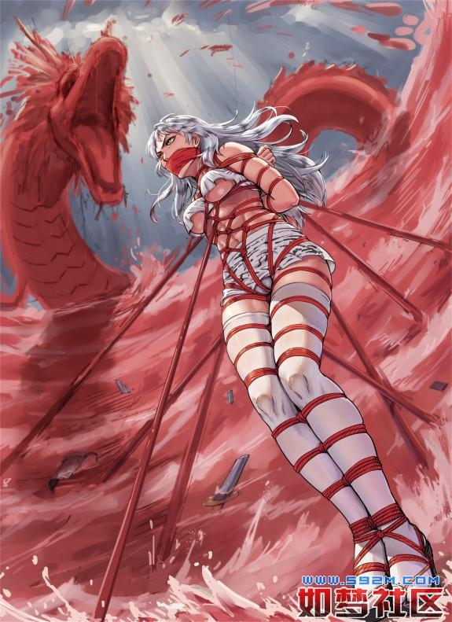

# 灵虚仙缚

### 正文

#### 第一章

摆脱梦魇之后，隋云惊觉惊出一身冷汗，寒风冽冽，入赘冰窟，浓郁的睡意消散在凄冷的夜里。虽已惊醒，却是惊魂未定！  
爬起来之后，隋云做的第一件事就是在身边四处下意识的摸索着几乎从不离身的眼镜，可是摸来摸去手指间也只有杂草扎人的刺痛，除此之外一无所获，他怔怔了半晌才反应过来，有些自嘲的苦笑着叹了口气，寒月下，眼中倒映的一切都是那样清晰可见，早已经不需要借助眼镜了。  
“老幺，你醒了啊。”不远处传来一声温和的问候，隋云的神识再次转移到月下的大青石旁，两个人影正围着一捧熊熊燃烧的火堆，火堆散发出温暖的橙光，上面用简单的加工过的木架翻烤着一只猪腿和几张面饼，香气四溢。  
“大哥，二哥。”隋云打了声招呼，便披着衣服来到火堆旁坐下，简单的搓了搓手，并没有去看那两人而是双眼直直地盯着滋滋冒油的烤猪腿。  
“你这小子，眼里只有食物吗？”刚刚问候过他的俊逸青年笑骂了一句，顺手递过来一只皮袋，“夜里严寒，你身体又脆弱，喝两口暖暖身子。”  
“不用了！”隋云连连摇头，他还没忘记这火焰酒有多厉害，第一次喝这东西他可是晕过去一整天，实在是不敢再碰，而他这边刚一拒绝，另一位黑衣青年毫不客气的从中伸手夺过了皮袋，径自的仰头一饮而尽。  
“老二你……”俊逸青年望着毫不客气的兄弟，哑然失笑，“你倒是不客气。”  
“没关系，大哥，都是自家兄弟，用不着客气。”隋云也附和起来，心中却是感激着无意之间帮他解围的二哥。  
“不喝就算了，来，老幺，给你个任务。”俊逸青年忽然取出一把小刀，在烤猪腿上切下来一些肉，收拾了两个面饼，放在一只大海碗里，连同水壶一并递给了隋云，“拿去给后面的那位美女，别把她给饿坏了，免得到时候不好向雇主交代。”  
说到这里，隋云的精神一下子绷紧起来，之前沉寂的心潮也再度浮起，他有些激动的接过了大哥递过来的海碗和水壶，转身一溜烟就朝着他们放行李的地方跑去。  
“这臭小子，这会儿倒是挺积极的嘛……喂喂喂，不准偷吃啊，老二你这家伙！把肉拿回来！”俊逸青年笑了笑，回过头来却看到猪腿肉已经被黑衣青年撕掉了一大块，当即也顾不得观望，扭头和他争抢起来。  
隋云的确是十分激动，同时心中一丝邪恶的欲望似乎在慢慢侵蚀着他，令他格外兴奋，但在他接近后面放置的行李时，脚步反而渐渐慢了下来，在并不是很多的行李之中，一只麻袋正在微弱的蠕动着，像是藏了什么动物一样，似乎是感应到了有什么人在接近，麻袋里面的东西颤抖的频率变得更快。  
隋云将盛满食物的海碗放到了一旁，伸手去解系着布袋的绳索，在他两只手小心翼翼的拆解下，麻袋口总算是松开了，随即从中探出了一颗娇小的脑袋，按理来说这样的场面是个人都会吓一跳，但是隋云却依旧是装作很平常，实际上他的身体已经有些控制不了心中那一丝兴奋邪恶的欲望开始颤抖起来。  
麻袋里探出的人同样也在颤抖，可是，当那少女完全抬起头，用她那双充满茫然和纯净的眼眸里看着隋云，明亮中带着几分湿润，隋云深感已经快要把持不住心底这股邪火了，这刺激感几乎是瞬间将他的大脑烧成了一片空白。那是一张宛如谪仙般精致到极点的容颜，一双黑玉葡萄一样乌黑剔透的大眼睛中带着些许莹莹的粉红，绝色的容颜上虽然不施粉黛，可仍然是那么完美，清丽无双。  
再向下，就看不到了，原本是在少女唇齿的位置，被一道锦缎包裹住了，围着她的鼻下颌上，紧紧地封存了她的嘴巴，不过应该不用看也知道，这样美丽的少女一定拥有一张美丽的樱唇，但现在却被虚掩，无法绽放天籁，眼角的晶莹向下延伸，化成几道细微的痕迹挂在雪白的脸颊上，形成了美丽的形线，好似那价值连城的哥窑冰裂釉，令人顿生怜惜之心。  
隋云吞咽了一口唾沫，他的手已经开始更加剧烈的颤抖了，好几次都想试手解开裹住少女嘴巴的锦缎，但全都是在伸到一半的时候忍不住缩了回去，就这样反反复复了很多次，在少女可怜祈求的眼光注视下，他终于把手搭在了少女的脑后的布结上，开始温和的开解。  
在解开了裹住少女嘴巴的锦缎后，隋云低头借着月光看去，锦缎后露出的是被棉布堵得严严实实的嘴巴，由于用量稍多，少女一层浅浅桃色的香腮已经被撑得微微鼓了起来，隋云温柔地伸手扯出了棉布，由于长时间塞在少女的嘴巴里面，棉布已经被涎水浸透，湿哒哒的垂在隋云的手中，而带出的一丝香津因为脱离了棉布的吸附，连在少女的嘴角化为一道亮银色的丝线，月光下，刚刚脱离了严堵的少女开始不均匀的喘息，俏丽的小脸被映的白里透红，白皙粉嫩的样子就像是熟透的水蜜桃，让人突发向上前咬一口的冲动。  
果然不让人失望啊，是一位绝色美人，隋云强压着心中升起的欲望，用尽量温柔的声音对她说道，“姑娘，得罪了……。”  
“你……！小孩子？！！”少女有些惊讶的上下打量了一下隋云的身影，显然有些疑惑，而隋云也尴尬的顺着她的目光看了看自己，也是有苦难言，无论如何他都想不到，自己一个二十多岁的青年会在这次奇妙的穿越中变成了八九岁的小孩子，又不是吃了柯南里返雏的药物。  
“你想干嘛？”如同想象中的一样，少女的樱唇刚刚获得自由便开口询问，急切切的打断了隋云的话，而同时皱着如画的眉眼，扭了扭还藏在麻袋里的身子，“你是和孽龙，雷豹一伙的吧？！你们已经绑了我两天两夜了！快给我松开！我的手都要断了！”  
“额……姑娘，你说的是我的大哥，二哥，他们现在不在，你不用紧张。”隋云在这个以前对他来说千载难逢的时刻，反而变得有些结巴起来，过于紧张让他不知道说些什么话好，最后只有举起一旁的海碗，呈到了少女的面前，“姑娘，你已经两天两夜没吃饭了吧，来吃一点吧。”  
“我不吃！”少女丝毫不领隋云的好意，猛地抬头一撞将隋云撞翻在地，顿时海碗里的烤肉和面饼顿时洒落的满地都是，等隋云爬起来再望向她的时候，少女粉红的瞳眸中充斥着满满的怒火，更加剧烈的挣扎起来“你快松开我！我不要去北域！再不放了我我要喊人了！”  
“没用的。”被这样一撞，隋云也冷静了下来，眼前的少女很不老实的扭着身子，而也让隋云的温柔随之消失，面色变得冷冽下来，用书中说的老旧的戏剧台词冷冷道，“在这里你尽管叫破喉咙吧，也不会有人来救你的。”隋云讲这句话说完，顿时觉得自己就像一个白痴一样，用极度深寒的气势，老气横秋的腔调，最后却是从一个不满十岁的正太嘴里说出这样一句威胁的话，尴尬症都要犯了。  
然而，隋云万万没想到的是……  
“快来人啊！救命啊！打劫勒索绑票强奸抛尸啊！赶快来人杀贼啊……！！”樱唇轻启，仙乐流转……个屁啊，这就是拼尽气力扯脖子大喊，就连深沉的夜幕都被这奋力叫喊的声音撕裂了一个口子，而另一边还在争抢着烤肉的龙与豹也都被震的脖子一缩，这种场景吓得隋云当场胆战心惊，连棉布都顾不上了，直接伸手想去捂住少女的嘴巴，顿时让少女的海豚音变成了美妙沉闷的呜咽。  
“别吵别吵！不许吵！你是吼猴吗？”隋云也是第一回遭遇这种场面，不慌神是不可能的，现在只能尽全力掩上少女的嘴巴，同时将之前的棉布朝着少女的嘴边送去，不过这一次他就没那么顺利了，少女在他的捕捉下开始了更加剧烈的挣扎，居然强撑开嘴，一口狠狠地咬在了隋云的手掌上，这股痛楚突如其来，比以前做实验被虎钳夹一下还要疼痛难忍，不过隋云下定决心憋红了脸，坚韧不拔的一声不吭，终于将手从她的嘴里抽了出来，没了一块皮，同时棉布用力的塞回了少女的嘴里，彻底压制住了她亮丽的嗓音，这一塞有些过于用力，直接将棉布全塞了进去，顶在了少女的嗓眼，一阵恶心的感觉让少女剧烈的咳嗽起来，呛得泪流满面。  
“好疼好疼。”隋云吹着刚刚被咬破的手掌，有些愤怒的盯着少女，两个人就这样大眼瞪小眼的看了半天，终于两边都泄气了。  
良久，隋云恢复了一些，转过身来阴沉的拾起麻袋的边缘，想把少女的头按回去，可是由于身体有些幼小，加上手掌受伤，没有办法尽快做到，而少女此时也慌了神，开始拼命挣扎着，两个人又是僵持了一会，双双溃败，隋云望着她挂满泪痕的脸，有些心软，“喂，小姐，我帮你拿开棉布，你要答应我不再叫喊，不许咬人，否则我就叫大哥二哥来收拾你！知道了吗？”  
少女此时没有选择，只好连连点头，在隋云的帮助下，嘴巴重获自由，“小兄弟，你到底是谁？为什么会和孽龙，雷豹这些妖魔为伍？”  
“妖魔？我大哥二哥吗？”  
“没错，你不知道吧？小兄弟，看你还小，应该不知道孽龙雷豹等人的恶名，在这个灵中界，他们都是恶名远扬的头号罪犯，你和他们厮混在一起，是不会有什么好下场的！”少女用小心谨慎的语气告诫着，期盼着隋云可以良心发现的放了她。  
不过很可惜隋云并不是很了解他这两位新认了没多久的哥哥，而且在他穿越而来的初始，正是两个哥哥的帮助，才没有让他曝尸荒野，这份恩情，隋云暂时就无以为报，当然不可能为了从没见过的少女一番话就心软背叛兄弟，当即想要岔开话题，同事打算了解一下少女的来历，“这位小姐，还没有请教一下你的名字，还有，我大哥二哥为什么要抓你呢？”  
“我叫陆黑兔，是祁连山兔王陆明伦的女儿，兔族的二公主。”提及身份，少女稍微有些回神，“孽龙和雷豹，他们找机会将我从祁连山绑架，是要抓我去北疆送给苍狼王成亲的！”黑兔苦苦柔声哀求的说着，“小兄弟，求求你放了我吧，我会回去和父王表奏，对你报恩的，你想要什么样的奇珍异宝，万两黄金，甚至是我们兔族的婢女，都可以给你的！”  
“看来这身份厉害啊！”隋云望着黑兔，心中有些举棋不定，这个身份看起来也非同小可，不过他更明白，自己现在这要身份没身份，要实力没实力，就算是想要帮助她也无从帮起，何况，自己要是帮助了她逃走，大哥二哥回头还不杀了自己！自己现在当然还是要跟随他们的，“实在很抱歉，姑娘，虽然你很可怜，但是我这条命是大哥二哥捡回来的，绝对不会背叛他们，所以，也只有委屈你了。”  
隋云说着，再度站起身来，准备把棉布塞回黑兔的口中，黑兔苦求不得，泪水像断了线的珠链一样滚落，拼命地摇头，可隋云还是硬起了心肠，在即将将她的嘴巴重新堵住的时候，黑兔忽然开口道，“那个……小兄弟，我不求你放了我，但现在还有一事相求。”  
看她一副楚楚可怜的样子，隋云终是心软了，“你说吧。”  
“能不能暂时解开一下我的绳子……我已经两天两夜没出恭……了。”黑兔说着的时候，脸颊有些滚烫，就像充血了一半，同时极为羞涩的嘤咛一声，看起来娇媚十分，隋云的心跳顿时漏了一拍，有些口干舌燥，“出恭……难道是上厕所？！”看到黑兔娇羞的点了点头，顿时隋云觉得大脑里一股热气上涌，已经有些按耐不住了，“我的天，这么戏剧性的场面怎么会被我碰上？”他心中天人交战，一方面是害怕戏剧情节出现在自己的身上，而同时面对少女如此妩媚的哀求，他又无法坐视不理，在经过一番激烈的思想斗争之后，只好叹息一声，“好吧，我可以解开你腿上的绳子，不过你一定要老实一点，不准逃跑，否则我就叫二哥来了！”  
黑兔看着为难的隋云，努力的点了点头，隋云当即在心中大呼畅快，伸手将裹着她娇躯的麻袋放了下来，而同时，黑兔被绳索严密捆绑的身体也渐渐显露出来，上身是严严实实的五花大绑，青色的绳索像毒蛇一样环绕在黑兔的身体上，缠过她的粉颈，搭在双肩上形成两条回路，余下一圈圈的绞其她的双臂，在她的身上织成了一张渔网，身上的捆绑绳子以￥装的绳结为中心像全身的延伸，将黑兔的身体死死咬住，动弹不得，四道绳索交叉游走，用力勒紧了她的前胸，使得两座乳峰衬托起来更加凸现出来，紧绷高挺的样子让已经成为孩子的隋云下身都为之一硬，而背后的绳索顺着玉臂盘旋，手臂被高高的吊起，与脖颈上的绳索纠缠，形成了一条绳套，让她无法用力挣扎，否则有子夕的危险，同时由于绳子绷得太紧，黑兔不得不挺起身子，娇躯前凸后翘的充满了诱惑。  
不过下身的绳子绑的相对简单，没有想象中的股绳不免让隋云大失所望，不过仍旧将黑兔的一双玉腿紧紧绑好，绳索很有规律的在她的大腿，膝盖的上下以及小腿，脚腕处形成了美丽的环节，精美的束缚着周围的每一寸肌肤，同时又在绑绳中间环绕形成了一道道“∞”字型，更加将一双玉腿上勒的变了形状，严谨的束缚令她动弹不得，严密的程度让隋云惊诧不已，心中对大哥二哥的崇敬又提高了一个档次，高手啊，以后找个机会一定要多向两位哥哥学习学习这方面的技巧。  
费了九牛二虎之力，隋云总算是解开了黑兔腿上严密捆绑的绳索，让她的腿重获自由，但是隋云始终还不放心，又找了一条长绳拴在黑兔身上的绳索上，他不敢完全解开黑兔的捆绑，这个少女的力量绝对在他之上，同时，这个世界的神仙妖怪，也根本不是他一个凡人能够对付的了的。  
但是他才刚刚解开黑兔的手腕，只见少女迅捷的用获得了少许自由双手撑住地面，一双玉腿猛地收缩起来，接着弹簧一样倒踢而起，这一脚好似流星赶月，在隋云还茫然无措，毫无反应的时候飞踢而起，重重的摔向后面，索性这一脚倒不是很用力，隋云只是重重摔倒在地，当场有些七晕八素的快将昏迷，心中大叫不好，可是已经无力爬起来抓她了。  
“真……真的很抱歉，小哥，我……我也是不得已的！我才不要嫁给狼王，对不起了！”黑兔愧疚的俯身朝着隋云鞠了一躬，顾不得完全解开束缚便仓皇朝着茫茫草原奔逃，眨眼之间背影已经化为一个小黑点了。  
在隋云快要完全失去意识的时候，忽然耳畔风声响起，原来是龙豹两人听到了不对，急忙赶来，现场却只剩下了一堆散乱的绳索和快将昏迷的隋云，脸色顿时阴沉下来，孽龙匆匆过去将隋云扶了起来，同时从口袋里取出几枚药物放进了隋云的口中，“对不起……大哥……”隋云有些费力的说着，随即一头昏厥过去，孽龙叹了一口气，给一旁冷冷旁观的黑豹一个眼色，“唉，大意了，让那丫头跑远了。”  
“呵\~。”一直以来不吐一字的冷面青年黑豹忽然森寒的冷笑一声，一双眼睛陡然变成了诡谲的兽瞳，嘴角的獠牙磨砺着薄唇，阴测测道，“跑？兔子跑得过猎豹吗？”话音未落，他的身形已经化为一道黑色的惊电，转瞬之间朝着黑兔逃跑的放下疾驰而去，那速度已经在半空之中留下了道道残影。

#### 第二章

看到雷豹风驰电掣的速度迅速消失在视线之内，孽龙自然没工夫继续远眺，转身回来查看隋云的伤势，祁连山的兔族在万兽仙族里虽然只是末流势力，不过能占据一方也是有道理的，刚刚隋云因为大意解开了一部分绳子之后，陆黑兔这丫头也就随之显露出了她们一族最可怕的技艺“魁星踢斗”，当然这个在实力强悍的大妖眼中就是简单的‘兔子蹬鹰’，可虽然简单，却能让兔族在战斗中常常出奇制胜，甚至踢死过许多赫赫有名的妖魔。  
不过看着隋云胸口留下的印记颜色很浅，想来刚刚这一下陆黑兔是伺机而动，由于这些天一直滴水未进，气力不足，加上黑兔心底纯真善良，并没有下死手，孽龙也就随之松了一口气，用一股元力辅助隋云消化了灵药，不消片刻，隋云的伤势就已经痊愈了，只不过这昏厥还需要一段时间调息。  
暂且不说这边，陆黑兔趁机偷袭踢晕了隋云之后，便一路向西南方向逃窜，兔族除了强劲的蹴击以外，便是以灵活敏捷的身法见长，百里之途中化作了迅捷的一道闪电，不消片刻便已经逃到了贺兰山附近，黑兔终于驻足停下，由于这些天被紧紧的绑着，没办法活动，而刚刚又逃得匆忙，这会儿已经是有些体力不支了，不过按照这个距离，孽龙他们想要追赶应该已经来不及了吧？  
黑兔柔弱的坐了下来，想要借助这段时间稍歇片刻，等恢复了元气在逃回祁连山，然而就在她刚刚坐定，身后莫名其妙的涌上一股森寒之意，这异样的感觉瞬间毛骨悚然，一双红玻璃般清澈透明的眼眸呆呆失神的怔着，那已然是惊慌失措的前兆，接而从她的粉颈上传来阵阵吐息的冷气，几乎瞬间冻结了她全身的血液，连心底也被冰封，娇俏的耳畔骤然响起一句淡淡的话音……  
“想去哪啊？”  
黑兔本就胆小，在这句话话音未落的时候已然吓得魂飞魄散，她甚至还没有来得及反身观望就已经绷紧了精神，在浓墨浸染般的黑夜里，来人一身黑衣，仿佛整个人都融入了黑夜之中，唯一能够看得一清二楚的就是他明黄色带着锐利凶光的兽瞳和嘴角裂着冷笑凸显出寒光闪闪的犬齿。  
“雷霆黑豹……”无论速度还是元力，他是自己永远也无法超越的存在，虽然希望渺茫，但黑兔渴望自由的内心还是驱使她在第一时间纵身而起，想要迅疾逃窜。  
但雷豹的速度比她更快，在黑兔准备起跑的一瞬间，他只是轻描淡写的随手一握，黑兔初始只觉得背后的衣衫一紧，但她顾得了许多，用尽最后一点元气奔逃着，但是很快她便发现不对，她几乎是手脚并用的逃命，耳边却并没有产生半点风声，不由得有些茫然的观看着四周，那些在神速奔命中应该已经模糊一片的景物没有丝毫变化，心中一丝莫名的恐慌惧意在这种意味不明的情况里极具增幅，似乎明白了什么。  
原来在刚才她不顾一切的逃命，实际上却只是一直在原地奔跑，根本没有逃出雷豹的掌心。  
这一下，彻底崩断了黑兔最后一根脆弱的希望，随着雷豹松开手掌，她无力的瘫软在地，不住的颤抖着娇躯，全身上下都已经因为单纯被雷豹凶猛的威势压得再没有半点力气，只能用微弱轻柔的声音苦苦哀求着，梨花带雨的抽泣，宛若一只受伤的小兽在孤立无援的呜咽，“求求你……雷豹大王，饶了我，放过我吧。”  
但回答她的却是雷豹更加用力的抓扯，毫不怜香惜玉的将她的一只手牢牢抓住，接着提了起来，黑兔并不知道，她在这里越是怯懦，无助的柔弱模样，只会令其心底潜藏的暴虐兽性完全激发，行为更加残忍野蛮。  
“不要……放过我！放过我啊！！”黑兔的胳膊被用力拧到了背后，骨节扭动的清脆像竹节弯曲般劈啪作响，接踵而来彻骨的剧痛让她的惨叫声声不断，可是现在的她只是一只柔弱的小兔子，怎么可能逃脱豹子的利爪？  
雷豹全然不管黑兔的哀求，凭空一抓，不知道从哪里抽出一条赤红色的绳索，迎风抖开，娴熟的拉起一头，并快速的环绕着黑兔的左手手腕一圈，随后抓起右手，将她的双手手腕交叉着并在一起，向上高抬形成了一个W的形状，手腕叠加之间几乎毫无缝隙，紧紧地贴在一起，黑兔在雷豹取出绳子的一瞬间已然绝望，那条绳索名为【赤炼缨】，是雷霆黑豹用南海奇珍赤血马尾藻炼制出的，后又采集首山赤铜，千锤百炼，化作千条异常柔韧的极细铜线绞入其中，经过列阳真火锻炼经年而成，刚柔兼备，曾经凭在万兽仙族中以力量著称的金狮，玉象两名公主，也被此缨擒获而无法挣脱，最终下落不明，现在黑兔只觉得自己的双手疼的要脱离身体而去，但这只是开始，接下来雷豹从黑兔捆好的双腕之间抽出了绳头，穿过黑兔的腋下，绕过美丽的锁骨返回，周而复始的形成了一条绳带，把黑兔胸上连接大臂捆成了一排，勒的她一阵呼吸急促，面色也开始泛起了点点红晕，然后用交叉的手法重新织成一张简单的绳网覆盖住她的胸部。这一次力道更甚，在绳子经过黑兔的双峰时令她情不自禁地从嘴里发出了一阵娇媚的呻吟声，那是足以令百炼铁打的男人也会骨酥筋软的娇叫，让雷豹的动作也稍微延迟了几秒，但可惜的是，捆绑她的是灵中界以冷酷凶残著称的妖魔，随后又不为所动的捆住了她的乳下和小腹。  
黑兔的双腿则被紧紧束缚，和之前一样，不过雷豹捆的严厉程度却是之前的两倍，将一双玉腿生生勒成一节节的白段，如春塘莲藕。  
将黑兔的腿捆绑完后，东方的天空已经吐出了鱼肚白的早云，雷豹深吸了一口气，抬手抓住了黑兔背后的绳结，将她扛在肩上，身形瞬息消失在了原地，再出现时，已经来到了千米开外，几个呼吸的时间便回到了阴山附近。  
……  
“对不起……大哥，给你们添麻烦了。”一边坐在火堆搓着手取暖，一边观察着脸色阴沉的大哥，隋云完全不知道给说点什么好，半天只憋出了这一句。  
话虽如此，但他认错的态度还是有点牵强，因为他不认为自己这么做是错的，即使再重新来几遍，他还是会解开黑兔公主的绳索，虽然他很喜欢被五花大绑的美女，但是却并不喜欢这种肮脏，强制性的人贩交易，黑兔公主那一双楚楚动人的红色眼眸还不时在回忆中浮现，那委屈凄凉，甚至绝望的目光令人恻隐。  
“哦，没事，老幺。”思考中被隋云叫住后，孽龙定定心神，非但不恼怒，反而和善的看着他，“是我的错，不应该让你去给黑兔公主送饭的。”他说着放轻松的笑了笑，尽量化解着隋云有些自责内疚的心情，“不必介怀，你还太小，总是需要一点点成长才行，大哥初始做这种事的时候也搞砸过很多回，还有比这次更糟糕的。”  
“可是大哥……。”隋云的声音有些颤抖，他深吸了一口气，似乎是在安抚一团乱麻的心情，迫不及待的求知，“我来到这里跟随你和二哥，有一段时间了吧？我想问问你们，这里，到底是什么地方，你和二哥又是做什么的。”其实他心中想问的何止这些，但是因为他对周围的一切都并不了解，甚至不知道眼前的这位大哥到底是善是恶，虽然表面上一起称兄道弟，可是，他却根本不知道大哥的身份，还有真正的名字。  
不过只需要用膝盖想想都知道，干出绑架，贩卖这种背德的事情，绝非善类。  
“唉，我看老幺你啊，想知道的应该不止这些吧？”孽龙淡淡的说着，脸色却又恢复了刚刚的深沉，让隋云的心跳马上加剧，他不清楚大哥的下一步动作是什么，但是他却不敢松懈，无论如何，他和雷豹绑票的事也已经确定，虽然隋云的确有这方面的特殊爱好，但他却并不想莫名其妙就背负这样令人唾弃的罪名和职业，更不想在一个人生地不熟的世界当坏人，他的态度已经是很明确了，但是他害怕大哥会突然杀人灭口。  
但是接下来孽龙的举动让他始料不及，只是从口袋里摸出了一只烟锅，一尺三分长，黝黑透亮的烟杆上雕刻着一条蜿蜒盘旋的翡翠玉龙，玉龙雕琢的玲珑精致，栩栩如生，孽龙在引火点燃后深深地吸了一口，随即眉宇舒展，悠然自得，整个人罩在一层薄薄的烟雾里，仙气缭绕如真仙现世。  
这个举动让隋云当场无语，看来自己还真是小人之心了，不由得想开口道歉，但话还没说出口，孽龙已经接着说下去了，“老幺，你大可放心，你是在我和你二哥逃亡中发现救下的，虽然相遇的时间不长，也不清楚你的来历，但我们也是一同患难过的兄弟，所以大哥从没想过要伤害你。”  
稳定了隋云的心，孽龙继续吞云吐雾，“还是说实话吧，我和你二哥的确是恶人，甚至是被这灵中界称之为十恶不赦的狂徒罪犯，这些年我们做过数不胜数的恶事，但那些也只是为形势和生活所迫，这里面还有很多身不由己的无奈，但终究是犯下了滔天大罪，我们自知罪无可恕，也不奢望得到万兽仙族的谅解，原本，我与你二哥打算将黑兔公主绑了送去北域之后，就此分道扬镳，各找山野隐居修炼，再也不理会这世间的其他事物了，但你恰好在这个时间里出现。”  
隋云的心一沉，孽龙开口笑了笑，“不过老幺你放心，你还太小，即使日后我们难逃法网，你也不会被牵连进去，所以，陪我和你二哥走完最后这一段路后，我们可以给你一笔丰厚的资金，让你今后好好享受荣华富贵，不要走上我们的老路啊。”  
孽龙的话让隋云心里一阵轻松，他虽然没有立马表态，但实际上在由孽龙亲口承认罪迹之后，他便只想着能够赶紧和他们撇清关系，至于神仙妖魔，三教九流，刑事案件什么的太过错综复杂，他只是一介凡夫俗子，不想理解，更不想掺和进去。  
“好了，老幺，你只需要记住，我们是兄弟，这就够了。”孽龙自然地说着，但是这话语的分量，却隐约重于千斤，敲了敲烟锅，孽龙站了起来，“你二哥那边应该已经处理好了，等他回来，我们马上出发。”  
……  
不多时，一阵冷风拂面，刚刚还在讨论中的雷豹突兀的在火堆旁一闪而现，同时将肩上的黑兔粗暴的扔在了行李卷旁，又惹黑兔疼的一阵呻吟。  
“辛苦了。”孽龙笑着将手中收拾到了一半的行李放下，拍了拍雷豹的肩膀，再转过来俯下身子看着神情恍惚的黑兔，淡然笑道，“黑兔公主，之前的事多有得罪，不过，这是受兄弟之托，才不得不对你严加看管，希望你能体谅一下，别再给我们添麻烦了。”孽龙最后一句说出来的时候，虽然面露微笑，可黑兔还是能够清晰感受到来自孽龙的威压，虽然罪孽深重，恶名远播，但他却始终是拥有最强的神兽之一，龙族的血脉，龙威的气势要远远凌驾于雷豹之上，黑兔脸上血色尽失，苍白憔悴。她此时已经失去了逃命的意识，只想求他们饶她一命，便顺从的点了点头。  
“很好，你出逃的事，我们不会计较，也不会和狼王提及。”孽龙满意的站起身，但忽地诡然一笑，“不过，你之前逃走的时候偷袭了我们的末弟，这笔账，我想还是要和你算一下的，老幺，你过来一下。”  
从刚刚雷豹扔下黑兔的时候，隋云的眼睛就已经在她的身上移不开了，曼妙的身段被绳索紧缚的样子让他现在这幅尚未成长完整的身体燥热难安，他曾经不止一次在影视，图像里面看到这幅光景，但都没有现在看到的黑兔这般真实，而且那些绳模也都没有黑兔这样美丽，充满一股天然的灵仙气质，此时黑兔秀眉微蹙，眼睫上还挂着细碎的泪珠，楚楚动人，更是我见犹怜，隋云有一瞬竟然不忍再伤害她，转头看向孽龙，“大哥，我已经没事了……，就不要再难为她了吧？”虽是很想这么做，但那样的话，岂不是和大哥二哥没有任何区别？自己在这个世界的罪行也会由此开始，无论今后怎样，这是再也无法被洗刷的污点，将会伴随他的终生……，想到这些，隋云顿时又陷入了天人交战，双手也开始无法控制的颤抖起来。  
“那可不行啊，老幺。”孽龙脸上的笑意瞬间收敛，如罩寒霜，“我知道你尚且年幼，心地善良，但是那过多的仁慈，并不能为你赢得什么，甚至还会把你推进万劫不复的深渊，别忘了，就是之前你的一念之仁解开了她的绳索，但之后她又是如何对你的？你可知道？要是发现的晚了，你纵使保住性命，也会落下病根，纵使这样你也能原谅她也罢，但是要有下一次，你又要如何面对？非要危及性命？届时悔之晚矣！”他的言辞冷冽，气势之间竟然不容抗拒，可也确实陈述了实情，让隋云想要为她求情的话语彻底咽了下去，这是随云来到这个世界之后学到的第一门课，他明白之前的做法实在太过幼稚，就像孽龙所说，这次是因为他与雷豹在旁及时救治，要是有下一次，就真的可能会死无葬身之地了，思量至此，他已经隐隐吓出了一身冷汗。  
“所以，你来惩戒她一次，权当是增添防护意识，只要不伤到她也是无妨。”孽龙说着，闪身让开了，隋云径自来到了黑兔的身旁，此时他的心跳加速，在黑兔惊恐的眼神中，慢慢将手伸向了捆绑黑兔脚腕的绳索，将黑兔的小腿倒折回来，屈于大腿上，扯出一根绳头，与黑兔手腕上的绑绳系在一处，这一拉一扯，顿时让黑兔的身子整个弓了起来，形成了一个驷马倒攒蹄的样子，在打结的时候又引得黑兔呻吟连连，惹得隋云一阵血脉贲张。  
接着隋云把手伸向黑兔的脚边，掀开裙角，露出了一双用金线描着精细图案的绣花鞋，做工细致，正好装饰着两只纤细的小脚，隋云从黑兔的脚上脱下绣花鞋后，露出了被白袜包裹的脚丫，黑兔的袜子有点像日本学生妹的泡泡袜，松垮垮的，还有点厚，没般法把少女纤足完全体现出来，但也让隋云心痒难忍，顺着白袜的褶皱将其拽了下来，而黑兔的美足也彻底呈现在眼前，如想象中一样，白皙细嫩的像剥了外皮的春笋，脚趾上的每一片趾甲都想珍珠一样排列开来，在阳光下闪闪生辉，若不是时间紧迫，隋云真想将她的小脚握在手中好好把玩一阵。  
强忍住流鼻血的冲动，隋云抓起白袜，准备将其塞入黑兔的樱桃小口中，可是黑兔眼看着那一双从自己的脚上褪下的袜子，顿时慌了神，左右扭动着脑袋，绝不顺从，而隋云身小力弱，加上神情紧张，一时半刻也制不住她，就这样弄出了一头大汗。  
可就在隋云打算放弃的时候，黑兔突然感到身上的【赤炼缨】紧了紧，原本还能稍微挣扎的娇躯彻底动弹不得，紧缚的疼痛感让她惨呼一声，隋云抓住这个机会，用力将白袜塞入了黑兔的口中，然后抓起一条锦缎包住了黑兔的嘴巴，又在外面勒上一条细带，这下她也无法再吐出口中的白袜。  
只是隋云并不知道，在刚刚【赤炼缨】收缩的时候，孽龙看的一清二楚，立刻转向雷豹，眼神里带着明显趣味的笑意，雷豹冷面依旧，看着孽龙投过来的眼神，冷哼一声侧过身去。  
黑兔的白袜实际上并没有什么异味，身为兔族的公主，她是有些洁癖的，平素十分注重自己的端庄，所以脚上并无异味，而且白绣鞋中常年存放着保暖用的灵花仙草，所以白袜上自然也沾上了花草的清新香气，塞入口中能让她口齿生香，只不过，那到底是脚上的足衣，还是让黑兔一阵犯恶心，美目中饱含的泪水也屈辱地流了下来，煞是好看。  
但是这还没完，隋云只恨她踢上自己，同时也为了满足自己的欲望，抽出一条绳索，从黑兔的纤腰之间绕一圈系好，然后如灵蛇般从黑兔的胯下穿过，黑兔顿觉不妙，在她没反应过来的时候，隋云忽然用力一收，顷刻间让黑兔不由自主的闷哼一声，晶玉一样的脸颊上瞬间布满了一层红晕，半闭的眼睛中泛起了一泓春水，可是又不敢用力挣扎，蜷缩着玉体娇羞无限。  
“这个臭小子。”孽龙和雷豹在看到这一幕的时候，顿时就对隋云刮目相看，没想到这个末弟看起来年幼，对付女人还真有一套，连股绳这么恶毒的事都想的出来，实在是‘前途无量’，孽龙甚至觉得有些后悔劝退他，不去当采花贼真是埋没了这天生的潜质。  
“好了，大哥二哥。”隋云起身擦了擦头上忙出来的汗水，十分满足而且意犹未尽。  
“那接下来就我们的公主殿下收拾一下，送去北域吧，狼王那边应该也等急了，不能耽误自家兄弟的幸福啊。”孽龙说着，将黑兔的身躯拎起，装进了一边的麻袋里，放置在货车上，等雷豹和隋云上车后，扬鞭催动着马匹往北域而去。

#### 第三章

  翻过阴山之后沿途一路畅通，边关兽卫们的盘查也不再严格，不过孽龙要求务必小心谨慎，也没少贿赂守卫，没几日便来到了西北面的狼城。  
只是这一路上可是苦了黑兔公主，自从她出逃被抓回来，立刻就受到了严密的看管，之前的麻绳还好，以她的劲气能有缓和的余地，可【赤炼缨】竟然没有半点缓和的余地，果然是名不虚传，被捆缚之后让她根本无法挣脱，蕴含其中的赤阳之力更是镇住了她的仙灵，但这还不是最可恨的，自从隋云给她绑了一条股绳之后，痛苦接踵而来，在运行的途中，赤炼缨的绳索不时与下圌体交接摩擦，产生的快圌感不断地折磨着她的精神，她想要摆脱股绳，但每动一下。绳索就会勒的更紧几分，就像一条有灵性的水蛇一样不断贴近缠绕她的躯体，随着下圌体的敏感越来越强烈，那里已经让泛滥成灾了，黑兔羞愤难当，但由于赤炼缨的紧缚，无可奈何的她只好老老实实的待着，不敢再做多余的动作，每天只有一时片刻的吐纳时间可以让她出来透气，可以借助元力推动血液流通脉络，不会造成伤圌残和后遗症已经是万幸。

在这段时间里，隋云也用心观察着这个不同于之前世界的异域，这里的居民虽然有的仙气萦绕，有的妖气冲天，但好歹都幻化为人形，也就让随云心中的抵触没有那么强烈，但还是倍感孤寂，尤其是非我族类，格格不入的异样感，莫名其妙的产生了一些抑郁的心理，他才明白，原来所谓的既来之则安之，只不过是求一句心理安慰，真到了时候，思乡之情还是能让人痛断肝肠。

“速度倒是够快”孽龙带着笑意的调侃声音从外面传了进来，隋云好奇的过去掀开车帐，但紧接着眼前的一幕让隋云吓得差点跳起来，原来马车前方不知何时正俯着一头巨狼，其体型宛若一座山丘，在看到有人出来后立即用四肢撑起身体，一阵烟尘翻起，那身形竟然足有十几米高，体态更是大的离谱，利爪好比大号的铁叉，蓬松的尾巴如同散开的浮云，狭长的口中尖锐的獠牙若隐若现，这头巨狼周圌身覆盖在一层灰黑色的皮毛下，肌腱突兀的位置上绒毛泛起银色的光华，形成了一只只月牙的形状，在强圌健和野性之中多夹了一丝幽然的美圌感，两只眼睛紧盯着马车，撒发出幽幽的绿色，只是被余光瞥到，就令隋云浑身上下毛圌骨圌悚圌然，想开口，两排牙齿嘴里却在不停地打架，根本组不成语句。

“你不用怕，老幺，说起来，你还要叫他一声‘五哥’。”孽龙的话音刚落，巨狼居然裂开血盆大口露出了笑意，随即身形一缩，光华聚敛起来，化为一名体态略显瘦削的青年，灰白色的华服，松散地披着，面部冷峻，眼神也是冰冷孤傲，倒是和雷霆黑豹有几分相似，只不过嘴角常在的似笑非笑又显得距离没那么遥远，梳着一头披肩长发，色泽银灰，在头顶微微耸立着两只稍圆略尖的耳朵，迎风不时地抖动。

“五……哥，你好。”在孽龙的引荐下，隋云有些结巴的问候了一句，便保持沉默，他做梦也想不到有一天居然能和以前只在神话传说里面出现的妖怪打交道，还能够称兄道弟。  
“这就是传信上说的老幺吗？这么多年过去，还真让大哥凑齐了最后一个末弟了。”灰发青年露出的笑容让隋云心情缓和了一些，同时他也打量着巨狼幻化的青年，这就是传说中的狼妖吗？看起来也没那么凶神恶煞，阴狠歹毒……只不过那含圌着微笑的眼神盯着自己还是令他非常不舒服。

“这可怪了。”过了半晌，狼王眼神闪烁，面露奇异，对孽龙传音入密道，“大哥，按理来说到了我们这种修为，无论是神仙妖怪，恶兽魂灵，只要是观看片刻，即使看不出真身，也能大致猜个七七八八，可是我看了末弟半天，还是看不透他的原型，他到底是个什么生灵？”

“不止是你，我和你二哥也想知道，这孩子的确是神秘，从初遇到现在，即使是动用法术也看不清，好像只有这么一具身体，原型是什么还尚未可知，不过这也没什么，这孩子救过我和你二哥的命，也是我们的结拜兄弟，不可轻慢。”孽龙将传音说完，开口笑道，“行了，既然你来了，我们来到这里的目的也就达成了，不是我说，有时间在这傻站着，还不快把你的未婚妻领走。”

被孽龙这么一说，狼王才恍然回神，当即嘿嘿一笑，“是极是极，我也就不耽误了。”说罢便亲自走上来，将雷豹拎出的麻袋打开，却不料麻袋一开，顿时从中便传来一股强烈的淫圌靡味道，隋云就在旁边，嗅到这气息顿时便感到面红耳赤，出于动物最原始的交圌配欲圌望，他根本控制不住的握紧双手，同时怎么也无法恢复冷静。

而狼王却是非常开心，三两下将布袋扯开，将黑兔从中扶了出来，此时的黑兔还是被捆的像一只肉粽，精致的小圌脸上充满了疲倦和干涸的泪痕，昏昏沉沉的悠悠转醒，朦胧含泪的眼眸观望着眼前出现的狼王一张英俊狂野的脸庞，转瞬之间清醒了过来，吓得魂不附体，一双美丽水润的大眼睛里充满了惊慌失措的恐惧，狼王那真的是她午夜梦回时的魔魇，没想到却在此时毫无防备的情况之下袭来，顿时就剧烈的挣扎起来，并且拼命地摇头，从嘴里传来阵阵模糊不清的呜咽声。

隋云到底是心中有些愧疚，现在也朝黑兔望去，之间她在慌乱的同时左顾右盼，在看到隋云的时候，那神情是一种极度的恐惧，其中还夹杂了愤怒和怨恨，让隋云不敢再与她直视，低下了头，但接下来的一幕却是让他目瞪口呆，狼王在神情热切的注视了黑兔一会后，竟然将她放置回车边，同时用一种极快的速度解开了身上的华服，露出了他一身的肌腱，胳膊上满是腱子肉，虽然刚才表面上看起来略显瘦削，但现在看来却是孔武有力，在三两下解除衣物之后，狼王立马像一个疯子一样再次扑了回去，一下将黑兔揽在怀里，同时一双手疯狂地用力撕扯着她身上的衣物，在黑兔惊恐的眼神中，那些用天材地宝织就，又经过仙法加持的衣裳在狼王的魔掌里情谊的四分五裂，化为一条条破烂不堪的丝絮，随着它们的破散，黑兔那宛如羊奶一般白圌皙雪腻的肌肤彻底显露出来，与赤红的绳索相互牵缠，令人着迷的散发着光泽，狼王如获至宝一样用手不停地抚摸着黑兔的冰肌玉骨，惹得玉兔脸颊飞红，情不自禁地轻哼起来，这羞涩的呻圌吟就像催化剂一样，狼王再也无法忍耐，接着将手搭在黑兔股间的赤炼缨上，熟练地将其分成两段，露出了中间粉圌嫩的花圌苞，双手抓着黑兔那对熟透的蜜圌桃，迫不及待的用下圌身的肉龙迅猛疾驰，找准位置突击了进去。  
“呜嗯……！”黑兔美眸圆睁，喉咙里传出一声痛苦沉闷的娇圌哼，狼王强硬的猛一挺身后，她柔嫩的的花心里顿时渗出了丝丝殷圌红，顺着狼王的肉龙缓缓攀爬，狼王感受着那湿圌润温热的血流后，更加躁动，竟像是冲刺一样加快了速度。

清白受辱，贞洁被破，黑兔此时只觉得痛不欲生，随着狼王如烈火燎原一般的侵袭，她身上的痛苦远不如内心的绝望，只求速死，可是由于被赤炼缨紧缚，封住了灵力，让她连兵解的能力也没有。

“卧圌槽！！！”隋云倒吸了一口凉气，他是万万没想到，狼王的行为居然如此狂野开放，竟然当着兄弟几人的面就开始做这种激烈事，眼前的场景太过香圌艳加上他完全就没有个心理准备，当场一股热流上涌，两道鲜血当场从鼻子里喷涌而出，这……即使是曾经电脑里拥有几百G АV的他都难以消受，因为这个是如此的真实，就在自己的眼前，自己浑身上下燥热不堪，连那幼小的下圌身也开始情不自禁的挺起来了，这个真的是不可抗力，隋云在兴奋的同时，竟然开始幻想有朝一日也可以像五哥一样，坐拥这样倾国倾城的大美女，真真切切的发泄自己的欲圌望，在这一刻，他竟然产生了曾经极其厌恶的罪恶心理，将理智完全抛却的开端！

“呜恩！！……呜恩！！……呜呜呜！！！”随着狼王越来越快的抽圌插，黑兔的头不得高高仰起，由于嘴巴被封堵的严严实实，只能不停地发出沉闷的娇圌哼，脸上红的快要滴血，娇小的身躯绳索紧缚动弹不得，又被狼王抱在怀里，只能任其蹂躏，那一对丰圌满可爱的雪白玉兔则落在狼王的两只禄山之爪掌握中，不停地粗暴用力的揉圌捏着，被刺圌激的反而更加挺拔，接着狼王的频率更加快速，捆成一团的黑兔被搞得花枝乱颤，沉闷的声音从惊慌，抵抗慢慢变成了顺从，连音线都带着一丝丝的妖浪，黑兔的眼见不断溢出泪水，如粒粒珍珠滚落，她现在已经不能控制自己的欲圌望了，之前一直极力抗拒的事，现在却给了她无与伦比的快圌感，她很想拒绝，但是绳索紧缚令她无力反抗，原本以仙灵之气著称的黑兔公主，居然在此刻慢慢变成了一个荡圌妇淫圌娃，在被这样粗暴对待的同时，对快圌感的渴望反而愈加强烈，渐渐的，剜心的痛苦被洪水般的极乐尽数吞没。

似乎是感受到了黑兔从抗拒，痛苦到接受这个过程，狼王变得更加兴奋，多年之前在祁连山的雪峰上偶然相见，惊为天人，从此便魂牵梦绕，不思修行，修为不进反退，被兄弟们调侃嘲笑，却一直没有忘记她，多年以来一直在梦中幻想的仙女，如今切切实实的品尝到了，真的不只是心满意足可以形容的，当下，狼王竟然再度圌化为饿狼，贪婪的亲吻她的肌体，舔抵，甚至在黑兔最敏感的耳尖上轻圌咬，尽其所能的品尝着她的肉体，恨不能将其化为一块美圌肉狼吞虎咽的吞下肚子，欲圌望涌起，两人又来了一阵激情，隔着挺远，隋云都能清晰的听见啪啪声，这种清脆里带着湿圌润的音色。

随着黑兔的闷声越来越快，两个人已经快要到达第一次的巅峰时刻，狼王将百年来的思念和早已饥渴难耐的欲圌望尽数倾泻，如火山喷发一样注入了黑兔的体内，而黑兔的内涵也在那一刻也化为滔滔江水一圌泻圌千圌里，狼王已经不仅限于听她沉闷的呜咽，一把扯碎她的勒嘴布带，扯出了早已被口水浸透的罗袜，黑兔的小口终于重获自圌由，便发出了一声高昂的浪圌叫，紧接着两个人在此时水乳圌交融。

但是狼不愧是狼，即使如此还不满足，在稍作休息之后，立刻准备开始第二轮圌大战，而隋云再也不能控制身上燥热的血管，仰面鼻血冲天。

雷豹在此时也算是看不下去了，在孽龙拖住失血过多的隋云同时，飞起一脚正踢在狼王的背后，沉迷欲圌望的狼王则完全没反应过来，只是温柔的保护着和他紧紧相连的黑兔，跌进了马车里面，紧跟着孽龙的声音传来，“我说老五你啊，能不能控制一下自己的欲圌望，这还没到你洞房花烛夜就开始疯狂发泄，还有你给我检点一点！老幺还是个孩子，全看见了！你能不能教点好的？”

狼王这才收敛了一点，不过，刚刚雷豹这一脚也算是帮了他，正好把他踢在马车中，这样也正好让他们可以继续激情，想着，顺手从储物空间里面抓出一张圌云床，小心温柔的抱着黑兔上去，继续运动起来。

但是似乎效果更佳，隋云在外面看着，整个马车都开始左摇右晃的颤抖起来，大脑里顿时多了一个词汇，“车圌震”，然后鼻血更止不住了。

……

那之后过了大概一个时辰，狼王才心满意足的抱着黑兔从马车里出来，此时的黑兔玉圌体娇弱，浑若无骨的躺在狼王的臂弯里低声啜泣着，饱满的胸口剧烈地在起伏着，全身变体蒙上了一层晶莹的粉色，香汗如露珠浮现，之前两个人做的淋漓尽致，现在只剩娇圌喘连连，余下再无一丝一毫的气力了。  
黑兔先前那一双美丽的眼睛里已经哭的有些红肿，彻底失去了之前的光彩，虽然依旧是秋水凝瞳，但没有神髓，只存在一层灰蒙蒙的痛苦和绝望，她不单单是对狼王，孽龙等人心怀怨恨，更是觉得自己跌进了淤泥里，说不出的肮脏，如果刚刚不是狼王用妖力锁死了她的仙元，她真的要选择兵解，就此香消玉碎，但现在她甚至连死亡都无权选择。  
之后狼王做的第一件事，就是拜谢孽龙，随后对雷豹恳求，“二哥，请收了兔儿身上的赤炼缨吧。”

黑豹闻言，只是伸手一指，之前折磨的黑兔死去活来的赤炼缨就这样松开了她的娇圌躯，重新变回了一条长绳，落在了狼王手里，狼王想要将其还回之时，黑豹摆了摆手，惜字如金的他摇头道，“不用了，我这五弟妹机敏灵巧，之前找寻机会打伤了老幺，稍有不慎恐怕会再度逃离，这赤炼缨就送给你了，当做送给你们结婚的贺礼，今后好好地拴住五弟妹吧。”

“这怎么好意思？”狼王圌还待推辞，孽龙在一旁已经握住了狼王的手退了回去，“你就收下吧，老五，反正过了今天，我和你二哥也就洗手不干了，这绳子留着也是多余，送给你拿去快活吧。”同时，孽龙也从袖子里取出两只成年人巴掌大小的果实送了过去，一只赤红如血，一只漆黑如墨，但都是玲珑剔透，可以清晰地看到里面有液体流转一样折射光芒“这是我的贺礼，纯阳果和纯阴果，你拿去后和五弟妹洞房花烛夜服下吧。”

“大哥！这不是你……”狼王面露难色，看着两枚奇珍异果，心中竟然生出一丝酸涩，迟迟不肯接受，黯然道，“你当年不惜费劲千辛万苦找到了纯阳纯阴之地，又守候数百年方才得到的结果，是要与……大哥，这我不能收！”

孽龙一声长叹，不由分说的将果子塞进了狼王的手中，“我已无颜再回龙族，也不想再回去，这东西留在我身边也是无用，你拿回去和五弟妹服下双修，可以助长千年的元力。”  
“可是大哥……你就甘心放弃吗？”狼王看起来还有些疑惑，孽龙反而笑得畅快，“不放弃又能如何呢？我身负重罪，依然无法回头，现在只想苦心修行，等待有朝一日可以化为通天彻地的应龙，或许还有机会吧，只是到了那时，她怕是早已成为正神……我们以前不是试过无数次吗？想要逆天改命，可每一次都是被它玩弄的遍体鳞伤，这天道，不是我们能够争得过的。”

他们之间的言辞含糊，隋云也完全听不明白，最终狼王圌还是收下了阴阳果，随即孽龙有笑骂了一声，“马车你也拿走吧，你刚才也不知道收敛，弄得我的宝马雕车里面肯定是乱七八糟，一并送给你了！”

隋云看了看他们，再看看自己，像是应景一样，一双手在身上掏来掏去，看起来也像随份子，但是最后才想起来，自己现在是身无分文的外来户，身上的衣服还是大哥送的，另一面他这样反而引得兄弟几个哈哈大笑，狼王更是上前几步，“老幺，你就算了吧，我这个当哥哥的还没给你见面礼，你反而要送我礼物，这个不合规矩。”狼王说着，从腰间摸出一块玉牌，递给隋云，玉牌通体苍翠欲滴，正面上方镶嵌了一颗鸽卵大小的明珠作为满月，下面雕刻着一只强壮的啸月天狼，昂首嚎叫的样子生来狂野，威严至极。

“这是我的狼王圌玉令，老幺，你拿着它，今后便能够号令草原大漠上的万千群狼，所到之处都会得到狼族的帮助，你还小，等修为够了，便能来狼城做客，拿着玉令，一路上畅通无阻，即使日后有难，见到这牌子的人看在狼族的份上也会对你礼遇几分的。”

“多谢五哥了！”隋云得了好处，之前对狼王的意见也就随之烟消云散，开开心心的收下了，在潜移默化之间，他竟然认可了狼王这样的的行为，甚至想要效仿，足见欲圌望的可怕。

“兔儿。”狼王回身后再次柔情的望着黑兔，安抚着她的身体，同时取出了一套新衣，帮着黑兔穿戴起来，同时也借机抚摸着她的肌肤，黑兔像精致的玩偶一般任他摆布，先用红绳系住散开的流云长发，简单的帮起一条马尾辫，美丽的白色亵衣边缘织着一层漠北的驼绒，紧贴着娇圌躯，外面是一套无袖的黄羊小袄，平添了几分俏皮可爱，穿好亵裤后，又是一圈雪白色短打的青狐皮裙，一双紧凑精致的玉圌腿上包裹了同样颜色的羊毛长袜，保暖的同时又极具诱圌惑，黑兔穿戴过后，狼王好言安慰，“无论你如何想，但我只是想要娶你为妻，发誓今生只娶你，爱你一个人，你今后乖乖的跟着我，我是不会伤害到你的。”黑兔没有多说什么，依然是那一副毫无生气的脸庞，遭受强圌暴后，她已经脏了，纵使得以逃脱狼窝，也是无颜再回兔族，狼王随即从身后的空间中取出了一捆散发幽荧蓝光的银白色绳索，“乖，兔儿，这之后还要在委屈你一阵。”

黑兔这次根本没有丝毫的抵抗，真的像是失去了灵魂的美人虚壳，任狼王把她的一双纤手交叉贴在背后，温柔的为她缠上绳索，纵横化为一道十字温和但紧凑的捆住她的皓腕，接着分为两边张开了，左右各分三道绳带，一共六道，结成一排，捆绑住手肘上臂的三处着力点，这样黑兔就感受不到过多的痛苦，能够轻易撑住胳膊，但同时也会卸去她的力道，挣扎无用，接着从肩头绕下，在手臂和身体中间打了三个结，从中仔细的穿圌插，密密麻麻的绳索在丰圌满的胸前纵横交错的编织出了一张渔网，胸圌部被紧紧缠绕，凸显的极其挺拔，那一对小兔子在衣衫下若隐若现，可爱极了，而剩下的一个个美丽的菱形绳索则将黑兔的娇圌躯完美的网缚呈现出来，就像给她穿了一件绳衣，这一幕看的隋云再次硬了。

狼王的绳索刚一取出，孽龙一惊，“天山冰蚕丝，老五，还真让你个找到了！”他怎能不惊讶，如果说是普通的天蚕丝，虽然贵重，但也不难寻觅，可狼王这条绳索的材质不一样，通体透着幽蓝的光泽，那是天山雪峰中万尺冰层里生存的一种冰蚕，从幼虫到成年需要经历上万年的时间，而且由于生活环境险恶，只能吸食冰层之中的矿髓，所以吐出的丝线极少，但是这种蚕丝是万年冰蚕一身的精华与冰晶石的石髓结合所化，坚比古玉，韧性极强，且不畏水火，即使是仙家圌宝器也难以斩断，单单一条就价值上百仙石，狼王的绳索编成，少说也有上千根丝线，足见奢华，比起赤炼缨也不遑多让，只是这万年冰蚕丝柔韧异常，又丝滑无比，想将它们编成一条绳索，可是千难万难。

“说起来，这里面还有一根从小马姐那里讨来的骐骥尾线作为主心骨，这样才能够维持着千条丝线相互牵缠，聚而不散。”狼王一边紧紧的绑住黑兔的玉圌腿一边笑着解释道。  
“我就说嘛。”孽龙哈哈一笑，不过转而有些讶然，“居然是小马姐的骐骥尾线？！”

“小马姐很慷慨的，也没问我做什么就给我了。”狼王邪异的一笑，孽龙则是一阵无语腹诽，小马姐还是太单纯善良了，但是你等她要是知道真相不打断你的腿！

“诶？小马姐是谁啊？骐骥尾线又是什么？”隋云好奇的询问着，孽龙摇头笑了笑，：“这个以后再说吧，兴许你有机会会遇到她的。”

狼王接下来按照传统的方法在黑兔的膝盖上下绑了两条绳带，脚腕上也一样绑住，从其中纷纷绕绕的交叉捆住细绳作为链接，将黑兔的一双玉圌腿紧紧缚住，狼王很注意温柔，没有用过多的力量，只是稍微勒入肌肤半分而已，绳线勾勒的边缘微陷，黑色羊毛长袜裹着的肌肤看的隋云一个劲吞咽口水。

接下来狼王取出一块五花锦布，放在黑兔的面前，黑兔已经无力反抗，被轻而易举的撑开开杏口，任由狼王将她的嘴巴塞得满满的，正好够她微微闭合，狼王又扯出一条雪缎，围着黑兔的小圌嘴缠了几圈，接着用一块更大的雪缎蒙住了黑兔的口鼻，雪缎的透气性能很好，黑兔试着呼吸了几下，就恢复了平静，狼王也满意的看着自己的杰作，这种朦朦胧胧的美圌感让他欲罢不能，原本他还想遮住黑兔的眼睛，但是那一对楚楚可怜的明眸他也不忍罩上，便就此罢手。

将黑兔抱上马车，狼王回身过来，将一箱玉石放在了孽龙，雷豹面前，“大哥，二哥，多谢你们相助，我才能够顺利的娶到兔儿，这份恩情，噬月永生永世不会忘怀，这是事先说好的两万块上品玉石，交给你们了，只是大哥，二哥，你们真的要隐世修行吗？能不能参加了小弟的婚宴再走？”

孽龙却是摇头笑道，“天下没有不散的筵席，我们兄弟几个终须分别，老五，你回去继承狼族，好好和弟妹过日子吧，不要再出去惹是生非，这样，我等也能放下心潜修了。”说罢，将盛满玉石的宝箱放入自己的空间，“走吧。”

狼王最后看了一眼孽龙，雷豹和隋云，纵身上了马车，怀抱起黑兔，很快便化作一道光影消失在草原上，孽龙和雷豹用祝福的眼光最后看了看他们的背影后，转身拉起隋云，“我们也走吧。”

“去哪里啊？”隋云显然有些茫然，孽龙将烟杆取出，深吸了一口，连带烟雾一并吐出，“金盆洗手的地方。”

#### 第四章

自从送走了狼王和黑兔之后，隋云除了放松之外，内心还有些怅然若失的感觉，与黑兔朝夕相处的几天以及捆缚她娇圌躯的手圌感，现在反而念念不忘，不过既然黑兔已经成为五嫂，日后肯定还会有再相见之时，不过对嫂圌子当然也别有什么非分之想了。

那之后，隋云就在孽龙与雷豹的带领中一路南下，跟随着两位兄长来到了一片荒芜的旷野，由于失去了日行千里的宝马雕车，隋云之前一直被孽龙带在身边腾云驾雾，在不知不觉中竟然来到了这样一处地方，也是非常诧异，之前听说孽龙和雷豹准备金盆洗手后就分道扬镳，原本还以为是像古人祭拜天地的名山大泽，即使不是瑞气千条，灵光普照，也应该有些风景，但是现在眼前遍地都是砂砾尘埃，枯藤老树，漫天阴云黑压压的低垂，像是罩上了一层厚厚的帘幕，沉重的感觉压得人换不过气，根本就不是什么风生水起的宝地，想到这里，他不由得对大哥二哥的审美观念产生质疑。

不过孽龙似乎看出了隋云心中所想，只是淡然一笑，伸手凭空一划，在透圌明的空气中划开了一道缝隙，接着径自走了进去，隋云惊讶之余，还没来得及反应，就被黑豹从后面推入了其中。  
光影交错的闪烁，眼前竟然豁然开朗的呈现出一片全新天地，之前荒芜的场景全然不在，空旷的四周变成了一条横跨万里的黑色大山，像一条侧卧的巨大黑龙，巍峨雄浑，气象万千，从最中间像天险一样分出一条通路，一瞬间让隋云仿佛感觉来到了世界的尽头。

“这里是幻波奇境，数百年圌前灵中界与妖魔界大战后留下的遗迹之一，由于地处灵中界和妖魔界之间，又因为万兽仙族与妖魔们在边境修筑的无数防范结界禁咒，使得此处自成一片天地，不受两界的影响，但既有灵中界留下来的仙灵遗迹，又和妖魔界一样没有大体的法圌律法规，所以在大战后便引来了大批的两界强者入驻，将这里打造成了一片奇异的领域。”孽龙还准备解说什么，却看见隋云已经被这片景物震撼失神，之前解说的那些看来也完全没听的进去。

“总之，这里面住的大都是无圌法圌无圌天的家伙，在灵中界犯圌下重罪的神圌兽妖魔都会来到这里寻求庇护，而且由于资源匮乏，从两界之间寻觅的天材地宝以及一些其他的货物也都可以在这里交易，也是仙魔之间交易的重要中点，因为主导者们都是实力强悍的仙兽巨擘和妖魔大孽，所以灵中界对这里也是无可奈何，只能任其发展，时至今日，早已成了一股不可小觑的势力。”

而回过神来，隋云却发现兄弟三人正站在道路的最中心，周围也从荒无人烟的野外变成了人声鼎沸的闹市，人来人往热闹非凡，但这些当然并非是人类，而是各种各样奇异的神仙妖魔，与灵中界的氛围不同，这里的妖气显得有些浓重，即使是一身华衣锦服的仙灵，到了这里也不自觉的笼罩上了一层异样的气息，整条大道虽然热闹非凡，但实际上隋云却嗅到了一丝风云诡谲的味道。

而道路中，除了贩卖各种各样奇珍异宝以及生活用圌品的商人之外，还有一些被捆绑的结结实实的少圌女，分别由一些人贩牵扯着，当街叫卖，什么绝尘的灵仙，美艳的妖精，各种各样的名字说出来天花乱坠，但隋云眼中看到的却是那一具具颤圌抖的娇圌躯和无助的模样，有些性圌情贞烈的还在拼命挣扎，引得看客们放声嘲笑，而有些看起来怯懦哀愁，默默的含泪苦求，惹人怜爱，也有的已经失去了神采和灵魂，行将就木的杵在哪里，宛若木雕美圌人，任由围观者肆意的蹂圌躏抚圌摸也没有任何反应。

虽然孽龙和雷豹早已司空见惯，但隋云还是于心不忍，孽龙便补上一句，“这里当然也贩卖肉票，人货，其实到不如说这才是幻波境的主要行当，在这里面的仙妖魔怪喜欢从灵中和妖魔两界之间绑来各种各样的美圌女作为货物来交换财物，异宝以供享用修圌炼。”

“难道说大哥，你和二哥是想在这里隐居起来吗？”隋云现在听明白了，如果按照这种说法，在灵中界犯圌下了滔天大罪的兄长们也确实可以选择凭依在此，从此就可以不用遭受万兽仙族的追缉，只不过，这种地方他绝不想常驻，从兄长的言辞中即可明白，这里的角色都绝非善类。  
“不，老幺，我之前说过，在这里的话资源实在匮乏，修行会有所延误，而且这里虽然号称无法之地，但实际上更不自圌由，我和你二哥来这里，实际上是要……”孽龙的话还没说完，忽然从不远处传来一阵金属碰撞的呛啷声响，顿时将隋云的意识吸引了过去。

只见不远处开阔的大道上，不知何时出现了一条长长的队伍，伴随着铃铛与锁链碰撞的清亮声，周围的那些人贩立刻像受惊的鸟兽一样拉着自家捕获的姑娘呼啦啦的散开，结果这一散，把路当中的孽龙三人给呈现出来，孽龙表面如常，而雷豹听闻着风中传来的驼铃圌声，也只是冷冷一笑，隋云却是非常紧张，能把之前一众嚣张跋扈的人贩尽数吓跑的，用膝盖想也知道是大人物吧？

再往后看，那支队伍越来越清晰，竟然是一队被铁锁束缚的美圌女，浑身上下一圌丝圌不圌挂，雪白的胴圌体上，统圌一用黑铁镣圌铐钳制，虽然外表看黑漆漆的，但上面却不时反射着光泽，铁环拷在美圌女的娇圌躯上，竟像是嵌在肌肤上一样，毫无缝隙的贴合着，中间只有短短一节生铁相连，使得被镣圌铐锁住的藕臂只能竖圌直着紧紧圌贴在背后，这样严密的束缚让她们根本无法活动，远远望去给人以恍若无臂的错觉，而下圌身的腿部则在膝盖上下都栓着黑铁镣圌铐，这样一箍，使得膝盖很难打弯，脚腕上还连着一条不长的锁链，更是拉短了她们活动的范围，这样重重叠叠的镣圌铐砸下去，隋云心中恻隐加剧，这哪里是贩卖人货，简直就像是一群被押赴刑场的女死囚。

这些姑娘们如同机械一样麻木的前行着，双眼无神，面色枯槁，看起来精神很是恍惚，但是却排列整齐有序，活像一条铁链串成的大蜈蚣。在她们的身侧，是一队的看圌守，一个个面貌和衣着打扮都与中原截然不同，高鼻深目，须发卷曲，反而像是西域的色目人，这些看圌守骑在褐色的大骆驼上，一手把圌玩着长鞭，不时凭空抽圌出噼啪的响声，每一声都让镣圌铐美圌女们本能地瑟瑟发圌抖，而路边的一些来不及躲避的商贩更加倒霉，不经意就吃了一顿鞭圌子，被打的头波血流还是敢怒不敢言，而由于刚刚几个商贩路人们被抽的抱头鼠窜，隋云其中一人被撞了一个踉跄，正巧挡住了一名守卫的去路，当即耳畔风声呼啸，一道鞭影迎面打来。

眼看鞭圌子已至面前，却见身边风声急转，接着便看到雷豹瞬息之间挡在隋云的面前，没人看清楚他的动作，转而抬起右腿化作一道乌光，将张扬跋扈的异国看圌守连人带鞭圌子一起踢飞，跌进了一滩烂泥之中，溅的一身稀泥。

“你……你这个混账东西！！”跌进泥坑里面的看圌守顿时用很不标准的口音破口大骂，之前的傲气全化为中烧的怒火，在泥坑中抓出鞭圌子就准备扑上来和雷豹拼命，但刚刚冲出来，脸上就挨了狠狠的一记鞭圌子，又跌回泥坑里面去了。

隋云顺着鞭圌子飞来的方向看去，只见一名坐在金睛白毛大骆驼上的老人正拎起马鞭笑着朝孽龙，雷豹拱手施礼，那老头身形高大魁梧，面色蜡黄，二目如电，下巴上留着一撮卷曲的金色胡须，身上穿着奢华的锦服，头戴一圈异域提花头巾，枯瘦的手指上带满了各式各样的宝石戒指，端坐在巨大的白毛骆驼之上，看起来祥和的眉目中自有一派年老的威严。

“孽龙雷豹二位老弟，下人不懂事，冲撞了这位小兄弟，我在这里替他陪个不是了。”他的声音有些低哑，像是在嗓子里塞了一把黄沙。

“算了，骆老圌爷，是我的末弟初来乍到还不懂规矩，你老多包涵一下。”孽龙皮笑肉不笑，语气中更没有半分恭敬的意思，这位老者号称‘骆驼老圌爷’，真名骆枷山，在灵中漠北一带权圌势熏天，本体是一头金睛五云驼修圌炼成精，但却常以仙家自居，于漫天黄沙的大漠戈壁划地为王，过往的商贩通行都要获得他的许可，同时肆意扣圌押过往的美圌女商人，侵吞她们的财货，再将她们调圌教成性圌奴，变作泄圌欲的工具，等待玩腻了再卖来幻波境牟利，由于和诸多淫圌欲成性的妖魔巨擘勾结，近来百年修为大增，更是将黑圌手伸向了西域，令西域的美圌人苦受其毒圌害。

“原来是孽龙大人的末弟，失敬失敬，看来这位小兄弟将来也会是一位大能，往后的生意上，还请小兄弟多多关照……”骆驼老圌爷还准备说些什么，已经被孽龙寒声打断，“骆枷山，我的末弟和我等不同，并非同道中人，也不是来学习那些事的，所以不要再提了，”随即冷着脸将手一挥，“别耽误了你的贩货时间，请吧。”

骆枷山也不发圌怒，只捻须呵呵一笑，“只怕有你们这些兄长在，这小兄弟想不学也难啊。”说罢，一拍骆驼，加上那个拖泥带水的看圌守一起，重新催促着披枷带锁的女圌奴们朝着更远处的建筑林里面赶去。

“这老东西是嫌命长吧？”一旁雷豹眼神再度变幻为兽瞳，看来已是怒火勃圌发，冲天的冷冽妖气让街道上那些原本打算看热闹的商贩更加无处容身，全作鸟兽散了，雷豹正待发作，却被孽龙一把拉住，“犯不着和他较劲，老圌二，快点把最后的事办完，我们赶紧离开，这个幻波境，也没什么好留恋的了。”雷豹看在大哥的劝阻上，总算是收敛了妖气，隋云也随着铁链的声音远去，准备放下心来，但是谁料想一波未平一波又起，正准备离开的时候，偏偏从一旁钻出来一道纤细的身影，挡住了兄弟三人的去路。

隋云心惊胆战，暗道不好，二哥刚刚还正在气头上，现在居然还有故意找上圌门来的，这不是找死吗？但就在他准备给这个突然冒出来的人默哀的时候，哪知孽龙看到她之后竟然是愣在当场，雷豹的表情也一下子缓和了许多，甚至还露圌出了笑意。

来人穿着一套蓝白相称的宫装，上身披着条雪白的绫纱，淡蓝色如碧水淘涤的长裙下露圌出一双白底蓝边的花边绣鞋，白凌袜微露一角，一头靓丽的冰蓝色长发如冰河般飘流下来，晶莹白圌皙的瓜子脸上柳眉弯弯，素手掐在纤细的腰圌肢上，按住了一卷银光闪闪的鞭圌子，秀气中平添了一丝英姿，观望中，一双星眸中霞光闪烁，宛若勾圌魂慑魄的夜明珠，琼鼻秀圌挺，桃腮微微泛红，滴水樱桃般的樱圌唇灵巧端正的轻张，露圌出两排细细的贝齿便如碎玉一般列开，笑意中妩媚含情，宜喜宜嗔。

这个就不对了吧，还搞区别对待，隋云在心里腹诽着，明明之前面对那个骆驼老圌爷就没什么好脸色，现在看到这么美的女孩就变得和颜悦色，实在是让人无话可说，但这或许本来就是看脸的现实，不过似乎看起来也没有那么简单，于是就默不作声的看着。

“真是好久不见了，晴芳。”孽龙看遍了少圌女的全身上下，眼神中满是宠溺，但无关于风圌月，只有一片真切的亲情，“你这丫头，自从当初分别之后就杳无音信，不知道跑到哪里疯了这么多年，知不知道我们有多担心你？”

“哼，龙帮早都解散了，况且就算龙帮还在，有没有我还不都一样？”被称呼为晴芳的少圌女，傲气的娇圌哼一声，看起来对孽龙很是不满，不过转而望着孽龙，雷豹略显瘦削的身形，有些神色稍黯“大哥，你们这些年，过得可还好吗？”

孽龙一声苦笑，打趣道，“你看我这张脸这些年过得算是好吗？”这倒确实，由于曾经的帮圌派解散，强大的凝聚化作一盘散沙，而后亡命奔逃，一边要躲避万兽仙族的通缉，一边还要想办法为修圌炼提圌供材料和经济而不断的犯圌下新的案子，几经波澜的折腾来折腾去，最初的雄心壮志也早已烟消云散，孽龙这些年一只都过着惊弓之鸟一样心惊胆战的流圌亡日子，心力憔悴所以才显得脸色上带了几分病态的苍白。

“来，隋云，给你介绍一下，这是冰蝶仙子晴芳，是我们早年结拜的的兄弟姐妹之一，论辈分，你要叫她一声姐姐。”孽龙说完，隋云便盯着晴芳娇美的玉颜，目光有呆滞的叫了一声，“晴芳姐。”看他这呆呆的样子，晴芳噗嗤一笑，“冰蝶仙子不敢当，这些年在灵中界行走的时候，万兽仙族那些家伙可都是称呼我为【冰澜妖姬】的。”

“是啊，你当年的确是个令人头疼的小妖女。”孽龙颇为怀旧，昔年那个活泼娇蛮的女孩如今已经出落的如此漂亮，实在很欣慰，“不说我们，晴芳，我只想知道你当初在龙帮解散后，到底去了哪里，这些年你的经历，我都很感兴趣。”

“当然是没有回本族，你也都知道了，我家的娘圌亲也差不多想要发布天地通缉令了。”晴芳一摊手，“有好几次她都跑出来想要将我带回去，但是都被我找机会逃跑了，气的娘圌亲最终用捆仙绳把我五圌花圌大圌绑，缚住了手足封住了嘴巴，强行带回了仙山，还不给我解圌开，将我扔进了山洞思过，整整把我捆了三年！”说到这里，晴芳眼圈微红，很是委屈，看起来那段回忆里的滋味并不怎么好受。

“不过后来还是让我逃出来了，可是还没逃出山谷，就被娘圌亲截住，是我苦苦哀求后，娘圌亲才放过我，让我再次出来闯荡。”晴芳努力的回忆起来，“在那之后我就一直隐姓埋名的从事着龙帮的老本行圌事业，成为了少有的调圌教圌师。”

“也就是女王对吗？”隋云在这个时候插个一句嘴，从刚刚晴芳姐提到的调圌教圌师后，他的脑子里立刻出现了SΜ女王的名词，还有晴芳姐穿着黑色皮革的拘束女王装，大圌腿用吊带的黑色丝圌袜包裹，手臂上套着长筒黑色皮质手套，手握长鞭矗立在情圌趣牢圌房圌中威风凛凛的模样，但是想着想着后来却莫名的笑出声了，似乎是在嘲笑自己，仙侠气氛浓厚的玄幻世界，这些东西怎么可能会有啊，不切实际的。

隋云这一笑，把晴芳弄得莫名其妙，“女王是什么意思？万兽仙族的女王为数不少，将来我或许会从娘圌亲手里接下蝶族成为蝶仙女王，只不过我现在并不是啊。”

“额……就当我没说好了。”隋云尴尬的一笑，“不过调圌教圌师这个职业，应该也差不多是我想表达的意思吧。”

“这里面的学问可大着呢，老幺你也感兴趣？”晴芳嘴角勾勒起的一抹妖圌媚的笑意让隋云呼吸为止一听，青春中带着的妩媚妖气在那一刻尽显，看来这个世界真的是灵气充足，遇到的两名重要女子都是如此美貌倾城，不过在赞赏的同时，隋云也没少打坏主意

。  
“晴芳，多年后能够再见，大哥很开心，只不过，我和你二哥准备现在去一趟行会，把我们的名字在交易册上抹消，然后就金盆洗手分道扬镳，现在耽误挺久了，想先走一步。”孽龙说着，准备向她告辞，但晴芳却伸手将隋云拉住，“大哥，我也顺路，只不过现在也有些事想要去处理一下，我今天第一次见到末弟，想要和他好好交流一下，增进感情，你们先走吧，我带他四处逛逛。”

“这……好吧，不过老幺还太小，也很单纯，你可别欺负他。”孽龙迟疑了一秒，还是痛快的答应下来，和雷豹朝着远方的建筑群走去。

现在只剩下晴芳和隋云了，与美圌女单独相处却又不是情圌侣关系，隋云深感气氛尴尬，不过晴芳却完全不在乎，等到孽龙走远了，晴芳忽然拉住隋云，拖到了一旁，“老幺，叫什么名字？”  
“隋云。”他答道，有些腼腆，这一下晴芳更加得寸进尺的欺身上来，一只冰肌玉手落在了隋云的脸颊上揉圌捏起来，笑语落珠，“还挺可爱的，就是有点小。”这种赤圌裸裸的调圌戏，隋云更加脸红，“晴芳姐，手下留情啊。”

“偏不。”晴芳更加大力的揉圌捏了几下，看着隋云愈加尴尬的神情方才移开手掌，“行了，不逗你了，以前在龙帮，我是最小的弟圌弟妹妹之一，没少受那些女圌色鬼们的剥削，现在有了更小的弟圌弟怎么能不欺负欺负？而且……”晴芳说到这里，幽然一笑，“而且，看刚才你的表现，似乎是对调圌教方面挺感兴趣的。”

“没没没……”隋云矢口否认，看着晴芳姐的强圌势，他可不想被当成被调圌教的那一位。  
“撒谎。”晴芳鄙夷的看了一样末弟，小家伙不想承认呢，不过来日方长，“姐姐今后再带你去外界见见世面吧，今天还有一单生意要处理，先跟我把事情处理完，而且直接就能和大哥二哥他们汇合。”

晴芳说完后，解下了腰间悬挂的银色鞭圌子凭空一抽，从一旁的阴影中立刻冒出了一名国色天香的豆蔻少圌女，看起来不过十五六岁年纪，肌肤胜雪、娇美无匹，最吸引人的是她一双眼睛，比起黑兔，晴芳有过之而无不及，如果只是看她的眼睛，几乎可以忽视她的容貌，只一看，就让人感到深陷到那一泓春水其中，沉溺不醒。

而她的装束也如仙女一样，披着浑然一体的纱衣，上面纹绣着一条条栩栩如生的灵动锦鲤，随着少圌女的走动，真的像是活了一般全身游圌动，灵气十足。

隋云正准备好好端详时，却注意到了新来的少圌女手中正牵着一条几乎透圌明的绳线，像亮晶晶的一节寒冰，拽在素手里，相交辉映，而那条绳线后面，竟然颤巍巍的牵着一名女子，全身上下披着一件古典的冬装，边缘滚着绒毛的裘衣，将她全身上下都笼罩在其中，踱步极慢。

隋云这里看不清楚，只依稀看见那女子脸庞轮廓极美，却被一条锦缎牢牢扎住脸颊，嘴唇部位还隐约鼓圌起，应该是塞了一些东西在里面，眼睛则使用黑布遮挡，看不清楚。一套衣裘下，横七竖八的缠绕着一堆绳索，晴芳姐用的这些绳索是蓝白双色交织而成的，不知道什么材料，不过其中音乐蕴含的能量却并不次于雷豹的赤炼缨或者狼王的冰蚕索，从衣衫的缝隙中，从锁骨环绕下来一条绳索，分两条走势将一对饱满的胸圌部高高衬起，再归纳为一，勒住了下圌体，然后再次分流，往下的由于裘衣太过厚重，隋云看不清了。

晴芳早已走过去对那名牵生少圌女笑道，“莞儿，刚才遇见了过去的结拜兄长，耽搁了一阵，现在探望完毕，也该收拾一下，把生意结算了。”说着，走到了被紧缚的女子身旁拍了拍她的脸颊，“小宁儿，调圌教了你这么久，现在要把你拿去拍卖，想想还有点舍不得呢，不过，今后又要如何，就不关我的事了，你要乖乖听话哦，兴许你的新主人还会好好待你的。”晴芳这样挑圌逗她，惹得被缚女子一阵反圌抗挣扎，只是被绳索紧缚，全是无用功，呜呜声中全是凄苦无奈，隋云有些遗憾的是看不到她的眼睛，这情形应该是泫然欲泣了吧？

“主人，您还没给婢子介绍一下，这个孩子是谁啊？”被晾在一旁的豆蔻少圌女乖圌巧的笑着问。  
“大哥新认的弟圌弟，也是我的弟圌弟，你这小蹄子，可不许打他的主意。”晴芳笑骂一句，对隋云道，“这是我的贴身侍婢，七彩锦鲤鱼莞，你叫她鱼莞姐就可以了。”

“原来是主人的弟圌弟，婢子失礼了。”鱼莞笑着欠身施礼，但隋云还没来得及回应，她已经被晴芳一把拉住，“别忙着施礼啊，莞儿，现在时间不多了，你准备的如何了？”

“主人还不了解婢子？随时都可以。”鱼莞眨了眨美丽水灵的大眼睛，当下应承，晴芳当即毫不留情，突然发难，用圌力压在鱼莞的香圌肩上，将她按得跪在地上，然后将她的一双藕臂用圌力的扭到被后，与漫卷的衣袖一起，真的像是锦鲤将花鳍倒折，美得不可方物，但晴芳并不怜香惜玉，兀自把她的双手在背后手掌合圌十，形成了童子拜佛的后手观音，接着从衣袋里取出一卷蓝白相间的绳子，纤细的只有半指粗细，仔细地绑了一对皓腕，手掌，就连十根纤纤玉圌指也紧紧地捆在一起，然后将引出的一股绳结套在她雪腻的粉颈上，然后像捆绑之前那少圌女一样的手法，双手在鱼莞的藕臂酥圌胸之间游走，手指如娇兰绽放般伸出，姿圌势美妙之极，几次流转，又如穿花飞舞的蝴蝶一样优雅灵动，在那段时间里，隋云竟然看的痴了，第一次不是因为捆绑的美圌人，而是这美丽的捆绑手法，工整玲珑又美轮美奂，心中不由得夸赞晴芳姐蕙质兰心。

由于每一下不但优美且都格外用圌力，鱼莞忍不住娇圌哼起来“嗯……唔，主人您好用圌力呢，服侍您这么多年，居然还是不留情面。”

“哼，看你的语气可不是想让我松懈的意思啊。”晴芳冷冷一笑，“应该是巴不得我捆的再紧一点吧？”“唉诶？主人竟然知道婢子心中所想，婢子实在幸福了。”好啊，那就再用圌力一些吧，啊……主人，请再绑的紧一些～不然，婢子可能随时都会挣脱逃掉哦～”明明是被紧缚成了粽子，可她却仍然像没事人一样娇圌声叫喊，隋云在一旁都看的面红耳赤，看到这个样子，鱼莞立刻冲着他露圌出了一抹妩媚的笑意，隋云连忙避开时间，见他经不起挑圌逗，鱼莞便将感官移回到了自己的身上，纵情享受起晴芳每次的束缚收紧，口圌中还一直娇喊个不停。

不过晴芳却知道她说的是真的，在自己身边被调圌教了多年，这小妮子早已经练成了一手漂亮出众的捆绑术，普通的紧缚根本入不了她的眼，若得着机会，想要脱缚那更是轻而易举的事，所以不但十指牵缠的捆了她的手指，在那双掌上，又套圌上了一只锦袋，在手腕处收紧，即使她真的解圌开了手指上的绳索，也绝对解不开手腕，结局依旧不变。

“主人真是坏心眼，这样捆绑婢子，怕是三头六臂的大妖都逃脱不了吧？”正说的时候，晴芳又如法炮制的勒紧了鱼莞的双圌峰，让它们高高圌耸立起来，在衣衫下面几欲撑开弹跳而出。

“乳摇！”隋云昂面朝天，生怕鼻血再度横流，接着晴芳又抽圌出一条线绳系在鱼莞的股间，“我知道你这小浪蹄子想要这个，这就给你！”说罢用圌力一把提高，生生在那隐隐约约的股口出勒两道鲍蕾，“哦呜呜——！”鱼莞发出一声长长的呻圌吟，眼角竟然渗出一颗颗细密的泪珠，不过看情形应该是心满意足的泪水，然后是那双玉圌腿，被晴芳用套索在大圌腿上紧紧地捆了五道，动弹不得，而后在膝盖上方停顿，小圌腿留下了间隙能够缓步移动，又在脚腕上系了一道短绳，更加限圌制双脚之间的间距，只能保持微妙的平衡。

这就算暂时收工了，鱼莞被真真切切地勒成了一只肉粽，绳索紧紧勒入了她的肌肤，在隋云看来这比黑兔之前被捆绑的紧多了，应该更加痛苦，不过鱼莞还是一脸幸福的享受着，不时发出令人骨髓酥圌软的娇圌声呻圌吟。

紧接着，晴芳又从口袋里掏出一截锦衣，隋云隔着一段距离都嗅到了一阵异味，浑身寒毛一耸，那个是……“啊！主人，这不是婢子的亵裤……明明是准备拿去浣溪洗的，然后莫名其妙的就不见了，原来是……是主人……！”鱼莞惊叫一声，在惊慌失措时，早被晴芳掐住香圌腮塞圌进了嘴唇中，堵得严严实实，而后用一条锦布勒住，拍了拍她柔圌嫩的脸庞，晴芳笑道，“没错，就是你穿过的亵裤，上面还有你残留的那东西哦，你这小浪蹄子，看来没少背着我偷偷自嗨，怎么样，你自己的味道，喜欢吗？”

“呜呜……”鱼莞抗圌议的声音渐渐微弱，竟然还是自我享受起来，这大大增添了隋云想要调圌教她的欲圌望，意志力也薄弱起来。

晴芳牵起了股绳的绳索，将鱼莞从地上扯起，连带之前的被缚女子一起拉在手中，在前面牵着，二女便不由自主的跟随着她颤颤巍巍的后面跟随，晴芳笑着看看隋云，“老幺，跟姐姐一起去把这两个宝贝卖掉吧，利润分你一成。”

“诶？？晴芳姐，好像哪里不对啊，你居然把你自己的婢女卖掉了？”隋云顿时诧异道。

“你说莞儿啊，我卖过她不下几百次了，放心放心，这丫头每次卖掉之后受过调圌教都能自己跑回来，不用记挂的。”晴芳道，“不如说，这正是这小浪蹄子一直渴求的欲圌望游戏啊\~，我说的没错吧？莞儿。”说着，晴芳又抖了抖系着鱼莞的股绳，少圌女娇圌哼几声，看起来格外兴圌奋。  
“哇！这么刺圌激？”隋云顿时激动起来，这么好的小m，自己也想拥有一个啊，但转念一想，“等等，晴芳姐，你这不是骗人吗？”

“什么骗人？傻小子，这叫愿者上钩\~”晴芳说着，加快了脚步，因为紧缚而跟不上速度的二女被股绳牵扯的娇圌声连连，一片春光隐现。

#### 第五章

隋云跟在晴芳身边，姐弟二人谈论了许多话题，浑然没有之前和孽龙雷豹初遇之时产生的隔阂，晴芳性格鲜明，娇 媚灵动，大概是异性相吸，隋云和这个刚认识没有多久的姐姐很是谈的来，有关于调 教方面的见解，经过晴芳的简洁介绍，隋云已经是格外神往。

只不过却是苦了身后的俩女，被绳索紧紧捆缚，严格的收缩了可以活动的范畴，又被绑了柔 弱敏 感之处，晴芳在前面聊得兴起，还会不停地拉扯抖动牵引绳，在要害处突然勒紧，引得二女娇 哼不断，才一段小小的路途，她们已经是香汗淋漓，那名之前被牵着的女子被遮住双眼，看不清楚，但鱼莞一双美丽的眼睛此时却是饱含 春 水，无神的眨动，面颊艳若桃李，被绳索勒住的玉圌峰此时也是跌宕起伏不绝，娇 躯跌跌撞撞，惹人爱怜，隋云只是偶尔的回头看了一眼，就傻傻的半天移不过头来，直到晴芳叫他方才回神。

“老幺，你也喜欢莞儿吗？”晴芳心思细腻，眼光敏锐，早就看出了隋云心中所想，但却在隋云怔怔的想要回答时摇了摇头，“不行哦，莞儿可是姐姐的心头肉，决不能割爱的，不过，你喜欢的话，倒是可以送给你玩几天\~。”

“啊，晴芳姐不必。”隋云摆了摆手，暗叹自己定力真的弱，连忙不好意思道，“我只是随口一说，这位鱼莞姐，没想过要真正染指的。”

“少胡扯！”晴芳听过后一鞭梢敲在隋云的头上，疼的他一阵呲牙咧嘴，接着一阵娇 声训斥“你们雄性的就是口是心非，明明就很想要，还要找诸多借口推辞，你小小年纪的别学的太虚伪了！”

“本来就不想染指，我说的是真的啊！”隋云无奈的在心中叹息一声，晴芳姐倒是不留情面，但说的却是事实，不过……刚刚那一下打的有点狠啊，隋云心中有点记仇，真想把晴芳姐捆绑起来蹂 躏一番，不过现阶段的话，也就只是想想而已吧。

姐弟二人就这样一路畅谈，不过半晌，就来到了一片建筑群前，隋云抬头望去，只见四周千株老柏，万节修篁，像是一片清凉世界，从中的建筑形成层层叠叠的大势，气吞山河，遍地都是金砖堆砌，玉石遍铺，雕栏楼阁上一根根盘龙柱支撑，碧沉沉的压了一片琉璃瓦，映的烟霞散彩，日月摇光，处处是白鹿衔草，青鹤呈祥，隋云甚至以为是来到了神话里的仙境天宫。

可是仔细一看，周围的的人物却并没有这宫殿楼阁这般的仙气，来往的生灵大都是妖气冲天的异人，手中像晴芳那样牵着被五 花 大 绑的美 女 奴 隶的更是大有人在，而其中还不乏仙气缭绕的家伙，隋云从之前就明白，此处是万兽仙族和妖魔中的异类巨擘共同建立，那些看起来道貌岸然，实则心术不正之辈大有人在，所以心中的紧张仍旧没有半分减弱。

“很美丽的仙宫群落吧？”晴芳在介绍时也笑着询问道， “但老幺你可知，这仙宫的名字？”隋云当然是摇头笑了笑，“还请晴芳姐指教。”

“瑶宫——锁千秋。”晴芳一字一句的淡淡吐出，仿佛是耳畔流转的灵音仙乐，但接下来话锋一转，竟满含嘲讽的刁毒，“好个锁千秋，原本此处，乃是万兽仙族的先圣建立，只为苦心修行，不占红尘俗世的云雨，却因千载寂寞孤独，留下了‘千秋寂寥锁清寒’这一句诗词，现在，竟然被仙妖巨擘们用于锁缚美圌女，贩卖美奴的通商之地，故而也就沿用了锁千秋的名字，两种锁相比之下，道出了多少欲 孽，也数不清了。”

“晴芳大人竟然也会感伤？实在是出乎意料了。”在隋云还未完全明了晴芳话中含义之时，迎面走来几个人，为首者是一名须发皆白的老者，带着几个依照打扮火 辣 暴 露的侍女，老头虽然看起来身材不高，但却面色红 润，说话声中气十足，身材精瘦，可却步伐稳健，隋云在看到他的时候，特别关注了那一对狗油胡，工整的蓄在嘴唇两侧，很是引人注目。

看到此人，晴芳立刻收敛了嘲讽之意，拱手道，“明叔，一向少见，‘大人’二字，晴芳可担当不起，不要折杀小女了。”

“不必圌过谦，你晴芳是三界闻名的调 教 师，一双妙手下屈服的美奴不计其数，我们不敢怠慢。”‘明叔’呵呵一笑，当即还礼，随后说，“听闻这一次，晴芳你准备了上等的货物，按老规矩，她们在进行拍卖之前，需要严格检圌查，就在这里交给我们吧。”

晴芳一笑，便将手中的牵绳递了过去，在‘明叔’的示意下，旁边一位美圌女连忙伸手接过，在她行走的时候，近乎透 明的薄裙纱衣下，隐约缠绕着一条条美丽的绳结，在那若隐若现的雪白肌肤上，衬托的格外诱人，隋云大致的观察了一下，老者身后的侍女们似乎都被绳索束缚了身圌体，形成绳衣，心中暗想，这一大把年纪的老头，给晴芳姐当爷爷怕是都矮了辈分，但晴芳姐却尊称他为‘明叔’，而且，到了他这种年纪，恐怕是早就没有那方面的功能了吧？只是饱饱眼福的话，这样未免有些奢侈。

“明叔，这两个美奴身上绑着的可是我的至宝【清澜索】，等下检圌查过后，可是要原封不动的还给我才行啊。”晴芳笑道，明叔颌首微笑，“检圌查的同时，我们会为这些美奴更换绳索镣 铐，您的宝物，我们自然不敢私吞，再者，看在我们会所的信圌誉，还请放心。”，说罢，即刻带领着那一众侍女离去，整个过程一丝不苟，甚至有点公式化，看的隋云索然无味。

“行了，老幺，你也别发呆了。”交涉完毕，晴芳回身来，见隋云仍是一脸茫然，便解释道，“那个老人是这里的总管三明，本体是什么我也不清楚，只知道这老家伙修为高深，一手调 教法远胜于我，曾经是个让灵中界和妖魔界都敬畏几分的狠角色，后来不知道因为什么原因，来到了此地，同时仙妖巨擘之一，他便参与建立此地，有他在，才铸成了这号称铜墙铁壁的‘集三界众美之地’，立下规矩，无人敢在此闹圌事，就连灵中界的五灵王族们也对此处放任自流，所畏惧的正是一些仙妖巨擘的力量，而三明也是其中之一。”

“原来他这么厉害？？”隋云实在想不到，刚刚过去的那个不知道从哪里钻出来的瘦老头，居然有这等实力，看来还真是人不可貌相。

“老幺，其实我还想和你说的是，你来的正是时候。”晴芳立刻转移了话题，她知道大哥的意思，不但算再让隋云深入了解这些秘闻，所以就不多提了，“今天是幻魔境缚美交易的盛势大圌会，每十年只有一次，在这一天，幻魔境聚圌集了各种各样的缚美猎人和调 教 师，每个人都带着自己捕获的美 女来进行拍卖，每一次都会大开眼界，距离上一次缚美大 会到现在，幻魔境的势力增添了可不止一筹，这次或许能够看到更好的货物！”

“都是从三界里抓来各种各样的美圌人吗？”隋云看着跃跃欲试的晴芳赶紧问道，不知道为什么，虽然明明知道这里是在进行黑圌暗的龌蹉交易是他所抵触的，但曾经向往对绳缚美 女的渴望却驱使他也想要去亲身经历这样的盛势，心情更是激动不已。

“当然，老幺你看。”晴芳忽然伸手指点着隋云后面的一块玉壁，上面是一张张的描金图文，只不过有些字体是古老的篆刻铭文，还有一些特殊的符号，隋云看不懂，不过那些画上的美 人，一个个都是倾国倾世的绝色红颜，仅仅是画像，都栩栩如生，隋云已然被深深吸引，无法还神。

“这些都是幻魔境悬赏的单子，上面刻画简述的那些美圌人，都是三界中罕有的美圌女，无论是仙子，还是妖姬，只要是被人看中，都可以前来进行悬赏，而按照美 人美艳的程度和实力影响捕获的难度，再进行加价或者削减，所以无论是什么，只要是榜上有名的，除了一些极其特殊者之外，早晚都会被绑来这里，幻魔境现在日益强大，里面更是藏着无数实力强大，手段高超的绑匪，有自己的称号【缚美猎人】，由仙妖巨擘支撑，还有那些这些美猎的加持，已经化为一股庞大的趋势和力量，所以，这些美 人，应该都是在劫 难逃了。”

“诶？那晴芳姐，你出落的这么漂亮，这榜上会不会也有你的名字啊？”隋云突然调侃的问道。

却只见晴芳并没有什么难堪羞涩，坦荡大方的冲他一笑，妖 媚的颠倒众生，“怎么可能没有？我的资料早就写在上面了，而且排名更加靠前，只不过，因为我的实力还不错，加上是三界有名的调 教 师之一，与幻魔境幕后的仙妖巨擘又千丝万缕的联 系，所以，就算有些登徒子对我产生了非分之想，暂时也不敢动我。”

“原来如此，晴芳姐好厉害。”隋云表面上傻笑着夸赞，实际上心中也是暗叹这个幻魔境的实力强大，如此厉害的自成一界，却又不受三界的约束，仔细想来更是恐怖，任由其继续发展，那这个三界的美 女岂不是都要遭殃？隋云心中愈加动 摇，虽然不想掺和进来，但是将来或许可以当一名投机者，但是隋云马上又狠狠甩了甩头，刚刚一瞬，自己竟然会产生邪念，真是惭愧。

“行了，老幺，算算时间，盛会也快要开席了，我们赶紧进去找地方吧，不出意外的话，今天能让你大饱眼福！”没等隋云清 醒，晴芳早已笑吟吟的一把拉起他，直奔前方的会场而去，离得越近，越能够看得出是人山人海，所有的人群行走如同流动的江河湖泊，百川入海，这样的胜景让隋云有一种前世看在十一长假旅游景区的感觉。

好不容易挤了进去，接着就来了一位妖圌娆妩媚，美丽动人的接待侍女，和之前三明老人身边那些侍女差不多，只不过身材更加高挑，也更加美丽，一身大红的短身衣裙洋溢着莫名的富贵气息，颇像是隋云印象里的旗袍，露 出的一双玉 臂 玉 腿，美艳非常。

侍女走近，晴芳没多说什么，两根纤纤笋指间夹起一张莹莹闪亮的玉牌，上面雕刻着一位美 女的轮廓，但只雕了一个雏形，上面穿 插 着环绕了数条绳索纹路，将那个朦胧不清的美 女紧紧捆住，虽然看起来像是尚未完工的玉牌，但却给人一种怪异的真 实感，侍女看过后连忙将她和隋云领去了最上方的一排观众席，舒适的天鹅绒靠垫，梨花木雕椅，在前方的桌子上摆满了各种各样异香扑鼻的时令鲜果，美味佳肴，其丰盛程度，可以说是隋云穿越后见到的最好一餐，精美的菜品引圌诱的他食指大动，已经迫不及待的伸手去抓了。

晴芳倒是没说什么，径自选了座位坐好，纤足轻点，玉 腿上挑，翘 起了一只交叠在另一条腿上，手托香 腮，看着弟圌弟的憨样不禁莞尔，不过看他的样子应该是饿坏了，就没提点礼仪，随他去吃个饱。

隋云也确实是饿的狠了，一顿狼吞虎咽后，忽然感觉身边多了几个身影，再一望去，原来是之前说了去除名的孽龙，雷豹，两个人在不知何时来到了这一排贵宾席，两个人的脸色都有些苍白，不过从其中仔细看的时候，眉宇依然舒缓，一片轻圌松，显然已经没有之前的负债般的压力了。

“大哥，二哥！”隋云正准备迎上去的时候，却见两个人身旁又多了一人，生的身高七尺，五官端正，看起来也算是相貌堂堂，穿着一身棕黄圌色的外套，一双眼瞳如精光流转，炯炯有神，八字胡为他增添了一份儒雅和成熟，不过看来年纪应该不大。

“来，这就是之前和你提到过的老幺隋云，是在漠北相遇的末弟。”孽龙看到隋云后，立即给身边那个鸿儒打扮的青年介绍道，同时也对隋云道“老幺，这是你七哥，陷空山的鼠王。”

“啊呀，原来你就是老幺啊。”鼠王倒是一点都不认生，立刻就凑了上来，一双眼睛滴溜溜地打量着隋云，同时伸手想要拍一拍隋云的肩膀，隋云原本也没什么反应，但是忽然身边一道倩影飞身而起，半空中只听一声几不可闻的响声，鼠王伸出的手已经被一只纤纤玉手死死扣住，隋云这才回过神来，仔细一看，却见鼠王的手腕是被晴芳握着，其中还抓着一块玉牌，正是当日在狼国草原上五哥狼王所赠的狼王 玉令。

“七哥，这么多年了，看样子你的老 毛病还是没改啊，居然还敢偷到自家的弟圌弟身上，信不信我马上就传信给五哥啊？”晴芳面对着鼠王，微微浅笑，娇颜如画，但鼠王却不由得打了个冷战，露 出了一丝尴尬又不失礼貌的笑容，“别别别，我只是借来看看，没想到老幺身上居然有五哥送的狼王 玉令。”说着将玉令交还回去，对隋云道，“收好了老幺，这可是能够号令漠北草原万千狼族的至宝啊。”

“老七就是这样，别和他一般见识。”孽龙笑了笑，打个圆场，鼠王本来也想附和几句，但是斜侧雷豹的两道森冷的寒光射来，随即身形一缩便不说话了，从袖子里摸出一只小圌巧圌玲圌珑的玉如意吊饰，交到了隋云的手上，“拿着吧，老幺，七哥这次来的匆忙，没什么好东西，就这个小如意，送给你当个见面礼吧。”

“你这次倒是挺大方嘛，七哥，这么多年的结拜兄妹也没蹭到过这种宝贝啊。”晴芳这才松开纤手，而孽龙和雷豹也有些惊讶，这七宝玉如意可是鼠王当初为了躲避天劫千辛万苦寻觅来的防身至宝啊，本是龙族的宝贝，运用七彩虹光玉塑造，又放在龙脉里封存了千年，沾染了天下龙脉大势的帝王之气，能够抵挡九天雷劫的神威，就这样给了隋云，都没有肉疼一下。

“我可是连九九天劫都度过了，已经修成了地仙金身，这宝贝留在我身边也是无用，不过刚刚看起来老幺身上竟然是全无一丝修为，这东西给他正好防身。”鼠王轻描淡写的说着，“不过大哥，似是老幺这种的我可是前所未闻啊，按理来说，无论是灵中界还是妖魔界，所生无不是拥有元力的生灵，可是老幺竟是半点元力的修为也没有，这怎么回事？”

“我们哪里知道？这事老幺又不想说，就不要提了。”孽龙说着摆了摆手，“话说回来，我说这段时间你为何圌在灵中界销声匿迹，原来是为了躲避天劫啊，你的修为进境，看来已经不弱于我们兄弟中任何一位了，现在你又来到这是非之地做什么？”

“那也未必吧，大哥二哥的修为，小弟望尘莫及，而且，在这修 炼的过程中也是极度枯燥无趣，所以，小弟这刚一突破就坐不住了。”鼠王笑道，“这里虽然是是非之地，可也称得上是极乐之所，今天正好赶上了这场盛会，小弟怎么能不参与进来？再者，近来听闻有一件货物将在今日此处拍卖，小弟对其是志在必得啊，别说是是非之地，就是龙潭虎穴小弟也要以身亲赴。”

此话一出，孽龙还想问些什么，但却听见耳边一阵奇异的声音，拍卖会已然开始了，居高临下的抬眼看去，只见下方人流如海，群情鼎沸。从四面八方而来的两界仙妖望着台上被紧紧绑住手足的美圌女，一个个都投出了充满淫圌邪欲圌望的目光，同时私下议论斟酌着，一边还在检 查自己的储物之宝，不知道带来的财物能够消费多少。

这来来往往，人头攒动，足足有五万个邪仙恶妖，从数量上来说已经是一个极其庞大，恐怖了，再者，这些家伙中可没有一个安分的主！其中更是不乏对缚美这方面有着浓厚兴趣爱好的家伙，能够来到这幻魔境的，就不是一般的小妖小仙。

孽龙等人身居的高台是特等的观众席，能够在这里出现的，不是太乙真仙便是一方妖王，隋云随意的扫了一眼，便看到了之前押 解 着铁链紧锁美圌女队伍的骆驼老圌爷骆枷山，此时他正与一名黑大汉有说有笑的关注着下方的拍卖平台，同时也对这次自己的货物能够卖出高价非常满意，苍老的脸上露圌出得意的笑容。

隋云也将目光投下，顿时便看到了那些遭到紧缚的美 女一个接一个的被买走，拍卖的行会供给极大，而购圌买的仙妖客商也是源源不断，竟像是滔滔大浪一样席卷全场，场面确实宏大，不由得感慨，十年一度，果然是名不虚传。

“各位！”在盛势过半后，场中依然是彻底沸腾之际，一个苍老但是浑厚的声音传递而来，在嘈杂的声音里，如一道利剑斩开了混乱的热浪，传到了每一个人的耳中，隋云等人一齐望去，只见之前的锁千秋总管三明老人正站在台前，向到场的仙妖一拱手道，“感谢诸位能够参加瑶宫举办的缚美拍卖盛宴，我等不胜荣光，现在盛宴已过一半，是时候高圌潮迭起了！”三明老人说着顿了顿，再度提高了嗓音，“多亏了幻魔境诸多猎人的协助捕获，才能够让瑶宫增添光彩，现在就向诸位展示近来美猎的努力成果，一共有七位灵中界和妖魔界抓获的美 人！”

“第一名，昙花仙子白昙！”

三明老人这一声呼喝一出，高台之下聚圌集的那些仙妖都是一愣，随后不知道过了几秒钟，所有仙妖一阵激动，一齐朝着血榴石铸造的前台挤了上去，看到这种空前盛况，三明老人又开口大喝一声，“诸位，暂且息声！”众仙妖的声音这才渐渐地平息下来，不再像之前那么吵杂。当然，下面的小声私 语还是免不了的。众仙妖就这样保持平静地观望着即将登场的仙子，白昙仙子在灵中界艳名已久，而且孤傲清高，是这些仙妖生平都无缘一见的仙子，没想到今日居然落到了幻魔境的手中，沦为货物，心中大呼痛快之余，更想尽快的一睹芳容。

隋云也相当兴圌奋，抓着栏杆已经探出了半个身圌子，而孽龙的人却都是脸色不对，一旁的晴芳更是大惊失色，“骗人的吧？居然是昙花仙子，幻魔境的人，居然真的敢对阆苑仙葩出手？！”

鼠王同样沉声道，“那白昙仙子可是绛珠仙王芊芊的妹妹之一，花仙之气名冠灵中，虽然早就被一些邪仙恶妖盯上，但白昙仙子实力不弱，加上有绛珠仙王的庇护，却也没人敢动她，现在幻魔境居然敢公然拍卖她，岂不是要和整个阆苑仙葩为敌？”

在万众期待中，八个披枷带锁的白衣女婢抬着只没有顶盖和四面的花轿，整个花轿真的是用各式各样的奇珍鲜花装扮，上面一颗花树上绑着一个容貌妙丽无双，又打扮得华贵无比的少  女，浑身上下罩着一件白色纱衣，这件雪白如玉的纱衣，包着她曼妙的身 体。衬的她翩然如仙，衣裙凌风起舞，而在她美丽的身段上，捆绑的绳索竟然是一圈圈青色的藤蔓，这些藤蔓青翠欲滴，看起来格外柔 嫩，但绑在这少圌女的身上却柔韧无比，穿过她身 体的空隙，将手腕紧缚身后，玉 指无力的蜷缩，又环过腰 肢，令其紧紧 贴在树干上，而青藤好似灵蛇，在少 女上半身无法动弹的时候，又环绕向下，正巧任时那少 女愈加不安分的挣扎，也是无济于事，在少 女的嘴边，环绕着一只雕成半放花朵的白玉口衔，大小适中的遮挡了她的樱 唇，无法讲话，迎着那万千仙妖充满淫 欲的目光，所有的委屈都化为一泓凝练的秋水，在一双明眸里来回打转，恐 慌的神情简直是我见犹怜，隋云真忍不住想下去解 开那些恼人的青藤，却差点从栏杆上掉下去，想好被孽龙一把扯了回来。

隋云看的入神，忽然一阵清风拂来，顿时一股奇异清香扑鼻而入，这清香似是清晨盛开的花香，又似是刺字闺中未涉尘世的女儿香，台下的仙妖只是嗅一嗅，便立刻陶醉其中，如梦似幻的沉浸深处。

“幻魔境如此处心积虑，怕是真的要与花海的众仙为敌了。”孽龙沉稳着声音说着，“阆苑仙葩的花海中尽是绝色的女仙，若是吞并那里，幻魔境对缚美拍卖的销路增添的可不是一星半点。”

“急什么？”雷豹冷冷道，“这才第一个，等到其余六个都出来之后，幻魔境葫芦里买的什么药，就都知晓了。”

#### 第六章

“久闻白昙仙子是阆苑仙葩的万株仙草里出类拔萃的女仙，今日一见，果然是美绝尘寰。”台下一位形容装扮如附庸风雅的书生一般的邪仙感慨道，“传说灵中界的众多强大的顶尖上仙都慕名前去拜访，用尽办法也没办法博得白昙绽放一笑，如此美丽的女仙，果然是名不虚传。”

“好了，你这酸丁就别咬文嚼字了，也听不明白！”边上一个龙精虎猛的大汉呵哈大笑起来，盯着台上被青藤束缚的昙花仙子，眼中只有最纯粹的欲 望，邪念，沉声如雷，“我只知道，现在这清雅柔美的仙子，现在已经成了幻魔境的阶 下 囚，任是实力再强，背景再大，只要上了那个拍卖的台子，就是一件等待被买走的肉货而已，从今往后，只有乖乖在买主身下承欢的结局，如今调 教的手段那么多，怕是再冰清玉洁的仙子，也会沦为渴望性 欲的美奴，不出百年，谁还会记得曾经的那个她呢？”说着又是一阵大笑，书生一翻白眼，“所以说，我这书生不屑和你们这等脑子里只有发 泄 欲 望的淫 兽 交流，如此女仙，应是拿来用柔绳呵护的才对啊，若都是如你所想，只抓过来五 花 大 绑的胡来一气，哪里还有什么美妙可言？”说罢，书生又摇了摇头，一声略带不舍的叹息，“但你说的倒也确为事实，只能希冀，白昙仙子的买主能够温和待她才好啊。”

“反正这事跟你我也没什么关系，就当看个热闹就好。”大汉哼了一声，“虽然我没你见多识广，但却知道，想要昙花仙子的大妖邪仙是数不胜数的，我们这种小妖王，最多只能买得起些小家碧玉的回去过瘾，不过，幻魔境贩卖的美奴，姿色都是不差。”

书生还准备说什么，台上的三明老人的身边忽然出现了出现了一位侍者，在他耳边说了几句，便转身下去了，三明神色不定，似乎有些迟疑，但转而还是来到了台前高声道，“列为仙友，瑶宫原来的规矩本是货物要一批批的分次贩卖，可由于十年一度的盛会非比寻常，所以剩下的六大美 人，我们便不按照顺序推出了，现在就都给大家呈现出来！”

此言一出，原本就很热闹的人群再度沸腾起来，简直就像是控 制不住喷 发的火山熔岩，热浪层叠涌现，瑶宫的规矩长久以来一直被吊胃口，现在突然就一改常态，就像是开胃菜后猛地上了一道精美绝品的佳肴，每个人的兴 奋程度都是难以言表，全写在脸上了，原本那些知道购 买无望的小妖王们此刻像是吃了兴 奋剂一样，如涨潮的海浪般全涌到了台前，将拍卖的高台围了个水泄不通，三明老人眼看场面沸腾，在得意之余还是高喊后退，碍于他的威慑，各路妖王邪仙都识趣的后退了几步，的确，毕竟是千百年难得一见的三界美 人一齐登场，所以就算群情表现的再兴 奋激动，基本的原则还是要守住的，而且面对美 人们，该有的风度也要维持，都希望在同行面前保留形象，日后说不定还有更好的机会，所以这些各方妖王们还是很自觉的后退，同时高台上镇守着现场的仙妖守卫此时正冷冷观察着下方的动向，目光比苍鹰更加敏锐，比冰湖更加深寒，他们中随便拿出来一个，威压气势也要凌 驾在这些小妖王之上，令群妖更不敢滋事生非。

“有趣。”孽龙不知何时又将那支翠龙烟杆取出，捻在起新的烟叶装填，面露一丝异样的笑意，观望着栏杆下面的群妖躁动，“无论如何，这行为可都是大大坏了拍卖的规矩，现下只展出了白昙仙子就足以让那些称霸一方的妖王邪仙争抢的头 破 血 流，若是七个美 人一齐登台，还不是要争个天翻地覆？而且……”孽龙说着，又慢慢吃了一口烟，“但凡是能够买得起这些天价美奴的，无论是实力还是势力，都非同小可，何况七个美 女虽然都是但终究会分出优胜劣汰，性本贪婪，都想要得到最好的，届时，恐怕会产生无穷后患。”

兄妹三人均听得出，大哥这话里包含的信息量非常巨大，可是唯有隋云，此时完全没心思去成深层次的理解，全程和下面那些狂 热的仙妖一起紧紧盯住拍卖台上，看的孽龙抽着旱烟的嘴角列出一丝苦笑，这个混小子还真的是不给面子，看见美 人就什么都忘在脑后了，不过想来也是，在场的兄弟几人在三界行走多年，自己和雷豹多年来不知擒获了多少美 人，而晴芳更是成为了三界闻名的调 教 师，所以对这些也自然见多如常，可这些美 人对于隋云来说却是生平仅见，看着隋云在栏杆上斜倾身 体的样子，还真是生怕他一不小心栽下去。

在嘈杂声中，拍卖台上很快增添了更多的美 人，由容貌中上资质的侍女服侍，如绿叶衬托红花般挨个亮相，霎时间，群妖只觉周围光线全暗，唯有这七个美 人才是仅限的光源，有的屏住呼吸，有的哑然怔神，全场竟然自然息声，或许是因为注意力太过集中，让他们达到了忘我的程度。

隋云也是其中之一，他从没有见过这样的景象，甚至超脱了他之前顽固的思想，这些美 人姿态各异，但却是同样的她们被各种各样的绳索紧紧捆缚，仿若一只只失去了自 由的蝴蝶，倒折双臂，无法畅游嬉戏，一双双迷离含泪的眼睛里倒映的是看似触手可及的蓝天白云，向往飞翔，却因为被绳索网缚，匍匐在地，曼妙诱人的娇 躯，随着她们或是惊恐畏惧，或是恼羞含怒的不停颤 动，便油然而生出各种种诱人心魂的性 感，但偏偏是这样的性 感，却配上七个优异各色的绝美面容，这样的情景，这样的人，直如一道世间罕见的风景，吸引了所有仙妖的注意。当然，不仅仅是注意，更让所有的仙妖心神激荡，一时都生出难以抉择的欲念，真恨不能她们尽数带走，好好享受个中温存。

只是想到此处，隋云经情不自禁的叹息一句，“可怜金枝玉叶女，却作收降被缚人。”

“老幺这孩子还是心善。”晴芳走过来，正想要宽慰一下，隋云却将心收敛，“晴芳姐放心，我虽然看不惯这些事，但也并不是滥好人。”他当然清楚，纵使此刻内心涌现的正义感再强，面对成千上万的邪仙恶妖，一个凡人力量也无疑是螳 臂 当 车。

孽龙清楚隋云心中的不忿，但他不想说什么，望着那些台上即将拍卖的女仙妖姬，不用三明老人介绍，他已然便知她们的所有来历，极北冰宫中的寒月仙子，西川险峰的鹤仙子，南海天水阁的水碧姑娘，幽月小径的来香花仙甚至是妖魔界的落华妖姬……，当初游历三界之时，与她们或多或少都有一面之缘，只是料想不到，再相见之时，当初一个个心高气傲，谪仙妖灵，都被 捕缚元力的绳索法 器紧缚，挣脱不得，是感叹时运不济？还是天 道捉弄？或者两者皆有，他和隋云不同，想要感慨，但早已失去了资格。

“列位，既然七大美 人一起出展，那接下来自然就要开价了，每一个美 人，起价二十万两真金，只不过，列位仙友只有一次机会。”三明老人的声音再度响起，“美圌人虽好，但这七女却都非同凡响，而且未经调 教，太多怕大家无福消受，还望见谅。”

随着三明老人的话音刚落，之前沸腾的场面开始逐渐冷却，平息下来，小妖小仙们都很清楚，凑过热闹，是时候该退场了，三明老人口 中的真金，乃是灵中界流通的货款最大金额，为上乘的黄金矿石反复锻炼铸造而成，其中蕴含 着极其强大的金之气，对修行大有裨益，而且在场之人也没有人敢对幻魔境开出的这个价 格产生质疑，二十万两随是天价，但和这些美 人相比还是相当便宜的，甚至很多仙妖都觉的幻魔境开价良心，但是说到底，这种金额，终究不是他们付得起的。

“好，我等的货物来了。”高台之上，鼠王只平静的吐出这句话，没等隋云看清楚，转而便化作一道棕黄 色的光影落到了拍卖台上。

“这位客人，请按照规矩……”拍卖行的一名守卫见状，想要上前阻拦，却被两道寒光突兀地注圌入眼中，顿时双眼失神的栽倒在一旁，这一下，周遭的一半守卫当即从四面八方围了过来。

鼠王冷哼一声，望着巽地上把口张了三张，呼的一口气，冲围上来的守卫吹将过去，忽然间，一阵黄风从空刮起，那风处起，隋云顿时感到四周寒气如根根钢针 刺入骨髓，冷冷飕飕天地变，无影无形黄沙旋，将半个拍卖台全部笼罩其中。

“嚯，居然是三昧金风？看来七哥这次是志在必得了。”晴芳此刻起身来到栏杆旁，双手抱臂，望着漫天黄风浑然不惧，双眼闪亮，笑语落珠，一副看热闹的样子。

“那倒是，不过按老七以前的性格，断然不会做这么莽撞的事。”孽龙吸了一口烟雾，神色平常，笑容变得莫名有些玩味，“看来那个‘货物’对他而言非同小可。”

而此时隋云望着此等情景，顿时将之前所想所见的美 人通通忘在脑后，从前只在书中读到过这种场面，狂风漫卷，飞沙走石，令他心生向往，自穿越到现在，还从未见过拥有杀伤力的法术，七哥在群妖之中来去自如，周遭竟然没有一个能够抵挡这股狂风的威力，全都在原地打转，寸步难行，那些守卫和边缘围观的群众多是高大强壮的妖仙，但在这股黄风之中全变成了纸糊的一般，狂风肆虐而起，吹的众妖东倒西歪，变做了一群滚地葫芦，就连一些实力稍微差强人意的，还没等出手，第二轮狂风已经扑面而来，比第一轮来的还要强劲疯狂，一个个仙妖惨叫一声，掩面逃窜，但视野里全变成了昏黄一片，哪里来分辨的清东南西北。

守卫们眼看鼠王逞起凶顽，但那黄风实在厉害，纵然想要接近，但以他为中心，狂风一重强过一重，直吹的他们头疼欲裂，一张口满嘴黄沙，什么厉害的法术灵宝全都施展不开，但是却在此时，黄风却突然停止，挡住群妖视野的力量已经消失，再看全场的守卫被黄沙包裹，竟然像是镀上一层亮闪闪的鎏金。

黄风消退，守卫们已然对鼠王心生恐惧，但是由于听命于拍卖行，此时还是硬着头皮抖落一身黄沙，慢慢朝他靠近。

“退下！”突兀一声大喝，原来是三明老人上前一步，遣散众守卫，对鼠王微笑拱手道，“‘穿林折岭倒松梅，播土扬尘崩岭坫’，原来是七爷大驾光临，一向少见，下人不懂事，还请恕罪。”

“无妨。”鼠王冷冷还礼道，“只是看到了心仪的货物，不由自主的跑上来了。”

“七爷想要，直接竞拍即可。只是不知七爷要的货物是哪位美 人？”三明老人笑着捻了捻胡须，恭敬以待，这样的礼遇让台下的仙妖心生诧异，不过，从刚刚鼠王双眼冷视像两把锋锐寒冷的刀光之时，加上被三明老人成为‘七爷’之时，原本恢复寂静的群妖像是一石激起千层浪，“原来是当年龙帮的第七统领，陷空山的鼠王，难怪直闯上台甚至打伤了守卫，三明老人也没出手。”“只是传闻当年这位爷一口金风掀翻了苍松岭的万顷松涛，龙帮解散后，鼠王便为了躲避天劫隐居起来，已经

鼠王不多说，从袖子里摸出一枚婴儿拳头大小的明珠，放在空中，明亮的光华闪耀着，夺去了众妖眼中的视野，一片白茫茫的，将其递交到了三明老人的面前时，三明老人枯瘦的手掌有些颤 抖的接过明珠，看起来格外珍惜的收好，鼠王趁着他仔细观赏把 玩明珠之际，推开嫌着碍事的守卫，那些美 人，无论是昙花仙子还是落华妖姬都如无视，径自来到了一处货物之前。

那是一个穿着粉色衣裙的娇 小 美 人儿，在她的身后伸出了八条带有黑色的绒毛的尾巴，分别被一道银白色的锁链并联在一起，，还有一对毛 茸 茸的猫耳连着漆黑的利落中发，显得浑然一体，此时没有半分精神的低垂着，脸庞虽然稍显稚 嫩，但细下看来，其的绝色容貌令很多美 女都会深感自愧不如，最吸引人的是她的那双漂亮的银色双眸，此刻正狠狠盯着台下的观众，羞愤难当，能够想象她有千言万语想要叫骂出来，可是却被一只银色的锦带达成结，勒住了粉糯的小 嘴，化为低沉的呜咽，但越是这样越能够激起这些仙妖蹂 躏她的欲 望，她的肌肤皙白 粉 嫩仿佛吹 弹可破，可躯体娇柔的却像是易碎的琉璃，绳索如黑色的毒蛇在手臂上环绕，双手被绳索紧紧捆在一起，上臂连接胸口，牵扯的双 峰挺拔，虽然称不上高 耸，但是也是鼓鼓的想两个一手抓的馒头，令人垂涎欲滴，迫不及待的准备品尝。

刁毒的绳索穿过她娇 弱细 嫩的双臂后，高高地吊起了小手，缠绕了粉颈，让她无法得到一刻的松懈，尽管顺着绳路高抬手臂，但皱着的小琼鼻一收一缩的颤 抖着，显然是呼吸急促，加上对上之前那些仙妖充满色 欲和贪婪的眼神，羞愤之色尽显，雪腻的小如充圌血一般温红。

在她腰 际的短蓬裙下，一双美 腿被雪白色的棉质长袜包裹，显得愈加纤细精致，曲线柔美，但却被绳索层层道道的从腰 际环伺后向下拘束起来，考虑到她的身材娇 小，在大 腿处仅仅环绕着两道绳带，但却牢牢地捆绑着她的膝盖上下，收起的绳结很紧，让她像是一条鱼尾倒折，根本站不起身来，只得跪在台上，身后还有一道沉重的黑色铁环紧紧地将她已经被紧紧捆绑在一起的脚踝牢固着，铐在地上，分量很沉的压 制住了小 腿，隋云遥遥观望，见那脖间的绳结中还有因却呈现出一环铁质项圈，似乎是铭刻着她这段时间屈辱的凭证，而她也像是想要保护自己的小动物一样，稚 嫩刁蛮的虎牙露在唇边，死死咬住含在粉唇中绑着的锦布结，似乎要将其撕碎，可是由于材质和禁咒，无法破圌坏。

“真的好久不见，小猫咪。”鼠王俯下圌身圌子，顺着少 女的香 肩向下抚 摸，一直到大 腿，脚踝，挥手二指一夹将禁 锢着她小脚的锁链拧断，但并没有打开那只铁环，就让它继续连少许断锁继续紧固着少 女的玉 足，就像是见到了久别重逢的恋人一样，温柔的将她从地面上抱起，修 长的手指轻点少 女略尖的下颌，将她的脸庞抬高，注视着那一双美丽的银色 眼睛，狡猾的笑意在嘴角浮现，“想不到吧？其实我也没想到再见面会是以这种方式。”他垂下头，用鼻尖在她的粉颈上轻轻的蹭了蹭，嗅着少圌女特有的女儿香，眼见少 女羞愤的满面粉红，在鼠王的怀里不安的的左右乱撞，同时口 中连着发出不满又沉闷的声音，但鼠王只是伸出手抚 摸 着锦布，并没打算解 放她的嘴巴，随着少 女更加激烈的扭 动又绕到了她俏 丽的耳尖上柔声轻语，“别想了，就这样绑着，很美。”

在得知他不会解 开自己后，猫儿少圌女顿时羞怒的流下屈辱的泪水，同时望着鼠王那本是非常英俊的相貌，儒雅的八字胡须配上狡诈的笑意，在她看来要多猥琐有多猥琐，只觉得从没有像现在这般渴望自 由，原本只是为了自我表现一番出来破案，却不料幕后黑 手实力强大，手段复杂，不但没有完成任务，反而被击败，捉到了幻魔境这种地方，变成了肉 奴 隶被毫无尊严的贩卖，现在竟然落入了之前深恨的一生之敌手中，这些经历和千万的悔意竟如同一股酸楚一起涌上心头，泪如泉 涌，若不是被堵住嘴巴，此时小猫怕是已经要嚎啕大哭，若是时光能够倒流，她一定会跟随在姐姐身边，再也不单独一人偷偷出来办案了，只是现在，悔之晚矣。

“得了，别哭了，又不是真的想对你做什么。”鼠王低头吻干了猫儿脸上的泪水，格外温柔道，“我们先离开这吧。”

猫咪心中虽然悔恨交织，但是确实不想再被当做小动物一样绑在高台上拍卖展览了，现在又没什么指望的她只得顺着鼠王给予的温柔依靠在了他的怀里，将泪水洒在了鼠王的胸膛上，等鼠王回到贵宾区的时候，她居然就在自己的怀中安静的熟睡过去，眼睫上还沾着颗颗残剩的细小泪珠，这小丫头，看来还真是遭到了很大的委屈和痛苦，想到这里，鼠王眼中的寒光闪烁出一丝怒火，若是他没有提前得知猫儿的遭遇，只怕她将会落入别人的手里，恐怕今生都再也无法相见。

能够欺负这小丫头的，只有自己一人。

“七哥……”鼠王正思考事情的时候，隋云小声招呼一句，同时对他竖 起了大拇指，心中暗道，“这个恩爱秀的……总感觉比五哥都厉害，五哥只是当着兄弟的面把五嫂（黑兔）给……，但是你现在居然公然在万千仙妖的面前秀恩爱，小弟佩服的真是五体投地！”

“有点小尴尬，不过没什么。”鼠王的温柔丝毫不逊色于狼王，隋云赶紧问道，“那……这就是七嫂咯？”

“不不不，我们只是……怎么说呢？朋友？”鼠王的语气里带有他自己都想不明白的疑问，“我今天来就是要救她，仅此而已。”

“那还不快给她解圌开啊？身上绑着这么多绳子，怎么能休息好啊？”隋云口是心非的说完，被鼠王瞪了一眼，“解 开？小心她抓的你一脸花！”当然，不解 开是最好，隋云和鼠王，似乎都很想继续看着这娇美的小人一直被绑着的样子，迟迟没有行动。

“不管怎么说，既然事情办完了，那我们也走吧，小心夜长梦多。”孽龙将烟杆收起，叫上了雷豹，“幻幻魔境如此行 事，早晚会惹火上身，原本绑 架一些下等女仙到没有什么，现在居然将手伸向了万兽仙族的高层势力，万兽仙族岂肯罢休？走吧，等安置了老幺，大家就散了，幻魔境这块地方，我们无论如何都不会再回来了，当然今后若是还有缘，我们还会再见。”

“大哥，二哥……。”晴芳忽然有些不舍，眼眶湿 润泛红，只是半晌仍旧低声道，“你们都要保重，有朝一日再见到你们的时候希望你们得偿所愿，若真的能化为通 天彻地的应龙，一定要带小妹一起乘奔御风，翱翔九天啊！”

“一定会的。”孽龙说着，又像是回到了那个曾经年少轻狂的时代，睥睨天下，“若是真的有那么一天，我会找齐过去所有的兄弟姐妹，在我的背上看遍灵中界的万里河山。”

正准备和几人告辞，却不料在这一瞬间，一股惊天动地的力量忽然从拍卖会所外面的大门上传来，在下面的小妖王 还没有反应过来之时，一声轰然巨响，那巨大的瑶宫朱漆大门，已然化为齑粉，接着一股凶猛的狂风刹那间席卷到了大厅，排山倒海一般的威压如大海翻涌将下面的仙妖尽数吹飞，那阵狂风之中，还隐约传来一阵霸慑群山的虎啸，只闻一声，立即令千妖丧胆，百兽震惶。

“这啸声？！！！”孽龙惊惧不已，慌乱中只能尽全力用元力掩住隋云的耳朵，同时背后的寒毛根根倒竖，而雷豹却已然冷汗交加，双手颤 抖着，想要抓 住什么似的，握不紧拳头，鼠王护着猫儿不被音浪波及，同时也和兄长们一样惶恐，晴芳更是不顾一切的纵身而起，顺着一路被震晕的仙妖中寻觅着鱼莞的身影，生怕刚刚的变动让心爱的侍女遭到不测。

“到底发生了什么？”隋云惊讶的看着刚刚被打的粉碎的大门，在外面耀眼的光芒中，伫立着数道身影，当中名少 女，一头银发如清水悬瀑垂绦直下，惊世娇靥上镶嵌的眼睛就是两颗璀璨的流星，妩媚之余又显得格外灵活，简直就美得令人换不上气来，而在随云看来，她的美貌也不像之前几位那般阴柔，柳眉微竖，明眸如星黑白分明，让人不敢逼视，仿佛纵有千般变化也被她盯上无所遁形，此刻她瑶鼻娇俏的随时嗅感周围异象变化，伺机而动，那抹绛红色的樱 唇边却划过一道群妖胆裂的笑容。

她的上身穿着一套 紧凑的银衫，下面是一条虎皮短裙，身材玲珑有致，周圌身短打的边缘露 出了些许雪腻洁白的四肢，藕臂与皓腕链接处带着雪白中混有黑色条纹的护臂，干起来非常干练，显得英姿飒爽，脚下踏着一双同样质地，做工精致的长筒靴子，中等的鞋跟的高度弥补了她稍微有些矮小的缺点，再向上看……隋云只觉得一阵温热的血流冲上天灵，少 女的大腿上包裹 着一层保暖的条纹长袜，虽然有些厚，上面的纹路也没有规律，但蕴含的野性美 感却隐约撩圌动着他内心最原始的欲圌望。

这双美 腿，捆绑起来一定充满了诱 惑……

不过这只是隋云目前的心中想法，但他的兄弟几人可现在完全没有这份闲心，他们一个个精神紧绷如临大敌，半刻也不肯放松，似乎眼前的并不是什么美少 女，而是一只十分恐怖的怪物。

“……五……！！”孽龙几乎握断了手中的烟杆，颤声道，“五姐……？！”

“啥？五姐？？”隋云险些惊掉了下巴，莫非大哥之上？还有其他人？

“敖孽，班雷，我早就看到你们了，不过暂且等着，待我收拾了这一干杂碎再来找你们算总账！！”少圌女听到孽龙的声音，立刻将恶狠狠的目光投射过来，只是眼神初一接圌触，隋云就已然吓得两圌腿发软，不知道是错觉还是什么，这个女子的身后，竟然隐约显现出一头威慑天下的白 虎，神威如狱的目光所视之处，群 魔心胆俱裂，毛 骨 悚 然，生怕瞬息便被这神虎吞 入腹中。

“居然是万兽延尉，白圌虎姬！大家快跑啊！！”不知道是谁惊恐的惨叫一声，万妖此时完全不顾颜面，有法宝用法宝，有法术用法术，纷纷想尽办法逃脱此地，一些甚至现出了原型，急急忙忙的朝着四面八方退散。

“白虎姬大人驾到，有失远迎，只不过，刚一上来就砸场子，是不是有点过分啊？”三明老人此时虽然震 惊，但仍旧是面不改色的询问道，眼看她如同猛虎下山一样气势汹汹，仅仅一人挡在瑶宫入口，倒像是引来千万神兽一起兴师问罪一般，再看她身上浓烈的煞气和风中丝丝凝练的血 腥，瑶宫之外的守卫，怕是早已经……

三明老人细思恐极，连忙给手下使了一个眼色，赶紧将台上的美 女们转移，同时，之前被遣散的守卫也开始再度围了上来。

“白 虎姬大人，今日 你来幻魔境大闹一番，难道是忘记了幻魔境大能们于你的父辈订下承诺？若是不给个说法，老夫可是不能善罢甘休！”

“是吗？我还没质问你们幻魔境做的事，恐怕是早就违背了当初的誓 约，现在竟敢反问我？”白 虎姬冷冷一笑，从她的身后，已然出现了数位女仙，一个个粉面含煞，杏目怒睁，身上的气息也都不弱。

“这…………！！”一名年老的妖仙大惊失色，苍老的口圌中沉声道，“阆苑仙葩的玫瑰仙子，北地极雪重光蛇姬，蜀中鲵仙，南海碧玉蛟妖，寒月宫桫椤树仙，九尾阴猫灵幽……？！！”老妖年长，自然也见识广博，她们任意一人，都是能够盘踞一方的仙子妖姬，实力深不可测，而且，正是之前拍卖的七大美 女的亲人故友。

“人都到齐了啊，那接下来就让我们亲眼看看，幻魔境的真 实面目吧！”白虎姬笑意收敛，随后一声娇喝，声线破空，右手五根春葱玉 指 紧 握成拳，忽然带起一股庞大的气势狠狠砸在地面，那波动如潮水扩散，震得围上来的守卫们纷纷一个趔趄差点摔倒。

“五姐……还请手下留情！”孽龙惊慌之间想要抵挡这一股恐怖的力量，但它早已经顺着白 虎姬的拳头砸进了瑶宫的地面，奢华的铺地金砖竟然寸寸龟裂，如同地龙翻身一般顷刻之间掀开了一道巨大的裂隙，而且以肉 眼可见的速度飞快扩张，一直伸到了瑶宫的另一侧。

“老幺，快闪开！”孽龙反应过来大吼一声，其中甚至夹杂了清亮的龙吟神通，但为时已晚，隋云在茫然间已然跌入了裂隙中无尽的深渊，在他坠落之时，周围竟然呈现出来连接地底千尺的牢 狱，隐约之间，寒铁牢 笼里面，无数赤 裸 身 体的女子正在被各种各样的手段折磨，呻 吟，惨叫，哀求混合在一起，宛若充满欲孽的地狱，正要一坠到底。

耳畔突然传来白虎姬那宛若虎啸声威的清晰大喝，“看清楚吧，幻魔境的家伙，到了现在这个时候，还想要抵赖吗？！”

#### 第七章

“白虎姬，莫要欺人太甚！”此时三明老人额头上青筋暴跳，显然已是怒气勃发，但由于白虎姬那崩裂大地的一拳将地底的千尺寒牢震得显现出来，将幻魔境做的那些恶事曝光在众仙眼前，幻魔境已经是理亏，当即顾不得颜面，撕破脸皮大吼一声，“暗卫听令！全力捉拿这些擅闯的无礼之徒，凡捉住任意一人，即赏赐还丹百粒，真金一车，给我上！”

所谓重赏之下，必有勇夫，那些之前慑于白虎姬盖世神威的守卫们再度站稳，开始快速的朝着白虎姬等人围了过去，很快便如同呼啸的山洪一般，来势汹汹，一个个都抖擞精神，将绳索镣铐等各种各样的拘束法器祭在空中，势必要将这些仙娥神女生擒活捉。

眼看漫天法具呼啸将至，白虎姬的嘴角只露出一冷冽嗜血的笑意，猛然间抬起头，一双晶瞳带起俾睨天下的光芒，神采奕奕，“就凭你们？”

只见白虎姬双手戟张，纵身而起，在半空中如履平地，檀口中道发出摄人心魄的娇喝。她的身形柔美，看似远远不如那些守卫们结实强圌健，但威势却无人能及，在气势蓄积到巅峰，只见她整个身体凌空连跃，出手如电，如猛虎下山的扑杀之势，迎着漫天的法宝运起双掌。

众妖只听耳畔轰隆一声震天巨响，如同九天降下的普化神雷！再看白虎姬的拳掌只见间顷刻迸发出一片刺目的白光，在那一瞬间，闪耀的群妖纷纷视线茫然，那光华随即化为实质，白 虎姬将其收在掌心，猛地向前推出，半空中，只见那背影中隐约闪现出白 虎的身影，大吼一声，以摧枯拉朽之势将那些法宝尽数震得散乱下坠，如冰雹一般噼里啪啦的散落一地，声势骇人，等虎啸声过后，修为稍低的守卫已经抱住头颅满地打滚，甚至七窍流 血，即使是略强者也身体颤抖，无法前行，法器落地后便大口吐血，原来刚刚那一式神威在与法具碰撞之时，居然将那些器主在法具上烙下的元神印记生生震的剥离出来，不但无法再操纵，更遭到了反噬的痛苦。

白虎姬飘然落地，转头侧颜对身后的女仙笑道，“姐妹们，接下来知道该怎么做了吧？”

“幻魔境的狗贼，将吾等的姐妹还回来！”白虎姬身后的那些女子，都是之前拍卖的那些美人之亲友，此刻白虎姬已经扫平障碍，当即纷纷亮出了仙家 宝器或无上魔兵，朝着那些恶贯满盈的邪仙恶妖杀将过去，由于幻魔境的恶事已然曝光，看着千尺寒牢中受苦受难的女仙惨状再联想到被贩卖的姐妹，众女均是粉面含煞，出手尽数利落狠毒，绝不留情，白虎姬亦是身在其中带头冲锋，她的每一拳每一脚起势都是霸气张扬，仿佛有着一种锋利无匹的贯穿力，手足开阖之下全无一合之敌，一挥手便是横扫一片，一跺脚便是人仰马翻，好不得意，那些女仙妖姬们在她的率领之下，顷刻便在瑶宫中杀出一条艳 丽刺目的鲜血大道，直打得那些邪仙恶妖们血肉横飞，惨叫连连，一片鬼哭狼嚎。

三明老人脸色铁青，只看着白虎姬那独破千军之势，就知道自己绝非是她的对手，当即抓 住一个还算完好的守卫道，“立刻去后面传告列位大人，并且将一等护卫传唤到此，再请来一些大能，越多越好！若非是大妖王的实力，绝对挡不住她们！”

守卫领命，身形一闪便消失了，三明老人随后也隐在暗处，不见踪影。

再说隋云这里，由于白虎姬那一拳震裂大地，恰巧他身在裂隙边缘，人类的身体极度脆弱经不起如此震荡，一头栽进了连接千尺寒牢之中，由于在那一刻极度的恐慌让他晕厥过去，也不知过了多久，在黑暗里什么也看不到，什么也感知不到，也不明白自己为何跌落后安然无恙。

随着他一阵摸索，终于找到了一丝光源，顺着它前行的时候，隋云简直惊呆了，微弱的光源下，横七竖八的躺着一地的尸首，不过都是些妖怪，死后现了原型，什么狮虎豺狼，鸡犬蛇鸟，不过看来都是受到了白圌虎姬的力量波及被砸死在寒牢之下，加上幻魔境之前所做的卑劣恶行，隋云内心并没有什么太大的触及，现在他只想求生，但连续又走了一段路程，方向感依旧茫然，大失所望之时，耳边竟然隐约听见一阵冰冷清脆的锁链碰撞声。

隋云心中好奇，但是经验告诉他这声音中有古怪的寒意，当即选择将身形隐在一旁的黑暗之中，仔细观察，由于白虎姬这一拳威力奇大，将地底震得一片狼藉，从而产生了很多障碍物，隋云躲在阴影中竟融为一处，很难被发现，安心后再看，只见不远处缓缓走来一大一小两个身影。

光影下，那个大的身影看起来是一名寒牢守卫，样貌如狼一般凶狠，脸颊狭长，上面还沾了不少血迹，口中骂骂咧咧的，牵着一条细小的皮带，连接那娇小的身影在后面踉踉跄跄的跟随着，看起来极为被动，故此反倒是拖延了两人的行程，诸多不顺引得守卫回身来破口大骂，“给老 子快点，你这个小贱 人！若不是主上说你还有点用处，老圌子才不会拼了命把你带出来呢，快点别磨蹭！不然这些精怪就是你的下场！”

守卫回身的时候正好拉开了身位，又借助了微弱的光线，隋云才看清楚那个娇小身影的样貌，当即惊了，没想到这种环境里，还能遇上这样一位天资绝色的美人胚子，隐约有倾倒众生的潜质，赤色的眸子像是含苞待放的业火红莲，尽管历经 痛苦让她的神色黯淡，可瞳仁上的一丝炽烈光泽却毫无退散，其娇小瘦弱的身子穿着一件被撕扯的有些破烂的灰色衣裙，为何隋云断定是‘撕’呢？只他看到因为上面的裂痕并不工整，很明显是经过了惶急又无情的胡乱撕扯，左边衣服在肩膀处被撕掉，露出她那比雪玉还白的肩头，还有那比鸽子胸膛还有柔软的光滑的肌肤，下 身的裙子也被撕的不到膝盖，一双光洁纤细的小 腿步履蹒跚，在这身破破烂烂的衣裙下显露出的肌肤有点白里透黑，但仔细观察过才发现她的肌肤颜色原本呈白紫色，而且当视线盯在她身上的时候会发现她的皮肤里似乎流畅这高贵的紫色光华。

在这样美丽又柔弱的女孩身上，却横七竖八的缠绕了一道道的绳索，这些绳索颜色深黑，没有半分杂色，远远相望犹如线形暗影，把少女的上半身密密麻麻的捆了个结实，力道也极为毒辣，竟然像野兽那样狠狠咬入了她的肌肤之中，略尖的肩头朝下，两条细小的胳膊被狠心的反拧着，隋云看的揪心，生怕她的双臂会随时不堪重负的折断，而那两只小手更是被严格束缚，交叉捆牢，高高地吊在颈后，引出两股绳索在粉 嫩的玉 颈上环绕几圈，使得她不得不高昂的抬起头，而绳在胸 部上下各缠三圈，在背后收紧打了个死结，两结头再分开过双肩，拉到前面，将胸圌部上下三道绳连起来，将那本来还发育长开的胸 部生生勒出了两个小小的突起，严密的束缚让女孩的上身根本无法移动分毫，哪怕是想要动动手腕都不大可能。

而下圌半圌身相对而言要宽松多了，但膝盖上的大 腿仍旧被细致的一圈圈绳捆索绑，每一道绳带之间相隔不过寸许，从中由绳索相连垂直，在少女的小腹上方的上方的绳网牵出一道路线，打着数颗绳结，将少女的下 阴紧紧勒住，从少女颤抖的身体和眼角的泪痕可见这条邪恶的股绳究竟带给她多么大的刺 激和折磨；小 腿没有束缚，但两只小 巧 玲 珑的脚腕上却用一条清冷的铁锁拷住，拖在地上发出阵阵清脆的铿锵，令女孩举步维艰。

最令隋云愤慨的是她脖子上那一道项圈，被身上引出的绳索紧紧缠绕，中间的铁环上连接处的锁链正握在那守卫的手里，每当守卫的用力拉扯之时，少女的脸上呈现出牵一发而动全身的痛苦，烟眉轻蹙，眸光泫然，琼鼻在稍显急促的呼吸中微微收颤，再往下看，她的唇处被一层雪色的白练包裹，紧紧贴在女孩的唇上，印出了朦胧的柔和线条，口中应该是还含圌着些什么，微微鼓起，无法完全闭合，所以只能将那满腔苦楚默默咽回。

而随着身影的更近，但见那女孩怯生生站在那里，墨蓝色的长发披散下来显得无比杂乱，配上略显稚 嫩的清秀面容，此时虽已骇得苍白面无人色，楚楚动人的神态却扣人心弦。被牵扯的身形微晃，宛似晓风中一朵荷蕖，让人忧心她会不会突然失去平衡跌倒在地。

隋云于心不忍，恨不能立刻就冲上去将这个柔弱的女孩救下，可是她身旁的守卫似乎看的很紧，一刻也不肯放松，他还是十分理智的，知道若是正面碰撞，自己只会被那妖怪守卫轻易杀死，只能想着伺机偷袭，同时大脑里冷静的思付着出现异常该如何应对。

可是就在他们刚刚踏入这片回廊之时，守卫望着突然前路的一片墙壁，正是密道中厚厚的金刚门，他手舞足蹈的在门前比划了半天仍然没有反应，顿时气的暴跳如雷，一拳砸在了上面，“妈圌的！大概是被白 虎姬震断了结界的枢纽，导致了阵法断层，居然偏偏赶上这档子破事！”他心头怒火中烧，除了对这场突如其来的事变感到恼火之外，更多的还是对白 虎姬那盖世神威产生的恐惧，“三明大人明明早就在瑶宫外布下了禁制，只有名单上被邀请的客人才能够进来的，怎么就偏偏被这些不速之客给闯进来了？”

要知道白圌虎姬在数百年前已然名震三界，一手金刚仁王力无坚不摧，就连曾经为祸西北的修行千载的山石魔精也在她的拳脚下被轰杀成了齑粉，更是亲手宰了黒木群山所化的恶神，其余的赫赫战功更是数不胜数，可谓神通广大，三界内罕有敌手，现在她作为万兽仙族的督查延尉，正是为了幻魔境贩卖美女和两界女仙走失之事，如今事情已经败露，上面估计已经是打得地覆天翻了，不多时便会波及到这千尺寒牢，守卫此时真的是想赶紧逃跑，可是因为主上对那个小丫头极为看重，吩咐无论如何必须要将她完整带回，实在是延误了他的生机，想到这里，守卫又恶狠狠的转过身，想要一巴掌打在女孩身上出了这口邪火恶气，但就在他转身的那一刻，半空中忽然无声落下一道阴影，守卫来不及反应，脖子已然被一道寒锁套中，瞬息连他整个人都被拽到了空中，接着上方的身影盘旋一扯一拉，只听得一阵“卡拉拉”骨骼位移扭动的清脆声响，守卫完全就在茫然间身首异处。

原来刚刚守卫心中烦闷，只是想着逃命的事分了心神，那个女孩抓圌住机会，原本如提线木偶般的身体却忽然动了，在隋云惊诧的目光中，少女层层禁锢的身躯依旧如钻入云霄的飞燕，动辄间竟悄无声息的跃迁跳起，利用还能够活动几分的小 腿盘旋相绞，那原本束缚她行动的锁链，此刻竟成了她的利器，套中守卫的脖子后将其如猛雕捉羊一般的拧到空中，接着身形一转，当场将守卫的脖子绞断，如破布袋一样瘫倒在地。

看到那女孩如此凌厉致命的招式，隋云顿时傻傻的愣住了几秒，他从未想过一个被绑成这样的人依旧能够杀死敌手，而且那个女孩和自己现在的年龄相仿，但下手之间居然没有任何犹豫，快准狠的结束了那个守卫罪恶的一生，着实可怕，但即使如此，隋云只是思索了片刻，却没有退缩，在女孩杀死守卫之后，慢慢的从阴影里面走了出来。

女孩刚刚手刃仇敌，但由于牵动了阴 部的股绳，深陷下 体之中，突如其来的敏 感刺 激让她当场颤动起来，全身都酥 麻麻的，娇 躯靠着墙壁，正打算歇息片刻，此时隋云的突然出现又让她再度惊慌起来，顾不得下 身带来的阵阵刺 激，艰难地挪动着娇小的身躯向移去，那双赤瞳犹如受伤之后又遇到了猛敌的小狮子，恶狠狠地盯住隋云示 威，只不过，这份恶气下，还有一丝不易察觉的绝望凄凉，让凶恶显得有些虚假，更加脆弱易碎。

似乎是感受到了女孩对自己的敌意和悲怜，隋云急忙的摆了摆手，示意自己不是坏人，并且用自己认为最真诚的的眼光投了过去，“别怕，我是来救你的。”他说着，停下脚步，在女孩半信半疑的眼神中解释起来，“请放心，我对你绝对没有恶意。”

女孩盯着他看了半天，虽然还有几分迟疑，但是已经没有了之前的凶煞，隋云悬着的心立刻放下一半，走了上来，想要伸手去摘掉蒙住女孩嘴巴的丝缎，可是女孩仍旧有些抵触的后退，靠着墙角将娇小的身躯蜷缩起来，不过似乎是又触动了股绳，煞白的小圌脸上蓦然染上了一抹嫣红，羞涩眸中满是委屈的泪花翻涌，一阵娇颤让隋云顿时感到下 体 燥 热，难守本心。

隋云一声苦笑，小丫头的警惕性实在太大了，看来应该是受了不少苦，越是这样越是激起了他的保护欲，竟不由分说的伸手抚上了雪缎，女孩初始扭着脑袋想要脱离掌控，但是终究因为力竭而止住，但隋云却并没有伤害她，只是顺着她的脸颊绕到脑后慢慢解开了缠结，摘下那雪缎后，居然还用金线烙印着看不懂的咒文，在脱离少女的樱 唇后便消失不见。

打开了咒印雪缎，隋云发现女孩口中竟含圌着一颗透明的珠子，卡在女孩一口稚 嫩雪白的贝齿中，正堵住了她所有的话语，便伸手取了出来，这颗珠子看起来清澈如水，又浑然天成，不像是经过打磨的，应该是个宝贝，不过用这个堵嘴是不是有些奢侈啊？

不想那么多，隋云在摘下女孩口衔的明珠后，终于听到了一阵细微的喘息，似乎是被堵了很久，女孩费了好大劲才把嘴唇合上，柔嫩的樱 唇如春花处绽，很是诱人，隋云温柔的伸手帮助她按摩着酸痛的颌骨，触手之间，女孩的肌肤，简直就像是乳酪一般细腻润 滑，这触手圌感让隋云格外珍惜呵护，生怕稍一用力就会伤害到她一样，温柔到了极点。

“谢谢。”女孩的声音忽然响起，果然是清脆悦耳，宛若出谷黄莺，让隋云一时怔住了。

“我帮你解开绳子吧。”良久，隋云有些恋恋不舍的收回手，他和女孩之间的氛围有些尴尬，所及急切的扶着她站起，同时双手抓着那密密麻麻的纵横绳线开始翻找，由于绳索绑的太严太密，双手不自觉的在女孩的双臂之间抚摸，有些心猿意马，多摸了几下，引得女孩娇嗔几声，方才回过神来，认真的寻找着绳结，可是细心寻觅了半天，仍旧是一无所获，顿时甩了甩额头上的汗水，奇道，“什么鬼？这绳子居然特么没有绳结？那是在哪里收紧的啊？”

女孩轻叹一声，微微扭动被绑成一团的上身，眸光如水暗沉忧伤，“恩公不必白费力气了，我身上的绳子是光头老贼收集地肺中千万年积累生成的秽气炼成的黑煞丝，合九九八十一道编织而成的，不光能够缚住身体魂魄，还可以禁锢神通，被这种绳子捆缚过后，绳结会重新归为煞气融汇一体，所以若是没非常有强大的神兵利器割断，几乎是是无法用外力解开的。”

“怎会如此？”隋云诧异道，但转而一看，却发现女孩背后高吊的双手十指交叉相握，仔细看时，细嫩的手指间竟然还缠绕了一丝丝晶莹透明的银线，如缝纫一般将她的双手围成初生的嫩芽破土生长形状，柔美可怜，同时对捆绑的绳师极度鄙视，身体都被捆成这个样子了，怎么还不放过手指？她还是个女孩啊！隋云心中郁闷，又将手伸向女孩脚腕上拴着的镣铐，但只是一碰，立刻感到如落地生根一般，简直是重于千斤，拖着这样的脚镣行走，难怪少女步履蹒跚，“这又是什么做的？怎么如此沉重？”

“恩公，不必多管了，多谢在危难时刻助我，只是不用再劳神费力，光头老贼不捉到我不会善罢甘休，那老贼法力通天，只怕在封咒解开之时他便已然知晓，此刻正在排大批的恶妖前来捉我，届时只怕会连累恩公。”女孩闭上眼睛，似是认命了，只是唇角被细小的贝齿咬的发白，并不甘愿。

“不行！”隋云摇了摇头，“无论如何，我不会留下你一个独自逃命，要走一起走吧！”他此刻坚定了信念，便不多说什么，只是用尽全身力气准备将女孩拦腰抱住，可是刚刚想要抬起她的时候，女孩脚下的镣铐却化为最大的阻碍一样，牢牢地拖住了她的娇 躯，隋云早知如此，但没有放弃，只见他额头青筋猛涨，竟然还是将女孩一把抱起，揽入臂弯之间，女孩惊呼起来，只听一声闷 哼，隋云的口鼻之中竟然溢出了鲜血，虽然知道本愿令潜力爆发，但他终究是肉体凡胎，那镣铐的重压并不是他承受的起的。

“恩公，快住手，这九天镔铁打造的镣铐极其沉重，会压碎你的骨骼的！”女孩苦涩的哀声求道，已经时泪流满面，但隋云咬碎牙关，提了一口气，竟然还是没有放手，生生将她抱稳，并不多言，朝前方迈动步子，接下来每一脚下去，都会在地面上留下深深的痕迹，每一次都感到摇摇欲坠，但却在最后努力站起，幼小的身体里仿佛蕴藏了无穷的力量，但女孩知道，这个男孩，此刻他是拼尽自己全部的心和命在撑起那九天镔铁的镣铐的重量，眼中的热切，却和那些每次看到她都是生出无数贪婪 欲 望 的幻魔境仙妖不同，男孩如此费劲心血，只是为了救素昧平生的她而已？

思量至此，女孩眼中泪珠凝练，当即不再隐忍，定一定心神，只见她樱 唇轻启，慢慢吟诵着一些晦涩不明的咒言，隋云已经要撑不住的边缘时，忽然觉得手中一轻，险些将女孩举过头顶，再望着她的时候，女孩竟温顺的一笑，“我刚刚用了轻减法术，暂时压制了脚镣的沉重，既然你要带我出去，就拜托了。”

“包在我身上吧！”隋云望着怀中紧缚的女孩，在这一刻颊边微现梨涡，直是秀美无伦，竟如同经历过连夜狂风暴雨后，晨曦中盛放的晓露芙蓉，年纪虽稚，却出落得明眸皓齿，娇美难言，甚是惹人怜爱，绑缚在她身上的绳索，也化为一道道无形的情丝，悄然萦绕心头，隋云有感，忽然问道：

“你叫什么名字？”

女孩依偎在隋云的臂弯里，带着些倦意的于他耳畔低声，“苏云涵。”

#### 第八章

幽暗阴森的回廊中，隋云拼命的向前跑着，足下生风，不敢有任何一丝松懈停留，豆大的汗水不停地从脸上滑落，但他没有擦拭，甚至不顾上甩头。

云涵在他的怀中依靠着，将脑袋搭在隋云的肩膀上小歇着，星眸中略含倦怠的微闭着，被黑绳紧缚出曼妙身段的娇 躯轻的仿佛没有一丝重量，给隋云的感觉就像是一缕丝绵，只有低垂的纤足上那条脚镣正不时的碰撞着，产生阵阵清脆冰冷的声响。

虽然温香 软玉在怀，但此时隋云却完全没心思欣赏，在心中无数次的提醒着自己快逃，一刻也不能放松，绝对要尽快逃离此地。

渐渐地，他耳边又传来了密集的脚步声，踏在身后的地上传来闷雷般的声音，仿佛在心底擂动的战鼓，震得他胆战心惊，同时这脚步里还夹杂着杂乱愤怒的叫喊怒骂，以及各种没听过的兽吼妖嚎。

从刚刚到现在，隋云没有得到任何的休息，一直在路上狂奔，云涵所料果然不错，在他刚刚抱起她的时候，耳边风声呼啸，从远处的拐角就传来阵阵怪叫，定睛一看是一群形态各异的怪物，或是人面兽身，或是兽面人身的样子，手里拿着兵刃法具，看见隋云立即冲了过来，隋云潜意识里当场本能地撒腿就跑，只因为这些家伙面向凶恶，来势凶猛，而且身上的衣着装扮上都有各种各样的绳索镣铐的标志，竟是与幻魔境的守卫们一般无二，当即便知晓是云涵所说前来抓她的邪仙恶妖，更不停顿，一溜烟的朝着岔路逃跑了。

奔跑之中，隋云不留一丝余力，而那些邪仙恶妖的速度也并不快，短时间内还追不上，但其实哪里知道，全是因白 虎姬大闹瑶宫，她实力异常强悍，凡是修为高深的守卫，大都去大殿支援对抗，剩下的只不过是一群初开灵智的妖仙，否则早就追上他了，但即使如此，人类的体力终究不比不过仙妖，加上隋云年幼腿短，不多时已经泄 了真气，只能改为疾行，双方之间的差距已经是越来越近，甚至能够听清楚追兵的咒骂之词。

但是他还是没有停下，直到筋力发酸，仍旧是咬牙硬撑，身后猛地掷过来一堆兵器，与隋云擦身而过，有一把长刀甚至瞄准了隋云的后脑，云涵看的急切，当即用身形相撞，让隋云身形稍微偏移，总算是有惊无险的躲过，但接下来寒风又起，直取云涵，隋云来不及经过大脑，本能地将云涵往怀中一收，利剑擦身而过，在隋云的耳根脸颊交汇处划开一道刺目的血痕，隋云顾不得疼痛，将云涵紧紧搂在怀中，仔细的护好，一个就地十八滚滚进了一旁的沟壑中，群怪当即上前追击，可是沟壑空隙太小，只能容纳两个小孩子的身位，所以只能守在外面干瞪眼。

“云涵……”得了喘息，隋云只觉得眼前光景有些模糊，此时的他就像一根绷到了极限的琴弦，再稍稍经受一点外力的接触便会就此断裂，之前感觉到云涵的身体轻如柳絮，现下却觉得加重了不少，忍住心脏的疼痛满含歉意道，“对不起……但我真的是，跑不动了。”

苏云涵从未想过，隋云为了她能够拼到这种程度，当即挣扎着紧缚的身子，在隋云怀中坐起，想要运炼起自身的神通，不过由于双臂紧缚高吊在身后，加上十指互相牵缠，捏不成指诀，只能依靠元神操控，可是才刚刚一接触神通的边缘，四经百骸中竟然传来一阵锥心的刺痛，这种痛苦在瞬息之间依然传遍全身经络，甚至让她感到血脉中竟像是藏了几千根毒针，不断地刺着她的神经，直冲脑海，甚至连神识都要被这痛苦撕裂了。

与此同时，捆绑在她身上的黑色绳索似乎也得到了遥控的命令一般，霎时收紧，宛若遇雾则兴的腾蛇般活跃起来，整条绳体上散发出一丝一缕的黑烟，竟像是渗入了透明的空气一样如有实质，绳体在云涵的娇 躯上慢慢地蠕动收缩起来，将原本的小肉粽生生箍成了一节节白里透红的嫩藕一样，绳索陷入肉中，只是稍动一下便如刀割一般，原本玉脂般白 皙的肌肤下，华贵的紫色光华也停止流转，隐约变得紫青可怖，随着绳中阵阵阴冷寒气袭来，令其浑身上下如坠冰狱，瑟瑟发抖，与体内针 刺般的锥心感相互增幅，竟化为世间最可怕的酷刑，痛的骨蚀魂消。

这一刻，云涵终于控制不住自己的本能反应，放声哭喊出来，她边哭边挣扎，奈何越动绳索便捆的越紧，竟然把娇 躯生生勒的变了形状，下 体的股绳顺势下陷，深深勒紧了含苞待放的小花 蕾，强烈的刺 激感无时无刻不在提升，如毒蛇攀援后逐渐深入到了花 芯蜜蕊，令她的樱 唇在哭喊过后又忍不住娇羞的闷 哼，此时她只得顺从着蜷缩身体，却还是止不住绳索的收势。

云涵的泪水更如清泉 涌动，滑过脸颊，打在了隋云的脸上， 顿时让隋云从麻木中清醒过来，急忙忙检查着她的身体，可是这一次无论他如何安抚 揉摩，也没办法让云涵凄厉的哭声减弱，她哭的撕心裂肺，让隋云只觉得自己的心也要跟着一起裂开。

云涵苦试无法，粉颈上的死扣顺着手腕的挣扎而勒住咽喉，最后连出气都有些困难，沙哑的哭喊只能化为了低沉压抑的呜咽，如同深陷猎人陷阱里的小兽。情急之下，他只好将云涵重新抱入怀中，一手握住她被交叉吊困的双手，一手揽住被绳索紧绷的肩头，同时让她坐在将心中不断为她祈求着，同时用自己的体温温暖着云涵冰冷的身体，按理说此时隋云本应更加性圌奋激热才对，但抱着云涵的娇 躯犹如抱着一块玄冰，寒彻骨髓，不由得张口呼吸，却喷出一道霜寒白雾，显然是也遭到寒毒侵体。

隋云此时才知道云涵刚刚到底是受了多大的苦楚，也不顾这寒毒刺骨，只是默默的安抚着的云涵，虽然杯水车薪，他一介凡人身体，更是受不住寒冷折磨，但此时他却只想的是能够为云涵分担些什么，哪怕只有一点也可以，在寒毒侵体的过程中，隋云的意识渐渐变得模糊了。

感情有些时候来的既快又简单，却又述不清，道不明，隋云两世为人，但却是第一次如此关心一名女子，在第一次看到她的时候，绳索缚娇 躯，形容纤弱憔悴，这已是让他产生了了一股强烈的占有欲。不为别的，只为那一见种情！

但恰在此时，隋云脖子上忽然闪过一道七色虹光，原来是之前鼠王送的那只七宝玉如意，此刻似乎感受到了主人危难，居然通灵而起，在隋云和云涵中间凭空浮现，闪烁出了七色光焰，罩在了紧紧相拥的两个人的身上。

隋云不知，那七宝玉如意原本是取自昆仑山万年阳和之精化为的一块琼瑶美玉，又吸足了上万年的日月精华，能够释放出七彩虹光，被龙族先圣机缘所得，以自身元力锻炼成型，又被埋在地穴之中吸了千载龙脉之气，化为了护身至宝，这块万年古玉具有温养肉 身，令心魔不侵的诸般妙用，更可以汇集周天灵气，与龙脉中的帝王之气相汇形成结界，连那九重天降下的雷劫亦能轻易防护，在百年前被鼠王所得，仰仗此宝和一身神通被众仙忌惮，群妖敬畏，现在到了隋云手中，正好解决了这燃眉之急。

在宝玉灵光的温润滋养下，隋云渐渐恢复了神智，还觉得身体如同浸泡在滚水之中，浑身上下一阵说不出的舒坦，而云涵也得益于宝玉的灵力，体内的剧痛如退潮般迅速散开，而阴寒之气更是不敌宝玉灵力，只一震便锋芒尽挫，稳稳的被压了下去，失去了这些力量的侵扰，云涵身上的黑绳恢复了原本状态，虽然依然没法解开，但对云涵来说已经不再紧箍，只是身上麻酥 酥的感觉仍旧不时显现，随即在一阵敏感中清醒过来。

“看来这还真是个宝贝啊。”隋云望着面前漂浮的七宝玉如意，回想起七哥所说的话便明白过来，是此宝救了他们，心中对兄长更加感激，眼下云涵也已然清醒，心念云涵，之前相拥之际，那股瞬息冻结生命的极寒仍旧让他心有余悸，被这种苦难缠身的云涵更让他心疼，便将玉如意顺势系在了云涵的粉颈上，美玉和女孩相互辉映，令摆脱苦难折磨后的云涵多了一分空灵与秀美之境。

“美玉赠佳人，果然如此。”隋云将七哥赠送的宝物佩在云涵身上，初时还有点不舍，但为了云涵便释然了。

经历了这件事，云涵身上本就破烂不堪的衣裙更是被绳索勒的所剩无几，丝丝缕缕的破布根本遮掩不住里面风景，春 光乍现，虽然云涵年纪尚幼，但也不由自主地扭动身子，可是那条黑绳依旧紧紧绑缚着她的上身，交接纵横处还是那般完整，银线也是紧密纠缠十指，丝毫没有可以动弹挣扎的余地，只能含羞带怯的垂头不语，隋云便很识趣的脱下自己的衣衫，轻轻地为她披上。

可惜这份温存并没有持续多久，沟壑外的嘈杂声音再度变大，隋云一惊，连忙朝着沟壑外面望去，只听一阵猛兽咆哮，一头巨大的鬼怪正在群妖的鼓舞下，用一双巨大粗 壮的手臂撕扯着沟壑的两边，也不知道是什么怪力，几经摇动，沟壑眼看已经崩裂，撑不了多久了。

“这不妙啊！”隋云心惊胆战，看这个趋势，用不上片刻，地沟的两边就会被这大怪扯碎，还是难逃一死，当即回身抱起恢复中的云涵，想要在伺机外逃，只是那一众小妖都把地沟边缘围得死死的，没有半点缝隙可寻，心中不由得阵阵绝望。

“恩公，现在大概只有一个办法了。”云涵此刻倒显得格外镇静，在隋云怀里扭了扭被捆缚的身子，费力地将樱 唇贴在他的耳边悄声念出一道秘语，隋云双眼一睁，只觉一阵清气上冲天灵，脑海里居然浮现出青空之中万里摩云，恍恍惚惚之间，竟像是飞越了千山万水。

一声撼地巨响，巨怪双臂筋 肉翻卷，上下一分，将那沟壑彻底掀开，群妖一声欢呼，正准备前往抓人，却不料眼前瞬间一花，，只隐隐约约看到之前那个小子，伸手去拦，却只抓到一片虚影，眨眼间，那身影已经出现在几十米外，慌忙赶了上去，但却又扑了个空。

原来刚刚云涵是看到危机，来不及多想，她手足被缚，又被锁住元力，无法施法运功，只能在隋云耳边传授一道‘万里云天’的身法，这道法术是灵中界上乘的轻身之法，脱胎青鹤一族，施展出来，身形快过风云，只一眨眼便可飞行万里，只不过隋云只是初学者，加上肉 身脆弱，只能飞个几十米便会落下，可饶是如此，也不是那群小妖能够追上的。

只不过隋云初学神通，便不由自主的想要玩耍一番，几个闪身的功夫，左右飞旋，真如一只穿风破云的青鹤，神速灵妙，把身后群妖耍的团团转，正暗自得意，忽然心口一阵绞痛，如刺进了一把弯刀搅动，瞬间面色惨白的俯下 身子，云涵轻叹一声，“恩公，这‘万里云天’的身法虽然神速，但也需要相应的体力方可施展自如，你这样施展，已经是无端耗费了许多体力，对应的痛苦也就应运而生。”

“你……你怎么不早说？”隋云脸色大变，现在他已经感到心脏暴跳，几乎要炸裂一般，连忙收敛玩心，用最后的一点精力朝外面飞去，同时感慨着身后的群妖仍不死心，像野狗一样咬在后面，甩都甩不掉。

“真执着。”几个闪身后，隋云抱着云涵又来到了一个岔路，前方是想之前一样的金刚门，不过似乎是被白 虎姬的拳劲透地而来，震得四分五裂，化作一片废墟挡住前路，隋云现在极度疲惫，身体沉重，怕是翻不过去了，而另外一条岔路则是由寒铁栅栏阻隔，里面一片漆黑，从中传来阵阵湿圌润的冷风，凉飕飕的，不过既然有风，隋云当即断定里面肯定还有通路，便索性朝着寒铁栅栏飞去。

可是到了眼前才发现，这寒铁栅栏非同寻常，竟是一座万斤闸门，若非是有专门的的钥匙，便是需要双臂有万斤神力才可以掀开，云涵顿时心生绝望，想不到这慌不择路还真是害人，眼看身后追兵将至岔路口，依然是无处可逃了。

不过隋云这个时候脑中灵光一闪，忽然急中生智对云涵道，“快，云涵，试一试你的轻减术，如果能够把这道闸门变轻，我们或许就能逃进去了。”

“对啊！”云涵恍然大悟，可转而又是面带愁容，“轻减术不像‘万里云天’，虽然只是增幅小术，却不能马上学通，眼下我可来不及传授啊。”

“没事，你来施法即可。”隋云将云涵的身体与闸门接触，一道令咒过后，隋云再握住栅栏，已然是毫无重量，只是稍一用力便将那看似巨大的铁闸掀开，隋云将云涵塞入闸门后，自己反身小心翼翼的落下了铁闸，轻减术的效用马上失去。

耳旁传来了小妖们呼啸而过的声音，由于前路阻塞，妖物们积极在金刚门坍塌的废墟前急得惊叫怒骂，又无可奈何，岔路这边的万斤铁闸又无法移开，便再度求助于那个巨大鬼怪，那怪物抡起磨盘粗细的臂膀搬动铁闸的边缘，似乎是使出了吃奶的劲，咬牙切齿的想要高抬，但无论如何发力，铁闸门依然是纹丝不动，于是想要观望着一下里面的情况，可由于里面一片漆黑，鬼怪视力不算太好，只能囫囵着观望。

殊不知，在巨怪观望的同时，隋云正抱着云涵坐在铁闸之下，感受着巨怪沉重的呼吸以及口中传来阵阵的恶臭，直欲作呕，同时心惊肉跳，为了保护好怀中的云涵，隋云只好用衣角掩住了她的口鼻，让她能够好受一些，同时心中莫名想知道这巨怪到底吃什么长大的，不刷牙也不至于这么臭，简直就像是腐烂的臭肉，极度恶心。

巨怪看了一圈，也是无果，以为隋云早已通过另外一条通路跑了，只能转身离开，和众妖一起去另外的路口搬运碎石，隋云这才松了一口气，抱起云涵悄声来站起，准备在这个铁闸后的空间中休息一阵，再寻找出路。

里面的空间倒像是一个刑讯室，墙上挂着许多已经蒙尘的物件，看来已经是许久不用了，房间中心是一片水塘，如一块翠玉平铺镶嵌其中，清风拂过，微微泛起波纹，漂浮着一些翠绿的荷叶和墨绿的水藻，只竖起着三两盏小荷，倒像是一个风雅的小池塘。

隋云由于太累了，便将云涵就地放在一旁，这些水质还算尚可，虽不能用来解渴，但想要润润脸颊，洗去汗水灰尘也是绰绰有余，一路飞奔显得过于疲倦，隋云就地捧起一把水，正准备洗脸之际，身边忽然传来一个细小的惊呼，接着扑通一声，飞溅起一片水花。

“什么情况？”隋云惊得为之一愣，转而再看身边，原本放在一旁的云涵已然不见，当即了然，吓得他连忙朝水池中望去，只见云涵在水中竟然变成了一道模糊的影，依稀还看得清她裹着自己的衣物，正在慢慢下沉，当即心中一凛，想都没想就一个猛子扎了下去。

再说云涵，由于经过了刚刚的一番折腾，被身上的绳索和体内的禁制折磨的够呛，加上自从被捉到现在，滴水未沾，现在见到了水塘，就挣扎着想要去喝些水，恢复元气，但是由于刚刚股绳勒的很深，弄得浑身酥 软，脚步到现在还是虚的，只拖着脚镣朝前走了几步，却不料脚下忽然一软，身形顿时失控前倾，正跌进了那一片水塘之中。

跌入之后才发现，这片水塘盖着一层荷叶水藻，看起来浅，实际却深不可测，不过好在云涵天赋异禀，不畏水火，小圌腿挣扎着倒也能够游动起来。

可就在她以为能够涉水上浮的时候，忽然眼前银光一闪，水下竟然有什么东西朝她游了过来，不过听闻气息，并非是什么凶猛的水兽，初见时，原来是一群银色的小鱼，在水底闪烁出一层粼粼巡巡的银光，看起来人畜无害，也就没放在心上。

但想不到的是，这些小鱼盘旋游动了几圈，忽然聚起一层白浪，像一条白色巨蟒围绕着云涵游了过来，扑棱棱的将她围了起来。

云涵定睛一看，这些小鱼体态如梭，长不过半尺，却没有眼睛，看来应该是常年困在暗无天日的水塘里，双眼退化的盲鱼，这种鱼并不凶狠，甚至可以说是性情温和，于是本着相安无事的想法，把身形一纵，想要摆脱银鱼群的包围，可是那些小鱼却是不依不饶，循着云涵的身体冲了上来。

云涵心中大骇，这些鱼冲她游过来之时，张开了嘴巴，居然形如吸盘，对着她袒露在外的肌肤就是一阵吸附啃食，这可吓坏了云涵，身子扭动，想要甩开这些银鱼，可由于上身紧缚，那黑绳遇到水，逐渐收缩起来，把一双玉 臂连带娇 躯捆的更紧，关节处因为禁锢的酸痛涨麻，受到水流压制愈加动弹不得，而这些鱼类的口器更是怪异，吸在肌肤上竟然无法甩脱，一阵奇 痒无比的感觉从身体各处敏感点传来，在肌肤之下连成一边密集的网，酥 麻刺痛不断连接传感，若不是被水压阻隔，只怕要娇喊出来。

但云涵并不打算坐以待毙，强忍奇圌痒和敏感，足下连点，化作一道倩影，竟从那鱼群的包围圈中脱出，眼看已经接近水面，忽然，胸口的两只粉 嫩的小包子中的一只被一条银鱼咬中，狠狠地扯了一口，顿时如触电般的感觉传遍全身，这一下极为致命，瞬间便将云涵之前的努力化为乌有，酥 麻感被银鱼牵扯着的小樱桃不断带动，两条小 腿在水中无力的蹬了几下，便软趴趴的并拢收起，并不像是之前收到的刑罚那样痛苦，而是感到特别古怪的快 感，快乐到想要释放身上的所有气力，就这样沉溺在这一塘春水之中。

在快将迷失的时候，一道黑影扑下，将那些银鱼驱散了一大半，将她的娇 躯抱起，朝水上面拖动，原来是隋云终于赶到，见云涵被银鱼纠缠，即刻着手驱赶，这些银鱼似乎是感到了隋云带来的煞气，即刻吓得分散，重新回到了深水中。

“噗哇！”隋云挟着云涵破水而出，贪婪的呼吸着空气，虽说他自觉水性不错，可做了这么多动作，还是体力不支，不过看着怀中完好无损的云涵，还是松了口气，经历了这件事，云涵已经是极度疲惫的瘫软在他怀中，一颗颗澄澈碧透的水珠，顺着她墨蓝色的发梢，滚落下来，慢慢流过她雪白的肌肤，尽管面色还有些苍白，但却美的透明，似乎是吹弹可破，由于之前自己披在她身上的衣服被遗落水中，又恢复到了几乎赤圌裸的状态，一对青涩的小椒 乳上的淡粉被水色渲染出层层光晕，把隋云看的浑身燥热，血脉喷张，但终究是控制住了自己的欲 望，正待游上岸，忽然听见闸门那边传来一阵嘈杂的声音，只听的喀拉拉一阵巨响，之前需要用轻减术才能够抬起的万斤寒铁居然又被轻易打开。

之前那些怪物搬开通道之后遍寻不到两人踪迹，于是找到钥匙折返回来，想抱着侥幸心理到这里面看看。

隋云正愁这个刑讯室里没有出路，现在云涵又极为柔弱，自己现在恢复的差不多了，心念一动，重新施展了‘万里云天’，只见半空中青影掠过，如恍惚的一道异光，群怪还没看清楚什么，隋云已然冲出了寒铁闸门之外，多亏了那些精怪的努力疏通了回廊，剩下的路途畅通无阻，隋云借飞行术一直冲上了瑶宫大殿，只是之前所见裂缝中那些囚牢却都像凭空蒸发一样消失不见。

不过隋云也没空闲关心那么多，他和云涵一路逃亡，需要休息，等到了大殿寻觅到大哥，自然就不用再逃。

思量之间，眼前光线一亮，隋云只觉的地牢中那一份压抑很快消退，但悬着的心刚刚下降，耳边一阵噼啪震荡又弄得他万分紧张，由于刚才学会了万里云天的身法，隋云能够清晰地感受到身后一股巨大的风压冲他飞来，那声势如同破空而来的惊涛骇浪，之前耗费太多体力，想要躲怕是已经来不及了，隋云暗叹一声，这强烈的气浪若是真的打中他，只怕顷刻要被震得骨肉为泥。

恰在此时，斜下里一道银光闪烁，宛若天河倒卷，正缠在隋云的腰 际，将他和云涵一把扯到半空，向后收起，隋云惊惧无比，不知有时遇到了什么怪事，但转而却被一股极为柔和的力量托住，慢慢着陆，茫然间抬头望去，只见一张熟悉的芙蓉玉 面，嘴角含笑道，“命很大嘛，老幺。”

“晴芳姐？”隋云看清了救命之人后，喜出望外，见到义姐，便知道自己的命算是保住了，急忙连声道谢，晴芳朝他怀里瞄了一眼，当即笑道，“看来你下去一趟，艳福不浅嘛。”隋云这才反应过来，将云涵轻轻放在一旁，对义姐尴尬笑了笑，“这孩子的事，有点说来话长了，我在地下的寒牢中发现的，见她可怜就带了出来。”

晴芳点了点头，“那这边是缘分了，这孩子倒是个美人胚子，若不是老幺你看上，姐姐还真想领回去养大，将来或许会成为绝佳的欲 奴。”她这样邪笑着说，吓得云涵朝后缩了缩身子，靠在隋云的腿旁，仿佛是怕被送人的幼宠，依偎在主人身旁不肯离去，隋云苦笑着连连摇头，“我倒不是要拿她做欲 奴，只是想救她而已，等离了幻魔境就把她放了，晴芳姐还请手下留情。”

“你倒是好心。”晴芳轻叹一声，伸手捏了捏云涵柔美如玉的晶莹肌肤，“罢了，她本就是你救出来的，姐姐也不和你争抢，不过，以这孩子的资质，不培养也真是可惜。”说完，才带些恋恋不舍的收手。

“啊，对了，晴芳姐，云涵身上的绳子，据说是地肺中的黑煞丝编织而成，没有绳结，不知道你有没有办法解开。”隋云想起此事，连忙向义姐求助，晴芳闻言，将手伸到捆缚云涵的黑色绳索上抚摸了一阵，忽然脸色大变，紧盯着云涵半晌，似乎是想看出什么，可是都一无所获，良久摇了摇头，“这条绳索中奥妙太多，我修为尚浅，无法窥得其中的玄机，但想要解开，只怕需要大圣以上的修行或是神兵利器，我有没办法。”

“怎会这样。”隋云叹息一声，看着云涵这一身绳索，也是非常无奈，“对不起……。”

但云涵却摇了摇头，“恩公所哪里话？这位姐姐说的也确是实情，这绳索中确有隐情，不便透露，恩公能够救我出来，云涵不胜感激，不敢奢望过多垂赐，离开这里后，再想办法吧。”

“好了，你们两个小家伙也别沮丧，这绳索虽然玄妙无比，但终究是死物，还是有机会解除的。”晴芳见状，安抚了一下两人，“我这边的生意还没做完，先去忙了。”

晴芳的生意让隋云很感兴趣，抬眼望去，却看到另外几道倩影正置于不远处，被护在晴芳设下的结界之内，只是这几位此时此刻的状态都不是很好，被一条条清光洌洌的绳索紧紧缚住娇 躯，拘束在地，其中两位，隋云之前见过，是此次晴芳带来贩卖的鱼莞和‘宁儿’，而另外二女也有些印象，仔细端详之下，原来一位是之前高台上拍卖的南海天水阁水碧姑娘，另一位则是跟随白 虎姬前来救人的南海碧玉蛟妖，手足反剪倒折被捆成了驷马倒攒蹄的样子，由于她身体柔韧，竟像是一只玉环，前三人还好，老老实实的坐着，但唯有碧玉蛟妖仍在挣扎，不甘被缚，嘴里还不停的叫骂着，“‘冰澜妖姬’，你这卑鄙无耻的小贱圌人，只会投机耍诈，有本事现在把我放开，姑奶奶要和你决一死战！”

晴芳回首妩媚一笑，似乎将那碧玉蛟妖的怒骂置若未闻，一手抚摸着鱼莞的面颊，看起来格外怜惜温柔，“刚刚事发突然，苦了你了，等回山后再给你点补偿吧。”鱼莞的樱桃小口被封，此刻只能乖巧地点头，同时用柔嫩的脸颊在晴芳的玉手上蹭了蹭，这举动将晴芳逗得倩笑不止，忽地将手一挥甩开俏 脸，“别给个竿子就往上爬，少撒娇了，老实待着。”

接着，晴芳又来到了之前贩卖的白衣女子身边，此刻她又恢复了之前的模样，浑身被绳索缠的密密麻麻，双臂在身后并拢连成了交叠一道直线的‘Y’字状，连接着下 阴的股绳一起，在两条大 腿 根部分开两条曲线，如一条枝叶上生出了两朵青花，盘转划分，又忽然翻卷朝上，连接住了小腹上的绳环，弯弯绕绕的缠上一双饱满的乳 峰，在根部交接处紧紧缠绕，更显的风姿绰约，要害都被拴住，令她不敢动弹分毫。

“小宁儿，看来你我的主奴缘分未尽呢，既如此，便再收养你一段时日吧，今后是去是留，就看你的表现咯。”晴芳的手指悄然顺着她的小腹一直滑到乳 尖，轻轻戳了戳，惹得白衣女子一阵娇 声闷叫，双颊滚烫朱 红，声音中带着点点哀求与无助。

放开她后，晴芳又转向那个新入手的美奴，看见那泣泪含珠的憔悴模样，心中有些不忍，“水碧姑娘，无论之前如何，你现在都要和我走一趟了，你是个冰雪聪明的仙子，应该知道‘幻魔境’与我冰澜妖姬之间该如何选择吧。”

“至于你嘛。”晴芳来到了被绑成驷马一团的碧玉蛟妖面前，调皮的用鞭梢翘 起那一张恼怒愤恨的娇妍，“湪洔姑娘啊，你也太心急了吧，人家只不过是好心看见你的好姐妹水碧姑娘被歹人挟持，出手相救，你居然不问青红皂白的上来就打，太不讲道理了吧？”

“贱圌人……你！”碧玉蛟妖湪洔气的脸色发青，明明是你趁乱劫走了水碧，现在居然还恶人先告状，实在是扭曲事实，当场就想要和她论证，却早就被晴芳趁机抓 住了桃腮，撑起了檀口，一只碧玉口衔塞了进去，将湪洔的满腔怒火和娇斥尽数阻截回去，全化作了呜呜的低哼闷叫，双目中怒气迸射，化为了蛟龙的竖瞳，让人觉得妖 娆的同时又阵阵发毛。

“哎呦，还真凶啊，你再瞪嘛。”晴芳巧笑倩兮，两根纤指托着湪洔的下巴来回摩挲着，直把玉蛟龙摸的怒火中烧，可是四肢都被冰澜妖姬的独门法宝【清斓索】紧紧束缚，平日里翻江倒海的威能荡然无存，望着晴芳的笑颜无比恼怒，恨不能将其撕成碎片，可是近在咫尺却又碰不到，只能紧紧 咬住口中的碧玉口衔，在气的发抖的同时，檀口与碧玉交接的空隙中渗出一道道银丝水线，晴芳展颜一笑，又从口袋里取出一只白玉小杯，挂在了玉蛟龙的颈下，使得涎水尽数滴垂其中，“这可是龙涎啊，不能浪费的，来来，多流一些呗。”

晴芳这一举动对她的侮辱实在太大，玉蛟龙羞恼不已，可是嘴巴被撑住，抬不起头，想要阻止口水回流也是不可能了，她不敢想象自己如此屈辱的模样，脸上已经是泪水涟涟，羞愤难当。

“好了，现在此地不可久留，等回山之后，我们再慢慢玩。”拍了拍玉蛟龙的脸颊，晴芳满意的站了起来，再看一旁的隋云，只是观望着她调圌教美人的小小手段，浑身已然是燥热难耐，晴芳暗自偷笑，这才哪到哪啊，甚至连入门的基础都算不上，反应这么大真是个小色鬼。

隋云察觉到了晴芳的目光，连忙想要转移话题，去去这尴尬的气氛。转而寻望一圈，全无孽龙，雷豹的身影，“晴芳姐，大哥，二哥哪里去了？”

晴芳不说话，纤指一点，隋云顺着方向看去，全是一片惊天动地的威势，锐彩激荡，真气对劈，将那一方映的光华大作，其中有五道身影围着中心一人大战，正是孽龙雷豹与其他三位不认识的人与白虎姬交接，遭到围攻的白虎姬悍然不惧，攻势凶猛，大开大合的将五人攻势从容的一一化解，看起来是五人围攻她，但实则却又像是她将五人所困，隐约间还能感知得到兽吼大喝，震得隋云肝胆俱颤，“他们在干什么？”

“自然是受到了三明老人的相求，前去阻挡白虎姬啊。”晴芳深吸了一口气，看样子也在平复心潮，此等威势的大战，不知道多少年没遇到过了，“数百年沉寂，白虎神姬的金刚仁王力依然是撼天震地，所向披靡，若非是大哥二哥联手三位大妖齐上，瑶宫怕是早已被踏成粉尘！”

“这也太恐怖了！”隋云骇然，他见识过大哥二哥的本事，之前的妖物邪仙见到他们都要毕恭毕敬，一方妖王也全然不放在眼里，可是现在却陷入苦战，无法得脱，“这白虎姬到底是什么怪物，竟然如此厉害？”

“说是‘厉害’，但又何止呢？四百年前的‘五灵神女’，哪个不是修为通天，那个时候我还年幼，一心崇拜五位上神，但现在……”晴芳的言辞瞬间成熟，不同之前的玩闹，忆起陈年旧事，只余一声长叹。

#### 第九章

晴芳叹息未尽，轻摇了摇头，“时光飞逝，转眼四百年，昔日的‘五灵神女’早已黯然落幕，若是追忆起来，没有那‘五灵神女’，也不会有现在的幻魔境等地，是要感慨年月流逝？抑或造化弄人？‘欲孽’二字，当真是为害不浅。”

隋云见义姐欲言又止，也不好追问，只是心中顿生无限遐想，大多数是对晴芳口中‘五灵神女’的好奇，“这么说来，这白虎姬也是‘五灵神女’之一？”

“没错。”晴芳收敛心神，神情肃穆道，“五百年前，灵中界有五位神女横空出世，纵横三界，教化万仙，折服群妖，一时风头无量，于三界内享负盛名，但不知是为什么，五人在游历三界后忽然分散，似乎是约定了潜心修行，百年后再相见，共同求证道果，被三界传为一段佳话。”

“这么说的话，后来发生了出乎意料的事情对吧？”隋云顺势询问着，还在感叹中的晴芳点了点头，但却又摇了摇头，“我不知道该如何说，四百年前的事，我当初尚且年幼，又哪里还记得清楚？不过感慨几句罢了，‘五灵神女’虽然声明远播，但最后一样是惨淡收尾，而同时又赶上了灵中界遭到妖魔界的入侵，双方不和，引发了仙魔大战的浩劫，波及三界，更是将那传说掩盖在战火中，至于后面的事，实在记不清了。”

“这事说起来，有太多的隐晦，当年一战陨落的大神通者实在太多，现在知道那传说的也没几个了。”一声叹息，隋云往身边一看，原来是之前不见踪影的鼠王， 此刻形容有些狼狈，灰头土脸，原本梳理的对称的八字胡也不像样子，华服上满是爪痕，似乎是经历了一场苦战。

不过即使如此，之前他抱着的小猫女依旧还是好好的护在怀里，看起来没有受到任何伤害，小巧玲珑的娇 躯虽然还是密密麻麻的绑满了绳子，勒的凹凸有致，似乎是受到了战斗的波及，已然悠悠转醒，一双美丽剔透的眼眸茫然惺忪地观望着周遭的环境，也被废墟吓了一跳，回过神来，发现自己竟然躺在鼠王的怀里睡着了，顿时感到羞恼无边，晶玉般的俏脸染上了一层粉腻腻的桃红，还未等挣扎，脸上忽然落下了一个温柔的吻，猫咪顿时不顺从地晃了晃小脑袋，但能够活动的范围实在太小了，透过肌肤，有点痒痒的，十分敏 感，想要剧烈挣扎，可手腕早就被交叠捆在背后，和娇柔的蛮腰上的绳索互相纠缠，而双腿被绳索和镣铐紧紧捆成了鱼尾一般，挣扎时除了棉袜之间粗糙的摩擦声外什么也没有，这样做然而让她开始觉得浑身发热，如芒刺在背一样麻痒，大眼睛溜溜地怒瞪着鼠王，想要说话却被口中的咒布和唇上的锦缎阻挡，只能发出低沉的呜呜声，借此发泄心中的不满，美眸中充满了愤怒，羞怯，亮湛湛的若秋水流转，真是一对摄魂夺魄的眼睛。

“还真是个小魔女呢，我的魂都要被你勾去了。”鼠王开怀的笑着，向下看的时候，猫咪羞涩无比的干脆将头一个劲的下垂，蔫头耷脑的重新埋在了鼠王怀里，把鼠王弄得心 痒难忍，“是在勾引我吗？宝贝儿，你可真热情。”

“呜……呜呜……呜！”（你……去死……吧！）这是此刻猫咪心中不断循环重复的四个字，这个流氓，真想一刀劈死他！但是自己现在被捆成这个样子怎么反抗的了？只好倒在鼠王怀里默不作声，而那个坏家伙见她不反抗，反而得寸进尺的咬了咬她耷圌拉下来的耳朵，顿时令她汗毛倒竖，娇 躯遭到了电击一般重新炸毛坐起，冲着鼠王呜呜地叫着，俏脸通红，如果眼神能够杀人的话，真的感觉这魂淡已经死了几十次了。

鼠王全然不在乎猫咪的抗议，用右手小指掏了掏耳朵，一抹诡谲的笑意缓缓浮现，“没听清，宝贝儿，再说一遍吧。”

“好了，七哥，别秀恩爱了，刚刚你去哪了？”隋云最近一段时间实在是猝不及防吃了很多口狗粮，终于是忍无可忍，此刻幻想着手中或许会出现火把和汽油，于是在两人‘情意正浓’的时候赶紧跑出来插嘴。

鼠王叹息一声，“都是小猫咪的那位好姐姐，不分青红皂白的追着我杀，那女人的修为和两百年前相比真的是突飞猛进，已经修成了九尾灵猫，当真棘手的紧，害我只能抱着小猫咪在地下东南西北的一阵瞎转，幸亏她虽然修为高深，但地行术终究是没我精通，不然的话还真不是对手。”

“也对，除了三昧金风之外，七哥的地行术堪称一绝。”晴芳笑着给隋云解释道，“七哥本是陷空山的一只黄毛貂鼠得道，极善于遁地，普天之下除了那只百蛮山的那只老穿山甲，无人能出其右，若是让他脚踩大地，大罗神仙来了也拿他没办法。”

“切。”鼠王有些不满。“别拿我和那个古板的死老头比，他最多也就是土遁神通比我精点罢了，若是论及速度，再给他一倍也快不过我。”

“是是，七哥的地行神速世上第一总行了吧？不过啊，现在七嫂现在似乎很不乖呢。”晴芳笑着走了过来，纤指掂了掂正挣扎的猫咪那略尖的下巴，笑嘻嘻的说着，“七哥，要不要小妹带她去我的灵蝶仙山玩玩啊？”

“不用了。”鼠王表情略显得有些僵硬，抽 搐着八字胡，晴芳这丫头看起来妩媚阳光，但肚子里的的鬼主意和手段才叫多呢，要是把他的小猫领回去后还不一定会折腾成什么样子，连忙否决，“而且，我不是说了吗？我们只是‘朋友关系’。”

隋云见鼠王和晴芳又遮遮掩掩岔开，似乎不愿意透露，虽是心 痒难忍，但目前也只能作罢，继续观望着远处的战局，由于四面八方的瑶宫早已坍塌半数，遮挡物全被碾作尘埃，场面为之一空，战局也立时明显，山呼海啸一般的威势不断横扫而来，虽然只是余力，但打在晴芳设下的结界上依旧是让她的脸色愈加苍白，心中暗叹，“若非是娘圌亲的法宝支撑，只怕早就顶不住了，白虎一族的神力，果然是名不虚传！”

又是一声巨响，金光闪烁中，白虎姬劈面一掌正震在孽龙的身前，威势凶狠如猛虎扑将下来，孽龙慌忙撤手回防，却被一股无法可想的绝世大力震得倒退了四五步，拳劲透体而入，顿时觉得胸中气血翻涌，抱住手臂时，骨骼错位的疼痛，让他全身冷汗逆流，白虎姬甫一得手，更是乘胜追击，双脚连环踢出，如两条恶蛟于波涛中狂卷而出，大肆兴风作浪，孽龙无处遁形之时，雷豹慌忙化作一道惊电迎上了她的攻势，却正碰在凌厉的腿功上，白虎姬目中灵光闪烁，那双玉腿在半空中忽地停泄一息，转而身形盘旋，回身倒踢一脚，正中雷豹的腰圌际，雷豹登时被踢飞出去，撞塌了一面墙壁，烟尘退散，雷豹大口吐血，他虽然也是锻体高手，但身体强悍比起龙族来远远不如，加上腰部即是弱点，挨上后更是疼痛难忍。

“呵\~”先后击退了孽龙和雷豹，白虎姬并没有选择乘胜追击，只是将玉腿一收，婷宁站定，望着孽龙和雷豹的目光冷若寒芒，丹唇边那一抹嗜血好战的笑意愈加发寒，“本来还觉得以你们当初的天赋，几百年时间，足够你们进境为亚圣，但现在看来，你们弱的简直可笑，修行完全没什么进展，依旧是马马虎虎。”

“五姐……”孽龙没有多解释什么，只叹息一声，形容苍白里透着更多的是无奈，“请收手吧，不要再打了。”

“要我收手？”白虎姬此刻仿佛听到了世上最好笑的笑话一样，放声大笑，转而神情凝厉，“是怕耽误了你的好事吧？说起来，当初我们培养你们的修为，知遇暂且不谈，想不到日后你们竟然仗着这股实力，多次掳掠绑架灵中界的诸多仙子，神女供幻魔境和十方恶妖取乐，我们当初真的是瞎了眼，居然培养出你们这种魔头。”她顿了顿，原本放下的双手再度抬起，双目寒光如电迸射而出，猛地纵身而且，右掌伸出，掌心晶莹剔透，如精心雕琢的羊脂白玉，却仿佛夹带了无边的风压，猛烈地攻向了孽龙，“我今天就在这里杀了你吧，也正好断了四姐的牵挂！”

“青灵？！！”孽龙在这一瞬惊诧的抬起头，尽管神情还有些不稳，但是却如同被触及到了逆鳞般，眼神中充斥着不可抑制的痛苦与悲伤。

眼看白虎姬出手如电，已然来到了孽龙的面前，可是却在这一瞬生生止住片刻，那种悲伤里透着一丝无奈，不甘，甚至还有怨念和愤怒，竟然一如当年那个信誓旦旦的少年，可若不是他，四姐怎么会受到这般煎熬？三百年来，每次见到四姐那强颜欢笑的憔悴形容，在听闻到一心牵挂的孽龙在三界的所作所为，都会黯然神伤，她恨不得将这个忘恩负义，不思进取的家伙撕成碎片，可是，现在到了眼前，却又不忍。

忽然身边黑影一闪，原来是另外三位大妖齐至，当中一位衣着朴素落拓的黑衣女子挥拳面对白虎姬的一掌迎了上去，拳掌交接之中，周遭本已经破裂倒塌的墙壁和建筑物再次被震荡挪移，强烈的劲风如怒涛狂澜一般汹涌着朝四面八方散开。

隋云稳住心神，定睛看去，适才对拼，白圌虎姬原地未动，但黑衣女子却是身形摇晃，一连退后了五步才将身子稳住，显然是力有所不及，白虎姬看着她站稳，忽然冷笑一声，连带她身后的两人道，“我就说幻魔境为何敢如此猖獗的掳掠仙女，原来是背后有你们这些大神通者撑腰，黜罴大仙，望月兕拓跋托，魔焰妖犬闇冥，你们都是灵中界少有的太乙散数修行者，为何反要助纣为虐，残害万兽仙族？”

被称为黜罴的黑衣女子眉头紧锁，晶瞳黯淡，良久叹道，“阿琥，此事与你无关，只是多年前欠下的因果，终须偿还，还是快走吧，不然的话，一旦幻魔境的诸多强者齐临，任你有通天彻地之能，怕也自身难保。”

白圌虎姬冷哼一声，周圌身正气凛然，“多年来，幻魔境的所作所为，早已是昭然若揭，你还要帮这群邪魔遮掩什么？”

“没想遮掩，只不过是看在多年的故交上奉劝你一句，尚自珍重，别为了一些无关紧要的小事把自己都给搭进来。”黜罴摇了摇头，语气沉重，“阿琥，你还是快点走吧，我猜你一定是没有得到四帝一圣的批文，甚至连其他同僚的意见都没听取，就擅自来闯灵中界吧？这师出无名，就等于是灵中界在向幻魔境宣战，你身为万兽仙族的刑法延尉多年，居然行圌事还是如此草率，惹下大祸了！”

白虎姬恍然领悟，但转念冷笑道，“四帝一圣，早在四百年前的惊天大战后就不再过问灵中事态发展，而我的那些同僚们，多年来一直收取幻魔境上供的金玉珍宝和其他好处的不在少数，双方暗中相互勾结，早已经把灵中界的内政搅得乌烟瘴气，外表光鲜的粉饰门面，实际却是在掩盖那些肮脏龌蹉的行圌事，害苦了三界多少女仙？我今天并不是代表万兽仙族，仅仅是来为三界的受害者讨个公道！”

“多管闲事！”黜罴身后的拓跋托忽地站了出来，从刚刚起，她便看白虎姬不顺眼，此刻闻言更是怒气勃发，居然把纤手在空中一划，抽 出一条长长的藤杖，对白虎姬摇摇一指，“就让我见识一下，你这硕果仅存的‘五灵神女’到底有多厉害！若是败阵，教你永世为奴！”

话音刚落，拓跋托纤指一捻，那藤杖竟像被植入了魂魄一般灵动起来，伸入空中化作一道巨大的藤蔓，其形如破空而出的巨蟒毒 龙，势若大山压顶，辗转着缠绕向白虎姬的身体，开出三分状似三首玄蛇，一道夹带寒冰，一道裹着烈火，最后一个喷云吐雾，具都是来势汹汹，此物是拓跋托取天南炎山上阳面生长的仙藤炼制，合三圌条一体的，又采集一条地龙生魂注入其中，练成了这根奇挞藤，刚柔并济，可化为杖，鞭，甚至是绳索，昔年曾凭此捆住以力和柔闻名三界的蛇姬灵仙，令其无法脱逃，而其余的女仙妖姬更是有不少被其捆住后都落入她的手中，端的厉害无比，拓跋托整个人纵身而起，跟在藤蔓后面，迎面一拳协动撼山震岳的重压威势砸向白虎姬，她整个人的身形在空中仿佛长了一倍，全身的威力全部压在一拳之上。

白虎姬冷然笑了笑，把双手交握一按，清脆的骨节摩擦声响起，她那一头银色的长发顿时无风而起的荡动着，犹如层层叠叠汹涌席卷上岸的潮汐海浪，连绵不绝，而周 身之间环肆的气势也在不断攀升，仿若一尊太古天神，迎上拓跋托和三色藤杖，拓跋托来势凶猛，那根藤条更像是暴 动的巨蟒，围着她缠绕过来，可惜在她看来也是破绽极大，大概是知道双方之间的差距，一上来便想运用全力，这一往无前的来势再凶猛，但只需要将身形一纵，便可以轻易躲开。

只是白虎姬没有躲避，堂堂正正的伫立原地，手掌一翻霎时抓圌住虚空，犹如猛虎探爪，扯住了空间，随即猛地向前划下，只听一声粉碎性的爆炸波动，那整个空间仿佛都被她这一抓扭曲撕裂，接着一阵地动山摇般的震感席卷四方，原本缠绕向她的藤条被强制性的改变了方向，虽然是通灵法宝却无法顺从主人心意抗拒这股力量，被生生偏移了原来的轨迹。

拓跋托吓得心胆俱裂，虽然她早做准备，但还是没有料到白虎姬的神力居然到达了如此夸张的地步，强行挪移了空间是何等威势，眼下她气势方向已定，怎么也收不回来，被白虎姬轻而易举的迎面一记，“降魔杵”掀翻在地，一口逆血涌上咽喉，周圌身凝聚的气势已经全部退散，俯身抬首仰望着白虎姬，那双神目让她毛骨悚然，颤抖着娇 躯，却有些难以起身。

白虎姬见她已经快失去了反抗之力，随即从腰间挂着的鹿皮囊里摸出一对银光闪闪的镣铐，此物是冰洋海底的玄天寒冰铁打造而成，为万兽仙族擒获大妖凶兽之时所用的刑具，坚硬异常，难被外物破坏，而且可以锁住妖魔经脉中流动的元力，令其实力大打折扣，拓跋托一见此物，顿时吓得娇 躯颤动，已经被白圌虎姬扯过一只皓腕，就在她准备下铐之时，身边忽然一道黑风呼啸，半空里血红色的光华闪过，如千道流星一样扑向白圌虎姬，这红光辗转，又像是没有羽毛的箭矢，白虎姬闻声即刻后退，放弃了擒拿拓跋托。

半空中，之前脸上一片阴寒忧郁的黑衣青年正在不远处冷冷观望，手指间握着一块血色晶石，千道光晕在上面折射流转，正是魔焰妖犬闇冥，虽然之前他看拓跋托的略有目光不善，但也知道唇亡齿寒的道理，所以出手逼退白虎姬救下了她。

“你们也一起上吧。”苦笑一声，黜罴转身对恢复的差不多的孽龙和雷豹说道，“阿琥的金刚仁王力是至高之上的武力神通，加上她天赋卓然，现在已经达到了第十重境界，本身的修为也是亚圣，没有你们兄弟二人合力，我等远非其敌手。”

孽龙沉吟片刻，终是下定决心，“罢了，黜姐，这次就当是我们兄弟还无法一个人情。”他说过后，将手凭空一伸，五指倒卷抓入空间缝隙中，‘欻’一声抽圌出一杆盘龙大枪，长一丈三分，枪身通体金光闪烁，一片片雕成榆钱大小的鳞片裹住金龙身体，斑斑耀目。

“旋龙逐日枪，很好，你总算是要尽全力了啊。”白虎姬蓦然战意激增，望着那杆龙枪怔怔出神，当年旧事忆起，“你和四姐一起诛杀了龙族九大金仙，一位亚圣后，三姐取十龙全身精粹，运神通天火为你炼制出的这杆神兵利器，早就想和它交手一次了。”她曾用尽了数百年的时间追赶三姐的脚步，最后却再也无法再较艺论道，现在睹物思人，这熟悉又汹涌澎湃的妖力和鬼斧神工的技艺，回忆起昔日那个极为尊重又无法逾越背影，一点泪光一闪而逝。

孽龙见她怔神，也不多说，抬手就是一枪直取白虎姬的咽喉，‘三姐’的事是‘五灵神女’每个人心中永远的一点感念与伤痛，孽龙一知半解，也不敢提及，但此时她分神也是最好的机会，便想要一举制 服白虎姬，让一场闹剧划上句号。

雷豹见大哥果断出手，也不知从何处抽圌出一口长刀，形状与隋云所见的古代唐刀极为相似，但整体上却要厚重许多，一道深沉的黑线划过血槽，连接精金打造地异兽吞口，仿佛分割阴阳的界线，端的威严漂亮，刀背是一只奔腾的漆黑猛兽，刀刃处欺霜赛雪，在光芒的映射之下耀人眼目，显然是一把切金断玉，极其罕见的神兵利器。

孽龙和雷豹联手攻向白虎姬，哪知她此刻静若徐林，却不动如山，二人的千钧之力压下，白圌虎姬瞳中猛然大放异彩，以静制动，双手横推，竟如同排山倒海之势顶圌住了他们，三方绝强的力量在空中碰撞，掀起的气浪瞬间将瑶宫上方的琉璃翠玉瓦宝盖掀飞出去，群妖都是一阵魂飞胆丧。

白虎姬的神力从神兵利器上传出的震荡直递入两人心中，惊得二人一身冷汗，只觉那双玉手上附带的神力深不可测，其掌中蕴含的力量仿佛那无穷无尽汪圌洋大海，滔滔不尽，让他们产生一种蜉蝣撼树的差距感，但所幸二人手中的兵刃都是三界闻名的神兵，借神兵之力还是足以和她周旋，孽龙手中的龙枪舞动起来，竟像是要释放被封印其中的一众狂龙，九龙盘旋拱卫其中的首龙化作的锋利无比的枪刃，每一挥舞都是江山变色，乾坤逆转，白虎姬看似不动声色，但也晓得当年三姐锤炼的手段何其恐怖，在着手攻击时更注重防御。

而与此同时，黜罴，拓跋托，闇冥三人也重新加入战团，拓跋托重新抖擞精神，之前白虎姬给她带来的震撼深入心魂，此刻也是全力施为，这五人的修为具是达到了金仙巅峰，此刻聚在一起，互补弱势，竟然和白虎姬打的难解难分。

不过，这一次，白虎姬没有像之前一样迅速占到优势，方才的战斗，孽龙雷豹都是心存杂念，现在二人摒弃的其他想法，只有制住白圌虎姬一个理念，而且因为神器协助，竟然渐渐将白圌虎姬凶猛的气势压下，孽龙在扯动龙枪的同时，也在寻觅机会，雷豹则将黑刀挥舞的犹如一片黑海潮汐，铺天盖地的刀光让白虎姬应接不暇，原本如不动明王的攻守气势竟隐约出现了一丝破绽。

终于，在白虎姬和黜罴对震一掌的空隙，孽龙冲她的神目张口吐出一道黑烟，如利箭一般直取双瞳，那是他大炎毒 龙珠内的一点浊气运炼而成的魔火，专伤眼目，白虎姬未及防备，顿时感到眼前一阵剧痛，犹如被毒火燎伤一般灼辣，视野内一片花白，闷圌哼一声，抬掌准备击退碍事的黜罴，但黜罴早有准备，双手环抱，竟如一只铁箍紧紧抓 住了她的腰 肢，生生将她从半空中拖将下来，白虎姬双目暂时失明，全靠一身神力乱打，黜罴强忍背上的剧痛，硬是不放手，白虎姬情急之下，只得将神力注入腰 际，一记震荡将黜罴击飞。

孽龙看准机会，双手十指戟张，整个人化作一道乌灰色的龙影扑下，扯住白虎姬的肩头向下拉扯，五指顺着她的手臂抓着抚下，指爪间传来一阵清朗的龙吟，仿佛一条游离的小龙，强烈的气势将白虎姬的条纹护臂生生裂开，露出了浑若无骨的玉 臂。

雷豹在此时也落了下来，他的手掌抬起间，掌心慢慢汇聚了一丝丝幽蓝色的电弧雷光，惊雷滚滚而下，仿佛那乌云盖顶一般压在了白虎姬的另一只肩上，霎时电光传遍白虎姬的半边身子，她惊叫一声，竟然已经感到身体失去了知觉，变得麻 木 不 仁。

“擒龙功和五雷掌！”耳边龙吟与雷鸣裹夹飞过，鼠王惊叹一声，这是大哥二哥的绝学，类似一种擒拿神通，以大哥的功力，能擒住九天神龙，不过白圌虎姬修为高深，兼之力大无穷，孽龙一人难以压制，正巧用雷豹的五雷掌使其浑身短暂麻痹，令其反抗能力再度下降后，已将近擒获。

“五姐，收手吧！”孽龙压制住白虎姬之余，仍是苦求，却也多了一点强迫，但白虎姬却毫不在意他的谦卑和压力，凝厉着眸光烧伤后有些黯淡的兽瞳，冷笑一声，周圌身的护体罡风竟再度辐聚，连带虎啸一并吼出，“你休想！孽龙，若不踏平幻魔境，我绝不甘休！”

孽龙和雷豹只觉得之前那大海啸一般的力量在短暂的沉寂后再次有涌动的趋势，而他二人和白虎姬的修为对比相去甚远，若是失去时机恐怕万劫不复，当即不再犹豫，二人合力将白虎姬的手臂反剪，孽龙一拍乾坤袋，从中震出一条乌金绳索，如灵蛇一般在空中环绕，落入了孽龙手中，乌金绳在孽龙的手里仿佛获得了生命一般活了过来，先攀援上了白虎姬的手腕，左缠右绕的游弋中将她的双手皓腕牢牢地绑在一起，接着分成两股走势直上她被反拧的手臂，将白虎姬的小臂紧紧贴合不留一丝缝隙，化为一道“Y”字垂直形状，而后两条绳头穿过了白虎姬的腋下，在胸口处交汇形成了一道如意锁心环，相斜交错的重重游移，猛然收紧，将白虎姬的乳 峰向下压低，像是悬空的一对垂桃，丰盈饱满诱人采摘，绳索再分两路，环绕了她的肩头臂膀，将优美的锁骨衬托在绳下若隐若现，回头交错互补，狠狠地收缩了白虎姬手臂上的最后一丝张力。

“你……你胆子倒不小！快点解开我！”白虎姬的上身被绳索强行约束，只好挺胸抬头，望着孽龙在她身上带绳游走的轨迹，面颊没来由泛起羞怒绯红，但这绳索缠身一瞬，她便感到体内那原本如同汪圌洋大海的神力顷刻化为潺 潺小溪，一身强横的真元也如枯潭死水，掀不起半点波澜，内心惊怒交加，咬牙切齿的怒喝，孽龙只摇了摇头，神形中多了一分冷厉，“五姐，我之前好言相劝，你仍不罢手，那也只有得罪了！”

试想那白虎姬是上古五灵神兽的后裔，若是寻常的仙索魔绳，哪里捆的住她？正因如此，孽龙所用的，乃是他百年前渡天劫之时的龙蜕，他本是九天神龙和深海黑龙交 合所生，生来便是一条大野之龙，年一个轮回的蜕变，最终熬过那传说中九死一生的十重刑天雷劫后终于化身为金角黑龙，在那次关键的蜕变化龙后，孽龙发现他的遗蜕居然拥有极为特殊的性质，能够将一切法术神力封 锁，也就是说，无论多强的修炼者，只要被他的龙皮缠住，就会瞬间封 锁接近全部的法力，化为寻常生灵，孽龙心思机灵，历经多年时间，寻觅到了五海蛟龙皮，中间裹了一条度朔山桃树的万年老枝新发嫩芽，练成了这根神武捆仙绳，而后捆仙缚魔，无往不胜，从而成就了后来的龙帮基业。

在场有很多仙妖都识得此宝，白虎姬也深知此绳的厉害，现在孽龙捆绑她的手段极为纯 熟，可谓是轻车熟路，他为什么会如此熟练？不甘被缚的她极力的扭动着身子，但却感受不到周圌身元力的半点回应，双手也被死死捆在身后，动弹不得，不由得怒视孽龙，心中一片愤慨，曾经以为他志向远大，极有可能成为一条翻江倒海，搅风动云的潜龙，但实在不想，一别数百年，现在的他居然行旨如此阴暗粗俗的手段，对他更是失望。

另一边，孽龙已经将她的手腕和双肘严紧地缚在一起，绳索拉扯将她的上身捆的结结实实，白虎姬只是轻轻动了动，便察觉到绳索的密集度实在恐怖，现在的她连发力的资格都没有，上本身浑为一体，唯有手指还能微妙的颤抖几分，但也于事无补。

“五姐，等送你离开幻魔境，小弟在亲自请罪，只不过，现在还要委屈你一阵。”孽龙给雷豹使了个眼色，雷豹立即连同他一起将白虎姬提起，正准备押她前行，白虎姬突发一声怒吼，平地发难，她本是得了天地玄黄的神虎化形，怎甘心被人束缚？只见她双脚重重踏地，卷起一片劲风，虽然上身不能行动，一身神力又被压制，但仍然凭借未被束缚的下 半 身跃迁而起，之前沉寂的玄黄之力竟如凝练一般显现出来，随之一声风起云涌的虎啸声后，孽龙和雷豹毫无防备就被一股无形的神力震去，他们二人落地之后，顿时觉得周圌身像被一群野马践踏，骨骼阵痛。

“什么？！”这一下连躲在暗处观察的几名大妖也惊诧异常，按理来说，被孽龙的神武索捆住，就算是一头上古异兽也应该失去了神元气力，可是现在的白虎姬居然还能够反抗，而且由于不能动用体内的神元，她现在居然想要借助外界的玄黄之力，做困兽犹斗。

孽龙和雷豹此时也完全没想到五姐居然还能运起此等神力，眼看她便要纵身脱离控制，急忙不顾形象，一个去抓左腿，一个去抢右脚，但白虎姬早有准备，没等二人近身，早已飞起双圌腿，将他们踢出十丈远，不过两人也是本领高超，强忍剧痛停住倒退脚步。

又是一声虎啸，白虎姬周圌身气息凛然，隐隐约约竟然带着气吞山河的威势，她身后的白虎光影也越来越清晰可见，上古时代威震洪荒的神兽逐渐现形，捆绑她的神武索竟然开始发出痛苦的呻 吟，隐约已有束缚不住的崩裂趋势。

“法天象地？！”孽龙惊道，此刻他已经没有办法阻止白虎姬了，这种神通非同小可，若非拥有顶尖的上古血脉，就是修行通玄的大圣方可施展，而后便可显出本相，撼天动地，白虎姬还是太强，现在的神武索只能延缓时间，那摩天白虎眼看已然快要成形。

但在这关头，忽然从暗处飞出一道白影，快过闪电，形似鬼魅，冲白虎姬发出一道尖啸 ，霎时间，白圌虎姬苦苦辐聚的力量在此刻凝固一瞬，竟呆呆地怔住了，原本已经快将现世的白虎也光芒黯淡。

“三明老人？！”群妖震惊，原来是这个老家伙，在关键时刻终于出手，用啸声打断了白虎姬的神通，使得白虎形成停泄不前。

“你！！！”白虎姬眼看功败垂成，杏眼怒瞪，却只看到了三明老人苍老嘴角划过一丝狡猾阴险的笑意。

“哈哈哈，仙子大驾光临，老祖有失远迎了！”没等白圌虎姬完全回神，背后忽然想起一阵犹如黄钟大吕般的笑声，像是半空中响了一个霹雳，所有人抬头望去，原本幻魔境的暗处，突兀的闯进来一道高大的身影，一直落在白虎姬的身后，没等她反应过来，手起一掌，正中白虎姬的纤腰上，那动作快的让群妖都没能看清前后，白虎姬的檀口中已然飚出一道血丝，滴滴点点，顺着嘴角落下，犹如那鲜红晶莹的碎玉，旋即身形一晃，栽倒在地。

“吼！！”白虎姬头顶的白虎本相也发出一声不甘的咆哮，重新归于虚无。

“果然……是你，无法……！你这混账！”白虎姬跌落尘埃，脸颊白无血色，愤恨的望着来人，气得浑身发抖，可是刚刚那一掌让她的努力彻底功亏一篑，神武索经历了刚刚的较量，现在捆的更紧，几乎要生生勒入她的身体，疼痛难忍，手腕，双肘更是像被野兽死死咬住了命脉，彻底失去了挣脱的气力。

“本来听说仙子到来幻魔境，本座稍作准备来迟了，但仙子你也犯不着把这瑶宫震塌吧？”来人还是保持着好客的笑意，隋云只看了他一眼，就终生不忘，那是一名大汉，身材极是高大魁伟，穿着一套褐色的毛裘大衣，衬托的他更像一头狂放野蛮的恶兽，头顶上光秃秃的一根头发，脸上生长着浓密的胡须虬髯，四肢矫健如兽，之前偷袭白虎姬的手掌巨大的如蒲扇一般，骨节粗大，布满了厚厚的一层老茧，最让人难忘的是他的脸，数道刀疤横竖交错的在上面呈现，仿佛一个从十八层地狱下面爬出来的罗刹恶鬼，但是却拥有一双精光四射的眼睛，充斥着像狼一样阴险，又残圌暴的气息。

“他就是幻魔境三大巨头之一的无法老祖，也是天地间的一位大能，嗜好绑架三界美人，数百年前仗着一身修为，对看上的美人一律是强行劫掠凌 辱，堪称罪恶滔天，而且其在妖魔界的地位超然，多少妖魔邪仙为了讨好他，将美人擒获献上，但最终因为行圌事乖戾，太过嚣张，被五灵神女中排在第二的麒麟圣女追杀，硬生生让他在灵中界销声匿迹，不敢再来造次，而后仙魔大战，他来幻魔境开辟出一方世界，与诸多邪仙恶妖联合，建立了这瑶宫锁千秋，意在擒获世间一切美人，称霸三界，狼子野心已是天地皆知。”鼠王看着脸色煞白的隋云，以为他是被无法老祖的一身邪气冲撞，连忙挡在他的面前，同时介绍起来。

“反正他肯定不是什么好人。”隋云咬了咬牙齿，他一刻也不想看那张狂野粗犷的刀疤脸。

“仙子啊，你崩塌瑶宫，实在过分，这笔账我们看来还需要好好算算。”目光回到场中，无法老祖对白虎姬的笑意更加阴邪，白虎姬冷哼一声，贝齿磨砺，“我只恨……崩的还不够彻底，无法，你若有种，待我挣脱神武索，定要将你挫骨扬灰！”

白虎姬恶狠狠的样子非但没有让无法老祖愤怒，反而哈哈大笑，“仙子火气还真不小，看来，我们需要时间好好谈谈，来人！给仙子好好打扮打扮。”

他话音刚落，从幕后缓缓走出几名红衣侍女，一个个具都是面蒙纱巾，绳索缠身，不过却没有被缚住手足，看起来是为了满足特殊嗜好而培养出来的奴婢，白虎姬此刻失去了反抗能力，只能眼看这些侍女慢慢围上，将自己身上的布甲用一把削铁如泥的匕圌首切割开来，仅仅露出贴身的小衣，同时撕裂扯下了白虎姬的虎皮短裙，白虎姬徒劳地怒喝，那些侍女却像听不见一样，接着一刀割开了她亵裤的丝带，将其强行扯了下，由于失去了阻挡，顿时将里面的春光尽数倾泻 出来，露出了丰 满的两片阴 唇，白虎姬还待大骂，早被一名侍女捏住嘴巴将亵裤塞入了她的檀口中，未等填满，又从从随身携带的储物灵器中取出一条个小瓶子，倾倒出一众固体凝胶一般的物质，融入了白虎姬的亵裤中，令其马上膨 胀起来，将她的小嘴严严实实地堵住，白圌虎姬嘴里含 着自己的亵裤，只觉得一阵恶心欲呕，但接下来的这东西更加难以接受，居然像是小虫子繁殖一样快速增大，把她的嘴巴里面填的没有半点空隙，甚至还压住了她的舌头，让她无法再说出半点话语，一腔怒火全变成了美妙的呜呜声，可这沉闷的叫声落在侍女们的耳旁却不啻仙乐一般，手上更加快了动作。

侍女们脱掉了白虎姬的战靴，将她一双裹在长筒白袜中的玉腿释放出来后立刻并拢，从储物灵器中扯出一条灰蓝色的绳索从脚面开始束缚，脚踝紧贴，留下了第一道绳带，一直编织到脚腕上方，使得整个绳带非常平整，而后一只向上延伸，在膝盖关节上下都紧紧环绕了一圈又一圈的绳带，为了确保结实紧凑，侍女们在环绕过每一根绳段的时候都会巧妙的运用，多一分不多，少一分不少，环环紧扣，将白虎姬的一双玉腿仿佛精致的艺术品一样处理的非常得当，随后从口袋里摸出了两枚小巧的物件，椭圆形的，似乎是木质的玩意，拿在手里用力握住，立刻传出一阵蜂鸣，白虎姬从未见过这种东西，在惊异的目光中，侍女没有片刻延缓地将这两个小东西塞进了白虎姬下 体的鲍鱼口中，那微弱的震荡一入其中，顿时更加剧烈激荡起来，令白虎姬周 身如遭雷击，脸颊绯红若桃娇李艳，百媚齐生，娇 躯也跟着慢慢地颤抖起来，她数百年处子，洁身自好，哪里尝过这种滋味？下 阴失守，顷刻间一 泻 千 里，不知不觉间竟溅出点点银花。

接着侍女们又开始着手处理她的蛮腰，绳环绕过纤细的腰 肢，扯出一条绳路向下垂直，穿过白虎姬的下 体，狠狠勒紧，封阴绝户，这一下把原本挣扎微弱的白虎姬强行的弓起娇 躯，但却马上被侍女按倒在地，将那条扯出的绳索连在白虎姬手腕上的神武索上，上下连接，编成了一个死结互相牵扯，仔细的检查了绳索的韧性达到最紧后方才停手，随着绳结深深勒入花 蕾中，加上里面的两个小东西一直发威，令白虎姬无法自控地发出一声声淫 靡的娇闷呻 吟，不知是痛苦的折磨还是快 感的刺 激，只是眼眸中却已经渗出了屈辱的泪水。

侍女们小心检查了一遍白虎姬身上的绳索，确认捆死，随后又取来一条条黑色的皮质带子，上面有一种奇怪的锁铐，在白虎姬的手腕，手肘，小臂和大臂，膝盖上下，脚踝等等位置连接锁住了八道，整个人被紧紧箍住，再也动弹不得，如此严密的阵仗实在让隋云瞠目结舌。

侍女取出一条较宽的皮带，紧紧贴在白虎姬的樱 唇上，将其紧紧覆盖，抚平后在脑后系死，让白虎姬再也没有吐出口中所塞之物的可能，对她的眼睛也是如法炮制的遮挡，夺走了那最后一丝绝望的光彩，随后又扯出一条隐含诸多封禁咒文的黑色大丝巾，连带白虎姬的口鼻一并掩住，重重包裹，令其只能微弱地呼吸，无法获得再积蓄真元的气力，在做完这一切之后，将白虎姬被重重紧缚扎紧的身体再做检查后，整个抬起来，装进了一个人形的皮套中，再牢牢锁紧，剥夺了最后一丝活动的余地，看着她的身体像一只作茧自缚的春蚕一样蠕动，却发不出任何声音，很难想象这是之前带着毁天灭地气势的白虎神姬。

“那些皮带很眼熟吧？”快近结束时，无法老祖对孽龙笑了笑，“那个是我花重金在八爪那里购 买的拘束皮带，用他身上的皮肤炼制成的，随心意伸展的柔韧，她绝对挣脱不开。”

“这有点多此一举了吧？”孽龙目光阴寒，有些不满的疑问道，无法光头哈哈大笑起来，“那白虎姬可是三界中鲜有的一头猛虎啊，怎能从轻处置？孽龙老弟别太心软了。”

“并不是心软。”孽龙摇了摇头，轻叹一声，“无论如何，她终究是我的恩 人之一，今日如此对她，实属无奈之举，还希望你别伤害到她，不然的话，白帝那里，恐怕不好交代吧？”

“孽龙老弟放心，我能让白帝永远也得不到消息。”光头还是无畏的笑了笑，孽龙却猛然暴起，一把揪住他的领子，眼神凌厉如刀，“我可警告你，白虎姬不但是白帝之女，万兽延尉，更是‘五灵神女’之一，如果她受到了什么伤害，你我都难以承受得起后果！”

#### 第十章

瑶宫的危机暂时解除了，只是留下了一地的残骸和尸首，大片大片的废墟还彰显着白虎姬刚刚那可怕的破坏力，只不过，当事人现在已经被绳捆索绑，层层全包成了一只黑色的肉蚕，不时发出微弱的蠕动，但由于严密的束缚使她的挣扎显得如此无助凄凉。

入目一片漆黑，什么也看不见，脸上，身上各处关节都被束缚的格外严谨，绳索皮带纵横交错，让她再也无法动弹哪怕一丝一毫，从前从未想过，有朝一日失去神力后，居然会与那些柔弱的女子一般无二，白虎姬徒劳地挣扎着，但却根本没有成效，捆仙龙索的拘束力过于霸道，整个身体都被连在一起了，绳索一节节地勒入娇 躯，鲍鱼里面塞进来的小东西们更是无时无刻都在折磨着她的精神，原本清心寡欲的身体，此刻却衍生出燎原的欲 火，开始渴望得到某些东西，白虎姬想要呻 吟，但口腔里塞满的物品却连这个卑微的要求都不允许，绳索缠绕着娇 躯，就像魔藤捕捉到了猎物，随着她的挣扎越来越紧。

“呜呜呜……（该死的！我要把你们碎尸万段！）”白虎姬此时只能发出了比蚊子都要低沉的哼声，愤恨地想着可以挣脱束缚复仇，可是很快她的大脑就被熊熊燃起的欲 望烧毁，再也想不到任何东西，只能在黑暗里一个人孤独地忍受欲 火的煎熬……

与此同时的外界，光头握住了孽龙扯着他领口的手，稍一用力就将其甩开， “或许你说的是对的。”他凶悍的脸上露出了冷酷的笑意，就像冷夜寒风中的狰狞的豺狼，“只不过，她今天在这里所做的一切给幻魔境带来了惨重的损失也的确是不争的事实，想要我善罢甘休，不可能。”他的话音逐渐寒冷，猛地一挥手，红衣绳奴们立刻抬上来一口巨大的紫檀木箱子，上面镶满了各色的宝石，珠光宝气看起来奢华非凡，绳奴将其打开，而后把蠕动的黑色皮套装入其中，随着一声沉重的声音，白圌虎姬彻底与外界隔绝，在绳奴们的簇拥中被抬入了瑶宫深处，等待她的究竟是什么，已无从知晓。

孽龙气的脸色发青，高大的身形颤抖着带动了骨节开始噼啪作响，右手的五指勾曲着，周身气息辐聚了一阵阵清鸣的龙吟，似乎是努力抑制着怒气喷薄的火山，躁动难安，刚刚收敛的旋龙枪再度金光闪烁，却忽然肩上一沉，转身过来，雷豹对他摇了摇头，冷峻的脸上虽然也有一股怒火，现在却受制于无奈，抓着大哥肩膀的手掌力道更沉，孽龙环顾一圈，面对着后来居上的幻魔境守卫，也只得轻叹一声，将龙枪彻底收回，但一双龙目中依旧是怒火难消，讲几个原本想过来结交奉承的仙妖尽数吓退，不敢再上前攀附。

“好了，汇报情况吧。”瑶宫中混乱的气息逐渐平静下来，光头将废墟中的座椅一把拉起，大喇喇的坐了下去，紧接着，一众仙妖守卫从外面拖进来几名被五花大绑的女子，她们都是花容失色，衣裙不整，一道道绳索如同毒藤妖蛇一样紧缚缠绕着柔嫩的娇 躯，没有半分松散的余地，樱桃小口也被各种咒布和口衔堵得严严实实，外面用锦缎包裹口鼻，只剩下一双双惊慌失措，楚楚动人的凝眸泪瞳，这些特制捆仙缚妖的绳索不但牢牢绑住她们的身体，更封锁了她们的灵力，无法挣脱更无法施法，和寻常的柔弱女子没有任何分别，落到了幻魔境的手里也只能任人宰割，想起非但没有解救受苦受难的姐妹，反而自身难保，懊恼悔恨的泪水无法自控的在粉圌颊上倾泻流淌。

“老祖，先前跟随白虎姬一起闯入瑶宫的仙子妖姬大都已经擒住，唯有九尾阴猫幽魂仙子见势不妙，事先逃脱了。”守卫将一众女子紧缚押来后，立刻报告起来，在提及尚有逃脱者时，额头上也是冷汗淋漓。

“嗯？姐姐逃了？！”猫咪闻言后立刻竖起耳朵，之前看到那些女仙都被擒获束缚，她便忧心忡忡的四下观望，生怕姐姐也被连累进来，现在听到姐姐得以脱逃，原本悬着的心也缓缓放下了，这一急一喜的样子格外灵媚，鼠王也一改常态的没有再调戏她，只是温柔的抚摸了一下猫咪的头以示宽慰，而猫咪也就顺着他的抚 慰，慢慢沉浸在这片难得的温柔中，但忽地猛然惊醒，明眸重新瞪起了鼠王，鼠王将手收回，无奈的一笑。

“一群废物！！”光头那边，听到这个消息却是怒火中烧，猛地一拍座椅扶手，汇报的守卫完全没有任何反应就倒飞出去，似乎是被一股无形的力量重重一锤，整个人跌倒在地时，能够清晰的听见他身上骨骼断裂的清脆声音，惨叫一声，但依旧是勉力爬起来，重新跪在光头面前瑟瑟发抖。

“老祖息怒。”眼看光头又要发作，三明老人忽然上前劝说道，“无法老祖，那幽魂仙子非同小可，是猫族千年罕见的奇才，而且两百年前就已经修炼出了九尾，现在已然达到了金仙巅峰，比在座的诸位大能也不遑多让，而且刚刚为了制服诸多仙子，人手不足，没办法再抓她了。”

光头沉默片刻，三明说得很合理，因为白虎姬的缘故，幻魔境所依仗的大能已然是应接不暇，在场能够在修为势力上胜过幽魂仙子的更是少之又少，也只有孽龙雷豹方有可能，但他不会自大到认为没有这两兄弟的力量，能够擒住白虎姬，所以，幽魂仙子逃脱也是意料之中。

“这次罢了！派人去追，若能抓捕回来，本座有重赏。”光头摸了一把胡须冷冷说道，转而将目光投向一众被缚的仙子妖姬，目光中多了几分快意贪婪，“把她们押往千尺寒牢，上次的货物未经调 教所以才有些野性难驯，这次，我希望调 教师们能够和她们‘深入交流’一下。”说罢，一阵哈哈大笑，而那些女仙妖姬却都是惊恐万状，泪水涟涟，拼命的挣扎还是于事无补，被守卫们扯住绳索，像拖死狗一样毫不留情的抓了下去，一时间凄苦哀求的呜咽声连成一片，光头对这些声音极度兴奋，“诸位仙子胆敢闯进幻魔境，就要做好有来无回的准备吧。”

在光头下令处置美女的时候，隋云也在慢慢后退，从他出现的那一刻起，他便能够感受到云涵对他的恐惧，被黑绳紧紧捆缚的娇 躯颤抖着，不时的蜷缩起来，就像一只面对天敌的小兽，惊惧时想把自己藏起来一样，那楚楚可怜的模样令他动容，连忙来到了云涵的身旁，想要将她藏在自己的身后，而且前方遮挡的仙妖那么多，隋云也并不怎么担心她会暴露出去。

然而在下一瞬间，光头却忽地将目光投来，一股庞大的威压如潮汐汹涌而来，将沿路上的仙妖瞬间驱赶，经历大战早已身心俱疲的妖物们在此刻完全抵挡不住光头推动的威势，纷纷化作鸟兽散了，威势一路横冲直撞无人能挡，一直到了鼠王面前才堪堪停下。

鼠王现在是隋云和云涵面前的最后一道防线，此时他站在原地，面对光头凶猛的狂煞之气，虽然威势上远不及这个名动三界的魔头，但却也不惧。

光头冷哼一声，忽然加重了威势，犹如滔滔不绝的大海中猛地掀起了一道惊天巨浪，鼠王脸色苍白，嘴角已然渗出了一道血丝，忽然听见怀里传来一声闷圌哼，原来是猫咪在面对光头那移山填海般的威势完全抵挡不住，而且那威势中似乎带有一股极为特殊的力量，传入她身上的绳索中，一时间，那些绳索被一股奇异的引力牵扯，深深勒入了猫咪的娇 躯，绳索紧绷陷入肉体的吱吱声不断作响，似乎像是一条巨蟒缠住了她的身体在紧紧挤压，猫咪被紧缚太久，完全没有余力对抗这绳索的突变，不由得从琼鼻里哼出阵阵凄厉的悲鸣，绳索不断地摩擦着她的身体，将雪白如玉的肌肤勒成了一段段曼妙的肉藕，甚至侵入了她无法防备的柔弱之地，不得不绷紧身子，勉力抵抗，最后却也是疼痛难禁，明眸中的泪水止不住的滚落下来。

“小喵！”鼠王心中大恸，情知如果自己再不回避，猫咪就要被光头的念动力折腾的不成人形，可是……他回头望了一眼隋云，满怀歉意的叹息着，猛地将身形一闪，彻底闪避了光头的威压，而怀中的猫咪也顿时得以喘息，倒在鼠王的臂弯里，微微地颤抖着。

但是这一下，便将之前光头积压的威势完全让了过来，隋云虽然早有心理准备，但那股威势真的冲到面前那一刻，他的身体如同被一只重锤狠狠击中，霎时便感到浑身骨骼在一瞬间几乎被压得粉碎，经络里血脉逆流，根根汗毛倒竖，而且隐约竟感到自己像被什么凶恶猛兽盯上了一样，一阵阵来自灵魂的畏惧在心底油然而生，令他毛骨悚然。

但是，即便如此他也没有退，他知道自己不能退，云涵就在自己的身后，此刻一定是害怕极了，在场那么多神仙妖怪都难以抗衡那个光头的威压，更何况她一个柔弱的女孩子？当下咬紧牙关拼命撑住，即使是如泰山压顶一般的威势，他也死死顶着。

可他毕竟只是一介凡人，怎么能够和妖魔巨擘相提并论？光头显然不愿意再让一只碍眼的蝼蚁挡住珍宝，只见他呼吸一急，隋云直接被狂猛的气势掀翻在地，一个微弱的破碎声响起，在他的口鼻眼耳这七窍中猛地迸射 出殷红的血流，身体一软，整个人像一只破布口袋一样瘫倒在地。

“渣滓。”光头正准备碾碎隋云之际，忽然隋云身后一道倩影掠出，踉跄几步挡在了他的前面，“光头老贼，住手！你找的是我！别伤害其他人！”云涵娇喝一声，面对着光头的威势毫无惧畏地迎上，她缠满绳索尚且稚圌嫩的娇 躯犹如大海中的一叶扁舟，于惊涛骇浪里航行，稍有不慎便会被撕成碎片一般，可是，她不想继续躲在隋云身后默默地看他为自己牺牲下去。

光头看着她被黑绳捆绑的小小身体，怔怔出神了半晌，忽然笑了笑，目光中贪婪的色彩更加浓郁，“想不到，你居然能从千尺寒牢里面逃出来，果然不愧是最为稀有的品种。”

云涵咬了咬细小的贝齿，赤瞳中怒火聚集如红莲绽放，但是由于光头不断施展的念动力让她身上的黑绳正在不断收紧，丝丝入扣，深深勒入她白圌皙的有些透明的肌肤里，紧绷绷的收缩感让她再度忍不住呻 吟起来，但是她不想就此屈服，硬是咬住薄唇，即使贝齿深陷，印的周围一片惨白，与此同时，膝盖上的绳索更是越来越沉，在紧缚的同时还像一道重锁，捆住了她的肉体和灵魂，慢慢的压垮她的身子，迫使她屈膝，柔嫩的骨骼怎么能够扛得住这样折磨？云涵还没有反抗片刻已然支撑不住，终于是慢慢地朝着光头跪了下去。

忽然云涵的膝盖下抚上来一只手掌，手掌有点苍白，瘦小，甚至连举托这个姿势都有些颤巍巍的，可是，手的主人却还是努力的想要把这个任务做好，云涵诧异的低下头，隋云用尽全力支撑起她的双膝不跪，同时也凭借着那黑绳重新站起，七窍流血的样子固然可怕，但在云涵的眼里却是如此的温和，眼眸中的视线逐渐模糊，苍白的唇嗫嚅着，“不值得……呜。”她的话音未完，便被隋云掩住了嘴巴，将那一切的凄苦全部咽回去，嗅着他手上遗留的鲜血腥气，泪水却已经无法自控的涌如清泉。

隋云此时完全站起，而且比之前站的还要笔直，面对着光头冷笑，嘴角里磨出一句平淡却坚毅的话语，含圌着血丝，铿锵有力，“云涵，可不是物品！”虽然在气势上隋云远远不及光头，可是那瘦削的躯干却是坚忍不拔的矗立着。

“可恨的蝼蚁！”光头怒火中烧，霎时一股强大的气浪涌现，像是大海啸一样扑向了隋云，意在将他彻底摧毁。

但在这一刻，忽然听见一声清朗的龙吟破空传来，其声势带着翻江倒海的霸气，迎上了光头的滔天气浪，顷刻如同青龙闹海一样，纠缠在了一处，龙族是汪洋霸主，而这大海一般的气势也恰恰被龙威所制，狂龙怒吼，大海分波，生生在其中乘风破浪，一路直走前冲，但听得一声长啸，光头所在的座位已然被轰的四分五裂，碎片被空中的滚滚龙威搅动，化为了齑粉，同时也截断了其中的念动力，云涵顿时觉得身上一缓，原本紧缚深陷的黑绳开始快速地复原，只是被勒的有点久，突然松懈下来，难免有些又酸又麻，就此靠在隋云的身上慢慢舒缓。

再看光头一脸铁青的落在不远处，只不过这一次，孽龙径自地站到了他的面前，两人都是如今三界罕有的大神通者，气势上丝毫不输对方，原本光头还仗着主客身份压他一头，但现在，却再也压制不住这一条孤傲冷厉的怒龙，“孽龙老弟，你是要与我幻魔境为敌吗？”

孽龙冷冷笑着，龙枪握在手中，也没有再给光头一丝尊重，“就是要与你为敌，怎地？”他将手指在龙枪的纹路上攥了攥，面对着光头的威势，一脸轻蔑，“别人怕你，老子可不怕，你伤我末弟，今天如果不能给我个解释，别怪我跟你拼个玉石俱焚！”

“你！”光头闻言不由得一时气结，但也深知孽龙的厉害，不便发作，与此同时，雷豹也抽刀落在隋云身旁，周围一圈的幻魔境守卫脖颈上都残留着一道伤口，手段凌厉，见血封喉，原来在孽龙对抗光头之际，幻魔境的护卫也在暗中蠢蠢欲动，但只是刚一露头，立刻便被雷豹斩杀当场，“越界者死！”雷豹眼神冷若玄冰，抖手间用黑刀在地上划清一道界线，面对这样一位残酷冷血的混世妖王，幻魔境的守卫纷纷退散。

“孽龙老弟，火气别这么大啊。”看到孽龙一副摆明了‘和你作对’的样子，三明老人赶紧上来想打个圆场，孽龙将手一扬，立时将其喝退，“这事与你无关，我只想问问无法，你以威压震伤了我的末弟，这笔账，该如何的算法？”

“你弟弟做贼，偷走了我的东西！难道看不出来吗？”光头的目光冷厉，透过隋云直奔云涵而去，看的云涵又缩了缩身子，但还没一息，孽龙又挡在了他眼前，“你说我弟弟偷了你的东西？真是稀奇，我弟弟全无半点法术修为，怎么可能偷到你这个名震三界的老祖身上呢？”他话里有好几重含义，把光头呛得脸色铁青一片，十指交握，骨骼一阵劈啪作响，而周圌身的气势也在不断攀升。

“你弟弟确实胆子当真不小，居然敢闯进我的寒牢，劫走我的货物，果然是年少有为啊，不过今天老祖我就要他死！”光头怒吼一声，双手一阵爆响，手掌猛地扩大一倍，隐约散发红色的光华，呼啸着直取隋云而去，说时迟那时快，孽龙冷哼一声，右脚一踢枪身，将盘龙大枪啪地一声掠过虚空，单手倒擎，盘旋刺出一声龙吟带起寒风逆卷，光头听见身后的龙吟声后，立刻反身回来，一道狂躁的龙影破空而至，晃的他须眉尽绿，只得把双手一合，生生夹住突刺而来的龙枪，却仍旧被枪尖上附带的庞大妖力戳的连连后退，一直退了七八步方才停下。

“动我弟弟？你试试看。”孽龙手臂一震，龙枪上传出一阵清鸣，正撞在光头的一双肉掌上，迫使他用全力与自己交锋，无暇顾及隋云，光头回身过来，孽龙喧宾夺主，身形连纵，一点寒芒直取光头心口，光头恼羞成怒竟然携带了一股破山之势迎上了龙枪，就如同矛与盾的碰撞，随着一声爆炸传来，两个人卷入了一阵飓风。

“带他们走！”孽龙的声音从飓风的漩涡中心传来，随即传来的只有兵刃和掌风对碰的交响，雷豹心中凛然，而恰在此时，三明老人也率领一众侍卫包围了上来，隋云此刻打算死守云涵，却被二哥一掌推到了鼠王和晴芳身旁，“你们两个，把老幺和那个小女孩带走，我来挡住三明老头。”

“二爷。”三明老人脸色不善，“虽然我等并不想与你们兄弟为敌，可是你弟弟拿走了巨擘们的宝物，我绝不能放你们离开！”他话音刚落，周遭立刻涌上了大批的守卫，呼啦啦地将几人围在其中，每一个守卫都是妖气凝重，长相凶神恶煞，手中所拿着的也都是可怕的兵刃，看来都是幻魔境的精英守卫，每个修为都应该在大罗天仙的修为甚至还要往上。

“雷豹大人。”就在此刻，云涵忽然挣扎着受缚的身子，慢慢地走了过来，：“他们要抓的人是我，云涵蒙受恩公搭救，已经是没齿难忘，现在不愿再拖累大家了，就把我交出去吧。”她说的恳切，没有丝毫的不甘不愿，雷豹望着她那一对清澈的眸子，纯粹的没有半点杂质，半晌居然放声大笑，手中黑刀一挥，几道寒光闪烁，锁住云涵双脚的九天镔铁镣铐已经像切豆腐一样被砍碎，令云涵脚下一轻，莫名惊诧地抬头望着雷豹。

“你是个好孩子。”雷豹淡淡地丢下一句，“老幺将来就拜托你照顾了。”来不及斩断绑缚她的黑绳，幻魔境的守卫已经蜂拥而上，雷豹当即将黑刀一甩，刹那从刀刃上激荡出一道锋锐的冷光，首当其中的护卫已经被一分为二，后面的几个也被砍翻，雷豹真如一头发怒的黑豹，快如闪电地冲进群妖之中，刀光所过之处，无论是神仙，亦或妖孽，全部都身首异处，血光飞溅，面对着成百上千汹涌奔来的护卫们，雷豹将黑刀上下翻飞，顷刻之间已然为他的兄弟们打开了一条血色通路，哪怕与此同时，身上也积累了不少伤痕，但没有一丝停泄。

纵千万人，吾往矣！

“走！”鼠王强忍悲痛，将猫咪背负背上，用一条绳带绑在腰间，同时双手抓住隋云和晴芳，隋云则抓圌住云涵，五人瞬间落入地层中间，由于鼠王的遁地神通，竟然没有丝毫沉重和子夕感，反而是感到一阵风驰电掣，幻魔境的喊杀声已经越去越远，云涵似乎是太累了，就在隋云的怀抱里神安睡去，隋云细微的看到了她眼角的点点泪痕，心中反而不畅，想起为自己拼命的大哥二哥，他心中极为内疚，加上温香软玉在怀，无心入睡。

不知过了多久，可能是一个时辰，也可能是一天，当鼠王再一次上蹿之时，伴随着一阵泥土和青草的清气，一缕晨曦打在了隋云的脸上，由于很久没有获得休息了，隋云觉得这阳光格外刺眼，有些忍不住想伸手阻挡，却感怀里一阵轻 颤，云涵已然悠悠转醒。

“恩公……”云涵眨着一双惺忪水眸，轻唤一声，扭了扭娇 躯，黑绳依旧紧绷绷的捆着，不过云涵也已经有所习惯，没有可以去挣扎，隋云甩甩头，控制一下不算清醒的脑子，心中依然乱糟糟的一片，云涵的身子上黑绳纵横，犹如毒蛛结下的魔网覆盖着小小的躯体，这段时间看起来就像是长在她身上一样，初始觉得美好，但经历了幻魔境的事，现在隋云已经迫不及待的想将其解下来。

“七哥。”隋云将云涵打横抱起，去见鼠王，“有没有办法解除云涵身上的绳索？”鼠王将手伸在黑绳上细细抚摸了一阵，同样也是有些惊讶，低头一嗅，脸色更差了一些，“螟龙……看来你也没逃过一劫。”鼠王叹息着摇了摇头，猛地从袖中激射 出一道寒光，如秋水中的明月，耀人眼目，化为一把欺霜赛雪的匕首，看到此物，晴芳一惊，“这……不是栖霞岭文山上人从不离身的短刀吗？七哥你……！”

“偷的。”鼠王毫不掩饰的狡黠一笑，握着短刀，在云涵紧缚的双手绳索处轻柔的一划，眨眼的功夫，一直以来捆缚云涵的噩梦黑绳便从中断开，隋云就手一扯，整条绳索就像是灵动起来的蛇一样，弯弯绕绕地落到了他手中，一圈圈的环在隋云手中，竟然真的像一条黑蛇，充满了活力，隋云抚摸了一阵，竟然有些爱不释手，但对于云涵来说，由于被捆缚太久，已经对这条黑绳产生了畏惧，所以黑绳刚一解下，立即就离它远远的，望着云涵凝脂一般的肌肤上留下深紫色的勒痕，隋云一阵心疼，鼠王笑着又切断了缠绕云涵手掌手指的银线，一并扔给了他。

“这丫头不简单，老幺。”解放云涵之后，鼠王来到隋云的身旁，声音有些低沉，看了看之前捆缚她的黑绳与银线，目光游移不定，“作为兄长给你的建议就是，离她远点，免得惹火上身。”说着，他拍了拍隋云的肩膀，沉重的寓意着什么，连带隋云的心也是一沉。

“没什么。”鼠王轻叹一声，看了看一旁熟睡的猫咪，轻轻帮她将额头上粘连的秀发拂开，“我准备送喵儿回家，猫族与我鼠族是世仇，这一去难免刀兵剑戈，你们不要跟来了，老幺，今后如果你修炼有成，可以来陷空山找我，七哥的地宫就在那里。”他说着，将手上的一枚戒指摘下，交到了隋云手上，“这些是七哥的一点小心意，你收下吧，大概在将来可以帮你应付一时之急，幻魔境，没有足够的实力，你别再回来了。”

“大哥，二哥……会平安吧？”隋云没有第一时间结果戒指，只是怅然，虽然相处的时日很短，但兄长对他的关照和共度的时光，却是一生都难以忘怀的，若是可以，他绝不想大哥二哥出事，不过看之前的形势，即使再不愿相信，大概也是凶多吉少了。

“这个你用不着担心，大哥二哥的命很大，光头虽然凶威可怕，但若是真想杀了大哥二哥，怕是也没那么容易。”晴芳走上来慰然一笑，从鼠王手里拿过戒指，随手塞进去一些东西，抓过隋云的手为他戴上，“姐姐也送你一点东西，出门在外一切小心。”她说着，有些别有用心的看了一眼站在远处的云涵，“老幺，如果你真的喜欢那丫头，就对人家好一点，我给你的东西里有些女子的衣物，是去年八哥从南海送过来的，给小云涵换上，别让女孩子受苦，如果你还想和她玩点其他游戏的话，道具我也放在里面了。”

“这……”隋云脸一红，义姐所说也正是他想过的，不过，望着获得自由后，云涵嘴角漾起的那一抹清浅笑意，他实在不想再伤害她。

“今后若是想找姐姐，就来天南的灵蝶仙山吧。”晴芳说罢，背后一对晶莹的蝶翼忽地舒展开来，几个闪身便消失在天边，此次幻魔境收获不小，她已经迫不及待的准备回去调圌教新得来的两名仙子了，当然，这件事鼠王和隋云都已知晓，心照不宣罢了。

“我也先走一步，老幺，想在灵中界活下去，一切都要靠你自己了。”鼠王没再多言，抱起熟睡的猫咪，身形一纵便落入大地之中，再无踪影。

“恭喜你，云涵，你自圌由了。”送走了兄长，隋云来到一直揉 捏着关节，不时凝视远方的云涵身旁，用他认为最平淡的语气说了出来，但还是难掩其中的激动和一点点不舍，“走吧，不然等下或许会被幻魔境的那些妖物追上来。”

“有去处吗？”云涵返身回来惨然一笑，稚嫩的脸上竟显出一股辛酸感，酸涩的感慨落入心底，竟然格外凄凉，在初晨的寒风里显得遗世独立。

“那你可以跟着我……云涵，我可以……”隋云的话说打一半，欲言又止，让云涵来依靠他吗？幻魔境的一战，他已经清楚自己这人类脆弱的力量在上古邪妖恶兽面前相比是如此的渺小可悲，甚至是对方的威压都受不了，但是，经历了这么多，回想起地牢中抱着云涵仓皇逃窜的一幕幕追忆，想要放弃，他又怎能甘心？“我能够为你制造一个居所……可以吗？”

“十二年……”在隋云沉声之际，蓦然抬头，只见她意志坚定的冲他笑着，竟然双膝一屈，跪倒在隋云的面前，她目光中带着一些坚韧，温和与羞涩，朝着隋云盈盈拜了下去，玉额轻叩，用一种比黄莺还娇脆，比流水还要柔美，比丝缎还要光滑，比鸽子还要温驯的声音轻轻道，“恩公，你之前救下了云涵的命，更为云涵付出太多心力，云涵甘愿暂且奉你为主，服侍十二年，待主上成年，云涵自行离去。”晨曦下， 这少女却有如出 水莲花，美得脱俗，尤其那楚楚动人的可怜模样，更令人见了销 魂动魄。只是如画的眉眼边角，略现坚毅，柔而不屈。

“好。”隋云来不及多想便欣喜的答应下来，但伸手过去的时候去看见云涵身上破旧褴褛的灰色布条，尴尬的将储物戒指递了过去，“先把衣服换一下吧。”

#### 第十一章

日近黄昏，昏黄的夕阳已经落到了远处山顶，橘黄 色的余晖覆盖着此一片天地，给大山，树林，河流与平原通通罩上了一层昏黄的面纱，充满了缥缈和慵懒的气息。茂 密的山林层峦叠翠，犹如连成一片的碧帐，郁郁葱葱，此地是一个群山环绕的中心位置，山脉如巨龙一样蔓延盘踞，将此处化为盆地，就像神龙下凡盘桓守护它的至宝龙珠，险峻神奇，随着日头的落下，丛林中鸟鸣兽吼渐渐频繁起来。

只见日光西沉，与山崖摩擦闪烁七彩虹光，四面八方均是灵峰秀峦。从半空降下一道飞瀑，流过山坳汇成一道清溪。如玉带环绕，碧翠的崖前，还生有一棵数百米高，粗又十几米的巨大花树，绿荫如盖，遮天蔽日。树后山崖上藤萝披拂，许多不知名的奇花异草生长其上。绿苔痕中，隐隐现出一些古代的痕迹，似乎像是篆刻铭文，却又多有不同。

在这道突出的山崖上，微小的身影盘膝端坐，眉目未闭，双手上下撑起，浑如抱球，在手掌之间，隐约能够感受到气流涌动，错开了与其他气息的融合，化为一股灵源，如龙行蛇走，划出一只圆形的轨迹，随着灵力的流动，他的手指间隐约有一片片云烟升腾而起，云烟中甚至还带起一片片风云涌动，电闪雷鸣；天空中忽然有成百上千道色彩斑斓的光芒垂直落下，罩在了他的身上，犹如群星陨落，瑞气千条，声势有些骇人，良久他双目应运自然睁开，两道银白色的光辉犹如电剑疾射，仿佛要划破空间而去。

良久，光景声势慢慢退去，身影显出了形神相貌，原来是隋云，如今他身形见长，已经从龆龄孩童化为了十一二岁的少年，比往昔多添了几分神采，“成了。”他会心一笑，感应着体圌内的灵力，已然汇聚起来，犹如聚沙为塔，水到成渠，修为已然到达了锻体初期，可以沟通圌天地灵气为己用，他将身圌体站直，遥望着崖下不远处的几缕青烟，心中有感，但见他身形连纵，在仅剩的余晖里只留下了一道残影。

苍松翠柏之下，不知何时驻足一名如梦如幻的绝色少女，豆蔻年华，稚气犹存，却显得格外清灵，远观近看都有一种神韵从骨魂中沁出。凝聚了山川之钟灵，河流之毓秀，落在衣衫外面的肌肤胜雪，有如莹玉般塑成的美人，出落的得人间而又不食人间烟火一样。

而少圌女身上的衣物同样出色，一袭白色的衣裙，裙角带着淡淡的水墨画般的晕染，中间束条淡绣红梅的花丝带，锁住嫩腰，素手皓腕间的箭袖翻口处各系条银亮的丝绳，不显罗嗦，反倒有一些轻灵的感觉。火红的双眸光彩照人，琼鼻微翘，一头秀发冰纤幽蓝，与雪肤相衬，用一串冰清珠花简简单单地绾了一只小鬟，在脑后松松盘起，其余则如清水悬瀑，倾泻披散直垂腰 际，显得清丽可人，又应运着她脱俗的气质，裙下一双纤足带着一抹雪色，裹在丝织的白袜里，足下踏着一双同样洁白的滚珠绣鞋，落地却纤尘不染，浑如冬神遗落人间的一捧清雪，少女似乎是感应到什么后灵动地抬起头来，见到入目映像的隋云，那一对晶莹纯真的剪水双瞳含 着淡淡的笑意，与颊边微现的梨涡相配，直是秀美无伦，直教人为之心醉。

“云涵。”隋云同样面露笑意的看着迎上来的少女，内心极为欢喜，望着她那清稚秀美的绝色容颜，鼻翼嗅到的全是她独有的似麝如兰的清香，精神为之一振，便感到这段日子远离后的苦修和空白都值得了。

“您回来了。”没有过多的词汇，却带着极其的恭顺，也没有惊讶于隋云的修为提升，仿佛一切都只是在意料之中，少女只是欠了欠身，温驯的问候着，正是云涵，虽然早年的稚气尚存，可依然是美绝尘寰的绝色胚子，隋云连忙伸手将她扶起，碰触到素手时如温玉般的触感让他心魂具动，莫名勾起了一丝昔日的记忆，一时难以平复思 潮，心绪万千。

四年前，幻魔境的连环大战，孽龙雷豹两位兄长为他们开辟通路后，被鼠王带到了一片平原上后大家分道扬镳，隋云本想放云涵自 由，可云涵感念救命之恩，甘愿以身为奴，侍奉隋云十二载春秋，让隋云大为感动，于是就将她留在身边，虽是主仆身份，但却待她如亲人一般，而且不许她叫自己主人之类的尊称，可以直呼名字，两人越显得亲近，而后隋云带着鼠王的补给钱财，和云涵一起前往了灵中界 ，本想在灵兽的城池中寻觅一处安身之所，可是却由于路途太远而且怕无法老祖的追杀，只能放弃，和云涵在大野中寻觅到一处随尘洞天，结庐修行。

由于目睹了四方神 兽仙魔惊天动地的大战，隋云下定决心修圌炼到超凡入圣的境界，以求在灵中界得以自保，而且由于曾经前世生前向往过那些只出现在影视或者小说游戏中，“不食五谷，吸风饮露，乘云气，御飞龙，游于四海之外”的逍遥神仙生活。而且更是为了保护云涵，所以他也步入了修行的道路。

他原以为修仙只像那文学作品中一样浪漫，但是初窥门径，才知其中千难万难，当日一战，那些天地间的仙妖巨擘所施展出的飞天遁地，移山填海的法术，甚至那毁天灭地的威力，都是以自身开启灵智后磨炼千百上万年才能达到的境界，隋云的人身虽是万物灵长，不需要启蒙灵智，可是却终究比那些天生神圌兽灵仙先天资质上差太多，只好一点一滴的积累磨炼自我，初学时的筑基期是天地灵兽初开灵智后都需要经历的第一个步骤，分三个阶段，伫立修真的基础。分为凝灵脉、练真气、锻道体，练至大成时可化作人形。

凝脉是通过自己的功法训练，初期打通体内周天经脉形成气血循环，通过气血在体内凝聚灵脉为寻找气感做下铺垫。真气：找到气感后引气入体，通过灵脉炼化真气后萃养身体，此时可初具一些人体特征但无法做到完全化人。构体则是灵兽们身体的能量累积完毕后，按照自己所学的功法构造道体，形成完整的能量循环，并且完全化作人形，不过隋云本就是人身，所以这个阶段是几乎跳过了大半。

隋云苦修了两年，方才跨过了凝脉，修出了真气，已经达到了曾经的武者境界，再用两年时间从真气突破到构体，只是初达境界，却没有一门适合自己修炼人身的功法，云涵那里也找过，都是一些天生神 兽的固定功法，也正是这个原因，隋云想到将来就愁容满面。

不过云涵真的是他最大的藉慰了，这个小丫头这些年已经从当初那个稚 嫩的女孩，逐渐朝着少女发展，倾世的绝色出尘如仙，美若天人，待到她长成之时，究竟会是怎样秀丽逾恒的容貌？尚未可知，但却是隋云发誓要守护的至宝。

“这段时间在山里待得有点久，不过好在修为提升了，等我寻到锻体的功法，突破到开光期指日可待。”隋云望着云涵柔美的面庞，努力地说些安抚她的话，只是心中暗叹，没有锻体的功法，只怕今生都难以翻身，而寻常的锻体功法，都是妖族灵兽的功法，他也运用不了。

“修为一事急不来，千万切记不要急功躁进。”云涵的声线如清泉般悦耳，细听犹同水激寒冰，风动碎玉，“主人的天资不低，只是血脉里没有上古传承的神力，难免脆弱，万事开头难，不打好基础，今后的修为想精进更是千难万难，锻体之事，奴婢再想办法。”

“你又叫我主人……”隋云脸色不太好看，直接一把松开了云涵的柔荑，面色带点严厉，“早就说过了，我不是什么地位超然的大神通者，也不是兽族大家里的公子少爷，我也从未将你当成过侍女 奴婢，改口吧，今后若是再犯，你就走吧。”

“……云涵明白。”少女心思机敏，连忙改口，本还想行礼，但想起之前隋云的话，还是将半边身子收回，隋云也恢复了笑容，“云涵，我有两个月没回来了，在碧玉崖苦修道法，餐风露宿，因为辟谷也没吃什么像样的食物，你有没有准备什么慰劳一下我啊？”

“我听山里的灵兽传话说了，你就在今明两天回来，特地准备了烤肉，炖了鱼，还取出了果酿。”云涵乖巧恭顺的引路道，“权当庆祝你突破。”

“那我可有口福了。”隋云一笑，和她一起回去，这处山谷幽静，偏安一方，谷种山峦如刀削斧劈一样分开险势，在悬崖峭壁之上，留下不少前古遗迹，其中一处依山建立的青玉大殿便是隋云和云涵的居所，处处雕刻着铭文，化处道道结界守护，隋云从口袋里取出一枚碧透玉石，青翠欲滴，凭空一扫，将结界破开一道缝隙，此物是打开结界的密钥，隋云和云涵各持一块，若同时外出，必张圌开结界，也是这处府邸的机关所在。

踏足青玉大殿，望着恬淡的气氛和清灵的瑞气，隋云舒张了一下骨骼，倒像是游子还家，格外的放松，回想当初遭到无法老祖派人截杀。若非是逃到了玄羽山，偶然遇见了一位云 游大能，为求其相助，拜在她门下，恐怕他和云涵都已经化为灰灰，消散在这天地间了。

隋云的师傅是一位神秘女子，说来印象有点朦胧，只依稀记得她清逸淡雅，温润如玉，恍若仙子下凡，在最危难的关头不吝出手相助，着实是让隋云心中大为感动，而后她还为了云涵，与隋云一起收集灵药宝物以助治愈，简直有再造之恩，可惜师傅喜欢云 游，只在山中传授了隋云两年功法，协助隋云获取了一些宝物后便无声无息的离开了，却是让隋云好生记挂。

“云涵，算算时间，今天恰好是我师傅离开的第二年了，也不知道她现在又云 游到了何处。”隋云心中有感，深吸一息，“等下用餐后，我要去一趟师傅指点出来的藏经密室，她临走前给我留下了很多奇术，我看看有没有上乘的锻体功法。”

“先吃饭吧，修炼一事真的不急。”云涵淡笑着把隋云拉倒了客厅，青玉案上，陈列着般般美味佳肴，香气扑鼻，诱得人食指大动，隋云深感满足，“辛苦你了。”随即坐下。

“尝尝这果酒，是我按照猴群的手法做的百果酿。”云涵还待给他斟一杯果酒，黄澄澄的酒液在玉壶里光转流动，似琥珀般凝练，隋云只是嗅到一息顿时便要醉倒了，这酒原是山中野猴采集百果储备冬粮后酿成的，香味醇厚，益寿延年，隋云当初无意间从树洞中掏出来一些，入口再难忘记，而后便常常入山寻找，云涵心灵手巧，便自行采集酿制了一些，虽然不及山中野猴的天时地利以及机缘巧合，但也是回味无穷。

隋云刚想夸上两句，但见云涵忽然手上一松，玉壶摔落地面化为碎片，整个人就已经倒了下去，隋云吓得一怔，连忙起身查探，触及云涵的玉手时瞬间面色大变，就在刚刚，他感觉自己竟像是触碰到了一块千年玄冰，深寒的气息如利箭刺入骨髓，顿时大惊失色。

“这是……”隋云惊诧的俯下 身子，之间云涵的肌肤下面透出层层的惨白，毫无血色甚至到了透明的程度，丝丝寒气从中渗出，将她的身体变的极寒，一张朱唇轻绽，想开口却瞬间变得白透紫青，极为恐怖，隋云顿时明白，是云涵的旧病复发，眼下寒气渗骨，不多时便会如坠入极冰地狱，痛苦不堪。

当年，隋云携云涵出逃时，云涵体内便已经被幻魔境的诸多邪魔老祖埋下了数不胜数的禁制封印，使得她一身上古血脉无法疏通，现在也没有半点修为进展，也是隋云觉得亏欠云涵的地方，虽然救了她却不能帮她拔毒解禁，只能靠七宝玉如意来温养她的身体，可是时间久了，隋云便发现，七宝玉如意再如何玄妙神奇，却终究只是抵挡外界侵袭和镇 压心魔的宝物，只能养着云涵，却不能帮她解除苦难根源，每次看到云涵病发，娇 躯震颤，魂魄拘挛的可怜样子，都会觉得束手无策，痛恨自己修为太低，见识浅薄。

后来，在玄羽山结庐后一日在妖兵的追杀下偶然拜在那位高人门下后，由她亲自出手以浑厚磅礴的元力镇 压了云涵体内寒气，通过了解来龙去脉后，断定是遭到了极寒的三阴之力魔符侵蚀 骨魂，而后以火绒草编织成的绳索缠绕云涵全身，终于化解劫难，而后教导隋云缓解方法，同时领他在万妖群山中寻觅各种集聚天地间烈阳 精华的宝物，来缓解云涵受寒的痛苦。

而后这两年，每当云涵受到寒毒蚀 骨之时，隋云都会以火绒草编织的绳索将其捆缚，可就在前段日子，火绒绳不敌三阴之力的侵袭，最终一刻崩断。

眼下云涵再被冰寒之气折磨，隋云大急，一把扯开云涵的外衣，试手触 碰云涵的肌体，却被寒意刺的连连收缩，他竟不知云涵所受痛苦已然是如此之深，当下不顾其他，几下将云涵的外衣襦裙尽数褪去，裹胸布下，酥 胸以具备青涩雏形，如两只娇 嫩的桃子，随着云涵不均匀的呼吸轻 颤，隋云的呼吸速度加快，只觉得内心有一股莫名躁动的火焰在焚烧血液，虽然云涵现在的娇 躯冷的可怕，但他还是觉得燥热难安。

忽然间，寒气加剧，云涵痛苦的呻 吟落在耳中，顿时如寒刺令他清醒过来，加快了手上的动作，剥 开一云涵身上层层的衣物，如开解嫩笋一般温柔细致，双手也已经冻得发紫了，就这种间接性的痛苦都让他难以忍受，何况是云涵？

隋云最终解下了云涵的襦裙，令她全身上下只保留一层裹胸布和系着细带的绸缎亵 裤，匀称修长的玉 腿上包裹着之前雪白的丝织长袜，冰肌玉骨在其下若隐若现，在触及这个的时候，薄如蝉翼的白丝连延覆盖，隔着它抚摸云涵的大 腿，雪腻柔 嫩的触感如同隔着一层轻纱的杏仁豆腐，由于云涵的自我锻炼和血脉传承，细致修长的像小鹿一样，与白丝相辅相成，清纯的同时又充满了丝丝妩媚，勾 魂摄魄，直缠住了隋云的心，他顿时觉得快要抑制不住自己燥热的血流，情不自禁的多抚摸了几下。

说起这双雪白丝袜，隋云记忆犹新，那是当初与晴芳分别时，义姐所赠送的衣物里找到的，听晴芳说，是在南海的八哥所赠，当时给云涵换上的时候，着实是大大惊艳了一把，但过后才觉得诧异，不知远在南海的八哥到底是什么来历，居然会有这种衣物，今后若有空必要去拜会一番。

但眼下绝非时候，云涵的痛苦哀鸣已然持续一阵，情况看起来已经不容乐观，之前的火绒绳又断了，隋云当即不再多想，从师傅赐予的乾坤袋里抽 出一条金红色的绳索，甩到空中如金蛇乱舞，此物是隋云恩师于南海斩杀九条凶恶至极的千年火蛟，取其筋脉交给隋云后，隋云炼成的金虹缠蛟索，只见隋云双手十指舒张开，猛地如龙爪倒勾，扣在了云涵的玉 臂上，顺着她向下一抚，隐约有一声细微的龙吟划过，龙威抚平了云涵肌骨下面作乱的寒气，若是孽龙在此定要惊呼出声，隋云不知何时已经习得了他的独门手法，擒龙功。

隋云将云涵柔 弱无骨的玉 臂反剪，别在背后，皓腕交叠对扣，同时将金红绳索缠在上面，回旋盘转的打了一个结，隋云不等龙爪定型，手指翻转，将红绳一抖，翻出一条绳头，手指灵动的引它逆卷，灵妙的规避了绳索抽 动时带来的繁琐后摇，绳索停顿间隔的圈圈绕绕，将云涵双腕牢牢捆住的同时又不会觉得收紧时带来的不适，这种手法就像是在万花丛中追捕蝴蝶，却又不伤及一花一叶分毫，是晴芳高深的‘穿花戏蝶手’。

说来也是隋云天赋较好，而且模仿能力极强，凡是看过一次的招式，他反复回想几次，总能学个大概，擒龙功是如此，那‘穿花戏蝶手’则是晴芳给他留下了半部秘籍，当时也让隋云极为不解，义姐的秘籍入手之时，已然被撕去一半，实在耐人寻味，而也正因此他未学全。

捆住云涵的手腕后，隋云将两边的绳索倒卷缠住了她的玉 臂，将其分两路捆住了，随后将绳结高高抬起，让云涵的双手被高高吊起，一直接近肩胛方才固定收紧，随后手中错综复杂的绳结瞬间像血色花瓣绽放一样分开了几十道绳路，抻出一道道绳带，就像当年雷豹表现的捆绑手法一样，在捆住了云涵的小臂后，又左右分开各三道，在腋下 身侧与大臂中间勒紧打结，随即纷纷绕绕的缠绕起来，从背后绕过肩膀，穿过锁骨，勒住了云涵天鹅般骄傲优美的修长脖子，肩窝隐现柔美的女性线条让她看起来充满了潜在那股令人窒 息的诱 惑，隋云连忙将头脑甩了甩，摒除了杂念，继续拉出几条绳带，顺着云涵的胸 部上下方穿过腋下缠绕了好几圈，横竖交织，绑紧了云涵的胸 部，把桃子们托了起来，然后在根 部绑好，触手的弹 性让他热血奔涌，情不自己地绑的紧了一点，惹得云涵又是一阵娇 哼呻 吟，令人骨蚀魂消，隋云把心一横，毫不怜香惜玉的将缚胸的绳索禁固了几寸，随即又在云涵的身上打了几处金环节，横七竖八的相互交错，慢慢编织成了一张金红的纤密绳网，云涵柔 嫩细腻的肌肤被这些菱形的网格罩在下面，隋云绑的非常紧，金红色的绳索深深缠入云涵的肌肤中，勒出了一块块满盈美丽的白玉图纹。

几道绳索划过云涵的纤腰，在云涵的上身绳衣，由着隋云系在云涵胸前的‘羊’字下方，融为了一体，随即向下牵引，在隋云的手掌中，它们被赋予了生命，仿佛是灵活的金龙一样在云涵的身上游戏牵缠，绕过云涵的下 体，将美丽饱满的小鲍蕾逗的隐约现形，隋云在正中位置打了一个绳结后猛地向上高挑，勒紧了蚌肉，带动了云涵一声较为高昂的羞涩娇 叫，也将那曼妙的私 密地带封 锁起来，然后绳索分为几路重新连到腰 际，上下相呈，情比金坚一样难舍难分。

隋云又将剩下的绳索回转穿梭，紧紧缚住了云涵的大 腿 根 部，这难免有些摩擦，云涵呻 吟不断，娇 躯如骤雨打新荷一般乱颤起来，简直是世上最猛烈的兴奋剂，隋云屏住呼吸，对她的娇 声充耳不闻，左右各缠了几道，随后绕过双 腿的缝隙，纵横交缠后用力收紧，随后向下位移，在大 腿上收紧了三 条纵横交错的绳结，再连同膝盖上下也如法炮制，一直捆到脚踝处，绳索捆绑的密度令人咋舌，白丝双 腿被勒的有些凹凸不平，寸寸段段仿佛没有缝隙一样严密的合拢贴在了一起，只有一双包裹着白丝的小脚还能不时的摩擦发出沙沙诱人的弥音，雪白的丝袜下，云涵的十只脚趾上的趾甲如温圆玉润的珍珠，若隐若现，隋云在触摸的时候感到云涵微弱的颤抖，已经快要陷入疯狂了。

但是这还没完，隋云将云涵脚踝处的绳结收起，抽 出多余的绳索，不断地攀升在她双 腿 间竖着的一道道绳结上，不断地缠绕着，连接起来就像一条赤红色的玄金蜈蚣，死死合抱着云涵的双 腿，一直拉扯回到大 腿 根 部，连在了股绳的上方，在腰 肢正中的金环上打了一个死结，令云涵全身肢 体彻底被捆的浑如一处，难以分开，牵一发而动全身，即使是想要扭动一下都做不到了。

隋云在做过这些之后，将几条金红绳索拧紧缠结在一处，甩到大殿的青玉寒梁上，绳索如龙走蛇行的缠住殿梁，托起云涵的身体，让她一双丝 袜小脚踩在地上，整个娇 躯都被吊了起来，绳索紧绷绷的缠住她的玉 体，力度强韧坚实，让云涵几次的挣扎都作白费，金红的绳带锁住她纤细的粉颈后如项圈绞索，令她动弹不得又呼吸困难，哀鸣不绝，隋云看了看又觉得不妥，从乾坤袋里取出一双银光闪闪的高跟鞋，这个是他师傅所赠的天生灵物，万载乙木灵气所化的银角青牛一对银角，亦是它全身精华所在，被隋云在山中精心研究雕琢而成的，通体银白透亮，仔细看时上面还带着一道道光芒流转，如逝水流光，隋云抓 住云涵的丝 袜小脚，将这一双银色的高跟鞋穿在上面，然后用多余的绳索连带高跟鞋一起绑住了她的脚丫，在后跟缠绕后，回到脚面上绑了一道精美的绳结，云涵的身体被高跟鞋托起，呼吸恢复，也站的稳固了一些。

这高跟鞋原本是乙木灵兽一身的精华所化，能够连同地脉，隋云这个做法也是希望云涵体内的寒气能够被它逼出，传导入地。

“隋云……我还是好冷……”云涵的声音忽然传来，微弱细小的几不可闻，但还是被隋云听到，更加心疼的抱住她，看来火蛟的筋脉只能缚住她经络里的阴寒之力，不能深入治疗内在的暗伤，隋云又从乾坤袋里摸出一颗红似日火的耀眼珠子，这颗宝珠色泽鲜艳赤红，但却被开凿的全是圆孔，用一条黑色的皮圌带牵出两道圆形金环，皮带上面还有锁扣，此物也是隋云恩师所赠，原是修炼千年的火灵毒兽腹中所结成的内丹，蕴含真火烈焰的纯阳之力，妙用无穷，隋云恩师曾言道，那毒兽拥有此丹，尚未化形之时便已经能够口吐毒火，日久年深后更是厉害，待她功成之时，依仗此宝，就算是大罗天神也未必能将其制 服，但此宝如今却被隋云用炼器方术雕琢成了情趣口球，要让他师傅知道，只怕会气得当场跳将起来吧？

隋云拿起宝珠，慢慢放入了云涵的口中，卡在檀口贝齿之间，随后将金环和皮带绕过了云涵脸颊，在脑后锁好，灵火珠散发出一阵彤红光华，严实地堵住了云涵的薄唇，由于经过炼化，火毒全无，只剩下了纯阳灵力，原本冻得有些发紫的樱 唇被这宝珠慢慢治愈后恢复了淡淡的粉色，只是导致嘴巴无法合拢，羞涩难堪，不多时，云涵口中的涎水已经投过宝珠的小眼化作一道道银色丝线，滴滴点点的落在了她穿着丝袜的脚面上，渐渐润湿了裹着白丝的纤足。

“就这样，撑住云涵，没事的。”隋云温和的冲她一笑，以示鼓励，他所用的方法会将云涵体圌内的寒毒逐渐压制，同时可以化解痛苦，只需要捆住她一天时间就可以恢复如初，此时的云涵全身紧缚，蛟筋如同恶兽一样狠狠咬入她柔 嫩的肌肤，一道道绳结都卡在她全身比较敏 感的位置，无情的随着她的挣扎不断地摩擦挑 动着她的脆弱，看起来楚楚可怜，先前被冰冻的肌肤慢慢恢复正常后，温度还在不停的上升，已经化为了羞涩淡粉的莹莹色泽，看起来就像水蜜 桃一样诱人采食，不知道这是被火灵精华温润的，还是体内这股莫名躁动能够烧毁理智和纯真的欲 望焚炎，她努力的想要挣扎一下，却马上就被积压反震的欲 火摧毁神经，周而复始的来回几次她便承受不住，默默忍受起快 感的热潮，娇 哼不断，在其中慢慢沉沦 陷落。

可是隋云这边但却感到头脑一阵眩晕，看来是刚刚这一套步骤的消耗量太大，隋云已经无暇观赏眼前的美景，一头栽倒在地，昏厥过去。

#### 第十二章

第十二章

清晨的阳光透过窗棂，如碎金铃铛一样铺洒在青玉雕成的楼阁宫阙中，不远处烟雾袅袅，苍翠挺拔的琅琊仙木连荫一片，碧光低垂，时而灵禽飞起，震得枝叶间酝酿的露水如珍珠从玉盘上滚落，润物无声。

从黑暗中陡然转醒，这次毫无征兆，隋云一骨碌爬了起来，慵懒的伸了伸腰，却在晨风中打了个寒颤，同时顺着晨曦曙光找回了眼前的景物。

隋云检查了一下 体内的真元流转，看起来并无大碍，真气流过全身经脉，如星辰游弋周天寰宇，不停地循环往复。

昨日云涵病发突然，他真的是全力以赴，为了驾驭金虹缠蛟索中九条凶悍恶蛟的精魄与妖力，不得不将体内的真元全部释放，就连还未完全形成真元的真气也一股脑的尽数用上了，同时为了压制云涵经络血液中三阴之气，他在运用擒龙功和穿花戏蝶手的时候，又在其中融合了灭阴生阳的真元，导致体内真气的消耗量极为庞大，应接不暇，最终不堪重负的昏厥过去。  
一直到刚刚醒来，隋云还感到体内真气在经脉游移周天时余力不足，不过只要想想云涵的身体能够恢复，其他的都值得了。

停止运炼，隋云打算看一看云涵，被绑了一夜，她体内的寒气应该也导出大半了，只要守在她身边渡一些纯阳的真元给她，再守着她捆上一天，到晚上的时候应该就能好了……说起来，云涵只是豆蔻年纪，便已经丽若冬梅拥雪，神如秋菊披霜，加上金绳锁缚娇 躯，更似锦上添花，绰约的有如仙子，一夜吊缚治愈，再见时，那一络如云的秀发下，苍白的面靥被晨曦一映，也该有几分粉红的颜色了吧？

思量至此，隋云兴奋的回身望去，眼前的光景却令他的心一沉到底，“人呢？哪里去了？！”惊慌之下大呼一声，原来被捆缚的云涵却早已不知所踪，而那金虹缠蛟索也早已失去了光泽，犹如身受重伤陷入沉睡的蛟龙，还未来得及盘桓身躯便已经散落一地，灵火珠雕琢的鲜红口球上，原本晶莹的涎水早已干涸无迹，静静的躺在一旁，似乎还沉淀着云涵的余温，微微闪烁，这已经全然不是隋云所想，本来兴致勃勃，现在犹如三九天在头顶浇上一盆冰水，一时心火上涌，差点差点将大脑中的理智完全烧毁，喉头一阵腥甜，像是快要吐出 血来。

这还真是令隋云始料不及，原来想着还能够一睹云涵的缚娇美姿，现在人都不见了，他怎可能不慌神失色？那种感觉，简直比剜心夺命更加让他痛苦，隋云魂不守舍的茫然片刻，随即猛地站起，一双黑的如同魔石的眼瞳里瞬息划出两条金线，围着瞳孔转了一圈，化作了两幅太极阴阳图，光华流转之时，一黑一白两道光芒形似霜雪乌虹，如疾电射 出，照在大殿中，顿时将所有景物，无论巨木还是微尘，甚至连看似无形的气流涌动都尽收入眼中，这是隋云的师傅发觉隋云天生具备本能的先天阴阳眼，便顺着教了他一门天地阴阳瞳的秘术真诀，能够辨识三界周天一切神物。

隋云初学这些瞳术时只觉得千奇百怪，说是匪夷所思也不为过，可是恩师严格，在修炼方面没有半点缓和的余地，所讲解的各种修炼方法还有条理清晰，让他不得不耐心修行，隋云天赋奇高，而且用过目不忘的本领，师傅还未说完一遍，他就已经进入了入门登堂的修炼状态。

只不过这上古秘术修炼起来不宜，每一个境界衔接点都极为的凶险，施展出来，一步行差踏错，便有修为尽失，形神俱灭的危险，所以平时被隋云一直丢在脑后不肯使用，不过现在为了寻找云涵，也不得不铤而走险的全力施威，他的阴阳瞳围着大殿观测一周，终于能看清楚异样，并把它们连接起来，由于昨天回来的匆忙加上云涵的病发，没有来得及张开结界，从而就被外界的妖物侵入，地上现在还残留着那妖物的气息，不算强烈，应该只是一个构体级别的小妖，而且看样子并没有做什么太过分的事，隋云的目光再次转移，之前桌子上云涵为他准备的那些佳肴肉食，此刻只剩下了残羹冷炙，嘴角不由得划过一道冷笑，看来这个小妖倒也真会捡便宜，他可是一口还没吃，而且敢动云涵，他绝不会轻饶。

由于没有察觉到什么凶煞的敌意，隋云便稍稍放心的循着气息找去，他身法奇快，转眼便来到了后殿，却忽然嗅到一阵奇异的药香，草木精华在沸水中散发出阵阵沁人心肺的清香，让人精神为之一震，隋云连忙下意识的前往后厨，却不料刚准备动身，迎面就差点撞上一个人。

隋云和来人都是一怔，随即借着初晨的阳光看清了对方，那是一名英姿飒爽的少女，肌肤与云涵那种纯粹无暇的雪色不同，是煮熟后剥壳呈现的蛋清，衬映着精炼的身段，愈发显得姿形秀丽，光彩照人，一张俏 丽的瓜子脸上，双眉弯如明月，淡然若烟，以一道近似完美的弧线勾勒出下面大而水灵的眼睛，这双眼睛美的简直可以让人忽略她的外貌，明亮清透，炯炯如星，在一簇蒲公英般轻柔，密而细长的睫毛随着眼帘的眨动而跳跃轻 颤，更添了一份灵动，精致小巧的琼鼻下，两片嫣红的嘴唇因为惊讶而微微张开，嘴角明晃晃的露出一颗洁白尖利的虎牙，一头黑油油的头发如同鸦羽，泛着乌亮盘在脑后，用一根竹枝简单的插住，少了几丝秀美，反而有些风风火火的样子，看起来年龄差距与自己和云涵相比也并不大多少。

隋云仔细的打量着她的模样，小 巧 玲 珑的身段上穿着相当不符但又合体的棕色衣装，洗得有些发白，手肘边缘都磨得泛起青光，看起来是穿着已久，一双纤长有力的腿上裹着同样色泽的绒裤，紧凑凑的聚现了几分劲道，脚上踩着稻黄色的布鞋，沉淀着一层细密尘土。

少女此时正捧着一只瓷碗，白瓷和莹白如玉的手掌浑如一体，褐色的汤药正冒着丝丝热气，看样子她还在吹拂着为其降温，却是温柔备至，但在见到了隋云后，她也怔住了，不顾瓷碗的滚烫愣了几秒，随后迅速将瓷碗放到了一旁的台子上，迎面和隋云同时大喝一声。

“小贼！”

“流氓！”

话语刚喊出口，两人又是一怔，对方口中的含义只是微一过脑，再度衍生出了更加强烈的火气，“你骂谁是小贼？”少女的声音爽脆清亮，动听之至，带着光火的疑问，而隋云也毫不示弱的反问，“你说谁是流氓？”明知道双方怒火升起，但相对的言辞却格外押韵。

完全不给隋云解释反驳的机会，少女一声怒喝，“当然是你了！你这个小流氓，是哪里修炼成型的淫 兽？竟敢跑到玄羽山来逞凶作恶，真是胆大包天了！”她话音未落，隋云已经是一头雾水，小流氓？真是开过了的玩笑，眼前这女子居然还把他当成了修炼成精的淫 兽，简直就是不可理喻，当即心头火起，“我还没问你是从哪里冒出来的妖怪？竟敢擅闯我的府邸，还劫走了我的人，赶紧把云涵还给我！”

“你的府邸？”少女沉声念道，转而也是柳眉倒竖，杏眼圆睁，“小流氓不识好歹，明明是仙人遗迹还硬说是你的府邸！你当我不知道吗？你把人家姑娘剥光后用绳子绑起来吊着，还用了不知什么邪 法淫 术弄得她欲 火焚身，估计是想等睡醒了强 暴她，夺走她的元阴吧？幸亏老天有眼让我路过把她解救下来，才没有遂了你的淫 欲邪念！”她越说越愤慨，“而且这里明明是云涵妹子的修行之所，我今早偶然路过，发现结界遭到破坏，便打算进来一探究竟，却听见大殿中呻 吟娇 声不绝，进来一看云涵妹子只穿了一件贴身亵衣，被绳索紧缚吊在殿内摇摇欲坠，周 身罩着一层粉滢滢的氤氲雾气，我就猜她一定是中了淫毒，便把她解了下来，放置在屋内了，然后就去厨房给她熬药了。“少女得意道，”而至于你这个小流氓，我本来是要杀了你！可你身上却偏偏有一层护身屏障，我无法下手，就饶你一命，赶紧滚，不然这回我就不客气了！”

“不是，你误会了……！”听她这么一说，隋云再也顾不上交谈，急匆匆的朝着云涵的闺房走去，心中暗骂黄衣少女的冒失，他心中焦急，速度更快，几个呼吸的功夫便已经来到了云涵闺房的内室，此时云涵静静地躺在那张隋云为她精心炼制的暖玉碧云床上，苍白的面容在晨曦的照应下，宛如冷玉，没有半分神情凝型，更苍白的没有半分血色，甚至连她那小巧的薄唇，都是苍白的，她就这样紧紧闭着凤目，像一块沉睡的寒冰。

隋云运起三阳一气，只有这样才能抵御严寒，伸手从棉被下温柔的拽出莹白如玉的纤纤玉手，失去了金虹缠蛟索的阳火镇 压寒气，虽细软如绵，却冷似玄冰，纤细而美丽的皓腕上，缠蛟索的绳痕依旧是紧致错落的显现着，如雪中印下的浅浅纹路，还残留着隋云施展擒龙手法的气息，低头望着云涵苍白而冰冷的面靥，隋云试手一触，那刺骨的冰寒之气令他心痛不已，连忙解下了胸口的温玉莲花，系在了云涵的脖子上，这温玉莲花是隋云恩师所赠，也是苍莽群山中万年孕育的阳和精华，虽然不及隋云的七宝玉如意，可恩师却将两玉融为一体，效用更强，现在只是佩戴在云涵的粉颈上，一层层温暖的七彩虹光便覆盖在云涵的身上，慢慢温润着她受冻的肌骨，暂且延缓了三阴寒气侵蚀。

“小淫 兽别动手，放开云涵！”背后风声忽然传来，隋云来不及做任何事，此刻他只想护的云涵周全，急速转身，抬手将掌心的三阳一气释放出来，迎着那黄衣少女的一拳，只听一声大响，少女袭来的身躯已经被隋云反手震退，一阵踉跄，脚步凌 乱的落出三米远。

“我现在不想和你争论谁是流氓谁是盗贼的问题，我要把她重新绑起来。”隋云面色不善，手中的三阳一气还带着未散的灼热气息，声音却有些冰冷，“她是我的侍女，我现在要救她，你别添乱了行吗？”他愤愤说着，又拾起了金虹缠蛟索，取出一段化为绳环再次缠在云涵的雪腕上，慢慢收紧，随后轻轻扶起云涵的娇 躯，顺着藕臂向后倒折反剪，将两只皓腕上的绳环相互交缠。

“只要今天有我在这里，你这淫 兽就休想得逞！”黄衣少女仍旧是坚持不懈的冲上来抓 住了隋云的手，她的力气不是很大，但是抓的非常牢固，疼痛感让隋云不得不转移抓着绳子的力量，翻着手腕抵抗，“你干什么啊？松手，我不把她绑起来等一会就要出大事了！”  
他心中急切，而黄衣少女却是一声冷笑，“出大事？我看你是怕她等下醒来后打死你吧？你这个小淫 兽，果然是本性难移，来当绑匪？！”

现在云涵疗伤的事本来已经被这黄衣少女破坏，弄得隋云焦头烂额，加上少女左一句‘淫 兽’，右一句‘流氓’，骂的他更是极端烦躁，现在更是用‘绑匪’二字直呼，随云生平极恨那种行卑鄙阴暗的恶行之人，现在被少女骂作那等人，他怎堪受辱？加上此刻云涵体内的寒毒已经侵入了心脉，情知再不把云涵用缠蛟索捆绑起来，等下三阴之力浸透骨髓，冻住魂魄，恐怕就算是大罗金仙来了也是束手无策，这黄衣女子毫不知情，竟然还敢阻拦，当即怒火中烧，“我已经说了这许多，你怎么就是不听？别欺人太甚！快滚！”言尽于此，隋云手腕再次翻卷，一挥之下将她震的急速倒退，之前黄衣少女本来抓牢了隋云的手腕，但在隋云这一震之下，她的手掌上像是在瞬间接触到了一股凶猛恐怖的绝世大力，初时碰撞她还勉强能够抵抗，但后面却还有接踵而来的八 九重余力，迫得她不得不撒开手，连连后退，这突如其来的力量令她心中大骇，眼前这少年也不过是筑基的构体修为，境界上比起自己只弱不强，但不知为何，体内的真元居然如此庞大，自己的力量碰上了他的，更是无法抗衡，犹如溪流对上江海，威力完全被大势冲垮吞没，恐怕就连玄羽山的一众大妖，元力和攻击上也没有他这般霸烈浑厚。

此时隋云还并未把这个少女放在心上，甩开时便转身抓起云涵双臂要去捆绑，可马上脑后传来一股劲风，逼得隋云向左侧一闪躲开，而那女子却反客为主守在云涵床前。隋云也被打出真火，可对手和云涵离得太近一时也不好强攻。

黄衣少女看他这幅气急败坏的模样更加笃定他即是一个绑匪，又哪敢让他靠近云涵床边。不过想到他那猛烈的力量根本不是自己可以抵御，若叫他进攻自己肯定防守不住，想到这里，她忽然蹿上右拳直击对手面门，左手却隐蔽摸向自己裘衣笼罩下的大 腿。

隋云见她用拳攻来心中冷笑，十指戟张，呈龙爪之形，双手划过虚空，猛地带起两声微弱的龙吟，恍如青龙出海，荡起万顷波澜，于怒涛之间盘旋，猛地伸出龙爪探海，在龙威长啸中，隋云十指戟张，倒勾出丝丝罡风，黄衣少女的拳劲走势一往无前，隋云脚步错开，身形形同魅影飘忽，迎着少女的拳头后退一步，只是稍一闪身便躲开了她的粉拳，顺势出手如电稳稳抓 住了她的手腕，随后用力一抓，少女的手腕很柔 滑，捏在掌中细腻如粉，可是却有些力道，隋云下意识抓紧，随即一转后一压，霎时少女连反抗的机会都没有俏 脸上便痛的扭曲，身体如同被 操控了一般被扯向隋云后蹲了下去，胳膊刚好压在后背，这拧扭的疼痛令黄衣少女脸色煞白，将口中的银牙咬紧，身子随着隋云拧扭的趋势而转。

隋云本想以擒龙功压制住少女，让她冷静一下，但还没等摁住她的肩膀，耳畔锐利的风声尖啸，猛地松手后退，顺带的撕裂了少女袖子上的衣装，露出了一条玉洁光华的藕臂，等到他站定后看去，只是眼见少女手中一抹锐利的锋寒，绝非肉体所能抵挡，情急之下只好放开了她，汪纱慢慢站起身来，原来…她隐蔽着的左手上已经多了一把匕 首。

少女衣袖碎裂，藕臂袒露，脚步踉跄，脸上有些羞涩的绯红，想来是之前手腕被隋云抓的狠了，握着匕 首的右手还在微微颤抖，眼中陡然射 出两道冷森森的杀意，从莹白的手掌中闪现一道寒芒，身子前倾俯下，足下猛地一蹬，竟像是扑食饿虎，疾蹿向隋云，她原本极为小心翼翼，但没想过这‘小淫 兽’的手段居然如此高明，一双指爪间竟然隐约蕴含龙威擒拿之势，与真元一并透体而入，像一条小龙游遍了她体内的经络骨髓，把她的力道全给卸掉了，同时还以灵威震慑了她的心魂，在灵兽的品级和纯粹的修为上远远压制住了她。

“这……到底是什么怪物？”少女的身形有些颤抖，从刚刚交手上来看，这个‘小淫 兽’的实力非同，想来即使不是出自一些实力强大的神兽仙族，也定然是上古血脉的后裔，她只是一个山野小妖，怎敌得一次没能擒下，隋云更加焦急，可是黄衣少女却没有他那么多顾忌直接反手持刀上前。隋云又想用擒龙手，但持有匕 首的黄衣少女却把匕 首一转，用刀尖对着掌心，逼得隋云不得不收手重来，过这种怪物？可看着云涵，她一丝傲骨又不想抛弃了姐妹情谊就此让开，将心一横，随即匕 首再度闪烁出缕缕寒光。

一次没能擒下，隋云更加焦急，可是黄衣少女却没有他那么多顾忌，直接反手持刀上前。隋云故技重施将，掌指交错，但持有匕 首的黄衣少女却把利器一转，用刀尖对着掌心，逼得隋云不得不收手重来，那十根手指弯曲如倒钩，竟生生抓 住了刀刃，形同虎钳，令少女一只手动弹不得。

同时左手掌中也是寒光一闪，又不知从哪里摸出了枚一模一样的匕 首，寒光一闪，如夜空冷月游移，划出了半弧轨迹，隋云一惊，只得松开她的手腕向后退开，同时脚下步伐看似紊乱，实际上每个动作却轻正巧的避开了她的匕 首，同时将手往乾坤袋里抓去，少女一击不中，当然回身再度追击，她速度奇快，手中的匕 首更像是毒蛇口中的獠牙，咬住不放，隋云在这段时间里取不出想要的东西，只好朝着一旁闪身。

该死！隋云心中大怒，在躲开少女一次又一次匕刺后，终于化作一道青影，直接施展神行术万里天云和她拉开距离，后运起三阳一气，打算接下来一掌直接把她拍死。可黄衣少女也不傻，只是感受着空气中的力量激荡，便能得知隋云所运的功法到底有多强，当下看准身边的一张桌子，飞起一脚直接踹飞出去，隋云只得将这一掌打在桌子上，只听轰的一声桌子被打的四分五裂，少女却在桌子刚被打碎时就从后面跃出，把匕 首对向着隋云扎下，这一次来得太急根本避无可避，隋云只好强运功力伸出二指千钧一发的将匕 首夹住，可随后体内如同五脏俱焚一般，少女另一个匕圌首挥来他连忙一个跌撞后退撞到身后顶梁石柱上，少女下次攻来是他又转身躲到石柱后面，连忙摸起乾坤袋去找武器，少女也绕过石柱攻来时，匕 首确是撞上了一根棍子。

这棍子名为空明，整体铁青色，若不是触觉还以为这是一根真正的铁棍，实际上却是隋云那位恩师用龙血枫木的树芯和天外星辰陨铁炼制而成，既有精铁的坚韧强硬，入手又不沉重，因隋云不好惹事生非，却也不能被人欺负，便炼制了几样宝器兵刃赠给他防身用。

刀棍相撞，火花迸射，隋云猛的一掌把少女推开，举棍就劈，从与空明棍交手后，黄衣少女知道难以抵挡那棍子上的千钧神力，居然也学着隋云开始围着石柱绕了起来，两人就围着这个石柱边转边打，不得不说这黄衣少女的想法确实很好，因为环境限制棍子这种长兵器施展不开，而她只要找一个机会打隋云一个措手不及就能利用匕 首的近身搏杀的能力瞬间分出胜负。不过魔高一尺，道高一丈，隋云却比她想得早了，而万里云天的身法更是神速，犹如青鹤消失在天边一般留下的道道残影，上前一步，直接反向的一绕一棍甩出，黄衣少女躲闪不及只要用匕 首一挡，可这棍上的力量又岂是她能挡住呢？只觉一股巨力山崩地陷一般涌来，不由得大惊失色，顷刻之间便将她手中一对寒锋匕 首打的粉碎，双臂一热，随后却是麻木的低垂下来，浑厚的元力透体而入，自己也痛叫一声撞倒柱子上，娇 躯重重磕碰产生的震荡令她只觉的浑身上下在这一刻像是散了架，嘴角凄凉一笑，脸上却没有任何悲伤，如此相助，也算是仁至义尽，她此时只恨自己生而为小妖，又没有高深的修行之法。

就在黄衣少女闭目等死的时候，隋云转手从乾坤袋里取出一道泛起青光之物，隋云顺着黄衣少女的慑身形甩出一道劲力十足的轨迹，只听耳畔风声呼啸，那东西像破空的一条黑蛇，将少女的娇 躯压在玉 柱上面，而身上的绳索像是一条盘旋而上的蛟龙，将她紧紧缠在了玉 柱上面，紧紧一收，黄衣少女的身形便紧贴玉 柱，双臂也勒在身体两侧，挣扎时只觉手肘勒处一阵剧痛，上半身当即动弹不得，随云来到玉 柱后面，抓起绳索的两头，是两块黑色的磁石，随着他‘啪’的一声扣在一起，彷如融为一体一般合并起来。

料理了后面的磁石扣，隋云再一个转身闪到了黄衣少女的面前，此刻的她上身已经被蛟龙盘玉 柱一般的绳索绑在柱子上，绳索绑的很紧，每一道都像是要吃进她的身体里面，少女感到不适，立刻挣扎着想要挣断绳索，她自身力量不强，但却有妖力，寻常的绳索捆不住她，可是几经扭动，绳索崩的吱嘎做响，却没有受到半分损伤，而由于这剧烈的挣扎更是收缩了空间，使得她在衣衫下面饱满丰盈的双 乳高高耸立，随着她呼吸的急促而一抖一抖的，令人神魂颠倒。而她的表情也完全像落入猎人网中的小兽一样，黑珍珠一样晶莹透亮的眼中充满了恐惧和愤怒，甚至泛起了点点泪花，望着隋云的眼神恨意昭然，因为怒气羞愤的俏 脸犹如裂开的石榴，鲜红得要滴出 血来，丹唇抽 动着，直欲把一口银牙全数咬碎。

“稍微冷静下来了？”隋云的呼吸也开始变得急促，刚刚和这少女的战斗对他来说并不是很费力，但她太过灵活，而且出手颇为狠辣，也真费了半天的功夫，好在现在已经擒下，总算是告一段落，忽然见到她因为刚刚和自己交手，被擒龙功抓坏的衣衫裂缝下，隐约露出了一丝洁白中透着粉红的花心，脸上微微一热，只觉得她终究是少女，脸皮薄，便想要伸手帮她遮掩一下。

而这少女却不这样想，现在受制于他，脑中不由得想起他对于云涵的种种种种，又看隋云略略躬身把手伸向自己以为是要撕开自己衣服，还是那个羞涩地方的衣服，来不及经过大脑反应就大喊道：“淫 兽！你要干什么？！”在她上身被缚，但双 腿还自 由，在开口的第一时间，便猛地对着隋云就是来了一记断子绝孙腿。

隋云也被喊得一愣神却是做的是一个蹲下的动作，没有踹到要害而是正中胸口，隋云啪的一声被踹的四脚朝天。

“你有完没完？！”隋云灰头土脸的爬起来怒声道了一句，随即直接抓 住她一只纤细的脚腕，用力捏了捏，随后不顾另一只脚的踢蹬猛踹，如角鹰博兔一样伸手抓 住，用力把她两只脚强行摁在一起，而此时又听到这少女大喊“流氓！”，“绑匪”等词语不绝于耳，隋云也是心头恼火直冒，直接用麻绳对着她脚腕绕圈勒紧，把一双玉 腿紧紧勒在一起，直到听到少女的惨叫才打结，然后把绳子绕着柱子绑了一圈，觉得她不可能挣脱才起身拍了拍手，少女手足被缚，只能对隋云进行语言攻击，隋云却对着她骂不绝口的小 嘴冷笑一声，从口袋里摸出一枚青色的山果，浑 圆如野梨，是山中的一种藤蔓上结出的果实，虽无毒，但入嘴酸涩，口齿舌头会尽数麻痹，隋云趁着她开口将其塞进了樱红水嫩的嘴里，把顺便从自己破损的衣袍上撕下来一道长布条，紧紧勒在她的唇上，一连缠了好几圈，将她的怒骂全部化作沉闷的娇 哼，只能看着隋云重重喘息，眼中的怒火熊熊，恨不能将这‘淫 兽’烧成灰烬。

隋云这个时候一想她刚才好像是在熬药，看起来也是相救云涵，从这里看她应该不是坏人，但眼下之事必须要解决云涵的寒毒，所以隋云也没工夫去管这个黄衣服的女子到底是抱着什么居心。

来到云涵的床前，隋云不由得大惊失色，原来特地为她做的暖玉碧云床此时已然化为一块寒冰，云涵体内的寒气聚集，早已经达到了一个相当恐怖的程度，幸好还有温玉莲花守护着玉 体，但光华早已微弱不堪，隋云大急，从乾坤袋里摸出一只玉瓶，倒在掌心里一把丹药，都尽数服下，将体内耗损的真元补一补，随即扯动金虹缠蛟索，按照之前的手法，将云涵的双臂再次交叉捆缚，只不过这一次，他先用绳套缠过云涵的锁骨，再向下拉扯，他一改之前的缓慢，手指翻动如弹琴奏乐，已经使用了擒龙功和穿花戏蝶手相合而形成的‘幻神指法’，出手如电，猛烈迅捷，但又不失细致，金红绳索一直垂下，经过了云涵胸口，此处寒气郁结最甚，而那一条裹胸布寒硬如铁，极为碍事，隋云此时为救云涵，顾不得许多，抬手一道三阳一气将其震成碎屑，彻底露出了那一对不甚丰 满的小兔子，两颗点绛赤珠随着起浮微微颤抖着，不过此时隋云哪里还有时间欣赏它们？双管齐下的扯两道绳索按照规矩的倒8字路数，将那一对雪腻莹光的白兔缚的满盈耸立，呼之欲出，然后再次张开天罗地网，将云涵的娇 躯再次网缚其中，而那一双裹着白丝的玉 腿，也照旧用多条绳带绑成了玄金地龙的走势，情比金坚，不分彼此的紧贴在一起，缚的笔直。

尽管如此，云涵周 身依旧至阴极寒，隋云心中大恸，将之前塞口用的灵火宝珠口球取来，却没有用它堵住云涵的嘴巴，而是将它如珠链吊饰一般系在云涵的粉颈上，正放置于云涵稚圌嫩的锁骨中间，逼出的丝丝寒气沾上火珠的宝光立刻如同冰雪消融，瞬息蒸发不见。

“云涵……你这么样了？”一边对着她体内经络灌输三阳一气驱散阴寒，隋云终究是没忍住开口问道，可是此时寒气渗骨，云涵早已没有回答他的气力，甚至是连意识都被冰封住了一样，毫无声息，隋云心中更是绝望，情急之下，他忽然灵光一闪，急切的将乾坤袋里的一只黄皮大葫芦取了出来，用力摇了摇，倒出了一颗牛眼大小的珠子，表面光润晶莹，里面却金红交加的像是翻涌不息的烈焰风暴，只是看一眼都有种被烈火吞灭的灼热感，似乎连魂魄都会被烧成虚无，隋云将手一抹，已然在上面附加了他最为精纯的真元，刹那间宝珠金光大作，云涵周遭的寒气马上退散开来，犹如雪女撞上了金乌，其威势光芒比那颗灵火宝珠还要霸道强盛，隐约之间，烈焰里还传出洪莽雷音般的龙吼，震天彻地，引得天妖地牛都一齐为之躁动共鸣。

“成不成，就在此一举了！”隋云温柔地掰开云涵泛起冰白霜青的薄唇，将这颗珠子放了进去，随后帮助她合上口，在她水晶一样的唇上贴上一层洁白的粘纸，觉得不够，又多贴了几条，把她的小 嘴牢牢地粘固起来，达到了无法舒张分毫的程度，再仔细地抚平，确认没有半分凹凸，随后用雪缎在外面缠了又缠，最终将云涵的口鼻全部罩在雪缎下面，连成一片，紧的露出微微突起的形状方才罢手，同时挥手在上面写下几道血红色的咒文，融入其中。

“师傅……”再次完成这一系列动作之后，隋云此刻汗如雨下，脸色苍白血色尽褪，形容疲惫伤神的几近再度虚脱，但还是凭借着那一丝期待在勉力支撑自己，沉声自语道，“希望你说的地火魔龙，并不是欺世盗名之辈！”

​

​

#### 第十三章

云涵这边已经料理好了，但隋云始终还是不放心，也无心调息，望着被捆缚着与寒毒抗争小人，地火魔龙的颌下龙珠封在口中后，云涵苍白冰冷的脸靥，总算也逐渐恢复了血色，丝绸遮掩下的琼鼻虽然呼吸微弱，但也带动着身体的起浮，不时微微的颤抖，他更是忍不住想要再为她渡一点纯阳真元过去，可是刚一运功才想到，经过了这前后折腾，他现在损耗极大，甚至连抱元守一的那一丝余力都欠奉，想着也只好先静圌坐片刻，忽然又想起了大厅里的玉圌柱上绑着的那位黄衣少女，心下琢磨一阵便起身前去探望。

经过了之前的争斗，现在青玉殿的大厅里是一片狼藉，被劈散的桌椅，震碎的雕栏都化为木茬玉屑，散落一地，黄衣少女此时还是被绑在玉 柱上，不断的挣扎，看样子很是想要摆脱这些绳索的束缚，由于绳索勒的太紧，使得娇 躯玉段凹凸不平，经过剧烈的挣扎后反而使得绳子捆的更加紧凑，贴在玉柱上被缚的笔直，由于嘴巴被严密封堵后呼吸急促，翘鼻骤动，俏 脸红扑扑的如同鲜果，额头上已经开始冒出一层细密的汗珠，汇聚成流滑过光洁白 皙的面颊，自然增添了几分雪腻，似乎还有一缕发丝被汗水润湿，垂贴在脸上，这痒痒的感觉让她很不舒服的摆头，晃来晃去费了半天劲，却还是无济于事，若是平时，手指轻轻一挑就可以做到，但现在手足被缚，根本动弹不得，何谈去伸手一捋呢？

隋云被少女这娇憨姿态弄得忍不住轻轻一笑，但立即就被她发觉，怒视着这个罪魁祸首，隋云走近，只见她一双黑白分明的大眼睛狠狠地盯着他，恨不得眼光化刀，在他身上戳几个透明窟窿，可是由于此刻她被紧缚起来，这凶狠的眼神对隋云来说反而像是一种可爱的挑衅，莫名勾动了他的欺凌欲 望，少女辛苦挣扎始终挣脱不得，美丽的眼睛里便汇聚了一层薄薄的水雾，看起来更加妩媚动人，楚楚可怜。

隋云心生怜惜，回想起她刚刚为云涵煮药，看起来也绝不是坏人，只是两人之间的误会有点大，所以看来还需要和谈解释一下，便将手伸到她的脑后，哪知道她倔强地猛抬头，将隋云的手撞开，仓促之间又缭乱的几缕秀发，纵然落魄依然是瞪大了杏目，恶狠狠的怒视着隋云，示意绝不屈服，隋云微笑一笑，“这位姐姐，你也别跟我置气，你擅闯我的仙府，我还没问你的罪责，现下只是想解开你的堵嘴，你若不愿，我就不解了。”说着作势离去，少女此时反应过来，自觉理亏，目光里面的凶狠逐渐消退，沉声发出‘呜呜’的叫喊，似是想催他回来，隋云嘴角的笑意更深，转回来给她摘下碎衣的布条，伸手时还触碰到了少女洁白无瑕的柔嫩脸颊，真的是吹 弹可破，便情不自禁的轻轻戳了戳，惹得少女又是一阵炸毛方才顺手解开了布条，同时也取出了少女嘴里的青果，果子离开她的朱 唇时，她忍着嘴里的苦涩，吐了吐舌头，这个果子真的酸麻苦涩，现在还弄得她口腔里一阵难捱的滋味，而且还带着麻 痹 的功效，半晌活动唇齿，愣是说不出一个字来。

“你这淫 兽……！”隋云等了她一会，却突兀从她口中传出这样的喝骂，虽然在情理之中，不过他还是矢口否认道，“喂喂，咱能不能别张口闭口都是‘淫 兽’两个字？我不是什么淫 兽修炼成型的妖怪，而且我也有名字，贫道灵虚子，你也可以叫我隋云，随你选一个。”

“我呸，就你这种行为举止，不是淫 兽谁相信啊？”黄衣少女挣扎时将绳索崩的吱嘎作响，同时厉声喝道，只不过此时嘴里还是酸涩麻木，吐字也不是很标准，隋云气到头都要裂了，将手中的野果随意一抛，砸在山壁上化为稀烂，随即从腰间抓出解封结界的玉石灵宝亮在她眼前，把上面铭文雕刻的‘灵虚仙府’刻意晃了晃，面对黄衣少女面色更加不善，咬牙切齿的一字一句掷地有声道，“看清楚了，这是我的府邸，那就算我承认我是‘淫 兽’，但也是这仙府和云涵的主人，你擅闯别人家，乱动我的私有物，我的侍女，还不分青红皂白动刀子，你又是什么好东西吗？”

“我……”少女自觉理亏，声音渐渐低沉下来，眼睫低垂似是想要遮掩惭愧的目光，还偷偷斜视观察着隋云的变化，“我只不过是来看云涵妹子的，她身体不好，我才去采了山参和给她熬药。”她说道这个时候忽然又停顿了，目光恢复了凌厉，“好啊，你说你是云涵的主人，那你就是这么对云涵的？居然给她下了那么严重的寒毒禁制，你这样还算是个修行得道的生灵吗？”

“我再说一遍，这都是误会。”隋云现在一个头两个大，“我现在不想跟你仔细解释，总之，云涵体内的那些歹毒玩意都和我无关，她是我从一群凶魔手里救回来的，她和我第一次见面的时候就已经这样了，而且这些年我一直都在为她的事操心，无论是用我的纯阳真元还是火兽内丹，都不能解决这寒毒，施法者实在太过阴险歹毒，你或许不知道，但是我已经试了很多办法。”他说着，朝旁边的位置丧气的坐下。

黄衣少女眸中灵光一闪，忽然道，“云涵妹子的病症我也有耳闻，那寒毒想必就是三阴之力，少阴，中阴，太阴，合此三种阴力入侵到她体内的三阴经络，寻常灵兽怕是早就立毙当场，可是云涵的身体却还能够支撑得住，想必也是上古神圌兽血脉传承的后裔，我曾经想过一些缓解三阴之力的办法，你修炼的纯阳真元虽然正统，但若是没有和施法者对等的实力，也只是杯水车薪，而借助的外物的方法也不是很实用，须得找到内服的仙药才行，我之前采摘的山参也只能缓解，要是真想让她痊愈，我看还需要后山温潭中生长的七炎阴灵草才可以。”

“七炎阴灵草？你指的是那件天材地宝吗？”隋云闲暇之时也曾攻读书册，了解这世界的一切灵物，黄衣少女口中的七炎阴灵草实在是一件不可多得的天材地宝，眼下云涵的情形已经不容乐观，而且他又铤而走险的动用了师傅所说的禁忌，上古魔兽地火魔龙的龙珠，霸道的至炎之力控制不当足以摧垮云涵的身体，所以，寻找到调息阴阳二气的宝物迫在眉睫，当即道，“可是这玄羽山实在太大了，众多山峰，又不清楚那七炎阴灵草到底在哪处山峰，哪处碧潭，不知道姑娘能不能带贫道前往温潭找到此宝。”

“上钩了\~”黄衣少女眼中闪过一丝狡黠，看来不管他是不是云涵的主人，只要能够摘到那宝物，云涵妹子的重症便有救了，只不过，她开心还没一会，又蹙了蹙眉，“当然可以，只不过，七炎阴灵草乃是天材地宝，你应该知道，异宝所生长的地方，必有异兽守护，那温潭之中，居住着一条上古灵兽，碧鳞青蛇，因为拥有上古灵兽金刚翠玉蚺的血脉，身体坚韧覆盖一层碧玉鳞甲，刀枪不入又刚柔并济，它蜷缩起来盘结而下，力量之强甚至能够绞杀龙兽，你若是想要得到七炎阴灵草，难免会与它发生冲突，它虽然修为不高，在修行上也不得要领，无法幻化人形，可是仰仗着上古血脉，即使是玄羽山里的诸多妖将都不敢轻易招惹，否则那七炎阴灵草，早就被夺走了。”

“没问题。”隋云听到后反而是跃跃欲试，不等黄衣少女说完，便已经掀开一块玉石地板，从下面取出了一口大箱子，掀开之后，一阵五色毫光从天而起，闪烁之间照的黄衣少女睁不开眼睛，良久方才恢复视力，那箱子里面装着的宝物般般陈列开来，每一件都是足以让山野群妖陷入血拼疯狂的灵宝，各式各样，具都是蕴含 着强大的灵力，一只只碧玉白玉雕琢的净瓶和五光十色，大小不一的葫芦虽然被紧紧封住，但是那一丝丝的药香和馥郁的灵力外泄圌出来也是如此凝练，非同小可，里面装的必然都是上乘的丹药，而且出自大能之手。

“喂喂，黄衣姐姐，你发什么呆啊？”过了一会，隋云在她眼前挥了挥手，扫去了她积累的那些惊诧，羡慕和贪婪的目光，隋云笑了笑，“这些宝物，都是我师傅留给我的，如果姐姐你愿意协助我得到七炎阴灵草，那这些灵宝仙丹，还有大殿后面数不清的金银珠宝，随你挑选。”

“此……此话当真？！”少女现在强烈抑制着她颤抖的身体，这精神刺 激已经让她 的 下 面都湿 润了，若不是被绳索捆绑在柱子上，只怕她已经要控制不住翩翩起舞了，而且这压倒精神般的通神财富，实在是她从来没见过的，就连玄羽山最厉害的妖王，恐怕都没有这种财力和物力，这些宝物，随便拿一个都是赚，更何况是任意挑选？隋云的提议，简直就是天上掉下来的一大块馅饼，如果不接着，她誓不为犬！

“我灵虚子说话算话，只要你能够帮我得到七炎阴灵草，我就送你灵宝珠玉，若是真的能够拯救云涵，那我就打开宝库，灵宝丹药，仙家 宝器或者上古兵戈，能拿得走的就随你挑选，你看如何？”隋云也不是傻 子，从这少女刚刚的表现来看，绝非善类，便将报酬提高了一个价码，不过，心中却是明镜，她在算计自己，自己又何尝不是在算计她呢？

“好，我答应你，只不过，你得到仙草之后，一定要用它来救云涵妹子，不然的话，我也是不会帮你的。”黄衣少女回答道，“事先说好，我可不想和你这个淫圌兽有什么交集，我只管拿你的宝物，等云涵妹子醒来之后我还有事要问她。”

“好，一言为定。”隋云说着，把手搭在她背后柱子上的锁扣上，将正负两极的磁石强行掰开，那一捆泛着青光的绳索便被他解下，“对了，还未请教姐姐芳名，来历。”黄衣少女活动了一下道，“我叫汪纱，只是玄羽山的一个小妖而已。”她还未说完，却见隋云并没有将那绳子收起来，而是直接抓着走了过来，当即心里有些发毛，连连想要后退，可是腿上的绳索尚未解开，她想要挣扎却险些折腰摔倒，惊慌失措之间还是隋云抓住了她的手腕，将她顺势拉了起来，汪纱情急之下直想甩脱，可隋云的手抓的比鹰爪还牢固，动弹不得之余惊声道，“你，你想干什么？！”

“没什么，只不过姐姐伶牙俐齿，心思机敏，我怕你背后耍诈，所以，暂且就委屈你一下了。”隋云说着，抓起汪纱的两只手腕，将其反剪在背后，汪纱之前被缚妖索紧缚了半天时间，此时身上的关节还感到一阵酸 软，被隋云倒抓也没有了反坑能力，只是象征性的挣扎几下，就被隋云把两只皓腕和小臂按照“凵”状上下交叠捆在一起，青绳如青蛇游身，隋云特意地将每一道绳环中间的距离分的恰到好处，也平均分担了汪纱挣扎的力量，汪纱两只素手则正好能够到手肘，轻 颤时被隋云扯来几道锦带裹住，反倒像做了一只锦袖，手掌裹的紧贴肘骨不能做出丝毫移动，但隋云毫不在意，此女心机深沉，如果不严加束缚，半路上恐生事端，所以下手也不留情，手指翻动如穿针引线，在她身后抖开绳子，在粉颈上缠绕几 后，顺着一对香 肩扯下双股，形成日式捆绑的样子，将藕臂一并绑了个结实，接着从藕臂的上端横出两股绳子，上下牵扯缚住了汪纱的乳 峰，用力的勒紧，汪纱的双 峰刚刚得到释放，现在又被紧凑的托起，只觉得呼吸也变得沉闷起来，连忙娇嗔道，“别绑的这么紧啊，太压抑了。”

“没办法啊，汪纱姐姐，如果我不把你绑的紧一点，等下到了山上你在后面偷袭我，那我可真是死不瞑目了，所以，再委屈一下吧。”说着，将手中剩余的缚妖索在她纤细的腰 肢上一缠，按照前后的绳路盘结好了，把汪纱捆成了重刑女犯的模样，虽然本来还想从她双 腿之间引导一条绳子作为股绳穿过，只不过现在没时间乱玩了，耽误了行程的话云涵的情况只会更糟，所以只是将绳索套在大 腿上，并没有越到敏感的部位上去，但捆绑时难免会有一些肢体接触，汪纱紧 咬着贝齿强忍异样的感觉，羽睫低垂拂过眼角，脸颊滚烫的仿佛可以用来蒸馒头了，隋云也只能减缓了一些速度，可是这样反而惹得娇 躯阵阵轻 颤，反而不好下手，心中焦急之下，忽地用力扯了一下她腰间的绳索，一下将双 腿上端的绳索拉扯上滑，勒在两条大 腿的根部，一左一右两道将下 体绷住，汪纱‘呜咦’一声，触电般的，玉 体瘫软下来，脸上更是罩上了一片红霞，这下反而不乱动了，隋云长出了一口气，此时看着汪纱的媚 态也有点大脑发热，只能强行忍着，将熊熊燃烧的欲 望再度压灭，继续紧缚。

隋云捆好了上半身，又抽 出几条麻绳，缠结起来，套住汪纱的两只脚踝，膝盖上也加了一条限制的绳索，做成了两道简易的麻绳镣铐，双 腿之间留了一定的距离，正好可以让她迈出不短不长的步伐，但是想要用双 腿踢人行凶那就施展不开了，隋云也是留了一个心眼，不敢松懈，捆的时候都打上了紧固的绳结，主要是怕她再突袭，汪纱的双 腿虽然没有五嫂黑兔那么凌厉迅捷，但一样不可小觑，之前的那一脚实在难忘。

处理过这些之后，隋云扶她暂且坐下，“在这里等我，我去照料一下云涵，再出发。”

碧云床前，隋云捧起云涵莹白如玉的面靥，虽然在地火魔龙珠的帮助下，云涵的脸上恢复了几分血色，形势看起来甚至还在不断变好，可是随云知道，在动用地火魔龙珠的那一刻起，就已经不能再回头了，所以，七炎阴灵草，志在必得！

轻轻吻了吻她洁白冰冷的额头，隋云替她盖好被子，随后取来了他的衣装，背分阴阳的翡翠色道袍加身，后面背着一把墨铭古朴的长剑，剑鞘为黑沉的乌金打造，上面用七颗明澄金黄的宝石，按照北斗七星的天罡排列，外面裹着一层黑鲨皮，光影错落，剑格上，瑶木做倒柄，背在背上也有几分驾云御剑的剑仙意境，只不过匆忙间他是来不及仔细准备再走的，只是粗略的将几件法宝和丹药一并撞进储物的须弥芥子之中便匆匆出门。

汪纱此行被严格拘束了手足，上身的五花大绑和双 腿 间的绳索镣铐让她想要保持平衡都是很难，隋云在她背后用缚妖索做成牵引绳抖动着，让汪纱十分无奈，这种被人牵制的感觉，简直就像是被猎人绳捆索绑放在前面充当猎犬一样的感觉，虽说她的确也是一只黑背豺犬修炼成型的妖怪，可是心里还是会产生莫名其妙的屈辱感，所以这一路上也没有和隋云客气，两个年轻气盛的家伙从出门就吵到后山，后来隋云听得过于心烦，便要挟她如果还胡说八道就把她的嘴巴堵住，再加一条股绳，汪纱只得收敛，继续带路。

不多时，两人便来到玄羽山的一处山坳，此地形如巨蟒张开大口，其中是一片碧洼洼的水潭，被山峰拱卫，如玉盏中盛满的美酒，被正午的骄阳照耀，又像是金灯中储存的玉露，在潭水中央，一阵宝光升起，分为火红和冰蓝双色，氤氲而出，仙雾缭绕流转，隐约之间，一枝七节的仙株现出原形，节节攀升，恍如金玉雕琢，其中光华四射，竟像是千年的灵芝重叠起来，披着朝暮彩霞，如此至宝，大概也只有传说中的七彩玉灵芝能够与其相提并论了吧？

“这就是七炎阴灵草？”隋云深吸了一口气，虽然各类天材地宝和天生灵物他这两年没少见过，但是每一样都足以让他惊诧慨叹这天地自然的鬼斧神工，“传说这种植物乃聚集了山巅的灵气，阴阳相合水火共生，但却不能直接食用否则只会被水火之气搅碎内脏，需等待生长七七四十九年会在水潭上结出汇聚阳气的赤炎果，根茎部分则会吸收剩余的阴气变成纯粹的太阴灵草，两者能调和阴阳二气，皆是上好药材。”

“不过，那七炎阴灵草乃是天材地宝，药性猛烈，不懂得炼药之人，是万万不能将其化为至宝。”隋云抖了抖牵汪纱的绳子，又不忘思索起来，汪纱嗤笑，“药还没采回来，你就已经考虑到这么深远了吗？”隋云轻叹一声，转而目光凛然，周 身元力激荡，“若不能取回灵药，云涵必有生命危险，我已经没有退路了，若是拿不回来，就让我先葬身这碧潭之中吧！”

“视死如归呢\~”汪纱调侃几句，同时一样恢复了正经道，“如果你现在求助，我就帮你夺药，碧鳞青蛇可不是你一个人能对付的了得的。”

“你也可以选择不帮忙，我会用最严密的捆法把你绑在那棵树上，我若是能够生还，自然会回来放了你。”隋云将背后的长剑取下，摇摇指了指不远处的楠树，嘴角笑意变得邪异起来，明明还是个少年，却忽然变成了狡猾的豺狼一样，令人莫名其妙感到阵阵毛 骨 悚 然，汪纱娇 躯登时一颤，眼中全是惊恐和拒绝，卖力地挣扎起来，“你现在赶紧解开我，我帮你引开碧鳞青蛇！”

#### 第十四章

“好的，一言为定。”隋云掐了一个指决，在瞬息之间，束缚汪纱全身上下的绳索和锦带之类的器具全部解脱下来，落入了隋云手中，随即丢进了须弥乾坤袋里，汪纱刚刚得到解脱，只觉得浑身上下一阵轻松，但随之而来的酸麻感又让她驻足片刻，还揉着微微发胀的手腕关节，口中哼哼着抱怨道，“你这小子真的是不懂得手下留情，为什么要绑的那么紧？互利互惠我还能跑了不成？你看看我现在身上还麻着呢。”  
隋云赔笑着摇头从口袋里取出一只带有沁人心脾的药香的小玉瓶，交到汪纱手中，“那好，汪纱姐姐，我再给你陪个不是，这是我师父炼制的培元丹，一共八颗，你回去服用它来固本培元吧，而且还能多添几分修为，省去那几年寒暑苦练……”隋云的介绍才刚开始，手上的玉瓶已经汪纱一把抢过，放在鼻尖前嗅了嗅，眼中兴奋的光彩难以言喻，隋云顿时哑然失笑，“你刚刚不是说身体还麻痹吗？拿药的时候怎么这么利索？”但是玩笑话偶尔要适可而止，隋云心中记挂着云涵，哪里有多余的闲心再开什么玩笑？当即正了正色，在汪纱的示意中拉她起来，“汪纱姐姐，关于七炎阴灵草的采摘方法我还不知道，不敢贸然上前，咱们是不是先要制定一个采摘计划，再动手不迟。”  
汪纱得了好处，也不再推延，拨开面前的灌木丛，一对黑瞳幽静地注视着谭水中，但却不是看那株生长如玉盏金灯的七炎阴灵草，而是凝视碧潭，平静的水面下所潜在隐藏的生灵，绝非是寻常的灵兽，而与上古血脉的灵兽对阵，曾经她真的是连想都不敢想，但是姐妹的生命和丰厚报酬却让她实在经不住诱惑，往上抬头望了望天空，日正当午，山壁的阴影垂下，如果时间计算无误的话，在此时那条碧鳞青蛇大概正躲在阴影下面纳凉，正是好机会，但是七炎阴灵草实在是天材地宝，她也只是听过山里的一些上了年岁的老妖提起过，那根叶系着无根水，寻常采摘方法绝不管用，思来想去，汪纱忽然道，“世上七灵分五行阴阳，想取走七炎阴灵草，就要斩断它与无根之水的联系，金属性的利器大多锋锐，可金能生水，所以对付无根之水还是其他属性的物品最佳，你手中的宝剑不错，质地看起来非金非玉，应该是可以的斩破无根之水的。”  
隋云看了看手中的七星剑，从口袋里摸出一把匕首，这是上次七哥鼠王所赠的那把短刀神锋，此物的锋刃切金断玉，削铁如泥，当日能斩断云涵身上的黑绳和银线时已经是初露锋芒，隋云没多说什么，将短刀递到了汪纱手里，“用这个吧，汪纱姐姐，引诱敌人这件事太过危险，还是交给我吧，等我和青蛇缠斗，你拿着这刀和乾坤袋，用最快的速度和最短的时间快点把药采回来，不用管我，立刻回仙府，用它来救云涵的命。”  
“但如果你死了，那还有什么意义呢？况且，我也并不懂得炼药的方术，所以，你还是尽量活着回来吧。”汪纱朝着隋云的背影喊道，但是他早已经化作了一阵清风，消失在岸边，汪纱看了看手中的神锋短刀和乾坤袋，只觉得有些分量。  
再看隋云，他闪身一直驾风来到碧潭正上方，手中的三尺青锋一挥，立时夹带着风声尖锐的呼啸直取谭中央的七炎阴灵草，他经过多年锻炼，身体早已超过了凡人所能达到的极限，不说是出手如电，但也寒光一凛，竟似毫无阻挡的虚空划出一剑，立时将潭水碧波斩断。  
猛然间，之听见耳畔嘶嘶作响，一阵水波荡动，隋云心中凛然，身下却突兀地射出数道水箭，他早有提防，将手中的七星宝剑挥手转动，挽了一个剑花，冲着破空而来的水箭划过一道幽冷锐利的弧线，“欻”一声将疾射的水箭从中截开，剑刃于箭尖对撞，犹如针尖对麦芒，锋芒毕露，所产生的力量碰撞，也只有当事人才清楚，隋云只觉得一股庞大而又尖锐的力量通过七星剑透体而入，此等劲力登时让他右臂一沉，将剑光回转。迎着激荡崩腾的水流一震，霎时间将那碧流波涛荡成了漫天飞舞的破碎珠玉，有如天女散花，阳光下折射闪耀出流转的七彩光华。  
但这一抖剑，却让胸前门户大开，水波下的流动声越来越近，几乎是瞬间便从水中窜出一道碧影，在那散碎的水珠中盘旋而出，恍若一匹青色长练，锥形的头颅裂开上下，两颗幽蓝色的獠牙中猩红的长芯形似双股叉一般抖动着，隋云接着阳光和水珠的折射倒映，顿时看清了它的真容，那是一条颜色翠绿的青蛇，通体色泽鲜艳，青翠欲滴，简直就像是一大块翡翠雕琢而成，但和隋云印象里的蛇兽不同，看着这条蛇的身体在水中盘旋游弋，掀起的巨浪推测，它足有百余米长，但却身子极细，只有常人的手指粗细，这条青色怪蛇身体没过一米就会出现一圈波浪形的绿色鳞片作为点缀，按照一路上汪纱所说，这种蛇是上古血脉的灵兽，每生长百年便会多出一圈翠鳞，现在这些翠鳞环隋云已经无法细数，但此兽日久年深已经无需多言，而自己刚刚一剑荡平水流，现在想要回身收剑已经来不及了，情急之下，腾出左手，五指舒张，掌心附上一层灼热的赤色，掌中泛红，脉络分布如金线隐现，青蛇一对招子虽不太灵光，但感官敏感，这一掌中所包含的炙炎之力令它急忙将蛇头调转，极力躲避隋云的丹阳掌，同时身子呈螺旋形状，竟然想要将他的手臂缠住，隋云身上的翡翠道袍碧光闪烁，拂袖卷手之际震开了青蛇的走势，同时右手的七星剑如魔蝎倒勾回援，青蛇把身形一纵，再次化为得水蛟龙一般潜入水下，耳边只传来水花四溅的响动，却不见青蛇踪影。  
隋云侥幸闪避，但他知道青蛇绝不肯善罢甘休，当即将身形一纵，朝着七炎阴灵草再次移动，那条青蛇却带起一阵怒涛流转，腾空盘旋而起，这次它聪明的避开了七星剑的锋利和翡翠道袍的防御，直取隋云的咽喉，虽然是无毒之蛇，可它的利齿獠牙却胜过刀子，隋云把剑再一转，看准青蛇的獠牙斩下，只听一声脆响，七星剑和獠牙相交接，迸射出一道精光，青蛇吃痛将口一闭，同时双瞳中的竖线更加狠毒地厉视隋云，摇动起那百米长的身子，打在隋云的腰上，这一下宛如全力鞭笞，隋云虽然有翡翠道袍防身，却放不住那股可怕的内劲，力道透体而入，打的骨髓剧痛，隋云一声闷哼，落在水潭附近的一簇树枝丛中，凭借这个缓和才没有跌进水里，真的庆幸，他水性不好，落在水中必会被青蛇绞杀。  
青蛇得胜一招，立刻抖擞精神，将身子高高抬起，这时隋云才看的清楚，这东西何止是百余米长，它的身形盘旋蜿蜒在空中，叠起的身子如山峦一角，那身子形同几十丈的锁链，只见它收缩一阵，猛地朝隋云扑来，一瞬间，映的隋云眉目尽绿！  
青蛇是上古灵兽，拖着长达百米的蛇身丝毫不显得累赘，尖啸嘶声已经到了隋云面前，隋云急忙闪身回避，但是没行几步，只见四面八方全是翠绿的光影，声音响动，水波震荡，原来巨蛇在追逐隋云的过程中，也将身子围着隋云盘旋，形成了一个大漩涡，青蛇围着隋云一圈，猛地将身子围了起来，隋云此时真的是万分危急，周围全是蛇影，下面是水流湍急的漩涡，只容他一想便纵身而起，顷刻化作一道青影，正是万里云天的身法，多年来这套神行身法他早已经修炼的炉火纯青，在青蛇的躯体绞杀之前朝着上方直扑过去，那里青蛇的头颅正等候多时，但也没料想到他的速度如此之快，隋云将手中的长剑一展，迎着青蛇口中的獠牙碰撞而去，剑吟响彻，青蛇发出了一声极为凄惨的鼓嘶，再看它口中獠牙只剩一颗，另外的一颗被隋云与它交锋之时的形影一错，已经被斩断了，这突如其来的剧痛让青蛇根本没有反应过来，身形收缩也缓慢了一瞬，被隋云找到间隙腾挪而出，形如一只灵妙无比的青鹤掠到半空中，早已逃出生天。  
但这一下也无疑是彻底激怒了青蛇，它将尾巴探入碧潭之中，搅动起一股惊天碧浪，接着水流的走势追击上来，一片水流翻涌如环绕其身的水龙卷，滔滔碧浪之中，青蛇如狂龙飞天，冲着隋云的身影蹿来，失去一只獠牙反而更添了几分凶狠狂野，在腥风妖雾中肆虐，隋云见它来势汹汹，也不便和它正面对战，将七星剑一转，再次对准它的另一颗獠牙斩去，只是这次青蛇有了经验，把嘴张开，一道强劲的水箭自它的口中喷涌而来，那水流涌动的速度极为迅猛，隋云只能挥剑抵住这一道尖锐猛烈的水箭，但是这一次，从剑尖上传来的力量比较之前的碰撞，完全不可同日而语，只是甫一接触，立刻便有一股巨力传入体内，而隋云脸色苍白，身形陡然高飞了几十米远，而握着七星剑的手掌跟随碰撞后产生的力道来回颤抖，虎口一抹殷红流淌下来，竟然是被那青蛇的怪力震裂，透体而入的力量所带来的剧痛和酸麻让他身形不稳，险些握不住手里的七星剑，不过勉强试了试后，还是将七星剑扔回了乾坤袋中，手上剧痛难忍，想挥剑也不太现实，眼下青蛇乘胜追击，还是走为上策。  
隋云身形远遁，青蛇并未做调整，再次扑了过来，隋云边打边退，借助每一次和蛇妖的元力碰撞，跳得更远，加上神速灵妙的身法‘万里云天’，蛇妖始终抓不住他，可是越是这样，隋云反而露出了一丝古怪邪异笑容，恰在此时，一道黑色的身影已经悄然落在碧潭水面，朝着七炎阴灵草而去，细下来看，可不正是之前在暗中隐匿等待时机的汪纱吗？此时她正站在碧潭上方，神色冷静中透着一丝狂热。  
原来趁着蛇妖还在气势汹汹的追杀隋云，他却将计就计的将它引到更远的地方，汪纱便趁机来到七炎阴灵草生长的地方，这件天材地宝，曾经是她朝思暮想想要得到的，可是却一直没有机会，甚至连接近都没有这个能力，但现在，这东西就摆在面前，难免会有些激动，一想着云涵的命保住了，她更是抑制不住的兴奋，抽出短刀，干脆利落的斩断了七炎阴灵草和无根之水的连接处，这把刀果然如隋云所说，锋利无比，刃光霜白，刀柄是犀角和雷击木打造，汪纱在刚刚便爱不释手，自己的狗牙匕首在之前和隋云的争端中被毁掉了，这次回去最好能把这把刀敲来。  
但还是要顾着眼下，汪纱小心翼翼的将七炎阴灵草捧起来，放进了乾坤袋内，正打断离开，忽然听见半空中传来一声厉啸嘶鸣，原来青蛇久居碧潭，守着七炎阴灵草这天材地宝，早已经心灵相通，刚刚只顾着追逐隋云，现在自家宝贝被挪动方位，顿时不再管逃窜的隋云，反身回来，可是由于已经脱离了碧潭范围，无法及时回援，汪纱贼贼一笑，转身朝着碧潭外围飞去，蛇妖暴怒，牵动全身骨骼一阵脆响，碧绿的长尾形同钢鞭一样倒卷向汪纱，汪纱见势不妙，将身子一缩，借助狗皮袄防御住那一缕劲风，但力量却结结实实的打在身上，她也硬气的吃了这一击，随后身子滑如油鳅，借助常年摸爬滚打锻炼的身手，一个鹞子翻身朝岸上奔去，青蛇大怒尾巴再一卷，勾住了汪纱的一条小腿，强行将她掀到半空，接着头颅回转，如翠色彗星一般俯冲过来，汪纱情知已经来不及后悔，所以面对这条上古血脉的灵蛇也没有让步，放好乾坤袋后夺路而逃。  
但她修为极弱，而且速度再快也快不过通熟地势的灵蛇，还没来得及脱身，面前忽然黑影一闪，接着一棵被拦腰折断的大树挡住了去路，尘埃中，青蛇暴怒异常，狠毒的竖瞳中烙印上汪纱的身影，口中嘶嗬声与亮出的獠牙利齿都让她感到头皮发麻，全身的血液都在一瞬间凝固了一样。  
青蛇并不理会汪纱的表情神态，它的目光死死盯着汪纱腰上的乾坤袋，自己苦苦守候多年的天材地宝，怎么能让别的人摘了果子去？现在她控制了身形，盘旋卧在汪纱的必经之路后面，避无可避，汪纱把心一横，她本来也不是讲道理的善类，现在青蛇的意图很明显是要杀了她，没有缓和余地还不如与拼个鱼死网破，当即抽出神锋短匕，双眼冷冷注视着面前的青蛇，似乎在找寻破绽伺机而动。  
耳边风声呼啸，一道青影落到汪纱身旁，倒提长锋，一脸的冷峻，原来是隋云见汪纱被阻，急忙赶回来，他的速度比青蛇之快不慢，眼见蛇头已经对准汪纱，慌忙挡在前方，青蛇此刻一心夺回灵药，那身体的力道仿佛陡然增长了十倍，只一拉一扯，便便将隋云拧到空中，隋云手中没有兵刃法宝，被青蛇缠上了半边身子，用力挤压，登时脸色一沉，只觉腹内胸腔里的空气全部被震出，骨骼吱嘎作响中，青蛇猛地将他狠狠摔在一旁的大青石上，天旋地转之间，隋云的背部生生吃了这一记重击，就像脊背遭到铁锤猛砸，清脆明晰的声音此刻听得极其恐怖，口鼻中的鲜血像失去阻挡的潮汐喷薄而出，全身上下的骨骼都要散了架，这份剧痛才刚刚开始，青蛇再度扯住隋云的身子朝大青石上撞去，这一下，隋云的身体已经失去了大部分知觉，隋云憋不住体内不断袭来的剧痛，大口吐血，直感觉五脏六腑都裂开了。  
青蛇野性大发，见隋云的反抗在一次次的摔打中变得虚弱，便想要给他最后一击，却不料尾巴上忽然传来一阵剧痛，尖啸着想要伸展身体，却不料越动越痛，反身回来，却见原来是她又一次忽视的犬妖，此时正用力抓着她的尾巴，一只手握着短刃刺入了它的尾巴，这把短刀极其锋利，自己的碧鳞居然不能防御它，反而被犬妖狠狠刺穿并钉在地面上，令其行动不便，才想起来她也是同党，只是微一用力，便将汪纱平地抽起，匕首一个不稳飞了出去，那一条尾巴犹如翠绿的钢鞭，翻卷着把汪纱打到半空中，从她的腋下穿过一条灵活的路线，汪纱还没有有来得及找回平衡，便感到身上一阵紧固感传来，青蛇的尾巴之灵活不亚于头颅，就像层层叠叠的翠色绳索，将她紧缚住，汪纱虽然极力挣扎，奈何这条蛇的力量实在太大，而且柔韧非常，她双手一阵乱抓，却被青蛇按照捆缚的游走方式反剪在背后，束缚在一起，虽然极力挣扎，但是青蛇且不给机会的收缩身躯，一下子将她缚的笔直，无论她如何挣扎，都会被青蛇收缩的力道压制回去，青蛇环过她的腰肢，上下一搅，她清晰的听见骨骼在青蛇的挤压收缩中咯吱作响，本来她的身材就显得瘦弱纤细，被青蛇缠绕过后，简直快要细成蜂腰，更可怕的，是这股力量，并不是瞬间绞杀，而是一点点收紧，慢慢让她感受到子夕，就像是溺水的小兽，汪纱头疼欲裂，身体内的压力转化为剧烈的不适冲击她的精神，一点点，将他带入死亡的深渊，这疼痛她忍不住想要叫喊，但无法呼吸根本叫不出来，在弥留之际，她的嘴角忽然划过一丝微笑，被青蛇绑在背后的手掌里，还死死攥着装有七炎阴灵草的乾坤袋，刚刚被青蛇打飞，即使一心想要得到的匕首脱落，她却始终将它保存完好。  
“隋云……”从渗着鲜血的檀口中，贝齿被染成一片殷红，像裂开的石榴，汪纱用尽最后的气力，冲着已经看不见的一片漆黑虚无道，“你还活着吗？不想云涵死的话，快下来把拿走乾坤袋啊！”她的话音声嘶力竭，仿佛在一瞬间用尽了全部的信和命怒吼出来，同时十指一掐，将乾坤袋死死抓在手里，即使是青蛇在她的双手之间用力缠绕收缩，汪纱也绝不松手。  
“我，也快，撑不住了……！！”隋云此刻还没有从天旋地转的状态中恢复过来，对着凭空而来的声音显得有些迷茫，随口回复，他一只手死死抓着准备疯狂撕咬自己的蛇头，大概也是失去大部分知觉，他的手一直没有松懈，青蛇的身体缠在脖子上，子夕感也越来越强烈。  
人在濒死状态下，大脑会飞速转动，这大概都是那不肯死心的心念支撑着一息尚存，隋云也是一样，青蛇限制了他的呼吸，擒龙功施展不了，看来只能用自己领悟的其他诀法，成不成，在此一举了，在这个时候，隋云脑海中浮现的，全是当初二哥雷豹的惊鸿一现，对于曾经的结拜兄弟，隋云根本就不甚了解，但是在解救云涵的当天，他却有幸目睹了大哥二哥的实力，雷霆黑豹所展现的，是完全不同于一个次元的力量，一把黑刀斩天裂地，手中雷鸣电闪触者立毙当场，二哥无疑是迅捷，凶猛的象征，曾经雷豹以掌中雷霆暂时压制住那风头无量的白虎姬，乌云盖顶雷霆万钧的一击，多年来他还清晰的记得，事后也确实苦练，效仿二哥的雷法真诀，只可惜雷豹的五雷掌不同于擒龙功，无形无式，这些年他也只是效仿，并没有领悟其中的精髓，现下他危急时刻，顾不了许多，便将师傅所授的上古秘术附加在身上，仅剩一只还能动的右掌舒展开来，迎风一收，满天的光芒仿佛星辰陨落一般收入掌中，隋云半个身子麻痹，但血脉仍可以随功法流通，玄奥的古术也随之形成了通路，慢慢在隋云体内运转，隋云这一下，是因为体内余力不足，只好伸手去借助天地灵气，拿来三花聚顶，化为尊上三清，指诀一掐，一气化为三清，掌中雷光闪烁，天地为之一暗，光阴动乱之间，释放出全部气力，化作一道雾隐朦胧的清气朝青蛇的七寸打去。  
只听一声轰鸣，天地失色，碧潭上空风云变化一瞬，青蛇发出了声嘶力竭的吼叫，紧接着耳畔一阵爆竹炸裂的清脆声响，青蛇的身子犹如断了风筝的细线跌落下来，隋云用尽最后的力气挣脱青蛇，纵身而下，一把揽住垂死的汪纱，朝岸上扑了过去！！

#### 第十五章

等到隋云终于得到喘息的时候，身体情况无比的糟糕，甚至可以说是差到了极点，他能感觉到，体内的真元早已经接近荡然无存，只有偶尔一丝一缕残余的真气流转证明他的道基还存在，此时此刻四经百骸中传递着针刺一样的痛苦，搅在一起那种生生的痛楚正不断摧残着她的神经，这痛苦对寻常人来说是钻心彻骨的，但他现在并不介意，装有七炎阴灵草的乾坤袋还被汪纱紧紧握在手中，那就说明他所付出的一切，都是值得的。

隋云慢慢盘膝坐下，借助地元之气托起身体，上借周天灵光，沐浴在天地间的精璞瑞气之中，将天地大势中玄奥至理集结于己身，快速将天地灵气转化为体内真气，再将这些真气快速辐聚，凝练成细微精纯的真元，只不过，现在他的身体经过之前的战斗，已经弄得五劳七伤，体内的经脉也损伤过半，不得已取出几枚丹药，不顾药理吞服下去，将丹药中的灵力作为辅助，修复身体的损害，同时将体内积蓄的天地浩瀚之力化作一个大漩涡，聚敛体内的真元，再将它们分散到周身的每一处经络之中，这些真元经过淬炼，化为一丝丝气质不同的能量，有的阴寒无比，有的极度灼炎，霸道无比又或者王气俨然的阴阳二气汇成真元，被隋云万分谨慎地散布至周身，缓缓的推动自己体内大周天，宛若星云流转，渐渐的用灼热的霸道的气息修补了那青蛇的妖力和蛮力在他身体里留下的可怕创伤，然后用那阴寒的又或者王气逼人的气息去锻炼自己体内韧性不够的地方，他做的一切都十分艰辛，步步为营，滴水不漏，这些吸纳而来的天地之力极其强大，威力之可怕也绝非寻常人所能想到，聚阴生阳的真诀更必须小心运炼，太阴精元与赤阳之精相辅相成，但阴寒霸道至极，稍有不慎便会引来精炼的太阴之力和太阳真火，两相冲击必定形神俱灭。

如果能拥有一套比较完善的炼体之术就好了，隋云感慨着，现在他所能够聚集吸纳的天地灵气实在太有限了，这就好比一只能装一斤的容器，就算装上最上乘的琼浆玉液，装满了也只不过一斤而已，身体不够强悍，便不能吸纳更多的灵气炼为己用，得到的始终有限，大多数都浪费了。

良久，隋云开口吐出一股浊气，感到全身轻松了许多，而身上的状况也无大碍，暗自感叹恩师的功法和灵药效用之神奇，体内的真元也恢复到了之前汹涌澎湃的程度，好似汪洋大海，纯净浑厚的真元绵绵若存，随心意驱使，但也就是这个时候才想起了一旁昏迷不醒的汪纱，之前被青蛇差点挤碎了骨骼，汪纱体内淤积的重伤一直积累下来，已经使得她气血不稳，郁结的血块也阻塞了经脉流通，隋云慌忙俯下身来，从葫芦里倒出几枚丹药放入汪纱的口中，并且以元力推助她服下，很快便让那张惨白如雪的脸色恢复了正常血色，慢慢的呼吸也变回均匀。

隋云这才松了口气，看着汪纱手中依然紧握的乾坤袋，也不放心将昏迷的她丢进须弥芥子空间里面带回去，便扯起她一条胳膊，汪纱常年锻炼，身材虽然娇小一点，但依旧不像云涵那般柔弱纤细，隋云也没有多想，便将她的胳膊绕在自己的肩上，打算就这样背她回去，她也为了救云涵付出这许多，把她丢在这里更不合适，再者，自己答应给她的报酬还是要付的，初次合作的印象也不错。

而就在他准备离开之际，一声低沉的嘶鸣再次响起，隋云脸色大变，旋即将七星剑再次唤来，握在手中，一副如临大敌的样子，但却只见到之前与他大战的青蛇，此刻正挡在身侧，此刻它的形容极其惨烈，七寸为中心，半边身子已经血肉模糊，碧绿的鳞片被鲜血洗刷，犹如艳丽的翡翠，而伤口处，骨刺突出，残缺不全还有些已经焦黑，实在是惨不忍睹，可它依然是凶悍的露出两只竖瞳，恶狠狠地盯着隋云，其怨毒已经无法形容，但是，还在流个不断的血水已经让它的形神恍惚，眼神也变得更加虚弱，在它转向汪纱手里那只乾坤袋时，目光中透露的更多是不安，神情哀怨，每次都努力地抬起头来，但是很快就又落下了，看来之前那一道掌心清雷对它的创伤极大，现在也正是垂死前的怨恨在支撑它所剩不多的生命。

隋云叹息一声，这件事本来就是他的不对，虽然是为了救云涵不得已而为之，但也确实是抢夺了青蛇守护百年的宝贝，虽然经过了一场生死大战害得自己差点丧命，但归根结底还是自己的问题，隋云有些于心不忍的取出一片叶子形状的药物，在阳光下反射着瑞气彩光，隋云将这药放在青蛇的嘴边，助她服下，这种药物在进入青蛇口中很快就化作药液，青蛇身上的伤口便以肉眼可见的速度修复起来，看到药物的确是起了作用，隋云沉吟片刻，忽然想到了什么，笑了笑，“刚才打得你死我活，还差点就被你杀了，现在也不能这么便宜你，和我走一趟吧。”说罢挥手一掐指诀，青蛇便被收入须弥芥子空间之中，他心里盘算着这青蛇有上古血脉，抓回去看门也好。

在隋云回到灵虚仙府后，已经是傍晚时分，隋云安置好汪纱后，便冲进自己专门的炼丹室，运炼恩师留下的丹鼎‘紫氲八宝转心炉’，平时他根本不会动用这种重宝，都是用自己的小‘七香鼎’随便炼制一下，但现在为了丹药的质量，只好祭出最好的法宝，手指一抖，一抹赤红胜血的烈焰蒸腾而起，也是最上乘的琉璃天火，注入了丹炉之中，等到功成，隋云迫不及待地冲进了云涵的卧室，眼前的场景已经让他的心凉了半截，只见云涵的房间里变成了阴阳二气的争斗场所，屋内一半是被炙热烧焦，另一半冰封寒彻，就连那至宝暖玉床也被波及，断绝了灵气。

隋云挥手一抹，寒气与炎气尽皆退散，暖玉床上的云涵也被纯阳真元托起，四周紊乱的能量被隋云的元力安抚，渐渐归于平静，掀开云涵身上的被子，被金虹缠蛟索紧缚的娇躯呈现出来，错综发展有暗合规律的绳路在肌肤上盘牵纠缠，异样的美感尽显，下身白丝包裹的纤足玉腿也被绳索紧紧束缚在一起，不曾移位，曼妙的身段一览无余，云涵的脸依旧是白皙的接近透明，但之前凄惨苍白的面色和彻骨严寒的气息，已经在地火魔龙珠霸道的阳炎之力下变得越来越弱势，云涵的面色上还多了一丝潮红，但这恰恰是隋云所担心的，之前他取来地火魔龙珠，只是为了均衡阴阳二气，双方的能量必须持平，不能增减任何一分，否则只会适得其反，眼下当务之急，隋云快速地解下了云涵面上遮挡束缚的锦缎，露出了檀口琼鼻，隋云轻柔地按了一下云涵吹弹可破的微鼓脸颊，从她口中取出了地火魔龙珠，在烈火雷音大作之前，运起一股霸道的阴寒之气，将它重新冰封，放回了芥子之内，隋云没等那阳炎之气退散，已经先取出了七炎阴灵草炼制的丹药，放在云涵口中，这丹药入口即化，一股暖流从云涵的口中服下，注入腹中，隋云乘势拉起云涵被紧缚的身体，绳索的捆绑缠绕之下，云涵动弹不得，完全是被隋云摆布，隋云将她的娇躯蜷曲起来，整个人像一只层层包裹的肉蚕，跪坐在暖玉床上，隋云运炼元力，手指连点云涵身上的穴位，确认打通了十二元辰与五天星元的脉络通道后，将自身的元力通过手掌输入云涵的身体，云涵的身上基本是赤裸的，除了一层简单的裹胸布和那双薄如蝉翼的雪白丝袜之外再无其他，这也减轻了隋云为她推移血脉，疏通经络的难度，在雪白粉腻的勃颈处，两股绳索如蛇兽盘踞，缚住那天鹅般纤细的脖子，而后两股绳头分左右两路回转，将云涵的一双纤细藕臂反剪交叉，极度反扭的吊缚在颈后下方，隋云握住她交叠的柔荑，通过掌心将自己浑厚精纯的真元疏导而入，减轻了束缚带来的些许压迫，而在绳索没有缠绕过的部位所郁结的寒气，也霎时如同雪遇沸水，顷刻便消融下去，庞大的三阳真元源源不断，很快便帮助云涵夺回了身体知觉的掌控权，只是这三阳一气至刚至烈，一入云涵体内，娇柔的经脉中便是一阵翻江蹈海，云涵的面颊也在无形之中笼罩上了一层温热的蒸汽，配上雪腻如羊脂美玉的肌肤，更显得粉嫩可爱，全身如落在温泉中舒适，情不自禁的呻吟了几声。

但是这几声刚刚脱口而出，隋云当即便缓慢了几分传输元力，这声音柔美轻灵，宛若仙乐魔音，蚀骨销魂，隋云险些把持不住，但是现在这种情况他还是立刻回过神来，在灌输元力的过程中，操纵元力一点点融化云涵被冻结的经络，同时以法力催动云涵身上的几件束缚灵宝，金虹缠蛟索紧缚云涵玉体，金灿灿的光泽斑驳闪耀中如水中流动的金鳞，那绳索便是细长的金龙，随着隋云元力催使，在云涵周身游离盘旋，渐渐深入肌肤，将伤害云涵的寒毒尽数压迫在适当的经脉中，被烈阳真元冲刷后瞬息荡然无存，隋云当然是除恶务尽，片刻功夫，云涵上身经络里的寒气便去除干净了，余下的一部分则在阳炎真元的逼迫压制下，朝云涵的下身逃窜，隋云将跪着姿态的云涵放倒，便将双手搭在云涵的腰间，纤秾合度的腰肢看起来竟不盈一握，被绳索交叠形成的绳缚网格紧紧勒住她的下体，之前云涵的挣扎已经那神秘地带变得更加紧凑结实，只是轻轻触碰一下便令云涵娇哼不断，粘在羽睫上的雾露也汇成泪珠自眼角滚落，这副我见犹怜的模样让隋云只觉理性快被欲火焚烧殆尽了，手上更不停留，顺着云涵被缠了一圈又一圈绳索的腿部下移，由于云涵的腿上还包裹着那一层雪白丝袜，在接触的时候，轻薄丝滑的质地和云涵细腻如乳酪的肌肤相衬，再加上绳索捆缚的压迫，这勾魂摄魄般的触感让云涵恨不得坐下来好好享用一番，但是深藏其中的寒气还是让他无法就这样掉以轻心。

隋云的手慢慢划下，一直来到了云涵的脚底，薄如蝉翼的丝袜包裹的纤细玉足看起来格外诱人，细小的脚趾上，趾甲像一颗颗圆润的珍珠一般排列着，晶莹剔透，浅淡粉嫩的肉色在丝袜与脚掌接触的支点边缘若隐若现，更显得小巧玲珑，娇美可人，隋云情不自禁的捏了两把，又弄得云涵一阵呢喃轻颤，隋云定了定神，将剩余的寒气控制在烈阳真元覆盖的范围之内，一点点移除，贴着云涵的脚掌，温香软玉的触感让隋云险些无心催功，不过现在好了，偶尔的心猿意马也可以放松紧张的心情，在隋云的牵引之下，那一丝一缕的寒气已经从云涵裹着白丝的小脚心中释放出来，一想着这些寒气折磨了云涵这么久，隋云心中发狠，手掌猛地一收，将那些寒气聚在掌中碾成虚无。

在回身看时，云涵的全身上下，已然恢复了血色，虽然经历了很多痛楚稍显憔悴，但呼吸间的平静却更添清丽，这不满氤氲雾气的室内，便像是盛开起一朵纯白秀绝的仙桂幽兰，更令人怜惜珍护，隋云小心地将云涵放倒，将捆绑在她身上的金虹缠蛟索舒缓了一些，金光闪耀的绳索反而像一件美丽的衣服穿在身上，增添了几分束缚的紧凑美感，隋云温柔地替她掖好被子，擦拭着云涵额头渗出的滴滴汗珠，同时细细端详着云涵，夕阳，映着她秀丽绝伦的娇靥，莹白如玉，之前的阴霾一扫而空，仿佛一切都只是一场梦境一样。

隋云刚想歇息一会，但总觉得哪里不对，猛然想起，汪纱还躺在偏殿里，之前她被青蛇勒碎了骨骼，脏器受损，给她服下的药物只能抑制伤口的扩张，并不能完全治疗伤口，之前他为了云涵，把汪纱扔在一边，现在差不多要延误治疗时间，隋云怕她落下什么病根，毕竟也是一起出生入死的同伴，就看她为了云涵那么拼，自己也绝对不能丢下她不管，连忙纵身朝偏殿飞去，可是到了那里才发现，之前的床铺上，已经没有了汪纱的身影，隋云大惊，但见地上滴滴点点的淋漓了一片血花，一直朝着另一个方向，隋云大惊，顺着血迹一路找寻，竟然来到了之前炼丹的屋子里，迎面飞来一只葫芦，隋云心中惊诧，连忙抓住，可是葫芦却轻飘飘的没有重量，翻过来看时，那葫芦里的丹药已经一颗不剩。

不远处，汪纱抹了抹嘴巴，心满意足的坐在炼丹时的玉榻上休息，还抚摸着吃的饱饱的小腹，看起来非常满足，而隋云所目睹的，却是被弄得乱七八糟的丹室，隋云此刻只觉得一万只羊驼在心底飞驰而过，临走还对他极其蔑视的叫了几声……，当即额头青筋暴跳，一个箭步蹿到了汪纱休息的玉榻前，“我辛辛苦苦炼制的丹药，难道你都给我吃了不成？”他显然是难以置信，之前整理的有顺有序的丹方变成了混乱一片。

“哦，隋云啊。”汪纱懒洋洋的斜眼看了他一眼，那铁青色的脸庞和怒火中烧的表情在她看来全不在意，“我是看你为了治疗云涵太入神了，就没打扰你，但是我也帮你忙了一天了，又累又饿，伤口还疼个不停，那也只有自己出来找食物吃了。”

“于是你就找到了我的丹房？把所有的丹药不管生熟，什么效用全吃了个干净？”隋云此刻已然明了，但是在怒火爆发之前，他必须再小心谨慎的确认一下，“你以为你是谁？孙猴子吗？而且，就算你是孙猴子，我也没有太上老君的炼丹水平啊！！”

“什么猴子啊……太上老君什么的，你在说什么？”汪纱完全就一脸懵逼，这些名称词汇对她来说都好深奥，完全不明白，但是听起来应该是一个大妖和一个很厉害的炼丹师吧，当然，这么简单的想法如果被随云知道了怕是又要气的吐血三升，“你，把手伸过来。”半晌后，隋云终究是轻叹一声，看起来倒像是妥协了，汪纱怔怔的看着他，好久也没行动，隋云终于不耐烦的伸手一把抓过汪纱的皓腕，四指依照顺序先后扣在汪纱的脉搏上，沉默片刻后才长出了一口气，“幸亏你吃的都是一些培元固本的丹药，也没什么烈性药物，我这个炼丹新手技术业余，也没有过激的脉动，所以这次就算了，我也不和你深追究，只不过，汪纱姐姐，这里这么隐蔽，你是怎么摸进我的丹房的？”

“很简单啊，用鼻子。”汪纱得意的笑着，还用娇翘的琼鼻迎风嗅了嗅，“我可是黑烟柴犬，凭我的嗅觉，可是比金霜妖王还灵敏呢\~”

看着她自鸣得意的样子，随云强忍着将她五花大绑，捆成一团的冲动，在心里不断告诫她是云涵的恩人，也是一起出生日死的伙伴，也只好忍气吞声的去收拾炼丹房，庆幸的是，师傅留下的丹药他都放在随身的须弥芥子之内，汪纱的吃掉那些都是他闲暇时间炼出来的，倒也不是很心疼。

“啊，说起来，我们似乎还有一笔账要算，答应给我的真金和法宝呢？快拿来吧。”汪纱舒服的伸了一个懒腰，打趣似地目光打量着隋云半晌，笑嘻嘻的说着，但是这情形让隋云心里一阵发毛，但随即冷笑一声，“好啊，那我也有一笔账想和汪纱姐姐你好好算一算，你也看到了，我的丹室已经被你吃空，而这些丹药，随便拿出来一葫芦，到玄羽山都能成为群妖哄抢争斗到头破血流的宝贝，现在都在你的肚子里，你应该也是获益匪浅，如果你还得寸进尺的想索要更多东西的话，那就需要付出一些相应的代价了。”

“什么代价啊……之前不是说好的吗？”汪纱怔怔的看了隋云一眼，眼前的少年忽然邪邪一笑，附在她的耳畔轻声道，“那就来给我做绳模吧\~”

#### 第十六章

“你说的‘绳魔’……那是什么？”汪纱也是第一次听到这个词汇，愣愣的眨了眨黑眸，从隋云口中说出来，也没感到有什么不对，但是看着隋云嘴角那一抹不怀好意的笑容，她还是机敏的嗅到了一丝怪异，“绳魔到底是什么意思啊？绳子化成的妖魔吗？”喃喃到此，她忽地一抬头，一双明澄澄的杏目狠狠瞪了隋云一眼，清声喝到，“隋云，你看清楚了，姑娘我哪里是什么绳子化成的妖魔啊！我汪纱好歹也是玄羽山守山神犬的后裔！”  
“不是，汪纱姐姐你误会了。”隋云看着这位与他文化差异极大的少女，不由得哑然失笑，“是‘模特’的模，而并非是妖魔的魔。”绳子可是死物，并非是万物生灵，这要是真等化成妖魔，隋云倒是想见识一下，然而他还未来得及继续说下去，汪纱的话语又插了进来，“那‘模特’又是什么？”  
“我……”隋云顿时体会到双方的文化知识与思想境界差的不是一点半点，再探讨下去，就算是说个三天话题都不会结束，当即挥了挥手，“这个暂且不谈，汪纱姐姐你不是想要我承诺的法宝丹药吗？那就答应做我的绳模，休闲时间陪我玩乐一番，莫说是仙丹宝器，就算是上乘的修炼法门也可轻易获得。”  
隋云将先前罗列的条件再度提升了一个档次，便把汪纱惊得差点从躺椅上摔落下来，一把抓 住隋云的手，眼光热切的望着他，“此话当真？！”  
“那是自然，汪纱姐姐，只要你答应做我的绳模，今后我绝不亏待你。”隋云将左手搭在腰间的乾坤袋上，目光斜视，一对丹凤大眼精光闪烁。  
汪纱无法形容此时此刻自己的心情是有多么激动，就算她再没什么常识，却也知道，丹药也好，仙器也罢，只不过是外物而已，唯有修为才属于自身。  
“那我便做绳模！隋云，快把东西给我啊！”汪纱迫不及待的搓 着小手，眼睛就没从隋云的乾坤袋上离开，那份清纯干净的眸光让他微微一怔，随即笑着重重吐出两个字，“成交。”言罢，竟然从乾坤袋中取出几道清光四溢的绳索，一边抖开，同时朝着汪纱走去。  
“你……要做什么？”汪纱原本还等着隋云把他珍藏的宝贝拿来上贡，却没想到竟然等来他一捆绳子，而且目光中带起妖异的精光，顿时便从藤椅上翻身跳了下来，先前她为了云涵和隋云缠斗，最后不敌被缚的印象可是相当深刻，隋云这小子看起来外表只是十二三岁的小少年，但肚子里那些歪门邪道绝对不比玄羽山其他妖将少，从他捆绑云涵那时便能看得出来，云涵妹子天生钟灵毓秀，被他几截绳子捆绑住后，居然是如此的充满诱 惑，那个时候，汪纱的心中便莫名产生一丝悸动，而后，自己败在隋云手中，被迫带他去寻找七炎阴灵草，也是被他紧紧捆缚，自己是山野灵兽，向来自 由自在惯了，突然遭到约束，初始非常不适，但随后回想起云涵妹子那一副娇弱怜人的模样，内心已然有些动摇。  
但动摇归动摇，若是让她就这样重新被隋云捆起来，她可不干，当即朝着隋云的反方向后退着，“隋云，你别过来！有话说话，拿着绳索是几个意思？”  
隋云乐的看着汪纱的模样，惊慌之时，她平时耷 拉在发鬓中的两只耳朵猛地竖起，宛若一只受惊的小狈，倒也惹人爱怜。  
“隋云，有话好说，不就是吃了你几葫芦丹药嘛……大不了我赔给你就是啦……”汪纱抖了抖浑 圆微尖的耳朵，清脆的声音也显得慌乱急促，隋云有感，将手中的缚妖索扯了扯，这些缚妖索的原材料可都是坚韧结实的虬筋，经过他几番祭炼，柔韧无比的绳索破空传出阵阵清鸣。  
“噫！”汪纱可还记得被这绳索紧缚的滋味，这一下完全成了惊弓之鸟，慌乱之中更是胆颤地化作了一道影子，一溜烟的朝着丹方外面逃去。  
“别忙着走啊，汪纱姐姐，你既然已经答应做我的绳模，我又怎么可能就这样放你离去？”清朗的声音在耳畔响起，汪纱只顾着逃跑，被这突兀的声音吓了一个趔趄，紧接着肩头一沉，一股强劲的力道猛地将她按住，汪纱仓皇逃窜，纤腰摇摆之间，竟然使了个金蚕脱壳，隋云一愣，手中只剩下汪纱外面套着的狗皮小袄，而她的身影早就逃出了数十步开外，隋云多少有些无语，这小丫头要是放在地球上，破个奥运会短跑冠军记录应该是轻而易举吧？  
但是眼下他却不能让这丫头跑掉，右手一伸，口中低喝一声，“回来！”  
汪纱还只顾着逃跑，却在一瞬之间感到自己的身子似乎不受控制，一头猛冲却陡然逆转，被一股力量控制，身子如逆水行舟，坠入激流，反向朝着隋云飞了过去，本来汪纱还想要挣扎一番，但是背后传来的吸力不断增强，她感觉自己仿佛被狂风裹挟的树叶，毫无反抗之力。  
原来隋云眼看汪纱就要逃的无影无踪，当即便使出了擒龙功中的一招‘青龙吸水’，以刚猛强劲的回旋之力将锁定的目标倒吸回来，可怜汪纱不过一介小妖，哪里抵得过隋云扎实的修为？身形一晃，整个人仿佛被他扣在掌心无法挣脱，口中惊叫连连，早被隋云一把按在身边的藤椅上，将玉 臂反剪，扭着一对手腕捆上了绳子，隋云身具擒龙，穿花戏蝶手两种神功，观摩他人捆缚已久，自己也在无形之中练成了绳缚之道，不顾汪纱口中惊叫和不住挣扎，双手先是混杂龙威，压住了汪纱双臂反抗的力量，接着迅速将绳索在手腕处穿 插打结，轻车熟路的将一条缚妖索编成一朵十字花，随后收紧，将汪纱一双手腕扣住，不等她反应过来，抬手将汪纱反剪的双臂倒折向上，按在背心处，两条绳索划出两道龙影，顺着汪纱的玉 臂盘旋而上，顺着后项搭在肩头，左右一拉便将汪纱的大臂压在身体靠后的两侧，这一紧绷令汪纱倒吸了一口凉气，紧缚的程度可是比先前强的不是一点半点，从双臂的骨节中也传来阵阵令人牙酸的压抑声更是令她胆战心惊，紧 咬着银牙痛呼连连，“隋云……好疼啊，你是想勒断我的胳膊吗？”  
“这才哪儿到哪儿啊？”隋云轻笑，握住汪纱轻 颤的手臂，贴在她娇俏的小犬耳边低声道，“汪纱姐姐，这才刚刚开始呢。”说罢，手上也不停歇，缚妖索打了一个对折，绕过了汪纱的粉颈之下，分出两股钻过了她的腋下，挨着紧压大臂的绳索穿 插起来，一圈圈不厌其烦的缠绕，也是幸亏了刚刚汪纱逃跑时甩脱了自己的宝贝狗皮小袄，为双手和身侧之间留下了更多空间，隋云捆绑起来省了很多麻烦，绳索顺着大臂盘旋向上，折过小臂，把分流的两道绳索重新拧在一起，锁住了先前搭十的手腕上，汪纱早被隋云刚刚的紧缚弄得疼痛不已，哪里还有反抗之心？隋云左右牵缠，抓 住汪纱的手腕向上一拽，先前两条玉 臂紧紧捆在背心，现在又被隋云生生拔高了半筹，登时痛她惨叫一声，手指几乎要摸 到后颈上。  
“呀啊啊啊啊……”绳索交错，汪纱疼的娇 躯颤抖，眼眸里含 着一汪荧水，泪珠也顺着白 皙的脸颊滚落了下来。  
但是隋云却并没有停手，搭在汪纱手腕上的绳索还未用尽，被他拉出来链接在汪纱的胸 部上下的绑绳，隋云步步紧缚，一双凤目中早就精确的算准了绳索链接的尺寸，自上而下的绑好了汪纱的胸 部，绳索交错，绑成了一个‘￥’型，汪纱自幼便在山中摸爬滚打，身段健康，那一对饱满的双 峰绝非是云涵那种青涩的桃子可比，在绳索紧缚之下，越发衬托的高耸诱人，隋云并非正人君子，仗着自己现在总角少年的身子，在捆绑汪纱的时候又偷偷摸 摸的伸出一对‘禄山之爪’抚动揉 捏着汪纱圆挺的双 峰，隔着薄薄一层贴身衣物，却如火燎着汪纱的心，她也一样是未识人事的少女，被这样对待，周 身的血液开始慢慢升温，白 嫩的脸庞上也腾起一片红霞，被绑缚的娇 躯摇摇欲坠的，仿佛饮下了醇厚的陈年美酒，微眯着眼睛，口中发出一声声舒畅的呻 吟。  
汪纱这一叫不要紧，隋云这边像是百爪挠心，情不自禁的加重了手上的力道，渐渐的，两个人的呼吸也变得急促起来，汪纱那阵阵如春日熏风的吐息暖暖地吹拂在隋云的脸上，隋云只觉得自己的分身已经有些不能自主，变得冲动起来，右手开始扯上了汪纱的衣扣。  
“不要……！”恍惚之间，汪纱的一声惊呼传来，隋云目光随即移到她的脸上，只见汪纱神色羞赧，宛若敷上一层艳霞碾成的胭脂，羽睫轻轻夹着几颗晶莹细碎的泪珠，漆黑色如葡萄的眸子里水光流转，稚 嫩润泽的丹唇中贝齿轻 咬，吐气如兰，先前逞勇力战凶兽的小丫头，竟然化成了一汪柔弱的春水。  
隋云猛地摇了摇头，将脑中刚刚生出的邪念甩到了九霄云外，现在自己的身子到底是个十一二岁的孩童，毛都没长齐，竟然差点就陷入了欲 望之中，还好反应的及时，否则的话，自己恐怕就要做出不可挽回的错事，生而为人，岂能做禽兽的勾当？当即将汪纱倾斜的身子扶好，讪笑道，“对不起啊，汪纱姐姐，刚刚是我有些冲动了，还请见谅。”半晌未听汪纱回话，抬头之时，却见自己的右手还握着汪纱胸前的衣扣，先前在激动之时，自己已经拉开了汪纱的衣襟，露出了一片健康的小麦色肌肤，被仙府的琉璃盏光华倒映着，越发显得滑腻诱人，汪纱羞涩的低垂着头，朝他努努嘴，隋云当即醒悟，快速抽手回来，同时掩住了那一片外泄的春光。  
“哈哈……实在是对不起了，汪纱姐姐。”隋云一再赔不是，汪纱却还是不说一句话，向来是羞于启齿，隋云也不介意，好不容易压制了心中的那股邪火，慢慢的移开身子，回到一旁的玉石桌边坐下，连灌了三口神仙茶，混混沌沌的脑子也变回清明，只是望着汪纱被紧紧捆缚的上身，又觉得火气大盛，只好将目光转移，良久才开口道，“汪纱姐姐，我说的绳模，便是如此了，娇 躯横陈，绳索缚身，还是别有一番景象的，但这次是我做的有些过了，还请原谅，你若愿意留下，我便好生照料你，你若不愿……我现在便解开你的绳索，再不相见了。”隋云心中也暗骂着自己的无耻，随即也不含糊，从乾坤袋中取出一堆天材地宝，神兵利刃和几部有助于灵兽修行的典藏《星宿天章》，“这是我府上最好的几件宝物，送给姐姐，就当是赔不是了。”  
“你……”汪纱轻轻开口，隋云上前握住汪纱高高吊在背后的手腕，便要为她松绑，但汪纱却匆匆偏移了身子，挣脱开他的手道，“别忙着解开绳子，先听我说……”她扭动着身子，似乎是想用自己的力量试试，但缚妖索柔韧无比，几番下来硬是动弹不得，不由得无奈的笑了笑，“绳模……原来是这般感觉。”汪纱这一笑，宛若山花娇艳盛放，与那紧缚制约着自 由的绳索，形成了鲜明的对比。  
隋云先是一愣，随后狂喜，“如此说来，姐姐你愿意留下来，是吗？”他还不确定的试问，却见汪纱轻声笑着，挪动着被捆绑的身子坐直，“你小子的手段还挺高明的嘛，想当初，姐姐我被玄羽山的那些恶妖们也抓 住过，只可惜，他们的手法根本就绑不住我，现在这两日里被绑了三回，却一次也没挣脱。”  
“哦？这玄羽山上还有其他喜好绳缚的恶妖吗？”隋云呆呆的询问，却见汪纱脸上一红，啐了他一口，“小淫 兽，你以为谁都像你一样性情邪恶吗？这么多年来，在玄羽山上除了狡狼，铁蛇两位大恶妖，我还真没听过哪个妖魔像你一样，爱好这……这……”她把‘绳缚’这两个字含在口中，却羞于吐出，几番下来只好咽回去，这两个字平日里也不觉怎的，但想想现在自己被五花大绑着的样子，实在不好意思说啊！  
“有趣。”隋云邪邪一笑，忽然慢慢走上前道，“既然姐姐不反对，那就是愿意成为我的绳模了？那样的话，我们是不是可以继续了？”  
“还有什么啊？”汪纱被隋云的笑弄得心里毛毛的，但看着他已经没有刚才那般恐惧了，忽然惊呼一声，被隋云拉着，一路踉跄地到了丹室的床边，隋云将她双 腿并拢，伸手拽掉了汪纱的两只麂皮短靴，露出了一双白净的小脚，十趾上指甲粉 嫩晶莹，被隋云握在手中，不由得轻轻 颤抖，隋云捧着她的双足，大概因为常年奔走，汪纱的双脚远没有云涵那样纤细雪嫩，但却健康有力，隋云轻抚一阵，便开始从汪纱的脚踝捆绑起来，绳索绕过汪纱的脚踝，膝盖上下，关节处都被隋云用缚妖索捆了个结结实实，在双 腿之间节节攀高的绳索上，隋云用一条绳索从中间禁锢，那一条条绳索缠绕叠加，似乎形成了一个个由绳子铸就的镣铐，把汪纱的一双美 腿牢牢固定在一起，在捆绑的过程中，汪纱的呼吸愈加急促，本来自己就不是隋云的对手，现在双 腿被紧缚起来，更是断绝了逃跑的机会，可是随着双 腿上传来的束缚越来越重，汪纱的心里竟然产生了莫名的美妙感觉，下 身传递过来的热浪直袭大脑。  
在捆绑了汪纱的双 腿之后，隋云扯出之前绑在她小腹上的绳索，手指快速翻飞，转眼之间，把两道绳索缠在一起，打出了一颗颗粗大的绳结，汪纱开始还不明白，但转而，看着隋云掌控的绳索走势，顿时吓得一阵轻 颤，“你……你又要干嘛？！”  
“股绳。”隋云笑着吐出这两个字，不等汪纱反对，早已扯出两块画着禁咒的棉布，团成一段，朝着汪纱的嘴巴塞了过去，汪纱惊呼着连连摇头，死活不允许隋云塞嘴，可是浑身紧缚，汪纱顾上便顾不了下，被隋云一把扯住打结的那一段麻绳，强自拉扯着勒住了股间耻 丘之上，贴身衣物单薄，汪纱那条亵裤怎么挡得住股绳侵袭？早被隋云勒住了桃蕊，一把用力扯住，敏感之处遭到侵扰，汪纱娇 吟一声，身子倒弓起来，隋云抓 住捆绑她脚腕的绳子，将她的双 腿倒折回来，脚踝贴着大 腿 根部捆绑起来，整个人形成了一副驷马倒攒蹄的样子，汪纱仰面抬头，隋云趁势将棉布塞进了汪纱的檀口中，因为布团有些松散，只好一点点塞入，之后将汪纱一张殷桃小口堵的严严实实，丁香小 舌被压在口中，杏腮微微鼓起，若是不借助外力，汪纱自己可是吐不出布团的，接着隋云又取出一条锦缎，贴着汪纱的脸颊，封住了她的口鼻，保持着汪纱可以最低限度的呼吸，但又限制了她挣扎需要的气力。  
功成之后，隋云笑着拍了拍汪纱的脸颊，将她放到在云床上，汪纱挣扎着扭动身子，可是如此严密的束缚让她的灵动完全化为虚无，几番挣扎，终是无力的瘫倒在床上，因为股绳的缘故，汪纱挣扎的越是剧烈，股绳便在花心中越陷越深，与敏感之地不断地交接摩擦之下，亵裤已经渐渐湿透了。  
“好啦，汪纱姐姐，你就在这里慢慢享受吧。”隋云站起身来，朝着丹室外面走去，汪纱顿时急了，身子剧烈挣扎着，但那牵一发动全身的股绳岂能饶过她？一连串娇 吟声中，汪纱的眼中饱含 春水，已经逐渐迷离起来，鼻子里轻轻哼着微弱的声音，沉闷而美妙。  
关上丹室，并施展了三重封禁法咒，隋云只觉得身心一阵舒畅，回想着汪纱被绳索紧缚的娇娆模样，先前的丹药丢失的阴霾被一扫而空。  
果然，他还是有些记仇的。  
片刻后，隋云来到了自己修行的禁室，先前为了照顾云涵和汪纱，对于那条碧鳞青蛇的处置，便耽搁在一旁，但是他一直都没忘记，面对空旷的禁室，挥手之间，原本被他用袖里乾坤之术藏在衣服中的碧鳞青蛇化为一道绿色的光影，落在禁室之中，陡然化为曾经那条身长百米的青蛇，在碧潭上那一战，隋云用三清归一神雷打得她几乎形神俱灭，现在一落地面，顿时化为一道腥风扑了上来，青影之中，身如疾电。  
隋云一阵冷笑，挥手之际，将那青蛇的七寸拿捏在左掌之中，同时右手抬起，一道青光夹带着电光闪烁，倒映在青蛇的眼中，立时便让它缩了几分，但仍然是怨毒的盯着隋云，口中獠牙舒张，蛇信嘶嘶吐着寒气。  
隋云毫不在意，从腰间的乾坤袋中取出一枚丹药，放进青蛇张开的口中，说也奇怪，这丹药刚刚入了蛇口，青蛇立刻发出一阵长嘶，随即周 身泛起一阵灵光，禁室之中沉淀的天地灵气在顷刻化为一道大漩涡，将那青蛇置于其中，浓郁的灵气汇聚，化成如有实质的液态，被那青蛇尽数吸纳，旋即在在那片光华之中，身形逐渐变得虚幻，随后又再度凝练起来，隐约变成一道倩影，落在禁室的地上。  
光华消散，隋云方才看清，那青蛇竟然华为了一位冰肌玉骨的女子，她一头青丝，俏 脸如冰，神色清冷高傲，容貌天姿国色，身段婀娜多姿，可称是风华绝代，而且，最重要的是她的身体已然成年，隋云身边虽然有云涵相伴，但是云涵终究还未长开，但眼下这女子，却已经风姿绰约，隋云只是看了一眼，便有些头晕目眩，只觉得有些不真实，原本救她只是无心之举，却不料这一救，却救回来一位绝代佳人，只是眼下这位佳人却怨恨的盯着他。  
隋云冷冷道，“你可知，若不是我将你收走，以灵气温养，再过一时半刻，你就会灰飞烟灭？”说罢将那清冷的少女丢下，居高临下的俯视着她。  
“那又怎样？”清冷少女抱着手臂，遮掩住身无片缕的娇 躯，一张俊俏的小 脸上写满了怨毒，恨恨道，“那碧潭是本姑娘的居所，七炎阴灵草也是本姑娘的宝物，我为它苦心守护百年，只为了吞下它增长千年道行，却被你一朝强行夺走，你这个强盗，本姑娘恨不得把你生吞活剥！”  
她此言一出，隋云原本居高临下的气势也消散了一半，她说的却是实情，自己虽然是为救云涵心切，但也确实是冒犯了人家，正要说些什么，但青蛇却冷冷道，“不过，我技不如你，东西被抢也是天数，怨不得你，现在落在你的手中，自知难逃一死，你杀了我吧！”  
见她如此决绝，隋云方才醒悟，是啊，灵中界万物皆由灵所化，万兽通灵，弱肉强食这个观念是天生便刻在骨子里的，何况这玄羽山虽然处在灵洲的腹地，可是相距万兽仙族的神洲却何止十万八千里？山野之间，猛兽横行，谁的实力强便可称王称霸，拥有天才地宝的富饶之乡更是不断易主，这个世道就是这样现实！  
隋云看她态度强硬，也不好说什么，但她又是一副视死如归，生无可恋的样子，也不禁心生怜惜，只是看她性情孤傲清绝，想来不能怀柔应付，当即冷笑起来，“你倒是生得一副美貌，那正好，道爷正好缺个暖床的丫头，正好把你留下来，为道爷温酒侍寝。”  
“你……无耻淫 兽！”女子一脸清厉，但因为被雷击中的伤还未痊愈，只能靠着墙壁站起，身形已经是摇摇欲坠，“本姑娘才不会受你的摆布呢！要杀要剐，悉听尊便，莫要羞辱于我！”她神色决绝，忽然挥手朝着自己的天灵砸去，思量着自己若要沦为这小淫 兽的欲奴，她怎生甘心？便欲兵解于此。  
隋云眼疾手快，甩手一道白光从袖子中窜出，犹如一匹白练，落在女子的身上，强光一闪，那女子还未反应过来，已经被一道白晃晃的绳索落在身上，立时将青蛇的双手被绳索并拢，手肘对接，小臂捆在一起，形成了“Y”型的直臂缚，又被绳索收住贴着脊背，几乎要被勒进身体，而那一双玉 腿同样被严丝合缝的缚住，一直拉到了脑后，比起汪纱的驷马，这青蛇简直要被捆成一只白玉圆环，把身子的柔韧性开发到了极致，也幸亏她的本体是一条青蛇，换成其他生灵，若无深厚修为，只怕要被活活勒断。  
“劝你省点力气吧，”隋云笑着俯下 身子，面对着青蛇道，“你身上的绳子，是我师父用千尺仙藤炼制而成的，伸缩自如，坚韧异常，而且里面藏了一条青蛟魂魄，镇 压你一条小蛇是绰绰有余了。”  
“可恶，淫 兽，你有本事就杀了我！”青蛇眼中含泪，这份屈辱她怎么咽得下去，可是如今手脚被缚，身子被弯成这样的姿态，纵有滔天的恨意也无处发泄。  
“哦对了，差点忘记还有这个小玩意。”隋云把手伸进乾坤袋，取出了两颗粉色的小东西，放在手中把 玩起来，那一对小物件是用粉玉雕琢而成，晶莹剔透，小 巧 玲 珑，若是识货的现代人看来，肯定明白这是什么，隋云用手敲了敲那粉玉，随后一脸坏笑的蹲在青蛇身旁。  
“淫 兽！你想干什么？！”青蛇清喝着，同时卖力的挣扎起来，但隋云却按住她的娇 躯，将两个小东西，一颗贴在那粉 嫩的耻 丘上，另一颗塞进了幽门内，又惹得青蛇一阵发毛，还是骂个不停，隋云捏了个指诀，口中默念三声，青蛇忽然面色泛红，骂声渐息，娇 躯开始如筛糠般抖动起来，口中不断传来呻 吟，从她前后私 处不断传出轻微的蜂鸣之声。  
隋云暗笑，那两个小东西，正是他所研制的情趣道具，由粉玉雕琢，温润喜人的外表下，每一颗都藏着一只蛊虫，平日里都在沉睡，可一旦入了女 体，经过隋云用咒术催动，立时便能苏醒，发出激烈挣扎，促使粉玉外壳震荡，经过咒法的控制，还可以改变强弱，实在是控女神器。  
当然，如果被他师父得知，居然把珍贵无比的仙蛊和媛玉用在这方面，恐怕隋云又少不了一顿毒打。  
“魂淡……你到底用了什么……啊啊……快把它们拿出来……我受不了……啊啊啊……！！！”青蛇在地上蜷缩颤抖着，娇 吟声不绝于耳，可是体内的那两个小东西却完全不知疲惫的，一波波带来强烈的刺 激和快 感，如浪潮般汹涌澎湃。  
隋云取出了一只塞口球，捏住青蛇的香 腮，扣在两排玉 齿之间，随后便扬长而去，把青蛇一个人留在这密室之中，她被捆成大虾一样，身体无法自控，涎水也顺着口球的缝隙中流淌出来，不多时，香津和淫 水汇聚在一起，已经打湿了地面，纤纤玉 指拼命的抓挠着，却摸不到任何绳结，也无法将在下 体作恶的两个可恶的小东西取出来，就这样挣扎了好一会儿，可仍旧是得不到任何的解脱，青蛇原本的倔强，此刻尽数化作哀鸣。  
但是隋云可不准备就这样放过她，越是清绝的女子，越难以驯服，这份屈辱，他要深深的刻入青蛇的骨髓之中。  
“说起来，云涵那里应该调养的差不多了吧？”隋云望着天边那一缕曙光，经过两天奋战，现在终是将眉宇舒展开来，只觉得浑身上下一阵轻松。  
“也该想想，如何修炼锻体神功了。”

### （完结）白虎姬篇

​​

#### 1

幻魔境所形成的时间并不算长，但是其中原有的山峦，海洋和整片世界的结构，却是与天地同寿，茫茫群山如黑龙横跨，开口吞噬过往的仙妖，一队披着铁甲的重车由一群披毛带鳞，獠牙利爪的猛兽嘶吼着拉扯，雷霆涌动，此时已经穿过黑山的山脊，一路风驰电掣的直奔万里黑山的更深处，在看似遥远的一片领域，九天罡风盘旋之间，风霜凌舞，扑面而来的严寒夹杂了凛冽如刀的死亡气息，能够在瞬间将万物切碎冻结，无任何生灵可以横跨，即使是拉扯的一众邪 恶凶兽，也只是着那片罡风呼啸的范围，望而却步。

　　驾车者不知道从哪里取出一颗幽蓝色的明珠，祭到半空，那横跨万里的九天罡风顿时如潮汐退散开来，随即驾驭者挥动长鞭，凶兽们也再度变得横行无忌，拉动着车辆朝着罡风结界的内部行驶而去，沿途一路阻碍还有很多，不过驾车者都一一化解，很快便进入了这一片领域的中心。

　　本以为，笼罩着九天罡风和其他灾厄的世界应该是一片苦寒恶劣，却不料在穿过这段结界之后，映入眼中的是一片山环水抱的世外桃源，各种各样的宫廷阁楼星罗棋布地排列，形成了一个遗世独 立的城池，它整体坐落于苍莽的崇山峻岭之间，仿佛依山傍水悠闲侧卧的巨人。

　　城池入口处，早已站立着一群仙妖，看起来已经在这里恭候多时了，那真是些俊美如异兽的家伙！他们个个年轻，高挑，精力旺 盛，像守卫着城池的少年金甲天神，每一位的修为都在九天玄仙之上的境界，甚至还有一些这样的实力达到了无上金仙，足以成为称霸一方的妖王，而这些护卫的最前方，矗立着一名黑衣青年，一身锦衣华服，长身玉立，如墨染的漆黑长发飘逸无束，冠玉似的脸上，鬓若刀裁，眉如墨画，容貌极为俊美邪异，即使是与身后那些出色的守卫相比，也同样是鹤立鸡群的突出，更像是一位率领群妖的王者，傲居首位。

　　铁甲车在城池之前停下，青年幽然抬首，一双眼眸开阖间如星芒闪烁，其中带着一些令人规避锐利寒光，但是嘴角划上的弧线却又协上了几分亲切，直教人捉摸不透，而马车夫则恭敬的冲他行礼道，“慕大人，奉无法老祖之命，这次的货物，已经为您送来了。”

　　“这次的速度有些慢。”青年淡淡开口道，但没有丝毫抱怨的意思，但车夫还是小心的回答，“这次灵中界的突然袭 击，导致了拍卖会不得不提前结束，而且，在慌乱之间，也有很多强大的奴 隶趁机逃脱，而万兽仙族的插手对于整个幻魔境都造成了很严重的损失，所以各方面的预计都延迟了，希望大人不要怪 罪，而且，这次我们也的确按照大人的吩咐，抓 捕到了最上等的货物。”

“怎么会怪 罪呢？”青年笑了笑，示意身边的一名侍女，捧着一只体积不小的紫色宝匣，呈递到了车夫的手上，整个宝匣由沉香木雕琢而成，镶嵌了数百颗名贵珍惜的宝石，颗颗晶莹剔透，隐约蕴含 着强大的灵气流转，车夫仅仅只是看到盒子，便已经被其中闪烁而出的珠光宝气震慑。

　　“这是之前和无法谈好的价码，你可以清点一下。”青年的笑意如沐春风，对递出去的珍惜宝物不屑一顾，“接下来，是我验货的时间了吧？”

“大人。”车夫从宝匣的震撼中清 醒过来，沉声道，“虽然是这个规矩，但是，这个货物非同凡响，希望您将她带到您的囚牢深处再查，否则的话，一旦惹得猛虎出闸，在想要网缚就更难了，毕竟她可是三界罕有的强者，仅仅是为了抓她，无法老祖已经付出了可怕的代价……！”

　　“我当然知道她是什么样的货物。”青年打断了他的话，声音慢慢变得冰冷，“你现在可以走了，帮我回去向无法问好，我们的生意还长。”

　　半个时辰后，在整个宫阙阁楼的地脉之下，空旷的大殿如异界一样，闪着奇异冷清的光泽，砖石庭柱林立的地 下，四周一片黑 暗混沌，看起来更像是一方异度空间，侍卫们将从马车上卸载下来的货物都放置在沿途，但唯有那镶满宝石的紫檀木大箱子被抬到了此处，尘埃落定，青年伸手抚 摸 着木箱上的大锁，他的手很白 皙干净，指节修 长如玉，看来保养的比贵妇还要好，在拇指处，一环血玉扳指衬托的奢华中透着威仪。

　　“主人，请小心，如果那光头没有耍诈的话，这里面的真是……！”身旁的侍卫小心的凑上前来，“不如让卑职替您打开？”青年一笑，“你放心，无法就算是骗了邪尊，也不敢骗我，而对于珍贵的宝物，我不假于他人之手，而且，她对我来说意义重大，还是我来吧。”他说着，安慰似的拍了拍侍卫的肩头，随即伸手一握，看起来坚固结实的锁头，瞬息化为虚无，青年在箱子开口的沿途上顺手一抹，便切开了所有的封禁，而继续探索的时候，即使是之前看起来深不可测的青年，在打开那只檀木箱子的时候脸上也闪过一丝激动。

　　檀木宝箱打开后，里面的景象也就彻底呈现在众人眼前，柔 软厚重的绒毛铺垫的箱内，是一只裹成一条漆黑的人形，裹夹在黑色的皮套之内，整体就像就像一只封闭的蝉蛹一样，呆滞的躺在箱中，不时还会颤 抖着扭 动身 体来证明存活的生命迹象，但是活动范围有限，而这些皮套看起来伸缩自如，贴着她的身 体将她牢牢地封存起来，还以就能够清晰地看出来她那袅娜曼妙的身段，格外诱人。

青年按捺着澎湃涌起的心潮，在这个黑色的‘肉蚕’身上轻轻地抚 摸 着，似乎是在寻找着什么东西，在触 碰她的身 体时，一些凹凸有致的身段都会敏 感地颤 抖一阵，黑色的皮层极为光滑，抚 摸上去手 感也很好，就像是在抚 摸女人的肌肤一般。沿着那边缘慢慢抚 摸触 碰，感觉她的身 体在抚 摸时好像在用 力的想要蜷缩，也像是在拼命的向外挣扎，这时就真的如同一只想要破涌而出的蝴蝶，可是这皮套却又韧性十足，并且对内拘束感十足的同时对外却是一片友好，就连体温都分毫不差的反馈到了表层，仅仅只是感觉已经足以令人觉得销 魂，而青年在摸 到‘肉蚕’头顶处时，忽地一扯，接着整个黑色的人形肉蚕立时松懈一般慢慢拉长了身 体，紧接着她从腰部开始弓起，膝盖也随之用 力地弯曲，用这种弓成虾米的姿 势靠蛮力来与皮套抗衡。而青年对于她的挣扎似乎是没有任何意外，对于皮套的坚韧程度更是毫无怀疑，就连这个被 拘束的小人一个‘死鱼打挺’凭借腰力微微跃起全身一下子绷直又重新掉回箱中后这个青年也只是顺手在那扯开的地方伸手一划，皮套从中间完美的分开，被青年随手扔到一旁，身旁待命的侍女见状也开始纷纷上前拾取主人打开的一道道禁 锢配件，在黑色的皮套褪 下之后，一头如逝水流光的银发如水银倾泻而出，铺散开来，青年加快拆解的速度，所裸 露而出的是一条条看起来质地坚韧的黑色皮 带，它们连接在一起，就像黑色的蜈蚣慢慢包围猎物，封 锁下，渐渐露 出了雪白细腻的肌肤，那一对纤长洁白的藕臂被青光流 溢的绳索狠狠地反剪倒折，贴在光洁的玉 背上，高高的吊在脖子后面，所形成的连心绳带也死死的捆在一起，最大程度的缩减了她所能施展的空间，连接着她的手腕，大臂和小臂，全部曲折的交叠在一起，绳索在上本身绕了好几圈，看起来就像是一名无臂女孩，青年去掉层层包裹在她手腕上的束缚袋，拆开紧缚封缠的胶条和绸缎后，慢慢露 出她一双被牢牢交握粘合着的素手，用细绳捆缚住每一根手指，如编织花结一样牢固，晶石般的指甲随着绳索缠连，使得她的双手紧 握起来，根本不能动弹一分一毫。

　　在绳索绕过她的胸前时，用手臂上和娇 躯上交接的绳结支点，做了一个交叉紧缚的样式，其实细细观察白 虎姬的手臂和柔 软的女孩并不一样，一般女子的手臂都是以柔和为主，用绳子捆绑就好像是陷进一条面团里，但是白 虎姬却不同，常年的习武让她手臂上充满了锻炼的痕迹，可是又不是那种膨 胀的肌肉 感，摸起来并非是钢铁般的触觉而是如同软玉一般让人爱不释手，但这对手臂长在她身上天生就给人一种的抗拒感，那种永不妥协的感觉放到绳绑索牵里面给人的就是这种矛盾感。青年的手顺着她胳膊一路抚到胸口，由于绳索紧紧向后勒住手臂而导致她不得不挺 直身段，或许是因为手臂上被摸得有些发毛她的身 体还颤了两下，紧接着抖了抖肩膀挣扎，可是在这么严厉的拘束下也只能像是情 趣一般。失去了衣衫遮拦的白 嫩酥 胸被绳索纠缠勒的更显挺拔突出，从根 部勒紧束缚，衬得如成熟的仙葫般饱满丰盈，其上凸起的两点浅浅粉 嫩被刺 激，充 血后红的鲜艳欲滴，更是诱人采摘，青年的手掌包裹 住她们抚了一圈，注视了片刻发现从未这么近距离观看的她们是如此美丽，这个被捆绑着的小人却被挑 逗的不能自已，守身如玉的她什么时候受到过这般对待？先是腰部一使劲从右肩膀翘 起，这个动作虽然看起来像是将乳 房往人家的手里送可其实她的目的只是想把手臂抽 出而已。一双手掌被绑的连握拳都做不到，更别说解绳，接着提肩的力气将手臂往下用 力抽，但可惜绑者从来不会犯 下这等荒碌差错，绳圈死死的卡主她的关节，大臂与手肘上是第一道锁，如果将它们分开要么是把绳子强行撑断，要么就是让自己其中一条手臂消失。而手腕和小臂上是第二道锁，小臂上还好说但手腕上那一道却牢牢地咬着关节，勒住手腕的绳子卡的她连把那一对皓腕扭 动的权 利都无法得到，这一挣扎所得到的也不过是自己把绳子更拉紧了一点，并且更过分的青年面对她迎上来玉丘直接一握，顿时传出一阵微小的呜呜声，而这个呜呜声也像是在对青年表明——看，我的堵嘴多么严实。乳 房被人握住的女人即便是这个样子都没有去选择妥协，又一次给青年展示了她的腰部韧性直接斜向的弓起，腰部狠狠地朝下陷，带动着上半身往下沉，可都被绑成了这样她又怎么可能逃得过那一双魔爪？青年在她从丝绸海洋里下沉的时候余下四根根手指对她更加紧 握，而大拇指却摁住了她的乳 尖，一搓又一摁，一下子弄得她险些跳起来，好不容易从织物中抽 出的双脚更是没能踢出去，嘴里情不自禁的发出呜呜声来。青年觉得挑 逗到这里差不多也就适可而止了，于是将手下移放在她的纤腰上，由于绳索的密集束缚，她的腰 肢虽韧性十足可也被捆勒的不盈一握，随着她胸 部微弱的起伏，看起来每一次呼吸都会给她带来莫大的痛苦，白 皙雪腻的肌肤上不满菱形网格的绳索勒痕，整个人就像是渔网中打捞上来徒劳挣扎着的鱼儿，甚是可怜。青年忽然心里有了点的恶趣味，把一只手呈爪形放到她肚皮上挠了起来，这一挠更是挠的她花枝乱颤，向翻身又无处借力，想躲避却又无处可逃，想挣扎却又毫无意义，只能在这份折磨下跌宕起伏，因为被堵着嘴巴连用大小发 泄都做不到，忽然下 体传来一阵刺 激感将她挣扎打断，这个感觉在一路上出现过很多次…那个东西居然在这个时候动了起来。如果说在别处她自问哪会这样？直接一拳上去先打他个亲妈不认！但是现在别说挥拳了全身都被绑成泥鳅，眼睛也被蒙着就算自己还能用并起的双 腿蜷起来踢出去可是她自己都明白这只能算是情 趣，因为脚掌被绑成那样就连挣扎都做不到，对于幻魔境的这群变 态来说…痒这种信号从她的四肢百骸中不停传递再到刺 激她的识海内核，她从来都不知道原来挠痒痒都会成为这么一种酷 刑，可是自己只能这样的承受，承受的脑子里再也没有其他的想法。从青年的眼里这个女子的挣扎非常的妖 娆与性 感，胜过自己看的一切艳 舞，从一开始的抗拒过了几乎很短的时间，她就没有了继续抗拒的力气，或许因为绳结的刺 激青年的眼睛看到了惊喜的一幕，她的下 体都已经渗出 水迹！

　　而下 体的绳索布局更是令人无法自控，三角形的主导绳路分别锁束了纤腰和阴 部，绳索像不安分的蛇一样缓慢地深深勒入粉 嫩敏 感的花 蕊，似是在寻觅采蜜的蝴蝶一样，沾染浸透了蜜 汁的绳索看起来格外色气，被白色长袜包裹的光洁大 腿被接下来的绳子紧紧捆缚，绷的笔直，一段段的被绳索勒着，由于她自幼锻炼武道，四肢的柔韧度都已经达到极致，青年一路摸下这双大 腿好像想躲避他一样往下缩，可是在这种地方又有多少移动的空间呢？那一双柔 嫩光洁的玉 腿尤为匀称纤长，没有半分赘肉，被绳索缠绕紧绷过后十分性 感，青年的手随着她的玉 腿抚下，划过一道优美的曲线，从手 感上感觉得到她在试图将两 腿分开，可绳索与肌肤所契合之处，竟然显得如此完美。紧接着青年的手就开始摸 到她的脚丫，刚一摸 到她的双脚就一起往左一撇，从他的手里挣了出来，可是刚一挣开就有被握住，青年能够仔细的感觉到这个小脚有一丝丝的颤 抖，那些绳索并没有小视这一双优美的脚丫，两个脚掌是被人叠了起来，然后从中间用绳子绑到一起无法分离，然后脚尖位置十根脚趾也被绳子勒了一圈，完完全全的绑死，怪不得她腿脚没有动作，原来问题就出在脚上。

　　视线挪了一下，被缚女子的脸上，同样也是被严谨约束，铭刻着神秘咒文的丝绸漆黑如墨，覆盖着她的口鼻，眼目，在青年慢慢解除束缚时，展 露 出一张泛红如霞的精致脸庞，玉 面雪颊，樱 唇贝齿之间，鼓鼓的突起处，扯出了一大团被涎水浸透的绸缎，在她颤 抖不已的唇中，娇 嫩的丁 香小 舌与绸缎连接出一丝银线，大概是被 封堵的时间有些长，她喘息的声音也微弱不堪，吹 弹可破的脸颊上晕染的红霞也凝固起来。用肉 眼也可以看出她的胸 脯幅度大了一些，可是这样的绳索下胸 部随着呼吸一扩张就会被绳子勒的更加严厉，两坨乳 头都好像要脱离身躯的束缚往外扩张而出。

　　青年在解 开她身上束缚的时候，每一个动作都十分温柔，力道也恰到好处，似乎眼前的女子是一尊美玉白瓷雕琢的宝器，生怕稍一用 力便会伤到她一样，呵护备至，而在碰到她的黑色蒙眼布时，格外的小心，只要解 开这个，她的容貌就彻底呈现在眼前了。

　　然而就在他着手解 开那黑绸的瞬间，一声令众生震惶的兽吼蓦然间在心底响起，那是兽中王者的怒吼，在场的所有人痘在这一瞬间呆滞住了，只有发自内心的敬畏和恐惧感，青年诧异了片刻，猛地回过神来，急切之间想去按住女子的娇 躯，却在顷刻之间被一股强大的元力震荡击飞出去，强烈的白光一闪而过，晃的人睁不开眼睛，同时扑面而来的气浪强大异常，几乎是在瞬息，那强劲的元力波动便将四周荡平，即使是心有准备的无上金仙，也被这股力量掀翻在地，那元力的中心，一声娇叱猛地犹如虎啸龙吟一般散播开来，伴随着之前的心声兽吼，声震霄汉！

　　强光渐渐消失，之前安置女子之身的檀木宝箱已经化为乌有，激荡的庞大元力肆虐之间，之前被缚的女子已将禁 锢自己的捆仙绳索崩的寸寸断裂，只留残存的一些还挂在那娇 躯之上，呈现着仅有的束缚作用，她站在那里，犹如一头早摩天立地的旷世猛兽，动辄间群 魔俯首。

　　天地玄黄的力量覆盖在她的身上，仿佛披上一层黄金盔甲，光耀四方，她那一头银白长发随着狂风飞舞翻卷，犹如月中潮汐上涌，威势无双！

　　“你是谁？”女子的声音很冷冽，比那凛冬的寒风更刺骨，她在问话的同时，强大的元力几乎清晰可见的在她那几乎身 无 寸 缕的躯体周 身浮现，隐约形成了一头上古瑞兽的虚影，“无法在哪？”她继续问道，声音依旧冷若冰霜，带着强大的压 迫力，银亮的瞳眸中那股如有实质的绝灭杀意似两把出鞘的利剑，锋芒毕露令人不寒而栗，而她此刻居高临下的质问，更像是俯视苍 生的魔神。

　　白 虎姬的大脑此时还没有完全从混沌中清 醒过来，之前被绳捆索绑，皮 带扎身后裹在皮套之中运送了一路，那些绳子看起来都是特制的，被用 力的勒在已经将近身 无 寸 缕的肉 体上，四肢被按照极限的反折，捆的十分紧凑结实，尤其是下 体的股绳，被那些绳奴用 力勒紧，深陷在两片阴 唇之中，随着她的挣扎和一路上的颠簸，不断地摩擦着柔 弱的私 处，而娇 嫩的鲍蕾之中，两个她从来没见过，体会过的小东西像虫子一样不停地颤 抖蜂鸣着，再下面为 所 欲 为，更是大大的增添了她的负担，她也在不断尝试着挣扎，可是捆绑全身的绳子就像蛮横无理的野兽一样死死咬住她的躯体，极度限 制着她所能活动的范畴，四肢捆成一体无法分开行动，绳子被勒的深陷入肉，血脉经络在反 抗时不断鼓 胀，通 过各处敏 感点传递到全身上下，刺 激着她的精神，而嘴巴里塞着的绸缎吸收了她的无法控 制流淌的涎水后也在不断扩大，将她一腔的怒火尽数化为沉闷无力的呜咽。

　　她还从没有像这么无助过，即使是现在拼尽全力挣脱了她的绳索，可是那束缚的余威却依旧在她最脆弱的部位不断发来警示，不时的轻 颤也在证明她的状态依旧没有完全恢复如初，可即使如此，她的威慑也令那数百上千个玄仙金仙望而生畏，止步不前。

　　“居然，真的是她……”华服青年身后的侍卫渐渐从女子身上释放的威压中惊醒过来，把手伸向腰间挎着的长刀刀柄上，“主人，请退后。”

　　“别慌。”华服青年看起来依旧淡定的清风拂云，即使面对这令人战栗的威势仍然面不改色，反而流露 出了一丝兴 奋的神色，同时伸手拦住准备上前的侍卫，“你们就算了，再来一倍也绝不是她的对手，不想白白送死就退下。”

　　白 虎姬冷冷的看着这个谈笑自若的青年，看来只能上了吧？一阵清脆如爆竹的骨骼磨砺声响起，葱白的双手十指紧 握成拳，气势陡然激增，“告诉我，无法在哪里，我可以饶你们一命。”她现在气息紊乱，元力之前被神武索捆缚时限 制了大半，现在并不想大肆杀 戮，但是，如果不杀了无法的话，她的怒火是绝对无法平息的，而且，还要救出那些因为她的大意而一样被捉住的仙族姐妹们。

　　“无法那家伙，应该是想方设法逃命去了吧。”华服青年微笑着站定，“而你也不必去追他了，因为，从这一刻起，你已经要作为我的私奴，永远留在这里了。”

　　“呵……，这么想死的话，我现在就成全你。”白 虎姬冷然一笑，丹色的唇勾勒过的弧线，在冰肌玉骨的衬托下，艳若雪下红梅，她抓着身上还没有完全解 开的残余绳索，尽数扯断，猛然间，强烈的元力如滔滔不绝的汪 洋大海，直朝华服青年汹涌袭来。

    而华服青年面对这汹涌澎湃的元力，依旧是不为所动，而这力量即将与他身 体交接之时，忽然只听见一声巨响，彷如半空中雷霆奔流，炸响轰鸣，恍惚间，竟感到这一片天地间有三方极强的力量碰撞在一起，弄得天崩地裂，白 虎姬心中同样震 惊十分，挥手扫飞了眼前激荡的余波。之前的那位华服青年的身前，不知何时正站着一名大汉，身高一丈，膀大腰圆，头生一对大角，弯曲盘绕，宛如虬龙，怒目圆睁着一双犹如明 镜般的金色 眼睛，身躯矫健如兽，背后披着一层浓 密厚重的火红色鬃毛，犹如披着一件着了火的披风，下巴上也同样留了一把如火焰燃 烧的胡须，赤着的双臂上，肌腱筋 肉结实的如同蛟蟒盘结纠缠，宽阔的手掌中握着一只与身齐高，布满闪着熔岩一般泛起金红光泽的混铁大棒，吼声响震山神怕，行动威风恶 鬼慌。当真是有一股力拔山兮气盖世的豪强气概。

　　而这大汉身旁，同样站着一位道 人，相比那形容粗犷蛮横的汉子，此人倒是大不相同，头戴紫金九宫冠，一身月白道袍上用银丝绣着太极八卦，金龙追逐的玄妙图案，一手掐着指诀，一手轻抖着拂尘，面如满月，目若朗星，怎么看来都像是一派仙风道骨的得道真仙。

　　白 虎姬目光扫过，顿时惊得冷汗直冒，原来这两个人，却都是三界之间罕有的亚圣强者，蛮牛大王和净心道仙，修为均不弱于自己，而此时她的元力消耗过大，随便对上 任何一位，都不是对手，但她实在想不明白，如他们这般强者，为何要为一名无上金仙卖命。

　　“仙子，当年破云峰一别，已经是五百年不见，仙子的【金刚仁王力】还是如此猛烈强劲。”蛮牛大王拱了拱手，大笑声如霹雳涌动，眉宇间尽显强悍豪迈之色，“但是抱歉，今天我可不是来和仙子切磋的，还请仙子不要逼我动手。”

　　“适才多有冒犯。”净心道仙同样稽首施了一礼，“还请仙子见谅。”

　　华服青年笑意如初，冲白 虎姬道，“如此你也看见了，只要你愿意束手就缚，那么，之前的冒犯我就既往不咎了。”

　　“你找死！”本来白 虎姬还想着如何伺机从那两位大能面前逃脱，可是那华服青年却说出如此嘲讽的话语，白 虎姬顿时怒火冲天，元力暴走，化作一头惊天白 虎，嘶吼咆哮着朝他猛扑过去，直欲将其立毙当场，可是，她的元力波动还未传到青年身前，已然被两位大能轻 松化解，“你究竟是谁？”白 虎姬面露疑色，对他能够驱使这两个大神通者很不理解，华服青年正了正色，“我的名字不足挂齿，仙子只需要知道，我今后是你的主人，这就够了。”

    该死！白 虎姬此刻已经气恼的接近失去理智，顾不得他身前的两名大能，运 动玄黄之力朝着青年猛攻，拳劲带动起虎啸般的罡风，一往无前。

#### 2

一声猛兽咆哮，嘹亮彻天，狂风中，仿佛一头凶虎昂首怒吼，掀起万丈狂岚，女子银白色的长发如潮汐起落，飘荡悠扬，而强大的元力随着她的身段而动，挥洒自如，她整个人就像一头披着天地玄黄的神虎，穿梭在群妖众魔之间，诸邪辟易，万法不侵，每一次纵身而起，都会将面前的敌人轰向半空，一双玉手紧握成拳，开合之间势不可当，那先前阻挡在前的两大强者，此刻竟像是泥塑的一样，被其轻易击退。

蛮牛王怒吼一声，庞大的身躯彷如燃烧烈焰的巨岩，铜柱粗的牛蹄践踏之处，大地龟裂，激荡的波动掀起滔滔灰尘，魔焰翻腾，气势万钧的迎上白 虎姬的拳劲，‘呯’！地一声脆响，整个空间都传来一声爆炸，在两个以怪力著称的大神通者元力交接的中心，磅礴澎湃的元力形成的力道打的空间大气如同琉璃破碎般的裂痕，还在不停的朝四面延伸，蛮牛王横眉怒目，睚眦欲裂，比常人腰 肢还粗的健硕手臂上一根根青筋暴涨，看来非常吃力，而白 虎姬虽然神情收敛，但应对自如，孰胜孰劣，一看便知。

白 虎姬一声冷笑，拳势一转，强劲的元力粉碎了对恃中微妙的平衡，接着欺身向前，一记金刚翻掌震得牛王倒退出去，一路踉跄着连连后退。

“怎么？四百年不见，牛王的力气，退步了这么多？”白 虎姬朝前踏出一步，气势尽显无遗，蛮牛王稳住身子，惨笑起来，“仙子和当年相比，也着实是令人惊讶，能够将金刚仁王力运炼的如此炉火纯青，老牛我自愧不如，但今天仙子想要离开，怕是也没那么简单。”

“就凭你们一群虾兵蟹将也想拦住我？”白 虎姬蔑视一圈，净心道仙此时也已经灰头土脸的从远处飞回，发髻散乱，道冠不见，着实是狼狈不堪。

“真不愧是万兽延尉，仙子的修为的确可怕。”先前嚣张的华服青年赞叹道，但眼神中并没有丝毫惧意，“所以，我还留了一手。”

“哼！”

白 虎姬冷哼一声，对着他悍然冲上。然而，恰在此时一股浓重的血腥味扑面而来，白 虎姬只是在一瞬间，便感到内心惶急难安，她的速度变得缓慢下来，原本的地宫上空空无一物，却不知何时站立着一道庞大的身影，其神威如狱，在微弱的电芒闪烁间，逐渐露出了狰狞的面目，骤然，白 虎姬呆滞着凝望着眼前的身影，即使强悍如她，也经不住的打起了冷颤，在最后关头，就差那么一点，她就可以逃出生天，命运却偏偏在这个紧急关头，和她开了一个小玩笑，先前的努力，功亏一篑……

从昏厥的黑暗中醒过来的时候，白 虎姬的第一反应是活动身体，常年锻炼，身体的反应速度要优于大脑，但是意料之中的，她动不了，双手被拉到身后极限的反剪，手腕交叠在一起，严紧贴合的不分彼此，从肌肤上最直接的触感，每一处关节都被绳索紧紧缠绕着，限制活动范围，胳膊倒折起来，形成倒三角“Y”的样式，绳索牢固的捆缚着双臂，贴在背后几乎绷的笔直，同时又缠绕在脖子与双肩上，将双手架起，结结实实的连 锁捆在上本身上，绳结按规律的分开路数，编织成细密的罗网，白 虎姬尝试着活动了一下手腕和肘关节，但是柔韧的绳子却不给她半分伸展资格。

她能感觉得到，嘴巴里被塞满了丝织品，填补的毫无空隙，在外面紧紧勒着一条皮带，朱 唇贝齿之间卡着一个不大不小的球状物，将她的嘴巴堵得严严实实，外面贴着好几层不明材质的胶纸，几乎将她的半张小 脸都覆盖起来，这些胶纸内层黏黏的粘性很强，严实的贴合嘴唇和口塞上，白 虎姬试着几次想要用舌头将嘴里的东西顶出去，可都在最后的关头返还，连续试了几次，她终于选择了放弃，但这莫名的挫败感令她很不甘心。

现在白 虎姬看不到完全的下 身，因为她不能彻底低下头，不过身体的接触感却让她很容易摸清了绳索的走向和布置，这些绳子通过胸口走向下 体，在腰上的绳索与手腕并联接在一起，在腰间环绕的缠了好几圈，绷紧的绳子死死勒着小腹，令丹气高悬，无法下沉，也就根本提不半点劲力，绳索在大 腿 根部缠绕了数道，接着按照一个极其淫 邪的路数缠出几个麻绳结，紧贴着下 体勒紧了柔弱的肉 缝中，白 虎姬虽然神力无双，但也是个正常女性，被这样一番束缚，更是浑身无力，更可怕的是，随着绳索的一点点深入，她感受到自己内心深处正不断地随着感官而延伸出了很多不正常的念头，这些思维一但开启，立刻就像山洪爆发一样，渐渐变得难以控制，而柔嫩的私 处则在挣扎摩擦的过程中慢慢陷落，绳索上也被沾湿，再向两旁的绳路吊起了她的两条腿，白 虎姬试着活动一下，发现两条腿并没有像之前那样被并拢绑在一起，而是分开两边，大小 腿对折，脚踝和大 腿 根绑在一起，膝盖上下按照数道绳索的布置，勒的就像美丽的藕段，雪白的肌肤与绳索契合着，即使用尽全力施展也毫无结果，而这样的捆绑方式，正是为了让她有力无处使，就算是每一次聚集起力量想要冲破束缚，可绳索却依旧引导着她的力量分散而失败。

集中的两个着力点分别吊着她的手臂和粉颈，整体就像一个人字形吊在空中，这让她的力量反被限制，只要稍微一用力挣扎，绳索立刻勒的她无法呼吸，就像陷入了泥沼，胸口上盘缠的绳路邪恶而情趣的勒起双 峰，将她丰 满盈和的一对雪白玉 乳高高的衬托起来，垂下头时，白 嫩的酥 胸上两点浅色的樱红也完全呈现，这让她十分羞涩，可是扭动着的身子渐渐泛起的荧光，更是诱人，每一次的反抗，都会带来相对于力量数倍的快 感，白 虎姬努力控制，也是杯水车薪，挣扎了半天都无济于事，而且，越来越多的快 感涌现，使她竟然萌生出放弃这个想法……

可恶！想她白 虎姬是数百年间纵横三界，司掌刑法的万兽延尉，威名手段和一身通天彻地的修为都是让妖邪魔怪闻风丧胆，怎么也不会想到竟然会因为一时大意，陷入今日这般困境，她心中惊怒交加，运起力气挣扎着，但也只让肌肤被绳索勒出更加羞耻难堪的痕迹。  
就在她打算继续下一轮运力的时候，忽然从阴暗的四周衍生出一片光芒，从四面八方涌现，在这一瞬间几乎让她失明，只好闭上了眼睛，当她再度睁开时，眼前已经站着三道身影，只是看到当中第一位时，白 虎姬已经不可遏制的怒气勃发，强大的力量带动捆绑她全身的绳索发出一阵凄惨的‘吱轧’悲鸣，关节处的肌肤已然渐变深色，足以说明她挣扎反抗时的力量到底有多么强大，而被堵死的檀口樱 唇边角，一颗雪白尖锐的小獠牙已然深深陷入那红色的口塞中，来人微笑着抚摸着白 虎姬的脸颊，完全没有被她的反应所吓到，白 虎姬一边挣扎，同时口鼻中传出阵阵低沉的声响，如困兽犹斗，拼尽残余的气力做出最后的示 威，一双明眸中正熊熊燃烧着仇恨的怒焰，但统统被来人无视，反倒成为了最好的消遣。

手掌的主人正是那群妖仙守卫拥护的主人，那日交战仓促，白 虎姬无法看破他的真身，只是被他那邪异的调侃弄得心烦意乱，不过在恼怒的同时也不禁好奇，按理来说，她与幻魔境打了这么多年的交道，其主要的大人物都应知晓，可是眼前这人却是不知不识，但从他调动数位亚圣高手之时，白 虎姬已然是惊诧万分，那些强者皆是天地间罕见的强者，其中还有修为更胜自己之人，但她已然力竭被擒，纵然再又不甘，也是事实。

华服青年挥手示意，一旁紧随的侍女立刻心领神会的走到白 虎姬的身后，将那封堵着她嘴唇上的层层胶纸慢慢揭开，侍女的手段一点也不温柔，与其说揭倒不如是撕扯，嘴唇和胶纸分离的时候，令白 虎姬感到一阵阵疼痛，侍女接着有卸下了那只口塞，从她的口中慢慢扯出一大团已经被口水浸透的上等丝绸，白 虎姬的嘴巴重获自 由，第一件事就是深呼吸，她的头脑有些晕眩，因为长时间呼吸不畅，雪颊上浮现出一层潮 红，此刻她冷冷地望着眼前的华服青年，挣扎着想通过摆头来逃出他的抚摸，但在这种情况下，并没有任何用处，那手掌，依旧是不偏不倚的随在她的脸庞。

“仙子，你现在已经别无选择了，还是老老实实的答应，成为我的小欲奴吧，只要你配合，我绝不会再像之前那般失礼。”青年微笑着，看来很是得意，白 虎姬只觉怒火中烧，从口中冷冷的吐出一个字。

“滚。”

“何其决绝。”青年微笑不改，“不过我也猜到你会这么说了。”他忽地用手掌钳制住白 虎姬的双腮，将一颗丹药强制塞入了她的口中，白 虎姬无法抵抗他的巧劲，而且脖子被绳索勒住，也很难避开，等想要吐出时，那丹药入口即化，已经化为一股暖流从咽喉进入腹中，白 虎姬在那一瞬间直感觉如同饮下了北方的烈酒，腹内如一股烈火燃烧起来，这股冲动的热量几乎在瞬息之间已经传遍全身，“你给我……吃了什么？”惊怒之间，白 虎姬厉声质问，青年笑道，“仙子见多识广，不妨猜猜看？”

“你……！！”白 虎姬咬碎银牙，但却越发觉得不对，体内的热量犹如一头狂躁的野牛，在血脉，经络里面横冲直撞，燥热的不单单是元力，还有一种原始的野性和冲动，令她脸上的红晕一直延伸到耳根，宛若云霞晚烧，而青年也适时的附在她的耳畔轻声道，“是极度的媚药，幻魔境特产之一，会让你感受到最上乘的快 感。”他说着，轻轻 咬了咬白 虎姬滚烫的耳尖，“接下来的时间对你来说可能有点难熬，请慢慢享受吧。”

他话音未落，白 虎姬已经觉得体内的热流正在翻腾不息的涌动，随着它们流过，四经百骸已经在逐步沦陷，而且伴随着它们而来的，是一种奇异的痒感，那就像是一只只蚂蚁爬过她的皮肤，慢慢啃噬着肌理，最难以忍受的事下 体，这种感觉在哪里被不断增强，被绑缚的玉 体在半空不由自主的颤抖起来，白 虎姬只觉得奇 痒难耐，之前紧紧勒着私 处的绳结，此刻竟然在本能的带领下的身体开始自行摩擦着，但是磨蹭并没有效果，反而更加强烈，白 虎姬恐惧了，这种痒感就像是来源心底，痒到骨酥筋软，同时自己胸口的乳 房也在随着欲 望的不断加剧攀升，被绳索勒的更加挺拔凸出，乳 头也变得肿 胀起来，鲜红欲滴的像两颗成熟的樱桃，在潮水般的欲 望攻势下，白 虎姬的大脑渐渐变得一片空白，粗沉的喘息声中，原本坚毅明朗的双眸里渐渐汇聚起一些异色，如一泓春水，微微荡漾起欲孽的波澜，颤抖着的娇 躯在空中摆动，她恨不能亲自抚摸着下 体，揉一揉肿 胀的乳 头，可是双手双 腿都被结结实实的捆绑起来，哪里做得到呢？也只好顺应着绳索紧缚的路数，慢慢的磨蹭，可这样反而更加羞耻难堪，她强忍着低下绯红的脸庞，眼睫低垂，逐渐凝聚了一颗颗羞耻的微小泪珠，莹润了眼眶，银牙轻 咬着，纵然心中有千般不愿，她的身体还是继续不顾廉耻的做着简单而情趣的扭动。

“哎呀呀，看来仙子也受不了了啊，那我给你发发慈悲如何？”青年蹭着白 虎姬的粉颈，悠然笑着，而在他说这句话的同时，一阵蜂鸣陡然传来，在白 虎姬的下 体，娇 嫩的私 处中，突兀地传出，白 虎姬原本强行支撑着安稳深沉的表情在这一瞬间被尽数摧毁，那眼中的春水不受遮拦的涌现而出，她显然是猝不及防，居然发出了一声令她自己也不敢置信的淫 乱叫声，同时从下 体传来的蜂鸣震感令她在这一刻犹如决堤般一 泻 千 里，那是之前就放置在里面的两颗小东西，让白 虎姬吃尽了苦头，现在又突然发作，即使是累着绳结，也已然溅出一股淫 水，青年忽地伸出手指，在她两片丰 满肥硕的阴 唇上揉 捏起来，“仙子果然是白 虎皇族，连这里也是白 虎呢\~”

“卑……卑……卑鄙，魂淡……！！”白 虎姬控制不了自己的声音，一经出口立刻化为一声声呻 吟，浪 叫连连，“我……杀了你……，绝对要，杀了你！”她泪如泉 涌，全掩盖不了眼眸里面春意正浓，这原本应该声嘶力竭的怒吼，此刻竟像是调情一般色气娇 哼。

“仙子，这只是开始而已，今后你将一直作为欲奴侍奉我，如果你想报复，也请记住我的名字吧。”青年正色笑道，“慕清流。”

“你们在这里好好陪陪仙子，别让她太寂寞了。”慕清流吩咐过侍女后，大步流星的转身离去，那一副得意洋洋的样子，真的让白 虎姬想把他碎尸万段，可是这个念头也只是一瞬，很快便被涌现而来的更多快 感淹没，已经无法思考其他问题，只有专心致志的对抗高 潮迭起。

“主人这么吩咐了吧？”一旁的侍女忽然露出了一丝诡异的笑容，慢慢靠近，“这就是数百年来名震三界的白 虎姬吗？还真是，淫 荡得很呢\~”她慢慢拾起慕清流扔在一旁的小道具，素手捧起白 虎姬发烫的面颊，“接下来的时间里，你是我的了。”侍女说着，另一只手已经攀上她的下 体，顺着刚才慕清流留下的触感，继续深入，纤细的手指仿佛开启神秘花园的钥匙，逐步攻陷了白 虎姬死守百年的境地，戳在了那一颗阴 蒂上，白 虎姬原本逐渐平息的心潮和感性被再度带到了风口浪尖，被绳索捆绑的娇 躯不停的颤抖着，而下 体的淫 水也更加肆意的流淌。

侍女扯住她一只乳 房，揉圆搓扁的抚摸，白 虎姬被勒成葫芦状的白 嫩酥 胸被她一手掌握，慢慢滑到了乳 尖，猛地拽起，弄得白 虎姬又是一阵炸毛，侍女诡诈的笑着，忽然从捆绑她娇 躯的绳索中分出几道细绳，在白 虎姬的乳 尖环绕起来，两只乳 头被狠狠拴在一起，用力拉扯着，白 虎姬颤声娇 叫起来，“我迟早要杀了你！贱 人！”可她的经受欲 望折磨的声线，竟是如此娇弱浪 媚，越是这样反而激起了侍女的施虐心理。

“你的嘴巴真脏，还是堵起来比较好。”侍女不怀好意的倩笑，弯下腰，脱下绣鞋，从玉 腿上褪掉一双白色的长筒丝罗袜，揉成团掐着白 虎姬的下巴将罗袜塞进了她的口中，白 虎姬只觉得一阵奇异的花香和体 味，嘴巴便被再度堵死，眼看着是这个妖女从脚上脱下来的袜子，她更不能忍受，却接着被口塞固定，无法吐出来，侍女拍了拍白 虎姬微微鼓起的脸颊，戏谑地望着她愤怒的眼神“接下来，我可是还要慢慢享受一下这时刻。”

说罢，侍女再次对着白 虎姬的绳缚娇 躯展开进攻，不断的把 玩，蹂躏着她每一寸的肌体，尤其是下 体的阴 蒂，在她不断地把 玩之下，白 虎姬彷如触电一般，娇 躯慢慢变得粉 嫩荧红，沾上了一层氤氲暖雾，香汗淋漓，在一次次的挣扎中，捆缚的绳索非但没有松懈半分，反而越收越紧，淫 水大量的喷涌而出，美丽的眼眸泛起白蒙蒙的光影，泪水倾泻，在脸颊上肆意驰骋，但是手足连缚，她已经无力挣脱，只能任由欲 望发辉。

终于，在最后一刻，白 虎姬弓到极限的躯体剧烈一颤，银白色的淫 水和金黄色的尿 液融汇在一起，在她失守的下 体一起潮 喷而出，颤抖的大 腿无力的摆动，在经历过这最后的激昂之后，白 虎姬紧绷着的玉 体和精神，都已彻底沉沦，在子夕中陷入一次次的高 潮……

而此时，慕清流早已走出地宫，穿过苍松翠柏之间的小径，奢华的宫殿宝阁都成了云烟一般消散，仿佛那只是海市蜃楼，青石桥下漱漱流水清澈无比，其中是成群的锦鲤，色彩斑斓的鳞片透过潋滟水光，十分喜人，慕清流伸手取下石桥上放置的鱼食，正准备投入水中时，身后却忽地一闪，一名二八芳龄的女子落在不远处，她一头黑发如墨，与雪白的肌肤形成鲜明的对比，柳眉杏目，容貌极美，配上一身灰白色道袍，黑丝带束纤腰，腰带的右侧悬挂佩戴这一颗太极黑白玉，整个人透着一股玄奥和冰冷的气质，此时她幽然负手而立，神情明 慧漠然，但眼眸中的形色变幻不定。

慕清流见她到来，顺手将盛放鱼食的盘子放回桥头，带着他那足以融化冰晶的笑容迎上前去，而她反倒是轻叹一声，摇了摇头，“你得手了？”

“没错，我终于得到她了，”慕清流得意的笑道，看起来心情大好，“璃铸，多亏你的衍化推算，一切才会如此顺利。”

“奉承就不必了，我也只是尽到职责而已。”被称为璃铸的女子只是淡淡的应了一句，“你应该多谢无法弄的这次拍卖会才对，为了配合你的计划，他们出力最多，而且，现在还惹上了这么大的麻烦。”

慕清流嘴角上扬，“我和他也不过是就利弊合作而已，拿了我的钱，就要办事，何况，这次如果不是灵中界内部分裂，我们怎么可能轻易得手？”

“但你也要知道，后续处理向来很繁琐。”女子的表情依旧看不出任何异样，“她可不是之前那些肉货可以相提并论的，如果灵中界知晓了这件事，白 虎一族的威胁还是其次，真正恐怖的，是‘五灵神女’，虽然她们早已聚不齐了，但是除了白 虎姬，其余的那些都是恐怖至极的怪物，实力更深不可测，只是抓 住白 虎姬，我们已经做出了充分的准备，剩下的，可不是我们可以应付得了的。”

“尽请放心。”慕清流沉吟片刻，伸手拍了拍她的削肩，“我既然想要得到她，那么就会想好一切应对的策略，现在，还是先看看无法那边怎么收场吧，纸里包不住火的，出了事，他是首当其冲先倒霉的那个，如果他这次能够活着，那我更不必担心什么。”

“罢了。”道袍女子摇了摇头道，“我也会尽最大努力来占卜未来，规避凶煞，但是我告诉你，无法绝非是表面上这样简单，我劝你对他留些戒备之心，否则很可能会得不偿失。”她的话音未落，身形已然在空中消散，就像初晨的烟雾，终归退去，只是那余音，仍旧在慕清流耳边萦绕。

“无论如何，我都不会放弃的，现在不会，将来也不会。”慕清流仰望苍穹中风云变幻，慢慢握紧了手掌。

#### 3

幻魔境，慕清流的秘密地宫深处的牢房内，随着一阵奇异的感觉，白 虎姬再次从昏迷中悠悠转醒，试了试身体，绳索依旧如毒蛇一样狠狠缠遍全身，捆缚住她的躯体，双手被绑在背后，从手肘开始向下合拢并齐，严靠的不分彼此，十根手指由于长时间的连 锁捆绑，先前肿 胀的感觉已经化为麻 木 不 仁，并非是她不想动，双 腿被分开后，大小 腿被折叠起来，用绳索和不明材质的黑色皮带紧凑的扎住，整个人都被捆成了一只性 感的肉粽，即使想挣扎，但却不能动弹半分，娇 躯还在本能的颤抖着，而大脑却浑浑噩噩，连带着原本坚毅的眼神，现在也变得有些散漫迷茫。  
她已经不知道这是第几次在高 潮后的昏迷中醒来了，虽然本质上并不想这样，但身体已经根本不受她自己的控制而产生了各种各样激昂的反应，那个混账留下来对付自己的侍女，在不断尝试古怪的手段，而那一双冰肌玉手，在常人看来非常美观，这些天下来，却成为了白 虎姬的梦魇。  
此刻那个侍女正将手分别置于她的胸 部左右，洁白的笋指修长而有力，并没有想象中那么纤弱，丝绵般的手掌暗中蕴藏着非同寻常的力量，非常有规律的揉 捏着她胸口那两团丰盈的乳 房，之前的药效还在，即使被揉搓了这么久，充 血乳 头依旧如水嫩鲜红的樱桃一样，亢奋的翘 起，而那个侍女之前精心加工的将两团乳 肉用绳索勒起，运用巧劲和高超的绳艺，使得它们显得更加饱满挺拔，而两只乳 头间缠绕的红丝线则让白 虎姬被羞辱的同时痛苦不堪，红丝线细长坚韧，紧紧勒住突兀出来的乳 头并把它们吊在白 虎姬脖颈上的项圈上，然后用笋指在红线上轻柔的撩 拨，指尖轻点，好似在弹奏古筝，传出阵阵如滴水穿石，金玉碰撞的流转仙音，看似优雅温婉，实际上，侍女每一次撩 拨红丝线，都会使得白 虎姬在每一次颤动时都会感到乳 头像被刀割一样疼痛，又麻痒的如同被蝎子蛰了一样，火 辣辣的痛，生怕它们会被随时勒断。  
良久侍女浅淡轻笑，仙乐终止，而白 虎姬依然是疼得冷汗淋漓，一双星眸中凝练着愤怒的火焰，但侍女却并不在意她杀人的眼神，而是将手缓缓下移，长久的揉 捏，并没有让她的手指温热一些，指尖划过白 虎姬略显平坦的小腹，如寒星陨落，贴着肌肤的刺 激感，让白 虎姬的腹部露出了一部分紧凑结实的肌腱，在凝脂般的肌肤下，优美的马甲线带起一股女子特有的英武之气，“真不愧是万兽延尉，仙界仰仗的将军。”侍女啧啧赞赏不已，但却也只是稍作停留，她的目的，是白 虎姬之前被捆绑后暴露在外的私 密之处，由于慕清流给她服下的淫药刺 激，白 虎姬柔嫩的小鲍鱼早已经变得肥 美多 汁，在不停的泛滥过后，依旧是源源不断的向外渗出蜜 汁，有些顺着大 腿内侧流淌下来，有些滴滴点点的打湿了她身下的地面。  
“只是看看都觉得美味。”侍女用丁香小 舌妖 娆的舔 了舔樱 唇，但转而眉头一皱，轻叹声道，“可惜，那是主上的私有物，我还不能太过越矩，只是随便玩玩的话还可以。”侍女说着，用纤指温和地在小鲍鱼周边画了一个小圈，惹得白 虎姬娇 躯一阵轻 颤，侍女毫不在意，随后是慢慢收缩范围，食指和中指渐而在那敞开的两片蚌肉中间游移，她的手法极为娴熟老练，快 感初始只是一条小溪，但在她的手段下竟然逐渐演变成了汹涌上涨的潮水，白 虎姬只觉得自己残存的理智在不断被侵蚀吞没，而身体更是无法自持的随波逐流，那些绳子绑的非常紧，在一次次的挣扎中深深勒进了白 虎姬的肌肤，而此刻被那个妖女的手指撩 拨，紧绷的躯体就像弓起来的大虾，体内的血液被欲 望带动，引得阵阵燥热难耐，而下 体再度变成了一片泽国汪 洋，蜜 汁肆意倾泻，侍女手指搅动的频率越来越快，白 虎姬早已经无法保持理智，此时便放声娇 哼起来，那原本应该一声高过一声的浪 叫，再被侍女的罗袜堵嘴后，统统只得化为娇 媚的呻 吟，在无形中动人心弦，直欲诱 惑犯罪。  
可即使是如此，侍女仍不满足，空出另外一只手开始揉 捏交握着她得白 嫩 乳 房，揪住那颗殷 红的乳珠，疯狂的拉扯搓动，令白 虎姬变得更加娇弱敏感，呻 吟声也越来越快，然而，就在此时，侍女的手却忽然抽离了她的身体，接着向后慢慢隐没在了黑暗之中，没有一丝征兆的凭空消失，而白 虎姬此刻只感到体能躁动的热量像一头疯牛在蛮横冲撞，无法阻截，不断地冲击着下 体，精神力全都崩成一根弦，但也无法断裂，她莫名处在一个非常尴尬的时机，四面一片漆黑阴暗，也没有半点声音，这些都让白 虎姬感到莫名的恐惧，惊惧不已的白 虎姬在此时想要让自己冷静下来，但是下 体的绳子在挣扎中继续深陷，体内的欲 望现在非但没有消去，反而如火上浇油，化为一发不可收拾的焚情烈焰，透过躁动的热血一直燃烧进了酥 软的骨髓，而且由于因为嘴巴被严密堵死，甚至连大声叫喊都做不到，只能支支吾吾的发出一些微妙的羞涩呻 吟，同时白 虎姬口腔中的丝罗袜因为浸满了涎水，即使是被皮带压制，嘴角还是不断的流出晶莹的液体，流过白 虎姬的脸颊和下巴，落在了挺拔的胸 部上，这看似轻微的小事，在无形之间加大了情趣的发展，兴奋，愤怒，恐惧，淫 乱，各种感情交织令白 虎姬的思维变得愈发混乱。  
由于身上被绳捆索绑的结结实实，也无法说话叫喊，所以白 虎姬体内的欲 望根本无法消弭，只觉得身体越来越燥热难安，好像要燃烧起来一样。。她开始想拼命挣脱束缚在身上的绳子，但是这些绳子都是用世间最坚韧的奇珍炼制而成，玄奥无比，过激的挣扎只是令它们越收越紧，美丽的娇 躯被勒成了一团蠕动的肉葫芦，绳索交错，狠狠吃进肌肤，如欲 望的锁链缠绕心魂，将她带向了堕落的深渊，竟然渴望着被侵犯，蹂躏。  
“现在，需要帮忙吗？”一个温和的声音在她的耳畔响起，那是白 虎姬所憎恨的声音，此刻却仿如天籁，她急切的呻 吟着，企图交流着什么，但实际上并没有得到任何帮助，那个声音还在和她保持不远不近的距离，但是白 虎姬等不起了，她体内的欲 火完全不能控制的冲破了最后一道防线，她现在被紧缚了手足，在半空中不断扭动身子，她想要被放开，然后狠狠发泄一下，但现在无法自己解决，只好用低声下气的呜咽作为祈求，希望他能够让自己释放，现在自己的精神，身体都越发痛苦，这个时候，什么矜持，节操，甚至是她作为神灵的尊严，都已经荡然无存。  
“我记得你之前似乎拒绝了我。”男子的笑声中多了一丝调侃，这无疑是对白 虎姬的尊严打击，令她残存的意识再度陷入了天人交战，一方面她作为灵中界的正气守卫者，强烈的自尊心使她不想，不去做这些淫 乱的姿态，但是另一方面，她感到内心深处潜藏的原始兽性已经随着身体的本能反应而逐渐转醒，对于这些下 流欲 望的不断衍生，她本身已经是羞愧难当，而那原初的野性，更不是现在的她压制得住的，所以，她的呻 吟很快变的愈加娇柔温软，杏目圆睁四下寻找着声音的来源，内心所希冀化作了神情的哀求，下 体的阴 户燥热难耐，极其渴望得到安抚。  
慕清流微微一笑，时机已然成熟，此时的白 虎姬身 无 寸 缕，只有邪异美观的绳索缠绕紧缚，带起一块块囫囵的凝脂肌肤，如同肉粽子一样严密束缚的娇 躯因为长时间的挣扎，淋漓的浮现一层细密的汗珠，温热的玉 体陈横，肌理显出粉盈盈的光晕色泽，彷如熟透的水蜜 桃，诱人采摘，用手分开她被折叠捆绑的双 腿，股间的神秘花园如晨曦中露水莹莹，隐约泛起一片潋滟波光，花蕊鲜活怡人，当即便收起了一身华服，慢慢从身后将白 虎姬的玉 体抱在怀里，双手握住那一对饱满挺拔的乳 峰，放肆地揉 捏起来，白 虎姬还未来来及思考，身体已经随着他的蹂躏而颤抖起来，发出一声沉闷的娇 吟，慕清流随后便掏枪上马，挺起早已抬头的怒龙朝着她的私 处发动进攻，“呜！！”白 虎姬娇 躯剧颤，原本微弱的呻 吟陡然化作一声长鸣，下 体从未被开发过的部位，突然被 插入，强烈的刺 激感如惊电流过，直冲天灵，被紧锁其中的欲 望就像是被钥匙打开了新世界的大门一样，随即释放出来，异样的刺 激感将白 虎姬的理性全数冲击到九霄云外，现在的她，已经完全从坚毅贞洁的神灵，化为渴求欲 望的欲 女，任由慕清流的狂龙在体内大杀四方，而慕清流除了下 身的冲刺之外，双手同样也没有闲着，拉起白 虎姬娇 躯上紧缚的幽紫色绳索，竟然还在慢慢收紧，白 虎姬只觉得娇 嫩的肌肤在强烈的挤压下慢慢沦陷，而双 峰更是被严密束缚后，勒的生生向前凸起，形成膨 胀饱满两颗圣果，各种刺 激让白 虎姬的精神越来越亢奋，加上慕清流的怒龙在下 体中肆意的驰骋攻伐，欲 望如海潮汹涌叠起，一浪高过一浪，所掀起的快 感，已经形同海啸席卷而来，顷刻间把白 虎姬的大脑洗刷的一片空白，而身体也彻底交给了原始的欲 望，娇颤到了痉 挛的地步，慕清流并不给她片刻喘息，穷追猛打地催动巨龙，奋起一阵强攻，白 虎姬捆住空中的娇 躯顿时迎合似的左右摇摆，荡动起阵阵浪 吟，呜呜声不绝于耳，蜜 汁激荡，玉 体凌 乱，慕清流乘胜追击，也低吼一声，将那一身的精华在白 虎姬的呻 吟中注入了她的体内，最后绳子不断收紧，已经深深地勒入白 虎姬娇 嫩的肌肤，留下了一道道深红的印记，不断收缩的紧迫感令她的呼吸变得困难起来，就好像一双大手用力扼住了她的脖子，让她慢慢子夕，但即使是感到生命力的流逝，下 体的刺 激感依旧是汹涌不断，在一片激烈的翻云覆雨之中，把她带向新的高 潮之巅……！！  
……  
而另一边，在幻魔境事件不知道过去多久后，灵中界还是一如常态的度过，八千里摩天岭，形同一头猛虎仰天怒啸，玄关之前铁甲林立，此地是灵中界神灵执掌刑法之地，也是万兽仙族的统 治者之一，白 虎一族属地，只是遥远观望都感到气势森然，虎啸天下，而在这一日正午时分，一道纤细曼妙的身影遁光而行，悄然落在那猛兽开口状的大门前。  
来人身材并不算高挑，但体态十分匀称，身着一套黑色的紧身裙装，长袖紧贴双臂，手腕处收紧金色护腕，袖口垂下，微露在外手掌上套着紧凑的护指手套，裙角下是一双描金手纹的黑色长靴，形容极其精明干练，半月的脸庞上明眸皓齿，面目如画，一头乌油长发如鸦羽般漆黑，简约的束在脑后，只是一对翠羽柳眉如烟笼寒水，气息冷绝，带着拒人于千里之外的寒意，但这张冰冷的脸庞里带着不经意的魅惑，也正是这种不经意的魅惑才让人觉得更加的性 感，比那些捏捏作态的女人要强上数倍，上身领口翻卷处，白色的绒毛滚边蓬松如围巾护住纤细的脖子，在胸前形成镂空的菱形花纹，以白色丝线穿 插描绣，其中丰 满盈和的玉雪双 峰若隐若现，看下去也是可以直接看到她那深奥的事业线，她的腰封是同样以黑色为主调，周边是红线沟边，中心也有着红色的线状花纹，她就是这样一个既让人觉得高冷，可是又勾起他人欲 望的存在。  
黑衣女子落在这寒铁大门前，双眸冷冽的扫视了屹立左右的护卫一眼，朱 唇轻启吐出一道冷冷的声线，“开城门，我有要事，求见列位大人。”  
她正是当时跟随白 虎姬一同出战，讨 伐幻魔境的主力干将之一，也是小猫咪苗喵仙子的姐姐，九尾灵猫，幽魂仙子幽泠，她是猫族一脉遇的奇才，修为不过数百年，已然达到了九尾灵猫的境界，在族中，实力已算空前，在当日讨 伐幻魔境的战事之中，一连击败了三位金仙和十二位玄仙，甚至把名震天下的鼠七追的抱头鼠窜，威风无量，但只可惜这件事居然因为众多大妖的介入失败，不但没有夺回被绑架的仙子，甚至连随行的姐妹，甚至是白 虎姬大人，也落入了幻魔境无法老祖的手里，幸好她早有先见之明，在面对数位实力强大的妖魔联手围攻时，见势不好立刻运用神通逃离了幻魔境的瑶宫锁千秋，但是那些被掳走的姐妹，却也无法救援。  
幽泠当日苦战，被伤到了元气，现在一路奔逃的同时加以治愈，也好了七八分，她不敢放慢脚步，如今她是唯一一个能够这件惊天大事告知虎族的人了，时间不等人，白 虎姬大人和其他姐妹落入幻魔境的妖魔手中，已经是凶多吉少，还不知道要遭受怎样的折磨凌辱，如今之计，只能是她来通知白 虎一族，请求白帝援助，才能一举摧毁幻魔境这个充满欲孽的魔窟。  
她正思索着该如何禀报之时，忽然只见迎面而来十几道身影，飞速落在了那厚重的寒铁大门之前，幽泠深吸一口气，终于来了，但当她打算开口之际，领头的虎族侍卫怒喝一声，将腰间的利刃出鞘，直指向她道，“叛徒猫妖，还不束手就擒！！”  
“什么？！”幽泠完全被这一声怒喝喊懵了，她不明白这个虎族侍卫到底是搞错了什么，但是茫然之间，只见那些侍卫都已经朝她攻了过来，这些侍卫都是白 虎一族的精锐，每一个实力都在玄仙之上，要动起手来非常麻烦，虽然现在只是在白 虎一族的玄关，还无法引来更多的强者，但幽泠不明白，为什么她被称为叛徒，眼下寒光一闪，利剑迎头劈来，幽泠神色冰冷，那侍卫挥剑的须臾之间，却斩破了一道虚影，接着他背后气息转动，幽泠已然来到他的身后，“你口中的叛徒，到底是谁？”然而侍卫扑了个空，根本来不及反应，幽泠飞起一脚早把他踢出了几十米外。  
身后的那些侍卫见状，当即愤怒的舞动 兵刃朝着幽泠直扑过来，幽泠只是冷冷一笑，随后闪身来到了不远处，身子站定，手掌虚空一划，扯出了一条白色的骨鞭，迎着气势汹汹的侍卫，随意甩了一鞭，只在瞬息，那道鞭影迎风就长，化作了一道半月形的冲击，将冲上来的虎族侍卫尽皆打退，这些人虽然都是虎族的精锐侍卫，但是和幽泠的修为相比却不值一提，只不过幽泠还是手下留情了，否则刚刚一击足以让他们身首异处。  
“如果冷静下来了，那就把话说清楚，这是怎么一回事？”幽泠单手执鞭，缓步走上前去，她的声音很冷，仿佛收割生命的死神。  
“那就是你啊，叛逆猫妖！”一声冷笑由远及近，幽泠陡然回身，只见摩天岭大玄关的寒铁大门前，又重新站着一道身影，他身材很高，容貌俊逸阳刚，二目如炬，一头灿烂的金发随意地披散下来，身披金甲，肩头一颗黄金狮兽护甲威武霸气，腰 际玉带也是金狮吞口，整个人看起来极为英俊高大，气势雄浑，见到他，幽泠顿时诧异道，“三首大人，您怎么会在这里？”  
“自然是为了抓你归案！”被称为‘三首’的金甲男子正气道，单手执掌着一杆偃月大关刀，如一座大山阻挡在前，气势昂刚的喝道，“你这叛徒，白 虎姬大人待你不薄，你怎么敢伙同幻魔境陷害她，置她于万劫不复的境地？！”  
“你说什么？我陷害了白 虎姬大人？！”幽泠一时间如遭雷击，怔在当场。

#### 4

三首的冷喝如平地惊雷，消息炸的幽伶显然没有反应过来，少倾，她望着四周逼上来的虎族精锐，脸色变得苍白如雪，削肩微微颤抖着，惊怒交加道，“不！怎么可能是我陷害了白 虎姬大人？去幻魔境的一路上，我一直都跟随着白 虎姬大人，形影不离，怎么可能去害她？就算是我 干的，也没什么理由和动机吧？”  
　　三首冷哼一声，看起来根本就不信幽伶的这些说辞，伸出二指指着她道，“休要诡辩，一个月前，白 虎姬大人前去剿灭幻魔境，带上了一众心腹干将，但却从此一去不回，那些仙子哪一个不是无上金仙修为的强者，却都下落不明，甚至连三界罕逢敌手的白 虎姬大人也不知所踪，而你却可以逃出来，难道不是和幻魔境的妖魔早就勾结好了吗？”他的声音如同春雷，洪亮而充斥着一股无形的威慑力，幽伶被他的声威冲击，顿时觉得心惊胆战，可这不明不白的蒙 冤她怎能接受，当即将骨鞭收起，拱手道，“三首大人，此事的确是卑职办事不利，没有保护好白 虎姬大人也是卑职之过，卑职甘愿受罚，可是，若说是卑职陷害了白 虎姬大人纯属无稽之谈，只是那幻魔境……！！”  
　　“你不要欲盖弥彰了！”三首突然打断她的话，“白 虎姬大人进入幻魔境后，我等在幻魔境附近埋伏，抓 住了一些仓皇出逃的妖魔，从她们口中提供的讯息，就是你背地里偷袭，协助无法邪魔和幻魔境的败类抓 住了白 虎姬大人，现在她早已是在劫难逃，你更是罪无可赦，来啊，把她抓起来，带进刑罚司严刑拷问！”  
　　“这……！”幽伶此刻只觉得一阵无力，朱 唇下紧 咬着银牙，眼见那些虎族精锐们手持刑法锁链朝她走来，心中大为惊慌，他们手中那些银亮亮的铁索，都是以东海海底的万年寒铁，融合天河中的镇底砂炼制而成，上面的封印咒文极其强力，能够断绝仙妖对天地元力的沟通，若是被那些锁链束缚，顷刻就会变成一个无计可施的寻常生灵，她现在蒙受不白之冤，心知必是有人栽赃陷害，而且这奸诈小人或许就是自己的同僚，在这短短数秒中，她已经能猜测个八 九不离十，一张无形的黑暗大网，此刻正笼罩在整个三界之中，她心一沉，暗道不妙，若不调查出来，那幕后的黑影只会继续只手遮天下去，那无形之中筹划着什么可怕阴谋，后果不堪设想！  
　　此时虎族侍卫已然来到身前，眼看便要擒拿住幽伶的肩胛将她的手臂反剪，幽伶明眸中陡然闪过一道寒光，那纤细曼妙的身形在四只健壮的手掌下灵妙一闪，令为首的两名虎卫抓了个空，没等他们反应过来，幽伶身形后翻，随即一道秋风扫叶，右腿卷起一道狂岚，将面前的两人震出五米开外，接着双 腿连环踢出十几道虚影，那一双裹着长靴的玉 腿在空中犹如飘忽的幽冥鬼火，神出鬼没，看似一点虚晃，但其中隐蕴着非同小可的力量，后面才刚醒悟的虎卫急忙冲过来，却被她的玉 腿倒踢出去。  
　　九尾灵猫突然发难，一下子打的虎卫措手不及，后面来的还拿着锁链要冲过来，但是幽伶的速度何其迅捷，只是一遁便化作一道缥缈无形的虚影，在一群身经百战，体态健硕的虎族侍卫之中如履平地，无情铁手和缚妖锁链连她的影子都沾不上，而她随意的踢击却让挡在她面前的虎卫纷纷跌倒在地，摔得灰头土脸。  
　　可就在她一边奔跑一边寻找突破口的同时，忽然头顶传来一声怒吼，三首从一跃而下挥刀跳斩下来，一把金色刀锋带动起一片气浪席卷，幽伶柔韧的身子在这狂风之中有如稻草，但却诡异的一飘而过躲开了刀锋斩击，然后听轰的一声三首那把大刀从她侧方越过砍在地面上，幽伶站定时，他已挡在前方，还未给她喘息之机就转身把刀拖起，道“大胆猫妖，如今罪名确立，你还敢行凶？！”说话间刀刃卷起对着幽伶挑起刺出，这一刀起势凶猛，幽伶不敢硬接，只好在施身法向后急退，刀刃击来是上身猛地一晃躲开了致命一击，可这两刀又将她逼回原位，重新陷入虎卫的包围圈中。  
　　幽伶迅速的扫视了一下这些虎卫，退出的脚跟刚一站定三首便反手又一横扫，流光滚雪的刀刃隐约带着斩断山岳江河的威慑，顺着那么一条平线似要将幽伶腰 肢斩断！这种横扫招数本就范围极大，而幽伶还没站稳更无从施展身法，千钧一发之际她竟直接一跃而起，在空中翻身略过刀刃。那一刀霜华未散，冷凌锋芒似乎划出了天与地的分界，可幽伶又刚好的从这片分界线之上越过，此时在她脸上之前的惊慌早已消逝不见，一双眼睛冷静的可怕，在三首愤怒的目光里甩出骨鞭缠住了刚扑出来的一名虎卫后将自己拽向那方。若是没有三首大人，纵然虎卫再多又岂能拦住自己？对于幽伶来说现在的虎卫其实就是她所需要的‘突破口’。在空中幽伶划过了一个弧线避开虎卫正面擒抱，一膝砸到他后脑上扯起骨鞭，将他朝三首的刀锋上甩去！而幽伶，从他被甩出时就飞奔而出，面对自己忠诚的手下三首只好收起大刀，用手将这名虎卫砸向自己的虎卫借住，幽伶刚好在此时骤然加速，越过三首闪到了之前的山路岔口。  
　　竟然让她跑了！  
　　“三首大人，这……。”虎卫们面面相觑，之前只想过速战速决抓 住这个叛徒妖孽，却不料九尾灵猫的速度这么快，再想追的时候已经连影子都看不到了，回答他们的是一声巨响，虎卫心胆具颤，只见三首将金刀狠狠地戳进大地，连带整个山麓都开始摇晃，一声怒吼响彻云霄，“给我发布万兽通缉令！一定不能让这个叛徒逃掉！”  
　　“是！”虎卫们此刻哪里还敢反驳他，可三首大人明显是火气上脑，已经气的快要失去理智了，这也难怪，白 虎姬大人可是刑罚司的主心骨，更是抵御外敌的无双战将，失去了她，万兽仙族的防卫便先塌了半壁江山，急忙答应下来匆匆去办。  
　　而幽伶这边，已经是风驰电掣的赶路了，开始的时候她并没有多做思考，直到逃出了摩天岭的范围，她才稍稍得以喘息，靠在一片巨大的榕树林旁，别看在战斗时的时候有多么冷静，但现在她的脑子很乱，大都是来自刚刚被当成叛徒的诧异，这般天大委屈叫她如何是好？她现在只想要快点找清楚这一路走来的所有蛛丝马迹，她虽然不算心高气傲，但也不想就这样蒙受不白之冤！  
　　想好了便开始行动，幽伶休息了很长一段时间，总算是恢复了些气力，苦笑了一下，她从幻魔境出来之后，都只是在逃亡而已，漫长的逃亡之路，本来以为能够得到帮助，但现在又只剩下孤身一人了，想想还真是可笑，如果是自己的话怎样都无所谓，但是，白 虎姬大人对她有知遇之恩，唯有这件事，如果不解决的话，她绝不回去。  
　　幽伶在想到行动时就开始策划了自己的方案，首先如果想要查明真相只靠自己肯定是做不到的，或者说这件事根本就不能让自己去做，因为自己以罪人的身份逃走按照三首大人的性格一定会将通缉令发满整个灵中界，到时候自己恐怕就会如过街老鼠一般。但是这件事又必须得自己来做，只不过自己要做的并不是查明真相，而是把自己所知道的真相给传出去，并且传的越广越好，至少也要给人一种‘道听途说’的版本来分散注意目标，这样的话或许幻魔境发生的事情就会让天下人所知，即便只是当做故事口口相传虎族也一定会重新审视这件事情的‘真相’。  
　　山坳的小道上一道倩影不停闪烁，似乎是在急速奔跑可是又不太一样，明明步子都不算大也没有直接飞行可是却一下就跨出许远的距离，忽然她发现了不对头。为什么自己现在还在这里？想要离开虎族的领地大道肯定是能走的，所以幽伶选择了这一条山坳小道，这个地方因为又窄又峭所以平日并无人际，但对于她来说这里却是一个通外外面的捷径，可是现在倒觉得自己是在这片山间打转？  
　　想到这里幽伶立刻闪进一个山石之后，躲到一个自认隐蔽的地方身上双眼凝神感应。属于幽伶的神念从她脑海中扩散到体外，初一感知幽伶并没感觉有什么不对，但越是这样她越觉得可怕，幽伶将神念扩散之后忽然一个收束，朝穹顶冲去，可是这一冲却好像真的是如同九重云霄一般无穷无尽。紧接着幽伶的神念从空中四散而开，好似化作九个触角朝各个方向衍射而去，就在这时一个黑衣人忽然出现在她身后，幽伶猛然回神但已经太晚，黑衣人一拳砸到她的后颈上然后一团黑色火焰炸开，幽伶的身躯直接直直的飞了出去砸到对面的山壁上面！只听见彭的一声巨响，整个山壁在烟尘翻卷之中，深陷巨大的凹痕。  
　　“咳咳…噗！”  
幽伶感觉黑色的火焰里除了炽 热之外还有一种如跗骨之蛆的能量从中渗透而来，一下渗入自己心脉。不过所幸这个偷袭的人似乎修为不高，打入自己体内的也是无根之木，幽伶催动真元把它强行炼化，因为太过仓促不由得劲气打到肺腑咳嗽两声，又吐出了一口鲜血。一只手撑住墙壁把自己从地上拉起，幽伶晃一晃脑袋将发蒙的感觉给驱除掉，看到那黑衣人正对自己冲来，她立刻手腕一转骨鞭对他抽打而去。判断一个人强弱的方式有很多，有的时候必须战上一场，但就算没有真的对决也可以从侧面了解对手的实力，例如气势、速度、表现力等。幽伶觉得眼前此人必定是一个刺客，但无论是从攻击力度还是奔跑速度来看他最多也只有一名虎卫的实力。而那名黑衣人从幽伶挥出鞭子时对她扔出了三枚小球，幽伶的步子一撤躲开让其砸到背后山壁，手臂一伸骨鞭犹如一把巨型战刀斜斩出去！面对致命鞭刃黑衣人又是扔出两枚暗器，不过幽伶显然比他更快一步，鞭子瞬间又一次变招卷起形成一个个半圆，末端掀起的罡风将暗器尽数搅碎，接着素手一震，那白骨软鞭犹如灵蛇摆头，而尖端此时已经刺向黑衣人的眉心，可就在这时幽伶的身旁再次发出黑色的火焰爆炸，浓烟中她觉得鞭子忽然受到极大的拉力直接将自己拽飞出去，然后一直大手卡主自己的喉咙，又摁着自己砸回被浓雾覆盖的山壁上！幽幽间听到低沉又飘逸的男声说道：“鞭法不错，可就是脑子不太灵光。”  
  “混账！”幽泠惊怒交加之余，将身形稳住，运起元力，在那浓郁混杂的黑色烟火之中，陡然间九道光华冲天而起，狂风席卷之中，隐约展现出一道灵猫虚影，体态匀称优美，灵眸通神，四条乌足踏在云端，身后九条尾巴附着颜色各异的光华，如孔雀开屏一般舒张开来，摆动间仿佛蕴含千钧之力，带动半空之中的仙源灵力一时间杂乱无章却又蓬勃激扬，那漫天烟火，被她这股强势的仙元搅动，顷刻被撕的粉碎，烟云中的神秘人惊呼一声，只得松手向后退去，可是那强劲的仙元之力却不肯善罢甘休，化作澎湃的光火席卷而上，幽泠双目冷视，在夜空中如黑玉闪烁，光华照人，猛然间一条尾巴扫动惊天水幕，朝着那一片阴云未散之处攻去，那条尾巴娇俏的轻点了点，即刻化作白浪滔天，沿途烟火一遇水波立刻化为乌有，从而土崩瓦解，一直将烟云尽数摧毁方才罢休。  
幽泠冷哼一声，双眸还是警惕的观测四周，不肯有丝毫松懈，可是这荒山野岭，只有阵阵寒风凛冽，再无声息，之前的一切好似梦境一般烟消云散了。  
   可就在她只是稍作调息的一瞬，背后蓦然传来一阵剧痛，这疼痛突如其来，让她没有半点防备便生生挨了一记重击，只觉背后的骨节血脉如撕裂一般剧痛无比，整个人就如同断了线的风筝从半空中跌落下来，而还未落地，背后又传来一股大力将她一把推飞，撞在之前跌落的山壁之上，摔得七荤八素，紧接着洁白纤细的脖子被一只苍劲有力的大手扼住，令其在这短暂的时间里失去了呼吸的能力，幽泠腹腔中气血翻涌，郁结于胸，但却无法吐出，那余力贻害无穷，竟然使得她有些失去了气力。  
   该死的，那个家伙隐藏了实力！能够无声无息的伤到她而不被察觉，怎么可能只是寻常的玄仙，幽泠心中一凉，是和她同等级别，甚至高出一筹的无上金仙！！  
幽伶的被摁在山壁上后之想到了这一点，紧接着鼻子就仿佛吸入了辣椒一般，辣的整个胸膛都缓不过气来！可是现在喉咙是被卡着根本没法大口喘气，眼睛也被辣的都睁不开，或许是因为刺 激太强幽伶就真的如同黑衣人说的那般脑子里一片空白，根本什么也想不到，只是本能的用两个手抓着他手腕往外掰，抬起悬空着的两条玉 腿盘旋而出，直踢向他的胸膛。不过一使劲幽伶就感觉自己忽然麻痹了一下，丝毫无法掰动那一只黑手，这黑衣人硬接下她的一道鬼王腿更是纹丝不动。过了一会他松手把幽伶扔到地上，此时这个精明的女子已经被那辛辣刺 激的气息熏得双眼翻白，倒在地上不停的抽 搐，这名黑衣人毫无怜香惜玉，蹲下把她两对手臂狠狠的扭到后面并在一起，嘴里还念叨起来，“所谓的幽魂仙子，也就这般落魄模样？”  
   神秘人阴测测的一笑，接着从身后把她两个手腕牢牢攥到一起，另一个手不知从哪掏出一根黑色的绳子对着幽伶手腕绑去，他下手极狠，直接就从手腕上竖缠几圈又横绕几圈，然后把她手腕往上一推让绳子狠狠地压进肌肤里，把一对雪白的皓腕生生勒出了红痕，接着用绳子从她肘窝穿过，用力把她两臂从身后并紧，把绳子扯出来将她两个大小臂完全平行的紧勒到一块，手腕部分瞬间被绳子勒的紧陷进去，一瞬间剧烈的痛楚就连神智都不清醒的幽伶都疼的嘶了一声。可是黑衣人依旧面带微笑，把绳子从大臂绕到胸前，胸口上下横勒两圈将手臂与手腕牢实固定在背后，又把绳子从背后拉出来斜着在胸前勾勒两道勒出胸脯饱满丰盈的轮廓，此时胸膛里的闷沉和肌理上传来的严密束缚感使得幽伶有些清醒，醒来第一感觉就是胸前被一束，绳子收紧就仿佛刀割一般的疼，然后这个黑衣人把从胸脯抽 出来的绳子在幽伶脖子上绕了两圈，这时幽伶终于掌握住自己的身体开始挣扎，但初一挣扎就发现，两条手臂如同凝固了一般根本就纹丝不动！此时脖颈上的绳圈收紧，子夕的感觉也不知是从哪传来，这两圈并不是和传统的绳子那样绑在脖颈下方，而是刚好的勒在了中央，然后绳子向下延伸和自己的手腕连通。现在幽伶是被压着趴在地上，上身已经是被黑绳固定成了一个极端残忍的姿态，若是旁人见了可能只觉得这是一个后手拜佛绑，可是这其中的残酷却只有她才能切身体会得到。就在刚才幽伶腰 肢上也被绑了一圈，绳子勒紧 小腹，然后从手肘连接下来，扭过了头幽伶也终于看清楚这个让自己绝望的人，这人不正是当日在幻魔境的妖犬闇冥？！  
　　胸绳压得太紧根本无法大口喘气，脖子上的绳圈又将其加强，不但说不出话现在每一个呼吸都使得幽伶倍感煎熬，可是手腕上的绳子已经将关节压死让自己仿佛完全没了这两只手一般的感觉，若是绑到旁人身上恐怕已经残废。就在这时身上黑绳突然一道血线流过，恐怖的绳索徒然收紧，好像要把幽伶身上的每一根骨头都勒碎！闇冥这时又一只手掐住她的脖子，把她从地上拉起来后问道：  
　　“你是不是很奇怪，我是怎么跑过来抓到你的？”  
　　“呲…嗬…”  
纵使有再多的疑问幽伶现在的嗓子也根本发不出一个音节来，甚至说这个要比堵住嘴巴还要有效。而闇冥虽然称为妖犬但他长得并不难看，反而是眉清目秀，双目如焗炯炯有神，鼻梁英挺，看起来半边脸都像是冰雕一样丰神俊秀，除了披在身上的黑色袍子之外根本看不出一点邪恶的感觉，甚至说看他说话的时候那对长眉毛一挑一挑的还有滑稽的可笑，闇冥现在正温和的微笑着对幽伶道，“别这么严肃嘛\~到了我们那像我这么好说话的可就不多了，有问题你可得赶紧问。”随后还补充了一句“比如说你家主子啦，你家妹妹啦什么的，就算死了你也得当个明白鬼把？”  
一听这话幽伶忽然激动起来，拼命睁着，但双手被绑只有脖子作为支点她简直就像是是蠕动的虫豸，又能做些什么呢？终于幽伶抬起的自 由的腿踹向闇冥，闇冥另一只手抓 住她脚腕，把她的这条腿扭了半圈后倒折，脱下了她的长靴，将那一双裹在银纹黑丝中不安分扭动的的纤纤莲足抓在手中，用温馨的语气说道：“来，给你看个好东西\~！”，说完就将幽伶朝下一放，下面又不知道什么的时候出现了一个像是木马一样的东西！  
        “奸贼，有本事杀了我……！”幽泠重重的咳嗽了几声，狠狠的咬着银牙，有些昏沉沉的发出了恶毒的诅咒，“不然的话，终有一日，我要你魂飞魄散！”  
        “好啊，那我等你。”冥闇冷冷一笑，将她纵向抱起，朝着那个古怪的模具上用力一贯，这被闇冥重重的墩上去，幽泠顿时感觉好像都被切碎了一般，然后他拿起木马上的锁链把两条黑丝美 腿折叠起来绑在两侧，其实说这是木马也就是一个顶头尖锐的木台，幽泠连忙颤抖着用两条大 腿加紧两侧板面，企图让自己的下 体脱离那个棱角分明的东西，自己的私 处被这样对待，有种说不出的感觉，可是双 腿都被分开，那锁链下挂着坠子，重力拉扯着闇冥这时忽然又把她举了起来，从不知何时走上的山崖直接扔了下去。  
　　扑腾！  
　　预想里的疼痛没有出现，幽伶落入了一个海中，等等，什么时候这个山坳变成了湖泊？！下 体的疼痛没等她多想就将其打断，幽伶连忙用两条湿漉漉的大 腿加紧木板不让自己下 体饱受折磨，这时一道浪潮打过直接将她拍飞水面，眼看就要一头栽进水里幽伶连忙身子后仰用木板底座跌落水面，可是尖锐顶端却深深的先进私 处，没等调整侧面又是一阵风起，吹得她只有俯下 身子保持平衡，但身子一伏全身的重量压在其上，好似被切开了一般的疼，除了痛之外还有一种说不清道不明的感觉，待到幽伶稍微缓过一些气时又看见了更恐怖的一幕，前方居然有着移动的漩涡！若是手脚自 由还好但是绑成这个程度这么近的距离根本避无可避，幽伶和她坐着的木板就这样坠入旋涡之中被旋涡越拖越远...  
     闇冥笔下一钩画出旋涡的移动轨迹，现在闇冥是正蹲在山壁上拿着卷轴作画，山坳还是那个山坳，可是这里哪有打过架的痕迹？更别说又河流了。此时在画卷上画着一个黑色的小猫咪从木板上漂流，接着，闇冥从漩涡的轨迹上画了一道瀑布出来，而幽泠此刻正在倔强的和胯下私 处的那节棱木做艰苦斗争，耳畔忽然水声大作，在挣扎时艰难的抬头望去，但却在瞬间睁大了一双美丽的猫眼，只见那山坳的上方谷口，忽然降下了一片山洪，水流如草原上肆意奔驰的马群，朝她的位置汹涌袭来，幽泠吓得大惊失色，浑身颤抖，加剧了挣扎的频率，但是这绳子仿佛恶蛟一样紧紧勒住她的身体，越是挣扎捆的越紧，而这样的挣扎也使得柔嫩的私 处和棱木摩擦的更加频繁，半个身子都麻酥 酥的动弹不得，头脑发热难以自制，而再清醒之时，她的身子已经连同身下的棱木马一起浸泡在水中，冰冷刺骨的湍急河水时涨时落，不断带动她下 体的棱木起起伏伏，一时间，幽泠再也顾不得矜持礼节，樱 唇中不断传出娇 声呻 吟，但同时又惧怕身边的水流，哀鸣不止，惊慌失措，看的冥闇大呼过瘾。  
     “现在看来时机已经成熟，那么就开始下一步吧。”冥闇正了正色，现在白 虎姬身陷囹吾，用不了多久就会被调 教成欲奴，而幻魔境和诸多淫 邪大妖的计划也酝酿的差不多了，可是他却十分清楚，无法老祖是在玩火，一把燃命之火，还挺嚣张，不过，趁火打劫一向是他最喜欢的手段，接下来嘛……冥闇摸了摸下巴。  
     “五灵神女，似乎沉寂的够久了啊\~”

#### 5

山中无岁月，修行无甲子。

白虎姬自从遭到暗算，被囚禁在这幻魔境大妖慕清流的地牢之中，一片暗无天日已经不知道过了多少时日，这期间，那慕清流早早夺取了她的清白之身，几次三番侮辱于她，因为惧怕她通天彻地的修为，不但用凶绳恶索紧缚娇 躯，毫无松懈之时，更是不知道用了什么邪 法，把她的经络中的元力封 锁起来，运不起一身神力，何谈逃脱？久而久之，白虎姬对此已然麻木，终日浑浑噩噩的度过。

阴暗幽深的地牢内，白虎姬赤 裸 着娇 躯被吊在正中央，漆黑的绳索从半空垂下，却看不到源头，如冥冥中的一丝引线，牵起那白 皙如玉的的胴 体，此时白 虎姬的神情显得些许憔悴，那原本一头如瀑悬垂落的银色长发如乱云叠雪的披散下来，美丽的灵眸中再无昔日的英武形神，脸颊上还挂着道道尚未干涸的泪痕，粉樱檀口中用咒布塞的满满当当不留空隙，外面绑着雕琢白玉老虎的口衔，扣带在脑后卡住，似在嘲弄她虎落平阳，又完全剥夺了她说话的权利，只能发出微弱的呜咽，上身被五花大绑，绳索抹过削肩，缠绕粉颈，将两条胳膊狠狠拧在背后，小臂高吊，紧密的绳索勾勒迫使她将那裸 露的一对玉女峰高耸起来，嫩 红的乳珠上不知何时穿刺着两只金环，随着白 虎姬的轻 颤而荡动闪烁，一根纤细的红绳穿过两枚金环，从中接连在白 虎姬玉 颈上，恰似倒钩的琴弦，高高挑起那一对勒的殷 红如血的乳珠，成三角状路线，上方两道红绳相绞，缚于那双傲慢的雪峰上，再与捆绑胸前交汇的绳带相合，把一双高傲使乳 峰缚的如同宝葫芦一般，凹凸有致，绳索牵引拉扯，使得一对娇 嫩敏感的小 乳珠充 血膨 胀，型似朱果一般鲜红诱人。

那原本平坦结实的小腹上，绳索交汇的打结，把那精致的腹肌严加约束，绳子如凶恶的猛兽咬入肌肤，绑的她萎靡不振，而下 身的绳路绕过蜂腰，在下方形成了一道魔网，绳索穿过大 腿 根部，将两条雪白纤细的玉 腿大小 腿折叠捆缚起来，而后手足相连，形成了竖吊的驷马倒攒蹄的形状，玉 体在半空横陈捆绑，这种严厉的捆法不但最大程度地束缚了白 虎姬的身体，而绳索之前互相盘结纠缠缚住她的四肢，如此一来，任凭她有千钧神力，挣扎起来也是互相牵扯，白 虎姬被捆绑囚禁的这段时间内多次尝试，到头来也不过是自己和自己较劲，绳索不但没有半分松散之意，反而把她绑的更紧。

而下 体的绳路将她的两条腿分开扯住，除了在私 处两侧设下股绳之外，更可恨的是那慕清流不知从哪里取来了从未见过的淫 具，六寸来长，非金非玉的看不出质地，这东西一节节攀升，共有七节，每一节中间处都有一圈浑 圆微尖的钝刺，被那淫徒插入自己娇 嫩敏感的鲍蕾中心后，便施展邪 法令其转动颤抖，每一节或顺或逆的刮动柔嫩的蜜 壶内 壁，初时让白 虎姬浑身如触电一般娇 躯乱颤，接着又来回顶撞，直让她的理智冲上云端，扭动玉 体之时，身上的绳索却不由分说的深陷入肌理，勒起一块块雪白的美 肉，神识未复时，那淫徒有取来一只紫色的短棒，刺入她的后 庭，随着一阵凹陷的疼痛，白 虎姬呼吸一窒，灵眸中泪光点点洒落，本以为那登徒子毁了她的清白已是侮辱至极，现在后窍亦被开 苞，令她几乎羞愤欲死，但是后面的痛苦还未缓和，一阵电击在后面猛烈惊起，尚未熟悉的白 虎姬沉闷的哀鸣一声，那后 庭之中的短棒已经开始大展神威，丝丝电击把菊 穴中的肠壁弄得痛苦万分。

两相夹击，淫 具在她的下 体行风作浪，白 虎姬的悲鸣声中，已然不知道潮 喷失禁了多少次，淫 水早已浸 湿了股绳和那些个淫 邪道具，又滴滴点点的落了一地。而慕清流还不满足，抓 住蜜 壶中那旋转震动个不停的玉 棒，取一只导管链接在她吊绑下方的一颗玉石球上，晶莹剔透的玉石其上篆刻着很多晦涩难懂的铭文，而白 虎姬却在那导管链接之后感到丹田一沉，自己体内如汪 洋大海一般汹涌澎湃的元力竟然失去了控制，四经百骸中的力量随着向蜜 穴之中的玉 棒涌去。

白 虎姬哪里遇到过这种怪事？在那无尽的快 感之中，悲戚的想要做些什么，可四肢被缚捆成一团，正如刀俎上的鱼肉，全然无力抵抗，内心中却一片凄然，那是自己不知修炼了千百年，搬运了多少周天方才聚敛而成的真元，现在却被强行剥夺，千载苦修一朝俱丧，怎能不让她痛苦万分？但是那份悲凉的呼喊此刻又尽数化作低沉的呜咽，只能哀叹一声苦也，泪雨滂沱，但用不了多久，便被那猛烈的快 感吞没其中，除此之外，再无其他感应。

这片地牢之中，漆黑混沌，毫无一丝灵气流转，也不知道铸造它的人用了什么手段，将这一片领域化为独立空间，不让丝毫灵气渗入，这也绝了白 虎姬打算吸纳天地灵气恢复真元的念头，而在这期间，白 虎姬也想过了其他方法，奈何元力尽失，凭自己仅剩的那点气力又怎能挣脱这捆仙缚神的绳索呢？

随着时间推移，又不知过了多久，白 虎姬一直沉浸在肉 欲和绳索的折磨刺 激之中，好似陷入了一个名为淫 靡的泥沼之中，从此难以自拔。

这一日，地牢的大门轰然被打开，一道娇俏纤细的身影缓步走进这幽暗森寒地牢之中，打破了这维持长久的沉闷气氛。

来人杏脸桃腮，乃是一位妙龄少女，一双美眸在烛 光的照映之中湛 如彩星，透着明澈聪慧，乌黑的长发在脑后盘成鬟髻，青色的罗裙衫衣十分合体，十指纤纤，丹蔻殷 红，左手握一套包裹，右手高举着一只烛台，彷如精美的绘图中走出来的仕女，眉眼如画。

那少女靠近白 虎姬时，迎面而来的淫 靡之气格外浓郁，令她俏 脸一红，登时驻足下来，如她这般清秀伊人却并没有流露出半点厌恶的神色，反而嘻嘻一笑，将手中的烛火举得更高，只见白 虎姬的身体在空中如一张雕弓蜷曲捆绑，染了邪 灵的绳索上下缠绕交错，像是一套魔衣罩上她的娇 躯，赤 裸紧缚的胴 体在烛 光映射下，每一处都透出一种令人迷醉的红 润色泽，再配上那秀美绝伦的倾世容颜和凄迷无助的可怜形神，构成了一副令人血脉喷张的绝美画面，少女看的几乎痴了，这也难怪主人会对她如此上心，那份决绝强硬消失之后，还真是一个千娇百媚的美人啊。

“喂，醒一醒啊。”白 虎姬处在迷茫之间，忽然听见耳畔传来一阵清脆如黄莺出谷的仙音，她终日沉在欲 望之中，已经太久没有听见来自外界的人声，同时脸颊上传来阵阵轻柔的拍打，她陷得有些深了，所以还没有完全清醒过来，那少女于是又反复了几次，终于将她从朦胧中唤 醒，但在神识逐渐复苏后，身体每一处关键的部位顿时都传来了强韧的束缚感，绳索勒紧的关节更是如百足虫爬过一样麻痒难忍，双手手腕被紧紧拘束在背后，高高抬起几乎拉扯到了后颈处，连手掌都被紧紧包裹，哪怕一根手指都是动弹不得。双 腿倒折起来，大 腿和小 腿被并拢在一起，被绑的情比金坚，不分彼此。

白 虎姬无力垂下头时，只见自己曾经引以为傲的丰 满胸 部不但被绳子特殊照顾，更是被从根部紧缚住，浑 圆的奶 子在绳衣的约束下，持续着的快 感刺 激让双 峰变得格外挺拔，两枚金环和牵乳绳的加持可谓锦上添花，仔细看时，只见那金环之上的牵乳绳赫然是一条两尺来长，细如丝线的红色小蛇，蛇身盘在雪峰其上，口中吐着红芯嘶嘶作响，吓得白 虎姬猛地挣扎起来，却被颈部绑着的绳子勒的几近子夕，急急忙忙在空中慢慢稳住，可身上的绳索暗中传递的力道着实是痛苦无比，在控制平衡的这个过程中，严密的拘束感恐怖到让她无法呼吸。

同时下 体的两张小 嘴都被慕清流那恶妖的淫 具塞满，两根怪异的棒子在里面疯狂地 震动扭转，传出阵阵蜂鸣，娇 嫩敏感的内 壁遭到异物不断侵袭，令两片蚌肉看起来更加鲜美多 汁，其中传来如潮起潮落般绵绵不绝的欲 望和快 感，再次占据了她的意识主导，此时白的虎姬还顾忌着自身身为神女仙子的修养，企图隐忍下来，哪知身旁的那个女子却在此时忽然出手，伸手在那玉 棒上摇了一摇，这下即使是白 虎姬再怎么心若冰清也难忍欲 火焚身，情不自禁的大声呻 吟起来，却因为檀口中被塞满了织物，只能从琼鼻里传来几声沉闷微弱的哼声，怪异羞涩，她又试探性的想要用舌头顶开嘴里塞着的咒布团，但因为白玉口衔的束缚，也只好放弃，而面对那身上重叠束缚的绳索，她也只是尝试性的挣扎了几下，完全没有挣脱的可能。嗅到一阵淫 靡的气息以及下 体湿漉漉的难受感，实在是羞愤难当，可是挣扎的时候，耳边还是传来阵阵绳索紧绷，和肌肤摩擦的粗糙声音，却没有丝毫放松，无奈之下也只好选择放弃，继续任由绳索淫 具肆意妄为的作恶。

少女素手一掐，捻了一个指诀，半空中束缚着白 虎姬的绳索顿时一松，白 虎姬整个人已经落了下来，被少女接住，同时在那两根淫 具后头伸手一按，它们也终于停止了折腾，白 虎姬娇 躯一颤，只觉浑身的骨骼筋络一阵酥 软，无力地跌倒在地。

少女看她这副模样，也是没来由的传出一声幽幽叹息，想当年，白 虎姬这等身份，只有被万仙仰慕，群妖退避的份儿，想不到今日，竟然也沦落至此。

不过想起自己此行的目的，少女还是不敢耽搁，纤指连连翻飞，将白 虎姬那一身严密束缚的绳索尽数解除，只留下贴身的那一道深紫色的绳索布成的龟甲缚绳衣，由于那些绳索捆绑太久，白 虎姬赤 裸的娇 躯上留下了道道痕迹，赤红夺目，竟然衬出一种异样的美 感，少女吞了吞口水，心有所动，但想起她可是主人的东西，自己身份不低，可终究是没有权力去触碰，也只好作罢，之后伸手夺过她的一只皓腕，纤指抚摸着脉象，原来深不可测的元力此时荡然无存，便放下心来，望向白 虎姬笑吟吟的说道，“请仙子恕罪，婢子奉主人之命，特来为仙子沐浴更衣，送去和主人共享乐事。”

听她这样说，白 虎姬这边却没有任何反应，少女急忙仔细观察，发现她整个人瘫倒在地，仿佛一个失去了魂魄的玩偶一般，双目怔怔无神，少女心中大惊，自己奉命前来‘请’白 虎姬去见主人，这副模样实在是不好，担忧自己也受到牵连，便当即近前，想要一探究竟。

当她近身之时，白 虎姬却猛然暴起，出手如电，青衣少女根本来不及有所防备，便感到一股强劲的元力袭来，那力量，即使是以她无上金仙的修为，也难以招架，不免得大惊失色，然而白 虎姬势如猛虎，玉手一点，正中了少女的乳下穴位，那元力刚猛至极，竟然突入躯体，震慑了少女的魂魄，将她当场击的昏迷，而白 虎姬也面色潮 红，连连喘息，此时已然恢复了神智，虽然还有丝丝紊乱，可也比之前那毫无声息的模样强太多了。

之前白 虎姬突然发难，这实在是出乎意料，也不能怪那少女不小心谨慎，而是因为她的元力早已都被那玉球吸纳个干干净净，比起那些未证仙道的修士尚且不如，但是却能在一瞬之间发出那刚猛无俦的亚圣修为的元力，着实令人捉摸不透，但实际上，白 虎姬自被解除绳索之后便在酝酿这一击。

先前她虽然元力全无，但是修为尚在，在绳索解除后借助喘息之机，引出了自己藏在体内的最后一道杀手锏，那是曾经五灵神女还具数安在时，三姐击杀了蛮荒凶兽后取其精华炼成丹药交给自己，曾叮嘱她，若有朝一日身陷险境，可以引发此灵丹的元力，能在短时间内功力大涨，暴增数倍，而从那之后，白 虎姬修炼大成，上天入地，三界也罕逢敌手，便一直将这颗内丹藏于体内，原想留作故人馈赠之物用以纪 念，没想到还是有动用的一天。

白 虎姬爆发后，趁着青衣少女昏厥之际，急忙抓起那吸走了她一身元力的邪纹玉球，自己苦练的元力都在里面，若能重新拿回，趁着那灵丹的效力未过，她有信心能杀出重围，思量至此，她便仔细观摩着玉球，入手冰凉，其中蕴含的元力汹涌不绝，白 虎姬心中大喜，抬手一掌便震在上面，待到元力消散后，那玉球竟然毫发无损，白 虎姬惊诧之际，心中依然凉了一半，随即又挥手打出数道咒印，可是那玉球却连一丝痕迹都不曾留下。

“可恶\!”白 虎姬愤然将玉球丢在一旁，自己的元力就在眼前，但却无法恢复，那本就是自己苦练千百年方才成型的真元，她面上哀怨，心中对慕清流的愤怒便又上了一个新的层次，她颤巍巍的站起身来，下 体塞的两根棒子又惹得她一阵娇 吟，颤抖地伸出玉手，握在那玉 棒上面，缓慢小心的想要拔 出它们，可是才一触碰，又弄得浑身一阵发毛，两条腿麻酥 酥的，呻 吟颤抖中又是噗地跌倒在地，手中拉扯不停，但那两根棒子在她的蜜 穴中生根了一般，用尽全力也拔不出半点，白 虎姬恼羞成怒，“真是屋漏偏逢连夜雨，这倒霉的事，怎么都被我给碰上了？！”

可是她哀怨半天也是无计可施，只好任由那两个棒子继续插着不动，现在前后折腾了半天，自己这边又耽误了许多时间，慕清流那魂淡如果久等自己不到，恐怕会亲自来找，此地已经不可久留，心中细细思索一番后，不顾下 体的折磨，来到那青衣少女身边，很快便把她剥得像一只白生生的小羊一般，这少女看起来豆蔻年华，似乎并未长成，但是衣裙下面的身体发育的确实很好，玲珑有致，别有一番风情。

白 虎姬可无心欣赏美女，当即将之前绑着自己的魔绳抖开，把这少女捆的结结实实，白 虎姬之前是灵中界万兽仙族中的监察司延尉，亲手擒下过数不尽的魔仙恶妖，一手束缚的手段自然也是出神入化，她先将绳从少女的背后一抹肩，随后穿过腋下，从上臂开始把那魔绳往手腕一圈圈的来回缠绕。先前被折腾太久，还有些虚弱，可白 虎姬也还是用上了吃奶得劲，在少女的双手手腕处打好绳结之后，再把她的双手反剪，双手腕交叠捆在一起，纵横交错的绑了好几圈，每圈都打下一道死结。随后又将绳索一头缠过少女的双手向上拽了拽，接着穿过后颈处的绳圈，带起绳索缠绕的双臂，情况紧急，也不顾雅观，将一只脚踏在少女的香 肩上，双手合起将绳索用力一拉，之前布在少女全身的绳索顿时收紧，把少女的双手高高地吊了起来，这一下格外严厉，饶是少女早已昏迷不醒，却还是被白 虎姬绑的吃痛呻 吟一声，接着整个白花花的身躯都微微颤抖起来

“哼，慕清流的侍女，想来和那淫徒也是一丘之貉，用不着手下留情！”白 虎姬是恨屋及乌，加上先前遭了那些罪心中怨愤难平，便把这股恨意发泄到了少女的身上，顺手将绳头在她背后打了紧结，接着把绳头往上拉，又紧绷绷的捆绑了少女的双 腿，用扯下了她的亵裤堵住了她的樱桃小口，本来想用之前束缚自己用的口衔勒住，但是看到那只白玉老虎的图案后顿时气的七窍生烟，“慕清流，你这魂淡妖孽欺我太甚！”骂完后，回想起之前这个魂淡对自己的所作所为，除了那份凌辱的愤恨之外，还隐约有一种古怪的兴奋……白 虎姬甩了甩头，看来之前的折磨对她的影响不小，竟然会产生这种要不得的想法，当即狠狠一用力，便将那白玉口衔丢到了一旁的暗处，扯起两道绳索，紧紧勒住了少女的小 嘴，也如法炮制的给她绑了一条股绳，这前后一阵操作，私 密之处和玉 棒的难免又经受了几次亲密接触，摩擦后感觉怪怪的，忙出了一身汗，接着又用魔绳在那少女身上横七竖八，纵横交错的绑了好几道绳带这才放心，最后将绳索绑在在背后，双 腿和双手只见，绑成了一道正宗的驷马倒攒蹄。

“也让你尝尝这滋味！”白虎姬冷哼一声，绑好少女后，便拿起她之前的衣物，借着灯光披在自己的身上。

大约过了半晌，幽暗的地牢之中，一名‘新的’青衣华发的侍女步履蹒跚的走了出来，银白的长发披落腰间，肌肤温润可比美玉，容貌倾城的脸上浮现出一片异样的潮 红，口中娇 喘个不停，吐着一团团呵气，绝美的形容足以让观者魂游天外，魄散九霄，只是此时她脚步虚浮，仿佛大病初愈。

“这下面的这两个东西，身上的这套绳索太碍事了……先前又被灌了太多药，现在真是寸步难行。”‘侍女’这样想的时候，，明眸中含 着一层粉蒙蒙氤氲雾露，内藏春水流波，慢悠悠的依靠着墙壁一步步朝着回廊的尽头走去。

#### 6

且说白虎姬找到机会挣脱束缚，得以逃出这困她良久的地牢，心中的激动难以言表，虽然慕清流这妖孽狡诈无比，要从他这里逃出生天还需花费一些心思，可对白虎姬来说，这已经是向着成功迈出了第一步，没了那邪魔绳索和符箓咒令的捆绑束缚，一身高强的修为和能力便能施展得开，只要自己小心一些，慕清流这妖孽的筹划封禁还拦不住她，心中细细计较一份后，白虎姬便扮做慕清流的侍女模样，悄悄摸出了囚牢禁地。

这地宫禁地看似十分重要，但沿途却并无守卫把镇，实在令白虎姬捉摸不透，但却又喜出望外，她现在一身修为，全靠三姐当年馈赠的九转元灵丹支撑，凭三姐当年惊天动地的大神通和蛮荒凶兽一身精华的巧妙运用，这灵丹在腹中运转，元力无时无刻都在暴增，隐约甚至回到了之前的巅峰状态，但这毕竟只是药石之功，终有尽时，现在没有阻碍倒也犯不上平白消耗灵丹的元气，白虎姬想着，已然走出了这片地牢。

蓦地，白虎姬如触电般，娇躯轻颤，低吟一声，宛若玉荷的葇荑虚掩樱唇，跪伏于地，半晌才轻颤着娇 躯站起，表面上无甚大碍，但当然没有那么简单，在那套秀美的青色侍女服的遮掩下，白虎姬由于绳缚的原因，使得那位侍女的贴身小衣根本没法穿上，里面便是被恶毒的魔绳横七竖八捆绑成结实的绳衣。这些绳索好像恶蛟毒蟒交接盘踞，凶狠地咬在她娇 嫩的肌肤之中，每一颗绳结和绳路都恰到好处的链接起她全身最为敏感的穴位。这些绳子纵横交错地布成一张玄妙莫测的天罗地网，紧紧覆盖住她的躯体，这套绳衣看起来绳结密布，但却并没有任何一个是能够打开的，处处都是死结，都是绝路，但凡有所行动，魔绳都会无情地摩挲着白虎姬身上每一处娇柔敏感的部位，可谓牵一发而动全身，似一只淫 魔的妖爪在不断勾起她内心深处的一点欲 火，初时只有一点，但很快便已经到达了燎原之势，下体的股绳绳结也早就被蜜液浸透，若不是她强行压制蠢 蠢 欲 动的心魔，只怕要顷刻间一 泻 千 里。

再次见到光辉的时候，前方豁然开朗，白虎姬以为自己终于逃脱牢笼，心中雀跃，眼见十丈开外，只见面前一条大道，四周如花园一样遍植各种琼花异草，芝兰桂树，白虎姬向前走了几步，清香馥郁之味扑面而来，与之前在地牢之中慕清流所燃烧的催 情熏香却是不同，幽香清爽，别有一番妙韵。

白虎姬心中想着，原来慕清流这个妖孽倒也是一位附庸风雅之辈，自己被那隔绝天地元灵的地牢囚禁太久，不见天日，尝遍了折磨调 教，她本来便是恪守玉洁的心性，却险些沉沦在淫 欲之中，如今被这些琼花仙草的清馨感染，身心如同在温泉净水中洗涤一般，头脑心神都清明了很多。

白虎姬稍作调息后，不敢久留，运起心神灵力，通过元神传递向四面八方，亚圣修为通天彻地，一念之间已然探清楚前路何处，按照神识的探索，避开了一系列困难险阻，虽然贴身绑缚的绳索和塞在蜜 穴与后 庭中的淫 具耽误了一些行动，可大体上没有妨碍，若是在往常，白虎姬自然会循序直来直去的心性，平一身修为神通强行突破，可是现在行动不便反而让她格外小心谨慎，处处如履薄冰，遭此一劫，日后的心性定然会有所收敛。

而再前行一段时间，白虎姬眼前的景象再次发生变化，眼前是一座雕刻着蟠龙盘旋的白玉牌坊，无人看守，其中却光华闪烁，仿佛别有洞天，白虎姬心中好奇陡然升起，自己的元神修为并不弱于成就半圣的肉 身，可是动用意念观察了半晌，总是被一层神秘的力量阻隔，慕清流这地宫设置的实在过于巧妙，方才用神识覆盖，其余方向皆有无上禁制布下，或有重兵把守，而且都是宝库或是其他藏室，唯独此门应该与外界有所关联，当即准备进入。

恰在此时，耳旁一阵莺啼燕啭的欢声笑语，脆生生地传来，白虎姬连忙收敛心神，刚准备捏一个潜行遁法，可是来的这些人修为不弱，清光一现已然来到了她的面前，白虎姬定睛望去，只见她们都是一身侍女的青衣打扮，一个个生的俱是秀雅绝俗，身形苗条，恰似那一路走来的琼花芝兰，带着一股仙灵秀气，倒是让白 虎姬很惊讶，慕清流在三界并无声名，本以为他深居幻魔境中，与十方恶妖都有往来，也是个穷凶极恶的妖魔，没想到他的居所雕梁画栋，侍女又个个透着一股轻灵的仙气，也不似经常折磨的样子，倒是对他有些刮目相看，可是这个念头刚一生出，便想起了这段日子那个妖孽对她的所作所为，剥光身子，绳捆索绑后的种种调 教羞辱，白虎姬羞的玉颊滚烫，若不亲手教训一顿这个人面兽心的妖孽，此恨怎消？

只是眼下，这几个仙气盎然的女仙却发现了白虎姬，立刻走上前来，白虎姬刚刚脱出牢笼，本不愿多事，可是现在已经被发现，自然不能束手待毙，眼见那些仙子侍女走过来时，她暗中运起真元，准备袭 击，可是这些女仙一个个均是神态悠闲，完全没有半分惊慌失措，望着白虎姬，美 目流盼，朱唇含笑，倒是一片亲和的迎了上来，“这位姐姐，呆在这里干嘛？今天宫中有盛事举行，偏巧人手不够，大家都是这墨灵宫中的姐妹，还望姐姐来相助。”

闻言，白虎姬心中总算是放下了一部分戒备，原来她们并没有见过自己，只把她当成了慕清流宫中的侍女，当即强忍着身上那些小物件的折磨，不露出异样神色，小心翼翼的套话，“这位妹妹，不知宫中现有何事繁忙？”

“姐姐难道不知？”听她这么询问，那几位女仙都面露惊讶，白虎姬连忙含笑补充道，“妹妹莫怪，只是因为我平时都在地宫附近工作，今天奉主人之命，要去外面办一件事，所以并不知道宫中有何等大事，还请原谅并告知一二。”

“姐姐不必多礼。”青衣侍女巧笑倩兮，“近日主人道法大成，有逢开府百年之庆，便特此准备广邀宾朋，宴请各派相好的仙友妖王，届时东海紫阙仙宫的三位宫主，毒 龙岛四圣和五毒尊者等主人的旧交也将前来祝贺，主人特地将宫阙布置一番，采来各式各样的奇珍异宝，想尽办法点缀，只是那些珍宝适量太多，我等姐妹修为尚浅，取之有限，为尽快达成布置，还望姐姐出手援助一番。”

白虎姬看了她一眼，心中自有计较，当即摆了摆手，“实不相瞒，我此刻却是不能在此耽搁，主人命我出门寻些东西，大概就是要在这逢迎众仙的档口运用，其中干系不小，耽搁了时日，受到主人惩罚是小，若是让主人在众仙面前丢脸，那我真是万死难辞其咎，希望几位妹妹体谅。”

青衣侍女们闻言，面色稍差，但也是轻叹一声，“如此，也不耽误姐姐的办事时间了，只是这前方的悬天门中有八道奇门遁甲，是年前北海的玄机老人为主人设下，姐姐一直在地宫深处镇守，怕是也不知道其中的玄妙，但是请记住，进门之后，向东方的悬门而入，再朝西面的悬门而出，便可到达大殿之中。”

“多谢妹妹。”白虎姬心中欢呼，看来慕清流这个人阴险狡诈，宫中的侍女却是这么没心机，看来真是天助我也，有了这个指点，自己便又能省下不少功夫，心中兴奋之余，欠身施了一礼，但身上捆绑着的贴身绳衣却被她这一举动带的收缩了一缩，箍在身上更紧，绳子深深陷入肌肤，如灵蛇勾勒盘桓，连带着蜜 壶中的玉 棒也抽 动了几下，顿时娇 躯打了一颤，怪异的快 感使她杏口微张，那一声羞涩的叫喊差点脱口而出，惹得几女一齐望向她，白 虎姬险些暴露，急忙伸手掩住樱 唇，随后对侍女们露出一丝讪笑，不敢再有所耽误，急忙朝着那大有玄机的牌坊中遁去。

待她离去之后，一众侍女方才注意到空中带着一股野性的暧昧气息馥郁流转，凝聚不散，只是微微一嗅，众女纷纷羞红了脸颊，其中的奥秘，自然难说。

白虎姬得到了玄机，悬门阵法自然困不住她，只是这阵势包含森罗万象，也不由得让白虎姬惊叹上古先圣流传下来的奇术奥妙，行走其中，若不得要领和珍重精髓，就算是大罗神仙困在其中也无法逃脱，还没来得及思考，眼前一亮，接着出现在一座仿如神仙宫阙的庞大宫殿中。

等到接近了最外面的青铜拱门，白虎姬一路低头行走，却忽然被一声惊雷般的吼声震慑，“站住，你是哪里来的婢女？怎可在大门周边徘徊？”

白虎姬心中一紧抬头望去，只见看守着青铜拱门的是两个体型高大的巨人，体态如山岳一般魁伟耸立，臂膀强 健结实，手中拿着大号的兵刃，锋芒毕露，这二人看起来力大无穷，他们身上的魔气汹涌澎湃，向来也定是妖魔无疑，白虎姬看着二魔孔武有力的样子，本不愿节外生枝，急忙欠身恭敬道，“二位大人，奴婢是奉主人之命前去外面办事，还请两位大人行个方便。”

“哦？是尊主之命？”两位守门魔将震慑于慕清流的名号，不敢再刁难，只是近期墨灵宫中大事繁多，尊主曾刻意叮嘱二人守好大门，不可随意放人出入，当即正了正色问，“既然是尊主之命，你可有尊主的信物或凭证？”

这一问，顿时把白虎姬难住了，她本来便是偷偷逃出来的，哪里有什么慕清流的信物凭证？若在平时，她自然能冷静下来思索对策，可是如今生门就在眼前，跨过便可逃出生天，她绝不想错过这一次从而万劫不复，短暂的思索中，白虎姬十指慢慢握紧，深吸了一口气道，“主人的信物，我自然有，请大人看仔细了。”

她的声音低沉悦耳，慢慢诱导两个巨大魔怪俯下 身子，而她握拳的双手却微微后缩，突兀间出手如电，双手玉掌冲天，十指戟张，伴随着一声冲天而起的虎啸，声震云霄，白虎姬掌势仿佛猛虎扑天而起，强劲的元力与猛烈的气势融合一起，穿过了两个守门巨怪的身体，两个巨怪被那强劲刚猛的元力穿透身体方才醒悟上了这个婢女的当，白虎姬的蓄力一击，岂是等闲？一阵虎啸风生过后，巨怪们还没有完全回过神来，已然大口吐血，殷 红的痕迹如一片血雨缥缈泼洒，周 身的生机在那一瞬间尽数断绝，庞大的身躯也如山倒峰倾般的落下。

白虎姬将两个巨怪一击打 倒，便用尽全力朝着青铜大门中冲了过去，可是也只是一瞬之间，耳畔传来一阵巨大的轰鸣声，真如九天雷动，大地也是一阵轰鸣，原来两个巨怪眼看快将身死，居然在临死前居然合力一推，将那座青铜大门紧紧关上，伴随着这一声巨响，青铜大门已然严丝合缝，无法打开。

“该死！”白虎姬在这档口功亏一篑，玉面含煞，那万般的不甘顿时全写在了脸上，她为了逃出这片炼狱，已经用尽了浑身解数，可是眼看成功的时候，那两个巨怪居然能拼着最后一口气断绝了出路，这让她怎能甘心？不过这两头巨怪能够在垂死之际还记得自己的使命，倒也令她生出些钦佩之意。

此时，身后才传来一阵嘈杂的脚步声和破空而来的风声，白虎姬久经沙场，又有亚圣修为，心境自然非常人可比，稍作调整之后，回身面对的，自然是墨灵宫中的守卫，还有在墨灵宫附近聚集的妖魔邪仙们，那一刹那，白虎姬傲视天地，满头银发如霜雪飞絮，和身上青衣一起被群魔携带来的狂风吹的猎猎作响，通天的神力冲天而起，令乾坤逆转，猛虎得道所凝聚的玄黄之气围着她周 身，映得她宛若一尊金甲太岁，诸邪缩首，群妖潜藏。

青光一闪，白虎姬的眸中瞳孔猛地一缩，那最不愿见的人物正落在群邪之前，猛对上一双太过于夺目的绿瞳眸，像反射着浓重夜色的翡翠，几乎让白虎姬的感官有些晕眩。直到那双眼睛略带不满地微眯了起来，慑人的幽艳略减了几分，白虎姬才像从咒缚中省过神来，有些心虚地微微垂下高傲的螓首。

“你倒是好演技。”慕清流丰依旧是姿奇秀，神韵独超，给人一种高贵清华感，屹立在群邪之前，又俨然带着一股君临绝顶的王者气势，笑容如沐春风，声音晴朗明晰，仿佛带了带着初春的暖意，“琥儿，宫中侍女这一角色，你真是刻画的入木三分呢。”

当着群邪的面被揭露，加上之前这个淫徒的所作所为，白虎姬一时羞愤难当，脸若霞烧，那吹弹可破的雪颊上绯红一片，真恨不得找个地缝钻进去，可是仔细一想，自己可是执法三界的万兽延尉白虎姬，怎么能被这混账妖孽三言两语就压住气势？当即再次调整心态，恢复了之前的冷傲，“你这妖孽，对本尊做下不可饶恕的罪孽，我正要找你算账，你竟敢前来送死？！也好，现在牛王和道仙都不在此地，看我将你这邪魔的破殿化为齑粉！”

她白虎姬向来是言出必行，如今恨意、怒气、怨念、妒忌，自从被捉到这个地方，被捆绑，被调 教，受尽侮辱，折磨，这长久以来压抑着的负面情绪终于爆发，只听的她周 身骨骼爆发出一阵噼里啪啦的清脆响声，浑身的被玄黄之气笼罩覆盖，其中虎啸声声，神光闪烁，白虎姬雪白胜玉的肌肤，飘扬飞舞的银白雪发，甚至是光华奕奕的眼眸中都透着威道无双的金色光芒，整个身影都化作一头金光闪闪的斑斓猛虎，冲着群妖咆哮席卷，一些修为差强人意的小妖顿时首当其中的被这猛虎的威势卷入其中，金光闪烁，仿若划过天际的惊雷，又像拖着长尾的金色流星，惊人的速度和声威扫过，那群妖仿佛被猛虎张开大口吞噬进去，那天下作乱的妖魔邪祟，蛊毒邪 灵，沾上半点玄黄之力，顷刻如雪遇沸水一样消融下来，被尽皆炼化。

眼看白虎姬气势已然不可阻挡，慕清流眼中却没有丝毫惧意，反而像是胸有成竹一样，不偏不倚的站在那里，白 虎姬怒火从心头熊熊燃起，双掌高抬，似猛虎的精钢利爪，重击向慕清流的头顶，猛虎生威，眼看要把慕清流压得神魂俱灭，斜下里忽然寒光一现，一道冷锋破空袭来，白虎姬一心想把慕清流击杀，但也不想无端受损，双掌一合，一声雷音响彻，白 虎姬将双掌中夹着的一把血色飞刀丢在一旁，再转身时，慕清流身前已经聚集了大批护卫，有四个衣着各异的人或骑异兽，或持手杖，背剑挎着葫芦，站在了白虎姬面前，面对白虎姬威震天穹的气势浑然不惧，像四座大山将慕清流护在身后。

“你们是何方妖孽，胆敢阻我？”白虎姬身姿秀屹，言辞冷厉，左手第一位妖仙笑道，“我等时西海修行的练气仙，受慕清流上仙相邀来此拜会，你这大胆的侍女，居然敢在这里公然弑主，实在是大逆不道，你若跪下受缚，我等还能为你向上仙说情，饶你不死，若是不听，现在便让你这贱婢魂飞魄散！”

白虎姬闻言冷笑一声，“为虎作伥的妖孽，也敢妄称仙人？遇到本尊，身死魂灭的怕是你们！”她话音刚落，周 身翻腾涌现的玄黄之气竟然慢慢平静下来，但一些修为高深的妖魔却并没有因玄黄之力的平静而放松警惕，白虎姬聚敛真元，正如蓄势待发的猛虎，眼前四个妖仙便是她首当其冲的猎物。

几位妖仙也是修炼千年的异兽，眼前这穿着墨灵宫婢女服饰的少女身形看似柔弱，但周 身迸发的气势真如一头得了天地玄黄神力的白虎，被她目光盯上的感觉，打算先下手为强，当即一个个手持邪兵魔械直取过来，这些邪仙修行妖魔邪道，出手时有的浑身带着一股阴森森，凉飕飕，略带腥味的寒气，夹杂着黑雾笼罩，还有的身上气息稍正，深厚的真气凶猛爆发，以雷霆万钧之势朝白虎姬扑去。

而白虎姬望着来势汹汹的四人怡然不惧，只等第一个妖仙掠到她的面前，方才目光凛然，一拳迎上，那些弥漫的黑雾配上玄黄之气算是遇到了克星，如拂晓阳光逼退浓雾一般消散无形，白虎姬抓 住黑雾消失的一刹那，双目似电的捕捉到了之前隐藏在黑雾中的妖仙身影，接着拳锋一转，其上附着霸道灼热的元力，破空时虎啸震天，那妖仙还来不及惊呼一声，白虎姬一拳已然轰到了他的面门上，如金刚降魔杵通天而起，一拳打的邪仙脑浆迸裂，浑身的骨骼经络，外窍内丹，都被这股神力打成粉碎，阵阵骨骼碎裂的脆响和凄厉的哀嚎令后面的群妖闻风丧胆，不消片刻已然倒地身亡。

“贱婢竟敢杀我道兄！”眼看第一个邪仙被白虎姬一拳打死，其余几个邪仙顿时怒吼着用出了自身压箱底的本领，其中一但是白虎姬只是抓 住这一瞬间，再次跳到空中，拳头与手掌结结实实地对碰，金色的神力和黑色的魔功交织在一起，恰如太极阴阳的推挪移转，交接处不断的元力碰撞炸裂，激起一朵朵烟花般的爆炸气流朝四面八方席卷扩散，实力微弱的妖魔邪仙只是被余波波及到，便像喝醉了酒一样不受控制的东倒西歪。

试想白 虎姬是何等实力？这些妖魔虽然修行有成，但和她相比也不过是小虾米，只是片刻过去那大汉的周 身便是一阵炸裂，露出了精修结实的肌腱，但被白 虎姬的金刚仁王力蹂躏一番后，已然像是那朽败的孤松枯竹，俱被废除，白虎姬得势不让，身形一纵便消失的无影无踪，光影一闪，再次出现在那大汉面前，抬手扯住他倒飞出去的身影，右掌狠狠紧握，一拳轰在大汉的胸膛上，噗地跌落在地，众妖围上去时，他的心脉已被断绝。

“纳命来！”背后阴风阵阵，一个体形清瘦的妖仙从暗处偷袭，诡异的元力毫无声息，眼看已经要攻到白虎姬的身上，可是白 虎姬已然傲视前方，并没有回头的意思，强者对决，无非是拼个气势，若是暗中偷袭这般下作的手段，纵然是再可怕的魔功，也不配让她回头。

妖仙眼看得手，却突然只见，平地一声虎啸，掀起了万丈狂澜，白虎姬的背影之中，狂风汹涌，一声咆哮响起，妖仙顿时察觉到丝丝冷彻骨髓的寒意，闪闪金光将他的须眉映得尽黄，那背影之中，隐约只见一头神威如狱的白虎虚影摩天立地的站起，吊睛白额，獠牙利齿，从遥远的亘古之初便是百兽之王，那妖仙被这股神虎气势震慑，竟然哀叫一声，现出原形，那是一头野鹿，面对着天生克星，竟然吓得骨酥筋软，被那白 虎虚影一口吞下，虎啸风生中，无数邪仙也受到影响，不敢动弹分毫。

而那个骑着凶兽仗剑前来的妖魔，在这白虎生威中同样吓得手足无措，早被白虎姬连带坐骑高高举起，用力抛出，狠狠撞在大殿的黄金墙壁中，生死不知。  
烟尘退散，受困已久的白虎姬如出闸的猛虎，再次以不可一世的姿态傲立群妖面前。

“慕清流，到你了。”

#### 7

　　此时的白虎姬神力汹涌，傲视群魔，眼下单单是这份磅礴的气势，已让群魔妖邪如潮水般四散退避，惶惶如丧家之犬，之前布置排列的阵势顷刻间便烟消云散，偌大的无量仙府金庭大殿之上，也唯有慕清流与几位修为高深的妖魔的身影，注视着慕清流，恍然间，白虎姬的瞳眸中微微显露出一泓温情娇娆的水色，粉面含 春，肌肤上的绳索经过刚才那些剧烈的动作变得更加紧凑，有几分似乎已经陷入了肉里，相互之间盘牵交错，尤其是下 体那一段股绳，的绳结，已然深深陷入沟壑之中，好死不死恰好勒住了阴 核，魔绳似淫蛇攀爬，伸出毒信不断刺 激着最敏感柔弱的要害，催动着肉体里最原始野蛮的欲 望，白虎姬的樱色唇瓣轻嚅，几不可控的吐着温润湿气，丁香小 舌微微探出，焦渴似地轻 舔嘴角，频率在不知不觉中加快，慕清流的目光投来，白虎姬方才察觉自己微露的失态，当即调整呼吸，眸光凛然，闪烁出微许的不屑不耐，这也难怪，这在场的三两个妖魔或是无上金仙巅峰，或是初步踏入通玄圣境的一二重亚圣，在灵中界或许被绝大部分仙魔敬仰恐惧，但在她眼里甚至排不进大妖的行列，随即大步流星地朝慕清流而来，气息宛若鬼神复仇。

　　“好一个白虎姬，真不愧有执掌杀伐刑律的战神。”眼看白虎姬已然气势汹汹地来到慕清流的身前，一位须发皆白，穿着灰色长衫的老人适时地闪身矗立在慕清流的右前方，这位老人形相清癯，身材高瘦，像一根青竹裹着朴素的衣衫，更显得风姿隽爽，萧疏轩举，脸上虽挂着岁月流经的风霜，双目却仍湛然若神，老人此刻的双臂垂下，几近膝侧，望着霸道的白虎姬，苍老的脸上竟浮现出了淡淡的笑容，并无退却之意。

　　“仙子，如今你已经将这场盛会搅得异常惨淡，群魔哀恸，也是风头无两，不如就此罢手，留一线情份如何？”

　　“哦？大荒山的枯心老人吗？如你这等修为的仙道祖师级的人物，也沦为慕清流这妖孽的走狗了吗？”白虎姬毫不在意眼前的老者，嘴角划起一道冷笑，同时纤足轻轻向前踏出一步，一道汹涌澎湃的神力，猛地从她的周 身爆发出来，那一瞬之间，白虎姬身上的青衣和那满头银白的长发俱都飘散扬起，如潮汐上涨般一浪高过一浪的涌动层叠，声势极端骇人，而那玄黄之气犹如天之华盖，将这金庭洞天渲染的更加金碧辉煌，金光闪烁之中，白虎姬宛若天尊神圣，威视着世间，令群妖邪魔无所遁形，她盯着枯心老人，清脆的啸声中含 着些许令人震慑的气概，“滚开，否则——死！”

　　然而枯心老人哈哈一笑，枯瘦的两根手指轻轻拈起一片青翠欲滴的竹叶，两者之间，一方气势滔天，而另一方明虚静心，但无形之间却都不肯寸让。

　　恰在此时，一阵爽朗的笑声插入进来，使得本来山雨欲来的威慑气息蓦地化解，那笑声仿佛一盏晶莹剔透的清茶，不掺着丝毫杂质，响彻大殿，对峙的两人气势一滞，不约而同的撤手，转眼间，慕清流已然绕过了枯心老人的保护范围，来到了两者之间，白虎姬秀眉微蹙，瞪着他道，“你笑什么？”

　　“仙子，这阵子多有得罪，还请见谅。”慕清流拱了拱手，面对白 虎姬凛冽如刀的目中寒光，全无惧意，笑意如初，“若在往常，慕某自会给你个交代，但今日是我宫中开府百年的庆会盛事，事关我修行问道的根基，万物皆是生灵，此举为天之道，若是仙子继续大闹下去，只怕对双方都是有害无益，不如请仙子念在这段时间的缠 绵温情，暂时退却如何？”他说着时，竟伸手拉过白虎姬的素手，探至皓腕之间，轻轻拂过。

　　“你……登徒子！”白虎姬回想起这段时间受到的屈辱，特别是在他提到什么‘缠绵温情’的时候，不知怎地，青衣下面紧贴着娇 躯绑缚的绳索忽然开始收紧，就像是蛰伏中的爬虫感受春日那新生气息，顺着她的娇 躯蜿蜒攀爬，绳索与肌肤的摩擦感再次令她呼吸一窒，对之前被这条魔绳淫 邪的紧缚住，捆得连一根手指都动不了的极致恐惧再度浮现心头，当即抽回了被握的手臂，只是皓腕间还感染着他刚刚轻抚后留下的温度，被她略显羞涩地仓促藏于背后，一瞬间脸若霞烧地道，目光游移闪烁，似乎正在逃避慕清流深邃的翠绿色眼瞳，猛地扭转身子划开一双玉 臂做强攻之势，喘息道，“淫贼，你先前对我做下的事，仅仅凭这三言两语便想要我放过你，未免也太痴心妄想了吧？！”几番调 教，白 虎姬对慕清流早已是恨之入骨，怎可能就此善罢甘休？当即摆正身子就要来一记伏魔拳，只是她才刚一抬手，忽然，娇 躯一颤，原本亭亭玉立的身姿在下一刻立时如触电一般，冷冽英气的脸上又散去了几分坚毅。

　　“怎么？仙子可是哪里不舒服吗？”慕清流眼看白虎姬气息紊乱，竟然又欺身上前，白虎姬身形不稳，后退连连，在外人看来，慕清流后来居上，可是白虎姬此时当真是有苦难言，就在刚刚，她蜜 穴中嵌着的玉棒，似乎是不甘沉寂，竟然动了动，这冷不防的一下，让白虎姬整个身子都颤抖了起来。

　　这段日子，她在暗无天日的地牢中不断承受凌虐奸 淫，道消魔长之下，早就被身下这两根淫 具弄得魂消魄散，那桃源中的玉 棒和阴 唇交接多日，白虎姬虽然看不见，但肉体上早就熟悉了它的尺寸，那玉棒上精心雕琢着每一段玄妙咒文图案，使得表面凹凸不平，上分五节，每一节都能顺逆旋转，边角的钝刺在玉棒旋转的同时刮动沿途肉 腔，简直像旋风一样，能把她搅得欲 仙 欲死，现下微微旋转，已然令白虎姬脚步虚浮，可还没等她站稳，后 穴幽门之中，又闪烁出一道银光入蛇，原本弓起的蛮腰顿时剧震，娇 叫一声，仰面绷直了身子，原来是那后 庭中的雷击仙木见玉棒淫 威，也不甘示弱的放出电来，一前一后两处娇柔要害突然被捣个乱，连同身上的魔绳甲缚也有几条陷入了雪峰和蚌肉之中，绳索压得那几处要害血脉不畅，白虎姬娇 躯蜷缩，意识也朦胧起来，这其中滋味，不足为外人道，她先前挺拔的身子登时便软了下来，仓皇之时赶忙掩住樱 唇，生怕再有娇 吟外泄，同时星眸闪烁，恶狠狠的盯着眼前的罪魁祸首，娇 喘一阵后才勉强从口中吐出，“你……你，你这……混账……卑鄙！！”

　　而慕清流仍旧是一副故作不知的样子，俯身贴上来笑道，“仙子，请问在下又怎么混账卑鄙了？”

　　白虎姬傻了，想她多少年纵横天地，头一遭遇上这等厚 颜 无 耻之人，但这其中的奥秘她却不敢透露只字片语，若是让四下群妖知晓她衣裙下方藏着何等的狼狈，那屈辱就算是跳进天河中也洗刷不清，凭她此时内心所想，便是将眼前这混账碎尸万段也难解心头只恨，但是自身的要害却偏偏被他掌握，真是进退两难！

　　眼下慕清流又缩短了距离，用只有她们两人才能听得清的低语说道，“琥儿，等下我还要招待更多客人，幻魔境中巨妖大孽众多，与你虎族积怨的更不在少数，若要想走，便趁现在……”他的话音止于此，忽然邪笑道，“当然，若你执意不走，就自行回到地下囚牢，等待府会结束。”

　　别开玩笑了，要我回去，那不就是羊入虎口？白虎姬这样想的时候，也觉得别扭可笑，在这个妖孽的面前，自己一头天虎怎么偏偏要束手束脚？这样下去怕是真分不清谁是虎谁是羊了！但若是想要自 由，她并不想错过机会。

　　“退去也可以，只是，你这淫贼需要记着，之前你冒犯我的事，纵千万死亦莫赎，现下你要开府庆会，本尊也不便破坏你的修行……”调整状态后，白虎姬终于重新抬头，望着慕清流目光灼灼道，“今日暂且作罢，但别想掩饰过去，等我元力恢复之时，定要回来与你讨个说法！”

　　虽然这样说过，但暂且退避实属无奈，她白虎姬傲视天地，令群魔震恸，妖魔面前几时退让过？只是今非昔比，三姐为她炼制的丹药，不知道什么时候失效，若此时再继续纠缠不休，一旦拖到药力失去，自己空有亚圣之躯，却没有半点元力，那时怕是会被重新束缚起来的关进地牢，任其欺辱，蹂躏，没奈何，人在矮檐下，怎能不低头？待她回去重新调养一阵时间，功力恢复，再来捣毁幻魔境不迟。

　　“琥儿，如果你想与慕某算账，何不留在府上呢？”慕清流忽然垂下头，翠曈仿佛深潭一般，仿佛要将白 虎姬的身形溺于其中。

　　“你……给我洗干净脖子等着就好。”冷冷地丢下一句话，白虎姬恢复了仪态，洁白的虎牙轻轻 咬了咬唇角，也不管身上的众多绳索禁锢还未接触，无视了慕清流的挽留轻笑声，头也不回的匆匆朝着那厚重的青铜门位置而去，走了数百米，正想化作一阵清风离开时，蓦地，全身一颤，随即浑身战栗，警觉地洞察着四周，云生从龙，风生从虎，作为白 虎一族的翘楚，她更是能嗅出这风中带有一股阴暗，潮 湿，带着浓郁的血腥味的妖气，无形之中，就仿佛被一头嗜血的妖兽给盯上了一样。

　　突兀间，一道血光从青铜门外面的裂隙中闪过，如暗处偷袭猎物的赤链蛇，闪电般地扑到了白 虎姬的面前，白虎姬眸中寒光闪烁，携带着利刃出鞘似的锋芒，右掌握拳，朝血光轰了过去，那道血色光芒一闪，反而盘旋一圈，灵巧地躲过了白虎姬气势汹汹的迎面一击，紧接着反倒绕过了她的拳头，缠上了她的手腕，白虎姬心中一凛，这段时间的紧缚已经让她对绳索产生了畏惧，急忙后退一步，打算将手腕从血光中抽回，但却听见一声轻响，血光化作的绳索已经系在她的右手手腕上，反而卸掉了她八成的力道，白虎姬心下大骇，但却临危不乱，右手化拳回掌，反手一抓，正将那绳套握在手中。

　　似乎感受到这血色绳索另一端传来的拉力，绳索在空中紧绷成一道笔直的血线，“这…这是什么东西？！”白虎姬四下观望，却并没有发现什么，当下厉声喝道，“什么人？居然敢偷施暗算本尊？！”

　　回应她的却是一阵阴冷的笑声，青铜门的裂隙中一片黑暗，那笑声仿佛来自幽冥之中，在身边响起，却遍寻不到，敌暗我明，白虎姬当即紧紧握住那条血色绳索，“少故弄玄虚了，你到底是什么邪魔妖孽？趁早显形，否则本尊把你杀个片甲不留！”

　　“想把我杀个片甲不留？哈哈哈哈！你这小丫头真有意思。”白虎姬说至此时，那阴冷的音色忽然一转，多出了几分戏谑，随之，在那崩毁在即的青铜大门外，缓缓响起一阵脚步声，伴随着阵阵寒冷的阴风，空气中弥漫的血腥味陡然加重，那味道，就像是在将士们在战场厮杀至白热化，被兵刃撕裂后的新鲜血液在凭空泼洒，极其浓烈刺鼻，在外面朦朦胧胧的世界之中，来者仿佛只是子夜中的一道孤影，但却笼罩了这一方天地，身影近时，只见来者一身血红长袍，满头血红色乱发披散到腰 际，遮掩住大半面庞，但群妖均是目力惊人，看得出他的相貌其实甚为英俊，一双长目半开半阖，不时溢出 血色的精光，三缕长髯恰似龙须飞扬，此时望着白虎姬，他的嘴角含 着一抹张狂不屑的冷笑，目中血色充斥着贪婪，淫 邪。

　　在他和白虎姬相互拉扯的血色绳索之时，露出一双晶莹如玉，保养的犹如贵妇的修长手掌，从宽松的袖口伸出，与白虎姬的对恃上丝毫不落下风。在右手拇指上戴着一枚鲜红色的血玉扳指分外醒目，上面巧夺天工地雕刻着很多美丽奇特的绳索纹路，嫣红胜血，光华夺目。

　　来人慢慢踏进大殿之后，突然扬声笑道：“慕清流老弟，谢谢你给我准备了一个如此上乘的鼎炉啊！”

　　什么？鼎炉？

　　听到了这里白虎姬登时心头一紧，旋即柳眉倒竖，杏眼圆睁，朝着身后莫清流所在之处瞪了过去，这个混账，果然是早有预谋，表面上放她离开，实际上应当是忌惮她的神力，后面早就做好了埋伏，等她精神松懈再一举擒拿，当真是好算计，不禁得火冒三丈，手下用力，那条血色绳索可就在这时，却见慕清流对着来人拱手一拜，同样抬高声音说道：“血龙前辈实属误会了，琥儿她只是在下的姬妾，今日闹了矛盾让阁下见笑，还请不要当真！”

　　“哦？”那个阴冷的声音却仿佛百转千回一般，白虎姬却感觉右腕之上血绳紧了一紧，犹有生命一般，“这女子可是西方神虎族的嫡系血统，又有如此修为。慕老弟，你也当知我是如何修炼，这可真是千年难遇的绝佳材料，还请忍痛割爱，我等日后必将大礼相送以示感激！”

　　此时慕清流还想说些什么，“慢着！”一声呼唤忽然在心间响起，原来是天罗的警示，“慕清流，你别管这事！”

　　“为什么？”慕清流运起元力，用密语在心中疑问道，声音惶急，“阿罗，那血龙是什么货色，你难道不知？琥儿若是落在他的手中，那岂不是凶多吉少？！”

　　“我当然清楚。”天罗此时的声音格外清冷，“但你也应该知道，血龙的修为在三界也能排进前百，凭你多年苦心经营的交情中，又有谁能和他相提并论？！怕是就连白虎姬全盛时期也很难匹敌！何况这血龙性情冷酷凶残，若是惹恼了他，你在幻魔境苦心经营数百年建立的基业，只怕是要毁于一旦了！”

　　“你的意思？我要把琥儿亲手送出去？！”慕清流反问一声，双手紧握，苍白的指关节可以看得出他此刻内心深处的不甘。

　　“没错，你将白 虎姬送给血龙，百利而无一害，”天罗苦口婆心的为他分析道，“血龙凶猛，你大哥尚且不是他的对手，更何况是你我？现在你将白 虎姬送给他，便是赚了他的人情，今后幻魔境的脉络会更加宽广，还有，白虎姬是白帝之女，又是五灵神女的小妹，灵中界早晚要兴师问罪，把她交给血龙，正好是祸水东引，否则，现在面对的只是血龙，等他日白帝驾临幻魔境，你要面对的便是成千上万的白虎精锐和那些大圣！”

　　天罗分析过后，慕清流也是陷入了天人交战之中，此刻看来，无论于公于私都应当把白 虎姬送给血龙，可是就这么送出去…甘心吗？慕清流为了得到白琥，已经等了数百年了，而且知道血龙是什么品行，要是把琥儿这个送出去那么一定永无相见之日，这又岂是他能接受的？当即喉头就蠕动了一下，“阿罗，请原谅我的任性，但这一次，我不想遗憾！”说罢，不顾天罗在心中急切的劝阻声，向前踏出一步，坚定说道：“血龙前辈，实不相瞒。琥儿着实是慕某宠姬，万万不可割舍！还请前辈放她一条生路，不然的话，我拼尽家底，也要让你明白，我墨灵宫，绝非是易与之地！”

　　“哪来这么多废话，我们看上了就是我们的！”

　　没等慕清流把话说完，突然一阵沉闷的声响仿佛平地惊雷，紧接着一阵凶猛的腥风扑面而来，四下里狂风骤起，风中猛地传出一声苍凉莽荒的咆哮，裹在飓风之中，仿佛炎雷大作，慕清流身边的几位强差人意的妖魔邪仙在这一瞬之间，被那凶恶的狂风卷入其中，顿时只见浑身上下的一切以肉 眼可见的速度迅速枯萎下来，不消片刻，血肉毛发尽数化为灰尘，只留下一副完好无损的骨架，当众人看去时却发现一个极为高大壮硕的男子已经站在白 虎姬身后与慕清流身前，却是刚好将他们两人给隔开，明明是人躯，威压却像一座巍峨雄伟的高山挡住去路。

　　血龙骸虎…居然都来齐了？！白虎姬看清楚这两人之后，心中早已翻江倒海，这二人具都是幻魔境之中罕见的超级强者，即使是她身为灵中界的领军人物，对他们的大名也是如雷贯耳，传说他们两个得道至今，已经不知道修炼了多少岁月，在莅临幻魔境之前就是一方霸主，每个人的修为都依然达到了亚圣巅峰，更有甚者传说他们两个距离大圣境界只有一步之遥，二人作恶多端却关系密切，联起手来就算是面对大圣也有一战之力。

　　而现在，这两尊幻魔境最恐怖的大妖大魔几乎横行霸道惯了，威压散布过来，就连慕清流这个算无遗策的商人都不知道该么跟他们交谈，谁知这次邀请却让慕清流酿成大祸。但在幻魔境无人不知，决不能招惹血龙和骸虎这两位大能！心中急切之下，只想把白 虎姬先护住再说。

　　谁知白虎姬经过太久的捆绑囚禁，精神几乎到达了炸裂的边缘，她是执掌西方庚金之英的白虎一族最为高贵的公主，更是三界的执法首领，心性何等高傲？但如今却被一群邪魔囚禁这么长时间，又几经挫折，弄得一身修行千载的浑厚元力现下十不存一，整个人就在爆炸的边缘，哪怕面前站着天王老 子，恐怕也要给她闪出一条道路，何况那血龙甚至想用自己作为鼎炉，这更是无法容忍的事情，当即将一双素手紧握，早就纵身而起，化作一道飞星陨落般朝两人头顶落下。

　　“琥儿快退下，别鲁莽！”耳畔慕清流急促的声音响起，但白虎姬的心性高傲，既然出手，那便绝无收回的想法，十指看似纤弱如葱管般柔嫩，但紧握起来却仿佛虎王口中的一对獠牙，力道破空如同穿云裂石，顿时仿佛一头白色大虎凭空而现，周 身散发着金光照的整个厅房都睁不开眼睛！

　　那血龙面对白虎姬流星一般的威势，一双眼仍旧是半闭不闭的阖着，右手猛抬赫然闪过一道电光，却是之前那一条赤红色的绳索脱手而出，犹如毒蟒出渊般缠向了半空中那一道虎影。

　　白虎姬把双拳一横，与绳头硬碰硬的点在一起，绳拳交接，却发出一记金石撞击的脆鸣，霎时间，从那绳头蹿出一蓬妖氛，数百道凝练成型的粉色光焰骷髅发出一阵鬼哭狼嚎扑向白虎姬的面庞，白虎姬哪里惧怕这些妖鬼？正待一举击溃之时，却猛然间发现，那些粉骷髅在脱离绳索过后竟然化作一个个赤身裸 体的娇 媚人形，在氤氲的粉色雾气之中，一个个杏脸桃腮，纤弱如风中抚柳枝，但是在光晕的照耀下，白虎姬却清晰的看见她们每人的娇 躯都被血红色的绳索结结实实地捆绑起来，这些血色的绳索将她们的双手反绑在身后，双掌合十，一副童子拜佛的姿势，虔诚中透着淫 邪，绳索左一道右一道，编织成一张紧密的大网，把这些女子的玉 臂牢牢地捆在一起，绳索深刻地入肉三分，绷紧了肌肤，因为一 丝 不 挂的原因，留在肌肤上面的，便只剩下了绳索为她们编织点缀的服饰，将她们饱满丰盈的胸 部勒的更加高耸美观，而绳索下面相连的位置，又汇聚一处，化作股绳勾勒阴 唇，绳结深陷勒进蜜裂之中，惹得欲鬼们娇 吟不断，不知怎地，白虎姬只是看着这些被紧缚的美人魂魄，竟然联动似地，青衣下面，肌肤上的魔绳竟然也跟随着被缚者的心思开始慢慢活跃起来，但也就是这一刹那，她险些控制不住自己的身子变得有些酥 软，桃蕊边缘的绳索又渐渐被蜜 液渗透。

　　这些紧缚的美女，实际上正是血龙在那根赤红色的绳索中所祭炼的美人魂魄与元神，这些女子生前都是血龙从万兽仙族中绑架掳掠而来，美貌和修为具属上乘，被他一个个毁去清白，残忍凌虐之后，又吸纳了她们苦修的元力，在玩腻了之后又用极其残忍的方式虐杀她们，聚集了她们生前的淫 欲，愤恨等等怨念，化成了紧缚的色 欲厉鬼，虽然身子妖 娆，勾人魂魄，但怨气极重，特别能用来摧残女子的精神，如今在他一身强大的魔气催动下，顿时掀起一阵凄迷血雾突袭向白虎姬，数百个绳缚的色 欲厉鬼聚集起来，一个个美艳曼妙的娇 躯被绳索紧缚，串联在一起，竟然聚成一道充满淫 邪欲孽的天罗地网，将白虎姬围困当中，不过也幸亏白 虎姬心地正直纯良，一时间并未被魅惑住，眼见这些姑娘们绝美的眼脸上虽然泛起点点水光春色，但眉宇间却无形携带了一股凄怨哀愁，更是圣心大发，双掌轻轻合十，以她为中心，金刚仁王力散发出的灼烈光华一瞬间变得温暖雪白，洒在鬼魂之中。

　　那数百冤 魂在白 虎姬的大光明净世之华中映射，原本翻腾不息的怨气和淫 邪的妖氛如同雪遇沸水，迅速消融下去，被邪念束缚，致死也不能解脱的亡 魂，在这片光华之中，慢慢变得清明，尽管身体仍然被血绳紧缚，但脸上却再见不到戾气，都是一副醒悟的模样，回忆往昔，有的姑娘被堵住嘴巴，呜呜哭得梨花带雨，粉面上含羞露怯，也有的轻声叹息，彷徨无定，白虎姬心中善念一动，挥手之间，一拳打在地面上，崩裂的缝隙之间，涌起滔滔黄 泉，这仁王之力，足以横撕三界，却也能打开黄 泉之门，让逝者寻觅归途，得到安息，非大仁，大义，大勇，无以大成。

　　血龙眼看不好，好不容易祭炼的生魂失去了很多，心头也是大怒，当即再无怜香惜玉的意思，乘着白虎姬安抚亡 魂的时机反攻，右手将血色长缨一抖，朝着白虎姬背后袭来，血绳灵蛇一般朝白虎姬的位置缠绕过去。

　　“来得好！”白虎姬感叹这些被缚的欲鬼魂魄生前所遭受的苦难凌辱，如今罪魁祸首就在面前，当时怒从心起，反身和血龙缠斗在一处，她的攻势劲猛凌厉，招招均是抢占先机，可血龙只原地立定，便已稳若泰山，血色长缨在他手中宛如一根赶山鞭子，指东打西神出鬼没，同时还伺机寻觅机会，迫的白虎姬只能绕着他上下左右的飞旋，却近身不得。

　　其中虽然有几次她找准空隙欺身逼近，却被这血龙探出其他几种法宝迫退，如此往来又是百多个回合，白虎姬的攻势依旧毫无进展。

　　白虎姬久攻不下，心中也是愈发的焦躁，这血龙的修为果然是厉害，竟然和大姐玄武帝女吟舞不相上下，自己若继续缠斗下去，恐怕不出三十招自己必败无疑，与其如此倒不如孤注一掷，跟他拼个玉石俱焚，或可扭转危机。

　　想到这里他身影一晃，与疾风相融直扑向血龙面门，而那条血色长缨自然如影随形追了上来。白虎姬不闪也不接，迎面撞上，“啪”的一响拇指粗细的绳子绕上腰 际，犹如毒蟒骤然收紧。但白虎姬却看准时机，深吸一口气，突然蛮腰一摇，在这电光火石的一瞬，居然在那重重蜷缩的绳索光影之中脱身而出，同时朝着那一圈圈的绳套之中合身冲去，宛若一支拖弦的利箭激射，一拳直 捣血龙心口。

　　血龙这才稍显认真，眉宇一耸冷笑道：“送上门来，那正好，省的本座去找你！”右手血色长缨一松一荡便弹了开去，左手轰然击出。他的五根手指或屈或蜷，或迸或收，千姿百态闪烁不定，在那一掌中竟然暗藏了数十种招式变化，均是进攻白 虎姬的柔弱之处！

　　白虎姬蓄力直进，右手握拳，整个人恰似猛虎下山，一往无前，直取血龙的面门，但血龙的五指却如鼓琴瑟，错落有致拂在白虎姬的拳头上，霎时激起“噼啪”的骨骼脆鸣。白虎姬仅凭一双玉手粉拳，被震得颤抖不已却依然不言退缩艰难朝前。眼看离罩门只余寸许，血龙的左掌猛化为爪形“吭”的一声握住了玉手，白虎姬皓腕一振，催动体内流转的金刚仁王力朝前压，可心中有念，手臂却如有生根，纹丝不动。

　　忽然背后阴风凛然，那血色长缨回旋而至重新缠向白虎姬的后腰，白虎姬头也不回，左手如电飞出正握在长缨绳头，往后一卷一带‘啪’一声将血色长缨再度绷的笔直。

　　两人的身形顿时僵持住，彼此的眼睛相距不过数尺，呼吸可闻，毫发可见。血龙一阵阴森冷笑，居然还有余力开口道：“白虎姬，如今五灵神女之中除了昆仑雪麟，北海玄武之外果真是无人了啊？就凭你这点修为居然也敢在本座面前夸弄，实在可笑！”

　　白虎姬此时面色惨白无血，樱唇紧闭，集中心念苦苦支撑，听着血龙的嘲笑只微微轻哼了声，突然之间，血龙全身一震，苍白面目转眼间覆盖了一层血色，与此同时，从他的左掌与上传来一股庞大的倒吸之力，宛如飓风侵体。

　　白虎姬一惊，顿时如坠洪炉，莫名其妙之间，浑身经络火热难受，丹田之下好不容易聚集起来的真元竟要失守，刚刚一番缠斗，身上绑着的魔绳也开始蠢 蠢 欲 动，体内的精血更是随着那股吸力外流，情不自禁的脱离自己控掌涌 向血龙的身体。

　　白虎姬这才大惊失色，马上知晓，这血龙着实阴险，竟然施展出他绝毒的禁制魔功“吸魂纳魄大 法”。此功脱胎于上古之初，魔兽们最基本的修炼功法之一“抢夺”，原本是魔兽为求成长进而吸食其他生灵神 兽的精血元神裨益修为所用。但经历代邪魔至尊的修炼改进，竟去芜存精成了吸收对手真元精血，直至吞噬对方元神的功法，白虎姬也是有所耳闻，昔年血龙牛刀小试，凭借这魔功擒获了修为远超自己的九天神龙女，便已经震惊三界，何况如今魔功大成？白 虎姬情知不好，急忙运起神力澄净心神抱元守一，与血龙全力相抗。奈何一则修为原本就不及他甚多，再加上一个疏忽被抓 住破绽，其势已如决堤洪水一泻千里，再想坚持谈何容易？在无形之中，体内的真元神力又被吸走了大半，就连那下 体的元阴也要不受控制，自蜜 穴中涌 出，白虎姬苍白的面色与肌肤上，慢慢浮现一层氤氲的粉红色，微微张着檀口，吐气如兰，那一双玉腿抖动不已，娇 躯也随着一声嘤咛软了下来。

　　紧接着，一条阴暗的血色龙影缠绕而上，却是直接将这之前骸散发着金光的白虎生生包裹其中。

　　白虎姬仍不死心，依旧想要垂死挣扎一番，可是在双手抓 住血绳撕扯的时候，之前这条坚如金石的血色长缨却仿佛变成了虚体，那感觉就像是一道液体般在自己的手中流动，可是却还坚韧无比，就算自己倾尽全力都无无济于事，拉扯之间，这条血绳仿佛是是灵蛇一般的不停舞动，时而缩短时而延长，就在白虎姬撕扯它的同时也飞速绕过了她的粉颈，勒住后颈后自双肩抹下，兵分两路分别缠绕住了白虎姬的一双玉 臂，绳索继续游移，竟然带起一种强大的腐蚀力，慕清流府上侍女的服饰都是奇珍织就，刀剑莫能伤，但是挨上这血绳，却瞬间消融下去，冒着青烟消失了个干干净净，很快便将白虎姬的玉 体暴露在空气之中，瞬间那一对白玉雪峰便弹射 出来，平坦没有一丝赘肉的的小腹上，马甲线和腹肌柔美隐现，大腿上的雪白丝袜也被腐蚀性的血液灼出一个个大小不一的口子，诱 惑中带着几分放 荡，而经过了刚刚一番鏖战，白虎姬雪腻的肌肤上蒙上了一层细密的汗珠，映衬得晶莹湿 润，水蜜 桃一般粉 嫩诱人，看的一众妖魔眼睛都直了，不想这名动三界的凶猛虎女，居然也能有这般美妙的身材。

　　群邪目光投来，白虎姬羞愤难当，双手发力想要反抗，但是却由不得这些血绳，上面就像是附着极其可怕的力量，强制性地将 虎姬的大臂向身后弯折，发力点受到限制，白虎姬纵然有天生神力，却也施展不开，血绳盘旋回转，居然控住了她的手肘，向上回折，小臂也被一圈圈缠绕住，一对皓腕交叠起来，更是左右交叉的捆成了斜十字，背后的血绳看准机会，与缠过腰 肢的血绳链接，编出一道密密麻麻的绳网，上下相连，把白虎姬一双玉手死死地捆在背后，接着血绳陡然转变，绳头开散，形成一丝一缕分散的血线，将白虎姬十根春葱玉 指严丝合缝的并拢缠绕起来，收缩成拳后，外面的丝线织成了血色的锦缎，从外面将两只粉拳层层包裹，罩上了一层枷锁，绳索盘旋而去，分出数到从背后缠到胸前，窜过腋下，自胸 部上下左右飞速移动，结成一股股密集结实的绳带索套，关键处几经缠绕，前后一片链接成血色魔网，将白虎姬裹入其中，胸口横七竖八却按照规律的捆绑起来，上下收紧，顿时把一对高耸的白玉雪峰衬托的更加突兀挺拔，从中间勒出了一道，将雪峰化作两只宝葫芦，连带乳珠也从粉 嫩的乳 晕中弹出，殷 红如血，白虎姬面若霞烧，却顾不得羞涩地运劲扭动上身，但上半身这绳索集结的密度简直令人乍舌，血索与魔绳互相牵缠，正似金风玉露一相逢，盘根错节，两只玉臂倒勾向上，一直被高高吊在粉颈之后，稍一用力，绳索便狠狠勒住她的粉颈，令她几乎子夕，随之而来强烈的酸麻感似万千蚁群在绳索紧缚的关节处噬咬，仅仅是被捆绑了上半身，白虎姬便已经感到如不断触电般的其一感觉，像是被一只极其有力的大手握住咽喉，令她慢慢子夕，呼吸很快变得急促起来，一股股热流从被紧缚的部位不断传递到四经百骸，奇异的竟感到有些舒适。

　　眼下龙影将虎魂吞噬殆尽，再次融入这根血色的绳索中来。到了这时白 虎姬强撑着一道信念，竟然不顾绳索捆绑带来的压抑，站了起来，一道金光再度涌现，她便明白此时已经是最后的机会，若这一搏还不能成，那么自己将在无任何机会，当即白虎姬提起全身修为，不顾一切发出了一声厉啸！

　　“吼啊啊啊啊啊！！！”正当这一声震耳欲聋的虎啸伴随着强大的神力卷席而出时，却见血绳之气息涌动，形成了一直血色狂龙的身影，发出极为激昂的龙吟。

　　“血灼尘世，堕龙开天”！

　　刹那，血光大盛，强大的龙影在上空盘旋，翻云覆雨的龙威扑面而来，势要将她的白虎之姿强行镇 压！随之，在这一声龙吟爆发出来之后白虎姬就发觉自己脚下的大地上都不断渗透血液出来，血液中还散发着吸力仿佛是有万斤重担压在她的一双玉腿上，直使她想要跪倒这片血泊中。

　　“诸位道友，请助我慕某一力，日后定当…”眼看到了这般境地慕清流心想终于到了无法善了，可是在他这句话说出来的时候，却发现方才对付白虎姬还很勇猛的宾客却都纷纷后退，就连那枯心老人都是退了半步，示意不愿与面前二人产生冲突。

　　看到这一幕，这挡在前面壮硕汉子骸虎却是猖狂的大笑起来，笑声中嘲讽与疯狂，笑的慕清流都胆战心惊，笑完才对慕清流轻蔑的鄙夷道：“小子，听说你是幻魔境幕后最大的商人之一，现在没人可用的滋味如何？你知道他们为什么不敢上吗，那是因为他们怕我，整个幻魔境没人不怕我！识相点就站在这里别动，或者再给你骸虎爷爷赔个礼来，以后我还能当你是个朋友没事照着你点，省得你…”

　　“都给我上。”

　　慕清流低声说了一句，立刻就有不知从哪飞出一群穿着黑色衣着的人士对着白虎姬那里冲去，这是慕清流养的死士，对他忠心耿耿，视死如归！眼见如此，骸虎却是眼睛一挑，嘴角划过了一抹狞笑，仿佛是对着面前空气一拳砸了过去。

　　天崩霸王拳！

　　一拳之威，气贯长虹，那骸虎形若其名从身材上就极为高大，全身更是肌肉虬结，身上穿着的是好似骸骨一般盔甲，一拳刚一抬起就仿佛牵扯到到了整个天地一般狂风都被这一拳带动怒吹到大厅穹顶之上，仅仅这一拳砸下，一头幽蓝色覆盖着骸骨外壳的猛虎仿佛脱开混沌束缚，从天空中坠落般扑下，明明拳头击至空出可却硬是将所有出手之人尽数轰杀！

　　此刻在骸虎的身后，血龙已经将白虎姬脚下从血泊化作了血河，在滔滔不绝的血水之中，巨大的龙影大肆兴风作浪，可是那虎影却不能像龙影一样翻江倒海，被血龙盘旋缠绕在其中，龙影缠上来那一刻，白虎姬额角迸发出了一道妖异的青筋，明黄的眸中，瞳仁缩成一点，几乎咬碎了银牙，唇角渗出丝丝鲜血，但是任平她拼尽最后的力量也终于抵挡不住拉力，被血色龙影压的跪倒下去。而此时血绳上方已经显出了庞大的龙首，散发着庞大的威压使白虎姬一身元力都无从运转，而膝下血河中仿佛是在与龙首呼应，竟然涌动着像是有血肉从中生长。

　　一道道的血红色肉块从下面生长，不停的蠕动，这种感觉实在过于猎奇，然后双臂被捆绑着双 腿又都陷入了这仿佛泥泽般的血河中又能如何躲避？那一片血海之中，又飞出数到绳索，从她的脚裸开始向上攀援，小腿，膝盖上下，一直到大 腿 根部，把她一双玉 腿紧密缠绕，从脚踝一直缠到大 腿 根，像一层血色的裤袜贴在她的身上，然后左右向中间用力拉扯，贴合绷紧后死死的绑在一起，绳索和残破丝 袜之间被绳索勒出的一块块雪白细腻的美 肉，白虎姬愤怒的吼叫，却无济于事，她所在的位置，血液翻腾，逐渐浮起一层血色的薄膜，将她的娇 躯迅速包裹起来，一直覆盖到粉颈上，连捆带包，竟然真的她绑成了一只香 艳的血红美人肉粽。

　　血绳到最后勒紧她的脖子，伸进她的檀口之中，又在脑后紧紧缠绕，化作一只血色的口塞，贴合着封住樱唇，掩盖禁止了她的话语权，如今那娇 躯之上，却龙行蛇走的捆绑着一层龟甲缚，勾勒出了娇娆的身姿，丰盈肥嫩的前后美 穴中插着两道淫 具，因为玉臂被反绑在背上，从而露出那一对玉白色的雪峰更为夸张，银环下坠吊着两只金晃晃的铃铛，挣扎一起便传出阵阵清脆悦耳的叮咚，配上白虎姬娇 呼，群妖如听仙乐，心 痒难耐。

　　“也让他们看看，你这名动三界的神女的淫 荡一面。”血龙冷声笑道，挥手催动起白虎姬身下的两根棒子，飞速旋转之下，阴 精潮 喷如清泉般四下飞溅，白 虎姬蛾眉轻蹙，羽睫染上一层泪珠微颤，晶玉 面上红云难掩，呜呜声不绝于耳，一道清泪顺着粉颊滑落，与鲜红的口塞边溢出的涎水汇集一处，自颔下滴滴点点的垂落，荡起小小的血色涟漪。

　　血河之中，忽然翻腾而起一片滔滔大浪，其中声如兽吼，慢慢的，一头庞然大物从血河中拱起，张开血红色的大口迅速紧贴上来，自下而上吞没了她的身体，先前血色的薄膜将她裹在里面，就连头发都没有放过的紧紧缠绕到了身侧！纵使绑的这么结实血绳都没有停止折腾，不停从白虎姬的身上蠕动抽 插，沿着她的每一条关节加紧加固，从她胯下也是穿越过去深勒其中。四马攒蹄地倒在胶黏的血液之中，浮不起又沉不下，这种难受的感觉使白 虎姬都忍不住拼命的挣扎，即便知道这样做也只会无端消耗体力。因为，薄膜外围那些触手已经围绕到了自己身上正顺着自己生产，白虎姬拼命的扭动身子，但是那些触手却趁着她下 体毫无防备，生生扯出插在桃源中的玉 棒后 庭的雷击木，失去了阻塞，淫 水顷刻之间一 泻 千 里，然而血色的触手还未等它们倾泻干净，便用力刺入了蜜 壶和暗门之中！

　　“呜呜呜呜……！！”强劲的解脱和冲击力叠加在一起，顿时让白虎姬发自严密堵住出的檀口中发出一声痛苦的闷 哼，这些东西与她被慕清流调 教时候所用的道具相比，实在太过粗暴，儿臂粗的血色触手极其野蛮的闯进入了下 体的神秘花园之中，用力钻研搅动，惹得白虎姬的娇 躯又是一阵轻 颤，直欲发出一声声浪 叫，可是却被血色绸带的绑缚阻塞下，被具数化为低沉的呻 吟呜咽，在连连强攻之下，她又泄 了身子，蛮腰扭动，浑身酥 软无力，而那些血魔腹中的触手 感受到太阴之精的不断涌现，顿时如蛟龙得水一般，于阴 户内大肆兴风作浪，在娇 嫩湿 软的鲍蕾中不断突破着防线，直将她残余的精神一次又一次的带上欲 望的巅峰！白虎姬此刻只有一个感觉，上天无路，入地无门，残忍……大概就是这样吧，只是，这些血色触手似乎很会寻找弱点，几番挑逗穿 插后，连她心中最坚韧的信念竟然生出了一丝裂痕，之前的拼命挣扎中，原本绑好的雪发银丝也沾染了汗水，凌乱地披散在两只香肩上，寒星般的眸子里的潋滟水光泛起一层雾蒙蒙的桃色，樱唇中急促的吐出息，嘴角涎水与泪滴满满的汇聚起来，继续无声地倾淌。

　　就这样吧，把身体交给这些血魔……啊啊……实在太舒服了，好热，精神要烧毁了，呵呵……

　　这个念头生出的时候，就连白虎姬自己也吓了一大跳，但是正打算坚定信念的时候，触手马上带来新的快 感，将她好不容易恢复一点的精神再次推向巅峰！

　　“地龙！出来！”

　　慕清流眼见白虎姬遭受此等折磨，再也不能无动于衷，当即大喝一声，他话音刚落，整个墨灵宫忽然传出一阵地动山摇的晃动，地心之中，似乎有一头沉睡的庞然大物被惊醒，摇晃着大地，强大的震感就像是山呼海啸一样传递而来，地面在呼吸之间化为齑粉，天崩地裂！

　　“嘿，能打的终于来了吗？”骸虎面对着摇晃的大地，摩拳擦掌的大笑着。

　　陡然间，宫阙外围外传出一阵剧烈的轰鸣，奔腾声响起，就连枯心老人都感到震惊，这究竟是何等力道才可以做到这种的震撼大地？可是骸虎不但没有诧异，反而从话语中都使人感觉他正在兴奋。只听轰的一声，精金铸成的墙壁被一股怪力生生撞的四分五裂，巨大的裂隙之中，一头巨大生物却是毫无停留就对着骸虎冲撞过来，它似龙似牛，身形宛若山岳，浑身上下披着一层密集的鳞甲和鬃毛，摩天立地。

　　来得好！

　　骸虎大笑着，面对这种庞大大物骸虎避也不避，直接两拳齐出对着地龙牛的双角砸去。

　　只听轰的一声…庞大的力道席卷而出，竟是直接就把墨灵宫震的坍塌，把慕清流连同宾客的震出许远！很多妖仙在这一刻被巨力冲击，都统统震成了肉糜，然而地龙牛却只是脚下的大地龟裂，骸虎也不过后退了半步而已，慕清流目瞪口呆，当日白虎姬力敌牛王和道仙两位亚圣还占上风，最后就是依靠着这个庞然大物才最终取胜，但是这骸虎，居然轻而易举的挡下了撞破大地的一击啊！

　　紧接着，地龙牛前爪抬起砸下，可骸虎敏锐的身子一躲纵身跃起，一拳砸到了他的下颚，这一拳非同小可，竟直接将这个庞然大物打的浮空飞起。然后在骸虎的拳头上燃起一层蓝色火焰，对着它在空中疯狂击打。

　　哼，不过就是一个只会使用蛮力的野兽。

　　起初看它冲过的时候骸虎还心中有些兴奋，可是真正的交上手却发现这家伙虽然力气真的不比自己弱，可在战斗方面…真的是一点技巧也没有，就连一力降十会的技巧都不会，充其量也不过是只皮糙肉厚的野兽！

　　可是皮糙肉厚，那可用不着自己把它给磨死。

　　只听砰的一声，地龙牛在空中一顿，接连着又被骸虎凭空一抓，摔倒在了血河之中。地龙牛可是难见的奇兽，就连慕清流也只是在机缘巧合下才得以饲养，就连五重境界以下的亚圣攻击对它来说只是不疼不痒，可是当它落在血河之中后，却再也没能在站起来，尽管它发着深沉痛苦的哀嚎被血液吞入其中…仿佛是这庞然大物被分解，白虎姬身上正在生长的血肉确实得到的催生，更快就长满了的她的全身后将她拉入血河中去，接着血河收缩最后消无，变回了他手中的血玉扳指。

　　“还有谁不服？”眼见大哥已经满足离去骸虎也不准备在从这停留，嚣张的问了一句就准备转身离开：“没人我可就走了啊，谢谢款待！”

　　说完，骸虎便一转身从这个布满了碎砖碎瓦的破烂地方离去…

　　“给我等等……把琥儿……！！”慕清流此刻挣扎着站起身，朝着骸虎背后走去。

　　“要救她吗？”骸虎的声音冷冷响起，“还是放弃吧，因为，你没有这份力量！”这一瞬，慕清流只感到被一股超强的杀意冲击，仅仅是站在骸虎的面前，都被强大的杀意弄得内脏都要被挤碎了一样，果然，实力上的差距，不可逾越，他面色灰败，一头栽倒在地，昏厥过去。

　　……

　　且说在押送白虎姬的沿途，骸虎兴致格外高亢，“恭喜大哥擒获白虎姬，只要拿到这三界罕见的雌虎，回去调 教一番，再运用我们领悟千年的龙虎交 媾大 法，龙虎相抱，水火兼济，成就到达大圣的最后一步路径！届时三界六道纵横遨游，逍遥自在！”

　　“贤弟你莫急。”血龙与骸虎虽然作恶多端，但却也有兄弟情义，从他的话中也是听出了些许嫉妒，当即笑道，“我们兄弟有福同享，今日我得了白虎姬，等到神功大成，为兄我去帮你擒来五灵神女中的青龙公主，让贤弟你也成就大圣境界如何？”

　　“那敢情好。”骸虎闻言一笑，但随即皱眉道，“不过大哥，这次我们能得到白虎姬，已经是撞大运了，据说那青灵公主六百年来深居简出，就算是大哥神功大成，但是若想去龙族挑战，还是不太可能，需知那青灵公主在五灵神女之中虽然不甚出名，但却也是天赋异禀，何况青帝那老东西可是镇四极的大神之一，元力深不可测，我们怎么可能在他的眼皮底下抓人呢？”

　　“怕什么？”血龙晃了晃手中的血玉扳指，冷笑道，“现在我们手中有了白虎姬，便籍此为饵，五灵神女情同姐妹，不怕她们不上钩，等我神功大成，就算是五灵神女合在一起也不是我的对手！”

　　不知不觉间，两人行至一片荒凉的地域，周遭阴风呼啸，怪石嶙峋，这一片山脉分外怪异，漫山草木皆是黑漆漆的，飞鸟绝迹，走兽无踪，一片荒芜，巨大的树木满是怪异的黑褐色，无叶的枝茎斜插天空，天空阴沉沉的，大片的乌云遮盖天地，嶙峋狰狞的怪石，奇异无叶的黑褐色巨木，连带着黑乌阴沉的天空，组成了一副分外 阴森的抽象画，让人看着不由通体生寒。

　　“已经到了戮魂山啊，就快到了。”血龙一笑，骸虎不由得打趣道，“大哥，你这么猴急干嘛？那白虎姬早就捆得动弹不得，又封在血魔宝盒之中，早就是大哥你的囊中之物了，哪怕就是再给她十倍元力，也不可能逃出生天啊。”“这个自然，”血龙只是笑，但心中早已是迫不及待的想要快点品尝凌虐白 虎姬的娇 躯了。他正这样想的时候，忽然停了下来，只见不远处的路边，一位披头散发的黑衣女子正侧卧在一块青云岩上，手中握着一只青玉葫芦。

　　“呵呵，恭候二位多时了。”黑衣女子淡然的饮下一口琼浆，舒服地吐了一口气，披头散发，那一头长发毫无光泽，如同浓密的黑夜，令人心惊，她身上的衣服看起来像是大氅，又像是毛裘，脖领袖口这些边缘都嵌着一片不知是兽毛还是鸟羽的装饰，压得相当厚重，也正因为这不修边幅的打扮让血龙和骸虎看不清她的长相，但是她的声音却异常美丽，宛如九天之上的凤鸾吟唱一般，又似那冰晶碰玉髓，让人无论是精神，还是身体，都自然而然地产生了一股趋之若鹜的心情。

　　“阁下何人？阻我兄弟二人的去路有何指教？”血龙话音刚落，骸虎的暴脾气早就按耐不住，怒吼一声，“管她是什么人？敢拦在我们面前，就直接捆回去！”他怒啸一声，正要发作，却在那黑衣女子面前十步开外停了下来，呆滞的像个木头人，若是之前的妖魔见到骸虎这个样子，一定会惊骇至厮，这名震三界的巨妖大魔的额头上，竟然渗出了一片冷汗，整个人就像落进了冰冷刺骨的水中，清醒着却子夕了。

　　“哎呀，这么久没出来，身体似乎是有点生锈了。”黑衣女子也不管呆滞在面前的骸虎，自顾自的从侧卧的姿势站起身来，周 身的骨节随着她的站起和摇晃身体，发出一阵阵清脆的摩擦声，这看似平平淡淡的活动身体，但是骨节摩擦的每一个音节的时候，都让天地产生一次震动，一瞬之间，天地大势，星云流转，森罗万象全部都在这个时刻仿佛被一股无形的恐怖力量紧紧扼住，静止了一般。

　　蓦然，一道异常浓烈的妖气冲天而起，这股妖气才刚刚透出，已经激荡起周天斗转星移，所有的星辰在这一刻都被交错位移，脱出了自己原本所在的天轨，而大地也在此时沸腾起来，仅仅只是妖气释放出来，已经霸道到让诸天彻地的根基动摇，远在灵中界，天外天修行的诸多上古大神，在这股冲天妖气之中纷纷转醒，运用起先天神算这让天地抖动的妖气，一个个心惊胆颤，怕是出了什么震撼天地的妖魔。

　　“你这冢中枯骨，刚刚不是要动手吗？怎么又不动了？”她说的话初始给人的感觉只是在水面激起一层涟漪一样，但完全站起来后，身上的气息却顷刻化为惊起了一片滔天巨浪！那声势气息隐约带着撕裂天际的霸气和已经下降到极致冰点的寒意，冲击席卷了整片天地，一道陌生，但却又好像在哪里听过的鸣叫在血龙和骸虎的心中响起，只觉得被一头早就该绝迹的洪荒凶兽盯上，气势压得他们几乎子夕。

　　“我无心阻拦你们的好事，但是，你们动了我的禁忌。”黑衣女子垂落在厚重衣袖之间的右手缓缓抬起，她的手指白 皙修长，乳白色的皮肤下，紫青血管经络清晰可见，忽然手掌朝上的翻了过来，一个简单的动作，却令漫天乌云翻卷，整片天地都被从正中的位置都撕裂开来，血龙骸虎像是坠入幽冥一样，落入了无尽的虚空之中，仰望着布满周天星斗的暮色天穹，只觉得这个黑衣女子和他们真正的距离，竟然是野兽仰观宇宙洪荒一般，遥远浩渺，挥手之间炼化天地，恐怕就算是大圣中的至圣也做不到吧？！

　　“你到底是何方神圣……！！”血龙的惊呼声刚刚出口，便已经消失在那一片看起来无穷无尽的虚空之中，那片被炼化的天地，悄无声息地落在了黑衣女子平摊的掌中，随即便被合拢碾碎，化为指尖的渺渺沙微，消散在这片天地之间。

　　黑衣女子轻描淡写的灭杀了二人后，手掌间留下了几个遗物，单捡出那只操纵血河的血玉扳指，凭空一扔便化为一道血色玉盒自然打开，在女子杂乱结绺的漆黑长发之间，一双如炎焱燃烧的紫金色眸子注释着其中被魔绳血索紧缚住的，血层重重包裹着的美女身影，一抹若有若无的弧度自苍白的唇边扬起，弹指间便将禁锢烟消云散，血魔触手失去了奸 淫的目标，重归于寂，女子将手慢慢伸向那道昏厥沉睡的倩影，抚摸着白虎姬雪腻的脸庞，目光极为怀念，带着一点怜惜，忽然将自己的大衣扯下一片，温柔的裹住白虎姬尝遍蹂躏，凌虐的玉体，将她背负在背上，朝着幻魔境外围大步流星的离去。

　　……

　　白虎姬做了一个很长的噩梦，那是曾经她年幼的时候，稚 嫩的她偷偷从西天宫溜出来，依仗着自己是虎族大圣白帝最宠爱的小女儿，娇纵任性惯了，便跑去了妖魔横行的百蛮群山胡闹，结果被一个阴毒的强大妖魔擒住，绑缚在魔阵之中，原来那位大魔头不知从哪里得到了一条天外异妖，此物凶残无比，能够通过不断吞噬生灵的血肉来壮大自身，妖魔想利用她的神虎威灵作为关键，将异妖化为灵宝供其驱使，当她被异妖吞噬其中之时，她的意识中只有绝望和悔恨，就和现在的情形如出一辙，层层叠叠淫 邪的绳索将她的手臂固定在背上，双 腿笔直的捆绑在一起，箍起一道道痕迹如雪玉雕琢的莲藕，浑身上下捆得结结实实，动弹不得，凝练的血液在她绝美的容颜上覆盖了大半，形成了一张浑然天成的血色面罩，不留一丝缝隙地贴合住她的面庞，血液自樱桃小 嘴一直延伸入喉，堵的异常严密，连同琼鼻的腔中也被覆盖阻塞，虽然有元力维持着体内的生机，并不会死去，但强烈的子夕感依旧让她难以承受，肌肤外层裹在一层血色的薄膜中，被血魔整个吞入腹中，眼前一片漆黑，耳畔和肌肤上传递而来滑腻腻的声音以及软组织蠕动的怪异感叠加起来，恶心到令她浑身寒颤，想起那血魔一起锁在了一方大盒子里，前后两处桃源玉 洞和身前一对饱满雪嫩的酥 胸落入躲藏在盒中的血魔触手上，一遍遍地承受着奸 淫，欲 火中烧，在绝望中，不得不顺应着身体本源的渴求，如坠地狱的痛苦和遭到暴虐后产生最原始对性 欲的快 感如潮水一样铺天盖地的奔涌上来，已经快要失去自我，在一点仅存的意识最后，她只觉得万分悲哀，所谓希望，眼前的那一丝光亮，不过是为了将她拖入更加绝望的深渊罢了。

　　无形之中，她忽然转醒，只觉得眼前朦朦胧胧的，靠在一处温暖，坚实的背上，那种气息，非常熟悉，随着她的苏醒，背着她的那个人，慢慢转过头来，

　　在看到她面目的那一瞬之间，白虎姬的星眸中竟然泛起了点点泪光闪烁，樱唇嗫嗫颤抖，却如鲠在喉，想说什么，泪珠已然滚落在脸颊上。

　　“傻丫头，这么多年不见了，你的性子还是这般高傲倔强，这一劫早晚都会来到，下次定要斟酌一下再行动啊。”黑衣女子柔声安抚她，在她的背上，白虎姬如同一个稚嫩的孩子，伸出双手紧紧搂住了她，大颗大颗的泪滴如珍珠滚落，在哭泣的时候不时用芙颊轻轻蹭着女子的脸庞，黑衣女子也依她，目光中满是宠溺，这份感觉，就仿佛回到了小时候的那一次劫难中，同样是这个人，不顾自身安危闯进那邪魔修炼的老巢，拼尽全力杀死了那邪魔，又将自己与那异妖强行剥离，也因此被异妖临死前的反噬重创，如今，自己对她的歉意前后相融，一时间完全不知道该说些什么，只剩下在她的怀中痛哭。

　　黑衣女子笑了笑，忽然探手入怀，剜出了一滴金红的心头精血，心血脱体而出之后，黑衣女子明显虚晃了一下，苍白的嘴唇更无血色，连带原本实质的身形也慢慢溃散了几分，变得有些透明，可她却并不在乎地将那一滴心头血喂进白虎姬的嘴里，接着挥手搭在她的削肩上，白虎姬顿时感到一道浑厚纯净的元力注入了她的身体，全身上下如在滚水中一般舒适，经年积累的新旧伤痕一瞬间消失个干干净净，四经百骸中枯竭的元力也开始慢慢变得充盈起来。

　　做完这一些，黑衣女子捧起白虎姬的脸庞，温柔地为她拭去泪水，方才开口说道，“琥儿，还记得我的话吗？黎明将近，便是天地间最浓郁的黑暗，但在那之后，黎明便亦不远，心中的那一份热枕永远不会背叛你，还请不要放弃希望，琥儿，我的时间不多了，但是放心，我会永远守护你的……”

　　随着女子的声音和熟悉的温暖慢慢散去，白虎姬慌忙回神，抬眼望去，面前的那道身形已经逐渐变得虚无缥缈，竟然只是形单影只的残魂灵体，最终化作一道青烟消散在天地之间，这时，白虎姬终于是再也绷不住，伸出手去抓她消失的背影，脸上早已泪流满面，大喊出声，“等等……三姐！！！”

　　恍惚之间，一阵天旋地转，白虎姬再度睁开眼睛的时候，已然躺在苍茫群山之中的一片青草之中，黎明的光辉犹如拂晓神剑一样，照耀着灵中界的一片大地，阳光格外的温暖，很快便扫除了暗夜留下来的冰冷寒意，白虎姬顿时急切的四下张望，想要找出那朝思暮想追寻了六百多年的身影，可是入目之间却一无所获，想要伸手挽留，却只摸 到了那一缕阳光，仿佛这片天地之间，那个人从来都不存在。

　　是梦吗？三姐果然早就陨落葬神渊，已经魂飞魄散了吧？这么多年来，她一直都知道的，但就是不愿相信，如果知道了答案，是不是就再也见不到她了？所以她不相信，也不能信。三姐一定还没走，对吗？

　　白虎姬倔强的脸上每一颗泪珠都蕴含 着不舍，她不想哭，但咬紧了牙，眼泪却止不住的往下掉。

　　忽然，白虎姬注意到了自己的身上，还披着一层黑色的衣物，慢慢伸出手来，抚摸着撕扯的裂痕，感受到那上面还残留着熟悉的气息，她好像被人抱在怀里，双眼凝视着面前一望无垠的凝碧，喃喃出声：

　　“三姐……”

　　温热泪珠再度滑落脸颊，伸出手慢慢将衣裳裹得更紧。　　

### 外传

#### 传瑶宫拍卖会补全+寒月仙子录

伴随着一阵香风，隋云几经恍惚，再看那台上轿子里被青藤束缚缠绕的白昙仙子，不由得心中感叹天地间的草木仙灵竟然如此神妙，只是微微一嗅便觉得神清气爽，灵台一片光明，只是那看青藤碍事，当即便想要前去拉扯，只是他眼中全是捆在轿中的仙子，却忘记了自己还在凭栏处，险些跌落下去，幸好被孽龙一把拉住，扯了回来，不禁暗叹一声好险，如果自己刚刚还想要靠前半步，就已经摔下去了吧？　　  
        “幻魔境还真是好大手笔。”鼠七爷捻了捻八字胡，他本是一只灵鼠得道，都说鼠目寸光，实则不然，因常年在地下钻山打洞，一双神目可辨识天材地宝，“那花轿无盖无遮，实际上用的是一种凝香神木制成，此木脱出土地也能自行存活，内里蕴藏一道沉香不散，因为白昙仙子高洁傲岸，落入妖魔手中，定然宁愿凋零也不愿做开在他人掌中之物，所以那些妖魔，用香木为囚笼，再用常青碧玉藤炼成的绳索束缚，以保证她无法逃出生天，只是那凝香木香气浓郁，与白昙仙子的花香相融，所散发出的香气变得更加馥郁，竟然隐约发生了致幻的效用，难怪老幺差点失控。”  
　　“凝香神木配白昙仙子？！”清芳闻言也将身子凑过来，一双灵眸望着白昙仙子怔怔出神，世人常说蝶恋花，更何况是蝴蝶仙子遇上了那百年一现的白昙花，只见那神木轿子中，白昙仙子风姿绰约，娉婷玉立，常青碧玉藤自她的雪 颈缠绕，在一身纤尘不染的衣裙周遭攀援，如青蛇盘雪峰，一环碧色映天池，招来万只飞纵雀，或许是因为那青索绕过，把双手自手肘处聚合收拢，青索在腋下穿梭，里外牵缠，把那一对玉笋勒得了高耸挺拔，引得女仙脸颊绯红羞怯，却苦于娇 躯紧缚在花树上，无处躲藏，台下万妖呼啸，群魔乱舞，一时之间竟把这少女吓得花颜失色，一点灵韵外露，竟然在她周 身的木轿上纷纷绽放出一朵朵洁白的花朵，冰肌玉骨，花瓣边缘清辉流动，花蕊处灵蕴汇集，阵阵幽香弥漫开去，正是传说中及其罕见的昙花一现。  
　　而恰在此时，那些披枷带锁的侍女也顺势将那花树的抖动一下，只听上面白昙仙子惊恐的闷 哼一声，被捆缚的身子跟随着一阵起伏，束索纤腰像是风中摇曳，慌乱之间，那花树上绽放的昙花跟着‘漱啦啦’飞散一片，如此景象，宛如天女散花一样，如玉美人和扑面而来的香风弄得群妖心神俱醉。  
　　“采自猊床象座前，紫霞一片映青莲。优昙不是人间种，色相应归忉利天。”就在群魔沉浸在昙花清香之中时，先前那书生打扮的妖王却望着那囚台上紧缚的仙子，黑发如瀑，白绫似雪，青索紧缚，不由幽幽叹息一声，然而这声叹息恰好与凭栏上的清芳不约而同，小蝶妖遥遥望去，薄唇微颤着轻吐一句，“优昙应为西天属，可怜韦陀在佛前。”娇颜忽凛，眼睛里的怅然中多了一丝愤慨，“红尘翻滚三千年，终究是韦陀负了昙花。”  
　　“也不能这么说吧。”隋云看着先前灵动蹁跹的义姐变得有些郁郁寡欢，心中同样想起了那段神秘传说，再看看那展台上花丛中被囚的仙子，“韦陀护花，但却更是佛前的护法，而昙花为了那惊鸿一瞥，用尽千年的修行换取的那一刹那的芳华，或许……她也并不后悔？”  
　　“呸呸，我说你们俩，又在这无病呻 吟个什么劲？”鼠王是时候插话进来，语锋一转，“佛陀优昙什么的和我们有什么关系？此白昙非彼白昙，接着看吧。”  
　　鼠王这边话音刚落，只见继白昙仙子之后，又有一队侍女自后面走了上来，只是这一次，只有两人，都是穿着轻纱衣的妙龄少女，素手和双脚上分别戴着手铐脚镣，走起来如环佩碰撞产生一阵悦耳的金铁脆响，这两人之中，挂着一只下弦弯月，其质如寒梦冰清，在那一弯月亮的下勾处，正坐着一名闭目养神的黄衣女子，一身鹅黄色的宫装，肌肤胜雪，乌黑的长发在头上用黄 云晶制成的簪子挽着流云发髻，如画的眉眼上，一抹象牙红色的花钿在眉心向上处点缀，鹅黄色的宫装质地柔软，随着先前香风拂过，内敛的衣襟忽地在胸口处展开一抹如羊脂玉一样雪白细腻的肌肤，雾笼寒冰似的将一双冰雪峰峦藏在其中，隐约只见五道金索合纵连横，自少女的香 肩，臂膊处聚拢，形同云中星芒，分割开五重冰天雪地，而那绳索自前向后，又衍生出数条金脉，一段段缠绕住少女裹在广袖中的小臂，向上拉扯，紧贴着背心，少女双手倒扣在背上，皓腕上绳索结成交错印，勒出了数到红痕，很是显眼，她十指握着一条鲜芳的桂枝，其香缭绕，不似那昙花一现带来的惊人，反而像是陈年佳酿的香气，久久不散。恍若月中仙子，缥缈清绝。  
　　这名女子出场时，整个空间像是铺上了一层银月清晖，却并不闪耀，这清冷的感觉有些遗世独立，再看她全身上下，被一条金黄色的绳索绑缚起来，从肩头向下，绳索在她的胸前形成了一只五芒星图，绳索抹过肩头，在大臂上绑成一套枷锁，封 锁了少女的上身，两股绳子在胸下相互缠绕打结，向下勒住了少女的私 处，自后面的幽谷中伸出，穿在身后与手腕处的绳索绑在一起，并且分寸拿捏的恰到好处，令她只能在下弦幽月上静 坐或是斜靠，若是做出什么反抗或是其他动作，那股绳便会随着她动作的幅度慢慢深入花蕊细缝，一颗颗绳结早就在边缘等候，而绳索又在那长裙上布下了金色的一张网，环着裙摆，把一双 腿绑的像是瓶中花，也正是如此，少女才低眉顺眼的坐在月弦上，不敢有丝毫反抗或是冲动的念头。  
　　“是北极冰宫的寒月仙子。”孽龙放下烟杆，掂着下巴沉声道，“只是那冰宫虽然玄妙无穷，却也非常神秘，当年寒月仙子一只寒月冰轮在仙界享负盛名，若是论起来，她还是冰宫宫主的再传弟子，修为纵然不如那些日久年深的仙家深厚，但也算是灵中仙界的翘楚之一，幻魔境能抓到她，还真是出人意料。”  
　　他表面上说的轻松，实际上却深知，那极北冰宫在北地盘踞数千年，底蕴之深，只怕不比中原那些万兽仙族的宗派差到哪里去，何况那冰宫宫主乃是如今世间数得着的强大妖神，诞生于上古年间，曾拜上古风雨之神为师，炼成一身通天彻地的修为，只因当年神仙宴会上没有请她，也曾以一己之力兴风作浪，搅得周天寒彻，最终令仙后神尊出手方才抵挡终止一场劫难，因敬畏她的神通为人，双方把酒言欢，相泯恩仇，而后那冰宫宫主便扬名三界，只是她为人神秘，自从在北方开宗立派后，已经有千年不曾踏足中原，这才让现在的三界妖魔未听过她的名字，如今幻魔境竟敢掠夺她的徒子徒孙，那属实是要与其为敌，看寒月仙子那一副清冷的模样，双眸失神，加上周 身绳索紧缚留下的印痕色泽已深，便知此事断是再难解纷。  
　　“呵。”却听清芳在旁冷笑一声，美眸流转中尽是不屑，“只是这看起来，倒是没有传说中的那么孤冷嘛。”她素手摸上垂在腰间的银链鞭子上，秀眉微蹙道，“现在她表现得倒还算乖巧，看来是已经被那些家伙调 教的差不多了吧？得了，这种二 手货色本姑娘没什么兴趣。”  
　　“未必。”一个阴冷的声音传来，众人凛然，随即循声望去，只听原本一直沉默寡言的黑豹说道，“你看她眉眼下的那一丝清冷，便是内敛之锐气，这姑娘却是明白审时度势，如今沦为阶下之囚，根本无力反抗，生怕被人惩戒，现在失神只是因为她想静默的观察形势，寻个机会逃走。”  
　　清芳哑然，看着森冷的二哥，如此不给面子，却不知该如何反驳，又看了看鼠王和隋云，果然没一个敢对这个冷若玄冰，坚如磐石的兄长提出异 议，良久只好摇了摇头，“好吧……可就算她如此明澈聪慧，但是现在落入那些妖魔手中，想要保持完璧之身，几乎是不可能吧？”实际上她连逃跑都是痴心妄想，被那千条金线搓成的缠金索捆住，哪怕是大罗金仙也别想挣脱，你看那寒月仙子此时形貌苍白憔悴，想来在这里也没少尝试着逃脱？  
　　而这之后，忽然又两个身穿红色劲装的女子在帘幕后面一前一后的走了进来，只是这一对侍女，并没有用镣铐枷锁加以束缚，看起来倒像是这瑶宫的女守卫，两人中间，是一根青翠欲滴的竹竿，似是新伐下来，上面还连枝带叶，竹竿上面，正横陈着一具玉 体，若说先前的那些女子还有衣服蔽体，可是眼下这名女子已经是身 无 寸 缕，那白 嫩的肌肤上，绳索便是唯一的装饰物了，那些绳子足有小指粗细，把她一双玉白的藕臂箍成了好几截，与竹竿紧紧的捆在一起，连带着女子的双手也被一只布袋裹在其中，布袋的边缘处用细绳系在手腕处，令她的双手手指无法灵活舒展，更别想偷偷解开绳结。朱 红绳子则绕过她的粉颈，在女子胸前一对丰 满的乳 房上纵横绑成一个倒着的‘8’字，勒住了乳 房，活像两只白玉的葫芦，上面浅浅点着两抹朱 红，可是就连着柔嫩的乳珠也不放过，用细绳捆住，链接起来，细绳结上挂着两只金铃，随着抬竹竿的女婢的前行，少女柔软雪白的酥 胸不时摇晃，把一对金铃弄得叮咚作响，想来也感受到充 血的乳 头和身上绳索深深陷入肌肤之中，疼痛感如刀割一样，给她带来了莫大的痛苦，一双满含怒意的明亮的黑白明眸中波光潋滟，垂首看着自己被绳索紧缚，蹂躏的身体，想自己曾经也是一方呼风唤雨的仙女，现在却像是一只洗剥干净的待宰羔羊一般，毫无反抗之力，几乎泫然欲泣，一张精致得几乎无可挑剔的无暇面庞上，浸染着一层胭脂散开般的红晕，玲珑琼鼻上微微冒着细汗，绯红的樱 唇中还含 着一颗红光闪烁的宝珠，中心被绳索穿孔，在她的嘴唇两侧由绳索勾起，拉倒脑后系紧，只是这宝珠未经雕饰，边缘处难免有些许空隙，加上这驷马倒攒蹄的捆法，面部朝下，涎水便无法自控的从她的唇边溢出，洒落在展台上，滴滴点点的香津落下，伴随少女细若蚊吟的声音，令一众妖魔们看的眼都直了，更是感到周 身血脉喷张，下 体的巨龙似乎是收到了热血沸腾所带来的的惊扰，从熟睡中醒转，怒昂起头来。  
　　“哇……这个也太……。”隋云怔怔的看着竹竿上捆缚的少女，一股热流直冲脑门，她的身材相当曼妙，在一 丝 不 挂的情况下看来，她全身上下的绳索一道道紧缩，把一双修长的玉 腿也倒折起来，大小 腿交叠捆绑住，脚掌向后双掌掌心并拢，用绳索从脚背上连缚起来，但那还不算完，如果仔细观察，就可以发现在少女的双根大脚趾，也并在一起用细绳捆住了，这严密的程度让隋云看着都替那女子感到怜悯，也幸亏这是在仙界，这些美女虽然被严酷的绳索紧缚，摆成各种各样高难度的动作也仅仅是疼痛难禁，加以丹药温养，并不会造成太大问题，若是换在地球上，只怕就这个姿势捆上一小时，哪怕人不死恐怕也会留下永久性伤害，属实的有些过分了。不过，这个少女被如此驷马捆绑，像是个小猪一样诱人，令他也难免有些心神恍惚。  
　　“哦，这个厉害啊。”鼠王将手罩在眼前，望着这个被抬上来的少女啧啧称奇，指给隋云道，“老幺你快看，这个女人头上。”隋云闻声望去，只见那被捆缚的少女一头长发墨黑中透着一抹水绿色的光泽，如碧玉碾碎成晶尘洒在上面，而垂下的发丝之间，一对小巧可爱的犄角在额头两侧伸出，微鼓着，被丝线一样的细绳缠住，像是小鹿，又像是牛羊，隋云一时间分辨不出，心 痒难耐，“七哥，能别卖关子吗？她到底是什么生灵？”  
　　“她是南海天水阁的水碧仙子。”雷豹瞥了鼠王和隋云一眼，冰冷的寒光令两人如芒在背，一起禁声，再看一旁的孽龙阴沉着脸，如魔神俯视着台下，握着翠龙烟杆的手也握得更紧，清芳赶紧上来拉过隋云，“那是和大哥一样的龙种之属，是在南海修行的小蛟女，原本和大哥的出身相近，都是由爬虫之流修行得道，虽然出身卑微，但有朝一日，却也能化作翻江倒海，翱翔九天的真龙，但这里面的事牵扯太多，事关大哥的昔日经历，不要多问了。”  
　　“原来如此……”隋云望着面沉似水的孽龙，在看着那个被捆成一团肉粽的小蛟女，不由得心下感叹，虺蛇之流虽然低等，但却也有化龙之心，静心修行，终有一日可以潜龙出渊，大哥是幸 运的，已经修成了真龙之身，可是这小蛟女，如今被恶绳捆缚，摆在展台上，只剩下了微弱的挣扎和呻 吟，来吸引群妖的注意，等到遇上了好买主，日后就要用这身体来满足主人的欲 望，何其悲惨？只可惜，千年修为一朝尽失，沦为肉奴任君索取，只怕今生今世再无出头之日。  
　　但是眼下，自己又能做些什么呢？  
　　转眼之间，在那展台后面，随着妖魔们的阵阵呼和，只听得一阵风响，此次又是不同之前的姿态，来人一身黑白相间的道袍，一头银白色的长发飘若飞雪，肤如凝脂，恍若姑射山人，太极玉环挽住一头银发，高高的竖着马尾，眉宇间尽是空冥，黑亮的眼瞳极有灵气，那道袍如雪地泼墨，黑白分明，短裙下，一双美腿被黑色的长袜包裹，材质薄如蝉翼，剔透柔滑，一条腿在脚腕上拴住绳索，以脚趾勉强着地，另一条腿折叠起来，被绳索高高吊起，双手手臂在背后与脊紧贴，微微抬起，与细 腰上缠的三圈绳索紧紧捆在一处，正像是欲别翅飞翔前的丹顶仙鹤那一飞纵提拔，只是这‘别翅’却是格外残忍，将少女的一身经脉中的灵气尽数封在丹田之中，却被那捆仙绳紧紧勒住了气海，任凭她如何运气，也无法使真元流通全身，再高的修为也是无力，更合况这女仙的捆法过于痛苦，晶唇之间被一条白色丝缎从中勒住，与马尾辫上的玉石链接起来，令她无时无刻只能保持这个痛苦的昂首姿势，却无法呼喊出声，整个人垂在半空之中，美眸含泪，而那被强迫分开的大腿之间，已经被粗大的绳结勒得湿 润，隐约有些春光乍泄，可想而知，这仙子究竟承受了多少羞辱，此刻粉面含春，泣泪如珠，打落在了地面上。  
　　“西川紫霞峰，百步险阻路。”清芳轻叹一声，“想不到昔日一别，今日竟然会以这种方式再见，鹤姐姐，你终究是没逃过这命中劫数。”

隋云望着台上被紧缚展览的女子，她们之中，有些得到天地钟灵，日月毓秀的出尘仙子。有些是魅惑天下，颠倒众生的魔女。但无论是哪一种，都应该自 由自在，毫无拘束。或潜心修行，或游戏红尘，都随机缘。但现如今，却像一只只被折了翅膀的彩蝶，身陷樊笼，都是怨念哀伤，凄婉无限，失去了应有的神采。于是不由得发出一声轻叹。　　“怎么？心疼啦？”隋云黯然之时，俏皮的声音在耳畔清脆响起，隋云还在感伤之际，思索并未经过大脑，便随口嗯了一声，“心疼的话，让大哥二哥凑钱给你买一个小奴，带回去日夜调 教，白天沏茶倒水，夜里暖床温榻，岂不美哉？”但偏头一看，竟然是晴芳那张精致的脸庞，眉眼轻佻，流盼生辉，如花点绛的红唇巧笑倩兮，颇有几分调侃的意味。  
　　隋云自知失言了，当即醒转过来，便感到十分尴尬的别过头去，“晴芳姐，莫要取笑我。”  
　　“好了，诸位久等。”主持拍卖大会的老者此时抱拳道，“现在这几位仙子妖姬已经具数备齐，只等哪位豪杰上仙将佳人收 购，如今幻魔境为此盛事可谓是呕心沥血，费尽心思方才从万界诸天遍寻捕捉到了这几位绝色美人，都是一等一的上品，所以言不二价，最少二十万真金……”  
　　“五十万，真金！”  
　　未等老人说完，一道嘹亮浑厚的声音如莽荒洪雷，震得大厅中一阵摇晃，几位修行差强人意的妖王邪仙，也在这雷鸣般的声音中吓得心胆俱裂！隋云根本来不及防备，只觉得有一道狂雷如鼓在心头炸响，浑身上下的血液在此刻仿佛凝固了一样，随即疯狂的奔涌，晴芳眼疾手快，素手招展，飞快的打了一个仙印，霎时，幽蓝色的仙元妖力在身前形成了一道蝶纹屏障，将那一道音浪挡在外面，若不是她出手迅捷，只怕再迟片刻，隋云要被这声浪弄得心率暴跳，七窍流 血而亡，少年看了看姐姐额头上的汗珠，便知道这一下来得突然，连义姐这等修为施法间也显得仓促。  
　　群魔为之一震，纷纷屏气凝神，朝着台下的声源处望去，只见诸邪如潮水退散，从妖魔邪仙让出来的一条道路上，一个身材高大足有八尺的青年走来，一头火红色的长发有些杂乱无章的披散延伸，只是用一条布带草草的系在脑后，一张脸朗眉星目，胆鼻阔口，五官端正刚强，身穿着月白色的华依长袍，镶金嵌玉的紫绶带上，雕琢着一只威风八面的金色狮头，开口怒啸的样式栩栩如生，一双脚上同样踩着狮首皂靴，那高大的身子直立起来，要比一旁的妖怪高出半个身子，连雷霆黑豹也要比他矮上一个头不止。  
　　“呵，果然是他，这么快就忍不住了吗？”孽龙冷笑着俯视下方红发白袍的青年，对他刚刚的啸声甚是不屑，“你自诩正道，在这里不也是原形毕露？”  
　　“啊，原来是烈焰狮王阁下来了。”主持老人躬身行礼道，“久闻阁下大名，如雷贯耳，今日一见果然是气宇轩昂啊。”  
　　“得了，少废话。”狮王的声音毫不客气，将一只储物的芥子袋提在手中晃了晃，金石碰撞的声音在里面来回作响，三明老人探出手，接过芥子袋，只是解开一个小 缝，其中便有金光熠熠闪烁，这须弥芥子可以海纳百川，有容乃大，三明老人只是一眼便知道其中所储存的真金，却有五十万之多，赶紧让出来，“狮王请了，这七人，您可以随意挑选。”  
　　“那么，就她了。”狮王看都没看其余六女，只把一双眼睛定格在那一弯下弦月上端坐着的寒月仙子身上，贪婪的神色如饿狼舔 舐着她的身体，一直入骨，似乎是感受到了狮王可怖的目光，寒月仙子不由得娇 躯一颤，有些茫茫失魂的抬起臻首，淡如薄雾的烟眉下，一双美眸如湛秋水，红唇轻嚅，被金色绳索网缚在背后的手掌更是将那一束丹桂枝捏的更紧，双手被拉扯着，高高吊在后颈下方，吐息间痛苦异常。而那紧缚的下 体，似乎是因为轻微的挣扎而遭到了察觉，金色的绳索仿佛沉睡的妖蛇，感受到了变化而苏醒，继而开始慢慢收紧，三角线的邪恶绳路更是捆住了仙子的隐秘之处，隔着一层薄薄的丝绸亵裤，在桃蕊中心的绳结已经深深扣在谷口，勒进了幽门，连带周 身的绳索，都开始逐渐活跃起来，纷纷绕绕，把寒月仙子如凝脂般的肌肤勒出了一道道细密深陷的网格，寒月仙子怔怔的看着眼前的白衣青年，直到失去魂魄的眼睛回神过来，才沙哑的寒声道，“居然是你？！”  
　　“呵，夏倾月，你以为你能逃得出本尊的手心？”烈焰狮王冷笑着，一只大手轻轻捏住仙子微尖的下晗，“你这贱 人，当初重创本座时大概没想过会有如此下场吧？”  
　　寒月仙子夏倾月美眸含冰，贝齿轻 咬着薄唇，“卑鄙，枉你狮族在灵中界身为万兽仙族的中流砥柱之一，现在居然和幻魔境的妖魔沦为一丘之貉。真是堕了你家老祖九头元圣的脸面！”她呵骂着，却因为绳索逐渐的收束感而俏 脸发红，不多时，那绳索在胸前的五星已经将那丰 满玉洁的乳 峰勒得分外丰挺，酥 胸门户大开，而仙子则被 逼的收腹昂首，起伏间更加性 感撩人。晶莹的泪珠在她艰难的呼吸中，自眼角滚落，打湿了身上的一层轻纱下的鹅黄色宫装。  
　　“哈哈，夏倾月，你现在落到了我的手中，也只会逞口舌之利了吧？”狮王一双大手在仙子的玉 乳上，感受到仙子细弱无力的挣扎，狮王心中欲 望勃发，竟然一把将仙子兜肚隔着金绳撕扯下来，那一对丰 满的白兔似乎在抹胸下面等待的久了，随着遮掩失去，立刻就弹跳而出，看的狮王眼都直了，手上动作不慢，跟着将兜肚团成一团，塞在了仙子娇斥的檀口中，用力塞满，一直把仙子的樱桃小 嘴堵得严严实实方才罢手，布料深陷喉眼，把寒月仙子一双美丽的冰眸当即便被塞出了点点泪花，夏倾月羞愤欲死，小脑袋左摇右晃的拼命甩动，奈何有心无力，始终无法挣脱狮王的猥亵。  
　　“夏倾月，你记住，这只是开始而已，如果你愿意持珍宝与我双修，我也不会为难与你，可你偏偏就是敬酒不吃吃罚酒。”狮王的手掌在寒月仙子的乳 房上大肆揉 摸，把她弄得娇 叫连连，狮王盯着她如美玉无暇的脸颊道，气息稍显紊乱，“不过，现在也为时不晚，只要你答应下嫁于我，持秘宝与我双修，我也还是会待你如初，呵之护之，惜如珍宝，我，给你最后一次机会。”  
　　“呜……！”寒月仙子左右躲避着狮王的，不时发出呜呜的抵抗哽咽声，那一双寒玉冰眸中的氤氲雾气逐渐聚拢，化作冰冷寒芒，在狮王不经意的一瞥之下，竟然有些呆滞，而远在一旁不忍去看那仙子凄楚模样的隋云，也同样在这一瞬间，感觉到一抹寒光闪过大厅，猛然惊醒，只见有一片银月清晖的光华，在拍卖展台上闪烁而过，同时，撕裂锦帛的响声在耳畔激荡，群妖一阵茫然，但见那展台上，原本猥亵着寒月仙子的烈焰狮王发出一声惨叫，接着，从他身上闪出一道寒芒，一片血花如红梅绽放，飞洒空中，临近台前的几名妖仙和护卫躲闪不及，被寒光瞬间抹过，惨叫着摔倒在地。  
　　隋云显然也被这股寒芒惊到，急忙朝台上看去，只见得那台上已经 血溅三尺，烈焰狮王将手伸到胸前抹了一把，伤口的痛感和鲜血的气息让他有些狂热起来，而原本应该在他身下的寒月仙子，却早已经落在了三丈之外，星眸闪烁点点寒光，黑发如墨色流云，随风倾泻飞散，一染锦年，原本身上的鹅黄色宫装被狮王撕扯散碎，只剩下一袭薄纱罩体，却更加显得身姿窈窕，风貌绰约，俏 丽端庄的容颜带着几分清冷，高雅出尘，浑身散发出一股拒人于千里之外的冷漠，如雾气凝聚的纱衣下露出一双如羊脂琼晶雕琢的纤美玉 足，玉润而细腻。素手轻舞之间，一弯寒月冰清自身后徐徐升起，温柔的银光瞬息倾撒四方，薄纱裙摆纵情飘荡，熠熠生辉，个真如蟾宫仙子，月里嫦娥，端的是无双风华。  
　　“狮王”只听那谪仙般的人儿朱 唇轻启，恍若天音流转，那双眼眸寒光流动，水色潋滟，竟然满是清绝冰冷道，“我敬你是南天之神，一再忍让，现如今，你居然如此冥顽不灵，那就不要怪我了。”声音清脆，恍如大珠小珠落玉盘，震得群妖一阵激灵，只是全然不解，这寒月仙子是如何挣脱了那捆仙缚妖的金色绑绳，而先前那些绳索早已经化作残破的小段，一节节散乱破碎，但是截断处光滑如镜，更像被什么锋利的东西割断了。  
　　“呵 呵，呵哈哈哈哈！”狮王看着仙子此刻的绝尘的气质，居然发出一阵疯狂的大笑，同时，群妖只见到他的手掌中一抹，居然划出一道赤红色的光华，一弯宛如旭日的红色弯环在他的头顶呈现出来，一股苍茫炽 热的灼烧感，如同曜日临空，而狮王一把扯碎上身的袍服，露出了结实宛如岩石，古铜色的皮肤下，充满了扎实与紧绷的力量感，赤红如丹砂的须发眼眉如火焰飞舞焚烧，整个人更像是一头矫健的蛮荒巨兽，阻挡在寒月仙子的面前。  
　　“那是……先天的仙灵宝物！”隋云茫然不解之时，几位兄长和义姐晴芳竟然一同惊呼出声，一起挤上凭栏处，而台下观众的群妖也发出阵阵惊叹，鼠王看的眼睛都直了，“日曜轮，月玲轮，难怪，烈焰狮王想要强娶寒月仙子为妻，原来，这里面居然藏着这一惊天秘密！！”  
　　“夏倾月，终于逼出你的底牌了，先前那些废物抓你的时候，搜遍了你的芥子空间和储物法宝，都没找到这件灵宝。”狮王大笑着，似乎是志在必得了，“我猜的果然没错，你已经将这灵宝炼化于自身，而并非是普通的元神烙印，不过，你这般举措，倒是和本王一样。”  
　　狮王说罢，手一挥，炽 热的日曜轮真如一轮红日，飞速的旋转，朝着寒月仙子飞驰而去，那赤红色的光芒化作炽 热的灼浪，只是在空中略过，已经将瑶宫中的一些兰芝仙草灼的枯黄一片，离得近些的妖魔须眉聚焦，被滚烫的热浪铺在身上，立刻鬼哭狼嚎起来，纷纷躲闪。  
　　“哼，狮王，你若还是如此乖张跋扈，恐怕大难将至！”夏倾月玉手如葇，轻轻浮动变化，清冷的寒月之光顿时如潮汐涌起，银月清晖在身边布下了一层缥缈结界，淡黄色的月玲轮环绕在她的周 身，竟然转化而成一片轻柔的薄雾，面对扑面而来炽 热焚烧的烈焰，寒月仙子只是轻摆玉 指，拈花摇曳，立刻就将奔腾如兽的火焰尽数阻挡在外面，同时随着她莲步游弋，清寒的月光如弯刃斩劈，硬是将火墙切割成两截，同时，玉 足轻点，如同一只傲岸不群的飞鸟，那一身裙摆迎风飞荡，真如上古的常曦神女一样，挥手间洒出一片月光，纤指连点竟如同万刃浮空。一齐朝着狮王飞去。  
　　谁知道那烈焰狮王不躲不闪，只是站在那里，便如一个摩云的汉子，神似不灭金刚，古铜色的皮肤在头顶日曜轮的神力覆盖下，竟然生出了一层赤红光华，随着迎面而来的月华刃，大手一挥，孔武有力的胳膊上竟然缠绕着两条四尺来长的火龙，迎着利刃扫动，把那漫天的光月尽数打成齑粉。  
　　夏倾月自然明白，这些月华无法造成强大的攻势，只见她素手轻捻，与空中划开一道弧线，寒如霜雪的清光从中溢出，迎面而来的火龙携带隆隆雷音爆炎，声势喧天！却在着小小的结界面前不得寸进，仙子右手迎风一晃，一柄绫罗团扇落入掌中，遥遥作扇风姿态，一道冷气蓦然升起！  
　　“闪开！”隋云还在怔怔着旁观，早被鼠王一把拉到身后。还没站稳已经是眉毛头发上结了一层霜。这风不是寻常风，擦着半分便恶寒透骨，毛发森竖！真可谓是“刮开酆都门前土，卷起阴山背后尘”，要说这群低级妖邪仙也是该着倒霉，修为不深厚离那么近干嘛？还没看上几眼俏佳人，先一个个在寒风里冻成了冰渣子。  
　　再看台上的狮王，面对这九天罡风也不在意，长啸声，腾地一层赤光附体，任是外面刮的天翻地覆，他一层火焰尽数阻挡，闲庭信步一般走向寒月仙子。  
　　夏倾月顿时花颜失色，想不到自己结合灵宝于玄仙修为共融的杀招对那烈焰狮王全然不起作用，顿时不再犹豫，手中催动万千月华化作箭雨，只是利用狮王扫平罡风的瞬间空档，本体使用了月轮仙影的法术，整个人化作一道清光，急切的朝瑶宫外面，一路往北飞出去，只要逃出这缚仙的魔宫，到了北地就可以集合师门的势力了。  
　　夏倾月打定主意，正待运气提纵，忽然感到前方一阵灼热，一道赤光如虹，已经挡在了她的前面，而夏倾月只顾没命的逃跑，全然没有防备，早就被狮王一双大手紧紧抱在怀里，只是双臂与周 身用力一扼，寒月仙子惨叫一声，竟然被狮王的力量生生压制的昏迷过去。  
　　刚刚一幕，让在场众多妖魔都是心有余悸，暗道这狮王居然如此可怕，仅凭一双手就挡住那万千月刃，更是一击便打晕了一位玄仙。  
　　“狮王，您的身体？”几个护卫刚想上来为狮王包扎伤口，被狮王赶苍蝇一样尽数撵跑了，“你们这些废物，还不快拿绳子来？！”左右立刻从储物法宝中取出一捆褐色的绳索，有手指粗细，被狮王接过来对折，在寒月仙子的脖子上缠绕了几圈，紧紧勒住，顺着脖颈将肩部与两条大臂的部位缠绕收紧，抹过肩头的绳索在上臂的左右两边各捆绑住三 条绳段，再到小臂对折，双手手腕交叉叠在背心处，成‘W’字型，狮王 刚才毫无防备，被夏倾月用月玲轮所创，伤可见骨，此刻便毫不留情，一只将她被捆绑的两条皓腕提至最高处，几乎压到了后颈，这一下来的太过狠厉，让昏迷中的寒月仙子不由得也发出一阵凄惨的呻 吟，如满美月的玉 面上秀眉轻蹙，睫毛轻 颤，眉心因为痛苦拧成了凄楚的小疙瘩，狮王将她的手腕处绳结和后颈的绳索绑在一起，然后才将剩下的绳索穿过肩头和大臂的绳索，勒过腋下，将夏倾月反折在背后的手臂与后背贴紧，一直到温润平滑的肌肤都出现一层浮起后，绳索顺着前方，将那一双还没有挣脱多久的雪白峰峦重新收束，狮王的手似乎并没有先前捆绑者那般灵巧，但是胜在结实，绳索将寒月仙子绑的被迫昂首挺胸，一对玉 乳 峰托起更加高耸饱满，狮王邪恶的用大手在上面揉 捏着，把寒月仙子捏的嘤咛不止，不过狮王显然并不打算就这么放过她，三 条绳索从三个方面垂直下来，重新在两条小臂与大臂上覆盖了一层绳圈，再然后，狮王又接过一条麻绳，同时扯碎了夏倾月身上的纱衣，把她凹凸有致的上身连带小腹和纤腰都结结实实的再度捆绑了一次，而这一次，他分出了两条绳索，在寒月仙子的纤腰上缠了一圈，揉过了幽深的桃源，用两只光华的儿臂粗细的紫色木棒寻找着位置，慢慢插入了她的私 密之处和后 庭花，通过股绳缠绕，而因为蜜裂的紧紧勒缚，如樱花淡雅美丽嘴角明显抽 出了一下，不自觉的扭了扭纤腰。狮王将她的蜜 穴勒紧后，将余声又绑在她的大 腿 根部，用力一摇，寒月仙子的花蕊处顿时有些许蜜 液流淌溢出，咽喉肿传来嗯嗯呃呃的羞涩哀鸣，狮王这才满意，使用了第三 条绳子吧夏倾月的上身与手臂照顾一番后，取来极细的丝线，此物并非凡间寻常的鱼线，而是运用玄晶以天火炼化成液体，重新锻铸而成，细细的捆绑了她的十指，紧紧的翻扣在掌心，相互之间攥起两团粉拳，用一团符纸粘缠牢固，令她就算清醒着再也不能动弹哪怕一分一毫。  
　　随即，狮王又将夏倾月的双 腿从大 腿 根部开始，绳索如蛇缠绕过了寒月仙子一双雪腻的玉 腿，大 腿三道，膝盖上下各一道，小 腿上被格外的重点照顾，尤其是一双秀美钟灵的脚踝，都是横竖各绑了几圈，再用神力勒紧，打上死结，这套绳结捆绑还有个好听的名字，八宝转心结。  
　　而寒月仙子露在外面的娇 嫩双脚此刻便完全暴露出来，白 皙纤秀如晶玉雕琢，脚面的肌肤下，一些光晕闪烁中，紫青色的脉络像珊瑚瑰宝光华流转，越发衬得弓足绝美，十根纤白细嫩的脚趾似春葱般修长美丽，因为先前身体遭受了绳索紧缚凌虐，此刻连 锁带动微微有些相离勾起，蜷缩美韵，狮王在她在脚底一触，手 感异常细腻柔 滑，如膏如脂，当下也毫不客气，将几根银针生生刺入了夏倾月脚心上的穴 道，封住了最后的灵力，今后寒月仙子这一双玲珑迷人的玉 足，怕是再也起不到任何反抗的作用，只能被狮王把 玩亵渎了。  
　　完成了这些之后，狮王才命人将夏倾月一头乌黑秀发用绳索绑了，联通身体的数条绳索延伸出来，一并吊在了展台中央，取来一枚丹药在夏倾月的鼻尖一抹，寒月仙子一个激灵，竟然微微的咳嗽起来，顿时觉得周 身像是被刀割一样，疼痛无比，那绳索紧紧勒紧肌肤，关节处已经显得有些发紫，全然动弹不得，又因为下 体塞入了两只淫 具，在里面如蛟龙闹海一般搅动，带起她无可自控的泄 了身子，美眸一睁开，便泪如雨下。  
　　  
　　先前飘逸出尘的寒月仙子，如今被绳捆索绑的成了紧缚的肉 棍，吊在展台的半空之中，那些绳索几乎将她的全身重要部位都捆绑了个遍，夏倾月美玉无瑕的身体被绳索勒得凹凸不平，又菱格有型，先前受到波及的群邪此刻又纷纷回来大饱眼福，只是这可苦了寒月仙子，自她在昏迷中悠悠醒转后，顿时感到身形浮空，强大的拘束感如毒蟒翻绞纠缠，当即醒悟过来自己已经又被擒获，想要挣扎却浑身麻木，动弹不得，交叠捆绑在背后的小手和同样重重并拢紧绑的双 腿的绳环紧勒处有如同火燎过的钢针 刺入肌肤一样，疼痛难禁，现在要挣扎一番，可却是根本不能动弹分毫，而她在刚刚昏迷的过程中，狮王已经运用元力封 锁住了她的周 身九窍，现在身体也还是酸 软疲乏，根本无法运功抵抗，她一连试了好几次，但是捆绑她的绳索似乎是特质的仙灵宝器，麻绳的纹路上，每一条细线上都附有封禁元力的效用，而随着夏倾月的醒来，这些绳索也像是惊蛰中的灵蛇慢慢苏醒，对猎物紧密挤压，莫说是元力，就连血脉流动都被压制得几乎凝固，似的最后的一丝气血也不能运移流转，而狮王特地在她脖子上捆着的的绳套则死死地勒住细润咽喉，使得夏倾月呼吸困难急促，在半空中迫使自己做出挺胸收腹的动作，想要借助外界的天地灵气更是痴人说梦，现在，自己就这样直 挺 挺的挂在群妖面前，饱受一双双淫 邪的眼睛观赏，羞愤的她几欲兵解自尽，奈何狮王以绳索毒绑，封禁元力，让她现在连开口说话的能力也无，只能默然泪下。  
　　狮王此时转到了她的前面，粗糙的手掌一把捏住她的下颌，迫使她一双眼只能盯着狮王的身体，此刻狮王也做了简单地包扎，巨目闪烁出阵阵阴冷，“夏倾月，机会我给过你了，但你却不肯珍惜，如今再次落到我的手上，可别想着能被轻易放过。”他看着那凄楚的美眸，宛如一泓秋水，微波荡漾，那全身的绳相互紧密纠缠，渐渐，一层细密的汗珠附在那娇 嫩的肌肤上，蒙上粉莹莹一层辉光，狮王竟然一时失神，想起了曾经结伴同行的日子，寒月仙子，紫玉冰清，那份出尘典雅的仙姿早已深深烙在脑中，当年便立誓要的得到的女人，现在就五花大绑的捆在面前，顿时心潮澎湃不休。  
　　“倾月，现在若是肯屈服，还来得及。”狮王此刻眼热心跳，咬牙道“放下你的矜持，冷傲，一切还归于初。”  
　　“住口！”寒月仙子此刻将仅剩的一点气力运到舌尖，轻斥道，她只觉得周 身绳索紧密，一动之下如刀割一样痛苦难忍，却还是不肯委身屈服，“狮王，我现在落到你手里，要杀要剐悉听尊便，莫要再多言了！”她咬碎银牙，一声一句都是充满了愤怒恨意，眼中的泪水带着决绝飞洒。  
　　“贱 人！”狮王怒吼一声，啸音如浪涛拍涯，似平地惊雷，群妖缩首，众鬼潜藏，只听狮王如洪钟大吕的声音喝到，“来人，上刑具！”  
　　这声命令一出，侍卫们赶忙取来一条七星鞭，五尺来长，青黑发亮的鞭身上有一层细密的鳞片，点缀七星，居然是用坚韧的龙皮制作，威力可以熔金断石，被狮王一把抓在手中，对着夏倾月的大 腿就是一鞭，只听一声脆响，那鞭子在寒月仙子灵动纤细的大 腿上激起一道耀眼的火星，像是打在金石上面，铿锵有声，而那雪白的肌肤上，顿时就留下了一道血痕，寒月仙子痛苦的惊呼一声，伤痕上顿时传来一阵麻痒的疼痛感，如火蚁啃噬，还没等她反应过来，翘 臀上又吃了一鞭，打得她娇 躯花枝乱颤，凄惨的叫声响彻大殿，“贱 人，你服是不服？”狮王一边喝骂，手上的龙皮七星鞭却更不停止，像是疾风骤雨一样，连续抽打在寒月仙子的身上，而狮王的外表虽然粗犷，但是这鞭刑中竟然极为精细，专打要害，寒月仙子久修得道，极为爱惜身体，现在被狮王打得皮开肉绽，血痕如千万朵桃花在美玉凝脂的肌肤上缤纷樱落，凄厉的惨叫一声高过一声，连远在看台上的隋云都不忍直视，转过头去。  
　　展台上，龙皮七星鞭被狮王抡成了一片飞影，罩住了夏倾月的娇 躯，侵髓入骨的疼痛让她几欲昏厥，但是狮王手段歹毒，每当寒月仙子承受不住快要昏倒的时候，鞭子就会用力狠狠抽在她最娇 嫩敏感的部位，乳 头，私 处，细腻的大 腿，总是能将她的神经再度绷起，像是遭受了狂风暴雨摧残的荷花一样，看着摇摇欲坠，几次凋零，那晶莹的泪水混合着汗珠在脸上肆意流淌，寒月仙子只觉得天昏地暗，生死不知。  
　　“狮王，别打了，再打下去，仙子她快要承受不住了！”终于，台下的一位妖王于心不忍，开口劝阻道，而狮王看了看她暴雨梨花的娇颜，才粗喘一声，将七星鞭丢在一旁，只是并没有就此作罢，上来扯出细绳，在夏倾月的脚趾上一圈圈缠绕捆绑，十根秀美迷人的玉趾被细绳缠绕捆绑起来，每一根绳索又再度缠绕牵扯，最后形成了一只细网，顺着绝美的足弓，链接到娇 嫩的脚背，用力一拉，夏倾月含泪悲鸣一声，秀美皱紧，十根脚趾便朝上 翘 起，敞开了平滑的脚掌，细绳的绳头处则捆绑在已经牢固的脚踝绑绳上面，完成了脚掌后，狮王从袖中取出一盏油灯，一点三昧真火引燃后，置于夏倾月的脚下，寸长的火苗如金针，却带着灼热的温度，原本夏倾月已经半昏迷姿态，此时被脚心下方的火苗灼烧的如针 刺入，带动脚心的银针也同样开始泛起红光，寒月仙子花容失色，在半空的绑绳上发出一阵阵凄惨的哀嚎，撕心裂肺，狮王不顾她的惨叫，一把将她的衣料塞进檀口之中，并用布条在她脸上脑后固定了几道，用力系紧，把她的惨叫全变成了闷声呻 吟，夏倾月何曾收到过这种待遇，原本飘逸的仙子，此刻全然不顾形象的在空中挣扎摇摆，想要摆脱困境，然而狮王在炙烤她脚心的同时，手上青光一甩，夹杂了雷霆声威的一鞭破空响起，重重打在了寒月仙子的身上，被布团紧紧堵住嘴巴的仙子顿时发出一声杀猪般的惨嚎，美 目圆圆的睁开，双眼翻白的昏厥过去，一阵腥臊的气味传来，灯盏火苗蒸腾起阵阵白烟，原来已经失禁了,银水黄液肆意淋漓，只是脸上一抹羞愤的红晕转为苍白的哀求。  
　　狮王这才一刀斩断了吊住夏倾月的绑绳，将她打横抱在怀里，一股浑厚的真元从他手中注入了寒月仙子的身体，生生逼 迫她再度清醒过来，察觉到自己仍然绳索遍身的寒月仙子猛然愣住，竟然如同惊弓之鸟，对着狮王拼命摇了摇摇头，凄苦哀怨中，已然失去了反抗之心。  
　　“呜呜……”（求求你，不要），寒月仙子的声音十分虚弱，微如蚊鸣，泪水涟涟涤荡落下，狮王面无表情的冷笑一声，“现在，你可愿嫁于我为妻？日夜侍奉相伴？”夏倾月此时再无犹豫，只是稍微一顿，随着泪雨滂沱的娇颜，终是低垂下高傲的臻首，轻轻点了点头。  
　　“呜……”  
　　  
　　  
　　穹幕低垂，繁星闪烁，一轮半月似寒玉冰清高悬其中，银光映入狮王府中，雕栏玉砌之间，有精猛神将守护，琼兰芝草丛中，由婉约仙娥温养，其威势不落于九天之上的仙阙重华，那景象不亚于黄 泉之下的冥宫碧落，俨然是一派宝器庄严，穷奢极欲的福祉洞天。  
　　大堂之中，雕刻着雄狮吼天之姿的太师椅上，一尊赤发披肩，白衣锦袍的男子正斜靠在桌边假寐，男人的体态极为高大，四肢筋腱壮硕，那身华丽衣衫也无法掩饰他矫健强悍的体魄，刚毅的面容上，赤红的须眉如烈焰翻飞，一个粉妆玉砌的娃娃，约莫在垂髫之年，身穿着一套宝饰绸装，正趴在男子的膝下承欢，伸出胖嘟嘟的小手，不时拽着男子的衣襟胡须，拉扯玩闹着。  
　　“爹爹，爹爹，快起来。”一阵清脆的像是瓷器敲打的声音，睡梦中的男子身躯微微一震，那双轻闭着的眼睛中陡然闪过一抹精光，赤红色的凶芒不经意流露而出，竟然真的像是沉睡中的猛狮陡然转醒一般，但是伴随着几声清脆的童音呼唤，狮王凶煞威猛的气息很快消散，随之眼睛里闪过的都是温情和慈祥，一双宽大如蒲扇的手掌轻轻拂过男孩的头，孩子的脸上充满了对父亲的依赖，清澈的眼眸中满是欢欣。  
　　“爹爹，你还没有给我讲完你的故事呢，邙山一战之中，明明已经万分危急，可爹爹又是怎么击败敌人的呢？”男孩抬起头，天真的眼睛眨了眨，询问道。“那个啊，当然是有，贵人相助了。”狮王慈祥的看了儿子一眼，回想起当年的战事中惊心动魄的一幕幕场景，原本倾斜的身体也在无形中挺直起来，心中不由得有些感慨，瞬间思绪万千，还遥遥记得已经遭到那些仇敌的围攻中，谪仙般逍遥自如的少年为自己解围的英姿勃发……。  
　　“好啦，小猊，这么晚了，你也该回去休息了，明天一早还要继续修行练功呢。”狮王将儿子放回地上，随之起身，却见男孩忽然站定，一脸期待的望着自己道，“爹爹，你还记得明天的日子吗？可不可以带孩儿去看灯会啊？”  
　　“这……你先休息，这事我还是和你 娘商议一下。去吧。”狮王沉吟片刻，随即轻轻抚 弄了儿子的后背，目送他离开，在送走了儿子之后，狮王径自来到了大厅后面的房 中，在装饰淡雅的房间里，白玉砖石铺地，面上的黑耀白晶按照规律排列成先天八卦，周围的雕龙挺柱暗合地八方排列，两座半人高的青花瓷瓶中斜插着几株镶嵌了瑰丽宝石的珊瑚树，乌木方桌上摆放着两只栩栩如生的翡翠玉狮子镇纸，或许是听见了屋内响动，梨花木雕的琅琊床帐当中，不时传出一阵阵微弱的呻 吟声，纱帐之中，一道身影微微颤动了几下，但似乎是终于是困倦兴起，似乎是又睡了过去，狮王径自踱步来到床边，伸手掀开纱帐，一看之下，那柔软顺滑的蚕丝锦被垫褥上，正躺着一道绰约风姿的身影，只见她肌肤白 皙如玉，全身上下无一丝遮掩，柔美的娇 躯上密布着一道道小指粗细的麻绳结成的绳网，雪白的峰峦被绳索箍 住，越发衬得高耸挺拔，两颗乳珠在玉兔的相互挤压之下，弹动时殷 红胜血，一双玉 臂紧锁反剪着压在背后，平坦光洁的小腹如宝镜，光可鉴人，金绳缠娇结扣，而下 体纤足此刻朝着两边舒张开来，露出娇 嫩的私 处，珠圆玉润的大小 腿被折叠捆绑，两道绳索分别扯开在床尾柱子上缚住，两只纤美莲足自然显露而出，脚踝处骨节匀称微凸，足跟成削，异常性 感，脚背上娇 嫩的肌肤下隐约可以看到几根淡青色的脉络，便似透明一般，足弓绝美，纤白细嫩的十根脚趾在绳索牵扯下衬托的微微有些勾起，这样绷紧，显得极为玲珑娇俏，修长迷人，脚心窝光滑红 润，现如今两条玉 腿被金晃晃的捆仙绳紧紧勒住，稍一动弹便会深陷入肌理之中，而这女子就躺在那里一动也不敢动，这样子看来简直就像是落入蛛网的蝴蝶，稍一动弹，便会牵动那绳索收拢紧绷，如同刀割一般疼痛难禁。只是现在被捆绑的时间有些久了，周 身娇 躯难免麻 木 不 仁，此时见到了狮王走上前来，立刻微微颤抖着抬起臻首，玉额上凝聚着一颗颗晶莹的汗珠，秀眉轻蹙着，一双星眸流波，媚眼如丝，似是嗔怪，似是调情。  
　　女子的琼鼻下方被白色绸缎包裹住，下面的香 腮微微鼓起，看来是塞满了东西，面对狮王呜呜叫着，沉闷的声音含糊不清，又格外销 魂，听得狮王如撩 拨心火的美妙旋音，当即震碎了全部衣服，露出了一身结实强壮的腱子肉，按那女子的身形，阴影如山岳一样压了下来，胯下儿臂粗的肉龙此刻已然怒昂赤首，状如淬火，在女子略显惊慌的神色中，狮王怒挺长枪，在女子湿 润温软之处外，轻轻摸索着，而同时能感觉到，身下女子的娇 躯传来阵阵颤抖，似雨点打落的娇荷，同时压在身下的双手朝着两旁用力，却是做无用功，狮王嘴角划过一抹笑意，那一时间他就像是重新回到了当年的灵中将领之时，在下 身用力一挺之时，伴随着身下女子口中传来一阵痛苦中包含愉悦的闷 哼，狮王长 驱 直 入，将一点肉龙杆刺入花心，当即陷入了其中。  
　　而原本那女子就在这房 中忍受绳缚紧勒捆绑，只是稍一动弹便觉得酸麻难忍，此时狮王那一记坠击，肉龙戳进来立刻欢腾起来，长 驱 直 入，女子娇 躯一颤，一双高吊着捆绑在背后的双手纤指凭空抓着，却根本握不到东西，只是攥出了一手细汗，同时牵动着脖颈上捆缚的绳索不断收缩，一阵阵窒 息感伴随着狮王一下下有力的撞击，原本沉闷中积聚的欲 望此时全部化为了银水，在私 处肉 壁内渗出，反而成了最好的润 滑剂，使得狮王的铁枪得以磨砺锋芒，全身上下憋闷的焚身欲 火也逐渐润泽，非但没有退后，反而更加迎合的，努力抬起被折叠捆绑的双 腿，掂起纤足，脚掌撑抬起翘 臀，足弓蜷曲后绷紧，白 嫩的脚心向外舒张，有些笨拙的挪动起蟹缚的娇 躯自下而上，把私 处全 露出来，与狮王的胯下阳 物结合，狮王大为振奋，抓着她折叠的玉 腿，下 身继续撞击着她的敏感湿 润处，一阵阵波浪拍岸的感觉所带来的无上快 感正冲击着她的肉体与精神，狮王同样回应她似的更加卖力的碰撞抽 插，同时强壮的大手开始在她的娇 躯上胡 作 非 为，抹过香 肩，紧捆住箍成一节节的的藕臂以及，攀上了饱满挺拔的雪峰，放肆的拉扯，揉 捏，身下的妙人此刻娇 喘连连的闷叫个不停，琼鼻中的香息也开始紊乱失序，而奋力挣扎的玉 臂依旧被捆仙绳紧锁，因为先前的挣扎，藕臂的绳痕完全深陷，连带脚踝玉大小 腿折叠处的绳索同样开始泛着乌黑，女子痛苦的鸣叫一声，秀眉紧蹙，眉心拧成一团，调整着内息的反震，终是放弃了挣脱的念头，忍受着绳缚加紧的反震同时，肉体完全迎合着狮王摆布，而狮王也一边掂起她的身体，另一只胳膊穿过她身下绳网，环抱起纤细的腰 肢，如弱风扶柳一样，抬起了她滚 圆的蜜瓜臀 瓣，继续用力的带动着女子的节奏，让她追随自己的频率，女子也直起身子，全身的重量靠着两只白 嫩的脚掌支撑，落在狮王腹部，不断迈向一个接一个的高 潮，而狮王的肉龙在蜜 穴中随着大肆杀伐而变得疯狂，在花蕊中不断喷吐着激烈浑浊的白浪，而随着狮王的一次次挺身频率变得缓慢下来，女子白 皙粉 嫩的脸颊上也像酝酿着葡萄美酒，泛起醉人的红光，伴着银精和金液的水乳 交融，狮王一声低吼，似是用尽了最后的力气将肉龙在蜜 壶中一插到底，随之，女子的星眸翻白，娇 躯一阵痉 挛，两只小脚摆动着垂下，整个人如烂泥一样瘫软在了狮王的怀中。  
　　经历这场大战之后，狮王很满意的，伸出手，绕到了女子的脑后，解开了束缚女子半日的绸缎，从一双温润纤薄的唇 瓣中取出了早已被涎水浸泡湿透了的织物，扔在一旁，女子的眼眸中名为性 福的泪花翻涌闪烁，一行清泪垂落了吹 弹可破的细嫩脸颊，滴落打湿在了狮王宽阔雄壮的胸膛上。  
　　“倾月，还舒服吗？”狮王温柔的用臂弯留住了瘫软的女子，在解开了蒙堵嘴巴的布条后，女子一头柔顺的黑发也跟着散落下来，不施粉黛的精致俏 脸上带着几抹清冷，星眸在春水洋溢后，光芒亦内敛变为孤寒，清澈的如同冰下 流淌的溪水，轻合着晶唇，仿佛不食人间烟火，不染一丝世间的尘垢。  
　　“这都多少年了，还是一副冷冷的样子。”狮王调笑着，手掌用力在她的玉兔上捏了捏，手指的力道与乳 房的敏感弄得夏倾月的玉颜上重新蒙上了一层绯红，娇羞的惊呼起来，“不要……住手啊……”她虽然表面上还扭捏着，身体却仍是小鸟依人的依靠在狮王的怀中，狮王心中得意之情更加溢于言表。  
　　良久，夏倾月的一双灵珠明眸忽然流盼生辉，纤长浓密的睫毛如蒲公英一样眨动着翘 起，身体娇颤着慢慢回过身去，盯着狮王棱角有分的刚毅容颜，轻抿的朱 红薄唇几次犹豫，终是开启，一阵天籁转动，“夫……夫君，明天，求你带猊儿去灯会吧。”  
　　“嗯？倾月，你怎么知道的？”狮王显然一愣，有些愕然，随即微微笑道，“原来你都听到了啊，可是，小猊现在正值奠基的修行之时，怎么能为了贪图一时的开心，反而毁掉了修行呢？”  
　　“可是，那孩子很喜欢灯火呢，逛灯会是他的心愿啊。”夏倾月此时放下 身段，对狮王乞求道，“夫君，倾月求你，只有猊儿的事……”  
　　“哦，那好啊。”倾月微垂着的臻首忽然抬起，似乎不可置信狮王的话语，却见狮王朗声笑了起来，“倾月啊，你名唤寒月仙子，如玉清冰寒，这些年就算委身于我，也一直冷冷淡淡，若是没有小猊，你怕是也不会再绽放出笑颜了吧，更不会来求我。对吧？”  
　　“……”夏倾月一时语塞，竟然不知道该如何作答，半晌神色中才恢复一阵清明，明眸望着狮王生出一丝愠怒之意，“炽焰，你以绳索捆缚，囚禁我于此，毁我清白之身，也还要我原谅你吗？”她眼中泪光闪烁，语气凝噎，“若不是有了猊儿，你以为，凭我现在的修为，还会继续受你摆布吗？”她话音刚落，狮王只觉得室内一阵幽寒气息陡然剧烈升起，就像是钢针 刺入骨髓，罡风冻结血液的阴冷，一切物件顷刻之间结出一层薄霜，而那醇厚精粹的元力波动还在不断攀升，如月光云海一样清幽浩瀚，在狮王诧异之时，体内的纯阳真火内丹显然已经被这力量压制，经脉里真气流窜不休，同时捆绑夏倾月的捆仙金绳也开始发出阵阵脆弱的绷紧声，不断收束，在她如玉白 皙的肌肤上慢慢深陷，绳网捆绑的星芒蛛网等图案变得更加清晰可见。  
　　但就在这股元力到达巅峰的一瞬间，却像是潮汐一样，重新消散退下，先前的一切也重归于 宁静，夏倾月依旧是绳索捆缚，肌肤上留下一道道殷 红的绳痕，依然是端坐在狮王的怀中，而此时的狮王被她的元力冲击，背部也是一阵冷汗淋漓。  
　　“如何？”夏倾月冰冷的声音传来，狮王才有所清醒，“倾月，你的修为，竟然突破到了亚圣第五阶层，什么时候……？？”  
　　“很惊讶么？”寒月仙子并没有回答狮王的话，只是依旧冷冷的说道，“现在的我，你还有信心能留得住吗？”  
　　“确实啊，你寒月仙子是天纵奇才，若是凭借我的力量，现在怕已经不是你的对手了，但是倾月，我们，现在已经是夫妻了，你确定要抛下小猊，离开我们这个家么？”狮王坏笑着，一边伸手挑逗着寒月仙子的乳珠，手指撩 拨着弹动，“你，你做什么？？”夏倾月显然没想到狮王居然还有这一手留下当即娇羞的红着脸扭动起来，却忘记了她们的下 体还连接在一起，现在她这一挣扎，顿时牵动的狮王肉龙在她的体内动了动，似乎有着回春之象，这下，狮王来了精神，抱住夏倾月的娇 躯，同时肉龙铁枪在妻子的蜜 穴中继续抽 动着，同时一只手拂过张开的双 腿的私 处，揪住了爱妻的小豆豆，轻轻捻了一把，“啊呀\~”寒月仙子一瞬间面红耳赤的扭动起来，原本趁机的下 体再度开始泛滥成灾，肌肤上也蒙上了一层薄薄的水蜜 桃光泽。  
　　“倾月啊，是不是有些瞧不起为夫呢？你以为，现在修为高了就能摆脱为夫吗？”狮王凭借捆仙绳的力量，催动它们继续捆牢夏倾月，随后继续在夏倾月的身上爱 抚，甚至开口轻轻 咬了咬夏倾月的粉颈，香 肩，而且下面的铁枪继续蠢 蠢 欲 动，弄得夏倾月呜呜的呻 吟娇 喘，身体再度陷入了瘫软的姿态。  
　　“现在，倾月，你说，你服是不服？”狮王此时俨然一副调情高手的样子，一点点勾动着仙子体内沉寂的欲 火，再度节节攀升，“赤……赤焰，你，你……你好卑鄙啊。”寒月仙子喘息着，娇柔的身体早已放下高傲的风姿，全然是像个荡 妇淫 娃一样，不断配合着狮王的动作，同时泪流满面。  
　　半晌后，刚刚不可一世的寒月仙子便又泄 了好几次身子，完全就软到在了狮王身边，轻声啜泣着，而狮王抚 慰着妻子，在她的耳畔咬了咬，“好了，倾月，为夫答应你就是，明天，带着小猊，去花灯会就是了。”  
　　“真的？”夏倾月感言，瞬间又变了脸，冷冷的娇 哼一声，“算你识相。”  
　　“好啦，倾月，也别生为夫的气了，明天，不光是我和小猊，你也一起去吧，我们一家三口，都去灯会。”狮王解释道，“为夫算了算，明天就是十五，正能赶上帝流浆，届时天地元气，日月精华都会聚集在明天，月圆正中时分，小猊并不只是继承了我的狮王血脉，还有你的寒月冰清之力，明天如果能够沐浴帝流浆修炼，抵得上寻常修为千载，是不可错失的时机。为了他，也为了你，所以，倾月，明天一起走吧。”  
　　夏倾月此时方才转身，枕在狮王的臂弯里，温婉如水，虽然娇 躯依旧被捆绑成了肉粽一样，但是内心已经不像之前的那般抗拒，狮王揽住她，为她解开了双 腿上折叠捆绑的绳结，那一对玲珑纤细的白 嫩莲足在脚踝处勒紧了绳索，捆绑起来，连带嫩葱十趾也被细绳扎紧又是好一阵爱 抚，夫妻相拥而眠。  
　　翌日，傍晚时分，小猊欢声笑语之间，满怀期待的来到了父母的卧室，却见狮王正温和的为妻子梳妆，见到儿子一路雀跃奔来，狮王对夏倾月微微一笑，而寒月仙子的脸上则泛起红晕，此时她的身体完全包裹在一套披风衣裙当中，看不清身形，只露出精致绝美的面容，高高的挽着一只飞仙髻，秀发墨黑一络如云，雅致的红颜上画着淡淡的妆容，原本疏离清丽的脸蛋上也褪去了先前的冰冷孤傲，一副慈母的容颜，尽显现出了丝丝妩媚，眼眸中的光影勾 魂慑魄，倾国倾城，只不过，此时的每一步，都显得很不自然，那双灿然的星光水眸里对狮王的嗔怪更深。  
　　原来在他人看不到的地方，流仙衣裙下，寒月仙子一 丝 不 挂，娇 躯不着寸缕，绳索缠缚，在那精致的私 密之处，粗大的麻绳结正一颗颗的收拢深陷在蜜 穴粉谷，狮王轻轻拽了拽妻子的衣袖，暗中藏了玄机的绳结跟着狠狠深嵌，夏倾月瞬间脸色大变，而在衣裙下面的纤足之间，一点点湿 润和淫 靡的水光，早已湿透了。  
　　“走啊。”狮王又用了用力，寒月仙子粉面含煞，芙颊几乎要滴出 血来。咬着贝齿刚想发作，却看到儿子嬉笑着上来也拉了一把，“走吧，娘 亲。”  
　　寒月仙子顿时脸色又是阵阵苍白，纤腰一挺，才勉强稳住身形，只是其中恶绳摩擦股间的火 辣滋味外人难懂，还要装出一副欢笑，将脸上的羞涩与不适泯于无形。  
　　可是才迈出第一步，她便后悔了，赤焰这厮，在她的绑绳上做了些许手脚，那绳结每一颗似乎都注入了元力，像是活过来了一样，随着她的行动，也开始摩擦运转，环绕着柳腰的股绳旋转一圈，又从中竖着滑落，与蜜 穴和幽门之间来回摩擦，往复循环，根本无法停止。淫 水很快沾满了绳结，如清澈的溪流汇集在一双玉 腿之间。  
　　“怎么了？夫人？”赤焰装作关切的上前询问，却感到胸口一痛，寒月仙子忿忿不平地瞪了他一眼，被捆绑皓婉的玉手仅隔着一层轻薄的衣料，发泄似的掐在赤焰的身上。  
　　……  
　　灯景再美，终究是抵不过佳人，蓦然回首，那人却在灯火阑珊处。等到一家三人前往灯会的时候，天色已然幽蓝，人来人往，熙熙攘攘的街道两旁，挂着很多各式各样的花灯，鼎沸的人声中，狮王肩头坐着小猊，身旁携着倾月，俨然是一副一家之主的威严快意，只是苦了寒月仙子，银线绣织的锦袍罩衣下面再无一丝衣装，赤 裸 着的娇 躯被绳索遍体缠绕，如凝脂一般白 皙的肌肤上，绳绳紧收入肉，将藕臂捆绑在身体两侧，两只手腕在背后交叠，高高的吊在脖颈下面，一圈绒毛遮掩的粉颈上被绳索作为支柱和绳套一起，勒得倾月感觉这双玉 臂像是要断掉一样，稍有挣扎的动作，立刻就勒得一阵窒 息，而胸前勒住捆绑的高耸乳 房上樱桃被两只金铃拴住，只要一动便会发出清脆悦耳的叮咚，声如环佩，而那小腹下面，被狮王用绳网兜住，两根粗大如牛油烛的木棒被狮王强迫着塞进了倾月前后柔嫩的蜜 穴和小菊中，这是一位前人的发明，内藏玄机的安置了两只夏鸣虫，只要木棒表面的温度升高，夏鸣虫就会产生剧烈的反应振翅蠕动，而木棒也会被带动着不断地共震，随着狮王一路上偷偷牵扯股绳，把寒月仙子真的要折腾的一 泻 千 里了，银水顺着圆 润修长的玉 腿流淌下来，打湿了地面，倾月不由得嗔怒的瞪着狮王，却又敢怒不敢言，一路上提心吊胆。  
　　“诶？怎么了啊？娘 亲？”小猊看着母亲的步伐不断变慢，同时白 皙俏 丽的脸庞上慢慢蒙上一层红霞，额头香汗淋漓，呼吸变得暧昧急促起来，不由得关切的询问起来。可是这寒月仙子此时该如何回答？也只有幽幽的轻叹一声，随即对儿子露出慈爱的笑颜，“娘 亲没事，小猊……啊！”她正回答儿子，却忽然感觉股绳一抖，不但摩擦着蜜 穴的肉 壁，还导致蜜 穴和后 庭中的震动棒剧烈的深陷进去，倾月顿时像是触电一样，险些跪倒在地。  
　　“娘 亲？？”小猊茫然的看着倾月这反应，一脸不解与担忧，狮王这个时候恰到好处的伸手揽住了她，同时宽慰儿子，“没事，你 娘 亲是很久都没出门了，还有些不适应呢。”倾月闻言，对上狮王一张邪笑的脸庞，顿时狠狠的瞪了他一眼，但幸亏没有暴露出来，也只好作罢。  
　　火树银花之中，倾月和狮王来到了河边，随着倾月的白 嫩莲足赤 裸在地的一路走来，细腻柔 滑的双脚脚掌早已磨得泛红，尖秀迷人的指肚踩在地面，脚趾蜷缩，现在举步维艰，狮王便停下脚步，却抖动了一下绳索，而衣裙下面的绳索瞬间一紧，同时两根震动的法宝在私 处深入一截，在狮王的催动下，棒中的夏鸣虫开始发出剧烈的振翅颤抖，犹如毒 龙钻一样飞速震动旋转起来，害的倾月脚步一阵踉跄，险些跌入水中，如今站稳了，却也感到脚下一阵发软，同时紧绷着身体的绑绳开始逐渐收束，原本她已经熟悉了绑绳的捆缚，但是现在骤然收紧，只觉得原本已经发麻的关节随之一痛，肿 胀感跟着在绳痕两侧的肌肤作用，倾月费力的想要扭动胳膊，换一个舒适的姿态，奈何狮王捆绑她的绳索，是用黄金蟒的蛇筋炼化成的捆仙绳，不但柔韧异常，而且真如蟒蛇狩猎一样，在倾月的娇 躯上纵横交错，上下纠缠一番，把双手吊在颈后捆绑的更紧，而且越是挣扎，那绳子捆绑收束的就越是紧密结实，倾月在背后攥着粉拳，绳索已经深深勒入肉中，先前的挣扎，如今按照紧绷的压力全部返还，稍微一动便会感觉沉重的窒 息感，倾月玉 面含羞，脚步虚浮，再度暗自运起元力抵抗，想要挣脱着捆仙的绳索，可是调息后，振臂扭转之时，那金丝绳索非但没有丝毫松脱，反而如刀割一样变得更紧，深陷玉 体，被捆绑的肌肤上不断传来如蚂蚁啃噬的酸麻痛痒之感，身形晃了晃，险些跌倒在一旁，幸好狮王早有准备，在身后稳住了她。  
　　“啊，多谢……夫君……你……”倾月还未来得及道完谢，狮王居然偷偷伸手掀开了她外面罩着的衣裙，一只手深入云谷，探上她被捆缚承托的丰 满挺拔的玉 乳 峰，在暗中肆意揉 捏抚摸，倾月柳眉拧动，身形在狮王怀中摇曳颤抖，像是一条脱水的鱼儿，口中娇 喘连连，杏脸桃腮上的红晕煞是迷人，“别……不要……”她小声哀求，同时一双美 目盯着身旁嬉闹玩耍的儿子，生怕自己这羞人的一面被儿子撞见，同时，狮王的手伸到裙下，偷偷挪移着那只震动棒，倾月脚下一软，粉颈昂起，带动捆绑的双手向后面完全倒在狮王怀里，同时大量的银水精元在双 腿之间如清泉喷涌而出，倾月额头上汗珠密布，身上也是香汗淋漓，贝齿强咬着薄唇呜呜低声呻 吟，硬是强迫自己没有叫喊出声，但是玉洁的脸上依然挂着数颗泪珠，肆意流淌。  
　　“怎么了？娘 亲？”倾月耳畔一个稚 嫩清脆的孩童声响起，令她背后冷汗直流，偏偏是怕什么来什么？！她勉强挪过头，只见儿子正提着一只莲花河灯，一双出神的大眼睛好奇的看着自己，“娘 亲，是有什么事情么？还是太高兴了？为什么要哭呀？”他说着一边伸手去抓倾月衣袖下的手掌，但是触手之处却空空如也，一条袖子空空荡荡的，小猊很是诧异，而倾月心中泛起一阵惊恐，脸色苍白，此时她的一双手被捆吊在背后，莫说是挣脱，仅仅是一个念头，藕臂的绳痕处便胀痛难忍，如何去抚摸儿子？她更怕儿子此时翻开她的衣袖看到里面绳索紧缚的窘境，忍不住绷紧身体。  
　　没办法只好强制忍着绳索捆绑带来的束缚感和狮王暗中调情的揉 捏抚 慰，平日里，她也只有在面对儿子的时候，才会抛下那份冷傲清绝，现在被狮王干预，全身都处在敏感的状态，但是为了不让儿子发觉自己的异常，只好强忍着升天感说，“猊儿，看着你……一天天长大，真的很幸福呢，你要好好修炼，将来一定要……继承狮族王之名……”她说到这里，狮王带来的欲 望更是像烈火燎原一样，变得更加激烈，绳索挤压带来的感觉居然在高 潮中带来了异样的快 感，倾月强行在最后一刻偏过头去眼眸中春水流波，同时口中娇 喘出声，放弃了挣扎抵抗，完全就任由狮王摆 弄。  
　　“好了，小猊，你快去玩吧，你 娘 亲的身体似乎有些不适，这里交给爹爹。”狮王此时忽然笑着出来帮她解围，而小猊还是懵懵懂懂的点头去河边放灯，而倾月的神情划过一丝轻松，随即便再度被狮王挑逗的无法自拔，原本还硬撑成一条线的身体软软的倒在狮王怀中，背后捆绑吊起的双手也如芝兰初绽，软软的，再握不住，紧绷的双脚从绝美足弓开始，一寸寸柔软下来，脚趾上的趾甲晶莹剔透，双脚踩在地面，摩擦许久，脚掌边缘也一片嫩 红。

　　望着天空中璀璨缤纷烟火与河面上绽放的万盏金莲，倾月恍惚间竟然像是入梦了一样，眼眸迷离的，忘却了时间，唯有绳索紧缠的私 密 处，不断渗出 水来，淫 靡的气息随之散入夜空，而私 处被撩 拨后，芳草萋萋，润泽了露珠点点，恍惚间，狮王居然扯下一块布团，用力的塞进她的樱桃小 嘴，压制住她的呻 吟，而后，用布条勒住晶唇，一层薄纱遮面后，掩盖了倾月羞红的俏 脸，回头望着狮王淫 邪的笑容，那个时候，她便已然明白，今夜显然也已经无法……全身而退。

‍
