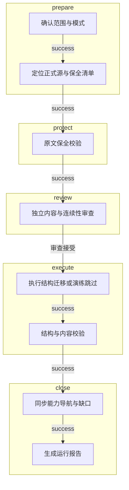
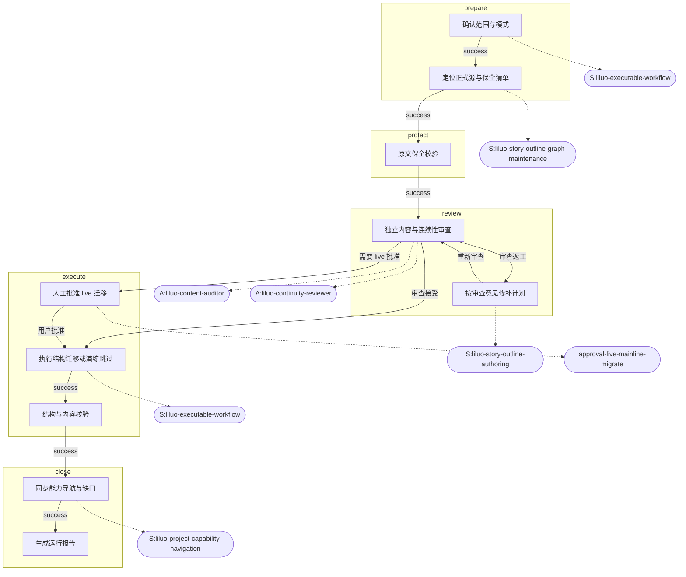

# 故事主线重构（三世界阶段容器）

> 本文件由 `project-workflows/definitions` 生成，勿手工改写后反向覆盖 JSON。工作流版本：`1.0.0`。

## 目标

在保全旧节点原文的前提下，规划并校验三世界主线阶段重构；正式迁移仅在 live 模式且用户明确批准后执行。本定义同时作为可执行工作流基建的试点。

## 适用范围

- 领域：story
- 状态：active
- 成熟度：pilot
- 维护 Skill：`liluo-executable-workflow`
- 标签：story、mainline、high-risk、pilot

## 流程概览（可视化介绍）

以下简图由工作流定义生成，是本任务的默认可视化介绍。仅在节点/边/门禁等重大修改后运行 `npm run project:workflow:generate` 重写；日常 `validate` 只检查是否过期，不频繁重生成。

## 输入 / 输出

### 输入

- **target-worlds**：要重构的世界或系列范围（如寂土挽歌 / 咒缚回响 / 星宇织梦）
- **user-approval**：是否允许 live 写入正式故事源；dry-run 默认不允许

### 输出

- **preservation-checklist**：原文保全与迁移去向清单（`src/game/data/story_outline/mainline-restructure-preservation.json`）
- **run-report**：本次运行报告（`project-workflows/runs/reports/<runId>.md`）

## 不可变约束

- `preserve-source-text`（fatal）：用户原文与已确认节点正文不得被导出快照或重构脚本改写。
- `no-silent-live-migrate`（fatal）：dry-run 不得触碰正式故事源迁移；live 迁移前必须有人工批准。
- `no-auto-git`（fatal）：不自动提交或推送 Git。

## 阶段与节点

### prepare

#### 确认范围与模式（`prepare-scope`）

- 类型：prepare｜责任：main-agent｜风险：medium
- 原因：先固定 dry-run/live 与目标世界，避免半途扩大迁移面。
- 动作：
  - 确认目标世界/系列
  - 确认 mode=dry-run 或已获 live 批准
  - 记录 inputSummary 与 flags.dryRun
- 必需资源：
  - skill:`skill-liluo-executable-workflow`（selfExecutionAllowed=true；失败=block）
- 失败策略：block

#### 定位正式源与保全清单（`locate-sources`）

- 类型：agent-task｜责任：main-agent｜风险：high
- 原因：重构只能改结构位置，必须先锚定正式源与既有保全文件。
- 动作：
  - 定位 story_outline 正式源
  - 核对 mainline-restructure-preservation.json 是否存在
  - 列出将触达的脚本与测试
- 必需资源：
  - skill:`skill-liluo-story-outline-graph-maintenance`（selfExecutionAllowed=true；失败=block）
  - doc:`src/game/data/story_outline/mainline-restructure-preservation.json`（selfExecutionAllowed=true；失败=block）
- 失败策略：block

### protect

#### 原文保全校验（`preserve-text`）

- 类型：script｜责任：script｜风险：critical
- 原因：哈希保全是重构的硬门禁，不能靠模型口头保证。
- 动作：
  - 运行原文保全相关测试或只读校验
  - 记录哈希/覆盖结果摘要
- 必需资源：
  - script:`scripts/tests/three-world-mainline-restructure-preservation.test.mjs`（selfExecutionAllowed=false；失败=block）
- 失败策略：terminate

### review

#### 独立内容与连续性审查（`independent-review`）

- 类型：review｜责任：subagent｜风险：critical
- 原因：主线重构属于高风险结构变更，必须有独立审查且结果被主流程采用。
- 动作：
  - 委派内容审计子智能体
  - 委派连续性审查子智能体
  - 主流程阅读双方结论并给出采用决定
- 必需资源：
  - agent:`agent-liluo-content-auditor`（selfExecutionAllowed=false；失败=block）
  - agent:`agent-liluo-continuity-reviewer`（selfExecutionAllowed=false；失败=block）
- 失败策略：repair → `repair-review-gaps`

#### 按审查意见修补计划（`repair-review-gaps`）

- 类型：agent-task｜责任：main-agent｜风险：high
- 原因：返工闭环，避免审查意见被忽略后强行继续。
- 动作：
  - 根据审查意见调整迁移计划
  - 必要时更新保全核对范围
  - 重新提交独立审查
- 必需资源：
  - skill:`skill-liluo-story-outline-authoring`（selfExecutionAllowed=true；失败=block）
- 失败策略：block

### execute

#### 人工批准 live 迁移（`approve-live-migrate`）

- 类型：approval｜责任：human｜风险：critical
- 原因：只有用户明确批准才能离开 dry-run 写入正式源。
- 动作：
  - 展示迁移计划与风险
  - 取得用户 approve/reject
- 必需资源：
  - approval:`approval-live-mainline-migrate`（selfExecutionAllowed=false；失败=block）
- 失败策略：terminate

#### 执行结构迁移或演练跳过（`migrate-structure`）

- 类型：script｜责任：script｜风险：critical
- 原因：正式迁移由脚本完成；dry-run 仅记录“已演练跳过写入”。
- 动作：
  - 若 flags.dryRun：记录跳过正式迁移的证据
  - 若 live 且已批准：运行主线重构脚本
- 必需资源：
  - skill:`skill-liluo-executable-workflow`（selfExecutionAllowed=true；失败=block）
- 失败策略：terminate

#### 结构与内容校验（`validate-structure`）

- 类型：gate｜责任：script｜风险：high
- 原因：确定性校验证明节点图与保全仍然成立。
- 动作：
  - 运行保全测试或等价只读校验
  - 必要时委派验证子智能体解读失败
- 必需资源：
  - script:`scripts/tests/three-world-mainline-restructure-preservation.test.mjs`（selfExecutionAllowed=false；失败=block）
- 失败策略：block

### close

#### 同步能力导航与缺口（`sync-navigation`）

- 类型：agent-task｜责任：main-agent｜风险：medium
- 原因：重构后的可执行入口与缺口状态应反映到导航层。
- 动作：
  - 按变化面更新 project-navigation
  - 确认可执行工作流投影可见
- 必需资源：
  - skill:`skill-liluo-project-capability-navigation`（selfExecutionAllowed=true；失败=block）
  - command:`command-project-navigation-check`（selfExecutionAllowed=false；失败=block）
- 失败策略：retry

#### 生成运行报告（`final-report`）

- 类型：report｜责任：system｜风险：low
- 原因：关闭流程前留下可审计报告与状态图。
- 动作：
  - 运行 finish 生成报告
  - 核对完成门禁
- 必需资源：
  - command:`command-project-workflow-report`（selfExecutionAllowed=false；失败=block）
- 失败策略：block

## 必需 Skill / 子智能体

### Skills

- `skill-liluo-executable-workflow`
- `skill-liluo-story-outline-graph-maintenance`
- `skill-liluo-story-outline-authoring`
- `skill-liluo-project-capability-navigation`

### Agents

- `agent-liluo-content-auditor`
- `agent-liluo-continuity-reviewer`

## 审批点

- approve-live-migrate:approval-live-mainline-migrate

## 分支与返工

主成功路径：
- `prepare-scope` → `locate-sources`
- `locate-sources` → `preserve-text`
- `preserve-text` → `independent-review`
- `repair-review-gaps` → `independent-review`
- `migrate-structure` → `validate-structure`
- `validate-structure` → `sync-navigation`
- `sync-navigation` → `final-report`

- `independent-review` → `migrate-structure`（condition / adoption:accepted：审查接受）
- `independent-review` → `repair-review-gaps`（rework：审查返工）
- `repair-review-gaps` → `independent-review`（success：重新审查）
- `independent-review` → `approve-live-migrate`（condition / flag:liveMigrate：需要 live 批准）
- `approve-live-migrate` → `migrate-structure`（human-decision / decision:approve：用户批准）

## 完成条件

- 必经节点完成：`prepare-scope`
- 必经节点完成：`locate-sources`
- 必经节点完成：`preserve-text`
- 必经节点完成：`independent-review`
- 必经节点完成：`migrate-structure`
- 必经节点完成：`validate-structure`
- 必经节点完成：`sync-navigation`
- 必经节点完成：`final-report`
- 不得残留 blocked/failed 节点

## 常见失败

- 必需 Skill/Agent 未调用或仅“考虑过”
- 子智能体结果未读取或未记录采用决定
- 主 Agent 替代 `selfExecutionAllowed=false` 的独立审查
- fatal 约束被错误豁免
- 跳步完成未解锁节点

## 最终产物

- 原文保全与迁移去向清单
- 本次运行报告

## 详细流程图

详图同样由定义生成，供查阅资源调用与返工边；日常介绍以文首「流程概览」为准。

- 源文件副本：同目录 `flow-simple.mmd` / `flow-detail.mmd`（勿手改后反向覆盖 JSON）
- 单次运行叠加：见运行报告内 Mermaid
- 交互大图：仅当用户明确要求「动态大图 / 交互图」时，再打开 `project-workflows/viewer/index.html`

## 工作流版本

`wf-story-mainline-restructure@1.0.0`

